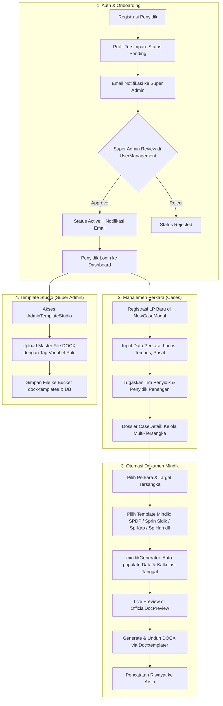

# PROJECT CONTEXT: E-MINDIK SATRESKRIM POLRES KOLAKA TIMUR

Dokumen ringkasan arsitektur resmi untuk sistem otomasi administrasi penyidikan (E-Mindik) Satreskrim Polres Kolaka Timur.

---

## 1. Tech Stack Utama

- **Frontend Core**: [[React]] 19 (`react`, `react-dom`), [[Vite]] 8 (`vite`, `@vitejs/plugin-react`)
- **Routing & State**: [[React Router]] DOM v7 (`react-router-dom`), React Hooks & Local/Supabase State Sync
- **Styling & UI**: Vanilla CSS murni (`index.css`, `App.css`, `LoginPage.css`), [[Lucide React]] Icons (`lucide-react`)
- **Quality & Linting**: [[Oxlint]] (`oxlint`, `.oxlintrc.json`)
- **Backend & Database**: [[Supabase]] (`@supabase/supabase-js`)
  - **Database**: PostgreSQL dengan Row Level Security (RLS) & Stored Procedures (RPC).
  - **Auth**: Supabase Auth (Email & Password) dengan alur persetujuan status (`pending`, `active`, `rejected`).
  - **Storage**: Bucket `docx-templates` untuk master template Microsoft Word.
- **Document Processing Engine**:
  - `docxtemplater` & `pizzip`: Engine parsing dan merge data perkara ke berkas `.docx` di sisi klien.
  - `mammoth` & `docx-preview`: Pratinjau visual template dan dokumen DOCX langsung di browser.
  - `file-saver`: Download handler berkas hasil generate.
  - `pdf-lib`: Utilitas manipulasi format PDF.
- **Cloud Storage (Cloudflare R2)**:
  - `@aws-sdk/client-s3` & `@aws-sdk/s3-request-presigner`: Integrasi S3-compatible storage untuk upload dan manajemen berkas perkara (PDF, JPG, lampiran bukti).
  - `src/lib/r2Client.js` & `src/services/r2Service.js`: Modul helper penyimpanan berkas perkara terenkripsi ke Cloudflare R2 dengan metadata lengkap dan presigned URLs.
- **AI & Computer Vision (Google Gemini AI)**:
  - `@google/genai`: SDK resmi Google Gen AI untuk fitur Smart Scan OCR berkas fisik surat pengaduan/LP.
  - `src/lib/geminiOcrService.js`: Service multimodal Vision untuk mengekstrak entitas pelapor, saksi, terlapor, dan delik perkara ke format JSON terstruktur.
- **Serverless API Endpoints** (`/api`):
  - `api/send-email.js`: Integrasi notifikasi email transaksional via [[Resend]] (`resend`).
  - `api/convert-docx-to-pdf.js`: Konversi DOCX ke PDF.
  - `api/r2-storage.js`: Operasi backend serverless storage Cloudflare R2 (presigned URL generation & file upload).

---

## 2. Modul Utama (`src`)

| Modul / Direktori | Peran & Tanggung Jawab Utama |
|---|---|
| `src/App.jsx` | Controller root aplikasi, sinkronisasi state real-time Supabase, verifikasi sesi, guard rute berdasarkan Role-Based Access Control (RBAC). |
| `src/views/LoginPage.jsx` & `PendingApprovalView.jsx` | Alur autentikasi personel, registrasi anggota baru (status `pending`), validasi akun aktif, dan redirect approval. |
| `src/views/DashboardView.jsx` | Tampilan ringkasan metrik statistik perkara, perkara aktif, jumlah personel, dan dokumen mindik terkini. |
| `src/views/CasesView.jsx` | Manajemen daftar berkas perkara (Laporan Polisi / LP), pencarian, filter status, pembukaan modal detail, serta aksi cepat generate dokumen. |
| `src/views/DocGeneratorView.jsx` | Generator mindik dinamis: pemilihan template, pemetaan otomatis variabel perkara/tersangka, live preview, dan unduh berkas DOCX resmi. |
| `src/views/ArchivesView.jsx` | Manajemen arsip dokumen mindik yang telah dibuat, histori nomor surat, preview, dan cetak ulang. |
| `src/views/PersonnelView.jsx` | Manajemen data direktori penyidik & penyidik pembantu Satreskrim (Khusus `super_admin`). |
| `src/views/AdminTemplateStudio.jsx` | Studio manajemen master template DOCX, pemetaan placeholder variabel Polri, dan sinkronisasi bucket Supabase (Khusus `super_admin`). |
| `src/components/CaseDetail.jsx` | Dossier lengkap perkara: identitas pelapor, terlapor/multi-tersangka, susunan tim penyidik penangan, riwayat rujukan administrasi surat. |
| `src/components/UserManagementModal.jsx` | Panel persetujuan (approval) anggota baru dan mutasi hak akses/role (Khusus `super_admin`). |
| `src/components/OfficialDocPreview.jsx` | Komponen visualizer kop surat dinas resmi POLRI dan layout pratinjau dokumen mindik standar kepolisian. |
| `src/services/mindikGenerator.js` | Core business logic otomasi: konversi format tanggal/waktu Indonesia, fungsi terbilang angka/tahun, ekstraksi rujukan surat, dan inject variabel DOCX. |
| `src/services/emailService.js` | Layanan pengiriman notifikasi email non-blocking (asynchronous background) saat registrasi dan aktivasi akun. |
| `src/constants/mindikPresets.js` | Definisi preset tag variabel dokumen kepolisian (Sprin Gas, Sprin Sidik, SPDP, Sp.Kap, Sp.Han, SP-Tap TSK, dsb). |
| `src/utils/templateHelper.js` | Helper klasifikasi dokumen induk perkara (*parent case*) vs dokumen perorangan tersangka (*individual suspect*). |

---

## 3. Skema Data Penting (Database PostgreSQL Supabase)

### A. `public.profiles`
Menyimpan identitas akun pengguna dan status otorisasi:
- `id` (UUID, PK relasi ke `auth.users.id`)
- `nama`, `full_name`, `pangkat`, `rank`, `nrp`, `rank_nrp`, `jabatan`, `satker`, `unit`, `phone`
- `role`: `'super_admin'` | `'admin'` | `'anggota'` | `'penyidik'`
- `status`: `'pending'` | `'active'` | `'rejected'`

### B. `public.investigators`
Direktori personel penyidik aktif Satreskrim untuk penugasan tim:
- `id` (TEXT, PK), `nama`, `pangkat`, `nrp` (UNIQUE), `jabatan`, `role`, `phone`, `status` (`'active'` | `'standby'` | `'inactive'`)

### C. `public.cases`
Berkas perkara induk / Laporan Polisi (LP):
- `id` (TEXT, PK), `no_lp` (UNIQUE), `tindak_pidana`, `pasal_uu`, `pasal`, `locus`, `tempus`
- `pelapor_name`, `terlapor_name`, `sprin_val_date`, `sprin_loc`, `sprin_date`, `status` (`'active'` | `'completed'` | `'archived'`)
- `investigators` (JSONB): Daftar anggota tim penyidik beserta penanda penyidik penangan.
- `person` (JSONB): Snapshot data terlapor/tersangka awal.
- `references` (JSONB): Nomor-nomor surat rujukan dasar penyidikan (`no_spdp`, `no_sprin_gas`, `no_sprin_sidik`, dsb).
- Kolom sinkronisasi: `penyidik_penangan_index`, `penyidik_penangan_nama`, `penyidik_penangan_nrp`, dsb.

### D. `public.case_suspects`
Entitas multi-tersangka dalam satu perkara beserta rujukan administrasi perorangan:
- `id` (UUID, PK), `case_id` (FK ke `cases.id` ON DELETE CASCADE)
- Identitas: `nama`, `nik`, `jenis_kelamin`, `tempat_lahir`, `tgl_lahir`, `umur`, `agama`, `pekerjaan`, `kewarganegaraan`, `pendidikan`, `status_pernikahan`, `alamat`, `status` (`'terlapor'` | `'tersangka'`)
- Administrasi surat: `no_sp_tap_tsk`, `no_sprin_kap`, `no_sprin_han`, `no_panjang_han_kn`, `no_sprin_han_kn`, `no_tap_han_pn_1`, `no_sprin_han_pn_1`, `no_tap_han_pn_2`, `no_sprin_han_pn_2`.

### E. `public.document_templates` & Supabase Storage
- Tabel metadata template: `id`, `title`, `code` (UNIQUE), `category`, `file_path`, `file_url`, `dynamic_fields` (JSONB).
- Storage Bucket `docx-templates`: Wadah berkas template master `.docx`.

### F. Stored Procedure (RPC)
- `public.delete_user_completely(target_user_id UUID)`: Menghapus data akun secara terpadu di `auth.users`, `public.profiles`, dan `public.investigators`.

---

## 4. Alur Kerja Utama Aplikasi (Core Workflows)

---

## 5. Batasan & Ketentuan Pengembangan (Rules of Engagement)

Sesuai [[.agentrules]]:
1. **Fokus Ruang Lingkup**: Modifikasi hanya file yang diminta secara eksplisit.
2. **Folder Terlarang**: Jangan memindai atau membaca `node_modules`, `dist`, `.git`, atau berkas biner besar.
3. **Konteks Arsitektur**: Jadikan berkas `PROJECT_CONTEXT.md` ini sebagai rujukan utama sebelum melakukan perubahan arsitektur.
4. **Efisiensi Token**: Hindari menulis ulang file penuh jika hanya merubah sebagian baris; lakukan perbaikan langsung ke sasaran fungsi/komponen.
5. **Format Catatan**: Dokumentasi baru disimpan dalam folder `docs/` menggunakan format Markdown dan tautan Obsidian `[[wikilinks]]`.
