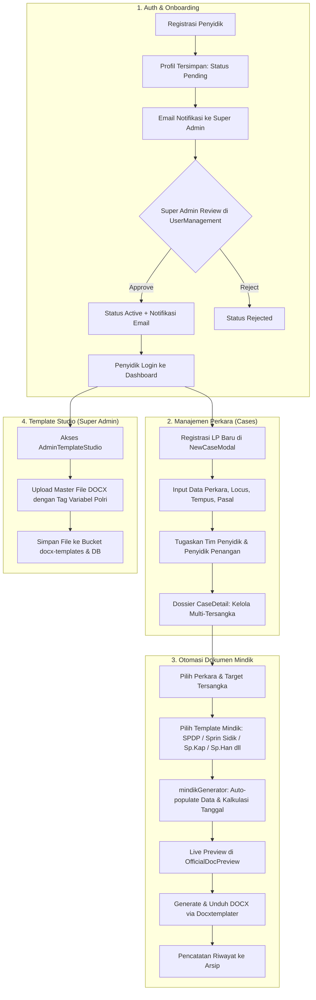

This file is a merged representation of a subset of the codebase, containing files not matching ignore patterns, combined into a single document by Repomix.

# File Summary

## Purpose
This file contains a packed representation of a subset of the repository's contents that is considered the most important context.
It is designed to be easily consumable by AI systems for analysis, code review,
or other automated processes.

## File Format
The content is organized as follows:
1. This summary section
2. Repository information
3. Directory structure
4. Repository files (if enabled)
5. Multiple file entries, each consisting of:
  a. A header with the file path (## File: path/to/file)
  b. The full contents of the file in a code block

## Usage Guidelines
- This file should be treated as read-only. Any changes should be made to the
  original repository files, not this packed version.
- When processing this file, use the file path to distinguish
  between different files in the repository.
- Be aware that this file may contain sensitive information. Handle it with
  the same level of security as you would the original repository.

## Notes
- Some files may have been excluded based on .gitignore rules and Repomix's configuration
- Binary files are not included in this packed representation. Please refer to the Repository Structure section for a complete list of file paths, including binary files
- Files matching these patterns are excluded: node_modules/**, dist/**, build/**, .git/**, package-lock.json, yarn.lock, pnpm-lock.yaml, *.lock, *.png, *.jpg, *.jpeg, *.svg, *.pdf, *.doc*, *.rar, *.zip, *.env
- Files matching patterns in .gitignore are excluded
- Files matching default ignore patterns are excluded
- Files are sorted by Git change count (files with more changes are at the bottom)

# Directory Structure
````
.obsidian/
  app.json
  appearance.json
  core-plugins.json
  graph.json
  workspace.json
api/
  convert-docx-to-pdf.js
  ocr-scan.js
  r2-presign.js
  r2-storage.js
  send-email.js
docs/
  integrasi-cloudflare-r2.md
  integrasi-gemini-vision-ocr.md
public/
  favicon.svg
  icons.svg
  logo-satreskrim-koltim.png
  logo.png
src/
  assets/
    hero.png
    LOGO TRIBRATA HITAM 2026.png
    logo-satreskrim-koltim.png
    logo.png
    react.svg
    vite.svg
  components/
    common/
      ComponentErrorBoundary.jsx
    dumas/
      sections/
        BuktiDigitalSection.jsx
        PelaporSection.jsx
        TerlaporSection.jsx
        UraianPerkaraSection.jsx
      AddEvidenceModal.jsx
      DaftarBuktiDigital.jsx
      DumasDetailView.jsx
      DumasErrorBoundary.jsx
      DumasFormView.jsx
      DumasListView.jsx
      DumasModeSelectModal.jsx
      EvidenceLightboxModal.jsx
      EvidenceQrSyncModal.jsx
      LiveMobileBridge.jsx
      ModalHandoverSpkt.jsx
      ModalQrUploadBukti.jsx
      ModalSelectPamapta.jsx
    layout/
      ExpandingSidebar.css
      ExpandingSidebar.jsx
    personnel/
      SpktPersonnelTab.jsx
    AuthAlertModal.jsx
    CaseCreateModal.jsx
    CaseDetail.jsx
    CaseDetailModal.jsx
    CaseEditModal.jsx
    CaseForm.jsx
    DocPreviewModal.jsx
    MindikGenerator.jsx
    Navbar.jsx
    NewCaseModal.jsx
    OfficialDocPreview.backup.jsx
    OfficialDocPreview.jsx
    Sidebar.jsx
    TemplateStudio.jsx
    UserManagementModal.jsx
  constants/
    crimeCategories.js
    mindikPresets.js
  data/
    mockCases.js
    mockDocuments.js
    mockPersonnel.js
    mockTemplates.js
  lib/
    geminiOcrService.js
    r2Client.js
  services/
    dumasService.js
    emailService.js
    mindikGenerator.js
    r2Service.js
  styles/
    docx-preview.css
    dumas.css
  utils/
    dumasEvidenceStore.js
    dumasPrintGenerator.js
    evidenceDocHelper.js
    mindikGenerator.js
    templateHelper.js
  views/
    mindik/
      MindikGeneratorView.jsx
      mindikPrerequisites.js
    AdminTemplateStudio.jsx
    ArchivesView.jsx
    CasesView.jsx
    DashboardView.jsx
    DocGeneratorView.jsx
    DumasFormView.jsx
    DumasView.jsx
    LoginPage.css
    LoginPage.jsx
    MobileUploadView.jsx
    PendingApprovalView.jsx
    PersonnelView.jsx
  App.css
  App.jsx
  index.css
  main.jsx
  supabaseClient.js
.agentrules
.cursorrules
.gitignore
.oxlintrc.json
index.html
package.json
PROJECT_CONTEXT.md
README.md
supabase_schema.sql
supabaseClient.js
tailwind.config.js
vercel.json
vite.config.js
````

# Files

## File: .obsidian/app.json
````json
{
  "userIgnoreFilters": [
    "node_modules/",
    ".git",
    "dist/",
    ".vscode"
  ],
  "alwaysUpdateLinks": true
}
````

## File: .obsidian/appearance.json
````json
{}
````

## File: .obsidian/core-plugins.json
````json
{
  "file-explorer": true,
  "global-search": true,
  "switcher": true,
  "graph": true,
  "backlink": true,
  "canvas": true,
  "outgoing-link": true,
  "tag-pane": true,
  "footnotes": false,
  "properties": true,
  "page-preview": true,
  "daily-notes": true,
  "templates": true,
  "note-composer": true,
  "command-palette": true,
  "slash-command": false,
  "editor-status": true,
  "bookmarks": true,
  "markdown-importer": false,
  "zk-prefixer": false,
  "random-note": false,
  "outline": true,
  "word-count": true,
  "slides": false,
  "audio-recorder": false,
  "workspaces": false,
  "file-recovery": true,
  "publish": false,
  "sync": true,
  "bases": true,
  "webviewer": false
}
````

## File: .obsidian/graph.json
````json
{
  "collapse-filter": true,
  "search": "",
  "showTags": false,
  "showAttachments": false,
  "hideUnresolved": false,
  "showOrphans": true,
  "collapse-color-groups": true,
  "colorGroups": [],
  "collapse-display": true,
  "showArrow": false,
  "textFadeMultiplier": 0,
  "nodeSizeMultiplier": 1,
  "lineSizeMultiplier": 1,
  "collapse-forces": true,
  "centerStrength": 0.518713248970312,
  "repelStrength": 10,
  "linkStrength": 1,
  "linkDistance": 250,
  "scale": 0.7514342322277558,
  "close": true
}
````

## File: .obsidian/workspace.json
````json
{
  "main": {
    "id": "59b8b683b8385941",
    "type": "split",
    "children": [
      {
        "id": "abe88b1a49eb23c9",
        "type": "tabs",
        "children": [
          {
            "id": "9d7480c4f9811efd",
            "type": "leaf",
            "state": {
              "type": "markdown",
              "state": {
                "file": "PROJECT_CONTEXT.md",
                "mode": "source",
                "source": false
              },
              "icon": "lucide-file",
              "title": "PROJECT_CONTEXT"
            }
          }
        ]
      }
    ],
    "direction": "vertical"
  },
  "left": {
    "id": "72d38754f6078887",
    "type": "split",
    "children": [
      {
        "id": "46971dbb3864f238",
        "type": "tabs",
        "children": [
          {
            "id": "9b63be7bdc60b2d5",
            "type": "leaf",
            "state": {
              "type": "file-explorer",
              "state": {
                "sortOrder": "alphabetical",
                "autoReveal": false,
                "showSearch": false,
                "searchQuery": ""
              },
              "icon": "lucide-folder-closed",
              "title": "Penjelajah berkas"
            }
          },
          {
            "id": "958d7a3938337fc3",
            "type": "leaf",
            "state": {
              "type": "search",
              "state": {
                "query": "",
                "matchingCase": false,
                "explainSearch": false,
                "collapseAll": false,
                "extraContext": false,
                "sortOrder": "alphabetical"
              },
              "icon": "lucide-search",
              "title": "Penelusuran"
            }
          },
          {
            "id": "166cfe12afcb4254",
            "type": "leaf",
            "state": {
              "type": "bookmarks",
              "state": {
                "showSearch": false,
                "searchQuery": ""
              },
              "icon": "lucide-bookmark",
              "title": "Penanda"
            }
          }
        ]
      }
    ],
    "direction": "horizontal",
    "width": 300
  },
  "right": {
    "id": "9779e97405da6b44",
    "type": "split",
    "children": [
      {
        "id": "38cd93159f02f8d6",
        "type": "tabs",
        "children": [
          {
            "id": "9bc2d9d8dde8f3c2",
            "type": "leaf",
            "state": {
              "type": "backlink",
              "state": {
                "collapseAll": false,
                "extraContext": false,
                "sortOrder": "alphabetical",
                "showSearch": false,
                "searchQuery": "",
                "backlinkCollapsed": false,
                "unlinkedCollapsed": true
              },
              "icon": "links-coming-in",
              "title": "Backlink"
            }
          },
          {
            "id": "bfd1601353d68c4a",
            "type": "leaf",
            "state": {
              "type": "outgoing-link",
              "state": {
                "linksCollapsed": false,
                "unlinkedCollapsed": true
              },
              "icon": "links-going-out",
              "title": "Tautan Keluar"
            }
          },
          {
            "id": "f32b3affed1e7754",
            "type": "leaf",
            "state": {
              "type": "tag",
              "state": {
                "sortOrder": "frequency",
                "useHierarchy": true,
                "showSearch": false,
                "searchQuery": ""
              },
              "icon": "lucide-tags",
              "title": "Tag"
            }
          },
          {
            "id": "0681da836f4deefb",
            "type": "leaf",
            "state": {
              "type": "all-properties",
              "state": {
                "sortOrder": "frequency",
                "showSearch": false,
                "searchQuery": ""
              },
              "icon": "lucide-archive",
              "title": "Semua properti"
            }
          },
          {
            "id": "aa0d52c2ccc6f0e2",
            "type": "leaf",
            "state": {
              "type": "outline",
              "state": {
                "followCursor": false,
                "showSearch": false,
                "searchQuery": ""
              },
              "icon": "lucide-list",
              "title": "Kerangka"
            }
          }
        ]
      }
    ],
    "direction": "horizontal",
    "width": 300,
    "collapsed": true
  },
  "left-ribbon": {
    "hiddenItems": {
      "switcher:Buka peralih cepat": false,
      "graph:Buka tampilan grafik": false,
      "canvas:Buat kanvas baru": false,
      "daily-notes:Buka catatan hari ini": false,
      "templates:Masukkan template": false,
      "command-palette:Buka palet perintah": false,
      "bases:Buat basis baru": false
    }
  },
  "active": "9d7480c4f9811efd",
  "lastOpenFiles": [
    "PROJECT_CONTEXT.md"
  ]
}
````

## File: api/send-email.js
````javascript
import { Resend } from 'resend';

/**
 * Serverless / Dev API Handler for sending automated Resend emails
 * Official Police Theme (Kop Surat Kedinasan Satreskrim Polres Kolaka Timur)
 */
export default async function handler(req, res) {
  // Allow POST requests only
  if (req.method !== 'POST') {
    res.status(405).json({ error: 'Method Not Allowed. Use POST.' });
    return;
  }

  const RESEND_API_KEY = process.env.RESEND_API_KEY || process.env.VITE_RESEND_API_KEY;
  const SUPERADMIN_EMAIL = process.env.SUPERADMIN_EMAIL || process.env.VITE_SUPERADMIN_EMAIL || 'abdiansyahdanial@gmail.com';
  const EMAIL_FROM = process.env.EMAIL_FROM || process.env.VITE_EMAIL_FROM || 'onboarding@resend.dev';

  if (!RESEND_API_KEY) {
    console.warn('[send-email] RESEND_API_KEY is not defined in environment variables.');
    res.status(500).json({ error: 'RESEND_API_KEY is not defined in environment variables.' });
    return;
  }

  let resend;
  try {
    resend = new Resend(RESEND_API_KEY);
  } catch (err) {
    console.error('[send-email] Resend constructor error:', err);
    res.status(500).json({ error: err.message });
    return;
  }

  try {
    let body = req.body;
    if (typeof body === 'string') {
      try {
        body = JSON.parse(body);
      } catch {
        body = {};
      }
    }

    const { type, officer } = body || {};

    if (!officer) {
      res.status(400).json({ error: 'Missing officer data in request body' });
      return;
    }

    const {
      nama = 'Personel Penyidik',
      pangkat = '-',
      nrp = '-',
      jabatan = '-',
      satker = 'Satreskrim Polres Kolaka Timur',
      unit = '-',
      phone = '-',
      email = '-',
    } = officer;

    const waktuWita = new Date().toLocaleString('id-ID', { timeZone: 'Asia/Makassar' }) + ' WITA';

    // Helper: Kop Surat Dinas Resmi
    const kopHeaderHtml = `
      <div style="text-align: center; border-bottom: 2px solid #00D4FF; padding-bottom: 16px; margin-bottom: 20px;">
        <div style="font-size: 11px; font-weight: 700; letter-spacing: 1.5px; color: #94A3B8; text-transform: uppercase; line-height: 1.5;">
          KEPOLISIAN NEGARA REPUBLIK INDONESIA<br/>
          DAERAH SULAWESI TENGGARA<br/>
          RESOR KOLAKA TIMUR
        </div>
        <div style="font-size: 10px; color: #64748B; margin-top: 4px;">
          Jl. Poros Kolaka - Kendari, Tirawuta, Kab. Kolaka Timur, Sulawesi Tenggara
        </div>
        <div style="margin-top: 10px; height: 1px; background: rgba(0, 212, 255, 0.3);"></div>
        <div style="margin-top: 2px; height: 2px; background: #00D4FF;"></div>
      </div>
    `;

    // 1. Tipe: Pendaftaran Akun Baru (Kirim ke Penyidik & Super Admin)
    if (type === 'NEW_REGISTRATION' || type === 'REGISTRATION_OFFICER') {
      const results = [];

      // Email a: Pemberitahuan ke Penyidik yang Mendaftar
      if (email && email.includes('@')) {
        const subjectOfficer = `[PEMBERITAHUAN] Pendaftaran Akun e-Mindik Satreskrim Diterima`;
        const htmlOfficer = `
          <!DOCTYPE html>
          <html>
          <head>
            <meta charset="utf-8">
            <style>
              body { font-family: 'Segoe UI', Arial, sans-serif; background-color: #060B18; color: #E2E8F0; margin: 0; padding: 24px; }
              .container { max-width: 600px; margin: 0 auto; background: #0D1526; border: 1px solid #1E293B; border-radius: 12px; overflow: hidden; box-shadow: 0 10px 30px rgba(0,0,0,0.6); }
              .content { padding: 28px 24px; }
              .card-info { background: rgba(0, 212, 255, 0.08); border: 1px solid rgba(0, 212, 255, 0.3); padding: 16px; border-radius: 8px; margin-bottom: 20px; }
              table { width: 100%; border-collapse: collapse; margin-top: 10px; font-size: 13px; }
              td { padding: 9px 12px; border-bottom: 1px solid #1E293B; }
              td.label { color: #94A3B8; width: 38%; font-weight: 600; }
              td.value { color: #F8FAFC; font-weight: 500; }
              .footer { padding: 18px 24px; background: #080E1D; border-top: 1px solid #1E293B; text-align: center; font-size: 11px; color: #64748B; line-height: 1.5; }
            </style>
          </head>
          <body>
            <div class="container">
              <div class="content">
                ${kopHeaderHtml}
                <div style="text-align: center; margin-bottom: 20px;">
                  <h2 style="color: #00D4FF; font-size: 18px; margin: 0 0 6px; letter-spacing: 0.5px; text-transform: uppercase;">
                    Pendaftaran Akun Berhasil Diterima
                  </h2>
                  <div style="display: inline-block; background: rgba(245, 158, 11, 0.15); color: #FCD34D; border: 1px solid #F59E0B; padding: 3px 12px; border-radius: 20px; font-size: 11px; font-weight: bold;">
                    STATUS: MENUNGGU VERIFIKASI ADMIN
                  </div>
                </div>

                <p style="font-size: 13px; line-height: 1.6; color: #CBD5E1;">
                  Yth. <strong>${pangkat} ${nama}</strong>,<br/>
                  Pendaftaran akun dinas Anda pada sistem administrasi penyidikan <strong>e-Mindik Satreskrim Polres Kolaka Timur</strong> telah berhasil dicatat. Saat ini berkas registrasi Anda sedang dalam antrean peninjauan kedinasan oleh Super Admin / Kasat Reskrim.
                </p>

                <div class="card-info">
                  <strong style="color: #00D4FF; font-size: 12px; text-transform: uppercase; letter-spacing: 0.5px;">Rincian Identitas Terdaftar:</strong>
                  <table>
                    <tr>
                      <td class="label">Nama Lengkap</td>
                      <td class="value">${pangkat} ${nama}</td>
                    </tr>
                    <tr>
                      <td class="label">NRP</td>
                      <td class="value" style="font-family: monospace; color: #00D4FF;">${nrp}</td>
                    </tr>
                    <tr>
                      <td class="label">Jabatan Dinas</td>
                      <td class="value">${jabatan}</td>
                    </tr>
                    <tr>
                      <td class="label">Unit Kerja</td>
                      <td class="value">${unit || 'Satreskrim'}</td>
                    </tr>
                    <tr>
                      <td class="label">Satuan Kerja</td>
                      <td class="value">${satker}</td>
                    </tr>
                    <tr>
                      <td class="label">Email Terdaftar</td>
                      <td class="value">${email}</td>
                    </tr>
                    <tr>
                      <td class="label">Waktu Pendaftaran</td>
                      <td class="value">${waktuWita}</td>
                    </tr>
                  </table>
                </div>

                <p style="font-size: 12px; line-height: 1.6; color: #94A3B8;">
                  Setelah permohonan disetujui, Anda akan menerima email notifikasi resmi bahwa akun telah aktif dan siap digunakan untuk manajemen perkara dan pencetakan dokumen mindik presisi.
                </p>
              </div>
              <div class="footer">
                Sistem Informasi Manajemen Administrasi Penyidikan Elektronik (e-Mindik)<br/>
                Satuan Reserse Kriminal Kepolisian Resor Kolaka Timur
              </div>
            </div>
          </body>
          </html>
        `;

        try {
          const resOfficer = await resend.emails.send({
            from: `Satreskrim Polres Koltim <${EMAIL_FROM}>`,
            to: [email],
            subject: subjectOfficer,
            html: htmlOfficer
          });
          results.push({ target: 'officer', res: resOfficer });
        } catch (e1) {
          console.warn('[send-email] Warning sending to officer:', e1.message);
        }
      }

      // Email b: Notifikasi ke Super Admin
      if (SUPERADMIN_EMAIL) {
        const subjectAdmin = `[VERIFIKASI AKUN] Pendaftaran Penyidik Baru - ${pangkat} ${nama}`;
        const htmlAdmin = `
          <!DOCTYPE html>
          <html>
          <head>
            <meta charset="utf-8">
            <style>
              body { font-family: 'Segoe UI', Arial, sans-serif; background-color: #060B18; color: #E2E8F0; margin: 0; padding: 24px; }
              .container { max-width: 600px; margin: 0 auto; background: #0D1526; border: 1px solid #1E293B; border-radius: 12px; overflow: hidden; box-shadow: 0 10px 30px rgba(0,0,0,0.6); }
              .content { padding: 28px 24px; }
              .alert-box { background: rgba(245, 158, 11, 0.12); border-left: 4px solid #F59E0B; padding: 12px 16px; border-radius: 4px; margin-bottom: 20px; color: #FCD34D; font-size: 13px; }
              table { width: 100%; border-collapse: collapse; margin-top: 10px; font-size: 13px; }
              td { padding: 9px 12px; border-bottom: 1px solid #1E293B; }
              td.label { color: #94A3B8; width: 38%; font-weight: 600; }
              td.value { color: #F8FAFC; font-weight: 500; }
              .footer { padding: 18px 24px; background: #080E1D; border-top: 1px solid #1E293B; text-align: center; font-size: 11px; color: #64748B; }
            </style>
          </head>
          <body>
            <div class="container">
              <div class="content">
                ${kopHeaderHtml}
                <div class="alert-box">
                  <strong>Pemberitahuan Super Admin:</strong> Terdapat personel baru yang mendaftar dan menunggu verifikasi kedinasan Anda.
                </div>
                <table>
                  <tr>
                    <td class="label">Nama Personel</td>
                    <td class="value"><strong>${nama}</strong></td>
                  </tr>
                  <tr>
                    <td class="label">Pangkat</td>
                    <td class="value">${pangkat}</td>
                  </tr>
                  <tr>
                    <td class="label">NRP</td>
                    <td class="value" style="font-family: monospace; color: #00D4FF;">${nrp}</td>
                  </tr>
                  <tr>
                    <td class="label">Jabatan</td>
                    <td class="value">${jabatan}</td>
                  </tr>
                  <tr>
                    <td class="label">Unit Kerja</td>
                    <td class="value">${unit || 'Satreskrim'}</td>
                  </tr>
                  <tr>
                    <td class="label">Satuan Kerja</td>
                    <td class="value">${satker}</td>
                  </tr>
                  <tr>
                    <td class="label">No. Handphone / WA</td>
                    <td class="value">${phone}</td>
                  </tr>
                  <tr>
                    <td class="label">Email</td>
                    <td class="value">${email}</td>
                  </tr>
                  <tr>
                    <td class="label">Waktu Registrasi</td>
                    <td class="value">${waktuWita}</td>
                  </tr>
                </table>
                <div style="text-align: center; margin-top: 24px;">
                  <p style="font-size: 12px; color: #94A3B8;">Buka portal e-Mindik dan buka modal <strong>Manajemen Akun (RBAC)</strong> untuk menyetujui akun ini.</p>
                </div>
              </div>
              <div class="footer">
                Sistem Informasi Manajemen Administrasi Penyidikan Elektronik (e-Mindik)<br/>
                Satuan Reserse Kriminal Kepolisian Resor Kolaka Timur
              </div>
            </div>
          </body>
          </html>
        `;

        try {
          const resAdmin = await resend.emails.send({
            from: `Satreskrim Polres Koltim <${EMAIL_FROM}>`,
            to: [SUPERADMIN_EMAIL],
            subject: subjectAdmin,
            html: htmlAdmin
          });
          results.push({ target: 'admin', res: resAdmin });
        } catch (e2) {
          console.warn('[send-email] Warning sending to superadmin:', e2.message);
        }
      }

      res.status(200).json({ success: true, results, message: 'Registration emails processed' });
      return;

    // 2. Tipe: Akun Telah Disetujui Super Admin
    } else if (type === 'ACCOUNT_APPROVED') {
      const subjectApproved = `[AKTIVASI AKUN] Akun e-Mindik Anda Telah Diaktifkan - Satreskrim Polres Kolaka Timur`;
      const htmlApproved = `
        <!DOCTYPE html>
        <html>
        <head>
          <meta charset="utf-8">
          <style>
            body { font-family: 'Segoe UI', Arial, sans-serif; background-color: #060B18; color: #E2E8F0; margin: 0; padding: 24px; }
            .container { max-width: 600px; margin: 0 auto; background: #0D1526; border: 1px solid #1E293B; border-radius: 12px; overflow: hidden; box-shadow: 0 10px 30px rgba(0,0,0,0.6); }
            .content { padding: 28px 24px; }
            .success-card { background: rgba(34, 197, 94, 0.1); border: 1px solid #22C55E; padding: 18px; border-radius: 10px; margin-bottom: 20px; text-align: center; }
            .success-card h2 { margin: 0 0 6px; font-size: 18px; color: #4ADE80; text-transform: uppercase; letter-spacing: 0.5px; }
            .success-card p { margin: 0; font-size: 13px; color: #CBD5E1; }
            table { width: 100%; border-collapse: collapse; margin-top: 14px; font-size: 13px; }
            td { padding: 9px 12px; border-bottom: 1px solid #1E293B; }
            td.label { color: #94A3B8; width: 38%; font-weight: 600; }
            td.value { color: #F8FAFC; font-weight: 500; }
            .btn { display: inline-block; background: linear-gradient(135deg, #00D4FF 0%, #0096FF 100%); color: #030712; font-weight: 800; text-decoration: none; padding: 12px 28px; border-radius: 8px; font-size: 13px; margin-top: 24px; letter-spacing: 0.5px; box-shadow: 0 4px 15px rgba(0, 212, 255, 0.35); }
            .footer { padding: 18px 24px; background: #080E1D; border-top: 1px solid #1E293B; text-align: center; font-size: 11px; color: #64748B; line-height: 1.5; }
          </style>
        </head>
        <body>
          <div class="container">
            <div class="content">
              ${kopHeaderHtml}
              <div class="success-card">
                <h2>Selamat, Akun Dinas Anda Telah Aktif!</h2>
                <p>Verifikasi identitas kedinasan Anda telah disetujui secara resmi oleh Super Admin.</p>
              </div>

              <p style="font-size: 13px; line-height: 1.6; color: #CBD5E1;">
                Yth. <strong>${pangkat} ${nama}</strong> (NRP: ${nrp}),<br/>
                Kini Anda telah memiliki wewenang penuh untuk masuk ke dalam sistem <strong>e-Mindik Satreskrim Polres Kolaka Timur</strong>. Anda dapat mulai mengelola berkas perkara pidana, menyusun administrasi penyidikan standar, dan mencetak dokumen presisi.
              </p>

              <table>
                <tr>
                  <td class="label">Nama Personel</td>
                  <td class="value">${pangkat} ${nama}</td>
                </tr>
                <tr>
                  <td class="label">NRP</td>
                  <td class="value" style="font-family: monospace; color: #00D4FF;">${nrp}</td>
                </tr>
                <tr>
                  <td class="label">Jabatan Dinas</td>
                  <td class="value">${jabatan}</td>
                </tr>
                <tr>
                  <td class="label">Unit Kerja</td>
                  <td class="value">${unit || 'Satreskrim'}</td>
                </tr>
                <tr>
                  <td class="label">Satuan Kerja</td>
                  <td class="value">${satker}</td>
                </tr>
                <tr>
                  <td class="label">Email Login</td>
                  <td class="value">${email}</td>
                </tr>
                <tr>
                  <td class="label">Status Akun</td>
                  <td class="value" style="color: #4ADE80; font-weight: 700;">AKTIF / TERVERIFIKASI</td>
                </tr>
              </table>

              <div style="text-align: center;">
                <p style="font-size: 12px; color: #94A3B8; margin-top: 20px;">
                  Silakan masuk menggunakan email dan kata sandi yang telah Anda daftarkan.
                </p>
              </div>
            </div>
            <div class="footer">
              Sistem Informasi Manajemen Administrasi Penyidikan Elektronik (e-Mindik)<br/>
              Satuan Reserse Kriminal Kepolisian Resor Kolaka Timur
            </div>
          </div>
        </body>
        </html>
      `;

      const data = await resend.emails.send({
        from: `Satreskrim Polres Koltim <${EMAIL_FROM}>`,
        to: [email],
        subject: subjectApproved,
        html: htmlApproved
      });

      res.status(200).json({ success: true, data, message: 'Activation email sent to officer' });
      return;
    } else {
      res.status(400).json({ error: 'Unknown email notification type' });
      return;
    }
  } catch (err) {
    console.error('[send-email] Error handling email dispatch:', err);
    res.status(500).json({ error: err.message || 'Failed to dispatch email' });
  }
}
````

## File: public/favicon.svg
````xml
<svg xmlns="http://www.w3.org/2000/svg" width="48" height="46" fill="none" viewBox="0 0 48 46"><path fill="#863bff" d="M25.946 44.938c-.664.845-2.021.375-2.021-.698V33.937a2.26 2.26 0 0 0-2.262-2.262H10.287c-.92 0-1.456-1.04-.92-1.788l7.48-10.471c1.07-1.497 0-3.578-1.842-3.578H1.237c-.92 0-1.456-1.04-.92-1.788L10.013.474c.214-.297.556-.474.92-.474h28.894c.92 0 1.456 1.04.92 1.788l-7.48 10.471c-1.07 1.498 0 3.579 1.842 3.579h11.377c.943 0 1.473 1.088.89 1.83L25.947 44.94z" style="fill:#863bff;fill:color(display-p3 .5252 .23 1);fill-opacity:1"/><mask id="a" width="48" height="46" x="0" y="0" maskUnits="userSpaceOnUse" style="mask-type:alpha"><path fill="#000" d="M25.842 44.938c-.664.844-2.021.375-2.021-.698V33.937a2.26 2.26 0 0 0-2.262-2.262H10.183c-.92 0-1.456-1.04-.92-1.788l7.48-10.471c1.07-1.498 0-3.579-1.842-3.579H1.133c-.92 0-1.456-1.04-.92-1.787L9.91.473c.214-.297.556-.474.92-.474h28.894c.92 0 1.456 1.04.92 1.788l-7.48 10.471c-1.07 1.498 0 3.578 1.842 3.578h11.377c.943 0 1.473 1.088.89 1.832L25.843 44.94z" style="fill:#000;fill-opacity:1"/></mask><g mask="url(#a)"><g filter="url(#b)"><ellipse cx="5.508" cy="14.704" fill="#ede6ff" rx="5.508" ry="14.704" style="fill:#ede6ff;fill:color(display-p3 .9275 .9033 1);fill-opacity:1" transform="matrix(.00324 1 1 -.00324 -4.47 31.516)"/></g><g filter="url(#c)"><ellipse cx="10.399" cy="29.851" fill="#ede6ff" rx="10.399" ry="29.851" style="fill:#ede6ff;fill:color(display-p3 .9275 .9033 1);fill-opacity:1" transform="matrix(.00324 1 1 -.00324 -39.328 7.883)"/></g><g filter="url(#d)"><ellipse cx="5.508" cy="30.487" fill="#7e14ff" rx="5.508" ry="30.487" style="fill:#7e14ff;fill:color(display-p3 .4922 .0767 1);fill-opacity:1" transform="rotate(89.814 -25.913 -14.639)scale(1 -1)"/></g><g filter="url(#e)"><ellipse cx="5.508" cy="30.599" fill="#7e14ff" rx="5.508" ry="30.599" style="fill:#7e14ff;fill:color(display-p3 .4922 .0767 1);fill-opacity:1" transform="rotate(89.814 -32.644 -3.334)scale(1 -1)"/></g><g filter="url(#f)"><ellipse cx="5.508" cy="30.599" fill="#7e14ff" rx="5.508" ry="30.599" style="fill:#7e14ff;fill:color(display-p3 .4922 .0767 1);fill-opacity:1" transform="matrix(.00324 1 1 -.00324 -34.34 30.47)"/></g><g filter="url(#g)"><ellipse cx="14.072" cy="22.078" fill="#ede6ff" rx="14.072" ry="22.078" style="fill:#ede6ff;fill:color(display-p3 .9275 .9033 1);fill-opacity:1" transform="rotate(93.35 24.506 48.493)scale(-1 1)"/></g><g filter="url(#h)"><ellipse cx="3.47" cy="21.501" fill="#7e14ff" rx="3.47" ry="21.501" style="fill:#7e14ff;fill:color(display-p3 .4922 .0767 1);fill-opacity:1" transform="rotate(89.009 28.708 47.59)scale(-1 1)"/></g><g filter="url(#i)"><ellipse cx="3.47" cy="21.501" fill="#7e14ff" rx="3.47" ry="21.501" style="fill:#7e14ff;fill:color(display-p3 .4922 .0767 1);fill-opacity:1" transform="rotate(89.009 28.708 47.59)scale(-1 1)"/></g><g filter="url(#j)"><ellipse cx=".387" cy="8.972" fill="#7e14ff" rx="4.407" ry="29.108" style="fill:#7e14ff;fill:color(display-p3 .4922 .0767 1);fill-opacity:1" transform="rotate(39.51 .387 8.972)"/></g><g filter="url(#k)"><ellipse cx="47.523" cy="-6.092" fill="#7e14ff" rx="4.407" ry="29.108" style="fill:#7e14ff;fill:color(display-p3 .4922 .0767 1);fill-opacity:1" transform="rotate(37.892 47.523 -6.092)"/></g><g filter="url(#l)"><ellipse cx="41.412" cy="6.333" fill="#47bfff" rx="5.971" ry="9.665" style="fill:#47bfff;fill:color(display-p3 .2799 .748 1);fill-opacity:1" transform="rotate(37.892 41.412 6.333)"/></g><g filter="url(#m)"><ellipse cx="-1.879" cy="38.332" fill="#7e14ff" rx="4.407" ry="29.108" style="fill:#7e14ff;fill:color(display-p3 .4922 .0767 1);fill-opacity:1" transform="rotate(37.892 -1.88 38.332)"/></g><g filter="url(#n)"><ellipse cx="-1.879" cy="38.332" fill="#7e14ff" rx="4.407" ry="29.108" style="fill:#7e14ff;fill:color(display-p3 .4922 .0767 1);fill-opacity:1" transform="rotate(37.892 -1.88 38.332)"/></g><g filter="url(#o)"><ellipse cx="35.651" cy="29.907" fill="#7e14ff" rx="4.407" ry="29.108" style="fill:#7e14ff;fill:color(display-p3 .4922 .0767 1);fill-opacity:1" transform="rotate(37.892 35.651 29.907)"/></g><g filter="url(#p)"><ellipse cx="38.418" cy="32.4" fill="#47bfff" rx="5.971" ry="15.297" style="fill:#47bfff;fill:color(display-p3 .2799 .748 1);fill-opacity:1" transform="rotate(37.892 38.418 32.4)"/></g></g><defs><filter id="b" width="60.045" height="41.654" x="-19.77" y="16.149" color-interpolation-filters="sRGB" filterUnits="userSpaceOnUse"><feFlood flood-opacity="0" result="BackgroundImageFix"/><feBlend in="SourceGraphic" in2="BackgroundImageFix" result="shape"/><feGaussianBlur result="effect1_foregroundBlur_2002_17158" stdDeviation="7.659"/></filter><filter id="c" width="90.34" height="51.437" x="-54.613" y="-7.533" color-interpolation-filters="sRGB" filterUnits="userSpaceOnUse"><feFlood flood-opacity="0" result="BackgroundImageFix"/><feBlend in="SourceGraphic" in2="BackgroundImageFix" result="shape"/><feGaussianBlur result="effect1_foregroundBlur_2002_17158" stdDeviation="7.659"/></filter><filter id="d" width="79.355" height="29.4" x="-49.64" y="2.03" color-interpolation-filters="sRGB" filterUnits="userSpaceOnUse"><feFlood flood-opacity="0" result="BackgroundImageFix"/><feBlend in="SourceGraphic" in2="BackgroundImageFix" result="shape"/><feGaussianBlur result="effect1_foregroundBlur_2002_17158" stdDeviation="4.596"/></filter><filter id="e" width="79.579" height="29.4" x="-45.045" y="20.029" color-interpolation-filters="sRGB" filterUnits="userSpaceOnUse"><feFlood flood-opacity="0" result="BackgroundImageFix"/><feBlend in="SourceGraphic" in2="BackgroundImageFix" result="shape"/><feGaussianBlur result="effect1_foregroundBlur_2002_17158" stdDeviation="4.596"/></filter><filter id="f" width="79.579" height="29.4" x="-43.513" y="21.178" color-interpolation-filters="sRGB" filterUnits="userSpaceOnUse"><feFlood flood-opacity="0" result="BackgroundImageFix"/><feBlend in="SourceGraphic" in2="BackgroundImageFix" result="shape"/><feGaussianBlur result="effect1_foregroundBlur_2002_17158" stdDeviation="4.596"/></filter><filter id="g" width="74.749" height="58.852" x="15.756" y="-17.901" color-interpolation-filters="sRGB" filterUnits="userSpaceOnUse"><feFlood flood-opacity="0" result="BackgroundImageFix"/><feBlend in="SourceGraphic" in2="BackgroundImageFix" result="shape"/><feGaussianBlur result="effect1_foregroundBlur_2002_17158" stdDeviation="7.659"/></filter><filter id="h" width="61.377" height="25.362" x="23.548" y="2.284" color-interpolation-filters="sRGB" filterUnits="userSpaceOnUse"><feFlood flood-opacity="0" result="BackgroundImageFix"/><feBlend in="SourceGraphic" in2="BackgroundImageFix" result="shape"/><feGaussianBlur result="effect1_foregroundBlur_2002_17158" stdDeviation="4.596"/></filter><filter id="i" width="61.377" height="25.362" x="23.548" y="2.284" color-interpolation-filters="sRGB" filterUnits="userSpaceOnUse"><feFlood flood-opacity="0" result="BackgroundImageFix"/><feBlend in="SourceGraphic" in2="BackgroundImageFix" result="shape"/><feGaussianBlur result="effect1_foregroundBlur_2002_17158" stdDeviation="4.596"/></filter><filter id="j" width="56.045" height="63.649" x="-27.636" y="-22.853" color-interpolation-filters="sRGB" filterUnits="userSpaceOnUse"><feFlood flood-opacity="0" result="BackgroundImageFix"/><feBlend in="SourceGraphic" in2="BackgroundImageFix" result="shape"/><feGaussianBlur result="effect1_foregroundBlur_2002_17158" stdDeviation="4.596"/></filter><filter id="k" width="54.814" height="64.646" x="20.116" y="-38.415" color-interpolation-filters="sRGB" filterUnits="userSpaceOnUse"><feFlood flood-opacity="0" result="BackgroundImageFix"/><feBlend in="SourceGraphic" in2="BackgroundImageFix" result="shape"/><feGaussianBlur result="effect1_foregroundBlur_2002_17158" stdDeviation="4.596"/></filter><filter id="l" width="33.541" height="35.313" x="24.641" y="-11.323" color-interpolation-filters="sRGB" filterUnits="userSpaceOnUse"><feFlood flood-opacity="0" result="BackgroundImageFix"/><feBlend in="SourceGraphic" in2="BackgroundImageFix" result="shape"/><feGaussianBlur result="effect1_foregroundBlur_2002_17158" stdDeviation="4.596"/></filter><filter id="m" width="54.814" height="64.646" x="-29.286" y="6.009" color-interpolation-filters="sRGB" filterUnits="userSpaceOnUse"><feFlood flood-opacity="0" result="BackgroundImageFix"/><feBlend in="SourceGraphic" in2="BackgroundImageFix" result="shape"/><feGaussianBlur result="effect1_foregroundBlur_2002_17158" stdDeviation="4.596"/></filter><filter id="n" width="54.814" height="64.646" x="-29.286" y="6.009" color-interpolation-filters="sRGB" filterUnits="userSpaceOnUse"><feFlood flood-opacity="0" result="BackgroundImageFix"/><feBlend in="SourceGraphic" in2="BackgroundImageFix" result="shape"/><feGaussianBlur result="effect1_foregroundBlur_2002_17158" stdDeviation="4.596"/></filter><filter id="o" width="54.814" height="64.646" x="8.244" y="-2.416" color-interpolation-filters="sRGB" filterUnits="userSpaceOnUse"><feFlood flood-opacity="0" result="BackgroundImageFix"/><feBlend in="SourceGraphic" in2="BackgroundImageFix" result="shape"/><feGaussianBlur result="effect1_foregroundBlur_2002_17158" stdDeviation="4.596"/></filter><filter id="p" width="39.409" height="43.623" x="18.713" y="10.588" color-interpolation-filters="sRGB" filterUnits="userSpaceOnUse"><feFlood flood-opacity="0" result="BackgroundImageFix"/><feBlend in="SourceGraphic" in2="BackgroundImageFix" result="shape"/><feGaussianBlur result="effect1_foregroundBlur_2002_17158" stdDeviation="4.596"/></filter></defs></svg>
````

## File: public/icons.svg
````xml
<svg xmlns="http://www.w3.org/2000/svg">
  <symbol id="bluesky-icon" viewBox="0 0 16 17">
    <g clip-path="url(#bluesky-clip)"><path fill="#08060d" d="M7.75 7.735c-.693-1.348-2.58-3.86-4.334-5.097-1.68-1.187-2.32-.981-2.74-.79C.188 2.065.1 2.812.1 3.251s.241 3.602.398 4.13c.52 1.744 2.367 2.333 4.07 2.145-2.495.37-4.71 1.278-1.805 4.512 3.196 3.309 4.38-.71 4.987-2.746.608 2.036 1.307 5.91 4.93 2.746 2.72-2.746.747-4.143-1.747-4.512 1.702.189 3.55-.4 4.07-2.145.156-.528.397-3.691.397-4.13s-.088-1.186-.575-1.406c-.42-.19-1.06-.395-2.741.79-1.755 1.24-3.64 3.752-4.334 5.099"/></g>
    <defs><clipPath id="bluesky-clip"><path fill="#fff" d="M.1.85h15.3v15.3H.1z"/></clipPath></defs>
  </symbol>
  <symbol id="discord-icon" viewBox="0 0 20 19">
    <path fill="#08060d" d="M16.224 3.768a14.5 14.5 0 0 0-3.67-1.153c-.158.286-.343.67-.47.976a13.5 13.5 0 0 0-4.067 0c-.128-.306-.317-.69-.476-.976A14.4 14.4 0 0 0 3.868 3.77C1.546 7.28.916 10.703 1.231 14.077a14.7 14.7 0 0 0 4.5 2.306q.545-.748.965-1.587a9.5 9.5 0 0 1-1.518-.74q.191-.14.372-.293c2.927 1.369 6.107 1.369 8.999 0q.183.152.372.294-.723.437-1.52.74.418.838.963 1.588a14.6 14.6 0 0 0 4.504-2.308c.37-3.911-.63-7.302-2.644-10.309m-9.13 8.234c-.878 0-1.599-.82-1.599-1.82 0-.998.705-1.82 1.6-1.82.894 0 1.614.82 1.599 1.82.001 1-.705 1.82-1.6 1.82m5.91 0c-.878 0-1.599-.82-1.599-1.82 0-.998.705-1.82 1.6-1.82.893 0 1.614.82 1.599 1.82 0 1-.706 1.82-1.6 1.82"/>
  </symbol>
  <symbol id="documentation-icon" viewBox="0 0 21 20">
    <path fill="none" stroke="#aa3bff" stroke-linecap="round" stroke-linejoin="round" stroke-width="1.35" d="m15.5 13.333 1.533 1.322c.645.555.967.833.967 1.178s-.322.623-.967 1.179L15.5 18.333m-3.333-5-1.534 1.322c-.644.555-.966.833-.966 1.178s.322.623.966 1.179l1.534 1.321"/>
    <path fill="none" stroke="#aa3bff" stroke-linecap="round" stroke-linejoin="round" stroke-width="1.35" d="M17.167 10.836v-4.32c0-1.41 0-2.117-.224-2.68-.359-.906-1.118-1.621-2.08-1.96-.599-.21-1.349-.21-2.848-.21-2.623 0-3.935 0-4.983.369-1.684.591-3.013 1.842-3.641 3.428C3 6.449 3 7.684 3 10.154v2.122c0 2.558 0 3.838.706 4.726q.306.383.713.671c.76.536 1.79.64 3.581.66"/>
    <path fill="none" stroke="#aa3bff" stroke-linecap="round" stroke-linejoin="round" stroke-width="1.35" d="M3 10a2.78 2.78 0 0 1 2.778-2.778c.555 0 1.209.097 1.748-.047.48-.129.854-.503.982-.982.145-.54.048-1.194.048-1.749a2.78 2.78 0 0 1 2.777-2.777"/>
  </symbol>
  <symbol id="github-icon" viewBox="0 0 19 19">
    <path fill="#08060d" fill-rule="evenodd" d="M9.356 1.85C5.05 1.85 1.57 5.356 1.57 9.694a7.84 7.84 0 0 0 5.324 7.44c.387.079.528-.168.528-.376 0-.182-.013-.805-.013-1.454-2.165.467-2.616-.935-2.616-.935-.349-.91-.864-1.143-.864-1.143-.71-.48.051-.48.051-.48.787.051 1.2.805 1.2.805.695 1.194 1.817.857 2.268.649.064-.507.27-.857.49-1.052-1.728-.182-3.545-.857-3.545-3.87 0-.857.31-1.558.8-2.104-.078-.195-.349-1 .077-2.078 0 0 .657-.208 2.14.805a7.5 7.5 0 0 1 1.946-.26c.657 0 1.328.092 1.946.26 1.483-1.013 2.14-.805 2.14-.805.426 1.078.155 1.883.078 2.078.502.546.799 1.247.799 2.104 0 3.013-1.818 3.675-3.558 3.87.284.247.528.714.528 1.454 0 1.052-.012 1.896-.012 2.156 0 .208.142.455.528.377a7.84 7.84 0 0 0 5.324-7.441c.013-4.338-3.48-7.844-7.773-7.844" clip-rule="evenodd"/>
  </symbol>
  <symbol id="social-icon" viewBox="0 0 20 20">
    <path fill="none" stroke="#aa3bff" stroke-linecap="round" stroke-linejoin="round" stroke-width="1.35" d="M12.5 6.667a4.167 4.167 0 1 0-8.334 0 4.167 4.167 0 0 0 8.334 0"/>
    <path fill="none" stroke="#aa3bff" stroke-linecap="round" stroke-linejoin="round" stroke-width="1.35" d="M2.5 16.667a5.833 5.833 0 0 1 8.75-5.053m3.837.474.513 1.035c.07.144.257.282.414.309l.93.155c.596.1.736.536.307.965l-.723.73a.64.64 0 0 0-.152.531l.207.903c.164.715-.213.991-.84.618l-.872-.52a.63.63 0 0 0-.577 0l-.872.52c-.624.373-1.003.094-.84-.618l.207-.903a.64.64 0 0 0-.152-.532l-.723-.729c-.426-.43-.289-.864.306-.964l.93-.156a.64.64 0 0 0 .412-.31l.513-1.034c.28-.562.735-.562 1.012 0"/>
  </symbol>
  <symbol id="x-icon" viewBox="0 0 19 19">
    <path fill="#08060d" fill-rule="evenodd" d="M1.893 1.98c.052.072 1.245 1.769 2.653 3.77l2.892 4.114c.183.261.333.48.333.486s-.068.089-.152.183l-.522.593-.765.867-3.597 4.087c-.375.426-.734.834-.798.905a1 1 0 0 0-.118.148c0 .01.236.017.664.017h.663l.729-.83c.4-.457.796-.906.879-.999a692 692 0 0 0 1.794-2.038c.034-.037.301-.34.594-.675l.551-.624.345-.392a7 7 0 0 1 .34-.374c.006 0 .93 1.306 2.052 2.903l2.084 2.965.045.063h2.275c1.87 0 2.273-.003 2.266-.021-.008-.02-1.098-1.572-3.894-5.547-2.013-2.862-2.28-3.246-2.273-3.266.008-.019.282-.332 2.085-2.38l2-2.274 1.567-1.782c.022-.028-.016-.03-.65-.03h-.674l-.3.342a871 871 0 0 1-1.782 2.025c-.067.075-.405.458-.75.852a100 100 0 0 1-.803.91c-.148.172-.299.344-.99 1.127-.304.343-.32.358-.345.327-.015-.019-.904-1.282-1.976-2.808L6.365 1.85H1.8zm1.782.91 8.078 11.294c.772 1.08 1.413 1.973 1.425 1.984.016.017.241.02 1.05.017l1.03-.004-2.694-3.766L7.796 5.75 5.722 2.852l-1.039-.004-1.039-.004z" clip-rule="evenodd"/>
  </symbol>
</svg>
````

## File: src/assets/react.svg
````xml
<svg xmlns="http://www.w3.org/2000/svg" xmlns:xlink="http://www.w3.org/1999/xlink" aria-hidden="true" role="img" class="iconify iconify--logos" width="35.93" height="32" preserveAspectRatio="xMidYMid meet" viewBox="0 0 256 228"><path fill="#00D8FF" d="M210.483 73.824a171.49 171.49 0 0 0-8.24-2.597c.465-1.9.893-3.777 1.273-5.621c6.238-30.281 2.16-54.676-11.769-62.708c-13.355-7.7-35.196.329-57.254 19.526a171.23 171.23 0 0 0-6.375 5.848a155.866 155.866 0 0 0-4.241-3.917C100.759 3.829 77.587-4.822 63.673 3.233C50.33 10.957 46.379 33.89 51.995 62.588a170.974 170.974 0 0 0 1.892 8.48c-3.28.932-6.445 1.924-9.474 2.98C17.309 83.498 0 98.307 0 113.668c0 15.865 18.582 31.778 46.812 41.427a145.52 145.52 0 0 0 6.921 2.165a167.467 167.467 0 0 0-2.01 9.138c-5.354 28.2-1.173 50.591 12.134 58.266c13.744 7.926 36.812-.22 59.273-19.855a145.567 145.567 0 0 0 5.342-4.923a168.064 168.064 0 0 0 6.92 6.314c21.758 18.722 43.246 26.282 56.54 18.586c13.731-7.949 18.194-32.003 12.4-61.268a145.016 145.016 0 0 0-1.535-6.842c1.62-.48 3.21-.974 4.76-1.488c29.348-9.723 48.443-25.443 48.443-41.52c0-15.417-17.868-30.326-45.517-39.844Zm-6.365 70.984c-1.4.463-2.836.91-4.3 1.345c-3.24-10.257-7.612-21.163-12.963-32.432c5.106-11 9.31-21.767 12.459-31.957c2.619.758 5.16 1.557 7.61 2.4c23.69 8.156 38.14 20.213 38.14 29.504c0 9.896-15.606 22.743-40.946 31.14Zm-10.514 20.834c2.562 12.94 2.927 24.64 1.23 33.787c-1.524 8.219-4.59 13.698-8.382 15.893c-8.067 4.67-25.32-1.4-43.927-17.412a156.726 156.726 0 0 1-6.437-5.87c7.214-7.889 14.423-17.06 21.459-27.246c12.376-1.098 24.068-2.894 34.671-5.345a134.17 134.17 0 0 1 1.386 6.193ZM87.276 214.515c-7.882 2.783-14.16 2.863-17.955.675c-8.075-4.657-11.432-22.636-6.853-46.752a156.923 156.923 0 0 1 1.869-8.499c10.486 2.32 22.093 3.988 34.498 4.994c7.084 9.967 14.501 19.128 21.976 27.15a134.668 134.668 0 0 1-4.877 4.492c-9.933 8.682-19.886 14.842-28.658 17.94ZM50.35 144.747c-12.483-4.267-22.792-9.812-29.858-15.863c-6.35-5.437-9.555-10.836-9.555-15.216c0-9.322 13.897-21.212 37.076-29.293c2.813-.98 5.757-1.905 8.812-2.773c3.204 10.42 7.406 21.315 12.477 32.332c-5.137 11.18-9.399 22.249-12.634 32.792a134.718 134.718 0 0 1-6.318-1.979Zm12.378-84.26c-4.811-24.587-1.616-43.134 6.425-47.789c8.564-4.958 27.502 2.111 47.463 19.835a144.318 144.318 0 0 1 3.841 3.545c-7.438 7.987-14.787 17.08-21.808 26.988c-12.04 1.116-23.565 2.908-34.161 5.309a160.342 160.342 0 0 1-1.76-7.887Zm110.427 27.268a347.8 347.8 0 0 0-7.785-12.803c8.168 1.033 15.994 2.404 23.343 4.08c-2.206 7.072-4.956 14.465-8.193 22.045a381.151 381.151 0 0 0-7.365-13.322Zm-45.032-43.861c5.044 5.465 10.096 11.566 15.065 18.186a322.04 322.04 0 0 0-30.257-.006c4.974-6.559 10.069-12.652 15.192-18.18ZM82.802 87.83a323.167 323.167 0 0 0-7.227 13.238c-3.184-7.553-5.909-14.98-8.134-22.152c7.304-1.634 15.093-2.97 23.209-3.984a321.524 321.524 0 0 0-7.848 12.897Zm8.081 65.352c-8.385-.936-16.291-2.203-23.593-3.793c2.26-7.3 5.045-14.885 8.298-22.6a321.187 321.187 0 0 0 7.257 13.246c2.594 4.48 5.28 8.868 8.038 13.147Zm37.542 31.03c-5.184-5.592-10.354-11.779-15.403-18.433c4.902.192 9.899.29 14.978.29c5.218 0 10.376-.117 15.453-.343c-4.985 6.774-10.018 12.97-15.028 18.486Zm52.198-57.817c3.422 7.8 6.306 15.345 8.596 22.52c-7.422 1.694-15.436 3.058-23.88 4.071a382.417 382.417 0 0 0 7.859-13.026a347.403 347.403 0 0 0 7.425-13.565Zm-16.898 8.101a358.557 358.557 0 0 1-12.281 19.815a329.4 329.4 0 0 1-23.444.823c-7.967 0-15.716-.248-23.178-.732a310.202 310.202 0 0 1-12.513-19.846h.001a307.41 307.41 0 0 1-10.923-20.627a310.278 310.278 0 0 1 10.89-20.637l-.001.001a307.318 307.318 0 0 1 12.413-19.761c7.613-.576 15.42-.876 23.31-.876H128c7.926 0 15.743.303 23.354.883a329.357 329.357 0 0 1 12.335 19.695a358.489 358.489 0 0 1 11.036 20.54a329.472 329.472 0 0 1-11 20.722Zm22.56-122.124c8.572 4.944 11.906 24.881 6.52 51.026c-.344 1.668-.73 3.367-1.15 5.09c-10.622-2.452-22.155-4.275-34.23-5.408c-7.034-10.017-14.323-19.124-21.64-27.008a160.789 160.789 0 0 1 5.888-5.4c18.9-16.447 36.564-22.941 44.612-18.3ZM128 90.808c12.625 0 22.86 10.235 22.86 22.86s-10.235 22.86-22.86 22.86s-22.86-10.235-22.86-22.86s10.235-22.86 22.86-22.86Z"></path></svg>
````

## File: src/assets/vite.svg
````xml
<svg xmlns="http://www.w3.org/2000/svg" width="77" height="47" fill="none" aria-labelledby="vite-logo-title" viewBox="0 0 77 47"><title id="vite-logo-title">Vite</title><style>.parenthesis{fill:#000}@media (prefers-color-scheme:dark){.parenthesis{fill:#fff}}</style><path fill="#9135ff" d="M40.151 45.71c-.663.844-2.02.374-2.02-.699V34.708a2.26 2.26 0 0 0-2.262-2.262H24.493c-.92 0-1.457-1.04-.92-1.788l7.479-10.471c1.07-1.498 0-3.578-1.842-3.578H15.443c-.92 0-1.456-1.04-.92-1.788l9.696-13.576c.213-.297.556-.474.92-.474h28.894c.92 0 1.456 1.04.92 1.788l-7.48 10.472c-1.07 1.497 0 3.578 1.842 3.578h11.376c.944 0 1.474 1.087.89 1.83L40.153 45.712z"/><mask id="a" width="48" height="47" x="14" y="0" maskUnits="userSpaceOnUse" style="mask-type:alpha"><path fill="#000" d="M40.047 45.71c-.663.843-2.02.374-2.02-.699V34.708a2.26 2.26 0 0 0-2.262-2.262H24.389c-.92 0-1.457-1.04-.92-1.788l7.479-10.472c1.07-1.497 0-3.578-1.842-3.578H15.34c-.92 0-1.456-1.04-.92-1.788l9.696-13.575c.213-.297.556-.474.92-.474H53.93c.92 0 1.456 1.04.92 1.788L47.37 13.03c-1.07 1.498 0 3.578 1.842 3.578h11.376c.944 0 1.474 1.088.89 1.831L40.049 45.712z"/></mask><g mask="url(#a)"><g filter="url(#b)"><ellipse cx="5.508" cy="14.704" fill="#eee6ff" rx="5.508" ry="14.704" transform="rotate(269.814 20.96 11.29)scale(-1 1)"/></g><g filter="url(#c)"><ellipse cx="10.399" cy="29.851" fill="#eee6ff" rx="10.399" ry="29.851" transform="rotate(89.814 -16.902 -8.275)scale(1 -1)"/></g><g filter="url(#d)"><ellipse cx="5.508" cy="30.487" fill="#8900ff" rx="5.508" ry="30.487" transform="rotate(89.814 -19.197 -7.127)scale(1 -1)"/></g><g filter="url(#e)"><ellipse cx="5.508" cy="30.599" fill="#8900ff" rx="5.508" ry="30.599" transform="rotate(89.814 -25.928 4.177)scale(1 -1)"/></g><g filter="url(#f)"><ellipse cx="5.508" cy="30.599" fill="#8900ff" rx="5.508" ry="30.599" transform="rotate(89.814 -25.738 5.52)scale(1 -1)"/></g><g filter="url(#g)"><ellipse cx="14.072" cy="22.078" fill="#eee6ff" rx="14.072" ry="22.078" transform="rotate(93.35 31.245 55.578)scale(-1 1)"/></g><g filter="url(#h)"><ellipse cx="3.47" cy="21.501" fill="#8900ff" rx="3.47" ry="21.501" transform="rotate(89.009 35.419 55.202)scale(-1 1)"/></g><g filter="url(#i)"><ellipse cx="3.47" cy="21.501" fill="#8900ff" rx="3.47" ry="21.501" transform="rotate(89.009 35.419 55.202)scale(-1 1)"/></g><g filter="url(#j)"><ellipse cx="14.592" cy="9.743" fill="#8900ff" rx="4.407" ry="29.108" transform="rotate(39.51 14.592 9.743)"/></g><g filter="url(#k)"><ellipse cx="61.728" cy="-5.321" fill="#8900ff" rx="4.407" ry="29.108" transform="rotate(37.892 61.728 -5.32)"/></g><g filter="url(#l)"><ellipse cx="55.618" cy="7.104" fill="#00c2ff" rx="5.971" ry="9.665" transform="rotate(37.892 55.618 7.104)"/></g><g filter="url(#m)"><ellipse cx="12.326" cy="39.103" fill="#8900ff" rx="4.407" ry="29.108" transform="rotate(37.892 12.326 39.103)"/></g><g filter="url(#n)"><ellipse cx="12.326" cy="39.103" fill="#8900ff" rx="4.407" ry="29.108" transform="rotate(37.892 12.326 39.103)"/></g><g filter="url(#o)"><ellipse cx="49.857" cy="30.678" fill="#8900ff" rx="4.407" ry="29.108" transform="rotate(37.892 49.857 30.678)"/></g><g filter="url(#p)"><ellipse cx="52.623" cy="33.171" fill="#00c2ff" rx="5.971" ry="15.297" transform="rotate(37.892 52.623 33.17)"/></g></g><path d="M6.919 0c-9.198 13.166-9.252 33.575 0 46.789h6.215c-9.25-13.214-9.196-33.623 0-46.789zm62.424 0h-6.215c9.198 13.166 9.252 33.575 0 46.789h6.215c9.25-13.214 9.196-33.623 0-46.789" class="parenthesis"/><defs><filter id="b" width="60.045" height="41.654" x="-5.564" y="16.92" color-interpolation-filters="sRGB" filterUnits="userSpaceOnUse"><feFlood flood-opacity="0" result="BackgroundImageFix"/><feBlend in="SourceGraphic" in2="BackgroundImageFix" result="shape"/><feGaussianBlur result="effect1_foregroundBlur_2002_17286" stdDeviation="7.659"/></filter><filter id="c" width="90.34" height="51.437" x="-40.407" y="-6.762" color-interpolation-filters="sRGB" filterUnits="userSpaceOnUse"><feFlood flood-opacity="0" result="BackgroundImageFix"/><feBlend in="SourceGraphic" in2="BackgroundImageFix" result="shape"/><feGaussianBlur result="effect1_foregroundBlur_2002_17286" stdDeviation="7.659"/></filter><filter id="d" width="79.355" height="29.4" x="-35.435" y="2.801" color-interpolation-filters="sRGB" filterUnits="userSpaceOnUse"><feFlood flood-opacity="0" result="BackgroundImageFix"/><feBlend in="SourceGraphic" in2="BackgroundImageFix" result="shape"/><feGaussianBlur result="effect1_foregroundBlur_2002_17286" stdDeviation="4.596"/></filter><filter id="e" width="79.579" height="29.4" x="-30.84" y="20.8" color-interpolation-filters="sRGB" filterUnits="userSpaceOnUse"><feFlood flood-opacity="0" result="BackgroundImageFix"/><feBlend in="SourceGraphic" in2="BackgroundImageFix" result="shape"/><feGaussianBlur result="effect1_foregroundBlur_2002_17286" stdDeviation="4.596"/></filter><filter id="f" width="79.579" height="29.4" x="-29.307" y="21.949" color-interpolation-filters="sRGB" filterUnits="userSpaceOnUse"><feFlood flood-opacity="0" result="BackgroundImageFix"/><feBlend in="SourceGraphic" in2="BackgroundImageFix" result="shape"/><feGaussianBlur result="effect1_foregroundBlur_2002_17286" stdDeviation="4.596"/></filter><filter id="g" width="74.749" height="58.852" x="29.961" y="-17.13" color-interpolation-filters="sRGB" filterUnits="userSpaceOnUse"><feFlood flood-opacity="0" result="BackgroundImageFix"/><feBlend in="SourceGraphic" in2="BackgroundImageFix" result="shape"/><feGaussianBlur result="effect1_foregroundBlur_2002_17286" stdDeviation="7.659"/></filter><filter id="h" width="61.377" height="25.362" x="37.754" y="3.055" color-interpolation-filters="sRGB" filterUnits="userSpaceOnUse"><feFlood flood-opacity="0" result="BackgroundImageFix"/><feBlend in="SourceGraphic" in2="BackgroundImageFix" result="shape"/><feGaussianBlur result="effect1_foregroundBlur_2002_17286" stdDeviation="4.596"/></filter><filter id="i" width="61.377" height="25.362" x="37.754" y="3.055" color-interpolation-filters="sRGB" filterUnits="userSpaceOnUse"><feFlood flood-opacity="0" result="BackgroundImageFix"/><feBlend in="SourceGraphic" in2="BackgroundImageFix" result="shape"/><feGaussianBlur result="effect1_foregroundBlur_2002_17286" stdDeviation="4.596"/></filter><filter id="j" width="56.045" height="63.649" x="-13.43" y="-22.082" color-interpolation-filters="sRGB" filterUnits="userSpaceOnUse"><feFlood flood-opacity="0" result="BackgroundImageFix"/><feBlend in="SourceGraphic" in2="BackgroundImageFix" result="shape"/><feGaussianBlur result="effect1_foregroundBlur_2002_17286" stdDeviation="4.596"/></filter><filter id="k" width="54.814" height="64.646" x="34.321" y="-37.644" color-interpolation-filters="sRGB" filterUnits="userSpaceOnUse"><feFlood flood-opacity="0" result="BackgroundImageFix"/><feBlend in="SourceGraphic" in2="BackgroundImageFix" result="shape"/><feGaussianBlur result="effect1_foregroundBlur_2002_17286" stdDeviation="4.596"/></filter><filter id="l" width="33.541" height="35.313" x="38.847" y="-10.552" color-interpolation-filters="sRGB" filterUnits="userSpaceOnUse"><feFlood flood-opacity="0" result="BackgroundImageFix"/><feBlend in="SourceGraphic" in2="BackgroundImageFix" result="shape"/><feGaussianBlur result="effect1_foregroundBlur_2002_17286" stdDeviation="4.596"/></filter><filter id="m" width="54.814" height="64.646" x="-15.081" y="6.78" color-interpolation-filters="sRGB" filterUnits="userSpaceOnUse"><feFlood flood-opacity="0" result="BackgroundImageFix"/><feBlend in="SourceGraphic" in2="BackgroundImageFix" result="shape"/><feGaussianBlur result="effect1_foregroundBlur_2002_17286" stdDeviation="4.596"/></filter><filter id="n" width="54.814" height="64.646" x="-15.081" y="6.78" color-interpolation-filters="sRGB" filterUnits="userSpaceOnUse"><feFlood flood-opacity="0" result="BackgroundImageFix"/><feBlend in="SourceGraphic" in2="BackgroundImageFix" result="shape"/><feGaussianBlur result="effect1_foregroundBlur_2002_17286" stdDeviation="4.596"/></filter><filter id="o" width="54.814" height="64.646" x="22.45" y="-1.645" color-interpolation-filters="sRGB" filterUnits="userSpaceOnUse"><feFlood flood-opacity="0" result="BackgroundImageFix"/><feBlend in="SourceGraphic" in2="BackgroundImageFix" result="shape"/><feGaussianBlur result="effect1_foregroundBlur_2002_17286" stdDeviation="4.596"/></filter><filter id="p" width="39.409" height="43.623" x="32.919" y="11.36" color-interpolation-filters="sRGB" filterUnits="userSpaceOnUse"><feFlood flood-opacity="0" result="BackgroundImageFix"/><feBlend in="SourceGraphic" in2="BackgroundImageFix" result="shape"/><feGaussianBlur result="effect1_foregroundBlur_2002_17286" stdDeviation="4.596"/></filter></defs></svg>
````

## File: src/components/layout/ExpandingSidebar.jsx
````javascript
import React, { useState, useRef, useEffect, useCallback } from 'react';
import { 
  LayoutDashboard, 
  FolderLock, 
  FileSignature, 
  Archive, 
  Users, 
  ShieldCheck, 
  ChevronRight,
  FileCode,
  ShieldAlert,
  UserCheck,
  Shield,
  UserCog,
  Radio,
  FilePlus
} from 'lucide-react';
import logoImg from '../../assets/logo.png';
import './ExpandingSidebar.css';

/**
 * ExpandingSidebar Component
 * Adaptasi presisi dari spesifikasi CSS & JS modern:
 * - Skema Warna: Background #1b2229, Sidebar #ff352d, Hover #ff5740
 * - Dimensi Rail: 94px (tertutup) -> 290px (mengembang)
 * - Transisi: width 760ms cubic-bezier(0.2, 0.74, 0.18, 1)
 * - Hairline divider & Visual cutout pada ikon SVG
 * - Event handling adaptif untuk Desktop (hover/focus/Escape) & Touch (two-tap/click-outside)
 */
export default function ExpandingSidebar({
  activeTab,
  setActiveTab,
  caseCount = 0,
  docCount = 0,
  personnelCount = 0,
  dumasCount = 0,
  userRole = 'anggota',
  onOpenUserManagement
}) {
  const [isOpen, setIsOpen] = useState(false);
  const [logoFailed, setLogoFailed] = useState(false);
  const sidebarRef = useRef(null);
  const touchHandledRef = useRef(false);

  const isSuperAdmin = userRole === 'super_admin';
  const isAdmin = userRole === 'admin';

  // 3-Tier RBAC Menu Items
  const allMenuItems = [
    {
      id: 'dashboard',
      label: 'Dashboard Taktis',
      icon: LayoutDashboard,
      badge: null,
      roles: ['super_admin', 'admin', 'anggota'],
    },
    {
      id: 'dumas',
      label: 'Input Dumas / Baru',
      icon: FilePlus,
      badge: dumasCount || null,
      badgeRed: true,
      roles: ['super_admin', 'admin', 'anggota'],
    },
    {
      id: 'cases',
      label: 'Berkas Perkara',
      icon: FolderLock,
      badge: caseCount || 0,
      roles: ['super_admin', 'admin', 'anggota'],
    },
    {
      id: 'generator',
      label: 'Generator Mindik',
      icon: FileSignature,
      badge: 'DOCX',
      badgeHighlight: true,
      roles: ['super_admin', 'admin', 'anggota'],
    },
    {
      id: 'archives',
      label: 'Arsip Dokumen',
      icon: Archive,
      badge: docCount || 0,
      roles: ['super_admin', 'admin', 'anggota'],

    },
    {
      id: 'personnel',
      label: 'Direktori Personel',
      icon: Users,
      badge: personnelCount || 0,
      roles: ['super_admin'], // Khusus Super Admin
    },
    {
      id: 'admin-templates',
      label: 'Template Studio',
      icon: FileCode,
      badge: 'STORAGE',
      badgePurple: true,
      roles: ['super_admin'], // Khusus Super Admin
    },
  ];

  // Filter menu strictly according to user role
  const menuItems = allMenuItems.filter(item => item.roles.includes(userRole));

  // --- Keyboard & Click Outside Handlers ---
  useEffect(() => {
    // Escape key listener to close rail
    const handleKeyDown = (e) => {
      if (e.key === 'Escape' && isOpen) {
        setIsOpen(false);
        if (sidebarRef.current && sidebarRef.current.contains(document.activeElement)) {
          document.activeElement.blur();
        }
      }
    };

    // Pointerdown outside sidebar to collapse
    const handlePointerDownOutside = (e) => {
      if (sidebarRef.current && !sidebarRef.current.contains(e.target)) {
        setIsOpen(false);
      }
    };

    window.addEventListener('keydown', handleKeyDown);
    document.addEventListener('pointerdown', handlePointerDownOutside);

    return () => {
      window.removeEventListener('keydown', handleKeyDown);
      document.removeEventListener('pointerdown', handlePointerDownOutside);
    };
  }, [isOpen]);

  // --- Desktop Hover & Focus Event Handlers ---
  const handlePointerEnter = useCallback((e) => {
    // Only expand via hover if the pointer is mouse/pen (desktop)
    if (e.pointerType !== 'touch') {
      setIsOpen(true);
    }
  }, []);

  const handlePointerLeave = useCallback((e) => {
    if (e.pointerType !== 'touch') {
      setIsOpen(false);
    }
  }, []);

  const handleFocus = useCallback(() => {
    setIsOpen(true);
  }, []);

  const handleBlur = useCallback((e) => {
    // If the next focused element is outside the sidebar, collapse
    if (sidebarRef.current && !sidebarRef.current.contains(e.relatedTarget)) {
      setIsOpen(false);
    }
  }, []);

  // --- Touch & Click Interceptor (First Tap: Open, Second Tap: Select) ---
  const handleItemClick = (e, itemId) => {
    // If on a touch device and rail is closed, the first tap simply expands
    if (touchHandledRef.current && !isOpen) {
      e.preventDefault();
      setIsOpen(true);
      return;
    }

    // Otherwise, perform navigation
    setActiveTab(itemId);
  };

  const handleItemPointerDown = (e) => {
    if (e.pointerType === 'touch') {
      touchHandledRef.current = true;
      if (!isOpen) {
        // First tap: expand sidebar
        setIsOpen(true);
      }
    } else {
      touchHandledRef.current = false;
    }
  };

  return (
    <>
      {/* Mobile Backdrop to close on tap outside */}
      <div 
        className={`es-backdrop ${isOpen ? 'active' : ''}`} 
        onClick={() => setIsOpen(false)}
        aria-hidden="true"
      />

      <aside
        ref={sidebarRef}
        className={`expanding-sidebar no-print ${isOpen ? 'is-expanded' : ''}`}
        aria-expanded={isOpen}
        role="navigation"
        aria-label="Navigasi Utama Satreskrim"
        onPointerEnter={handlePointerEnter}
        onPointerLeave={handlePointerLeave}
        onFocus={handleFocus}
        onBlur={handleBlur}
      >
        {/* Brand Header */}
        <div className="es-header">
          <div className="es-brand-icon-wrap" title="Sat Reskrim Polres Kolaka Timur">
            {!logoFailed ? (
               setLogoFailed(true)}
              />
            ) : (
              <div className="es-brand-fallback">
                <ShieldCheck size={26} />
              </div>
            )}
          </div>

          <div className="es-brand-text">
            <span className="es-brand-title">E-Mindik Satreskrim</span>
            <span className="es-brand-subtitle">Polres Kolaka Timur</span>
          </div>
        </div>

        {/* Role & Security Status Bar */}
        <div className="es-role-bar">
          <div className="es-role-indicator">
            <div className={`es-role-dot ${isSuperAdmin ? 'super' : isAdmin ? 'admin' : ''}`} />
            <span className="es-role-label">
              {isSuperAdmin ? 'SUPER ADMIN' : isAdmin ? 'ADMIN SATKER' : 'PENYIDIK ANGGOTA'}
            </span>
          </div>
          <span className="es-role-tag">PRESISI</span>
        </div>

        {/* Navigation List */}
        <ul className="es-nav-list">
          {menuItems.map((item) => {
            const Icon = item.icon;
            const isActive = activeTab === item.id;

            return (
              <li key={item.id} className="es-nav-item">
                <button
                  type="button"
                  id={`nav-btn-${item.id}`}
                  className={`es-nav-btn ${isActive ? 'is-active' : ''}`}
                  aria-current={isActive ? 'page' : undefined}
                  onPointerDown={handleItemPointerDown}
                  onClick={(e) => handleItemClick(e, item.id)}
                  title={item.label}
                >
                  {/* Active Indicator Notch */}
                  {isActive && <div className="es-active-stripe" />}

                  {/* Visual Cutout Icon Container */}
                  <div className="es-icon-cutout">
                    <Icon className="es-svg-icon" />
                  </div>

                  {/* Text Label & Badges (Transition on expand) */}
                  <div className="es-content-wrap">
                    <span className="es-nav-label">{item.label}</span>

                    <div className="es-badge-wrap">
                      {item.badge !== null && item.badge !== undefined && (
                        <span 
                          className={`es-badge ${
                            item.badgeRed || item.badgeHighlight
                              ? 'highlight' 
                              : item.badgePurple 
                              ? 'purple' 
                              : ''
                          }`}
                        >
                          {item.badge}
                        </span>
                      )}
                      {isActive && <ChevronRight size={15} color="#ffffff" />}
                    </div>
                  </div>
                </button>
              </li>
            );
          })}
        </ul>

        {/* Super Admin RBAC Management Action */}
        {isSuperAdmin && onOpenUserManagement && (
          <div className="es-admin-section">
            <button
              type="button"
              className="es-admin-btn"
              onClick={onOpenUserManagement}
              title="Kelola Peran (RBAC)"
            >
              <div className="es-admin-icon">
                <UserCog size={20} />
              </div>
              <div className="es-admin-text">
                <span style={{ fontSize: '12px', fontWeight: 700 }}>Kelola Akun RBAC</span>
                <span className="es-badge purple" style={{ fontSize: '8px' }}>ADMIN</span>
              </div>
            </button>
          </div>
        )}

        {/* Footer / System Status */}
        <div className="es-footer">
          <div className="es-status-chip">
            <div className="es-pulse-dot" title="Sistem Real-Time Online" />
            <div className="es-footer-text">
              <div style={{ fontSize: '11px', fontWeight: 700, letterSpacing: '0.04em' }}>
                MINDIK PRESISI
              </div>
            </div>
          </div>
          <div className="es-footer-text">
            <div className="es-footer-copy">
              <span>Satreskrim Polrestim</span>
              <span className="es-footer-ver">v2.1</span>
            </div>
          </div>
        </div>
      </aside>
    </>
  );
}
````

## File: src/components/AuthAlertModal.jsx
````javascript
import React, { useEffect } from 'react';
import { ShieldAlert, Clock, X } from 'lucide-react';

/**
 * AuthAlertModal - Modern In-Place Alert Modal for Satreskrim E-Mindik
 * Styled with Dark Charcoal Slate background, glowing red accents, and smooth transitions.
 */
export default function AuthAlertModal({
  isOpen,
  onClose,
  type = 'login_pending', // 'login_pending' | 'register_success'
  title,
  message,
  duration = 0, // Duration in ms before auto-closing (0 = manual only)
  showConfirmButton = false,
  confirmText = 'Mengerti'
}) {
  useEffect(() => {
    if (!isOpen || !duration) return;

    const timer = setTimeout(() => {
      onClose();
    }, duration);

    return () => clearTimeout(timer);
  }, [isOpen, duration, onClose]);

  if (!isOpen) return null;

  const isPending = type === 'login_pending';

  return (
    <div
      style={{
        position: 'fixed',
        inset: 0,
        backgroundColor: 'rgba(11, 15, 20, 0.75)',
        backdropFilter: 'blur(12px)',
        WebkitBackdropFilter: 'blur(12px)',
        display: 'flex',
        alignItems: 'center',
        justifyContent: 'center',
        zIndex: 99999,
        padding: '20px',
        animation: 'authModalFadeIn 0.25s ease-out forwards'
      }}
      onClick={(e) => {
        if (e.target === e.currentTarget && showConfirmButton) onClose();
      }}
    >
      <div
        style={{
          background: 'linear-gradient(145deg, #1b2229 0%, #222b34 100%)',
          border: '1px solid rgba(255, 255, 255, 0.1)',
          borderRadius: '20px',
          maxWidth: '440px',
          width: '100%',
          padding: '32px 28px 24px',
          boxShadow: '0 25px 50px -12px rgba(0, 0, 0, 0.8), 0 0 35px rgba(255, 53, 45, 0.2)',
          textAlign: 'center',
          position: 'relative',
          overflow: 'hidden',
          animation: 'authModalScaleUp 0.3s cubic-bezier(0.16, 1, 0.3, 1) forwards'
        }}
      >
        {/* Top subtle red gradient accent line */}
        <div
          style={{
            position: 'absolute',
            top: 0,
            left: 0,
            right: 0,
            height: '3px',
            background: 'linear-gradient(90deg, #b81d18 0%, #ff352d 50%, #b81d18 100%)',
            boxShadow: '0 0 12px rgba(255, 53, 45, 0.6)'
          }}
        />

        {/* Close icon button if interactive */}
        {showConfirmButton && (
          <button
            type="button"
            onClick={onClose}
            aria-label="Tutup notifikasi"
            style={{
              position: 'absolute',
              top: '16px',
              right: '16px',
              background: 'rgba(255, 255, 255, 0.05)',
              border: '1px solid rgba(255, 255, 255, 0.1)',
              borderRadius: '8px',
              padding: '6px',
              color: '#94a3b8',
              cursor: 'pointer',
              display: 'flex',
              alignItems: 'center',
              justifyContent: 'center',
              transition: 'all 0.2s ease'
            }}
            onMouseEnter={(e) => {
              e.currentTarget.style.color = '#ffffff';
              e.currentTarget.style.background = 'rgba(255, 255, 255, 0.12)';
            }}
            onMouseLeave={(e) => {
              e.currentTarget.style.color = '#94a3b8';
              e.currentTarget.style.background = 'rgba(255, 255, 255, 0.05)';
            }}
          >
            <X size={16} />
          </button>
        )}

        {/* Glowing Icon Badge */}
        <div
          style={{
            width: '68px',
            height: '68px',
            borderRadius: '50%',
            background: 'radial-gradient(circle, rgba(255, 53, 45, 0.22) 0%, rgba(184, 29, 24, 0.08) 100%)',
            border: '2px solid rgba(255, 53, 45, 0.5)',
            boxShadow: '0 0 25px rgba(255, 53, 45, 0.35)',
            display: 'flex',
            alignItems: 'center',
            justifyContent: 'center',
            margin: '0 auto 20px',
            position: 'relative'
          }}
        >
          {isPending ? (
            <ShieldAlert size={36} color="#ff352d" />
          ) : (
            <Clock size={36} color="#ff352d" />
          )}
        </div>

        {/* Modal Title */}
        <h3
          style={{
            color: '#FFFFFF',
            fontSize: '18px',
            fontWeight: 700,
            margin: '0 0 12px',
            letterSpacing: '0.2px',
            lineHeight: 1.35,
            fontFamily: 'Inter, sans-serif'
          }}
        >
          {title}
        </h3>

        {/* Modal Body Message */}
        <p
          style={{
            color: '#cbd5e1',
            fontSize: '13.5px',
            lineHeight: 1.65,
            margin: '0 0 24px',
            fontFamily: 'Inter, sans-serif'
          }}
        >
          {message}
        </p>

        {/* Auto-closing Countdown Progress Bar */}
        {duration > 0 && (
          <div
            style={{
              width: '100%',
              height: '3px',
              background: 'rgba(255, 255, 255, 0.08)',
              borderRadius: '2px',
              overflow: 'hidden',
              marginBottom: showConfirmButton ? '18px' : '4px'
            }}
          >
            <div
              style={{
                height: '100%',
                background: 'linear-gradient(90deg, #b81d18, #ff352d)',
                width: '100%',
                animation: `authCountdown ${duration}ms linear forwards`,
                boxShadow: '0 0 8px rgba(255, 53, 45, 0.5)'
              }}
            />
          </div>
        )}

        {/* Action Button */}
        {showConfirmButton && (
          <button
            type="button"
            onClick={onClose}
            style={{
              width: '100%',
              padding: '12px 20px',
              background: 'linear-gradient(135deg, #b81d18 0%, #ff352d 100%)',
              border: 'none',
              borderRadius: '12px',
              color: '#FFFFFF',
              fontWeight: 600,
              fontSize: '14px',
              letterSpacing: '0.3px',
              cursor: 'pointer',
              boxShadow: '0 4px 15px rgba(255, 53, 45, 0.3)',
              transition: 'all 0.2s ease',
              fontFamily: 'Inter, sans-serif'
            }}
            onMouseEnter={(e) => {
              e.currentTarget.style.filter = 'brightness(1.1)';
              e.currentTarget.style.transform = 'translateY(-1px)';
            }}
            onMouseLeave={(e) => {
              e.currentTarget.style.filter = 'none';
              e.currentTarget.style.transform = 'translateY(0)';
            }}
          >
            {confirmText}
          </button>
        )}
      </div>

      <style>{`
        @keyframes authModalFadeIn {
          from { opacity: 0; }
          to { opacity: 1; }
        }
        @keyframes authModalScaleUp {
          from { opacity: 0; transform: scale(0.94) translateY(8px); }
          to { opacity: 1; transform: scale(1) translateY(0); }
        }
        @keyframes authCountdown {
          from { width: 100%; }
          to { width: 0%; }
        }
      `}</style>
    </div>
  );
}
````

## File: src/components/CaseDetailModal.jsx
````javascript
import CaseDetail from './CaseDetail';
export default CaseDetail;
export { CaseDetail as CaseDetailModal };
````

## File: src/components/CaseEditModal.jsx
````javascript
import React, { useState, useEffect } from 'react';
import { X, Edit3, Check, Shield, AlertCircle, Award, Users, Plus, Trash2, Info, UserCheck } from 'lucide-react';
import { supabase } from '../supabaseClient';
import { mockPersonnel } from '../data/mockPersonnel';

export default function CaseEditModal({ isOpen, caseItem, onClose, onSaveSuccess, personnel = [] }) {
  if (!isOpen || !caseItem) return null;

  const activePersonnel = personnel.length > 0 ? personnel : mockPersonnel;

  const [formData, setFormData] = useState({
    nomor_lp: '',
    tanggal_lp: '',
    nama_pelapor: '',
    nama_terlapor: '',
    tindak_pidana: '',
    dasar_pasal_uu: '',
    pasal: '',
    locus: '',
    tempus: '',

    // Bagian A: Data Kasat Reskrim
    kasat_nama: '',
    kasat_pangkat: '',
    kasat_nrp: '',

    // Bagian B: Data Tim Penyidik 1 s.d. 5
    penyidik_penangan_index: 1, // Default ke Penyidik 1

    penyidik_1_nama: '',
    penyidik_1_pangkat: '',
    penyidik_1_nrp: '',
    penyidik_1_jabatan: '',

    penyidik_2_nama: '',
    penyidik_2_pangkat: '',
    penyidik_2_nrp: '',
    penyidik_2_jabatan: '',

    penyidik_3_nama: '',
    penyidik_3_pangkat: '',
    penyidik_3_nrp: '',
    penyidik_3_jabatan: '',

    penyidik_4_nama: '',
    penyidik_4_pangkat: '',
    penyidik_4_nrp: '',
    penyidik_4_jabatan: '',

    penyidik_5_nama: '',
    penyidik_5_pangkat: '',
    penyidik_5_nrp: '',
    penyidik_5_jabatan: '',
  });

  const [selectedPenangan, setSelectedPenangan] = useState(1);
  const [activeSlotsCount, setActiveSlotsCount] = useState(2);
  const [isSubmitting, setIsSubmitting] = useState(false);
  const [errorMessage, setErrorMessage] = useState(null);

  // State Daftar Korban (Array Objek Korban Standar 10 Field)
  const [victims, setVictims] = useState([]);

  useEffect(() => {
    if (caseItem) {
      const activeCase = caseItem;
      console.log("DATA PERKARA DITERIMA:", activeCase?.penyidik_penangan_index);

      // Determine initial date format (YYYY-MM-DD)
      let initialDate = caseItem.tanggal_lp || '';
      if (!initialDate && caseItem.created_at) {
        try {
          initialDate = new Date(caseItem.created_at).toISOString().split('T')[0];
        } catch {
          initialDate = '';
        }
      }

      // Default Kasat fallback jika belum ada di data case
      const fallbackKasat = activePersonnel.find(
        (p) => p.role === 'Kasat' || (p.jabatan || '').toUpperCase().includes('KASAT')
      ) || activePersonnel[0];

      // Default Kanit fallback jika belum ada di data case
      const fallbackKanit = activePersonnel.find(
        (p) => p.role === 'Kanit' || (p.jabatan || '').toUpperCase().includes('KANIT')
      ) || activePersonnel[1] || activePersonnel[0];

      const invList = Array.isArray(caseItem.investigators) ? caseItem.investigators : [];

      // 1. Ekstrak index penyidik penangan dari data kasus (Hydration)
      const penanganIdx = activeCase?.penyidik_penangan_index 
        ?? (activeCase?.references?.penyidik_penangan_index)
        ?? (activeCase?.references?.penyidik_penangan?.index)
        ?? (activeCase?.penyidik_penangan?.index)
        ?? (Array.isArray(activeCase?.investigators) && activeCase.investigators.findIndex(i => i.is_penangan === true || i.is_penangan === 'true' || i.is_penangan === 1) !== -1 
            ? (Number(activeCase.investigators.find(i => i.is_penangan === true || i.is_penangan === 'true' || i.is_penangan === 1)?.role_order) || (activeCase.investigators.findIndex(i => i.is_penangan === true || i.is_penangan === 'true' || i.is_penangan === 1) + 1))
            : 1);

      const resolvedPenanganIdx = Number(penanganIdx) || 1;
      setSelectedPenangan(resolvedPenanganIdx);

      // 2. Hitung slot aktif awal agar slot terpilih (misal Slot 4) selalu tampil di UI
      let maxActiveSlot = Math.max(2, resolvedPenanganIdx);
      for (let i = 3; i <= 5; i++) {
        const invSlot = invList.find((inv) => Number(inv.role_order) === i);
        if (caseItem[`penyidik_${i}_nama`] || invSlot?.nama) {
          maxActiveSlot = Math.max(maxActiveSlot, i);
        }
      }
      setActiveSlotsCount(maxActiveSlot);

      // Helper untuk mengambil data slot spesifik
      const getSlotData = (slotNum) => {
        const inv = invList.find((i) => Number(i.role_order) === slotNum);
        return {
          nama: caseItem[`penyidik_${slotNum}_nama`] || inv?.nama || '',
          pangkat: caseItem[`penyidik_${slotNum}_pangkat`] || inv?.pangkat || '',
          nrp: caseItem[`penyidik_${slotNum}_nrp`] || inv?.nrp || '',
          jabatan: caseItem[`penyidik_${slotNum}_jabatan`] || inv?.jabatan || (slotNum === 1 ? 'KANIT IDIK' : 'PENYIDIK PEMBANTU'),
        };
      };

      const s1 = getSlotData(1);
      const s2 = getSlotData(2);
      const s3 = getSlotData(3);
      const s4 = getSlotData(4);
      const s5 = getSlotData(5);

      if (!s1.nama) {
        s1.nama = fallbackKanit?.nama || '';
        s1.pangkat = fallbackKanit?.pangkat || '';
        s1.nrp = fallbackKanit?.nrp || '';
      }

      setFormData({
        penyidik_penangan_index: resolvedPenanganIdx,
        nomor_lp: caseItem.nomor_lp || caseItem.no_lp || '',
        tanggal_lp: initialDate,
        nama_pelapor: caseItem.nama_pelapor || caseItem.pelapor_name || '',
        nama_terlapor: caseItem.nama_terlapor || caseItem.terlapor_name || '',
        tindak_pidana: caseItem.tindak_pidana || '',
        dasar_pasal_uu: caseItem.dasar_pasal_uu || caseItem.pasal_uu || '',
        pasal: caseItem.pasal || caseItem.pasal_uu || '',
        locus: caseItem.locus || '',
        tempus: caseItem.tempus || '',

        // Data Kasat Reskrim
        kasat_nama: caseItem.kasat_nama || fallbackKasat?.nama || '',
        kasat_pangkat: caseItem.kasat_pangkat || fallbackKasat?.pangkat || '',
        kasat_nrp: caseItem.kasat_nrp || fallbackKasat?.nrp || '',

        // Data Penyidik 1 (Wajib)
        penyidik_1_nama: s1.nama,
        penyidik_1_pangkat: s1.pangkat,
        penyidik_1_nrp: s1.nrp,
        penyidik_1_jabatan: s1.jabatan,

        // Data Penyidik 2 s.d. 5 (Opsional)
        penyidik_2_nama: s2.nama,
        penyidik_2_pangkat: s2.pangkat,
        penyidik_2_nrp: s2.nrp,
        penyidik_2_jabatan: s2.jabatan,

        penyidik_3_nama: s3.nama,
        penyidik_3_pangkat: s3.pangkat,
        penyidik_3_nrp: s3.nrp,
        penyidik_3_jabatan: s3.jabatan,

        penyidik_4_nama: s4.nama,
        penyidik_4_pangkat: s4.pangkat,
        penyidik_4_nrp: s4.nrp,
        penyidik_4_jabatan: s4.jabatan,

        penyidik_5_nama: s5.nama,
        penyidik_5_pangkat: s5.pangkat,
        penyidik_5_nrp: s5.nrp,
        penyidik_5_jabatan: s5.jabatan,
      });

      // Hydrate daftar korban (support top-level victims atau references.victims)
      const initialVictims = Array.isArray(activeCase.victims)
        ? activeCase.victims
        : (Array.isArray(activeCase.references?.victims) ? activeCase.references.victims : []);
      setVictims(initialVictims);

      setErrorMessage(null);
    }
  }, [caseItem]);

  const handleAddVictim = () => {
    setVictims((prev) => [
      ...prev,
      {
        id: `vic-${Date.now()}-${prev.length + 1}`,
        nama: prev.length === 0 && formData.nama_pelapor ? formData.nama_pelapor : '',
        nik: '',
        jenis_kelamin: 'Laki-laki',
        ttl: '',
        umur: '',
        pekerjaan: '',
        kewarganegaraan: 'Indonesia',
        pendidikan: '',
        agama: '',
        alamat: formData.locus || '',
      },
    ]);
  };

  const handleUpdateVictim = (index, prop, value) => {
    setVictims((prev) => prev.map((v, i) => (i === index ? { ...v, [prop]: value } : v)));
  };

  const handleRemoveVictim = (index) => {
    setVictims((prev) => prev.filter((_, i) => i !== index));
  };

  const handleChange = (e) => {
    const { name, value } = e.target;
    setFormData((prev) => {
      const updated = { ...prev, [name]: value };
      // Auto-sinkronisasi dasar_pasal_uu ke pasal jika pasal sebelumnya sama atau kosong
      if (name === 'dasar_pasal_uu' && (!prev.pasal || prev.pasal === prev.dasar_pasal_uu)) {
        updated.pasal = value;
      }
      return updated;
    });
  };

  const handleQuickFillKasat = (personId) => {
    if (!personId) return;
    const p = activePersonnel.find((item) => item.id === personId || item.nrp === personId);
    if (p) {
      setFormData((prev) => ({
        ...prev,
        kasat_nama: p.nama || '',
        kasat_pangkat: p.pangkat || '',
        kasat_nrp: p.nrp || '',
      }));
    }
  };

  const handleQuickFillPenyidik = (slotIndex, personId) => {
    if (!personId) {
      setFormData((prev) => ({
        ...prev,
        [`penyidik_${slotIndex}_nama`]: '',
        [`penyidik_${slotIndex}_pangkat`]: '',
        [`penyidik_${slotIndex}_nrp`]: '',
        [`penyidik_${slotIndex}_jabatan`]: slotIndex === 1 ? 'KANIT IDIK' : 'PENYIDIK PEMBANTU',
      }));
      return;
    }
    const p = activePersonnel.find((item) => item.id === personId || item.nrp === personId);
    if (p) {
      setFormData((prev) => ({
        ...prev,
        [`penyidik_${slotIndex}_nama`]: p.nama || '',
        [`penyidik_${slotIndex}_pangkat`]: p.pangkat || '',
        [`penyidik_${slotIndex}_nrp`]: p.nrp || '',
        [`penyidik_${slotIndex}_jabatan`]: p.jabatan || (slotIndex === 1 ? 'KANIT IDIK' : 'PENYIDIK PEMBANTU'),
      }));
    }
  };

  const handleResetSlot = (slotIndex) => {
    setFormData((prev) => ({
      ...prev,
      [`penyidik_${slotIndex}_nama`]: '',
      [`penyidik_${slotIndex}_pangkat`]: '',
      [`penyidik_${slotIndex}_nrp`]: '',
      [`penyidik_${slotIndex}_jabatan`]: slotIndex === 1 ? 'KANIT IDIK' : 'PENYIDIK PEMBANTU',
    }));
  };

  const handleSubmit = async (e) => {
    e.preventDefault();

    if (!formData.nomor_lp.trim() || !formData.tindak_pidana.trim() || !formData.nama_pelapor.trim()) {
      setErrorMessage('Mohon lengkapi kolom wajib: Nomor LP, Tindak Pidana, dan Nama Pelapor.');
      return;
    }

    if (!formData.kasat_nama.trim() || !formData.kasat_pangkat.trim() || !formData.kasat_nrp.trim()) {
      setErrorMessage('Mohon lengkapi data Kasat Reskrim: Nama, Pangkat, dan NRP.');
      return;
    }

    if (
      !formData.penyidik_1_nama.trim() ||
      !formData.penyidik_1_pangkat.trim() ||
      !formData.penyidik_1_nrp.trim() ||
      !formData.penyidik_1_jabatan.trim()
    ) {
      setErrorMessage('Mohon lengkapi data Penyidik 1 / Kanit (Penyidik Utama / Yang Menerima Perintah).');
      return;
    }

    setIsSubmitting(true);
    setErrorMessage(null);

    const penanganIdx = Number(selectedPenangan || formData.penyidik_penangan_index) || 1;
    const selectedPenyidik = {
      nama: formData[`penyidik_${penanganIdx}_nama`]?.trim() || formData.penyidik_1_nama.trim(),
      pangkat: formData[`penyidik_${penanganIdx}_pangkat`]?.trim() || formData.penyidik_1_pangkat.trim(),
      nrp: formData[`penyidik_${penanganIdx}_nrp`]?.trim() || formData.penyidik_1_nrp.trim(),
      jabatan: formData[`penyidik_${penanganIdx}_jabatan`]?.trim() || (penanganIdx === 1 ? 'KANIT IDIK' : 'PENYIDIK PEMBANTU'),
    };

    // Siapkan daftar investigators untuk kompatibilitas tampilan dan generator
    const investigatorsList = [1, 2, 3, 4, 5]
      .filter((num) => formData[`penyidik_${num}_nama`]?.trim())
      .map((num) => ({
        role_order: num,
        nama: formData[`penyidik_${num}_nama`].trim(),
        pangkat: formData[`penyidik_${num}_pangkat`]?.trim() || '',
        nrp: formData[`penyidik_${num}_nrp`]?.trim() || '',
        jabatan: formData[`penyidik_${num}_jabatan`]?.trim() || (num === 1 ? 'Kanit' : 'Penyidik Pembantu'),
        is_penangan: num === penanganIdx,
      }));

    // Simpan ke references JSONB yang terbukti aman di Supabase
    const existingReferences = (caseItem.references && typeof caseItem.references === 'object') ? caseItem.references : {};
    const updatedReferences = {
      ...existingReferences,
      victims: victims,
      penyidik_penangan_index: penanganIdx,
      penyidik_penangan: {
        index: penanganIdx,
        nama: selectedPenyidik.nama,
        pangkat: selectedPenyidik.pangkat,
        nrp: selectedPenyidik.nrp,
        jabatan: selectedPenyidik.jabatan,
      },
    };

    const payloadUpdate = {
      nomor_lp: formData.nomor_lp.trim(),
      tanggal_lp: formData.tanggal_lp,
      nama_pelapor: formData.nama_pelapor.trim(),
      nama_terlapor: formData.nama_terlapor.trim() || 'Dalam Penyelidikan',
      tindak_pidana: formData.tindak_pidana.trim(),
      dasar_pasal_uu: formData.dasar_pasal_uu.trim(),
      pasal: formData.pasal.trim() || formData.dasar_pasal_uu.trim(),
      locus: formData.locus.trim(),
      tempus: formData.tempus.trim(),

      // A. Data Kasat Reskrim
      kasat_nama: formData.kasat_nama.trim(),
      kasat_pangkat: formData.kasat_pangkat.trim(),
      kasat_nrp: formData.kasat_nrp.trim(),

      // B. Data Tim Penyidik 1 s.d. 5
      penyidik_1_nama: formData.penyidik_1_nama.trim(),
      penyidik_1_pangkat: formData.penyidik_1_pangkat.trim(),
      penyidik_1_nrp: formData.penyidik_1_nrp.trim(),
      penyidik_1_jabatan: formData.penyidik_1_jabatan.trim(),

      penyidik_2_nama: formData.penyidik_2_nama?.trim() || null,
      penyidik_2_pangkat: formData.penyidik_2_pangkat?.trim() || null,
      penyidik_2_nrp: formData.penyidik_2_nrp?.trim() || null,
      penyidik_2_jabatan: formData.penyidik_2_jabatan?.trim() || null,

      penyidik_3_nama: formData.penyidik_3_nama?.trim() || null,
      penyidik_3_pangkat: formData.penyidik_3_pangkat?.trim() || null,
      penyidik_3_nrp: formData.penyidik_3_nrp?.trim() || null,
      penyidik_3_jabatan: formData.penyidik_3_jabatan?.trim() || null,

      penyidik_4_nama: formData.penyidik_4_nama?.trim() || null,
      penyidik_4_pangkat: formData.penyidik_4_pangkat?.trim() || null,
      penyidik_4_nrp: formData.penyidik_4_nrp?.trim() || null,
      penyidik_4_jabatan: formData.penyidik_4_jabatan?.trim() || null,

      penyidik_5_nama: formData.penyidik_5_nama?.trim() || null,
      penyidik_5_pangkat: formData.penyidik_5_pangkat?.trim() || null,
      penyidik_5_nrp: formData.penyidik_5_nrp?.trim() || null,
      penyidik_5_jabatan: formData.penyidik_5_jabatan?.trim() || null,

      // C. Penyidik Penangan Terpilih (Sesuai kolom tabel Supabase)
      penyidik_penangan_index: Number(selectedPenangan),
      penyidik_penangan_nama: selectedPenyidik.nama,
      penyidik_penangan_pangkat: selectedPenyidik.pangkat,
      penyidik_penangan_nrp: selectedPenyidik.nrp,
      penyidik_penangan_jabatan: selectedPenyidik.jabatan,

      investigators: investigatorsList,
      references: updatedReferences,

      // Kompatibilitas skema lama
      no_lp: formData.nomor_lp.trim(),
      pelapor_name: formData.nama_pelapor.trim(),
      terlapor_name: formData.nama_terlapor.trim() || 'Dalam Penyelidikan',
      pasal_uu: formData.dasar_pasal_uu.trim(),
      updated_at: new Date().toISOString(),
    };

    console.log("PAYLOAD KE SUPABASE:", payloadUpdate);

    try {
      const { error } = await supabase
        .from('cases')
        .update(payloadUpdate)
        .eq('id', caseItem.id);

      if (error) throw error;

      const mergedCase = {
        ...caseItem,
        ...payloadUpdate,
        victims: victims,
        penyidik_penangan: {
          index: Number(selectedPenangan),
          nama: selectedPenyidik.nama,
          pangkat: selectedPenyidik.pangkat,
          nrp: selectedPenyidik.nrp,
          jabatan: selectedPenyidik.jabatan,
        },
        references: updatedReferences,
        investigators: investigatorsList,
      };

      if (onSaveSuccess) {
        onSaveSuccess(mergedCase);
      }
      onClose();
    } catch (error) {
      console.error('Gagal memperbarui perkara:', error);
      setErrorMessage(`Terjadi kesalahan saat memperbarui perkara: ${error.message}`);
    } finally {
      setIsSubmitting(false);
    }
  };

  return (
    <div className="modal-backdrop" onClick={onClose}>
      <div
        className="modal-content"
        style={{ maxWidth: '850px', width: '95%' }}
        onClick={(e) => e.stopPropagation()}
      >
        {/* Modal Header */}
        <div className="modal-header">
          <div style={{ display: 'flex', alignItems: 'center', gap: '10px' }}>
            <div
              style={{
                width: '38px',
                height: '38px',
                borderRadius: '8px',
                background: 'rgba(0, 212, 255, 0.1)',
                border: '1px solid var(--accent-cyan)',
                display: 'flex',
                alignItems: 'center',
                justifyContent: 'center',
              }}
            >
              <Edit3 size={20} color="var(--accent-cyan)" />
            </div>
            <div>
              <h3 style={{ fontSize: '16px', margin: 0, fontWeight: 700 }}>Edit Data Berkas Perkara</h3>
              <div style={{ fontSize: '11px', color: 'var(--text-secondary)' }}>
                Perbarui data administrasi LP dan Tim Penandatangan Mindik
              </div>
            </div>
          </div>

          <button
            type="button"
            onClick={onClose}
            style={{
              background: 'transparent',
              border: 'none',
              color: 'var(--text-secondary)',
              cursor: 'pointer',
              padding: '6px',
            }}
          >
            <X size={20} />
          </button>
        </div>

        {/* Modal Form */}
        <form onSubmit={handleSubmit}>
          <div
            className="modal-body"
            style={{
              display: 'flex',
              flexDirection: 'column',
              gap: '16px',
              maxHeight: '75vh',
              overflowY: 'auto',
              paddingRight: '6px',
            }}
          >
            {errorMessage && (
              <div
                style={{
                  padding: '10px 14px',
                  background: 'rgba(239, 68, 68, 0.15)',
                  border: '1px solid var(--accent-red)',
                  borderRadius: 'var(--radius-md)',
                  fontSize: '12.5px',
                  color: '#FFF',
                  display: 'flex',
                  alignItems: 'center',
                  gap: '8px',
                }}
              >
                <AlertCircle size={16} color="var(--accent-red)" style={{ flexShrink: 0 }} />
                <span>{errorMessage}</span>
              </div>
            )}

            {/* Banner info */}
            <div
              style={{
                padding: '10px 14px',
                background: 'rgba(0, 212, 255, 0.06)',
                border: '1px solid rgba(0, 212, 255, 0.2)',
                borderRadius: 'var(--radius-md)',
                fontSize: '12px',
                color: 'var(--accent-cyan)',
                display: 'flex',
                alignItems: 'center',
                gap: '10px',
              }}
            >
              <Shield size={16} color="var(--accent-cyan)" style={{ flexShrink: 0 }} />
              <span>
                Perubahan data perkara akan tersimpan langsung di database Supabase dan otomatis tersinkronisasi pada pembuatan dokumen mindik berikutnya.
              </span>
            </div>

            {/* SECTION 1: DATA LAPORAN POLISI */}
            <div style={{ display: 'flex', flexDirection: 'column', gap: '12px' }}>
              <div style={{ fontSize: '12.5px', fontWeight: 700, color: 'var(--accent-cyan)', letterSpacing: '0.5px' }}>
                1. IDENTITAS DASAR LAPORAN POLISI
              </div>

              {/* Baris 1: Nomor LP & Tanggal LP */}
              <div style={{ display: 'grid', gridTemplateColumns: '2fr 1fr', gap: '12px' }}>
                <div className="form-group" style={{ marginBottom: 0 }}>
                  <label className="form-label">
                    Nomor Laporan Polisi (LP) <span style={{ color: 'var(--accent-red)' }}>*</span>
                  </label>
                  <input
                    type="text"
                    name="nomor_lp"
                    value={formData.nomor_lp}
                    onChange={handleChange}
                    placeholder="Contoh: LP/B/24/VIII/2026/SPKT/POLRES KOLAKA TIMUR"
                    className="form-input mono"
                    required
                  />
                </div>

                <div className="form-group" style={{ marginBottom: 0 }}>
                  <label className="form-label">
                    Tanggal LP <span style={{ color: 'var(--accent-red)' }}>*</span>
                  </label>
                  <input
                    type="date"
                    name="tanggal_lp"
                    value={formData.tanggal_lp}
                    onChange={handleChange}
                    className="form-input mono"
                    required
                  />
                </div>
              </div>

              {/* Baris 2: Pelapor & Terlapor */}
              <div style={{ display: 'grid', gridTemplateColumns: '1fr 1fr', gap: '12px' }}>
                <div className="form-group" style={{ marginBottom: 0 }}>
                  <label className="form-label">
                    Nama Pelapor / Korban <span style={{ color: 'var(--accent-red)' }}>*</span>
                  </label>
                  <input
                    type="text"
                    name="nama_pelapor"
                    value={formData.nama_pelapor}
                    onChange={handleChange}
                    placeholder="Nama lengkap saksi pelapor"
                    className="form-input"
                    required
                  />
                </div>

                <div className="form-group" style={{ marginBottom: 0 }}>
                  <label className="form-label">Nama Terlapor / Tersangka</label>
                  <input
                    type="text"
                    name="nama_terlapor"
                    value={formData.nama_terlapor}
                    onChange={handleChange}
                    placeholder="Nama terlapor (atau Dalam Penyelidikan)"
                    className="form-input"
                  />
                </div>
              </div>

              {/* Baris 3: Tindak Pidana */}
              <div className="form-group" style={{ marginBottom: 0 }}>
                <label className="form-label">
                  Tindak Pidana (Dugaan Kasus) <span style={{ color: 'var(--accent-red)' }}>*</span>
                </label>
                <input
                  type="text"
                  name="tindak_pidana"
                  value={formData.tindak_pidana}
                  onChange={handleChange}
                  placeholder="Contoh: Pencurian dengan Pemberatan / Penipuan"
                  className="form-input"
                  required
                />
              </div>

              {/* Baris 4: Dasar Pasal UU & Rumusan Pasal */}
              <div style={{ display: 'grid', gridTemplateColumns: '1fr 1fr', gap: '12px' }}>
                <div className="form-group" style={{ marginBottom: 0 }}>
                  <label className="form-label">
                    Dasar Pasal UU <span style={{ color: 'var(--accent-red)' }}>*</span>
                  </label>
                  <input
                    type="text"
                    name="dasar_pasal_uu"
                    value={formData.dasar_pasal_uu}
                    onChange={handleChange}
                    placeholder="Contoh: Pasal 363 ayat (1) ke-3 dan ke-4 KUHP"
                    className="form-input"
                    required
                  />
                </div>

                <div className="form-group" style={{ marginBottom: 0 }}>
                  <label className="form-label">
                    Uraian / Rumusan Pasal <span style={{ color: 'var(--accent-red)' }}>*</span>
                  </label>
                  <input
                    type="text"
                    name="pasal"
                    value={formData.pasal}
                    onChange={handleChange}
                    placeholder="Contoh: Pasal 363 KUHP tentang Pencurian"
                    className="form-input"
                    required
                  />
                </div>
              </div>

              {/* Baris 5: Locus & Tempus Kejadian */}
              <div style={{ display: 'grid', gridTemplateColumns: '1fr 1fr', gap: '12px' }}>
                <div className="form-group" style={{ marginBottom: 0 }}>
                  <label className="form-label">Tempat Kejadian (Locus Delicti)</label>
                  <input
                    type="text"
                    name="locus"
                    value={formData.locus}
                    onChange={handleChange}
                    placeholder="Contoh: Desa Tirawuta, Kec. Tirawuta, Kab. Kolaka Timur"
                    className="form-input"
                  />
                </div>

                <div className="form-group" style={{ marginBottom: 0 }}>
                  <label className="form-label">Waktu Kejadian (Tempus Delicti)</label>
                  <input
                    type="text"
                    name="tempus"
                    value={formData.tempus}
                    onChange={handleChange}
                    placeholder="Contoh: 15 Agustus 2026, Pukul 02.30 WITA"
                    className="form-input"
                  />
                </div>
              </div>
            </div>

            {/* SECTION 2: IDENTITAS KORBAN / SAKSI KORBAN */}
            <div
              style={{
                padding: '16px',
                background: 'rgba(15, 23, 42, 0.65)',
                borderRadius: 'var(--radius-lg)',
                border: '1px solid rgba(168, 85, 247, 0.28)',
                display: 'flex',
                flexDirection: 'column',
                gap: '14px',
              }}
            >
              <div style={{ display: 'flex', alignItems: 'center', justifyContent: 'space-between', flexWrap: 'wrap', gap: '8px' }}>
                <div style={{ display: 'flex', alignItems: 'center', gap: '8px' }}>
                  <UserCheck size={18} color="#C084FC" />
                  <span style={{ fontSize: '13px', fontWeight: 700, color: '#C084FC' }}>
                    2. IDENTITAS KORBAN / SAKSI KORBAN ({victims.length})
                  </span>
                  <span
                    style={{
                      fontSize: '11px',
                      padding: '2px 8px',
                      borderRadius: '12px',
                      background: 'rgba(168, 85, 247, 0.15)',
                      color: '#E9D5FF',
                      border: '1px solid rgba(168, 85, 247, 0.3)',
                    }}
                  >
                    10 Field Standar Mindik
                  </span>
                </div>
                <button
                  type="button"
                  onClick={handleAddVictim}
                  className="btn"
                  style={{
                    display: 'flex',
                    alignItems: 'center',
                    gap: '6px',
                    padding: '6px 12px',
                    fontSize: '12px',
                    fontWeight: 600,
                    background: 'rgba(168, 85, 247, 0.2)',
                    color: '#E9D5FF',
                    border: '1px solid rgba(168, 85, 247, 0.4)',
                    borderRadius: 'var(--radius-md)',
                    cursor: 'pointer',
                  }}
                >
                  <Plus size={14} />
                  <span>+ Tambah Korban</span>
                </button>
              </div>

              {victims.length === 0 ? (
                <div
                  style={{
                    padding: '12px 14px',
                    background: 'rgba(168, 85, 247, 0.05)',
                    border: '1px dashed rgba(168, 85, 247, 0.3)',
                    borderRadius: 'var(--radius-md)',
                    fontSize: '12px',
                    color: 'var(--text-secondary)',
                    display: 'flex',
                    alignItems: 'center',
                    gap: '10px',
                  }}
                >
                  <Info size={16} color="#C084FC" style={{ flexShrink: 0 }} />
                  <span>
                    Belum ada data korban spesifik yang ditambahkan. Generator mindik otomatis merujuk ke data <strong>Nama Pelapor</strong> sebagai korban default. Klik <strong>+ Tambah Korban</strong> jika korban berbeda atau memerlukan data identitas lengkap (VER / Hak Korban).
                  </span>
                </div>
              ) : (
                <div style={{ display: 'flex', flexDirection: 'column', gap: '14px' }}>
                  {victims.map((v, idx) => (
                    <div
                      key={v.id || idx}
                      style={{
                        padding: '14px',
                        background: 'rgba(30, 41, 59, 0.55)',
                        border: '1px solid rgba(168, 85, 247, 0.22)',
                        borderRadius: 'var(--radius-md)',
                        display: 'flex',
                        flexDirection: 'column',
                        gap: '10px',
                      }}
                    >
                      <div style={{ display: 'flex', justifyContent: 'space-between', alignItems: 'center' }}>
                        <div style={{ display: 'flex', alignItems: 'center', gap: '8px' }}>
                          <span style={{ fontSize: '12px', fontWeight: 700, color: '#F3E8FF' }}>
                            Korban #{idx + 1}
                          </span>
                          {idx === 0 && (
                            <span
                              style={{
                                fontSize: '10px',
                                padding: '1px 6px',
                                borderRadius: '4px',
                                background: 'rgba(34, 197, 94, 0.15)',
                                color: '#86EFAC',
                                border: '1px solid rgba(34, 197, 94, 0.3)',
                              }}
                            >
                              Utama / Terpilih
                            </span>
                          )}
                        </div>
                        <button
                          type="button"
                          onClick={() => handleRemoveVictim(idx)}
                          className="btn-danger-ghost"
                          style={{
                            padding: '4px 8px',
                            fontSize: '11px',
                            display: 'flex',
                            alignItems: 'center',
                            gap: '4px',
                            background: 'transparent',
                            color: '#F87171',
                            border: 'none',
                            cursor: 'pointer',
                          }}
                          title="Hapus Korban Ini"
                        >
                          <Trash2 size={13} />
                          <span>Hapus</span>
                        </button>
                      </div>

                      {/* Baris 1: Nama & NIK */}
                      <div style={{ display: 'grid', gridTemplateColumns: '1.2fr 1fr', gap: '10px' }}>
                        <div className="form-group" style={{ marginBottom: 0 }}>
                          <label className="form-label" style={{ fontSize: '11px' }}>
                            1. Nama Lengkap Korban <span style={{ color: 'var(--accent-red)' }}>*</span>
                          </label>
                          <input
                            type="text"
                            value={v.nama}
                            onChange={(e) => handleUpdateVictim(idx, 'nama', e.target.value)}
                            placeholder="Nama lengkap korban..."
                            className="form-input"
                            required
                          />
                        </div>
                        <div className="form-group" style={{ marginBottom: 0 }}>
                          <label className="form-label" style={{ fontSize: '11px' }}>
                            2. NIK (Nomor KTP/Identitas)
                          </label>
                          <input
                            type="text"
                            value={v.nik}
                            onChange={(e) => handleUpdateVictim(idx, 'nik', e.target.value)}
                            placeholder="16 digit NIK..."
                            className="form-input mono"
                          />
                        </div>
                      </div>

                      {/* Baris 2: JK, TTL, Umur */}
                      <div style={{ display: 'grid', gridTemplateColumns: '130px 1.2fr 100px', gap: '10px' }}>
                        <div className="form-group" style={{ marginBottom: 0 }}>
                          <label className="form-label" style={{ fontSize: '11px' }}>3. Jenis Kelamin</label>
                          <select
                            value={v.jenis_kelamin}
                            onChange={(e) => handleUpdateVictim(idx, 'jenis_kelamin', e.target.value)}
                            className="form-select"
                          >
                            <option value="Laki-laki">Laki-laki</option>
                            <option value="Perempuan">Perempuan</option>
                          </select>
                        </div>
                        <div className="form-group" style={{ marginBottom: 0 }}>
                          <label className="form-label" style={{ fontSize: '11px' }}>4. Tempat & Tanggal Lahir</label>
                          <input
                            type="text"
                            value={v.ttl}
                            onChange={(e) => handleUpdateVictim(idx, 'ttl', e.target.value)}
                            placeholder="Contoh: Tirawuta, 12 Mei 1995"
                            className="form-input"
                          />
                        </div>
                        <div className="form-group" style={{ marginBottom: 0 }}>
                          <label className="form-label" style={{ fontSize: '11px' }}>5. Umur</label>
                          <input
                            type="text"
                            value={v.umur}
                            onChange={(e) => handleUpdateVictim(idx, 'umur', e.target.value)}
                            placeholder="31 Thn"
                            className="form-input"
                          />
                        </div>
                      </div>

                      {/* Baris 3: Pekerjaan, Kewarganegaraan, Agama */}
                      <div style={{ display: 'grid', gridTemplateColumns: '1fr 1fr 1fr', gap: '10px' }}>
                        <div className="form-group" style={{ marginBottom: 0 }}>
                          <label className="form-label" style={{ fontSize: '11px' }}>6. Pekerjaan</label>
                          <input
                            type="text"
                            value={v.pekerjaan}
                            onChange={(e) => handleUpdateVictim(idx, 'pekerjaan', e.target.value)}
                            placeholder="Contoh: Wiraswasta / Petani"
                            className="form-input"
                          />
                        </div>
                        <div className="form-group" style={{ marginBottom: 0 }}>
                          <label className="form-label" style={{ fontSize: '11px' }}>7. Kewarganegaraan</label>
                          <input
                            type="text"
                            value={v.kewarganegaraan}
                            onChange={(e) => handleUpdateVictim(idx, 'kewarganegaraan', e.target.value)}
                            placeholder="Indonesia"
                            className="form-input"
                          />
                        </div>
                        <div className="form-group" style={{ marginBottom: 0 }}>
                          <label className="form-label" style={{ fontSize: '11px' }}>8. Agama</label>
                          <select
                            value={v.agama}
                            onChange={(e) => handleUpdateVictim(idx, 'agama', e.target.value)}
                            className="form-select"
                          >
                            <option value="">-- Pilih Agama --</option>
                            <option value="Islam">Islam</option>
                            <option value="Kristen Protestan">Kristen Protestan</option>
                            <option value="Katolik">Katolik</option>
                            <option value="Hindu">Hindu</option>
                            <option value="Buddha">Buddha</option>
                            <option value="Konghucu">Konghucu</option>
                          </select>
                        </div>
                      </div>

                      {/* Baris 4: Pendidikan & Alamat */}
                      <div style={{ display: 'grid', gridTemplateColumns: '1fr 1.5fr', gap: '10px' }}>
                        <div className="form-group" style={{ marginBottom: 0 }}>
                          <label className="form-label" style={{ fontSize: '11px' }}>9. Pendidikan Terakhir</label>
                          <input
                            type="text"
                            value={v.pendidikan}
                            onChange={(e) => handleUpdateVictim(idx, 'pendidikan', e.target.value)}
                            placeholder="Contoh: SMA / S-1"
                            className="form-input"
                          />
                        </div>
                        <div className="form-group" style={{ marginBottom: 0 }}>
                          <label className="form-label" style={{ fontSize: '11px' }}>10. Tempat Tinggal / Kediaman</label>
                          <input
                            type="text"
                            value={v.alamat}
                            onChange={(e) => handleUpdateVictim(idx, 'alamat', e.target.value)}
                            placeholder="Alamat lengkap tempat tinggal..."
                            className="form-input"
                          />
                        </div>
                      </div>
                    </div>
                  ))}
                </div>
              )}
            </div>

            {/* SECTION 3: PEJABAT & TIM PENYIDIK */}
            <div
              style={{
                padding: '16px',
                background: 'rgba(15, 23, 42, 0.65)',
                borderRadius: 'var(--radius-lg)',
                border: '1px solid rgba(0, 212, 255, 0.25)',
                display: 'flex',
                flexDirection: 'column',
                gap: '14px',
              }}
            >
              <div style={{ display: 'flex', alignItems: 'center', justifyContent: 'space-between', flexWrap: 'wrap', gap: '8px' }}>
                <div style={{ display: 'flex', alignItems: 'center', gap: '8px' }}>
                  <Award size={18} color="var(--accent-cyan)" />
                  <span style={{ fontSize: '13px', fontWeight: 700, color: 'var(--accent-cyan)' }}>
                    3. PEJABAT & TIM PENYIDIK PENANDATANGAN MINDIK
                  </span>
                </div>
                <span style={{ fontSize: '11px', color: 'var(--text-muted)' }}>
                  Kolom tabel cases: <code>kasat_*</code> & <code>penyidik_1..5_*</code>
                </span>
              </div>

              {/* A. Data Kasat Reskrim */}
              <div
                style={{
                  padding: '14px',
                  background: 'rgba(0, 212, 255, 0.04)',
                  borderRadius: 'var(--radius-md)',
                  border: '1px solid rgba(0, 212, 255, 0.18)',
                  display: 'flex',
                  flexDirection: 'column',
                  gap: '10px',
                }}
              >
                <div style={{ display: 'flex', justifyContent: 'space-between', alignItems: 'center', flexWrap: 'wrap', gap: '6px' }}>
                  <label className="form-label" style={{ margin: 0, color: '#FFF', fontWeight: 700, fontSize: '12px' }}>
                    A. Data Kasat Reskrim (Atasan Penyidik / Yang Memberi Perintah)
                  </label>
                  <div style={{ display: 'flex', alignItems: 'center', gap: '6px' }}>
                    <span style={{ fontSize: '11px', color: 'var(--text-secondary)' }}>Pilih dari Personel:</span>
                    <select
                      onChange={(e) => handleQuickFillKasat(e.target.value)}
                      className="form-select"
                      style={{ fontSize: '11px', padding: '3px 8px', width: 'auto', minWidth: '170px' }}
                      defaultValue=""
                    >
                      <option value="">-- Isi Otomatis --</option>
                      {activePersonnel.map((p) => (
                        <option key={p.id || p.nrp} value={p.id}>
                          {p.pangkat} {p.nama} ({p.jabatan || p.role})
                        </option>
                      ))}
                    </select>
                  </div>
                </div>

                <div style={{ display: 'grid', gridTemplateColumns: '2fr 1fr 1fr', gap: '10px' }}>
                  <div className="form-group" style={{ marginBottom: 0 }}>
                    <label className="form-label" style={{ fontSize: '11px' }}>
                      Nama Kasat Reskrim <span style={{ color: 'var(--accent-red)' }}>*</span>
                    </label>
                    <input
                      type="text"
                      name="kasat_nama"
                      value={formData.kasat_nama}
                      onChange={handleChange}
                      placeholder="Nama lengkap & gelar Kasat..."
                      className="form-input"
                      required
                    />
                  </div>

                  <div className="form-group" style={{ marginBottom: 0 }}>
                    <label className="form-label" style={{ fontSize: '11px' }}>
                      Pangkat Kasat <span style={{ color: 'var(--accent-red)' }}>*</span>
                    </label>
                    <input
                      type="text"
                      name="kasat_pangkat"
                      value={formData.kasat_pangkat}
                      onChange={handleChange}
                      placeholder="Contoh: IPTU / AKP"
                      className="form-input"
                      required
                    />
                  </div>

                  <div className="form-group" style={{ marginBottom: 0 }}>
                    <label className="form-label" style={{ fontSize: '11px' }}>
                      NRP Kasat <span style={{ color: 'var(--accent-red)' }}>*</span>
                    </label>
                    <input
                      type="text"
                      name="kasat_nrp"
                      value={formData.kasat_nrp}
                      onChange={handleChange}
                      placeholder="NRP Kasat..."
                      className="form-input mono"
                      required
                    />
                  </div>
                </div>

                <div style={{ fontSize: '10.5px', color: 'var(--text-muted)', display: 'flex', alignItems: 'center', gap: '4px' }}>
                  <Info size={12} color="var(--accent-cyan)" />
                  <span>
                    Teks jabatan <em>"KASAT RESKRIM"</em> sudah tercetak permanen di template surat kedinasan.
                  </span>
                </div>
              </div>

              {/* B. Data Tim Penyidik (Penyidik 1 s.d. 5) */}
              <div style={{ display: 'flex', flexDirection: 'column', gap: '12px' }}>
                <div style={{ display: 'flex', justifyContent: 'space-between', alignItems: 'center' }}>
                  <label className="form-label" style={{ margin: 0, color: '#FFF', fontWeight: 700, fontSize: '12px' }}>
                    B. Data Tim Penyidik (Personel 1 s.d. 5)
                  </label>
                  <span style={{ fontSize: '11px', color: 'var(--text-secondary)' }}>
                    Penyidik 1 (Kanit / Utama - Wajib) &bull; Penyidik 2-5 (Pembantu - Opsional)
                  </span>
                </div>

                {[1, 2, 3, 4, 5].map((slotIndex) => {
                  const isRequired = slotIndex === 1;
                  const isPenanganChecked = Number(selectedPenangan) === slotIndex;
                  const isVisible = slotIndex <= activeSlotsCount || isPenanganChecked;

                  if (!isVisible && !formData[`penyidik_${slotIndex}_nama`]) {
                    return null;
                  }

                  const slotTitle =
                    slotIndex === 1
                      ? 'Penyidik 1 / Kanit (Penyidik Utama / Penerima Perintah - Wajib)'
                      : `Penyidik ${slotIndex} (Penyidik Pembantu - Opsional)`;

                  return (
                    <div
                      key={slotIndex}
                      style={{
                        padding: '12px 14px',
                        background: slotIndex === 1 ? 'rgba(59, 130, 246, 0.08)' : 'rgba(255, 255, 255, 0.02)',
                        border: slotIndex === 1 ? '1px solid rgba(59, 130, 246, 0.4)' : '1px solid var(--border-glass)',
                        borderRadius: 'var(--radius-md)',
                        display: 'flex',
                        flexDirection: 'column',
                        gap: '8px',
                      }}
                    >
                      <div style={{ display: 'flex', justifyContent: 'space-between', alignItems: 'center', flexWrap: 'wrap', gap: '6px' }}>
                        <div style={{ display: 'flex', alignItems: 'center', gap: '8px', flexWrap: 'wrap' }}>
                          <span
                            className={slotIndex === 1 ? 'badge badge-blue' : 'badge badge-gray'}
                            style={{ fontSize: '10px' }}
                          >
                            Slot {slotIndex}
                          </span>
                          <span style={{ fontSize: '11.5px', fontWeight: 600, color: slotIndex === 1 ? '#93C5FD' : 'var(--text-primary)' }}>
                            {slotTitle}
                          </span>

                          {/* Selector Penyidik Penangan Perkara (Radio Button) */}
                          <label
                            style={{
                              display: 'inline-flex',
                              alignItems: 'center',
                              gap: '5px',
                              cursor: 'pointer',
                              padding: '2px 8px',
                              borderRadius: '4px',
                              background: isPenanganChecked ? 'rgba(0, 212, 255, 0.15)' : 'rgba(255, 255, 255, 0.04)',
                              border: isPenanganChecked ? '1px solid var(--accent-cyan)' : '1px solid var(--border-glass)',
                              fontSize: '10.5px',
                              color: isPenanganChecked ? 'var(--accent-cyan)' : 'var(--text-secondary)',
                              fontWeight: isPenanganChecked ? 700 : 400,
                              userSelect: 'none',
                              transition: 'all 0.15s ease'
                            }}
                            title="Tandai personel ini sebagai Penyidik Penangan Perkara (bagian Yang Menyerahkan pada bukti penyerahan surat)"
                          >
                            <input
                              type="radio"
                              name="edit_penyidik_penangan_radio"
                              value={slotIndex}
                              checked={Number(selectedPenangan) === slotIndex}
                              onChange={() => {
                                setSelectedPenangan(slotIndex);
                                setFormData((prev) => ({ ...prev, penyidik_penangan_index: slotIndex }));
                              }}
                              style={{ accentColor: 'var(--accent-cyan)', cursor: 'pointer' }}
                            />
                            <span>Penyidik Penangan</span>
                          </label>
                        </div>

                        <div style={{ display: 'flex', alignItems: 'center', gap: '6px' }}>
                          <select
                            onChange={(e) => handleQuickFillPenyidik(slotIndex, e.target.value)}
                            className="form-select"
                            style={{ fontSize: '11px', padding: '2px 8px', width: 'auto', minWidth: '150px' }}
                            defaultValue=""
                          >
                            <option value="">-- Pilih Personel --</option>
                            {activePersonnel.map((p) => (
                              <option key={p.id || p.nrp} value={p.id}>
                                {p.pangkat} {p.nama} ({p.jabatan || p.role})
                              </option>
                            ))}
                          </select>
                          {slotIndex > 1 && formData[`penyidik_${slotIndex}_nama`] && (
                            <button
                              type="button"
                              onClick={() => handleResetSlot(slotIndex)}
                              className="btn btn-secondary btn-sm"
                              style={{ padding: '2px 6px', fontSize: '10px' }}
                              title="Kosongkan slot penyidik ini"
                            >
                              <Trash2 size={11} />
                            </button>
                          )}
                        </div>
                      </div>

                      <div style={{ display: 'grid', gridTemplateColumns: '1.6fr 1fr 1fr 1.4fr', gap: '8px' }}>
                        <div className="form-group" style={{ marginBottom: 0 }}>
                          <label className="form-label" style={{ fontSize: '10.5px' }}>
                            Nama Lengkap {isRequired && <span style={{ color: 'var(--accent-red)' }}>*</span>}
                          </label>
                          <input
                            type="text"
                            name={`penyidik_${slotIndex}_nama`}
                            value={formData[`penyidik_${slotIndex}_nama`]}
                            onChange={handleChange}
                            placeholder={isRequired ? 'Nama Kanit...' : `Nama Penyidik ${slotIndex}...`}
                            className="form-input"
                            required={isRequired}
                          />
                        </div>

                        <div className="form-group" style={{ marginBottom: 0 }}>
                          <label className="form-label" style={{ fontSize: '10.5px' }}>
                            Pangkat {isRequired && <span style={{ color: 'var(--accent-red)' }}>*</span>}
                          </label>
                          <input
                            type="text"
                            name={`penyidik_${slotIndex}_pangkat`}
                            value={formData[`penyidik_${slotIndex}_pangkat`]}
                            onChange={handleChange}
                            placeholder="AIPTU / AIPDA"
                            className="form-input"
                            required={isRequired}
                          />
                        </div>

                        <div className="form-group" style={{ marginBottom: 0 }}>
                          <label className="form-label" style={{ fontSize: '10.5px' }}>
                            NRP {isRequired && <span style={{ color: 'var(--accent-red)' }}>*</span>}
                          </label>
                          <input
                            type="text"
                            name={`penyidik_${slotIndex}_nrp`}
                            value={formData[`penyidik_${slotIndex}_nrp`]}
                            onChange={handleChange}
                            placeholder="NRP..."
                            className="form-input mono"
                            required={isRequired}
                          />
                        </div>

                        <div className="form-group" style={{ marginBottom: 0 }}>
                          <label className="form-label" style={{ fontSize: '10.5px' }}>
                            Jabatan Kedinasan {isRequired && <span style={{ color: 'var(--accent-red)' }}>*</span>}
                          </label>
                          <input
                            type="text"
                            name={`penyidik_${slotIndex}_jabatan`}
                            value={formData[`penyidik_${slotIndex}_jabatan`]}
                            onChange={handleChange}
                            placeholder={isRequired ? 'KANIT IDIK' : 'PENYIDIK PEMBANTU'}
                            className="form-input"
                            required={isRequired}
                          />
                        </div>
                      </div>
                    </div>
                  );
                })}

                {/* Tombol Tambah Slot Penyidik Tambahan */}
                {activeSlotsCount < 5 && (
                  <button
                    type="button"
                    onClick={() => setActiveSlotsCount((prev) => Math.min(prev + 1, 5))}
                    className="btn btn-secondary btn-sm"
                    style={{
                      alignSelf: 'flex-start',
                      display: 'flex',
                      alignItems: 'center',
                      gap: '6px',
                      fontSize: '11px',
                      marginTop: '4px',
                      border: '1px dashed var(--border-glass)',
                    }}
                  >
                    <Plus size={13} color="var(--accent-cyan)" />
                    <span>+ Tampilkan Slot Penyidik {activeSlotsCount + 1} (Opsional)</span>
                  </button>
                )}
              </div>
            </div>
          </div>

          {/* Modal Footer */}
          <div className="modal-footer" style={{ display: 'flex', justifyContent: 'flex-end', gap: '10px' }}>
            <button
              type="button"
              onClick={onClose}
              className="btn btn-secondary btn-sm"
              disabled={isSubmitting}
            >
              Batal
            </button>

            <button
              type="submit"
              disabled={isSubmitting}
              className="btn btn-primary btn-sm"
            >
              <Check size={14} />
              <span>{isSubmitting ? 'Menyimpan...' : 'Simpan Perubahan Perkara'}</span>
            </button>
          </div>
        </form>
      </div>
    </div>
  );
}
````

## File: src/components/CaseForm.jsx
````javascript
import CaseCreateModal from './CaseCreateModal';
export default CaseCreateModal;
export { CaseCreateModal as CaseForm };
````

## File: src/components/DocPreviewModal.jsx
````javascript
import React from 'react';
import { X, Printer } from 'lucide-react';
import { mockTemplates } from '../data/mockTemplates';
import OfficialDocPreview from './OfficialDocPreview';

export default function DocPreviewModal({ docItem, cases = [], onClose }) {
  if (!docItem) return null;

  const relatedCase = cases.find(c => c.id === docItem.case_id);
  const template = mockTemplates.find(t => t.id === docItem.template_id || t.code === docItem.template_code) || mockTemplates[0];

  return (
    <div className="modal-backdrop" onClick={onClose}>
      <div 
        className="modal-content" 
        style={{ maxWidth: '880px' }}
        onClick={(e) => e.stopPropagation()}
      >
        <div className="modal-header">
          <div>
            <span className="badge badge-blue mono" style={{ fontSize: '10px' }}>
              {docItem.template_code}
            </span>
            <h3 style={{ fontSize: '16px', margin: '4px 0 0' }}>
              {docItem.doc_title}
            </h3>
          </div>

          <button 
            onClick={onClose}
            style={{
              background: 'transparent',
              border: 'none',
              color: 'var(--text-secondary)',
              cursor: 'pointer',
              padding: '6px',
            }}
          >
            <X size={20} />
          </button>
        </div>

        <div className="modal-body" style={{ background: '#080E1E' }}>
          <OfficialDocPreview
            selectedCase={relatedCase}
            template={template}
            formValues={{
              DOC_NO: docItem.doc_number,
              DOC_DATE: docItem.created_at,
              ...docItem.meta_values,
            }}
            isSaved={true}
          />
        </div>

        <div className="modal-footer">
          <button onClick={onClose} className="btn btn-secondary btn-sm">
            Tutup
          </button>
          <button onClick={() => window.print()} className="btn btn-primary btn-sm">
            <Printer size={14} />
            <span>Cetak Dokumen</span>
          </button>
        </div>
      </div>
    </div>
  );
}
````

## File: src/components/MindikGenerator.jsx
````javascript
import DocGeneratorView from '../views/DocGeneratorView';

export default DocGeneratorView;
export { DocGeneratorView as MindikGenerator };
````

## File: src/components/NewCaseModal.jsx
````javascript
import CaseCreateModal from './CaseCreateModal';
export default CaseCreateModal;
export { CaseCreateModal as NewCaseModal };
````

## File: src/components/Sidebar.jsx
````javascript
import React, { useState } from 'react';
import { 
  LayoutDashboard, 
  FolderLock, 
  FileSignature, 
  Archive, 
  Users, 
  ShieldCheck, 
  Radio, 
  ChevronRight,
  FileCode,
  ShieldAlert,
  UserCheck,
  Shield,
  UserCog
} from 'lucide-react';
import logoImg from '../assets/logo.png';

export default function Sidebar({ 
  activeTab, 
  setActiveTab, 
  caseCount, 
  docCount, 
  personnelCount,
  userRole = 'anggota',
  onOpenUserManagement
}) {
  const [logoFailed, setLogoFailed] = useState(false);
  const isSuperAdmin = userRole === 'super_admin';
  const isAdmin = userRole === 'admin';
  const isAnggota = userRole === 'anggota' || (!isSuperAdmin && !isAdmin);

  // All menu items with 3-tier RBAC rules
  const allMenuItems = [
    {
      id: 'dashboard',
      label: 'Dashboard Taktis',
      icon: LayoutDashboard,
      badge: null,
      roles: ['super_admin', 'admin', 'anggota'],
    },
    {
      id: 'cases',
      label: 'Berkas Perkara',
      icon: FolderLock,
      badge: caseCount || 0,
      badgeColor: 'badge-cyan',
      roles: ['super_admin', 'admin', 'anggota'],
    },
    {
      id: 'generator',
      label: 'Generator Mindik',
      icon: FileSignature,
      badge: 'DOCX',
      badgeColor: 'badge-yellow',
      highlight: true,
      roles: ['super_admin', 'admin', 'anggota'],
    },
    {
      id: 'archives',
      label: 'Arsip Dokumen',
      icon: Archive,
      badge: docCount || 0,
      badgeColor: 'badge-neutral',
      roles: ['super_admin', 'admin', 'anggota'],
    },
    {
      id: 'personnel',
      label: 'Personel Penyidik',
      icon: Users,
      badge: personnelCount || 0,
      badgeColor: 'badge-green',
      roles: ['super_admin'], // KHUSUS SUPER ADMIN
    },
    {
      id: 'admin-templates',
      label: 'Template Studio',
      icon: FileCode,
      badge: 'STORAGE',
      badgeColor: 'badge-neutral',
      roles: ['super_admin'], // KHUSUS SUPER ADMIN
    },
  ];

  // Strictly filter menu: only include items matching user's current role
  const menuItems = allMenuItems.filter(item => item.roles.includes(userRole));

  return (
    <aside className="app-sidebar no-print" style={{
      width: '270px',
      background: 'var(--gradient-sidebar)',
      borderRight: '1px solid var(--border-glass)',
      display: 'flex',
      flexDirection: 'column',
      flexShrink: 0,
      minHeight: '100vh',
      position: 'sticky',
      top: 0,
      zIndex: 100,
    }}>
      {/* Brand Header with Official Logo */}
      <div style={{
        padding: '20px 18px',
        borderBottom: '1px solid var(--border-glass)',
        display: 'flex',
        alignItems: 'center',
        gap: '12px',
      }}>
        <div style={{
          width: '46px',
          height: '46px',
          display: 'flex',
          alignItems: 'center',
          justifyContent: 'center',
          flexShrink: 0,
        }}>
          {!logoFailed ? (
             setLogoFailed(true)}
              style={{
                width: '100%',
                height: '100%',
                objectFit: 'contain',
                filter: 'drop-shadow(0 0 10px rgba(0, 212, 255, 0.4))',
              }}
            />
          ) : (
            <div style={{
              width: '44px',
              height: '44px',
              borderRadius: '12px',
              background: 'linear-gradient(135deg, rgba(0, 212, 255, 0.2), rgba(59, 130, 246, 0.2))',
              border: '1px solid var(--accent-cyan)',
              display: 'flex',
              alignItems: 'center',
              justifyContent: 'center',
              boxShadow: 'var(--glow-cyan)',
            }}>
              <ShieldCheck size={26} color="var(--accent-cyan)" />
            </div>
          )}
        </div>

        <div style={{ overflow: 'hidden' }}>
          <div style={{
            fontSize: '12.5px',
            fontWeight: 800,
            letterSpacing: '0.06em',
            color: '#FFFFFF',
            textTransform: 'uppercase',
            lineHeight: 1.2,
            whiteSpace: 'nowrap',
            textOverflow: 'ellipsis',
            overflow: 'hidden',
          }}>
            E-MINDIK SATRESKRIM
          </div>
          <div style={{
            fontSize: '10px',
            color: 'var(--accent-cyan)',
            letterSpacing: '0.04em',
            fontWeight: 600,
            marginTop: '2px',
          }}>
            POLRES KOLAKA TIMUR
          </div>
        </div>
      </div>

      {/* Role & Security Status Bar */}
      <div style={{
        padding: '10px 18px',
        background: isSuperAdmin 
          ? 'rgba(168, 85, 247, 0.1)' 
          : isAdmin 
          ? 'rgba(0, 212, 255, 0.08)' 
          : 'rgba(34, 197, 94, 0.06)',
        borderBottom: '1px solid var(--border-subtle)',
        display: 'flex',
        alignItems: 'center',
        justifyContent: 'space-between',
        fontSize: '11px',
      }}>
        <div style={{ display: 'flex', alignItems: 'center', gap: '6px' }}>
          {isSuperAdmin ? (
            <ShieldAlert size={14} color="#ff352d" />
          ) : isAdmin ? (
            <Shield size={14} color="#ffffff" />
          ) : (
            <UserCheck size={14} color="var(--accent-green)" />
          )}
          <span style={{ 
            fontWeight: 700, 
            color: isSuperAdmin ? '#ff352d' : isAdmin ? '#ffffff' : 'var(--accent-green)' 
          }}>
            {isSuperAdmin ? 'SUPER ADMIN' : isAdmin ? 'ADMIN' : 'ANGGOTA'}
          </span>
        </div>
        <span className="badge badge-neutral" style={{ fontSize: '9px', padding: '1px 5px' }}>
          SUPABASE
        </span>
      </div>

      {/* Navigation Menu */}
      <nav style={{ flex: 1, padding: '16px 12px', display: 'flex', flexDirection: 'column', gap: '6px' }}>
        <div style={{
          fontSize: '10px',
          fontWeight: 700,
          color: 'var(--text-muted)',
          textTransform: 'uppercase',
          letterSpacing: '0.1em',
          padding: '6px 12px',
        }}>
          Menu Akses ({isSuperAdmin ? 'Akses Penuh' : isAdmin ? 'Akses Admin' : 'Akses Anggota'})
        </div>

        {menuItems.map((item) => {
          const Icon = item.icon;
          const isActive = activeTab === item.id;
          return (
            <button
              key={item.id}
              onClick={() => setActiveTab(item.id)}
              style={{
                width: '100%',
                display: 'flex',
                alignItems: 'center',
                justifyContent: 'space-between',
                padding: '10px 14px',
                borderRadius: 'var(--radius-md)',
                background: isActive 
                  ? 'linear-gradient(90deg, rgba(0, 212, 255, 0.18) 0%, rgba(59, 130, 246, 0.08) 100%)' 
                  : 'transparent',
                border: isActive 
                  ? '1px solid var(--border-glass-hover)' 
                  : '1px solid transparent',
                color: isActive ? '#FFFFFF' : 'var(--text-secondary)',
                cursor: 'pointer',
                textAlign: 'left',
                transition: 'all var(--transition-fast)',
                boxShadow: isActive ? '0 0 16px rgba(255, 53, 45, 0.2)' : 'none',
              }}
              onMouseEnter={(e) => {
                if (!isActive) {
                  e.currentTarget.style.background = 'rgba(255, 255, 255, 0.04)';
                  e.currentTarget.style.color = 'var(--text-primary)';
                }
              }}
              onMouseLeave={(e) => {
                if (!isActive) {
                  e.currentTarget.style.background = 'transparent';
                  e.currentTarget.style.color = 'var(--text-secondary)';
                }
              }}
            >
              <div style={{ display: 'flex', alignItems: 'center', gap: '12px' }}>
                <Icon 
                  size={18} 
                  color={isActive ? '#ff352d' : 'currentColor'} 
                />
                <span style={{ 
                  fontSize: '13px', 
                  fontWeight: isActive ? 600 : 500,
                  letterSpacing: '0.01em',
                }}>
                  {item.label}
                </span>
              </div>

              <div style={{ display: 'flex', alignItems: 'center', gap: '6px' }}>
                {item.badge !== null && item.badge !== undefined && (
                  <span className={`badge ${item.badgeColor || 'badge-neutral'}`} style={{ fontSize: '10px' }}>
                    {item.badge}
                  </span>
                )}
                {isActive && <ChevronRight size={14} color="#ff352d" />}
              </div>
            </button>
          );
        })}

        {/* Khusus Super Admin: Tombol Kelola Peran Pengguna (RBAC) */}
        {isSuperAdmin && onOpenUserManagement && (
          <div style={{ marginTop: '12px', paddingTop: '10px', borderTop: '1px dashed rgba(255, 53, 45, 0.25)' }}>
            <button
              type="button"
              onClick={onOpenUserManagement}
              style={{
                width: '100%',
                display: 'flex',
                alignItems: 'center',
                justifyContent: 'space-between',
                padding: '10px 14px',
                borderRadius: 'var(--radius-md)',
                background: '#222b34',
                border: '1px solid rgba(255, 53, 45, 0.35)',
                color: '#ffffff',
                cursor: 'pointer',
                textAlign: 'left',
                transition: 'all var(--transition-fast)',
              }}
            >
              <div style={{ display: 'flex', alignItems: 'center', gap: '10px' }}>
                <UserCog size={17} color="#ff352d" />
                <span style={{ fontSize: '12.5px', fontWeight: 600 }}>Kelola Peran (RBAC)</span>
              </div>
              <span className="badge" style={{ background: '#2d3748', border: '1px solid rgba(255, 53, 45, 0.3)', color: '#ffffff', fontSize: '8.5px' }}>AKUN</span>
            </button>
          </div>
        )}
      </nav>

      {/* Quick Ops Banner */}
      <div style={{
        padding: '14px',
        margin: '12px',
        background: 'rgba(13, 21, 38, 0.6)',
        border: '1px solid var(--border-glass)',
        borderRadius: 'var(--radius-lg)',
      }}>
        <div style={{ display: 'flex', alignItems: 'center', gap: '8px', marginBottom: '6px' }}>
          <Radio size={14} color="var(--accent-cyan)" className="animate-pulse" />
          <span style={{ fontSize: '11px', fontWeight: 700, color: 'var(--accent-cyan)' }}>
            MINDIK PRESISI
          </span>
        </div>
        <p style={{ fontSize: '11px', color: 'var(--text-secondary)', lineHeight: 1.4, margin: 0 }}>
          Sistem terhubung real-time ke database Supabase & template Word (.docx).
        </p>
      </div>

      {/* Footer / Version */}
      <div style={{
        padding: '16px 20px',
        borderTop: '1px solid var(--border-glass)',
        fontSize: '11px',
        color: 'var(--text-muted)',
        display: 'flex',
        alignItems: 'center',
        justifyContent: 'space-between',
      }}>
        <span>Satreskrim Polrestim &copy; 2026</span>
        <span className="mono">v2.1-RBAC</span>
      </div>
    </aside>
  );
}
````

## File: src/components/TemplateStudio.jsx
````javascript
/**
 * TemplateStudio Component
 * Re-exports AdminTemplateStudio for standardized component access
 */
import AdminTemplateStudio from '../views/AdminTemplateStudio';
export default AdminTemplateStudio;
export { AdminTemplateStudio as TemplateStudio };
````

## File: src/components/UserManagementModal.jsx
````javascript
import React, { useState, useEffect } from 'react';
import { 
  ShieldAlert, 
  ShieldCheck, 
  UserCheck, 
  Users, 
  X, 
  Check, 
  RefreshCw, 
  AlertCircle,
  Shield,
  Key,
  Clock,
  UserX,
  Phone,
  Mail,
  Building2,
  CheckCircle2
} from 'lucide-react';
import { supabase } from '../supabaseClient';
import { sendAccountApprovedEmail } from '../services/emailService';

const PANGKAT_OPTIONS = [
  'BRIPDA', 
  'BRIPTU', 
  'BRIGADIR', 
  'BRIPKA', 
  'AIPDA', 
  'AIPTU', 
  'IPDA', 
  'IPTU', 
  'AKP', 
  'KOMPOL', 
  'AKBP'
];

const cleanOfficerName = (nama) => {
  if (!nama) return '';
  return String(nama)
    .replace(/^(AKBP|KOMPOL|AKP|IPTU|IPDA|AIPTU|AIPDA|BRIPKA|BRIGPOL|BRIGADIR|BRIPTU|BRIPDA)\s+/i, '')
    .trim();
};

const resolvePangkat = (prof) => {
  if (prof?.pangkat && prof.pangkat.trim() && prof.pangkat !== '-') return prof.pangkat.trim();
  if (prof?.rank && prof.rank.trim() && prof.rank !== '-') return prof.rank.trim();
  
  const textToScan = `${prof?.full_name || ''} ${prof?.nama || ''}`.toUpperCase();
  for (const pkt of PANGKAT_OPTIONS) {
    if (textToScan.startsWith(pkt) || textToScan.includes(` ${pkt} `) || textToScan.includes(`${pkt} `)) {
      return pkt;
    }
  }
  return '';
};

const resolveNrp = (prof) => {
  if (prof?.rank_nrp && String(prof.rank_nrp).trim() && String(prof.rank_nrp).trim() !== '-') {
    return String(prof.rank_nrp).trim();
  }
  if (prof?.nrp && String(prof.nrp).trim() && String(prof.nrp).trim() !== '-') {
    return String(prof.nrp).trim();
  }
  if (prof?.no_nrp && String(prof.no_nrp).trim() && String(prof.no_nrp).trim() !== '-') {
    return String(prof.no_nrp).trim();
  }
  
  const meta = prof?.user_metadata || prof?.raw_user_meta_data || {};
  if (meta?.rank_nrp && String(meta.rank_nrp).trim() && String(meta.rank_nrp).trim() !== '-') {
    return String(meta.rank_nrp).trim();
  }
  if (meta?.nrp && String(meta.nrp).trim() && String(meta.nrp).trim() !== '-') {
    return String(meta.nrp).trim();
  }

  const text = `${prof?.full_name || ''} ${prof?.nama || ''}`;
  const nrpMatch = text.match(/(?:nrp\.?|nrp\s*:?)\s*([0-9]{6,10})/i) || text.match(/\b([0-9]{8})\b/);
  if (nrpMatch && nrpMatch[1]) {
    return nrpMatch[1];
  }
  return '';
};

export default function UserManagementModal({ isOpen, onClose, currentUserId, onPersonnelUpdated }) {
  const [activeTab, setActiveTab] = useState('pending'); // 'pending' | 'rbac'
  const [profiles, setProfiles] = useState([]);
  const [loading, setLoading] = useState(false);
  const [savingId, setSavingId] = useState(null);
  const [message, setMessage] = useState(null);
  const [nrpInputs, setNrpInputs] = useState({});
  const [activeNrpInputs, setActiveNrpInputs] = useState({});

  const fetchProfiles = async () => {
    setLoading(true);
    setMessage(null);
    try {
      const { data, error } = await supabase
        .from('profiles')
        .select('*')
        .order('created_at', { ascending: false });

      if (error) throw error;
      setProfiles(data || []);
    } catch (err) {
      console.error('Error fetching profiles:', err);
      setMessage({ type: 'error', text: `Gagal memuat profil akun: ${err.message}` });
    } finally {
      setLoading(false);
    }
  };

  useEffect(() => {
    if (isOpen) {
      fetchProfiles();
    }
  }, [isOpen]);

  // Separate pending from active profiles
  const pendingProfiles = profiles.filter(p => 
    p.status === 'pending' || 
    p.role === 'pending' || 
    (!p.status && p.role === 'penyidik' && p.role !== 'super_admin' && p.role !== 'admin' && p.role !== 'anggota')
  );

  const activeProfiles = profiles.filter(p => !pendingProfiles.some(pp => pp.id === p.id));

  // Automatically switch tab if there are pending users initially
  useEffect(() => {
    if (isOpen && profiles.length > 0) {
      if (pendingProfiles.length > 0) {
        setActiveTab('pending');
      } else {
        setActiveTab('rbac');
      }
    }
  }, [isOpen, profiles.length]);

  // 1. Setujui Akun Penyidik & Sinkronkan Otomatis ke Tabel Personel (investigators)
  const handleApproveUser = async (profile) => {
    setSavingId(profile.id);
    setMessage(null);
    try {
      const resolvedPangkat = resolvePangkat(profile) || 'BRIPDA';
      const userTypedNrp = nrpInputs[profile.id]?.trim();
      const resolvedNrp = userTypedNrp || resolveNrp(profile) || '';
      const cleanName = cleanOfficerName(profile.nama || profile.full_name) || 'Penyidik Satreskrim';

      // 1. Update status & role di tabel public.profiles (menggunakan rank_nrp & position yang ada di schema)
      const updatePayload = { 
        role: 'anggota', 
        status: 'active',
        full_name: `${resolvedPangkat} ${cleanName}`
      };
      if (resolvedNrp) {
        updatePayload.rank_nrp = resolvedNrp;
      }

      const { error: err1 } = await supabase
        .from('profiles')
        .update(updatePayload)
        .eq('id', profile.id);

      if (err1) {
        console.warn('Profile approval update notice:', err1.message);
        await supabase
          .from('profiles')
          .update({ role: 'anggota' })
          .eq('id', profile.id);
      }

      // Update in-memory profiles state
      setProfiles(prev => prev.map(p => p.id === profile.id ? { 
        ...p, 
        role: 'anggota', 
        status: 'active',
        full_name: `${resolvedPangkat} ${cleanName}`,
        rank_nrp: resolvedNrp || p.rank_nrp
      } : p));

      // 2. Data Personel Lengkap untuk Sinkronisasi & Email (Nama bersih tanpa prefix pangkat)
      const officerData = {
        id: profile.id,
        nama: cleanName,
        pangkat: resolvedPangkat,
        nrp: resolvedNrp || '-',
        jabatan: profile.position || profile.jabatan || 'Penyidik Pembantu',
        satker: profile.satker || 'Satreskrim Polres Kolaka Timur',
        unit: profile.unit || '',
        phone: profile.phone || profile.no_hp || '',
        email: profile.email || '',
        role: 'Penyidik',
        status: 'active'
      };

      // 3. Sinkronkan Otomatis ke Tabel public.investigators
      try {
        if (officerData.nrp && officerData.nrp !== '-') {
          const { data: existingInv } = await supabase
            .from('investigators')
            .select('id')
            .or(`id.eq.${profile.id},nrp.eq.${officerData.nrp}`)
            .maybeSingle();

          if (existingInv?.id) {
            await supabase
              .from('investigators')
              .update({
                nama: cleanName,
                pangkat: officerData.pangkat,
                nrp: officerData.nrp,
                jabatan: officerData.jabatan,
                phone: officerData.phone,
                status: 'active'
              })
              .eq('id', existingInv.id);
          } else {
            await supabase
              .from('investigators')
              .insert([{
                id: profile.id || `inv-${Date.now()}`,
                nama: cleanName,
                pangkat: officerData.pangkat,
                nrp: officerData.nrp,
                jabatan: officerData.jabatan,
                role: 'Penyidik',
                phone: officerData.phone,
                status: 'active'
              }]);
          }
        }
      } catch (invErr) {
        console.warn('Investigator sync notice (handled):', invErr.message);
      }

      // 4. Perbarui daftar personel di state App.jsx
      if (onPersonnelUpdated) {
        onPersonnelUpdated(officerData);
      }

      // 5. Kirim email notifikasi aktivasi resmi ke penyidik via Resend (asynchronous non-blocking)
      sendAccountApprovedEmail(officerData);

      setMessage({ 
        type: 'success', 
        text: `Akun ${officerData.pangkat} ${officerData.nama} (NRP: ${officerData.nrp}) berhasil disetujui & disinkronkan ke daftar personel!` 
      });
    } catch (err) {
      console.error('Error approving user:', err);
      setMessage({ type: 'error', text: `Gagal menyetujui akun: ${err.message}` });
    } finally {
      setSavingId(null);
    }
  };

  // 2. Tolak Akun Penyidik
  const handleRejectUser = async (profile) => {
    const confirmReject = window.confirm(`Apakah Anda yakin ingin menolak permohonan pendaftaran personel ${profile.full_name || ''}?`);
    if (!confirmReject) return;

    setSavingId(profile.id);
    setMessage(null);
    try {
      const { error } = await supabase
        .from('profiles')
        .update({ role: 'rejected' })
        .eq('id', profile.id);

      if (error) throw error;

      setProfiles(prev => prev.map(p => p.id === profile.id ? { ...p, role: 'rejected', status: 'rejected' } : p));
      setMessage({ type: 'success', text: `Pendaftaran akun ${profile.full_name} telah ditolak.` });
    } catch (err) {
      console.error('Error rejecting user:', err);
      setMessage({ type: 'error', text: `Gagal menolak akun: ${err.message}` });
    } finally {
      setSavingId(null);
    }
  };

  // 3. Ubah Role RBAC untuk Akun Aktif
  const handleRoleChange = async (userId, newRole) => {
    setSavingId(userId);
    setMessage(null);
    try {
      const { error } = await supabase
        .from('profiles')
        .update({ role: newRole })
        .eq('id', userId);

      if (error) throw error;

      setProfiles(prev => prev.map(p => p.id === userId ? { ...p, role: newRole } : p));
      setMessage({ type: 'success', text: `Peran akun berhasil diubah menjadi '${newRole}'!` });
    } catch (err) {
      console.error('Error updating role:', err);
      setMessage({ type: 'error', text: `Gagal memperbarui peran: ${err.message}` });
    } finally {
      setSavingId(null);
    }
  };

  // 4. Simpan / Perbaiki NRP untuk Akun Aktif
  const handleSaveActiveNrp = async (userId, newNrp) => {
    if (!newNrp || !newNrp.trim()) return;
    setSavingId(userId);
    setMessage(null);
    try {
      const trimmedNrp = newNrp.trim();
      const { error: err1 } = await supabase
        .from('profiles')
        .update({ rank_nrp: trimmedNrp })
        .eq('id', userId);

      if (err1) throw err1;

      // Update di tabel investigators juga jika ada
      await supabase
        .from('investigators')
        .update({ nrp: trimmedNrp })
        .eq('id', userId);

      setProfiles(prev => prev.map(p => p.id === userId ? { ...p, rank_nrp: trimmedNrp } : p));
      setMessage({ type: 'success', text: `NRP berhasil diperbarui menjadi ${trimmedNrp}!` });
    } catch (err) {
      console.error('Error saving NRP:', err);
      setMessage({ type: 'error', text: `Gagal menyimpan NRP: ${err.message}` });
    } finally {
      setSavingId(null);
    }
  };

  if (!isOpen) return null;

  return (
    <div className="modal-backdrop" onClick={onClose}>
      <div 
        className="modal-content" 
        style={{ maxWidth: '720px', maxHeight: '88vh', display: 'flex', flexDirection: 'column' }}
        onClick={(e) => e.stopPropagation()}
      >
        {/* Header */}
        <div className="modal-header">
          <div style={{ display: 'flex', alignItems: 'center', gap: '10px' }}>
            <div style={{
              width: '40px',
              height: '40px',
              borderRadius: '10px',
              background: '#222b34',
              border: '1px solid rgba(255, 53, 45, 0.4)',
              display: 'flex',
              alignItems: 'center',
              justifyContent: 'center',
            }}>
              <ShieldAlert size={22} color="#ff352d" />
            </div>
            <div>
              <h3 style={{ fontSize: '16px', margin: 0, color: '#FFFFFF', display: 'flex', alignItems: 'center', gap: '8px' }}>
                <span>Manajemen Personel & Verifikasi Kedinasan</span>
                <span className="badge" style={{ background: 'linear-gradient(135deg, #b81d18, #ff352d)', color: '#ffffff', fontSize: '9px' }}>SUPER ADMIN</span>
              </h3>
              <div style={{ fontSize: '11.5px', color: 'var(--text-secondary)' }}>
                Verifikasi pendaftar baru dan kelola hak akses peran RBAC Satreskrim
              </div>
            </div>
          </div>

          <div style={{ display: 'flex', alignItems: 'center', gap: '8px' }}>
            <button 
              type="button" 
              onClick={fetchProfiles} 
              disabled={loading}
              className="btn btn-secondary btn-sm"
              title="Segarkan data pendaftar"
            >
              <RefreshCw size={13} className={loading ? 'animate-spin' : ''} />
            </button>
            <button 
              onClick={onClose}
              style={{ background: 'transparent', border: 'none', color: 'var(--text-secondary)', cursor: 'pointer' }}
            >
              <X size={20} />
            </button>
          </div>
        </div>

        {/* Tab Switcher: Pending Approval vs RBAC Management */}
        <div style={{
          display: 'flex',
          borderBottom: '1px solid var(--border-glass)',
          background: '#1e262e',
          padding: '0 20px'
        }}>
          <button
            type="button"
            onClick={() => { setActiveTab('pending'); setMessage(null); }}
            style={{
              padding: '12px 18px',
              background: 'transparent',
              border: 'none',
              borderBottom: activeTab === 'pending' ? '2px solid #F59E0B' : '2px solid transparent',
              color: activeTab === 'pending' ? '#FCD34D' : 'var(--text-secondary)',
              fontWeight: activeTab === 'pending' ? 700 : 500,
              fontSize: '12.5px',
              cursor: 'pointer',
              display: 'flex',
              alignItems: 'center',
              gap: '8px',
              transition: 'all 0.2s ease'
            }}
          >
            <Clock size={15} color={activeTab === 'pending' ? '#F59E0B' : 'currentColor'} />
            <span>Verifikasi Pendaftar Baru</span>
            {pendingProfiles.length > 0 && (
              <span style={{
                background: '#F59E0B',
                color: '#000',
                borderRadius: '12px',
                padding: '2px 7px',
                fontSize: '10px',
                fontWeight: 800
              }}>
                {pendingProfiles.length}
              </span>
            )}
          </button>

          <button
            type="button"
            onClick={() => { setActiveTab('rbac'); setMessage(null); }}
            style={{
              padding: '12px 18px',
              background: 'transparent',
              border: 'none',
              borderBottom: activeTab === 'rbac' ? '2px solid #ff352d' : '2px solid transparent',
              color: activeTab === 'rbac' ? '#ff352d' : 'var(--text-secondary)',
              fontWeight: activeTab === 'rbac' ? 700 : 500,
              fontSize: '12.5px',
              cursor: 'pointer',
              display: 'flex',
              alignItems: 'center',
              gap: '8px',
              transition: 'all 0.2s ease'
            }}
          >
            <ShieldCheck size={15} color={activeTab === 'rbac' ? '#ff352d' : 'currentColor'} />
            <span>Hak Akses Akun Aktif (RBAC)</span>
            <span style={{
              background: 'rgba(255, 255, 255, 0.1)',
              color: '#FFF',
              borderRadius: '12px',
              padding: '2px 7px',
              fontSize: '10px'
            }}>
              {activeProfiles.length}
            </span>
          </button>
        </div>

        {/* Alert / Notice */}
        {message && (
          <div style={{
            margin: '14px 20px 0',
            padding: '10px 14px',
            borderRadius: 'var(--radius-md)',
            background: message.type === 'success' ? 'rgba(34, 197, 94, 0.15)' : 'rgba(239, 68, 68, 0.15)',
            border: `1px solid ${message.type === 'success' ? 'var(--accent-green)' : 'var(--accent-red)'}`,
            display: 'flex',
            alignItems: 'center',
            gap: '8px',
            fontSize: '12.5px',
            color: '#FFF',
          }}>
            {message.type === 'success' ? <Check size={16} color="var(--accent-green)" /> : <AlertCircle size={16} color="var(--accent-red)" />}
            <span>{message.text}</span>
          </div>
        )}

        {/* Body Content */}
        <div className="modal-body" style={{ flex: 1, overflowY: 'auto', padding: '16px 20px' }}>
          {loading ? (
            <div style={{ textAlign: 'center', padding: '40px', color: 'var(--text-secondary)' }}>
              <RefreshCw size={24} className="animate-spin" style={{ margin: '0 auto 8px' }} />
              <div>Memuat data profil akun dari Supabase...</div>
            </div>
          ) : activeTab === 'pending' ? (
            /* TAB 1: VERIFIKASI PENDAFTAR BARU (PENDING) */
            pendingProfiles.length === 0 ? (
              <div style={{ textAlign: 'center', padding: '48px 24px', color: 'var(--text-secondary)' }}>
                <CheckCircle2 size={40} color="var(--accent-green)" style={{ margin: '0 auto 12px', opacity: 0.8 }} />
                <div style={{ color: '#FFF', fontWeight: 600, fontSize: '14px' }}>Tidak Ada Pendaftar Menunggu Verifikasi</div>
                <div style={{ fontSize: '12px', marginTop: '4px', color: '#94A3B8' }}>
                  Seluruh personel yang mendaftar telah ditinjau dan diverifikasi.
                </div>
              </div>
            ) : (
              <div style={{ display: 'flex', flexDirection: 'column', gap: '12px' }}>
                <div style={{
                  padding: '10px 14px',
                  background: 'rgba(245, 158, 11, 0.1)',
                  border: '1px solid rgba(245, 158, 11, 0.3)',
                  borderRadius: '8px',
                  fontSize: '11.5px',
                  color: '#FCD34D'
                }}>
                  Menampilkan <strong>{pendingProfiles.length} personel baru</strong> yang mendaftar dan membutuhkan persetujuan Super Admin untuk dapat mengakses sistem e-Mindik.
                </div>

                {pendingProfiles.map((p) => (
                  <div
                    key={p.id}
                    style={{
                      padding: '16px',
                      borderRadius: 'var(--radius-lg)',
                      background: 'var(--bg-secondary)',
                      border: '1px solid rgba(245, 158, 11, 0.4)',
                      boxShadow: '0 4px 15px rgba(0,0,0,0.3)',
                      display: 'flex',
                      flexDirection: 'column',
                      gap: '12px'
                    }}
                  >
                    <div style={{ display: 'flex', justifyContent: 'space-between', alignItems: 'flex-start', flexWrap: 'wrap', gap: '8px' }}>
                      <div>
                        <div style={{ display: 'flex', alignItems: 'center', gap: '8px', flexWrap: 'wrap' }}>
                          <span style={{ fontWeight: 800, fontSize: '14px', color: '#FFF' }}>
                            {p.full_name || p.nama || 'Personel Baru'}
                          </span>
                          <span className="badge badge-yellow" style={{ fontSize: '9px', fontWeight: 700 }}>
                            MENUNGGU PERSETUJUAN
                          </span>
                        </div>

                        <div style={{ fontSize: '11.5px', color: 'var(--text-secondary)', marginTop: '4px' }}>
                          Terdaftar: {new Date(p.created_at).toLocaleString('id-ID')} WITA
                        </div>
                      </div>

                      {/* Tombol Aksi Super Admin */}
                      <div style={{ display: 'flex', alignItems: 'center', gap: '8px' }}>
                        <button
                          type="button"
                          onClick={() => handleApproveUser(p)}
                          disabled={savingId === p.id}
                          className="btn btn-primary btn-sm"
                          style={{
                            background: 'linear-gradient(135deg, #22C55E 0%, #16A34A 100%)',
                            border: '1px solid #22C55E',
                            color: '#FFF',
                            fontWeight: 700,
                            padding: '6px 14px',
                            display: 'flex',
                            alignItems: 'center',
                            gap: '6px',
                            boxShadow: '0 0 10px rgba(34, 197, 94, 0.3)'
                          }}
                        >
                          {savingId === p.id ? (
                            <RefreshCw size={13} className="animate-spin" />
                          ) : (
                            <Check size={14} />
                          )}
                          <span>Setujui Akun</span>
                        </button>

                        <button
                          type="button"
                          onClick={() => handleRejectUser(p)}
                          disabled={savingId === p.id}
                          className="btn btn-secondary btn-sm"
                          style={{
                            color: 'var(--accent-red)',
                            borderColor: 'rgba(239, 68, 68, 0.3)',
                            padding: '6px 12px',
                            display: 'flex',
                            alignItems: 'center',
                            gap: '6px'
                          }}
                        >
                          <UserX size={14} />
                          <span>Tolak</span>
                        </button>
                      </div>
                    </div>

                    {/* Detail Grid */}
                    <div style={{
                      display: 'grid',
                      gridTemplateColumns: '1fr 1fr 1fr',
                      gap: '8px',
                      background: 'rgba(6, 11, 24, 0.6)',
                      padding: '10px 12px',
                      borderRadius: '8px',
                      fontSize: '11.5px'
                    }}>
                      <div>
                        <span style={{ color: '#64748B', display: 'block', fontSize: '10px' }}>PANGKAT & NRP:</span>
                        <div style={{ display: 'flex', alignItems: 'center', gap: '6px', marginTop: '2px' }}>
                          <strong style={{ color: '#FFF' }}>{resolvePangkat(p) || 'BRIPDA'}</strong>
                          <span>•</span>
                          <input
                            type="text"
                            value={nrpInputs[p.id] !== undefined ? nrpInputs[p.id] : (resolveNrp(p) || '')}
                            onChange={(e) => setNrpInputs(prev => ({ ...prev, [p.id]: e.target.value }))}
                            placeholder="Ketik NRP..."
                            className="form-input mono"
                            style={{ 
                              padding: '1px 6px', 
                              fontSize: '11px', 
                              width: '120px', 
                              height: '22px', 
                              borderColor: !(nrpInputs[p.id] || resolveNrp(p)) ? 'var(--accent-yellow)' : 'rgba(255,255,255,0.2)' 
                            }}
                            title="Nomor Registrasi (NRP) Personel"
                          />
                        </div>
                      </div>
                      <div>
                        <span style={{ color: '#64748B', display: 'block', fontSize: '10px' }}>JABATAN & UNIT:</span>
                        <span style={{ color: '#CBD5E1' }}>{p.jabatan || 'Penyidik Pembantu'} {p.unit ? `(${p.unit})` : ''}</span>
                      </div>
                      <div>
                        <span style={{ color: '#64748B', display: 'block', fontSize: '10px' }}>SATUAN KERJA:</span>
                        <span style={{ color: '#CBD5E1' }}>{p.satker || 'Satreskrim Polres Kolaka Timur'}</span>
                      </div>
                      <div style={{ gridColumn: 'span 2' }}>
                        <span style={{ color: '#64748B', display: 'block', fontSize: '10px' }}>EMAIL LOGIN:</span>
                        <span style={{ color: '#CBD5E1' }}>{p.email || '-'}</span>
                      </div>
                      <div>
                        <span style={{ color: '#64748B', display: 'block', fontSize: '10px' }}>NO. HP / WA:</span>
                        <span style={{ color: '#CBD5E1' }}>{p.phone || p.no_hp || '-'}</span>
                      </div>
                    </div>
                  </div>
                ))}
              </div>
            )
          ) : (
            /* TAB 2: MANAJEMEN ROLE RBAC (AKUN AKTIF) */
            <div>
              {/* Role Explainer Card */}
              <div style={{
                padding: '12px 14px',
                background: '#222b34',
                borderRadius: 'var(--radius-md)',
                border: '1px solid #2d3748',
                fontSize: '11px',
                display: 'grid',
                gridTemplateColumns: '1fr 1fr 1fr',
                gap: '8px',
                marginBottom: '14px'
              }}>
                <div>
                  <strong style={{ color: '#ffffff' }}>1. Super Admin</strong>
                  <p style={{ margin: '2px 0 0', color: 'var(--text-secondary)' }}>
                    Akses mutlak ke seluruh modul + Manajemen Akun RBAC + Template Studio.
                  </p>
                </div>
                <div>
                  <strong style={{ color: '#ffffff' }}>2. Admin</strong>
                  <p style={{ margin: '2px 0 0', color: 'var(--text-secondary)' }}>
                    Akses Mindik, Berkas, & wewenang khusus HAPUS berkas perkara.
                  </p>
                </div>
                <div>
                  <strong style={{ color: '#ffffff' }}>3. Anggota</strong>
                  <p style={{ margin: '2px 0 0', color: 'var(--text-secondary)' }}>
                    Peran default. Input LP baru & jalankan generator mindik.
                  </p>
                </div>
              </div>

              {activeProfiles.length === 0 ? (
                <div style={{ textAlign: 'center', padding: '32px', color: 'var(--text-secondary)' }}>
                  Tidak ada akun aktif yang terdaftar.
                </div>
              ) : (
                <div style={{ display: 'flex', flexDirection: 'column', gap: '10px' }}>
                  {activeProfiles.map((p) => {
                    const isSelf = p.id === currentUserId;
                    const isSuper = p.role === 'super_admin';
                    const isAdmin = p.role === 'admin';

                    return (
                      <div
                        key={p.id}
                        style={{
                          padding: '14px',
                          borderRadius: 'var(--radius-lg)',
                          background: 'var(--bg-secondary)',
                          border: isSelf ? '1px solid rgba(255, 53, 45, 0.5)' : '1px solid var(--border-glass)',
                          display: 'flex',
                          alignItems: 'center',
                          justifyContent: 'space-between',
                          flexWrap: 'wrap',
                          gap: '12px',
                        }}
                      >
                        <div>
                          <div style={{ display: 'flex', alignItems: 'center', gap: '8px', flexWrap: 'wrap' }}>
                            <span style={{ fontWeight: 700, fontSize: '13.5px', color: '#FFF' }}>
                              {p.full_name || p.nama || 'Personel Satreskrim'}
                            </span>
                            {isSelf && (
                              <span className="badge" style={{ background: '#252f38', border: '1px solid rgba(255, 53, 45, 0.4)', color: '#ffffff', fontSize: '9px' }}>
                                AKUN ANDA
                              </span>
                            )}
                            <span className="badge" style={{
                              background: isSuper ? 'linear-gradient(135deg, #b81d18, #ff352d)' : isAdmin ? '#2d3748' : '#252f38',
                              border: isSuper ? '1px solid rgba(255, 53, 45, 0.5)' : '1px solid rgba(255, 255, 255, 0.12)',
                              color: '#ffffff',
                              fontSize: '9.5px'
                            }}>
                              {isSuper ? 'SUPER ADMIN' : isAdmin ? 'ADMIN' : 'ANGGOTA'}
                            </span>
                          </div>

                          <div style={{ fontSize: '11px', color: 'var(--text-secondary)', marginTop: '4px', display: 'flex', alignItems: 'center', gap: '8px', flexWrap: 'wrap' }}>
                            <span>NRP:</span>
                            {p.rank_nrp ? (
                              <strong className="mono" style={{ color: '#ffffff' }}>{p.rank_nrp}</strong>
                            ) : (
                              <div style={{ display: 'flex', alignItems: 'center', gap: '4px' }}>
                                <input
                                  type="text"
                                  placeholder="Isi NRP..."
                                  value={activeNrpInputs[p.id] !== undefined ? activeNrpInputs[p.id] : ''}
                                  onChange={(e) => setActiveNrpInputs(prev => ({ ...prev, [p.id]: e.target.value }))}
                                  className="form-input mono"
                                  style={{ padding: '1px 6px', fontSize: '10.5px', width: '110px', height: '22px', borderColor: 'var(--accent-yellow)' }}
                                />
                                <button
                                  type="button"
                                  onClick={() => handleSaveActiveNrp(p.id, activeNrpInputs[p.id])}
                                  disabled={savingId === p.id || !activeNrpInputs[p.id]}
                                  className="btn btn-primary btn-sm"
                                  style={{ padding: '2px 8px', fontSize: '10px' }}
                                >
                                  Simpan
                                </button>
                              </div>
                            )}
                            {p.email && <span>• {p.email}</span>}
                            {p.created_at && (
                              <span>• Terdaftar: {new Date(p.created_at).toLocaleDateString('id-ID')}</span>
                            )}
                          </div>
                        </div>

                        {/* Role Selector Controls */}
                        <div style={{ display: 'flex', alignItems: 'center', gap: '8px' }}>
                          <select
                            value={p.role || 'anggota'}
                            disabled={savingId === p.id || isSelf}
                            onChange={(e) => handleRoleChange(p.id, e.target.value)}
                            className="form-select"
                            style={{
                              fontSize: '11.5px',
                              padding: '6px 10px',
                              width: '140px',
                              borderColor: 'rgba(255, 255, 255, 0.15)'
                            }}
                          >
                            <option value="super_admin">Super Admin</option>
                            <option value="admin">Admin</option>
                            <option value="anggota">Anggota</option>
                          </select>

                          {savingId === p.id && (
                            <RefreshCw size={14} className="animate-spin" color="#ff352d" />
                          )}
                        </div>
                      </div>
                    );
                  })}
                </div>
              )}
            </div>
          )}
        </div>

        {/* Footer */}
        <div className="modal-footer" style={{ borderTop: '1px solid var(--border-glass)', padding: '12px 20px' }}>
          <button 
            type="button" 
            onClick={onClose} 
            className="btn btn-secondary btn-sm"
          >
            Tutup
          </button>
        </div>
      </div>
    </div>
  );
}
````

## File: src/constants/mindikPresets.js
````javascript
/**
 * Master Data Preset Dokumen Mindik Satreskrim
 * Berisi konfigurasi default fields, tipe data, status wajib, dan placeholder resmi.
 */

export const MINDIK_PRESETS = {
  SPRIN_SIDIK: [
    { tag: "NOMOR_SURAT", label: "Nomor Surat", type: "text", default: "SP.Sidik/..../I/RES.0.0/2026/Satreskrim/Polres Koltim/Polda Sultra", required: true },
    { tag: "TANGGAL_SURAT", label: "Tanggal Surat", type: "date", default: "... Januari 2026", required: true },
    { tag: "TEMPAT_SURAT", label: "Tempat Dikeluarkan", type: "text", default: "Tirawuta", required: true },
    { tag: "MASA_BERLAKU", label: "Masa Berlaku Surat", type: "text", default: "… Januari 2026", required: true }
  ],
  SPRIN_SIDIK_MORE_5: [
    { tag: "NOMOR_SURAT", label: "Nomor Surat", type: "text", default: "SP.Sidik/..../I/RES.0.0/2026/Satreskrim/Polres Koltim/Polda Sultra", required: true },
    { tag: "TANGGAL_SURAT", label: "Tanggal Surat", type: "date", default: "... Januari 2026", required: true },
    { tag: "TEMPAT_SURAT", label: "Tempat Dikeluarkan", type: "text", default: "Tirawuta", required: true },
    { tag: "MASA_BERLAKU", label: "Masa Berlaku Surat", type: "text", default: "… Januari 2026", required: true }
  ],
  SPGAS_SIDIK: [
    { tag: "NOMOR_SURAT", label: "Nomor Surat", type: "text", default: "SP.Gas.Sidik/..../I/RES.0.0/2026/Satreskrim/Polres Koltim/Polda Sultra", required: true },
    { tag: "TANGGAL_SURAT", label: "Tanggal Surat", type: "date", default: "... Januari 2026", required: true },
    { tag: "TEMPAT_SURAT", label: "Tempat Dikeluarkan", type: "text", default: "Tirawuta", required: true },
    { tag: "MASA_BERLAKU", label: "Masa Berlaku Surat", type: "text", default: "… Januari 2026", required: true }
  ],
  SPGAS_SIDIK_MORE_5: [
    { tag: "NOMOR_SURAT", label: "Nomor Surat", type: "text", default: "SP.Gas.Sidik/..../I/RES.0.0/2026/Satreskrim/Polres Koltim/Polda Sultra", required: true },
    { tag: "TANGGAL_SURAT", label: "Tanggal Surat", type: "date", default: "... Januari 2026", required: true },
    { tag: "TEMPAT_SURAT", label: "Tempat Dikeluarkan", type: "text", default: "Tirawuta", required: true },
    { tag: "MASA_BERLAKU", label: "Masa Berlaku Surat", type: "text", default: "… Januari 2026", required: true }
  ],
  SPRIN_SIDIK_TAMBAHAN: [
    { tag: "NOMOR_SURAT", label: "Nomor Surat", type: "text", default: "SP.Sidik.Tambahan/.... .a/I/RES.0.0/2026/Satreskrim/Polres Koltim/Polda Sultra", required: true },
    { tag: "TANGGAL_SURAT", label: "Tanggal Surat", type: "date", default: "... Januari 2026", required: true },
    { tag: "TEMPAT_SURAT", label: "Tempat Dikeluarkan", type: "text", default: "Tirawuta", required: true },
    { tag: "MASA_BERLAKU", label: "Masa Berlaku Surat", type: "text", default: "… Januari 2026", required: true }
  ],
  SPGAS_SIDIK_TAMBAHAN: [
    { tag: "NOMOR_SURAT", label: "Nomor Surat", type: "text", default: "SP.Gas.Sidik.Tambahan/.... .a/I/RES.0.0/2026/Satreskrim/Polres Koltim/Polda Sultra", required: true },
    { tag: "TANGGAL_SURAT", label: "Tanggal Surat", type: "date", default: "... Januari 2026", required: true },
    { tag: "TEMPAT_SURAT", label: "Tempat Dikeluarkan", type: "text", default: "Tirawuta", required: true },
    { tag: "MASA_BERLAKU", label: "Masa Berlaku Surat", type: "text", default: "… Januari 2026", required: true }
  ],
  SPRIN_SIDIK_LANJUTAN: [
    { tag: "NOMOR_SURAT", label: "Nomor Surat", type: "text", default: "SP.Sidik.Lanjutan/.... .a/I/RES.0.0/2026/Satreskrim/Polres Koltim/Polda Sultra", required: true },
    { tag: "TANGGAL_SURAT", label: "Tanggal Surat", type: "date", default: "... Januari 2026", required: true },
    { tag: "TEMPAT_SURAT", label: "Tempat Dikeluarkan", type: "text", default: "Tirawuta", required: true },
    { tag: "MASA_BERLAKU", label: "Masa Berlaku Surat", type: "text", default: "… Januari 2026", required: true }
  ],
  SPGAS_SIDIK_LANJUTAN: [
    { tag: "NOMOR_SURAT", label: "Nomor Surat", type: "text", default: "SP.Gas.Sidik.Lanjutan/.... .a/I/RES.0.0/2026/Satreskrim/Polres Koltim/Polda Sultra", required: true },
    { tag: "TANGGAL_SURAT", label: "Tanggal Surat", type: "date", default: "... Januari 2026", required: true },
    { tag: "TEMPAT_SURAT", label: "Tempat Dikeluarkan", type: "text", default: "Tirawuta", required: true },
    { tag: "MASA_BERLAKU", label: "Masa Berlaku Surat", type: "text", default: "… Januari 2026", required: true }
  ],
  SPGL_SAKSI_1: [
    { tag: "NOMOR_SURAT", label: "Nomor Surat", type: "text", default: "S.Pgl/Saksi.1/..../I/RES.0.0./2026/Satreskrim/Polres Koltim/Polda Sultra", required: true },
    { tag: "TANGGAL_SURAT", label: "Tanggal Surat", type: "date", default: "... Januari 2026", required: true },
    { tag: "TEMPAT_SURAT", label: "Tempat Dikeluarkan", type: "text", default: "Tirawuta", required: true },
    { tag: "NAMA_SAKSI", label: "Nama Saksi", type: "text", default: "…....", required: true },
    { tag: "KERJA_SAKSI", label: "Pekerjaan Saksi", type: "text", default: "…....", required: true },
    { tag: "ALAMAT_SAKSI", label: "Alamat Saksi", type: "text", default: "…....", required: true },
    { tag: "TANGGAL_PANGGILAN", label: "Tanggal Panggilan", type: "date", default: "... Januari 2026", required: true },
    { tag: "HARI_PANGGILAN", label: "Hari Panggilan", type: "text", default: "Senin", required: true },
    { tag: "JAM_PANGGILAN", label: "Jam Panggilan", type: "text", default: "09.00 WITA", required: true },
    { tag: "TEMPAT_PANGGILAN", label: "Tempat Menghadap", type: "text", default: "ruangan Unit I Pidum Satreskrim Polres Kolaka Timur Jln. Muh. Nur Latamoro No. 115, Kelurahan Rate-Rate Kecamatan Tirawuta Kabupaten Kolaka Timur", required: true },
    { tag: "MENEMUI_SIAPA", label: "Menghadap Kepada", type: "text", default: "BRIPKA MUH. ABDIANSYAH DANIAL, S.H.", required: true }
  ],
  SPGL_TSK_1: [
    { tag: "NOMOR_SURAT", label: "Nomor Surat", type: "text", default: "S.Pgl/Tsk.1/..../I/RES.0.0./2026/Satreskrim/Polres Koltim/Polda Sultra", required: true },
    { tag: "TANGGAL_SURAT", label: "Tanggal Surat", type: "date", default: "... Januari 2026", required: true },
    { tag: "TEMPAT_SURAT", label: "Tempat Dikeluarkan", type: "text", default: "Tirawuta", required: true },
    { tag: "NAMA_TSK", label: "Nama Tersangka", type: "text", default: "…....", required: true },
    { tag: "KERJA_TSK", label: "Pekerjaan Tersangka", type: "text", default: "…....", required: true },
    { tag: "ALAMAT_TSK", label: "Alamat Tersangka", type: "text", default: "…....", required: true },
    { tag: "TANGGAL_PANGGILAN", label: "Tanggal Panggilan", type: "date", default: "... Januari 2026", required: true },
    { tag: "HARI_PANGGILAN", label: "Hari Panggilan", type: "text", default: "Senin", required: true },
    { tag: "JAM_PANGGILAN", label: "Jam Panggilan", type: "text", default: "09.00 WITA", required: true },
    { tag: "TEMPAT_PANGGILAN", label: "Tempat Menghadap", type: "text", default: "ruangan Unit I Pidum Satreskrim Polres Kolaka Timur Jln. Muh. Nur Latamoro No. 115, Kelurahan Rate-Rate Kecamatan Tirawuta Kabupaten Kolaka Timur", required: true },
    { tag: "MENEMUI_SIAPA", label: "Menghadap Kepada", type: "text", default: "BRIPKA MUH. ABDIANSYAH DANIAL, S.H.", required: true }
  ],
  SPGL_SAKSI_2: [
    { tag: "NOMOR_SURAT", label: "Nomor Surat", type: "text", default: "S.Pgl/Saksi.2/..../I/RES.0.0./2026/Satreskrim/Polres Koltim/Polda Sultra", required: true },
    { tag: "TANGGAL_SURAT", label: "Tanggal Surat", type: "date", default: "... Januari 2026", required: true },
    { tag: "TEMPAT_SURAT", label: "Tempat Dikeluarkan", type: "text", default: "Tirawuta", required: true },
    { tag: "NAMA_SAKSI", label: "Nama Saksi", type: "text", default: "…....", required: true },
    { tag: "KERJA_SAKSI", label: "Pekerjaan Saksi", type: "text", default: "…....", required: true },
    { tag: "ALAMAT_SAKSI", label: "Alamat Saksi", type: "text", default: "…....", required: true },
    { tag: "TANGGAL_PANGGILAN", label: "Tanggal Panggilan", type: "date", default: "... Januari 2026", required: true },
    { tag: "HARI_PANGGILAN", label: "Hari Panggilan", type: "text", default: "Senin", required: true },
    { tag: "JAM_PANGGILAN", label: "Jam Panggilan", type: "text", default: "09.00 WITA", required: true },
    { tag: "TEMPAT_PANGGILAN", label: "Tempat Menghadap", type: "text", default: "ruangan Unit I Pidum Satreskrim Polres Kolaka Timur Jln. Muh. Nur Latamoro No. 115, Kelurahan Rate-Rate Kecamatan Tirawuta Kabupaten Kolaka Timur", required: true },
    { tag: "MENEMUI_SIAPA", label: "Menghadap Kepada", type: "text", default: "BRIPKA MUH. ABDIANSYAH DANIAL, S.H.", required: true }
  ],
  SPGL_TSK_2: [
    { tag: "NOMOR_SURAT", label: "Nomor Surat", type: "text", default: "S.Pgl/Tsk.2/..../I/RES.0.0./2026/Satreskrim/Polres Koltim/Polda Sultra", required: true },
    { tag: "TANGGAL_SURAT", label: "Tanggal Surat", type: "date", default: "... Januari 2026", required: true },
    { tag: "TEMPAT_SURAT", label: "Tempat Dikeluarkan", type: "text", default: "Tirawuta", required: true },
    { tag: "NAMA_TSK", label: "Nama Tersangka", type: "text", default: "…....", required: true },
    { tag: "KERJA_TSK", label: "Pekerjaan Tersangka", type: "text", default: "…....", required: true },
    { tag: "ALAMAT_TSK", label: "Alamat Tersangka", type: "text", default: "…....", required: true },
    { tag: "TANGGAL_PANGGILAN", label: "Tanggal Panggilan", type: "date", default: "... Januari 2026", required: true },
    { tag: "HARI_PANGGILAN", label: "Hari Panggilan", type: "text", default: "Senin", required: true },
    { tag: "JAM_PANGGILAN", label: "Jam Panggilan", type: "text", default: "09.00 WITA", required: true },
    { tag: "TEMPAT_PANGGILAN", label: "Tempat Menghadap", type: "text", default: "ruangan Unit I Pidum Satreskrim Polres Kolaka Timur Jln. Muh. Nur Latamoro No. 115, Kelurahan Rate-Rate Kecamatan Tirawuta Kabupaten Kolaka Timur", required: true },
    { tag: "MENEMUI_SIAPA", label: "Menghadap Kepada", type: "text", default: "BRIPKA MUH. ABDIANSYAH DANIAL, S.H.", required: true }
  ],
  HAK_KORBAN: [
    { tag: "HARI_BA", label: "Hari Berita Acara", type: "text", default: "…......", required: true },
    { tag: "TANGGAL_BA", label: "Tanggal Berita Acara", type: "text", default: "…......", required: true },
    { tag: "BULAN_BA", label: "Bulan Berita Acara", type: "text", default: "…......", required: true },
    { tag: "TAHUN_BA", label: "Tahun Berita Acara", type: "text", default: "2026", required: true },
    { tag: "JAM_BA", label: "Jam Berita Acara", type: "text", default: "…......", required: true },
    { tag: "NAMA_SAKSI_1_BA", label: "Saksi 1 - Nama", type: "text", default: "…......", required: true },
    { tag: "ALAMAT_SAKSI_1_BA", label: "Saksi 1 - Alamat", type: "text", default: "…......", required: true },
    { tag: "KERJA_SAKSI_1_BA", label: "Saksi 1 - Pekerjaan", type: "text", default: "…......", required: true },
    { tag: "NAMA_SAKSI_2_BA", label: "Saksi 2 - Nama", type: "text", default: "…......", required: true },
    { tag: "ALAMAT_SAKSI_2_BA", label: "Saksi 2 - Alamat", type: "text", default: "Aspolres Kolaka Timur", required: true },
    { tag: "KERJA_SAKSI_2_BA", label: "Saksi 2 - Pekerjaan", type: "text", default: "Polri", required: true }
  ],
  HAK_PEREMPUAN: [
    { tag: "HARI_BA", label: "Hari Berita Acara", type: "text", default: "…......", required: true },
    { tag: "TANGGAL_BA", label: "Tanggal Berita Acara", type: "text", default: "…......", required: true },
    { tag: "BULAN_BA", label: "Bulan Berita Acara", type: "text", default: "…......", required: true },
    { tag: "TAHUN_BA", label: "Tahun Berita Acara", type: "text", default: "2026", required: true },
    { tag: "JAM_BA", label: "Jam Berita Acara", type: "text", default: "…......", required: true },
    { tag: "NAMA_SAKSI_1_BA", label: "Saksi 1 - Nama", type: "text", default: "…......", required: true },
    { tag: "ALAMAT_SAKSI_1_BA", label: "Saksi 1 - Alamat", type: "text", default: "…......", required: true },
    { tag: "KERJA_SAKSI_1_BA", label: "Saksi 1 - Pekerjaan", type: "text", default: "…......", required: true },
    { tag: "NAMA_SAKSI_2_BA", label: "Saksi 2 - Nama", type: "text", default: "…......", required: true },
    { tag: "ALAMAT_SAKSI_2_BA", label: "Saksi 2 - Alamat", type: "text", default: "Aspolres Kolaka Timur", required: true },
    { tag: "KERJA_SAKSI_2_BA", label: "Saksi 2 - Pekerjaan", type: "text", default: "Polri", required: true }
  ],
  HAK_SAKSI: [
    { tag: "HARI_BA", label: "Hari Berita Acara", type: "text", default: "…......", required: true },
    { tag: "TANGGAL_BA", label: "Tanggal Berita Acara", type: "text", default: "…......", required: true },
    { tag: "BULAN_BA", label: "Bulan Berita Acara", type: "text", default: "…......", required: true },
    { tag: "TAHUN_BA", label: "Tahun Berita Acara", type: "text", default: "2026", required: true },
    { tag: "JAM_BA", label: "Jam Berita Acara", type: "text", default: "…......", required: true },
    { tag: "NAMA_SAKSI_1_BA", label: "Saksi 1 - Nama", type: "text", default: "…......", required: true },
    { tag: "ALAMAT_SAKSI_1_BA", label: "Saksi 1 - Alamat", type: "text", default: "…......", required: true },
    { tag: "KERJA_SAKSI_1_BA", label: "Saksi 1 - Pekerjaan", type: "text", default: "…......", required: true },
    { tag: "NAMA_SAKSI_2_BA", label: "Saksi 2 - Nama", type: "text", default: "…......", required: true },
    { tag: "ALAMAT_SAKSI_2_BA", label: "Saksi 2 - Alamat", type: "text", default: "Aspolres Kolaka Timur", required: true },
    { tag: "KERJA_SAKSI_2_BA", label: "Saksi 2 - Pekerjaan", type: "text", default: "Polri", required: true }
  ],
  SPRIN_BAWA_SAKSI_DAN_BA: [
    { tag: "NOMOR_SURAT", label: "Sprin - Nomor Surat", type: "text", default: "SP.Bawa.Saksi/......../I/RES.0.0./2026/Satreskrim/Polres Koltim/Polda Sultra", required: true },
    { tag: "TANGGAL_SURAT", label: "Sprin - Tanggal Surat", type: "date", default: "... Januari 2026", required: true },
    { tag: "TEMPAT_SURAT", label: "Sprin - Tempat Dikeluarkan", type: "text", default: "Tirawuta", required: true },
    { tag: "MASA_BERLAKU", label: "Sprin - Masa Berlaku Surat", type: "text", default: "… Januari 2026", required: true },
    { tag: "HARI_BA_BAWA", label: "BA - Hari Berita Acara", type: "text", default: "…......", required: true },
    { tag: "TANGGAL_BA_BAWA", label: "BA - Tanggal Berita Acara", type: "text", default: "…......", required: true },
    { tag: "BULAN_BA_BAWA", label: "BA - Bulan Berita Acara", type: "text", default: "…......", required: true },
    { tag: "TAHUN_BA_BAWA", label: "BA - Tahun Berita Acara", type: "text", default: "2026", required: true },
    { tag: "JAM_BA_BAWA", label: "BA - Jam Berita Acara", type: "text", default: "…......", required: true }
  ],
  BA_CARI_SAKSI: [
    { tag: "HARI_BA", label: "Hari Berita Acara", type: "text", default: "…......", required: true },
    { tag: "TANGGAL_BA", label: "Tanggal Berita Acara", type: "text", default: "…......", required: true },
    { tag: "BULAN_BA", label: "Bulan Berita Acara", type: "text", default: "…......", required: true },
    { tag: "TAHUN_BA", label: "Tahun Berita Acara", type: "text", default: "2026", required: true },
    { tag: "JAM_BA", label: "Jam Berita Acara", type: "text", default: "…......", required: true }
  ],
  SPRIN_BAWA_TSK_DAN_BA: [
    { tag: "NOMOR_SURAT", label: "Sprin - Nomor Surat", type: "text", default: "SP.Bawa.Tsk/......../I/RES.0.0./2026/Satreskrim/Polres Koltim/Polda Sultra", required: true },
    { tag: "TANGGAL_SURAT", label: "Sprin - Tanggal Surat", type: "date", default: "... Januari 2026", required: true },
    { tag: "TEMPAT_SURAT", label: "Sprin - Tempat Dikeluarkan", type: "text", default: "Tirawuta", required: true },
    { tag: "MASA_BERLAKU", label: "Sprin - Masa Berlaku Surat", type: "text", default: "… Januari 2026", required: true },
    { tag: "HARI_BA_BAWA", label: "BA - Hari Berita Acara", type: "text", default: "…......", required: true },
    { tag: "TANGGAL_BA_BAWA", label: "BA - Tanggal Berita Acara", type: "text", default: "…......", required: true },
    { tag: "BULAN_BA_BAWA", label: "BA - Bulan Berita Acara", type: "text", default: "…......", required: true },
    { tag: "TAHUN_BA_BAWA", label: "BA - Tahun Berita Acara", type: "text", default: "2026", required: true },
    { tag: "JAM_BA_BAWA", label: "BA - Jam Berita Acara", type: "text", default: "…......", required: true }
  ],
  SPRIN_SITA_UMUM: [
    { tag: "NOMOR_SURAT", label: "Nomor Surat", type: "text", default: "SP.Sita/...../I/RES.0.0/2026/Satreskrim/Polres Koltim/Polda Sultra", required: true },
    { tag: "TANGGAL_SURAT", label: "Tanggal Surat", type: "date", default: "... Januari 2026", required: true },
    { tag: "TEMPAT_SURAT", label: "Tempat Dikeluarkan", type: "text", default: "Tirawuta", required: true },
    { tag: "MASA_BERLAKU", label: "Masa Berlaku Surat", type: "text", default: "… Januari 2026", required: true }
  ],
  SPRIN_BUNGKUS_SEGEL: [
    { tag: "NOMOR_SURAT", label: "Nomor Surat", type: "text", default: "SP.Sita/Bungkus.Segel/        /I/RES.0.0./2026/Satreskrim/Polres Koltim/Polda Sultra", required: true },
    { tag: "TANGGAL_SURAT", label: "Tanggal Surat", type: "date", default: "... Januari 2026", required: true },
    { tag: "TEMPAT_SURAT", label: "Tempat Dikeluarkan", type: "text", default: "Tirawuta", required: true },
    { tag: "MASA_BERLAKU", label: "Masa Berlaku Surat", type: "text", default: "… Januari 2026", required: true }
  ],
  IZIN_SITA_PN_LEBIH_1: [
    { tag: "NOMOR_SURAT", label: "Nomor Surat", type: "text", default: "B/….../I/RES.0.0./2026/Satreskrim", required: true },
    { tag: "TANGGAL_SURAT", label: "Tanggal Surat", type: "date", default: "... Januari 2026", required: true },
    { tag: "TEMPAT_SURAT", label: "Tempat Dikeluarkan", type: "text", default: "Tirawuta", required: true },
    { tag: "TUJUAN_SURAT", label: "Tujuan Surat", type: "text", default: "KETUA PENGADILAN NEGERI KOLAKA", required: true },
    { tag: "ALAMAT_TUJUAN", label: "Alamat Surat", type: "text", default: "Kolaka", required: true }
  ],
  IZIN_SITA_PN: [
    { tag: "NOMOR_SURAT", label: "Nomor Surat", type: "text", default: "B/….../I/RES.0.0./2026/Satreskrim", required: true },
    { tag: "TANGGAL_SURAT", label: "Tanggal Surat", type: "date", default: "... Januari 2026", required: true },
    { tag: "TEMPAT_SURAT", label: "Tempat Dikeluarkan", type: "text", default: "Tirawuta", required: true },
    { tag: "TUJUAN_SURAT", label: "Tujuan Surat", type: "text", default: "KETUA PENGADILAN NEGERI KOLAKA", required: true },
    { tag: "ALAMAT_TUJUAN", label: "Alamat Surat", type: "text", default: "Kolaka", required: true }
  ],
  MOHON_TITIP_RAWAT_BB: [
    { tag: "NOMOR_SURAT", label: "Nomor Surat", type: "text", default: "B/….../I/RES.0.0./2026/Satreskrim", required: true },
    { tag: "TANGGAL_SURAT", label: "Tanggal Surat", type: "date", default: "... Januari 2026", required: true },
    { tag: "TEMPAT_SURAT", label: "Tempat Dikeluarkan", type: "text", default: "Tirawuta", required: true },
    { tag: "TUJUAN_SURAT", label: "Tujuan Surat", type: "text", default: "KEPALA KEJAKSAAN NEGERI KOLAKA", required: true },
    { tag: "ALAMAT_TUJUAN", label: "Alamat Surat", type: "text", default: "Kolaka", required: true }
  ],
  SPRIN_TITIP_RAWAT_BB: [
    { tag: "NOMOR_SURAT", label: "Nomor Surat", type: "text", default: "SP.Sita/Titip.Rawat/...... .a/I/RES.0.0./2026/Satreskrim/Polres Koltim/Polda Sultra", required: true },
    { tag: "TANGGAL_SURAT", label: "Tanggal Surat", type: "date", default: "... Januari 2026", required: true },
    { tag: "TEMPAT_SURAT", label: "Tempat Dikeluarkan", type: "text", default: "Tirawuta", required: true },
    { tag: "MASA_BERLAKU", label: "Masa Berlaku Surat", type: "text", default: "... Januari 2026", required: true }
  ],
  TAP_TSK: [
    { tag: "NOMOR_SURAT", label: "Nomor Surat", type: "text", default: "S.Tap.Tsk/..../I/RES.0.0/2026/Satreskrim/Polres Koltim/Polda Sultra", required: true },
    { tag: "TANGGAL_SURAT", label: "Tanggal Surat", type: "date", default: "... Januari 2026", required: true },
    { tag: "TEMPAT_SURAT", label: "Tempat Penetapan", type: "text", default: "Tirawuta", required: true },
    { tag: "TGL_RESUME", label: "Tanggal Resume", type: "date", default: "... Januari 2026", required: true },
    { tag: "TANGGAL_GELAR_PERKARA", label: "Tanggal Gelar Perkara", type: "date", default: "... Januari 2026", required: true }
  ],
  PEMBERITAHUAN_TAP_TSK: [
    { tag: "NOMOR_SURAT", label: "Nomor Surat", type: "text", default: "B/….../I/RES.0.0./2026/Satreskrim", required: true },
    { tag: "TANGGAL_SURAT", label: "Tanggal Surat", type: "date", default: "... Januari 2026", required: true },
    { tag: "TEMPAT_SURAT", label: "Tempat Dikeluarkan", type: "text", default: "Tirawuta", required: true },
    { tag: "TUJUAN_SURAT", label: "Tujuan Surat", type: "text", default: "….... (SELAKU TERSANGKA)", required: true },
    { tag: "ALAMAT_TUJUAN", label: "Alamat Surat", type: "text", default: "Tempat", required: true }
  ],
  PEMBERITAHUAN_TAP_TSK_JPU: [
    { tag: "NOMOR_SURAT", label: "Nomor Surat", type: "text", default: "B/….../I/RES.0.0./2026/Satreskrim", required: true },
    { tag: "TANGGAL_SURAT", label: "Tanggal Surat", type: "date", default: "... Januari 2026", required: true },
    { tag: "TEMPAT_SURAT", label: "Tempat Dikeluarkan", type: "text", default: "Tirawuta", required: true },
    { tag: "TUJUAN_SURAT", label: "Tujuan Surat", type: "text", default: "KEPALA KEJAKSAAN NEGERI KOLAKA", required: true },
    { tag: "ALAMAT_TUJUAN", label: "Alamat Surat", type: "text", default: "Kolaka", required: true }
  ],
  SPDP_TSK: [
    { tag: "NOMOR_SURAT", label: "Nomor Surat", type: "text", default: "B/SPDP/….../I/RES.0.0./2026/Satreskrim", required: true },
    { tag: "TANGGAL_SURAT", label: "Tanggal Surat", type: "date", default: "... Januari 2026", required: true },
    { tag: "TEMPAT_SURAT", label: "Tempat Dikeluarkan", type: "text", default: "Tirawuta", required: true },
    { tag: "TUJUAN_SURAT", label: "Tujuan Surat", type: "text", default: "KEPALA KEJAKSAAN NEGERI KOLAKA", required: true },
    { tag: "ALAMAT_TUJUAN", label: "Alamat Surat", type: "text", default: "Kolaka", required: true }
  ],
  SPDP_MORE_1_TSK: [
    { tag: "NOMOR_SURAT", label: "Nomor Surat", type: "text", default: "B/SPDP/….../I/RES.0.0./2026/Satreskrim", required: true },
    { tag: "TANGGAL_SURAT", label: "Tanggal Surat", type: "date", default: "... Januari 2026", required: true },
    { tag: "TEMPAT_SURAT", label: "Tempat Dikeluarkan", type: "text", default: "Tirawuta", required: true },
    { tag: "TUJUAN_SURAT", label: "Tujuan Surat", type: "text", default: "KEPALA KEJAKSAAN NEGERI KOLAKA", required: true },
    { tag: "ALAMAT_TUJUAN", label: "Alamat Surat", type: "text", default: "Kolaka", required: true }
  ],
  SPDP_TERLAPOR: [
    { tag: "NOMOR_SURAT", label: "Nomor Surat", type: "text", default: "B/SPDP/….../I/RES.0.0./2026/Satreskrim", required: true },
    { tag: "TANGGAL_SURAT", label: "Tanggal Surat", type: "date", default: "... Januari 2026", required: true },
    { tag: "TEMPAT_SURAT", label: "Tempat Dikeluarkan", type: "text", default: "Tirawuta", required: true },
    { tag: "TUJUAN_SURAT", label: "Tujuan Surat", type: "text", default: "KEPALA KEJAKSAAN NEGERI KOLAKA", required: true },
    { tag: "ALAMAT_TUJUAN", label: "Alamat Surat", type: "text", default: "Kolaka", required: true }
  ],
  SPDP_LIDIK_ANON: [
    { tag: "NOMOR_SURAT", label: "Nomor Surat", type: "text", default: "B/SPDP/….../I/RES.0.0./2026/Satreskrim", required: true },
    { tag: "TANGGAL_SURAT", label: "Tanggal Surat", type: "date", default: "... Januari 2026", required: true },
    { tag: "TEMPAT_SURAT", label: "Tempat Dikeluarkan", type: "text", default: "Tirawuta", required: true },
    { tag: "TUJUAN_SURAT", label: "Tujuan Surat", type: "text", default: "KEPALA KEJAKSAAN NEGERI KOLAKA", required: true },
    { tag: "ALAMAT_TUJUAN", label: "Alamat Surat", type: "text", default: "Kolaka", required: true }
  ],
  SPDP_KORPORASI: [
    { tag: "NOMOR_SURAT", label: "Nomor Surat", type: "text", default: "B/SPDP/….../I/RES.0.0./2026/Satreskrim", required: true },
    { tag: "TANGGAL_SURAT", label: "Tanggal Surat", type: "date", default: "... Januari 2026", required: true },
    { tag: "TEMPAT_SURAT", label: "Tempat Dikeluarkan", type: "text", default: "Tirawuta", required: true },
    { tag: "TUJUAN_SURAT", label: "Tujuan Surat", type: "text", default: "KEPALA KEJAKSAAN NEGERI KOLAKA", required: true },
    { tag: "ALAMAT_TUJUAN", label: "Alamat Surat", type: "text", default: "Kolaka", required: true }
  ],
  PENGIRIMAN_KEMBALI_SPDP_P20: [
    { tag: "NOMOR_SURAT", label: "Nomor Surat", type: "text", default: "B/SPDP/….../I/RES.0.0./2026/Satreskrim", required: true },
    { tag: "TANGGAL_SURAT", label: "Tanggal Surat", type: "date", default: "... Januari 2026", required: true },
    { tag: "TEMPAT_SURAT", label: "Tempat Dikeluarkan", type: "text", default: "Tirawuta", required: true },
    { tag: "TUJUAN_SURAT", label: "Tujuan Surat", type: "text", default: "KEPALA KEJAKSAAN NEGERI KOLAKA", required: true },
    { tag: "ALAMAT_TUJUAN", label: "Alamat Surat", type: "text", default: "Kolaka", required: true }
  ],
  SPRIN_KAP_DAN_BA: [
    { tag: "NOMOR_SURAT", label: "Sprin - Nomor Surat", type: "text", default: "SP.Kap/......./I/RES.0.0/2026/Satreskrim/Polres Koltim/Polda Sultra", required: true },
    { tag: "TANGGAL_SURAT", label: "Sprin - Tanggal Surat", type: "date", default: "... Januari 2026", required: true },
    { tag: "TEMPAT_SURAT", label: "Sprin - Tempat Dikeluarkan", type: "text", default: "Tirawuta", required: true },
    { tag: "MASA_BERLAKU", label: "Sprin - Masa Berlaku Kap", type: "text", default: "... Januari 2026", required: true },
    { tag: "HARI_KAP", label: "BA - Hari BA KAP", type: "text", default: "…......", required: true },
    { tag: "TANGGAL_KAP", label: "BA - Tanggal BA KAP", type: "text", default: "…......", required: true },
    { tag: "BULAN_KAP", label: "BA - Bulan BA KAP", type: "text", default: "…......", required: true },
    { tag: "TAHUN_KAP", label: "BA - Tahun BA KAP", type: "text", default: "2026", required: true },
    { tag: "JAM_KAP", label: "BA - Jam BA KAP", type: "text", default: "…......", required: true },
    { tag: "TEMPAT_KAP", label: "BA - Tempat Penangkapan", type: "text", default: "…......", required: true },
    { tag: "WAKTU_KAP", label: "BA - Waktu Penangkapan", type: "text", default: "Hari ........ tanggal ........., sekitar Pukul ........ WITA", required: true }
  ],
  SPGAS_KAP: [
    { tag: "NOMOR_SURAT", label: "Nomor Surat", type: "text", default: "SP.Gas.Kap/......./I/RES.0.0/2026/Satreskrim/Polres Koltim/Polda Sultra", required: true },
    { tag: "TANGGAL_SURAT", label: "Tanggal Surat", type: "date", default: "... Januari 2026", required: true },
    { tag: "TEMPAT_SURAT", label: "Tempat Dikeluarkan", type: "text", default: "Tirawuta", required: true },
    { tag: "MASA_BERLAKU", label: "Masa Berlaku Kap", type: "text", default: "… Januari 2026", required: true }
  ],
  SPRIN_BAWA_LEWAT_KAP: [
    { tag: "NOMOR_SURAT", label: "Nomor Surat", type: "text", default: "SP.Bawa.Hadap/......./I/RES.0.0/2026/Satreskrim/Polres Koltim/Polda Sultra", required: true },
    { tag: "TANGGAL_SURAT", label: "Tanggal Surat", type: "date", default: "... Januari 2026", required: true },
    { tag: "TEMPAT_SURAT", label: "Tempat Dikeluarkan", type: "text", default: "Tirawuta", required: true },
    { tag: "MASA_BERLAKU", label: "Masa Berlaku Surat", type: "text", default: "… Januari 2026", required: true }
  ],
  BA_HAK_TSK: [
    { tag: "HARI_BA", label: "Hari Berita Acara", type: "text", default: "…......", required: true },
    { tag: "TANGGAL_BA", label: "Tanggal Berita Acara", type: "text", default: "…......", required: true },
    { tag: "BULAN_BA", label: "Bulan Berita Acara", type: "text", default: "…......", required: true },
    { tag: "TAHUN_BA", label: "Tahun Berita Acara", type: "text", default: "2026", required: true },
    { tag: "JAM_BA", label: "Jam Berita Acara", type: "text", default: "…......", required: true },
    { tag: "NAMA_SAKSI_1_BA", label: "Saksi 1 - Nama", type: "text", default: "…......", required: true },
    { tag: "ALAMAT_SAKSI_1_BA", label: "Saksi 1 - Alamat", type: "text", default: "…......", required: true },
    { tag: "KERJA_SAKSI_1_BA", label: "Saksi 1 - Pekerjaan", type: "text", default: "…......", required: true },
    { tag: "NAMA_SAKSI_2_BA", label: "Saksi 2 - Nama", type: "text", default: "…......", required: true },
    { tag: "ALAMAT_SAKSI_2_BA", label: "Saksi 2 - Alamat", type: "text", default: "Aspolres Kolaka Timur", required: true },
    { tag: "KERJA_SAKSI_2_BA", label: "Saksi 2 - Pekerjaan", type: "text", default: "Polri", required: true }
  ],
  SPRIN_LEPAS_KAP_DAN_BA: [
    { tag: "NOMOR_SURAT", label: "Sprin - Nomor Surat", type: "text", default: "SP.Kap.Lepas/......./I/RES.0.0/2026/Satreskrim/Polres Koltim/Polda Sultra", required: true },
    { tag: "TANGGAL_SURAT", label: "Sprin - Tanggal Surat", type: "date", default: "... Januari 2026", required: true },
    { tag: "TEMPAT_SURAT", label: "Sprin - Tempat Dikeluarkan", type: "text", default: "Tirawuta", required: true },
    { tag: "SAAT_PENANGKAPAN", label: "Sprin - Waktu Ditangkap", type: "text", default: "... Januari 2026, Pukul …. WITA", required: true },
    { tag: "HARI_BA", label: "BA - Hari Berita Acara", type: "text", default: "…......", required: true },
    { tag: "TANGGAL_BA", label: "BA - Tanggal Berita Acara", type: "text", default: "…......", required: true },
    { tag: "BULAN_BA", label: "BA - Bulan Berita Acara", type: "text", default: "…......", required: true },
    { tag: "TAHUN_BA", label: "BA - Tahun Berita Acara", type: "text", default: "2026", required: true },
    { tag: "JAM_BA", label: "BA - Jam Berita Acara", type: "text", default: "…......", required: true }
  ],
  VER_LUKA: [
    { tag: "NOMOR_SURAT", label: "Nomor Surat", type: "text", default: "B/VER/      /I/RES.0.0./2026/Satreskrim", required: true },
    { tag: "TANGGAL_SURAT", label: "Tanggal Surat", type: "date", default: "... Januari 2026", required: true },
    { tag: "TEMPAT_SURAT", label: "Tempat Dikeluarkan", type: "text", default: "Tirawuta", required: true },
    { tag: "TUJUAN_SURAT", label: "Tujuan Surat", type: "text", default: "KEPALA PUSKESMAS .....", required: true },
    { tag: "ALAMAT_TUJUAN", label: "Alamat Surat", type: "text", default: "Tempat", required: true },
    { tag: "WAKTU_LAPOR", label: "Waktu Laporan", type: "text", default: "Hari ...... tanggal ...... 2026, Pukul ...... WITA", required: true },
    { tag: "KONDISI_KORBAN", label: "Kondisi yang Dialami", type: "text", default: "[pada bagian/berupa*] ……… akibat tindakan ……… yang ia alami pada tanggal ……. bertempat di …… yang diduga dilakukan oleh terlapor …….", required: true },
    { tag: "PETUGAS_PENERIMA", label: "Nama Petugas Penerima", type: "text", default: "….....................", required: true }
  ],
  VER_PSIKIATRI: [
    { tag: "NOMOR_SURAT", label: "Nomor Surat", type: "text", default: "B/VER/      /I/RES.0.0./2026/Satreskrim", required: true },
    { tag: "TANGGAL_SURAT", label: "Tanggal Surat", type: "date", default: "... Januari 2026", required: true },
    { tag: "TEMPAT_SURAT", label: "Tempat Dikeluarkan", type: "text", default: "Tirawuta", required: true },
    { tag: "TUJUAN_SURAT", label: "Tujuan Surat", type: "text", default: "DIREKTUR RUMAH SAKIT JIWA PROVINSI SULAWESI TENGGARA", required: true },
    { tag: "ALAMAT_TUJUAN", label: "Alamat Surat", type: "text", default: "Tempat", required: true },
    { tag: "WAKTU_LAPOR", label: "Waktu Laporan", type: "text", default: "Hari ...... tanggal ...... 2026, Pukul ...... WITA", required: true },
    { tag: "KONDISI_KORBAN", label: "Kondisi yang Dialami", type: "text", default: "tindakan ……… yang ia alami pada tanggal ……. bertempat di …… yang diduga dilakukan oleh terlapor …….", required: true },
    { tag: "PETUGAS_PENERIMA", label: "Nama Petugas Penerima", type: "text", default: "….....................", required: true }
  ],
  SPRIN_HAN_DAN_BA: [
    { tag: "NOMOR_SURAT", label: "Sprin - Nomor Surat", type: "text", default: "SP.Han/......./I/RES.0.0/2026/Satreskrim/Polres Koltim/Polda Sultra", required: true },
    { tag: "TANGGAL_SURAT", label: "Sprin - Tanggal Surat", type: "date", default: "... Januari 2026", required: true },
    { tag: "TEMPAT_SURAT", label: "Sprin - Tempat Dikeluarkan", type: "text", default: "Tirawuta", required: true },
    { tag: "TEMPAT_HAN", label: "Sprin - Tempat Penahanan", type: "text", default: "rumah tahanan Negara ..... cabang ..... (Satker)", required: true },
    { tag: "TGL_MULAI_HAN", label: "Sprin - Mulai Ditahan", type: "date", default: "... Januari 2026", required: true },
    { tag: "TGL_AKHIR_HAN", label: "Sprin - Akhir Ditahan", type: "date", default: "... Januari 2026", required: true },
    { tag: "HARI_HAN", label: "BA - Hari BA HAN", type: "text", default: "…......", required: true },
    { tag: "TANGGAL_HAN", label: "BA - Tanggal BA HAN", type: "text", default: "…......", required: true },
    { tag: "BULAN_HAN", label: "BA - Bulan BA HAN", type: "text", default: "…......", required: true },
    { tag: "TAHUN_HAN", label: "BA - Tahun BA HAN", type: "text", default: "2026", required: true },
    { tag: "JAM_HAN", label: "BA - Jam BA HAN", type: "text", default: "…......", required: true },
    { tag: "WAKTU_HAN", label: "BA - Waktu Penahanan", type: "text", default: "hari ……. tanggal ………., sekitar Pukul ……. WITA", required: true }
  ],
  MINTA_PANJANG_HAN_40_KN: [
    { tag: "NOMOR_SURAT", label: "Nomor Surat", type: "text", default: "B/PU/      /I/RES.0.0./2026/Satreskrim", required: true },
    { tag: "TANGGAL_SURAT", label: "Tanggal Surat", type: "date", default: "... Januari 2026", required: true },
    { tag: "TEMPAT_SURAT", label: "Tempat Dikeluarkan", type: "text", default: "Tirawuta", required: true },
    { tag: "TUJUAN_SURAT", label: "Tujuan Surat", type: "text", default: "KEPALA KEJAKSAAN NEGERI KOLAKA", required: true },
    { tag: "ALAMAT_TUJUAN", label: "Alamat Surat", type: "text", default: "Kolaka", required: true },
    { tag: "TGL_AKHIR_HAN_PENYIDIK", label: "Tgl Akhir Penahanan Penyidik", type: "date", default: "… Januari 2026", required: true },
    { tag: "TEMPAT_HAN", label: "Tempat Penahanan", type: "text", default: "rumah tahanan Negara ..... cabang ..... (Satker)", required: true },
    { tag: "TGL_MULAI_JANG_HAN_PU", label: "Mulai Panjang PU", type: "date", default: "... Januari 2026", required: true },
    { tag: "TGL_AKHIR_HAN_PU", label: "Akhir Panjang PU", type: "date", default: "... Januari 2026", required: true }
  ],
  SPRIN_PANJANG_HAN_40_KN_DAN_BA: [
    { tag: "NOMOR_SURAT", label: "Sprin - Nomor Surat", type: "text", default: "SP.Panjang.Han/PU/......./I/RES.0.0/2026/Satreskrim/Polres Koltim/Polda Sultra", required: true },
    { tag: "TANGGAL_SURAT", label: "Sprin - Tanggal Surat", type: "date", default: "... Januari 2026", required: true },
    { tag: "PANJANG_HAN_KN", label: "Sprin - Surat Panjang KN", type: "text", default: "B-…./P.3.12/Eoh.1/…./2026, tanggal …. Januari 2026", required: true },
    { tag: "TEMPAT_SURAT", label: "Sprin - Tempat Dikeluarkan", type: "text", default: "Tirawuta", required: true },
    { tag: "TEMPAT_HAN", label: "Sprin - Tempat Penahanan", type: "text", default: "rumah tahanan Negara ..... cabang ..... (Satker)", required: true },
    { tag: "TGL_MULAI_JANG_HAN_PU", label: "Sprin - Mulai Panjang PU", type: "date", default: "... Januari 2026", required: true },
    { tag: "TGL_AKHIR_HAN_PU", label: "Sprin - Akhir Panjang PU", type: "date", default: "... Januari 2026", required: true },
    { tag: "HARI_HAN", label: "BA - Hari BA HAN", type: "text", default: "…......", required: true },
    { tag: "TANGGAL_HAN", label: "BA - Tanggal BA HAN", type: "text", default: "…......", required: true },
    { tag: "BULAN_HAN", label: "BA - Bulan BA HAN", type: "text", default: "…......", required: true },
    { tag: "TAHUN_HAN", label: "BA - Tahun BA HAN", type: "text", default: "2026", required: true },
    { tag: "JAM_HAN", label: "BA - Jam BA HAN", type: "text", default: "…......", required: true }
  ],
  MINTA_PANJANG_HAN_30_KPN1: [
    { tag: "NOMOR_SURAT", label: "Nomor Surat", type: "text", default: "B/PN.1/      /I/RES.0.0./2026/Satreskrim", required: true },
    { tag: "TANGGAL_SURAT", label: "Tanggal Surat", type: "date", default: "... Januari 2026", required: true },
    { tag: "TEMPAT_SURAT", label: "Tempat Dikeluarkan", type: "text", default: "Tirawuta", required: true },
    { tag: "TUJUAN_SURAT", label: "Tujuan Surat", type: "text", default: "KETUA PENGADILAN NEGERI KOLAKA", required: true },
    { tag: "ALAMAT_TUJUAN", label: "Alamat Surat", type: "text", default: "Kolaka", required: true },
    { tag: "TGL_AKHIR_HAN_PU", label: "Tgl Akhir Penahanan PU", type: "date", default: "… Januari 2026", required: true },
    { tag: "TEMPAT_HAN", label: "Tempat Penahanan", type: "text", default: "rumah tahanan Negara ..... cabang ..... (Satker)", required: true },
    { tag: "TGL_MULAI_JANG_HAN_PN1", label: "Mulai Panjang PN1", type: "date", default: "... Januari 2026", required: true },
    { tag: "TGL_AKHIR_HAN_PN1", label: "Akhir Panjang PN1", type: "date", default: "... Januari 2026", required: true }
  ],
  SPRIN_PANJANG_HAN_30_KPN1_DAN_BA: [
    { tag: "NOMOR_SURAT", label: "Sprin - Nomor Surat", type: "text", default: "SP.Panjang.Han/PN.1/.../I/RES.0.0/2026/Satreskrim/Polres Koltim/Polda Sultra", required: true },
    { tag: "TANGGAL_SURAT", label: "Sprin - Tanggal Surat", type: "date", default: "... Januari 2026", required: true },
    { tag: "PANJANG_HAN_KN", label: "Sprin - Surat Panjang KN", type: "text", default: "B-…./P.3.12/Eoh.1/…./2026, tanggal …. Januari 2026", required: true },
    { tag: "TAP_HAN_PN_1", label: "Sprin - Surat Ketetapan PN1", type: "text", default: "…./PenPid.B-HAN/2026/PN Kka, tanggal …. Januari 2026", required: true },
    { tag: "TEMPAT_SURAT", label: "Sprin - Tempat Dikeluarkan", type: "text", default: "Tirawuta", required: true },
    { tag: "TEMPAT_HAN", label: "Sprin - Tempat Penahanan", type: "text", default: "rumah tahanan Negara ..... cabang ..... (Satker)", required: true },
    { tag: "TGL_MULAI_JANG_HAN_PN1", label: "Sprin - Mulai Panjang PN1", type: "date", default: "... Januari 2026", required: true },
    { tag: "TGL_AKHIR_HAN_PN1", label: "Sprin - Akhir Panjang PN1", type: "date", default: "... Januari 2026", required: true },
    { tag: "HARI_HAN", label: "BA - Hari BA HAN", type: "text", default: "…......", required: true },
    { tag: "TANGGAL_HAN", label: "BA - Tanggal BA HAN", type: "text", default: "…......", required: true },
    { tag: "BULAN_HAN", label: "BA - Bulan BA HAN", type: "text", default: "…......", required: true },
    { tag: "TAHUN_HAN", label: "BA - Tahun BA HAN", type: "text", default: "2026", required: true },
    { tag: "JAM_HAN", label: "BA - Jam BA HAN", type: "text", default: "…......", required: true }
  ],
  MINTA_PANJANG_HAN_30_KPN2: [
    { tag: "NOMOR_SURAT", label: "Nomor Surat", type: "text", default: "B/PN.2/      /I/RES.0.0./2026/Satreskrim", required: true },
    { tag: "TANGGAL_SURAT", label: "Tanggal Surat", type: "date", default: "... Januari 2026", required: true },
    { tag: "TEMPAT_SURAT", label: "Tempat Dikeluarkan", type: "text", default: "Tirawuta", required: true },
    { tag: "TUJUAN_SURAT", label: "Tujuan Surat", type: "text", default: "KETUA PENGADILAN NEGERI KOLAKA", required: true },
    { tag: "ALAMAT_TUJUAN", label: "Alamat Surat", type: "text", default: "Kolaka", required: true },
    { tag: "TGL_AKHIR_HAN_PN1", label: "Tgl Akhir Penahanan PN1", type: "date", default: "… Januari 2026", required: true },
    { tag: "TEMPAT_HAN", label: "Tempat Penahanan", type: "text", default: "rumah tahanan Negara ..... cabang ..... (Satker)", required: true },
    { tag: "TGL_MULAI_JANG_HAN_PN2", label: "Mulai Panjang PN2", type: "date", default: "... Januari 2026", required: true },
    { tag: "TGL_AKHIR_HAN_PN2", label: "Akhir Panjang PN2", type: "date", default: "... Januari 2026", required: true }
  ],
  SPRIN_PANJANG_HAN_30_KPN2_DAN_BA: [
    { tag: "NOMOR_SURAT", label: "Sprin - Nomor Surat", type: "text", default: "SP.Panjang.Han/PN.2/.../I/RES.0.0/2026/Satreskrim/Polres Koltim/Polda Sultra", required: true },
    { tag: "TANGGAL_SURAT", label: "Sprin - Tanggal Surat", type: "date", default: "... Januari 2026", required: true },
    { tag: "PANJANG_HAN_KN", label: "Sprin - Surat Panjang KN", type: "text", default: "B-…./P.3.12/Eoh.1/…./2026, tanggal …. Januari 2026", required: true },
    { tag: "TAP_HAN_PN_1", label: "Sprin - Surat Panjang PN1", type: "text", default: "…./PenPid.B-HAN/2026/PN Kka, tanggal …. Januari 2026", required: true },
    { tag: "TAP_HAN_PN_2", label: "Sprin - Surat Panjang PN2", type: "text", default: "…./PenPid.B-HAN/2026/PN Kka, tanggal …. Januari 2026", required: true },
    { tag: "TEMPAT_SURAT", label: "Sprin - Tempat Dikeluarkan", type: "text", default: "Tirawuta", required: true },
    { tag: "TEMPAT_HAN", label: "Sprin - Tempat Penahanan", type: "text", default: "rumah tahanan Negara ..... cabang ..... (Satker)", required: true },
    { tag: "TGL_MULAI_JANG_HAN_PN2", label: "Sprin - Mulai Panjang PN2", type: "date", default: "... Januari 2026", required: true },
    { tag: "TGL_AKHIR_HAN_PN2", label: "Sprin - Akhir Panjang PN2", type: "date", default: "... Januari 2026", required: true },
    { tag: "HARI_HAN", label: "BA - Hari BA HAN", type: "text", default: "…......", required: true },
    { tag: "TANGGAL_HAN", label: "BA - Tanggal BA HAN", type: "text", default: "…......", required: true },
    { tag: "BULAN_HAN", label: "BA - Bulan BA HAN", type: "text", default: "…......", required: true },
    { tag: "TAHUN_HAN", label: "BA - Tahun BA HAN", type: "text", default: "2026", required: true },
    { tag: "JAM_HAN", label: "BA - Jam BA HAN", type: "text", default: "…......", required: true }
  ],
  SAMPUL_BERKAS_PERKARA: [
    { tag: "NOMOR_SURAT", label: "Nomor Berkas Perkara", type: "text", default: "BP/..../I/RES.0.0./2026/Satreskrim/Polres Koltim/Polda Sultra", required: true },
    { tag: "TANGGAL_SURAT", label: "Tanggal Pembuatan", type: "date", default: "... Januari 2026", required: true },
    { tag: "TEMPAT_SURAT", label: "Tempat Dikeluarkan", type: "text", default: "Tirawuta", required: true },
    { tag: "URAIAN_PERKARA", label: "Uraian Singkat Perkara", type: "text", default: "Telah terjadi dugaan Tindak Pidana …........", required: true }
  ],
  PENGANTAR_BP_TAHAP1: [
    { tag: "NOMOR_SURAT", label: "Nomor Surat", type: "text", default: "B/      /I/RES.0.0./2026/Satreskrim", required: true },
    { tag: "TANGGAL_SURAT", label: "Tanggal Surat", type: "date", default: "... Januari 2026", required: true },
    { tag: "TEMPAT_SURAT", label: "Tempat Dikeluarkan", type: "text", default: "Tirawuta", required: true },
    { tag: "TUJUAN_SURAT", label: "Tujuan Surat", type: "text", default: "KEPALA KEJAKSAAN NEGERI KOLAKA", required: true },
    { tag: "ALAMAT_TUJUAN", label: "Alamat Surat", type: "text", default: "Kolaka", required: true },
    { tag: "TEMPAT_HAN", label: "Tempat Penahanan", type: "text", default: "rumah tahanan Negara ..... cabang ..... (Satker)", required: true }
  ],
  TANDA_TERIMA_TAHAP1: [
    { tag: "TEMPAT_SURAT", label: "Tempat Dikeluarkan", type: "text", default: "Kolaka", required: true },
    { tag: "TANGGAL_SURAT", label: "Tanggal Surat", type: "date", default: "… Januari 2026", required: true }
  ],
  PENGANTAR_BP_KEMBALI_P19: [
    { tag: "NOMOR_SURAT", label: "Nomor Surat", type: "text", default: "B/      .a/I/RES.0.0./2026/Satreskrim", required: true },
    { tag: "TANGGAL_SURAT", label: "Tanggal Surat", type: "date", default: "... Januari 2026", required: true },
    { tag: "TEMPAT_SURAT", label: "Tempat Dikeluarkan", type: "text", default: "Tirawuta", required: true },
    { tag: "TUJUAN_SURAT", label: "Tujuan Surat", type: "text", default: "KEPALA KEJAKSAAN NEGERI KOLAKA", required: true },
    { tag: "ALAMAT_TUJUAN", label: "Alamat Surat", type: "text", default: "Kolaka", required: true },
    { tag: "TEMPAT_HAN", label: "Tempat Penahanan", type: "text", default: "rumah tahanan Negara ..... cabang ..... (Satker)", required: true },
    { tag: "SURAT_P19", label: "Nomor P19 KN", type: "text", default: "B-......../P.3.12/Ft.1/01/2026, tanggal …. Januari 2026", required: true }
  ],
  TANDA_TERIMA_KEMBALI_P19: [
    { tag: "TEMPAT_SURAT", label: "Tempat Dikeluarkan", type: "text", default: "Kolaka", required: true },
    { tag: "TANGGAL_SURAT", label: "Tanggal Surat", type: "date", default: "… Januari 2026", required: true }
  ],
  PENGANTAR_TAHAP2: [
    { tag: "NOMOR_SURAT", label: "Nomor Surat", type: "text", default: "B/      .b/I/RES.0.0./2026/Satreskrim", required: true },
    { tag: "TANGGAL_SURAT", label: "Tanggal Surat", type: "date", default: "... Januari 2026", required: true },
    { tag: "TEMPAT_SURAT", label: "Tempat Dikeluarkan", type: "text", default: "Tirawuta", required: true },
    { tag: "TUJUAN_SURAT", label: "Tujuan Surat", type: "text", default: "KEPALA KEJAKSAAN NEGERI KOLAKA", required: true },
    { tag: "ALAMAT_TUJUAN", label: "Alamat Surat", type: "text", default: "Kolaka", required: true },
    { tag: "TEMPAT_HAN", label: "Tempat Penahanan", type: "text", default: "rumah tahanan Negara ..... cabang ..... (Satker)", required: true },
    { tag: "NO_P21_KN", label: "Nomor P21 KN", type: "text", default: "B-......../P.3.12/Ft.1/01/2026, tanggal …. Januari 2026", required: true }
  ]
};

/**
 * Daftar Judul Otomatis untuk Setiap Kode Preset Mindik
 */
export const MINDIK_PRESET_TITLES = {
  SPRIN_SIDIK: "Surat Perintah Penyidikan (Sprin.Sidik)",
  SPRIN_SIDIK_MORE_5: "Surat Perintah Penyidikan (Lebih dari 5 Penyidik)",
  SPGAS_SIDIK: "Surat Perintah Tugas Penyidikan (SP.Gas.Sidik)",
  SPGAS_SIDIK_MORE_5: "Surat Perintah Tugas Penyidikan (Lebih dari 5 Penyidik)",
  SPRIN_SIDIK_TAMBAHAN: "Surat Perintah Penyidikan Tambahan",
  SPGAS_SIDIK_TAMBAHAN: "Surat Perintah Tugas Penyidikan Tambahan",
  SPRIN_SIDIK_LANJUTAN: "Surat Perintah Penyidikan Lanjutan",
  SPGAS_SIDIK_LANJUTAN: "Surat Perintah Tugas Penyidikan Lanjutan",
  SPGL_SAKSI_1: "Surat Panggilan Saksi Ke-1",
  SPGL_TSK_1: "Surat Panggilan Tersangka Ke-1",
  SPGL_SAKSI_2: "Surat Panggilan Saksi Ke-2",
  SPGL_TSK_2: "Surat Panggilan Tersangka Ke-2",
  HAK_KORBAN: "Berita Acara Pemberitahuan Hak Korban",
  HAK_PEREMPUAN: "Berita Acara Pemberitahuan Hak Perempuan",
  HAK_SAKSI: "Berita Acara Pemberitahuan Hak Saksi",
  SPRIN_BAWA_SAKSI_DAN_BA: "Surat Perintah Membawa Saksi dan Berita Acara",
  BA_CARI_SAKSI: "Berita Acara Pencarian Saksi",
  SPRIN_BAWA_TSK_DAN_BA: "Surat Perintah Membawa Tersangka dan Berita Acara",
  SPRIN_SITA_UMUM: "Surat Perintah Penyitaan Umum",
  SPRIN_BUNGKUS_SEGEL: "Surat Perintah Pembungkusan & Penyegelan Barang Bukti",
  IZIN_SITA_PN_LEBIH_1: "Permohonan Izin Sita ke Pengadilan Negeri (> 1 Tersangka)",
  IZIN_SITA_PN: "Permohonan Izin Sita ke Pengadilan Negeri",
  MOHON_TITIP_RAWAT_BB: "Permohonan Penitipan / Perawatan Barang Bukti",
  SPRIN_TITIP_RAWAT_BB: "Surat Perintah Penitipan Rawat Barang Bukti",
  TAP_TSK: "Surat Ketetapan Penetapan Tersangka",
  PEMBERITAHUAN_TAP_TSK: "Pemberitahuan Penetapan Tersangka kepada Tersangka",
  PEMBERITAHUAN_TAP_TSK_JPU: "Pemberitahuan Penetapan Tersangka kepada Penuntut Umum",
  SPDP_TSK: "Surat Pemberitahuan Dimulainya Penyidikan (Tersangka Tunggal)",
  SPDP_MORE_1_TSK: "Surat Pemberitahuan Dimulainya Penyidikan (> 1 Tersangka)",
  SPDP_TERLAPOR: "Surat Pemberitahuan Dimulainya Penyidikan (Terlapor)",
  SPDP_LIDIK_ANON: "Surat Pemberitahuan Dimulainya Penyidikan (Dalam Lidik / Anon)",
  SPDP_KORPORASI: "Surat Pemberitahuan Dimulainya Penyidikan (Korporasi)",
  PENGIRIMAN_KEMBALI_SPDP_P20: "Surat Pengiriman Kembali SPDP (Susulan P-20)",
  SPRIN_KAP_DAN_BA: "Surat Perintah Penangkapan & Berita Acara Penangkapan",
  SPGAS_KAP: "Surat Perintah Tugas Penangkapan",
  SPRIN_BAWA_LEWAT_KAP: "Surat Perintah Membawa Setelah Penangkapan",
  BA_HAK_TSK: "Berita Acara Pemberitahuan Hak Tersangka",
  SPRIN_LEPAS_KAP_DAN_BA: "Surat Perintah Pelepasan Penangkapan & Berita Acara",
  VER_LUKA: "Surat Permintaan Visum et Repertum (Luka / Medis)",
  VER_PSIKIATRI: "Surat Permintaan Visum et Repertum (Psikiatri / Kejiwaan)",
  SPRIN_HAN_DAN_BA: "Surat Perintah Penahanan & Berita Acara Penahanan",
  MINTA_PANJANG_HAN_40_KN: "Permohonan Perpanjangan Penahanan 40 Hari ke Kejari",
  SPRIN_PANJANG_HAN_40_KN_DAN_BA: "Surat Perintah Perpanjangan Penahanan 40 Hari Kejari & BA",
  MINTA_PANJANG_HAN_30_KPN1: "Permohonan Perpanjangan Penahanan 30 Hari KPN Ke-1",
  SPRIN_PANJANG_HAN_30_KPN1_DAN_BA: "Surat Perintah Perpanjangan Penahanan 30 Hari KPN 1 & BA",
  MINTA_PANJANG_HAN_30_KPN2: "Permohonan Perpanjangan Penahanan 30 Hari KPN Ke-2",
  SPRIN_PANJANG_HAN_30_KPN2_DAN_BA: "Surat Perintah Perpanjangan Penahanan 30 Hari KPN 2 & BA",
  SAMPUL_BERKAS_PERKARA: "Sampul Berkas Perkara (BP)",
  PENGANTAR_BP_TAHAP1: "Surat Pengantar Pengiriman Berkas Perkara (Tahap I)",
  TANDA_TERIMA_TAHAP1: "Tanda Terima Berkas Perkara Tahap I",
  PENGANTAR_BP_KEMBALI_P19: "Surat Pengantar Pengembalian Berkas Perkara (P-19)",
  TANDA_TERIMA_KEMBALI_P19: "Tanda Terima Pengembalian Berkas Perkara (P-19)",
  PENGANTAR_TAHAP2: "Surat Pengantar Penyerahan Tersangka & Barang Bukti (Tahap II)"
};

/**
 * Normalisasi kode preset (case-insensitive & pemetaan alias populer)
 */
export function normalizePresetCode(code) {
  if (!code || typeof code !== 'string') return '';
  const clean = code.trim().replace(/[{}]/g, '').replace(/\s+/g, '_').toUpperCase();

  // Dukungan alias pemetaan
  const ALIASES = {
    'SP_SIDIK': 'SPRIN_SIDIK',
    'SPRIN_GAS_SIDIK': 'SPGAS_SIDIK',
    'SP_GAS_SIDIK': 'SPGAS_SIDIK',
    'SPRIN_TUGAS_PENYIDIKAN': 'SPGAS_SIDIK',
    'SP_TAP_TSK': 'TAP_TSK',
    'SPDP': 'SPDP_TSK',
    'BA_KAP': 'SPRIN_KAP_DAN_BA',
    'SPRIN_KAP': 'SPRIN_KAP_DAN_BA',
    'BA_HAN': 'SPRIN_HAN_DAN_BA',
    'SPRIN_HAN': 'SPRIN_HAN_DAN_BA',
    'SAMPUL_BP': 'SAMPUL_BERKAS_PERKARA',
    'PENGANTAR_TAHAP_1': 'PENGANTAR_BP_TAHAP1',
    'PENGANTAR_TAHAP1': 'PENGANTAR_BP_TAHAP1',
    'PENGANTAR_P19': 'PENGANTAR_BP_KEMBALI_P19',
    'PENGANTAR_TAHAP_2': 'PENGANTAR_TAHAP2',
  };

  return ALIASES[clean] || clean;
}

/**
 * Mendapatkan array field preset berdasarkan kode template
 */
export function getMindikPreset(code) {
  const norm = normalizePresetCode(code);
  return MINDIK_PRESETS[norm] || null;
}

/**
 * Mendapatkan judul template resmi dari kode preset
 */
export function getPresetTitle(code) {
  const norm = normalizePresetCode(code);
  return MINDIK_PRESET_TITLES[norm] || '';
}

/**
 * Mengubah array preset menjadi format dynamic_fields yang siap dimasukkan ke form state TemplateStudio
 */
export function convertPresetToDynamicFields(presetItems, baseTimestamp = Date.now()) {
  if (!Array.isArray(presetItems)) return [];
  return presetItems.map((item, idx) => ({
    id: baseTimestamp + idx,
    field_key: (item.tag || item.key || '').replace(/[{}]/g, '').replace(/\s+/g, '_').toUpperCase(),
    field_label: item.label || item.tag || '',
    field_type: item.type || 'text',
    default_value: item.default !== undefined ? item.default : (item.default_value || ''),
    is_required: Boolean(item.required !== undefined ? item.required : item.is_required)
  }));
}
````

## File: src/data/mockCases.js
````javascript
// Mock data perkara sesuai schema database
export const mockCases = [
  {
    id: 'case-001',
    no_lp: 'LP/B/112/IX/2026/SPKT/POLRES KOLAKA TIMUR',
    pasal_uu: 'Pasal 362 KUHP',
    tindak_pidana: 'Pencurian',
    pasal: 'Pasal 362 KUHP tentang Pencurian',
    locus: 'Desa Lalingato, Kec. Tirawuta, Kab. Kolaka Timur',
    tempus: '15 Agustus 2026, Pukul 02.30 WITA',
    pelapor_name: 'Ahmad Sudirman',
    terlapor_name: 'Budi Santoso',
    sprin_val_date: '30 hari',
    sprin_loc: 'Kolaka Timur',
    sprin_date: '2026-08-20',
    status: 'active',
    created_at: '2026-08-16',
    updated_at: '2026-09-01',
    investigators: [
      { user_id: 'usr-002', role_order: 1 },
      { user_id: 'usr-003', role_order: 2 },
    ],
    person: {
      nama: 'Budi Santoso',
      nik: '7405012308900001',
      gender: 'Laki-laki',
      pob_dob: 'Kolaka, 23-08-1990',
      umur: '36 Tahun',
      pekerjaan: 'Wiraswasta',
      kewarganegaraan: 'Indonesia',
      pendidikan: 'SMA',
      agama: 'Islam',
      marital_status: 'Kawin',
      alamat: 'Jl. Merdeka No. 15, Desa Lalingato, Kec. Tirawuta',
    },
    references: {
      no_sprin_sidik: 'Sp.Sidik/88/IX/2026/Reskrim',
      no_sp_tap_tsk: '',
      no_sprin_kap: '',
      no_sprin_han: '',
      no_t4_han_kn: '',
      no_sprin_han_kn: '',
      no_tap_han_pn1: '',
      no_sprin_han_pn1: '',
      no_tap_han_pn2: '',
      no_sprin_han_pn2: '',
      no_p21_kn: '',
    },
  },
  {
    id: 'case-002',
    no_lp: 'LP/B/098/VIII/2026/SPKT/POLRES KOLAKA TIMUR',
    pasal_uu: 'Pasal 351 Ayat (1) KUHP',
    tindak_pidana: 'Penganiayaan',
    pasal: 'Pasal 351 Ayat (1) KUHP tentang Penganiayaan',
    locus: 'Desa Woiha, Kec. Lambandia, Kab. Kolaka Timur',
    tempus: '02 Agustus 2026, Pukul 21.00 WITA',
    pelapor_name: 'Siti Nurhaliza',
    terlapor_name: 'Ronal Patabang',
    sprin_val_date: '30 hari',
    sprin_loc: 'Kolaka Timur',
    sprin_date: '2026-08-05',
    status: 'active',
    created_at: '2026-08-03',
    updated_at: '2026-08-28',
    investigators: [
      { user_id: 'usr-004', role_order: 1 },
      { user_id: 'usr-005', role_order: 2 },
      { user_id: 'usr-002', role_order: 3 },
    ],
    person: {
      nama: 'Ronal Patabang',
      nik: '7405011505850003',
      gender: 'Laki-laki',
      pob_dob: 'Lambandia, 15-05-1985',
      umur: '41 Tahun',
      pekerjaan: 'Petani',
      kewarganegaraan: 'Indonesia',
      pendidikan: 'SD',
      agama: 'Kristen',
      marital_status: 'Kawin',
      alamat: 'Dusun I, Desa Woiha, Kec. Lambandia',
    },
    references: {
      no_sprin_sidik: 'Sp.Sidik/75/VIII/2026/Reskrim',
      no_sp_tap_tsk: 'S.TAP/12/VIII/2026/Reskrim',
      no_sprin_kap: 'Sp.Kap/09/VIII/2026/Reskrim',
      no_sprin_han: 'Sp.Han/07/VIII/2026/Reskrim',
      no_t4_han_kn: '',
      no_sprin_han_kn: '',
      no_tap_han_pn1: '',
      no_sprin_han_pn1: '',
      no_tap_han_pn2: '',
      no_sprin_han_pn2: '',
      no_p21_kn: '',
    },
  },
  {
    id: 'case-003',
    no_lp: 'LP/B/135/IX/2026/SPKT/POLRES KOLAKA TIMUR',
    pasal_uu: 'Pasal 372 KUHP',
    tindak_pidana: 'Penggelapan',
    pasal: 'Pasal 372 KUHP tentang Penggelapan',
    locus: 'Desa Ueesi, Kec. Mowewe, Kab. Kolaka Timur',
    tempus: '28 Agustus 2026, Pukul 10.00 WITA',
    pelapor_name: 'Hasan Basri',
    terlapor_name: 'Muh. Arif Hidayat',
    sprin_val_date: '30 hari',
    sprin_loc: 'Kolaka Timur',
    sprin_date: '2026-09-01',
    status: 'pending',
    created_at: '2026-08-29',
    updated_at: '2026-09-05',
    investigators: [
      { user_id: 'usr-003', role_order: 1 },
    ],
    person: {
      nama: 'Muh. Arif Hidayat',
      nik: '7405010712920002',
      gender: 'Laki-laki',
      pob_dob: 'Mowewe, 07-12-1992',
      umur: '33 Tahun',
      pekerjaan: 'Pedagang',
      kewarganegaraan: 'Indonesia',
      pendidikan: 'SMP',
      agama: 'Islam',
      marital_status: 'Belum Kawin',
      alamat: 'Jl. Trans Sulawesi, Desa Ueesi, Kec. Mowewe',
    },
    references: {
      no_sprin_sidik: '',
      no_sp_tap_tsk: '',
      no_sprin_kap: '',
      no_sprin_han: '',
      no_t4_han_kn: '',
      no_sprin_han_kn: '',
      no_tap_han_pn1: '',
      no_sprin_han_pn1: '',
      no_tap_han_pn2: '',
      no_sprin_han_pn2: '',
      no_p21_kn: '',
    },
  },
  {
    id: 'case-004',
    no_lp: 'LP/B/067/VII/2026/SPKT/POLRES KOLAKA TIMUR',
    pasal_uu: 'Pasal 363 Ayat (1) ke-4 KUHP',
    tindak_pidana: 'Pencurian dengan Pemberatan',
    pasal: 'Pasal 363 Ayat (1) ke-4 KUHP',
    locus: 'Desa Tinondo, Kec. Tinondo, Kab. Kolaka Timur',
    tempus: '10 Juli 2026, Pukul 03.00 WITA',
    pelapor_name: 'Mardiana',
    terlapor_name: 'Asrul bin Laode Mane',
    sprin_val_date: '30 hari',
    sprin_loc: 'Kolaka Timur',
    sprin_date: '2026-07-12',
    status: 'completed',
    created_at: '2026-07-11',
    updated_at: '2026-09-03',
    investigators: [
      { user_id: 'usr-002', role_order: 1 },
      { user_id: 'usr-005', role_order: 2 },
    ],
    person: {
      nama: 'Asrul bin Laode Mane',
      nik: '7405012003880004',
      gender: 'Laki-laki',
      pob_dob: 'Tinondo, 20-03-1988',
      umur: '38 Tahun',
      pekerjaan: 'Buruh Harian',
      kewarganegaraan: 'Indonesia',
      pendidikan: 'SD',
      agama: 'Islam',
      marital_status: 'Kawin',
      alamat: 'Desa Tinondo RT 03/RW 01, Kec. Tinondo',
    },
    references: {
      no_sprin_sidik: 'Sp.Sidik/50/VII/2026/Reskrim',
      no_sp_tap_tsk: 'S.TAP/08/VII/2026/Reskrim',
      no_sprin_kap: 'Sp.Kap/06/VII/2026/Reskrim',
      no_sprin_han: 'Sp.Han/05/VII/2026/Reskrim',
      no_t4_han_kn: 'T4/03/VIII/2026/Reskrim',
      no_sprin_han_kn: 'Sp.Han.KN/03/VIII/2026/Reskrim',
      no_tap_han_pn1: 'TAP.PN1/02/VIII/2026',
      no_sprin_han_pn1: 'Sp.Han.PN1/02/VIII/2026',
      no_tap_han_pn2: '',
      no_sprin_han_pn2: '',
      no_p21_kn: 'P-21/15/IX/2026',
    },
  },
  {
    id: 'case-005',
    no_lp: 'LP/B/142/IX/2026/SPKT/POLRES KOLAKA TIMUR',
    pasal_uu: 'Pasal 378 KUHP',
    tindak_pidana: 'Penipuan',
    pasal: 'Pasal 378 KUHP tentang Penipuan',
    locus: 'Desa Lalombaa, Kec. Ladongi, Kab. Kolaka Timur',
    tempus: '05 September 2026, Pukul 14.00 WITA',
    pelapor_name: 'Wa Ode Sarina',
    terlapor_name: 'Dg. Rahman',
    sprin_val_date: '30 hari',
    sprin_loc: 'Kolaka Timur',
    sprin_date: '2026-09-07',
    status: 'new',
    created_at: '2026-09-06',
    updated_at: '2026-09-06',
    investigators: [],
    person: {
      nama: 'Dg. Rahman',
      nik: '7405010109780005',
      gender: 'Laki-laki',
      pob_dob: 'Ladongi, 01-09-1978',
      umur: '48 Tahun',
      pekerjaan: 'Wiraswasta',
      kewarganegaraan: 'Indonesia',
      pendidikan: 'SMA',
      agama: 'Islam',
      marital_status: 'Cerai Hidup',
      alamat: 'Jl. Poros Ladongi No. 42, Desa Lalombaa',
    },
    references: {
      no_sprin_sidik: '',
      no_sp_tap_tsk: '',
      no_sprin_kap: '',
      no_sprin_han: '',
      no_t4_han_kn: '',
      no_sprin_han_kn: '',
      no_tap_han_pn1: '',
      no_sprin_han_pn1: '',
      no_tap_han_pn2: '',
      no_sprin_han_pn2: '',
      no_p21_kn: '',
    },
  },
];
````

## File: src/data/mockPersonnel.js
````javascript
// Mock personel Satreskrim Polres Kolaka Timur
export const mockPersonnel = [
  {
    id: 'usr-001',
    nama: 'IPTU Wahyu Hidayat, S.H.',
    pangkat: 'IPTU',
    nrp: '78120567',
    jabatan: 'KASAT RESKRIM',
    role: 'Kasat',
    phone: '081234567890',
  },
  {
    id: 'usr-002',
    nama: 'AIPTU Andi Firmansyah',
    pangkat: 'AIPTU',
    nrp: '85010234',
    jabatan: 'KANIT PPA',
    role: 'Kanit',
    phone: '081234567891',
  },
  {
    id: 'usr-003',
    nama: 'AIPDA Muh. Rizal Akbar',
    pangkat: 'AIPDA',
    nrp: '87050412',
    jabatan: 'PENYIDIK',
    role: 'Penyidik',
    phone: '081234567892',
  },
  {
    id: 'usr-004',
    nama: 'BRIPKA Sulfikar',
    pangkat: 'BRIPKA',
    nrp: '89070823',
    jabatan: 'PENYIDIK',
    role: 'Penyidik',
    phone: '081234567893',
  },
  {
    id: 'usr-005',
    nama: 'BRIPKA La Ode Muhamad Sahrul',
    pangkat: 'BRIPKA',
    nrp: '90011545',
    jabatan: 'PENYIDIK PEMBANTU',
    role: 'Penyidik',
    phone: '081234567894',
  },
  {
    id: 'usr-006',
    nama: 'AIPTU Samsul Bahri, S.H.',
    pangkat: 'AIPTU',
    nrp: '84030112',
    jabatan: 'KANIT IDIK I',
    role: 'Kanit',
    phone: '081234567895',
  },
  {
    id: 'usr-007',
    nama: 'AIPDA Irfan Saputra',
    pangkat: 'AIPDA',
    nrp: '88060789',
    jabatan: 'PENYIDIK',
    role: 'Penyidik',
    phone: '081234567896',
  },
  {
    id: 'usr-008',
    nama: 'BRIPKA Haerul Anwar',
    pangkat: 'BRIPKA',
    nrp: '91020345',
    jabatan: 'PENYIDIK',
    role: 'Penyidik',
    phone: '081234567897',
  },
  {
    id: 'usr-009',
    nama: 'BRIGPOL Ahmad Dani',
    pangkat: 'BRIGPOL',
    nrp: '93040567',
    jabatan: 'PENYIDIK PEMBANTU',
    role: 'Penyidik',
    phone: '081234567898',
  },
  {
    id: 'usr-010',
    nama: 'BRIGPOL Wa Ode Fitriani',
    pangkat: 'BRIGPOL',
    nrp: '94050678',
    jabatan: 'PENYIDIK PEMBANTU',
    role: 'Penyidik',
    phone: '081234567899',
  },
  {
    id: 'usr-011',
    nama: 'AIPTU Harun Al Rasyid, S.H.',
    pangkat: 'AIPTU',
    nrp: '83020190',
    jabatan: 'KANIT IDIK II',
    role: 'Kanit',
    phone: '081234567800',
  },
  {
    id: 'usr-012',
    nama: 'AIPDA La Ode Arman',
    pangkat: 'AIPDA',
    nrp: '86090234',
    jabatan: 'PENYIDIK',
    role: 'Penyidik',
    phone: '081234567801',
  },
];

// Helper: get personnel by ID
export function getPersonnelById(id) {
  return mockPersonnel.find((p) => p.id === id) || null;
}

// Helper: get display name with rank
export function getDisplayName(person) {
  if (!person) return '-';
  return `${person.pangkat} ${person.nama.replace(/^(IPTU|AIPTU|AIPDA|BRIPKA|BRIGPOL|KOMPOL|AKP)\s*/i, '')}`;
}
````

## File: src/data/mockTemplates.js
````javascript
// Template dokumen administrasi penyidikan
// dynamic_fields: field DOC_* yang perlu diinput saat generate
export const mockTemplates = [
  {
    id: 'tpl-001',
    code: 'SPRIN_SIDIK',
    title: 'Surat Perintah Penyidikan',
    category: 'SURAT PERINTAH',
    description: 'Surat perintah untuk melaksanakan penyidikan terhadap suatu perkara tindak pidana.',
    dynamic_fields: [
      { key: 'DOC_NO', label: 'Nomor Surat Perintah', type: 'text', placeholder: 'Sp.Sidik/___/___/2026/Reskrim', required: true },
      { key: 'DOC_VALIDITY', label: 'Masa Berlaku', type: 'text', placeholder: 'Contoh: 30 hari', required: true },
      { key: 'DOC_DATE', label: 'Tanggal Surat', type: 'date', required: true },
      { key: 'DOC_SIGNER_ATASAN_NAME', label: 'Nama Atasan Penandatangan', type: 'select_personnel', role_filter: 'Kasat', required: true },
      { key: 'DOC_SIGNER_KANIT_NAME', label: 'Nama Kanit Penandatangan', type: 'select_personnel', role_filter: 'Kanit', required: true },
    ],
  },
  {
    id: 'tpl-001b',
    code: 'SPRIN_GAS_SIDIK',
    title: 'Surat Perintah Tugas Penyidikan',
    category: 'SURAT PERINTAH',
    description: 'Surat perintah tugas untuk melaksanakan penyidikan perkara tindak pidana oleh tim penyidik.',
    default_number_format: 'SP.Gas.Sidik/___/I/RES.0.0./2026/Satreskrim/Polres Koltim/Polda Sultra',
    dynamic_fields: [
      { key: 'DOC_NO', label: 'Nomor Surat Perintah Tugas', type: 'text', placeholder: 'SP.Gas.Sidik/___/I/RES.0.0./2026/Satreskrim/Polres Koltim/Polda Sultra', default_value: 'SP.Gas.Sidik/___/I/RES.0.0./2026/Satreskrim/Polres Koltim/Polda Sultra', required: true },
      { key: 'DOC_DATE', label: 'Tanggal Surat', type: 'date', required: true },
      { key: 'DOC_VALIDITY', label: 'Masa Berlaku', type: 'text', placeholder: 'Contoh: 30 (tiga puluh) hari', default_value: '30 (tiga puluh) hari', required: false },
      { key: 'DOC_SIGNER_ATASAN_NAME', label: 'Nama Atasan Penandatangan', type: 'select_personnel', role_filter: 'Kasat', required: true },
      { key: 'DOC_SIGNER_KANIT_NAME', label: 'Nama Kanit Penandatangan', type: 'select_personnel', role_filter: 'Kanit', required: true },
    ],
  },
  {
    id: 'tpl-002',
    code: 'SPDP',
    title: 'Surat Pemberitahuan Dimulainya Penyidikan',
    category: 'SURAT',
    description: 'Surat pemberitahuan kepada Kejaksaan bahwa penyidikan terhadap perkara telah dimulai.',
    dynamic_fields: [
      { key: 'DOC_NO', label: 'Nomor SPDP', type: 'text', placeholder: 'B/___/___/2026/Reskrim', required: true },
      { key: 'DOC_DATE', label: 'Tanggal SPDP', type: 'date', required: true },
      { key: 'DOC_LOCATION', label: 'Tempat Dikeluarkan', type: 'text', placeholder: 'Kolaka Timur', required: true },
      { key: 'DOC_TARGET', label: 'Tujuan Surat', type: 'text', placeholder: 'Kepala Kejaksaan Negeri ...', required: true },
      { key: 'DOC_TARGET_ADDR', label: 'Alamat Tujuan', type: 'textarea', placeholder: 'Alamat lengkap tujuan surat', required: true },
      { key: 'DOC_PJ_NAME', label: 'Penyidik Penanggung Jawab', type: 'select_personnel', role_filter: null, required: true },
      { key: 'DOC_PJ_PHONE', label: 'No HP Penyidik PJ', type: 'text', placeholder: '08xxxxxxxxxx', required: true },
      { key: 'DOC_SIGNER_ATASAN_NAME', label: 'Atasan Penandatangan', type: 'select_personnel', role_filter: 'Kasat', required: true },
    ],
  },
  {
    id: 'tpl-003',
    code: 'SPRIN_KAP',
    title: 'Surat Perintah Penangkapan',
    category: 'SURAT PERINTAH',
    description: 'Surat perintah untuk melakukan penangkapan terhadap tersangka.',
    dynamic_fields: [
      { key: 'DOC_NO', label: 'Nomor Surat Perintah', type: 'text', placeholder: 'Sp.Kap/___/___/2026/Reskrim', required: true },
      { key: 'DOC_DATE', label: 'Tanggal Surat', type: 'date', required: true },
      { key: 'DOC_SIGNER_ATASAN_NAME', label: 'Atasan Penandatangan', type: 'select_personnel', role_filter: 'Kasat', required: true },
    ],
  },
  {
    id: 'tpl-004',
    code: 'SPRIN_HAN',
    title: 'Surat Perintah Penahanan',
    category: 'SURAT PERINTAH',
    description: 'Surat perintah untuk melakukan penahanan terhadap tersangka.',
    dynamic_fields: [
      { key: 'DOC_NO', label: 'Nomor Surat Perintah', type: 'text', placeholder: 'Sp.Han/___/___/2026/Reskrim', required: true },
      { key: 'DOC_DATE', label: 'Tanggal Surat', type: 'date', required: true },
      { key: 'DOC_VALIDITY', label: 'Lama Penahanan', type: 'text', placeholder: 'Contoh: 20 hari', required: true },
      { key: 'DOC_LOCATION', label: 'Tempat Penahanan', type: 'text', placeholder: 'Rutan Polres Kolaka Timur', required: true },
      { key: 'DOC_SIGNER_ATASAN_NAME', label: 'Atasan Penandatangan', type: 'select_personnel', role_filter: 'Kasat', required: true },
    ],
  },
  {
    id: 'tpl-005',
    code: 'BAP_SAKSI',
    title: 'Berita Acara Pemeriksaan Saksi',
    category: 'BERITA ACARA',
    description: 'Berita acara pemeriksaan terhadap saksi dalam perkara pidana.',
    dynamic_fields: [
      { key: 'DOC_NO', label: 'Nomor BAP', type: 'text', placeholder: 'BAP/___/___/2026/Reskrim', required: true },
      { key: 'DOC_DATE', label: 'Tanggal Pemeriksaan', type: 'date', required: true },
      { key: 'DOC_LOCATION', label: 'Tempat Pemeriksaan', type: 'text', placeholder: 'Ruang Penyidik Satreskrim', required: true },
      { key: 'DOC_PJ_NAME', label: 'Penyidik Pemeriksa', type: 'select_personnel', role_filter: null, required: true },
    ],
  },
  {
    id: 'tpl-006',
    code: 'BAP_TSK',
    title: 'Berita Acara Pemeriksaan Tersangka',
    category: 'BERITA ACARA',
    description: 'Berita acara pemeriksaan terhadap tersangka dalam perkara pidana.',
    dynamic_fields: [
      { key: 'DOC_NO', label: 'Nomor BAP', type: 'text', placeholder: 'BAP/___/___/2026/Reskrim', required: true },
      { key: 'DOC_DATE', label: 'Tanggal Pemeriksaan', type: 'date', required: true },
      { key: 'DOC_LOCATION', label: 'Tempat Pemeriksaan', type: 'text', placeholder: 'Ruang Penyidik Satreskrim', required: true },
      { key: 'DOC_PJ_NAME', label: 'Penyidik Pemeriksa', type: 'select_personnel', role_filter: null, required: true },
    ],
  },
  {
    id: 'tpl-007',
    code: 'SP_TAP_TSK',
    title: 'Surat Penetapan Tersangka',
    category: 'SURAT',
    description: 'Surat penetapan status tersangka berdasarkan minimal dua alat bukti.',
    dynamic_fields: [
      { key: 'DOC_NO', label: 'Nomor Surat', type: 'text', placeholder: 'S.TAP/___/___/2026/Reskrim', required: true },
      { key: 'DOC_DATE', label: 'Tanggal Surat', type: 'date', required: true },
      { key: 'DOC_SIGNER_ATASAN_NAME', label: 'Atasan Penandatangan', type: 'select_personnel', role_filter: 'Kasat', required: true },
    ],
  },
  {
    id: 'tpl-008',
    code: 'BA_SITA',
    title: 'Berita Acara Penyitaan',
    category: 'BERITA ACARA',
    description: 'Berita acara penyitaan barang bukti dalam perkara pidana.',
    dynamic_fields: [
      { key: 'DOC_NO', label: 'Nomor BA', type: 'text', placeholder: 'BA.Sita/___/___/2026/Reskrim', required: true },
      { key: 'DOC_DATE', label: 'Tanggal Penyitaan', type: 'date', required: true },
      { key: 'DOC_LOCATION', label: 'Tempat Penyitaan', type: 'text', required: true },
      { key: 'DOC_PJ_NAME', label: 'Penyidik Pelaksana', type: 'select_personnel', role_filter: null, required: true },
    ],
  },
];

// Helper: get templates by category
export function getTemplatesByCategory(category) {
  return mockTemplates.filter((t) => t.category === category);
}

// Helper: get template by code
export function getTemplateByCode(code) {
  return mockTemplates.find((t) => t.code === code) || null;
}

// All available categories
export const templateCategories = [
  { key: 'SURAT PERINTAH', label: 'Surat Perintah', icon: 'Shield', color: 'var(--accent-red)' },
  { key: 'SURAT', label: 'Surat', icon: 'FileText', color: 'var(--accent-blue)' },
  { key: 'BERITA ACARA', label: 'Berita Acara', icon: 'ClipboardList', color: 'var(--accent-green)' },
];
````

## File: src/services/emailService.js
````javascript
/**
 * Service Notifikasi Email E-Mindik (Resend Integration)
 * Kop Resmi Satreskrim Polres Kolaka Timur
 * 
 * BATASAN KETAT:
 * Pengiriman email WAJIB asynchronous (background process) non-blocking
 * agar aplikasi tidak pernah hang/freeze meskipun jaringan lambat atau offline.
 */

const RESEND_API_KEY = import.meta.env?.VITE_RESEND_API_KEY;
const SUPERADMIN_EMAIL = import.meta.env?.VITE_SUPERADMIN_EMAIL || 'abdiansyahdanial@gmail.com';
const EMAIL_FROM = import.meta.env?.VITE_EMAIL_FROM || 'onboarding@resend.dev';

/**
 * Dispatch email via backend API (/api/send-email) with direct Resend REST fallback.
 * Guaranteed never to throw or block caller execution.
 */
async function dispatchEmail(payload) {
  try {
    // 1. Prioritaskan serverless / dev API endpoint (/api/send-email)
    try {
      const resp = await fetch('/api/send-email', {
        method: 'POST',
        headers: { 'Content-Type': 'application/json' },
        body: JSON.stringify(payload)
      });

      if (resp.ok) {
        const result = await resp.json();
        console.log('[EmailService] Email successfully dispatched via /api/send-email:', result);
        return { success: true, via: 'api' };
      }
    } catch (apiErr) {
      console.warn('[EmailService] /api/send-email not reachable, attempting direct fallback...', apiErr.message);
    }

    // 2. Direct Resend REST fallback jika API endpoint tidak terjangkau (dan API key tersedia)
    if (!RESEND_API_KEY) {
      return { success: false, reason: 'No VITE_RESEND_API_KEY for direct fallback' };
    }

    const { type, officer } = payload;
    const {
      nama = 'Penyidik Satreskrim',
      pangkat = '-',
      nrp = '-',
      jabatan = '-',
      satker = 'Satreskrim Polres Kolaka Timur',
      unit = '-',
      phone = '-',
      email = ''
    } = officer || {};

    const kopHtml = `
      <div style="text-align: center; border-bottom: 2px solid #00D4FF; padding-bottom: 14px; margin-bottom: 20px;">
        <div style="font-size: 11px; font-weight: 700; letter-spacing: 1.5px; color: #94A3B8; text-transform: uppercase;">
          KEPOLISIAN NEGARA REPUBLIK INDONESIA<br/>
          DAERAH SULAWESI TENGGARA<br/>
          RESOR KOLAKA TIMUR
        </div>
        <div style="font-size: 10px; color: #64748B; margin-top: 4px;">
          Jl. Poros Kolaka - Kendari, Tirawuta, Kab. Kolaka Timur, Sulawesi Tenggara
        </div>
        <div style="margin-top: 8px; height: 1px; background: rgba(0, 212, 255, 0.3);"></div>
        <div style="margin-top: 2px; height: 2px; background: #00D4FF;"></div>
      </div>
    `;

    if (type === 'NEW_REGISTRATION') {
      // Direct send to officer
      if (email && email.includes('@')) {
        await fetch('https://api.resend.com/emails', {
          method: 'POST',
          headers: {
            'Authorization': `Bearer ${RESEND_API_KEY}`,
            'Content-Type': 'application/json'
          },
          body: JSON.stringify({
            from: `Satreskrim Polres Koltim <${EMAIL_FROM}>`,
            to: [email],
            subject: `[PEMBERITAHUAN] Pendaftaran Akun e-Mindik Satreskrim Diterima`,
            html: `
              <div style="font-family: Arial, sans-serif; background: #060B18; color: #E2E8F0; padding: 24px;">
                <div style="max-width: 600px; margin: 0 auto; background: #0D1526; border: 1px solid #1E293B; border-radius: 10px; padding: 24px;">
                  ${kopHtml}
                  <h3 style="color: #00D4FF; margin-top: 0; text-transform: uppercase;">Pendaftaran Akun Berhasil Diterima</h3>
                  <p>Yth. <strong>${pangkat} ${nama}</strong> (NRP: ${nrp}),</p>
                  <p>Pendaftaran akun Anda pada sistem e-Mindik Satreskrim Polres Kolaka Timur telah diterima dan saat ini sedang menunggu verifikasi kedinasan oleh Super Admin.</p>
                </div>
              </div>
            `
          })
        }).catch(() => {});
      }

      // Direct send to superadmin
      if (SUPERADMIN_EMAIL) {
        await fetch('https://api.resend.com/emails', {
          method: 'POST',
          headers: {
            'Authorization': `Bearer ${RESEND_API_KEY}`,
            'Content-Type': 'application/json'
          },
          body: JSON.stringify({
            from: `Satreskrim Polres Koltim <${EMAIL_FROM}>`,
            to: [SUPERADMIN_EMAIL],
            subject: `[VERIFIKASI AKUN] Pendaftaran Penyidik Baru - ${pangkat} ${nama}`,
            html: `
              <div style="font-family: Arial, sans-serif; background: #060B18; color: #E2E8F0; padding: 24px;">
                <div style="max-width: 600px; margin: 0 auto; background: #0D1526; border: 1px solid #1E293B; border-radius: 10px; padding: 24px;">
                  ${kopHtml}
                  <h3 style="color: #FCD34D; margin-top: 0;">Pemberitahuan Pendaftaran Akun Penyidik Baru</h3>
                  <p><strong>Nama:</strong> ${pangkat} ${nama}</p>
                  <p><strong>NRP:</strong> ${nrp}</p>
                  <p><strong>Jabatan:</strong> ${jabatan} (${unit})</p>
                  <p><strong>Satker:</strong> ${satker}</p>
                  <p><strong>No. HP:</strong> ${phone}</p>
                  <p><strong>Email:</strong> ${email}</p>
                </div>
              </div>
            `
          })
        }).catch(() => {});
      }

      return { success: true, via: 'direct' };
    } else if (type === 'ACCOUNT_APPROVED') {
      if (email && email.includes('@')) {
        await fetch('https://api.resend.com/emails', {
          method: 'POST',
          headers: {
            'Authorization': `Bearer ${RESEND_API_KEY}`,
            'Content-Type': 'application/json'
          },
          body: JSON.stringify({
            from: `Satreskrim Polres Koltim <${EMAIL_FROM}>`,
            to: [email],
            subject: `[AKTIVASI AKUN] Akun e-Mindik Anda Telah Diaktifkan - Satreskrim Polres Kolaka Timur`,
            html: `
              <div style="font-family: Arial, sans-serif; background: #060B18; color: #E2E8F0; padding: 24px;">
                <div style="max-width: 600px; margin: 0 auto; background: #0D1526; border: 1px solid #22C55E; border-radius: 10px; padding: 24px;">
                  ${kopHtml}
                  <h3 style="color: #4ADE80; margin-top: 0;">Selamat, Akun Anda Telah Diaktifkan!</h3>
                  <p>Yth. <strong>${pangkat} ${nama}</strong> (NRP: ${nrp}),</p>
                  <p>Identitas kedinasan Anda telah diverifikasi dan disetujui oleh Super Admin. Anda sekarang dapat masuk ke sistem e-Mindik.</p>
                  <p><strong>Email Login:</strong> ${email}</p>
                </div>
              </div>
            `
          })
        }).catch(() => {});
      }
      return { success: true, via: 'direct' };
    }

    return { success: false };
  } catch (err) {
    console.warn('[EmailService] Background email notice (handled):', err.message);
    return { success: false, error: err.message };
  }
}

/**
 * 1. Kirim notifikasi email pendaftaran (baik ke pendaftar dan ke Super Admin)
 * Dijalankan non-blocking di background.
 */
export function sendRegistrationEmails(officerData) {
  setTimeout(() => {
    dispatchEmail({
      type: 'NEW_REGISTRATION',
      officer: officerData
    }).catch(err => console.warn('[EmailService] Background sendRegistrationEmails notice:', err));
  }, 50);
}

// Alias for backward compatibility
export const sendSuperadminNewUserEmail = sendRegistrationEmails;

/**
 * 2. Kirim notifikasi email ke penyidik saat Super Admin menekan persetujuan (Approve)
 * Dijalankan non-blocking di background.
 */
export function sendAccountApprovedEmail(officerData) {
  setTimeout(() => {
    dispatchEmail({
      type: 'ACCOUNT_APPROVED',
      officer: officerData
    }).catch(err => console.warn('[EmailService] Background sendAccountApprovedEmail notice:', err));
  }, 50);
}
````

## File: src/styles/docx-preview.css
````css
/* docx-preview official & base stylesheet */
.docx-wrapper {
  background: transparent;
  padding: 0;
  display: flex;
  flex-flow: column;
  align-items: center;
  width: 100%;
}

.docx-wrapper > section.docx,
.docx-preview-doc-wrapper > section.docx-preview-doc {
  background: #ffffff !important;
  box-shadow: 0 8px 20px rgba(0, 0, 0, 0.35) !important;
  margin-bottom: 24px !important;
  box-sizing: border-box !important;
  border-radius: 2px !important;
  position: relative;
  overflow: hidden;
  display: flex;
  flex-flow: column nowrap;
}

.docx,
.docx-preview-doc {
  color: #000000;
  hyphens: auto;
  text-underline-position: from-font;
}

section.docx > article,
section.docx-preview-doc > article {
  margin-bottom: auto;
  z-index: 1;
}

section.docx > footer,
section.docx-preview-doc > footer {
  z-index: 1;
}

.docx table,
.docx-preview-doc table {
  border-collapse: collapse;
}

.docx table td,
.docx table th,
.docx-preview-doc table td,
.docx-preview-doc table th {
  vertical-align: top;
}

.docx p,
.docx-preview-doc p {
  margin: 0pt;
  min-height: 1em;
}

.docx span,
.docx-preview-doc span {
  white-space: pre-wrap;
  overflow-wrap: break-word;
}

.docx a,
.docx-preview-doc a {
  color: inherit;
  text-decoration: inherit;
}

.docx svg,
.docx-preview-doc svg {
  fill: transparent;
}

/* Memastikan gambar/logo muncul proporsional */
.docx-wrapper img,
.docx-preview-doc img,
.docx-preview-doc-wrapper img {
  display: inline-block !important;
  visibility: visible !important;
  max-width: 100% !important;
}
````

## File: src/utils/mindikGenerator.js
````javascript
/**
 * Utility re-export to provide consistent imports across src/utils/mindikGenerator.js
 * and src/services/mindikGenerator.js
 */
export * from '../services/mindikGenerator.js';
export { 
  buildMindikPayload, 
  buildMindikVariables, 
  buildDocxDataMap, 
  formatTanggalIndonesia,
  formatNomorSuratHeader,
  formatTanggalSuratHeader,
  MAP_PANGKAT_LENGKAP,
  formatPangkatLengkap,
  toPangkatLengkap,
  toPangkatSingkat,
  formatPangkatSingkat,
  getPenyidikPenangan,
  getNamaHariIndonesia,
  terbilang,
  terbilangAngka,
  terbilangTahun,
  parseDateParts,
  hitungTanggalAkhirPenahanan,
  formatWaktuJam,
  NAMA_HARI_INDONESIA,
  NAMA_BULAN_INDONESIA
} from '../services/mindikGenerator.js';
````

## File: src/views/AdminTemplateStudio.jsx
````javascript
import React, { useState, useEffect } from 'react';
import { 
  Plus, 
  Trash2, 
  CheckCircle2, 
  AlertCircle, 
  FileText, 
  Download, 
  CloudUpload, 
  Database, 
  Layers, 
  RefreshCw,
  Sparkles,
  Edit3,
  XCircle,
  X,
  AlertTriangle,
  Search
} from 'lucide-react';
import { supabase } from '../supabaseClient';
import { mockTemplates } from '../data/mockTemplates';
import { 
  deleteTemplateFromSupabase, 
  getDeletedTemplateCodes,
  extractStoragePath,
  removeStorageFileSafely
} from '../utils/templateHelper';
import { 
  MINDIK_PRESETS, 
  MINDIK_PRESET_TITLES, 
  getMindikPreset, 
  getPresetTitle, 
  convertPresetToDynamicFields, 
  normalizePresetCode 
} from '../constants/mindikPresets';

export default function AdminTemplateStudio({ 
  onTemplateSaved, 
  onSelectTemplateForGenerator,
  userRole = 'super_admin'
}) {
  const isSuperAdmin = userRole === 'super_admin';
  const [templates, setTemplates] = useState([]);
  const [isLoading, setIsLoading] = useState(false);
  const [isUploading, setIsUploading] = useState(false);
  const [statusNotice, setStatusNotice] = useState(null);
  const [templateToDelete, setTemplateToDelete] = useState(null);
  const [isDeletingTemplate, setIsDeletingTemplate] = useState(false);

  // Search & Filter states
  const [searchQuery, setSearchQuery] = useState('');
  const [selectedCategory, setSelectedCategory] = useState('Semua');

  // Edit mode states
  const [editingTemplateId, setEditingTemplateId] = useState(null);
  const [existingFilePath, setExistingFilePath] = useState(null);
  const [existingFileUrl, setExistingFileUrl] = useState(null);

  // Form states
  const [title, setTitle] = useState('');
  const [code, setCode] = useState('');
  const [category, setCategory] = useState('SURAT PERINTAH');
  const [description, setDescription] = useState('');
  const [docxFile, setDocxFile] = useState(null);

  // Standard Kamus Mindik Dynamic Fields
  const [dynamicFields, setDynamicFields] = useState([
    { id: 1, field_key: 'NOMOR_SURAT', field_label: 'Nomor Surat', field_type: 'text', default_value: 'B/01/IX/2026/Reskrim', is_required: true },
    { id: 2, field_key: 'TANGGAL_SURAT', field_label: 'Tanggal Surat', field_type: 'date', default_value: '', is_required: true },
    { id: 3, field_key: 'TEMPAT_SURAT', field_label: 'Tempat Dikeluarkan', field_type: 'text', default_value: 'Tirawuta', is_required: true },
    { id: 4, field_key: 'TUJUAN_SURAT', field_label: 'Tujuan Surat', field_type: 'text', default_value: 'Kepala Kejaksaan Negeri Kolaka', is_required: false },
    { id: 5, field_key: 'MASA_BERLAKU', field_label: 'Masa Berlaku', field_type: 'text', default_value: '30 (tiga puluh) hari', is_required: false }
  ]);

  // Load existing templates directly from Supabase
  const fetchTemplates = async () => {
    setIsLoading(true);
    try {
      const { data, error } = await supabase
        .from('document_templates')
        .select('*')
        .order('created_at', { ascending: false });

      if (error) throw error;
      // Simpan langsung data Supabase ke state murni
      setTemplates(data || []);
    } catch (err) {
      console.error('Gagal fetch templates:', err);
      setStatusNotice({
        type: 'warning',
        message: `Gagal membaca tabel 'document_templates': ${err.message || err}.`
      });
    } finally {
      setIsLoading(false);
    }
  };

  // Alias untuk fungsi sinkronisasi manual
  const fetchSupabaseTemplates = fetchTemplates;

  useEffect(() => {
    fetchTemplates();
  }, []);

  // Filter logika tampilan
  const filteredTemplates = templates.filter((tpl) => {
    // 1. Pastikan jika kategori yang dipilih adalah "Semua" / kosong, tampilkan seluruh item tanpa terkecuali
    const matchesCategory =
      !selectedCategory || selectedCategory === 'Semua' || tpl.category === selectedCategory;

    // 2. Pastikan pengecekan pencarian (searchQuery) aman dari nilai null/undefined (gunakan optional chaining: tpl.title?.toLowerCase())
    const q = searchQuery.trim().toLowerCase();
    const itemTitle = (tpl.title || tpl.name || '').toLowerCase();
    const itemCode = (tpl.code || '').toLowerCase();
    const itemDesc = (tpl.description || '').toLowerCase();
    const matchesSearch =
      !q ||
      tpl.title?.toLowerCase().includes(q) ||
      tpl.name?.toLowerCase().includes(q) ||
      itemTitle.includes(q) ||
      itemCode.includes(q) ||
      itemDesc.includes(q);

    // 3. Jangan menyembunyikan template yang baru diunggah jika kolom opsional seperti is_active bernilai null/true
    const matchesActive =
      tpl.is_active === undefined || tpl.is_active === null || tpl.is_active === true;

    return matchesCategory && matchesSearch && matchesActive;
  });

  // Standard + Tambah Field
  const handleAddField = () => {
    setDynamicFields((prev) => [
      ...prev,
      {
        id: Date.now(),
        field_key: '',
        field_label: '',
        field_type: 'text',
        default_value: '',
        is_required: false,
      }
    ]);
  };

  // Standard Update Field
  const updateDynamicField = (id, prop, value) => {
    setDynamicFields((prev) => prev.map(f => {
      if (f.id === id) {
        return { ...f, [prop]: value };
      }
      return f;
    }));
  };

  // Key Placeholder filter: Otomatis buang { } dan spasi, paksa UPPERCASE
  const handleKeyChange = (id, rawValue) => {
    const cleanKey = (rawValue || '')
      .replace(/[{}]/g, '')
      .replace(/\s+/g, '_')
      .toUpperCase();
    updateDynamicField(id, 'field_key', cleanKey);
  };

  // Hapus baris berdasarkan id
  const handleRemoveField = (id) => {
    setDynamicFields((prev) => prev.filter(f => f.id !== id));
  };

  // Otomatisasi Dynamic Fields saat Kode Template diketik atau dipilih
  const handleCodeChange = (rawCode) => {
    const cleanCode = (rawCode || '').replace(/[{}]/g, '').replace(/\s+/g, '_').toUpperCase();
    setCode(cleanCode);

    // Deteksi apakah kode cocok dengan salah satu master preset Mindik
    const presetItems = getMindikPreset(cleanCode);
    if (presetItems && presetItems.length > 0) {
      const converted = convertPresetToDynamicFields(presetItems);
      setDynamicFields(converted);

      const autoTitle = getPresetTitle(cleanCode);
      if (autoTitle && (!title.trim() || title === 'Surat Perintah Penyidikan')) {
        setTitle(autoTitle);
      }

      setStatusNotice({
        type: 'info',
        message: `Master Preset '${cleanCode}' aktif! ${presetItems.length} dynamic fields & nilai default berhasil dimuat otomatis.`
      });
    }
  };

  // Preset loaders for convenience
  const loadPreset = (presetCode) => {
    const cleanCode = normalizePresetCode(presetCode);
    const presetItems = getMindikPreset(cleanCode);
    if (presetItems && presetItems.length > 0) {
      setCode(cleanCode);
      const autoTitle = getPresetTitle(cleanCode) || cleanCode;
      setTitle(autoTitle);
      const converted = convertPresetToDynamicFields(presetItems);
      setDynamicFields(converted);

      setStatusNotice({
        type: 'info',
        message: `Form diisi dengan preset standar ${cleanCode} (${presetItems.length} fields). Silakan pilih file .docx Anda.`
      });
      return;
    }

    const found = mockTemplates.find(t => t.code === presetCode);
    if (found) {
      setTitle(found.title);
      setCode(found.code);
      setCategory(found.category);
      setDescription(found.description);
      
      const convertedFields = (found.dynamic_fields || []).map((f, i) => ({
        id: Date.now() + i,
        field_key: (f.field_key || f.key || '').replace(/[{}]/g, '').replace(/\s+/g, '_').toUpperCase(),
        field_label: f.field_label || f.label || '',
        field_type: f.field_type || f.type || 'text',
        default_value: f.default_value !== undefined ? f.default_value : (f.placeholder || ''),
        is_required: Boolean(f.is_required !== undefined ? f.is_required : f.required)
      }));
      setDynamicFields(convertedFields);

      setStatusNotice({
        type: 'info',
        message: `Form diisi dengan preset standar ${found.code}. Silakan pilih file .docx Anda.`
      });
    }
  };

  // Start edit template mode
  const handleEditTemplate = (tpl) => {
    setEditingTemplateId(tpl.id);
    setTitle(tpl.title || '');
    setCode(tpl.code || '');
    setCategory(tpl.category || 'SURAT PERINTAH');
    setDescription(tpl.description || '');
    setExistingFilePath(tpl.file_path || '');
    setExistingFileUrl(tpl.file_url || '');
    setDocxFile(null);

    const normFields = (Array.isArray(tpl.dynamic_fields) ? tpl.dynamic_fields : []).map((f, i) => ({
      id: f.id || Date.now() + i,
      field_key: (f.field_key || f.key || '').replace(/[{}]/g, '').replace(/\s+/g, '_').toUpperCase(),
      field_label: f.field_label || f.label || '',
      field_type: f.field_type || f.type || 'text',
      default_value: f.default_value !== undefined ? f.default_value : (f.placeholder || ''),
      is_required: Boolean(f.is_required !== undefined ? f.is_required : f.required)
    }));

    setDynamicFields(normFields.length > 0 ? normFields : [
      { id: 1, field_key: 'NOMOR_SURAT', field_label: 'Nomor Surat', field_type: 'text', default_value: '', is_required: true }
    ]);

    setStatusNotice({
      type: 'info',
      message: `Mode Edit aktif untuk template '${tpl.title}'. Klik Simpan untuk memperbarui tanpa duplikasi data.`
    });

    window.scrollTo({ top: 0, behavior: 'smooth' });
  };

  // Cancel edit mode
  const handleCancelEdit = () => {
    setEditingTemplateId(null);
    setExistingFilePath(null);
    setExistingFileUrl(null);
    setTitle('');
    setCode('');
    setCategory('SURAT PERINTAH');
    setDescription('');
    setDocxFile(null);
    setDynamicFields([
      { id: 1, field_key: 'NOMOR_SURAT', field_label: 'Nomor Surat', field_type: 'text', default_value: 'B/01/IX/2026/Reskrim', is_required: true },
      { id: 2, field_key: 'TANGGAL_SURAT', field_label: 'Tanggal Surat', field_type: 'date', default_value: '', is_required: true },
      { id: 3, field_key: 'TEMPAT_SURAT', field_label: 'Tempat Dikeluarkan', field_type: 'text', default_value: 'Tirawuta', is_required: true }
    ]);
  };

  // Main handler: Upload .docx to storage & Upsert metadata to document_templates
  const handleSubmit = async (e) => {
    e.preventDefault();

    if (!title.trim() || !code.trim()) {
      setStatusNotice({ type: 'error', message: 'Judul dan Kode Template wajib diisi.' });
      return;
    }

    if (!editingTemplateId && !docxFile) {
      setStatusNotice({ type: 'error', message: 'Silakan pilih file template .docx yang akan diunggah.' });
      return;
    }

    setIsUploading(true);
    setStatusNotice({ type: 'info', message: 'Menyimpan konfigurasi template ke Supabase...' });

    try {
      let finalFilePath = existingFilePath || '';
      let finalFileUrl = existingFileUrl || '';

      // 1. Upload .docx file jika ada file fisik baru dipilih
      if (docxFile) {
        // Jika sedang edit dan mengganti file fisik, hapus file lama di storage terlebih dahulu
        if (editingTemplateId && (existingFilePath || existingFileUrl)) {
          await removeStorageFileSafely(existingFilePath || existingFileUrl);
        }

        const templateCode = (code || 'TEMPLATE').trim().replace(/[^a-zA-Z0-9_-]/g, '_').toUpperCase();
        const cleanFileName = `${templateCode}_${Date.now()}.docx`;

        const { data: uploadData, error: uploadError } = await supabase.storage
          .from('templates')
          .upload(cleanFileName, docxFile, {
            cacheControl: '3600',
            upsert: true,
            contentType: docxFile.type || 'application/vnd.openxmlformats-officedocument.wordprocessingml.document'
          });

        if (uploadError) {
          console.error('Detail Error Upload Supabase:', uploadError);
          throw new Error(uploadError.message || 'Gagal mengunggah file ke Storage');
        }

        const { data: publicUrlData } = supabase.storage
          .from('templates')
          .getPublicUrl(cleanFileName);

        const fileUrl = publicUrlData?.publicUrl;

        finalFilePath = uploadData?.path || cleanFileName;
        finalFileUrl = fileUrl || '';
      }

      // 2. Normalisasi Dynamic Fields ke format baku
      const cleanDynamicFields = dynamicFields.map((f) => ({
        id: f.id || Date.now(),
        field_key: (f.field_key || '').replace(/[{}]/g, '').replace(/\s+/g, '_').toUpperCase(),
        field_label: f.field_label || '',
        field_type: f.field_type || 'text',
        default_value: f.default_value !== undefined ? f.default_value : '',
        is_required: Boolean(f.is_required)
      }));

      // 3. Upsert into 'document_templates' table berbasis ID (JANGAN menyisipkan updated_at karena tidak ada di skema tabel)
      const cleanCode = code.trim().replace(/[{}]/g, '').replace(/\s+/g, '_').toUpperCase();
      const payload = {
        title: title.trim(),
        code: cleanCode,
        category,
        description: description.trim(),
        file_path: finalFilePath,
        file_url: finalFileUrl,
        dynamic_fields: cleanDynamicFields
      };

      if (editingTemplateId) {
        payload.id = editingTemplateId;
      }

      let dbData, dbError;
      const executeUpsert = async (dataPayload) => {
        if (editingTemplateId) {
          // Mode edit: lakukan upsert berbasis id
          return await supabase
            .from('document_templates')
            .upsert([dataPayload], { onConflict: 'id' })
            .select();
        } else {
          // Mode tambah baru: periksa apakah template dengan code tersebut sudah ada
          const { data: existing } = await supabase
            .from('document_templates')
            .select('id')
            .eq('code', cleanCode)
            .maybeSingle();

          if (existing?.id) {
            dataPayload.id = existing.id;
            return await supabase
              .from('document_templates')
              .upsert([dataPayload], { onConflict: 'id' })
              .select();
          } else {
            dataPayload.created_at = new Date().toISOString();
            return await supabase
              .from('document_templates')
              .insert([dataPayload])
              .select();
          }
        }
      };

      const res = await executeUpsert(payload);
      dbData = res.data;
      dbError = res.error;

      // Fallback jika tabel document_templates belum memiliki kolom file_url
      if (dbError && dbError.message && dbError.message.includes('file_url')) {
        console.warn('Kolom file_url belum ada di Supabase, mencoba simpan tanpa kolom file_url...');
        delete payload.file_url;
        const retryRes = await executeUpsert(payload);
        dbData = retryRes.data;
        dbError = retryRes.error;
      }

      if (dbError) {
        console.error('Supabase DB Error:', dbError);
        throw new Error(`Gagal menyimpan ke tabel 'document_templates': ${dbError.message}`);
      }

      setStatusNotice({
        type: 'success',
        message: `Berhasil! Template '${title}' berhasil ${editingTemplateId ? 'diperbarui' : 'disimpan'} di Supabase.`
      });

      // Reset form
      handleCancelEdit();
      
      // Refresh list & state update otomatis dari database Supabase
      await fetchTemplates();

      if (onTemplateSaved) {
        onTemplateSaved(dbData?.[0] || payload);
      }
    } catch (err) {
      console.error('Submit error detail:', err);
      let detailMsg = err?.message || 'Terjadi kesalahan saat menyimpan ke Supabase.';
      if (detailMsg === 'Failed to fetch' || err?.name === 'TypeError') {
        detailMsg = 'Koneksi ke Supabase Storage gagal (Failed to fetch). Pastikan jaringan internet stabil, bucket "templates" sudah tersedia dan bersifat Public, serta RLS Storage mengizinkan upload file .docx.';
      }
      setStatusNotice({
        type: 'error',
        message: `Upload gagal: ${detailMsg}`
      });
    } finally {
      setIsUploading(false);
    }
  };

  // Download template .docx file from Supabase Storage
  const handleDownloadDocx = async (filePath, templateTitle) => {
    try {
      let bucket = 'templates';
      let cleanPath = filePath.replace(/^\/+/, '');
      
      let { data, error } = await supabase.storage.from(bucket).download(cleanPath);
      if (error) {
        bucket = 'docx-templates';
        const res2 = await supabase.storage.from(bucket).download(cleanPath);
        data = res2.data;
        error = res2.error;
      }

      if (error || !data) {
        alert(`Gagal mengunduh file dari Supabase Storage: ${error?.message || 'File tidak ditemukan'}`);
        return;
      }

      const url = URL.createObjectURL(data);
      const a = document.createElement('a');
      a.href = url;
      a.download = `${(templateTitle || 'Template').replace(/\s+/g, '_')}.docx`;
      document.body.appendChild(a);
      a.click();
      document.body.removeChild(a);
      URL.revokeObjectURL(url);
    } catch (err) {
      console.error('Download error:', err);
      alert('Terjadi kesalahan saat mengunduh file.');
    }
  };

  // Trigger modal konfirmasi hapus template (khusus Super Admin)
  const handleDeleteTemplate = (tpl) => {
    if (!isSuperAdmin) {
      alert('Akses Ditolak: Hanya Super Admin yang berhak menghapus template dokumen!');
      return;
    }
    setTemplateToDelete(tpl);
  };

  // Konfirmasi & Penghapusan permanen dari Supabase
  const confirmDeleteTemplate = async () => {
    if (!templateToDelete) return;
    setIsDeletingTemplate(true);

    try {
      // 1. Ekstrak dan hapus file fisik di storage terlebih dahulu secara aman
      if (templateToDelete.file_url) {
        const urlParts = templateToDelete.file_url.split('/templates/');
        if (urlParts.length > 1) {
          const storagePath = decodeURIComponent(urlParts[1].split('?')[0]);
          try {
            await supabase.storage.from('templates').remove([storagePath]);
          } catch (storageErr) {
            console.warn('Gagal menghapus file storage (diabaikan agar proses database tetap lanjut):', storageErr);
          }
        }
      } else if (templateToDelete.file_path) {
        const storagePath = extractStoragePath(templateToDelete.file_path);
        if (storagePath) {
          try {
            await supabase.storage.from('templates').remove([storagePath]);
          } catch (storageErr) {
            console.warn('Gagal menghapus file storage (diabaikan agar proses database tetap lanjut):', storageErr);
          }
        }
      }

      // 2. Hapus baris dari tabel database document_templates
      await deleteTemplateFromSupabase(templateToDelete);

      setStatusNotice({
        type: 'success',
        message: `Template '${templateToDelete.title || templateToDelete.name}' berhasil dihapus secara permanen!`
      });
      setTemplateToDelete(null);

      // 3. Panggil await fetchTemplates() agar daftar di layar web langsung terbarui
      await fetchTemplates();
    } catch (err) {
      console.error('Gagal menghapus template:', err);
      alert(`Terjadi kesalahan saat menghapus template: ${err.message}`);
    } finally {
      setIsDeletingTemplate(false);
    }
  };

  return (
    <div className="page-enter" style={{ display: 'flex', flexDirection: 'column', gap: '24px' }}>
      {/* Header Banner */}
      <div style={{
        padding: '24px 28px',
        background: 'linear-gradient(135deg, #222b34 0%, #1e262e 100%)',
        border: '1px solid rgba(255, 255, 255, 0.08)',
        borderRadius: 'var(--radius-xl)',
        display: 'flex',
        alignItems: 'center',
        justifyContent: 'space-between',
        flexWrap: 'wrap',
        gap: '16px',
        boxShadow: '0 4px 20px rgba(0, 0, 0, 0.25)',
      }}>
        <div>
          <div style={{ display: 'flex', alignItems: 'center', gap: '8px', marginBottom: '4px' }}>
            <span className="badge badge-neutral" style={{ border: '1px solid rgba(255, 53, 45, 0.4)', color: '#ffffff' }}>ADMIN TEMPLATE STUDIO</span>
            <span className="badge badge-green">SUPABASE CONNECTED</span>
          </div>
          <h2 style={{ fontSize: '22px', fontWeight: 700, margin: 0 }}>
            Manajemen Template Dokumen Mindik (.docx)
          </h2>
          <p style={{ margin: '6px 0 0', fontSize: '13px', color: 'var(--text-secondary)' }}>
            Unggah file master Microsoft Word (.docx) ke Supabase Storage dan kelola skema variabel dinamis (dynamic fields) untuk otomatisasi berkas penyidikan.
          </p>
        </div>

        <div style={{ display: 'flex', gap: '10px' }}>
          <button 
            type="button" 
            onClick={fetchSupabaseTemplates} 
            disabled={isLoading}
            className="btn btn-secondary btn-sm"
          >
            <RefreshCw size={14} className={isLoading ? 'animate-pulse' : ''} />
            <span>Sinkronkan Supabase</span>
          </button>
        </div>
      </div>

      {/* Alert / Notice Banner */}
      {statusNotice && (
        <div style={{
          padding: '12px 18px',
          borderRadius: 'var(--radius-md)',
          background: statusNotice.type === 'success' 
            ? 'rgba(34, 197, 94, 0.15)' 
            : statusNotice.type === 'error' 
            ? 'rgba(255, 53, 45, 0.15)' 
            : 'rgba(255, 53, 45, 0.12)',
          border: `1px solid ${
            statusNotice.type === 'success' ? 'var(--accent-green)' : '#ff352d'
          }`,
          display: 'flex',
          alignItems: 'center',
          gap: '10px',
          fontSize: '13px',
          color: '#FFF',
        }}>
          {statusNotice.type === 'success' ? (
            <CheckCircle2 size={18} color="var(--accent-green)" />
          ) : (
            <AlertCircle size={18} color="#ff352d" />
          )}
          <span>{statusNotice.message}</span>
        </div>
      )}

      {/* Main Grid: Form Builder (Left) & Existing Templates (Right) */}
      <div style={{
        display: 'grid',
        gridTemplateColumns: 'minmax(420px, 580px) 1fr',
        gap: '24px',
        alignItems: 'start',
      }}>
        {/* Left Column: Form Upload & Variable Editor */}
        <div className="glass" style={{ padding: '24px' }}>
          <div style={{ display: 'flex', alignItems: 'center', justifyContent: 'space-between', marginBottom: '16px' }}>
            <h3 style={{ fontSize: '16px', fontWeight: 700, margin: 0, display: 'flex', alignItems: 'center', gap: '8px' }}>
              {editingTemplateId ? (
                <>
                  <Edit3 size={18} color="#ff352d" />
                  <span>Edit Template: {code || title}</span>
                </>
              ) : (
                <>
                  <CloudUpload size={18} color="#ff352d" />
                  <span>Upload Template Baru</span>
                </>
              )}
            </h3>

            {editingTemplateId ? (
              <button
                type="button"
                onClick={handleCancelEdit}
                className="btn btn-secondary btn-sm"
                style={{ fontSize: '11px', padding: '3px 8px', gap: '4px' }}
              >
                <XCircle size={13} />
                <span>Batal Edit</span>
              </button>
            ) : (
              /* Quick Presets & Master Mindik Selector */
              <div style={{ display: 'flex', gap: '6px', alignItems: 'center' }}>
                <select
                  onChange={(e) => {
                    if (e.target.value) {
                      loadPreset(e.target.value);
                      e.target.value = '';
                    }
                  }}
                  defaultValue=""
                  className="form-select"
                  style={{ fontSize: '11px', padding: '4px 8px', maxWidth: '200px', borderColor: 'rgba(255, 53, 45, 0.4)' }}
                  title="Pilih salah satu dari 53 Master Preset Mindik Resmi Satreskrim"
                >
                  <option value="" disabled>⚡ Master Preset Mindik (53 Dokumen)...</option>
                  {Object.keys(MINDIK_PRESETS).map((pKey) => (
                    <option key={pKey} value={pKey}>
                      {pKey} - {MINDIK_PRESET_TITLES[pKey] || pKey}
                    </option>
                  ))}
                </select>

                <button 
                  type="button" 
                  onClick={() => loadPreset('SPRIN_SIDIK')}
                  className="btn btn-secondary btn-sm" 
                  style={{ fontSize: '11px', padding: '3px 8px' }}
                  title="Isi form dengan preset SPRIN SIDIK"
                >
                  Sidik
                </button>
                <button 
                  type="button" 
                  onClick={() => loadPreset('SPGAS_SIDIK')}
                  className="btn btn-secondary btn-sm" 
                  style={{ fontSize: '11px', padding: '3px 8px' }}
                  title="Isi form dengan preset SPGAS SIDIK"
                >
                  Gas Sidik
                </button>
              </div>
            )}
          </div>

          <form onSubmit={handleSubmit} style={{ display: 'flex', flexDirection: 'column', gap: '16px' }}>
            {/* Template Title */}
            <div className="form-group" style={{ marginBottom: 0 }}>
              <label className="form-label">
                Judul Template <span style={{ color: 'var(--accent-red)' }}>*</span>
              </label>
              <input
                type="text"
                value={title}
                onChange={(e) => setTitle(e.target.value)}
                placeholder="Contoh: Surat Perintah Penyidikan"
                className="form-input"
                required
              />
            </div>

            {/* Code & Category */}
            <div style={{ display: 'grid', gridTemplateColumns: '1fr 1fr', gap: '12px' }}>
              <div className="form-group" style={{ marginBottom: 0 }}>
                <div style={{ display: 'flex', justifyContent: 'space-between', alignItems: 'center' }}>
                  <label className="form-label" style={{ marginBottom: '2px' }}>
                    Kode Template (Unik) <span style={{ color: 'var(--accent-red)' }}>*</span>
                  </label>
                  {getMindikPreset(code) && (
                    <span className="badge badge-cyan" style={{ fontSize: '9px', padding: '1px 5px' }}>
                      Preset Match
                    </span>
                  )}
                </div>
                <input
                  type="text"
                  list="mindik-presets-datalist"
                  value={code}
                  onChange={(e) => handleCodeChange(e.target.value)}
                  placeholder="Contoh: SPRIN_SIDIK"
                  className="form-input mono"
                  required
                />
                <datalist id="mindik-presets-datalist">
                  {Object.keys(MINDIK_PRESETS).map((pKey) => (
                    <option key={pKey} value={pKey}>
                      {MINDIK_PRESET_TITLES[pKey] || pKey}
                    </option>
                  ))}
                </datalist>
              </div>

              <div className="form-group" style={{ marginBottom: 0 }}>
                <label className="form-label">Kategori</label>
                <select
                  value={category}
                  onChange={(e) => setCategory(e.target.value)}
                  className="form-select"
                >
                  <option value="SURAT PERINTAH">SURAT PERINTAH</option>
                  <option value="SURAT">SURAT</option>
                  <option value="BERITA ACARA">BERITA ACARA</option>
                  <option value="PENETAPAN">PENETAPAN</option>
                  <option value="LAINNYA">LAINNYA</option>
                </select>
              </div>
            </div>

            {/* Description */}
            <div className="form-group" style={{ marginBottom: 0 }}>
              <label className="form-label">Deskripsi / Keterangan</label>
              <textarea
                value={description}
                onChange={(e) => setDescription(e.target.value)}
                placeholder="Deskripsi singkat fungsi dan peruntukan template dokumen ini..."
                className="form-textarea"
                style={{ minHeight: '50px' }}
              />
            </div>

            {/* File .docx Upload Area */}
            <div className="form-group" style={{ marginBottom: 0 }}>
              <label className="form-label">
                File Master Word (.docx) {!editingTemplateId && <span style={{ color: 'var(--accent-red)' }}>*</span>}
              </label>
              
              <div 
                style={{
                  border: '2px dashed var(--border-glass-hover)',
                  borderRadius: 'var(--radius-lg)',
                  padding: '16px',
                  textAlign: 'center',
                  background: docxFile ? 'rgba(0, 212, 255, 0.06)' : 'rgba(13, 21, 38, 0.4)',
                  cursor: 'pointer',
                  transition: 'all var(--transition-fast)',
                }}
                onClick={() => document.getElementById('docx-file-input').click()}
              >
                <input
                  id="docx-file-input"
                  type="file"
                  accept=".docx,application/vnd.openxmlformats-officedocument.wordprocessingml.document"
                  style={{ display: 'none' }}
                  onChange={(e) => {
                    if (e.target.files && e.target.files[0]) {
                      setDocxFile(e.target.files[0]);
                    }
                  }}
                />

                <FileText size={28} color={docxFile ? '#ff352d' : 'var(--text-secondary)'} style={{ margin: '0 auto 6px' }} />
                
                {docxFile ? (
                  <div>
                    <div style={{ fontWeight: 600, color: '#FFFFFF', fontSize: '13px' }}>
                      {docxFile.name}
                    </div>
                    <div style={{ fontSize: '11px', color: '#cbd5e1', marginTop: '2px' }}>
                      {(docxFile.size / 1024).toFixed(1)} KB • File siap diunggah ke Storage
                    </div>
                  </div>
                ) : editingTemplateId && existingFilePath ? (
                  <div>
                    <div style={{ fontWeight: 500, fontSize: '12px', color: '#e2e8f0' }}>
                      File saat ini: {existingFilePath.split('/').pop()}
                    </div>
                    <div style={{ fontSize: '11px', color: 'var(--text-muted)', marginTop: '2px' }}>
                      Klik untuk mengganti dengan file .docx baru (opsional)
                    </div>
                  </div>
                ) : (
                  <div>
                    <div style={{ fontWeight: 500, fontSize: '13px', color: 'var(--text-primary)' }}>
                      Klik untuk memilih file template .docx
                    </div>
                    <div style={{ fontSize: '11px', color: 'var(--text-secondary)', marginTop: '2px' }}>
                      Format dokumen resmi Microsoft Word (.docx)
                    </div>
                  </div>
                )}
              </div>
            </div>

            {/* Dynamic Fields Builder */}
            <div style={{ marginTop: '4px' }}>
              <div style={{ display: 'flex', alignItems: 'center', justifyContent: 'space-between', marginBottom: '8px' }}>
                <label className="form-label" style={{ margin: 0, display: 'flex', alignItems: 'center', gap: '6px' }}>
                  <Layers size={14} color="#ff352d" />
                  <span>DYNAMIC FIELDS ({dynamicFields.length})</span>
                  {getMindikPreset(code) && (
                    <span className="badge badge-green" style={{ fontSize: '9px', padding: '1px 6px' }}>
                      Auto-Preset Loaded
                    </span>
                  )}
                </label>
                <button
                  type="button"
                  onClick={handleAddField}
                  className="btn btn-secondary btn-sm"
                  style={{ fontSize: '11px', padding: '4px 10px', gap: '4px' }}
                >
                  <Plus size={13} />
                  <span>+ Tambah Field</span>
                </button>
              </div>

              {/* Header Kolom Form Dinamis */}
              <div style={{
                display: 'flex',
                justifyContent: 'space-between',
                padding: '4px 10px',
                fontSize: '10px',
                fontWeight: 600,
                color: '#cbd5e1',
                background: '#1b2229',
                borderRadius: '4px 4px 0 0',
                border: '1px solid var(--border-glass)',
                borderBottom: 'none'
              }}>
                <span style={{ flex: '1 1 130px' }}>1. TAG WORD ({'{TAG}'})</span>
                <span style={{ flex: '1 1 140px' }}>2. LABEL INPUT</span>
                <span style={{ width: '125px' }}>3. TIPE INPUT</span>
                <span style={{ width: '30px', textAlign: 'center' }}>AKSI</span>
              </div>

              <div style={{ display: 'flex', flexDirection: 'column', gap: '8px', maxHeight: '340px', overflowY: 'auto', paddingRight: '4px' }}>
                {dynamicFields.map((field) => (
                  <div 
                    key={field.id}
                    style={{
                      padding: '10px 12px',
                      background: 'var(--bg-tertiary)',
                      borderRadius: 'var(--radius-md)',
                      border: '1px solid var(--border-glass)',
                      display: 'flex',
                      flexDirection: 'column',
                      gap: '8px',
                    }}
                  >
                    {/* Baris Atas: Tag Word (Kiri), Label Input (Tengah), Dropdown Tipe (Kanan), Hapus */}
                    <div style={{ display: 'flex', gap: '8px', alignItems: 'center' }}>
                      {/* Tag Word */}
                      <input
                        type="text"
                        value={field.field_key || ''}
                        onChange={(e) => handleKeyChange(field.id, e.target.value)}
                        placeholder="TAG (e.g. NOMOR_SURAT)"
                        className="form-input mono"
                        style={{ padding: '6px 8px', fontSize: '11.5px', flex: '1 1 130px', fontWeight: 600, color: '#ffffff' }}
                        title="Tag Word pada template Word (otomatis uppercase tanpa kurung kurawal)"
                      />

                      {/* Label Input */}
                      <input
                        type="text"
                        value={field.field_label || ''}
                        onChange={(e) => updateDynamicField(field.id, 'field_label', e.target.value)}
                        placeholder="Label Input (misal: Nomor Surat)"
                        className="form-input"
                        style={{ padding: '6px 8px', fontSize: '12px', flex: '1 1 140px' }}
                      />

                      {/* Dropdown Tipe (Teks/Tanggal) */}
                      <select
                        value={field.field_type || 'text'}
                        onChange={(e) => updateDynamicField(field.id, 'field_type', e.target.value)}
                        className="form-select"
                        style={{ padding: '6px 8px', fontSize: '11.5px', width: '125px' }}
                        title="Pilih tipe input form"
                      >
                        <option value="text">Teks (text)</option>
                        <option value="date">Tanggal (date)</option>
                        <option value="textarea">Textarea</option>
                        <option value="select">Dropdown</option>
                      </select>

                      {/* Tombol Hapus */}
                      <button
                        type="button"
                        onClick={() => handleRemoveField(field.id)}
                        style={{
                          background: 'transparent',
                          border: 'none',
                          color: 'var(--accent-red)',
                          cursor: 'pointer',
                          padding: '4px',
                          display: 'flex',
                          alignItems: 'center',
                          justifyContent: 'center'
                        }}
                        title="Hapus baris field ini"
                      >
                        <Trash2 size={14} />
                      </button>
                    </div>

                    {/* Baris Bawah: Input Contoh / Default (Kiri) & Checkbox Wajib Diisi (Kanan) */}
                    <div style={{ display: 'flex', alignItems: 'center', justifyContent: 'space-between', gap: '12px' }}>
                      <div style={{ display: 'flex', alignItems: 'center', gap: '6px', flex: 1 }}>
                        <span style={{ fontSize: '10.5px', color: '#94A3B8', whiteSpace: 'nowrap' }}>Contoh/Default:</span>
                        <input
                          type="text"
                          value={field.default_value || ''}
                          onChange={(e) => updateDynamicField(field.id, 'default_value', e.target.value)}
                          placeholder="Contoh isi / default (misal: SP.Sidik/..../I/RES.0.0/2026)..."
                          className="form-input"
                          style={{ padding: '4px 8px', fontSize: '11px', flex: 1 }}
                        />
                      </div>
                      <label style={{ display: 'flex', alignItems: 'center', gap: '6px', cursor: 'pointer', whiteSpace: 'nowrap', fontSize: '11.5px', color: 'var(--text-secondary)' }}>
                        <input
                          type="checkbox"
                          checked={Boolean(field.is_required)}
                          onChange={(e) => updateDynamicField(field.id, 'is_required', e.target.checked)}
                          style={{ cursor: 'pointer' }}
                        />
                        <span>Wajib diisi</span>
                      </label>
                    </div>
                  </div>
                ))}
              </div>
            </div>

            {/* Submit Button */}
            <button
              type="submit"
              disabled={isUploading}
              className="btn btn-primary"
              style={{ marginTop: '6px', padding: '12px', fontWeight: 700 }}
            >
              {isUploading ? (
                <>
                  <RefreshCw size={16} className="animate-pulse" />
                  <span>Menyimpan ke Supabase...</span>
                </>
              ) : editingTemplateId ? (
                <>
                  <CheckCircle2 size={16} />
                  <span>Perbarui Template di Supabase</span>
                </>
              ) : (
                <>
                  <Database size={16} />
                  <span>Simpan Template Baru ke Supabase</span>
                </>
              )}
            </button>
          </form>
        </div>

        {/* Right Column: Existing Supabase Templates List */}
        <div style={{ display: 'flex', flexDirection: 'column', gap: '16px' }}>
          <div className="glass" style={{ padding: '20px' }}>
            <div style={{ display: 'flex', alignItems: 'center', justifyContent: 'space-between', marginBottom: '14px', flexWrap: 'wrap', gap: '8px' }}>
              <div style={{ display: 'flex', alignItems: 'center', gap: '8px' }}>
                <Database size={18} color="var(--accent-green)" />
                <h3 style={{ fontSize: '16px', fontWeight: 700, margin: 0 }}>
                  Template Tersimpan di Supabase
                </h3>
              </div>
              <div style={{ display: 'flex', alignItems: 'center', gap: '6px' }}>
                {searchQuery || (selectedCategory && selectedCategory !== 'Semua') ? (
                  <span className="badge badge-cyan" style={{ fontSize: '11px' }}>
                    {filteredTemplates.length} dari {templates.length} Template
                  </span>
                ) : (
                  <span className="badge badge-green" style={{ fontSize: '11px' }}>
                    {templates.length} Template Cloud
                  </span>
                )}
              </div>
            </div>

            {/* Toolbar Pencarian & Filter Kategori */}
            <div style={{
              display: 'flex',
              flexDirection: 'column',
              gap: '10px',
              marginBottom: '16px',
              paddingBottom: '14px',
              borderBottom: '1px solid var(--border-subtle)'
            }}>
              {/* Search Bar Input */}
              <div style={{ position: 'relative', width: '100%' }}>
                <Search size={15} style={{ position: 'absolute', left: '12px', top: '50%', transform: 'translateY(-50%)', color: 'var(--text-muted)' }} />
                <input
                  type="text"
                  value={searchQuery}
                  onChange={(e) => setSearchQuery(e.target.value)}
                  placeholder="Cari judul, nama, kode, atau deskripsi template..."
                  className="form-input"
                  style={{ paddingLeft: '34px', fontSize: '12.5px', height: '36px' }}
                />
                {searchQuery && (
                  <button
                    type="button"
                    onClick={() => setSearchQuery('')}
                    style={{ position: 'absolute', right: '10px', top: '50%', transform: 'translateY(-50%)', background: 'transparent', border: 'none', color: 'var(--text-muted)', cursor: 'pointer', padding: '4px' }}
                    title="Hapus pencarian"
                  >
                    <X size={14} />
                  </button>
                )}
              </div>

              {/* Category Filter Pills */}
              <div style={{ display: 'flex', gap: '6px', flexWrap: 'wrap', alignItems: 'center' }}>
                {['Semua', 'SURAT PERINTAH', 'SURAT', 'BERITA ACARA', 'PENETAPAN', 'LAINNYA'].map((cat) => (
                  <button
                    key={cat}
                    type="button"
                    onClick={() => setSelectedCategory(cat)}
                    className={`btn btn-sm ${selectedCategory === cat ? 'btn-primary' : 'btn-secondary'}`}
                    style={{
                      fontSize: '11px',
                      padding: '3px 10px',
                      borderRadius: '12px',
                      fontWeight: selectedCategory === cat ? 700 : 500,
                      cursor: 'pointer'
                    }}
                  >
                    {cat}
                  </button>
                ))}
              </div>
            </div>

            {isLoading ? (
              <div style={{ padding: '32px', textAlign: 'center', color: 'var(--text-secondary)' }}>
                Memuat data dari Supabase...
              </div>
            ) : templates.length === 0 ? (
              <div style={{
                padding: '36px 20px',
                textAlign: 'center',
                background: 'var(--bg-tertiary)',
                borderRadius: 'var(--radius-lg)',
                border: '1px dashed var(--border-glass)',
                color: 'var(--text-secondary)',
              }}>
                <CloudUpload size={36} color="#ff352d" style={{ margin: '0 auto 10px', opacity: 0.8 }} />
                <div style={{ fontWeight: 600, color: 'var(--text-primary)', fontSize: '14px' }}>
                  Belum Ada Template di Supabase Cloud
                </div>
                <p style={{ fontSize: '12px', margin: '4px 0 12px', maxWidth: '360px', marginInline: 'auto' }}>
                  Gunakan form di sebelah kiri untuk mengunggah file master .docx pertama Anda.
                </p>
              </div>
            ) : filteredTemplates.length === 0 ? (
              <div style={{
                padding: '28px 16px',
                textAlign: 'center',
                background: 'var(--bg-tertiary)',
                borderRadius: 'var(--radius-lg)',
                border: '1px dashed var(--border-glass)',
                color: 'var(--text-secondary)',
              }}>
                <div style={{ fontWeight: 600, color: 'var(--text-primary)', fontSize: '13px' }}>
                  Tidak ada template yang cocok
                </div>
                <p style={{ fontSize: '12px', margin: '4px 0 12px', color: 'var(--text-secondary)' }}>
                  Tidak ditemukan template dengan kategori &ldquo;{selectedCategory}&rdquo; {searchQuery ? `atau pencarian "${searchQuery}"` : ''}.
                </p>
                <button
                  type="button"
                  onClick={() => { setSelectedCategory('Semua'); setSearchQuery(''); }}
                  className="btn btn-secondary btn-sm"
                  style={{ fontSize: '11px', margin: '0 auto' }}
                >
                  Reset Filter & Pencarian
                </button>
              </div>
            ) : (
              <div style={{ display: 'flex', flexDirection: 'column', gap: '12px' }}>
                {filteredTemplates.map((tpl) => {
                  const displayTitle = tpl.title || tpl.name || 'Tanpa Judul';
                  const displayCategory = tpl.category || 'SURAT PERINTAH';
                  return (
                    <div
                      key={tpl.id || tpl.code}
                      style={{
                        padding: '16px',
                        background: editingTemplateId === tpl.id ? 'rgba(255, 53, 45, 0.08)' : 'var(--bg-secondary)',
                        borderRadius: 'var(--radius-lg)',
                        border: editingTemplateId === tpl.id ? '1px solid #ff352d' : '1px solid var(--border-glass)',
                        display: 'flex',
                        flexDirection: 'column',
                        gap: '10px',
                        transition: 'all var(--transition-fast)',
                      }}
                    >
                      <div style={{ display: 'flex', alignItems: 'center', justifyContent: 'space-between' }}>
                        <div style={{ display: 'flex', alignItems: 'center', gap: '8px' }}>
                          <span className="badge badge-neutral mono" style={{ border: '1px solid rgba(255, 53, 45, 0.35)', color: '#ffffff' }}>{tpl.code || '-'}</span>
                          <span className="badge badge-neutral" style={{ color: '#cbd5e1' }}>{displayCategory}</span>
                          {editingTemplateId === tpl.id && (
                            <span className="badge" style={{ background: 'linear-gradient(135deg, #b81d18 0%, #ff352d 100%)', color: '#ffffff' }}>SEDANG DIEDIT</span>
                          )}
                        </div>
                        <span className="mono" style={{ fontSize: '11px', color: 'var(--text-muted)' }}>
                          {tpl.created_at ? new Date(tpl.created_at).toLocaleDateString('id-ID') : '-'}
                        </span>
                      </div>

                      <div>
                        <div style={{ fontWeight: 700, fontSize: '14px', color: '#FFF' }}>
                          {displayTitle}
                        </div>
                        {tpl.description && (
                          <p style={{ fontSize: '12px', color: 'var(--text-secondary)', margin: '4px 0 0' }}>
                            {tpl.description}
                          </p>
                        )}
                      </div>

                      <div style={{
                        display: 'flex',
                        alignItems: 'center',
                        justifyContent: 'space-between',
                        paddingTop: '8px',
                        borderTop: '1px solid var(--border-subtle)',
                        fontSize: '11px',
                        flexWrap: 'wrap',
                        gap: '8px'
                      }}>
                        <div style={{ display: 'flex', alignItems: 'center', gap: '10px', color: 'var(--text-secondary)' }}>
                          <span className="mono">Storage: {tpl.file_path ? tpl.file_path.split('/').pop() : (tpl.file_url ? 'Direct URL' : 'No file')}</span>
                          <span>•</span>
                          <span>{Array.isArray(tpl.dynamic_fields) ? tpl.dynamic_fields.length : 0} Variabel Dinamis</span>
                        </div>

                        <div style={{ display: 'flex', gap: '6px' }}>
                          {/* Edit Button */}
                          <button
                            type="button"
                            onClick={() => handleEditTemplate(tpl)}
                            className="btn btn-secondary btn-sm"
                            style={{ gap: '4px', fontSize: '11.5px' }}
                            title="Muat template ini ke form untuk diedit"
                          >
                            <Edit3 size={13} />
                            <span>Edit</span>
                          </button>

                          {/* Download DOCX */}
                          {(tpl.file_path || tpl.file_url) && (
                            <button
                              type="button"
                              onClick={() => handleDownloadDocx(tpl.file_path || tpl.file_url, displayTitle)}
                              className="btn btn-secondary btn-sm"
                              title="Unduh file .docx dari Supabase Storage"
                            >
                              <Download size={13} />
                              <span>Unduh</span>
                            </button>
                          )}

                          {/* Gunakan di Generator */}
                          {onSelectTemplateForGenerator && (
                            <button
                              type="button"
                              onClick={() => onSelectTemplateForGenerator(tpl)}
                              className="btn btn-primary btn-sm"
                              title="Gunakan template ini di Generator Dokumen"
                            >
                              <Sparkles size={13} />
                              <span>Gunakan</span>
                            </button>
                          )}

                          {/* Tombol Hapus: Khusus Super Admin */}
                          {isSuperAdmin && (
                            <button
                              type="button"
                              onClick={() => handleDeleteTemplate(tpl)}
                              className="btn btn-danger btn-sm"
                              style={{ gap: '4px', fontSize: '11.5px', background: 'rgba(239, 68, 68, 0.15)', borderColor: 'rgba(239, 68, 68, 0.4)' }}
                              title="Hapus Template secara Permanen (Khusus Super Admin)"
                            >
                              <Trash2 size={13} />
                              <span>Hapus</span>
                            </button>
                          )}
                        </div>
                      </div>
                    </div>
                  );
                })}
              </div>
            )}
          </div>
        </div>
      </div>

      {/* Modal Konfirmasi Hapus Template Permanen */}
      {templateToDelete && (
        <div className="modal-backdrop" onClick={() => !isDeletingTemplate && setTemplateToDelete(null)}>
          <div 
            className="modal-content" 
            style={{ maxWidth: '460px' }} 
            onClick={(e) => e.stopPropagation()}
          >
            <div className="modal-header">
              <div style={{ display: 'flex', alignItems: 'center', gap: '10px' }}>
                <div style={{
                  width: '38px',
                  height: '38px',
                  borderRadius: '10px',
                  background: 'rgba(239, 68, 68, 0.15)',
                  border: '1px solid var(--accent-red)',
                  display: 'flex',
                  alignItems: 'center',
                  justifyContent: 'center'
                }}>
                  <Trash2 size={20} color="var(--accent-red)" />
                </div>
                <div>
                  <h3 style={{ fontSize: '16px', margin: 0, fontWeight: 700 }}>Hapus Template Permanen</h3>
                  <div style={{ fontSize: '11px', color: 'var(--text-secondary)' }}>
                    Konfirmasi Hak Akses Super Admin
                  </div>
                </div>
              </div>

              <button 
                type="button"
                disabled={isDeletingTemplate}
                onClick={() => setTemplateToDelete(null)} 
                style={{ background: 'transparent', border: 'none', color: 'var(--text-secondary)', cursor: 'pointer', padding: '6px' }}
              >
                <X size={18} />
              </button>
            </div>

            <div className="modal-body" style={{ padding: '20px', display: 'flex', flexDirection: 'column', gap: '14px' }}>
              <p style={{ fontSize: '13px', color: 'var(--text-primary)', lineHeight: 1.5, margin: 0, fontWeight: 500 }}>
                Apakah Anda yakin ingin menghapus template ini secara permanen?
              </p>

              <div style={{
                padding: '12px 14px',
                background: 'var(--bg-tertiary)',
                borderRadius: 'var(--radius-md)',
                border: '1px solid var(--border-glass)'
              }}>
                <div style={{ fontWeight: 700, color: '#FFFFFF', fontSize: '13.5px' }}>
                  {templateToDelete.title}
                </div>
                <div style={{ display: 'flex', alignItems: 'center', gap: '8px', marginTop: '4px' }}>
                  <span className="badge badge-neutral mono" style={{ border: '1px solid rgba(255, 53, 45, 0.35)', color: '#ffffff' }}>{templateToDelete.code}</span>
                  <span className="badge badge-neutral" style={{ color: '#cbd5e1' }}>{templateToDelete.category}</span>
                </div>
                {templateToDelete.file_path && (
                  <div className="mono" style={{ fontSize: '11px', color: 'var(--text-muted)', marginTop: '6px' }}>
                    File: {templateToDelete.file_path.split('/').pop()}
                  </div>
                )}
              </div>

              <div style={{
                padding: '10px 12px',
                background: 'rgba(239, 68, 68, 0.1)',
                border: '1px solid rgba(239, 68, 68, 0.3)',
                borderRadius: 'var(--radius-md)',
                display: 'flex',
                alignItems: 'flex-start',
                gap: '8px',
                fontSize: '11.5px',
                color: '#FCA5A5'
              }}>
                <AlertTriangle size={15} color="var(--accent-red)" style={{ flexShrink: 0, marginTop: '2px' }} />
                <span>
                  Tindakan ini tidak dapat dibatalkan. Baris template pada tabel Supabase <code>document_templates</code> beserta file master Word akan dihapus permanen.
                </span>
              </div>
            </div>

            <div className="modal-footer" style={{ display: 'flex', justifyContent: 'flex-end', gap: '10px' }}>
              <button
                type="button"
                onClick={() => setTemplateToDelete(null)}
                className="btn btn-secondary btn-sm"
                disabled={isDeletingTemplate}
              >
                Batal
              </button>
              <button
                type="button"
                onClick={confirmDeleteTemplate}
                className="btn btn-danger btn-sm"
                disabled={isDeletingTemplate}
                style={{ gap: '6px' }}
              >
                {isDeletingTemplate ? (
                  <>
                    <RefreshCw size={14} className="animate-pulse" />
                    <span>Menghapus...</span>
                  </>
                ) : (
                  <>
                    <Trash2 size={14} />
                    <span>Hapus Permanen</span>
                  </>
                )}
              </button>
            </div>
          </div>
        </div>
      )}
    </div>
  );
}
````

## File: src/views/LoginPage.css
````css
/* ============================================================
   Split Panel Auth Component Styles
   Satreskrim Polres Kolaka Timur - Merah Presisi & Dark Charcoal
   ============================================================ */

:root {
  --auth-bg-page: #141a1f;
  --auth-bg-surface: #1b2229;
  --auth-bg-surface-elevated: #222b34;
  --auth-border-subtle: rgba(255, 255, 255, 0.08);
  --auth-border-hover: rgba(255, 255, 255, 0.16);
  --auth-gradient-overlay: linear-gradient(145deg, #1b2229 0%, #2b1113 30%, #b81d18 70%, #ff352d 100%);
  --auth-btn-primary: linear-gradient(135deg, #b81d18 0%, #ff352d 55%, #ff5740 100%);
  --auth-glow-red: rgba(255, 53, 45, 0.35);
  --auth-text-primary: #ffffff;
  --auth-text-muted: #9ba3af;
  --auth-easing: cubic-bezier(0.77, 0, 0.18, 1);
}

/* Screen Wrapper */
.split-auth-page {
  min-height: 100vh;
  width: 100vw;
  background-color: var(--auth-bg-page);
  background-image: 
    radial-gradient(circle at 15% 20%, rgba(255, 53, 45, 0.08) 0%, transparent 40%),
    radial-gradient(circle at 85% 80%, rgba(184, 29, 24, 0.08) 0%, transparent 45%),
    linear-gradient(rgba(255, 255, 255, 0.015) 1px, transparent 1px),
    linear-gradient(90deg, rgba(255, 255, 255, 0.015) 1px, transparent 1px);
  background-size: 100% 100%, 100% 100%, 40px 40px, 40px 40px;
  display: flex;
  align-items: center;
  justify-content: center;
  padding: 24px 16px;
  position: relative;
  overflow-x: hidden;
  box-sizing: border-box;
}

/* Light Sweep Beam */
.light-sweep {
  position: absolute;
  top: -20%;
  left: -130%;
  width: 90%;
  height: 140%;
  background: linear-gradient(
    90deg,
    transparent 0%,
    rgba(255, 255, 255, 0.02) 20%,
    rgba(255, 255, 255, 0.22) 50%,
    rgba(255, 87, 64, 0.35) 75%,
    transparent 100%
  );
  transform: skewX(-24deg);
  pointer-events: none;
  z-index: 30;
}

.light-sweep.sweeping {
  animation: lightSweepAnim 900ms var(--auth-easing) forwards;
}

@keyframes lightSweepAnim {
  0% {
    left: -130%;
    opacity: 0;
  }
  30% {
    opacity: 1;
  }
  100% {
    left: 170%;
    opacity: 0;
  }
}

/* Top Branding Bar / Badges */
.auth-top-status {
  position: absolute;
  top: 20px;
  left: 24px;
  display: flex;
  align-items: center;
  gap: 8px;
  font-size: 11px;
  color: var(--auth-text-muted);
  letter-spacing: 0.06em;
  text-transform: uppercase;
  font-weight: 700;
  z-index: 5;
}

.auth-top-tag {
  position: absolute;
  top: 20px;
  right: 24px;
  font-size: 10.5px;
  color: #ff5740;
  font-family: var(--font-mono, monospace);
  letter-spacing: 0.05em;
  background: rgba(255, 53, 45, 0.08);
  border: 1px solid rgba(255, 53, 45, 0.25);
  padding: 3px 8px;
  border-radius: 6px;
  z-index: 5;
}

/* Main Split Card Container */
.split-auth-card {
  background-color: var(--auth-bg-surface);
  border-radius: 24px;
  box-shadow: 0 20px 60px rgba(0, 0, 0, 0.65), 0 0 40px rgba(255, 53, 45, 0.12);
  border: 1px solid var(--auth-border-subtle);
  position: relative;
  overflow: hidden;
  width: 100%;
  max-width: 1040px;
  min-height: 680px;
  max-height: 92vh;
  display: flex;
  box-sizing: border-box;
}

/* Form Container Base */
.auth-form-panel {
  position: absolute;
  top: 0;
  height: 100%;
  width: 50%;
  transition: all 750ms var(--auth-easing);
  box-sizing: border-box;
  display: flex;
  flex-direction: column;
  overflow: hidden;
}

/* Sign-In (Login) Panel */
.auth-panel-signin {
  left: 0;
  z-index: 2;
  opacity: 1;
  pointer-events: auto;
}

.split-auth-card.active .auth-panel-signin {
  transform: translateX(100%);
  opacity: 0;
  pointer-events: none;
}

/* Sign-Up (Register) Panel */
.auth-panel-signup {
  left: 0;
  opacity: 0;
  z-index: 1;
  pointer-events: none;
}

.split-auth-card.active .auth-panel-signup {
  transform: translateX(100%);
  opacity: 1;
  z-index: 5;
  pointer-events: auto;
  animation: panelFadeIn 600ms ease;
}

@keyframes panelFadeIn {
  0%, 40% {
    opacity: 0;
    z-index: 1;
  }
  100% {
    opacity: 1;
    z-index: 5;
  }
}

/* Form Scrollable Body */
.auth-form-scroll {
  flex: 1;
  overflow-y: auto;
  padding: 36px 38px;
  display: flex;
  flex-direction: column;
}

/* Custom Scrollbar */
.auth-form-scroll::-webkit-scrollbar {
  width: 5px;
}
.auth-form-scroll::-webkit-scrollbar-track {
  background: transparent;
}
.auth-form-scroll::-webkit-scrollbar-thumb {
  background: rgba(255, 255, 255, 0.12);
  border-radius: 4px;
}
.auth-form-scroll::-webkit-scrollbar-thumb:hover {
  background: rgba(255, 53, 45, 0.35);
}

/* Overlay Slider Container */
.auth-overlay-container {
  position: absolute;
  top: 0;
  left: 50%;
  width: 50%;
  height: 100%;
  overflow: hidden;
  transition: transform 750ms var(--auth-easing);
  z-index: 20;
}

.split-auth-card.active .auth-overlay-container {
  transform: translateX(-100%);
}

/* Overlay Background Canvas */
.auth-overlay {
  background: var(--auth-gradient-overlay);
  color: #ffffff;
  position: relative;
  left: -100%;
  height: 100%;
  width: 200%;
  transform: translateX(0);
  transition: transform 750ms var(--auth-easing);
  clip-path: polygon(0 0, 100% 0, 96% 100%, 0% 100%);
}

.split-auth-card.active .auth-overlay {
  transform: translateX(50%);
  clip-path: polygon(4% 0, 100% 0, 100% 100%, 0 100%);
}

/* Overlay Individual Panels */
.auth-overlay-panel {
  position: absolute;
  display: flex;
  align-items: center;
  justify-content: center;
  flex-direction: column;
  padding: 0 42px;
  text-align: center;
  top: 0;
  height: 100%;
  width: 50%;
  box-sizing: border-box;
  transform: translateX(0);
  transition: transform 750ms var(--auth-easing);
}

.auth-overlay-left {
  left: 0;
  transform: translateX(-20%);
}

.split-auth-card.active .auth-overlay-left {
  transform: translateX(0);
}

.auth-overlay-right {
  right: 0;
  transform: translateX(0);
}

.split-auth-card.active .auth-overlay-right {
  transform: translateX(20%);
}

/* Overlay Brand & Text Elements */
.overlay-badge {
  display: inline-flex;
  align-items: center;
  gap: 6px;
  padding: 4px 12px;
  border-radius: 999px;
  background: rgba(0, 0, 0, 0.35);
  border: 1px solid rgba(255, 255, 255, 0.2);
  color: #ffe6e4;
  font-size: 10px;
  font-weight: 700;
  letter-spacing: 0.08em;
  text-transform: uppercase;
  margin-bottom: 16px;
}

.overlay-title {
  font-size: 24px;
  font-weight: 800;
  color: #ffffff;
  margin: 0 0 14px;
  line-height: 1.25;
  letter-spacing: 0.02em;
  text-shadow: 0 2px 8px rgba(0, 0, 0, 0.4);
}

.overlay-desc {
  font-size: 13px;
  color: #f1f5f9;
  line-height: 1.6;
  margin: 0 0 26px;
  opacity: 0.92;
}

/* Overlay Action Ghost Button */
.overlay-ghost-btn {
  background: rgba(255, 255, 255, 0.08);
  border: 1.5px solid rgba(255, 255, 255, 0.35);
  color: #ffffff;
  font-weight: 700;
  font-size: 13px;
  letter-spacing: 0.04em;
  padding: 11px 26px;
  border-radius: 12px;
  cursor: pointer;
  display: inline-flex;
  align-items: center;
  gap: 10px;
  transition: all 220ms ease;
  backdrop-filter: blur(8px);
}

.overlay-ghost-btn:hover {
  background: rgba(255, 255, 255, 0.2);
  border-color: #ffffff;
  box-shadow: 0 0 20px rgba(255, 255, 255, 0.3);
  transform: translateY(-2px);
}

/* Form Elements */
.auth-input-group {
  display: flex;
  flex-direction: column;
  gap: 5px;
  margin-bottom: 14px;
}

.auth-label {
  font-size: 11px;
  font-weight: 700;
  text-transform: uppercase;
  letter-spacing: 0.05em;
  color: var(--auth-text-muted);
}

.auth-input-wrapper {
  position: relative;
  display: flex;
  align-items: center;
}

.auth-input-icon {
  position: absolute;
  left: 12px;
  color: #6b7280;
  pointer-events: none;
}

.auth-input {
  width: 100%;
  background: var(--auth-bg-surface-elevated);
  border: 1px solid var(--auth-border-subtle);
  border-radius: 10px;
  padding: 10px 14px 10px 38px;
  font-size: 13px;
  color: #ffffff;
  outline: none;
  transition: all 200ms ease;
  font-family: inherit;
  box-sizing: border-box;
}

.auth-input:focus {
  border-color: #ff352d;
  box-shadow: 0 0 0 2px rgba(255, 53, 45, 0.25);
  background: #252f39;
}

.auth-select {
  appearance: none;
  cursor: pointer;
}

/* Primary Action Button */
.auth-btn-primary {
  width: 100%;
  background: var(--auth-btn-primary);
  color: #ffffff;
  font-weight: 700;
  font-size: 13px;
  letter-spacing: 0.03em;
  padding: 12px 18px;
  border-radius: 12px;
  border: none;
  cursor: pointer;
  display: flex;
  align-items: center;
  justify-content: center;
  gap: 8px;
  box-shadow: 0 6px 20px var(--auth-glow-red);
  transition: all 220ms ease;
  margin-top: 6px;
}

.auth-btn-primary:hover:not(:disabled) {
  filter: brightness(1.1);
  transform: translateY(-2px);
  box-shadow: 0 8px 26px rgba(255, 53, 45, 0.45);
}

.auth-btn-primary:disabled {
  opacity: 0.6;
  cursor: not-allowed;
  transform: none;
}

/* Alert & Notice Banners */
.auth-alert-error {
  background: rgba(239, 68, 68, 0.12);
  border: 1px solid rgba(239, 68, 68, 0.3);
  color: #fca5a5;
  padding: 9px 12px;
  border-radius: 8px;
  font-size: 12px;
  display: flex;
  align-items: flex-start;
  gap: 8px;
  margin-bottom: 14px;
}

.auth-alert-status {
  background: rgba(255, 53, 45, 0.08);
  border: 1px solid rgba(255, 53, 45, 0.25);
  color: #fecaca;
  padding: 9px 12px;
  border-radius: 8px;
  font-size: 12px;
  display: flex;
  align-items: center;
  gap: 8px;
  margin-bottom: 14px;
}

/* Password Validation Requirements */
.password-check-box {
  background: rgba(0, 0, 0, 0.2);
  border: 1px solid rgba(255, 255, 255, 0.06);
  border-radius: 8px;
  padding: 10px 12px;
  margin-top: 6px;
  margin-bottom: 12px;
  display: grid;
  grid-template-columns: 1fr 1fr;
  gap: 6px;
}

.check-item {
  display: flex;
  align-items: center;
  gap: 6px;
  font-size: 11px;
}

.check-item.valid {
  color: #4ade80;
}

.check-item.invalid {
  color: #6b7280;
}

/* Mobile Toggle Bar (Visible under 760px) */
.mobile-auth-switch {
  display: none;
  background: rgba(0, 0, 0, 0.35);
  border: 1px solid var(--auth-border-subtle);
  border-radius: 12px;
  padding: 4px;
  margin-bottom: 20px;
  gap: 4px;
}

.mobile-switch-btn {
  flex: 1;
  padding: 9px 12px;
  border-radius: 8px;
  border: none;
  font-size: 12px;
  font-weight: 600;
  cursor: pointer;
  background: transparent;
  color: var(--auth-text-muted);
  transition: all 200ms ease;
}

.mobile-switch-btn.active {
  background: var(--auth-btn-primary);
  color: #ffffff;
  box-shadow: 0 2px 10px rgba(255, 53, 45, 0.3);
}

/* ============================================================
   RESPONSIVE ADAPTATION (Screen Width < 760px)
   Single-Column Stack Mode
   ============================================================ */
@media (max-width: 760px) {
  .auth-top-status,
  .auth-top-tag {
    display: none;
  }

  .split-auth-card {
    display: flex;
    flex-direction: column;
    min-height: auto;
    max-height: none;
    max-width: 500px;
    border-radius: 18px;
    overflow: visible;
  }

  .auth-overlay-container {
    display: none;
  }

  .auth-form-panel {
    position: relative;
    width: 100%;
    height: auto;
    display: none;
    transform: none !important;
    opacity: 1 !important;
    pointer-events: auto !important;
  }

  .split-auth-card:not(.active) .auth-panel-signin {
    display: flex;
  }

  .split-auth-card.active .auth-panel-signup {
    display: flex;
  }

  .auth-form-scroll {
    padding: 26px 20px;
    overflow: visible;
  }

  .mobile-auth-switch {
    display: flex;
  }
}
````

## File: src/views/LoginPage.jsx
````javascript
import React, { useState, useMemo } from 'react';
import { 
  Lock, 
  Mail, 
  LogIn, 
  AlertCircle, 
  Radio, 
  UserPlus, 
  Check, 
  X, 
  BadgeCheck, 
  Building2, 
  Phone, 
  KeyRound, 
  Clock,
  Eye,
  EyeOff,
  User,
  Award,
  Hash,
  Briefcase,
  ChevronRight,
  ShieldCheck
} from 'lucide-react';
import { supabase } from '../supabaseClient';
import { sendRegistrationEmails } from '../services/emailService';
import AuthAlertModal from '../components/AuthAlertModal';
import logoImg from '../assets/logo.png';
import './LoginPage.css';

const PANGKAT_OPTIONS = [
  'BRIPDA', 
  'BRIPTU', 
  'BRIGADIR', 
  'BRIPKA', 
  'AIPDA', 
  'AIPTU', 
  'IPDA', 
  'IPTU', 
  'AKP', 
  'KOMPOL', 
  'AKBP'
];

const UNIT_OPTIONS = [
  'Unit I (Pidum)',
  'Unit II (Tipidter)',
  'Unit III (Tipidkor)',
  'Unit IV (PPA)',
  'Urbinopsnal',
  'Urmintu',
  'Identifikasi (Inafis)'
];

export const cleanOfficerName = (nama) => {
  if (!nama) return '';
  return String(nama)
    .replace(/^(AKBP|KOMPOL|AKP|IPTU|IPDA|AIPTU|AIPDA|BRIPKA|BRIGPOL|BRIGADIR|BRIPTU|BRIPDA)\s+/i, '')
    .trim();
};

export default function LoginPage({ onLoginSuccess }) {
  // Panel Active State (false: Login, true: Register)
  const [isRegisterActive, setIsRegisterActive] = useState(false);
  const [isSweeping, setIsSweeping] = useState(false);

  // Login Form States
  const [loginEmail, setLoginEmail] = useState('');
  const [loginPassword, setLoginPassword] = useState('');
  const [showLoginPassword, setShowLoginPassword] = useState(false);
  const [loading, setLoading] = useState(false);
  const [errorMessage, setErrorMessage] = useState('');
  const [statusMessage, setStatusMessage] = useState('');
  const [logoError, setLogoError] = useState(false);

  // Register Form States (10 Standard Fields)
  const [regNama, setRegNama] = useState('');
  const [regPangkat, setRegPangkat] = useState('BRIPDA');
  const [regNrp, setRegNrp] = useState('');
  const [regJabatan, setRegJabatan] = useState('PENYIDIK PEMBANTU');
  const [regSatker, setRegSatker] = useState('Satreskrim Polres Kolaka Timur');
  const [regUnit, setRegUnit] = useState('Unit I (Pidum)');
  const [regPhone, setRegPhone] = useState('');
  const [regEmail, setRegEmail] = useState('');
  const [regPassword, setRegPassword] = useState('');
  const [regConfirmPassword, setRegConfirmPassword] = useState('');
  const [showRegPassword, setShowRegPassword] = useState(false);
  const [alertModal, setAlertModal] = useState({
    isOpen: false,
    type: 'login_pending',
    title: '',
    message: '',
    duration: 0,
    showConfirmButton: false,
    confirmText: 'Mengerti'
  });

  // Panel Transition Trigger with Light Sweep
  const handleTogglePanel = (active) => {
    setIsRegisterActive(active);
    setErrorMessage('');
    setStatusMessage('');
    setIsSweeping(true);
    setTimeout(() => {
      setIsSweeping(false);
    }, 900);
  };

  // Real-time Strict Password Rule Evaluation
  const passwordRules = useMemo(() => {
    const pwd = regPassword || '';
    return {
      minLength: pwd.length >= 8,
      hasUpper: /[A-Z]/.test(pwd),
      hasLower: /[a-z]/.test(pwd),
      hasNumber: /[0-9]/.test(pwd),
      hasSymbol: /[-!@#$%^&*()_+=[\]{}|;:,.<>?]/.test(pwd),
    };
  }, [regPassword]);

  const isPasswordValid = 
    passwordRules.minLength && 
    passwordRules.hasUpper && 
    passwordRules.hasLower && 
    passwordRules.hasNumber && 
    passwordRules.hasSymbol;

  const isPasswordMatch = regPassword.length > 0 && regPassword === regConfirmPassword;

  const isRegisterFormValid = 
    regNama.trim().length > 0 &&
    regNrp.trim().length > 0 &&
    regEmail.trim().length > 0 &&
    isPasswordValid &&
    isPasswordMatch;

  // 1. Official Supabase Auth handler (Strict Login)
  const handleSupabaseLogin = async (e) => {
    e.preventDefault();
    setErrorMessage('');
    setStatusMessage('');

    if (!loginEmail || !loginPassword) {
      setErrorMessage('Silakan masukkan email dinas dan kata sandi.');
      return;
    }

    setLoading(true);
    setStatusMessage('Mengautentikasi kredensial dinas dengan server Supabase...');

    try {
      const { data: authData, error: authError } = await supabase.auth.signInWithPassword({
        email: loginEmail.trim(),
        password: loginPassword
      });

      if (authError) throw authError;

      const user = authData?.user;
      if (!user) throw new Error('Autentikasi gagal. Akun tidak ditemukan.');

      setStatusMessage('Memverifikasi profil dan hak akses personel (RBAC)...');

      // Fetch user profile from public.profiles
      const { data: profileData } = await supabase
        .from('profiles')
        .select('*')
        .eq('id', user.id)
        .maybeSingle();

      const userMeta = user.user_metadata || {};
      const isSuper = user.email?.includes('super') || 
                      user.email?.includes('kasat') || 
                      user.id === '75abae80-e013-4987-a5e7-f1107d2ab265' ||
                      profileData?.role === 'super_admin';

      const currentStatus = profileData?.status || userMeta.status || 'pending';
      const isApproved = isSuper || currentStatus === 'active';

      if (!isApproved) {
        // Akun kedinasan belum disetujui oleh Administrator
        try {
          await supabase.auth.signOut();
        } catch (soErr) {
          console.warn('Signout pending user notice:', soErr);
        }

        setLoading(false);
        setStatusMessage('');

        setAlertModal({
          isOpen: true,
          type: 'login_pending',
          title: 'Verifikasi Akun Dalam Proses',
          message: 'Akun kedinasan Anda masih dalam proses verifikasi oleh Admin. Silakan lakukan pengecekan secara berkala.',
          duration: 4000,
          showConfirmButton: true,
          confirmText: 'Mengerti'
        });
        return;
      }

      let finalProfile;
      if (!profileData) {
        const assignedRole = isSuper ? 'super_admin' : (userMeta.role || 'anggota');
        const assignedStatus = isSuper ? 'active' : (userMeta.status || 'pending');

        finalProfile = {
          id: user.id,
          email: user.email,
          full_name: userMeta.full_name || userMeta.nama || (isSuper ? 'Super Admin Satreskrim' : user.email.split('@')[0].toUpperCase()),
          nama: userMeta.nama || userMeta.full_name || (isSuper ? 'Super Admin Satreskrim' : user.email.split('@')[0].toUpperCase()),
          pangkat: userMeta.pangkat || (isSuper ? 'POLRI' : '-'),
          rank_nrp: userMeta.nrp || '-',
          nrp: userMeta.nrp || '-',
          jabatan: isSuper ? 'Super Admin Satreskrim' : (userMeta.jabatan || 'Penyidik Pembantu Satreskrim'),
          satker: userMeta.satker || 'Satreskrim Polres Kolaka Timur',
          unit: userMeta.unit || '',
          phone: userMeta.phone || '',
          role: assignedRole,
          status: assignedStatus,
        };

        // Non-destructive upsert profile into Supabase
        await supabase.from('profiles').upsert([
          {
            id: user.id,
            email: user.email,
            full_name: finalProfile.full_name,
            role: assignedRole,
            status: assignedStatus
          }
        ]).catch(() => {});
      } else {
        const isApproved = isSuper || profileData.status === 'active';
        const resolvedRole = isSuper ? 'super_admin' : (profileData.role || 'anggota');
        const resolvedStatus = isApproved ? 'active' : (profileData.status || 'pending');

        finalProfile = {
          ...profileData,
          id: user.id,
          email: user.email,
          nama: profileData.full_name || profileData.nama || userMeta.nama || user.email.split('@')[0],
          pangkat: profileData.pangkat || userMeta.pangkat || (isSuper ? 'POLRI' : '-'),
          nrp: profileData.rank_nrp || profileData.nrp || userMeta.nrp || '-',
          jabatan: isSuper ? 'Super Admin Satreskrim' : (profileData.jabatan || userMeta.jabatan || 'Penyidik Pembantu'),
          satker: profileData.satker || userMeta.satker || 'Satreskrim Polres Kolaka Timur',
          unit: profileData.unit || userMeta.unit || '',
          phone: profileData.phone || userMeta.phone || '',
          role: resolvedRole,
          status: resolvedStatus
        };
      }

      onLoginSuccess({
        user,
        profile: finalProfile,
        role: finalProfile.role || 'anggota',
        status: finalProfile.status
      });
    } catch (err) {
      console.error('Login error:', err);
      let msg = err.message || 'Gagal login.';
      if (msg.includes('Invalid login credentials')) {
        msg = 'Email atau kata sandi dinas tidak cocok. Pastikan akun telah terdaftar di Supabase Auth.';
      }
      setErrorMessage(msg);
    } finally {
      setLoading(false);
    }
  };

  // 2. Official Supabase Auth Registration Handler (Registrasi Mandiri)
  const handleRegisterSubmit = async (e) => {
    e.preventDefault();
    setErrorMessage('');
    setStatusMessage('');

    if (!isRegisterFormValid) {
      setErrorMessage('Silakan lengkapi seluruh field formulir dan pastikan syarat kata sandi terpenuhi.');
      return;
    }

    setLoading(true);
    setStatusMessage('Mendaftarkan akun personel ke Supabase Auth & Keamanan...');

    try {
      const cleanNama = cleanOfficerName(regNama.trim());
      const cleanNrp = regNrp.trim();

      const officerData = {
        full_name: `${regPangkat} ${cleanNama}`,
        nama: cleanNama,
        pangkat: regPangkat,
        rank: regPangkat,
        nrp: cleanNrp,
        rank_nrp: cleanNrp,
        jabatan: regJabatan,
        satker: regSatker.trim(),
        unit: regUnit,
        phone: regPhone.trim(),
        email: regEmail.trim(),
        status: 'pending',
        role: 'anggota',
      };

      // Daftarkan akun ke supabase.auth.signUp() dengan metadata lengkap
      const { data: signUpData, error: signUpError } = await supabase.auth.signUp({
        email: regEmail.trim(),
        password: regPassword,
        options: {
          data: officerData
        }
      });

      if (signUpError) throw signUpError;

      const newUser = signUpData?.user;
      const userId = newUser?.id;

      if (userId) {
        try {
          const { error: profErr } = await supabase.from('profiles').upsert([
            {
              id: userId,
              email: regEmail.trim(),
              full_name: `${regPangkat} ${cleanNama}`,
              rank_nrp: cleanNrp,
              position: regJabatan,
              unit: regUnit,
              phone: regPhone.trim(),
              role: 'anggota',
              status: 'pending'
            }
          ]);
          if (profErr) {
            console.warn('Profiles initial insert note, trying fallback:', profErr.message);
            await supabase.from('profiles').upsert([
              {
                id: userId,
                email: regEmail.trim(),
                full_name: `${regPangkat} ${cleanNama}`,
                rank_nrp: cleanNrp,
                role: 'anggota',
                status: 'pending'
              }
            ]);
          }
        } catch (dbErr) {
          console.warn('Profiles table fallback handling:', dbErr);
        }
      }

      // SignOut di latar belakang agar akun baru yang belum disetujui tidak langsung tersimpan sebagai sesi aktif
      try {
        await supabase.auth.signOut();
      } catch (soErr) {
        console.warn('Signout after signup notice:', soErr);
      }

      // Kirim email notifikasi kedinasan secara ASYNCHRONOUS
      sendRegistrationEmails(officerData);

      const savedEmail = regEmail.trim();

      // Tampilkan Alert Modal Tengah (Center Toast/Modal) selama 2 detik
      setAlertModal({
        isOpen: true,
        type: 'register_success',
        title: 'Registrasi Akun Diajukan',
        message: 'Permohonan registrasi akun anda telah berhasil diajukan. Silakan menunggu proses verifikasi dan persetujuan dari Admin.',
        duration: 2000,
        showConfirmButton: false,
        confirmText: 'Mengerti'
      });
      setStatusMessage('');

      // Setelah 2 detik, modal otomatis hilang dan alihkan status tampilan form ke tab "Masuk / Login" (reset form register)
      setTimeout(() => {
        setAlertModal(prev => ({ ...prev, isOpen: false }));
        handleTogglePanel(false);
        setLoginEmail(savedEmail);
        setLoginPassword('');
        setRegNama('');
        setRegNrp('');
        setRegPhone('');
        setRegEmail('');
        setRegPassword('');
        setRegConfirmPassword('');
      }, 2000);
    } catch (err) {
      console.error('Registration error:', err);
      let msg = err.message || 'Gagal melakukan pendaftaran.';
      if (msg.includes('already registered')) {
        msg = 'Email ini sudah terdaftar dalam sistem e-Mindik. Silakan gunakan panel MASUK atau hubungi Super Admin.';
      }
      setErrorMessage(msg);
    } finally {
      setLoading(false);
    }
  };

  return (
    <div className="split-auth-page">
      {/* HUD Decors */}
      <div className="auth-top-status">
        <Radio size={13} className="animate-pulse" color="#ff352d" />
        <span>Sistem Otomasi Administrasi Penyidikan Polri</span>
      </div>

      <div className="auth-top-tag">
        E-MINDIK PRESISI • SATRESKRIM POLRES KOLTIM
      </div>

      {/* Main Split Panel Auth Card */}
      <div className={`split-auth-card ${isRegisterActive ? 'active' : ''}`}>
        {/* Light Sweep Beam */}
        <div className={`light-sweep ${isSweeping ? 'sweeping' : ''}`} />

        {/* ============================================================
            PANEL 1: SIGN-IN (LOGIN)
           ============================================================ */}
        <div className="auth-form-panel auth-panel-signin">
          <div className="auth-form-scroll">
            {/* Mobile Switch Bar */}
            <div className="mobile-auth-switch">
              <button 
                type="button" 
                className="mobile-switch-btn active"
                onClick={() => handleTogglePanel(false)}
              >
                Masuk Sesi
              </button>
              <button 
                type="button" 
                className="mobile-switch-btn"
                onClick={() => handleTogglePanel(true)}
              >
                Daftar Akun
              </button>
            </div>

            {/* Header / Logo */}
            <div style={{ textAlign: 'center', marginBottom: '22px' }}>
              <div style={{
                width: '60px',
                height: '60px',
                margin: '0 auto 12px',
                display: 'flex',
                alignItems: 'center',
                justifyContent: 'center',
                background: '#141a1f',
                borderRadius: '50%',
                boxShadow: '0 4px 14px rgba(0, 0, 0, 0.4), 0 0 0 1px rgba(255, 255, 255, 0.1)',
                overflow: 'hidden'
              }}>
                {!logoError ? (
                   setLogoError(true)}
                    style={{ width: '44px', height: '44px', objectFit: 'contain' }}
                  />
                ) : (
                  <ShieldCheck size={32} color="#ff352d" />
                )}
              </div>

              <h2 style={{
                fontSize: '20px',
                fontWeight: 800,
                color: '#FFFFFF',
                margin: '0 0 4px',
                letterSpacing: '0.04em',
                textTransform: 'uppercase'
              }}>
                E-Mindik Satreskrim
              </h2>
              <p style={{ fontSize: '11.5px', color: 'var(--auth-text-muted)', margin: 0 }}>
                Kepolisian Resor Kolaka Timur • Polda Sulawesi Tenggara
              </p>
            </div>

            {/* Error & Status Alerts */}
            {errorMessage && (
              <div className="auth-alert-error">
                <AlertCircle size={16} color="#ef4444" style={{ flexShrink: 0, marginTop: '2px' }} />
                <span>{errorMessage}</span>
              </div>
            )}

            {statusMessage && (
              <div className="auth-alert-status">
                <Clock size={16} color="#ff5740" className="animate-spin" style={{ flexShrink: 0 }} />
                <span>{statusMessage}</span>
              </div>
            )}

            {/* Login Form */}
            <form onSubmit={handleSupabaseLogin} style={{ display: 'flex', flexDirection: 'column', gap: '14px' }}>
              <div className="auth-input-group">
                <label className="auth-label">Email Kedinasan (Polri)</label>
                <div className="auth-input-wrapper">
                  <Mail size={16} className="auth-input-icon" />
                  <input
                    type="email"
                    required
                    value={loginEmail}
                    onChange={(e) => setLoginEmail(e.target.value)}
                    placeholder="nama.nrp@polri.go.id"
                    className="auth-input"
                    disabled={loading}
                  />
                </div>
              </div>

              <div className="auth-input-group">
                <label className="auth-label">Kata Sandi Dinas</label>
                <div className="auth-input-wrapper">
                  <Lock size={16} className="auth-input-icon" />
                  <input
                    type={showLoginPassword ? 'text' : 'password'}
                    required
                    value={loginPassword}
                    onChange={(e) => setLoginPassword(e.target.value)}
                    placeholder="••••••••••••"
                    className="auth-input"
                    disabled={loading}
                    style={{ paddingRight: '40px' }}
                  />
                  <button
                    type="button"
                    onClick={() => setShowLoginPassword(!showLoginPassword)}
                    style={{
                      position: 'absolute',
                      right: '12px',
                      background: 'none',
                      border: 'none',
                      color: '#6b7280',
                      cursor: 'pointer',
                      padding: 0,
                      display: 'flex'
                    }}
                  >
                    {showLoginPassword ? <EyeOff size={16} /> : <Eye size={16} />}
                  </button>
                </div>
              </div>

              <button
                type="submit"
                disabled={loading}
                className="auth-btn-primary"
              >
                {loading ? (
                  <>
                    <Clock size={16} className="animate-spin" />
                    <span>Mengautentikasi...</span>
                  </>
                ) : (
                  <>
                    <LogIn size={16} />
                    <span>Masuk ke Sistem Presisi</span>
                  </>
                )}
              </button>
            </form>

            {/* Footer Notice */}
            <div style={{
              marginTop: 'auto',
              paddingTop: '20px',
              textAlign: 'center',
              fontSize: '11px',
              color: 'var(--auth-text-muted)'
            }}>
              <div>Akses Terenkripsi RBAC: Super Admin • Admin • Penyidik</div>
            </div>
          </div>
        </div>

        {/* ============================================================
            PANEL 2: SIGN-UP (REGISTER)
           ============================================================ */}
        <div className="auth-form-panel auth-panel-signup">
          <div className="auth-form-scroll">
            {/* Mobile Switch Bar */}
            <div className="mobile-auth-switch">
              <button 
                type="button" 
                className="mobile-switch-btn"
                onClick={() => handleTogglePanel(false)}
              >
                Masuk Sesi
              </button>
              <button 
                type="button" 
                className="mobile-switch-btn active"
                onClick={() => handleTogglePanel(true)}
              >
                Daftar Akun
              </button>
            </div>

            {/* Header */}
            <div style={{ marginBottom: '18px' }}>
              <div style={{ display: 'flex', alignItems: 'center', gap: '8px', marginBottom: '4px' }}>
                <span style={{
                  fontSize: '9px',
                  fontWeight: 800,
                  color: '#ff5740',
                  background: 'rgba(255, 53, 45, 0.1)',
                  border: '1px solid rgba(255, 53, 45, 0.25)',
                  padding: '2px 8px',
                  borderRadius: '4px',
                  letterSpacing: '0.06em'
                }}>
                  REGISTRASI PERSONEL
                </span>
              </div>
              <h3 style={{ fontSize: '18px', fontWeight: 800, color: '#FFFFFF', margin: '0 0 4px' }}>
                Pendaftaran Akun Penyidik
              </h3>
              <p style={{ fontSize: '11.5px', color: 'var(--auth-text-muted)', margin: 0 }}>
                Lengkapi biodata kedinasan untuk proses verifikasi oleh Administrator.
              </p>
            </div>

            {/* Error & Status Alerts */}
            {errorMessage && (
              <div className="auth-alert-error">
                <AlertCircle size={16} color="#ef4444" style={{ flexShrink: 0, marginTop: '2px' }} />
                <span>{errorMessage}</span>
              </div>
            )}

            {statusMessage && (
              <div className="auth-alert-status">
                <Clock size={16} color="#ff5740" className="animate-spin" style={{ flexShrink: 0 }} />
                <span>{statusMessage}</span>
              </div>
            )}

            {/* Register Form */}
            <form onSubmit={handleRegisterSubmit} style={{ display: 'flex', flexDirection: 'column', gap: '12px' }}>
              {/* Row 1: Pangkat & Nama Lengkap */}
              <div style={{ display: 'grid', gridTemplateColumns: '120px 1fr', gap: '10px' }}>
                <div className="auth-input-group">
                  <label className="auth-label">Pangkat</label>
                  <div className="auth-input-wrapper">
                    <Award size={15} className="auth-input-icon" />
                    <select
                      value={regPangkat}
                      onChange={(e) => setRegPangkat(e.target.value)}
                      className="auth-input auth-select"
                      disabled={loading}
                    >
                      {PANGKAT_OPTIONS.map((p) => (
                        <option key={p} value={p} style={{ background: '#1b2229', color: '#fff' }}>
                          {p}
                        </option>
                      ))}
                    </select>
                  </div>
                </div>

                <div className="auth-input-group">
                  <label className="auth-label">Nama Lengkap (Tanpa Pangkat)</label>
                  <div className="auth-input-wrapper">
                    <User size={15} className="auth-input-icon" />
                    <input
                      type="text"
                      required
                      value={regNama}
                      onChange={(e) => setRegNama(e.target.value)}
                      placeholder="e.g. DANIAL ABDIANSYAH"
                      className="auth-input"
                      disabled={loading}
                    />
                  </div>
                </div>
              </div>

              {/* Row 2: NRP & Satuan Fungsi / Unit */}
              <div style={{ display: 'grid', gridTemplateColumns: '1fr 1fr', gap: '10px' }}>
                <div className="auth-input-group">
                  <label className="auth-label">NRP / NIP Personel</label>
                  <div className="auth-input-wrapper">
                    <Hash size={15} className="auth-input-icon" />
                    <input
                      type="text"
                      required
                      value={regNrp}
                      onChange={(e) => setRegNrp(e.target.value)}
                      placeholder="e.g. 98010234"
                      className="auth-input"
                      disabled={loading}
                    />
                  </div>
                </div>

                <div className="auth-input-group">
                  <label className="auth-label">Satuan Fungsi / Unit</label>
                  <div className="auth-input-wrapper">
                    <Building2 size={15} className="auth-input-icon" />
                    <select
                      value={regUnit}
                      onChange={(e) => setRegUnit(e.target.value)}
                      className="auth-input auth-select"
                      disabled={loading}
                    >
                      {UNIT_OPTIONS.map((u) => (
                        <option key={u} value={u} style={{ background: '#1b2229', color: '#fff' }}>
                          {u}
                        </option>
                      ))}
                    </select>
                  </div>
                </div>
              </div>

              {/* Row 3: Jabatan & Kesatuan (Satker) */}
              <div style={{ display: 'grid', gridTemplateColumns: '1fr 1fr', gap: '10px' }}>
                <div className="auth-input-group">
                  <label className="auth-label">Jabatan Kedinasan</label>
                  <div className="auth-input-wrapper">
                    <Briefcase size={15} className="auth-input-icon" />
                    <input
                      type="text"
                      required
                      value={regJabatan}
                      onChange={(e) => setRegJabatan(e.target.value)}
                      placeholder="e.g. PENYIDIK PEMBANTU"
                      className="auth-input"
                      disabled={loading}
                    />
                  </div>
                </div>

                <div className="auth-input-group">
                  <label className="auth-label">Kesatuan / Satker</label>
                  <div className="auth-input-wrapper">
                    <Building2 size={15} className="auth-input-icon" />
                    <input
                      type="text"
                      required
                      value={regSatker}
                      onChange={(e) => setRegSatker(e.target.value)}
                      placeholder="Satreskrim Polres Kolaka Timur"
                      className="auth-input"
                      disabled={loading}
                    />
                  </div>
                </div>
              </div>

              {/* Row 4: Phone & Email */}
              <div style={{ display: 'grid', gridTemplateColumns: '1fr 1fr', gap: '10px' }}>
                <div className="auth-input-group">
                  <label className="auth-label">Nomor WhatsApp / HP</label>
                  <div className="auth-input-wrapper">
                    <Phone size={15} className="auth-input-icon" />
                    <input
                      type="tel"
                      value={regPhone}
                      onChange={(e) => setRegPhone(e.target.value)}
                      placeholder="0812XXXXXXXX"
                      className="auth-input"
                      disabled={loading}
                    />
                  </div>
                </div>

                <div className="auth-input-group">
                  <label className="auth-label">Email Aktif</label>
                  <div className="auth-input-wrapper">
                    <Mail size={15} className="auth-input-icon" />
                    <input
                      type="email"
                      required
                      value={regEmail}
                      onChange={(e) => setRegEmail(e.target.value)}
                      placeholder="contoh@email.com"
                      className="auth-input"
                      disabled={loading}
                    />
                  </div>
                </div>
              </div>

              {/* Row 5: Password & Konfirmasi */}
              <div style={{ display: 'grid', gridTemplateColumns: '1fr 1fr', gap: '10px' }}>
                <div className="auth-input-group">
                  <label className="auth-label">Kata Sandi Dinas</label>
                  <div className="auth-input-wrapper">
                    <Lock size={15} className="auth-input-icon" />
                    <input
                      type={showRegPassword ? 'text' : 'password'}
                      required
                      value={regPassword}
                      onChange={(e) => setRegPassword(e.target.value)}
                      placeholder="Minimal 8 Karakter"
                      className="auth-input"
                      disabled={loading}
                    />
                    <button
                      type="button"
                      onClick={() => setShowRegPassword(!showRegPassword)}
                      style={{
                        position: 'absolute',
                        right: '10px',
                        background: 'none',
                        border: 'none',
                        color: '#6b7280',
                        cursor: 'pointer',
                        padding: 0,
                        display: 'flex'
                      }}
                    >
                      {showRegPassword ? <EyeOff size={15} /> : <Eye size={15} />}
                    </button>
                  </div>
                </div>

                <div className="auth-input-group">
                  <label className="auth-label">Ulangi Kata Sandi</label>
                  <div className="auth-input-wrapper">
                    <KeyRound size={15} className="auth-input-icon" />
                    <input
                      type={showRegPassword ? 'text' : 'password'}
                      required
                      value={regConfirmPassword}
                      onChange={(e) => setRegConfirmPassword(e.target.value)}
                      placeholder="Konfirmasi Kata Sandi"
                      className="auth-input"
                      disabled={loading}
                    />
                  </div>
                </div>
              </div>

              {/* Password Requirements Checklist */}
              {regPassword.length > 0 && (
                <div className="password-check-box">
                  <div className={`check-item ${passwordRules.minLength ? 'valid' : 'invalid'}`}>
                    {passwordRules.minLength ? <Check size={12} /> : <X size={12} />}
                    <span>Min. 8 Karakter</span>
                  </div>
                  <div className={`check-item ${passwordRules.hasUpper ? 'valid' : 'invalid'}`}>
                    {passwordRules.hasUpper ? <Check size={12} /> : <X size={12} />}
                    <span>Huruf Besar (A-Z)</span>
                  </div>
                  <div className={`check-item ${passwordRules.hasNumber ? 'valid' : 'invalid'}`}>
                    {passwordRules.hasNumber ? <Check size={12} /> : <X size={12} />}
                    <span>Angka (0-9)</span>
                  </div>
                  <div className={`check-item ${isPasswordMatch ? 'valid' : 'invalid'}`}>
                    {isPasswordMatch ? <Check size={12} /> : <X size={12} />}
                    <span>Sandi Cocok</span>
                  </div>
                </div>
              )}

              <button
                type="submit"
                disabled={loading || !isRegisterFormValid}
                className="auth-btn-primary"
              >
                {loading ? (
                  <>
                    <Clock size={16} className="animate-spin" />
                    <span>Mendaftarkan Akun...</span>
                  </>
                ) : (
                  <>
                    <BadgeCheck size={16} />
                    <span>Daftarkan Akun Penyidik</span>
                  </>
                )}
              </button>
            </form>
          </div>
        </div>

        {/* ============================================================
            OVERLAY CONTAINER (Sliding Panel with Angular Slant)
           ============================================================ */}
        <div className="auth-overlay-container">
          <div className="auth-overlay">
            {/* Overlay Left (Visible when Register Active -> Prompts to Sign-In) */}
            <div className="auth-overlay-panel auth-overlay-left">
              <div className="overlay-badge">
                <ShieldCheck size={14} color="#ffe6e4" />
                <span>AKUN KEDINASAN AKTIF</span>
              </div>
              <h2 className="overlay-title">
                Sudah Terdaftar di Sistem?
              </h2>
              <p className="overlay-desc">
                Silakan masuk dengan kredensial kedinasan yang telah diverifikasi oleh Administrator Satreskrim.
              </p>
              <button 
                type="button" 
                className="overlay-ghost-btn"
                onClick={() => handleTogglePanel(false)}
              >
                <span>Masuk Sekarang</span>
                <ChevronRight size={16} />
              </button>
            </div>

            {/* Overlay Right (Visible when Login Active -> Prompts to Register) */}
            <div className="auth-overlay-panel auth-overlay-right">
              <div className="overlay-badge">
                <Radio size={14} className="animate-pulse" color="#ffe6e4" />
                <span>SATRESKRIM POLRES KOLAKA TIMUR</span>
              </div>
              <h2 className="overlay-title">
                Sistem Administrasi Penyidikan Digital
              </h2>
              <p className="overlay-desc">
                Satreskrim Polres Kolaka Timur - Mewujudkan pelayanan penegakan hukum yang Presisi dan transparan.
              </p>
              <button 
                type="button" 
                className="overlay-ghost-btn"
                onClick={() => handleTogglePanel(true)}
              >
                <UserPlus size={16} />
                <span>Daftar Akun Personel</span>
              </button>
            </div>
          </div>
        </div>
      </div>

      {/* ============================================================
          MODAL ALERT IN-PLACE (PRESISI SATRESKRIM DESIGN SYSTEM)
         ============================================================ */}
      <AuthAlertModal
        isOpen={alertModal.isOpen}
        onClose={() => setAlertModal(prev => ({ ...prev, isOpen: false }))}
        type={alertModal.type}
        title={alertModal.title}
        message={alertModal.message}
        duration={alertModal.duration}
        showConfirmButton={alertModal.showConfirmButton}
        confirmText={alertModal.confirmText}
      />
    </div>
  );
}
````

## File: src/views/PendingApprovalView.jsx
````javascript
import React, { useState } from 'react';
import { 
  ShieldAlert, 
  Clock, 
  RefreshCw, 
  LogOut, 
  CheckCircle2, 
  AlertCircle, 
  FileText, 
  User, 
  Building2, 
  Mail, 
  Phone 
} from 'lucide-react';
import logoImg from '../assets/logo.png';
import { supabase } from '../supabaseClient';

export default function PendingApprovalView({ currentUserProfile, user, onStatusUpdated, onLogout }) {
  const [checking, setChecking] = useState(false);
  const [checkMsg, setCheckMsg] = useState(null);

  const profile = currentUserProfile || {};
  const meta = user?.user_metadata || {};

  const nama = profile.nama || profile.full_name || meta.full_name || meta.nama || user?.email?.split('@')[0] || 'Personel Penyidik';
  const pangkat = profile.pangkat || profile.rank || meta.pangkat || meta.rank || '-';
  const nrp = profile.nrp || profile.rank_nrp || meta.nrp || meta.rank_nrp || '-';
  const jabatan = profile.jabatan || meta.jabatan || 'Penyidik Pembantu';
  const satker = profile.satker || meta.satker || 'Satreskrim Polres Kolaka Timur';
  const unit = profile.unit || meta.unit || '-';
  const email = user?.email || profile.email || '-';
  const phone = profile.phone || profile.no_hp || meta.phone || meta.no_hp || '-';

  // Supabase Realtime Listener: otomatis beralih seketika saat Super Admin menyetujui akun
  React.useEffect(() => {
    if (!user?.id) return;

    const channel = supabase
      .channel(`profile_approval_${user.id}`)
      .on(
        'postgres_changes',
        {
          event: 'UPDATE',
          schema: 'public',
          table: 'profiles',
          filter: `id=eq.${user.id}`
        },
        async (payload) => {
          const updated = payload.new;
          if (updated && updated.status === 'active') {
            setCheckMsg({ 
              type: 'success', 
              text: 'Selamat! Akun Anda telah diverifikasi oleh Admin, silahkan login kembali.' 
            });
            setTimeout(async () => {
              try {
                await supabase.auth.signOut();
              } catch (soErr) {
                console.warn('Signout notice:', soErr);
              }
              if (onLogout) {
                onLogout();
              } else {
                window.location.replace('/');
              }
            }, 2500);
          }
        }
      )
      .subscribe();

    return () => {
      supabase.removeChannel(channel);
    };
  }, [user?.id, onLogout]);

  const handleCheckStatus = async () => {
    setChecking(true);
    setCheckMsg(null);
    try {
      if (!user?.id) return;

      // 1. Fetch fresh profile directly from Supabase profiles table
      const { data: freshProf, error } = await supabase
        .from('profiles')
        .select('*')
        .eq('id', user.id)
        .maybeSingle();

      if (error) throw error;

      const isApproved = freshProf?.status === 'active';

      if (isApproved) {
        setCheckMsg({ 
          type: 'success', 
          text: 'Selamat! Akun Anda telah diverifikasi oleh Admin, silahkan login kembali.' 
        });

        setTimeout(async () => {
          try {
            await supabase.auth.signOut();
          } catch (soErr) {
            console.warn('Signout notice:', soErr);
          }
          if (onLogout) {
            onLogout();
          } else {
            window.location.replace('/');
          }
        }, 2500);
      } else if (freshProf?.status === 'rejected' || freshProf?.role === 'rejected') {
        setCheckMsg({ type: 'error', text: 'Pengajuan akun Anda ditolak oleh Super Admin. Silakan hubungi Kasat Reskrim.' });
      } else {
        setCheckMsg({ type: 'info', text: 'Akun Anda masih dalam proses antrean verifikasi oleh Administrator Satreskrim.' });
      }
    } catch (err) {
      console.warn('Status check warning:', err);
      setCheckMsg({ type: 'error', text: `Gagal memeriksa status: ${err.message}` });
    } finally {
      setChecking(false);
    }
  };

  return (
    <div style={{
      minHeight: '100vh',
      width: '100vw',
      background: 'radial-gradient(circle at 50% 15%, rgba(0, 212, 255, 0.1) 0%, rgba(6, 11, 24, 0.98) 75%, #030712 100%)',
      display: 'flex',
      alignItems: 'center',
      justifyContent: 'center',
      padding: '24px',
      position: 'relative',
      overflow: 'hidden',
      fontFamily: 'Inter, sans-serif'
    }}>
      {/* Grid Pattern */}
      <div style={{
        position: 'absolute',
        top: 0,
        left: 0,
        right: 0,
        bottom: 0,
        backgroundImage: `
          linear-gradient(to right, rgba(0, 212, 255, 0.03) 1px, transparent 1px),
          linear-gradient(to bottom, rgba(0, 212, 255, 0.03) 1px, transparent 1px)
        `,
        backgroundSize: '40px 40px',
        pointerEvents: 'none',
      }} />

      <div style={{
        maxWidth: '560px',
        width: '100%',
        background: 'rgba(13, 21, 38, 0.92)',
        backdropFilter: 'blur(16px)',
        border: '1px solid rgba(0, 212, 255, 0.25)',
        borderRadius: '16px',
        boxShadow: '0 20px 50px rgba(0, 0, 0, 0.8), 0 0 30px rgba(0, 212, 255, 0.15)',
        padding: '36px 32px',
        position: 'relative',
        zIndex: 10,
        textAlign: 'center'
      }}>
        {/* Emblem & Logo Header */}
        <div style={{ display: 'flex', justifyContent: 'center', marginBottom: '16px' }}>
          <div style={{
            position: 'relative',
            width: '74px',
            height: '74px',
            display: 'flex',
            alignItems: 'center',
            justifyContent: 'center',
            borderRadius: '50%',
            background: 'linear-gradient(135deg, rgba(0, 212, 255, 0.15), rgba(245, 158, 11, 0.15))',
            border: '2px solid rgba(245, 158, 11, 0.6)',
            boxShadow: '0 0 20px rgba(245, 158, 11, 0.25)'
          }}>
             { e.target.style.display = 'none'; }}
            />
            <div style={{
              position: 'absolute',
              bottom: '-4px',
              right: '-4px',
              width: '26px',
              height: '26px',
              borderRadius: '50%',
              background: '#F59E0B',
              display: 'flex',
              alignItems: 'center',
              justifyContent: 'center',
              border: '2px solid #0D1526'
            }}>
              <Clock size={14} color="#000" />
            </div>
          </div>
        </div>

        <h2 style={{
          margin: '0 0 4px',
          fontSize: '19px',
          fontWeight: 800,
          letterSpacing: '1px',
          color: '#FFFFFF',
          textTransform: 'uppercase'
        }}>
          Verifikasi Kedinasan Menunggu
        </h2>
        <p style={{
          margin: '0 0 20px',
          fontSize: '12.5px',
          color: 'var(--text-secondary, #94A3B8)',
          letterSpacing: '0.5px'
        }}>
          Satuan Reserse Kriminal Kepolisian Resor Kolaka Timur
        </p>

        {/* Status Banner */}
        <div style={{
          background: 'rgba(245, 158, 11, 0.12)',
          border: '1px solid rgba(245, 158, 11, 0.4)',
          borderRadius: '10px',
          padding: '14px 16px',
          marginBottom: '24px',
          display: 'flex',
          alignItems: 'center',
          gap: '12px',
          textAlign: 'left'
        }}>
          <ShieldAlert size={26} color="#F59E0B" style={{ flexShrink: 0 }} />
          <div>
            <div style={{ color: '#FCD34D', fontWeight: 700, fontSize: '13px' }}>
              Status: Menunggu Persetujuan Kasat Reskrim / Super Admin
            </div>
            <div style={{ color: '#CBD5E1', fontSize: '11.5px', marginTop: '3px', lineHeight: 1.4 }}>
              Pendaftaran Anda telah berhasil dicatat. Seluruh modul penyidikan & generator berkas dikunci demi keamanan hingga diverifikasi oleh Kasat Reskrim / Super Admin.
            </div>
          </div>
        </div>

        {/* Officer Card Info */}
        <div style={{
          background: 'rgba(6, 11, 24, 0.75)',
          border: '1px solid rgba(255, 255, 255, 0.08)',
          borderRadius: '12px',
          padding: '16px',
          marginBottom: '24px',
          textAlign: 'left'
        }}>
          <div style={{
            fontSize: '11px',
            fontWeight: 700,
            letterSpacing: '1px',
            textTransform: 'uppercase',
            color: 'var(--accent-cyan, #00D4FF)',
            marginBottom: '12px',
            display: 'flex',
            alignItems: 'center',
            gap: '6px'
          }}>
            <User size={13} />
            <span>Identitas Personel Terdaftar</span>
          </div>

          <div style={{ display: 'grid', gridTemplateColumns: '1fr 1fr', gap: '10px', fontSize: '12px' }}>
            <div>
              <span style={{ color: '#64748B', display: 'block', fontSize: '10.5px' }}>Nama Personel:</span>
              <strong style={{ color: '#F8FAFC' }}>{pangkat} {nama}</strong>
            </div>
            <div>
              <span style={{ color: '#64748B', display: 'block', fontSize: '10.5px' }}>NRP Kedinasan:</span>
              <span className="mono" style={{ color: 'var(--accent-cyan, #00D4FF)', fontWeight: 600 }}>{nrp}</span>
            </div>
            <div>
              <span style={{ color: '#64748B', display: 'block', fontSize: '10.5px' }}>Jabatan & Unit:</span>
              <span style={{ color: '#CBD5E1' }}>{jabatan} {unit && `(${unit})`}</span>
            </div>
            <div>
              <span style={{ color: '#64748B', display: 'block', fontSize: '10.5px' }}>Satuan Kerja:</span>
              <span style={{ color: '#CBD5E1' }}>{satker}</span>
            </div>
            <div>
              <span style={{ color: '#64748B', display: 'block', fontSize: '10.5px' }}>Email:</span>
              <span style={{ color: '#CBD5E1' }}>{email}</span>
            </div>
            <div>
              <span style={{ color: '#64748B', display: 'block', fontSize: '10.5px' }}>No. Handphone / WA:</span>
              <span style={{ color: '#CBD5E1' }}>{phone}</span>
            </div>
          </div>
        </div>

        {/* Status Check Message */}
        {checkMsg && (
          <div style={{
            padding: '10px 14px',
            borderRadius: '8px',
            marginBottom: '20px',
            fontSize: '12px',
            display: 'flex',
            alignItems: 'center',
            gap: '8px',
            textAlign: 'left',
            background: checkMsg.type === 'success' ? 'rgba(34, 197, 94, 0.15)' : checkMsg.type === 'error' ? 'rgba(239, 68, 68, 0.15)' : 'rgba(0, 212, 255, 0.12)',
            border: `1px solid ${checkMsg.type === 'success' ? 'var(--accent-green, #22C55E)' : checkMsg.type === 'error' ? 'var(--accent-red, #EF4444)' : 'var(--accent-cyan, #00D4FF)'}`,
            color: '#FFFFFF'
          }}>
            {checkMsg.type === 'success' ? <CheckCircle2 size={16} color="#22C55E" /> : checkMsg.type === 'error' ? <AlertCircle size={16} color="#EF4444" /> : <Clock size={16} color="#00D4FF" />}
            <span>{checkMsg.text}</span>
          </div>
        )}

        {/* Buttons Action */}
        <div style={{ display: 'flex', flexDirection: 'column', gap: '10px' }}>
          <button
            type="button"
            onClick={handleCheckStatus}
            disabled={checking}
            style={{
              background: 'linear-gradient(135deg, rgba(0, 212, 255, 0.9) 0%, rgba(0, 150, 255, 0.9) 100%)',
              color: '#030712',
              border: 'none',
              borderRadius: '10px',
              padding: '12px 20px',
              fontWeight: 700,
              fontSize: '13px',
              cursor: checking ? 'not-allowed' : 'pointer',
              display: 'flex',
              alignItems: 'center',
              justifyContent: 'center',
              gap: '8px',
              boxShadow: '0 4px 15px rgba(0, 212, 255, 0.3)',
              transition: 'all 0.2s ease'
            }}
          >
            <RefreshCw size={16} className={checking ? 'animate-spin' : ''} />
            <span>{checking ? 'Memeriksa Verifikasi Kedinasan...' : 'Periksa Status Sekarang'}</span>
          </button>

          <button
            type="button"
            onClick={onLogout}
            style={{
              background: 'transparent',
              border: '1px solid rgba(255, 255, 255, 0.15)',
              color: '#94A3B8',
              borderRadius: '10px',
              padding: '10px 18px',
              fontWeight: 600,
              fontSize: '12px',
              cursor: 'pointer',
              display: 'flex',
              alignItems: 'center',
              justifyContent: 'center',
              gap: '8px'
            }}
          >
            <LogOut size={14} />
            <span>Keluar / Ganti Akun</span>
          </button>
        </div>

        <div style={{
          marginTop: '24px',
          fontSize: '10.5px',
          color: '#64748B',
          letterSpacing: '0.3px'
        }}>
          Jika membutuhkan verifikasi darurat, silakan konfirmasi langsung kepada Kasat Reskrim atau Kaur Mintu Satreskrim.
        </div>
      </div>
    </div>
  );
}
````

## File: src/App.css
````css
.counter {
  font-size: 16px;
  padding: 5px 10px;
  border-radius: 5px;
  color: var(--accent);
  background: var(--accent-bg);
  border: 2px solid transparent;
  transition: border-color 0.3s;
  margin-bottom: 24px;

  &:hover {
    border-color: var(--accent-border);
  }
  &:focus-visible {
    outline: 2px solid var(--accent);
    outline-offset: 2px;
  }
}

.hero {
  position: relative;

  .base,
  .framework,
  .vite {
    inset-inline: 0;
    margin: 0 auto;
  }

  .base {
    width: 170px;
    position: relative;
    z-index: 0;
  }

  .framework,
  .vite {
    position: absolute;
  }

  .framework {
    z-index: 1;
    top: 34px;
    height: 28px;
    transform: perspective(2000px) rotateZ(300deg) rotateX(44deg) rotateY(39deg)
      scale(1.4);
  }

  .vite {
    z-index: 0;
    top: 107px;
    height: 26px;
    width: auto;
    transform: perspective(2000px) rotateZ(300deg) rotateX(40deg) rotateY(39deg)
      scale(0.8);
  }
}

#center {
  display: flex;
  flex-direction: column;
  gap: 25px;
  place-content: center;
  place-items: center;
  flex-grow: 1;

  @media (max-width: 1024px) {
    padding: 32px 20px 24px;
    gap: 18px;
  }
}

#next-steps {
  display: flex;
  border-top: 1px solid var(--border);
  text-align: left;

  & > div {
    flex: 1 1 0;
    padding: 32px;
    @media (max-width: 1024px) {
      padding: 24px 20px;
    }
  }

  .icon {
    margin-bottom: 16px;
    width: 22px;
    height: 22px;
  }

  @media (max-width: 1024px) {
    flex-direction: column;
    text-align: center;
  }
}

#docs {
  border-right: 1px solid var(--border);

  @media (max-width: 1024px) {
    border-right: none;
    border-bottom: 1px solid var(--border);
  }
}

#next-steps ul {
  list-style: none;
  padding: 0;
  display: flex;
  gap: 8px;
  margin: 32px 0 0;

  .logo {
    height: 18px;
  }

  a {
    color: var(--text-h);
    font-size: 16px;
    border-radius: 6px;
    background: var(--social-bg);
    display: flex;
    padding: 6px 12px;
    align-items: center;
    gap: 8px;
    text-decoration: none;
    transition: box-shadow 0.3s;

    &:hover {
      box-shadow: var(--shadow);
    }
    .button-icon {
      height: 18px;
      width: 18px;
    }
  }

  @media (max-width: 1024px) {
    margin-top: 20px;
    flex-wrap: wrap;
    justify-content: center;

    li {
      flex: 1 1 calc(50% - 8px);
    }

    a {
      width: 100%;
      justify-content: center;
      box-sizing: border-box;
    }
  }
}

#spacer {
  height: 88px;
  border-top: 1px solid var(--border);
  @media (max-width: 1024px) {
    height: 48px;
  }
}

.ticks {
  position: relative;
  width: 100%;

  &::before,
  &::after {
    content: '';
    position: absolute;
    top: -4.5px;
    border: 5px solid transparent;
  }

  &::before {
    left: 0;
    border-left-color: var(--border);
  }
  &::after {
    right: 0;
    border-right-color: var(--border);
  }
}
````

## File: src/main.jsx
````javascript
import { StrictMode } from 'react'
import { createRoot } from 'react-dom/client'
import './index.css'
import App from './App.jsx'

createRoot(document.getElementById('root')).render(
  <StrictMode>
    <App />
  </StrictMode>,
)
````

## File: src/supabaseClient.js
````javascript
import { createClient } from '@supabase/supabase-js'

const supabaseUrl = 'https://ncsjgjftybxpxuixgumm.supabase.co'
const supabaseAnonKey = 'sb_publishable_rDws8DZYK-XL4SJTtvE5HA_rMcRmWhs'

export const supabase = createClient(supabaseUrl, supabaseAnonKey)
````

## File: .agentrules
````
# PANDUAN KERJA DAN BATASAN AGEN AI

## Ruang Lingkup & Pembacaan Berkas
- Hanya baca atau modifikasi berkas yang secara eksplisit diminta atau relevan langsung dengan tugas.
- DILARANG memindai folder `node_modules`, `dist`, `.git`, atau berkas biner/arsip besar.
- Jika memerlukan konteks arsitektur proyek, baca dokumen `PROJECT_CONTEXT.md` terlebih dahulu.

## Efisiensi Token & Output
- Tulis kode langsung ke titik sasaran (fokus pada fungsi/komponen yang diperbaiki).
- Jangan menulis ulang seluruh isi berkas jika perubahan hanya terjadi pada beberapa baris kode (gunakan pendekatan modular).
- Jelaskan perubahan kode secara ringkas dan padat tanpa penjelasan teori yang bertele-tele.

## Standar Kode & Dokumentasi
- Pertahankan struktur kode yang sudah ada, jangan mengubah dependensi tanpa konfirmasi.
- Jika membuat catatan atau dokumentasi baru, simpan ke dalam folder `docs/` menggunakan format Markdown dan tautan Obsidian `[[wikilinks]]`.
````

## File: .oxlintrc.json
````json
{
  "$schema": "./node_modules/oxlint/configuration_schema.json",
  "plugins": ["react", "oxc"],
  "rules": {
    "react/rules-of-hooks": "error",
    "react/only-export-components": ["warn", { "allowConstantExport": true }]
  }
}
````

## File: index.html
````html
<!doctype html>
<html lang="en">
  <head>
    <meta charset="UTF-8" />
    <link rel="icon" type="image/png" href="/logo.png" />
    <meta name="viewport" content="width=device-width, initial-scale=1.0" />
    <title>E-Mindik Satreskrim — Polres Kolaka Timur</title>
  </head>
  <body>
    <div id="root"></div>
    <script type="module" src="/src/main.jsx"></script>
  </body>
</html>
````

## File: README.md
````markdown
# React + Vite

This template provides a minimal setup to get React working in Vite with HMR and some Oxlint rules.

Currently, two official plugins are available:

- [@vitejs/plugin-react](https://github.com/vitejs/vite-plugin-react/blob/main/packages/plugin-react) uses [Oxc](https://oxc.rs)
- [@vitejs/plugin-react-swc](https://github.com/vitejs/vite-plugin-react/blob/main/packages/plugin-react-swc) uses [SWC](https://swc.rs/)

## React Compiler

The React Compiler is not enabled on this template because of its impact on dev & build performances. To add it, see [this documentation](https://react.dev/learn/react-compiler/installation).

## Expanding the Oxlint configuration

If you are developing a production application, we recommend using TypeScript with type-aware lint rules enabled. Check out the [TS template](https://github.com/vitejs/vite/tree/main/packages/create-vite/template-react-ts) for information on how to integrate TypeScript and Oxlint's TypeScript related rules in your project.
````

## File: supabaseClient.js
````javascript
import { createClient } from '@supabase/supabase-js'

const supabaseUrl = 'https://ncsjgjftybxpxuixgumm.supabase.co'
const supabaseAnonKey = 'sb_publishable_rDws8DZYK-XL4SJTtvE5HA_rMcRmWhs'

export const supabase = createClient(supabaseUrl, supabaseAnonKey)
````

## File: api/convert-docx-to-pdf.js
````javascript
import { PDFDocument, rgb, StandardFonts } from 'pdf-lib';
import PizZip from 'pizzip';
import fs from 'fs';
import path from 'path';

/**
 * Helper to extract structured paragraphs and tables from DOCX buffer via PizZip and document.xml
 */
function extractDocxStructuredContent(buffer) {
  try {
    const zip = new PizZip(buffer);
    const xml = zip.file('word/document.xml')?.asText() || '';
    const items = [];

    // Extract both tables and paragraphs
    const bodyMatch = xml.match(/<w:body[^>]*>([\s\S]*?)<\/w:body>/);
    const bodyContent = bodyMatch ? bodyMatch[1] : xml;

    // Tokenize paragraphs <w:p> and tables <w:tbl>
    const tokens = bodyContent.match(/<w:(?:p|tbl)(?:\s|>)[^]*?<\/w:(?:p|tbl)>/g) || [];

    for (const token of tokens) {
      if (token.startsWith('<w:tbl')) {
        // Parse table rows
        const rows = [];
        const trMatches = token.match(/<w:tr(?:\s|>)[^]*?<\/w:tr>/g) || [];
        for (const tr of trMatches) {
          const cells = [];
          const tcMatches = tr.match(/<w:tc(?:\s|>)[^]*?<\/w:tc>/g) || [];
          for (const tc of tcMatches) {
            const tMatches = tc.match(/<w:t(?:\s|>)[^>]*>([^<]*)<\/w:t>/g) || [];
            cells.push(tMatches.map(m => m.replace(/<[^>]+>/g, '')).join(' ').trim());
          }
          if (cells.some(c => c.length > 0)) {
            rows.push(cells);
          }
        }
        if (rows.length > 0) {
          items.push({ type: 'table', rows });
        }
      } else {
        // Paragraph
        const hasPageBreak = token.includes('<w:br w:type="page"/>') || token.includes('w:lastRenderedPageBreak');
        const tMatches = token.match(/<w:t(?:\s|>)[^>]*>([^<]*)<\/w:t>/g) || [];
        const text = tMatches.map(m => m.replace(/<[^>]+>/g, '')).join('').trim();
        if (text.length > 0 || hasPageBreak) {
          items.push({ type: 'paragraph', text, pageBreak: hasPageBreak });
        }
      }
    }

    return items;
  } catch (err) {
    console.warn('Docx structured extraction warning:', err);
    return [];
  }
}

/**
 * High-Fidelity F4 PDF Generator:
 * Standard F4 dimensions (215mm x 330mm = 609.45pt x 935.43pt)
 * Official Polri letterhead with Tribrata logo, double-line rule, aligned tables, and clean pagination.
 */
async function generateFallbackPdf(docxBuffer) {
  const width = 609.45;
  const height = 935.43;

  const pdfDoc = await PDFDocument.create();
  let page = pdfDoc.addPage([width, height]);

  const fontRegular = await pdfDoc.embedFont(StandardFonts.TimesRoman);
  const fontBold = await pdfDoc.embedFont(StandardFonts.TimesRomanBold);
  const fontItalic = await pdfDoc.embedFont(StandardFonts.TimesRomanItalic);

  // Attempt to embed the official logo
  let embeddedLogo = null;
  const logoCandidates = [
    path.resolve(process.cwd(), 'public/logo.png'),
    path.resolve(process.cwd(), 'src/assets/logo.png')
  ];

  for (const candidate of logoCandidates) {
    if (fs.existsSync(candidate)) {
      try {
        const logoBytes = fs.readFileSync(candidate);
        embeddedLogo = await pdfDoc.embedPng(logoBytes);
        break;
      } catch (err) {
        console.warn('Logo embed notice:', err.message);
      }
    }
  }

  // F4 Official Police Margins: Top 25mm, Right 20mm, Bottom 25mm, Left 30mm
  const marginLeft = 85.04;
  const marginRight = 56.69;
  const marginTop = 70.87;
  const marginBottom = 70.87;
  const contentWidth = width - marginLeft - marginRight;

  let y = height - marginTop;
  const lineHeight = 15;
  const fontSize = 11;
  let pageNumber = 1;

  // Render Official Polri Kop Surat on Page 1
  const drawKopSurat = () => {
    const kopTop = height - marginTop;
    const logoWidth = 38;
    const logoHeight = 48;

    if (embeddedLogo) {
      page.drawImage(embeddedLogo, {
        x: marginLeft + 4,
        y: kopTop - logoHeight + 4,
        width: logoWidth,
        height: logoHeight
      });
    }

    const kopTextOffset = embeddedLogo ? 46 : 0;
    const kopContentWidth = contentWidth - kopTextOffset;

    let kopY = kopTop;
    page.drawText('KEPOLISIAN NEGARA REPUBLIK INDONESIA', {
      x: marginLeft + kopTextOffset + (kopContentWidth - fontBold.widthOfTextAtSize('KEPOLISIAN NEGARA REPUBLIK INDONESIA', 11)) / 2,
      y: kopY,
      size: 11,
      font: fontBold,
      color: rgb(0, 0, 0)
    });
    kopY -= 13;

    page.drawText('DAERAH SULAWESI TENGGARA', {
      x: marginLeft + kopTextOffset + (kopContentWidth - fontBold.widthOfTextAtSize('DAERAH SULAWESI TENGGARA', 10.5)) / 2,
      y: kopY,
      size: 10.5,
      font: fontBold,
      color: rgb(0, 0, 0)
    });
    kopY -= 13;

    page.drawText('RESOR KOLAKA TIMUR', {
      x: marginLeft + kopTextOffset + (kopContentWidth - fontBold.widthOfTextAtSize('RESOR KOLAKA TIMUR', 10.5)) / 2,
      y: kopY,
      size: 10.5,
      font: fontBold,
      color: rgb(0, 0, 0)
    });
    kopY -= 13;

    page.drawText('SATUAN RESERSE KRIMINAL', {
      x: marginLeft + kopTextOffset + (kopContentWidth - fontBold.widthOfTextAtSize('SATUAN RESERSE KRIMINAL', 10.5)) / 2,
      y: kopY,
      size: 10.5,
      font: fontBold,
      color: rgb(0, 0, 0)
    });
    kopY -= 12;

    page.drawText('Jl. Poros Kolaka - Kendari Km. 50, Tirawuta, Kolaka Timur 93572', {
      x: marginLeft + kopTextOffset + (kopContentWidth - fontItalic.widthOfTextAtSize('Jl. Poros Kolaka - Kendari Km. 50, Tirawuta, Kolaka Timur 93572', 9)) / 2,
      y: kopY,
      size: 9,
      font: fontItalic,
      color: rgb(0, 0, 0)
    });
    kopY -= 10;

    // Double-line divider (Garis Ganda Kop Surat Polri: Tebal atas, tipis bawah)
    page.drawLine({
      start: { x: marginLeft, y: kopY },
      end: { x: width - marginRight, y: kopY },
      thickness: 2.0,
      color: rgb(0, 0, 0)
    });
    kopY -= 2.5;

    page.drawLine({
      start: { x: marginLeft, y: kopY },
      end: { x: width - marginRight, y: kopY },
      thickness: 0.75,
      color: rgb(0, 0, 0)
    });

    y = kopY - 18;
  };

  // Helper for adding new page
  const addNewPage = () => {
    page = pdfDoc.addPage([width, height]);
    pageNumber += 1;
    y = height - marginTop;

    // Top-right page numbering for subsequent pages
    page.drawText(String(pageNumber), {
      x: width - marginRight - 12,
      y: height - marginTop + 10,
      size: 10,
      font: fontRegular,
      color: rgb(0, 0, 0)
    });
  };

  // Draw Kop on Page 1
  drawKopSurat();

  const items = extractDocxStructuredContent(docxBuffer);

  // Render structured items
  for (const item of items) {
    if (item.pageBreak) {
      addNewPage();
    }

    if (item.type === 'table') {
      for (const row of item.rows) {
        if (y < marginBottom + 30) {
          addNewPage();
        }

        if (row.length >= 2) {
          const col1 = row[0] || '';
          const col2 = row[1] || '';
          const col3 = row[2] || '';

          // Two columns or three columns (label, colon, value)
          const isColonCol = col2 === ':' || col1.endsWith(':');
          const labelText = col1.replace(/:$/, '').trim();
          const valueText = isColonCol && col3 ? col3 : (col2 === ':' ? col3 : col2);

          page.drawText(labelText, {
            x: marginLeft,
            y,
            size: fontSize,
            font: fontRegular,
            color: rgb(0, 0, 0)
          });

          page.drawText(':', {
            x: marginLeft + 140,
            y,
            size: fontSize,
            font: fontBold,
            color: rgb(0, 0, 0)
          });

          // Value with wrapping
          const words = valueText.split(' ');
          let currentLine = '';
          const valWidth = contentWidth - 155;
          let valY = y;

          for (const w of words) {
            const test = currentLine ? `${currentLine} ${w}` : w;
            if (fontRegular.widthOfTextAtSize(test, fontSize) > valWidth && currentLine) {
              page.drawText(currentLine, {
                x: marginLeft + 155,
                y: valY,
                size: fontSize,
                font: fontRegular,
                color: rgb(0, 0, 0)
              });
              valY -= lineHeight;
              currentLine = w;
              if (valY < marginBottom + 20) {
                addNewPage();
                valY = y;
              }
            } else {
              currentLine = test;
            }
          }
          if (currentLine) {
            page.drawText(currentLine, {
              x: marginLeft + 155,
              y: valY,
              size: fontSize,
              font: fontRegular,
              color: rgb(0, 0, 0)
            });
          }
          y = Math.min(y - lineHeight, valY - lineHeight);
        }
      }
      y -= 6;
    } else {
      // Paragraph
      const text = item.text;
      if (!text) continue;

      if (y < marginBottom + 35) {
        addNewPage();
      }

      const isCenter = text.includes('PRO JUSTITIA') || 
                       text.startsWith('SURAT PERINTAH') || 
                       text.startsWith('SURAT PEMBERITAHUAN') ||
                       text.startsWith('BERITA ACARA') ||
                       text.startsWith('DIPERINTAHKAN');

      const isBold = isCenter || 
                     text.startsWith('Nomor :') || 
                     text.startsWith('Nomor:') ||
                     text.startsWith('DIPERINTAHKAN');

      const isUnderline = text.includes('PRO JUSTITIA') || 
                          text.startsWith('SURAT PERINTAH') ||
                          text.startsWith('SURAT PEMBERITAHUAN') ||
                          text.startsWith('BERITA ACARA');

      const currentFont = isBold ? fontBold : fontRegular;

      // Handle colon layout in paragraphs (e.g. "Pertimbangan : Bahwa...")
      if (text.includes(' : ') && !isCenter) {
        const colonIdx = text.indexOf(' : ');
        const labelPart = text.slice(0, colonIdx).trim();
        const valuePart = text.slice(colonIdx + 3).trim();

        if (labelPart.length < 28) {
          page.drawText(labelPart, {
            x: marginLeft,
            y,
            size: fontSize,
            font: fontBold,
            color: rgb(0, 0, 0)
          });

          page.drawText(':', {
            x: marginLeft + 140,
            y,
            size: fontSize,
            font: fontBold,
            color: rgb(0, 0, 0)
          });

          const words = valuePart.split(' ');
          let currentLine = '';
          const valWidth = contentWidth - 155;
          let valY = y;

          for (const w of words) {
            const test = currentLine ? `${currentLine} ${w}` : w;
            if (fontRegular.widthOfTextAtSize(test, fontSize) > valWidth && currentLine) {
              page.drawText(currentLine, {
                x: marginLeft + 155,
                y: valY,
                size: fontSize,
                font: fontRegular,
                color: rgb(0, 0, 0)
              });
              valY -= lineHeight;
              currentLine = w;
              if (valY < marginBottom + 20) {
                addNewPage();
                valY = y;
              }
            } else {
              currentLine = test;
            }
          }
          if (currentLine) {
            page.drawText(currentLine, {
              x: marginLeft + 155,
              y: valY,
              size: fontSize,
              font: fontRegular,
              color: rgb(0, 0, 0)
            });
          }
          y = Math.min(y - lineHeight, valY - (lineHeight + 4));
          continue;
        }
      }

      // Standard text wrap
      const words = text.split(' ');
      let currentLine = '';

      for (const word of words) {
        const testLine = currentLine ? `${currentLine} ${word}` : word;
        const testWidth = currentFont.widthOfTextAtSize(testLine, fontSize);

        if (testWidth > contentWidth && currentLine) {
          let xPos = marginLeft;
          if (isCenter) {
            xPos = marginLeft + (contentWidth - currentFont.widthOfTextAtSize(currentLine, fontSize)) / 2;
          }
          page.drawText(currentLine, {
            x: Math.max(marginLeft, xPos),
            y,
            size: fontSize,
            font: currentFont,
            color: rgb(0, 0, 0)
          });

          if (isUnderline) {
            page.drawLine({
              start: { x: xPos, y: y - 2 },
              end: { x: xPos + currentFont.widthOfTextAtSize(currentLine, fontSize), y: y - 2 },
              thickness: 1,
              color: rgb(0, 0, 0)
            });
          }

          y -= lineHeight;
          currentLine = word;

          if (y < marginBottom + 35) {
            addNewPage();
          }
        } else {
          currentLine = testLine;
        }
      }

      if (currentLine) {
        let xPos = marginLeft;
        if (isCenter) {
          xPos = marginLeft + (contentWidth - currentFont.widthOfTextAtSize(currentLine, fontSize)) / 2;
        }
        page.drawText(currentLine, {
          x: Math.max(marginLeft, xPos),
          y,
          size: fontSize,
          font: currentFont,
          color: rgb(0, 0, 0)
        });

        if (isUnderline) {
          page.drawLine({
            start: { x: xPos, y: y - 2 },
            end: { x: xPos + currentFont.widthOfTextAtSize(currentLine, fontSize), y: y - 2 },
            thickness: 1,
            color: rgb(0, 0, 0)
          });
        }

        y -= (lineHeight + (isCenter ? 8 : 4));
      }
    }
  }

  return await pdfDoc.save();
}

/**
 * Main conversion pipeline:
 * 1. Try Gotenberg microservice (if GOTENBERG_URL is configured or accessible)
 * 2. Try CloudConvert API (if CLOUDCONVERT_API_KEY is configured)
 * 3. Fallback to native PDF generation using pdf-lib
 */
export async function convertDocxBufferToPdf(docxBuffer) {
  // Strategy 1: Remote Gotenberg (LibreOffice True Engine)
  const gotenbergUrl = process.env.GOTENBERG_URL || 'https://demo.gotenberg.dev';
  if (gotenbergUrl) {
    try {
      const formData = new FormData();
      formData.append('files', new Blob([docxBuffer]), 'document.docx');

      const response = await fetch(`${gotenbergUrl.replace(/\/$/, '')}/forms/libreoffice/convert`, {
        method: 'POST',
        body: formData,
        signal: AbortSignal.timeout(15000)
      });

      if (response.ok) {
        const arrayBuf = await response.arrayBuffer();
        return Buffer.from(arrayBuf);
      } else {
        console.warn('Gotenberg conversion response not ok:', response.status);
      }
    } catch (err) {
      console.warn('Gotenberg conversion attempt failed, falling back:', err.message);
    }
  }

  // Strategy 2: CloudConvert
  const cloudConvertKey = process.env.CLOUDCONVERT_API_KEY;
  if (cloudConvertKey) {
    try {
      console.log('Using CloudConvert service...');
    } catch (err) {
      console.warn('CloudConvert failed, falling back:', err.message);
    }
  }

  // Strategy 3: Built-in reliable high-fidelity generator
  const pdfBytes = await generateFallbackPdf(docxBuffer);
  return Buffer.from(pdfBytes);
}

/**
 * Vercel Serverless Function Configuration
 * Allow up to 20MB request/response payloads to prevent 413 Payload Too Large
 */
export const config = {
  api: {
    bodyParser: {
      sizeLimit: '20mb',
    },
    responseLimit: '20mb',
  },
};

/**
 * Vercel Serverless Function Handler
 */
export default async function handler(req, res) {
  if (req.method !== 'POST') {
    res.setHeader('Allow', ['POST']);
    return res.status(405).json({ error: 'Method Not Allowed. Gunakan POST.' });
  }

  try {
    let docxBuffer = null;

    // 1. Check if payload contains Supabase Storage path/URL (Fallback direct from Supabase)
    let jsonBody = null;
    if (req.body && typeof req.body === 'object' && !Buffer.isBuffer(req.body)) {
      jsonBody = req.body;
    } else if (typeof req.body === 'string' && req.body.trim().startsWith('{')) {
      try {
        jsonBody = JSON.parse(req.body);
      } catch {
        jsonBody = null;
      }
    }

    if (jsonBody && jsonBody.docxBase64) {
      docxBuffer = Buffer.from(jsonBody.docxBase64, 'base64');
    } else if (jsonBody && (jsonBody.storagePath || jsonBody.fileUrl)) {
      const targetUrl = jsonBody.fileUrl || (
        jsonBody.storagePath.startsWith('http')
          ? jsonBody.storagePath
          : `https://ncsjgjftybxpxuixgumm.supabase.co/storage/v1/object/public/${jsonBody.storagePath.includes('/') ? jsonBody.storagePath : 'templates/' + jsonBody.storagePath}`
      );
      const sRes = await fetch(targetUrl);
      if (!sRes.ok) {
        throw new Error(`Gagal mengunduh file dari Supabase Storage (${sRes.status}): ${sRes.statusText}`);
      }
      const ab = await sRes.arrayBuffer();
      docxBuffer = Buffer.from(ab);
    }

    // 2. If not parsed from JSON, read raw buffer / FormData / multipart stream
    if (!docxBuffer) {
      let rawBuffer = null;
      if (Buffer.isBuffer(req.body)) {
        rawBuffer = req.body;
      } else if (typeof req.body === 'string') {
        rawBuffer = Buffer.from(req.body, 'binary');
      } else {
        const chunks = [];
        for await (const chunk of req) {
          chunks.push(chunk);
        }
        rawBuffer = Buffer.concat(chunks);
      }

      if (rawBuffer && rawBuffer.length > 0) {
        // Extract pure ZIP bytes (DOCX magic: PK\x03\x04 = 0x50 0x4B 0x03 0x04)
        const zipMagic = Buffer.from([0x50, 0x4B, 0x03, 0x04]);
        const zipIndex = rawBuffer.indexOf(zipMagic);

        if (zipIndex !== -1) {
          const endOfCentralDir = Buffer.from([0x50, 0x4B, 0x05, 0x06]);
          const eocdIndex = rawBuffer.lastIndexOf(endOfCentralDir);

          if (eocdIndex !== -1 && eocdIndex >= zipIndex) {
            const commentLength = (rawBuffer.length > eocdIndex + 21)
              ? rawBuffer.readUInt16LE(eocdIndex + 20)
              : 0;
            const zipLength = (eocdIndex + 22 + commentLength) - zipIndex;
            docxBuffer = rawBuffer.subarray(zipIndex, zipIndex + zipLength);
          } else {
            docxBuffer = rawBuffer.subarray(zipIndex);
          }
        } else {
          docxBuffer = rawBuffer;
        }
      }
    }

    if (!docxBuffer || docxBuffer.length === 0) {
      return res.status(400).json({ error: 'Payload berkas .docx kosong.' });
    }

    const pdfBuffer = await convertDocxBufferToPdf(docxBuffer);

    res.setHeader('Content-Type', 'application/pdf');
    res.setHeader('Content-Disposition', 'inline; filename="preview.pdf"');
    res.setHeader('Content-Length', pdfBuffer.length);
    res.setHeader('Cache-Control', 'no-store, no-cache, must-revalidate');

    return res.status(200).send(pdfBuffer);
  } catch (error) {
    console.error('Conversion API error:', error);
    return res.status(500).json({
      error: 'Gagal mengonversi berkas DOCX ke PDF.',
      message: error.message
    });
  }
}
````

## File: src/components/common/ComponentErrorBoundary.jsx
````javascript
import React from 'react';

/**
 * ComponentErrorBoundary — Generic Error Boundary
 * Membungkus komponen apapun agar tidak menyebabkan layar blank saat crash.
 * Menampilkan UI pemulihan dengan opsi bersihkan draft korup.
 */
export class ComponentErrorBoundary extends React.Component {
  constructor(props) {
    super(props);
    this.state = { hasError: false, error: null, errorInfo: null };
  }

  static getDerivedStateFromError(error) {
    return { hasError: true, error };
  }

  componentDidCatch(error, errorInfo) {
    console.error('[CRITICAL UI CRASH]:', error, errorInfo);
    this.setState({ errorInfo });
  }

  handleReset = () => {
    try {
      localStorage.removeItem('emindik_draft_daftar_bb_v1');
      localStorage.removeItem('emindik_draft_form_perkara_v1');
      localStorage.removeItem('emindik_temp_draft_bb');
      localStorage.removeItem('temp_dumas_bb');
      localStorage.removeItem('emindik_dumas_form_draft_v1');
      sessionStorage.removeItem('emindik_dumas_subview');
    } catch (e) {
      console.error('[CACHE CLEAR ERROR]:', e);
    }
    this.setState({ hasError: false, error: null, errorInfo: null });
    window.location.reload();
  };

  handleRetryOnly = () => {
    this.setState({ hasError: false, error: null, errorInfo: null });
  };

  render() {
    if (this.state.hasError) {
      return (
        <div
          style={{
            minHeight: '400px',
            backgroundColor: '#080B10',
            border: '1px solid rgba(239, 68, 68, 0.4)',
            borderRadius: '12px',
            padding: '36px 24px',
            display: 'flex',
            flexDirection: 'column',
            alignItems: 'center',
            justifyContent: 'center',
            textAlign: 'center',
            margin: '24px',
          }}
        >
          {/* Ikon Peringatan */}
          <div
            style={{
              width: '60px',
              height: '60px',
              borderRadius: '50%',
              backgroundColor: 'rgba(239, 68, 68, 0.12)',
              border: '1px solid rgba(239, 68, 68, 0.35)',
              display: 'flex',
              alignItems: 'center',
              justifyContent: 'center',
              marginBottom: '18px',
              fontSize: '28px',
            }}
          >
            ⚠️
          </div>

          <h3
            style={{
              color: '#FFFFFF',
              fontSize: '17px',
              fontWeight: 700,
              margin: '0 0 8px 0',
            }}
          >
            Terjadi Kendala Rendering Komponen
          </h3>
          <p
            style={{
              color: '#94A3B8',
              fontSize: '13px',
              margin: '0 0 20px 0',
              maxWidth: '520px',
              lineHeight: 1.6,
            }}
          >
            Komponen gagal dimuat karena anomali data cache atau struktur state. Data di server tidak terpengaruh.
          </p>

          {/* Rincian error untuk debugging */}
          {this.state.error && (
            <div
              style={{
                width: '100%',
                maxWidth: '600px',
                backgroundColor: '#0F131D',
                border: '1px solid #1E2536',
                borderRadius: '8px',
                padding: '10px 14px',
                marginBottom: '22px',
                textAlign: 'left',
                overflowX: 'auto',
              }}
            >
              <span
                style={{
                  fontSize: '10px',
                  fontFamily: 'JetBrains Mono, monospace',
                  color: '#EF4444',
                  fontWeight: 600,
                  display: 'block',
                  marginBottom: '4px',
                }}
              >
                Pesan Galat:
              </span>
              <code
                style={{
                  fontSize: '11px',
                  fontFamily: 'JetBrains Mono, monospace',
                  color: '#CBD5E1',
                  wordBreak: 'break-word',
                }}
              >
                {this.state.error?.message || String(this.state.error)}
              </code>
            </div>
          )}

          {/* Tombol Pemulihan */}
          <div style={{ display: 'flex', flexWrap: 'wrap', gap: '10px', justifyContent: 'center' }}>
            <button
              type="button"
              onClick={this.handleRetryOnly}
              style={{
                padding: '9px 16px',
                backgroundColor: '#1E293B',
                border: '1px solid #334155',
                color: '#F8FAFC',
                borderRadius: '8px',
                fontSize: '12px',
                fontFamily: 'JetBrains Mono, monospace',
                cursor: 'pointer',
                fontWeight: 600,
              }}
            >
              🔄 Coba Ulang
            </button>

            <button
              type="button"
              onClick={this.handleReset}
              style={{
                padding: '9px 16px',
                backgroundColor: 'rgba(239, 68, 68, 0.15)',
                border: '1px solid rgba(239, 68, 68, 0.4)',
                color: '#F87171',
                borderRadius: '8px',
                fontSize: '12px',
                fontFamily: 'JetBrains Mono, monospace',
                cursor: 'pointer',
                fontWeight: 600,
              }}
            >
              🗑️ Bersihkan Draft Korup &amp; Muat Ulang Form
            </button>

            {this.props.onResetView && (
              <button
                type="button"
                onClick={this.props.onResetView}
                style={{
                  padding: '9px 16px',
                  backgroundColor: 'transparent',
                  border: '1px solid #292F42',
                  color: '#94A3B8',
                  borderRadius: '8px',
                  fontSize: '12px',
                  fontFamily: 'JetBrains Mono, monospace',
                  cursor: 'pointer',
                }}
              >
                ← Kembali ke Daftar
              </button>
            )}
          </div>
        </div>
      );
    }

    return this.props.children;
  }
}

export default ComponentErrorBoundary;
````

## File: src/components/dumas/sections/TerlaporSection.jsx
````javascript
import React from 'react';
import { Plus, Trash2, Users, UserX } from 'lucide-react';

export default function TerlaporSection({
  terlaporList = [],
  onAddTerlapor,
  onUpdateTerlapor,
  onRemoveTerlapor,
  saksiList = [],
  onAddSaksi,
  onUpdateSaksi,
  onRemoveSaksi
}) {
  const inputStyle = {
    width: '100%',
    backgroundColor: '#141C2B',
    border: '1px solid #263347',
    borderRadius: '0.5rem',
    padding: '0.5rem 0.75rem',
    color: '#F1F5F9',
    fontSize: '0.8125rem',
    outline: 'none',
    boxSizing: 'border-box'
  };

  const labelStyle = {
    display: 'block',
    fontSize: '0.6875rem',
    fontFamily: 'monospace',
    fontWeight: 700,
    color: '#94A3B8',
    marginBottom: '0.25rem',
    textTransform: 'uppercase',
    letterSpacing: '0.05em'
  };

  const btnAddStyle = {
    display: 'inline-flex',
    alignItems: 'center',
    gap: '0.375rem',
    padding: '0.35rem 0.75rem',
    borderRadius: '0.375rem',
    fontSize: '0.6875rem',
    fontFamily: 'monospace',
    fontWeight: 700,
    backgroundColor: 'rgba(239, 68, 68, 0.12)',
    border: '1px solid rgba(239, 68, 68, 0.3)',
    color: '#EF4444',
    cursor: 'pointer',
    transition: 'all 0.15s'
  };

  return (
    <div
      style={{
        display: 'grid',
        gridTemplateColumns: 'repeat(auto-fit, minmax(320px, 1fr))',
        gap: '1.25rem'
      }}
    >
      {/* ============================================================ */}
      {/* KOLOM 02: DATA SAKSI-SAKSI */}
      {/* ============================================================ */}
      <div
        style={{
          backgroundColor: '#111622',
          border: '1px solid #1E293B',
          borderRadius: '0.75rem',
          padding: '1.25rem',
          color: '#F1F5F9',
          display: 'flex',
          flexDirection: 'column',
          gap: '1rem'
        }}
      >
        {/* Header Bagian Saksi */}
        <div
          style={{
            display: 'flex',
            alignItems: 'center',
            justifyContent: 'space-between',
            borderBottom: '1px solid #1E293B',
            paddingBottom: '0.75rem'
          }}
        >
          <div style={{ display: 'flex', alignItems: 'center', gap: '0.625rem' }}>
            <div
              style={{
                width: '1.5rem',
                height: '1.5rem',
                borderRadius: '0.375rem',
                backgroundColor: 'rgba(56, 189, 248, 0.15)',
                color: '#38BDF8',
                display: 'flex',
                alignItems: 'center',
                justifyContent: 'center',
                fontFamily: 'monospace',
                fontWeight: 700,
                fontSize: '0.75rem'
              }}
            >
              02
            </div>
            <div>
              <h3
                style={{
                  fontSize: '0.875rem',
                  fontWeight: 700,
                  color: '#FFFFFF',
                  textTransform: 'uppercase',
                  letterSpacing: '0.05em',
                  fontFamily: 'monospace',
                  margin: 0
                }}
              >
                DATA SAKSI-SAKSI
              </h3>
              <p style={{ fontSize: '0.6875rem', color: '#64748B', margin: '0.125rem 0 0 0' }}>
                Keterangan saksi fakta atau pendukung ({saksiList.length})
              </p>
            </div>
          </div>

          <button
            type="button"
            onClick={onAddSaksi}
            style={{
              ...btnAddStyle,
              backgroundColor: 'rgba(56, 189, 248, 0.12)',
              borderColor: 'rgba(56, 189, 248, 0.3)',
              color: '#38BDF8'
            }}
          >
            <Plus size={12} />
            <span>Tambah Saksi</span>
          </button>
        </div>

        {/* Daftar Saksi */}
        <div style={{ display: 'flex', flexDirection: 'column', gap: '1rem', maxHeight: '650px', overflowY: 'auto' }}>
          {saksiList.map((saksi, idx) => (
            <div
              key={saksi.id || idx}
              style={{
                backgroundColor: '#141C2B',
                border: '1px solid #263347',
                borderRadius: '0.625rem',
                padding: '1rem',
                display: 'flex',
                flexDirection: 'column',
                gap: '0.75rem'
              }}
            >
              {/* Header Subcard */}
              <div style={{ display: 'flex', alignItems: 'center', justifyContent: 'space-between', borderBottom: '1px solid #1E293B', paddingBottom: '0.5rem' }}>
                <div style={{ display: 'flex', alignItems: 'center', gap: '0.5rem' }}>
                  <span style={{ width: '0.5rem', height: '0.5rem', borderRadius: '50%', backgroundColor: '#38BDF8', display: 'inline-block' }} />
                  <span style={{ fontFamily: 'monospace', fontWeight: 700, color: '#FFFFFF', fontSize: '0.6875rem', textTransform: 'uppercase' }}>
                    SAKSI {idx + 1}
                  </span>
                  <span style={{ padding: '0.125rem 0.375rem', borderRadius: '0.25rem', fontSize: '0.625rem', fontFamily: 'monospace', backgroundColor: '#0B0F17', color: '#94A3B8', border: '1px solid #263347' }}>
                    {saksi.role_label || 'Saksi Fakta'}
                  </span>
                </div>

                {saksiList.length > 1 && (
                  <button
                    type="button"
                    onClick={() => onRemoveSaksi(idx)}
                    style={{
                      background: 'none',
                      border: 'none',
                      color: '#F87171',
                      fontSize: '0.6875rem',
                      cursor: 'pointer',
                      display: 'flex',
                      alignItems: 'center',
                      gap: '0.25rem',
                      padding: '0.2rem 0.4rem',
                      borderRadius: '0.25rem'
                    }}
                    title="Hapus Saksi"
                  >
                    <Trash2 size={12} /> Hapus
                  </button>
                )}
              </div>

              {/* Form Input Saksi */}
              <div style={{ display: 'flex', flexDirection: 'column', gap: '0.625rem' }}>
                <div>
                  <label htmlFor={`saksi_nama_${idx}`} style={labelStyle}>NAMA LENGKAP</label>
                  <input
                    id={`saksi_nama_${idx}`}
                    type="text"
                    value={saksi.nama || ''}
                    onChange={(e) => onUpdateSaksi(idx, 'nama', e.target.value)}
                    placeholder="Nama lengkap saksi"
                    style={inputStyle}
                  />
                </div>

                <div style={{ display: 'grid', gridTemplateColumns: '1fr 1fr', gap: '0.5rem' }}>
                  <div>
                    <label htmlFor={`saksi_nik_${idx}`} style={labelStyle}>NIK</label>
                    <input
                      id={`saksi_nik_${idx}`}
                      type="text"
                      maxLength={16}
                      value={saksi.nik || ''}
                      onChange={(e) => onUpdateSaksi(idx, 'nik', e.target.value)}
                      placeholder="74********"
                      style={inputStyle}
                    />
                  </div>
                  <div>
                    <label htmlFor={`saksi_ttl_${idx}`} style={labelStyle}>TEMPAT, TGL LAHIR</label>
                    <input
                      id={`saksi_ttl_${idx}`}
                      type="text"
                      value={saksi.ttl || ''}
                      onChange={(e) => onUpdateSaksi(idx, 'ttl', e.target.value)}
                      placeholder="Tempat, Tgl Lahir"
                      style={inputStyle}
                    />
                  </div>
                </div>

                <div style={{ display: 'grid', gridTemplateColumns: '1fr 1fr', gap: '0.5rem' }}>
                  <div>
                    <label htmlFor={`saksi_pekerjaan_${idx}`} style={labelStyle}>PEKERJAAN</label>
                    <input
                      id={`saksi_pekerjaan_${idx}`}
                      type="text"
                      value={saksi.pekerjaan || ''}
                      onChange={(e) => onUpdateSaksi(idx, 'pekerjaan', e.target.value)}
                      placeholder="Pekerjaan"
                      style={inputStyle}
                    />
                  </div>
                  <div>
                    <label htmlFor={`saksi_agama_${idx}`} style={labelStyle}>AGAMA</label>
                    <select
                      id={`saksi_agama_${idx}`}
                      value={saksi.agama || 'Islam'}
                      onChange={(e) => onUpdateSaksi(idx, 'agama', e.target.value)}
                      style={inputStyle}
                    >
                      <option value="Islam">Islam</option>
                      <option value="Kristen Protestan">Kristen</option>
                      <option value="Katolik">Katolik</option>
                      <option value="Hindu">Hindu</option>
                      <option value="Buddha">Buddha</option>
                      <option value="Konghucu">Konghucu</option>
                    </select>
                  </div>
                </div>

                <div>
                  <label htmlFor={`saksi_alamat_${idx}`} style={labelStyle}>ALAMAT DOMISILI</label>
                  <input
                    id={`saksi_alamat_${idx}`}
                    type="text"
                    value={saksi.alamat || ''}
                    onChange={(e) => onUpdateSaksi(idx, 'alamat', e.target.value)}
                    placeholder="Alamat domisili lengkap KTP"
                    style={inputStyle}
                  />
                </div>

                <div>
                  <label htmlFor={`saksi_kontak_${idx}`} style={labelStyle}>NOMOR HP / WHATSAPP</label>
                  <input
                    id={`saksi_kontak_${idx}`}
                    type="tel"
                    value={saksi.kontak || ''}
                    onChange={(e) => onUpdateSaksi(idx, 'kontak', e.target.value)}
                    placeholder="08************"
                    style={inputStyle}
                  />
                </div>
              </div>
            </div>
          ))}
        </div>
      </div>

      {/* ============================================================ */}
      {/* KOLOM 03: PIHAK TERLAPOR */}
      {/* ============================================================ */}
      <div
        style={{
          backgroundColor: '#111622',
          border: '1px solid #1E293B',
          borderRadius: '0.75rem',
          padding: '1.25rem',
          color: '#F1F5F9',
          display: 'flex',
          flexDirection: 'column',
          gap: '1rem'
        }}
      >
        {/* Header Bagian Terlapor */}
        <div
          style={{
            display: 'flex',
            alignItems: 'center',
            justifyContent: 'space-between',
            borderBottom: '1px solid #1E293B',
            paddingBottom: '0.75rem'
          }}
        >
          <div style={{ display: 'flex', alignItems: 'center', gap: '0.625rem' }}>
            <div
              style={{
                width: '1.5rem',
                height: '1.5rem',
                borderRadius: '0.375rem',
                backgroundColor: 'rgba(239, 68, 68, 0.15)',
                color: '#EF4444',
                display: 'flex',
                alignItems: 'center',
                justifyContent: 'center',
                fontFamily: 'monospace',
                fontWeight: 700,
                fontSize: '0.75rem'
              }}
            >
              03
            </div>
            <div>
              <h3
                style={{
                  fontSize: '0.875rem',
                  fontWeight: 700,
                  color: '#FFFFFF',
                  textTransform: 'uppercase',
                  letterSpacing: '0.05em',
                  fontFamily: 'monospace',
                  margin: 0
                }}
              >
                PIHAK TERLAPOR
              </h3>
              <p style={{ fontSize: '0.6875rem', color: '#64748B', margin: '0.125rem 0 0 0' }}>
                Pihak yang dilaporkan / terlapor ({terlaporList.length})
              </p>
            </div>
          </div>

          <button
            type="button"
            onClick={onAddTerlapor}
            style={btnAddStyle}
          >
            <Plus size={12} />
            <span>Tambah Terlapor</span>
          </button>
        </div>

        {/* Daftar Terlapor */}
        <div style={{ display: 'flex', flexDirection: 'column', gap: '1rem', maxHeight: '650px', overflowY: 'auto' }}>
          {terlaporList.map((terlapor, idx) => (
            <div
              key={terlapor.id || idx}
              style={{
                backgroundColor: '#141C2B',
                border: '1px solid rgba(239, 68, 68, 0.35)',
                borderRadius: '0.625rem',
                padding: '1rem',
                display: 'flex',
                flexDirection: 'column',
                gap: '0.75rem'
              }}
            >
              {/* Header Subcard Terlapor */}
              <div style={{ display: 'flex', alignItems: 'center', justifyContent: 'space-between', borderBottom: '1px solid #1E293B', paddingBottom: '0.5rem' }}>
                <div style={{ display: 'flex', alignItems: 'center', gap: '0.5rem' }}>
                  <span style={{ width: '0.5rem', height: '0.5rem', borderRadius: '50%', backgroundColor: '#EF4444', display: 'inline-block' }} />
                  <span style={{ fontFamily: 'monospace', fontWeight: 700, color: '#FFFFFF', fontSize: '0.6875rem', textTransform: 'uppercase' }}>
                    TERLAPOR {idx + 1}
                  </span>
                  <span style={{ padding: '0.125rem 0.375rem', borderRadius: '0.25rem', fontSize: '0.625rem', fontFamily: 'monospace', backgroundColor: 'rgba(239, 68, 68, 0.15)', color: '#F87171', border: '1px solid rgba(239, 68, 68, 0.3)' }}>
                    {terlapor.role_label || 'Terlapor Utama'}
                  </span>
                </div>

                {terlaporList.length > 1 && (
                  <button
                    type="button"
                    onClick={() => onRemoveTerlapor(idx)}
                    style={{
                      background: 'none',
                      border: 'none',
                      color: '#F87171',
                      fontSize: '0.6875rem',
                      cursor: 'pointer',
                      display: 'flex',
                      alignItems: 'center',
                      gap: '0.25rem',
                      padding: '0.2rem 0.4rem',
                      borderRadius: '0.25rem'
                    }}
                    title="Hapus Terlapor"
                  >
                    <Trash2 size={12} /> Hapus
                  </button>
                )}
              </div>

              {/* Form Input Terlapor */}
              <div style={{ display: 'flex', flexDirection: 'column', gap: '0.625rem' }}>
                <div>
                  <label htmlFor={`terlapor_nama_${idx}`} style={labelStyle}>
                    NAMA LENGKAP <span style={{ color: '#EF4444' }}>*</span>
                  </label>
                  <input
                    id={`terlapor_nama_${idx}`}
                    type="text"
                    value={terlapor.nama || ''}
                    onChange={(e) => onUpdateTerlapor(idx, 'nama', e.target.value)}
                    placeholder="Nama lengkap pihak terlapor"
                    style={{ ...inputStyle, borderColor: 'rgba(239, 68, 68, 0.4)' }}
                  />
                </div>

                <div style={{ display: 'grid', gridTemplateColumns: '1fr 1fr', gap: '0.5rem' }}>
                  <div>
                    <label htmlFor={`terlapor_nik_${idx}`} style={labelStyle}>NIK</label>
                    <input
                      id={`terlapor_nik_${idx}`}
                      type="text"
                      maxLength={16}
                      value={terlapor.nik || ''}
                      onChange={(e) => onUpdateTerlapor(idx, 'nik', e.target.value)}
                      placeholder="74********"
                      style={inputStyle}
                    />
                  </div>
                  <div>
                    <label htmlFor={`terlapor_ttl_${idx}`} style={labelStyle}>TEMPAT, TGL LAHIR</label>
                    <input
                      id={`terlapor_ttl_${idx}`}
                      type="text"
                      value={terlapor.ttl || ''}
                      onChange={(e) => onUpdateTerlapor(idx, 'ttl', e.target.value)}
                      placeholder="Tempat, Tgl Lahir"
                      style={inputStyle}
                    />
                  </div>
                </div>

                <div style={{ display: 'grid', gridTemplateColumns: '1fr 1fr', gap: '0.5rem' }}>
                  <div>
                    <label htmlFor={`terlapor_pekerjaan_${idx}`} style={labelStyle}>PEKERJAAN</label>
                    <input
                      id={`terlapor_pekerjaan_${idx}`}
                      type="text"
                      value={terlapor.pekerjaan || ''}
                      onChange={(e) => onUpdateTerlapor(idx, 'pekerjaan', e.target.value)}
                      placeholder="Pekerjaan"
                      style={inputStyle}
                    />
                  </div>
                  <div>
                    <label htmlFor={`terlapor_agama_${idx}`} style={labelStyle}>AGAMA</label>
                    <select
                      id={`terlapor_agama_${idx}`}
                      value={terlapor.agama || 'Islam'}
                      onChange={(e) => onUpdateTerlapor(idx, 'agama', e.target.value)}
                      style={inputStyle}
                    >
                      <option value="Islam">Islam</option>
                      <option value="Kristen Protestan">Kristen</option>
                      <option value="Katolik">Katolik</option>
                      <option value="Hindu">Hindu</option>
                      <option value="Buddha">Buddha</option>
                      <option value="Konghucu">Konghucu</option>
                    </select>
                  </div>
                </div>

                <div>
                  <label htmlFor={`terlapor_alamat_${idx}`} style={labelStyle}>ALAMAT DOMISILI</label>
                  <input
                    id={`terlapor_alamat_${idx}`}
                    type="text"
                    value={terlapor.alamat || ''}
                    onChange={(e) => onUpdateTerlapor(idx, 'alamat', e.target.value)}
                    placeholder="Alamat tempat tinggal terlapor"
                    style={inputStyle}
                  />
                </div>

                <div>
                  <label htmlFor={`terlapor_kontak_${idx}`} style={labelStyle}>NOMOR HP / KONTAK</label>
                  <input
                    id={`terlapor_kontak_${idx}`}
                    type="tel"
                    value={terlapor.kontak || ''}
                    onChange={(e) => onUpdateTerlapor(idx, 'kontak', e.target.value)}
                    placeholder="08************"
                    style={inputStyle}
                  />
                </div>
              </div>
            </div>
          ))}
        </div>
      </div>
    </div>
  );
}
````

## File: src/components/dumas/DumasErrorBoundary.jsx
````javascript
import React from 'react';
import { AlertTriangle, RotateCcw, ArrowLeft, RefreshCw } from 'lucide-react';

/**
 * Lightweight Error Boundary khusus untuk menu Input Dumas & Bukti Digital
 * Mencegah layar blank total saat terjadi runtime exception pada pembacaan storage / rendering bukti.
 */
export default class DumasErrorBoundary extends React.Component {
  constructor(props) {
    super(props);
    this.state = {
      hasError: false,
      error: null,
      errorInfo: null,
    };
  }

  static getDerivedStateFromError(error) {
    return { hasError: true, error };
  }

  componentDidCatch(error, errorInfo) {
    console.error('[DUMAS ERROR BOUNDARY DIBAJAK]:', error, errorInfo);
    this.setState({ error, errorInfo });
  }

  handleClearCacheAndReload = () => {
    try {
      localStorage.removeItem('emindik_draft_daftar_bb_v1');
      localStorage.removeItem('emindik_draft_form_perkara_v1');
      localStorage.removeItem('emindik_temp_draft_bb');
      localStorage.removeItem('temp_dumas_bb');
      localStorage.removeItem('emindik_dumas_form_draft_v1');
      sessionStorage.removeItem('temp_dumas_token');
      sessionStorage.removeItem('emindik_dumas_subview');
    } catch (e) {
      console.warn('Gagal membersihkan cache:', e);
    }
    window.location.reload();
  };

  handleRetry = () => {
    this.setState({ hasError: false, error: null, errorInfo: null });
  };

  render() {
    if (this.state.hasError) {
      return (
        <div
          style={{
            minHeight: '600px',
            backgroundColor: '#080B10',
            border: '1px solid #292F42',
            borderRadius: '12px',
            padding: '36px 24px',
            display: 'flex',
            flexDirection: 'column',
            alignItems: 'center',
            justifyContent: 'center',
            textAlign: 'center',
            margin: '24px auto',
            maxWidth: '800px',
          }}
        >
          {/* Ikon Peringatan */}
          <div
            style={{
              width: '64px',
              height: '64px',
              borderRadius: '50%',
              backgroundColor: 'rgba(239, 68, 68, 0.12)',
              border: '1px solid rgba(239, 68, 68, 0.35)',
              display: 'flex',
              alignItems: 'center',
              justifyContent: 'center',
              marginBottom: '20px',
            }}
          >
            <AlertTriangle size={32} color="#EF4444" />
          </div>

          <h3
            style={{
              color: '#FFFFFF',
              fontSize: '18px',
              fontWeight: 700,
              margin: '0 0 8px 0',
              letterSpacing: '0.02em',
            }}
          >
            Terjadi Kendala Saat Memuat Formulir Dumas
          </h3>
          <p
            style={{
              color: '#94A3B8',
              fontSize: '13px',
              margin: '0 0 20px 0',
              maxWidth: '560px',
              lineHeight: 1.5,
            }}
          >
            Sistem mendeteksi galat saat memuat data atau merender daftar barang bukti. Data Anda telah diamankan dan tidak hilang dari server.
          </p>

          {/* Rincian Pesan Error */}
          {this.state.error && (
            <div
              style={{
                width: '100%',
                backgroundColor: '#0F131D',
                border: '1px solid #1E2536',
                borderRadius: '8px',
                padding: '12px 16px',
                marginBottom: '24px',
                textAlign: 'left',
                overflowX: 'auto',
              }}
            >
              <span
                style={{
                  fontSize: '11px',
                  fontFamily: 'JetBrains Mono, monospace',
                  color: '#EF4444',
                  fontWeight: 600,
                  display: 'block',
                  marginBottom: '4px',
                }}
              >
                Pesan Galat:
              </span>
              <code
                style={{
                  fontSize: '11px',
                  fontFamily: 'JetBrains Mono, monospace',
                  color: '#CBD5E1',
                  wordBreak: 'break-word',
                }}
              >
                {this.state.error.message || String(this.state.error)}
              </code>
            </div>
          )}

          {/* Tombol Aksi Pemulihan */}
          <div style={{ display: 'flex', flexWrap: 'wrap', gap: '12px', justifyContent: 'center' }}>
            <button
              type="button"
              onClick={this.handleRetry}
              style={{
                padding: '10px 18px',
                backgroundColor: '#1E293B',
                border: '1px solid #334155',
                color: '#F8FAFC',
                borderRadius: '8px',
                fontSize: '12px',
                fontFamily: 'JetBrains Mono, monospace',
                cursor: 'pointer',
                display: 'inline-flex',
                alignItems: 'center',
                gap: '8px',
                fontWeight: 600,
              }}
            >
              <RefreshCw size={14} />
              Coba Ulang
            </button>

            <button
              type="button"
              onClick={this.handleClearCacheAndReload}
              style={{
                padding: '10px 18px',
                backgroundColor: 'rgba(239, 68, 68, 0.15)',
                border: '1px solid rgba(239, 68, 68, 0.4)',
                color: '#F87171',
                borderRadius: '8px',
                fontSize: '12px',
                fontFamily: 'JetBrains Mono, monospace',
                cursor: 'pointer',
                display: 'inline-flex',
                alignItems: 'center',
                gap: '8px',
                fontWeight: 600,
              }}
            >
              <RotateCcw size={14} />
              Reset Cache Form & Buat Baru
            </button>

            {this.props.onResetView && (
              <button
                type="button"
                onClick={this.props.onResetView}
                style={{
                  padding: '10px 18px',
                  backgroundColor: 'transparent',
                  border: '1px solid #292F42',
                  color: '#94A3B8',
                  borderRadius: '8px',
                  fontSize: '12px',
                  fontFamily: 'JetBrains Mono, monospace',
                  cursor: 'pointer',
                  display: 'inline-flex',
                  alignItems: 'center',
                  gap: '8px',
                }}
              >
                <ArrowLeft size={14} />
                Kembali ke Daftar Dumas
              </button>
            )}
          </div>
        </div>
      );
    }

    return this.props.children;
  }
}
````

## File: src/components/dumas/LiveMobileBridge.jsx
````javascript
import EvidenceQrSyncModal from './EvidenceQrSyncModal.jsx';

export default EvidenceQrSyncModal;
export { EvidenceQrSyncModal as LiveMobileBridge };
````

## File: src/components/dumas/ModalHandoverSpkt.jsx
````javascript
import React, { useState, useEffect } from 'react';
import {
  X,
  Send,
  Lock,
  AlertTriangle,
  Loader2,
  FileText
} from 'lucide-react';
import { submitHandoverSpktToReskrim } from '../../services/dumasService.js';

export default function ModalHandoverSpkt({
  isOpen = false,
  onClose,
  dumasItem,
  onSuccess
}) {
  const [isSubmitting, setIsSubmitting] = useState(false);
  const [errorMsg, setErrorMsg] = useState(null);

  // Keyboard shortcut ESC
  useEffect(() => {
    if (!isOpen) return;
    const handleKeyDown = (e) => {
      if (e.key === 'Escape' && !isSubmitting) {
        onClose && onClose();
      }
    };
    window.addEventListener('keydown', handleKeyDown);
    return () => window.removeEventListener('keydown', handleKeyDown);
  }, [isOpen, isSubmitting, onClose]);

  if (!isOpen) return null;

  const handleConfirm = async () => {
    if (!dumasItem?.id) {
      setErrorMsg('ID berkas laporan tidak valid.');
      return;
    }

    setIsSubmitting(true);
    setErrorMsg(null);

    try {
      const updated = await submitHandoverSpktToReskrim({
        laporanId: dumasItem.id,
        nomorLp: dumasItem.nomor_lp || dumasItem.nomor_register || 'DUMAS-KOLTIM'
      });

      if (typeof onSuccess === 'function') {
        onSuccess(updated);
      }
      if (typeof onClose === 'function') {
        onClose();
      }
    } catch (err) {
      console.error('Gagal serah terima Dumas:', err);
      setErrorMsg(`Gagal memproses serah terima: ${err.message || 'Kesalahan sistem'}`);
    } finally {
      setIsSubmitting(false);
    }
  };

  return (
    <div
      role="dialog"
      aria-modal="true"
      style={{
        position: 'fixed',
        inset: 0,
        zIndex: 9999,
        display: 'flex',
        alignItems: 'center',
        justifyContent: 'center',
        padding: '16px',
        backgroundColor: 'rgba(0, 0, 0, 0.82)',
        backdropFilter: 'blur(6px)',
        animation: 'fadeIn 0.15s ease-out'
      }}
      onClick={(e) => {
        if (e.target === e.currentTarget && !isSubmitting) onClose && onClose();
      }}
    >
      <div
        className="w-full max-w-lg bg-[#121721] border border-[#292F42] rounded-xl shadow-2xl overflow-hidden flex flex-col"
        style={{
          width: '100%',
          maxWidth: '520px',
          backgroundColor: '#121721',
          border: '1px solid #292F42',
          borderRadius: '14px',
          boxShadow: '0 25px 50px -12px rgba(0, 0, 0, 0.9), 0 0 35px rgba(245, 158, 11, 0.15)',
          display: 'flex',
          flexDirection: 'column'
        }}
      >
        {/* Header */}
        <div
          style={{
            padding: '16px 20px',
            backgroundColor: '#0d1118',
            borderBottom: '1px solid #1e293b',
            display: 'flex',
            alignItems: 'center',
            justifyContent: 'space-between'
          }}
        >
          <div style={{ display: 'flex', alignItems: 'center', gap: '12px' }}>
            <div
              style={{
                width: '38px',
                height: '38px',
                borderRadius: '10px',
                backgroundColor: 'rgba(245, 158, 11, 0.15)',
                border: '1px solid rgba(245, 158, 11, 0.4)',
                display: 'flex',
                alignItems: 'center',
                justifyContent: 'center',
                color: '#F59E0B'
              }}
            >
              <Lock size={18} />
            </div>
            <div>
              <div style={{ display: 'flex', alignItems: 'center', gap: '6px' }}>
                <span
                  style={{
                    fontSize: '9px',
                    fontFamily: 'JetBrains Mono, monospace',
                    fontWeight: 800,
                    padding: '2px 6px',
                    borderRadius: '4px',
                    backgroundColor: 'rgba(245, 158, 11, 0.2)',
                    color: '#FCD34D',
                    letterSpacing: '0.05em'
                  }}
                >
                  CHAIN OF CUSTODY
                </span>
                <span style={{ fontSize: '10px', color: '#64748B', fontFamily: 'JetBrains Mono, monospace' }}>
                  SPKT ➔ SATRESKRIM
                </span>
              </div>
              <h3
                style={{
                  fontSize: '14px',
                  fontWeight: 800,
                  color: '#FFFFFF',
                  margin: '3px 0 0 0',
                  fontFamily: 'JetBrains Mono, monospace',
                  letterSpacing: '0.02em'
                }}
              >
                Konfirmasi Penyerahan Berkas ke Satreskrim
              </h3>
            </div>
          </div>

          <button
            type="button"
            onClick={onClose}
            disabled={isSubmitting}
            style={{
              background: 'transparent',
              border: 'none',
              color: '#94A3B8',
              cursor: isSubmitting ? 'not-allowed' : 'pointer',
              padding: '6px',
              borderRadius: '6px'
            }}
            title="Tutup (Esc)"
          >
            <X size={18} />
          </button>
        </div>

        {/* Body */}
        <div style={{ padding: '20px', display: 'flex', flexDirection: 'column', gap: '16px' }}>
          {errorMsg && (
            <div
              style={{
                padding: '10px 14px',
                borderRadius: '8px',
                backgroundColor: 'rgba(239, 68, 68, 0.15)',
                border: '1px solid #EF4444',
                color: '#FCA5A5',
                fontSize: '12px',
                display: 'flex',
                alignItems: 'center',
                gap: '8px'
              }}
            >
              <AlertTriangle size={16} style={{ flexShrink: 0 }} />
              <span>{errorMsg}</span>
            </div>
          )}

          {/* Nomor Register Badge */}
          <div
            style={{
              padding: '12px 14px',
              borderRadius: '10px',
              backgroundColor: '#0d1118',
              border: '1px solid #1e293b',
              display: 'flex',
              flexDirection: 'column',
              gap: '6px'
            }}
          >
            <div style={{ display: 'flex', justifyContent: 'space-between', alignItems: 'center' }}>
              <span style={{ fontSize: '10px', color: '#64748B', fontFamily: 'JetBrains Mono, monospace', textTransform: 'uppercase', letterSpacing: '0.05em' }}>
                Nomor Register Dumas
              </span>
              <span
                style={{
                  fontSize: '12px',
                  fontFamily: 'JetBrains Mono, monospace',
                  fontWeight: 700,
                  color: '#FCD34D',
                  backgroundColor: 'rgba(245, 158, 11, 0.15)',
                  padding: '3px 10px',
                  borderRadius: '6px',
                  border: '1px solid rgba(245, 158, 11, 0.35)'
                }}
              >
                {dumasItem?.nomor_lp || dumasItem?.nomor_register || 'DUMAS-KOLTIM'}
              </span>
            </div>

            <div style={{ fontSize: '12px', color: '#CBD5E1', display: 'flex', justifyContent: 'space-between', gap: '10px', marginTop: '4px' }}>
              <span>Pelapor: <strong style={{ color: '#FFF' }}>{dumasItem?.pelapor_nama || dumasItem?.nama_pelapor || '-'}</strong></span>
              <span style={{ color: '#94A3B8' }}>Perkara: <span style={{ color: '#38BDF8' }}>{dumasItem?.tindak_pidana || '-'}</span></span>
            </div>
          </div>

          {/* Keterangan & Peringatan Status Locking */}
          <div
            style={{
              padding: '14px',
              borderRadius: '10px',
              backgroundColor: 'rgba(245, 158, 11, 0.08)',
              border: '1px solid rgba(245, 158, 11, 0.3)',
              display: 'flex',
              gap: '12px',
              alignItems: 'flex-start'
            }}
          >
            <AlertTriangle size={20} color="#F59E0B" style={{ flexShrink: 0, marginTop: '2px' }} />
            <div style={{ fontSize: '12px', color: '#F1F5F9', lineHeight: 1.6 }}>
              <p style={{ margin: 0 }}>
                Apakah Anda yakin ingin menyerahkan berkas laporan ini ke Satreskrim?
              </p>
              <p style={{ margin: '6px 0 0 0', color: '#FCD34D', fontSize: '11px', fontWeight: 500 }}>
                Setelah diserahkan, data administrasi berkas akan <strong>DIKUNCI secara permanen (read-only)</strong> demi menjaga keaslian <em>chain of custody</em>.
              </p>
            </div>
          </div>
        </div>

        {/* Footer Actions */}
        <div
          style={{
            display: 'flex',
            alignItems: 'center',
            justifyContent: 'flex-end',
            gap: '10px',
            padding: '14px 20px',
            backgroundColor: '#0d1118',
            borderTop: '1px solid #1e293b'
          }}
        >
          <button
            type="button"
            onClick={onClose}
            disabled={isSubmitting}
            style={{
              padding: '9px 18px',
              borderRadius: '8px',
              fontSize: '12px',
              fontWeight: 600,
              fontFamily: 'JetBrains Mono, monospace',
              color: '#94A3B8',
              backgroundColor: '#1e293b',
              border: '1px solid #334155',
              cursor: isSubmitting ? 'not-allowed' : 'pointer',
              transition: 'all 0.15s ease'
            }}
          >
            Batal
          </button>

          <button
            type="button"
            onClick={handleConfirm}
            disabled={isSubmitting}
            style={{
              padding: '9px 20px',
              borderRadius: '8px',
              fontSize: '12px',
              fontWeight: 700,
              fontFamily: 'JetBrains Mono, monospace',
              color: '#0F172A',
              backgroundColor: '#F59E0B',
              border: 'none',
              cursor: isSubmitting ? 'not-allowed' : 'pointer',
              display: 'flex',
              alignItems: 'center',
              gap: '8px',
              boxShadow: '0 0 16px rgba(245, 158, 11, 0.4)',
              transition: 'all 0.15s ease'
            }}
          >
            {isSubmitting ? (
              <>
                <Loader2 size={15} className="animate-spin" />
                <span>Menyerahkan Berkas...</span>
              </>
            ) : (
              <>
                <Send size={15} />
                <span>Ya, Serahkan Berkas</span>
              </>
            )}
          </button>
        </div>
      </div>
    </div>
  );
}
````

## File: src/components/dumas/ModalQrUploadBukti.jsx
````javascript
import EvidenceQrSyncModal from './EvidenceQrSyncModal.jsx';

export default EvidenceQrSyncModal;
export { EvidenceQrSyncModal as ModalQrUploadBukti };
````

## File: src/components/dumas/ModalSelectPamapta.jsx
````javascript
import React, { useState, useEffect } from 'react';
import { X, ShieldCheck, Printer, CheckCircle2, Loader2, UserCheck } from 'lucide-react';
import { supabase } from '../../supabaseClient.js';

const FALLBACK_PAMAPTA = [
  { id: '1', kode_jabatan: 'PAMAPTA_I', unit: 'PAMAPTA I', nama: 'NAMA PERWIRA I, S.Tr.K.', pangkat_nrp: 'IPDA NRP XXXXXXXX' },
  { id: '2', kode_jabatan: 'PAMAPTA_II', unit: 'PAMAPTA II', nama: 'NAMA PERWIRA II, S.H.', pangkat_nrp: 'IPDA NRP YYYYYYYY' },
  { id: '3', kode_jabatan: 'PAMAPTA_III', unit: 'PAMAPTA III', nama: 'ARMAN, S.H.', pangkat_nrp: 'IPDA NRP 87020875' }
];

export default function ModalSelectPamapta({
  isOpen = false,
  onClose,
  onConfirmPrint
}) {
  const [pamaptaList, setPamaptaList] = useState(FALLBACK_PAMAPTA);
  const [selectedPamapta, setSelectedPamapta] = useState(() => {
    return FALLBACK_PAMAPTA.find(p => p.kode_jabatan === 'PAMAPTA_III') || FALLBACK_PAMAPTA[2] || FALLBACK_PAMAPTA[0];
  });
  const [isLoading, setIsLoading] = useState(false);

  useEffect(() => {
    let isMounted = true;

    async function fetchPejabatSpkt() {
      if (!isOpen) return;
      setIsLoading(true);
      try {
        const { data, error } = await supabase
          .from('pejabat_spkt')
          .select('*')
          .order('kode_jabatan', { ascending: true });

        if (!isMounted) return;

        if (error || !data || data.length === 0) {
          setPamaptaList(FALLBACK_PAMAPTA);
          setSelectedPamapta(prev => {
            const found = FALLBACK_PAMAPTA.find(p => p.kode_jabatan === (prev?.kode_jabatan || 'PAMAPTA_III'));
            return found || FALLBACK_PAMAPTA[2] || FALLBACK_PAMAPTA[0];
          });
        } else {
          // Normalize data
          const normalized = data.map((item, idx) => ({
            id: item.id || String(idx + 1),
            kode_jabatan: item.kode_jabatan || `PAMAPTA_${idx + 1}`,
            unit: item.unit || item.jabatan || `PAMAPTA ${idx + 1}`,
            nama: item.nama || item.nama_lengkap || 'PERWIRA SPKT',
            pangkat_nrp: item.pangkat_nrp || (item.pangkat && item.nrp ? `${item.pangkat} NRP ${item.nrp}` : 'IPDA NRP -')
          }));
          setPamaptaList(normalized);
          setSelectedPamapta(prev => {
            const found = normalized.find(p => p.kode_jabatan === (prev?.kode_jabatan || 'PAMAPTA_III'));
            return found || normalized[normalized.length - 1] || normalized[0];
          });
        }
      } catch (err) {
        console.warn('Gagal memuat pejabat_spkt dari Supabase, menggunakan fallback:', err);
        if (isMounted) {
          setPamaptaList(FALLBACK_PAMAPTA);
          setSelectedPamapta(prev => {
            const found = FALLBACK_PAMAPTA.find(p => p.kode_jabatan === (prev?.kode_jabatan || 'PAMAPTA_III'));
            return found || FALLBACK_PAMAPTA[2] || FALLBACK_PAMAPTA[0];
          });
        }
      } finally {
        if (isMounted) setIsLoading(false);
      }
    }

    fetchPejabatSpkt();

    return () => {
      isMounted = false;
    };
  }, [isOpen]);

  // Handle ESC key to close
  useEffect(() => {
    if (!isOpen) return;
    const handleKeyDown = (e) => {
      if (e.key === 'Escape') {
        onClose && onClose();
      }
    };
    window.addEventListener('keydown', handleKeyDown);
    return () => window.removeEventListener('keydown', handleKeyDown);
  }, [isOpen, onClose]);

  if (!isOpen) return null;

  const handleConfirm = () => {
    if (!selectedPamapta) return;
    onConfirmPrint && onConfirmPrint(selectedPamapta);
  };

  return (
    <div
      role="dialog"
      aria-modal="true"
      style={{
        position: 'fixed',
        inset: 0,
        zIndex: 9999,
        display: 'flex',
        alignItems: 'center',
        justifyContent: 'center',
        padding: '16px',
        backgroundColor: 'rgba(0, 0, 0, 0.75)',
        backdropFilter: 'blur(4px)',
        animation: 'fadeIn 0.15s ease-out'
      }}
      onClick={(e) => {
        if (e.target === e.currentTarget) onClose && onClose();
      }}
    >
      <div
        className="w-full max-w-lg bg-[#121721] border border-slate-700 rounded-xl shadow-2xl overflow-hidden flex flex-col"
        style={{
          width: '100%',
          maxWidth: '520px',
          backgroundColor: '#121721',
          border: '1px solid #334155',
          borderRadius: '12px',
          boxShadow: '0 25px 50px -12px rgba(0, 0, 0, 0.7), 0 0 30px rgba(52, 211, 153, 0.1)',
          overflow: 'hidden'
        }}
      >
        {/* Header */}
        <div
          className="px-5 py-4 bg-[#0d1118] border-b border-slate-800 flex items-center justify-between"
          style={{
            padding: '16px 20px',
            backgroundColor: '#0d1118',
            borderBottom: '1px solid #1e293b',
            display: 'flex',
            alignItems: 'center',
            justifyContent: 'space-between'
          }}
        >
          <div style={{ display: 'flex', alignItems: 'center', gap: '10px' }}>
            <div
              style={{
                width: '36px',
                height: '36px',
                borderRadius: '8px',
                backgroundColor: 'rgba(52, 211, 153, 0.12)',
                border: '1px solid rgba(52, 211, 153, 0.3)',
                display: 'flex',
                alignItems: 'center',
                justifyContent: 'center',
                color: '#34D399'
              }}
            >
              <ShieldCheck size={20} />
            </div>
            <div>
              <h3
                style={{
                  fontSize: '14px',
                  fontWeight: 700,
                  color: '#FFFFFF',
                  margin: 0,
                  fontFamily: 'JetBrains Mono, monospace',
                  letterSpacing: '0.02em'
                }}
              >
                PILIH PEJABAT PAMAPTA SPKT
              </h3>
              <p style={{ fontSize: '11px', color: '#94A3B8', margin: '2px 0 0 0' }}>
                Penandatangan Surat Tanda Penerimaan Laporan (STTLP)
              </p>
            </div>
          </div>

          <button
            type="button"
            onClick={onClose}
            className="text-slate-400 hover:text-white p-1 rounded-md transition-colors"
            style={{
              background: 'transparent',
              border: 'none',
              color: '#94A3B8',
              cursor: 'pointer',
              padding: '4px',
              borderRadius: '6px'
            }}
            title="Tutup (Esc)"
          >
            <X size={18} />
          </button>
        </div>

        {/* Body */}
        <div style={{ padding: '20px', display: 'flex', flexDirection: 'column', gap: '12px' }}>
          <div
            style={{
              fontSize: '11px',
              color: '#64748B',
              textTransform: 'uppercase',
              letterSpacing: '0.05em',
              fontWeight: 600,
              fontFamily: 'JetBrains Mono, monospace',
              display: 'flex',
              alignItems: 'center',
              justifyContent: 'space-between'
            }}
          >
            <span>Daftar Perwira Jaga / Pamapta Aktif</span>
            {isLoading && (
              <span style={{ display: 'flex', alignItems: 'center', gap: '4px', color: '#38BDF8' }}>
                <Loader2 size={12} className="animate-spin" /> Memuat data...
              </span>
            )}
          </div>

          {/* Opsi Radio List */}
          <div style={{ display: 'flex', flexDirection: 'column', gap: '10px' }}>
            {pamaptaList.map((officer) => {
              const isSelected = selectedPamapta?.kode_jabatan === officer.kode_jabatan ||
                (selectedPamapta?.id && officer.id && selectedPamapta.id === officer.id);

              return (
                <div
                  key={officer.id || officer.kode_jabatan}
                  onClick={() => setSelectedPamapta(officer)}
                  style={{
                    display: 'flex',
                    alignItems: 'center',
                    gap: '14px',
                    padding: '12px 16px',
                    borderRadius: '10px',
                    cursor: 'pointer',
                    transition: 'all 0.15s ease',
                    backgroundColor: isSelected ? 'rgba(52, 211, 153, 0.08)' : '#0d1118',
                    border: isSelected ? '1.5px solid #34D399' : '1px solid #1e293b',
                    boxShadow: isSelected ? '0 0 16px rgba(52, 211, 153, 0.15)' : 'none'
                  }}
                >
                  {/* Radio Indicator */}
                  <div
                    style={{
                      width: '20px',
                      height: '20px',
                      borderRadius: '50%',
                      border: isSelected ? '2px solid #34D399' : '2px solid #475569',
                      backgroundColor: isSelected ? '#34D399' : 'transparent',
                      display: 'flex',
                      alignItems: 'center',
                      justifyContent: 'center',
                      flexShrink: 0,
                      transition: 'all 0.15s ease'
                    }}
                  >
                    {isSelected && (
                      <div
                        style={{
                          width: '8px',
                          height: '8px',
                          borderRadius: '50%',
                          backgroundColor: '#0F172A'
                        }}
                      />
                    )}
                  </div>

                  {/* Officer Info */}
                  <div style={{ flex: 1, minWidth: 0 }}>
                    <div style={{ display: 'flex', alignItems: 'center', gap: '8px', marginBottom: '2px' }}>
                      <span
                        style={{
                          fontSize: '10px',
                          fontFamily: 'JetBrains Mono, monospace',
                          fontWeight: 700,
                          padding: '2px 7px',
                          borderRadius: '4px',
                          backgroundColor: isSelected ? 'rgba(52, 211, 153, 0.2)' : '#1e293b',
                          color: isSelected ? '#34D399' : '#94A3B8',
                          letterSpacing: '0.04em'
                        }}
                      >
                        {officer.unit}
                      </span>
                    </div>

                    <div
                      style={{
                        fontSize: '13px',
                        fontWeight: 700,
                        color: isSelected ? '#FFFFFF' : '#E2E8F0',
                        fontFamily: 'JetBrains Mono, monospace',
                        letterSpacing: '0.02em',
                        whiteSpace: 'nowrap',
                        overflow: 'hidden',
                        textOverflow: 'ellipsis'
                      }}
                    >
                      {officer.nama}
                    </div>

                    <div
                      style={{
                        fontSize: '11px',
                        color: isSelected ? '#34D399' : '#64748B',
                        fontFamily: 'JetBrains Mono, monospace',
                        marginTop: '2px'
                      }}
                    >
                      {officer.pangkat_nrp}
                    </div>
                  </div>

                  {isSelected && (
                    <CheckCircle2 size={18} style={{ color: '#34D399', flexShrink: 0 }} />
                  )}
                </div>
              );
            })}
          </div>

          <div
            style={{
              padding: '10px 12px',
              backgroundColor: 'rgba(30, 41, 59, 0.5)',
              border: '1px solid rgba(51, 65, 85, 0.5)',
              borderRadius: '8px',
              fontSize: '11px',
              color: '#94A3B8',
              display: 'flex',
              alignItems: 'center',
              gap: '8px',
              marginTop: '4px'
            }}
          >
            <UserCheck size={14} style={{ color: '#38BDF8', flexShrink: 0 }} />
            <span>Pejabat yang dipilih akan tercetak pada kolom Tanda Tangan Penerima Laporan (Kanit / Pamapta SPKT).</span>
          </div>
        </div>

        {/* Footer */}
        <div
          style={{
            padding: '14px 20px',
            backgroundColor: '#0d1118',
            borderTop: '1px solid #1e293b',
            display: 'flex',
            alignItems: 'center',
            justifyContent: 'flex-end',
            gap: '10px'
          }}
        >
          <button
            type="button"
            onClick={onClose}
            style={{
              padding: '8px 16px',
              borderRadius: '8px',
              fontSize: '12px',
              fontWeight: 600,
              fontFamily: 'JetBrains Mono, monospace',
              color: '#94A3B8',
              backgroundColor: '#1e293b',
              border: '1px solid #334155',
              cursor: 'pointer',
              transition: 'all 0.15s ease'
            }}
          >
            Batal
          </button>

          <button
            type="button"
            onClick={handleConfirm}
            disabled={!selectedPamapta}
            style={{
              padding: '8px 18px',
              borderRadius: '8px',
              fontSize: '12px',
              fontWeight: 700,
              fontFamily: 'JetBrains Mono, monospace',
              color: '#0F172A',
              backgroundColor: '#34D399',
              border: 'none',
              cursor: !selectedPamapta ? 'not-allowed' : 'pointer',
              display: 'flex',
              alignItems: 'center',
              gap: '6px',
              boxShadow: '0 0 15px rgba(52, 211, 153, 0.4)',
              transition: 'all 0.15s ease'
            }}
          >
            <Printer size={15} />
            <span>Cetak STTL</span>
          </button>
        </div>
      </div>
    </div>
  );
}
````

## File: src/components/layout/ExpandingSidebar.css
````css
/* ============================================================
   Expanding Sidebar Component Styles
   Satreskrim Polres Kolaka Timur - Enterprise Precision UI
   Docked Dark Theme with Precision Crimson Accent
   ============================================================ */

:root {
  --es-bg-panel: #111827;
  --es-sidebar-bg: #0D121D;
  --es-sidebar-hover: rgba(255, 255, 255, 0.04);
  --es-sidebar-active: rgba(220, 38, 38, 0.12);
  --es-accent-crimson: #DC2626;
  --es-border-hairline: #1E293B;
  --es-width-collapsed: 94px;
  --es-width-expanded: 290px;
  --es-easing: cubic-bezier(0.2, 0.74, 0.18, 1);
  --es-transition-duration: 450ms;
}

/* Sidebar Host / Rail */
.expanding-sidebar {
  width: var(--es-width-collapsed);
  min-height: 100vh;
  height: 100%;
  background-color: var(--es-sidebar-bg);
  background-image: linear-gradient(180deg, #0D121D 0%, #090D15 100%);
  color: #F8FAFC;
  position: sticky;
  top: 0;
  left: 0;
  z-index: 120;
  display: flex;
  flex-direction: column;
  flex-shrink: 0;
  overflow: hidden;
  box-shadow: 4px 0 24px rgba(0, 0, 0, 0.4);
  transition: width var(--es-transition-duration) var(--es-easing),
              box-shadow 300ms ease;
  user-select: none;
  border-right: 1px solid var(--es-border-hairline);
}

.expanding-sidebar[aria-expanded="true"],
.expanding-sidebar.is-expanded {
  width: var(--es-width-expanded);
  box-shadow: 8px 0 36px rgba(0, 0, 0, 0.55);
}

/* Hairline dividers */
.es-divider {
  height: 1px;
  background: var(--es-border-hairline);
  margin: 0;
  border: none;
  width: 100%;
}

.es-hairline-bottom {
  border-bottom: 1px solid var(--es-border-hairline);
}

/* Brand Header */
.es-header {
  height: 84px;
  min-height: 84px;
  display: flex;
  align-items: center;
  padding: 0 22px;
  gap: 14px;
  background: rgba(14, 20, 32, 0.7);
  border-bottom: 1px solid var(--es-border-hairline);
  position: relative;
  overflow: hidden;
}

.es-brand-icon-wrap {
  width: 48px;
  height: 48px;
  min-width: 48px;
  display: flex;
  align-items: center;
  justify-content: center;
  background: #111827;
  border-radius: 12px;
  box-shadow: 0 2px 8px rgba(0, 0, 0, 0.4), 0 0 0 1px rgba(255, 255, 255, 0.08);
  overflow: hidden;
  position: relative;
  flex-shrink: 0;
  transition: transform 250ms ease, box-shadow 250ms ease;
}

.expanding-sidebar:hover .es-brand-icon-wrap {
  transform: scale(1.03);
  box-shadow: 0 4px 14px rgba(0, 0, 0, 0.5), 0 0 0 1px rgba(220, 38, 38, 0.4);
}

.es-brand-logo {
  width: 34px;
  height: 34px;
  object-fit: contain;
  filter: drop-shadow(0 2px 4px rgba(0, 0, 0, 0.4));
}

.es-brand-fallback {
  color: var(--es-accent-crimson);
  display: flex;
  align-items: center;
  justify-content: center;
}

.es-brand-text {
  display: flex;
  flex-direction: column;
  justify-content: center;
  white-space: nowrap;
  opacity: 0;
  transform: translateX(-12px);
  pointer-events: none;
  transition: opacity 300ms ease, transform 350ms var(--es-easing);
  min-width: 0;
}

.expanding-sidebar[aria-expanded="true"] .es-brand-text,
.expanding-sidebar.is-expanded .es-brand-text {
  opacity: 1;
  transform: translateX(0);
  pointer-events: auto;
  transition: opacity 350ms 100ms ease, transform 380ms 100ms var(--es-easing);
}

.es-brand-title {
  font-size: 13.5px;
  font-weight: 800;
  letter-spacing: 0.04em;
  color: #F8FAFC;
  text-transform: uppercase;
  line-height: 1.2;
}

.es-brand-subtitle {
  font-size: 10px;
  font-weight: 600;
  letter-spacing: 0.06em;
  color: #94A3B8;
  margin-top: 3px;
  text-transform: uppercase;
  font-family: var(--font-mono, monospace);
}

/* Security & Role Bar */
.es-role-bar {
  padding: 8px 16px;
  background: rgba(11, 15, 23, 0.6);
  border-bottom: 1px solid var(--es-border-hairline);
  display: flex;
  align-items: center;
  justify-content: space-between;
  font-size: 11px;
  min-height: 36px;
  overflow: hidden;
}

.es-role-indicator {
  display: flex;
  align-items: center;
  gap: 8px;
  white-space: nowrap;
}

.es-role-dot {
  width: 7px;
  height: 7px;
  border-radius: 50%;
  background: #10B981;
  box-shadow: 0 0 6px rgba(16, 185, 129, 0.6);
  flex-shrink: 0;
}

.es-role-dot.super {
  background: #A855F7;
  box-shadow: 0 0 6px rgba(168, 85, 247, 0.6);
}

.es-role-dot.admin {
  background: #38BDF8;
  box-shadow: 0 0 6px rgba(56, 189, 248, 0.6);
}

.es-role-label {
  font-size: 10.5px;
  font-weight: 600;
  letter-spacing: 0.05em;
  color: #94A3B8;
  opacity: 0;
  transform: translateX(-8px);
  transition: opacity 280ms ease, transform 300ms var(--es-easing);
  white-space: nowrap;
}

.expanding-sidebar[aria-expanded="true"] .es-role-label,
.expanding-sidebar.is-expanded .es-role-label {
  opacity: 1;
  transform: translateX(0);
  transition: opacity 300ms 100ms ease, transform 300ms 100ms var(--es-easing);
}

.es-role-tag {
  font-size: 9px;
  font-weight: 700;
  background: #141C2B;
  color: #E2E8F0;
  border: 1px solid #263347;
  padding: 2px 6px;
  border-radius: 4px;
  letter-spacing: 0.04em;
  opacity: 0;
  transition: opacity 280ms ease;
  flex-shrink: 0;
  font-family: var(--font-mono, monospace);
}

.expanding-sidebar[aria-expanded="true"] .es-role-tag,
.expanding-sidebar.is-expanded .es-role-tag {
  opacity: 1;
  transition: opacity 300ms 100ms ease;
}

/* Navigation List */
.es-nav-list {
  flex: 1;
  display: flex;
  flex-direction: column;
  margin: 0;
  padding: 8px 0;
  list-style: none;
  overflow-y: auto;
  overflow-x: hidden;
}

/* Hairline border between menu items */
.es-nav-item {
  position: relative;
  border-bottom: 1px solid rgba(255, 255, 255, 0.04);
}

.es-nav-item:first-child {
  border-top: 1px solid rgba(255, 255, 255, 0.04);
}

/* Nav Link / Button */
.es-nav-btn {
  width: 100%;
  height: 60px;
  display: flex;
  align-items: center;
  padding: 0 22px;
  gap: 16px;
  background: transparent;
  border: none;
  color: #94A3B8;
  cursor: pointer;
  text-align: left;
  position: relative;
  transition: background-color 180ms ease, color 180ms ease;
  outline: none;
}

.es-nav-btn:hover,
.es-nav-btn:focus-visible {
  background-color: var(--es-sidebar-hover);
  color: #F8FAFC;
}

.es-nav-btn.is-active {
  background-color: var(--es-sidebar-active);
  color: #FFFFFF;
}

/* Active indicator notch/stripe */
.es-active-stripe {
  position: absolute;
  left: 0;
  top: 0;
  bottom: 0;
  width: 3px;
  background: var(--es-accent-crimson);
  box-shadow: 0 0 10px rgba(220, 38, 38, 0.8);
  border-radius: 0 2px 2px 0;
}

/* Visual Cutout Icon Container */
.es-icon-cutout {
  width: 44px;
  height: 44px;
  min-width: 44px;
  border-radius: 10px;
  background-color: #141C2B;
  display: flex;
  align-items: center;
  justify-content: center;
  border: 1px solid rgba(255, 255, 255, 0.08);
  box-shadow: 0 2px 6px rgba(0, 0, 0, 0.35);
  color: #94A3B8;
  flex-shrink: 0;
  position: relative;
  transition: transform 200ms var(--es-easing),
              background-color 200ms ease,
              color 200ms ease,
              border-color 200ms ease,
              box-shadow 200ms ease;
}

.es-nav-btn:hover .es-icon-cutout,
.es-nav-btn:focus-visible .es-icon-cutout {
  transform: translateY(-1px);
  color: #FFFFFF;
  background-color: #182234;
  border-color: rgba(255, 255, 255, 0.18);
  box-shadow: 0 3px 10px rgba(0, 0, 0, 0.4);
}

.es-nav-btn.is-active .es-icon-cutout {
  color: #FFFFFF;
  background-color: #182234;
  border-color: rgba(220, 38, 38, 0.6);
  box-shadow: 0 0 12px rgba(220, 38, 38, 0.35);
}

.es-svg-icon {
  width: 20px;
  height: 20px;
  stroke-width: 2.2;
}

/* Nav Label & Badge Container */
.es-content-wrap {
  display: flex;
  align-items: center;
  justify-content: space-between;
  flex: 1;
  min-width: 0;
  opacity: 0;
  transform: translateX(-14px);
  pointer-events: none;
  transition: opacity 280ms ease, transform 300ms var(--es-easing);
  white-space: nowrap;
}

.expanding-sidebar[aria-expanded="true"] .es-content-wrap,
.expanding-sidebar.is-expanded .es-content-wrap {
  opacity: 1;
  transform: translateX(0);
  pointer-events: auto;
  transition: opacity 320ms 100ms ease, transform 340ms 100ms var(--es-easing);
}

.es-nav-label {
  font-size: 13px;
  font-weight: 500;
  letter-spacing: 0.01em;
  color: #CBD5E1;
  overflow: hidden;
  text-overflow: ellipsis;
}

.es-nav-btn:hover .es-nav-label {
  color: #FFFFFF;
}

.es-nav-btn.is-active .es-nav-label {
  font-weight: 600;
  color: #FFFFFF;
}

/* Badges */
.es-badge-wrap {
  display: flex;
  align-items: center;
  gap: 6px;
  flex-shrink: 0;
  margin-left: 8px;
}

.es-badge {
  font-size: 10px;
  font-weight: 700;
  padding: 2px 7px;
  border-radius: 4px;
  background: #141C2B;
  color: #94A3B8;
  border: 1px solid #263347;
  line-height: 1.3;
  font-family: var(--font-mono, monospace);
}

.es-badge.highlight {
  background: rgba(245, 158, 11, 0.15);
  color: #FBBF24;
  border-color: rgba(245, 158, 11, 0.4);
}

.es-badge.purple {
  background: rgba(139, 92, 246, 0.15);
  color: #C084FC;
  border-color: rgba(139, 92, 246, 0.4);
}

/* Super Admin Action Section */
.es-admin-section {
  padding: 10px 14px;
  border-top: 1px solid var(--es-border-hairline);
  border-bottom: 1px solid var(--es-border-hairline);
  background: rgba(11, 15, 23, 0.5);
}

.es-admin-btn {
  width: 100%;
  height: 48px;
  display: flex;
  align-items: center;
  padding: 0 8px;
  gap: 12px;
  border-radius: 8px;
  background: #141C2B;
  border: 1px solid #263347;
  color: #E2E8F0;
  cursor: pointer;
  transition: all 180ms ease;
  outline: none;
}

.es-admin-btn:hover,
.es-admin-btn:focus-visible {
  background: #182234;
  border-color: #8B5CF6;
  color: #FFFFFF;
}

.es-admin-icon {
  width: 36px;
  height: 36px;
  min-width: 36px;
  border-radius: 8px;
  background: rgba(139, 92, 246, 0.15);
  display: flex;
  align-items: center;
  justify-content: center;
  color: #C084FC;
  border: 1px solid rgba(139, 92, 246, 0.35);
  flex-shrink: 0;
}

.es-admin-text {
  display: flex;
  align-items: center;
  justify-content: space-between;
  flex: 1;
  min-width: 0;
  opacity: 0;
  transform: translateX(-10px);
  transition: opacity 280ms ease, transform 300ms var(--es-easing);
  white-space: nowrap;
}

.expanding-sidebar[aria-expanded="true"] .es-admin-text,
.expanding-sidebar.is-expanded .es-admin-text {
  opacity: 1;
  transform: translateX(0);
  transition: opacity 320ms 100ms ease, transform 340ms 100ms var(--es-easing);
}

/* Footer & System Banner */
.es-footer {
  margin-top: auto;
  border-top: 1px solid var(--es-border-hairline);
  background: rgba(11, 15, 23, 0.6);
  padding: 12px 18px;
  display: flex;
  flex-direction: column;
  gap: 6px;
  overflow: hidden;
}

.es-status-chip {
  display: flex;
  align-items: center;
  gap: 10px;
  white-space: nowrap;
}

.es-pulse-dot {
  width: 8px;
  height: 8px;
  border-radius: 50%;
  background: #10B981;
  box-shadow: 0 0 8px rgba(16, 185, 129, 0.7);
  flex-shrink: 0;
}

.es-footer-text {
  opacity: 0;
  transform: translateX(-8px);
  transition: opacity 260ms ease, transform 280ms var(--es-easing);
  white-space: nowrap;
}

.expanding-sidebar[aria-expanded="true"] .es-footer-text,
.expanding-sidebar.is-expanded .es-footer-text {
  opacity: 1;
  transform: translateX(0);
  transition: opacity 300ms 100ms ease, transform 300ms 100ms var(--es-easing);
}

.es-footer-copy {
  font-size: 10px;
  color: #94A3B8;
  display: flex;
  align-items: center;
  justify-content: space-between;
}

.es-footer-ver {
  font-family: var(--font-mono, monospace);
  font-size: 9.5px;
  background: #141C2B;
  border: 1px solid #263347;
  color: #94A3B8;
  padding: 1px 5px;
  border-radius: 4px;
}

/* Touch Backdrop Overlay for Mobile Screen */
.es-backdrop {
  display: none;
}

@media (max-width: 768px) {
  .es-backdrop.active {
    display: block;
    position: fixed;
    top: 0;
    left: 0;
    right: 0;
    bottom: 0;
    background: rgba(0, 0, 0, 0.7);
    backdrop-filter: blur(4px);
    z-index: 115;
    animation: fadeIn 200ms ease-out;
  }

  .expanding-sidebar.is-expanded {
    position: fixed;
    top: 0;
    left: 0;
    bottom: 0;
    height: 100vh;
    z-index: 125;
  }
}

@media print {
  .expanding-sidebar,
  .es-backdrop {
    display: none !important;
  }
}
````

## File: src/components/personnel/SpktPersonnelTab.jsx
````javascript
import React, { useState, useEffect, useCallback } from 'react';
import {
  UserPlus,
  Edit3,
  Trash2,
  Check,
  X,
  Radio,
  BadgeCheck,
  Shield,
  Loader2,
  RefreshCw,
  CheckCircle2,
  AlertTriangle,
  ToggleLeft,
  ToggleRight
} from 'lucide-react';
import { supabase } from '../../supabaseClient.js';

const DEFAULT_SPKT_DATA = [
  {
    kode_jabatan: 'PAMAPTA_I',
    unit: 'PAMAPTA I',
    jabatan: 'PAMAPTA I',
    nama: 'NAMA PERWIRA I, S.Tr.K.',
    pangkat_nrp: 'IPDA NRP XXXXXXXX',
    is_active: true
  },
  {
    kode_jabatan: 'PAMAPTA_II',
    unit: 'PAMAPTA II',
    jabatan: 'PAMAPTA II',
    nama: 'NAMA PERWIRA II, S.H.',
    pangkat_nrp: 'IPDA NRP YYYYYYYY',
    is_active: true
  },
  {
    kode_jabatan: 'PAMAPTA_III',
    unit: 'PAMAPTA III',
    jabatan: 'PAMAPTA III',
    nama: 'ARMAN, S.H.',
    pangkat_nrp: 'IPDA NRP 87020875',
    is_active: true
  },
  {
    kode_jabatan: 'KA_SPKT',
    unit: 'KA SPKT',
    jabatan: 'KA SPKT',
    nama: 'IPDA PERWIRA KA SPKT, S.H.',
    pangkat_nrp: 'IPDA NRP 80010001',
    is_active: true
  }
];

const PRESET_JABATAN = ['PAMAPTA I', 'PAMAPTA II', 'PAMAPTA III', 'KA SPKT', 'BAMIN SPKT'];

export default function SpktPersonnelTab({ userRole = 'super_admin', onShowToast }) {
  const [pejabatList, setPejabatList] = useState([]);
  const [isLoading, setIsLoading] = useState(true);
  const [isSubmitting, setIsSubmitting] = useState(false);
  const [toast, setToast] = useState(null);

  // Modals state
  const [isAddModalOpen, setIsAddModalOpen] = useState(false);
  const [editingItem, setEditingItem] = useState(null);
  const [itemToDelete, setItemToDelete] = useState(null);

  // Add Form state
  const [addForm, setAddForm] = useState({
    jabatan: 'PAMAPTA I',
    customJabatan: '',
    kode_jabatan: 'PAMAPTA_I',
    nama: '',
    pangkat_nrp: '',
    is_active: true
  });

  // Edit Form state
  const [editForm, setEditForm] = useState({
    id: '',
    jabatan: '',
    customJabatan: '',
    kode_jabatan: '',
    nama: '',
    pangkat_nrp: '',
    is_active: true
  });

  const isSuperAdmin = userRole === 'super_admin';

  // Helper auto kode_jabatan
  const toKodeJabatan = (str) => {
    return String(str || '')
      .trim()
      .toUpperCase()
      .replace(/[\s-]+/g, '_')
      .replace(/[^A-Z0-9_]/g, '');
  };

  // Toast feedback
  const triggerToast = useCallback((msg, type = 'success') => {
    if (onShowToast) onShowToast(msg);
    setToast({ msg, type });
    setTimeout(() => {
      setToast(null);
    }, 3500);
  }, [onShowToast]);

  // Fetch data
  const fetchPejabat = useCallback(async () => {
    setIsLoading(true);
    try {
      const { data, error } = await supabase
        .from('pejabat_spkt')
        .select('*')
        .order('kode_jabatan', { ascending: true });

      if (error) {
        console.warn('Gagal memuat pejabat_spkt dari Supabase:', error.message);
        // Fallback default
        setPejabatList(DEFAULT_SPKT_DATA.map((d, i) => ({
          ...d,
          id: `mock-${i + 1}`,
          unit: d.unit || d.jabatan || 'PAMAPTA',
          jabatan: d.jabatan || d.unit || 'PAMAPTA'
        })));
      } else if (!data || data.length === 0) {
        setPejabatList([]);
      } else {
        const normalized = data.map((item, idx) => ({
          ...item,
          id: item.id || `spkt-${idx + 1}`,
          unit: item.unit || item.jabatan || 'PAMAPTA',
          jabatan: item.jabatan || item.unit || 'PAMAPTA',
          kode_jabatan: item.kode_jabatan || `PAMAPTA_${idx + 1}`,
          nama: item.nama || item.nama_lengkap || '',
          pangkat_nrp: item.pangkat_nrp || (item.pangkat && item.nrp ? `${item.pangkat} NRP ${item.nrp}` : ''),
          is_active: item.is_active !== false
        }));
        setPejabatList(normalized);
      }
    } catch (err) {
      console.warn('Error fetching pejabat_spkt:', err);
      setPejabatList(DEFAULT_SPKT_DATA.map((d, i) => ({
        ...d,
        id: `mock-${i + 1}`,
        unit: d.unit || d.jabatan || 'PAMAPTA',
        jabatan: d.jabatan || d.unit || 'PAMAPTA'
      })));
    } finally {
      setIsLoading(false);
    }
  }, []);

  useEffect(() => {
    fetchPejabat();

    // Setup Supabase Realtime Listener
    const channel = supabase
      .channel('pejabat_spkt_realtime')
      .on(
        'postgres_changes',
        { event: '*', schema: 'public', table: 'pejabat_spkt' },
        () => {
          fetchPejabat();
        }
      )
      .subscribe();

    return () => {
      supabase.removeChannel(channel);
    };
  }, [fetchPejabat]);

  // Inisialisasi data bawaan jika tabel masih kosong
  const handleSeedDefault = async () => {
    if (!confirm('Inisialisasi data pejabat SPKT default (PAMAPTA I, II, III & KA SPKT) ke database?')) return;
    setIsSubmitting(true);
    try {
      const { error } = await supabase
        .from('pejabat_spkt')
        .insert(DEFAULT_SPKT_DATA);

      if (error) throw error;
      triggerToast('Data default Pejabat SPKT berhasil diinisialisasi ke Supabase!');
      fetchPejabat();
    } catch (err) {
      alert(`Gagal inisialisasi: ${err.message}`);
    } finally {
      setIsSubmitting(false);
    }
  };

  // Submit Add
  const handleAddSubmit = async (e) => {
    e.preventDefault();
    const finalJabatan = addForm.jabatan === 'CUSTOM' ? addForm.customJabatan.trim() : addForm.jabatan;
    if (!finalJabatan) {
      alert('Jabatan dinas wajib diisi!');
      return;
    }
    if (!addForm.nama.trim()) {
      alert('Nama pejabat lengkap wajib diisi!');
      return;
    }
    if (!addForm.pangkat_nrp.trim()) {
      alert('Pangkat & NRP pejabat wajib diisi!');
      return;
    }

    const payload = {
      kode_jabatan: addForm.kode_jabatan || toKodeJabatan(finalJabatan),
      unit: finalJabatan,
      jabatan: finalJabatan,
      nama: addForm.nama.trim(),
      pangkat_nrp: addForm.pangkat_nrp.trim(),
      is_active: Boolean(addForm.is_active)
    };

    setIsSubmitting(true);
    try {
      const { error } = await supabase.from('pejabat_spkt').insert([payload]);
      if (error) throw error;

      triggerToast(`Pejabat SPKT ${payload.jabatan || payload.unit} (${payload.nama}) berhasil ditambahkan!`);
      setIsAddModalOpen(false);
      setAddForm({
        jabatan: 'PAMAPTA I',
        customJabatan: '',
        kode_jabatan: 'PAMAPTA_I',
        nama: '',
        pangkat_nrp: '',
        is_active: true
      });
      fetchPejabat();
    } catch (err) {
      alert(`Gagal menyimpan personel SPKT: ${err.message}`);
    } finally {
      setIsSubmitting(false);
    }
  };

  // Submit Edit
  const handleEditSubmit = async (e) => {
    e.preventDefault();
    if (!editingItem?.id) return;

    const finalJabatan = editForm.jabatan === 'CUSTOM' ? editForm.customJabatan.trim() : editForm.jabatan;
    if (!finalJabatan) {
      alert('Jabatan dinas wajib diisi!');
      return;
    }
    if (!editForm.nama.trim()) {
      alert('Nama pejabat lengkap wajib diisi!');
      return;
    }
    if (!editForm.pangkat_nrp.trim()) {
      alert('Pangkat & NRP pejabat wajib diisi!');
      return;
    }

    const payload = {
      kode_jabatan: editForm.kode_jabatan || toKodeJabatan(finalJabatan),
      unit: finalJabatan,
      jabatan: finalJabatan,
      nama: editForm.nama.trim(),
      pangkat_nrp: editForm.pangkat_nrp.trim(),
      is_active: Boolean(editForm.is_active)
    };

    setIsSubmitting(true);
    try {
      const { error } = await supabase
        .from('pejabat_spkt')
        .update(payload)
        .eq('id', editingItem.id);

      if (error) throw error;

      triggerToast(`Data ${payload.jabatan || payload.unit} (${payload.nama}) berhasil diperbarui!`);
      setEditingItem(null);
      fetchPejabat();
    } catch (err) {
      alert(`Gagal memperbarui personel SPKT: ${err.message}`);
    } finally {
      setIsSubmitting(false);
    }
  };

  // Toggle Aktif
  const handleToggleActive = async (item) => {
    if (!item?.id) return;
    const newStatus = !item.is_active;
    try {
      // Optimistic update
      setPejabatList(prev => prev.map(p => p.id === item.id ? { ...p, is_active: newStatus } : p));
      const { error } = await supabase
        .from('pejabat_spkt')
        .update({ is_active: newStatus })
        .eq('id', item.id);

      if (error) throw error;
      triggerToast(`Status ${item.jabatan || item.unit || 'PAMAPTA'} diubah menjadi ${newStatus ? 'SIAGA / AKTIF' : 'NON-AKTIF'}`);
    } catch (err) {
      console.error('Gagal update status:', err);
      fetchPejabat();
    }
  };

  // Delete
  const handleDeleteConfirm = async () => {
    if (!itemToDelete?.id) return;
    setIsSubmitting(true);
    try {
      const { error } = await supabase
        .from('pejabat_spkt')
        .delete()
        .eq('id', itemToDelete.id);

      if (error) throw error;

      triggerToast(`Personel ${itemToDelete.jabatan || itemToDelete.unit || 'PAMAPTA'} berhasil dihapus.`);
      setItemToDelete(null);
      fetchPejabat();
    } catch (err) {
      alert(`Gagal menghapus: ${err.message}`);
    } finally {
      setIsSubmitting(false);
    }
  };

  // Open Edit Modal
  const openEditModal = (item) => {
    const rawJabatan = item.jabatan || item.unit || 'PAMAPTA';
    const isStandard = PRESET_JABATAN.includes(rawJabatan);
    setEditingItem(item);
    setEditForm({
      id: item.id,
      jabatan: isStandard ? rawJabatan : 'CUSTOM',
      customJabatan: isStandard ? '' : rawJabatan,
      kode_jabatan: item.kode_jabatan || '',
      nama: item.nama || '',
      pangkat_nrp: item.pangkat_nrp || '',
      is_active: item.is_active !== false
    });
  };

  return (
    <div style={{ display: 'flex', flexDirection: 'column', gap: '20px' }}>
      {/* Toast Notification Banner */}
      {toast && (
        <div
          style={{
            padding: '12px 18px',
            borderRadius: '8px',
            backgroundColor: toast.type === 'error' ? 'rgba(239, 68, 68, 0.15)' : 'rgba(52, 211, 153, 0.15)',
            border: `1px solid ${toast.type === 'error' ? '#EF4444' : '#34D399'}`,
            color: toast.type === 'error' ? '#FCA5A5' : '#6EE7B7',
            fontSize: '13px',
            display: 'flex',
            alignItems: 'center',
            gap: '10px',
            animation: 'fadeIn 0.2s ease-out'
          }}
        >
          <CheckCircle2 size={16} />
          <span style={{ fontWeight: 600 }}>{toast.msg}</span>
        </div>
      )}

      {/* Title & Action */}
      <div
        style={{
          display: 'flex',
          alignItems: 'center',
          justifyContent: 'space-between',
          flexWrap: 'wrap',
          gap: '16px'
        }}
      >
        <div>
          <h2 style={{ fontSize: '20px', fontWeight: 700, margin: 0, display: 'flex', alignItems: 'center', gap: '10px' }}>
            <Radio size={22} color="#34D399" />
            <span>Direktori Personel SPKT (Sentra Pelayanan Kepolisian Terpadu)</span>
          </h2>
          <p style={{ margin: '4px 0 0', fontSize: '13px', color: 'var(--text-secondary)' }}>
            Pengelolaan pejabat PAMAPTA I, II, III dan perwira piket SPKT penandatangan Surat Tanda Penerimaan Laporan (STTLP).
          </p>
        </div>

        <div style={{ display: 'flex', alignItems: 'center', gap: '10px' }}>
          <button
            type="button"
            onClick={fetchPejabat}
            disabled={isLoading}
            className="btn btn-secondary btn-sm"
            style={{ display: 'flex', alignItems: 'center', gap: '6px' }}
            title="Muat ulang dari Supabase"
          >
            <RefreshCw size={14} className={isLoading ? 'animate-spin' : ''} />
            <span>Refresh</span>
          </button>

          {isSuperAdmin && pejabatList.length === 0 && (
            <button
              type="button"
              onClick={handleSeedDefault}
              disabled={isSubmitting}
              className="btn btn-secondary btn-sm"
              style={{ borderColor: '#38BDF8', color: '#38BDF8' }}
            >
              <span>+ Inisialisasi Data PAMAPTA</span>
            </button>
          )}

          {isSuperAdmin && (
            <button
              type="button"
              onClick={() => setIsAddModalOpen(true)}
              className="btn btn-primary"
              style={{
                display: 'flex',
                alignItems: 'center',
                gap: '8px',
                backgroundColor: '#059669',
                borderColor: '#10B981'
              }}
            >
              <UserPlus size={16} />
              <span>+ Tambah Personel SPKT</span>
            </button>
          )}
        </div>
      </div>

      {/* Grid of SPKT Personnel Cards */}
      {isLoading && pejabatList.length === 0 ? (
        <div style={{ textAlign: 'center', padding: '60px 20px', color: '#94A3B8' }}>
          <Loader2 size={28} className="animate-spin" style={{ margin: '0 auto 12px auto', color: '#34D399' }} />
          <p style={{ margin: 0, fontSize: '14px' }}>Memuat direktori Pejabat SPKT dari Supabase...</p>
        </div>
      ) : pejabatList.length === 0 ? (
        <div
          style={{
            textAlign: 'center',
            padding: '48px 24px',
            backgroundColor: '#121721',
            borderRadius: '12px',
            border: '1px dashed #334155',
            color: '#94A3B8'
          }}
        >
          <Radio size={32} style={{ margin: '0 auto 10px', color: '#64748B' }} />
          <h4 style={{ color: '#F1F5F9', margin: '0 0 6px 0', fontSize: '15px' }}>Belum Ada Data Pejabat SPKT</h4>
          <p style={{ margin: '0 0 16px 0', fontSize: '13px' }}>
            Klik tombol di bawah untuk membuat data default PAMAPTA I, II, III dan KA SPKT.
          </p>
          {isSuperAdmin && (
            <button
              type="button"
              onClick={handleSeedDefault}
              disabled={isSubmitting}
              className="btn btn-primary btn-sm"
              style={{ backgroundColor: '#059669', borderColor: '#10B981' }}
            >
              Inisialisasi Data Default PAMAPTA
            </button>
          )}
        </div>
      ) : (
        <div
          style={{
            display: 'grid',
            gridTemplateColumns: 'repeat(auto-fill, minmax(320px, 1fr))',
            gap: '16px'
          }}
        >
          {pejabatList.map((officer) => {
            const isPamapta = (officer.kode_jabatan || '').startsWith('PAMAPTA');
            const isActive = officer.is_active !== false;

            return (
              <div
                key={officer.id || officer.kode_jabatan}
                className="glass glass-hover"
                style={{
                  padding: '20px',
                  display: 'flex',
                  flexDirection: 'column',
                  gap: '14px',
                  position: 'relative',
                  overflow: 'hidden',
                  backgroundColor: '#121721',
                  border: isActive ? '1px solid #334155' : '1px solid #1e293b',
                  opacity: isActive ? 1 : 0.65
                }}
              >
                {/* Badge Jabatan Atas */}
                <div
                  style={{
                    position: 'absolute',
                    top: 0,
                    right: 0,
                    background: isPamapta
                      ? 'linear-gradient(135deg, #065f46, #10b981)'
                      : 'linear-gradient(135deg, #1e3a8a, #3b82f6)',
                    color: '#ffffff',
                    fontSize: '9px',
                    fontWeight: 800,
                    padding: '3px 14px',
                    borderBottomLeftRadius: '8px',
                    letterSpacing: '0.05em'
                  }}
                >
                  {officer.kode_jabatan || 'SPKT'}
                </div>

                {/* Info Utama */}
                <div style={{ display: 'flex', alignItems: 'center', gap: '14px' }}>
                  <div
                    style={{
                      width: '46px',
                      height: '46px',
                      borderRadius: '12px',
                      background: '#1b2230',
                      border: '1px solid rgba(52, 211, 153, 0.3)',
                      display: 'flex',
                      alignItems: 'center',
                      justifyContent: 'center',
                      color: '#34D399',
                      fontWeight: 700,
                      fontSize: '13px'
                    }}
                  >
                    <BadgeCheck size={22} />
                  </div>

                  <div style={{ flex: 1, minWidth: 0 }}>
                    <div
                      style={{
                        fontSize: '14px',
                        fontWeight: 700,
                        color: '#FFFFFF',
                        whiteSpace: 'nowrap',
                        overflow: 'hidden',
                        textOverflow: 'ellipsis',
                        fontFamily: 'Inter, sans-serif'
                      }}
                      title={officer.nama}
                    >
                      {officer.nama}
                    </div>
                    <div
                      style={{
                        fontSize: '11px',
                        color: '#38BDF8',
                        fontWeight: 600,
                        marginTop: '2px',
                        fontFamily: 'JetBrains Mono, monospace'
                      }}
                    >
                      {officer.jabatan || officer.unit || 'PAMAPTA'}
                    </div>
                  </div>
                </div>

                {/* Detail Baris Pangkat & NRP */}
                <div
                  style={{
                    padding: '8px 12px',
                    borderRadius: '6px',
                    backgroundColor: '#0d1118',
                    border: '1px solid #1e293b',
                    display: 'flex',
                    flexDirection: 'column',
                    gap: '4px'
                  }}
                >
                  <div style={{ display: 'flex', justifyContent: 'space-between', alignItems: 'center' }}>
                    <span style={{ fontSize: '10px', color: '#64748B', textTransform: 'uppercase', letterSpacing: '0.05em' }}>
                      Pangkat &amp; NRP
                    </span>
                    <span
                      style={{
                        fontSize: '11px',
                        color: '#F1F5F9',
                        fontWeight: 600,
                        fontFamily: 'JetBrains Mono, monospace'
                      }}
                    >
                      {officer.pangkat_nrp || '-'}
                    </span>
                  </div>

                  <div style={{ display: 'flex', justifyContent: 'space-between', alignItems: 'center', marginTop: '2px' }}>
                    <span style={{ fontSize: '10px', color: '#64748B', textTransform: 'uppercase', letterSpacing: '0.05em' }}>
                      Status Piket
                    </span>
                    <span
                      style={{
                        fontSize: '10px',
                        fontWeight: 700,
                        padding: '2px 8px',
                        borderRadius: '4px',
                        backgroundColor: isActive ? 'rgba(52, 211, 153, 0.15)' : 'rgba(148, 163, 184, 0.15)',
                        color: isActive ? '#34D399' : '#94A3B8'
                      }}
                    >
                      {isActive ? 'SIAGA / AKTIF' : 'NON-AKTIF'}
                    </span>
                  </div>
                </div>

                {/* Action Buttons */}
                {isSuperAdmin && (
                  <div
                    style={{
                      display: 'flex',
                      alignItems: 'center',
                      justifyContent: 'space-between',
                      borderTop: '1px solid #1e293b',
                      paddingTop: '10px',
                      marginTop: '2px'
                    }}
                  >
                    <button
                      type="button"
                      onClick={() => handleToggleActive(officer)}
                      className="btn btn-secondary btn-sm"
                      style={{
                        padding: '4px 8px',
                        fontSize: '11px',
                        display: 'flex',
                        alignItems: 'center',
                        gap: '5px',
                        color: isActive ? '#34D399' : '#94A3B8'
                      }}
                      title={isActive ? 'Non-aktifkan dari jadwal piket' : 'Aktifkan untuk jadwal piket'}
                    >
                      {isActive ? <ToggleRight size={15} /> : <ToggleLeft size={15} />}
                      <span>{isActive ? 'Aktif' : 'Non-Aktif'}</span>
                    </button>

                    <div style={{ display: 'flex', alignItems: 'center', gap: '6px' }}>
                      <button
                        type="button"
                        onClick={() => openEditModal(officer)}
                        className="btn btn-secondary btn-sm"
                        style={{ padding: '4px 8px', fontSize: '11px', display: 'flex', alignItems: 'center', gap: '4px' }}
                        title="Edit Data Personel SPKT"
                      >
                        <Edit3 size={13} />
                        <span>Edit</span>
                      </button>

                      <button
                        type="button"
                        onClick={() => setItemToDelete(officer)}
                        className="btn btn-secondary btn-sm"
                        style={{
                          padding: '4px 8px',
                          fontSize: '11px',
                          color: '#EF4444',
                          borderColor: 'rgba(239, 68, 68, 0.3)'
                        }}
                        title="Hapus Personel SPKT"
                      >
                        <Trash2 size={13} />
                      </button>
                    </div>
                  </div>
                )}
              </div>
            );
          })}
        </div>
      )}

      {/* ========================================================================= */}
      {/* MODAL TAMBAH PERSONEL SPKT */}
      {/* ========================================================================= */}
      {isAddModalOpen && (
        <div className="modal-backdrop" onClick={() => setIsAddModalOpen(false)}>
          <div
            className="modal-content"
            style={{ maxWidth: '480px', backgroundColor: '#121721', border: '1px solid #334155' }}
            onClick={(e) => e.stopPropagation()}
          >
            <div className="modal-header" style={{ borderBottom: '1px solid #1e293b' }}>
              <div style={{ display: 'flex', alignItems: 'center', gap: '10px' }}>
                <Shield size={18} color="#34D399" />
                <h3 style={{ margin: 0, fontSize: '15px', fontWeight: 700, color: '#FFF' }}>
                  Tambah Pejabat / Personel SPKT
                </h3>
              </div>
              <button
                type="button"
                onClick={() => setIsAddModalOpen(false)}
                className="btn-icon"
                style={{ background: 'none', border: 'none', color: '#94A3B8', cursor: 'pointer' }}
              >
                <X size={18} />
              </button>
            </div>

            <form onSubmit={handleAddSubmit}>
              <div className="modal-body" style={{ display: 'flex', flexDirection: 'column', gap: '14px' }}>
                {/* Jabatan Preset */}
                <div className="form-group">
                  <label className="form-label">Jabatan Dinas SPKT</label>
                  <select
                    value={addForm.jabatan}
                    onChange={(e) => {
                      const val = e.target.value;
                      setAddForm(prev => ({
                        ...prev,
                        jabatan: val,
                        kode_jabatan: val === 'CUSTOM' ? prev.kode_jabatan : toKodeJabatan(val)
                      }));
                    }}
                    className="form-select"
                  >
                    {PRESET_JABATAN.map(j => (
                      <option key={j} value={j}>{j}</option>
                    ))}
                    <option value="CUSTOM">-- Jabatan Lainnya (Kustom) --</option>
                  </select>
                </div>

                {addForm.jabatan === 'CUSTOM' && (
                  <div className="form-group">
                    <label className="form-label">Nama Jabatan Kustom</label>
                    <input
                      type="text"
                      value={addForm.customJabatan}
                      onChange={(e) => {
                        const val = e.target.value;
                        setAddForm(prev => ({
                          ...prev,
                          customJabatan: val,
                          kode_jabatan: toKodeJabatan(val)
                        }));
                      }}
                      placeholder="Misal: PAMAPTA IV / PAURMIN"
                      className="form-input"
                      required
                    />
                  </div>
                )}

                {/* Kode Jabatan */}
                <div className="form-group">
                  <label className="form-label">
                    Kode Jabatan (Auto Uppercase)
                  </label>
                  <input
                    type="text"
                    value={addForm.kode_jabatan}
                    onChange={(e) => setAddForm(prev => ({ ...prev, kode_jabatan: toKodeJabatan(e.target.value) }))}
                    placeholder="PAMAPTA_I"
                    className="form-input mono"
                    required
                  />
                  <span style={{ fontSize: '10px', color: '#64748B', marginTop: '2px', display: 'block' }}>
                    Digunakan untuk identifikasi unik jabatan pada generator cetak STTLP.
                  </span>
                </div>

                {/* Nama Pejabat */}
                <div className="form-group">
                  <label className="form-label">Nama Pejabat (Lengkap dengan Gelar)</label>
                  <input
                    type="text"
                    value={addForm.nama}
                    onChange={(e) => setAddForm(prev => ({ ...prev, nama: e.target.value }))}
                    placeholder="Contoh: ARMAN, S.H."
                    className="form-input"
                    required
                  />
                </div>

                {/* Pangkat & NRP */}
                <div className="form-group">
                  <label className="form-label">Pangkat &amp; NRP</label>
                  <input
                    type="text"
                    value={addForm.pangkat_nrp}
                    onChange={(e) => setAddForm(prev => ({ ...prev, pangkat_nrp: e.target.value }))}
                    placeholder="Contoh: IPDA NRP 87020875"
                    className="form-input mono"
                    required
                  />
                </div>

                {/* Status Aktif */}
                <div className="form-group" style={{ marginBottom: 0 }}>
                  <label className="form-label">Status Siaga / Piket</label>
                  <select
                    value={addForm.is_active ? 'active' : 'inactive'}
                    onChange={(e) => setAddForm(prev => ({ ...prev, is_active: e.target.value === 'active' }))}
                    className="form-select"
                  >
                    <option value="active">SIAGA / AKTIF</option>
                    <option value="inactive">NON-AKTIF</option>
                  </select>
                </div>
              </div>

              <div className="modal-footer" style={{ borderTop: '1px solid #1e293b' }}>
                <button
                  type="button"
                  onClick={() => setIsAddModalOpen(false)}
                  className="btn btn-secondary btn-sm"
                >
                  Batal
                </button>
                <button
                  type="submit"
                  disabled={isSubmitting}
                  className="btn btn-primary btn-sm"
                  style={{
                    display: 'flex',
                    alignItems: 'center',
                    gap: '6px',
                    backgroundColor: '#059669',
                    borderColor: '#10B981'
                  }}
                >
                  {isSubmitting ? <Loader2 size={14} className="animate-spin" /> : <Check size={14} />}
                  <span>{isSubmitting ? 'Menyimpan...' : 'Simpan ke Supabase'}</span>
                </button>
              </div>
            </form>
          </div>
        </div>
      )}

      {/* ========================================================================= */}
      {/* MODAL EDIT PERSONEL SPKT */}
      {/* ========================================================================= */}
      {editingItem && (
        <div className="modal-backdrop" onClick={() => setEditingItem(null)}>
          <div
            className="modal-content"
            style={{ maxWidth: '480px', backgroundColor: '#121721', border: '1px solid #334155' }}
            onClick={(e) => e.stopPropagation()}
          >
            <div className="modal-header" style={{ borderBottom: '1px solid #1e293b' }}>
              <div style={{ display: 'flex', alignItems: 'center', gap: '10px' }}>
                <Edit3 size={18} color="#38BDF8" />
                <h3 style={{ margin: 0, fontSize: '15px', fontWeight: 700, color: '#FFF' }}>
                  Edit Pejabat SPKT: {editingItem.jabatan || editingItem.unit || 'PAMAPTA'}
                </h3>
              </div>
              <button
                type="button"
                onClick={() => setEditingItem(null)}
                className="btn-icon"
                style={{ background: 'none', border: 'none', color: '#94A3B8', cursor: 'pointer' }}
              >
                <X size={18} />
              </button>
            </div>

            <form onSubmit={handleEditSubmit}>
              <div className="modal-body" style={{ display: 'flex', flexDirection: 'column', gap: '14px' }}>
                {/* Jabatan */}
                <div className="form-group">
                  <label className="form-label">Jabatan Dinas</label>
                  <select
                    value={editForm.jabatan}
                    onChange={(e) => {
                      const val = e.target.value;
                      setEditForm(prev => ({
                        ...prev,
                        jabatan: val,
                        kode_jabatan: val === 'CUSTOM' ? prev.kode_jabatan : toKodeJabatan(val)
                      }));
                    }}
                    className="form-select"
                  >
                    {PRESET_JABATAN.map(j => (
                      <option key={j} value={j}>{j}</option>
                    ))}
                    <option value="CUSTOM">-- Jabatan Lainnya (Kustom) --</option>
                  </select>
                </div>

                {editForm.jabatan === 'CUSTOM' && (
                  <div className="form-group">
                    <label className="form-label">Nama Jabatan Kustom</label>
                    <input
                      type="text"
                      value={editForm.customJabatan}
                      onChange={(e) => {
                        const val = e.target.value;
                        setEditForm(prev => ({
                          ...prev,
                          customJabatan: val,
                          kode_jabatan: toKodeJabatan(val)
                        }));
                      }}
                      className="form-input"
                      required
                    />
                  </div>
                )}

                {/* Kode Jabatan */}
                <div className="form-group">
                  <label className="form-label">Kode Jabatan</label>
                  <input
                    type="text"
                    value={editForm.kode_jabatan}
                    onChange={(e) => setEditForm(prev => ({ ...prev, kode_jabatan: toKodeJabatan(e.target.value) }))}
                    className="form-input mono"
                    required
                  />
                </div>

                {/* Nama Pejabat */}
                <div className="form-group">
                  <label className="form-label">Nama Pejabat (Lengkap dengan Gelar)</label>
                  <input
                    type="text"
                    value={editForm.nama}
                    onChange={(e) => setEditForm(prev => ({ ...prev, nama: e.target.value }))}
                    className="form-input"
                    required
                  />
                </div>

                {/* Pangkat & NRP */}
                <div className="form-group">
                  <label className="form-label">Pangkat &amp; NRP</label>
                  <input
                    type="text"
                    value={editForm.pangkat_nrp}
                    onChange={(e) => setEditForm(prev => ({ ...prev, pangkat_nrp: e.target.value }))}
                    className="form-input mono"
                    required
                  />
                </div>

                {/* Status Aktif */}
                <div className="form-group" style={{ marginBottom: 0 }}>
                  <label className="form-label">Status Siaga / Piket</label>
                  <select
                    value={editForm.is_active ? 'active' : 'inactive'}
                    onChange={(e) => setEditForm(prev => ({ ...prev, is_active: e.target.value === 'active' }))}
                    className="form-select"
                  >
                    <option value="active">SIAGA / AKTIF</option>
                    <option value="inactive">NON-AKTIF</option>
                  </select>
                </div>
              </div>

              <div className="modal-footer" style={{ borderTop: '1px solid #1e293b' }}>
                <button
                  type="button"
                  onClick={() => setEditingItem(null)}
                  className="btn btn-secondary btn-sm"
                >
                  Batal
                </button>
                <button
                  type="submit"
                  disabled={isSubmitting}
                  className="btn btn-primary btn-sm"
                  style={{ display: 'flex', alignItems: 'center', gap: '6px' }}
                >
                  {isSubmitting ? <Loader2 size={14} className="animate-spin" /> : <Check size={14} />}
                  <span>{isSubmitting ? 'Menyimpan...' : 'Simpan Perubahan'}</span>
                </button>
              </div>
            </form>
          </div>
        </div>
      )}

      {/* ========================================================================= */}
      {/* MODAL HAPUS PERSONEL SPKT */}
      {/* ========================================================================= */}
      {itemToDelete && (
        <div className="modal-backdrop" onClick={() => setItemToDelete(null)}>
          <div
            className="modal-content"
            style={{ maxWidth: '420px', borderColor: '#EF4444', backgroundColor: '#121721' }}
            onClick={(e) => e.stopPropagation()}
          >
            <div className="modal-header" style={{ borderBottom: '1px solid rgba(239, 68, 68, 0.3)' }}>
              <div style={{ display: 'flex', alignItems: 'center', gap: '10px' }}>
                <AlertTriangle size={18} color="#EF4444" />
                <h3 style={{ margin: 0, fontSize: '15px', fontWeight: 700, color: '#EF4444' }}>
                  Hapus Personel SPKT
                </h3>
              </div>
              <button
                type="button"
                onClick={() => setItemToDelete(null)}
                className="btn-icon"
                style={{ background: 'none', border: 'none', color: '#94A3B8', cursor: 'pointer' }}
              >
                <X size={18} />
              </button>
            </div>

            <div className="modal-body">
              <p style={{ margin: '0 0 12px 0', fontSize: '13px', color: '#E2E8F0' }}>
                Apakah Anda yakin ingin menghapus data pejabat berikut dari direktori SPKT?
              </p>
              <div
                style={{
                  padding: '12px',
                  borderRadius: '8px',
                  backgroundColor: '#0d1118',
                  border: '1px solid #1e293b'
                }}
              >
                <div style={{ fontSize: '13px', fontWeight: 700, color: '#FFF' }}>
                  {itemToDelete.nama}
                </div>
                <div style={{ fontSize: '11px', color: '#38BDF8', marginTop: '2px' }}>
                  {itemToDelete.jabatan || itemToDelete.unit || 'PAMAPTA'} ({itemToDelete.pangkat_nrp})
                </div>
              </div>
            </div>

            <div className="modal-footer" style={{ borderTop: '1px solid #1e293b' }}>
              <button
                type="button"
                onClick={() => setItemToDelete(null)}
                className="btn btn-secondary btn-sm"
              >
                Batal
              </button>
              <button
                type="button"
                onClick={handleDeleteConfirm}
                disabled={isSubmitting}
                className="btn btn-sm"
                style={{
                  backgroundColor: '#DC2626',
                  borderColor: '#EF4444',
                  color: '#FFF',
                  display: 'flex',
                  alignItems: 'center',
                  gap: '6px'
                }}
              >
                {isSubmitting ? <Loader2 size={14} className="animate-spin" /> : <Trash2 size={14} />}
                <span>{isSubmitting ? 'Menghapus...' : 'Ya, Hapus'}</span>
              </button>
            </div>
          </div>
        </div>
      )}
    </div>
  );
}
````

## File: src/components/CaseCreateModal.jsx
````javascript
import React, { useState } from 'react';
import { X, FolderPlus, Check, Shield, Award, Users, Plus, Trash2, Info, UserCheck } from 'lucide-react';
import { mockPersonnel } from '../data/mockPersonnel';

export default function CaseCreateModal({ onClose, onAddCase, personnel = [] }) {
  const activePersonnel = personnel.length > 0 ? personnel : mockPersonnel;
  const todayStr = new Date().toISOString().split('T')[0];

  // Cari default Kasat & Kanit dari daftar personel
  const defaultKasat = activePersonnel.find(
    (p) => p.role === 'Kasat' || (p.jabatan || '').toUpperCase().includes('KASAT')
  ) || activePersonnel[0];

  const defaultKanit = activePersonnel.find(
    (p) => p.role === 'Kanit' || (p.jabatan || '').toUpperCase().includes('KANIT')
  ) || activePersonnel[1] || activePersonnel[0];

  const [formData, setFormData] = useState({
    nomor_lp: `LP/B/${Math.floor(Math.random() * 800 + 100)}/IX/2026/SPKT/POLRES KOLAKA TIMUR`,
    tanggal_lp: todayStr,
    nama_pelapor: '',
    nama_terlapor: '',
    tindak_pidana: '',
    dasar_pasal_uu: '',
    pasal: '',
    locus: 'Desa Tirawuta, Kec. Tirawuta, Kab. Kolaka Timur',
    tempus: '08 September 2026, Pukul 14.00 WITA',

    // Bagian A: Data Kasat Reskrim (Atasan Penyidik / Pemberi Perintah)
    kasat_nama: defaultKasat?.nama || 'IPTU Wahyu Hidayat, S.H.',
    kasat_pangkat: defaultKasat?.pangkat || 'IPTU',
    kasat_nrp: defaultKasat?.nrp || '78120567',

    // Bagian B: Data Tim Penyidik (Penyidik 1 s.d. 5)
    penyidik_penangan_index: 1, // Default ke Penyidik 1 jika tidak diubah

    // Penyidik 1 / Kanit (Penyidik Utama / Yang Menerima Perintah - Wajib)
    penyidik_1_nama: defaultKanit?.nama || '',
    penyidik_1_pangkat: defaultKanit?.pangkat || '',
    penyidik_1_nrp: defaultKanit?.nrp || '',
    penyidik_1_jabatan: defaultKanit?.jabatan || 'KANIT IDIK',

    // Penyidik 2 (Penyidik Pembantu - Opsional)
    penyidik_2_nama: '',
    penyidik_2_pangkat: '',
    penyidik_2_nrp: '',
    penyidik_2_jabatan: 'PENYIDIK PEMBANTU',

    // Penyidik 3 (Penyidik Pembantu - Opsional)
    penyidik_3_nama: '',
    penyidik_3_pangkat: '',
    penyidik_3_nrp: '',
    penyidik_3_jabatan: 'PENYIDIK PEMBANTU',

    // Penyidik 4 (Penyidik Pembantu - Opsional)
    penyidik_4_nama: '',
    penyidik_4_pangkat: '',
    penyidik_4_nrp: '',
    penyidik_4_jabatan: 'PENYIDIK PEMBANTU',

    // Penyidik 5 (Penyidik Pembantu - Opsional)
    penyidik_5_nama: '',
    penyidik_5_pangkat: '',
    penyidik_5_nrp: '',
    penyidik_5_jabatan: 'PENYIDIK PEMBANTU',
  });

  // Kontrol tampilan slot penyidik opsional (slot 1 selalu tampil; slot 2-5 dapat dibuka)
  const [selectedPenangan, setSelectedPenangan] = useState(1);
  const [activeSlotsCount, setActiveSlotsCount] = useState(2);
  const [isSubmitting, setIsSubmitting] = useState(false);

  // State Daftar Korban (Array Objek Korban)
  const [victims, setVictims] = useState([]);

  const handleAddVictim = () => {
    setVictims((prev) => [
      ...prev,
      {
        id: `vic-${Date.now()}-${prev.length + 1}`,
        nama: prev.length === 0 && formData.nama_pelapor ? formData.nama_pelapor : '',
        nik: '',
        jenis_kelamin: 'Laki-laki',
        ttl: '',
        umur: '',
        pekerjaan: '',
        kewarganegaraan: 'Indonesia',
        pendidikan: '',
        agama: '',
        alamat: formData.locus || '',
      },
    ]);
  };

  const handleUpdateVictim = (index, prop, value) => {
    setVictims((prev) => prev.map((v, i) => (i === index ? { ...v, [prop]: value } : v)));
  };

  const handleRemoveVictim = (index) => {
    setVictims((prev) => prev.filter((_, i) => i !== index));
  };

  // State Daftar Terlapor murni formil (Array Objek Terlapor)
  const [terlaporList, setTerlaporList] = useState([
    {
      id: `ter-${Date.now()}-1`,
      nama: '',
      nik: '',
      tempat_lahir: 'Kolaka Timur',
      tgl_lahir: '1990-01-01',
      umur: '36',
      jenis_kelamin: 'Laki-laki',
      pekerjaan: 'Wiraswasta',
      agama: 'Islam',
      alamat: 'Desa Tirawuta, Kec. Tirawuta, Kab. Kolaka Timur',
      kontak: '',
    },
  ]);

  const handleAddTerlapor = () => {
    setTerlaporList((prev) => [
      ...prev,
      {
        id: `ter-${Date.now()}-${prev.length + 1}`,
        nama: '',
        nik: '',
        tempat_lahir: 'Kolaka Timur',
        tgl_lahir: '',
        umur: '',
        jenis_kelamin: 'Laki-laki',
        pekerjaan: '',
        agama: 'Islam',
        alamat: formData.locus || '',
        kontak: '',
      },
    ]);
  };

  const handleUpdateTerlapor = (index, prop, value) => {
    setTerlaporList((prev) =>
      prev.map((t, i) => {
        if (i !== index) return t;
        const updated = { ...t, [prop]: value };
        if (prop === 'tgl_lahir' && value) {
          const birthYear = new Date(value).getFullYear();
          if (!isNaN(birthYear)) {
            const currentYear = new Date().getFullYear();
            updated.umur = String(Math.max(1, currentYear - birthYear));
          }
        }
        return updated;
      })
    );
  };

  const handleRemoveTerlapor = (index) => {
    if (terlaporList.length <= 1) {
      alert('Minimal harus ada 1 pihak terlapor pada berkas perkara.');
      return;
    }
    setTerlaporList((prev) => prev.filter((_, i) => i !== index));
  };

  const handleChange = (e) => {
    const { name, value } = e.target;
    setFormData((prev) => {
      const updated = { ...prev, [name]: value };
      // Auto-fill pasal jika dasar_pasal_uu diketik dan pasal masih kosong
      if (name === 'dasar_pasal_uu' && !prev.pasal) {
        updated.pasal = value;
      }
      return updated;
    });
  };

  // Helper Quick-Fill Kasat dari daftar personel
  const handleQuickFillKasat = (personId) => {
    if (!personId) return;
    const p = activePersonnel.find((item) => item.id === personId || item.nrp === personId);
    if (p) {
      setFormData((prev) => ({
        ...prev,
        kasat_nama: p.nama || '',
        kasat_pangkat: p.pangkat || '',
        kasat_nrp: p.nrp || '',
      }));
    }
  };

  // Helper Quick-Fill Penyidik slot 1 s.d. 5 dari daftar personel
  const handleQuickFillPenyidik = (slotIndex, personId) => {
    if (!personId) {
      setFormData((prev) => ({
        ...prev,
        [`penyidik_${slotIndex}_nama`]: '',
        [`penyidik_${slotIndex}_pangkat`]: '',
        [`penyidik_${slotIndex}_nrp`]: '',
        [`penyidik_${slotIndex}_jabatan`]: slotIndex === 1 ? 'KANIT IDIK' : 'PENYIDIK PEMBANTU',
      }));
      return;
    }
    const p = activePersonnel.find((item) => item.id === personId || item.nrp === personId);
    if (p) {
      setFormData((prev) => ({
        ...prev,
        [`penyidik_${slotIndex}_nama`]: p.nama || '',
        [`penyidik_${slotIndex}_pangkat`]: p.pangkat || '',
        [`penyidik_${slotIndex}_nrp`]: p.nrp || '',
        [`penyidik_${slotIndex}_jabatan`]: p.jabatan || (slotIndex === 1 ? 'KANIT IDIK' : 'PENYIDIK PEMBANTU'),
      }));
    }
  };

  const handleResetSlot = (slotIndex) => {
    setFormData((prev) => ({
      ...prev,
      [`penyidik_${slotIndex}_nama`]: '',
      [`penyidik_${slotIndex}_pangkat`]: '',
      [`penyidik_${slotIndex}_nrp`]: '',
      [`penyidik_${slotIndex}_jabatan`]: slotIndex === 1 ? 'KANIT IDIK' : 'PENYIDIK PEMBANTU',
    }));
  };

  const handleSubmit = async (e) => {
    e.preventDefault();

    // Validasi Kolom Wajib
    if (!formData.nomor_lp || !formData.tindak_pidana || !formData.nama_pelapor) {
      alert('Mohon lengkapi data perkara wajib: Nomor LP, Tindak Pidana, dan Nama Pelapor.');
      return;
    }

    if (!formData.kasat_nama.trim() || !formData.kasat_pangkat.trim() || !formData.kasat_nrp.trim()) {
      alert('Mohon lengkapi data Kasat Reskrim: Nama, Pangkat, dan NRP.');
      return;
    }

    if (
      !formData.penyidik_1_nama.trim() ||
      !formData.penyidik_1_pangkat.trim() ||
      !formData.penyidik_1_nrp.trim() ||
      !formData.penyidik_1_jabatan.trim()
    ) {
      alert('Mohon lengkapi data Penyidik 1 / Kanit (Penyidik Utama / Yang Menerima Perintah).');
      return;
    }

    setIsSubmitting(true);

    const penanganIdx = Number(selectedPenangan || formData.penyidik_penangan_index) || 1;
    const penanganNama = formData[`penyidik_${penanganIdx}_nama`]?.trim() || formData.penyidik_1_nama.trim();
    const penanganPangkat = formData[`penyidik_${penanganIdx}_pangkat`]?.trim() || formData.penyidik_1_pangkat.trim();
    const penanganNrp = formData[`penyidik_${penanganIdx}_nrp`]?.trim() || formData.penyidik_1_nrp.trim();
    const penanganJabatan = formData[`penyidik_${penanganIdx}_jabatan`]?.trim() || (penanganIdx === 1 ? 'KANIT IDIK' : 'PENYIDIK PEMBANTU');

    // Susun array investigators untuk kompatibilitas tampilan lama
    const investigatorsList = [1, 2, 3, 4, 5]
      .filter((num) => formData[`penyidik_${num}_nama`]?.trim())
      .map((num) => ({
        role_order: num,
        nama: formData[`penyidik_${num}_nama`].trim(),
        pangkat: formData[`penyidik_${num}_pangkat`]?.trim() || '',
        nrp: formData[`penyidik_${num}_nrp`]?.trim() || '',
        jabatan: formData[`penyidik_${num}_jabatan`]?.trim() || (num === 1 ? 'Kanit' : 'Penyidik Pembantu'),
        is_penangan: num === penanganIdx,
      }));

    const cleanedTerlaporList = terlaporList.map((t, idx) => ({
      ...t,
      nama: t.nama?.trim() || (idx === 0 ? 'Dalam Penyelidikan' : `Terlapor ${idx + 1}`),
      nik: t.nik?.trim() || '-',
      tempat_lahir: t.tempat_lahir?.trim() || 'Kolaka Timur',
      tgl_lahir: t.tgl_lahir || null,
      umur: t.umur ? String(t.umur).trim() : null,
      jenis_kelamin: t.jenis_kelamin || 'Laki-laki',
      pekerjaan: t.pekerjaan?.trim() || 'Wiraswasta',
      agama: t.agama || 'Islam',
      alamat: t.alamat?.trim() || formData.locus.trim(),
      kontak: t.kontak?.trim() || '',
      status: 'terlapor', // Formil murni terlapor saat berkas dibuat
      nomor_sp_tap: null,
      no_sp_tap_tsk: null,
      tanggal_sp_tap: null,
      tgl_sp_tap_tsk: null,
    }));

    const namaTerlaporJoined = cleanedTerlaporList.map((t) => t.nama).filter(Boolean).join(', ') || 'Dalam Penyelidikan';

    const newCase = {
      id: `case-${Date.now().toString().slice(-6)}`,
      // Standar kolom Laporan Polisi
      nomor_lp: formData.nomor_lp.trim(),
      tanggal_lp: formData.tanggal_lp,
      nama_pelapor: formData.nama_pelapor.trim(),
      nama_terlapor: namaTerlaporJoined,
      tindak_pidana: formData.tindak_pidana.trim(),
      dasar_pasal_uu: formData.dasar_pasal_uu.trim(),
      pasal: formData.pasal.trim() || formData.dasar_pasal_uu.trim(),
      locus: formData.locus.trim(),
      tempus: formData.tempus.trim(),

      // A. Data Kasat Reskrim
      kasat_nama: formData.kasat_nama.trim(),
      kasat_pangkat: formData.kasat_pangkat.trim(),
      kasat_nrp: formData.kasat_nrp.trim(),

      // B. Data Tim Penyidik 1 s.d. 5
      penyidik_1_nama: formData.penyidik_1_nama.trim(),
      penyidik_1_pangkat: formData.penyidik_1_pangkat.trim(),
      penyidik_1_nrp: formData.penyidik_1_nrp.trim(),
      penyidik_1_jabatan: formData.penyidik_1_jabatan.trim(),

      penyidik_2_nama: formData.penyidik_2_nama?.trim() || null,
      penyidik_2_pangkat: formData.penyidik_2_pangkat?.trim() || null,
      penyidik_2_nrp: formData.penyidik_2_nrp?.trim() || null,
      penyidik_2_jabatan: formData.penyidik_2_jabatan?.trim() || null,

      penyidik_3_nama: formData.penyidik_3_nama?.trim() || null,
      penyidik_3_pangkat: formData.penyidik_3_pangkat?.trim() || null,
      penyidik_3_nrp: formData.penyidik_3_nrp?.trim() || null,
      penyidik_3_jabatan: formData.penyidik_3_jabatan?.trim() || null,

      penyidik_4_nama: formData.penyidik_4_nama?.trim() || null,
      penyidik_4_pangkat: formData.penyidik_4_pangkat?.trim() || null,
      penyidik_4_nrp: formData.penyidik_4_nrp?.trim() || null,
      penyidik_4_jabatan: formData.penyidik_4_jabatan?.trim() || null,

      penyidik_5_nama: formData.penyidik_5_nama?.trim() || null,
      penyidik_5_pangkat: formData.penyidik_5_pangkat?.trim() || null,
      penyidik_5_nrp: formData.penyidik_5_nrp?.trim() || null,
      penyidik_5_jabatan: formData.penyidik_5_jabatan?.trim() || null,

      // Data Penyidik Penangan Perkara Terpilih (Dedicated Columns di Supabase)
      penyidik_penangan_index: penanganIdx,
      penyidik_penangan_nama: penanganNama,
      penyidik_penangan_pangkat: penanganPangkat,
      penyidik_penangan_nrp: penanganNrp,
      penyidik_penangan_jabatan: penanganJabatan,

      investigators: investigatorsList,

      // Rantai rujukan nomor surat turunan
      no_sprin_sidik: null,
      no_spdp: null,
      no_p21_kn: null,
      // Kompatibilitas skema lama
      no_lp: formData.nomor_lp.trim(),
      pelapor_name: formData.nama_pelapor.trim(),
      terlapor_name: namaTerlaporJoined,
      pasal_uu: formData.dasar_pasal_uu.trim(),
      sprin_val_date: '30 (tiga puluh) hari',
      sprin_loc: 'Tirawuta',
      sprin_date: formData.tanggal_lp,
      status: 'active',
      created_at: new Date().toISOString(),
      person: {
        nama: cleanedTerlaporList[0]?.nama || 'Dalam Penyelidikan',
        nik: cleanedTerlaporList[0]?.nik || '-',
        gender: cleanedTerlaporList[0]?.jenis_kelamin || 'Laki-laki',
        alamat: cleanedTerlaporList[0]?.alamat || formData.locus.trim(),
        pob_dob: `${cleanedTerlaporList[0]?.tempat_lahir || 'Kolaka Timur'}, ${cleanedTerlaporList[0]?.tgl_lahir || ''}`,
        pekerjaan: cleanedTerlaporList[0]?.pekerjaan || 'Wiraswasta',
        agama: cleanedTerlaporList[0]?.agama || 'Islam',
      },
      // Data Terlapor (Array Objek Standar formil)
      terlapor_list: cleanedTerlaporList,
      // Data Korban (Array Objek Standar 10 Field)
      victims: victims,
      references: {
        no_sprin_sidik: '',
        no_spdp: '',
        no_p21_kn: '',
        victims: victims,
        terlapor_list: cleanedTerlaporList,
        penyidik_penangan_index: penanganIdx,
        penyidik_penangan: {
          index: penanganIdx,
          nama: penanganNama,
          pangkat: penanganPangkat,
          nrp: penanganNrp,
          jabatan: penanganJabatan,
        },
      },
    };

    try {
      if (onAddCase) {
        await onAddCase(newCase);
      }
      onClose();
    } catch (err) {
      console.error('Gagal menyimpan perkara:', err);
      alert(`Gagal menyimpan berkas perkara: ${err.message}`);
    } finally {
      setIsSubmitting(false);
    }
  };

  return (
    <div className="modal-backdrop" onClick={onClose}>
      <div
        className="modal-content"
        style={{ maxWidth: '850px', width: '95%' }}
        onClick={(e) => e.stopPropagation()}
      >
        <div className="modal-header">
          <div style={{ display: 'flex', alignItems: 'center', gap: '10px' }}>
            <div
              style={{
                width: '38px',
                height: '38px',
                borderRadius: '8px',
                background: 'rgba(0, 212, 255, 0.1)',
                border: '1px solid var(--accent-cyan)',
                display: 'flex',
                alignItems: 'center',
                justifyContent: 'center',
              }}
            >
              <FolderPlus size={20} color="var(--accent-cyan)" />
            </div>
            <div>
              <h3 style={{ fontSize: '16px', margin: 0, fontWeight: 700 }}>
                Pendaftaran Perkara Baru (Laporan Polisi)
              </h3>
              <div style={{ fontSize: '11px', color: 'var(--text-secondary)' }}>
                Formulir data dasar LP dan penetapan Tim Penandatangan Mindik
              </div>
            </div>
          </div>

          <button
            onClick={onClose}
            style={{
              background: 'transparent',
              border: 'none',
              color: 'var(--text-secondary)',
              cursor: 'pointer',
              padding: '6px',
            }}
          >
            <X size={20} />
          </button>
        </div>

        <form onSubmit={handleSubmit}>
          <div
            className="modal-body"
            style={{
              display: 'flex',
              flexDirection: 'column',
              gap: '16px',
              maxHeight: '75vh',
              overflowY: 'auto',
              paddingRight: '6px',
            }}
          >
            {/* Info Box Standarisasi */}
            <div
              style={{
                padding: '10px 14px',
                background: 'rgba(59, 130, 246, 0.08)',
                border: '1px solid rgba(59, 130, 246, 0.25)',
                borderRadius: 'var(--radius-md)',
                fontSize: '12px',
                color: '#93C5FD',
                display: 'flex',
                alignItems: 'center',
                gap: '10px',
              }}
            >
              <Shield size={16} color="#60A5FA" style={{ flexShrink: 0 }} />
              <span>
                Data Kasat Reskrim dan Tim Penyidik akan diotomatisasi ke seluruh template dokumen kedinasan (Surat Perintah, Surat Biasa, Berita Acara) tanpa perlu pengetikan ulang.
              </span>
            </div>

            {/* SECTION 1: DATA LAPORAN POLISI */}
            <div style={{ display: 'flex', flexDirection: 'column', gap: '12px' }}>
              <div style={{ fontSize: '12.5px', fontWeight: 700, color: 'var(--accent-cyan)', letterSpacing: '0.5px' }}>
                1. IDENTITAS DASAR LAPORAN POLISI
              </div>

              {/* Baris 1: Nomor LP & Tanggal LP */}
              <div style={{ display: 'grid', gridTemplateColumns: '2fr 1fr', gap: '12px' }}>
                <div className="form-group" style={{ marginBottom: 0 }}>
                  <label className="form-label">
                    Nomor Laporan Polisi (LP) <span style={{ color: 'var(--accent-red)' }}>*</span>
                  </label>
                  <input
                    type="text"
                    name="nomor_lp"
                    value={formData.nomor_lp}
                    onChange={handleChange}
                    placeholder="Contoh: LP/B/24/VIII/2026/SPKT/POLRES KOLAKA TIMUR"
                    className="form-input mono"
                    required
                  />
                </div>

                <div className="form-group" style={{ marginBottom: 0 }}>
                  <label className="form-label">
                    Tanggal LP <span style={{ color: 'var(--accent-red)' }}>*</span>
                  </label>
                  <input
                    type="date"
                    name="tanggal_lp"
                    value={formData.tanggal_lp}
                    onChange={handleChange}
                    className="form-input mono"
                    required
                  />
                </div>
              </div>

              {/* Baris 2: Pelapor */}
              <div className="form-group" style={{ marginBottom: 0 }}>
                <label className="form-label">
                  Nama Pelapor / Saksi Pelapor <span style={{ color: 'var(--accent-red)' }}>*</span>
                </label>
                <input
                  type="text"
                  name="nama_pelapor"
                  value={formData.nama_pelapor}
                  onChange={handleChange}
                  placeholder="Nama lengkap pelapor sesuai kartu identitas..."
                  className="form-input"
                  required
                />
              </div>

              {/* Baris 3: Tindak Pidana, Dasar Pasal UU, Pasal */}
              <div className="form-group" style={{ marginBottom: 0 }}>
                <label className="form-label">
                  Tindak Pidana <span style={{ color: 'var(--accent-red)' }}>*</span>
                </label>
                <input
                  type="text"
                  name="tindak_pidana"
                  value={formData.tindak_pidana}
                  onChange={handleChange}
                  placeholder="Contoh: Pencurian dengan Pemberatan"
                  className="form-input"
                  required
                />
              </div>

              <div style={{ display: 'grid', gridTemplateColumns: '1fr 1fr', gap: '12px' }}>
                <div className="form-group" style={{ marginBottom: 0 }}>
                  <label className="form-label">
                    Dasar Pasal UU (Konsiderans Hukum) <span style={{ color: 'var(--accent-red)' }}>*</span>
                  </label>
                  <input
                    type="text"
                    name="dasar_pasal_uu"
                    value={formData.dasar_pasal_uu}
                    onChange={handleChange}
                    placeholder="Contoh: Pasal 363 ayat (1) ke-3 dan ke-4 KUHP"
                    className="form-input"
                    required
                  />
                </div>

                <div className="form-group" style={{ marginBottom: 0 }}>
                  <label className="form-label">Rumusan Pasal Disangkakan</label>
                  <input
                    type="text"
                    name="pasal"
                    value={formData.pasal}
                    onChange={handleChange}
                    placeholder="Contoh: Pasal 363 KUHP"
                    className="form-input"
                  />
                </div>
              </div>

              {/* Baris 4: Locus & Tempus */}
              <div style={{ display: 'grid', gridTemplateColumns: '1fr 1fr', gap: '12px' }}>
                <div className="form-group" style={{ marginBottom: 0 }}>
                  <label className="form-label">
                    Tempat Kejadian / Locus Delicti <span style={{ color: 'var(--accent-red)' }}>*</span>
                  </label>
                  <input
                    type="text"
                    name="locus"
                    value={formData.locus}
                    onChange={handleChange}
                    placeholder="Lokasi kejadian perkara..."
                    className="form-input"
                    required
                  />
                </div>

                <div className="form-group" style={{ marginBottom: 0 }}>
                  <label className="form-label">
                    Waktu Kejadian / Tempus Delicti <span style={{ color: 'var(--accent-red)' }}>*</span>
                  </label>
                  <input
                    type="text"
                    name="tempus"
                    value={formData.tempus}
                    onChange={handleChange}
                    placeholder="Waktu kejadian perkara..."
                    className="form-input"
                    required
                  />
                </div>
              </div>
            </div>

            {/* SECTION 2: DAFTAR TERLAPOR (terlapor_list) */}
            <div
              style={{
                padding: '16px',
                background: 'rgba(15, 23, 42, 0.65)',
                borderRadius: 'var(--radius-lg)',
                border: '1px solid rgba(245, 158, 11, 0.35)',
                display: 'flex',
                flexDirection: 'column',
                gap: '14px',
              }}
            >
              <div style={{ display: 'flex', alignItems: 'center', justifyContent: 'space-between', flexWrap: 'wrap', gap: '8px' }}>
                <div style={{ display: 'flex', alignItems: 'center', gap: '8px' }}>
                  <Users size={18} color="#F59E0B" />
                  <span style={{ fontSize: '13px', fontWeight: 700, color: '#F59E0B' }}>
                    2. DAFTAR TERLAPOR ({terlaporList.length})
                  </span>
                  <span
                    style={{
                      fontSize: '11px',
                      padding: '2px 8px',
                      borderRadius: '12px',
                      background: 'rgba(245, 158, 11, 0.15)',
                      color: '#FDE68A',
                      border: '1px solid rgba(245, 158, 11, 0.3)',
                      fontWeight: 600,
                    }}
                  >
                    Status Formil: Terlapor
                  </span>
                </div>
                <button
                  type="button"
                  onClick={handleAddTerlapor}
                  className="btn"
                  style={{
                    display: 'flex',
                    alignItems: 'center',
                    gap: '6px',
                    padding: '6px 12px',
                    fontSize: '12px',
                    fontWeight: 600,
                    background: 'rgba(245, 158, 11, 0.2)',
                    color: '#FDE68A',
                    border: '1px solid rgba(245, 158, 11, 0.4)',
                    borderRadius: 'var(--radius-md)',
                    cursor: 'pointer',
                  }}
                >
                  <Plus size={14} />
                  <span>+ Tambah Terlapor</span>
                </button>
              </div>

              {/* Catatan Formil Penyidikan */}
              <div
                style={{
                  padding: '10px 12px',
                  background: 'rgba(245, 158, 11, 0.07)',
                  border: '1px dashed rgba(245, 158, 11, 0.35)',
                  borderRadius: 'var(--radius-md)',
                  fontSize: '11.5px',
                  color: '#FDE68A',
                  display: 'flex',
                  alignItems: 'center',
                  gap: '8px',
                }}
              >
                <Info size={15} color="#F59E0B" style={{ flexShrink: 0 }} />
                <span>
                  Status awal seluruh subjek pada Berkas Perkara murni sebagai <strong>Terlapor</strong>. Penetapan status Tersangka beserta penomoran resmi <strong>SP.Tap Tsk</strong> diterbitkan saat dokumen penetapan dibuat di Modul Generate Dokumen.
                </span>
              </div>

              {/* List Kartu Terlapor */}
              <div style={{ display: 'flex', flexDirection: 'column', gap: '14px' }}>
                {terlaporList.map((t, idx) => (
                  <div
                    key={t.id || idx}
                    style={{
                      padding: '14px',
                      background: 'rgba(30, 41, 59, 0.55)',
                      border: '1px solid rgba(245, 158, 11, 0.25)',
                      borderRadius: 'var(--radius-md)',
                      display: 'flex',
                      flexDirection: 'column',
                      gap: '10px',
                    }}
                  >
                    <div style={{ display: 'flex', justifyContent: 'space-between', alignItems: 'center' }}>
                      <div style={{ display: 'flex', alignItems: 'center', gap: '8px' }}>
                        <span style={{ fontSize: '12px', fontWeight: 700, color: '#FEF3C7' }}>
                          Terlapor #{idx + 1}
                        </span>
                        {idx === 0 && (
                          <span
                            style={{
                              fontSize: '10px',
                              padding: '1px 6px',
                              borderRadius: '4px',
                              background: 'rgba(245, 158, 11, 0.15)',
                              color: '#FDE68A',
                              border: '1px solid rgba(245, 158, 11, 0.3)',
                            }}
                          >
                            Utama
                          </span>
                        )}
                      </div>
                      {terlaporList.length > 1 && (
                        <button
                          type="button"
                          onClick={() => handleRemoveTerlapor(idx)}
                          className="btn-danger-ghost"
                          style={{
                            padding: '4px 8px',
                            fontSize: '11px',
                            display: 'flex',
                            alignItems: 'center',
                            gap: '4px',
                            cursor: 'pointer',
                            color: '#F87171',
                            background: 'transparent',
                            border: 'none',
                          }}
                        >
                          <Trash2 size={13} />
                          <span>Hapus</span>
                        </button>
                      )}
                    </div>

                    {/* Baris 1: Nama, NIK, Jenis Kelamin */}
                    <div style={{ display: 'grid', gridTemplateColumns: '1.4fr 1fr 1fr', gap: '10px' }}>
                      <div className="form-group" style={{ marginBottom: 0 }}>
                        <label className="form-label" style={{ fontSize: '11px' }}>
                          Nama Lengkap Terlapor <span style={{ color: 'var(--accent-red)' }}>*</span>
                        </label>
                        <input
                          type="text"
                          value={t.nama}
                          onChange={(e) => handleUpdateTerlapor(idx, 'nama', e.target.value)}
                          placeholder="Nama terlapor (atau 'Dalam Penyelidikan')..."
                          className="form-input"
                          required
                        />
                      </div>
                      <div className="form-group" style={{ marginBottom: 0 }}>
                        <label className="form-label" style={{ fontSize: '11px' }}>NIK (16 Digit)</label>
                        <input
                          type="text"
                          value={t.nik}
                          onChange={(e) => handleUpdateTerlapor(idx, 'nik', e.target.value)}
                          placeholder="7405..."
                          className="form-input mono"
                        />
                      </div>
                      <div className="form-group" style={{ marginBottom: 0 }}>
                        <label className="form-label" style={{ fontSize: '11px' }}>Jenis Kelamin</label>
                        <select
                          value={t.jenis_kelamin}
                          onChange={(e) => handleUpdateTerlapor(idx, 'jenis_kelamin', e.target.value)}
                          className="form-select"
                        >
                          <option value="Laki-laki">Laki-laki</option>
                          <option value="Perempuan">Perempuan</option>
                        </select>
                      </div>
                    </div>

                    {/* Baris 2: Tempat Lahir, Tanggal Lahir, Umur */}
                    <div style={{ display: 'grid', gridTemplateColumns: '1.2fr 1fr 0.8fr', gap: '10px' }}>
                      <div className="form-group" style={{ marginBottom: 0 }}>
                        <label className="form-label" style={{ fontSize: '11px' }}>Tempat Lahir</label>
                        <input
                          type="text"
                          value={t.tempat_lahir}
                          onChange={(e) => handleUpdateTerlapor(idx, 'tempat_lahir', e.target.value)}
                          placeholder="Contoh: Kolaka Timur"
                          className="form-input"
                        />
                      </div>
                      <div className="form-group" style={{ marginBottom: 0 }}>
                        <label className="form-label" style={{ fontSize: '11px' }}>Tanggal Lahir</label>
                        <input
                          type="date"
                          value={t.tgl_lahir}
                          onChange={(e) => handleUpdateTerlapor(idx, 'tgl_lahir', e.target.value)}
                          className="form-input mono"
                        />
                      </div>
                      <div className="form-group" style={{ marginBottom: 0 }}>
                        <label className="form-label" style={{ fontSize: '11px' }}>Umur (Thn)</label>
                        <input
                          type="text"
                          value={t.umur}
                          onChange={(e) => handleUpdateTerlapor(idx, 'umur', e.target.value)}
                          placeholder="30"
                          className="form-input mono"
                        />
                      </div>
                    </div>

                    {/* Baris 3: Pekerjaan, Agama, Kontak */}
                    <div style={{ display: 'grid', gridTemplateColumns: '1.2fr 1fr 1fr', gap: '10px' }}>
                      <div className="form-group" style={{ marginBottom: 0 }}>
                        <label className="form-label" style={{ fontSize: '11px' }}>Pekerjaan</label>
                        <input
                          type="text"
                          value={t.pekerjaan}
                          onChange={(e) => handleUpdateTerlapor(idx, 'pekerjaan', e.target.value)}
                          placeholder="Wiraswasta / Petani / dll"
                          className="form-input"
                        />
                      </div>
                      <div className="form-group" style={{ marginBottom: 0 }}>
                        <label className="form-label" style={{ fontSize: '11px' }}>Agama</label>
                        <select
                          value={t.agama}
                          onChange={(e) => handleUpdateTerlapor(idx, 'agama', e.target.value)}
                          className="form-select"
                        >
                          <option value="Islam">Islam</option>
                          <option value="Kristen Protestan">Kristen Protestan</option>
                          <option value="Katolik">Katolik</option>
                          <option value="Hindu">Hindu</option>
                          <option value="Buddha">Buddha</option>
                          <option value="Konghucu">Konghucu</option>
                        </select>
                      </div>
                      <div className="form-group" style={{ marginBottom: 0 }}>
                        <label className="form-label" style={{ fontSize: '11px' }}>Kontak / No. HP</label>
                        <input
                          type="text"
                          value={t.kontak}
                          onChange={(e) => handleUpdateTerlapor(idx, 'kontak', e.target.value)}
                          placeholder="0812..."
                          className="form-input mono"
                        />
                      </div>
                    </div>

                    {/* Baris 4: Alamat */}
                    <div className="form-group" style={{ marginBottom: 0 }}>
                      <label className="form-label" style={{ fontSize: '11px' }}>Alamat Tempat Tinggal</label>
                      <input
                        type="text"
                        value={t.alamat}
                        onChange={(e) => handleUpdateTerlapor(idx, 'alamat', e.target.value)}
                        placeholder="Alamat domisili lengkap..."
                        className="form-input"
                      />
                    </div>
                  </div>
                ))}
              </div>
            </div>

            {/* SECTION 3: IDENTITAS KORBAN / SAKSI KORBAN */}
            <div
              style={{
                padding: '16px',
                background: 'rgba(15, 23, 42, 0.65)',
                borderRadius: 'var(--radius-lg)',
                border: '1px solid rgba(168, 85, 247, 0.28)',
                display: 'flex',
                flexDirection: 'column',
                gap: '14px',
              }}
            >
              <div style={{ display: 'flex', alignItems: 'center', justifyContent: 'space-between', flexWrap: 'wrap', gap: '8px' }}>
                <div style={{ display: 'flex', alignItems: 'center', gap: '8px' }}>
                  <UserCheck size={18} color="#C084FC" />
                  <span style={{ fontSize: '13px', fontWeight: 700, color: '#C084FC' }}>
                    3. IDENTITAS KORBAN / SAKSI KORBAN ({victims.length})
                  </span>
                  <span
                    style={{
                      fontSize: '11px',
                      padding: '2px 8px',
                      borderRadius: '12px',
                      background: 'rgba(168, 85, 247, 0.15)',
                      color: '#E9D5FF',
                      border: '1px solid rgba(168, 85, 247, 0.3)',
                    }}
                  >
                    10 Field Standar Mindik
                  </span>
                </div>
                <button
                  type="button"
                  onClick={handleAddVictim}
                  className="btn"
                  style={{
                    display: 'flex',
                    alignItems: 'center',
                    gap: '6px',
                    padding: '6px 12px',
                    fontSize: '12px',
                    fontWeight: 600,
                    background: 'rgba(168, 85, 247, 0.2)',
                    color: '#E9D5FF',
                    border: '1px solid rgba(168, 85, 247, 0.4)',
                    borderRadius: 'var(--radius-md)',
                    cursor: 'pointer',
                  }}
                >
                  <Plus size={14} />
                  <span>+ Tambah Korban</span>
                </button>
              </div>

              {victims.length === 0 ? (
                <div
                  style={{
                    padding: '12px 14px',
                    background: 'rgba(168, 85, 247, 0.05)',
                    border: '1px dashed rgba(168, 85, 247, 0.3)',
                    borderRadius: 'var(--radius-md)',
                    fontSize: '12px',
                    color: 'var(--text-secondary)',
                    display: 'flex',
                    alignItems: 'center',
                    gap: '10px',
                  }}
                >
                  <Info size={16} color="#C084FC" style={{ flexShrink: 0 }} />
                  <span>
                    Belum ada data korban spesifik yang ditambahkan. Generator mindik otomatis merujuk ke data <strong>Nama Pelapor</strong> sebagai korban default. Klik <strong>+ Tambah Korban</strong> jika korban berbeda atau memerlukan data identitas lengkap (VER / Hak Korban).
                  </span>
                </div>
              ) : (
                <div style={{ display: 'flex', flexDirection: 'column', gap: '14px' }}>
                  {victims.map((v, idx) => (
                    <div
                      key={v.id || idx}
                      style={{
                        padding: '14px',
                        background: 'rgba(30, 41, 59, 0.55)',
                        border: '1px solid rgba(168, 85, 247, 0.22)',
                        borderRadius: 'var(--radius-md)',
                        display: 'flex',
                        flexDirection: 'column',
                        gap: '10px',
                      }}
                    >
                      <div style={{ display: 'flex', justifyContent: 'space-between', alignItems: 'center' }}>
                        <div style={{ display: 'flex', alignItems: 'center', gap: '8px' }}>
                          <span style={{ fontSize: '12px', fontWeight: 700, color: '#F3E8FF' }}>
                            Korban #{idx + 1}
                          </span>
                          {idx === 0 && (
                            <span
                              style={{
                                fontSize: '10px',
                                padding: '1px 6px',
                                borderRadius: '4px',
                                background: 'rgba(34, 197, 94, 0.15)',
                                color: '#86EFAC',
                                border: '1px solid rgba(34, 197, 94, 0.3)',
                              }}
                            >
                              Utama / Terpilih
                            </span>
                          )}
                        </div>
                        <button
                          type="button"
                          onClick={() => handleRemoveVictim(idx)}
                          className="btn-danger-ghost"
                          style={{
                            padding: '4px 8px',
                            fontSize: '11px',
                            display: 'flex',
                            alignItems: 'center',
                            gap: '4px',
                            background: 'transparent',
                            color: '#F87171',
                            border: 'none',
                            cursor: 'pointer',
                          }}
                          title="Hapus Korban Ini"
                        >
                          <Trash2 size={13} />
                          <span>Hapus</span>
                        </button>
                      </div>

                      {/* Baris 1: Nama & NIK */}
                      <div style={{ display: 'grid', gridTemplateColumns: '1.2fr 1fr', gap: '10px' }}>
                        <div className="form-group" style={{ marginBottom: 0 }}>
                          <label className="form-label" style={{ fontSize: '11px' }}>
                            1. Nama Lengkap Korban <span style={{ color: 'var(--accent-red)' }}>*</span>
                          </label>
                          <input
                            type="text"
                            value={v.nama}
                            onChange={(e) => handleUpdateVictim(idx, 'nama', e.target.value)}
                            placeholder="Nama lengkap korban..."
                            className="form-input"
                            required
                          />
                        </div>
                        <div className="form-group" style={{ marginBottom: 0 }}>
                          <label className="form-label" style={{ fontSize: '11px' }}>
                            2. NIK (Nomor KTP/Identitas)
                          </label>
                          <input
                            type="text"
                            value={v.nik}
                            onChange={(e) => handleUpdateVictim(idx, 'nik', e.target.value)}
                            placeholder="16 digit NIK..."
                            className="form-input mono"
                          />
                        </div>
                      </div>

                      {/* Baris 2: JK, TTL, Umur */}
                      <div style={{ display: 'grid', gridTemplateColumns: '130px 1.2fr 100px', gap: '10px' }}>
                        <div className="form-group" style={{ marginBottom: 0 }}>
                          <label className="form-label" style={{ fontSize: '11px' }}>3. Jenis Kelamin</label>
                          <select
                            value={v.jenis_kelamin}
                            onChange={(e) => handleUpdateVictim(idx, 'jenis_kelamin', e.target.value)}
                            className="form-select"
                          >
                            <option value="Laki-laki">Laki-laki</option>
                            <option value="Perempuan">Perempuan</option>
                          </select>
                        </div>
                        <div className="form-group" style={{ marginBottom: 0 }}>
                          <label className="form-label" style={{ fontSize: '11px' }}>4. Tempat & Tanggal Lahir</label>
                          <input
                            type="text"
                            value={v.ttl}
                            onChange={(e) => handleUpdateVictim(idx, 'ttl', e.target.value)}
                            placeholder="Contoh: Tirawuta, 12 Mei 1995"
                            className="form-input"
                          />
                        </div>
                        <div className="form-group" style={{ marginBottom: 0 }}>
                          <label className="form-label" style={{ fontSize: '11px' }}>5. Umur</label>
                          <input
                            type="text"
                            value={v.umur}
                            onChange={(e) => handleUpdateVictim(idx, 'umur', e.target.value)}
                            placeholder="31 Thn"
                            className="form-input"
                          />
                        </div>
                      </div>

                      {/* Baris 3: Pekerjaan, Kewarganegaraan, Agama */}
                      <div style={{ display: 'grid', gridTemplateColumns: '1fr 1fr 1fr', gap: '10px' }}>
                        <div className="form-group" style={{ marginBottom: 0 }}>
                          <label className="form-label" style={{ fontSize: '11px' }}>6. Pekerjaan</label>
                          <input
                            type="text"
                            value={v.pekerjaan}
                            onChange={(e) => handleUpdateVictim(idx, 'pekerjaan', e.target.value)}
                            placeholder="Contoh: Wiraswasta / Petani"
                            className="form-input"
                          />
                        </div>
                        <div className="form-group" style={{ marginBottom: 0 }}>
                          <label className="form-label" style={{ fontSize: '11px' }}>7. Kewarganegaraan</label>
                          <input
                            type="text"
                            value={v.kewarganegaraan}
                            onChange={(e) => handleUpdateVictim(idx, 'kewarganegaraan', e.target.value)}
                            placeholder="Indonesia"
                            className="form-input"
                          />
                        </div>
                        <div className="form-group" style={{ marginBottom: 0 }}>
                          <label className="form-label" style={{ fontSize: '11px' }}>8. Agama</label>
                          <select
                            value={v.agama}
                            onChange={(e) => handleUpdateVictim(idx, 'agama', e.target.value)}
                            className="form-select"
                          >
                            <option value="">-- Pilih Agama --</option>
                            <option value="Islam">Islam</option>
                            <option value="Kristen Protestan">Kristen Protestan</option>
                            <option value="Katolik">Katolik</option>
                            <option value="Hindu">Hindu</option>
                            <option value="Buddha">Buddha</option>
                            <option value="Konghucu">Konghucu</option>
                          </select>
                        </div>
                      </div>

                      {/* Baris 4: Pendidikan & Alamat */}
                      <div style={{ display: 'grid', gridTemplateColumns: '1fr 1.5fr', gap: '10px' }}>
                        <div className="form-group" style={{ marginBottom: 0 }}>
                          <label className="form-label" style={{ fontSize: '11px' }}>9. Pendidikan Terakhir</label>
                          <input
                            type="text"
                            value={v.pendidikan}
                            onChange={(e) => handleUpdateVictim(idx, 'pendidikan', e.target.value)}
                            placeholder="Contoh: SMA / S-1"
                            className="form-input"
                          />
                        </div>
                        <div className="form-group" style={{ marginBottom: 0 }}>
                          <label className="form-label" style={{ fontSize: '11px' }}>10. Tempat Tinggal / Kediaman</label>
                          <input
                            type="text"
                            value={v.alamat}
                            onChange={(e) => handleUpdateVictim(idx, 'alamat', e.target.value)}
                            placeholder="Alamat lengkap tempat tinggal..."
                            className="form-input"
                          />
                        </div>
                      </div>
                    </div>
                  ))}
                </div>
              )}
            </div>

            {/* SECTION 3: PEJABAT & TIM PENYIDIK */}
            <div
              style={{
                padding: '16px',
                background: 'rgba(15, 23, 42, 0.65)',
                borderRadius: 'var(--radius-lg)',
                border: '1px solid rgba(0, 212, 255, 0.25)',
                display: 'flex',
                flexDirection: 'column',
                gap: '14px',
              }}
            >
              <div style={{ display: 'flex', alignItems: 'center', justifyContent: 'space-between', flexWrap: 'wrap', gap: '8px' }}>
                <div style={{ display: 'flex', alignItems: 'center', gap: '8px' }}>
                  <Award size={18} color="var(--accent-cyan)" />
                  <span style={{ fontSize: '13px', fontWeight: 700, color: 'var(--accent-cyan)' }}>
                    4. PEJABAT & TIM PENYIDIK PENANDATANGAN MINDIK
                  </span>
                </div>
                <span style={{ fontSize: '11px', color: 'var(--text-muted)' }}>
                  Tersimpan di tabel cases: <code>kasat_*</code> & <code>penyidik_1..5_*</code>
                </span>
              </div>

              {/* A. Data Kasat Reskrim */}
              <div
                style={{
                  padding: '14px',
                  background: 'rgba(0, 212, 255, 0.04)',
                  borderRadius: 'var(--radius-md)',
                  border: '1px solid rgba(0, 212, 255, 0.18)',
                  display: 'flex',
                  flexDirection: 'column',
                  gap: '10px',
                }}
              >
                <div style={{ display: 'flex', justifyContent: 'space-between', alignItems: 'center', flexWrap: 'wrap', gap: '6px' }}>
                  <label className="form-label" style={{ margin: 0, color: '#FFF', fontWeight: 700, fontSize: '12px' }}>
                    A. Data Kasat Reskrim (Atasan Penyidik / Yang Memberi Perintah)
                  </label>
                  <div style={{ display: 'flex', alignItems: 'center', gap: '6px' }}>
                    <span style={{ fontSize: '11px', color: 'var(--text-secondary)' }}>Pilih dari Personel:</span>
                    <select
                      onChange={(e) => handleQuickFillKasat(e.target.value)}
                      className="form-select"
                      style={{ fontSize: '11px', padding: '3px 8px', width: 'auto', minWidth: '170px' }}
                      defaultValue=""
                    >
                      <option value="">-- Isi Otomatis --</option>
                      {activePersonnel.map((p) => (
                        <option key={p.id || p.nrp} value={p.id}>
                          {p.pangkat} {p.nama} ({p.jabatan || p.role})
                        </option>
                      ))}
                    </select>
                  </div>
                </div>

                <div style={{ display: 'grid', gridTemplateColumns: '2fr 1fr 1fr', gap: '10px' }}>
                  <div className="form-group" style={{ marginBottom: 0 }}>
                    <label className="form-label" style={{ fontSize: '11px' }}>
                      Nama Kasat Reskrim <span style={{ color: 'var(--accent-red)' }}>*</span>
                    </label>
                    <input
                      type="text"
                      name="kasat_nama"
                      value={formData.kasat_nama}
                      onChange={handleChange}
                      placeholder="Nama lengkap & gelar Kasat..."
                      className="form-input"
                      required
                    />
                  </div>

                  <div className="form-group" style={{ marginBottom: 0 }}>
                    <label className="form-label" style={{ fontSize: '11px' }}>
                      Pangkat Kasat <span style={{ color: 'var(--accent-red)' }}>*</span>
                    </label>
                    <input
                      type="text"
                      name="kasat_pangkat"
                      value={formData.kasat_pangkat}
                      onChange={handleChange}
                      placeholder="Contoh: IPTU / AKP"
                      className="form-input"
                      required
                    />
                  </div>

                  <div className="form-group" style={{ marginBottom: 0 }}>
                    <label className="form-label" style={{ fontSize: '11px' }}>
                      NRP Kasat <span style={{ color: 'var(--accent-red)' }}>*</span>
                    </label>
                    <input
                      type="text"
                      name="kasat_nrp"
                      value={formData.kasat_nrp}
                      onChange={handleChange}
                      placeholder="NRP Kasat..."
                      className="form-input mono"
                      required
                    />
                  </div>
                </div>

                <div style={{ fontSize: '10.5px', color: 'var(--text-muted)', display: 'flex', alignItems: 'center', gap: '4px' }}>
                  <Info size={12} color="var(--accent-cyan)" />
                  <span>
                    Teks jabatan <em>"KASAT RESKRIM"</em> sudah tercetak permanen di template surat kedinasan.
                  </span>
                </div>
              </div>

              {/* B. Data Tim Penyidik (Penyidik 1 s.d. 5) */}
              <div style={{ display: 'flex', flexDirection: 'column', gap: '12px' }}>
                <div style={{ display: 'flex', justifyContent: 'space-between', alignItems: 'center' }}>
                  <label className="form-label" style={{ margin: 0, color: '#FFF', fontWeight: 700, fontSize: '12px' }}>
                    B. Data Tim Penyidik (Personel 1 s.d. 5)
                  </label>
                  <span style={{ fontSize: '11px', color: 'var(--text-secondary)' }}>
                    Penyidik 1 (Kanit / Utama - Wajib) &bull; Penyidik 2-5 (Pembantu - Opsional)
                  </span>
                </div>

                {[1, 2, 3, 4, 5].map((slotIndex) => {
                  const isRequired = slotIndex === 1;
                  const isVisible = slotIndex <= activeSlotsCount;

                  if (!isVisible && !formData[`penyidik_${slotIndex}_nama`]) {
                    return null;
                  }

                  const slotTitle =
                    slotIndex === 1
                      ? 'Penyidik 1 / Kanit (Penyidik Utama / Penerima Perintah - Wajib)'
                      : `Penyidik ${slotIndex} (Penyidik Pembantu - Opsional)`;

                  return (
                    <div
                      key={slotIndex}
                      style={{
                        padding: '12px 14px',
                        background: slotIndex === 1 ? 'rgba(59, 130, 246, 0.08)' : 'rgba(255, 255, 255, 0.02)',
                        border: slotIndex === 1 ? '1px solid rgba(59, 130, 246, 0.4)' : '1px solid var(--border-glass)',
                        borderRadius: 'var(--radius-md)',
                        display: 'flex',
                        flexDirection: 'column',
                        gap: '8px',
                      }}
                    >
                      <div style={{ display: 'flex', justifyContent: 'space-between', alignItems: 'center', flexWrap: 'wrap', gap: '6px' }}>
                        <div style={{ display: 'flex', alignItems: 'center', gap: '8px', flexWrap: 'wrap' }}>
                          <span
                            className={slotIndex === 1 ? 'badge badge-blue' : 'badge badge-gray'}
                            style={{ fontSize: '10px' }}
                          >
                            Slot {slotIndex}
                          </span>
                          <span style={{ fontSize: '11.5px', fontWeight: 600, color: slotIndex === 1 ? '#93C5FD' : 'var(--text-primary)' }}>
                            {slotTitle}
                          </span>

                          {/* Selector Penyidik Penangan Perkara (Radio Button) */}
                          <label
                            style={{
                              display: 'inline-flex',
                              alignItems: 'center',
                              gap: '5px',
                              cursor: 'pointer',
                              padding: '2px 8px',
                              borderRadius: '4px',
                              background: Number(selectedPenangan) === slotIndex ? 'rgba(0, 212, 255, 0.15)' : 'rgba(255, 255, 255, 0.04)',
                              border: Number(selectedPenangan) === slotIndex ? '1px solid var(--accent-cyan)' : '1px solid var(--border-glass)',
                              fontSize: '10.5px',
                              color: Number(selectedPenangan) === slotIndex ? 'var(--accent-cyan)' : 'var(--text-secondary)',
                              fontWeight: Number(selectedPenangan) === slotIndex ? 700 : 400,
                              userSelect: 'none',
                              transition: 'all 0.15s ease'
                            }}
                            title="Tandai personel ini sebagai Penyidik Penangan Perkara (bagian Yang Menyerahkan pada bukti penyerahan surat)"
                          >
                            <input
                              type="radio"
                              name="create_penyidik_penangan_radio"
                              value={slotIndex}
                              checked={Number(selectedPenangan) === slotIndex}
                              onChange={() => {
                                setSelectedPenangan(slotIndex);
                                setFormData((prev) => ({ ...prev, penyidik_penangan_index: slotIndex }));
                              }}
                              style={{ accentColor: 'var(--accent-cyan)', cursor: 'pointer' }}
                            />
                            <span>Penyidik Penangan</span>
                          </label>
                        </div>

                        <div style={{ display: 'flex', alignItems: 'center', gap: '6px' }}>
                          <select
                            onChange={(e) => handleQuickFillPenyidik(slotIndex, e.target.value)}
                            className="form-select"
                            style={{ fontSize: '11px', padding: '2px 8px', width: 'auto', minWidth: '150px' }}
                            defaultValue=""
                          >
                            <option value="">-- Pilih Personel --</option>
                            {activePersonnel.map((p) => (
                              <option key={p.id || p.nrp} value={p.id}>
                                {p.pangkat} {p.nama} ({p.jabatan || p.role})
                              </option>
                            ))}
                          </select>
                          {slotIndex > 1 && formData[`penyidik_${slotIndex}_nama`] && (
                            <button
                              type="button"
                              onClick={() => handleResetSlot(slotIndex)}
                              className="btn btn-secondary btn-sm"
                              style={{ padding: '2px 6px', fontSize: '10px' }}
                              title="Kosongkan slot penyidik ini"
                            >
                              <Trash2 size={11} />
                            </button>
                          )}
                        </div>
                      </div>

                      <div style={{ display: 'grid', gridTemplateColumns: '1.6fr 1fr 1fr 1.4fr', gap: '8px' }}>
                        <div className="form-group" style={{ marginBottom: 0 }}>
                          <label className="form-label" style={{ fontSize: '10.5px' }}>
                            Nama Lengkap {isRequired && <span style={{ color: 'var(--accent-red)' }}>*</span>}
                          </label>
                          <input
                            type="text"
                            name={`penyidik_${slotIndex}_nama`}
                            value={formData[`penyidik_${slotIndex}_nama`]}
                            onChange={handleChange}
                            placeholder={isRequired ? 'Nama Kanit...' : `Nama Penyidik ${slotIndex}...`}
                            className="form-input"
                            required={isRequired}
                          />
                        </div>

                        <div className="form-group" style={{ marginBottom: 0 }}>
                          <label className="form-label" style={{ fontSize: '10.5px' }}>
                            Pangkat {isRequired && <span style={{ color: 'var(--accent-red)' }}>*</span>}
                          </label>
                          <input
                            type="text"
                            name={`penyidik_${slotIndex}_pangkat`}
                            value={formData[`penyidik_${slotIndex}_pangkat`]}
                            onChange={handleChange}
                            placeholder="AIPTU / AIPDA"
                            className="form-input"
                            required={isRequired}
                          />
                        </div>

                        <div className="form-group" style={{ marginBottom: 0 }}>
                          <label className="form-label" style={{ fontSize: '10.5px' }}>
                            NRP {isRequired && <span style={{ color: 'var(--accent-red)' }}>*</span>}
                          </label>
                          <input
                            type="text"
                            name={`penyidik_${slotIndex}_nrp`}
                            value={formData[`penyidik_${slotIndex}_nrp`]}
                            onChange={handleChange}
                            placeholder="NRP..."
                            className="form-input mono"
                            required={isRequired}
                          />
                        </div>

                        <div className="form-group" style={{ marginBottom: 0 }}>
                          <label className="form-label" style={{ fontSize: '10.5px' }}>
                            Jabatan Kedinasan {isRequired && <span style={{ color: 'var(--accent-red)' }}>*</span>}
                          </label>
                          <input
                            type="text"
                            name={`penyidik_${slotIndex}_jabatan`}
                            value={formData[`penyidik_${slotIndex}_jabatan`]}
                            onChange={handleChange}
                            placeholder={isRequired ? 'KANIT IDIK' : 'PENYIDIK PEMBANTU'}
                            className="form-input"
                            required={isRequired}
                          />
                        </div>
                      </div>
                    </div>
                  );
                })}

                {/* Tombol Tambah Slot Penyidik Tambahan */}
                {activeSlotsCount < 5 && (
                  <button
                    type="button"
                    onClick={() => setActiveSlotsCount((prev) => Math.min(prev + 1, 5))}
                    className="btn btn-secondary btn-sm"
                    style={{
                      alignSelf: 'flex-start',
                      display: 'flex',
                      alignItems: 'center',
                      gap: '6px',
                      fontSize: '11px',
                      marginTop: '4px',
                      border: '1px dashed var(--border-glass)',
                    }}
                  >
                    <Plus size={13} color="var(--accent-cyan)" />
                    <span>+ Tampilkan Slot Penyidik {activeSlotsCount + 1} (Opsional)</span>
                  </button>
                )}
              </div>
            </div>
          </div>

          <div className="modal-footer" style={{ display: 'flex', justifyContent: 'flex-end', gap: '8px' }}>
            <button type="button" onClick={onClose} className="btn btn-secondary btn-sm">
              Batal
            </button>
            <button type="submit" disabled={isSubmitting} className="btn btn-primary btn-sm">
              <Check size={14} />
              <span>{isSubmitting ? 'Menyimpan...' : 'Daftarkan Laporan Polisi'}</span>
            </button>
          </div>
        </form>
      </div>
    </div>
  );
}
````

## File: src/components/Navbar.jsx
````javascript
import React, { useState, useEffect } from 'react';
import { 
  Search, 
  Clock, 
  PlusCircle, 
  FilePlus, 
  LogOut, 
  ShieldAlert 
} from 'lucide-react';

export default function Navbar({ 
  onNewCase, 
  onNewDoc, 
  searchQuery, 
  setSearchQuery,
  currentUserProfile = null,
  userRole = 'anggota',
  onLogout,
  onOpenUserManagement
}) {
  const [timeStr, setTimeStr] = useState('');
  const [isLogoutModalOpen, setIsLogoutModalOpen] = useState(false);

  const isSuperAdmin = userRole === 'super_admin';
  const isAdmin = userRole === 'admin';

  // Clock WITA (UTC+8)
  useEffect(() => {
    const updateTime = () => {
      const now = new Date();
      const options = {
        timeZone: 'Asia/Makassar',
        hour: '2-digit',
        minute: '2-digit',
        second: '2-digit',
        hour12: false,
      };
      const time = new Intl.DateTimeFormat('id-ID', options).format(now);
      const dateOptions = {
        timeZone: 'Asia/Makassar',
        weekday: 'short',
        day: 'numeric',
        month: 'short',
        year: 'numeric',
      };
      const date = new Intl.DateTimeFormat('id-ID', dateOptions).format(now);
      setTimeStr(`${date} • ${time} WITA`);
    };

    updateTime();
    const timer = setInterval(updateTime, 1000);
    return () => clearInterval(timer);
  }, []);

  const officerName = currentUserProfile?.full_name || currentUserProfile?.nama || (isSuperAdmin ? 'Super Admin Satreskrim' : 'Personel Penyidik');
  const officerPangkat = currentUserProfile?.pangkat || (isSuperAdmin ? 'POLRI' : '-');
  const officerNrp = currentUserProfile?.rank_nrp || currentUserProfile?.nrp || '-';
  const officerJabatan = currentUserProfile?.jabatan || (isSuperAdmin ? 'Super Admin' : 'Penyidik Pembantu');
  const officerInitials = officerName ? officerName.split(' ').filter(Boolean).slice(0, 2).map(w => w[0]).join('').toUpperCase() : 'P';

  return (
    <header className="app-navbar no-print" style={{
      height: 'var(--header-height)',
      background: '#0E1420',
      backdropFilter: 'blur(16px)',
      borderBottom: '1px solid #1E293B',
      display: 'flex',
      alignItems: 'center',
      justifyContent: 'space-between',
      padding: '0 24px',
      position: 'sticky',
      top: 0,
      zIndex: 90,
    }}>
      {/* Left: Quick Search with Command Palette Clue */}
      <div style={{ display: 'flex', alignItems: 'center', gap: '16px', flex: '0 1 400px' }}>
        <div style={{
          position: 'relative',
          width: '100%',
          display: 'flex',
          alignItems: 'center',
        }}>
          <Search size={15} color="#64748B" style={{ position: 'absolute', left: '12px', pointerEvents: 'none' }} />
          <input
            type="text"
            value={searchQuery || ''}
            onChange={(e) => setSearchQuery(e.target.value)}
            placeholder="Cari No. LP, Tersangka, Pasal, Saksi..."
            style={{
              width: '100%',
              background: '#141C2B',
              border: '1px solid #263347',
              borderRadius: '8px',
              padding: '7px 70px 7px 34px',
              fontSize: '12.5px',
              color: '#F8FAFC',
              outline: 'none',
              transition: 'all var(--transition-fast)',
            }}
            onFocus={(e) => {
              e.target.style.borderColor = '#DC2626';
              e.target.style.boxShadow = '0 0 0 2px rgba(220, 38, 38, 0.2)';
              e.target.style.background = '#182234';
            }}
            onBlur={(e) => {
              e.target.style.borderColor = '#263347';
              e.target.style.boxShadow = 'none';
              e.target.style.background = '#141C2B';
            }}
          />
          <span style={{
            position: 'absolute',
            right: '8px',
            fontSize: '10px',
            fontFamily: 'var(--font-mono)',
            fontWeight: 600,
            color: '#64748B',
            background: '#0B0F17',
            border: '1px solid #263347',
            padding: '1px 5px',
            borderRadius: '4px',
            pointerEvents: 'none'
          }}>
            Ctrl + K
          </span>
        </div>
      </div>

      {/* Middle: Live Tactical Clock (UTC+8 WITA) */}
      <div style={{
        display: 'flex',
        alignItems: 'center',
        gap: '8px',
        padding: '5px 14px',
        background: '#141C2B',
        borderRadius: '6px',
        border: '1px solid #263347',
        fontSize: '11.5px',
        color: '#94A3B8',
      }}>
        <span style={{
          width: '6px',
          height: '6px',
          borderRadius: '50%',
          background: '#10B981',
          boxShadow: '0 0 6px rgba(16, 185, 129, 0.8)',
          display: 'inline-block'
        }} />
        <Clock size={13} color="#64748B" />
        <span className="mono" style={{ fontWeight: 600, letterSpacing: '0.02em', color: '#CBD5E1' }}>
          {timeStr || 'Memuat waktu...'}
        </span>
      </div>

      {/* Right: Actions & Officer Profile & Logout */}
      <div style={{ display: 'flex', alignItems: 'center', gap: '8px' }}>
        {/* Quick Action: New Case */}
        <button 
          onClick={onNewCase}
          className="btn btn-secondary btn-sm"
          title="Input Laporan Polisi Baru"
        >
          <PlusCircle size={14} />
          <span>Input LP Baru</span>
        </button>

        {/* Quick Action: Generate Mindik */}
        <button 
          onClick={onNewDoc}
          className="btn btn-primary btn-sm"
          title="Buat Dokumen Mindik Baru"
        >
          <FilePlus size={14} />
          <span>Buat Mindik</span>
        </button>

        {/* Khusus Super Admin: Tombol Kelola RBAC */}
        {isSuperAdmin && onOpenUserManagement && (
          <button
            type="button"
            onClick={onOpenUserManagement}
            className="btn btn-secondary btn-sm"
            style={{
              borderColor: 'rgba(168, 85, 247, 0.4)',
              color: '#C084FC',
              background: '#141C2B'
            }}
            title="Kelola Peran Akun (RBAC)"
          >
            <ShieldAlert size={14} color="#A855F7" />
            <span>Kelola RBAC</span>
          </button>
        )}

        {/* Officer Active Session */}
        <div style={{
          display: 'flex',
          alignItems: 'center',
          gap: '9px',
          padding: '5px 12px',
          background: '#141C2B',
          border: isSuperAdmin 
            ? '1px solid rgba(220, 38, 38, 0.4)' 
            : '1px solid #263347',
          borderRadius: '8px',
          marginLeft: '4px',
        }}>
          <div style={{
            width: '30px',
            height: '30px',
            borderRadius: '6px',
            background: isSuperAdmin ? 'rgba(220, 38, 38, 0.15)' : '#182234',
            border: isSuperAdmin 
              ? '1px solid rgba(220, 38, 38, 0.4)' 
              : '1px solid rgba(255, 255, 255, 0.1)',
            display: 'flex',
            alignItems: 'center',
            justifyContent: 'center',
            fontWeight: 800,
            fontSize: '11px',
            color: isSuperAdmin ? '#F87171' : '#F8FAFC',
          }}>
            {officerInitials || 'P'}
          </div>
          <div style={{ textAlign: 'left', lineHeight: 1.25 }}>
            <div style={{ fontSize: '11.5px', fontWeight: 600, color: '#F8FAFC' }}>
              {officerName}
            </div>
            <div style={{ fontSize: '10px', color: '#94A3B8', display: 'flex', alignItems: 'center', gap: '5px', marginTop: '1px' }}>
              <span>{officerPangkat && officerPangkat !== '-' ? `${officerPangkat} • ` : ''}{officerJabatan}</span>
              <span className="mono" style={{ color: '#64748B' }}>• {officerNrp}</span>
              <span 
                style={{
                  fontSize: '8px',
                  fontFamily: 'var(--font-mono)',
                  padding: '1px 5px',
                  borderRadius: '3px',
                  fontWeight: 700,
                  background: isSuperAdmin ? 'rgba(220, 38, 38, 0.18)' : '#1E293B',
                  color: isSuperAdmin ? '#FCA5A5' : isAdmin ? '#38BDF8' : '#34D399',
                  border: isSuperAdmin ? '1px solid rgba(220, 38, 38, 0.35)' : '1px solid #334155'
                }}
              >
                {isSuperAdmin ? 'SUPER ADMIN' : isAdmin ? 'ADMIN' : 'ANGGOTA'}
              </span>
            </div>
          </div>
        </div>

        {/* Logout Button */}
        {onLogout && (
          <button
            type="button"
            onClick={() => setIsLogoutModalOpen(true)}
            className="btn btn-secondary btn-sm"
            style={{ padding: '6px 10px', color: '#F87171', borderColor: 'rgba(220, 38, 38, 0.3)' }}
            title="Keluar dari Sesi E-Mindik"
          >
            <LogOut size={14} />
            <span>Keluar</span>
          </button>
        )}
      </div>

      {/* Logout Confirmation Modal */}
      {isLogoutModalOpen && (
        <div className="modal-backdrop" onClick={() => setIsLogoutModalOpen(false)}>
          <div 
            className="modal-content" 
            style={{ maxWidth: '400px' }}
            onClick={(e) => e.stopPropagation()}
          >
            <div className="modal-header">
              <div style={{ display: 'flex', alignItems: 'center', gap: '10px' }}>
                <LogOut size={20} color="var(--accent-red)" />
                <h3 style={{ fontSize: '15px', margin: 0 }}>Konfirmasi Keluar Sesi</h3>
              </div>
            </div>

            <div className="modal-body" style={{ fontSize: '13px', color: 'var(--text-secondary)' }}>
              Apakah Anda ingin mengakhiri sesi dinas aktif di sistem E-Mindik Satreskrim?
            </div>

            <div className="modal-footer">
              <button 
                type="button" 
                onClick={() => setIsLogoutModalOpen(false)} 
                className="btn btn-secondary btn-sm"
              >
                Batal
              </button>
              <button 
                type="button" 
                onClick={() => {
                  setIsLogoutModalOpen(false);
                  onLogout();
                }} 
                className="btn btn-danger btn-sm"
              >
                <LogOut size={14} />
                <span>Ya, Keluar Sesi</span>
              </button>
            </div>
          </div>
        </div>
      )}
    </header>
  );
}
````

## File: src/components/OfficialDocPreview.backup.jsx
````javascript
import React, { useState, useEffect, useRef, useMemo } from 'react';
import { 
  Printer, 
  CheckCircle2, 
  Download, 
  RefreshCw, 
  FileText, 
  AlertCircle,
  ExternalLink
} from 'lucide-react';
import { saveAs } from 'file-saver';
import { generatePdfBlob, generateDocxBlob, formatTanggalIndonesia } from '../services/mindikGenerator';

export default function OfficialDocPreview({ 
  selectedCase, 
  template, 
  formValues = {}, 
  personnel = [],
  personnelList = [],
  activeSuspect = null,
  suspectsList = [],
  activeVictim = null,
  victimsList = [],
  onSaveArchive,
  isSaved = false 
}) {
  const [pdfBlobUrl, setPdfBlobUrl] = useState(null);
  const [isLoadingPdf, setIsLoadingPdf] = useState(false);
  const [hasPhysicalFile, setHasPhysicalFile] = useState(true);
  const [isDownloadingDocx, setIsDownloadingDocx] = useState(false);
  const [errorMsg, setErrorMsg] = useState(null);
  const [downloadNotice, setDownloadNotice] = useState(null);
  const [generatedDocxBlob, setGeneratedDocxBlob] = useState(null);
  const [injectedDataMap, setInjectedDataMap] = useState(null);
  const [generatedFilename, setGeneratedFilename] = useState(null);

  // Debounce formValues (350ms) agar pengetikan tidak membebani proses konversi
  const [debouncedFormValues, setDebouncedFormValues] = useState(formValues);

  useEffect(() => {
    const handler = setTimeout(() => {
      setDebouncedFormValues(formValues);
    }, 350);

    return () => {
      clearTimeout(handler);
    };
  }, [formValues]);

  const iframeRef = useRef(null);
  const currentBlobUrlRef = useRef(null);

  // Sync ref with pdfBlobUrl
  useEffect(() => {
    currentBlobUrlRef.current = pdfBlobUrl;
  }, [pdfBlobUrl]);

  // Normalize personnel list
  const effectivePersonnel = useMemo(() => {
    return personnelList && personnelList.length > 0 ? personnelList : (personnel || []);
  }, [personnelList, personnel]);

  // Check physical file availability from template metadata
  const isTemplateInStudio = Boolean(
    (template?.file_path && String(template.file_path).trim()) || 
    (template?.file_url && String(template.file_url).trim())
  );

  // Generate PDF preview saat template, selectedCase, atau debouncedFormValues berubah
  useEffect(() => {
    if (!template || !selectedCase) {
      if (currentBlobUrlRef.current) {
        URL.revokeObjectURL(currentBlobUrlRef.current);
        currentBlobUrlRef.current = null;
      }
      setPdfBlobUrl(null);
      setIsLoadingPdf(false);
      return;
    }

    if (!isTemplateInStudio) {
      if (currentBlobUrlRef.current) {
        URL.revokeObjectURL(currentBlobUrlRef.current);
        currentBlobUrlRef.current = null;
      }
      setHasPhysicalFile(false);
      setPdfBlobUrl(null);
      setIsLoadingPdf(false);
      return;
    }

    let isMounted = true;

    setIsLoadingPdf(true);
    setErrorMsg(null);

    const generatePreview = async () => {
      try {
        const res = await generatePdfBlob({
          template,
          caseData: selectedCase,
          activeCase: selectedCase,
          activeSuspect,
          suspectsList,
          activeVictim,
          victimsList,
          formValues: debouncedFormValues,
          personnelList: effectivePersonnel,
          bypassCache: true
        });

        if (!isMounted) {
          if (res?.pdfBlobUrl) {
            URL.revokeObjectURL(res.pdfBlobUrl);
          }
          return;
        }

        if (!res?.hasPhysicalFile) {
          setHasPhysicalFile(false);
          if (currentBlobUrlRef.current) {
            URL.revokeObjectURL(currentBlobUrlRef.current);
            currentBlobUrlRef.current = null;
          }
          setPdfBlobUrl(null);
          setGeneratedDocxBlob(null);
          return;
        }

        setHasPhysicalFile(true);

        if (res?.docxBlob) {
          setGeneratedDocxBlob(res.docxBlob);
          setInjectedDataMap(res.dataMap || null);
          setGeneratedFilename(res.filename || null);
        }

        if (res?.pdfBlobUrl) {
          // Bersihkan blob URL lama sebelum memasang URL pratinjau yang baru
          if (currentBlobUrlRef.current && currentBlobUrlRef.current !== res.pdfBlobUrl) {
            URL.revokeObjectURL(currentBlobUrlRef.current);
          }
          currentBlobUrlRef.current = res.pdfBlobUrl;
          setPdfBlobUrl(res.pdfBlobUrl);
        } else {
          if (currentBlobUrlRef.current) {
            URL.revokeObjectURL(currentBlobUrlRef.current);
            currentBlobUrlRef.current = null;
          }
          setPdfBlobUrl(null);
        }
      } catch (err) {
        console.error('Gagal memuat pratinjau PDF:', err);
        if (isMounted) {
          setErrorMsg(err.message || 'Gagal memproses dokumen.');
        }
      } finally {
        if (isMounted) {
          setIsLoadingPdf(false);
        }
      }
    };

    generatePreview();

    return () => {
      isMounted = false;
    };
  }, [
    template, 
    selectedCase, 
    debouncedFormValues, 
    effectivePersonnel, 
    activeSuspect, 
    suspectsList, 
    activeVictim, 
    victimsList, 
    isTemplateInStudio
  ]);

  // Cleanup object URL on unmount
  useEffect(() => {
    return () => {
      if (currentBlobUrlRef.current) {
        URL.revokeObjectURL(currentBlobUrlRef.current);
        currentBlobUrlRef.current = null;
      }
    };
  }, []);

  // Tombol Unduh .docx via generateDocxBlob
  const handleDownloadDocx = async () => {
    if (!template || !selectedCase || !isTemplateInStudio) return;
    setIsDownloadingDocx(true);
    setDownloadNotice(null);
    try {
      if (generatedDocxBlob) {
        const outName = (generatedFilename || template.title || 'Dokumen').replace(/\.pdf$/i, '.docx');
        saveAs(generatedDocxBlob, outName.endsWith('.docx') ? outName : `${outName}.docx`);
        setDownloadNotice(`Berhasil mengunduh dokumen Word .docx!`);
        setTimeout(() => setDownloadNotice(null), 4000);
        return;
      }

      const res = await generateDocxBlob({
        template,
        caseData: selectedCase,
        activeCase: selectedCase,
        activeSuspect,
        suspectsList,
        activeVictim,
        victimsList,
        formValues,
        personnelList: effectivePersonnel
      });

      if (!res.hasPhysicalFile || !res.blob) {
        alert('Template ini belum memiliki file master fisik .docx di Template Studio.');
        return;
      }

      saveAs(res.blob, res.filename || `${template.title || 'Dokumen'}.docx`);
      setDownloadNotice(`Berhasil mengunduh '${res.filename}'!`);
      setTimeout(() => setDownloadNotice(null), 4000);
    } catch (err) {
      console.error('Docx download error:', err);
      alert(`Gagal mengunduh file .docx: ${err.message}`);
    } finally {
      setIsDownloadingDocx(false);
    }
  };

  // Tombol Cetak / Simpan PDF
  const handlePrint = () => {
    if (pdfBlobUrl) {
      if (iframeRef.current && iframeRef.current.contentWindow) {
        try {
          iframeRef.current.contentWindow.focus();
          iframeRef.current.contentWindow.print();
        } catch (err) {
          console.warn('Iframe print failed, opening in new tab:', err);
          window.open(pdfBlobUrl, '_blank');
        }
      } else {
        window.open(pdfBlobUrl, '_blank');
      }
    } else {
      window.print();
    }
  };

  if (!selectedCase || !template) {
    return (
      <div style={{
        padding: '40px',
        textAlign: 'center',
        background: 'var(--bg-glass)',
        borderRadius: 'var(--radius-lg)',
        border: '1px dashed var(--border-glass)',
        color: 'var(--text-secondary)'
      }}>
        Pilih Perkara dan Template Dokumen untuk menampilkan pratinjau resmi.
      </div>
    );
  }

  return (
    <div style={{ display: 'flex', flexDirection: 'column', gap: '14px', width: '100%' }}>
      {/* Toolbar */}
      <div className="no-print toolbar" style={{
        display: 'flex',
        justifyContent: 'space-between',
        alignItems: 'center',
        background: 'var(--bg-glass)',
        padding: '10px 14px',
        borderRadius: 'var(--radius-md)',
        border: '1px solid var(--border-glass)',
        flexWrap: 'wrap',
        gap: '10px'
      }}>
        <div style={{ display: 'flex', alignItems: 'center', gap: '8px' }}>
          <span className="badge badge-primary mono" style={{ fontSize: '11px', fontWeight: 600 }}>
            {template.code || 'DOC'}
          </span>
          <span style={{ fontSize: '13px', fontWeight: 600, color: 'var(--text-primary)' }}>
            {template.title || template.name}
          </span>
          {pdfBlobUrl && !isLoadingPdf && (
            <span style={{
              display: 'inline-flex',
              alignItems: 'center',
              gap: '4px',
              fontSize: '11px',
              color: '#10b981',
              background: 'rgba(16, 185, 129, 0.1)',
              padding: '2px 8px',
              borderRadius: '4px',
              border: '1px solid rgba(16, 185, 129, 0.2)'
            }}>
              PDF Master Asli
            </span>
          )}
        </div>

        {/* Action Buttons */}
        <div style={{ display: 'flex', gap: '8px', flexWrap: 'wrap', alignItems: 'center' }}>
          {/* Tombol Unduh .docx */}
          <button 
            type="button"
            disabled={isDownloadingDocx || !isTemplateInStudio}
            onClick={handleDownloadDocx}
            className="btn btn-primary btn-sm"
            style={{
              boxShadow: isTemplateInStudio ? '0 4px 14px rgba(255, 53, 45, 0.35)' : 'none',
              display: 'flex',
              alignItems: 'center',
              gap: '6px',
              opacity: isTemplateInStudio ? 1 : 0.5,
              cursor: isTemplateInStudio ? 'pointer' : 'not-allowed'
            }}
            title={isTemplateInStudio ? "Generate dan unduh file Word (.docx) murni dari template Supabase Storage" : "Master dokumen .docx belum diunggah di Template Studio"}
          >
            {isDownloadingDocx ? (
              <>
                <RefreshCw size={13} className="animate-spin" />
                <span>Memproses...</span>
              </>
            ) : (
              <>
                <Download size={13} />
                <span>Unduh .docx</span>
              </>
            )}
          </button>

          {/* Tombol Simpan Dokumen (Arsip) */}
          {onSaveArchive && (
            <button 
              type="button"
              disabled={!isTemplateInStudio}
              onClick={onSaveArchive}
              className="btn btn-secondary btn-sm"
              style={{
                opacity: isTemplateInStudio ? 1 : 0.5,
                cursor: isTemplateInStudio ? 'pointer' : 'not-allowed'
              }}
              title={isTemplateInStudio ? "Simpan arsip dokumen ke database" : "Master dokumen belum tersedia"}
            >
              <CheckCircle2 size={13} color={isSaved ? 'var(--accent-green)' : 'currentColor'} />
              <span>{isSaved ? 'Tersimpan' : 'Simpan'}</span>
            </button>
          )}

          {/* Tombol Cetak / Simpan PDF */}
          <button 
            type="button"
            disabled={(!pdfBlobUrl && !generatedDocxBlob) || isLoadingPdf || !isTemplateInStudio}
            onClick={handlePrint}
            className="btn btn-secondary btn-sm"
            style={{
              opacity: ((pdfBlobUrl || generatedDocxBlob) && !isLoadingPdf) ? 1 : 0.5,
              cursor: ((pdfBlobUrl || generatedDocxBlob) && !isLoadingPdf) ? 'pointer' : 'not-allowed',
              display: 'flex',
              alignItems: 'center',
              gap: '6px'
            }}
            title={pdfBlobUrl ? "Cetak langsung atau simpan sebagai PDF" : "Cetak lembar pratinjau naskah dinas via browser"}
          >
            <Printer size={13} />
            <span>{pdfBlobUrl ? "Cetak / Simpan PDF" : "Cetak Dokumen"}</span>
          </button>

          {/* Buka di Tab Baru jika PDF tersedia */}
          {pdfBlobUrl && (
            <button
              type="button"
              onClick={() => window.open(pdfBlobUrl, '_blank')}
              className="btn btn-secondary btn-sm"
              style={{ padding: '6px 8px' }}
              title="Buka PDF di tab browser baru"
            >
              <ExternalLink size={13} />
            </button>
          )}
        </div>
      </div>

      {/* Download notice */}
      {downloadNotice && (
        <div style={{
          padding: '8px 14px',
          background: 'rgba(16, 185, 129, 0.15)',
          border: '1px solid rgba(16, 185, 129, 0.3)',
          borderRadius: 'var(--radius-sm)',
          color: '#34d399',
          fontSize: '12px',
          display: 'flex',
          alignItems: 'center',
          gap: '8px'
        }}>
          <CheckCircle2 size={14} />
          <span>{downloadNotice}</span>
        </div>
      )}

      {/* Error alert */}
      {errorMsg && (
        <div style={{
          padding: '10px 14px',
          background: 'rgba(239, 68, 68, 0.1)',
          border: '1px solid rgba(239, 68, 68, 0.25)',
          borderRadius: 'var(--radius-md)',
          color: '#f87171',
          fontSize: '12px',
          display: 'flex',
          alignItems: 'center',
          gap: '8px'
        }}>
          <AlertCircle size={15} />
          <span>{errorMsg}</span>
        </div>
      )}

      {/* Preview Body */}
      <div style={{ width: '100%', minHeight: '85vh', position: 'relative' }}>
        {/* State 1: Belum ada file fisik di Supabase */}
        {!hasPhysicalFile || !isTemplateInStudio ? (
          <div style={{
            display: 'flex',
            flexDirection: 'column',
            alignItems: 'center',
            justifyContent: 'center',
            height: '60vh',
            background: 'var(--bg-glass)',
            borderRadius: '8px',
            border: '1px dashed var(--border-glass)',
            padding: '32px',
            textAlign: 'center',
            gap: '12px'
          }}>
            <FileText size={48} style={{ color: 'var(--text-secondary)', opacity: 0.5 }} />
            <div style={{ fontSize: '15px', fontWeight: 600, color: 'var(--text-primary)' }}>
              Template ini belum memiliki file master fisik .docx di Template Studio.
            </div>
            <p style={{ fontSize: '13px', color: 'var(--text-secondary)', maxWidth: '500px', margin: 0 }}>
              Silakan unggah berkas template .docx asli ke menu <strong>Template Studio</strong> agar sistem dapat menginjeksi variabel dan menampilkan pratinjau dokumen PDF resmi Polri.
            </p>
          </div>
        ) : isLoadingPdf ? (
          /* State 2: Loading PDF */
          <div style={{
            display: 'flex',
            flexDirection: 'column',
            alignItems: 'center',
            justifyContent: 'center',
            height: '85vh',
            background: '#1a1d24',
            borderRadius: '8px',
            gap: '14px',
            color: '#cbd5e1'
          }}>
            <RefreshCw size={36} className="animate-spin" style={{ color: '#ff352d' }} />
            <div style={{ fontSize: '14px', fontWeight: 500 }}>
              Memuat Dokumen Master Asli dari Supabase...
            </div>
            <span style={{ fontSize: '12px', color: '#94a3b8' }}>
              Menginjeksi variabel perkara dan menyusun pratinjau PDF
            </span>
          </div>
        ) : pdfBlobUrl ? (
          /* State 3: Render Iframe PDF viewer */
          <iframe
            ref={iframeRef}
            src={`${pdfBlobUrl}#toolbar=0&navpanes=0&scrollbar=1`}
            title="Pratinjau Dokumen Master Asli"
            style={{
              width: '100%',
              height: '85vh',
              border: 'none',
              borderRadius: '8px',
              background: '#525659'
            }}
          />
        ) : generatedDocxBlob ? (
          /* State 4: Fallback Lembar Pratinjau Dokumen Siap Cetak (saat backend PDF offline) */
          <div className="printable-doc-sheet" style={{
            background: '#ffffff',
            color: '#0f172a',
            borderRadius: '8px',
            boxShadow: '0 10px 30px rgba(0,0,0,0.5)',
            padding: '40px 48px',
            minHeight: '85vh',
            display: 'flex',
            flexDirection: 'column',
            gap: '24px',
            fontFamily: 'Times New Roman, serif'
          }}>
            {/* Header Naskah Dinas Polri */}
            <div style={{ borderBottom: '2px solid #000000', paddingBottom: '16px', display: 'flex', justifyContent: 'space-between', alignItems: 'flex-start' }}>
              <div style={{ textAlign: 'center', maxWidth: '320px', lineHeight: 1.25 }}>
                <div style={{ fontSize: '12px', fontWeight: 'bold', letterSpacing: '0.5px' }}>KEPOLISIAN NEGARA REPUBLIK INDONESIA</div>
                <div style={{ fontSize: '12px', fontWeight: 'bold' }}>DAERAH SULAWESI TENGGARA</div>
                <div style={{ fontSize: '12px', fontWeight: 'bold', textDecoration: 'underline' }}>RESOR KOLAKA TIMUR</div>
                <div style={{ fontSize: '10px', fontStyle: 'italic', marginTop: '2px' }}>Jl. Poros Kolaka - Kendari Km 50 Tirawuta</div>
              </div>
              <div style={{ textAlign: 'right', fontSize: '11px', fontWeight: 'bold' }}>
                <div>PRO JUSTITIA</div>
                <div style={{ fontSize: '10px', fontWeight: 'normal', color: '#475569', marginTop: '4px' }}>
                  Format Resmi Siap Terbit
                </div>
              </div>
            </div>

            {/* Judul & Nomor Surat */}
            <div style={{ textAlign: 'center', marginTop: '8px' }}>
              <div style={{ fontSize: '16px', fontWeight: 'bold', textDecoration: 'underline', letterSpacing: '1px' }}>
                {template.title || template.name || 'NASKAH DINAS PENYIDIKAN'}
              </div>
              <div style={{ fontSize: '12px', fontWeight: 'bold', marginTop: '4px', fontFamily: 'monospace' }}>
                Nomor: {formValues.NOMOR_SURAT || formValues.doc_no || '-'}
              </div>
            </div>

            {/* Banner info konversi */}
            <div className="no-print" style={{
              background: '#f8fafc',
              border: '1px solid #cbd5e1',
              borderRadius: '6px',
              padding: '10px 14px',
              fontSize: '11.5px',
              color: '#334155',
              fontFamily: 'system-ui, -apple-system, sans-serif',
              display: 'flex',
              alignItems: 'center',
              justifyContent: 'space-between',
              gap: '12px'
            }}>
              <div style={{ display: 'flex', alignItems: 'center', gap: '8px' }}>
                <CheckCircle2 size={16} color="#16a34a" />
                <span><strong>File Word (.docx) Berhasil Diinjeksi</strong> — Seluruh tag dan variabel form berhasil digabungkan dengan template master.</span>
              </div>
              <div style={{ display: 'flex', gap: '8px' }}>
                <button
                  type="button"
                  onClick={handlePrint}
                  className="btn btn-secondary btn-sm"
                  style={{ fontSize: '11px', padding: '4px 10px', display: 'flex', alignItems: 'center', gap: '4px' }}
                >
                  <Printer size={12} />
                  <span>Cetak</span>
                </button>
                <button
                  type="button"
                  onClick={handleDownloadDocx}
                  className="btn btn-primary btn-sm"
                  style={{ fontSize: '11px', padding: '4px 10px', whiteSpace: 'nowrap' }}
                >
                  Unduh .docx
                </button>
              </div>
            </div>

            {/* Lembar Data Terinjeksi */}
            <div style={{ display: 'flex', flexDirection: 'column', gap: '16px', fontSize: '13px', lineHeight: 1.6 }}>
              <div>
                <strong>A. DASAR & RUJUKAN:</strong>
                <ul style={{ margin: '6px 0 0 20px', padding: 0 }}>
                  <li>Laporan Polisi: <strong>{selectedCase.nomor_lp || selectedCase.no_lp || '-'}</strong> (Tanggal: {selectedCase.tanggal_lp || '-'})</li>
                  {selectedCase.crime_category && <li>Perkara / Tindak Pidana: {selectedCase.crime_category}</li>}
                  {selectedCase.pelapor && <li>Pelapor: {selectedCase.pelapor}</li>}
                </ul>
              </div>

              {activeSuspect && (
                <div>
                  <strong>B. IDENTITAS TERSANGKA / TERLAPOR:</strong>
                  <div style={{ marginLeft: '12px', display: 'grid', gridTemplateColumns: '160px 1fr', gap: '4px 8px', marginTop: '4px' }}>
                    <span>Nama Lengkap</span><span>: <strong>{activeSuspect.nama || activeSuspect.nama_lengkap || '-'}</strong></span>
                    <span>Tempat / Tgl Lahir</span><span>: {activeSuspect.tempat_lahir || '-'}, {activeSuspect.tgl_lahir || '-'}</span>
                    <span>Jenis Kelamin / Agama</span><span>: {activeSuspect.jenis_kelamin || '-'} / {activeSuspect.agama || '-'}</span>
                    <span>Pekerjaan</span><span>: {activeSuspect.pekerjaan || '-'}</span>
                    <span>Alamat</span><span>: {activeSuspect.alamat || '-'}</span>
                  </div>
                </div>
              )}

              {/* Variabel Tambahan Form */}
              {injectedDataMap && Object.keys(injectedDataMap).length > 0 && (
                <div>
                  <strong>C. VARIABEL FORMULIR TERINJEKSI KE DOKUMEN:</strong>
                  <div style={{
                    marginTop: '6px',
                    display: 'grid',
                    gridTemplateColumns: 'repeat(auto-fill, minmax(260px, 1fr))',
                    gap: '8px',
                    background: '#f1f5f9',
                    padding: '12px',
                    borderRadius: '6px',
                    fontFamily: 'monospace',
                    fontSize: '11px',
                    maxHeight: '260px',
                    overflowY: 'auto'
                  }}>
                    {Object.entries(injectedDataMap)
                      .filter(([k, v]) => typeof v === 'string' && v.trim() && !k.startsWith('LOOP_') && v.length < 150)
                      .slice(0, 30)
                      .map(([k, v]) => (
                        <div key={k} style={{ background: '#ffffff', padding: '6px 8px', borderRadius: '4px', border: '1px solid #e2e8f0' }}>
                          <span style={{ color: '#64748b', display: 'block', fontSize: '9.5px' }}>{k}</span>
                          <span style={{ color: '#0f172a', fontWeight: 'bold' }}>{String(v)}</span>
                        </div>
                      ))}
                  </div>
                </div>
              )}

              {/* Tanda Tangan Pejabat */}
              <div style={{ marginTop: 'auto', paddingTop: '32px', display: 'flex', justifyContent: 'flex-end' }}>
                <div style={{ textAlign: 'center', minWidth: '220px' }}>
                  <div>Kolaka Timur, {formValues.TANGGAL_SURAT ? formatTanggalIndonesia(formValues.TANGGAL_SURAT) : '....'}</div>
                  <div style={{ fontWeight: 'bold', marginTop: '4px' }}>
                    {formValues.KASAT_JABATAN || 'KEPALA SATUAN RESERSE KRIMINAL'}
                  </div>
                  <div style={{ height: '60px' }}></div>
                  <div style={{ fontWeight: 'bold', textDecoration: 'underline' }}>
                    {formValues.KASAT_NAMA || selectedCase.kasat_nama || '................................'}
                  </div>
                  <div style={{ fontSize: '11px' }}>
                    {formValues.KASAT_PANGKAT || ''} NRP {formValues.KASAT_NRP || selectedCase.kasat_nrp || ''}
                  </div>
                </div>
              </div>
            </div>
          </div>
        ) : (
          <div style={{
            display: 'flex',
            flexDirection: 'column',
            alignItems: 'center',
            justifyContent: 'center',
            height: '60vh',
            background: 'var(--bg-glass)',
            borderRadius: '8px',
            border: '1px dashed var(--border-glass)',
            padding: '32px',
            textAlign: 'center',
            gap: '12px',
            color: 'var(--text-secondary)'
          }}>
            <FileText size={40} opacity={0.4} />
            <span>Dokumen belum siap dipratinjau. Pastikan perkara dan template dipilih dengan benar.</span>
          </div>
        )}
      </div>
    </div>
  );
}
````

## File: src/constants/crimeCategories.js
````javascript
export const CRIME_CATEGORIES = [
  {
    group: 'Kejahatan Terhadap Hak Milik / Harta Benda',
    categories: [
      { name: 'Pencurian', items: ['Pencurian Biasa', 'Pencurian dengan Pemberatan', 'Pencurian dengan Kekerasan / Begal', 'Pencurian Kendaraan Bermotor', 'Pencurian Hewan Ternak', 'Pencurian Hasil Bumi / Tanaman', 'Pencurian Ringan', 'Pencurian dalam Keluarga'] },
      { name: 'Penggelapan', items: ['Penggelapan Biasa', 'Penggelapan dalam Jabatan / Pekerjaan', 'Penggelapan Hak Atas Benda Tidak Bergerak / Penyerobotan Tanah'] },
      { name: 'Penipuan', items: ['Penipuan Konvensional', 'Penipuan Online', 'Penipuan Modus Investasi / Arisan Bodong', 'Penipuan Berkedok Jual Beli / Properti'] },
      { name: 'Pemerasan dan Pengancaman', items: ['Pemerasan', 'Pengancaman'] },
      { name: 'Perusakan Barang', items: ['Perusakan Barang / Properti', 'Pembakaran dengan Sengaja'] },
      { name: 'Penadahan', items: ['Penadahan Barang Hasil Kejahatan'] }
    ]
  },
  {
    group: 'Kejahatan Terhadap Tubuh dan Nyawa',
    categories: [
      { name: 'Penganiayaan', items: ['Penganiayaan Biasa', 'Penganiayaan Ringan', 'Penganiayaan Berencana', 'Penganiayaan Berat (Anirat)', 'Penganiayaan Berat Berencana', 'Pengeroyokan / Kekerasan Bersama-sama'] },
      { name: 'Pembunuhan', items: ['Pembunuhan Biasa', 'Pembunuhan Berencana', 'Pembunuhan Anak Sendiri (Infantisid)'] },
      { name: 'Kelalaian', items: ['Kealpaan Mengakibatkan Luka / Kematian'] }
    ]
  },
  {
    group: 'Kejahatan Kesusilaan, Perempuan, dan Anak (PPA)',
    categories: [
      { name: 'Tindak Pidana Seksual & Asusila', items: ['Pemerkosaan', 'Perbuatan Cabul', 'Persetubuhan Terhadap Anak di Bawah Umur', 'Perbuatan Cabul Terhadap Anak', 'Tindak Pidana Kekerasan Seksual (TPKS)', 'Pornografi / Penyebaran Konten Porno', 'Perzinahan'] },
      { name: 'Kekerasan Dalam Rumah Tangga (KDRT)', items: ['Kekerasan Fisik Dalam Rumah Tangga', 'Kekerasan Psikis Dalam Rumah Tangga', 'Penelantaran Rumah Tangga', 'Kekerasan Seksual Dalam Rumah Tangga'] },
      { name: 'Perdagangan Orang', items: ['Tindak Pidana Perdagangan Orang (TPPO / Human Trafficking)'] }
    ]
  },
  {
    group: 'Kejahatan Terhadap Kehormatan & Kemerdekaan Orang',
    categories: [
      { name: 'Penghinaan dan Pencemaran Nama Baik', items: ['Pencemaran Nama Baik', 'Fitnah', 'Penghinaan Ringan'] },
      { name: 'Penculikan & Perampasan Kemerdekaan', items: ['Merampas Kemerdekaan Orang / Penyekapan', 'Penculikan / Membawa Lari Anak'] },
      { name: 'Pelanggaran Wilayah Privat', items: ['Memasuki Pekarangan Tanpa Izin'] }
    ]
  },
  {
    group: 'Kejahatan Siber (Cybercrime)',
    categories: [
      { name: 'Tindak Pidana ITE', items: ['Penipuan Siber / Manipulasi Data Dokumen Elektronik', 'Akses Ilegal (Hacking)', 'Intersepsi / Penyadapan Ilegal', 'Perusakan Sistem Informasi (Defacing)', 'Pencemaran Nama Baik di Media Elektronik', 'Penyebaran Konten Asusila di Media Elektronik', 'Pengancaman / Pemerasan Siber', 'Penyebaran Berita Bohong (Hoaks) yang Menimbulkan Keonaran'] }
    ]
  },
  {
    group: 'Kejahatan Ekonomi, Khusus, dan Korporasi',
    categories: [
      { name: 'Jaminan Fidusia', items: ['Pengalihan Objek Jaminan Fidusia / Kendaraan Leasing Tanpa Persetujuan'] },
      { name: 'Perbankan & Pencucian Uang', items: ['Tindak Pidana Pencucian Uang (TPPU)', 'Tindak Pidana Perbankan'] },
      { name: 'Korupsi (Tipidkor)', items: ['Kerugian Keuangan Negara', 'Suap Menyuap', 'Gratifikasi', 'Pemerasan dalam Jabatan', 'Penggelapan dalam Jabatan'] },
      { name: 'Perlindungan Konsumen & Perdagangan', items: ['Pelanggaran Hak Konsumen / Peredaran Barang Ilegal', 'Penimbunan Bahan Pokok / Pelanggaran Izin Niaga'] },
      { name: 'Kekayaan Intelektual (HAKI)', items: ['Pelanggaran Hak Cipta', 'Pemalsuan Merek Terdaftar'] }
    ]
  },
  {
    group: 'Kejahatan Sumber Daya Alam & Lingkungan Hidup',
    categories: [
      { name: 'Pertambangan', items: ['Pertambangan Tanpa Izin (PETI)'] },
      { name: 'Kehutanan & Perkebunan', items: ['Pembalakan Liar (Illegal Logging)', 'Perambahan Kawasan Hutan Tanpa Izin', 'Pembakaran Lahan / Hutan'] },
      { name: 'Lingkungan Hidup', items: ['Pencemaran Limbah B3 / Perusakan Lingkungan'] }
    ]
  },
  {
    group: 'Kejahatan Ketertiban Umum & Surat Palsu',
    categories: [
      { name: 'Pemalsuan', items: ['Pemalsuan Surat / Dokumen Resmi', 'Keterangan Palsu ke Dalam Akta Otentik', 'Pemalsuan Uang Rupiah', 'Sumpah Palsu / Keterangan Palsu di Atas Sumpah'] },
      { name: 'Ketertiban Umum', items: ['Membawa Senjata Tajam / Senjata Api Tanpa Izin', 'Perjudian Konvensional / Togel', 'Perjudian Online', 'Laporan Palsu / Pengaduan Palsu ke Kepolisian'] }
    ]
  }
];
````

## File: src/data/mockDocuments.js
````javascript
// Data arsip dokumen murni berasal dari database Supabase (tidak menggunakan mock data statis)
export const mockDocuments = [];
````

## File: src/services/r2Service.js
````javascript
/**
 * Service Wrapper untuk Cloudflare R2 Storage
 * Re-export dari src/lib/r2Client.js
 */
export * from '../lib/r2Client.js';
export { default } from '../lib/r2Client.js';
````

## File: src/utils/dumasEvidenceStore.js
````javascript
/**
 * dumasEvidenceStore.js
 * =====================================================================
 * Single Source of Truth — Manajemen Barang Bukti Digital Dumas
 *
 * Modul ini adalah satu-satunya tempat logika baca/tulis daftar
 * barang bukti ke localStorage. Zero React dependency — murni
 * fungsi utilitas yang dapat dipanggil dari mana saja.
 *
 * Pola penggunaan di DumasFormView:
 *   const [daftarBukti, setDaftarBukti] = useState(() => getStoredEvidence());
 *   setDaftarBukti(prev => appendEvidenceSafely(prev, newItem));
 *   setDaftarBukti(prev => removeEvidenceSafely(prev, targetKey));
 *   resetEvidenceStore(); setDaftarBukti([]);
 */

const DUMAS_STORE_KEY = 'emindik_dumas_evidence_single_store_v1';

// 1. Baca data dari storage lokal secara aman
export const getStoredEvidence = () => {
  try {
    const raw = localStorage.getItem(DUMAS_STORE_KEY);
    if (!raw) return [];
    const parsed = JSON.parse(raw);
    return Array.isArray(parsed) ? parsed : [];
  } catch (err) {
    console.error('[STORE] Gagal membaca storage:', err);
    return [];
  }
};

// 2. Simpan array utuh ke storage lokal
export const persistEvidence = (list) => {
  try {
    localStorage.setItem(DUMAS_STORE_KEY, JSON.stringify(list));
  } catch (err) {
    console.error('[STORE] Gagal menyimpan storage:', err);
  }
};

// 3. Tambah bukti dengan proteksi ketat anti-duplikasi berbasis URL
export const appendEvidenceSafely = (currentList, newItem) => {
  if (!newItem) return currentList;

  const targetUrl = (newItem.url || newItem.fileUrl || newItem.file_url || '').trim();
  if (!targetUrl || typeof targetUrl !== 'string') return currentList;

  const isDuplicate = currentList.some(
    (item) => (item.url || item.fileUrl || '').trim() === targetUrl
  );
  if (isDuplicate) {
    console.warn('[STORE DEDUP] Berkas diabaikan karena URL sudah ada:', targetUrl);
    return currentList;
  }

  const sanitizedItem = {
    id: newItem.id || `bb_${Date.now()}_${Math.random().toString(36).substr(2, 6)}`,
    nama_berkas: String(
      newItem.nama_berkas || newItem.nama || newItem.name || newItem.nama_file || 'Barang Bukti Terlampir'
    ),
    url: targetUrl,
    fileUrl: targetUrl,
    tipe: String(
      newItem.tipe || newItem.type || newItem.mime_type ||
      (targetUrl.toLowerCase().endsWith('.pdf') ? 'application/pdf' : 'image/jpeg')
    ),
    ukuran: Number(newItem.ukuran || newItem.size || newItem.file_size_bytes || 0),
    keterangan: String(newItem.keterangan || 'Foto barang bukti fisik via Cloudflare R2'),
    created_at: String(newItem.created_at || newItem.uploaded_at || new Date().toISOString()),
    ...(newItem.hash_sha256 ? { hash_sha256: newItem.hash_sha256 } : {}),
    ...(newItem.storage_provider ? { storage_provider: newItem.storage_provider } : {}),
    ...(newItem.kategori_bukti ? { kategori_bukti: newItem.kategori_bukti } : {}),
  };

  const updated = [...currentList, sanitizedItem];
  persistEvidence(updated);
  console.log('[STORE] Bukti ditambahkan:', sanitizedItem.nama_berkas, '→', targetUrl);
  return updated;
};

// 4. Hapus bukti berdasarkan ID atau URL
export const removeEvidenceSafely = (currentList, targetKey) => {
  if (!targetKey) return currentList;
  const updated = currentList.filter(
    (item) =>
      item.id !== targetKey &&
      item.url !== targetKey &&
      item.fileUrl !== targetKey
  );
  persistEvidence(updated);
  console.log('[STORE] Bukti dihapus dengan key:', targetKey);
  return updated;
};

// 5. Kosongkan draft total
export const resetEvidenceStore = () => {
  try {
    localStorage.removeItem(DUMAS_STORE_KEY);
    console.log('[STORE] Evidence store direset, key dihapus:', DUMAS_STORE_KEY);
  } catch (err) {
    console.error('[STORE] Gagal mereset store:', err);
  }
};
````

## File: src/utils/evidenceDocHelper.js
````javascript
import { PDFDocument } from 'pdf-lib';

// 1. Fungsi kompresi gambar individual lewat Canvas HTML5
export async function compressImageClient(file, maxDimension = 1800, quality = 0.75) {
  return new Promise((resolve, reject) => {
    const reader = new FileReader();
    reader.readAsDataURL(file);
    reader.onload = (event) => {
      const img = new Image();
      img.src = event.target.result;
      img.onload = () => {
        let width = img.width;
        let height = img.height;

        if (width > height) {
          if (width > maxDimension) {
            height = Math.round((height * maxDimension) / width);
            width = maxDimension;
          }
        } else {
          if (height > maxDimension) {
            width = Math.round((width * maxDimension) / height);
            height = maxDimension;
          }
        }

        const canvas = document.createElement('canvas');
        canvas.width = width;
        canvas.height = height;
        const ctx = canvas.getContext('2d');
        ctx.drawImage(img, 0, 0, width, height);

        canvas.toBlob(
          (blob) => {
            if (!blob) {
              resolve(file); // fallback jika canvas gagal
              return;
            }
            const compressedFile = new File([blob], file.name.replace(/\.[^/.]+$/, '.jpg'), {
              type: 'image/jpeg',
              lastModified: Date.now()
            });
            resolve(compressedFile);
          },
          'image/jpeg',
          quality
        );
      };
      img.onerror = (err) => reject(err);
    };
    reader.onerror = (err) => reject(err);
  });
}

// 2. Fungsi menyatukan array file foto menjadi satu File PDF utuh
export async function convertImagesToSinglePdf(imageFiles, pdfFileName = 'Dokumen_Bukti.pdf') {
  const pdfDoc = await PDFDocument.create();

  for (const imgFile of imageFiles) {
    const arrayBuffer = await imgFile.arrayBuffer();
    let embeddedImg;

    if (imgFile.type === 'image/png') {
      embeddedImg = await pdfDoc.embedPng(arrayBuffer);
    } else {
      embeddedImg = await pdfDoc.embedJpg(arrayBuffer);
    }

    const { width, height } = embeddedImg;
    // Buat halaman baru dengan dimensi sesuai proporsi gambar asli
    const page = pdfDoc.addPage([width, height]);
    page.drawImage(embeddedImg, {
      x: 0,
      y: 0,
      width: width,
      height: height,
    });
  }

  const pdfBytes = await pdfDoc.save();
  return new File([pdfBytes], pdfFileName, { type: 'application/pdf' });
}
````

## File: src/utils/templateHelper.js
````javascript
import { supabase } from '../supabaseClient.js';

const DELETED_KEY = 'emindik_deleted_template_codes';

export const getDeletedTemplateCodes = () => {
  try {
    const raw = localStorage.getItem(DELETED_KEY);
    return raw ? JSON.parse(raw) : [];
  } catch {
    return [];
  }
};

export const markTemplateAsDeleted = (template) => {
  if (!template) return;
  try {
    const deleted = getDeletedTemplateCodes();
    const toAdd = [];
    if (template.code && !deleted.includes(template.code)) toAdd.push(template.code);
    if (template.id && !deleted.includes(String(template.id))) toAdd.push(String(template.id));
    if (toAdd.length > 0) {
      localStorage.setItem(DELETED_KEY, JSON.stringify([...deleted, ...toAdd]));
    }
  } catch (e) {
    console.warn('Failed to mark template as deleted in storage:', e);
  }
};

/**
 * Ekstrak path storage dari file_path atau file_url Supabase.
 * Contoh:
 * - "https://.../storage/v1/object/public/templates/mindik/tpl_123.docx" -> "mindik/tpl_123.docx"
 * - "mindik/tpl_123.docx" -> "mindik/tpl_123.docx"
 * - "/templates/mindik/tpl_123.docx" -> "mindik/tpl_123.docx"
 */
export const extractStoragePath = (filePathOrUrl) => {
  if (!filePathOrUrl) return null;
  let str = String(filePathOrUrl).trim();
  
  if (str.includes('/templates/')) {
    str = str.split('/templates/').pop();
  } else if (str.includes('/docx-templates/')) {
    str = str.split('/docx-templates/').pop();
  }
  
  // Bersihkan query string dan leading slash serta decode URI
  str = str.split('?')[0].replace(/^\/+/, '');
  try {
    str = decodeURIComponent(str);
  } catch (e) {}
  return str || null;
};

/**
 * Menghapus fisik file di Supabase Storage bucket 'templates' secara aman.
 */
export const removeStorageFileSafely = async (filePathOrUrl) => {
  const storagePath = extractStoragePath(filePathOrUrl);
  if (!storagePath) return false;

  try {
    const { error } = await supabase.storage.from('templates').remove([storagePath]);
    if (error) {
      console.warn(`Gagal menghapus file dari storage (${storagePath}):`, error.message);
    }
    return true;
  } catch (err) {
    console.warn('Error saat remove file storage (diabaikan agar proses tetap lanjut):', err);
    return false;
  }
};

/**
 * Menghapus template secara menyeluruh:
 * 1. Ambil URL/path dan hapus fisik file di Supabase Storage bucket 'templates'.
 * 2. Hapus baris di tabel 'document_templates' (by id and by code).
 * 3. Tetap melanjutkan proses database meskipun file di storage sudah tidak ada.
 */
export const deleteTemplateFromSupabase = async (template) => {
  if (!template) return;

  // 1. Ambil path storage dari file_url atau file_path
  const targetPath = template.file_url || template.file_path;
  if (targetPath) {
    await removeStorageFileSafely(targetPath);
  }
  // Cek juga file_path jika berbeda dari file_url
  if (template.file_path && template.file_path !== targetPath) {
    await removeStorageFileSafely(template.file_path);
  }

  // 2. Remove row from document_templates if numeric ID
  const isNumericId = typeof template.id === 'number' || /^\d+$/.test(String(template.id));
  if (isNumericId) {
    const { error } = await supabase
      .from('document_templates')
      .delete()
      .eq('id', template.id);

    if (error) {
      console.warn('Supabase delete by ID notice:', error.message);
    }
  }

  // Delete by code as well to guarantee removal in Supabase table
  if (template.code) {
    try {
      await supabase
        .from('document_templates')
        .delete()
        .eq('code', template.code);
    } catch (codeErr) {
      console.warn('Supabase delete by code notice:', codeErr);
    }
  }

  // 3. Mark as deleted so mock data does not re-inject
  markTemplateAsDeleted(template);
};

/**
 * DAFTAR LENGKAP 24 KODE TEMPLATE PERORANGAN (WAJIB DROPDOWN TERSANGKA)
 */
export const INDIVIDUAL_TSK_DOCS = [
  'SPRIN_BAWA_TSK_DAN_BA',
  'SP_TAP_TSK',
  'PEMBERITAHUAN_TAP_TSK_KE_TSK',
  'PEMBERITAHUAN_TAP_TSK_KE_JPU',
  'SPDP_TSK',
  'SPRIN_KAP_DAN_BA',
  'SPRIN_GAS_KAP',
  'SPRIN_BAWA_TSK_LEWAT_MASA_KAP',
  'BA_BERITAHU_HAK_TSK',
  'SPRIN_LEPAS_KAP_DAN_BA',
  'SPRIN_HAN_DAN_BA',
  'SURAT_MINTA_PERPANJANG_HAN_40_HARI_KN',
  'SPRIN_PERPANJANG_HAN_40_HARI_KN_DAN_BA',
  'SURAT_MINTA_PERPANJANG_HAN_30_HARI_1_KPN',
  'SPRIN_PERPANJANG_HAN_30_HARI_1_KPN_DAN_BA',
  'SURAT_MINTA_PERPANJANG_HAN_30_HARI_2_KPN',
  'SPRIN_PERPANJANG_HAN_30_HARI_2_KPN_DAN_BA',
  'SPRIN_KELUAR_HAN_DAN_BA',
  'PENGANTAR_BP_TAHAP_1',
  'TANDA_TERIMA_BP_TAHAP_1',
  'PENGANTAR_BP_KEMBALI_P19',
  'TANDA_TERIMA_KEMBALI_BP_P19',
  'PENGANTAR_KIRIM_TSK_BB_TAHAP_2',
  'BA_KIRIM_TSK_BB_TAHAP_2'
];

/**
 * Evaluasi apakah template termasuk dalam whitelist 24 dokumen perorangan
 */
export const isIndividualSuspectDoc = (template) => {
  if (!template) return false;
  const code = (typeof template === 'string' ? template : (template.code || '')).toUpperCase().trim();
  return INDIVIDUAL_TSK_DOCS.includes(code);
};

/**
 * Konfigurasi Dokumen Induk Perkara (Universal Auto-Sync Parent Document Reference).
 * Dokumen induk perkara baru di masa mendatang cukup didaftarkan kodenya di sini.
 */
export const PARENT_CASE_DOCS = {
  'SPRIN_SIDIK': {
    targetNoCol: 'no_sprin_sidik',
    targetTglCol: 'tgl_sprin_sidik',
    label: 'Surat Perintah Penyidikan',
    noTags: ['NO_SPRIN_SIDIK', 'NOMOR_SPRIN_SIDIK'],
    tglTags: ['TGL_SPRIN_SIDIK', 'TANGGAL_SPRIN_SIDIK']
  },
  'SPRIN_GAS_SIDIK': {
    targetNoCol: 'no_sprin_gas_sidik',
    targetTglCol: 'tgl_sprin_gas_sidik',
    label: 'Surat Perintah Tugas Penyidikan',
    noTags: ['NO_SPRIN_GAS_SIDIK', 'NOMOR_SPRIN_GAS_SIDIK'],
    tglTags: ['TGL_SPRIN_GAS_SIDIK', 'TANGGAL_SPRIN_GAS_SIDIK']
  }
};

/**
 * Evaluasi konfigurasi dokumen induk perkara aktif
 */
export const getParentDocConfig = (template) => {
  if (!template) return null;
  const rawCode = (typeof template === 'string' ? template : (template.code || '')).toUpperCase().trim();
  if (PARENT_CASE_DOCS[rawCode]) return PARENT_CASE_DOCS[rawCode];
  if ((rawCode === 'SPRIN_TUGAS_PENYIDIKAN' || rawCode.includes('GAS_SIDIK')) && !rawCode.includes('TAMBAHAN') && !rawCode.includes('LANJUTAN')) return PARENT_CASE_DOCS['SPRIN_GAS_SIDIK'];
  if (rawCode.includes('SIDIK') && !rawCode.includes('GAS') && !rawCode.includes('TUGAS') && !rawCode.includes('TAMBAHAN') && !rawCode.includes('LANJUTAN')) return PARENT_CASE_DOCS['SPRIN_SIDIK'];
  return null;
};
````

## File: src/views/mindik/MindikGeneratorView.jsx
````javascript
import React, { useState, useEffect, useMemo, useRef } from 'react';
import { 
  FileSignature, 
  FileText, 
  Lock, 
  Unlock, 
  CheckCircle2, 
  AlertCircle, 
  AlertTriangle,
  Download, 
  Save, 
  RefreshCw, 
  Calendar, 
  User, 
  Users,
  Shield, 
  ChevronRight, 
  Search,
  ExternalLink,
  Layers,
  Sparkles,
  Info,
  Eye,
  X
} from 'lucide-react';
import { supabase } from '../../supabaseClient';
import OfficialDocPreview from '../../components/OfficialDocPreview';
import { evaluateMindikChain } from './mindikPrerequisites';
import { 
  generateAndDownloadDocx, 
  formatTanggalIndonesia,
  formatPangkatLengkap
} from '../../services/mindikGenerator';

export default function MindikGeneratorView({
  cases = [],
  personnel = [],
  userRole = 'anggota',
  initialCase = null,
  initialTemplate = null,
  initialSuspectId = null,
  onSaveDocument,
  onOpenTemplateStudio,
  templates = []
}) {
  const isSuperAdmin = userRole === 'super_admin';

  // --- STATE PERKARA (KASUS BERBASIS LP) ---
  const [selectedCaseId, setSelectedCaseId] = useState(
    initialCase ? initialCase.id : (cases[0]?.id || '')
  );
  const [caseSearchQuery, setCaseSearchQuery] = useState('');
  const [caseDocuments, setCaseDocuments] = useState([]);
  const [caseSuspects, setCaseSuspects] = useState([]);
  const [selectedSuspectId, setSelectedSuspectId] = useState(initialSuspectId || '');
  const [isLoadingDocs, setIsLoadingDocs] = useState(false);

  // Ambil data perkara aktif
  const currentCase = useMemo(() => {
    return cases.find(c => c.id === selectedCaseId) || cases[0] || null;
  }, [cases, selectedCaseId]);

  // --- STATE TEMPLATE MINDIK ---
  const [allTemplates, setAllTemplates] = useState(Array.isArray(templates) && templates.length > 0 ? templates : []);
  const [isLoadingTemplates, setIsLoadingTemplates] = useState(false);
  const [selectedTemplateCode, setSelectedTemplateCode] = useState(
    initialTemplate ? (initialTemplate.code || initialTemplate.template_code) : 'SPRIN_SIDIK'
  );
  const [templateFilter, setTemplateFilter] = useState('ALL'); // 'ALL' | 'UTAMA' | 'TERBUKA' | 'TERKUNCI'
  const [templateSearch, setTemplateSearch] = useState('');

  // --- STATE FORM GENERATOR ---
  const [formValues, setFormValues] = useState({});
  const [isGenerating, setIsGenerating] = useState(false);
  const [isSaving, setIsSaving] = useState(false);
  const [isSaved, setIsSaved] = useState(false);
  const [feedbackNotice, setFeedbackNotice] = useState(null);
  const [isPreviewModalOpen, setIsPreviewModalOpen] = useState(false);

  // 1. Muat Template dari Supabase `document_templates`
  const fetchTemplates = async () => {
    setIsLoadingTemplates(true);
    try {
      const { data, error } = await supabase
        .from('document_templates')
        .select('*')
        .order('created_at', { ascending: false });

      if (error) throw error;
      if (data && data.length > 0) {
        setAllTemplates(data);
      } else if (Array.isArray(templates) && templates.length > 0) {
        setAllTemplates(templates);
      }
    } catch (err) {
      console.error('[MindikGeneratorView] Gagal mengambil template:', err);
      if (Array.isArray(templates) && templates.length > 0) {
        setAllTemplates(templates);
      }
    } finally {
      setIsLoadingTemplates(false);
    }
  };

  useEffect(() => {
    fetchTemplates();
  }, []);

  // 2. ISOLASI TOTAL BERBASIS LP:
  // Setiap selectedCaseId berganti:
  // - Kosongkan & set form state awal (tanggal hari ini secara real-time)
  // - Muat arsip dokumen perkara dari Supabase case_documents via query multi-identifier
  // - Muat tersangka perkara
  useEffect(() => {
    if (!currentCase) {
      setCaseDocuments([]);
      setCaseSuspects([]);
      return;
    }

    const todayStr = new Date().toISOString().split('T')[0];

    // Reset Form Values dengan tanggal hari ini & nomor LP aktif
    setFormValues({
      TANGGAL_SURAT: todayStr,
      tanggal_surat: todayStr,
      DOC_DATE: todayStr,
      doc_date: todayStr,
      NOMOR_LP: currentCase.nomor_lp || currentCase.no_lp || '',
      nomor_lp: currentCase.nomor_lp || currentCase.no_lp || '',
      TANGGAL_LP: currentCase.tanggal_lp || currentCase.sprin_date || todayStr,
      tanggal_lp: currentCase.tanggal_lp || currentCase.sprin_date || todayStr,
      KASAT_NAMA: currentCase.kasat_nama || '',
      KASAT_PANGKAT: formatPangkatLengkap(currentCase.kasat_pangkat || ''),
      KASAT_NRP: currentCase.kasat_nrp || '',
      KASAT_JABATAN: currentCase.kasat_jabatan || 'Kasat Reskrim',
      ATASAN_NAMA: currentCase.kasat_nama || '',
      ATASAN_PANGKAT: formatPangkatLengkap(currentCase.kasat_pangkat || ''),
      ATASAN_NRP: currentCase.kasat_nrp || '',
      ATASAN_JABATAN: currentCase.kasat_jabatan || 'Kasat Reskrim',
      PENYIDIK_NAMA: currentCase.penyidik_1_nama || '',
      PENYIDIK_PANGKAT: formatPangkatLengkap(currentCase.penyidik_1_pangkat || ''),
      PENYIDIK_NRP: currentCase.penyidik_1_nrp || '',
      PENYIDIK_JABATAN: currentCase.penyidik_1_jabatan || '',
      NO_SPRIN_SIDIK: currentCase.no_sprin_sidik || '',
      TGL_SPRIN_SIDIK: currentCase.tgl_sprin_sidik || '',
      NO_SPRIN_GAS_SIDIK: currentCase.no_sp_gas_sidik || currentCase.no_sprin_gas_sidik || '',
      TGL_SPRIN_GAS_SIDIK: currentCase.tgl_sp_gas_sidik || currentCase.tgl_sprin_gas_sidik || '',
    });

    setIsSaved(false);
    setFeedbackNotice(null);

    // Muat Arsip Dokumen khusus LP ini
    const loadCaseDocuments = async () => {
      setIsLoadingDocs(true);
      try {
        const caseId = currentCase.id;
        const noLp = currentCase.nomor_lp || currentCase.no_lp || '';

        let query = supabase.from('case_documents').select('*');
        if (caseId && noLp) {
          query = query.or(`case_id.eq.${caseId},nomor_lp.eq."${noLp}"`);
        } else if (caseId) {
          query = query.eq('case_id', caseId);
        } else if (noLp) {
          query = query.eq('nomor_lp', noLp);
        }

        const { data, error } = await query.order('created_at', { ascending: false });
        if (error) {
          console.warn('[MindikGeneratorView] Tabel case_documents belum ada atau tidak dapat diakses:', error.message);
          setCaseDocuments([]);
          return;
        }
        setCaseDocuments(data || []);
      } catch (err) {
        console.warn('[MindikGeneratorView] Gagal memuat arsip dokumen perkara (fallback empty):', err?.message || err);
        setCaseDocuments([]);
      } finally {
        setIsLoadingDocs(false);
      }
    };

    // Muat Tersangka Perkara
    const loadCaseSuspects = async () => {
      try {
        if (!currentCase.id) return;
        const { data, error } = await supabase
          .from('case_suspects')
          .select('*')
          .eq('case_id', currentCase.id)
          .order('created_at', { ascending: true });

        if (error) throw error;
        const list = data || [];
        setCaseSuspects(list);
        if (list.length > 0 && !selectedSuspectId) {
          setSelectedSuspectId(list[0].id);
        }
      } catch (err) {
        console.warn('[MindikGeneratorView] Gagal memuat daftar tersangka:', err);
      }
    };

    loadCaseDocuments();
    loadCaseSuspects();
  }, [selectedCaseId, currentCase?.id]);

  // Suspect yang aktif dipilih
  const activeSuspect = useMemo(() => {
    return caseSuspects.find(s => s.id === selectedSuspectId) || caseSuspects[0] || null;
  }, [caseSuspects, selectedSuspectId]);

  // Update nilai profil tersangka ke formValues jika suspect berganti
  useEffect(() => {
    if (!activeSuspect) return;
    setFormValues(prev => ({
      ...prev,
      NAMA_TERSANGKA: activeSuspect.nama || '',
      nama_tersangka: activeSuspect.nama || '',
      NIK: activeSuspect.nik || '-',
      nik: activeSuspect.nik || '-',
      TEMPAT_LAHIR: activeSuspect.tempat_lahir || '',
      tempat_lahir: activeSuspect.tempat_lahir || '',
      TGL_LAHIR: activeSuspect.tgl_lahir ? formatTanggalIndonesia(activeSuspect.tgl_lahir) : '',
      tgl_lahir: activeSuspect.tgl_lahir ? formatTanggalIndonesia(activeSuspect.tgl_lahir) : '',
      UMUR: activeSuspect.umur ? `${activeSuspect.umur} Tahun` : '',
      umur: activeSuspect.umur ? `${activeSuspect.umur} Tahun` : '',
      JENIS_KELAMIN: activeSuspect.jenis_kelamin || 'Laki-laki',
      jenis_kelamin: activeSuspect.jenis_kelamin || 'Laki-laki',
      PEKERJAAN: activeSuspect.pekerjaan || '',
      pekerjaan: activeSuspect.pekerjaan || '',
      AGAMA: activeSuspect.agama || '',
      agama: activeSuspect.agama || '',
      ALAMAT: activeSuspect.alamat || '',
      alamat: activeSuspect.alamat || '',
      NO_SP_TAP_TSK: activeSuspect.nomor_sp_tap || activeSuspect.no_sp_tap_tsk || '',
      TGL_SP_TAP_TSK: activeSuspect.tanggal_sp_tap || activeSuspect.tgl_sp_tap_tsk || ''
    }));
  }, [activeSuspect]);

  // Template yang aktif dipilih saat ini
  const currentTemplate = useMemo(() => {
    if (!selectedTemplateCode) return null;
    // Cari di data yang di-fetch dari Supabase
    const found = (allTemplates || []).find(t => 
      (t.code || t.template_code || '').toUpperCase().trim() === selectedTemplateCode.toUpperCase().trim()
    );
    return found || null;
  }, [selectedTemplateCode, allTemplates]);

  // Helper filter dokumen tersangka
  const requiresSuspectTarget = useMemo(() => {
    if (!currentTemplate) return false;
    const code = (currentTemplate.code || currentTemplate.template_code || '').toUpperCase().trim();
    const title = (currentTemplate.title || currentTemplate.name || '').toUpperCase().trim();

    if (code.includes('SPRIN_SIDIK') || code.includes('SP_SIDIK') || code.includes('SPGAS') || code.includes('SP_GAS')) return false;
    if (title.includes('PERINTAH PENYIDIKAN') || title.includes('TUGAS PENYIDIKAN')) return false;

    return (
      code.includes('TAP_TSK') ||
      code.includes('SP_TAP') ||
      code.startsWith('SPDP') ||
      code.includes('KAP') ||
      code.includes('HAN') ||
      code.includes('TAHAP') ||
      code.includes('PANJANG') ||
      title.includes('TERSANGKA') ||
      title.includes('PENANGKAPAN') ||
      title.includes('PENAHANAN')
    );
  }, [currentTemplate]);

  // Sinkronisasi form saat currentTemplate atau currentCase berganti
  useEffect(() => {
    if (!currentTemplate) return;

    const todayStr = new Date().toISOString().split('T')[0];

    // Deteksi format nomor naskah dinas resmi dari template studio
    const standardFormatNo = 
      currentTemplate.format_nomor || 
      currentTemplate.nomor_format || 
      currentTemplate.default_values?.NOMOR_SURAT || 
      currentTemplate.default_nomor ||
      (currentTemplate.code === 'SPRIN_SIDIK' ? 'SP.Sidik/.../I/RES.0.0/2026/Satreskrim/Polres Koltim/Polda Sultra' : '');

    setFormValues(prev => {
      const nextValues = { ...prev };

      // Pasang tanggal surat hari ini jika belum terisi
      if (!nextValues.TANGGAL_SURAT) nextValues.TANGGAL_SURAT = todayStr;
      if (!nextValues.tanggal_surat) nextValues.tanggal_surat = todayStr;
      if (!nextValues.DOC_DATE) nextValues.DOC_DATE = todayStr;

      // Pasang format nomor surat baku dari template studio
      if (standardFormatNo && (!nextValues.NOMOR_SURAT || nextValues.NOMOR_SURAT.includes('...'))) {
        nextValues.NOMOR_SURAT = standardFormatNo;
        nextValues.DOC_NO = standardFormatNo;
      }

      // Inisialisasi default field dinamis dari template jika ada
      if (Array.isArray(currentTemplate.dynamic_fields)) {
        currentTemplate.dynamic_fields.forEach(f => {
          const k = f.field_key || f.key;
          if (k && nextValues[k] === undefined && f.default_value !== undefined) {
            nextValues[k] = f.default_value;
          }
        });
      }

      return nextValues;
    });
  }, [currentTemplate?.id, currentTemplate?.code, currentCase?.id]);

  // Listener tombol Esc untuk menutup modal preview
  useEffect(() => {
    const handleKeyDown = (e) => {
      if (e.key === 'Escape' && isPreviewModalOpen) {
        setIsPreviewModalOpen(false);
      }
    };
    window.addEventListener('keydown', handleKeyDown);
    return () => window.removeEventListener('keydown', handleKeyDown);
  }, [isPreviewModalOpen]);

  // Evaluasi Rantai Formil KUHAP untuk Template Aktif
  const activeChainStatus = useMemo(() => {
    if (!currentTemplate || !currentCase) {
      return { allowed: false, unlocked: false, reason: 'Pilih template dokumen terlebih dahulu.', isLocked: true };
    }
    const tplCode = currentTemplate.code || currentTemplate.template_code || '';
    return evaluateMindikChain(tplCode, currentCase, caseDocuments);
  }, [currentTemplate, currentCase, caseDocuments]);

  // Saring Daftar Template Berdasarkan Filter & Pencarian
  const filteredTemplates = useMemo(() => {
    return allTemplates.filter(t => {
      const title = (t.title || t.name || '').toLowerCase();
      const code = (t.code || t.template_code || '').toLowerCase();
      const query = templateSearch.toLowerCase();
      const matchesSearch = title.includes(query) || code.includes(query);
      if (!matchesSearch) return false;

      const evalResult = evaluateMindikChain(t.code || t.template_code, currentCase, caseDocuments);

      if (templateFilter === 'UTAMA') {
        const c = (t.code || t.template_code || '').toUpperCase();
        return c.includes('SIDIK') || c.includes('SPDP') || c.includes('TAP_TSK');
      }
      if (templateFilter === 'TERBUKA') {
        return evalResult.allowed;
      }
      if (templateFilter === 'TERKUNCI') {
        return !evalResult.allowed;
      }
      return true;
    });
  }, [allTemplates, templateSearch, templateFilter, currentCase, caseDocuments]);

  // Handle Input Perubahan Field Form
  const handleInputChange = (key, value) => {
    setFormValues(prev => ({
      ...prev,
      [key]: value
    }));
    setIsSaved(false);
  };

  // Simpan Arsip Dokumen ke Supabase `case_documents`
  const handleSaveArchive = async () => {
    if (!currentCase || !currentTemplate) return;
    setIsSaving(true);
    setFeedbackNotice(null);

    try {
      const docNo = formValues.NOMOR_SURAT || formValues.doc_no || formValues.NO_SURAT || '-';
      const docDate = formValues.TANGGAL_SURAT || formValues.doc_date || new Date().toISOString().split('T')[0];
      const tplCode = currentTemplate.code || currentTemplate.template_code || 'MINDIK';
      const tplTitle = currentTemplate.title || currentTemplate.name || 'Dokumen Mindik';

      const payload = {
        case_id: currentCase.id,
        nomor_lp: currentCase.nomor_lp || currentCase.no_lp || '',
        template_code: tplCode,
        document_type: currentTemplate.category || 'SURAT PERINTAH',
        document_name: tplTitle,
        title: tplTitle,
        document_number: docNo,
        doc_number: docNo,
        document_date: docDate,
        doc_date: docDate,
        metadata: formValues,
        created_at: new Date().toISOString()
      };

      let savedDoc = null;
      try {
        const { data, error } = await supabase.from('case_documents').insert([payload]).select();
        if (error) {
          console.warn('[MindikGeneratorView] Gagal simpan ke case_documents:', error.message);
        } else if (data && data[0]) {
          savedDoc = data[0];
          setCaseDocuments(prev => [savedDoc, ...prev]);
        }
      } catch (errCaseDoc) {
        console.warn('[MindikGeneratorView] Exception saat simpan ke case_documents:', errCaseDoc?.message || errCaseDoc);
      }

      // Update Rujukan Nomor Induk Perkara jika Dokumen adalah Gerbang Utama
      const upperCode = tplCode.toUpperCase();
      if (upperCode === 'SPRIN_SIDIK' || upperCode === 'SP_SIDIK') {
        await supabase.from('cases').update({
          no_sprin_sidik: docNo,
          tgl_sprin_sidik: docDate
        }).eq('id', currentCase.id);
        if (currentCase) {
          currentCase.no_sprin_sidik = docNo;
          currentCase.tgl_sprin_sidik = docDate;
        }
      } else if (upperCode === 'SPGAS_SIDIK' || upperCode === 'SP_GAS_SIDIK') {
        await supabase.from('cases').update({
          no_sp_gas_sidik: docNo,
          tgl_sp_gas_sidik: docDate
        }).eq('id', currentCase.id);
        if (currentCase) {
          currentCase.no_sp_gas_sidik = docNo;
          currentCase.tgl_sp_gas_sidik = docDate;
        }
      }

      setIsSaved(true);
      setFeedbackNotice({
        type: 'success',
        message: `Arsip '${tplTitle}' berhasil disimpan ke riwayat perkara.`
      });

      if (onSaveDocument && savedDoc) {
        onSaveDocument(savedDoc);
      }
    } catch (err) {
      console.error('[MindikGeneratorView] Gagal menyimpan arsip:', err);
      setFeedbackNotice({
        type: 'error',
        message: `Gagal menyimpan dokumen: ${err.message || 'Terjadi kesalahan sistem.'}`
      });
    } finally {
      setIsSaving(false);
    }
  };

  // Unduh Berkas Fisik .docx ke Komputer Pengguna
  const handleDownloadDocx = async () => {
    if (!currentCase || !currentTemplate) return;
    if (!activeChainStatus.allowed) {
      setFeedbackNotice({
        type: 'warning',
        message: `Dokumen terkunci: ${activeChainStatus.reason}`
      });
      return;
    }

    setIsGenerating(true);
    setFeedbackNotice(null);

    try {
      await generateAndDownloadDocx({
        template: currentTemplate,
        activeCase: currentCase,
        activeSuspect,
        suspectsList: caseSuspects,
        formValues,
        personnelList: personnel
      });

      setFeedbackNotice({
        type: 'success',
        message: `Dokumen Word (.docx) berhasil dibuat dan diunduh.`
      });
    } catch (err) {
      console.error('[MindikGeneratorView] Gagal membuat file docx:', err);
      setFeedbackNotice({
        type: 'error',
        message: `Gagal men-generate file: ${err.message || 'Periksa kelengkapan template fisik di Template Studio.'}`
      });
    } finally {
      setIsGenerating(false);
    }
  };

  return (
    <div className="mindik-generator-view" style={{ display: 'flex', flexDirection: 'column', gap: '20px', minHeight: '100%', padding: '24px' }}>
      
      {/* --- TOP HEADER & BAR IDENTITAS SISTEM --- */}
      <div style={{
        display: 'flex',
        alignItems: 'center',
        justifyContent: 'space-between',
        padding: '20px 24px',
        background: 'linear-gradient(135deg, rgba(15, 23, 42, 0.95), rgba(30, 41, 59, 0.85))',
        borderRadius: '16px',
        border: '1px solid rgba(255, 255, 255, 0.1)',
        boxShadow: '0 8px 32px rgba(0, 0, 0, 0.4)'
      }}>
        <div style={{ display: 'flex', alignItems: 'center', gap: '16px' }}>
          <div style={{
            width: '46px',
            height: '46px',
            borderRadius: '12px',
            background: 'linear-gradient(135deg, #ff352d, #b91c1c)',
            display: 'flex',
            alignItems: 'center',
            justifyContent: 'center',
            boxShadow: '0 4px 16px rgba(255, 53, 45, 0.4)'
          }}>
            <FileSignature size={24} color="#FFFFFF" />
          </div>
          <div>
            <div style={{ display: 'flex', alignItems: 'center', gap: '8px' }}>
              <h2 style={{ fontSize: '18px', fontWeight: 800, margin: 0, color: '#FFFFFF', letterSpacing: '0.4px' }}>
                GENERATOR MINDIK PRO-JUSTITIA
              </h2>
              <span style={{
                background: 'rgba(56, 189, 248, 0.15)',
                color: '#38BDF8',
                border: '1px solid rgba(56, 189, 248, 0.3)',
                padding: '2px 8px',
                borderRadius: '6px',
                fontSize: '11px',
                fontWeight: 700
              }}>
                ISOLASI LP AKTIF
              </span>
            </div>
            <p style={{ margin: '4px 0 0', fontSize: '12.5px', color: '#94A3B8' }}>
              Administrasi Penyidikan terisolasi per Laporan Polisi dengan mesin rantai formil KUHAP.
            </p>
          </div>
        </div>

        {isSuperAdmin && onOpenTemplateStudio && (
          <button
            type="button"
            onClick={onOpenTemplateStudio}
            className="btn btn-secondary btn-sm"
            style={{ display: 'flex', alignItems: 'center', gap: '8px', fontWeight: 700 }}
          >
            <Layers size={15} />
            <span>Kelola Template Studio</span>
          </button>
        )}
      </div>

      {/* --- FEEDBACK NOTICE BANNER --- */}
      {feedbackNotice && (
        <div style={{
          padding: '12px 18px',
          borderRadius: '10px',
          fontSize: '13px',
          fontWeight: 600,
          display: 'flex',
          alignItems: 'center',
          gap: '10px',
          background: feedbackNotice.type === 'success' ? 'rgba(34, 197, 94, 0.15)' : (feedbackNotice.type === 'warning' ? 'rgba(245, 158, 11, 0.15)' : 'rgba(239, 68, 68, 0.15)'),
          border: `1px solid ${feedbackNotice.type === 'success' ? 'rgba(34, 197, 94, 0.4)' : (feedbackNotice.type === 'warning' ? 'rgba(245, 158, 11, 0.4)' : 'rgba(239, 68, 68, 0.4)')}`,
          color: feedbackNotice.type === 'success' ? '#4ADE80' : (feedbackNotice.type === 'warning' ? '#FCD34D' : '#FCA5A5'),
          animation: 'fadeIn 200ms ease-out'
        }}>
          {feedbackNotice.type === 'success' && <CheckCircle2 size={18} />}
          {feedbackNotice.type === 'warning' && <AlertTriangle size={18} />}
          {feedbackNotice.type === 'error' && <AlertCircle size={18} />}
          <span>{feedbackNotice.message}</span>
        </div>
      )}

      {/* --- SECTION 1: PEMILIH PERKARA / LP AKTIF --- */}
      <div style={{
        background: '#0d1526',
        borderRadius: '14px',
        border: '1px solid rgba(255, 255, 255, 0.08)',
        padding: '18px 22px',
        display: 'flex',
        flexDirection: 'column',
        gap: '14px'
      }}>
        <div style={{ display: 'flex', alignItems: 'center', justifyContent: 'space-between' }}>
          <div style={{ display: 'flex', alignItems: 'center', gap: '8px' }}>
            <Shield size={18} color="#38BDF8" />
            <span style={{ fontSize: '13px', fontWeight: 800, color: '#F1F5F9', letterSpacing: '0.4px' }}>
              BERKAS PERKARA AKTIF (LAPORAN POLISI)
            </span>
          </div>
          <span style={{ fontSize: '11.5px', color: '#94A3B8' }}>
            Total Terdaftar: <strong>{cases.length} Perkara</strong>
          </span>
        </div>

        <div style={{ display: 'grid', gridTemplateColumns: 'minmax(280px, 1fr) 2fr', gap: '16px', alignItems: 'center' }}>
          <div>
            <label style={{ fontSize: '11px', fontWeight: 700, color: '#94A3B8', marginBottom: '6px', display: 'block' }}>
              PILIH NOMOR LP:
            </label>
            <select
              value={selectedCaseId}
              onChange={(e) => setSelectedCaseId(e.target.value)}
              className="form-select"
              style={{
                width: '100%',
                background: '#141d2e',
                borderColor: 'rgba(56, 189, 248, 0.4)',
                color: '#FFFFFF',
                fontWeight: 700,
                fontSize: '13px',
                padding: '10px 14px'
              }}
            >
              {cases.map((c) => (
                <option key={c.id} value={c.id}>
                  {c.nomor_lp || c.no_lp || `Perkara #${c.id.substring(0, 8)}`} — {c.crime_category || c.kasus || 'Tindak Pidana'}
                </option>
              ))}
            </select>
          </div>

          {currentCase && (
            <div style={{
              display: 'grid',
              gridTemplateColumns: 'repeat(auto-fit, minmax(140px, 1fr))',
              gap: '10px',
              padding: '10px 16px',
              background: '#111a2e',
              borderRadius: '10px',
              border: '1px solid rgba(255, 255, 255, 0.05)'
            }}>
              <div>
                <span style={{ fontSize: '10px', color: '#64748B', display: 'block' }}>Pelapor</span>
                <span style={{ fontSize: '12px', fontWeight: 700, color: '#E2E8F0' }}>{currentCase.pelapor || '-'}</span>
              </div>
              <div>
                <span style={{ fontSize: '10px', color: '#64748B', display: 'block' }}>Tanggal LP</span>
                <span style={{ fontSize: '12px', fontWeight: 700, color: '#E2E8F0' }}>
                  {formatTanggalIndonesia(currentCase.tanggal_lp || currentCase.sprin_date) || '-'}
                </span>
              </div>
              <div>
                <span style={{ fontSize: '10px', color: '#64748B', display: 'block' }}>Penyidik Penangan</span>
                <span style={{ fontSize: '12px', fontWeight: 700, color: '#E2E8F0' }}>{currentCase.penyidik_1_nama || '-'}</span>
              </div>
              <div>
                <span style={{ fontSize: '10px', color: '#64748B', display: 'block' }}>Arsip Naskah Dinas</span>
                <span style={{ fontSize: '12px', fontWeight: 700, color: '#38BDF8' }}>
                  {isLoadingDocs ? 'Memuat...' : `${caseDocuments.length} Dokumen Sah`}
                </span>
              </div>
            </div>
          )}
        </div>
      </div>

      {/* --- SECTION 2: WORKSPACE DUA PANEL (KIRI: FORMAT & FORM, KANAN: PREVIEW DOKUMEN) --- */}
      <div style={{ display: 'grid', gridTemplateColumns: 'minmax(380px, 480px) 1fr', gap: '22px', alignItems: 'start' }}>
        
        {/* PANEL KIRI: KATALOG TEMPLATE & INPUT FIELD */}
        <div style={{ display: 'flex', flexDirection: 'column', gap: '18px' }}>
          
          {/* Card 1: Pilihan Format Dokumen Mindik */}
          <div style={{
            background: '#0d1526',
            borderRadius: '14px',
            border: '1px solid rgba(255, 255, 255, 0.08)',
            padding: '18px',
            display: 'flex',
            flexDirection: 'column',
            gap: '12px'
          }}>
            <div style={{ display: 'flex', alignItems: 'center', justifyContent: 'space-between' }}>
              <div style={{ display: 'flex', alignItems: 'center', gap: '8px' }}>
                <FileText size={17} color="#F59E0B" />
                <span style={{ fontSize: '13px', fontWeight: 800, color: '#F1F5F9' }}>
                  FORMAT MINDIK TERSEDIA
                </span>
              </div>
              <span style={{ fontSize: '11px', color: '#94A3B8' }}>
                {filteredTemplates.length} Format
              </span>
            </div>

            {/* Filter & Search Bar */}
            <div style={{ display: 'flex', gap: '8px' }}>
              <div style={{ position: 'relative', flex: 1 }}>
                <Search size={14} color="#64748B" style={{ position: 'absolute', left: '10px', top: '50%', transform: 'translateY(-50%)' }} />
                <input
                  type="text"
                  placeholder="Cari kode / judul format..."
                  value={templateSearch}
                  onChange={(e) => setTemplateSearch(e.target.value)}
                  className="form-input"
                  style={{ paddingLeft: '30px', fontSize: '12px', height: '36px' }}
                />
              </div>

              <select
                value={templateFilter}
                onChange={(e) => setTemplateFilter(e.target.value)}
                className="form-select"
                style={{ fontSize: '11.5px', height: '36px', width: '120px' }}
              >
                <option value="ALL">Semua</option>
                <option value="UTAMA">Fase Utama</option>
                <option value="TERBUKA">Terbuka (Sah)</option>
                <option value="TERKUNCI">Terkunci</option>
              </select>
            </div>

            {/* Daftar Pilihan Template dengan Validasi Rantai Formil KUHAP */}
            <div style={{
              maxHeight: '260px',
              overflowY: 'auto',
              display: 'flex',
              flexDirection: 'column',
              gap: '6px',
              paddingRight: '4px'
            }}>
              {filteredTemplates.length === 0 ? (
                <div style={{ textAlign: 'center', padding: '24px 10px', color: '#64748B', fontSize: '12px' }}>
                  Tidak ada format dokumen yang cocok dengan filter pencarian.
                </div>
              ) : (
                filteredTemplates.map((tpl) => {
                  const tplCode = tpl.code || tpl.template_code || '';
                  const tplTitle = tpl.title || tpl.name || tplCode;
                  const evalRes = evaluateMindikChain(tplCode, currentCase, caseDocuments);
                  const isSelected = (selectedTemplateCode || '').toUpperCase() === tplCode.toUpperCase();
                  const isLocked = !evalRes.allowed;

                  return (
                    <div
                      key={tpl.id || tplCode}
                      onClick={() => {
                        if (!isLocked) {
                          setSelectedTemplateCode(tplCode);
                        }
                      }}
                      style={{
                        padding: '10px 14px',
                        borderRadius: '8px',
                        background: isSelected 
                          ? 'rgba(255, 53, 45, 0.18)' 
                          : (isLocked ? 'rgba(15, 23, 42, 0.5)' : '#141d2e'),
                        border: isSelected 
                          ? '1.5px solid #ff352d' 
                          : (isLocked ? '1px solid rgba(255, 255, 255, 0.05)' : '1px solid rgba(255, 255, 255, 0.08)'),
                        cursor: isLocked ? 'not-allowed' : 'pointer',
                        display: 'flex',
                        alignItems: 'center',
                        justifyContent: 'space-between',
                        gap: '10px',
                        opacity: isLocked ? 0.6 : 1,
                        transition: 'all 150ms ease'
                      }}
                    >
                      <div style={{ display: 'flex', alignItems: 'center', gap: '10px', minWidth: 0 }}>
                        {isLocked ? (
                          <Lock size={14} color="#EF4444" style={{ flexShrink: 0 }} />
                        ) : (
                          <Unlock size={14} color="#22C55E" style={{ flexShrink: 0 }} />
                        )}
                        <div style={{ minWidth: 0 }}>
                          <div style={{
                            fontSize: '12px',
                            fontWeight: 700,
                            color: isSelected ? '#FFFFFF' : '#E2E8F0',
                            whiteSpace: 'nowrap',
                            overflow: 'hidden',
                            textOverflow: 'ellipsis'
                          }}>
                            {tplTitle}
                          </div>
                          <div style={{ fontSize: '10px', color: '#64748B' }}>
                            Kode: <span className="mono">{tplCode}</span>
                          </div>
                        </div>
                      </div>

                      {evalRes.badge && (
                        <span style={{
                          fontSize: '10px',
                          fontWeight: 700,
                          padding: '2px 8px',
                          borderRadius: '4px',
                          whiteSpace: 'nowrap',
                          background: evalRes.isLocked ? 'rgba(239, 68, 68, 0.2)' : 'rgba(34, 197, 94, 0.2)',
                          color: evalRes.isLocked ? '#FCA5A5' : '#86EFAC'
                        }}>
                          {evalRes.badge}
                        </span>
                      )}
                    </div>
                  );
                })
              )}
            </div>
          </div>

          {/* Card 2: Status Prasyarat & Form Input Aktif */}
          <div style={{
            background: '#0d1526',
            borderRadius: '14px',
            border: '1px solid rgba(255, 255, 255, 0.08)',
            padding: '20px',
            display: 'flex',
            flexDirection: 'column',
            gap: '16px'
          }}>
            {/* Header Form Dokumen Terpilih */}
            <div>
              <div style={{ display: 'flex', alignItems: 'center', justifyContent: 'space-between' }}>
                <span style={{ fontSize: '11px', fontWeight: 700, color: '#94A3B8' }}>DOKUMEN TERPILIH</span>
                <span style={{
                  fontSize: '11px',
                  fontWeight: 700,
                  color: activeChainStatus.allowed ? '#4ADE80' : '#F87171'
                }}>
                  {activeChainStatus.allowed ? '✓ Rantai Formil Terpenuhi' : '✕ Syarat Belum Lengkap'}
                </span>
              </div>
              <h3 style={{ fontSize: '16px', fontWeight: 800, color: '#FFFFFF', margin: '4px 0 0' }}>
                {currentTemplate?.title || currentTemplate?.name || selectedTemplateCode}
              </h3>
            </div>

            {/* Warning jika Prasyarat Belum Terpenuhi */}
            {!activeChainStatus.allowed && (
              <div style={{
                padding: '12px 14px',
                borderRadius: '8px',
                background: 'rgba(239, 68, 68, 0.12)',
                border: '1px solid rgba(239, 68, 68, 0.3)',
                display: 'flex',
                alignItems: 'start',
                gap: '10px',
                fontSize: '12px',
                color: '#FCA5A5'
              }}>
                <AlertCircle size={16} style={{ flexShrink: 0, marginTop: '2px' }} />
                <div>
                  <strong>Akses Dokumen Terkunci:</strong>
                  <div style={{ marginTop: '2px', lineHeight: 1.4 }}>{activeChainStatus.reason}</div>
                </div>
              </div>
            )}

            {/* Input Tersangka (hanya jika dokumen memang menyasar tersangka) */}
            {requiresSuspectTarget && caseSuspects.length > 0 && (
              <div className="form-group" style={{ marginBottom: 0 }}>
                <label className="form-label" style={{ fontSize: '11px', fontWeight: 700, color: '#CBD5E1' }}>
                  Tersangka / Terlapor Sasaran Surat:
                </label>
                <select
                  value={selectedSuspectId || ''}
                  onChange={(e) => setSelectedSuspectId(e.target.value)}
                  className="form-select"
                  style={{ fontSize: '12px' }}
                >
                  {caseSuspects.map((s, idx) => (
                    <option key={s.id || idx} value={s.id}>
                      {s.nama_lengkap || s.nama || `Tersangka #${idx + 1}`}
                    </option>
                  ))}
                </select>
              </div>
            )}

            {/* Form Fields Baku: Nomor Surat & Tanggal Surat */}
            <div style={{ display: 'grid', gridTemplateColumns: '1fr 1fr', gap: '12px' }}>
              <div className="form-group" style={{ marginBottom: 0 }}>
                <label className="form-label" style={{ fontSize: '11px', fontWeight: 700, color: '#CBD5E1' }}>
                  Nomor Surat Resmi:
                </label>
                <input
                  type="text"
                  placeholder="SP.Sidik/.../.../RES.1.24/2026"
                  value={formValues.NOMOR_SURAT || ''}
                  onChange={(e) => handleInputChange('NOMOR_SURAT', e.target.value)}
                  className="form-input mono"
                  style={{ fontSize: '12px', fontWeight: 600 }}
                />
              </div>

              <div className="form-group" style={{ marginBottom: 0 }}>
                <label className="form-label" style={{ fontSize: '11px', fontWeight: 700, color: '#CBD5E1' }}>
                  Tanggal Surat:
                </label>
                <input
                  type="date"
                  value={formValues.TANGGAL_SURAT || ''}
                  onChange={(e) => {
                    handleInputChange('TANGGAL_SURAT', e.target.value);
                    handleInputChange('DOC_DATE', e.target.value);
                  }}
                  className="form-input"
                  style={{ fontSize: '12px' }}
                />
              </div>
            </div>

            {/* Dynamic Fields dari Template Studio */}
            {Array.isArray(currentTemplate?.dynamic_fields) && currentTemplate.dynamic_fields.length > 0 && (
              <div style={{
                display: 'flex',
                flexDirection: 'column',
                gap: '10px',
                marginTop: '4px',
                maxHeight: '220px',
                overflowY: 'auto'
              }}>
                <span style={{ fontSize: '11px', fontWeight: 700, color: '#94A3B8' }}>
                  FIELD TAMBAHAN FORMAT INI:
                </span>
                {currentTemplate.dynamic_fields
                  ?.filter(f => {
                    const k = (f.field_key || f.key || '').toUpperCase().trim();
                    return !['NOMOR_SURAT', 'NO_SURAT', 'DOC_NO', 'TANGGAL_SURAT', 'DOC_DATE', 'TGL_SURAT'].includes(k);
                  })
                  .map((f, idx) => {
                    const key = f.field_key || f.key || `field_${idx}`;
                    const label = f.label || f.field_label || key;
                    return (
                      <div key={key} className="form-group" style={{ marginBottom: 0 }}>
                        <label className="form-label" style={{ fontSize: '11px', color: '#94A3B8' }}>
                          {label}
                        </label>
                        <input
                          type={f.field_type === 'date' ? 'date' : 'text'}
                          value={formValues[key] || ''}
                          onChange={(e) => handleInputChange(key, e.target.value)}
                          className="form-input"
                          placeholder={f.placeholder || ''}
                          style={{ fontSize: '12px' }}
                        />
                      </div>
                    );
                })}
              </div>
            )}

            {/* Tombol Aksi: Generate File .docx & Simpan Arsip */}
            <div style={{ display: 'grid', gridTemplateColumns: '1fr 1fr', gap: '10px', marginTop: '8px' }}>
              <button
                type="button"
                disabled={isGenerating || !activeChainStatus.allowed}
                onClick={handleDownloadDocx}
                className="btn btn-primary"
                style={{
                  padding: '11px 14px',
                  fontSize: '12.5px',
                  fontWeight: 700,
                  display: 'flex',
                  alignItems: 'center',
                  justifyContent: 'center',
                  gap: '8px',
                  opacity: (!activeChainStatus.allowed || isGenerating) ? 0.6 : 1,
                  cursor: (!activeChainStatus.allowed || isGenerating) ? 'not-allowed' : 'pointer'
                }}
              >
                {isGenerating ? <RefreshCw size={15} className="animate-spin" /> : <Download size={15} />}
                <span>{isGenerating ? 'Memproses...' : 'Unduh .docx'}</span>
              </button>

              <button
                type="button"
                disabled={isSaving || !activeChainStatus.allowed}
                onClick={handleSaveArchive}
                className="btn btn-secondary"
                style={{
                  padding: '11px 14px',
                  fontSize: '12.5px',
                  fontWeight: 700,
                  display: 'flex',
                  alignItems: 'center',
                  justifyContent: 'center',
                  gap: '8px',
                  borderColor: isSaved ? '#22C55E' : undefined,
                  color: isSaved ? '#4ADE80' : undefined
                }}
              >
                {isSaving ? <RefreshCw size={15} className="animate-spin" /> : (isSaved ? <CheckCircle2 size={15} /> : <Save size={15} />)}
                <span>{isSaving ? 'Menyimpan...' : (isSaved ? 'Tersimpan' : 'Simpan Arsip')}</span>
              </button>
            </div>
          </div>
        </div>

        {/* PANEL KANAN: DASHBOARD STATUS NASKAH DINAS SIAP TERBIT */}
        <div style={{
          flex: 1,
          minWidth: '450px',
          background: '#0e1726',
          borderRadius: '16px',
          border: '1px solid #1e293b',
          padding: '24px',
          display: 'flex',
          flexDirection: 'column',
          gap: '20px',
          boxShadow: '0 8px 32px rgba(0, 0, 0, 0.3)'
        }}>
          <div style={{ borderBottom: '1px solid #1e293b', paddingBottom: '16px', display: 'flex', justifyContent: 'space-between', alignItems: 'center' }}>
            <div>
              <span style={{ fontSize: '11px', color: '#94a3b8', textTransform: 'uppercase', letterSpacing: '0.05em' }}>
                Naskah Dinas Siap Terbit
              </span>
              <h2 style={{ fontSize: '18px', fontWeight: 800, color: '#f8fafc', margin: '4px 0 0' }}>
                {currentTemplate?.title || currentTemplate?.name || selectedTemplateCode}
              </h2>
            </div>
            <span style={{
              fontSize: '12px',
              fontWeight: 700,
              padding: '4px 10px',
              borderRadius: '6px',
              background: activeChainStatus.allowed ? 'rgba(16, 185, 129, 0.15)' : 'rgba(239, 68, 68, 0.15)',
              color: activeChainStatus.allowed ? '#34d399' : '#f87171'
            }}>
              {activeChainStatus.allowed ? '✓ Rantai Formil Sah' : '✕ Belum Memenuhi Syarat'}
            </span>
          </div>

          {/* Ringkasan Parameter */}
          <div style={{
            background: '#141d2e',
            padding: '16px',
            borderRadius: '10px',
            border: '1px solid rgba(255,255,255,0.05)',
            display: 'grid',
            gridTemplateColumns: '1fr 1fr',
            gap: '14px'
          }}>
            <div>
              <div style={{ fontSize: '11px', color: '#64748b' }}>Nomor Naskah:</div>
              <div style={{ fontSize: '12.5px', fontWeight: 600, color: '#e2e8f0', wordBreak: 'break-all' }}>
                {formValues.NOMOR_SURAT || '-'}
              </div>
            </div>
            <div>
              <div style={{ fontSize: '11px', color: '#64748b' }}>Tanggal Surat:</div>
              <div style={{ fontSize: '12.5px', fontWeight: 600, color: '#e2e8f0' }}>
                {formValues.TANGGAL_SURAT ? formatTanggalIndonesia(formValues.TANGGAL_SURAT) : '-'}
              </div>
            </div>
            <div>
              <div style={{ fontSize: '11px', color: '#64748b' }}>Rujukan Laporan Polisi:</div>
              <div style={{ fontSize: '12.5px', fontWeight: 600, color: '#e2e8f0' }}>
                {currentCase?.nomor_lp || currentCase?.no_lp || '-'}
              </div>
            </div>
            <div>
              <div style={{ fontSize: '11px', color: '#64748b' }}>Penyidik Penugasan:</div>
              <div style={{ fontSize: '12.5px', fontWeight: 600, color: '#e2e8f0' }}>
                {currentCase?.penyidik_1_nama || currentCase?.penyidik_nama || '-'}
              </div>
            </div>
            {requiresSuspectTarget && (
              <div style={{ gridColumn: '1 / -1' }}>
                <div style={{ fontSize: '11px', color: '#64748b' }}>Subjek Tersangka:</div>
                <div style={{ fontSize: '12.5px', fontWeight: 600, color: '#38BDF8' }}>
                  {activeSuspect?.nama || activeSuspect?.nama_lengkap || '-'}
                </div>
              </div>
            )}
          </div>

          {/* Tombol Aksi Utama */}
          <div style={{ display: 'flex', gap: '12px', marginTop: 'auto', paddingTop: '16px' }}>
            <button
              type="button"
              onClick={() => setIsPreviewModalOpen(true)}
              disabled={!activeChainStatus.allowed}
              className="btn btn-secondary"
              style={{ flex: 1, padding: '12px', display: 'flex', justifyContent: 'center', alignItems: 'center', gap: '8px', fontWeight: 700 }}
            >
              <Eye size={16} />
              <span>Pratinjau Hasil Dokumen</span>
            </button>
            <button
              type="button"
              onClick={handleDownloadDocx}
              disabled={!activeChainStatus.allowed || isGenerating}
              className="btn btn-primary"
              style={{ flex: 1, padding: '12px', display: 'flex', justifyContent: 'center', alignItems: 'center', gap: '8px', fontWeight: 700 }}
            >
              {isGenerating ? <RefreshCw size={16} className="animate-spin" /> : <Download size={16} />}
              <span>{isGenerating ? 'Memproses...' : 'Unduh .docx'}</span>
            </button>
            <button
              type="button"
              onClick={handleSaveArchive}
              disabled={!activeChainStatus.allowed || isSaving}
              className="btn btn-secondary"
              style={{
                padding: '12px 16px',
                display: 'flex',
                alignItems: 'center',
                gap: '6px',
                borderColor: isSaved ? '#22C55E' : undefined,
                color: isSaved ? '#4ADE80' : undefined
              }}
              title="Simpan ke Arsip Perkara"
            >
              {isSaving ? <RefreshCw size={16} className="animate-spin" /> : (isSaved ? <CheckCircle2 size={16} /> : <Save size={16} />)}
              <span>{isSaved ? 'Tersimpan' : 'Simpan'}</span>
            </button>
          </div>
        </div>
      </div>

      {/* MODAL POP-UP PRATINJAU DOKUMEN (OFFICIAL DOC PREVIEW ISOLASI) */}
      {isPreviewModalOpen && (
        <div style={{
          position: 'fixed',
          top: 0,
          left: 0,
          right: 0,
          bottom: 0,
          background: 'rgba(0, 0, 0, 0.82)',
          backdropFilter: 'blur(5px)',
          zIndex: 9999,
          display: 'flex',
          alignItems: 'center',
          justifyContent: 'center',
          padding: '24px'
        }}>
          <div style={{
            width: '95vw',
            maxWidth: '1200px',
            height: '90vh',
            background: '#0d131f',
            borderRadius: '16px',
            border: '1px solid #334155',
            display: 'flex',
            flexDirection: 'column',
            overflow: 'hidden',
            boxShadow: '0 24px 64px rgba(0, 0, 0, 0.7)'
          }}>
            <div style={{
              padding: '14px 20px',
              borderBottom: '1px solid #1e293b',
              display: 'flex',
              justifyContent: 'space-between',
              alignItems: 'center',
              background: '#0e1726'
            }}>
              <div style={{ display: 'flex', alignItems: 'center', gap: '10px' }}>
                <Eye color="#f97316" size={18} />
                <span style={{ fontWeight: 800, fontSize: '14px', color: '#f8fafc' }}>
                  Pratinjau Resmi: {currentTemplate?.title || currentTemplate?.name || selectedTemplateCode}
                </span>
              </div>
              <button
                type="button"
                onClick={() => setIsPreviewModalOpen(false)}
                className="btn btn-secondary btn-sm"
                style={{ padding: '6px 12px', display: 'flex', alignItems: 'center', gap: '6px', fontWeight: 600 }}
              >
                <X size={15} />
                <span>Tutup (Esc)</span>
              </button>
            </div>

            <div style={{ flex: 1, overflow: 'auto', padding: '16px' }}>
              <OfficialDocPreview
                key={`${currentCase?.id || 'case'}_${currentTemplate?.id || currentTemplate?.code || 'tpl'}_${selectedSuspectId || 'none'}`}
                selectedCase={currentCase}
                caseData={currentCase}
                template={currentTemplate}
                formValues={formValues}
                personnel={personnel}
                personnelList={personnel}
                activeSuspect={
                  requiresSuspectTarget
                    ? (caseSuspects.find(s => String(s.id) === String(selectedSuspectId)) || caseSuspects[0] || null)
                    : null
                }
                suspectsList={caseSuspects || []}
                onSaveArchive={handleSaveArchive}
                isSaved={isSaved}
              />
            </div>
          </div>
        </div>
      )}
    </div>
  );
}
````

## File: src/views/mindik/mindikPrerequisites.js
````javascript
export const MINDIK_CODES = {
  SPRIN_SIDIK: 'SPRIN_SIDIK',
  SPGAS_SIDIK: 'SPGAS_SIDIK',
  SP_TAP_TSK: 'S_TAP_TSK',
  SPDP: 'SPDP'
};

export const evaluateMindikChain = (targetTemplateCode, activeCase, caseDocuments = []) => {
  const code = (targetTemplateCode || '').toUpperCase().trim();

  // Helper pencocokan dokumen di arsip perkara aktif
  const hasDoc = (searchKey) => {
    return (caseDocuments || []).some(doc => {
      const docCode = (doc.template_code || doc.code || doc.document_type || doc.type || '').toUpperCase().trim();
      const docTitle = (doc.document_name || doc.title || doc.name || '').toUpperCase();
      
      if (searchKey === MINDIK_CODES.SPRIN_SIDIK) {
        return docCode === 'SPRIN_SIDIK' || docCode === 'SP_SIDIK' || 
          (docTitle.includes('PERINTAH PENYIDIKAN') && !docTitle.includes('TUGAS'));
      }
      if (searchKey === MINDIK_CODES.SPGAS_SIDIK) {
        return docCode === 'SPGAS_SIDIK' || docCode === 'SP_GAS_SIDIK' || docTitle.includes('TUGAS PENYIDIKAN');
      }
      if (searchKey === MINDIK_CODES.SP_TAP_TSK) {
        return docCode.includes('TAP_TSK') || docCode.includes('SP_TAP') || docTitle.includes('PENETAPAN TERSANGKA');
      }
      if (searchKey === MINDIK_CODES.SPDP) {
        return docCode.startsWith('SPDP') || docTitle.includes('DIMULAINYA PENYIDIKAN');
      }
      return docCode === searchKey;
    });
  };

  const hasSprinSidik = hasDoc(MINDIK_CODES.SPRIN_SIDIK) || Boolean(activeCase?.no_sprin_sidik);
  const hasSpGasSidik = hasDoc(MINDIK_CODES.SPGAS_SIDIK) || Boolean(activeCase?.no_sp_gas_sidik);
  const hasSpTapTsk   = hasDoc(MINDIK_CODES.SP_TAP_TSK);

  // 1. Level 1: Surat Perintah Penyidikan
  if (code === 'SPRIN_SIDIK' || code === 'SP_SIDIK') {
    return { allowed: true, unlocked: true, reason: '', badge: 'Gerbang Utama', isLocked: false };
  }

  // Wajib memiliki SP.Sidik sebelum melangkah ke dokumen lanjutan
  if (!hasSprinSidik) {
    return {
      allowed: false,
      unlocked: false,
      reason: 'SP.Sidik belum diterbitkan. Terbitkan dan simpan SP.Sidik terlebih dahulu.',
      badge: 'Perlu SP.Sidik',
      isLocked: true
    };
  }

  // 2. Level 2: Surat Perintah Tugas Penyidikan (SP.Gas.Sidik)
  if (code === 'SPGAS_SIDIK' || code === 'SP_GAS_SIDIK') {
    return { allowed: true, unlocked: true, reason: '', badge: 'Siap Diterbitkan', isLocked: false };
  }

  // 3. Level 3: Penetapan Tersangka & SPDP
  if (code.includes('TAP_TSK') || code.includes('SP_TAP')) {
    if (!hasSpGasSidik) {
      return { allowed: false, unlocked: false, reason: 'Wajib membuat SP.Gas.Sidik terlebih dahulu.', badge: 'Perlu SP.Gas.Sidik', isLocked: true };
    }
    return { allowed: true, unlocked: true, reason: '', badge: 'Siap Diterbitkan', isLocked: false };
  }

  if (code.startsWith('SPDP')) {
    if (!hasSpGasSidik) {
      return { allowed: false, unlocked: false, reason: 'Wajib membuat SP.Gas.Sidik sebelum mengirim SPDP.', badge: 'Perlu SP.Gas.Sidik', isLocked: true };
    }
    return { allowed: true, unlocked: true, reason: '', badge: 'Siap Diterbitkan', isLocked: false };
  }

  // 4. Level 4: Tindakan / Pemanggilan
  if (code.includes('PANGGIL') || code.includes('KAP') || code.includes('HAN')) {
    if (!hasSpTapTsk && code.includes('TSK')) {
      return { allowed: false, unlocked: false, reason: 'Wajib menetapkan Tersangka (S.Tap.TSK) terlebih dahulu.', badge: 'Perlu SP.Tap TSK', isLocked: true };
    }
    return { allowed: true, unlocked: true, reason: '', badge: 'Siap Diterbitkan', isLocked: false };
  }

  return { allowed: true, unlocked: true, reason: '', badge: '', isLocked: false };
};
````

## File: src/views/CasesView.jsx
````javascript
import React, { useState } from 'react';
import { 
  FolderLock, 
  Search, 
  PlusCircle, 
  FileSignature, 
  Eye,
  Trash2,
  AlertTriangle,
  X,
  Edit3
} from 'lucide-react';
import { getPersonnelById } from '../data/mockPersonnel';
import CaseEditModal from '../components/CaseEditModal';

export default function CasesView({ 
  cases = [], 
  onSelectCase, 
  onNewCase, 
  onGenerateDocForCase,
  onDeleteCase,
  onUpdateCase,
  userRole = 'admin',
  personnel = []
}) {
  const [searchTerm, setSearchTerm] = useState('');
  const [statusFilter, setStatusFilter] = useState('all');
  const [caseToDelete, setCaseToDelete] = useState(null);
  const [caseToEdit, setCaseToEdit] = useState(null);
  const [isDeleting, setIsDeleting] = useState(false);

  const canDeleteCase = userRole === 'super_admin' || userRole === 'admin';

  const findPerson = (userId) => {
    return personnel.find(p => p.id === userId || p.nrp === userId) || getPersonnelById(userId);
  };

  const filteredCases = cases.filter((item) => {
    const s = searchTerm.toLowerCase();
    const matchesSearch = 
      (item.no_lp || item.nomor_lp || '').toLowerCase().includes(s) ||
      (item.tindak_pidana || '').toLowerCase().includes(s) ||
      (item.pelapor_name || item.nama_pelapor || '').toLowerCase().includes(s) ||
      (item.terlapor_name || item.nama_terlapor || '').toLowerCase().includes(s) ||
      (Array.isArray(item.victims) && item.victims.some(v => (v.nama || '').toLowerCase().includes(s))) ||
      (Array.isArray(item.references?.victims) && item.references.victims.some(v => (v.nama || '').toLowerCase().includes(s))) ||
      (item.person?.nama && item.person.nama.toLowerCase().includes(s));

    const matchesStatus = statusFilter === 'all' || item.status === statusFilter;
    return matchesSearch && matchesStatus;
  });

  const confirmDeleteCase = async () => {
    if (!caseToDelete) return;
    setIsDeleting(true);
    try {
      if (onDeleteCase) {
        await onDeleteCase(caseToDelete.id);
      }
      setCaseToDelete(null);
    } catch (err) {
      alert(`Gagal menghapus perkara: ${err.message}`);
    } finally {
      setIsDeleting(false);
    }
  };

  const renderCaseStatusBadge = (status) => {
    const s = (status || '').toLowerCase();
    if (s.includes('lidik')) {
      return <span className="badge-delta badge-lidik">TAHAP LIDIK</span>;
    }
    if (s === 'active' || s.includes('sidik')) {
      return <span className="badge-delta badge-sidik">SIDIK AKTIF</span>;
    }
    if (s === 'completed' || s.includes('p21') || s.includes('p-21') || s.includes('selesai')) {
      return <span className="badge-delta badge-p21">P-21 SELESAI</span>;
    }
    if (s.includes('sp3') || s.includes('henti')) {
      return <span className="badge-delta badge-sp3">SP3</span>;
    }
    return <span className="badge-delta badge-sidik">{status.toUpperCase()}</span>;
  };

  return (
    <div className="page-enter" style={{ display: 'flex', flexDirection: 'column', gap: '20px' }}>
      {/* Header & Controls */}
      <div style={{
        display: 'flex',
        alignItems: 'center',
        justifyContent: 'space-between',
        flexWrap: 'wrap',
        gap: '16px',
      }}>
        <div>
          <h2 style={{ fontSize: '20px', fontWeight: 700, margin: 0, display: 'flex', alignItems: 'center', gap: '10px' }}>
            <FolderLock size={22} color="var(--accent-cyan)" />
            <span>Manajemen Berkas Perkara Pidana</span>
          </h2>
          <p style={{ margin: '4px 0 0', fontSize: '13px', color: 'var(--text-secondary)' }}>
            Daftar Laporan Polisi (LP), tersangka, dan administrasi penyidikan Satreskrim terhubung Supabase.
          </p>
        </div>

        <button onClick={onNewCase} className="btn btn-primary">
          <PlusCircle size={16} />
          <span>+ Input Perkara Baru</span>
        </button>
      </div>

      {/* Filter & Search Bar */}
      <div className="glass" style={{
        padding: '16px 20px',
        display: 'flex',
        alignItems: 'center',
        justifyContent: 'space-between',
        flexWrap: 'wrap',
        gap: '14px',
        backgroundColor: '#1b2229',
        border: '1px solid rgba(255, 255, 255, 0.08)',
        borderRadius: '12px'
      }}>
        {/* Search */}
        <div style={{ position: 'relative', flex: '1 1 300px', maxWidth: '450px' }}>
          <Search size={16} color="var(--text-secondary)" style={{ position: 'absolute', left: '12px', top: '12px' }} />
          <input
            type="text"
            placeholder="Cari No. LP, Terlapor, Pelapor, atau Tindak Pidana..."
            value={searchTerm}
            onChange={(e) => setSearchTerm(e.target.value)}
            className="form-input"
            style={{ paddingLeft: '36px' }}
          />
        </div>

        {/* Filter Buttons */}
        <div style={{ display: 'flex', alignItems: 'center', gap: '8px' }}>
          <span style={{ fontSize: '12px', color: 'var(--text-secondary)' }}>Status:</span>
          {['all', 'active', 'completed'].map((status) => (
            <button
              key={status}
              onClick={() => setStatusFilter(status)}
              className={`btn btn-sm ${statusFilter === status ? 'btn-primary' : 'btn-secondary'}`}
              style={{ textTransform: 'capitalize' }}
            >
              {status === 'all' ? 'Semua' : status === 'active' ? 'Dalam Proses' : 'P21 / Selesai'}
            </button>
          ))}
        </div>
      </div>

      {/* Cases Table */}
      <div className="table-container">
        <table className="tactical-table">
          <thead>
            <tr>
              <th>Nomor LP & Tanggal</th>
              <th>Tindak Pidana & Pasal</th>
              <th>Terlapor / Tersangka</th>
              <th>Pelapor / Korban</th>
              <th>Penyidik Utama</th>
              <th>Status</th>
              <th style={{ textAlign: 'right' }}>Aksi</th>
            </tr>
          </thead>
          <tbody>
            {filteredCases.length === 0 ? (
              <tr>
                <td colSpan="7" style={{ textAlign: 'center', padding: '32px', color: 'var(--text-secondary)' }}>
                  Tidak ada perkara yang cocok dengan kriteria pencarian.
                </td>
              </tr>
            ) : (
              filteredCases.map((item) => {
                const leadInvRef = item.investigators?.[0];
                const leadInv = leadInvRef ? findPerson(leadInvRef.user_id || leadInvRef.nrp) || leadInvRef : null;

                return (
                  <tr key={item.id} className="table-row-hover">
                    <td>
                      <div className="mono" style={{ fontSize: '12px', fontWeight: 600, color: 'var(--accent-cyan)' }}>
                        {item.no_lp}
                      </div>
                      <div style={{ fontSize: '11px', color: 'var(--text-muted)', marginTop: '2px' }}>
                        Tgl LP: {item.created_at ? new Date(item.created_at).toLocaleDateString('id-ID') : '-'}
                      </div>
                    </td>

                    <td>
                      <div style={{ fontWeight: 600, color: 'var(--text-primary)' }}>
                        {item.tindak_pidana}
                      </div>
                      <div style={{ fontSize: '11px', color: 'var(--text-secondary)' }}>
                        {item.pasal_uu}
                      </div>
                    </td>

                    <td>
                      <div style={{ fontWeight: 600 }}>
                        {item.person?.nama || item.terlapor_name}
                      </div>
                      <div style={{ fontSize: '11px', color: 'var(--text-secondary)' }}>
                        {item.person?.umur ? `${item.person.umur} • ` : ''}
                        {item.person?.alamat ? `${item.person.alamat.slice(0, 26)}...` : item.locus}
                      </div>
                    </td>

                    <td>
                      <div style={{ fontWeight: 500 }}>
                        {item.pelapor_name}
                      </div>
                      <div style={{ fontSize: '11px', color: 'var(--text-muted)' }}>
                        Saksi Pelapor
                      </div>
                    </td>

                    <td>
                      {leadInv ? (
                        <div>
                          <div style={{ fontWeight: 500, fontSize: '12px' }}>
                            {leadInv.nama}
                          </div>
                          <div className="mono" style={{ fontSize: '10px', color: 'var(--text-secondary)' }}>
                            {leadInv.pangkat} • {leadInv.nrp}
                          </div>
                        </div>
                      ) : (
                        <span style={{ color: 'var(--text-muted)', fontSize: '12px' }}>-</span>
                      )}
                    </td>

                    <td>
                      {renderCaseStatusBadge(item.status)}
                    </td>

                    <td style={{ textAlign: 'right' }}>
                      <div style={{ display: 'inline-flex', gap: '6px' }}>
                        <button
                          onClick={() => onSelectCase(item)}
                          className="btn btn-secondary btn-sm"
                          title="Lihat Dossier Lengkap"
                        >
                          <Eye size={13} />
                          <span>Detail</span>
                        </button>

                        <button
                          onClick={() => setCaseToEdit(item)}
                          className="btn btn-secondary btn-sm"
                          title="Edit Data Berkas Perkara"
                        >
                          <Edit3 size={13} />
                          <span>Edit</span>
                        </button>

                        <button
                          onClick={() => onGenerateDocForCase(item)}
                          className="btn btn-primary btn-sm"
                          title="Buat Dokumen Mindik"
                        >
                          <FileSignature size={13} />
                          <span>Mindik</span>
                        </button>

                        {/* HANYA BISA DILAKUKAN OLEH SUPER ADMIN & ADMIN */}
                        {canDeleteCase && (
                          <button
                            onClick={() => setCaseToDelete(item)}
                            className="btn btn-danger btn-sm"
                            title="Hapus Berkas Perkara dari Supabase (Super Admin & Admin)"
                          >
                            <Trash2 size={13} />
                          </button>
                        )}
                      </div>
                    </td>
                  </tr>
                );
              })
            )}
          </tbody>
        </table>
      </div>

      {/* Modal Konfirmasi Hapus Berkas Perkara (Super Admin & Admin) */}
      {caseToDelete && (
        <div className="modal-backdrop" onClick={() => setCaseToDelete(null)}>
          <div 
            className="modal-content" 
            style={{ maxWidth: '480px', borderColor: 'var(--accent-red)' }}
            onClick={(e) => e.stopPropagation()}
          >
            <div className="modal-header" style={{ borderBottomColor: 'rgba(239, 68, 68, 0.3)' }}>
              <div style={{ display: 'flex', alignItems: 'center', gap: '10px' }}>
                <div style={{
                  width: '36px',
                  height: '36px',
                  borderRadius: '8px',
                  background: 'rgba(239, 68, 68, 0.2)',
                  border: '1px solid var(--accent-red)',
                  display: 'flex',
                  alignItems: 'center',
                  justifyContent: 'center',
                }}>
                  <AlertTriangle size={18} color="var(--accent-red)" />
                </div>
                <div>
                  <h3 style={{ fontSize: '16px', margin: 0, color: 'var(--accent-red)' }}>
                    Hapus Berkas Perkara Pidana
                  </h3>
                  <div style={{ fontSize: '11px', color: 'var(--text-secondary)' }}>
                    Otoritas Super Admin & Admin Satreskrim
                  </div>
                </div>
              </div>

              <button 
                onClick={() => setCaseToDelete(null)}
                style={{ background: 'transparent', border: 'none', color: 'var(--text-secondary)', cursor: 'pointer' }}
              >
                <X size={20} />
              </button>
            </div>

            <div className="modal-body" style={{ fontSize: '13px', lineHeight: 1.5 }}>
              <p style={{ margin: 0 }}>
                Apakah Anda yakin ingin menghapus berkas perkara ini secara permanen dari database Supabase?
              </p>

              <div style={{
                marginTop: '12px',
                padding: '12px',
                background: 'rgba(239, 68, 68, 0.08)',
                border: '1px solid rgba(239, 68, 68, 0.3)',
                borderRadius: 'var(--radius-md)',
              }}>
                <div className="mono" style={{ fontWeight: 700, color: 'var(--accent-cyan)', fontSize: '12.5px' }}>
                  {caseToDelete.no_lp}
                </div>
                <div style={{ fontWeight: 600, color: '#FFFFFF', marginTop: '4px' }}>
                  {caseToDelete.tindak_pidana}
                </div>
                <div style={{ fontSize: '11px', color: 'var(--text-secondary)', marginTop: '2px' }}>
                  Terlapor: {caseToDelete.person?.nama || caseToDelete.terlapor_name} • Pelapor: {caseToDelete.pelapor_name}
                </div>
              </div>

              <p style={{ fontSize: '11px', color: 'var(--accent-red)', marginTop: '10px', marginBottom: 0 }}>
                * Perhatian: Seluruh histori dokumen administrasi penyidikan terkait perkara ini juga akan dibersihkan.
              </p>
            </div>

            <div className="modal-footer">
              <button 
                type="button" 
                onClick={() => setCaseToDelete(null)} 
                className="btn btn-secondary btn-sm"
              >
                Batal
              </button>
              <button 
                type="button" 
                disabled={isDeleting}
                onClick={confirmDeleteCase}
                className="btn btn-danger btn-sm"
              >
                <Trash2 size={14} />
                <span>{isDeleting ? 'Menghapus...' : 'Ya, Hapus Perkara'}</span>
              </button>
            </div>
          </div>
        </div>
      )}
      {/* Edit Case Modal */}
      {caseToEdit && (
        <CaseEditModal
          isOpen={Boolean(caseToEdit)}
          caseItem={caseToEdit}
          personnel={personnel}
          onClose={() => setCaseToEdit(null)}
          onSaveSuccess={(updated) => {
            if (onUpdateCase) onUpdateCase(updated);
            setCaseToEdit(null);
          }}
        />
      )}
    </div>
  );
}
````

## File: src/views/PersonnelView.jsx
````javascript
import React, { useState } from 'react';
import { 
  Users, 
  UserPlus, 
  Trash2, 
  AlertTriangle, 
  Check, 
  X, 
  Phone, 
  BadgeCheck,
  Shield,
  Clock,
  Radio,
  Edit3
} from 'lucide-react';
import SpktPersonnelTab from '../components/personnel/SpktPersonnelTab.jsx';

export const cleanOfficerName = (nama) => {
  if (!nama) return '';
  return String(nama)
    .replace(/^(AKBP|KOMPOL|AKP|IPTU|IPDA|AIPTU|AIPDA|BRIPKA|BRIGPOL|BRIGADIR|BRIPTU|BRIPDA)\s+/i, '')
    .trim();
};

export default function PersonnelView({ 
  cases = [], 
  personnel = [], 
  onAddPersonnel, 
  onDeletePersonnel,
  onUpdatePersonnel,
  userRole = 'super_admin' 
}) {
  const [activeTabSub, setActiveTabSub] = useState('penyidik'); // 'penyidik' | 'spkt'
  const [isAddModalOpen, setIsAddModalOpen] = useState(false);
  const [editingPersonnel, setEditingPersonnel] = useState(null);
  const [personnelToDelete, setPersonnelToDelete] = useState(null);
  const [isSubmitting, setIsSubmitting] = useState(false);

  const [editFormData, setEditFormData] = useState({
    id: '',
    nama: '',
    pangkat: 'BRIPDA',
    nrp: '',
    jabatan: '',
    phone: '',
    status: 'active'
  });

  // Form state
  const [formData, setFormData] = useState({
    nama: '',
    pangkat: 'BRIPKA',
    nrp: '',
    jabatan: 'Penyidik Pembantu Unit 1',
    role: 'Penyidik',
    phone: '08',
    status: 'active',
  });

  const isSuperAdmin = userRole === 'super_admin';

  const handleChange = (e) => {
    const { name, value } = e.target;
    setFormData(prev => ({ ...prev, [name]: value }));
  };

  const handleEditChange = (e) => {
    const { name, value } = e.target;
    setEditFormData(prev => ({ ...prev, [name]: value }));
  };

  const handleAddSubmit = async (e) => {
    e.preventDefault();
    if (!formData.nama.trim() || !formData.nrp.trim()) return;

    setIsSubmitting(true);
    try {
      const cleanedNama = cleanOfficerName(formData.nama);
      const newPerson = {
        ...formData,
        nama: cleanedNama,
        id: `usr-${Date.now()}`,
      };

      if (onAddPersonnel) {
        await onAddPersonnel(newPerson);
      }

      setFormData({
        nama: '',
        pangkat: 'BRIPDA',
        nrp: '',
        jabatan: 'Penyidik Pembantu Unit 1',
        role: 'Penyidik',
        phone: '08',
        status: 'active',
      });
      setIsAddModalOpen(false);
    } catch (err) {
      console.error('Add personnel error:', err);
    } finally {
      setIsSubmitting(false);
    }
  };

  const handleOpenEdit = (p) => {
    setEditingPersonnel(p);
    setEditFormData({
      id: p.id,
      nama: cleanOfficerName(p.nama),
      pangkat: p.pangkat || p.rank || 'BRIPDA',
      nrp: (p.nrp && p.nrp !== '-') ? p.nrp : (p.rank_nrp && p.rank_nrp !== '-' ? p.rank_nrp : ''),
      jabatan: p.jabatan || 'Penyidik Pembantu',
      phone: p.phone || '',
      status: p.status || 'active'
    });
  };

  const handleEditSubmit = async (e) => {
    e.preventDefault();
    if (!editFormData.nama.trim()) return;

    setIsSubmitting(true);
    try {
      const cleanedNama = cleanOfficerName(editFormData.nama);
      const updated = {
        ...editingPersonnel,
        ...editFormData,
        nama: cleanedNama,
        nrp: editFormData.nrp.trim() || '-',
        jabatan: editFormData.jabatan.trim() || 'Penyidik Pembantu',
        phone: editFormData.phone.trim()
      };

      if (onUpdatePersonnel) {
        await onUpdatePersonnel(updated);
      }
      setEditingPersonnel(null);
    } catch (err) {
      console.error('Edit personnel error:', err);
    } finally {
      setIsSubmitting(false);
    }
  };

  const confirmDelete = async () => {
    if (!personnelToDelete) return;
    setIsSubmitting(true);
    try {
      if (onDeletePersonnel) {
        await onDeletePersonnel(personnelToDelete);
      }
      setPersonnelToDelete(null);
    } catch (err) {
      alert(`Gagal menghapus personel: ${err.message}`);
    } finally {
      setIsSubmitting(false);
    }
  };

  return (
    <div className="page-enter" style={{ display: 'flex', flexDirection: 'column', gap: '20px' }}>
      {/* ======================================================= */}
      {/* TAB SWITCHER SUB-MENU DIREKTORI PERSONEL */}
      {/* ======================================================= */}
      <div
        style={{
          display: 'flex',
          alignItems: 'center',
          gap: '8px',
          padding: '4px',
          backgroundColor: '#121721',
          border: '1px solid #1E293B',
          borderRadius: '10px',
          width: 'fit-content'
        }}
      >
        <button
          type="button"
          onClick={() => setActiveTabSub('penyidik')}
          style={{
            display: 'flex',
            alignItems: 'center',
            gap: '8px',
            padding: '8px 16px',
            borderRadius: '8px',
            border: activeTabSub === 'penyidik' ? '1px solid rgba(255, 53, 45, 0.4)' : '1px solid transparent',
            backgroundColor: activeTabSub === 'penyidik' ? 'rgba(255, 53, 45, 0.12)' : 'transparent',
            color: activeTabSub === 'penyidik' ? '#FF574D' : '#94A3B8',
            fontSize: '13px',
            fontWeight: activeTabSub === 'penyidik' ? 700 : 500,
            cursor: 'pointer',
            transition: 'all 0.15s ease'
          }}
        >
          <Shield size={16} color={activeTabSub === 'penyidik' ? '#FF574D' : 'currentColor'} />
          <span>Personel Penyidik Satreskrim</span>
          <span
            style={{
              padding: '2px 8px',
              borderRadius: '10px',
              fontSize: '11px',
              fontWeight: 700,
              backgroundColor: activeTabSub === 'penyidik' ? 'rgba(255, 53, 45, 0.25)' : 'rgba(255, 255, 255, 0.06)',
              color: activeTabSub === 'penyidik' ? '#FFF' : '#94A3B8'
            }}
          >
            {personnel.length}
          </span>
        </button>

        <button
          type="button"
          onClick={() => setActiveTabSub('spkt')}
          style={{
            display: 'flex',
            alignItems: 'center',
            gap: '8px',
            padding: '8px 16px',
            borderRadius: '8px',
            border: activeTabSub === 'spkt' ? '1px solid rgba(52, 211, 153, 0.4)' : '1px solid transparent',
            backgroundColor: activeTabSub === 'spkt' ? 'rgba(52, 211, 153, 0.12)' : 'transparent',
            color: activeTabSub === 'spkt' ? '#34D399' : '#94A3B8',
            fontSize: '13px',
            fontWeight: activeTabSub === 'spkt' ? 700 : 500,
            cursor: 'pointer',
            transition: 'all 0.15s ease'
          }}
        >
          <BadgeCheck size={16} color={activeTabSub === 'spkt' ? '#34D399' : 'currentColor'} />
          <span>Personel SPKT (Piket / STTL)</span>
        </button>
      </div>

      {/* ======================================================= */}
      {/* KONTEN TAB DIREKTORI */}
      {/* ======================================================= */}
      {activeTabSub === 'penyidik' ? (
        <>
          {/* Title & Action */}
      <div style={{
        display: 'flex',
        alignItems: 'center',
        justifyContent: 'space-between',
        flexWrap: 'wrap',
        gap: '16px',
      }}>
        <div>
          <h2 style={{ fontSize: '20px', fontWeight: 700, margin: 0, display: 'flex', alignItems: 'center', gap: '10px' }}>
            <Users size={22} color="#ff352d" />
            <span>Direktori Personel Penyidik Satreskrim</span>
          </h2>
          <p style={{ margin: '4px 0 0', fontSize: '13px', color: 'var(--text-secondary)' }}>
            Daftar pejabat dan penyidik aktif Satuan Reserse Kriminal Kepolisian Resor Kolaka Timur terhubung Supabase.
          </p>
        </div>

        {isSuperAdmin && (
          <button 
            onClick={() => setIsAddModalOpen(true)}
            className="btn btn-primary"
            style={{ display: 'flex', alignItems: 'center', gap: '8px' }}
          >
            <UserPlus size={16} />
            <span>+ Tambah Personel Penyidik</span>
          </button>
        )}
      </div>

      {/* Grid of Personnel Cards */}
      <div style={{
        display: 'grid',
        gridTemplateColumns: 'repeat(auto-fill, minmax(320px, 1fr))',
        gap: '16px',
      }}>
        {personnel.map((p) => {
          // Count cases handled by this investigator
          const assignedCasesCount = cases.filter(c => 
            c.investigators?.some(inv => inv.user_id === p.id || inv.nrp === p.nrp)
          ).length;

          const isKasat = p.role === 'Kasat';
          const isKanit = p.role === 'Kanit';

          return (
            <div
              key={p.id || p.nrp}
              className="glass glass-hover"
              style={{
                padding: '20px',
                display: 'flex',
                flexDirection: 'column',
                gap: '14px',
                position: 'relative',
                overflow: 'hidden',
              }}
            >
              {isKasat && (
                <div style={{
                  position: 'absolute',
                  top: 0,
                  right: 0,
                  background: 'linear-gradient(135deg, #b81d18, #ff352d)',
                  color: '#ffffff',
                  fontSize: '9px',
                  fontWeight: 800,
                  padding: '3px 14px',
                  borderBottomLeftRadius: '8px',
                  letterSpacing: '0.05em',
                }}>
                  KOMANDO
                </div>
              )}

              <div style={{ display: 'flex', alignItems: 'center', gap: '14px' }}>
                <div style={{
                  width: '46px',
                  height: '46px',
                  borderRadius: '12px',
                  background: '#2a343f',
                  border: '1px solid rgba(255, 53, 45, 0.3)',
                  display: 'flex',
                  alignItems: 'center',
                  justifyContent: 'center',
                  color: '#ffffff',
                  fontWeight: 700,
                  fontSize: '13px',
                }}>
                  {p.pangkat || p.rank || '-'}
                </div>

                <div style={{ flex: 1, minWidth: 0 }}>
                  <div style={{
                    fontSize: '14px',
                    fontWeight: 700,
                    color: '#FFFFFF',
                    whiteSpace: 'nowrap',
                    overflow: 'hidden',
                    textOverflow: 'ellipsis',
                  }}>
                    {cleanOfficerName(p.nama)}
                  </div>
                  <div style={{ fontSize: '11px', color: '#94a3b8', fontWeight: 600, marginTop: '2px' }}>
                    {p.jabatan}
                  </div>
                </div>
              </div>

              <div style={{
                padding: '10px 12px',
                background: 'var(--bg-secondary)',
                borderRadius: 'var(--radius-md)',
                display: 'flex',
                flexDirection: 'column',
                gap: '6px',
                fontSize: '12px',
              }}>
                <div style={{ display: 'flex', justifyContent: 'space-between' }}>
                  <span style={{ color: 'var(--text-secondary)' }}>Nomor Registrasi (NRP):</span>
                  <span className="mono" style={{ fontWeight: 600, color: (!p.nrp || p.nrp === '-') ? 'var(--accent-yellow)' : 'inherit' }}>
                    {p.nrp && p.nrp !== '-' ? p.nrp : (p.rank_nrp && p.rank_nrp !== '-' ? p.rank_nrp : '-')}
                  </span>
                </div>
                <div style={{ display: 'flex', justifyContent: 'space-between' }}>
                  <span style={{ color: 'var(--text-secondary)' }}>Kontak Telepon:</span>
                  <span className="mono" style={{ color: '#e2e8f0' }}>{p.phone || '-'}</span>
                </div>
                <div style={{ display: 'flex', justifyContent: 'space-between', alignItems: 'center' }}>
                  <span style={{ color: 'var(--text-secondary)' }}>Status Penugasan:</span>
                  <span className={`badge ${p.status === 'active' ? 'badge-green' : p.status === 'standby' ? 'badge-yellow' : 'badge-red'}`} style={{ fontSize: '10px' }}>
                    {p.status === 'active' ? 'SIAGA / AKTIF' : p.status === 'standby' ? 'STANDBY' : 'NON-AKTIF'}
                  </span>
                </div>
                <div style={{ display: 'flex', justifyContent: 'space-between', alignItems: 'center', paddingTop: '4px', borderTop: '1px solid var(--border-subtle)' }}>
                  <span style={{ color: 'var(--text-secondary)' }}>Perkara Ditangani:</span>
                  <span className="badge" style={{ background: '#252f38', border: '1px solid rgba(255, 255, 255, 0.1)', color: '#e2e8f0', fontSize: '10px' }}>
                    {assignedCasesCount} Perkara
                  </span>
                </div>
              </div>

              {/* Super Admin Actions */}
              {isSuperAdmin && !isKasat && (
                <div style={{ display: 'flex', justifyContent: 'flex-end', gap: '8px', paddingTop: '4px' }}>
                  <button
                    type="button"
                    onClick={() => handleOpenEdit(p)}
                    className="btn btn-secondary btn-sm"
                    style={{ fontSize: '11px', padding: '4px 10px', color: '#ffffff' }}
                    title="Edit Data / NRP Personel"
                  >
                    <Edit3 size={13} />
                    <span>Edit Data</span>
                  </button>
                  <button
                    type="button"
                    onClick={() => setPersonnelToDelete(p)}
                    className="btn btn-danger btn-sm"
                    style={{ fontSize: '11px', padding: '4px 10px' }}
                    title="Hapus Personel dari Supabase"
                  >
                    <Trash2 size={13} />
                    <span>Hapus Personel</span>
                  </button>
                </div>
              )}
            </div>
          );
        })}
      </div>

      {/* Modal: Tambah Personel Baru (Khusus Super Admin) */}
      {isAddModalOpen && (
        <div className="modal-backdrop" onClick={() => setIsAddModalOpen(false)}>
          <div 
            className="modal-content" 
            style={{ maxWidth: '520px' }}
            onClick={(e) => e.stopPropagation()}
          >
            <div className="modal-header">
              <div style={{ display: 'flex', alignItems: 'center', gap: '10px' }}>
                <div style={{
                  width: '36px',
                  height: '36px',
                  borderRadius: '8px',
                  background: 'rgba(255, 53, 45, 0.12)',
                  border: '1px solid rgba(255, 53, 45, 0.4)',
                  display: 'flex',
                  alignItems: 'center',
                  justifyContent: 'center',
                }}>
                  <UserPlus size={18} color="#ff352d" />
                </div>
                <div>
                  <h3 style={{ fontSize: '16px', margin: 0 }}>Registrasi Personel Penyidik Baru</h3>
                  <div style={{ fontSize: '11px', color: 'var(--text-secondary)' }}>
                    Simpan data penyidik ke database Supabase Satreskrim
                  </div>
                </div>
              </div>

              <button 
                onClick={() => setIsAddModalOpen(false)}
                style={{ background: 'transparent', border: 'none', color: 'var(--text-secondary)', cursor: 'pointer' }}
              >
                <X size={20} />
              </button>
            </div>

            <form onSubmit={handleAddSubmit}>
              <div className="modal-body" style={{ display: 'flex', flexDirection: 'column', gap: '14px' }}>
                {/* Nama Lengkap */}
                <div className="form-group">
                  <label className="form-label">
                    Nama Lengkap (tanpa pangkat/gelar di awal, contoh: GABRIEL BAYU KURNIAWAN, S.H.) <span style={{ color: 'var(--accent-red)' }}>*</span>
                  </label>
                  <input
                    type="text"
                    name="nama"
                    value={formData.nama}
                    onChange={handleChange}
                    placeholder="Contoh: GABRIEL BAYU KURNIAWAN, S.H."
                    className="form-input"
                    required
                  />
                </div>

                {/* Pangkat & NRP */}
                <div style={{ display: 'grid', gridTemplateColumns: '1fr 1.2fr', gap: '12px' }}>
                  <div className="form-group">
                    <label className="form-label">Pangkat</label>
                    <select
                      name="pangkat"
                      value={formData.pangkat}
                      onChange={handleChange}
                      className="form-select"
                    >
                      <option value="AKP">AKP</option>
                      <option value="IPTU">IPTU</option>
                      <option value="IPDA">IPDA</option>
                      <option value="AIPTU">AIPTU</option>
                      <option value="AIPDA">AIPDA</option>
                      <option value="BRIPKA">BRIPKA</option>
                      <option value="BRIGADIR">BRIGADIR</option>
                      <option value="BRIPTU">BRIPTU</option>
                      <option value="BRIPDA">BRIPDA</option>
                    </select>
                  </div>

                  <div className="form-group">
                    <label className="form-label">
                      NRP <span style={{ color: 'var(--accent-red)' }}>*</span>
                    </label>
                    <input
                      type="text"
                      name="nrp"
                      value={formData.nrp}
                      onChange={handleChange}
                      placeholder="89010234"
                      className="form-input mono"
                      required
                    />
                  </div>
                </div>

                {/* Jabatan & Role */}
                <div style={{ display: 'grid', gridTemplateColumns: '1.2fr 1fr', gap: '12px' }}>
                  <div className="form-group">
                    <label className="form-label">Jabatan Dinas</label>
                    <input
                      type="text"
                      name="jabatan"
                      value={formData.jabatan}
                      onChange={handleChange}
                      placeholder="Penyidik Pembantu Unit 1"
                      className="form-input"
                      required
                    />
                  </div>

                  <div className="form-group">
                    <label className="form-label">Klasifikasi Role</label>
                    <select
                      name="role"
                      value={formData.role}
                      onChange={handleChange}
                      className="form-select"
                    >
                      <option value="Penyidik">Penyidik</option>
                      <option value="Kanit">Kanit</option>
                      <option value="KBO">KBO</option>
                      <option value="Banum">Banum / Bamin</option>
                      <option value="Kasat">Kasat</option>
                    </select>
                  </div>
                </div>

                {/* Nomor Telepon & Status */}
                <div style={{ display: 'grid', gridTemplateColumns: '1.2fr 1fr', gap: '12px' }}>
                  <div className="form-group">
                    <label className="form-label">Nomor Handphone / WA</label>
                    <input
                      type="text"
                      name="phone"
                      value={formData.phone}
                      onChange={handleChange}
                      placeholder="081234567890"
                      className="form-input mono"
                    />
                  </div>

                  <div className="form-group">
                    <label className="form-label">Status Penugasan</label>
                    <select
                      name="status"
                      value={formData.status}
                      onChange={handleChange}
                      className="form-select"
                    >
                      <option value="active">Aktif / Siaga</option>
                      <option value="standby">Standby</option>
                      <option value="inactive">Non-Aktif</option>
                    </select>
                  </div>
                </div>
              </div>

              <div className="modal-footer">
                <button 
                  type="button" 
                  onClick={() => setIsAddModalOpen(false)} 
                  className="btn btn-secondary btn-sm"
                >
                  Batal
                </button>
                <button 
                  type="submit" 
                  disabled={isSubmitting}
                  className="btn btn-primary btn-sm"
                >
                  <Check size={14} />
                  <span>{isSubmitting ? 'Menyimpan...' : 'Simpan ke Supabase'}</span>
                </button>
              </div>
            </form>
          </div>
        </div>
      )}

      {/* Modal Konfirmasi Hapus Personel (Pop-up Khusus Super Admin) */}
      {personnelToDelete && (
        <div className="modal-backdrop" onClick={() => setPersonnelToDelete(null)}>
          <div 
            className="modal-content" 
            style={{ maxWidth: '440px', borderColor: 'var(--accent-red)' }}
            onClick={(e) => e.stopPropagation()}
          >
            <div className="modal-header" style={{ borderBottomColor: 'rgba(239, 68, 68, 0.3)' }}>
              <div style={{ display: 'flex', alignItems: 'center', gap: '10px' }}>
                <div style={{
                  width: '36px',
                  height: '36px',
                  borderRadius: '8px',
                  background: 'rgba(239, 68, 68, 0.2)',
                  border: '1px solid var(--accent-red)',
                  display: 'flex',
                  alignItems: 'center',
                  justifyContent: 'center',
                }}>
                  <AlertTriangle size={18} color="var(--accent-red)" />
                </div>
                <div>
                  <h3 style={{ fontSize: '16px', margin: 0, color: 'var(--accent-red)' }}>
                    Hapus Akun & Personel Permanen
                  </h3>
                  <div style={{ fontSize: '11px', color: 'var(--text-secondary)' }}>
                    Otorisasi Super Admin (Hard Delete Kredensial & Data)
                  </div>
                </div>
              </div>

              <button 
                onClick={() => setPersonnelToDelete(null)}
                style={{ background: 'transparent', border: 'none', color: 'var(--text-secondary)', cursor: 'pointer' }}
              >
                <X size={20} />
              </button>
            </div>

            <div className="modal-body" style={{ fontSize: '13px', lineHeight: 1.5 }}>
              <p style={{ margin: 0, fontWeight: 500, color: 'var(--text-primary)' }}>
                Apakah Anda yakin ingin menghapus akun ini secara permanen? Seluruh akses login akan dicabut dan personel harus mendaftar ulang jika ingin mengakses kembali.
              </p>

              <div style={{
                marginTop: '12px',
                padding: '12px',
                background: 'rgba(239, 68, 68, 0.08)',
                border: '1px solid rgba(239, 68, 68, 0.3)',
                borderRadius: 'var(--radius-md)',
              }}>
                <div style={{ fontWeight: 700, color: '#FFFFFF' }}>
                  {personnelToDelete.pangkat || personnelToDelete.rank || ''} {personnelToDelete.nama}
                </div>
                <div className="mono" style={{ fontSize: '11px', color: '#e2e8f0', marginTop: '2px' }}>
                  NRP: {personnelToDelete.nrp || personnelToDelete.rank_nrp || '-'} • {personnelToDelete.jabatan}
                </div>
              </div>
            </div>

            <div className="modal-footer">
              <button 
                type="button" 
                onClick={() => setPersonnelToDelete(null)} 
                className="btn btn-secondary btn-sm"
              >
                Batal
              </button>
              <button 
                type="button" 
                disabled={isSubmitting}
                onClick={confirmDelete}
                className="btn btn-danger btn-sm"
              >
                <Trash2 size={14} />
                <span>{isSubmitting ? 'Menghapus Akun...' : 'Ya, Hapus Akun Permanen'}</span>
              </button>
            </div>
          </div>
        </div>
      )}

      {/* Modal: Edit Data Personel (Khusus Super Admin) */}
      {editingPersonnel && (
        <div className="modal-backdrop" onClick={() => setEditingPersonnel(null)}>
          <div 
            className="modal-content" 
            style={{ maxWidth: '520px' }}
            onClick={(e) => e.stopPropagation()}
          >
            <div className="modal-header">
              <div style={{ display: 'flex', alignItems: 'center', gap: '10px' }}>
                <div style={{
                  width: '36px',
                  height: '36px',
                  borderRadius: '8px',
                  background: 'rgba(255, 53, 45, 0.12)',
                  border: '1px solid rgba(255, 53, 45, 0.4)',
                  display: 'flex',
                  alignItems: 'center',
                  justifyContent: 'center',
                }}>
                  <Edit3 size={18} color="#ff352d" />
                </div>
                <div>
                  <h3 style={{ fontSize: '15px', margin: 0, color: '#FFFFFF' }}>Edit Data Personel Penyidik</h3>
                  <div style={{ fontSize: '11px', color: 'var(--text-secondary)' }}>
                    Perbarui nama, pangkat, nomor registrasi (NRP), dan jabatan
                  </div>
                </div>
              </div>
              <button 
                onClick={() => setEditingPersonnel(null)}
                style={{ background: 'transparent', border: 'none', color: 'var(--text-secondary)', cursor: 'pointer' }}
              >
                <X size={20} />
              </button>
            </div>

            <form onSubmit={handleEditSubmit}>
              <div className="modal-body" style={{ display: 'flex', flexDirection: 'column', gap: '14px' }}>
                <div className="form-group" style={{ marginBottom: 0 }}>
                  <label className="form-label" style={{ fontSize: '11px' }}>
                    Nama Lengkap (tanpa pangkat di awal) <span style={{ color: 'var(--accent-red)' }}>*</span>
                  </label>
                  <input
                    type="text"
                    value={editFormData.nama}
                    onChange={(e) => setEditFormData({ ...editFormData, nama: e.target.value })}
                    placeholder="Contoh: GABRIEL BAYU KURNIAWAN, S.H."
                    className="form-input"
                    required
                  />
                </div>

                <div style={{ display: 'grid', gridTemplateColumns: '1fr 1fr', gap: '12px' }}>
                  <div className="form-group" style={{ marginBottom: 0 }}>
                    <label className="form-label" style={{ fontSize: '11px' }}>
                      Pangkat <span style={{ color: 'var(--accent-red)' }}>*</span>
                    </label>
                    <select
                      value={editFormData.pangkat}
                      onChange={(e) => setEditFormData({ ...editFormData, pangkat: e.target.value })}
                      className="form-select"
                      required
                    >
                      <option value="BRIPDA">BRIPDA</option>
                      <option value="BRIPTU">BRIPTU</option>
                      <option value="BRIGADIR">BRIGADIR</option>
                      <option value="BRIPKA">BRIPKA</option>
                      <option value="AIPDA">AIPDA</option>
                      <option value="AIPTU">AIPTU</option>
                      <option value="IPDA">IPDA</option>
                      <option value="IPTU">IPTU</option>
                      <option value="AKP">AKP</option>
                      <option value="KOMPOL">KOMPOL</option>
                      <option value="AKBP">AKBP</option>
                    </select>
                  </div>

                  <div className="form-group" style={{ marginBottom: 0 }}>
                    <label className="form-label" style={{ fontSize: '11px' }}>
                      Nomor Registrasi (NRP) <span style={{ color: 'var(--accent-red)' }}>*</span>
                    </label>
                    <input
                      type="text"
                      value={editFormData.nrp}
                      onChange={(e) => setEditFormData({ ...editFormData, nrp: e.target.value })}
                      placeholder="Masukkan 8 digit NRP..."
                      className="form-input mono"
                      required
                    />
                  </div>
                </div>

                <div className="form-group" style={{ marginBottom: 0 }}>
                  <label className="form-label" style={{ fontSize: '11px' }}>
                    Jabatan Kedinasan <span style={{ color: 'var(--accent-red)' }}>*</span>
                  </label>
                  <input
                    type="text"
                    value={editFormData.jabatan}
                    onChange={(e) => setEditFormData({ ...editFormData, jabatan: e.target.value })}
                    placeholder="Contoh: Penyidik Pembantu Unit 1"
                    className="form-input"
                    required
                  />
                </div>

                <div style={{ display: 'grid', gridTemplateColumns: '1fr 1fr', gap: '12px' }}>
                  <div className="form-group" style={{ marginBottom: 0 }}>
                    <label className="form-label" style={{ fontSize: '11px' }}>Kontak Telepon / WA</label>
                    <input
                      type="text"
                      value={editFormData.phone}
                      onChange={(e) => setEditFormData({ ...editFormData, phone: e.target.value })}
                      placeholder="08xxxxxxxxxx"
                      className="form-input mono"
                    />
                  </div>

                  <div className="form-group" style={{ marginBottom: 0 }}>
                    <label className="form-label" style={{ fontSize: '11px' }}>Status Penugasan</label>
                    <select
                      value={editFormData.status}
                      onChange={(e) => setEditFormData({ ...editFormData, status: e.target.value })}
                      className="form-select"
                    >
                      <option value="active">SIAGA / AKTIF</option>
                      <option value="standby">STANDBY</option>
                      <option value="inactive">NON-AKTIF</option>
                    </select>
                  </div>
                </div>
              </div>

              <div className="modal-footer">
                <button 
                  type="button" 
                  onClick={() => setEditingPersonnel(null)} 
                  className="btn btn-secondary btn-sm"
                >
                  Batal
                </button>
                <button 
                  type="submit" 
                  disabled={isSubmitting}
                  className="btn btn-primary btn-sm"
                  style={{ display: 'flex', alignItems: 'center', gap: '6px' }}
                >
                  <Check size={14} />
                  <span>{isSubmitting ? 'Menyimpan Perubahan...' : 'Simpan Data Personel'}</span>
                </button>
              </div>
            </form>
          </div>
        </div>
      )}
        </>
      ) : (
        <SpktPersonnelTab userRole={userRole} />
      )}
    </div>
  );
}
````

## File: .cursorrules
````
# UI/UX Pro Max Guidelines
Patuhi standar desain antarmuka modern, tipografi, micro-interactions, dan kontras visual yang ada di:
@.agent/skills/ui-ux-pro-max/SKILL.md

Aturan Khusus E-Mindik:
- Pertahankan identitas tema gelap (Dark Theme kedinasan) yang sudah ada.
- Utamakan visual hierarchy yang bersih, tegas, dan mudah dibaca penyidik.
- Pastikan interaksi tombol (hover, active, loading, disabled) selalu responsif.
````

## File: .gitignore
````
# Logs
logs
*.log
npm-debug.log*
yarn-debug.log*
yarn-error.log*
pnpm-debug.log*
lerna-debug.log*

node_modules
dist
dist-ssr
*.local

# Editor directories and files
.vscode/*
!.vscode/extensions.json
.idea
.DS_Store
*.suo
*.ntvs*
*.njsproj
*.sln
*.sw?
.env
.env.local
# Agent Local Skills
.agent/skills/
````

## File: api/r2-storage.js
````javascript
import { S3Client, PutObjectCommand, GetObjectCommand, DeleteObjectCommand } from '@aws-sdk/client-s3';
import { getSignedUrl } from '@aws-sdk/s3-request-presigner';

const R2_ACCOUNT_ID = process.env.R2_ACCOUNT_ID || '18927f2f5d2b4e49a1c521c5c7e73073';
const R2_ACCESS_KEY_ID = process.env.R2_ACCESS_KEY_ID;
const R2_SECRET_ACCESS_KEY = process.env.R2_SECRET_ACCESS_KEY;
const R2_BUCKET_NAME = process.env.R2_BUCKET_NAME || 'emindik-storage';
const R2_ENDPOINT = process.env.R2_ENDPOINT || `https://${R2_ACCOUNT_ID}.r2.cloudflarestorage.com`;

function getS3() {
  if (!R2_ACCESS_KEY_ID || !R2_SECRET_ACCESS_KEY) {
    throw new Error('Cloudflare R2 credentials (R2_ACCESS_KEY_ID / R2_SECRET_ACCESS_KEY) are not configured.');
  }
  return new S3Client({
    region: 'auto',
    endpoint: R2_ENDPOINT,
    credentials: {
      accessKeyId: R2_ACCESS_KEY_ID,
      secretAccessKey: R2_SECRET_ACCESS_KEY,
    },
  });
}

/**
 * Serverless / Dev API Endpoint for Cloudflare R2 operations
 * Endpoints:
 * - POST /api/r2-storage with { action: 'upload', fileName, fileBase64, mimeType }
 * - POST /api/r2-storage with { action: 'get-url', fileName }
 * - POST /api/r2-storage with { action: 'get-upload-url', fileName, mimeType }
 */
export default async function handler(req, res) {
  res.setHeader('Access-Control-Allow-Origin', '*');
  res.setHeader('Access-Control-Allow-Methods', 'GET, POST, OPTIONS');
  res.setHeader('Access-Control-Allow-Headers', 'Content-Type');

  if (req.method === 'OPTIONS') {
    res.status(200).send('');
    return;
  }

  try {
    const s3 = getS3();
    const body = typeof req.body === 'string' ? JSON.parse(req.body || '{}') : (req.body || {});
    const action = body.action || (req.method === 'GET' ? 'get-url' : 'upload');

    // Action: Get download / preview presigned URL
    if (action === 'get-url') {
      const fileName = body.fileName || req.query?.fileName;
      if (!fileName) {
        res.status(400).json({ error: 'Parameter fileName is required.' });
        return;
      }
      const command = new GetObjectCommand({
        Bucket: R2_BUCKET_NAME,
        Key: fileName.replace(/^\/+/, ''),
      });
      const url = await getSignedUrl(s3, command, { expiresIn: body.expiresIn || 3600 });
      res.status(200).json({ success: true, url, fileName });
      return;
    }

    // Action: Get Presigned PUT URL for direct client upload
    if (action === 'get-upload-url') {
      const { fileName, mimeType } = body;
      if (!fileName) {
        res.status(400).json({ error: 'Parameter fileName is required.' });
        return;
      }
      const cleanKey = fileName.replace(/^\/+/, '');
      const command = new PutObjectCommand({
        Bucket: R2_BUCKET_NAME,
        Key: cleanKey,
        ContentType: mimeType || 'application/octet-stream',
      });
      const uploadUrl = await getSignedUrl(s3, command, { expiresIn: 900 });
      res.status(200).json({ success: true, uploadUrl, key: cleanKey, bucket: R2_BUCKET_NAME });
      return;
    }

    // Action: Upload base64 buffer directly via backend
    if (action === 'upload') {
      const { fileName, fileBase64, mimeType, metadata } = body;
      if (!fileName || !fileBase64) {
        res.status(400).json({ error: 'fileName and fileBase64 are required for upload action.' });
        return;
      }

      const buffer = Buffer.from(fileBase64, 'base64');
      const cleanKey = fileName.replace(/^\/+/, '');

      const command = new PutObjectCommand({
        Bucket: R2_BUCKET_NAME,
        Key: cleanKey,
        Body: buffer,
        ContentType: mimeType || 'application/octet-stream',
        Metadata: {
          uploadedAt: new Date().toISOString(),
          ...(metadata || {}),
        },
      });

      await s3.send(command);

      // Generate preview URL
      const getCmd = new GetObjectCommand({ Bucket: R2_BUCKET_NAME, Key: cleanKey });
      const previewUrl = await getSignedUrl(s3, getCmd, { expiresIn: 3600 * 24 * 7 });

      res.status(200).json({
        success: true,
        key: cleanKey,
        bucket: R2_BUCKET_NAME,
        url: previewUrl,
        size: buffer.length,
      });
      return;
    }

    // Action: Delete file
    if (action === 'delete') {
      const { fileName } = body;
      if (!fileName) {
        res.status(400).json({ error: 'fileName is required.' });
        return;
      }
      const command = new DeleteObjectCommand({
        Bucket: R2_BUCKET_NAME,
        Key: fileName.replace(/^\/+/, ''),
      });
      await s3.send(command);
      res.status(200).json({ success: true, message: `File ${fileName} deleted.` });
      return;
    }

    res.status(400).json({ error: `Unknown action: ${action}` });
  } catch (err) {
    console.error('[API r2-storage] Error:', err);
    res.status(500).json({
      success: false,
      error: err.message || 'Internal server error during R2 storage operation.',
    });
  }
}
````

## File: docs/integrasi-cloudflare-r2.md
````markdown
# Integrasi Cloudflare R2 Storage & Helper API Berkas Perkara

Dokumentasi implementasi modul penyimpanan awan Cloudflare R2 untuk administrasi berkas perkara Satreskrim Polres Kolaka Timur.

---

## 1. Ikhtisar & Arsitektur

Cloudflare R2 digunakan sebagai media penyimpanan objek (Object Storage) yang kompatibel dengan protokol AWS S3 API. Penyimpanan ini ditujukan untuk:
- Berkas Perkara induk & Berita Acara (format `.pdf`).
- Foto barang bukti & dokumentasi TKP (format `.jpg`, `.png`).
- Arsip administrasi penyidikan tambahan.

### Referensi Terkait
- Rujukan Arsitektur Utama: [[PROJECT_CONTEXT]]
- Modul Klien Utama: `src/lib/r2Client.js`
- Service Wrapper: `src/services/r2Service.js`
- Serverless API Endpoint: `api/r2-storage.js`

---

## 2. Konfigurasi Environment (`.env`)

Variabel kredensial disimpan pada file `.env` di root proyek:
```env
# Cloudflare R2 Credentials (Server-side Only)
R2_ACCOUNT_ID=18927f2f5d2b4e4e73073
R2_ACCESS_KEY_ID=383bca47cfff91114707
R2_SECRET_ACCESS_KEY=60cefce8958c0382fb7306a34902fd5eea601c4ca7cc633c6
R2_BUCKET_NAME=emindik-storage
R2_ENDPOINT=https://18927f2f5d2b4e49a1c521c5c7e73073.r2.cloudflarestorage.com
```

> **Keamanan**: Kredensial rahasia di atas tersimpan murni di sisi serverless (`process.env`). Seluruh prefix `VITE_R2_*` telah dihapus dari sisi klien browser untuk mencegah kebocoran Master Key. Unggah berkas dari browser menggunakan Serverless Presigned PUT URL (`/api/r2-presign`).

---

## 3. Fungsi Utama Helper (`src/lib/r2Client.js`)

### A. `uploadFileToR2(fileBuffer, fileName, mimeType, options)`
Mengunggah berkas ke bucket Cloudflare R2 secara null-safe.
- **Parameter**:
  - `fileBuffer`: `Blob | File | ArrayBuffer | Uint8Array | Buffer`
  - `fileName`: Target path dalam bucket (contoh: `'berkas_perkara/LP-01-2026/berkas.pdf'`)
  - `mimeType`: String MIME type (otomatis terdeteksi jika dikosongkan)
  - `options`: Objek opsi tambahan (`metadata`, `bucketName`, `urlExpiresIn`)
- **Return Value**:
  ```json
  {
    "success": true,
    "key": "berkas_perkara/LP-01-2026/berkas.pdf",
    "bucket": "emindik-storage",
    "url": "https://...",
    "size": 1048576,
    "contentType": "application/pdf",
    "etag": "\"8afcc6af...\"",
    "error": null
  }
  ```

### B. `getR2FileUrl(fileName, options)`
Menghasilkan URL pratinjau berkas (Presigned URL berdurasi aman atau Public URL).
- **Parameter**:
  - `fileName`: Key berkas di bucket.
  - `options`: `{ expiresIn: 3600, bucketName, contentType, contentDisposition }`
- **Return Value**: String presigned URL atau `null` jika file/kredensial tidak valid.

### C. Helper Tambahan
- `getR2ConfigStatus()`: Status ketersediaan konfigurasi R2 untuk healthcheck UI.
- `checkR2FileExists(fileName)`: Cek eksistensi berkas (`HeadObjectCommand`).
- `deleteR2File(fileName)`: Hapus berkas dari R2 secara aman.
- `detectMimeType(fileName)`: Pemetaan otomatis ekstensi berkas ke tipe MIME.

---

## 4. Endpoint Serverless (`api/r2-storage.js`)

Untuk skenario upload sisi backend atau integrasi yang membutuhkan bypassing CORS browser:
- `POST /api/r2-storage` dengan payload `{ action: 'upload', fileName, fileBase64, mimeType }`
- `POST /api/r2-storage` dengan payload `{ action: 'get-url', fileName }`
- `POST /api/r2-storage` dengan payload `{ action: 'get-upload-url', fileName, mimeType }`
````

## File: src/components/dumas/sections/PelaporSection.jsx
````javascript
import React from 'react';

export default function PelaporSection({ data = {}, onChange }) {
  const handleChange = (field, value) => {
    if (typeof onChange === 'function') {
      onChange(field, value);
    }
  };

  const inputStyle = {
    width: '100%',
    backgroundColor: '#141C2B',
    border: '1px solid #263347',
    borderRadius: '0.5rem',
    padding: '0.625rem 0.875rem',
    color: '#F1F5F9',
    fontSize: '0.8125rem',
    outline: 'none',
    boxSizing: 'border-box'
  };

  const labelStyle = {
    display: 'block',
    fontSize: '0.6875rem',
    fontFamily: 'monospace',
    fontWeight: 700,
    color: '#94A3B8',
    marginBottom: '0.375rem',
    textTransform: 'uppercase',
    letterSpacing: '0.05em'
  };

  return (
    <div
      style={{
        backgroundColor: '#111622',
        border: '1px solid #1E293B',
        borderRadius: '0.75rem',
        padding: '1.25rem',
        color: '#F1F5F9'
      }}
    >
      {/* Header Bagian 01 */}
      <div
        style={{
          display: 'flex',
          alignItems: 'center',
          justifyContent: 'space-between',
          borderBottom: '1px solid #1E293B',
          paddingBottom: '0.875rem',
          marginBottom: '1.25rem'
        }}
      >
        <div style={{ display: 'flex', alignItems: 'center', gap: '0.625rem' }}>
          <div
            style={{
              width: '1.5rem',
              height: '1.5rem',
              borderRadius: '0.375rem',
              backgroundColor: 'rgba(239, 68, 68, 0.15)',
              color: '#EF4444',
              display: 'flex',
              alignItems: 'center',
              justifyContent: 'center',
              fontFamily: 'monospace',
              fontWeight: 700,
              fontSize: '0.75rem'
            }}
          >
            01
          </div>
          <div>
            <h3
              style={{
                fontSize: '0.875rem',
                fontWeight: 700,
                color: '#FFFFFF',
                textTransform: 'uppercase',
                letterSpacing: '0.05em',
                fontFamily: 'monospace',
                margin: 0
              }}
            >
              IDENTITAS PELAPOR / KORBAN
            </h3>
            <p style={{ fontSize: '0.6875rem', color: '#64748B', margin: '0.125rem 0 0 0' }}>
              Data diri lengkap pihak yang mengadukan atau melapor perkara
            </p>
          </div>
        </div>
        <span
          style={{
            fontSize: '0.625rem',
            fontFamily: 'monospace',
            color: '#94A3B8',
            backgroundColor: '#0B0D13',
            padding: '0.2rem 0.5rem',
            borderRadius: '0.25rem',
            border: '1px solid #263347'
          }}
        >
          Pihak Pelapor
        </span>
      </div>

      {/* Grid Formulir Pelapor */}
      <div style={{ display: 'flex', flexDirection: 'column', gap: '1rem' }}>
        {/* Baris 1: NIK & Nama Lengkap */}
        <div style={{ display: 'grid', gridTemplateColumns: 'repeat(auto-fit, minmax(280px, 1fr))', gap: '1rem' }}>
          <div>
            <label htmlFor="pelapor_nik" style={labelStyle}>
              NIK (NOMOR INDUK KEPENDUDUKAN) <span style={{ color: '#EF4444' }}>*</span>
            </label>
            <input
              id="pelapor_nik"
              name="pelapor_nik"
              type="text"
              maxLength={16}
              value={data.nik || ''}
              onChange={(e) => handleChange('nik', e.target.value)}
              placeholder="74**************"
              style={inputStyle}
            />
          </div>

          <div>
            <label htmlFor="pelapor_nama" style={labelStyle}>
              NAMA LENGKAP <span style={{ color: '#EF4444' }}>*</span>
            </label>
            <input
              id="pelapor_nama"
              name="pelapor_nama"
              type="text"
              value={data.nama || ''}
              onChange={(e) => handleChange('nama', e.target.value)}
              placeholder="Nama lengkap beserta gelar (jika ada)"
              style={inputStyle}
            />
          </div>
        </div>

        {/* Baris 2: Tempat & Tanggal Lahir (Single Text Input) */}
        <div>
          <label htmlFor="pelapor_tempat_tanggal_lahir" style={labelStyle}>
            TEMPAT, TGL LAHIR
          </label>
          <input
            id="pelapor_tempat_tanggal_lahir"
            name="pelapor_tempat_tanggal_lahir"
            type="text"
            value={data.tempat_tanggal_lahir || data.ttl || (data.tempat_lahir ? `${data.tempat_lahir}${data.tanggal_lahir ? `, ${data.tanggal_lahir}` : ''}` : (data.tanggal_lahir || ''))}
            onChange={(e) => {
              handleChange('tempat_tanggal_lahir', e.target.value);
              handleChange('ttl', e.target.value);
            }}
            placeholder="Contoh: Kolaka, 12 Mei 1990"
            style={inputStyle}
          />
        </div>

        {/* Baris 3: Jenis Kelamin, Agama, Kewarganegaraan */}
        <div style={{ display: 'grid', gridTemplateColumns: 'repeat(auto-fit, minmax(180px, 1fr))', gap: '1rem' }}>
          <div>
            <label htmlFor="pelapor_jenis_kelamin" style={labelStyle}>
              JENIS KELAMIN
            </label>
            <select
              id="pelapor_jenis_kelamin"
              name="pelapor_jenis_kelamin"
              value={data.jenis_kelamin || 'Laki-laki'}
              onChange={(e) => handleChange('jenis_kelamin', e.target.value)}
              style={inputStyle}
            >
              <option value="Laki-laki">Laki-laki</option>
              <option value="Perempuan">Perempuan</option>
            </select>
          </div>

          <div>
            <label htmlFor="pelapor_agama" style={labelStyle}>
              AGAMA
            </label>
            <select
              id="pelapor_agama"
              name="pelapor_agama"
              value={data.agama || 'Islam'}
              onChange={(e) => handleChange('agama', e.target.value)}
              style={inputStyle}
            >
              <option value="Islam">Islam</option>
              <option value="Kristen Protestan">Kristen Protestan</option>
              <option value="Katolik">Katolik</option>
              <option value="Hindu">Hindu</option>
              <option value="Buddha">Buddha</option>
              <option value="Konghucu">Konghucu</option>
            </select>
          </div>

          <div>
            <label htmlFor="pelapor_kewarganegaraan" style={labelStyle}>
              KEWARGANEGARAAN
            </label>
            <select
              id="pelapor_kewarganegaraan"
              name="pelapor_kewarganegaraan"
              value={data.kewarganegaraan || 'WNI'}
              onChange={(e) => handleChange('kewarganegaraan', e.target.value)}
              style={inputStyle}
            >
              <option value="WNI">WNI (Indonesia)</option>
              <option value="WNA">WNA (Asing)</option>
            </select>
          </div>
        </div>

        {/* Baris 4: Pekerjaan & No Telepon */}
        <div style={{ display: 'grid', gridTemplateColumns: 'repeat(auto-fit, minmax(280px, 1fr))', gap: '1rem' }}>
          <div>
            <label htmlFor="pelapor_pekerjaan" style={labelStyle}>
              PEKERJAAN
            </label>
            <input
              id="pelapor_pekerjaan"
              name="pelapor_pekerjaan"
              type="text"
              value={data.pekerjaan || ''}
              onChange={(e) => handleChange('pekerjaan', e.target.value)}
              placeholder="Contoh: Wiraswasta, PNS, Petani, Karyawan"
              style={inputStyle}
            />
          </div>

          <div>
            <label htmlFor="pelapor_telepon" style={labelStyle}>
              NO. TELEPON / WHATSAPP <span style={{ color: '#EF4444' }}>*</span>
            </label>
            <input
              id="pelapor_telepon"
              name="pelapor_telepon"
              type="tel"
              value={data.telepon || data.kontak || ''}
              onChange={(e) => handleChange('telepon', e.target.value)}
              placeholder="08************"
              style={inputStyle}
            />
          </div>
        </div>

        {/* Baris 5: Alamat Lengkap Domisili KTP */}
        <div>
          <label htmlFor="pelapor_alamat" style={labelStyle}>
            ALAMAT DOMISILI KTP
          </label>
          <textarea
            id="pelapor_alamat"
            name="pelapor_alamat"
            rows={3}
            value={data.alamat || ''}
            onChange={(e) => handleChange('alamat', e.target.value)}
            placeholder="Alamat lengkap tempat tinggal / domisili sesuai KTP"
            style={{ ...inputStyle, resize: 'vertical' }}
          />
        </div>
      </div>
    </div>
  );
}
````

## File: src/components/dumas/sections/UraianPerkaraSection.jsx
````javascript
import React from 'react';

export default function UraianPerkaraSection({ caseInfo = {}, onChange }) {
  const handleChange = (field, value) => {
    if (typeof onChange === 'function') {
      onChange(field, value);
    }
  };

  const inputStyle = {
    width: '100%',
    backgroundColor: '#141C2B',
    border: '1px solid #263347',
    borderRadius: '0.5rem',
    padding: '0.625rem 0.875rem',
    color: '#F1F5F9',
    fontSize: '0.8125rem',
    outline: 'none',
    boxSizing: 'border-box'
  };

  const labelStyle = {
    display: 'block',
    fontSize: '0.6875rem',
    fontFamily: 'monospace',
    fontWeight: 700,
    color: '#94A3B8',
    marginBottom: '0.375rem',
    textTransform: 'uppercase',
    letterSpacing: '0.05em'
  };

  return (
    <div
      style={{
        backgroundColor: '#111622',
        border: '1px solid #1E293B',
        borderRadius: '0.75rem',
        padding: '1.25rem',
        color: '#F1F5F9'
      }}
    >
      {/* Header Bagian 04 */}
      <div
        style={{
          display: 'flex',
          alignItems: 'center',
          justifyContent: 'space-between',
          borderBottom: '1px solid #1E293B',
          paddingBottom: '0.875rem',
          marginBottom: '1.25rem'
        }}
      >
        <div style={{ display: 'flex', alignItems: 'center', gap: '0.625rem' }}>
          <div
            style={{
              width: '1.5rem',
              height: '1.5rem',
              borderRadius: '0.375rem',
              backgroundColor: 'rgba(239, 68, 68, 0.15)',
              color: '#EF4444',
              display: 'flex',
              alignItems: 'center',
              justifyContent: 'center',
              fontFamily: 'monospace',
              fontWeight: 700,
              fontSize: '0.75rem'
            }}
          >
            04
          </div>
          <div>
            <h3
              style={{
                fontSize: '0.875rem',
                fontWeight: 700,
                color: '#FFFFFF',
                textTransform: 'uppercase',
                letterSpacing: '0.05em',
                fontFamily: 'monospace',
                margin: 0
              }}
            >
              PERISTIWA &amp; DUGAAN PASAL PIDANA
            </h3>
            <p style={{ fontSize: '0.6875rem', color: '#64748B', margin: '0.125rem 0 0 0' }}>
              Rincian dugaan peristiwa tindak pidana, tempus, locus, dan kronologis
            </p>
          </div>
        </div>
        <span
          style={{
            fontSize: '0.625rem',
            fontFamily: 'monospace',
            color: '#94A3B8',
            backgroundColor: '#0B0D13',
            padding: '0.2rem 0.5rem',
            borderRadius: '0.25rem',
            border: '1px solid #263347'
          }}
        >
          Kronologi Perkara
        </span>
      </div>

      {/* Grid Input Perkara */}
      <div style={{ display: 'flex', flexDirection: 'column', gap: '1rem' }}>
        {/* Baris 1: Dugaan Tindak Pidana & Dugaan Pasal */}
        <div style={{ display: 'grid', gridTemplateColumns: 'repeat(auto-fit, minmax(280px, 1fr))', gap: '1rem' }}>
          <div>
            <label htmlFor="dumas_tindak_pidana" style={labelStyle}>
              DUGAAN TINDAK PIDANA <span style={{ color: '#EF4444' }}>*</span>
            </label>
            <input
              id="dumas_tindak_pidana"
              name="tindak_pidana"
              type="text"
              value={caseInfo.tindak_pidana || caseInfo.dugaan_tindak_pidana || ''}
              onChange={(e) => handleChange('tindak_pidana', e.target.value)}
              placeholder="Contoh: Penggelapan Dana Kas / Penipuan"
              style={{ ...inputStyle, fontWeight: 600 }}
            />
          </div>

          <div>
            <label htmlFor="dumas_pasal" style={labelStyle}>
              DUGAAN PASAL YANG DISANGKAKAN
            </label>
            <input
              id="dumas_pasal"
              name="pasal"
              type="text"
              value={caseInfo.pasal || caseInfo.pasal_disangkakan || ''}
              onChange={(e) => handleChange('pasal', e.target.value)}
              placeholder="Contoh: Pasal 372 KUHP dan/atau Pasal 378 KUHP"
              style={{ ...inputStyle, fontWeight: 600 }}
            />
          </div>
        </div>

        {/* Baris 2: Waktu Kejadian & TKP */}
        <div style={{ display: 'grid', gridTemplateColumns: 'repeat(auto-fit, minmax(280px, 1fr))', gap: '1rem' }}>
          <div>
            <label htmlFor="dumas_waktu_kejadian" style={labelStyle}>
              WAKTU KEJADIAN (TEMPUS DELICTI)
            </label>
            <input
              id="dumas_waktu_kejadian"
              name="waktu_kejadian"
              type="text"
              value={caseInfo.waktu_kejadian || caseInfo.waktu || ''}
              onChange={(e) => handleChange('waktu_kejadian', e.target.value)}
              placeholder="Contoh: Senin, 14 September 2026 - Pukul 10.30 WITA"
              style={inputStyle}
            />
          </div>

          <div>
            <label htmlFor="dumas_tkp" style={labelStyle}>
              TEMPAT KEJADIAN (LOCUS DELICTI)
            </label>
            <input
              id="dumas_tkp"
              name="tkp"
              type="text"
              value={caseInfo.tkp || caseInfo.locus_delicti || ''}
              onChange={(e) => handleChange('tkp', e.target.value)}
              placeholder="Contoh: Kantor Bumdes Tirawuta, Kec. Tirawuta, Kab. Kolaka Timur"
              style={inputStyle}
            />
          </div>
        </div>

        {/* Baris 3: Narasi Kronologi Kejadian Lengkap */}
        <div>
          <label htmlFor="dumas_uraian" style={labelStyle}>
            RINGKASAN POSISI KASUS / URAIAN KRONOLOGIS KEJADIAN LENGKAP <span style={{ color: '#EF4444' }}>*</span>
          </label>
          <textarea
            id="dumas_uraian"
            name="uraian"
            rows={8}
            value={caseInfo.uraian || caseInfo.uraian_kejadian || ''}
            onChange={(e) => handleChange('uraian', e.target.value)}
            placeholder="Salinan lengkap kronologis atau uraian kejadian persis sesuai dokumen laporan/aduan..."
            style={{ ...inputStyle, resize: 'vertical', minHeight: '160px', lineHeight: '1.6' }}
          />
        </div>
      </div>
    </div>
  );
}
````

## File: src/styles/dumas.css
````css
/* ============================================================
   MODUL DUMAS (PENGADUAN MASYARAKAT) - POLRES KOLAKA TIMUR
   Tema: Tactical Dark Charcoal & Merah Presisi Satreskrim
   ============================================================ */

.dumas-container {
  min-height: 100%;
  width: 100%;
  background-color: #0B0F17;
  color: #F8FAFC;
  font-family: 'Inter', system-ui, -apple-system, sans-serif;
  display: flex;
  flex-direction: column;
}

/* --- Glow and Accents --- */
.dumas-glow-red {
  box-shadow: 0 0 20px -3px rgba(229, 46, 46, 0.45);
}

.dumas-glow-red-subtle {
  box-shadow: 0 0 12px rgba(229, 46, 46, 0.25);
}

.dumas-grid-pattern {
  background-size: 28px 28px;
  background-image: 
    linear-gradient(to right, rgba(255, 255, 255, 0.02) 1px, transparent 1px),
    linear-gradient(to bottom, rgba(255, 255, 255, 0.02) 1px, transparent 1px);
}

/* ============================================================
   SURFACE CARD CONTAINER (DESIGN SYSTEM POLRES KOLAKA TIMUR)
   ============================================================ */
.dumas-surface-card {
  background-color: #121721;
  border: 1px solid #1F2937;
  border-radius: 16px; /* rounded-2xl */
  padding: 24px; /* p-6 */
  box-shadow: 0 10px 30px -10px rgba(0, 0, 0, 0.5);
  display: flex;
  flex-direction: column;
  gap: 20px;
}

.dumas-surface {
  background-color: #151822;
  border: 1px solid #292F42;
}

.dumas-card {
  background-color: #1B1F2C;
  border: 1px solid #292F42;
  transition: all 0.2s ease-in-out;
}

.dumas-card:hover {
  border-color: rgba(229, 46, 46, 0.4);
}

/* ============================================================
   3-KOLOM FORMULIR INPUT DUMAS STRUKTUR PRESISI (CODE_2.HTML)
   ============================================================ */
.dumas-form-grid {
  display: grid;
  grid-template-columns: 1fr;
  gap: 16px;
  align-items: start;
}

@media (min-width: 768px) {
  .dumas-form-grid {
    grid-template-columns: repeat(2, 1fr);
  }
}

@media (min-width: 1024px) {
  .dumas-form-grid {
    grid-template-columns: repeat(3, minmax(0, 1fr));
  }
}

.dumas-col-card {
  background-color: #1b2229;
  border: 1px solid rgba(255, 255, 255, 0.08);
  border-radius: 10px;
  padding: 16px;
  box-shadow: 0 1px 4px rgba(0, 0, 0, 0.25);
  display: flex;
  flex-direction: column;
  justify-content: space-between;
}

.dumas-col-card.card-terlapor {
  border-color: rgba(255, 53, 45, 0.35);
}

.dumas-col-header {
  display: flex;
  align-items: center;
  justify-content: space-between;
  padding-bottom: 12px;
  margin-bottom: 14px;
  border-bottom: 1px solid rgba(255, 255, 255, 0.08);
}

.dumas-badge-col {
  width: 24px;
  height: 24px;
  border-radius: 6px;
  background-color: rgba(255, 53, 45, 0.12);
  border: 1px solid rgba(255, 53, 45, 0.3);
  color: #ff5740;
  display: flex;
  align-items: center;
  justify-content: center;
  font-family: 'JetBrains Mono', monospace;
  font-weight: 700;
  font-size: 11px;
}

.dumas-btn-add {
  display: inline-flex;
  align-items: center;
  gap: 4px;
  font-size: 10px;
  font-family: 'JetBrains Mono', monospace;
  font-weight: 600;
  color: #ff352d;
  background-color: rgba(255, 53, 45, 0.1);
  border: 1px solid rgba(255, 53, 45, 0.35);
  padding: 3px 10px;
  border-radius: 6px;
  cursor: pointer;
  transition: all 0.2s ease-in-out;
}

.dumas-btn-add:hover {
  background-color: rgba(255, 53, 45, 0.2);
  border-color: #ff352d;
}

/* Sub-Cards for Dynamic Saksi & Terlapor */
.dumas-subcard {
  background-color: #222b34;
  border: 1px solid rgba(255, 255, 255, 0.08);
  border-radius: 8px;
  padding: 12px;
  margin-bottom: 12px;
  display: flex;
  flex-direction: column;
  gap: 10px;
  transition: border-color 0.2s ease;
}

.dumas-subcard:hover {
  border-color: rgba(255, 255, 255, 0.16);
}

.dumas-subcard.subcard-terlapor {
  border-color: rgba(255, 53, 45, 0.25);
}

.dumas-subcard.subcard-terlapor:hover {
  border-color: #ff352d;
}

.dumas-subcard-header {
  display: flex;
  align-items: center;
  justify-content: space-between;
  border-bottom: 1px solid #292F42;
  padding-bottom: 8px;
}

.dumas-btn-delete-sub {
  display: inline-flex;
  align-items: center;
  gap: 4px;
  font-size: 9px;
  font-family: 'JetBrains Mono', monospace;
  color: #F87171;
  background-color: rgba(127, 29, 29, 0.3);
  border: 1px solid rgba(153, 27, 27, 0.5);
  padding: 2px 8px;
  border-radius: 4px;
  cursor: pointer;
  transition: all 0.2s ease;
}

.dumas-btn-delete-sub:hover {
  background-color: rgba(153, 27, 27, 0.6);
  color: #FFFFFF;
}

/* Field Controls */
.dumas-form-label {
  display: block;
  font-family: 'JetBrains Mono', monospace;
  font-size: 10px;
  font-weight: 500;
  color: #94A3B8;
  text-transform: uppercase;
  letter-spacing: 0.05em;
  margin-bottom: 4px;
}

.dumas-form-input {
  width: 100%;
  background-color: #141C2B;
  border: 1px solid #263347;
  border-radius: 6px;
  padding: 8px 12px;
  color: #F8FAFC;
  font-family: 'JetBrains Mono', monospace;
  font-size: 12px;
  outline: none;
  transition: all 0.15s ease-in-out;
  box-sizing: border-box;
}

.dumas-form-input:focus {
  border-color: #DC2626;
  box-shadow: 0 0 0 2px rgba(220, 38, 38, 0.2);
  background-color: #182234;
}

.dumas-form-input::placeholder {
  color: #64748B;
}

.dumas-form-select {
  width: 100%;
  background-color: #141C2B;
  border: 1px solid #263347;
  border-radius: 6px;
  padding: 8px 12px;
  color: #F8FAFC;
  font-size: 12px;
  outline: none;
  cursor: pointer;
  box-sizing: border-box;
  transition: all 0.15s ease-in-out;
}

.dumas-form-select:focus {
  border-color: #DC2626;
  box-shadow: 0 0 0 2px rgba(220, 38, 38, 0.2);
  background-color: #182234;
}

.dumas-form-textarea {
  width: 100%;
  background-color: #0B0D13;
  border: 1px solid #292F42;
  border-radius: 8px;
  padding: 10px 12px;
  color: #F1F5F9;
  font-family: 'Inter', sans-serif;
  font-size: 12px;
  line-height: 1.6;
  outline: none;
  transition: all 0.2s ease-in-out;
  box-sizing: border-box;
}

.dumas-form-textarea:focus {
  border-color: #E52E2E;
  box-shadow: 0 0 0 1px #E52E2E;
}

/* Sticky Action Footer */
.dumas-sticky-footer {
  position: sticky;
  bottom: 0;
  background: rgba(14, 17, 24, 0.96);
  backdrop-filter: blur(10px);
  border-top: 1px solid #292F42;
  padding: 12px 24px;
  display: flex;
  align-items: center;
  justify-content: space-between;
  z-index: 30;
  box-shadow: 0 -8px 24px rgba(0, 0, 0, 0.4);
  border-radius: 12px;
  margin-top: 20px;
}

.dumas-btn-submit {
  display: inline-flex;
  align-items: center;
  gap: 8px;
  background: linear-gradient(135deg, #E52E2E 0%, #C82323 100%);
  color: #FFFFFF;
  font-family: 'JetBrains Mono', monospace;
  font-weight: 700;
  font-size: 12px;
  letter-spacing: 0.05em;
  text-transform: uppercase;
  padding: 10px 20px;
  border-radius: 10px;
  border: none;
  box-shadow: 0 0 20px -3px rgba(229, 46, 46, 0.5);
  cursor: pointer;
  transition: all 0.2s ease-in-out;
}

.dumas-btn-submit:hover {
  background: linear-gradient(135deg, #FF352D 0%, #E52E2E 100%);
  box-shadow: 0 0 25px 0 rgba(229, 46, 46, 0.7);
  transform: translateY(-1px);
}

.dumas-btn-submit:disabled {
  opacity: 0.5;
  cursor: not-allowed;
  transform: none;
}

/* ============================================================
   DETAIL DOSSIER & MAP BERKAS KEDINASAN (CODE_3.HTML)
   ============================================================ */
.dumas-dossier-card {
  background-color: #121721;
  border: 1px solid #292F42;
  border-radius: 12px;
  overflow: hidden;
  margin-bottom: 16px;
  box-shadow: 0 4px 16px rgba(0, 0, 0, 0.25);
}

.dumas-dossier-card.card-pelapor {
  border-left: 4px solid #10B981;
}

.dumas-dossier-card.card-terlapor {
  border-left: 4px solid #E52E2E;
}

.dumas-dossier-card.card-delik {
  border-left: 4px solid #F59E0B;
}

.dumas-dossier-header {
  background-color: #10141D;
  border-bottom: 1px solid #292F42;
  padding: 10px 16px;
  display: flex;
  align-items: center;
  justify-content: space-between;
  flex-wrap: wrap;
  gap: 8px;
}

.dumas-dossier-grid {
  display: grid;
  grid-template-columns: repeat(auto-fit, minmax(220px, 1fr));
  gap: 12px;
  padding: 16px;
}

.dumas-dossier-field {
  background-color: #0B0D13;
  border: 1px solid #292F42;
  border-radius: 8px;
  padding: 10px 12px;
  display: flex;
  flex-direction: column;
  gap: 4px;
}

.dumas-dossier-field-full {
  grid-column: 1 / -1;
  display: flex;
  flex-direction: column;
  gap: 4px;
}

.dumas-evidence-grid {
  display: grid;
  grid-template-columns: repeat(auto-fit, minmax(280px, 1fr));
  gap: 16px;
}

.dumas-evidence-card {
  background-color: #121721;
  border: 1px solid #292F42;
  border-radius: 12px;
  padding: 16px;
  display: flex;
  flex-direction: column;
  justify-content: space-between;
  gap: 14px;
  transition: all 0.2s ease-in-out;
}

.dumas-evidence-card:hover {
  border-color: rgba(229, 46, 46, 0.4);
}

.dumas-action-banner {
  background-color: #121721;
  border: 1px solid #292F42;
  border-left: 4px solid #E52E2E;
  border-radius: 12px;
  padding: 20px;
  display: flex;
  flex-direction: column;
  gap: 16px;
}

/* ============================================================
   TAILWIND UTILITY SIMULATION FOR DUMAS DETAIL VIEW (CODE_3.HTML)
   Ensures 100% precision rendering even without Tailwind CLI
   ============================================================ */
.dumas-detail-wrapper {
  max-width: 80rem; /* max-w-7xl */
  margin-left: auto;
  margin-right: auto;
  padding-left: 1rem;
  padding-right: 1rem;
  padding-top: 1.5rem;
  padding-bottom: 1.5rem;
  background-color: #080B10;
  color: #E2E8F0;
  font-family: 'Inter', system-ui, -apple-system, sans-serif;
  display: flex;
  flex-direction: column;
  gap: 1.5rem; /* space-y-6 */
  box-sizing: border-box;
}

@media (min-width: 1024px) {
  .dumas-detail-wrapper {
    padding-left: 2rem;
    padding-right: 2rem;
  }
}

.dumas-command-bar {
  display: flex;
  align-items: center;
  justify-content: space-between;
  flex-wrap: wrap;
  gap: 1rem;
  padding-bottom: 0.5rem;
}

.dumas-btn-back {
  background-color: #121721;
  border: 1px solid #292F42;
  padding: 0.5rem 0.875rem;
  border-radius: 0.5rem;
  font-size: 0.75rem;
  font-family: 'JetBrains Mono', monospace;
  color: #CBD5E1;
  display: inline-flex;
  align-items: center;
  gap: 0.5rem;
  cursor: pointer;
  transition: all 0.2s ease-in-out;
}

.dumas-btn-back:hover {
  background-color: #1B1F2C;
  color: #FFFFFF;
}

.dumas-reg-box {
  background-color: #0B0D13;
  border: 1px solid #292F42;
  padding: 0.35rem 0.75rem;
  border-radius: 0.375rem;
  font-size: 0.75rem;
  font-family: 'JetBrains Mono', monospace;
  font-weight: 700;
  color: #F1F5F9;
  display: flex;
  align-items: center;
  gap: 0.5rem;
  box-shadow: inset 0 1px 3px rgba(0, 0, 0, 0.5);
}

.dumas-btn-sprin-accent {
  background-color: #E52E2E;
  color: #FFFFFF;
  font-family: 'JetBrains Mono', monospace;
  font-weight: 700;
  padding: 0.5rem 1rem;
  border-radius: 0.75rem;
  font-size: 0.75rem;
  display: inline-flex;
  align-items: center;
  gap: 0.5rem;
  border: none;
  box-shadow: 0 10px 25px -5px rgba(229, 46, 46, 0.5), 0 0 15px rgba(229, 46, 46, 0.3);
  cursor: pointer;
  transition: all 0.2s ease-in-out;
}

.dumas-btn-sprin-accent:hover {
  background-color: #C82323;
  transform: translateY(-1px);
  box-shadow: 0 12px 30px -5px rgba(229, 46, 46, 0.7);
}

.dumas-quick-status-bar {
  background-color: #121721;
  border: 1px solid #292F42;
  border-radius: 0.75rem;
  padding: 1rem;
  display: flex;
  flex-wrap: wrap;
  align-items: center;
  justify-content: space-between;
  gap: 1rem;
  box-shadow: 0 4px 20px rgba(0, 0, 0, 0.3);
}

.dumas-badge-status-tahap {
  background-color: rgba(69, 26, 3, 0.7);
  color: #FCD34D;
  border: 1px solid rgba(146, 64, 14, 0.8);
  padding: 0.25rem 0.625rem;
  border-radius: 0.25rem;
  font-size: 0.75rem;
  font-family: 'JetBrains Mono', monospace;
  font-weight: 700;
  display: inline-flex;
  align-items: center;
  gap: 0.375rem;
}

/* Card 01 4-Kolom Grid */
.dumas-grid-4cols {
  display: grid;
  grid-template-columns: 1fr;
  gap: 0.75rem;
  padding: 1rem;
}

@media (min-width: 640px) {
  .dumas-grid-4cols {
    grid-template-columns: repeat(2, 1fr);
  }
}

@media (min-width: 1024px) {
  .dumas-grid-4cols {
    grid-template-columns: repeat(4, 1fr);
  }
}

/* 3-Kolom Responsive Grid for Evidence Cards */
.dumas-evidence-responsive-grid {
  display: grid;
  grid-template-columns: 1fr;
  gap: 1rem;
}

@media (min-width: 768px) {
  .dumas-evidence-responsive-grid {
    grid-template-columns: repeat(3, 1fr);
  }
}

.dumas-evidence-card-box {
  background-color: #121721;
  border: 1px solid #292F42;
  border-radius: 0.75rem;
  padding: 1rem;
  display: flex;
  flex-direction: column;
  justify-content: space-between;
  gap: 1rem;
  transition: all 0.2s ease-in-out;
}

.dumas-evidence-card-box:hover {
  border-color: rgba(229, 46, 46, 0.4);
}

.dumas-terminal-narrative {
  background-color: #0B0D13;
  padding: 1rem;
  border-radius: 0.5rem;
  border: 1px solid #292F42;
  font-size: 0.75rem;
  font-family: 'JetBrains Mono', monospace;
  color: #CBD5E1;
  line-height: 1.625;
}

.dumas-btn-cetak-primary {
  background-color: #E52E2E;
  color: #FFFFFF;
  font-size: 0.75rem;
  font-family: 'JetBrains Mono', monospace;
  font-weight: 700;
  padding: 0.625rem 1rem;
  border-radius: 0.5rem;
  border: none;
  cursor: pointer;
  display: inline-flex;
  align-items: center;
  gap: 0.5rem;
  transition: all 0.2s ease;
  box-shadow: 0 4px 12px rgba(229, 46, 46, 0.3);
}

.dumas-btn-cetak-primary:hover {
  background-color: #C82323;
  box-shadow: 0 6px 18px rgba(229, 46, 46, 0.5);
}

.dumas-btn-cetak-secondary {
  background-color: #121721;
  border: 1px solid rgba(229, 46, 46, 0.6);
  color: #F87171;
  font-size: 0.75rem;
  font-family: 'JetBrains Mono', monospace;
  font-weight: 700;
  padding: 0.625rem 1rem;
  border-radius: 0.5rem;
  cursor: pointer;
  display: inline-flex;
  align-items: center;
  gap: 0.5rem;
  transition: all 0.2s ease;
}

.dumas-btn-cetak-secondary:hover {
  background-color: #1B1F2C;
  color: #FFFFFF;
  border-color: #E52E2E;
}

/* ============================================================
   TOOLBAR ATAS (SEARCH, FILTER, & ACTION BUTTONS)
   ============================================================ */
.dumas-toolbar {
  display: flex;
  flex-direction: row;
  align-items: center;
  justify-content: space-between;
  gap: 16px;
  flex-wrap: wrap;
}

.dumas-btn-new {
  display: inline-flex;
  align-items: center;
  gap: 8px;
  background: linear-gradient(135deg, #E52E2E 0%, #C82323 100%);
  color: #FFFFFF;
  font-family: 'JetBrains Mono', monospace;
  font-weight: 700;
  font-size: 12px;
  letter-spacing: 0.05em;
  text-transform: uppercase;
  padding: 10px 18px; /* px-4 py-2.5 */
  border-radius: 12px; /* rounded-xl */
  border: 1px solid rgba(255, 255, 255, 0.15);
  box-shadow: 0 0 20px -3px rgba(229, 46, 46, 0.45);
  cursor: pointer;
  transition: all 0.2s ease-in-out;
  text-decoration: none;
}

.dumas-btn-new:hover {
  background: linear-gradient(135deg, #FF3B30 0%, #E52E2E 100%);
  box-shadow: 0 0 25px 0 rgba(229, 46, 46, 0.65);
  transform: translateY(-1px);
}

.dumas-btn-new:active {
  transform: translateY(0);
}

.dumas-surface-card {
  background-color: #1b2229;
  border: 1px solid rgba(255, 255, 255, 0.08);
  border-radius: 12px;
  padding: 20px;
  display: flex;
  flex-direction: column;
  gap: 16px;
  box-shadow: 0 1px 4px rgba(0, 0, 0, 0.25);
}

.dumas-search-wrap {
  position: relative;
  width: 100%;
  max-width: 380px;
}

.dumas-search-icon {
  position: absolute;
  left: 12px;
  top: 50%;
  transform: translateY(-50%);
  color: #64748B;
  pointer-events: none;
}

.dumas-search-input {
  width: 100%;
  background-color: #222b34;
  border: 1px solid rgba(255, 255, 255, 0.08);
  color: #FFFFFF;
  font-family: 'JetBrains Mono', monospace;
  font-size: 12px;
  padding: 9px 12px 9px 36px;
  border-radius: 8px; /* rounded-lg */
  outline: none;
  transition: all 0.15s ease-in-out;
}

.dumas-search-input:focus {
  border-color: #ff352d;
  box-shadow: 0 0 0 2px rgba(255, 53, 45, 0.25);
  background-color: #252f39;
}

.dumas-search-input::placeholder {
  color: #64748B;
}

.dumas-select {
  background-color: #222b34;
  border: 1px solid rgba(255, 255, 255, 0.08);
  color: #E2E8F0;
  font-family: 'JetBrains Mono', monospace;
  font-size: 12px;
  padding: 8px 14px;
  border-radius: 8px; /* rounded-lg */
  outline: none;
  transition: all 0.15s ease-in-out;
  cursor: pointer;
}

.dumas-select:focus {
  border-color: #ff352d;
  box-shadow: 0 0 0 2px rgba(255, 53, 45, 0.25);
}

/* ============================================================
   STYLING TABEL DATA DUMAS PRESISI
   ============================================================ */
.dumas-table-container {
  width: 100%;
  overflow-x: auto;
  border: 1px solid rgba(255, 255, 255, 0.08);
  border-radius: 12px;
  background-color: #1b2229;
}

.dumas-table {
  width: 100%;
  border-collapse: collapse;
  text-align: left;
  font-family: 'JetBrains Mono', monospace;
  font-size: 12px;
}

.dumas-table thead tr {
  background-color: #141a1f;
  border-bottom: 1px solid rgba(255, 255, 255, 0.08);
}

.dumas-table th {
  padding: 12px 16px;
  font-size: 11px;
  font-weight: 700;
  text-transform: uppercase;
  letter-spacing: 0.05em;
  color: #94A3B8;
  white-space: nowrap;
}

.dumas-table tbody tr {
  border-bottom: 1px solid rgba(255, 255, 255, 0.05);
  transition: background-color 0.15s ease-in-out;
  cursor: pointer;
}

.dumas-table tbody tr:hover {
  background-color: rgba(255, 255, 255, 0.04);
}

.dumas-table td {
  padding: 14px 16px;
  vertical-align: middle;
}

.dumas-cell-no {
  font-family: 'JetBrains Mono', monospace;
  font-size: 12px;
  font-weight: 600;
  color: #FFFFFF;
  display: flex;
  flex-direction: column;
  gap: 2px;
}

.dumas-cell-no span.dumas-no-text {
  color: #FFFFFF;
  font-weight: 700;
}

.dumas-cell-no:hover span.dumas-no-text {
  color: #FF352D;
}

.dumas-cell-date {
  font-size: 10px;
  color: #64748B;
}

/* Status Badge Taktis */
.dumas-badge-status {
  display: inline-flex;
  align-items: center;
  gap: 6px;
  background-color: rgba(69, 26, 3, 0.6);
  border: 1px solid #92400e;
  color: #FCD34D;
  font-family: 'JetBrains Mono', monospace;
  font-size: 10px;
  font-weight: 600;
  padding: 4px 10px;
  border-radius: 9999px; /* rounded-full */
  white-space: nowrap;
}

.dumas-badge-status-dot {
  width: 6px;
  height: 6px;
  border-radius: 50%;
  background-color: #F59E0B;
}

/* Bukti Badge */
.dumas-badge-evidence {
  display: inline-flex;
  align-items: center;
  gap: 4px;
  background-color: #0C111A;
  border: 1px solid #292F42;
  color: #CBD5E1;
  font-family: 'JetBrains Mono', monospace;
  font-size: 11px;
  padding: 3px 8px;
  border-radius: 6px;
}

/* Action Icon Buttons */
.dumas-action-btn {
  display: inline-flex;
  align-items: center;
  justify-content: center;
  width: 32px;
  height: 32px;
  border-radius: 8px;
  background-color: #0B0D13;
  border: 1px solid #292F42;
  color: #94A3B8;
  cursor: pointer;
  transition: all 0.2s ease-in-out;
}

.dumas-action-btn:hover {
  background-color: #1F2937;
  color: #FFFFFF;
  border-color: #475569;
}

.dumas-action-btn.btn-red:hover {
  background-color: rgba(229, 46, 46, 0.2);
  color: #FF352D;
  border-color: #E52E2E;
}

/* ============================================================
   MODAL GLASSMORPHISM OVERLAY (TAHAP 1: SELEKSI MODE INPUT)
   ============================================================ */
.dumas-modal-overlay {
  position: fixed;
  inset: 0;
  z-index: 9999;
  display: flex;
  align-items: center;
  justify-content: center;
  background-color: rgba(0, 0, 0, 0.82);
  backdrop-filter: blur(8px);
  padding: 16px;
  animation: dumasFadeIn 0.2s ease-out;
}

.dumas-modal-container {
  position: relative;
  width: 100%;
  max-width: 880px;
  background-color: #0E1118;
  border: 1px solid #292F42;
  border-radius: 16px; /* rounded-2xl */
  box-shadow: 0 25px 60px -15px rgba(0, 0, 0, 0.95);
  overflow: hidden;
  display: flex;
  flex-direction: column;
}

@keyframes dumasFadeIn {
  from {
    opacity: 0;
    transform: scale(0.97);
  }
  to {
    opacity: 1;
    transform: scale(1);
  }
}

/* --- Scrollbar Customization --- */
.dumas-scroll::-webkit-scrollbar {
  width: 6px;
  height: 6px;
}

.dumas-scroll::-webkit-scrollbar-track {
  background: #080B10;
}

.dumas-scroll::-webkit-scrollbar-thumb {
  background: #292F42;
  border-radius: 3px;
}

.dumas-scroll::-webkit-scrollbar-thumb:hover {
  background: #E52E2E;
}

/* ============================================================
   MEDIA PRINT RULES (STANDAR KEDINASAN CETAK DUMAS RESMI)
   ============================================================ */
/* ============================================================
   TACTICAL HUD SCANNER & OCR OVERLAY STYLES
   ============================================================ */
@keyframes hudScanline {
  0% {
    top: 0%;
    opacity: 0.8;
  }
  50% {
    opacity: 1;
  }
  100% {
    top: 100%;
    opacity: 0.2;
  }
}

@keyframes hudPulse {
  0%, 100% {
    opacity: 0.3;
    transform: scale(0.98);
  }
  50% {
    opacity: 0.8;
    transform: scale(1.02);
  }
}

@keyframes hudSpin {
  0% {
    transform: rotate(0deg);
  }
  100% {
    transform: rotate(360deg);
  }
}

.hud-scanner-line {
  position: absolute;
  left: 0;
  right: 0;
  height: 3px;
  background: linear-gradient(90deg, transparent 0%, #FF352D 25%, #FFFFFF 50%, #FF352D 75%, transparent 100%);
  box-shadow: 0 0 15px #FF352D, 0 0 30px #E52E2E;
  animation: hudScanline 2.2s cubic-bezier(0.4, 0, 0.2, 1) infinite;
  pointer-events: none;
}

.hud-radar-pulse {
  animation: hudPulse 2s ease-in-out infinite;
}

.hud-tactical-border {
  position: relative;
}

.hud-tactical-border::before {
  content: '';
  position: absolute;
  top: -1px;
  left: -1px;
  width: 12px;
  height: 12px;
  border-top: 2px solid #FF352D;
  border-left: 2px solid #FF352D;
  pointer-events: none;
}

.hud-tactical-border::after {
  content: '';
  position: absolute;
  bottom: -1px;
  right: -1px;
  width: 12px;
  height: 12px;
  border-bottom: 2px solid #FF352D;
  border-right: 2px solid #FF352D;
  pointer-events: none;
}

@media print {
  body, .app-container, .app-main, .main-content {
    background: #FFFFFF !important;
    color: #000000 !important;
    padding: 0 !important;
    margin: 0 !important;
  }

  .sidebar,
  .expanding-sidebar-rail,
  .expanding-sidebar-overlay,
  .navbar-container,
  .dumas-non-printable,
  header.sticky,
  button,
  footer {
    display: none !important;
  }

  .dumas-container {
    background: #FFFFFF !important;
    color: #000000 !important;
  }

  .dumas-printable-area {
    display: block !important;
    width: 100% !important;
    background: #FFFFFF !important;
    color: #000000 !important;
    font-family: 'Times New Roman', serif !important;
  }

  .dumas-card, .dumas-surface {
    background: #FFFFFF !important;
    border: 1px solid #666666 !important;
    box-shadow: none !important;
    color: #000000 !important;
  }

  .dumas-print-header {
    text-align: center;
    border-bottom: 2px double #000000;
    padding-bottom: 8px;
    margin-bottom: 16px;
  }
}
````

## File: src/utils/dumasPrintGenerator.js
````javascript
import logoTribrata from '../assets/LOGO TRIBRATA HITAM 2026.png';

/**
 * Helper Pencetakan Dokumen Surat Laporan Pengaduan (Dumas) dan Surat Tanda Terima Laporan (STTL).
 * Standar format resmi dinas kepolisian Satreskrim / SPKT Polres Kolaka Timur.
 */

function formatIndoDate(dateStr) {
  if (!dateStr) {
    return new Date().toLocaleDateString('id-ID', { day: 'numeric', month: 'long', year: 'numeric' });
  }
  const d = new Date(dateStr);
  if (isNaN(d.getTime())) return dateStr;
  return d.toLocaleDateString('id-ID', { day: 'numeric', month: 'long', year: 'numeric' });
}

function renderPersonTable(person, prefix = '') {
  const nama = person?.nama || person?.nama_lengkap || '-';
  const isDalamLidik = /dalam\s*lidik/i.test(nama);

  if (isDalamLidik) {
    return `
      <table style="width: 100%; border-collapse: collapse; margin-top: 2px; margin-bottom: 4px; font-family: 'Times New Roman', Times, serif; font-size: 12pt;">
        <tbody>
          <tr>
            <td style="width: 190px; vertical-align: top; padding: 2px 0;">${prefix}Nama</td>
            <td style="width: 15px; vertical-align: top; padding: 2px 0;">:</td>
            <td style="vertical-align: top; padding: 2px 0; font-weight: bold;">DALAM LIDIK</td>
          </tr>
        </tbody>
      </table>
    `;
  }

  const ttl = person?.tempat_tanggal_lahir || person?.ttl || [person?.tempat_lahir, person?.tanggal_lahir].filter(Boolean).join(', ') || '-';
  const pekerjaan = person?.pekerjaan || '-';
  const agama = person?.agama || 'Islam';
  const alamat = person?.alamat || person?.domisili || person?.alamat_domisili || '-';
  const noHp = person?.kontak || person?.hp || person?.telepon || person?.no_hp || '-';

  return `
    <table style="width: 100%; border-collapse: collapse; margin-top: 2px; margin-bottom: 4px; font-family: 'Times New Roman', Times, serif; font-size: 12pt;">
      <tbody>
        <tr>
          <td style="width: 190px; vertical-align: top; padding: 2px 0;">${prefix}Nama</td>
          <td style="width: 15px; vertical-align: top; padding: 2px 0;">:</td>
          <td style="vertical-align: top; padding: 2px 0; font-weight: bold;">${nama}</td>
        </tr>
        <tr>
          <td style="width: 190px; vertical-align: top; padding: 2px 0;">${prefix}Tempat tanggal Lahir</td>
          <td style="width: 15px; vertical-align: top; padding: 2px 0;">:</td>
          <td style="vertical-align: top; padding: 2px 0;">${ttl}</td>
        </tr>
        <tr>
          <td style="width: 190px; vertical-align: top; padding: 2px 0;">${prefix}Pekerjaan</td>
          <td style="width: 15px; vertical-align: top; padding: 2px 0;">:</td>
          <td style="vertical-align: top; padding: 2px 0;">${pekerjaan}</td>
        </tr>
        <tr>
          <td style="width: 190px; vertical-align: top; padding: 2px 0;">${prefix}Agama</td>
          <td style="width: 15px; vertical-align: top; padding: 2px 0;">:</td>
          <td style="vertical-align: top; padding: 2px 0;">${agama}</td>
        </tr>
        <tr>
          <td style="width: 190px; vertical-align: top; padding: 2px 0;">${prefix}Alamat</td>
          <td style="width: 15px; vertical-align: top; padding: 2px 0;">:</td>
          <td style="vertical-align: top; padding: 2px 0;">${alamat}</td>
        </tr>
        <tr>
          <td style="width: 190px; vertical-align: top; padding: 2px 0;">${prefix}Nomor Hp</td>
          <td style="width: 15px; vertical-align: top; padding: 2px 0;">:</td>
          <td style="vertical-align: top; padding: 2px 0;">${noHp}</td>
        </tr>
      </tbody>
    </table>
  `;
}

/**
 * Membuat dokumen HTML Surat Pengaduan Dumas (surat aduan masyarakat kepada Kapolres)
 */
export function generateSuratPengaduanHtml(data = {}) {
  const tempatSurat = data.sprin_loc || data.tempat_surat || 'Tirawuta';
  const tanggalSurat = formatIndoDate(data.tanggal_surat || data.tanggal_lapor || data.created_at);

  // 1. Sanitasi Teks Berulang (Anti-Duplikasi Prefix)
  const rawPidana = (data.tindak_pidana || data.perkara || data.dugaan_tindak_pidana || data.pidana || data.perkara?.tindak_pidana || '').toString().trim();
  const cleanPidana = rawPidana
    .replace(/^(dugaan\s+tindak\s+pidana|tindak\s+pidana|dugaan\s+tp\.?)\s*/gi, '')
    .trim();

  const rawPasal = (data.pasal || data.pasal_yang_disangkakan || data.pasal_disangkakan || data.dugaan_pasal || data.perkara?.pasal || '').toString().trim();
  const cleanPasal = rawPasal.replace(/^pasal\s*/gi, '').trim();

  const tkp = data.locus || data.tempat_kejadian || data.tkp || data.locus_delicti || data.perkara?.tkp || '-';
  const waktu = data.tempus || data.waktu_kejadian || data.waktu || data.tempus_delicti || data.perkara?.waktu || '-';

  // Identitas Pelapor
  const pelaporData = {
    nama: data.pelapor_nama || data.pelapor?.nama || data.pelapor?.nama_lengkap || data.pelapor_name || data.nama_pelapor || data.nama || '-',
    ttl: data.pelapor_ttl || data.pelapor?.tempat_tanggal_lahir || data.pelapor?.ttl || [data.pelapor?.tempat_lahir, data.pelapor?.tanggal_lahir].filter(Boolean).join(', ') || '-',
    pekerjaan: data.pelapor_pekerjaan || data.pelapor?.pekerjaan || '-',
    agama: data.pelapor_agama || data.pelapor?.agama || 'Islam',
    alamat: data.pelapor_alamat || data.pelapor?.alamat || '-',
    kontak: data.pelapor_kontak || data.pelapor_hp || data.pelapor?.hp || data.pelapor?.telepon || data.pelapor?.kontak || '-'
  };

  // Saksi-Saksi
  const rawSaksi = Array.isArray(data.saksi_list)
    ? data.saksi_list
    : (Array.isArray(data.saksiList)
      ? data.saksiList
      : (Array.isArray(data.saksi) ? data.saksi : (data.saksi ? [data.saksi] : [])));
  const validSaksi = rawSaksi.filter(s => s && (s.nama || s.nama_lengkap || s.nik));

  // Terlapor
  let rawTerlapor = Array.isArray(data.terlapor_list)
    ? data.terlapor_list
    : (Array.isArray(data.terlaporList)
      ? data.terlaporList
      : (Array.isArray(data.terlapor) ? data.terlapor : []));
  if (rawTerlapor.length === 0 && (data.terlapor_nama || data.terlapor?.nama)) {
    rawTerlapor = [{
      nama: data.terlapor_nama || data.terlapor?.nama,
      ttl: data.terlapor_ttl || data.terlapor?.ttl || [data.terlapor?.tempat_lahir, data.terlapor?.tanggal_lahir].filter(Boolean).join(', '),
      pekerjaan: data.terlapor_pekerjaan || data.terlapor?.pekerjaan,
      agama: data.terlapor_agama || data.terlapor?.agama,
      alamat: data.terlapor_domisili || data.terlapor_alamat || data.terlapor?.alamat,
      kontak: data.terlapor_kontak || data.terlapor?.kontak || data.terlapor?.hp
    }];
  }
  const validTerlapor = rawTerlapor.filter(t => t && (t.nama || t.nama_lengkap));
  const isTerlaporDalamLidik = validTerlapor.length === 0 || validTerlapor.every(t => /dalam\s*lidik/i.test(t.nama || t.nama_lengkap || ''));
  const namaTerlaporStr = !isTerlaporDalamLidik
    ? validTerlapor.map(t => t.nama || t.nama_lengkap).join(', ')
    : 'DALAM LIDIK';

  // 2 & 3. Hilangkan Duplikasi Pembuka dan Penutup Kronologi
  let rawKronologi = (data.ringkasan_kronologi_kasus || data.uraian_kejadian || data.kronologis || data.uraian || data.ringkasan_posisi_kasus || data.perkara?.uraian || '').trim();

  // Hapus paragraf pembuka redundan jika isi teks sudah mengulang kalimat "Bahwa telah terjadi..."
  const duplicateIntroPattern = /^Bahwa\s+telah\s+terjadi[\s\S]*?(?:dilakukan\s+oleh\s+Terlapor[^.:]*|dengan\s+kronologis\s+kejadian)\s*[:.]?\s*/i;
  let cleanKronologi = rawKronologi.replace(duplicateIntroPattern, '').trim();

  // Hapus kalimat penutup redundan dari variabel kronologi sebelum dirender
  cleanKronologi = cleanKronologi.replace(/sehingga\s+melaporkan\s+kejadian\s+tersebut\s+ke\s+kantor\s+Polres[\s\S]*$/gi, '').trim();
  cleanKronologi = cleanKronologi.replace(/Demikian\s+laporan\s+pengaduan\s+ini\s+saya\s+buat[\s\S]*$/gi, '').trim();
  cleanKronologi = cleanKronologi.replace(/[\s.,]+$/, '').trim();

  // HTML Render Blok Saksi Dinamis
  let renderSaksiHtml = '';
  if (validSaksi.length === 0) {
    renderSaksiHtml = `<p style="margin: 2px 0 6px 0;">dengan mengajukan saksi sebagai berikut: - (Nihil)</p>`;
  } else if (validSaksi.length === 1) {
    renderSaksiHtml = `
      <p style="margin: 2px 0 2px 0;">dengan mengajukan saksi sebagai berikut:</p>
      ${renderPersonTable(validSaksi[0])}
    `;
  } else {
    renderSaksiHtml = `
      <p style="margin: 2px 0 2px 0;">dengan mengajukan saksi sebagai berikut:</p>
      ${validSaksi.map((s, idx) => `
        <div style="margin-top: 4px; margin-bottom: 4px;">
          <div style="font-weight: bold; margin-bottom: 1px;">${idx + 1}. Saksi ${idx + 1} :</div>
          ${renderPersonTable(s, '&nbsp;&nbsp;&nbsp;&nbsp;')}
        </div>
      `).join('')}
    `;
  }

  // HTML Render Blok Terlapor Dinamis
  let renderTerlaporHtml = '';
  if (isTerlaporDalamLidik) {
    renderTerlaporHtml = `
      <table style="width: 100%; border-collapse: collapse; margin-top: 2px; margin-bottom: 4px; font-family: 'Times New Roman', Times, serif; font-size: 12pt;">
        <tbody>
          <tr>
            <td style="width: 190px; vertical-align: top; padding: 2px 0;">Nama</td>
            <td style="width: 15px; vertical-align: top; padding: 2px 0;">:</td>
            <td style="vertical-align: top; padding: 2px 0; font-weight: bold;">DALAM LIDIK</td>
          </tr>
        </tbody>
      </table>
    `;
  } else if (validTerlapor.length === 1) {
    renderTerlaporHtml = renderPersonTable(validTerlapor[0]);
  } else {
    renderTerlaporHtml = validTerlapor.map((t, idx) => `
      <div style="margin-top: 4px; margin-bottom: 4px;">
        <div style="font-weight: bold; margin-bottom: 1px;">${idx + 1}. Terlapor ${idx + 1} :</div>
        ${renderPersonTable(t, '&nbsp;&nbsp;&nbsp;&nbsp;')}
      </div>
    `).join('');
  }

  const signerName = (pelaporData.nama && pelaporData.nama !== '-' ? pelaporData.nama : (data.nama_pelapor || data.nama || 'NATSIR')).toUpperCase();

  return `<!DOCTYPE html>
<html lang="id">
<head>
  <meta charset="UTF-8">
  <title>Surat Laporan Pengaduan - ${signerName}</title>
  <style>
    @page {
      size: 8.5in 13in portrait;
      margin-top: 15mm;
      margin-bottom: 15mm;
      margin-left: 25mm;
      margin-right: 20mm;
    }

    * {
      box-sizing: border-box;
      -webkit-print-color-adjust: exact;
      print-color-adjust: exact;
    }

    html, body {
      margin: 0 !important;
      padding: 0 !important;
      font-family: 'Times New Roman', Times, serif;
      font-size: 12pt;
      line-height: 1.35;
      color: #000;
      background: #fff;
    }

    /* Hilangkan margin default elemen pertama agar langsung menempel pada batas margin atas kertas */
    .header-table {
      width: 100%;
      border-collapse: collapse;
      margin-top: 0 !important;
      margin-bottom: 12px;
      padding-top: 0 !important;
    }

    .header-table td {
      padding: 0 !important;
      vertical-align: top;
    }

    p {
      margin: 0 0 4px 0;
    }

    table {
      font-family: 'Times New Roman', Times, serif;
      font-size: 12pt;
    }
  </style>
</head>
<body>
  <table class="header-table" style="width: 100%; border-collapse: collapse; margin-top: 0; padding-top: 0;">
    <tr>
      <td style="width: 52%; vertical-align: top; padding: 0;">
        <table style="border-collapse: collapse;">
          <tr>
            <td style="width: 75px; vertical-align: top; padding: 0;">Perihal</td>
            <td style="width: 15px; vertical-align: top; padding: 0;">:</td>
            <td style="vertical-align: top; font-weight: bold; padding: 0;">Laporan Pengaduan Dugaan Tindak Pidana ${cleanPidana}</td>
          </tr>
        </table>
      </td>
      <td style="width: 48%; vertical-align: top; padding-left: 20px; padding-top: 0;">
        ${tempatSurat}, ${tanggalSurat}<br/><br/>
        Kepada<br/>
        Yth. <b>BAPAK KAPOLRES KOLAKA TIMUR</b><br/>
        di -<br/>
        &nbsp;&nbsp;&nbsp;&nbsp;&nbsp;&nbsp;Tempat
      </td>
    </tr>
  </table>

  <!-- Pembuka & Identitas Pelapor -->
  <p style="margin-bottom: 3px;">Saya yang bertanda tangan dibawah ini:</p>
  ${renderPersonTable(pelaporData)}
  <p style="margin-top: 2px; margin-bottom: 10px;">Selanjutnya disebut sebagai pelapor/korban.</p>

  <!-- Saksi Dinamis -->
  <div style="margin-bottom: 10px;">
    ${renderSaksiHtml}
  </div>

  <!-- Pernyataan Pengaduan & Terlapor Dinamis -->
  <p style="text-align: justify; margin-bottom: 4px;">
    Dengan ini mengajukan pengaduan tentang Dugaan Tindak Pidana <b>${cleanPidana}</b> sebagaimana dimaksud dalam Pasal <b>${cleanPasal}</b> yang terjadi di <b>${tkp}</b> pada <b>${waktu}</b> yang diduga dilakukan oleh Terlapor:
  </p>
  
  <div style="margin-bottom: 10px;">
    ${renderTerlaporHtml}
  </div>

  <!-- Kronologis Kejadian -->
  <p style="text-align: justify; margin-top: 6px; margin-bottom: 6px;">
    Dengan kronologis kejadian sebagai berikut :<br/>
    Bahwa telah terjadi dugaan Tindak Pidana <b>${cleanPidana}</b> dimaksud dalam Pasal <b>${cleanPasal}</b> yang terjadi di <b>${tkp}</b> pada <b>${waktu}</b> yang diduga dilakukan oleh Terlapor <b>${namaTerlaporStr}</b>, dengan kronologis kejadian:
  </p>

  <p style="text-align: justify; text-indent: 35px; margin-top: 6px; margin-bottom: 6px;">
    ${cleanKronologi} sehingga melaporkan kejadian tersebut ke kantor Polres Kolaka Timur untuk dilakukan proses hukum lebih lanjut.
  </p>

  <p style="text-align: justify; text-indent: 35px; margin-top: 6px; margin-bottom: 12px;">
    Demikian laporan pengaduan ini saya buat dengan yang sebenar - benarnya dan memohon kepada bapak Kapolres Kolaka Timur untuk ditindak lanjuti. Atas terpenuhinya laporan / pengaduan ini saya ucapkan terima kasih.
  </p>

  <!-- Ruangan Tanda Tangan Pelapor di Sebelah Kanan Bawah -->
  <div style="float: right; text-align: center; width: 260px; margin-top: 20px;">
    Yang melapor / mengadukan,
    <br/><br/><br/><br/>
    ( <b>${signerName}</b> )
  </div>
  <div style="clear: both;"></div>
</body>
</html>`;
}

/**
 * Membuat dokumen HTML Surat Tanda Terima Laporan (STTL / Tanda Terima Dumas).
 * Format dinas resmi SPKT Polres Kolaka Timur ukuran Folio / F4 dengan font standar, logo presisi & tanda tangan sejajar sempurna.
 */
export function generateTandaTerimaDumasHtml(data = {}, petugasPiket = null) {
  const tanggalHariIni = formatIndoDate(new Date());
  const tanggalSurat = formatIndoDate(data.tanggal_surat || data.tanggal_lapor || data.created_at) || tanggalHariIni;
  const tanggalDumas = formatIndoDate(data.tanggal_dumas || data.tanggal_surat || data.tanggal_lapor || data.created_at) || tanggalHariIni;

  const nomorSttl = data.nomor_dumas || data.nomor_sttl || data.nomor_sttlp || data.nomor_lp || '-';

  // Sanitasi Tindak Pidana & Pasal
  const rawPidana = (data.tindak_pidana || data.perkara || data.dugaan_tindak_pidana || data.pidana || data.perkara?.tindak_pidana || '').toString().trim();
  const cleanPidana = rawPidana
    .replace(/^(dugaan\s+tindak\s+pidana|tindak\s+pidana|dugaan\s+tp\.?)\s*/gi, '')
    .trim() || '-';

  const rawPasal = (data.pasal || data.pasal_yang_disangkakan || data.pasal_disangkakan || data.dugaan_pasal || data.perkara?.pasal || '').toString().trim();
  const cleanPasal = rawPasal ? (rawPasal.toLowerCase().startsWith('pasal') ? rawPasal : `Pasal ${rawPasal.replace(/^pasal\s*/gi, '').trim()}`) : '-';

  const tkp = data.locus || data.tempat_kejadian || data.tkp || data.locus_delicti || data.perkara?.tkp || '-';
  const waktu = data.tempus || data.waktu_kejadian || data.waktu || data.tempus_delicti || data.perkara?.waktu || '-';

  // Identitas Pelapor
  const namaPelapor = (data.nama_pelapor || data.pelapor_nama || data.pelapor?.nama || data.pelapor?.nama_lengkap || data.nama || 'NATSIR').toUpperCase();
  const nikPelapor = data.nik || data.nik_pelapor || data.pelapor_nik || data.pelapor?.nik || '-';
  const kewarganegaraan = (data.kewarganegaraan || data.pelapor?.kewarganegaraan || 'INDONESIA').toUpperCase();
  const jenisKelamin = (data.jenis_kelamin || data.jk || data.pelapor_jk || data.pelapor?.jenis_kelamin || data.pelapor?.jk || '-').toUpperCase();

  let ttlPelapor = '-';
  if (data.tempat_lahir || data.tanggal_lahir) {
    ttlPelapor = `${data.tempat_lahir || '-'}, ${data.tanggal_lahir ? formatIndoDate(data.tanggal_lahir) : '-'}`;
  } else if (data.pelapor?.tempat_lahir || data.pelapor?.tanggal_lahir) {
    ttlPelapor = `${data.pelapor.tempat_lahir || '-'}, ${data.pelapor.tanggal_lahir ? formatIndoDate(data.pelapor.tanggal_lahir) : '-'}`;
  } else if (data.tempat_tanggal_lahir || data.ttl || data.pelapor_ttl || data.pelapor?.ttl || data.pelapor?.tempat_tanggal_lahir) {
    ttlPelapor = data.tempat_tanggal_lahir || data.ttl || data.pelapor_ttl || data.pelapor?.ttl || data.pelapor?.tempat_tanggal_lahir;
  }

  const rawUmur = data.umur || data.pelapor_umur || data.pelapor?.umur;
  const umurPelapor = rawUmur ? `${rawUmur} TAHUN`.replace(/\s+TAHUN\s+TAHUN/i, ' TAHUN') : '-';
  const pekerjaanPelapor = data.pekerjaan || data.pelapor_pekerjaan || data.pelapor?.pekerjaan || '-';
  const agamaPelapor = data.agama || data.pelapor_agama || data.pelapor?.agama || 'Islam';
  const alamatPelapor = data.alamat || data.pelapor_alamat || data.pelapor?.alamat || data.pelapor?.domisili || '-';
  const kontakPelapor = data.no_hp || data.kontak || data.pelapor_kontak || data.pelapor_hp || data.pelapor?.kontak || data.pelapor?.telepon || data.pelapor?.hp || '-';

  // Terlapor
  let rawTerlapor = Array.isArray(data.terlapor_list)
    ? data.terlapor_list
    : (Array.isArray(data.terlaporList)
      ? data.terlaporList
      : (Array.isArray(data.terlapor) ? data.terlapor : []));
  if (rawTerlapor.length === 0 && (data.terlapor_nama || data.terlapor?.nama)) {
    rawTerlapor = [{ nama: data.terlapor_nama || data.terlapor?.nama }];
  }
  const validTerlapor = rawTerlapor.filter(t => t && (t.nama || t.nama_lengkap));
  const isTerlaporDalamLidik = validTerlapor.length === 0 || validTerlapor.every(t => /dalam\s*lidik/i.test(t.nama || t.nama_lengkap || ''));
  const namaTerlapor = !isTerlaporDalamLidik
    ? validTerlapor.map(t => t.nama || t.nama_lengkap).join(', ')
    : 'DALAM LIDIK';

  // Bersihkan Teks Kronologi
  let rawKronologi = (data.ringkasan_kronologi_kasus || data.uraian_kejadian || data.kronologis || data.uraian || data.ringkasan_posisi_kasus || data.perkara?.uraian || '').trim();
  const duplicateIntroPattern = /^Bahwa\s+telah\s+terjadi[\s\S]*?(?:dilakukan\s+oleh\s+Terlapor[^.:]*|dengan\s+kronologis\s+kejadian)\s*[:.]?\s*/i;
  let cleanKronologi = rawKronologi.replace(duplicateIntroPattern, '').trim();
  cleanKronologi = cleanKronologi.replace(/sehingga\s+melaporkan\s+kejadian\s+tersebut\s+ke\s+kantor\s+Polres[\s\S]*$/gi, '').trim();
  cleanKronologi = cleanKronologi.replace(/Demikian\s+laporan\s+pengaduan\s+ini\s+saya\s+buat[\s\S]*$/gi, '').trim();
  cleanKronologi = cleanKronologi.replace(/[\s.,]+$/, '').trim();

  // Objek Petugas Piket Fallback
  const piket = {
    unit: petugasPiket?.unit || data.petugas_piket?.unit || 'PAMAPTA III',
    nama: petugasPiket?.nama || data.petugas_piket?.nama || 'ARMAN, S.H.',
    pangkat_nrp: petugasPiket?.pangkat_nrp || data.petugas_piket?.pangkat_nrp || 'IPDA NRP 87020875'
  };

  const docTitle = `${data.nomor_dumas || data.nomor_lp || 'DUMAS'} - ${data.nama_pelapor || data.nama || namaPelapor || 'STTL'}`;

  return `<!DOCTYPE html>
<html lang="id">
<head>
  <meta charset="UTF-8">
  <title>${docTitle}</title>
  <style>
    @page {
      size: 8.5in 13in portrait;
      margin-top: 12mm;
      margin-bottom: 12mm;
      margin-left: 20mm;
      margin-right: 18mm;
    }

    * {
      box-sizing: border-box;
      -webkit-print-color-adjust: exact;
      print-color-adjust: exact;
    }

    html, body {
      margin: 0 !important;
      padding: 0 !important;
      font-family: 'Times New Roman', Times, serif;
      font-size: 11pt;
      line-height: 1.35;
      color: #000;
      background: #fff;
    }

    table {
      font-family: 'Times New Roman', Times, serif;
      font-size: 11pt;
    }

    p {
      margin: 0 0 5px 0;
    }
  </style>
</head>
<body>
  <!-- Kop Surat Dinas Kiri -->
  <div style="width: 290px; text-align: center; font-family: 'Times New Roman', Times, serif; font-size: 9.5pt; line-height: 1.25; margin-bottom: 4px;">
    <div style="font-weight: bold;">KEPOLISIAN NEGARA REPUBLIK INDONESIA</div>
    <div style="font-weight: bold;">DAERAH SULAWESI TENGGARA</div>
    <div style="font-weight: bold;">RESOR KOLAKA TIMUR</div>
    <div style="border-bottom: 2px solid #000; margin-top: 3px; width: 100%;"></div>
  </div>

  <!-- 3. Ukuran Logo Tribrata Presisi (2,13 cm x 2,22 cm) -->
  <div style="text-align: center; margin-bottom: 4px;">
    
  </div>

  <!-- 1. Judul & Nomor Registrasi STTL (Tanpa Kata STTL & Tanpa Garis Bawah Nomor) -->
  <div style="text-align: center; margin: 6px 0 12px 0;">
    <b style="font-size: 11.5pt; text-decoration: underline;">SURAT TANDA TERIMA LAPORAN</b><br/>
    <span style="font-size: 10.5pt;">Nomor: ${nomorSttl}</span>
  </div>

  <!-- Kalimat Pengantar -->
  <p style="text-align: justify; margin-bottom: 6px; line-height: 1.35;">
    Berdasarkan Laporan Pengaduan Nomor: ${data.nomor_dumas || data.nomor_lp || '-'} tanggal ${data.tanggal_dumas || data.tanggal_surat || tanggalHariIni}, bertempat di kantor kepolisian tersebut di atas, pada hari, tanggal ditandatanganinya Surat Tanda Terima Laporan, dengan ini diterangkan bahwa:
  </p>

  <!-- Tabel Identitas Pelapor Rapat -->
  <table style="width: 100%; border-collapse: collapse; margin-bottom: 6px; font-family: 'Times New Roman', Times, serif; font-size: 11pt;">
    <tbody>
      <tr>
        <td style="width: 180px; vertical-align: top; padding: 1.5px 0;">1. nama</td>
        <td style="width: 15px; vertical-align: top; padding: 1.5px 0;">:</td>
        <td style="vertical-align: top; padding: 1.5px 0; font-weight: bold;">${namaPelapor}</td>
      </tr>
      <tr>
        <td style="width: 180px; vertical-align: top; padding: 1.5px 0;">2. nomor identitas</td>
        <td style="width: 15px; vertical-align: top; padding: 1.5px 0;">:</td>
        <td style="vertical-align: top; padding: 1.5px 0;">${nikPelapor}</td>
      </tr>
      <tr>
        <td style="width: 180px; vertical-align: top; padding: 1.5px 0;">3. kewarganegaraan</td>
        <td style="width: 15px; vertical-align: top; padding: 1.5px 0;">:</td>
        <td style="vertical-align: top; padding: 1.5px 0;">${kewarganegaraan}</td>
      </tr>
      <tr>
        <td style="width: 180px; vertical-align: top; padding: 1.5px 0;">4. jenis kelamin</td>
        <td style="width: 15px; vertical-align: top; padding: 1.5px 0;">:</td>
        <td style="vertical-align: top; padding: 1.5px 0;">${jenisKelamin}</td>
      </tr>
      <tr>
        <td style="width: 180px; vertical-align: top; padding: 1.5px 0;">5. tempat/tanggal lahir</td>
        <td style="width: 15px; vertical-align: top; padding: 1.5px 0;">:</td>
        <td style="vertical-align: top; padding: 1.5px 0;">${ttlPelapor}</td>
      </tr>
      <tr>
        <td style="width: 180px; vertical-align: top; padding: 1.5px 0;">6. umur</td>
        <td style="width: 15px; vertical-align: top; padding: 1.5px 0;">:</td>
        <td style="vertical-align: top; padding: 1.5px 0;">${umurPelapor}</td>
      </tr>
      <tr>
        <td style="width: 180px; vertical-align: top; padding: 1.5px 0;">7. pekerjaan</td>
        <td style="width: 15px; vertical-align: top; padding: 1.5px 0;">:</td>
        <td style="vertical-align: top; padding: 1.5px 0;">${pekerjaanPelapor}</td>
      </tr>
      <tr>
        <td style="width: 180px; vertical-align: top; padding: 1.5px 0;">8. agama</td>
        <td style="width: 15px; vertical-align: top; padding: 1.5px 0;">:</td>
        <td style="vertical-align: top; padding: 1.5px 0;">${agamaPelapor}</td>
      </tr>
      <tr>
        <td style="width: 180px; vertical-align: top; padding: 1.5px 0;">9. alamat</td>
        <td style="width: 15px; vertical-align: top; padding: 1.5px 0;">:</td>
        <td style="vertical-align: top; padding: 1.5px 0;">${alamatPelapor}</td>
      </tr>
      <tr>
        <td style="width: 180px; vertical-align: top; padding: 1.5px 0;">10. nomor HP / kontak</td>
        <td style="width: 15px; vertical-align: top; padding: 1.5px 0;">:</td>
        <td style="vertical-align: top; padding: 1.5px 0;">${kontakPelapor}</td>
      </tr>
    </tbody>
  </table>

  <!-- Isi Aduan, Terlapor & Kronologis -->
  <p style="text-align: justify; margin-bottom: 5px; line-height: 1.35;">
    Telah melaporkan dugaan Tindak Pidana <b>${cleanPidana}</b> sebagaimana dimaksud dalam <b>${cleanPasal}</b>, yang terjadi di <b>${tkp}</b>, pada <b>${waktu}</b>, dengan Terlapor atas nama <b>${namaTerlapor}</b>.
  </p>

  <div style="text-align: justify; text-indent: 30px; margin: 6px 0; line-height: 1.35;">
    <b>Uraian Kejadian:</b> ${cleanKronologi}
  </div>

  <p style="text-align: justify; margin-top: 6px; margin-bottom: 12px; line-height: 1.35;">
    Demikian Surat Tanda Terima dibuat dengan sebenarnya.
  </p>

  <!-- Struktur Kolom Tanda Tangan (Sejajar Sempurna & Spasi TTD 70px) -->
  <table style="width: 100%; border-collapse: collapse; margin-top: 20px;">
    <tr>
      <!-- Kolom Kiri: Pelapor -->
      <td style="width: 50%; vertical-align: bottom; text-align: center; padding: 0;">
        Pelapor,
        <!-- Jarak 4 spasi tanda tangan -->
        <div style="height: 70px;"></div>
        ( <b>${data.nama_pelapor || data.nama || namaPelapor || '-'}</b> )
        <!-- Elemen pengimbang tinggi baris pangkat/NRP agar sejajar lurus -->
        <div style="visibility: hidden; font-size: 10pt; line-height: 1.2;">PANGKAT / NRP</div>
      </td>

      <!-- Kolom Kanan: Petugas SPKT -->
      <td style="width: 50%; vertical-align: top; text-align: center; padding: 0;">
        Tirawuta, ${data.tanggal_surat || tanggalHariIni}<br/>
        MENGETAHUI<br/>
        a.n. KEPALA KEPOLISIAN RESOR KOLAKA TIMUR<br/>
        KA SPKT<br/>
        u.b.<br/>
        ${piket?.unit || 'PAMAPTA III'}
        <!-- Jarak 4 spasi tanda tangan -->
        <div style="height: 70px;"></div>
        <b>${piket?.nama || 'ARMAN, S.H.'}</b><br/>
        <span style="font-size: 10pt;">${piket?.pangkat_nrp || 'IPDA NRP 87020875'}</span>
      </td>
    </tr>
  </table>

  <!-- Catatan Kaki (8.5pt Italic) -->
  <div style="margin-top: 15px; border-top: 1px dashed #666; padding-top: 4px; font-size: 8.5pt; font-style: italic; color: #333;">
    Catatan: Perkembangan penanganan perkara dapat berkoordinasi dengan penyidik Satreskrim Polres Kolaka Timur.
  </div>
</body>
</html>`;
}

/**
 * Memicu jendela cetak browser bersih atau fallback iframe untuk konten HTML
 */
function triggerPrint(htmlContent, docTitle = '') {
  // 1. Buka jendela cetak bersih via window.open
  try {
    const printWindow = window.open('', '_blank', 'width=850,height=950');
    if (printWindow) {
      printWindow.document.open();
      printWindow.document.write(htmlContent);
      if (docTitle) {
        printWindow.document.title = docTitle;
      }
      printWindow.document.close();
      if (docTitle) {
        printWindow.document.title = docTitle;
      }
      printWindow.focus();

      setTimeout(() => {
        try {
          if (docTitle) {
            printWindow.document.title = docTitle;
          }
          printWindow.print();
        } catch (e) {
          console.warn('Gagal memanggil printWindow.print:', e);
        }
      }, 450);
      return;
    }
  } catch (err) {
    console.warn('Popup print diblokir browser, beralih ke iframe fallback:', err);
  }

  // 2. Fallback via hidden iframe jika popup diblokir oleh browser
  try {
    const iframe = document.createElement('iframe');
    iframe.style.position = 'fixed';
    iframe.style.right = '0';
    iframe.style.bottom = '0';
    iframe.style.width = '0';
    iframe.style.height = '0';
    iframe.style.border = '0';
    document.body.appendChild(iframe);

    const doc = iframe.contentWindow.document;
    doc.open();
    doc.write(htmlContent);
    if (docTitle) {
      doc.title = docTitle;
    }
    doc.close();

    setTimeout(() => {
      iframe.contentWindow.focus();
      iframe.contentWindow.print();
      setTimeout(() => {
        if (iframe.parentNode) {
          document.body.removeChild(iframe);
        }
      }, 3000);
    }, 450);
  } catch (fallbackErr) {
    console.error('Gagal mencetak dokumen:', fallbackErr);
    alert('Gagal memicu dialog cetak printer.');
  }
}

/**
 * Memicu pencetakan instan dokumen Surat Laporan Pengaduan ke jendela popup cetak / dialog print browser.
 * @param {Object} data - Objek data laporan dumas
 */
export function printSuratPengaduan(data) {
  if (!data) {
    alert('Data laporan pengaduan tidak ditemukan atau belum lengkap.');
    return;
  }
  const docTitle = `Surat Pengaduan - ${data.nama_pelapor || data.nama || 'Dumas'}`;
  const htmlContent = generateSuratPengaduanHtml(data);
  triggerPrint(htmlContent, docTitle);
}

/**
 * Memicu pencetakan instan dokumen Surat Tanda Terima Laporan (STTL / Tanda Terima) ke printer.
 * @param {Object} data - Objek data laporan dumas
 * @param {Object} [petugasPiket] - Data opsional petugas piket SPKT / Pamapta
 */
export function printTandaTerimaDumas(data, petugasPiket = null) {
  if (!data) {
    alert('Data laporan pengaduan tidak ditemukan atau belum lengkap.');
    return;
  }
  const docTitle = `${data.nomor_dumas || data.nomor_lp || 'DUMAS'} - ${data.nama_pelapor || data.nama || 'STTL'}`;
  const htmlContent = generateTandaTerimaDumasHtml(data, petugasPiket);
  triggerPrint(htmlContent, docTitle);
}
````

## File: src/views/DashboardView.jsx
````javascript
import React from 'react';
import { 
  FolderLock, 
  FileText, 
  ShieldAlert, 
  Users, 
  ArrowUpRight, 
  PlusCircle, 
  FileSignature
} from 'lucide-react';
import { getPersonnelById } from '../data/mockPersonnel';

export default function DashboardView({ 
  cases = [], 
  documents = [], 
  onSelectCase, 
  onNewCase, 
  onOpenGenerator, 
  onViewDoc 
}) {
  const activeCasesCount = cases.filter(c => c.status === 'active').length;
  const detainedCount = cases.filter(c => c.references?.no_sprin_han).length || 2;
  const docsCount = documents.length;

  const renderStatusBadge = (status) => {
    const s = (status || '').toLowerCase();
    if (s.includes('lidik')) {
      return <span className="badge-delta badge-lidik">LIDIK</span>;
    }
    if (s.includes('sidik')) {
      return <span className="badge-delta badge-sidik">SIDIK</span>;
    }
    if (s.includes('p21') || s.includes('p-21') || s.includes('selesai')) {
      return <span className="badge-delta badge-p21">P-21</span>;
    }
    if (s.includes('sp3') || s.includes('henti')) {
      return <span className="badge-delta badge-sp3">SP3</span>;
    }
    return <span className="badge-delta badge-p21">{status.toUpperCase()}</span>;
  };

  return (
    <div className="page-enter flex flex-col gap-5">
      {/* Header Greeting Banner - Enterprise Command Center (Login DNA Synchronized) */}
      <div className="p-6 bg-[#1b2229] border border-white/[0.08] rounded-xl flex items-center justify-between flex-wrap gap-4 shadow-sm">
        <div>
          <div className="flex items-center gap-2 mb-1.5 flex-wrap">
            <span className="text-[10px] font-mono font-bold bg-[#222b34] text-[#ff5740] border border-[#ff352d]/30 px-2 py-0.5 rounded tracking-wider inline-flex items-center gap-1.5">
              <span className="w-1.5 h-1.5 rounded-full bg-[#ff352d] inline-block animate-pulse" />
              SISTEM INFORMASI E-MINDIK RESKRIM
            </span>
            <span className="text-xs text-zinc-400 font-mono">Wilayah Hukum Polres Kolaka Timur</span>
          </div>
          <h2 className="text-xl font-bold m-0 text-zinc-100 tracking-tight">
            Pusat Komando Administrasi Penyidikan Perkara
          </h2>
          <p className="mt-1 text-xs text-zinc-400 leading-relaxed max-w-2xl">
            Otomatisasi penyusunan berkas Sprin Sidik, SPDP, Sprin Kap, Sprin Han, dan BAP sesuai standar Presisi Reskrim Polri.
          </p>
        </div>

        <div className="flex items-center gap-2.5">
          <button onClick={onNewCase} className="btn btn-secondary">
            <PlusCircle size={15} />
            <span>+ Registrasi LP Baru</span>
          </button>
          <button onClick={() => onOpenGenerator(null)} className="btn btn-primary">
            <FileSignature size={15} />
            <span>Mulai Buat Dokumen</span>
          </button>
        </div>
      </div>

      {/* 21st.dev felipemenezes098/card-05 Inspired KPI Stat Cards */}
      <div 
        className="grid grid-cols-1 sm:grid-cols-2 lg:grid-cols-4 gap-4"
        style={{
          display: 'grid',
          gridTemplateColumns: 'repeat(auto-fit, minmax(230px, 1fr))',
          gap: '16px'
        }}
      >
        {/* Card 1: Perkara Aktif */}
        <div 
          className="relative w-full rounded-xl bg-[#1b2229] border border-white/[0.08] p-5 shadow-sm transition-all duration-150 hover:border-white/[0.18]"
          style={{
            position: 'relative',
            width: '100%',
            borderRadius: '12px',
            backgroundColor: '#1b2229',
            border: '1px solid rgba(255, 255, 255, 0.08)',
            padding: '20px',
            boxShadow: '0 1px 3px rgba(0, 0, 0, 0.2)',
            transition: 'all 0.15s ease'
          }}
        >
          <div 
            className="absolute top-5 right-5 bg-[#222b34] border border-white/10 flex size-9 items-center justify-center rounded-lg"
            style={{
              position: 'absolute',
              top: '18px',
              right: '18px',
              backgroundColor: '#222b34',
              border: '1px solid rgba(255, 255, 255, 0.1)',
              display: 'flex',
              width: '36px',
              height: '36px',
              alignItems: 'center',
              justifyContent: 'center',
              borderRadius: '8px'
            }}
          >
            <FolderLock size={17} className="text-[#ff5740]" color="#ff5740" />
          </div>
          <span className="text-xs uppercase font-mono tracking-wider text-zinc-400 font-medium">
            Perkara Aktif
          </span>
          <div className="text-3xl font-bold tabular-nums font-mono text-zinc-100 leading-none my-2.5">
            {activeCasesCount}
          </div>
          <div className="flex items-center gap-2 text-xs font-mono">
            <span className="badge-delta badge-p21">+1 Baru</span>
            <span className="text-zinc-500">minggu ini</span>
          </div>
        </div>

        {/* Card 2: Dokumen Terbit */}
        <div 
          className="relative w-full rounded-xl bg-[#1b2229] border border-white/[0.08] p-5 shadow-sm transition-all duration-150 hover:border-white/[0.18]"
          style={{
            position: 'relative',
            width: '100%',
            borderRadius: '12px',
            backgroundColor: '#1b2229',
            border: '1px solid rgba(255, 255, 255, 0.08)',
            padding: '20px',
            boxShadow: '0 1px 3px rgba(0, 0, 0, 0.2)',
            transition: 'all 0.15s ease'
          }}
        >
          <div 
            className="absolute top-5 right-5 bg-[#222b34] border border-white/10 flex size-9 items-center justify-center rounded-lg"
            style={{
              position: 'absolute',
              top: '18px',
              right: '18px',
              backgroundColor: '#222b34',
              border: '1px solid rgba(255, 255, 255, 0.1)',
              display: 'flex',
              width: '36px',
              height: '36px',
              alignItems: 'center',
              justifyContent: 'center',
              borderRadius: '8px'
            }}
          >
            <FileText size={17} className="text-sky-400" color="#38bdf8" />
          </div>
          <span className="text-xs uppercase font-mono tracking-wider text-zinc-400 font-medium">
            Dokumen Terbit
          </span>
          <div className="text-3xl font-bold tabular-nums font-mono text-zinc-100 leading-none my-2.5">
            {docsCount}
          </div>
          <div className="flex items-center gap-2 text-xs font-mono">
            <span className="badge-delta badge-lidik">Mindik Otomatis</span>
            <span className="text-zinc-500">Sprin &amp; BAP</span>
          </div>
        </div>

        {/* Card 3: Tahanan Rutan */}
        <div 
          className="relative w-full rounded-xl bg-[#1b2229] border border-white/[0.08] p-5 shadow-sm transition-all duration-150 hover:border-white/[0.18]"
          style={{
            position: 'relative',
            width: '100%',
            borderRadius: '12px',
            backgroundColor: '#1b2229',
            border: '1px solid rgba(255, 255, 255, 0.08)',
            padding: '20px',
            boxShadow: '0 1px 3px rgba(0, 0, 0, 0.2)',
            transition: 'all 0.15s ease'
          }}
        >
          <div 
            className="absolute top-5 right-5 bg-[#222b34] border border-white/10 flex size-9 items-center justify-center rounded-lg"
            style={{
              position: 'absolute',
              top: '18px',
              right: '18px',
              backgroundColor: '#222b34',
              border: '1px solid rgba(255, 255, 255, 0.1)',
              display: 'flex',
              width: '36px',
              height: '36px',
              alignItems: 'center',
              justifyContent: 'center',
              borderRadius: '8px'
            }}
          >
            <ShieldAlert size={17} className="text-amber-400" color="#fbbf24" />
          </div>
          <span className="text-xs uppercase font-mono tracking-wider text-zinc-400 font-medium">
            Tahanan Rutan
          </span>
          <div className="text-3xl font-bold tabular-nums font-mono text-amber-400 leading-none my-2.5">
            {detainedCount}
          </div>
          <div className="flex items-center gap-2 text-xs font-mono">
            <span className="badge-delta badge-sidik">Sprin Han</span>
            <span className="text-zinc-500">Rutan Polres</span>
          </div>
        </div>

        {/* Card 4: Personel Siaga */}
        <div 
          className="relative w-full rounded-xl bg-[#1b2229] border border-white/[0.08] p-5 shadow-sm transition-all duration-150 hover:border-white/[0.18]"
          style={{
            position: 'relative',
            width: '100%',
            borderRadius: '12px',
            backgroundColor: '#1b2229',
            border: '1px solid rgba(255, 255, 255, 0.08)',
            padding: '20px',
            boxShadow: '0 1px 3px rgba(0, 0, 0, 0.2)',
            transition: 'all 0.15s ease'
          }}
        >
          <div 
            className="absolute top-5 right-5 bg-[#222b34] border border-white/10 flex size-9 items-center justify-center rounded-lg"
            style={{
              position: 'absolute',
              top: '18px',
              right: '18px',
              backgroundColor: '#222b34',
              border: '1px solid rgba(255, 255, 255, 0.1)',
              display: 'flex',
              width: '36px',
              height: '36px',
              alignItems: 'center',
              justifyContent: 'center',
              borderRadius: '8px'
            }}
          >
            <Users size={17} className="text-emerald-400" color="#34d399" />
          </div>
          <span className="text-xs uppercase font-mono tracking-wider text-zinc-400 font-medium">
            Personel Siaga
          </span>
          <div className="text-3xl font-bold tabular-nums font-mono text-emerald-400 leading-none my-2.5">
            12
          </div>
          <div className="flex items-center gap-2 text-xs font-mono">
            <span className="badge-delta badge-p21">Siaga Tugas</span>
            <span className="text-zinc-500">Penyidik &amp; Pembantu</span>
          </div>
        </div>
      </div>

      {/* Grid: Berkas Perkara Terkini & Dokumen Terbaru */}
      <div 
        className="grid grid-cols-1 lg:grid-cols-2 gap-4"
        style={{
          display: 'grid',
          gridTemplateColumns: 'repeat(auto-fit, minmax(460px, 1fr))',
          gap: '16px'
        }}
      >
        {/* Left: Recent Cases */}
        <div 
          className="rounded-xl bg-[#1b2229] border border-white/[0.08] p-5 shadow-sm flex flex-col gap-3.5"
          style={{
            borderRadius: '12px',
            backgroundColor: '#1b2229',
            border: '1px solid rgba(255, 255, 255, 0.08)',
            padding: '20px',
            boxShadow: '0 1px 3px rgba(0, 0, 0, 0.2)',
            display: 'flex',
            flexDirection: 'column',
            gap: '14px'
          }}
        >
          <div className="flex items-center justify-between pb-1 border-b border-white/[0.06]">
            <div className="flex items-center gap-2">
              <FolderLock size={16} className="text-[#ff5740]" color="#ff5740" />
              <h3 className="text-sm font-bold m-0 text-zinc-100">
                Berkas Perkara Terbaru
              </h3>
            </div>
            <span className="text-[10px] font-mono font-semibold bg-[#222b34] border border-white/[0.08] text-zinc-400 px-2 py-0.5 rounded">
              {cases.length} Perkara
            </span>
          </div>

          <div className="flex flex-col gap-2">
            {cases.slice(0, 4).map((c) => {
              const leadInv = c.investigators?.[0] ? getPersonnelById(c.investigators[0].user_id) : null;
              return (
                <div
                  key={c.id}
                  onClick={() => onSelectCase(c)}
                  className="p-3 bg-[#222b34] rounded-lg border border-white/[0.08] cursor-pointer transition-all duration-150 flex items-center justify-between hover:border-white/[0.2] hover:bg-[#26313c] hover:translate-x-0.5"
                  style={{
                    padding: '12px 14px',
                    backgroundColor: '#222b34',
                    borderRadius: '8px',
                    border: '1px solid rgba(255, 255, 255, 0.08)',
                    cursor: 'pointer',
                    transition: 'all 0.15s ease',
                    display: 'flex',
                    alignItems: 'center',
                    justifyContent: 'space-between'
                  }}
                >
                  <div className="flex-1 min-w-0 pr-3">
                    <div className="flex items-center gap-2 mb-1">
                      <span className="font-mono text-xs text-[#ff5740] font-semibold">
                        {c.no_lp.split('/')[2] ? `LP/B/${c.no_lp.split('/')[2]}` : c.no_lp}
                      </span>
                      {renderStatusBadge(c.status)}
                    </div>
                    <div className="text-xs font-semibold text-zinc-200 truncate">
                      {c.tindak_pidana} • {c.person?.nama || c.terlapor_name}
                    </div>
                    <div className="text-[11px] text-zinc-400 mt-0.5 font-mono">
                      Penyidik: {leadInv ? `${leadInv.pangkat} ${leadInv.nama.split(' ')[0]}` : 'Belum Ditunjuk'}
                    </div>
                  </div>

                  <ArrowUpRight size={15} className="text-zinc-500 shrink-0" />
                </div>
              );
            })}
          </div>
        </div>

        {/* Right: Recent Generated Documents */}
        <div 
          className="rounded-xl bg-[#1b2229] border border-white/[0.08] p-5 shadow-sm flex flex-col gap-3.5"
          style={{
            borderRadius: '12px',
            backgroundColor: '#1b2229',
            border: '1px solid rgba(255, 255, 255, 0.08)',
            padding: '20px',
            boxShadow: '0 1px 3px rgba(0, 0, 0, 0.2)',
            display: 'flex',
            flexDirection: 'column',
            gap: '14px'
          }}
        >
          <div className="flex items-center justify-between pb-1 border-b border-white/[0.06]">
            <div className="flex items-center gap-2">
              <FileText size={16} className="text-sky-400" color="#38bdf8" />
              <h3 className="text-sm font-bold m-0 text-zinc-100">
                Dokumen Mindik Terakhir
              </h3>
            </div>
            <span className="text-[10px] font-mono font-semibold bg-[#222b34] border border-white/[0.08] text-zinc-400 px-2 py-0.5 rounded">
              {documents.length} Berkas
            </span>
          </div>

          <div className="flex flex-col gap-2">
            {documents.slice(0, 4).map((doc) => {
              return (
                <div
                  key={doc.id}
                  onClick={() => onViewDoc(doc)}
                  className="p-3 bg-[#222b34] rounded-lg border border-white/[0.08] cursor-pointer transition-all duration-150 flex items-center justify-between hover:border-white/[0.2] hover:bg-[#26313c] hover:translate-x-0.5"
                  style={{
                    padding: '12px 14px',
                    backgroundColor: '#222b34',
                    borderRadius: '8px',
                    border: '1px solid rgba(255, 255, 255, 0.08)',
                    cursor: 'pointer',
                    transition: 'all 0.15s ease',
                    display: 'flex',
                    alignItems: 'center',
                    justifyContent: 'space-between'
                  }}
                >
                  <div className="flex-1 min-w-0 pr-3">
                    <div className="flex items-center gap-2 mb-1">
                      <span className="font-mono text-[10px] font-bold bg-[#1b2229] border border-white/[0.08] text-sky-400 px-1.5 py-0.5 rounded tracking-wide">
                        {doc.template_code}
                      </span>
                      <span className="text-[10.5px] text-zinc-400 font-mono">
                        {doc.created_at}
                      </span>
                    </div>
                    <div className="text-xs font-semibold text-zinc-200 truncate">
                      {doc.doc_title}
                    </div>
                    <div className="font-mono text-[11px] text-zinc-400 truncate">
                      {doc.doc_number || 'Tanpa Nomor'}
                    </div>
                  </div>

                  <ArrowUpRight size={15} className="text-zinc-500 shrink-0" />
                </div>
              );
            })}
          </div>
        </div>
      </div>
    </div>
  );
}
````

## File: src/index.css
````css
/* ============================================================
   E-Mindik Satreskrim — Design System
   Tactical Dark Theme / Cyber-Investigator
   ============================================================ */

/* --- Google Fonts Import --- */
@import url('https://fonts.googleapis.com/css2?family=Inter:wght@300;400;500;600;700;800&family=JetBrains+Mono:wght@400;500;600&display=swap');

/* --- CSS Custom Properties (Tokens) --- */
:root {
  /* Background (Enterprise Deep Slate / Zinc - Synchronized with Login DNA) */
  --bg-primary: #141a1f;
  --bg-secondary: #1b2229;
  --bg-tertiary: #1e262f;
  --bg-elevated: #222b34;
  --bg-topbar: #141a1f;
  --bg-card: #1b2229;
  --bg-glass: rgba(27, 34, 41, 0.88);
  --bg-glass-hover: rgba(34, 43, 52, 0.95);
  --bg-overlay: rgba(14, 18, 22, 0.85);

  /* Borders */
  --border-glass: rgba(255, 255, 255, 0.08);
  --border-glass-hover: rgba(255, 255, 255, 0.16);
  --border-subtle: rgba(255, 255, 255, 0.08);
  --border-input: #2a3541;
  --border-input-focus: #ff352d;

  /* Accent Colors (Police Reskrim Precision - Login DNA) */
  --accent-cyan: #ff352d;
  --accent-cyan-dim: rgba(255, 53, 45, 0.12);
  --accent-blue: #3b82f6;
  --accent-blue-dim: rgba(59, 130, 246, 0.12);
  --accent-green: #10b981;
  --accent-green-dim: rgba(16, 185, 129, 0.12);
  --accent-yellow: #f59e0b;
  --accent-yellow-dim: rgba(245, 158, 11, 0.12);
  --accent-red: #ff352d;
  --accent-red-dim: rgba(255, 53, 45, 0.12);
  --accent-crimson-dark: #b81d18;
  --accent-purple: #8b5cf6;
  --accent-purple-dim: rgba(139, 92, 246, 0.15);

  /* Gradients */
  --gradient-cyan: linear-gradient(135deg, #ff352d 0%, #b81d18 100%);
  --gradient-dark: linear-gradient(180deg, #1b2229 0%, #141a1f 100%);
  --gradient-card: linear-gradient(135deg, rgba(255, 255, 255, 0.02) 0%, rgba(255, 255, 255, 0.005) 100%);
  --gradient-sidebar: linear-gradient(180deg, #182027 0%, #12171c 100%);

  /* Text */
  --text-primary: #f8fafc;
  --text-secondary: #94a3b8;
  --text-muted: #64748b;
  --text-accent: #ff352d;
  --text-inverse: #141a1f;

  /* Shadows & Depth (Crisp enterprise depth, aligned with Login surface) */
  --glow-cyan: 0 1px 3px rgba(0, 0, 0, 0.4), 0 0 1px rgba(255, 53, 45, 0.2);
  --glow-cyan-strong: 0 4px 16px rgba(0, 0, 0, 0.5), 0 0 1px rgba(255, 53, 45, 0.35);
  --glow-blue: 0 1px 4px rgba(0, 0, 0, 0.3);
  --shadow-card: 0 1px 3px rgba(0, 0, 0, 0.4), 0 4px 12px rgba(0, 0, 0, 0.25);
  --shadow-elevated: 0 4px 20px rgba(0, 0, 0, 0.55), 0 0 0 1px rgba(255, 255, 255, 0.08);
  --shadow-modal: 0 20px 50px rgba(0, 0, 0, 0.75), 0 0 0 1px rgba(255, 255, 255, 0.08);

  /* Typography */
  --font-sans: 'Inter', -apple-system, BlinkMacSystemFont, 'Segoe UI', sans-serif;
  --font-mono: 'JetBrains Mono', 'Fira Code', 'Consolas', monospace;

  --text-xs: 0.75rem;
  --text-sm: 0.8125rem;
  --text-base: 0.875rem;
  --text-md: 1rem;
  --text-lg: 1.125rem;
  --text-xl: 1.25rem;
  --text-2xl: 1.5rem;
  --text-3xl: 2rem;
  --text-4xl: 2.5rem;

  --leading-tight: 1.25;
  --leading-normal: 1.5;
  --leading-relaxed: 1.75;

  /* Spacing */
  --space-1: 4px;
  --space-2: 8px;
  --space-3: 12px;
  --space-4: 16px;
  --space-5: 20px;
  --space-6: 24px;
  --space-8: 32px;
  --space-10: 40px;
  --space-12: 48px;
  --space-16: 64px;

  /* Border Radius */
  --radius-sm: 6px;
  --radius-md: 8px;
  --radius-lg: 12px;
  --radius-xl: 16px;
  --radius-2xl: 20px;
  --radius-full: 9999px;

  /* Transitions */
  --transition-fast: 150ms cubic-bezier(0.4, 0, 0.2, 1);
  --transition-base: 250ms cubic-bezier(0.4, 0, 0.2, 1);
  --transition-slow: 400ms cubic-bezier(0.4, 0, 0.2, 1);
  --transition-spring: 500ms cubic-bezier(0.34, 1.56, 0.64, 1);

  /* Z-Index Scale */
  --z-base: 1;
  --z-dropdown: 100;
  --z-sticky: 200;
  --z-overlay: 300;
  --z-modal: 400;
  --z-toast: 500;
  --z-tooltip: 600;

  /* Layout */
  --sidebar-width: 260px;
  --sidebar-collapsed: 72px;
  --header-height: 64px;
  --content-max-width: 1400px;
}

/* --- Global Reset --- */
*,
*::before,
*::after {
  margin: 0;
  padding: 0;
  box-sizing: border-box;
}

html {
  font-size: 16px;
  -webkit-font-smoothing: antialiased;
  -moz-osx-font-smoothing: grayscale;
  text-rendering: optimizeLegibility;
}

body {
  font-family: var(--font-sans);
  font-size: var(--text-base);
  line-height: var(--leading-normal);
  color: var(--text-primary);
  background-color: var(--bg-primary);
  overflow-x: hidden;
  min-height: 100vh;
}

/* Grid Background Pattern */
body::before {
  content: '';
  position: fixed;
  inset: 0;
  background-image:
    linear-gradient(rgba(255, 255, 255, 0.02) 1px, transparent 1px),
    linear-gradient(90deg, rgba(255, 255, 255, 0.02) 1px, transparent 1px);
  background-size: 40px 40px;
  pointer-events: none;
  z-index: 0;
}

#root {
  position: relative;
  z-index: var(--z-base);
  min-height: 100vh;
}

/* --- Base Elements --- */
a {
  color: var(--accent-cyan);
  text-decoration: none;
  transition: color var(--transition-fast);
}
a:hover {
  color: var(--accent-blue);
}

h1, h2, h3, h4, h5, h6 {
  font-weight: 600;
  line-height: var(--leading-tight);
  color: var(--text-primary);
}

h1 { font-size: var(--text-3xl); }
h2 { font-size: var(--text-2xl); }
h3 { font-size: var(--text-xl); }
h4 { font-size: var(--text-lg); }

p {
  color: var(--text-secondary);
  line-height: var(--leading-relaxed);
}

/* Monospaced text for codes/numbers */
.mono {
  font-family: var(--font-mono);
  font-size: var(--text-sm);
  letter-spacing: 0.02em;
}

/* --- Scrollbar --- */
::-webkit-scrollbar {
  width: 6px;
  height: 6px;
}
::-webkit-scrollbar-track {
  background: var(--bg-secondary);
}
::-webkit-scrollbar-thumb {
  background: var(--bg-elevated);
  border-radius: var(--radius-full);
}
::-webkit-scrollbar-thumb:hover {
  background: rgba(255, 53, 45, 0.35);
}

/* --- Selection --- */
::selection {
  background: rgba(255, 53, 45, 0.25);
  color: #ffffff;
}

/* --- Glassmorphism Utility Classes --- */
.glass {
  background: var(--bg-glass);
  backdrop-filter: blur(16px);
  -webkit-backdrop-filter: blur(16px);
  border: 1px solid var(--border-glass);
  border-radius: var(--radius-lg);
}

.glass-hover:hover {
  background: var(--bg-glass-hover);
  border-color: var(--border-glass-hover);
  box-shadow: 0 4px 20px rgba(0, 0, 0, 0.35);
}

.glass-glow {
  background: var(--bg-glass);
  backdrop-filter: blur(16px);
  -webkit-backdrop-filter: blur(16px);
  border: 1px solid var(--border-glass);
  border-radius: var(--radius-lg);
  box-shadow: var(--glow-cyan);
}

/* --- Animation Keyframes --- */
@keyframes fadeIn {
  from { opacity: 0; }
  to { opacity: 1; }
}

@keyframes fadeInUp {
  from {
    opacity: 0;
    transform: translateY(12px);
  }
  to {
    opacity: 1;
    transform: translateY(0);
  }
}

@keyframes fadeInDown {
  from {
    opacity: 0;
    transform: translateY(-12px);
  }
  to {
    opacity: 1;
    transform: translateY(0);
  }
}

@keyframes slideInRight {
  from {
    opacity: 0;
    transform: translateX(24px);
  }
  to {
    opacity: 1;
    transform: translateX(0);
  }
}

@keyframes slideInLeft {
  from {
    opacity: 0;
    transform: translateX(-24px);
  }
  to {
    opacity: 1;
    transform: translateX(0);
  }
}

@keyframes scaleIn {
  from {
    opacity: 0;
    transform: scale(0.95);
  }
  to {
    opacity: 1;
    transform: scale(1);
  }
}

@keyframes pulse {
  0%, 100% { opacity: 1; }
  50% { opacity: 0.6; }
}

@keyframes pulseGlow {
  0%, 100% {
    box-shadow: 0 0 12px rgba(255, 53, 45, 0.3);
  }
  50% {
    box-shadow: 0 0 24px rgba(255, 53, 45, 0.6), 0 0 48px rgba(255, 53, 45, 0.2);
  }
}

@keyframes shimmer {
  0% { background-position: -200% 0; }
  100% { background-position: 200% 0; }
}

@keyframes dotPulse {
  0%, 100% {
    box-shadow: 0 0 0 0 currentColor;
    opacity: 1;
  }
  50% {
    box-shadow: 0 0 0 6px currentColor;
    opacity: 0.4;
  }
}

@keyframes countUp {
  from { opacity: 0; transform: translateY(8px); }
  to { opacity: 1; transform: translateY(0); }
}

@keyframes borderGlow {
  0%, 100% { border-color: var(--border-glass); }
  50% { border-color: var(--border-glass-hover); }
}

/* --- Animation Utilities --- */
.animate-fade-in { animation: fadeIn var(--transition-base) ease-out; }
.animate-fade-in-up { animation: fadeInUp var(--transition-slow) ease-out; }
.animate-fade-in-down { animation: fadeInDown var(--transition-slow) ease-out; }
.animate-slide-in-right { animation: slideInRight var(--transition-slow) ease-out; }
.animate-slide-in-left { animation: slideInLeft var(--transition-slow) ease-out; }
.animate-scale-in { animation: scaleIn var(--transition-base) ease-out; }
.animate-pulse { animation: pulse 2s ease-in-out infinite; }
.animate-pulse-glow { animation: pulseGlow 2s ease-in-out infinite; }

/* Staggered animation delays */
.delay-1 { animation-delay: 50ms; animation-fill-mode: both; }
.delay-2 { animation-delay: 100ms; animation-fill-mode: both; }
.delay-3 { animation-delay: 150ms; animation-fill-mode: both; }
.delay-4 { animation-delay: 200ms; animation-fill-mode: both; }
.delay-5 { animation-delay: 250ms; animation-fill-mode: both; }

/* --- Focus Ring --- */
.focus-ring:focus-visible {
  outline: none;
  box-shadow: 0 0 0 2px var(--bg-primary), 0 0 0 4px var(--accent-cyan);
}

/* --- Layout Helper --- */
.page-enter {
  animation: fadeInUp 400ms ease-out;
}

/* --- Visually Hidden (Accessibility) --- */
.sr-only {
  position: absolute;
  width: 1px;
  height: 1px;
  padding: 0;
  margin: -1px;
  overflow: hidden;
  clip: rect(0, 0, 0, 0);
  white-space: nowrap;
  border: 0;
}

/* --- Responsive Breakpoints as Container Queries fallback --- */
@media (max-width: 1279px) {
  :root {
    --sidebar-width: var(--sidebar-collapsed);
  }
}

@media (max-width: 1023px) {
  :root {
    --sidebar-width: 0px;
  }
}

@media (max-width: 767px) {
  :root {
    --text-3xl: 1.75rem;
    --text-2xl: 1.25rem;
    --text-xl: 1.125rem;
  }
}

/* ============================================================
   Layout Styles
   ============================================================ */
.app-container {
  display: flex;
  min-height: 100vh;
  background-color: var(--bg-primary);
  color: var(--text-primary);
}

.app-main {
  flex: 1;
  display: flex;
  flex-direction: column;
  min-width: 0;
  position: relative;
  z-index: 1;
  transition: margin-left var(--transition-base);
}

.main-content {
  flex: 1;
  padding: var(--space-6) var(--space-8);
  max-width: var(--content-max-width);
  width: 100%;
  margin: 0 auto;
}

@media (max-width: 768px) {
  .main-content {
    padding: var(--space-4);
  }
}

/* ============================================================
   Buttons & Tactical Interactive Elements
   ============================================================ */
.btn {
  display: inline-flex;
  align-items: center;
  justify-content: center;
  gap: var(--space-2);
  padding: 8px 16px;
  font-family: var(--font-sans);
  font-size: var(--text-sm);
  font-weight: 500;
  border-radius: var(--radius-md);
  border: 1px solid transparent;
  cursor: pointer;
  transition: all var(--transition-fast);
  white-space: nowrap;
  user-select: none;
}

.btn-primary {
  background: #DC2626;
  color: #FFFFFF;
  font-weight: 600;
  border: 1px solid rgba(255, 255, 255, 0.15);
  box-shadow: 0 1px 3px rgba(0, 0, 0, 0.3), inset 0 1px 0 rgba(255, 255, 255, 0.18);
}
.btn-primary:hover {
  background: #B91C1C;
  border-color: rgba(255, 255, 255, 0.25);
  transform: translateY(-1px);
  color: #FFFFFF;
  box-shadow: 0 3px 8px rgba(220, 38, 38, 0.35);
}
.btn-primary:active {
  transform: translateY(0);
  background: #991B1B;
}

.btn-secondary {
  background: #141C2B;
  border: 1px solid #263347;
  color: #E2E8F0;
  box-shadow: 0 1px 2px rgba(0, 0, 0, 0.2);
}
.btn-secondary:hover {
  background: #182234;
  border-color: #3B82F6;
  color: #FFFFFF;
}
.btn-secondary:active {
  background: #0E1420;
}

.btn-danger {
  background: rgba(220, 38, 38, 0.12);
  border: 1px solid rgba(220, 38, 38, 0.35);
  color: #F87171;
}
.btn-danger:hover {
  background: rgba(220, 38, 38, 0.22);
  border-color: #EF4444;
  color: #FECACA;
}

.btn-sm {
  padding: 5px 10px;
  font-size: var(--text-xs);
}

.btn-lg {
  padding: 12px 24px;
  font-size: var(--text-base);
}

/* ============================================================
   Form Inputs & Selects
   ============================================================ */
.form-group {
  display: flex;
  flex-direction: column;
  gap: 6px;
  margin-bottom: var(--space-4);
}

.form-label {
  font-size: var(--text-xs);
  font-weight: 600;
  text-transform: uppercase;
  letter-spacing: 0.05em;
  color: var(--text-secondary);
}

.form-input, .form-select, .form-textarea {
  width: 100%;
  padding: 10px 14px;
  background: var(--bg-secondary);
  border: 1px solid var(--border-input);
  border-radius: var(--radius-md);
  color: var(--text-primary);
  font-family: var(--font-sans);
  font-size: var(--text-sm);
  transition: all var(--transition-fast);
  outline: none;
}

.form-input:focus, .form-select:focus, .form-textarea:focus {
  border-color: #ff352d;
  box-shadow: 0 0 0 2px rgba(255, 53, 45, 0.2);
  background: var(--bg-tertiary);
}

.form-textarea {
  min-height: 80px;
  resize: vertical;
}

/* ============================================================
   Badges & Tags
   ============================================================ */
.badge {
  display: inline-flex;
  align-items: center;
  gap: 5px;
  padding: 3px 8px;
  font-size: var(--text-xs);
  font-weight: 600;
  border-radius: var(--radius-sm);
  letter-spacing: 0.03em;
  line-height: 1.2;
}

.badge-cyan {
  background: #141C2B;
  color: #E2E8F0;
  border: 1px solid #263347;
}

.badge-green {
  background: rgba(16, 185, 129, 0.12);
  color: #34D399;
  border: 1px solid rgba(16, 185, 129, 0.3);
}

.badge-yellow {
  background: rgba(245, 158, 11, 0.12);
  color: #FBBF24;
  border: 1px solid rgba(245, 158, 11, 0.3);
}

.badge-red {
  background: rgba(220, 38, 38, 0.12);
  color: #F87171;
  border: 1px solid rgba(220, 38, 38, 0.3);
}

.badge-blue {
  background: rgba(37, 99, 235, 0.12);
  color: #60A5FA;
  border: 1px solid rgba(37, 99, 235, 0.3);
}

.badge-purple {
  background: rgba(139, 92, 246, 0.12);
  color: #C084FC;
  border: 1px solid rgba(139, 92, 246, 0.3);
}

.badge-neutral {
  background: #141C2B;
  color: #94A3B8;
  border: 1px solid #263347;
}

/* ============================================================
   Table Styling
   ============================================================ */
.table-container {
  width: 100%;
  overflow-x: auto;
  border-radius: var(--radius-lg);
  border: 1px solid #1E293B;
  background: #0E1420;
  box-shadow: 0 2px 8px rgba(0, 0, 0, 0.25);
}

.tactical-table {
  width: 100%;
  border-collapse: collapse;
  text-align: left;
  font-size: var(--text-sm);
}

.tactical-table th {
  background: #141a1f;
  padding: 12px 16px;
  font-weight: 600;
  font-size: var(--text-xs);
  text-transform: uppercase;
  letter-spacing: 0.06em;
  color: #94a3b8;
  font-family: var(--font-mono);
  border-bottom: 1px solid rgba(255, 255, 255, 0.08);
}

.tactical-table td {
  padding: 14px 16px;
  border-bottom: 1px solid rgba(255, 255, 255, 0.05);
  color: var(--text-primary);
  vertical-align: middle;
}

.tactical-table tr:last-child td {
  border-bottom: none;
}

.tactical-table tbody tr {
  transition: background-color var(--transition-fast);
}

.tactical-table tbody tr:hover {
  background: rgba(255, 255, 255, 0.04);
}

.tactical-table tbody tr:nth-child(even) {
  background: rgba(255, 255, 255, 0.012);
}

/* ============================================================
   Modal & Backdrop
   ============================================================ */
.modal-backdrop {
  position: fixed;
  inset: 0;
  background: var(--bg-overlay);
  backdrop-filter: blur(8px);
  z-index: var(--z-modal);
  display: flex;
  align-items: center;
  justify-content: center;
  padding: var(--space-4);
  animation: fadeIn 200ms ease-out;
}

.modal-content {
  background: var(--bg-secondary);
  border: 1px solid var(--border-glass-hover);
  border-radius: var(--radius-xl);
  box-shadow: var(--shadow-modal), var(--glow-cyan);
  width: 100%;
  max-width: 800px;
  max-height: 90vh;
  overflow-y: auto;
  display: flex;
  flex-direction: column;
  animation: scaleIn 250ms ease-out;
}

.modal-header {
  display: flex;
  align-items: center;
  justify-content: space-between;
  padding: var(--space-5) var(--space-6);
  border-bottom: 1px solid var(--border-glass);
}

.modal-body {
  padding: var(--space-6);
  overflow-y: auto;
}

.modal-footer {
  display: flex;
  align-items: center;
  justify-content: flex-end;
  gap: var(--space-3);
  padding: var(--space-4) var(--space-6);
  border-top: 1px solid var(--border-glass);
  background: #1e262e;
}

/* ============================================================
   Official Police Document Sheet (Cetak Berkas Presisi)
   ============================================================ */
.police-doc-paper {
  background: #FFFFFF;
  color: #111827;
  font-family: 'Bookman Old Style', 'Times New Roman', serif;
  padding: 40px 48px;
  width: 100%;
  max-width: 780px;
  margin: 0 auto;
  box-shadow: 0 10px 40px rgba(0, 0, 0, 0.5);
  border-radius: 4px;
  line-height: 1.45;
  font-size: 13.5px;
  position: relative;
}

.police-doc-paper h2,
.police-doc-paper h3,
.police-doc-paper h4,
.police-doc-paper p {
  color: #111827 !important;
}

.kop-surat-header {
  border-bottom: 2.5px solid #000;
  padding-bottom: 8px;
  margin-bottom: 18px;
  text-align: center;
}

.kop-surat-instansi {
  font-size: 12px;
  font-weight: 700;
  letter-spacing: 0.05em;
  text-transform: uppercase;
  margin-bottom: 2px;
}

.kop-surat-sub {
  font-size: 11px;
  font-weight: 600;
  letter-spacing: 0.03em;
  text-transform: uppercase;
}

.kop-surat-address {
  font-size: 10px;
  font-style: italic;
  margin-top: 3px;
  color: #374151 !important;
}

.doc-pro-justitia {
  text-align: center;
  font-weight: 700;
  font-size: 13px;
  letter-spacing: 0.15em;
  margin-bottom: 12px;
  text-decoration: underline;
}

.doc-main-title {
  text-align: center;
  font-weight: 700;
  font-size: 14px;
  letter-spacing: 0.08em;
  text-transform: uppercase;
  margin-bottom: 4px;
  text-decoration: underline;
}

.doc-main-number {
  text-align: center;
  font-size: 12px;
  font-weight: 600;
  margin-bottom: 20px;
}

.doc-signature-block {
  margin-top: 32px;
  float: right;
  width: 260px;
  text-align: center;
}

@page {
  size: 215mm 330mm;
  margin: 25mm 20mm 25mm 30mm;
}

@media print {
  body, html {
    background: #fff !important;
    color: #000 !important;
  }
  body::before {
    display: none !important;
  }
  .app-sidebar,
  .app-navbar,
  .no-print,
  .toolbar,
  button,
  .action-buttons,
  .zoom-controls {
    display: none !important;
  }
  .app-main,
  .main-content {
    margin: 0 !important;
    padding: 0 !important;
  }
  .mindik-paper-container {
    padding: 0 !important;
    background: transparent !important;
    box-shadow: none !important;
    min-height: auto !important;
    overflow: visible !important;
    display: block !important;
  }
  .mindik-paper-scale-wrapper {
    transform: none !important;
    width: 100% !important;
    height: auto !important;
  }
  .mindik-paper-sheet {
    box-shadow: none !important;
    border: none !important;
    width: 100% !important;
    min-height: auto !important;
    padding: 0 !important;
    margin: 0 !important;
    transform: none !important;
  }
}

/* ============================================================
   Canvas & Dimensi Fisik Kertas F4 (Folio Polri 215mm x 330mm)
   ============================================================ */
.mindik-paper-container {
  background: #1e293b;
  padding: 32px 20px;
  overflow-y: auto;
  overflow-x: auto;
  display: flex;
  flex-direction: column;
  align-items: center;
  border-radius: var(--radius-lg);
  position: relative;
  min-height: 700px;
  width: 100%;
  box-sizing: border-box;
}

.mindik-paper-scale-wrapper {
  transition: transform 0.2s cubic-bezier(0.4, 0, 0.2, 1);
  transform-origin: top center;
  display: flex;
  justify-content: center;
}

.mindik-paper-sheet {
  width: 215mm;
  min-height: 330mm;
  background: #ffffff;
  box-shadow: 0 10px 30px rgba(0, 0, 0, 0.35);
  box-sizing: border-box;
  padding: 25mm 20mm 25mm 30mm; /* Top 25mm, Right 20mm, Bottom 25mm, Left 30mm (margin jilid) */
  position: relative;
  color: #000000;
  margin: 0 auto;
}

/* ============================================================
   Normalisasi Styling Konten Scoped (Anti-Berantakan)
   ============================================================ */
.mindik-paper-content {
  font-family: 'Bookman Old Style', 'Times New Roman', Georgia, serif;
  font-size: 11.5pt;
  line-height: 1.4;
  text-align: justify;
  color: #000000;
  word-wrap: break-word;
}

.mindik-paper-content * {
  box-sizing: border-box;
}

/* Kop Surat Polri */
.mindik-paper-content .kop-surat-polri {
  text-align: center;
  margin-bottom: 14px;
  padding-bottom: 8px;
  border-bottom: 2px solid #000000;
}

.mindik-paper-content .kop-instansi {
  font-weight: 700;
  font-size: 11pt;
  letter-spacing: 0.04em;
  line-height: 1.25;
  text-transform: uppercase;
}

.mindik-paper-content .kop-address {
  font-size: 9pt;
  font-style: italic;
  margin-top: 3px;
  line-height: 1.2;
}

/* Pro Justitia & Judul */
.mindik-paper-content .pro-justitia {
  text-align: center;
  font-weight: 700;
  font-size: 12pt;
  letter-spacing: 0.12em;
  margin: 14px 0 10px;
  text-decoration: underline;
}

.mindik-paper-content .doc-title-box {
  text-align: center;
  margin-bottom: 18px;
}

.mindik-paper-content .doc-title-box .doc-title {
  font-weight: 700;
  font-size: 13pt;
  text-transform: uppercase;
  text-decoration: underline;
  margin: 0;
  letter-spacing: 0.04em;
}

.mindik-paper-content .doc-title-box .doc-number {
  font-size: 11pt;
  font-weight: 600;
  margin-top: 2px;
}

/* Paragraphs & Typo */
.mindik-paper-content p {
  text-align: justify;
  line-height: 1.45;
  margin: 0 0 10px 0;
  color: #000000;
}

.mindik-paper-content p.indent {
  text-indent: 32px;
}

/* Data Table Aligned (Titik Dua Sejajar Rapi) */
.mindik-paper-content table.data-table-aligned,
.mindik-paper-content table.mindik-data-table {
  table-layout: fixed;
  width: 100%;
  border-collapse: collapse;
  border: none !important;
  margin: 8px 0;
}

.mindik-paper-content table.data-table-aligned td,
.mindik-paper-content table.mindik-data-table td {
  border: none !important;
  padding: 3px 0;
  vertical-align: top;
  font-size: 11.5pt;
  line-height: 1.35;
  color: #000000;
}

.mindik-paper-content table.data-table-aligned td.col-label {
  width: 155px;
  font-weight: 500;
}

.mindik-paper-content table.data-table-aligned td.col-colon {
  width: 18px;
  text-align: center;
  font-weight: 700;
}

.mindik-paper-content table.data-table-aligned td.col-value {
  width: auto;
}

/* Lists */
.mindik-paper-content ol,
.mindik-paper-content ul {
  padding-left: 26px;
  margin: 6px 0 10px 0;
}

.mindik-paper-content li {
  text-align: justify;
  margin-bottom: 4px;
  line-height: 1.4;
  padding-left: 4px;
}

/* Signatures */
.mindik-paper-content .signature-section {
  margin-top: 28px;
  display: flex;
  justify-content: flex-end;
}

.mindik-paper-content .signature-box {
  width: 280px;
  text-align: center;
  font-size: 11pt;
  line-height: 1.35;
}

.mindik-paper-content .signature-space {
  height: 65px;
  display: flex;
  align-items: center;
  justify-content: center;
}

/* =========================================================
   DOCX-PREVIEW WORD VIEWER CANVAS STYLING
   ========================================================= */
.docx-preview-container {
  background-color: #1e293b;
  padding: 32px 16px;
  overflow-y: auto;
  display: flex;
  flex-direction: column;
  align-items: center;
  min-height: 100%;
  gap: 24px;
}

/* Lembaran halaman dokumen Word */
.docx-preview-doc, 
.docx-wrapper > section.docx,
.docx-preview-doc-wrapper > section.docx-preview-doc {
  background: #ffffff !important;
  box-shadow: 0 8px 20px rgba(0, 0, 0, 0.35) !important;
  margin-bottom: 24px !important;
  box-sizing: border-box !important;
  border-radius: 2px !important;
}

/* Memastikan gambar/logo muncul proporsional */
.docx-wrapper img, 
.docx-preview-doc img,
.docx-preview-doc-wrapper img {
  display: inline-block !important;
  visibility: visible !important;
}

/* Neutralize docx-preview wrapper background and center pages */
.docx-preview-doc-wrapper,
.docx-wrapper,
.docx-preview-sheet-wrapper {
  background: transparent !important;
  padding: 0 !important;
  display: flex !important;
  flex-direction: column !important;
  align-items: center !important;
  width: 100% !important;
}

/* Print optimizations for docx-preview */
@media print {
  body, html {
    background: #ffffff !important;
  }
  .no-print, .toolbar, button, .zoom-controls, .app-sidebar, .app-navbar {
    display: none !important;
  }
  .docx-preview-container,
  .docx-canvas-container,
  .mindik-viewer-container {
    background: transparent !important;
    padding: 0 !important;
    box-shadow: none !important;
  }
  .docx-preview-doc-wrapper,
  .docx-wrapper,
  .docx-preview-sheet-wrapper {
    background: transparent !important;
    padding: 0 !important;
  }
  .docx-preview-doc,
  .docx-wrapper > section.docx,
  .docx-preview-doc-wrapper > section.docx-preview-doc {
    box-shadow: none !important;
    margin: 0 !important;
    border: none !important;
    page-break-after: always !important;
    break-after: page !important;
  }
}

/* Pulse / Ping Animation for Live Preview Update Indicator */
@keyframes ping {
  75%, 100% {
    transform: scale(2);
    opacity: 0;
  }
}

.animate-ping {
  animation: ping 1s cubic-bezier(0, 0, 0.2, 1) infinite;
}

/* =========================================================
   21ST.DEV BADGE DELTA UTILITIES (TREMOR / TAILWIND DESIGN)
   ========================================================= */
.badge-delta {
  display: inline-flex;
  align-items: center;
  gap: 0.375rem;
  border-radius: 9999px;
  padding: 0.125rem 0.625rem;
  font-family: var(--font-mono);
  font-size: 0.75rem;
  font-weight: 500;
  line-height: 1.25;
  white-space: nowrap;
  letter-spacing: 0.025em;
  transition: all var(--transition-fast);
}

.badge-lidik {
  background-color: rgba(14, 165, 233, 0.1);
  color: #38bdf8;
  box-shadow: inset 0 0 0 1px rgba(14, 165, 233, 0.25);
}

.badge-sidik {
  background-color: rgba(245, 158, 11, 0.1);
  color: #fbbf24;
  box-shadow: inset 0 0 0 1px rgba(245, 158, 11, 0.25);
}

.badge-p21 {
  background-color: rgba(16, 185, 129, 0.1);
  color: #34d399;
  box-shadow: inset 0 0 0 1px rgba(16, 185, 129, 0.25);
}

.badge-sp3 {
  background-color: rgba(113, 113, 122, 0.15);
  color: #d4d4d8;
  box-shadow: inset 0 0 0 1px rgba(113, 113, 122, 0.25);
}

/* Subtle Table Row Interactivity */
.table-row-hover {
  transition: background-color 150ms cubic-bezier(0.4, 0, 0.2, 1);
}
.table-row-hover:hover {
  background-color: rgba(255, 255, 255, 0.04) !important;
}

/* ============================================================
   ESSENTIAL LAYOUT & GRID UTILITIES (VITE VANILLA CSS)
   ============================================================ */
.pointer-events-none { pointer-events: none !important; }
.fixed { position: fixed !important; }
.absolute { position: absolute !important; }
.relative { position: relative !important; }
.inset-0 { top: 0 !important; right: 0 !important; bottom: 0 !important; left: 0 !important; }
.z-0 { z-index: 0 !important; }
.z-10 { z-index: 10 !important; }
.z-20 { z-index: 20 !important; }
.z-50 { z-index: 50 !important; }

.flex { display: flex !important; }
.flex-col { flex-direction: column !important; }
.flex-1 { flex: 1 1 0% !important; }
.min-w-0 { min-width: 0 !important; }
.items-center { align-items: center !important; }
.justify-center { justify-content: center !important; }
.justify-between { justify-content: space-between !important; }
.overflow-hidden { overflow: hidden !important; }
.overflow-y-auto { overflow-y: auto !important; }
.select-none { user-select: none !important; }

.w-full { width: 100% !important; }
.min-h-screen { min-height: 100vh !important; }

/* Grid Layout */
.grid { display: grid !important; }
.grid-cols-1 { grid-template-columns: repeat(1, minmax(0, 1fr)) !important; }
.gap-2 { gap: 0.5rem !important; }
.gap-3 { gap: 0.75rem !important; }
.gap-4 { gap: 1rem !important; }
.gap-5 { gap: 1.25rem !important; }

@media (min-width: 640px) {
  .sm\:grid-cols-2 { grid-template-columns: repeat(2, minmax(0, 1fr)) !important; }
}

@media (min-width: 1024px) {
  .lg\:grid-cols-2 { grid-template-columns: repeat(2, minmax(0, 1fr)) !important; }
  .lg\:grid-cols-4 { grid-template-columns: repeat(4, minmax(0, 1fr)) !important; }
}

/* 21st.dev Card Positioning */
.top-5 { top: 1.25rem !important; }
.right-5 { right: 1.25rem !important; }
.size-9 { width: 2.25rem !important; height: 2.25rem !important; }
.rounded-lg { border-radius: 0.5rem !important; }
.rounded-xl { border-radius: 0.75rem !important; }
.rounded-2xl { border-radius: 1rem !important; }
````

## File: PROJECT_CONTEXT.md
````markdown
# PROJECT CONTEXT: E-MINDIK SATRESKRIM POLRES KOLAKA TIMUR

Dokumen ringkasan arsitektur resmi untuk sistem otomasi administrasi penyidikan (E-Mindik) Satreskrim Polres Kolaka Timur.

---

## 1. Tech Stack Utama

- **Frontend Core**: [[React]] 19 (`react`, `react-dom`), [[Vite]] 8 (`vite`, `@vitejs/plugin-react`)
- **Routing & State**: [[React Router]] DOM v7 (`react-router-dom`), React Hooks & Local/Supabase State Sync
- **Styling & UI**: Vanilla CSS murni (`index.css`, `App.css`, `LoginPage.css`), [[Lucide React]] Icons (`lucide-react`)
- **Quality & Linting**: [[Oxlint]] (`oxlint`, `.oxlintrc.json`)
- **Backend & Database**: [[Supabase]] (`@supabase/supabase-js`)
  - **Database**: PostgreSQL dengan Row Level Security (RLS) & Stored Procedures (RPC).
  - **Auth**: Supabase Auth (Email & Password) dengan alur persetujuan status (`pending`, `active`, `rejected`).
  - **Storage**: Bucket `docx-templates` untuk master template Microsoft Word.
- **Document Processing Engine**:
  - `docxtemplater` & `pizzip`: Engine parsing dan merge data perkara ke berkas `.docx` di sisi klien.
  - `mammoth` & `docx-preview`: Pratinjau visual template dan dokumen DOCX langsung di browser.
  - `file-saver`: Download handler berkas hasil generate.
  - `pdf-lib`: Utilitas manipulasi format PDF.
- **Cloud Storage (Cloudflare R2)**:
  - `@aws-sdk/client-s3` & `@aws-sdk/s3-request-presigner`: Integrasi S3-compatible storage untuk upload dan manajemen berkas perkara (PDF, JPG, lampiran bukti).
  - `src/lib/r2Client.js` & `src/services/r2Service.js`: Modul helper penyimpanan berkas perkara terenkripsi ke Cloudflare R2 dengan metadata lengkap dan presigned URLs.
- **AI & Computer Vision (Google Gemini AI)**:
  - `@google/genai`: SDK resmi Google Gen AI untuk fitur Smart Scan OCR berkas fisik surat pengaduan/LP.
  - `src/lib/geminiOcrService.js`: Service multimodal Vision untuk mengekstrak entitas pelapor, saksi, terlapor, dan delik perkara ke format JSON terstruktur.
- **Serverless API Endpoints** (`/api`):
  - `api/send-email.js`: Integrasi notifikasi email transaksional via [[Resend]] (`resend`).
  - `api/convert-docx-to-pdf.js`: Konversi DOCX ke PDF.
  - `api/r2-storage.js`: Operasi backend serverless storage Cloudflare R2 (presigned URL generation & file upload).

---

## 2. Modul Utama (`src`)

| Modul / Direktori | Peran & Tanggung Jawab Utama |
|---|---|
| `src/App.jsx` | Controller root aplikasi, sinkronisasi state real-time Supabase, verifikasi sesi, guard rute berdasarkan Role-Based Access Control (RBAC). |
| `src/views/LoginPage.jsx` & `PendingApprovalView.jsx` | Alur autentikasi personel, registrasi anggota baru (status `pending`), validasi akun aktif, dan redirect approval. |
| `src/views/DashboardView.jsx` | Tampilan ringkasan metrik statistik perkara, perkara aktif, jumlah personel, dan dokumen mindik terkini. |
| `src/views/CasesView.jsx` | Manajemen daftar berkas perkara (Laporan Polisi / LP), pencarian, filter status, pembukaan modal detail, serta aksi cepat generate dokumen. |
| `src/views/DocGeneratorView.jsx` | Generator mindik dinamis: pemilihan template, pemetaan otomatis variabel perkara/tersangka, live preview, dan unduh berkas DOCX resmi. |
| `src/views/ArchivesView.jsx` | Manajemen arsip dokumen mindik yang telah dibuat, histori nomor surat, preview, dan cetak ulang. |
| `src/views/PersonnelView.jsx` | Manajemen data direktori penyidik & penyidik pembantu Satreskrim (Khusus `super_admin`). |
| `src/views/AdminTemplateStudio.jsx` | Studio manajemen master template DOCX, pemetaan placeholder variabel Polri, dan sinkronisasi bucket Supabase (Khusus `super_admin`). |
| `src/components/CaseDetail.jsx` | Dossier lengkap perkara: identitas pelapor, terlapor/multi-tersangka, susunan tim penyidik penangan, riwayat rujukan administrasi surat. |
| `src/components/UserManagementModal.jsx` | Panel persetujuan (approval) anggota baru dan mutasi hak akses/role (Khusus `super_admin`). |
| `src/components/OfficialDocPreview.jsx` | Komponen visualizer kop surat dinas resmi POLRI dan layout pratinjau dokumen mindik standar kepolisian. |
| `src/services/mindikGenerator.js` | Core business logic otomasi: konversi format tanggal/waktu Indonesia, fungsi terbilang angka/tahun, ekstraksi rujukan surat, dan inject variabel DOCX. |
| `src/services/emailService.js` | Layanan pengiriman notifikasi email non-blocking (asynchronous background) saat registrasi dan aktivasi akun. |
| `src/constants/mindikPresets.js` | Definisi preset tag variabel dokumen kepolisian (Sprin Gas, Sprin Sidik, SPDP, Sp.Kap, Sp.Han, SP-Tap TSK, dsb). |
| `src/utils/templateHelper.js` | Helper klasifikasi dokumen induk perkara (*parent case*) vs dokumen perorangan tersangka (*individual suspect*). |

---

## 3. Skema Data Penting (Database PostgreSQL Supabase)

### A. `public.profiles`
Menyimpan identitas akun pengguna dan status otorisasi:
- `id` (UUID, PK relasi ke `auth.users.id`)
- `nama`, `full_name`, `pangkat`, `rank`, `nrp`, `rank_nrp`, `jabatan`, `satker`, `unit`, `phone`
- `role`: `'super_admin'` | `'admin'` | `'anggota'` | `'penyidik'`
- `status`: `'pending'` | `'active'` | `'rejected'`

### B. `public.investigators`
Direktori personel penyidik aktif Satreskrim untuk penugasan tim:
- `id` (TEXT, PK), `nama`, `pangkat`, `nrp` (UNIQUE), `jabatan`, `role`, `phone`, `status` (`'active'` | `'standby'` | `'inactive'`)

### C. `public.cases`
Berkas perkara induk / Laporan Polisi (LP):
- `id` (TEXT, PK), `no_lp` (UNIQUE), `tindak_pidana`, `pasal_uu`, `pasal`, `locus`, `tempus`
- `pelapor_name`, `terlapor_name`, `sprin_val_date`, `sprin_loc`, `sprin_date`, `status` (`'active'` | `'completed'` | `'archived'`)
- `investigators` (JSONB): Daftar anggota tim penyidik beserta penanda penyidik penangan.
- `person` (JSONB): Snapshot data terlapor/tersangka awal.
- `references` (JSONB): Nomor-nomor surat rujukan dasar penyidikan (`no_spdp`, `no_sprin_gas`, `no_sprin_sidik`, dsb).
- Kolom sinkronisasi: `penyidik_penangan_index`, `penyidik_penangan_nama`, `penyidik_penangan_nrp`, dsb.

### D. `public.case_suspects`
Entitas multi-tersangka dalam satu perkara beserta rujukan administrasi perorangan:
- `id` (UUID, PK), `case_id` (FK ke `cases.id` ON DELETE CASCADE)
- Identitas: `nama`, `nik`, `jenis_kelamin`, `tempat_lahir`, `tgl_lahir`, `umur`, `agama`, `pekerjaan`, `kewarganegaraan`, `pendidikan`, `status_pernikahan`, `alamat`, `status` (`'terlapor'` | `'tersangka'`)
- Administrasi surat: `no_sp_tap_tsk`, `no_sprin_kap`, `no_sprin_han`, `no_panjang_han_kn`, `no_sprin_han_kn`, `no_tap_han_pn_1`, `no_sprin_han_pn_1`, `no_tap_han_pn_2`, `no_sprin_han_pn_2`.

### E. `public.document_templates` & Supabase Storage
- Tabel metadata template: `id`, `title`, `code` (UNIQUE), `category`, `file_path`, `file_url`, `dynamic_fields` (JSONB).
- Storage Bucket `docx-templates`: Wadah berkas template master `.docx`.

### F. Stored Procedure (RPC)
- `public.delete_user_completely(target_user_id UUID)`: Menghapus data akun secara terpadu di `auth.users`, `public.profiles`, dan `public.investigators`.

---

## 4. Alur Kerja Utama Aplikasi (Core Workflows)



---

## 5. Batasan & Ketentuan Pengembangan (Rules of Engagement)

Sesuai [[.agentrules]]:
1. **Fokus Ruang Lingkup**: Modifikasi hanya file yang diminta secara eksplisit.
2. **Folder Terlarang**: Jangan memindai atau membaca `node_modules`, `dist`, `.git`, atau berkas biner besar.
3. **Konteks Arsitektur**: Jadikan berkas `PROJECT_CONTEXT.md` ini sebagai rujukan utama sebelum melakukan perubahan arsitektur.
4. **Efisiensi Token**: Hindari menulis ulang file penuh jika hanya merubah sebagian baris; lakukan perbaikan langsung ke sasaran fungsi/komponen.
5. **Format Catatan**: Dokumentasi baru disimpan dalam folder `docs/` menggunakan format Markdown dan tautan Obsidian `[[wikilinks]]`.
````

## File: supabase_schema.sql
````sql
-- ==============================================================================
-- SKEMA DATABASE E-MINDIK SATRESKRIM POLRES KOLAKA TIMUR
-- Jalankan skrip ini di SQL Editor dashboard Supabase Anda:
-- https://supabase.com/dashboard/project/ncsjgjftybxpxuixgumm/sql
-- ==============================================================================

-- 1. TABEL PROFILES (PENGGUNA & PERAN: super_admin vs admin vs anggota)
CREATE TABLE IF NOT EXISTS public.profiles (
    id UUID PRIMARY KEY REFERENCES auth.users(id) ON DELETE CASCADE,
    email TEXT,
    nama TEXT NOT NULL DEFAULT 'Penyidik Satreskrim',
    full_name TEXT,
    pangkat TEXT,
    rank TEXT,
    nrp TEXT,
    rank_nrp TEXT,
    jabatan TEXT DEFAULT 'Penyidik Pembantu',
    satker TEXT DEFAULT 'Satreskrim Polres Kolaka Timur',
    unit TEXT,
    phone TEXT,
    role TEXT NOT NULL DEFAULT 'anggota',
    status TEXT NOT NULL DEFAULT 'pending',
    avatar_url TEXT,
    created_at TIMESTAMP WITH TIME ZONE DEFAULT timezone('utc'::text, now()) NOT NULL
);

-- Migrasi & Pelebaran Kolom Tabel Profiles
ALTER TABLE public.profiles ADD COLUMN IF NOT EXISTS full_name TEXT;
ALTER TABLE public.profiles ADD COLUMN IF NOT EXISTS rank TEXT;
ALTER TABLE public.profiles ADD COLUMN IF NOT EXISTS rank_nrp TEXT;
ALTER TABLE public.profiles ADD COLUMN IF NOT EXISTS satker TEXT DEFAULT 'Satreskrim Polres Kolaka Timur';
ALTER TABLE public.profiles ADD COLUMN IF NOT EXISTS unit TEXT;
ALTER TABLE public.profiles ADD COLUMN IF NOT EXISTS phone TEXT;
ALTER TABLE public.profiles ADD COLUMN IF NOT EXISTS status TEXT DEFAULT 'pending';

-- Lepaskan check constraint lama dan pasang check constraint luas untuk role
ALTER TABLE public.profiles DROP CONSTRAINT IF EXISTS profiles_role_check;
ALTER TABLE public.profiles ADD CONSTRAINT profiles_role_check 
  CHECK (role IN ('super_admin', 'admin', 'anggota', 'penyidik', 'rejected', 'pending'));

-- Hapus static default BRIPKA & 00000000 agar tidak menimpa data pendaftar baru
ALTER TABLE public.profiles ALTER COLUMN pangkat DROP DEFAULT;
ALTER TABLE public.profiles ALTER COLUMN nrp DROP DEFAULT;

-- Aktifkan RLS untuk profiles
ALTER TABLE public.profiles ENABLE ROW LEVEL SECURITY;

DROP POLICY IF EXISTS "Profiles are viewable by everyone" ON public.profiles;
CREATE POLICY "Profiles are viewable by everyone" 
ON public.profiles FOR SELECT USING (true);

DROP POLICY IF EXISTS "Users can insert their own profile" ON public.profiles;
CREATE POLICY "Users can insert their own profile" 
ON public.profiles FOR INSERT WITH CHECK (true);

DROP POLICY IF EXISTS "Users can update their own profile" ON public.profiles;
CREATE POLICY "Users can update their own profile" 
ON public.profiles FOR UPDATE USING (true);

-- 2. TABEL INVESTIGATORS (PERSONEL PENYIDIK SATRESKRIM)
CREATE TABLE IF NOT EXISTS public.investigators (
    id TEXT PRIMARY KEY DEFAULT gen_random_uuid()::text,
    nama TEXT NOT NULL,
    pangkat TEXT NOT NULL,
    nrp TEXT NOT NULL UNIQUE,
    jabatan TEXT NOT NULL,
    role TEXT DEFAULT 'Penyidik',
    phone TEXT,
    status TEXT DEFAULT 'active' CHECK (status IN ('active', 'standby', 'inactive')),
    created_at TIMESTAMP WITH TIME ZONE DEFAULT timezone('utc'::text, now()) NOT NULL
);

ALTER TABLE public.investigators ENABLE ROW LEVEL SECURITY;

DROP POLICY IF EXISTS "Investigators are viewable by all users" ON public.investigators;
CREATE POLICY "Investigators are viewable by all users" 
ON public.investigators FOR SELECT USING (true);

DROP POLICY IF EXISTS "Investigators can be created by all" ON public.investigators;
CREATE POLICY "Investigators can be created by all" 
ON public.investigators FOR INSERT WITH CHECK (true);

DROP POLICY IF EXISTS "Investigators can be updated by all" ON public.investigators;
CREATE POLICY "Investigators can be updated by all" 
ON public.investigators FOR UPDATE USING (true);

DROP POLICY IF EXISTS "Investigators can be deleted by all" ON public.investigators;
CREATE POLICY "Investigators can be deleted by all" 
ON public.investigators FOR DELETE USING (true);

-- 3. TABEL CASES (BERKAS PERKARA PIDANA / LAPORAN POLISI)
CREATE TABLE IF NOT EXISTS public.cases (
    id TEXT PRIMARY KEY DEFAULT gen_random_uuid()::text,
    no_lp TEXT NOT NULL UNIQUE,
    tindak_pidana TEXT NOT NULL,
    pasal_uu TEXT NOT NULL,
    pasal TEXT,
    locus TEXT NOT NULL,
    tempus TEXT NOT NULL,
    pelapor_name TEXT NOT NULL,
    terlapor_name TEXT,
    sprin_val_date TEXT DEFAULT '30 hari',
    sprin_loc TEXT DEFAULT 'Kolaka Timur',
    sprin_date TEXT,
    status TEXT DEFAULT 'active' CHECK (status IN ('active', 'completed', 'archived')),
    investigators JSONB DEFAULT '[]'::jsonb,
    person JSONB DEFAULT '{}'::jsonb,
    references JSONB DEFAULT '{}'::jsonb,
    created_at TIMESTAMP WITH TIME ZONE DEFAULT timezone('utc'::text, now()) NOT NULL,
    updated_at TIMESTAMP WITH TIME ZONE DEFAULT timezone('utc'::text, now()) NOT NULL
);

ALTER TABLE public.cases ENABLE ROW LEVEL SECURITY;

DROP POLICY IF EXISTS "Cases are viewable by all users" ON public.cases;
CREATE POLICY "Cases are viewable by all users" 
ON public.cases FOR SELECT USING (true);

DROP POLICY IF EXISTS "Cases can be created by all users" ON public.cases;
CREATE POLICY "Cases can be created by all users" 
ON public.cases FOR INSERT WITH CHECK (true);

DROP POLICY IF EXISTS "Cases can be updated by all users" ON public.cases;
CREATE POLICY "Cases can be updated by all users" 
ON public.cases FOR UPDATE USING (true);

DROP POLICY IF EXISTS "Cases can be deleted by all users" ON public.cases;
CREATE POLICY "Cases can be deleted by all users" 
ON public.cases FOR DELETE USING (true);

-- 4. TABEL DOCUMENT_TEMPLATES (TEMPLATE MASTER MINDIK)
CREATE TABLE IF NOT EXISTS public.document_templates (
    id BIGSERIAL PRIMARY KEY,
    title TEXT NOT NULL,
    code TEXT NOT NULL UNIQUE,
    category TEXT NOT NULL DEFAULT 'SURAT PERINTAH',
    file_path TEXT,
    file_url TEXT,
    description TEXT,
    dynamic_fields JSONB DEFAULT '[]'::jsonb,
    created_at TIMESTAMP WITH TIME ZONE DEFAULT timezone('utc'::text, now()) NOT NULL
);

-- Pastikan kolom file_url ada jika tabel sudah dibuat sebelumnya
ALTER TABLE public.document_templates ADD COLUMN IF NOT EXISTS file_url TEXT;

ALTER TABLE public.document_templates ENABLE ROW LEVEL SECURITY;

DROP POLICY IF EXISTS "Templates are viewable by all" ON public.document_templates;
CREATE POLICY "Templates are viewable by all" 
ON public.document_templates FOR SELECT USING (true);

DROP POLICY IF EXISTS "Templates can be inserted by all" ON public.document_templates;
CREATE POLICY "Templates can be inserted by all" 
ON public.document_templates FOR INSERT WITH CHECK (true);

DROP POLICY IF EXISTS "Templates can be updated by all" ON public.document_templates;
CREATE POLICY "Templates can be updated by all" 
ON public.document_templates FOR UPDATE USING (true);

DROP POLICY IF EXISTS "Templates can be deleted by all" ON public.document_templates;
CREATE POLICY "Templates can be deleted by all" 
ON public.document_templates FOR DELETE USING (true);

-- 5. KONFIGURASI STORAGE BUCKET 'docx-templates'
INSERT INTO storage.buckets (id, name, public)
VALUES ('docx-templates', 'docx-templates', true)
ON CONFLICT (id) DO UPDATE SET public = true;

DROP POLICY IF EXISTS "Public Read docx-templates" ON storage.objects;
CREATE POLICY "Public Read docx-templates" 
ON storage.objects FOR SELECT 
USING (bucket_id = 'docx-templates');

DROP POLICY IF EXISTS "Allow Upload docx-templates" ON storage.objects;
CREATE POLICY "Allow Upload docx-templates" 
ON storage.objects FOR INSERT 
WITH CHECK (bucket_id = 'docx-templates');

DROP POLICY IF EXISTS "Allow Update docx-templates" ON storage.objects;
CREATE POLICY "Allow Update docx-templates" 
ON storage.objects FOR UPDATE 
USING (bucket_id = 'docx-templates');

DROP POLICY IF EXISTS "Allow Delete docx-templates" ON storage.objects;
CREATE POLICY "Allow Delete docx-templates" 
ON storage.objects FOR DELETE 
USING (bucket_id = 'docx-templates');

-- ==============================================================================
-- 6. SEED DATA AWAL PERSONEL INVESTIGATORS
-- ==============================================================================
INSERT INTO public.investigators (id, nama, pangkat, nrp, jabatan, role, phone, status)
VALUES
  ('usr-001', 'AKP AHMAD FATONI, S.H.', 'AKP', '78120567', 'Kepala Satuan Reserse Kriminal', 'Kasat', '081234567890', 'active'),
  ('usr-002', 'IPDA KURNIAWAN, S.Tr.K.', 'IPDA', '94050211', 'Kaur Bin Ops Satreskrim', 'KBO', '081234567891', 'active'),
  ('usr-003', 'AIPTU ANDI FIRMANSYAH', 'AIPTU', '80040812', 'Kanit 1 Pidum', 'Kanit', '081234567892', 'active'),
  ('usr-004', 'AIPDA RAHMAT HIDAYAT', 'AIPDA', '83090123', 'Kanit 2 Tipidter', 'Kanit', '081234567893', 'active'),
  ('usr-005', 'BRIPKA LA ODE MUHAMAD SAHRUL', 'BRIPKA', '90011545', 'Penyidik Pembantu Unit 1', 'Penyidik', '081234567894', 'active'),
  ('usr-006', 'BRIPKA ILHAM WAHYUDI', 'BRIPKA', '89030221', 'Penyidik Pembantu Unit 1', 'Penyidik', '081234567895', 'active'),
  ('usr-007', 'BRIGADIR FAJAR MAULANA', 'BRIGADIR', '92070444', 'Penyidik Pembantu Unit 2', 'Penyidik', '081234567896', 'standby'),
  ('usr-008', 'BRIPTU MUHAMMAD RIZKY', 'BRIPTU', '96080987', 'Bintara Administrasi Penyidikan', 'Banum', '081234567897', 'active')
ON CONFLICT (nrp) DO UPDATE SET
  nama = EXCLUDED.nama,
  pangkat = EXCLUDED.pangkat,
  jabatan = EXCLUDED.jabatan,
  phone = EXCLUDED.phone;

-- ==============================================================================
-- 7. SEED DATA AWAL BERKAS PERKARA
-- ==============================================================================
INSERT INTO public.cases (id, no_lp, tindak_pidana, pasal_uu, pasal, locus, tempus, pelapor_name, terlapor_name, sprin_val_date, sprin_loc, sprin_date, status, investigators, person, references)
VALUES
  (
    'case-001',
    'LP/B/24/VIII/2026/SPKT/POLRES KOLAKA TIMUR',
    'Pencurian dengan Pemberatan',
    'Pasal 363 ayat (1) ke-3 dan ke-4 KUHP',
    'Pasal 363 KUHP tentang Pencurian dengan Pemberatan',
    'Desa Lalingato, Kec. Tirawuta, Kab. Kolaka Timur',
    '15 Agustus 2026, Pukul 02.30 WITA',
    'I Made Suardana',
    'Wayan Agus Setiawan',
    '30 (tiga puluh) hari',
    'Tirawuta',
    '2026-08-16',
    'active',
    '[{"user_id": "usr-005", "role_order": 1, "nama": "BRIPKA LA ODE MUHAMAD SAHRUL", "pangkat": "BRIPKA", "nrp": "90011545", "jabatan": "Penyidik Pembantu"}, {"user_id": "usr-006", "role_order": 2, "nama": "BRIPKA ILHAM WAHYUDI", "pangkat": "BRIPKA", "nrp": "89030221", "jabatan": "Penyidik Pembantu"}]'::jsonb,
    '{"nik": "7405021204850002", "nama": "Wayan Agus Setiawan", "umur": "38 Tahun", "agama": "Hindu", "gender": "Laki-laki", "alamat": "Dusun II, Desa Lalingato, Kec. Tirawuta, Kab. Kolaka Timur", "pob_dob": "Lalingato, 12 April 1988", "pekerjaan": "Petani / Pekebun", "pendidikan": "SMA", "marital_status": "Kawin", "kewarganegaraan": "Indonesia"}'::jsonb,
    '{"no_spdp": "B/24/VIII/2026/Reskrim", "no_sprin_kap": "Sp.Kap/18/VIII/2026/Reskrim", "no_sprin_han": "Sp.Han/14/VIII/2026/Reskrim", "no_sp_tap_tsk": "S.Tap/12/VIII/2026/Reskrim", "no_sprin_gas": "Sp.Gas/30/VIII/2026/Reskrim", "no_sprin_sidik": "Sp.Sidik/35/VIII/2026/Reskrim"}'::jsonb
  ),
  (
    'case-002',
    'LP/B/28/VIII/2026/SPKT/POLRES KOLAKA TIMUR',
    'Penipuan dan Penggelapan Hasil Panen Sawit',
    'Pasal 378 dan Pasal 372 KUHP',
    'Pasal 378 Jo Pasal 372 KUHP tentang Penipuan dan Penggelapan',
    'Kec. Ladongi, Kab. Kolaka Timur',
    '20 Agustus 2026, Pukul 10.00 WITA',
    'Haji Baharuddin',
    'Lukman Syahputra',
    '30 (tiga puluh) hari',
    'Tirawuta',
    '2026-08-21',
    'active',
    '[{"user_id": "usr-005", "role_order": 1, "nama": "BRIPKA LA ODE MUHAMAD SAHRUL", "pangkat": "BRIPKA", "nrp": "90011545", "jabatan": "Penyidik Pembantu"}]'::jsonb,
    '{"nik": "7405031908820001", "nama": "Lukman Syahputra", "umur": "44 Tahun", "agama": "Islam", "gender": "Laki-laki", "alamat": "Kel. Ladongi Jaya, Kec. Ladongi, Kab. Kolaka Timur", "pob_dob": "Kendari, 19 Agustus 1982", "pekerjaan": "Pedagang", "pendidikan": "S1", "marital_status": "Kawin", "kewarganegaraan": "Indonesia"}'::jsonb,
    '{"no_spdp": "B/28/VIII/2026/Reskrim", "no_sprin_kap": "", "no_sprin_han": "", "no_sp_tap_tsk": "S.Tap/15/VIII/2026/Reskrim", "no_sprin_gas": "Sp.Gas/34/VIII/2026/Reskrim", "no_sprin_sidik": "Sp.Sidik/39/VIII/2026/Reskrim"}'::jsonb
  )
ON CONFLICT (no_lp) DO NOTHING;

-- ==============================================================================
-- 8. TABEL CASE_SUSPECTS (MULTI-TERSANGKA & RIWAYAT SURAT PERORANGAN)
-- ==============================================================================
CREATE TABLE IF NOT EXISTS public.case_suspects (
    id UUID PRIMARY KEY DEFAULT gen_random_uuid(),
    case_id TEXT NOT NULL REFERENCES public.cases(id) ON DELETE CASCADE,
    nama TEXT NOT NULL,
    nik TEXT,
    jenis_kelamin TEXT DEFAULT 'Laki-laki',
    tempat_lahir TEXT,
    tgl_lahir TEXT,
    umur TEXT,
    agama TEXT DEFAULT 'Islam',
    pekerjaan TEXT DEFAULT 'Swasta',
    kewarganegaraan TEXT DEFAULT 'Indonesia',
    pendidikan TEXT DEFAULT 'SMA',
    status_pernikahan TEXT DEFAULT 'Kawin',
    alamat TEXT,
    status TEXT DEFAULT 'tersangka' CHECK (status IN ('terlapor', 'tersangka')),
    -- Riwayat Rujukan Surat Perorangan
    no_sp_tap_tsk TEXT,
    no_sprin_kap TEXT,
    no_sprin_han TEXT,
    no_panjang_han_kn TEXT,
    no_sprin_han_kn TEXT,
    no_tap_han_pn_1 TEXT,
    no_sprin_han_pn_1 TEXT,
    no_tap_han_pn_2 TEXT,
    no_sprin_han_pn_2 TEXT,
    created_at TIMESTAMP WITH TIME ZONE DEFAULT timezone('utc'::text, now()) NOT NULL
);

ALTER TABLE public.case_suspects ENABLE ROW LEVEL SECURITY;

DROP POLICY IF EXISTS "Case suspects are viewable by all users" ON public.case_suspects;
CREATE POLICY "Case suspects are viewable by all users" 
ON public.case_suspects FOR SELECT USING (true);

DROP POLICY IF EXISTS "Case suspects can be inserted by all users" ON public.case_suspects;
CREATE POLICY "Case suspects can be inserted by all users" 
ON public.case_suspects FOR INSERT WITH CHECK (true);

DROP POLICY IF EXISTS "Case suspects can be updated by all users" ON public.case_suspects;
CREATE POLICY "Case suspects can be updated by all users" 
ON public.case_suspects FOR UPDATE USING (true);

DROP POLICY IF EXISTS "Case suspects can be deleted by all users" ON public.case_suspects;
CREATE POLICY "Case suspects can be deleted by all users" 
ON public.case_suspects FOR DELETE USING (true);

-- ==============================================================================
-- 9. MIGRASI KOLOM TABEL CASES & CASE_SUSPECTS
-- ==============================================================================
ALTER TABLE public.case_suspects ADD COLUMN IF NOT EXISTS status TEXT DEFAULT 'terlapor' CHECK (status IN ('terlapor', 'tersangka'));
ALTER TABLE public.case_suspects ADD COLUMN IF NOT EXISTS nomor_sp_tap TEXT;
ALTER TABLE public.case_suspects ADD COLUMN IF NOT EXISTS tanggal_sp_tap TEXT;
ALTER TABLE public.case_suspects ADD COLUMN IF NOT EXISTS tgl_sp_tap_tsk TEXT;
ALTER TABLE public.case_suspects ADD COLUMN IF NOT EXISTS kontak TEXT;
ALTER TABLE public.case_suspects ADD COLUMN IF NOT EXISTS status_subjek TEXT DEFAULT 'terlapor';
ALTER TABLE public.case_suspects ADD COLUMN IF NOT EXISTS urutan_tersangka INTEGER;
ALTER TABLE public.case_suspects ADD COLUMN IF NOT EXISTS status_tersangka_label TEXT;

-- Sinkronisasi no_sp_tap_tsk dan nomor_sp_tap jika salah satu terisi
UPDATE public.case_suspects SET nomor_sp_tap = no_sp_tap_tsk WHERE nomor_sp_tap IS NULL AND no_sp_tap_tsk IS NOT NULL;
UPDATE public.case_suspects SET no_sp_tap_tsk = nomor_sp_tap WHERE no_sp_tap_tsk IS NULL AND nomor_sp_tap IS NOT NULL;
UPDATE public.case_suspects SET tanggal_sp_tap = tgl_sp_tap_tsk WHERE tanggal_sp_tap IS NULL AND tgl_sp_tap_tsk IS NOT NULL;
UPDATE public.case_suspects SET tgl_sp_tap_tsk = tanggal_sp_tap WHERE tgl_sp_tap_tsk IS NULL AND tanggal_sp_tap IS NOT NULL;

-- Migrasi kolom terlapor_list pada tabel cases
ALTER TABLE public.cases ADD COLUMN IF NOT EXISTS terlapor_list JSONB DEFAULT '[]'::jsonb;

ALTER TABLE public.cases ADD COLUMN IF NOT EXISTS nomor_lp TEXT;
ALTER TABLE public.cases ADD COLUMN IF NOT EXISTS tanggal_lp TEXT;
ALTER TABLE public.cases ADD COLUMN IF NOT EXISTS nama_pelapor TEXT;
ALTER TABLE public.cases ADD COLUMN IF NOT EXISTS nama_terlapor TEXT;
ALTER TABLE public.cases ADD COLUMN IF NOT EXISTS dasar_pasal_uu TEXT;
ALTER TABLE public.cases ADD COLUMN IF NOT EXISTS no_sprin_sidik TEXT DEFAULT NULL;
ALTER TABLE public.cases ADD COLUMN IF NOT EXISTS no_spdp TEXT DEFAULT NULL;
ALTER TABLE public.cases ADD COLUMN IF NOT EXISTS no_p21_kn TEXT DEFAULT NULL;
ALTER TABLE public.cases ADD COLUMN IF NOT EXISTS penyidik_penangan_index INTEGER DEFAULT 1;
ALTER TABLE public.cases ADD COLUMN IF NOT EXISTS penyidik_penangan_nama TEXT;
ALTER TABLE public.cases ADD COLUMN IF NOT EXISTS penyidik_penangan_pangkat TEXT;
ALTER TABLE public.cases ADD COLUMN IF NOT EXISTS penyidik_penangan_nrp TEXT;
ALTER TABLE public.cases ADD COLUMN IF NOT EXISTS penyidik_penangan_jabatan TEXT;

-- Sync nomor_lp dari no_lp yang sudah ada
UPDATE public.cases SET nomor_lp = no_lp WHERE nomor_lp IS NULL;
UPDATE public.cases SET nama_pelapor = pelapor_name WHERE nama_pelapor IS NULL;
UPDATE public.cases SET nama_terlapor = terlapor_name WHERE nama_terlapor IS NULL;
UPDATE public.cases SET dasar_pasal_uu = pasal_uu WHERE dasar_pasal_uu IS NULL;

-- Seed data awal tersangka untuk case-001 & case-002
INSERT INTO public.case_suspects (
  id, case_id, nama, nik, jenis_kelamin, tempat_lahir, tgl_lahir, umur,
  agama, pekerjaan, kewarganegaraan, pendidikan, status_pernikahan, alamat,
  status, no_sp_tap_tsk, no_sprin_kap, no_sprin_han
)
VALUES
  (
    'a1b2c3d4-e5f6-4a5b-8c9d-0e1f2a3b4c5d',
    'case-001',
    'Wayan Agus Setiawan',
    '7405021204850002',
    'Laki-laki',
    'Lalingato',
    '12 April 1988',
    '38',
    'Hindu',
    'Petani / Pekebun',
    'Indonesia',
    'SMA',
    'Kawin',
    'Dusun II, Desa Lalingato, Kec. Tirawuta, Kab. Kolaka Timur',
    'tersangka',
    'S.Tap/12/VIII/2026/Reskrim',
    'Sp.Kap/18/VIII/2026/Reskrim',
    'Sp.Han/14/VIII/2026/Reskrim'
  ),
  (
    'b2c3d4e5-f6a7-4b6c-9d0e-1f2a3b4c5d6e',
    'case-002',
    'Lukman Syahputra',
    '7405031908820001',
    'Laki-laki',
    'Kendari',
    '19 Agustus 1982',
    '44',
    'Islam',
    'Pedagang',
    'Indonesia',
    'S1',
    'Kawin',
    'Kel. Ladongi Jaya, Kec. Ladongi, Kab. Kolaka Timur',
    'tersangka',
    'S.Tap/15/VIII/2026/Reskrim',
    '',
    ''
  )
ON CONFLICT (id) DO NOTHING;

-- ==============================================================================
-- 8. FUNGSI RPC: DELETE USER COMPLETELY (HARD DELETE TOTAL)
-- Jalankan skrip ini di SQL Editor Supabase:
-- https://supabase.com/dashboard/project/ncsjgjftybxpxuixgumm/sql
-- ==============================================================================
CREATE OR REPLACE FUNCTION public.delete_user_completely(target_user_id UUID)
RETURNS void
LANGUAGE plpgsql
SECURITY DEFINER
SET search_path = public, auth, pg_temp
AS $$
DECLARE
    v_nrp TEXT;
BEGIN
    -- Ambil NRP dari profile sebelum dihapus untuk pembersihan data investigators
    SELECT COALESCE(rank_nrp, nrp) INTO v_nrp 
    FROM public.profiles 
    WHERE id = target_user_id;

    -- 1. Hapus data dari public.investigators jika ada id atau nrp yang cocok
    DELETE FROM public.investigators 
    WHERE id = target_user_id::text 
       OR (v_nrp IS NOT NULL AND v_nrp <> '' AND nrp = v_nrp);

    -- 2. Hapus data profil dari public.profiles
    DELETE FROM public.profiles 
    WHERE id = target_user_id;

    -- 3. Hapus akun kredensial dari auth.users
    DELETE FROM auth.users 
    WHERE id = target_user_id;
END;
$$;

-- Berikan hak akses eksekusi ke peran yang terotentikasi & service_role
GRANT EXECUTE ON FUNCTION public.delete_user_completely(UUID) TO authenticated;
GRANT EXECUTE ON FUNCTION public.delete_user_completely(UUID) TO service_role;

-- ==============================================================================
-- 9. TABEL MODUL DUMAS (ADUAN MASYARAKAT) & LAMPIRAN BUKTI DIGITAL
-- ==============================================================================

-- A. Tabel Utama Laporan Pengaduan
CREATE TABLE IF NOT EXISTS public.laporan_pengaduan (
    id UUID PRIMARY KEY DEFAULT gen_random_uuid(),
    nomor_lp VARCHAR(120) UNIQUE NOT NULL,
    tanggal_lapor TIMESTAMPTZ DEFAULT NOW(),
    penyidik_id VARCHAR(100),
    penyidik_nama VARCHAR(150),
    
    -- Identitas Pelapor & Korban
    pelapor_nama VARCHAR(150) NOT NULL,
    pelapor_nik VARCHAR(20) NOT NULL,
    pelapor_ttl VARCHAR(120),
    pelapor_pekerjaan VARCHAR(100),
    pelapor_agama VARCHAR(50),
    pelapor_kontak VARCHAR(40),
    pelapor_alamat TEXT,
    
    -- Struktur Multi-Saksi & Multi-Terlapor (JSONB Array)
    saksi_list JSONB DEFAULT '[]'::jsonb,
    terlapor_list JSONB DEFAULT '[]'::jsonb,
    
    -- Terlapor Utama Snapshot
    terlapor_nama VARCHAR(150) NOT NULL,
    terlapor_nik VARCHAR(20),
    terlapor_ttl VARCHAR(120),
    terlapor_pekerjaan VARCHAR(100),
    terlapor_agama VARCHAR(50),
    terlapor_status VARCHAR(60) DEFAULT 'Terlapor Utama',
    terlapor_domisili TEXT,
    terlapor_kontak VARCHAR(40),
    
    -- Delik & Tempat Kejadian Perkara
    tindak_pidana VARCHAR(255) NOT NULL,
    pasal_disangkakan VARCHAR(200),
    tempus_delicti TEXT,
    locus_delicti TEXT,
    uraian_kejadian TEXT,
    status_berkas VARCHAR(60) DEFAULT 'Tahap Penyelidikan (Sp.Lidik)',
    metadata JSONB DEFAULT '{}'::jsonb,
    created_at TIMESTAMPTZ DEFAULT NOW(),
    updated_at TIMESTAMPTZ DEFAULT NOW()
);

-- B. Tabel Lampiran Barang Bukti Digital
CREATE TABLE IF NOT EXISTS public.lampiran_barang_bukti (
    id UUID PRIMARY KEY DEFAULT gen_random_uuid(),
    laporan_id UUID REFERENCES public.laporan_pengaduan(id) ON DELETE CASCADE,
    kategori_bukti VARCHAR(60), -- 'DOKUMEN_PDF' | 'OBJEK_FISIK_JPG' | 'DOKUMEN_PENDUKUNG'
    nama_file VARCHAR(255) NOT NULL,
    file_path TEXT,
    file_url TEXT,
    file_size_bytes BIGINT,
    mime_type VARCHAR(60),
    hash_sha256 VARCHAR(64),
    keterangan TEXT,
    diunggah_pada TIMESTAMPTZ DEFAULT NOW()
);

-- Indexing
CREATE INDEX IF NOT EXISTS idx_laporan_pengaduan_nomor ON public.laporan_pengaduan(nomor_lp);
CREATE INDEX IF NOT EXISTS idx_laporan_pengaduan_created_at ON public.laporan_pengaduan(created_at DESC);
CREATE INDEX IF NOT EXISTS idx_lampiran_barang_bukti_laporan_id ON public.lampiran_barang_bukti(laporan_id);

-- RLS Policies
ALTER TABLE public.laporan_pengaduan ENABLE ROW LEVEL SECURITY;
ALTER TABLE public.lampiran_barang_bukti ENABLE ROW LEVEL SECURITY;

CREATE POLICY "Allow authenticated read laporan_pengaduan"
    ON public.laporan_pengaduan FOR SELECT
    TO authenticated
    USING (true);

CREATE POLICY "Allow authenticated insert laporan_pengaduan"
    ON public.laporan_pengaduan FOR INSERT
    TO authenticated
    WITH CHECK (true);

CREATE POLICY "Allow authenticated update laporan_pengaduan"
    ON public.laporan_pengaduan FOR UPDATE
    TO authenticated
    USING (true);

CREATE POLICY "Allow authenticated delete laporan_pengaduan"
    ON public.laporan_pengaduan FOR DELETE
    TO authenticated
    USING (true);

CREATE POLICY "Allow authenticated all lampiran_barang_bukti"
    ON public.lampiran_barang_bukti FOR ALL
    TO authenticated
    USING (true)
    WITH CHECK (true);

-- ==============================================================================
-- 10. TABEL ARSIP DOKUMEN MINDIK (PUBLIC.DOCUMENTS)
-- ==============================================================================
CREATE TABLE IF NOT EXISTS public.documents (
    id TEXT PRIMARY KEY DEFAULT ('doc-' || gen_random_uuid()::text),
    case_id TEXT REFERENCES public.cases(id) ON DELETE CASCADE,
    template_id TEXT,
    template_code TEXT,
    doc_title TEXT NOT NULL,
    doc_number TEXT,
    meta_values JSONB DEFAULT '{}'::jsonb,
    file_url TEXT,
    storage_path TEXT,
    created_at TIMESTAMP WITH TIME ZONE DEFAULT timezone('utc'::text, now()) NOT NULL
);

ALTER TABLE public.documents ENABLE ROW LEVEL SECURITY;

DROP POLICY IF EXISTS "Documents are viewable by all users" ON public.documents;
CREATE POLICY "Documents are viewable by all users" 
ON public.documents FOR SELECT USING (true);

DROP POLICY IF EXISTS "Documents can be inserted by all users" ON public.documents;
CREATE POLICY "Documents can be inserted by all users" 
ON public.documents FOR INSERT WITH CHECK (true);

DROP POLICY IF EXISTS "Documents can be updated by all users" ON public.documents;
CREATE POLICY "Documents can be updated by all users" 
ON public.documents FOR UPDATE USING (true);

DROP POLICY IF EXISTS "Documents can be deleted by all users" ON public.documents;
CREATE POLICY "Documents can be deleted by all users" 
ON public.documents FOR DELETE USING (true);
````

## File: tailwind.config.js
````javascript
/** @type {import('tailwindcss').Config} */
export default {
  content: [
    "./index.html",
    "./src/**/*.{js,ts,jsx,tsx}",
    "./src/components/**/*.{js,ts,jsx,tsx}",
    "./src/components/dumas/**/*.{js,ts,jsx,tsx}",
    "./src/components/dumas/sections/**/*.{js,ts,jsx,tsx}"
  ],
  theme: {
    extend: {},
  },
  plugins: [],
}
````

## File: src/views/DumasFormView.jsx
````javascript
import DumasFormView from '../components/dumas/DumasFormView';
export { DumasFormView };
export default DumasFormView;
````

## File: vercel.json
````json
{
  "rewrites": [
    {
      "source": "/((?!api/).*)",
      "destination": "/index.html"
    }
  ],
  "headers": [
    {
      "source": "/(.*)",
      "headers": [
        {
          "key": "Content-Security-Policy",
          "value": "default-src 'self' https: data: blob:; script-src 'self' 'unsafe-inline' 'unsafe-eval' https: http:; style-src 'self' 'unsafe-inline' https:; img-src 'self' data: blob: https:; connect-src 'self' https: wss:; worker-src 'self' blob:;"
        }
      ]
    }
  ]
}
````

## File: api/r2-presign.js
````javascript
import { S3Client, PutObjectCommand, GetObjectCommand } from '@aws-sdk/client-s3';
import { getSignedUrl } from '@aws-sdk/s3-request-presigner';

/**
 * Inisialisasi S3Client Cloudflare R2 secara dinamis berdasarkan process.env saat request
 */
function getR2Client() {
  const accountId = process.env.R2_ACCOUNT_ID || '18927f2f5d2b4e49a1c521c5c7e73073';
  const accessKeyId = process.env.R2_ACCESS_KEY_ID;
  const secretAccessKey = process.env.R2_SECRET_ACCESS_KEY;
  const endpoint = process.env.R2_ENDPOINT || `https://${accountId}.r2.cloudflarestorage.com`;

  if (!accessKeyId || !secretAccessKey) {
    throw new Error('Kredensial Cloudflare R2 (R2_ACCESS_KEY_ID / R2_SECRET_ACCESS_KEY) belum disetel di server.');
  }

  return new S3Client({
    region: 'auto',
    endpoint,
    credentials: {
      accessKeyId,
      secretAccessKey,
    },
  });
}

export default async function handler(req, res) {
  // Setup CORS Headers
  res.setHeader('Access-Control-Allow-Origin', '*');
  res.setHeader('Access-Control-Allow-Methods', 'POST, OPTIONS');
  res.setHeader('Access-Control-Allow-Headers', 'Content-Type, Authorization');

  if (req.method === 'OPTIONS') {
    return res.status(200).end();
  }

  if (req.method !== 'POST') {
    return res.status(405).json({ error: 'Method not allowed. Gunakan POST.' });
  }

  try {
    const s3 = getR2Client();
    const bucketName = process.env.R2_BUCKET_NAME || 'emindik-storage';

    const body = typeof req.body === 'string' ? JSON.parse(req.body || '{}') : (req.body || {});

    // Action opsional: Dapatkan Presigned GET URL on-demand untuk key berkas yang sudah ada
    if (body.action === 'get-read-url' && (body.key || body.fileName)) {
      const targetKey = (body.key || body.fileName).replace(/^\/+/, '');
      const getCommand = new GetObjectCommand({
        Bucket: bucketName,
        Key: targetKey,
      });
      const readUrl = await getSignedUrl(s3, getCommand, { expiresIn: 3600 });
      return res.status(200).json({
        success: true,
        readUrl,
        url: readUrl,
        fileUrl: readUrl,
        key: targetKey,
      });
    }

    const fileName = body.fileName || body.filename;
    const contentType = body.contentType || body.fileType || body.mimeType || 'image/jpeg';
    const folder = (body.folder || 'barang-bukti').replace(/^\/+|\/+$/g, '');

    const cleanFileName = (fileName || `evidence_${Date.now()}.jpg`).replace(/[^a-zA-Z0-9._-]/g, '_');
    const key = `${folder}/${Date.now()}_${cleanFileName}`;

    // 1. Presigned PUT URL untuk Upload Biner dari Klien (Masa berlaku 300 detik)
    const putCommand = new PutObjectCommand({
      Bucket: bucketName,
      Key: key,
      ContentType: contentType,
    });
    const uploadUrl = await getSignedUrl(s3, putCommand, { expiresIn: 300 });

    // 2. Presigned GET URL untuk Membaca/Render Gambar di Browser Bebas 403 Forbidden (Masa berlaku 1 jam / 3600 detik)
    const getCommand = new GetObjectCommand({
      Bucket: bucketName,
      Key: key,
    });
    const presignedGetUrl = await getSignedUrl(s3, getCommand, { expiresIn: 3600 });

    // 3. URL Publik Cloudflare R2 jika custom/public domain r2.dev diaktifkan
    const accountId = process.env.R2_ACCOUNT_ID || '18927f2f5d2b4e49a1c521c5c7e73073';
    const publicBaseUrl = (process.env.R2_PUBLIC_URL || `https://pub-${accountId}.r2.dev`).replace(/\/+$/, '');
    const publicUrl = `${publicBaseUrl}/${key}`;

    return res.status(200).json({
      success: true,
      uploadUrl,
      presignedGetUrl,
      publicUrl,
      readUrl: presignedGetUrl,
      fileUrl: presignedGetUrl,
      url: presignedGetUrl,
      key,
    });
  } catch (err) {
    console.error('R2 Presign Error:', err);
    return res.status(500).json({ error: err.message || 'Gagal membuat presigned URL Cloudflare R2.' });
  }
}
````

## File: docs/integrasi-gemini-vision-ocr.md
````markdown
# Integrasi Groq Vision API: Smart Scan OCR Dumas & Mindik

Dokumentasi fitur pemindaian cerdas (Smart Scan OCR) untuk dokumen fisik pengaduan masyarakat (Dumas) dan Laporan Polisi menggunakan Groq Vision SDK pada Satreskrim Polres Kolaka Timur.

---

## 1. Ikhtisar & Arsitektur

Fitur ini mengotomatiskan pembacaan dokumen fisik (surat pengaduan bermeterai / lembar laporan pengaduan masyarakat) menjadi entitas data terstruktur format JSON standar kedinasan kepolisian:
- **Nomor & Tanggal Surat**: `nomor_surat`, `tanggal_surat`.
- **Pelapor**: Nama lengkap, NIK, TTL, Pekerjaan, Agama, Alamat domisili, Nomor Kontak/HP.
- **Saksi-saksi**: Multi-saksi terstruktur (`saksi_list`: Nama, NIK, TTL, Pekerjaan, Agama, Alamat, Kontak, Role).
- **Terlapor**: Multi-terlapor (`terlapor_list`: Nama, NIK, TTL, Pekerjaan, Agama, Alamat, Kontak, Role).
- **Perkara**: Dugaan Tindak Pidana, Dugaan Pasal, Tempus Delicti, Locus Delicti, dan Uraian Singkat Kejadian / Kronologis.

### File Terkait
- Endpoint Serverless OCR (Backend): `api/ocr-scan.js`
- Dev Server Middleware (Localhost): `vite.config.js`
- Layanan Frontend OCR: `src/lib/geminiOcrService.js`
- Modal Pemilihan Mode & Tactical HUD: `src/components/dumas/DumasModeSelectModal.jsx`
- Formulir Dumas 3 Kolom Terisi Otomatis: `src/components/dumas/DumasFormView.jsx`
- View Controller Dumas: `src/views/DumasView.jsx`
- Gaya Visual & HUD Animations: `src/styles/dumas.css`

---

## 2. Kredensial & Environment Variable

Kredensial disimpan secara aman di backend serverless tanpa bocor ke bundle JavaScript browser dan terdaftar di `.gitignore`:

```env
# Groq Cloud API Key for Vision & OCR (Server-Side Only)
GROQ_API_KEY=gsk_your_groq_api_key_here
```

---

## 3. Model AI & Fallback Strategy

Endpoint `api/ocr-scan.js` menginisialisasi Groq client resmi:
```javascript
import Groq from 'groq-sdk';
const groq = new Groq({ apiKey: process.env.GROQ_API_KEY });
```

Konfigurasi model vision resmi Groq:
1. **Model Resmi**: `llama-3.2-11b-vision-preview` (dapat dikustomisasi lewat `GROQ_VISION_MODEL`)
2. **Batas Parameter Token**: `max_tokens: 1024` (optimal & aman dari batas kuota 1000 OTPM).
3. **Suhu Generasi**: `temperature: 0.1` (faktual, deterministik, & presisi tinggi kedinasan).
4. **Format Output**: `response_format: { type: "json_object" }` dengan System Prompt kedinasan Satreskrim.
5. **Penanganan Error 429**: Mendukung pendeteksian otomatis Rate Limit 429 di UI dengan timer hitung mundur 30 detik serta tombol transisi cepat ke Input Manual.

---

## 4. Alur Kerja Pengguna (User Flow)

1. Penyidik membuka modul Dumas, klik **"Registrasi Dumas Baru"**.
2. Pada modal muncul **OPSI A: SMART SCAN BERKAS FISIK**:
   - Penyidik dapat mengklik tombol **`[ Mulai Pindai Berkas Fisik ]`** atau menyeret file (Drag & Drop) foto lembar surat pengaduan (JPG/PNG).
3. **Tactical HUD Loading Overlay** memvisualisasikan tahapan pemindaian.
4. Setelah AI menyelesaikan analisis:
   - Data otomatis disuntikkan ke state formulir Dumas (`pelapor`, `saksiList`, `terlaporList`, dan `caseInfo`).
   - Dokumen fisik yang dipindai otomatis masuk ke daftar **Lampiran Barang Bukti** perkara.
````

## File: src/components/dumas/DaftarBuktiDigital.jsx
````javascript
import React from 'react';
import { 
  FileText, 
  Image as ImageIcon, 
  Trash2, 
  Eye
} from 'lucide-react';
import { formatR2PublicUrl } from '../../lib/r2Client';

/**
 * Komponen Pratinjau Daftar Bukti Digital
 * Merender daftar berkas bukti secara reaktif dengan URL publik Cloudflare R2
 * Menangani fallback onError dan logging console URL untuk memudahkan inspeksi
 */
class DaftarBuktiErrorBoundary extends React.Component {
  constructor(props) {
    super(props);
    this.state = { hasError: false, error: null };
  }

  static getDerivedStateFromError(error) {
    return { hasError: true, error };
  }

  componentDidCatch(error, errorInfo) {
    console.error('[DAFTAR BUKTI ERROR]:', error, errorInfo);
  }

  handleClearCorruptedCache = () => {
    try {
      localStorage.removeItem('emindik_draft_daftar_bb_v1');
      localStorage.removeItem('emindik_temp_draft_bb');
      localStorage.removeItem('temp_dumas_bb');
    } catch (e) {
      console.warn('Gagal bersihkan cache bukti:', e);
    }
    this.setState({ hasError: false, error: null });
    window.location.reload();
  };

  render() {
    if (this.state.hasError) {
      return (
        <div style={{
          padding: '16px 20px',
          border: '1px solid rgba(239, 68, 68, 0.35)',
          borderRadius: '10px',
          backgroundColor: 'rgba(239, 68, 68, 0.08)',
          color: '#FCA5A5',
          display: 'flex',
          flexDirection: 'column',
          alignItems: 'center',
          gap: '10px',
          textAlign: 'center'
        }}>
          <span style={{ fontSize: '13px', fontWeight: 700, fontFamily: 'JetBrains Mono, monospace' }}>
            [PERINGATAN] Terdeteksi Data Bukti Korup / Non-Serializable di Cache Lokal
          </span>
          <p style={{ fontSize: '11px', color: '#94A3B8', margin: 0, maxWidth: '520px' }}>
            Beberapa berkas dalam draf tersimpan tidak valid atau tidak memiliki URL aktif. Anda dapat membersihkan cache barang bukti ini untuk melanjutkan input dumas secara lancar.
          </p>
          <button
            type="button"
            onClick={this.handleClearCorruptedCache}
            style={{
              padding: '6px 14px',
              backgroundColor: '#DC2626',
              color: '#FFFFFF',
              border: 'none',
              borderRadius: '6px',
              cursor: 'pointer',
              fontSize: '11px',
              fontFamily: 'JetBrains Mono, monospace',
              fontWeight: 700
            }}
          >
            Bersihkan Cache Bukti & Muat Ulang
          </button>
        </div>
      );
    }
    return this.props.children;
  }
}

/**
 * Komponen Pratinjau Daftar Bukti Digital
 * Merender daftar berkas bukti secara reaktif dengan URL publik Cloudflare R2
 * Menangani fallback onError dan logging console URL untuk memudahkan inspeksi
 */
function DaftarBuktiDigitalContent({
  daftarBukti = [],
  evidenceFiles,
  onRemove,
  onPreview,
  className = ''
}) {
  const items = evidenceFiles || daftarBukti || [];

  if (!items || items.length === 0) {
    return null;
  }

  return (
    <div className={`space-y-3 ${className}`}>
      <div style={{
        display: 'grid',
        gridTemplateColumns: 'repeat(auto-fit, minmax(260px, 1fr))',
        gap: '12px'
      }}>
        {Array.isArray(items) && items.map((bukti, idx) => {
          if (!bukti || typeof bukti !== 'object' || (!bukti.url && !bukti.fileUrl && !bukti.previewUrl && !bukti.file_url)) {
            return null;
          }

          const rawUrl = bukti?.url || bukti?.fileUrl || bukti?.previewUrl || bukti?.file_url || '';
          const publicUrl = formatR2PublicUrl(rawUrl);
          const fileName = bukti?.nama_berkas || bukti?.nama || bukti?.name || bukti?.nama_file || 'Barang Bukti';
          const isPdf = bukti?.kategori_bukti === 'DOKUMEN_PDF' || (typeof fileName === 'string' && fileName.toLowerCase().endsWith('.pdf'));
          const fileSizeFormatted = bukti?.file_size_formatted || 
            (typeof bukti?.ukuran === 'number' ? `${(bukti.ukuran / 1024).toFixed(0)} KB` : (typeof bukti?.size === 'number' ? `${(bukti.size / 1024).toFixed(0)} KB` : '180 KB'));
          const uniqueKey = bukti?.id || `bb-${idx}`;

          if (!isPdf && publicUrl) {
            console.log("Rendering Bukti URL:", bukti?.url || publicUrl);
          }

          return (
            <div
              key={uniqueKey}
              style={{
                backgroundColor: '#0B0D13',
                border: bukti?.isNew ? '1.5px solid #10B981' : '1px solid #292F42',
                boxShadow: bukti?.isNew ? '0 0 16px rgba(16, 185, 129, 0.25)' : '0 2px 8px rgba(0,0,0,0.2)',
                borderRadius: '10px',
                padding: '12px',
                display: 'flex',
                flexDirection: 'column',
                justifyContent: 'space-between',
                gap: '10px',
                transition: 'all 0.25s ease',
                position: 'relative'
              }}
              className={bukti?.isNew ? 'ring-1 ring-emerald-500/40' : 'hover:border-sky-500/50'}
            >
              <div style={{ display: 'flex', gap: '10px', alignItems: 'flex-start' }}>
                {/* Thumbnail Pratinjau Gambar / Dokumen */}
                <div
                  role="button"
                  tabIndex={0}
                  onClick={() => onPreview && onPreview({ ...bukti, url: publicUrl })}
                  onKeyDown={(e) => {
                    if ((e.key === 'Enter' || e.key === ' ') && onPreview) {
                      onPreview({ ...bukti, url: publicUrl });
                    }
                  }}
                  style={{
                    width: '56px',
                    height: '56px',
                    borderRadius: '8px',
                    backgroundColor: isPdf ? 'rgba(56, 189, 248, 0.15)' : '#1E293B',
                    border: bukti?.isNew ? '1px solid #10B981' : '1px solid #334155',
                    display: 'flex',
                    alignItems: 'center',
                    justifyContent: 'center',
                    overflow: 'hidden',
                    cursor: 'pointer',
                    flexShrink: 0
                  }}
                  title="Klik untuk melihat preview resolusi penuh dari R2"
                >
                  {!isPdf && publicUrl ? (
                     {
                        console.log("Rendering Bukti URL:", bukti?.url || publicUrl);
                      }}
                      onError={(e) => {
                        console.error('Gagal memuat gambar bukti dari R2:', publicUrl);
                        e.target.style.display = 'none';
                        if (e.target.parentElement) {
                          const fallback = document.createElement('div');
                          fallback.style.display = 'flex';
                          fallback.style.alignItems = 'center';
                          fallback.style.justifyContent = 'center';
                          fallback.style.width = '100%';
                          fallback.style.height = '100%';
                          fallback.innerHTML = '<span style="font-size:10px;color:#EF4444;font-family:monospace;">R2 Err</span>';
                          e.target.parentElement.appendChild(fallback);
                        }
                      }}
                    />
                  ) : (
                    isPdf ? <FileText size={24} color="#38BDF8" /> : <ImageIcon size={24} color="#F87171" />
                  )}
                </div>

                {/* Metadata Berkas */}
                <div style={{ minWidth: 0, flex: 1 }}>
                  <p
                    style={{
                      fontSize: '12px',
                      fontFamily: 'JetBrains Mono, monospace',
                      fontWeight: 700,
                      color: '#FFFFFF',
                      margin: 0,
                      whiteSpace: 'nowrap',
                      overflow: 'hidden',
                      textOverflow: 'ellipsis'
                    }}
                    title={fileName}
                  >
                    {fileName}
                  </p>
                  <div style={{ display: 'flex', alignItems: 'center', flexWrap: 'wrap', gap: '6px', marginTop: '4px' }}>
                    <span style={{
                      fontSize: '9px',
                      fontFamily: 'JetBrains Mono, monospace',
                      fontWeight: 700,
                      color: isPdf ? '#38BDF8' : '#F87171',
                      backgroundColor: isPdf ? 'rgba(56, 189, 248, 0.1)' : 'rgba(229, 46, 46, 0.15)',
                      padding: '1px 5px',
                      borderRadius: '4px'
                    }}>
                      {isPdf ? 'PDF' : 'JPG/PNG'}
                    </span>
                    <span style={{ fontSize: '10px', fontFamily: 'JetBrains Mono, monospace', color: '#94A3B8' }}>
                      {fileSizeFormatted}
                    </span>
                    {bukti?.isNew && (
                      <span style={{
                        fontSize: '8.5px',
                        fontFamily: 'JetBrains Mono, monospace',
                        fontWeight: 800,
                        color: '#064E3B',
                        backgroundColor: '#34D399',
                        padding: '1px 5px',
                        borderRadius: '3px',
                        letterSpacing: '0.04em'
                      }}>
                        BARU DARI HP
                      </span>
                    )}
                  </div>
                  {bukti?.keterangan && (
                    <p style={{ fontSize: '10px', color: '#64748B', margin: '4px 0 0 0', whiteSpace: 'nowrap', overflow: 'hidden', textOverflow: 'ellipsis' }}>
                      {bukti.keterangan}
                    </p>
                  )}
                </div>
              </div>

              {/* Tombol Aksi */}
              <div style={{ display: 'flex', alignItems: 'center', justifyContent: 'space-between', paddingTop: '8px', borderTop: '1px solid #1E293B' }}>
                <button
                  type="button"
                  onClick={() => onPreview && onPreview({ ...bukti, url: publicUrl })}
                  style={{
                    background: 'none',
                    border: 'none',
                    color: '#38BDF8',
                    fontSize: '11px',
                    fontFamily: 'JetBrains Mono, monospace',
                    display: 'flex',
                    alignItems: 'center',
                    gap: '4px',
                    cursor: 'pointer',
                    padding: '2px 6px',
                    borderRadius: '4px'
                  }}
                  className="hover:bg-sky-500/10"
                >
                  <Eye size={12} />
                  <span>Perbesar</span>
                </button>

                {onRemove && (
                  <button
                    type="button"
                    onClick={() => onRemove(bukti?.id)}
                    style={{
                      background: 'rgba(239, 68, 68, 0.1)',
                      border: '1px solid rgba(239, 68, 68, 0.3)',
                      color: '#F87171',
                      borderRadius: '6px',
                      padding: '4px 8px',
                      fontSize: '10px',
                      fontFamily: 'JetBrains Mono, monospace',
                      cursor: 'pointer',
                      display: 'flex',
                      alignItems: 'center',
                      gap: '4px'
                    }}
                    className="hover:bg-red-500/20"
                    title="Hapus Item Bukti"
                  >
                    <Trash2 size={12} />
                    <span>Hapus</span>
                  </button>
                )}
              </div>
            </div>
          );
        })}
      </div>
    </div>
  );
}

export default function DaftarBuktiDigital(props) {
  return (
    <DaftarBuktiErrorBoundary>
      <DaftarBuktiDigitalContent {...props} />
    </DaftarBuktiErrorBoundary>
  );
}
````

## File: src/components/dumas/DumasModeSelectModal.jsx
````javascript
import React, { useState, useRef } from 'react';
import { 
  Camera, 
  FileText, 
  Sparkles, 
  CheckCircle2, 
  ArrowRight, 
  Shield, 
  X, 
  ScanLine,
  UploadCloud,
  AlertTriangle,
  RefreshCw,
  Cpu,
  Plus,
  Layers,
  Clock
} from 'lucide-react';
import { scanSuratPengaduan } from '../../lib/geminiOcrService';

export default function DumasModeSelectModal({
  isOpen = true,
  onClose,
  onSelectMode
}) {
  const [isScanning, setIsScanning] = useState(false);
  const [scanStep, setScanStep] = useState('Inisialisasi citra berkas...');
  const [selectedFiles, setSelectedFiles] = useState([]);
  const [ocrError, setOcrError] = useState(null);
  const [dragActive, setDragActive] = useState(false);
  const [retryCountdown, setRetryCountdown] = useState(0);

  // Timer hitung mundur saat terkena rate limit 429
  React.useEffect(() => {
    let timer;
    if (retryCountdown > 0) {
      timer = setTimeout(() => {
        setRetryCountdown((prev) => prev - 1);
      }, 1000);
    }
    return () => clearTimeout(timer);
  }, [retryCountdown]);

  const fileInputRef = useRef(null);

  if (!isOpen) return null;

  // Handler menambahkan berkas gambar ke daftar lembar
  const handleFilesAdded = (incomingFiles) => {
    if (!incomingFiles || incomingFiles.length === 0) return;

    const validExtensions = /\.(jpe?g|png|webp|pdf)$/i;
    const rawList = Array.from(incomingFiles);
    
    const validFiles = rawList.filter(file => {
      const isImgOrPdf = file.type?.startsWith('image/') || file.type === 'application/pdf' || validExtensions.test(file.name);
      return isImgOrPdf;
    });

    if (validFiles.length === 0) {
      setOcrError('Format berkas tidak didukung. Harap pilih file gambar (JPG, PNG, WEBP) atau PDF.');
      return;
    }

    setOcrError(null);

    const newItems = validFiles.map((file, idx) => ({
      id: `page-${Date.now()}-${idx}-${Math.random().toString(36).slice(2, 6)}`,
      file,
      name: file.name,
      size: file.size,
      formattedSize: `${(file.size / 1024).toFixed(0)} KB`,
      previewUrl: file.type?.startsWith('image/') && typeof URL !== 'undefined' ? URL.createObjectURL(file) : null,
    }));

    setSelectedFiles(prev => {
      // Hindari duplikasi berkas dengan nama & ukuran persis
      const existingKeys = new Set(prev.map(p => `${p.name}-${p.size}`));
      const uniqueNew = newItems.filter(p => !existingKeys.has(`${p.name}-${p.size}`));
      return [...prev, ...uniqueNew];
    });
  };

  const handleRemoveFile = (idToRemove) => {
    setSelectedFiles(prev => {
      const filtered = prev.filter(f => f.id !== idToRemove);
      const target = prev.find(f => f.id === idToRemove);
      if (target?.previewUrl) {
        URL.revokeObjectURL(target.previewUrl);
      }
      return filtered;
    });
  };

  const handleClearAllFiles = () => {
    selectedFiles.forEach(f => {
      if (f.previewUrl) URL.revokeObjectURL(f.previewUrl);
    });
    setSelectedFiles([]);
  };

  // Eksekusi pemindaian AI Vision untuk seluruh berkas terpilih
  const handleExecuteScan = async () => {
    if (selectedFiles.length === 0) {
      triggerFileInput();
      return;
    }

    setOcrError(null);
    setIsScanning(true);
    const totalPages = selectedFiles.length;
    setScanStep(`Mempersiapkan ${totalPages} lembar berkas fisik...`);

    const t1 = setTimeout(() => setScanStep(`Mengirimkan ${totalPages} lembar citra ke Smart OCR Engine...`), 1000);
    const t2 = setTimeout(() => setScanStep('Mengekstrak Pelapor, Saksi (termasuk klausul/kronologi), Terlapor, & Perkara...'), 2400);
    const t3 = setTimeout(() => setScanStep('Memetakan skema formulir kedinasan Reskrim...'), 3800);

    try {
      const filesToProcess = selectedFiles.map(item => item.file);
      const result = await scanSuratPengaduan(filesToProcess);

      clearTimeout(t1);
      clearTimeout(t2);
      clearTimeout(t3);

      if (result.success && result.mappedForm) {
        setScanStep('Pemindaian Selesai! Mengalihkan ke formulir...');
        setTimeout(() => {
          setIsScanning(false);
          if (onSelectMode) {
            onSelectMode('ocr', filesToProcess, result.mappedForm);
          }
        }, 600);
      } else {
        setIsScanning(false);
        setOcrError({
          isRateLimit: false,
          message: result.error || 'Gagal mengekstrak data dari dokumen. Pastikan gambar jelas dan teks terbaca.'
        });
      }
    } catch (err) {
      clearTimeout(t1);
      clearTimeout(t2);
      clearTimeout(t3);
      setIsScanning(false);

      const isRateLimit = err?.isRateLimit ||
        err?.status === 429 ||
        String(err?.message || '').includes('429') ||
        String(err?.message || '').toLowerCase().includes('rate limit') ||
        String(err?.message || '').toLowerCase().includes('kuota') ||
        String(err?.message || '').toLowerCase().includes('token') ||
        String(err?.message || '').toLowerCase().includes('tokens per minute');

      if (isRateLimit) {
        setRetryCountdown(30);
        setOcrError({
          isRateLimit: true,
          message: 'Batas kuota request pemindaian AI (Rate Limit 429) tercapai. Sistem sedang membatasi volume request per menit. Silakan tunggu sekitar 30 detik untuk mencoba kembali, atau lanjutkan pengisian administrasi sekarang dengan opsi Input Manual.'
        });
      } else {
        setOcrError({
          isRateLimit: false,
          message: err.message || 'Terjadi kesalahan sistem saat pemindaian dokumen.'
        });
      }
    }
  };

  const handleDrag = (e) => {
    e.preventDefault();
    e.stopPropagation();
    if (e.type === 'dragenter' || e.type === 'dragover') {
      setDragActive(true);
    } else if (e.type === 'dragleave') {
      setDragActive(false);
    }
  };

  const handleDrop = (e) => {
    e.preventDefault();
    e.stopPropagation();
    setDragActive(false);
    if (e.dataTransfer.files && e.dataTransfer.files.length > 0) {
      handleFilesAdded(e.dataTransfer.files);
    }
  };

  const triggerFileInput = () => {
    if (fileInputRef.current) {
      fileInputRef.current.value = '';
      fileInputRef.current.click();
    }
  };

  return (
    <div 
      className="dumas-modal-overlay"
      style={{
        position: 'fixed',
        inset: 0,
        zIndex: 9999,
        display: 'flex',
        alignItems: 'center',
        justifyContent: 'center',
        backgroundColor: 'rgba(0, 0, 0, 0.88)',
        backdropFilter: 'blur(8px)',
        padding: '16px',
      }}
      onClick={(e) => {
        if (!isScanning && e.target === e.currentTarget && onClose) onClose();
      }}
    >
      {/* Hidden Multi-File Input */}
      <input 
        id="dumas_ocr_multi_file_input"
        name="dumas_ocr_multi_file_input"
        type="file" 
        ref={fileInputRef}
        multiple
        accept="image/*,application/pdf" 
        aria-label="Pilih berkas surat pengaduan fisik untuk scan OCR AI"
        style={{ display: 'none' }}
        onChange={(e) => {
          if (e.target.files && e.target.files.length > 0) {
            handleFilesAdded(e.target.files);
          }
        }}
      />

      {/* OVERLAY STATUS LOADING TACTICAL HUD */}
      {isScanning && (
        <div 
          style={{
            position: 'absolute',
            inset: 0,
            zIndex: 10000,
            display: 'flex',
            alignItems: 'center',
            justifyContent: 'center',
            backgroundColor: 'rgba(7, 9, 13, 0.95)',
            backdropFilter: 'blur(12px)',
            padding: '24px',
          }}
        >
          {/* Laser Scanline Effect */}
          <div className="hud-scanner-line"></div>

          <div 
            className="hud-tactical-border"
            style={{
              maxWidth: '560px',
              width: '100%',
              backgroundColor: '#0E1118',
              border: '1px solid rgba(229, 46, 46, 0.5)',
              borderRadius: '16px',
              padding: '36px 32px',
              textAlign: 'center',
              boxShadow: '0 0 50px rgba(229, 46, 46, 0.25), inset 0 0 30px rgba(0, 0, 0, 0.8)',
              position: 'relative',
              overflow: 'hidden'
            }}
          >
            {/* Top HUD Badge */}
            <div style={{
              display: 'inline-flex',
              alignItems: 'center',
              gap: '8px',
              padding: '4px 14px',
              borderRadius: '9999px',
              backgroundColor: 'rgba(229, 46, 46, 0.15)',
              border: '1px solid rgba(229, 46, 46, 0.4)',
              color: '#FF352D',
              fontSize: '11px',
              fontFamily: 'JetBrains Mono, monospace',
              fontWeight: 700,
              letterSpacing: '0.08em',
              marginBottom: '20px'
            }}>
              <Cpu size={14} className="hud-radar-pulse" />
              <span>SAT RESKRIM // SMART OCR RESKRIM (MULTI-PAGE)</span>
            </div>

            {/* Tactical Radar / Scanner Icon */}
            <div style={{ position: 'relative', width: '84px', height: '84px', margin: '0 auto 24px auto' }}>
              <div style={{
                position: 'absolute',
                inset: 0,
                borderRadius: '50%',
                border: '2px dashed rgba(229, 46, 46, 0.4)',
                animation: 'hudSpin 8s linear infinite'
              }}></div>
              <div style={{
                position: 'absolute',
                inset: '10px',
                borderRadius: '50%',
                border: '2px solid rgba(229, 46, 46, 0.7)',
                animation: 'hudSpin 3s linear infinite reverse'
              }}></div>
              <div style={{
                position: 'absolute',
                inset: 0,
                display: 'flex',
                alignItems: 'center',
                justifyContent: 'center',
                color: '#FF352D'
              }}>
                <ScanLine size={36} className="hud-radar-pulse" />
              </div>
            </div>

            {/* Main HUD Status */}
            <h3 style={{
              fontSize: '18px',
              fontWeight: 800,
              color: '#FFFFFF',
              fontFamily: 'JetBrains Mono, monospace',
              letterSpacing: '-0.01em',
              margin: '0 0 8px 0',
              textTransform: 'uppercase'
            }}>
              Memindai {selectedFiles.length > 1 ? `${selectedFiles.length} Lembar Dokumen` : 'Dokumen'} via Smart OCR Presisi...
            </h3>

            {/* Sub-step indicator */}
            <p style={{
              color: '#F87171',
              fontSize: '13px',
              fontFamily: 'JetBrains Mono, monospace',
              margin: '0 0 20px 0',
              fontWeight: 600,
              minHeight: '20px'
            }}>
              {scanStep}
            </p>

            {/* List of files processed badge */}
            <div style={{
              display: 'flex',
              flexWrap: 'wrap',
              gap: '6px',
              justifyContent: 'center',
              maxHeight: '70px',
              overflowY: 'auto',
              marginBottom: '20px'
            }}>
              {selectedFiles.map((f, i) => (
                <span key={f.id} style={{
                  backgroundColor: '#151822',
                  border: '1px solid #292F42',
                  color: '#CBD5E1',
                  fontSize: '10px',
                  fontFamily: 'JetBrains Mono, monospace',
                  padding: '2px 8px',
                  borderRadius: '4px'
                }}>
                  Hal {i + 1}: {f.name}
                </span>
              ))}
            </div>

            {/* Progress Track */}
            <div style={{
              width: '100%',
              height: '6px',
              backgroundColor: '#151822',
              borderRadius: '9999px',
              overflow: 'hidden',
              border: '1px solid #292F42',
              position: 'relative'
            }}>
              <div style={{
                position: 'absolute',
                top: 0,
                bottom: 0,
                left: 0,
                width: '70%',
                background: 'linear-gradient(90deg, #E52E2E 0%, #FF352D 50%, #FFFFFF 100%)',
                borderRadius: '9999px',
                boxShadow: '0 0 12px #FF352D',
                animation: 'hudPulse 1.5s ease-in-out infinite'
              }}></div>
            </div>

            <div style={{
              display: 'flex',
              justifyContent: 'space-between',
              marginTop: '10px',
              fontSize: '10px',
              color: '#64748B',
              fontFamily: 'JetBrains Mono, monospace'
            }}>
              <span>MULTIMODAL PARALLEL INLINE DATA</span>
              <span>SATRESKRIM POLRES KOLTIM</span>
            </div>
          </div>
        </div>
      )}

      {/* MODAL CONTAINER UTAMA */}
      <div 
        className="dumas-modal-container"
        style={{
          position: 'relative',
          width: '100%',
          maxWidth: '920px',
          maxHeight: '90vh',
          backgroundColor: '#0E1118',
          border: '1px solid #292F42',
          borderRadius: '16px',
          boxShadow: '0 25px 60px -15px rgba(0, 0, 0, 0.95)',
          overflowY: 'auto',
          animation: 'dumasFadeIn 0.2s ease-out',
        }}
      >
        {/* Top Header Decorator Bar */}
        <div style={{ height: '4px', width: '100%', background: 'linear-gradient(90deg, #E52E2E 0%, #FF352D 50%, #C82323 100%)' }}></div>

        {/* Modal Close Button */}
        {onClose && (
          <button 
            type="button"
            onClick={onClose}
            style={{
              position: 'absolute',
              top: '16px',
              right: '16px',
              padding: '6px',
              borderRadius: '8px',
              color: '#94A3B8',
              backgroundColor: '#151822',
              border: '1px solid #292F42',
              cursor: 'pointer',
              display: 'flex',
              alignItems: 'center',
              justifyContent: 'center',
              transition: 'all 0.2s',
              zIndex: 10
            }}
            title="Tutup Modal"
          >
            <X size={18} />
          </button>
        )}

        <div style={{ padding: '32px' }}>
          {/* Header Section */}
          <div style={{ textAlign: 'center', marginBottom: '24px' }}>
            <div style={{
              display: 'inline-flex',
              alignItems: 'center',
              gap: '8px',
              padding: '4px 12px',
              borderRadius: '9999px',
              backgroundColor: 'rgba(229, 46, 46, 0.1)',
              border: '1px solid rgba(229, 46, 46, 0.3)',
              color: '#FF352D',
              fontSize: '11px',
              fontFamily: 'JetBrains Mono, monospace',
              fontWeight: 600,
              letterSpacing: '0.08em',
              marginBottom: '12px'
            }}>
              <span style={{ width: '6px', height: '6px', borderRadius: '50%', backgroundColor: '#FF352D' }}></span>
              STANDAR ADMINISTRASI PENYIDIKAN PRESISI
            </div>
            <h2 style={{
              fontSize: '24px',
              fontWeight: 800,
              color: '#FFFFFF',
              textTransform: 'uppercase',
              letterSpacing: '-0.02em',
              fontFamily: 'JetBrains Mono, monospace',
              margin: 0
            }}>
              REGISTRASI LAPORAN BARU
            </h2>
            <p style={{ color: '#94A3B8', fontSize: '13px', marginTop: '8px', maxWidth: '640px', marginLeft: 'auto', marginRight: 'auto', fontFamily: 'Inter, sans-serif' }}>
              Pilih metode input administrasi sesuai ketersediaan berkas perkara. Dukungan Smart Scan Multi-Halaman memungkinkan pemindaian lembar formulir pengaduan berseri secara terpadu.
            </p>
          </div>

          {/* Alert Error Box jika OCR gagal */}
          {ocrError && (
            <div style={{
              marginBottom: '20px',
              backgroundColor: ocrError.isRateLimit ? 'rgba(245, 158, 11, 0.12)' : 'rgba(239, 68, 68, 0.1)',
              border: ocrError.isRateLimit ? '1px solid rgba(245, 158, 11, 0.5)' : '1px solid rgba(239, 68, 68, 0.4)',
              borderRadius: '12px',
              padding: '16px 20px',
              display: 'flex',
              alignItems: 'flex-start',
              gap: '14px',
              boxShadow: ocrError.isRateLimit ? '0 0 20px rgba(245, 158, 11, 0.15)' : 'none'
            }}>
              {ocrError.isRateLimit ? (
                <Clock size={22} color="#F59E0B" style={{ flexShrink: 0, marginTop: '2px' }} />
              ) : (
                <AlertTriangle size={20} color="#EF4444" style={{ flexShrink: 0, marginTop: '2px' }} />
              )}
              <div style={{ flex: 1 }}>
                <h4 style={{
                  margin: '0 0 6px 0',
                  fontSize: '13px',
                  fontWeight: 700,
                  color: ocrError.isRateLimit ? '#FBBF24' : '#F87171',
                  fontFamily: 'JetBrains Mono, monospace'
                }}>
                  {ocrError.isRateLimit ? 'BATAS KUOTA AI TERCAPAI (RATE LIMIT 429)' : 'PEMINDAIAN DOKUMEN BELUM BERHASIL'}
                </h4>
                <p style={{ margin: '0 0 12px 0', fontSize: '12px', color: '#E2E8F0', lineHeight: 1.6, fontFamily: 'Inter, sans-serif' }}>
                  {typeof ocrError === 'string' ? ocrError : ocrError.message}
                </p>
                <div style={{ display: 'flex', gap: '10px', flexWrap: 'wrap', alignItems: 'center' }}>
                  {ocrError.isRateLimit ? (
                    <>
                      <button
                        type="button"
                        onClick={() => {
                          setOcrError(null);
                          if (onSelectMode) onSelectMode('manual');
                        }}
                        style={{
                          background: 'linear-gradient(90deg, #F59E0B 0%, #D97706 100%)',
                          border: 'none',
                          color: '#000000',
                          borderRadius: '6px',
                          padding: '6px 14px',
                          fontSize: '11px',
                          fontFamily: 'JetBrains Mono, monospace',
                          fontWeight: 700,
                          cursor: 'pointer',
                          display: 'flex',
                          alignItems: 'center',
                          gap: '6px',
                          boxShadow: '0 0 12px rgba(245, 158, 11, 0.4)'
                        }}
                      >
                        <span>Lanjutkan Input Manual</span>
                        <ArrowRight size={13} />
                      </button>
                      <button
                        type="button"
                        disabled={retryCountdown > 0}
                        onClick={handleExecuteScan}
                        style={{
                          background: retryCountdown > 0 ? 'rgba(255, 255, 255, 0.05)' : 'rgba(245, 158, 11, 0.2)',
                          border: retryCountdown > 0 ? '1px solid #475569' : '1px solid #F59E0B',
                          color: retryCountdown > 0 ? '#94A3B8' : '#FBBF24',
                          borderRadius: '6px',
                          padding: '6px 14px',
                          fontSize: '11px',
                          fontFamily: 'JetBrains Mono, monospace',
                          fontWeight: 600,
                          cursor: retryCountdown > 0 ? 'not-allowed' : 'pointer',
                          display: 'flex',
                          alignItems: 'center',
                          gap: '6px'
                        }}
                      >
                        <RefreshCw size={12} className={retryCountdown > 0 ? '' : 'spin-on-hover'} />
                        <span>
                          {retryCountdown > 0 ? `Coba Pindai Lagi (${retryCountdown}s)` : 'Coba Pindai Ulang'}
                        </span>
                      </button>
                    </>
                  ) : (
                    <>
                      <button
                        type="button"
                        onClick={triggerFileInput}
                        style={{
                          background: 'rgba(229, 46, 46, 0.2)',
                          border: '1px solid #E52E2E',
                          color: '#FF6B6B',
                          borderRadius: '6px',
                          padding: '5px 12px',
                          fontSize: '11px',
                          fontFamily: 'JetBrains Mono, monospace',
                          fontWeight: 600,
                          cursor: 'pointer',
                          display: 'flex',
                          alignItems: 'center',
                          gap: '6px'
                        }}
                      >
                        <RefreshCw size={12} />
                        Pilih Berkas Lain
                      </button>
                      <button
                        type="button"
                        onClick={() => {
                          setOcrError(null);
                          if (onSelectMode) onSelectMode('manual');
                        }}
                        style={{
                          background: 'transparent',
                          border: '1px solid #475569',
                          color: '#CBD5E1',
                          borderRadius: '6px',
                          padding: '5px 12px',
                          fontSize: '11px',
                          fontFamily: 'JetBrains Mono, monospace',
                          cursor: 'pointer'
                        }}
                      >
                        Lanjutkan Input Manual
                      </button>
                    </>
                  )}
                </div>
              </div>
              <button
                type="button"
                onClick={() => setOcrError(null)}
                style={{ background: 'none', border: 'none', color: '#94A3B8', cursor: 'pointer', padding: 0 }}
              >
                <X size={16} />
              </button>
            </div>
          )}

          {/* 2-Column Action Cards Grid */}
          <div style={{ display: 'grid', gridTemplateColumns: 'repeat(auto-fit, minmax(340px, 1fr))', gap: '20px', alignItems: 'stretch' }}>
            
            {/* OPSI A: SMART SCAN OCR FISIK MULTI-PAGE */}
            <div 
              onDragEnter={handleDrag}
              onDragLeave={handleDrag}
              onDragOver={handleDrag}
              onDrop={handleDrop}
              style={{
                position: 'relative',
                borderRadius: '16px',
                background: dragActive 
                  ? 'linear-gradient(180deg, rgba(229, 46, 46, 0.15) 0%, rgba(184, 29, 24, 0.1) 100%)' 
                  : 'linear-gradient(180deg, #1C1215 0%, #130E10 100%)',
                border: dragActive ? '2px dashed #FF352D' : '1px solid #7F1D1D',
                padding: '24px',
                display: 'flex',
                flexDirection: 'column',
                justifyContent: 'space-between',
                boxShadow: dragActive ? '0 0 25px rgba(229, 46, 46, 0.3)' : '0 10px 30px -10px rgba(127, 29, 29, 0.3)',
                transition: 'all 0.2s ease-in-out'
              }}
            >
              {/* Category Badge */}
              <div style={{ position: 'absolute', top: '-14px', left: '20px' }}>
                <span style={{
                  background: 'linear-gradient(90deg, #E52E2E 0%, #B81D18 100%)',
                  color: '#FFFFFF',
                  fontFamily: 'JetBrains Mono, monospace',
                  fontSize: '10px',
                  letterSpacing: '0.05em',
                  textTransform: 'uppercase',
                  fontWeight: 800,
                  padding: '3px 10px',
                  borderRadius: '9999px',
                  boxShadow: '0 0 10px rgba(229, 46, 46, 0.5)',
                  display: 'flex',
                  alignItems: 'center',
                  gap: '6px'
                }}>
                  <Sparkles size={11} />
                  SMART SCAN DOKUMEN • MULTI-HALAMAN
                </span>
              </div>

              <div>
                {/* Header Card Opsi A */}
                <div style={{ display: 'flex', alignItems: 'center', justifyContent: 'space-between', marginTop: '6px', marginBottom: '16px' }}>
                  <div style={{
                    width: '52px',
                    height: '52px',
                    borderRadius: '12px',
                    backgroundColor: 'rgba(127, 29, 29, 0.4)',
                    border: '1px solid rgba(229, 46, 46, 0.5)',
                    display: 'flex',
                    alignItems: 'center',
                    justifyContent: 'center',
                    color: '#FF352D'
                  }}>
                    <ScanLine size={26} />
                  </div>
                  <span style={{
                    fontFamily: 'JetBrains Mono, monospace',
                    fontSize: '11px',
                    fontWeight: 700,
                    color: '#F87171',
                    backgroundColor: 'rgba(127, 29, 29, 0.5)',
                    padding: '3px 8px',
                    borderRadius: '6px',
                    border: '1px solid rgba(153, 27, 27, 0.6)',
                    display: 'flex',
                    alignItems: 'center',
                    gap: '4px'
                  }}>
                    <Layers size={12} />
                    SMART OCR RESKRIM
                  </span>
                </div>

                {/* Title & Description */}
                <h3 style={{ fontSize: '15px', fontWeight: 700, color: '#FFFFFF', fontFamily: 'JetBrains Mono, monospace', margin: '0 0 8px 0' }}>
                  OPSI A: PINDAI BERKAS FISIK (MULTI-PAGE)
                </h3>
                <p style={{ color: '#CBD5E1', fontSize: '12px', lineHeight: 1.5, margin: 0, fontFamily: 'Inter, sans-serif' }}>
                  Unggah atau seret satu atau beberapa lembar berkas pengaduan (Halaman 1, Halaman 2, dst). AI akan mengekstrak otomatis Pelapor, Saksi (klausul &amp; kronologis), Terlapor, dan Pasal.
                </p>

                {/* Feature Bullet Points */}
                <div style={{
                  marginTop: '14px',
                  display: 'flex',
                  flexDirection: 'column',
                  gap: '6px',
                  backgroundColor: '#0B0D13',
                  padding: '10px 12px',
                  borderRadius: '10px',
                  border: '1px solid #292F42'
                }}>
                  <div style={{ display: 'flex', alignItems: 'center', gap: '8px', fontSize: '11px', color: '#CBD5E1', fontFamily: 'JetBrains Mono, monospace' }}>
                    <CheckCircle2 size={13} color="#FF352D" />
                    <span>Dukungan multi-lembar sekaligus (multi-page)</span>
                  </div>
                  <div style={{ display: 'flex', alignItems: 'center', gap: '8px', fontSize: '11px', color: '#CBD5E1', fontFamily: 'JetBrains Mono, monospace' }}>
                    <CheckCircle2 size={13} color="#FF352D" />
                    <span>Pembersih tanda strip (-) otomatis pada kolom NIK/TTL</span>
                  </div>
                  <div style={{ display: 'flex', alignItems: 'center', gap: '8px', fontSize: '11px', color: '#CBD5E1', fontFamily: 'JetBrains Mono, monospace' }}>
                    <CheckCircle2 size={13} color="#FF352D" />
                    <span>Ekstraksi saksi &amp; terlapor dari narasi kronologis</span>
                  </div>
                </div>

                {/* AREA PRATINJAU THUMBNAIL BERKAS TERPILIH */}
                {selectedFiles.length > 0 ? (
                  <div style={{ marginTop: '16px' }}>
                    <div style={{
                      display: 'flex',
                      alignItems: 'center',
                      justifyContent: 'space-between',
                      marginBottom: '8px'
                    }}>
                      <span style={{
                        fontSize: '11px',
                        fontFamily: 'JetBrains Mono, monospace',
                        fontWeight: 700,
                        color: '#F87171'
                      }}>
                        LEMBAR BERKAS TERPILIH ({selectedFiles.length}):
                      </span>
                      <button
                        type="button"
                        onClick={handleClearAllFiles}
                        style={{
                          background: 'none',
                          border: 'none',
                          color: '#94A3B8',
                          fontSize: '11px',
                          cursor: 'pointer',
                          fontFamily: 'JetBrains Mono, monospace',
                          textDecoration: 'underline'
                        }}
                      >
                        Hapus Semua
                      </button>
                    </div>

                    {/* Thumbnail Grid */}
                    <div style={{
                      display: 'grid',
                      gridTemplateColumns: 'repeat(auto-fill, minmax(130px, 1fr))',
                      gap: '10px',
                      maxHeight: '180px',
                      overflowY: 'auto',
                      padding: '4px',
                      backgroundColor: '#0A0C11',
                      borderRadius: '10px',
                      border: '1px solid #292F42'
                    }}>
                      {selectedFiles.map((item, index) => (
                        <div 
                          key={item.id}
                          style={{
                            position: 'relative',
                            backgroundColor: '#151822',
                            border: '1px solid #334155',
                            borderRadius: '8px',
                            padding: '8px',
                            display: 'flex',
                            flexDirection: 'column',
                            alignItems: 'center',
                            textAlign: 'center'
                          }}
                        >
                          {/* Page Badge */}
                          <span style={{
                            position: 'absolute',
                            top: '4px',
                            left: '4px',
                            backgroundColor: '#E52E2E',
                            color: '#FFFFFF',
                            fontSize: '9px',
                            fontWeight: 800,
                            fontFamily: 'JetBrains Mono, monospace',
                            padding: '1px 5px',
                            borderRadius: '4px',
                            zIndex: 2
                          }}>
                            #{index + 1}
                          </span>

                          {/* Remove button */}
                          <button
                            type="button"
                            onClick={() => handleRemoveFile(item.id)}
                            style={{
                              position: 'absolute',
                              top: '4px',
                              right: '4px',
                              backgroundColor: 'rgba(0,0,0,0.6)',
                              border: 'none',
                              color: '#F87171',
                              borderRadius: '4px',
                              width: '18px',
                              height: '18px',
                              display: 'flex',
                              alignItems: 'center',
                              justifyContent: 'center',
                              cursor: 'pointer',
                              zIndex: 2
                            }}
                            title="Hapus lembar ini"
                          >
                            <X size={12} />
                          </button>

                          {/* Image preview thumbnail */}
                          <div style={{
                            width: '100%',
                            height: '70px',
                            backgroundColor: '#0B0D13',
                            borderRadius: '6px',
                            overflow: 'hidden',
                            display: 'flex',
                            alignItems: 'center',
                            justifyContent: 'center',
                            marginBottom: '6px'
                          }}>
                            {item.previewUrl ? (
                              
                            ) : (
                              <FileText size={28} color="#94A3B8" />
                            )}
                          </div>

                          <div style={{
                            fontSize: '10px',
                            color: '#E2E8F0',
                            fontFamily: 'JetBrains Mono, monospace',
                            width: '100%',
                            overflow: 'hidden',
                            textOverflow: 'ellipsis',
                            whiteSpace: 'nowrap'
                          }}>
                            {item.name}
                          </div>
                          <div style={{ fontSize: '9px', color: '#64748B', fontFamily: 'JetBrains Mono, monospace' }}>
                            {item.formattedSize}
                          </div>
                        </div>
                      ))}

                      {/* Add more button tile */}
                      <div 
                        onClick={triggerFileInput}
                        style={{
                          height: '115px',
                          border: '1px dashed #475569',
                          borderRadius: '8px',
                          display: 'flex',
                          flexDirection: 'column',
                          alignItems: 'center',
                          justifyContent: 'center',
                          cursor: 'pointer',
                          backgroundColor: 'rgba(21, 24, 34, 0.4)',
                          color: '#94A3B8',
                          transition: 'all 0.2s'
                        }}
                      >
                        <Plus size={20} color="#FF352D" />
                        <span style={{ fontSize: '10px', fontFamily: 'JetBrains Mono, monospace', marginTop: '4px' }}>
                          + Lembar
                        </span>
                      </div>
                    </div>
                  </div>
                ) : (
                  /* Dropzone visual hint saat belum ada berkas terpilih */
                  <div 
                    onClick={triggerFileInput}
                    style={{
                      marginTop: '14px',
                      border: '1px dashed #475569',
                      borderRadius: '8px',
                      padding: '16px',
                      textAlign: 'center',
                      cursor: 'pointer',
                      backgroundColor: 'rgba(21, 24, 34, 0.6)',
                      transition: 'all 0.2s'
                    }}
                  >
                    <UploadCloud size={24} color="#FF352D" style={{ margin: '0 auto 6px auto', display: 'block' }} />
                    <span style={{ fontSize: '12px', fontWeight: 600, color: '#FFFFFF', fontFamily: 'JetBrains Mono, monospace', display: 'block', marginBottom: '2px' }}>
                      Klik untuk Pilih Berkas (Bisa Multi-Lembar)
                    </span>
                    <span style={{ fontSize: '11px', color: '#94A3B8', fontFamily: 'Inter, sans-serif' }}>
                      atau seret foto berkas lembar 1, lembar 2, dst ke sini
                    </span>
                  </div>
                )}
              </div>

              {/* Action Button OPSI A */}
              <div style={{ marginTop: '16px', paddingTop: '16px', borderTop: '1px solid #292F42' }}>
                <button 
                  type="button"
                  disabled={isScanning}
                  onClick={handleExecuteScan}
                  style={{
                    width: '100%',
                    background: selectedFiles.length > 0
                      ? 'linear-gradient(135deg, #FF352D 0%, #B81D18 100%)'
                      : 'linear-gradient(135deg, #E52E2E 0%, #B81D18 100%)',
                    color: '#FFFFFF',
                    fontFamily: 'JetBrains Mono, monospace',
                    fontWeight: 700,
                    fontSize: '12px',
                    letterSpacing: '0.05em',
                    textTransform: 'uppercase',
                    padding: '12px 16px',
                    borderRadius: '10px',
                    border: 'none',
                    display: 'flex',
                    alignItems: 'center',
                    justifyContent: 'center',
                    gap: '8px',
                    boxShadow: '0 0 16px rgba(229, 46, 46, 0.4)',
                    cursor: 'pointer'
                  }}
                >
                  <Camera size={15} />
                  <span>
                    {selectedFiles.length > 0 
                      ? `[ Mulai Pindai (${selectedFiles.length} Lembar Berkas) ]` 
                      : '[ Mulai Pindai Berkas Fisik ]'}
                  </span>
                </button>
              </div>
            </div>

            {/* OPSI B: INPUT MANUAL LANGSUNG */}
            <div 
              style={{
                position: 'relative',
                borderRadius: '16px',
                background: 'linear-gradient(180deg, #151822 0%, #10141D 100%)',
                border: '1px solid #292F42',
                padding: '24px',
                display: 'flex',
                flexDirection: 'column',
                justifyContent: 'space-between',
                transition: 'all 0.2s ease-in-out'
              }}
            >
              {/* Category Badge */}
              <div style={{ position: 'absolute', top: '-14px', left: '20px' }}>
                <span style={{
                  background: '#1F2633',
                  color: '#CBD5E1',
                  fontFamily: 'JetBrains Mono, monospace',
                  fontSize: '10px',
                  letterSpacing: '0.05em',
                  textTransform: 'uppercase',
                  fontWeight: 700,
                  padding: '3px 10px',
                  borderRadius: '9999px',
                  border: '1px solid #475569',
                  display: 'flex',
                  alignItems: 'center',
                  gap: '6px'
                }}>
                  <span style={{ width: '6px', height: '6px', borderRadius: '50%', backgroundColor: '#94A3B8' }}></span>
                  FORMULIR TERSTRUKTUR • BERKAS BARU
                </span>
              </div>

              <div>
                {/* Header Card Opsi B */}
                <div style={{ display: 'flex', alignItems: 'center', justifyContent: 'space-between', marginTop: '6px', marginBottom: '16px' }}>
                  <div style={{
                    width: '52px',
                    height: '52px',
                    borderRadius: '12px',
                    backgroundColor: '#1E2538',
                    border: '1px solid #334155',
                    display: 'flex',
                    alignItems: 'center',
                    justifyContent: 'center',
                    color: '#94A3B8'
                  }}>
                    <FileText size={26} />
                  </div>
                  <span style={{
                    fontFamily: 'JetBrains Mono, monospace',
                    fontSize: '11px',
                    fontWeight: 700,
                    color: '#94A3B8',
                    backgroundColor: '#1E2538',
                    padding: '3px 8px',
                    borderRadius: '6px',
                    border: '1px solid #334155'
                  }}>
                    STANDAR INPUT SPKT
                  </span>
                </div>

                {/* Title & Description */}
                <h3 style={{ fontSize: '15px', fontWeight: 700, color: '#FFFFFF', fontFamily: 'JetBrains Mono, monospace', margin: '0 0 8px 0' }}>
                  OPSI B: INPUT MANUAL LANGSUNG
                </h3>
                <p style={{ color: '#94A3B8', fontSize: '12px', lineHeight: 1.5, margin: 0, fontFamily: 'Inter, sans-serif' }}>
                  Ketikkan secara manual identitas pelapor, multi-saksi, terlapor, pasal, dan uraian kejadian menggunakan formulir 3 kolom presisi standar Satreskrim.
                </p>

                {/* Feature Bullet Points */}
                <div style={{
                  marginTop: '16px',
                  display: 'flex',
                  flexDirection: 'column',
                  gap: '8px',
                  backgroundColor: '#0B0D13',
                  padding: '12px 14px',
                  borderRadius: '10px',
                  border: '1px solid #292F42'
                }}>
                  <div style={{ display: 'flex', alignItems: 'center', gap: '8px', fontSize: '11px', color: '#94A3B8', fontFamily: 'JetBrains Mono, monospace' }}>
                    <Shield size={13} color="#64748B" />
                    <span>Input bertahap 3 kolom (Pelapor, Saksi/Terlapor, Perkara)</span>
                  </div>
                  <div style={{ display: 'flex', alignItems: 'center', gap: '8px', fontSize: '11px', color: '#94A3B8', fontFamily: 'JetBrains Mono, monospace' }}>
                    <Shield size={13} color="#64748B" />
                    <span>Dukungan multi-saksi &amp; multi-terlapor dinamis</span>
                  </div>
                  <div style={{ display: 'flex', alignItems: 'center', gap: '8px', fontSize: '11px', color: '#94A3B8', fontFamily: 'JetBrains Mono, monospace' }}>
                    <Shield size={13} color="#64748B" />
                    <span>Otomatisasi nomor LP &amp; registrasi SPKT resmi</span>
                  </div>
                </div>
              </div>

              {/* Action Button OPSI B */}
              <div style={{ marginTop: '20px', paddingTop: '16px', borderTop: '1px solid #292F42' }}>
                <button 
                  type="button"
                  onClick={() => onSelectMode && onSelectMode('manual')}
                  style={{
                    width: '100%',
                    background: '#1E2538',
                    color: '#E2E8F0',
                    fontFamily: 'JetBrains Mono, monospace',
                    fontWeight: 700,
                    fontSize: '12px',
                    letterSpacing: '0.05em',
                    textTransform: 'uppercase',
                    padding: '12px 16px',
                    borderRadius: '10px',
                    border: '1px solid #334155',
                    display: 'flex',
                    alignItems: 'center',
                    justifyContent: 'center',
                    gap: '8px',
                    cursor: 'pointer',
                    transition: 'all 0.2s'
                  }}
                  onMouseEnter={(e) => {
                    e.currentTarget.style.backgroundColor = '#2A344D';
                    e.currentTarget.style.borderColor = '#475569';
                  }}
                  onMouseLeave={(e) => {
                    e.currentTarget.style.backgroundColor = '#1E2538';
                    e.currentTarget.style.borderColor = '#334155';
                  }}
                >
                  <span>[ Buka Formulir Manual ]</span>
                  <ArrowRight size={15} />
                </button>
              </div>
            </div>

          </div>
        </div>
      </div>
    </div>
  );
}
````

## File: src/components/CaseDetail.jsx
````javascript
import React, { useState, useEffect } from 'react';
import { 
  X, 
  ShieldAlert, 
  User, 
  MapPin, 
  Calendar, 
  Users, 
  FileSignature,
  UserPlus,
  FileCheck2,
  CheckCircle2,
  AlertCircle,
  Clock,
  Briefcase,
  Home,
  Edit3,
  Trash2,
  UserCheck,
  Info
} from 'lucide-react';
import { supabase } from '../supabaseClient';
import { getPersonnelById } from '../data/mockPersonnel';
import CaseEditModal from './CaseEditModal';
import { formatTanggalIndonesia } from '../utils/mindikGenerator';

export default function CaseDetail({ 
  caseItem, 
  onClose, 
  onGenerateDocForCase, 
  onUpdateCase,
  caseDocuments = [],
  personnel = [],
  fetchCaseDetail,
  loadData
}) {
  const [suspects, setSuspects] = useState([]);
  const [isLoadingSuspects, setIsLoadingSuspects] = useState(false);
  const [isModalOpen, setIsModalOpen] = useState(false);
  const [isEditModalOpen, setIsEditModalOpen] = useState(false);
  const [editingSuspect, setEditingSuspect] = useState(null);
  const [formData, setFormData] = useState({
    nama: '',
    nik: '',
    tempat_lahir: '',
    tanggal_lahir: '',
    tgl_lahir: '',
    umur: '',
    jenis_kelamin: 'Laki-laki',
    pekerjaan: '',
    kewarganegaraan: 'Indonesia',
    pendidikan: 'SMA',
    agama: 'Islam',
    status_pernikahan: 'Kawin',
    alamat: '',
    status: 'tersangka',
    nomor_sp_tap: '',
    tanggal_sp_tap: ''
  });
  const [subjekTab, setSubjekTab] = useState('all'); // 'all' | 'tersangka' | 'terlapor'
  const [submittingSuspect, setSubmittingSuspect] = useState(false);
  const [notice, setNotice] = useState(null);

  // Form penambahan subjek terlapor baru (status awal formil murni terlapor)
  const defaultSuspectForm = {
    nama: '',
    nik: '',
    jenis_kelamin: 'Laki-laki',
    tempat_lahir: 'Kolaka Timur',
    tgl_lahir: '1990-01-01',
    umur: '36',
    agama: 'Islam',
    pekerjaan: 'Wiraswasta',
    kewarganegaraan: 'Indonesia',
    pendidikan: 'SMA',
    status_pernikahan: 'Kawin',
    alamat: caseItem?.locus || '',
    kontak: '',
    status: 'terlapor', // Formil murni terlapor
    nomor_sp_tap: null,
    tanggal_sp_tap: null,
    no_sp_tap_tsk: null,
    tgl_sp_tap_tsk: null
  };

  const [suspectForm, setSuspectForm] = useState(defaultSuspectForm);

  const resetSuspectForm = () => {
    setSuspectForm({
      ...defaultSuspectForm,
      nama: '',
      status: 'terlapor',
    });
  };

  // Fetch suspects from Supabase
  const fetchSuspects = async () => {
    if (!caseItem?.id) return;
    setIsLoadingSuspects(true);
    try {
      const { data, error } = await supabase
        .from('case_suspects')
        .select('*')
        .eq('case_id', caseItem.id)
        .order('created_at', { ascending: true });

      if (!error && data && data.length > 0) {
        setSuspects(data);
      } else {
        // Fallback 1: Jika ada terlapor_list di caseItem
        if (Array.isArray(caseItem.terlapor_list) && caseItem.terlapor_list.length > 0) {
          const mapped = caseItem.terlapor_list.map((t, idx) => ({
            id: t.id || `terlapor-${idx + 1}`,
            case_id: caseItem.id,
            nama: t.nama || 'Tanpa Nama',
            nik: t.nik || '-',
            jenis_kelamin: t.jenis_kelamin || 'Laki-laki',
            tempat_lahir: t.tempat_lahir || 'Kolaka Timur',
            tgl_lahir: t.tgl_lahir || '',
            umur: t.umur ? String(t.umur) : '30',
            agama: t.agama || 'Islam',
            pekerjaan: t.pekerjaan || 'Swasta',
            kewarganegaraan: t.kewarganegaraan || 'Indonesia',
            pendidikan: t.pendidikan || 'SMA',
            status_pernikahan: t.status_pernikahan || 'Kawin',
            alamat: t.alamat || caseItem.locus || '',
            kontak: t.kontak || '',
            status: t.status || 'terlapor',
            no_sp_tap_tsk: t.no_sp_tap_tsk || null,
            nomor_sp_tap: t.nomor_sp_tap || null,
            tanggal_sp_tap: t.tanggal_sp_tap || null,
            tgl_sp_tap_tsk: t.tgl_sp_tap_tsk || null,
          }));
          setSuspects(mapped);
        } else if (caseItem.person && caseItem.person.nama && caseItem.person.nama !== 'Dalam Penyelidikan') {
          // Fallback 2: gunakan data person legacy di caseItem jika ada
          const fallbackSuspect = {
            id: 'legacy-suspect-1',
            case_id: caseItem.id,
            nama: caseItem.person.nama,
            nik: caseItem.person.nik || '-',
            jenis_kelamin: caseItem.person.gender || 'Laki-laki',
            tempat_lahir: (caseItem.person.pob_dob || '').split(',')[0] || 'Kolaka Timur',
            tgl_lahir: (caseItem.person.pob_dob || '').split(',')[1]?.trim() || '',
            umur: caseItem.person.umur || '30',
            agama: caseItem.person.agama || 'Islam',
            pekerjaan: caseItem.person.pekerjaan || 'Swasta',
            kewarganegaraan: caseItem.person.kewarganegaraan || 'Indonesia',
            pendidikan: caseItem.person.pendidikan || 'SMA',
            status_pernikahan: caseItem.person.marital_status || 'Kawin',
            alamat: caseItem.person.alamat || caseItem.locus,
            status: 'tersangka',
            nomor_sp_tap: caseItem.references?.no_sp_tap_tsk || '',
            tanggal_sp_tap: caseItem.references?.tgl_sp_tap_tsk || '',
            no_sp_tap_tsk: caseItem.references?.no_sp_tap_tsk || '',
            tgl_sp_tap_tsk: caseItem.references?.tgl_sp_tap_tsk || '',
            no_sprin_kap: caseItem.references?.no_sprin_kap || '',
            no_sprin_han: caseItem.references?.no_sprin_han || '',
          };
          setSuspects([fallbackSuspect]);
        } else {
          setSuspects([]);
        }
      }
    } catch (err) {
      console.warn('Error loading suspects:', err);
    } finally {
      setIsLoadingSuspects(false);
    }
  };

  useEffect(() => {
    fetchSuspects();
  }, [caseItem?.id]);

  const handleInputChange = (e) => {
    const { name, value } = e.target;
    setSuspectForm((prev) => {
      const updated = { ...prev, [name]: value };
      // Sinkronisasi alias no_sp_tap_tsk <-> nomor_sp_tap
      if (name === 'nomor_sp_tap') updated.no_sp_tap_tsk = value;
      if (name === 'no_sp_tap_tsk') updated.nomor_sp_tap = value;
      if (name === 'tanggal_sp_tap') updated.tgl_sp_tap_tsk = value;
      if (name === 'tgl_sp_tap_tsk') updated.tanggal_sp_tap = value;

      // Hitung umur otomatis jika tgl_lahir diubah
      if (name === 'tgl_lahir' && value) {
        const birthYear = new Date(value).getFullYear();
        if (!isNaN(birthYear)) {
          const currentYear = new Date().getFullYear();
          updated.umur = String(Math.max(1, currentYear - birthYear));
        }
      }
      return updated;
    });
  };

  const handleAddSuspect = async (e) => {
    e.preventDefault();
    if (!suspectForm.nama?.trim()) {
      alert('Nama subjek terlapor wajib diisi.');
      return;
    }

    setSubmittingSuspect(true);
    setNotice(null);

    // Payload bersih sesuai skema tabel public.case_suspects di Supabase
    let insertPayload = {
      case_id: caseItem.id,
      nama: suspectForm.nama.trim(),
      nik: suspectForm.nik?.trim() || '-',
      tempat_lahir: suspectForm.tempat_lahir?.trim() || null,
      tgl_lahir: suspectForm.tgl_lahir ? suspectForm.tgl_lahir : null,
      umur: suspectForm.umur ? String(suspectForm.umur).trim() : null,
      jenis_kelamin: suspectForm.jenis_kelamin || 'Laki-laki',
      agama: suspectForm.agama || 'Islam',
      pekerjaan: suspectForm.pekerjaan?.trim() || 'Swasta',
      kewarganegaraan: suspectForm.kewarganegaraan?.trim() || 'Indonesia',
      pendidikan: suspectForm.pendidikan || 'SMA',
      status_pernikahan: suspectForm.status_pernikahan || 'Kawin',
      alamat: suspectForm.alamat?.trim() || null,
      status: 'terlapor', // Murni terlapor (huruf kecil sesuai skema DB)
      nomor_sp_tap: null,
      no_sp_tap_tsk: null,
      tanggal_sp_tap: null,
      tgl_sp_tap_tsk: null,
      created_at: new Date().toISOString()
    };

    try {
      // 1. Simpan ke tabel case_suspects di Supabase
      let { data, error } = await supabase
        .from('case_suspects')
        .insert([insertPayload])
        .select();

      // Retry defensif jika kolom tertentu belum termigrasi di database klien
      if (error && error.message && error.message.includes("Could not find the '")) {
        const match = error.message.match(/Could not find the '([^']+)' column/);
        if (match && match[1]) {
          console.warn(`Menghapus kolom '${match[1]}' dan mengulang insert...`);
          delete insertPayload[match[1]];
          const retry = await supabase
            .from('case_suspects')
            .insert([insertPayload])
            .select();
          data = retry.data;
          error = retry.error;
        }
      }

      // 2. Simpan juga ke array terlapor_list pada tabel cases agar data tersimpan ganda
      const newTerlaporItem = {
        id: data?.[0]?.id || `terlapor-${Date.now()}`,
        ...insertPayload,
        kontak: suspectForm.kontak?.trim() || ''
      };

      const currentTerlaporList = Array.isArray(caseItem.terlapor_list) ? [...caseItem.terlapor_list] : [];
      const updatedTerlaporList = [...currentTerlaporList, newTerlaporItem];

      try {
        await supabase
          .from('cases')
          .update({ terlapor_list: updatedTerlaporList })
          .eq('id', caseItem.id);
      } catch (casesErr) {
        console.warn('Update cases.terlapor_list notice:', casesErr);
      }

      if (onUpdateCase && caseItem) {
        onUpdateCase({
          ...caseItem,
          terlapor_list: updatedTerlaporList
        });
      }

      if (error) {
        console.warn('Notice case_suspects insert:', error.message);
        // Tetap masukkan ke local state agar pengguna tidak kehilangan data
        setSuspects((prev) => [...prev, newTerlaporItem]);
        setNotice({
          type: 'success',
          message: `Terlapor '${insertPayload.nama}' berhasil ditambahkan ke berkas perkara!`
        });
      } else {
        const savedSuspect = data?.[0] || newTerlaporItem;
        setSuspects((prev) => [...prev, savedSuspect]);
        setNotice({
          type: 'success',
          message: `Berhasil! Terlapor '${insertPayload.nama}' berhasil disimpan ke database.`
        });
      }

      setIsModalOpen(false);
      resetSuspectForm();
    } catch (err) {
      console.error('Error adding suspect:', err);
      alert(`Gagal menambahkan: ${err.message}`);
    } finally {
      setSubmittingSuspect(false);
    }
  };

  const handleOpenEditSuspect = (suspect) => {
    setEditingSuspect(suspect);
    setFormData({
      nama: suspect.nama || '',
      nik: suspect.nik || '',
      tempat_lahir: suspect.tempat_lahir || '',
      tanggal_lahir: suspect.tanggal_lahir || suspect.tgl_lahir || '',
      tgl_lahir: suspect.tanggal_lahir || suspect.tgl_lahir || '',
      umur: suspect.umur || '',
      jenis_kelamin: suspect.jenis_kelamin || 'Laki-laki',
      pekerjaan: suspect.pekerjaan || '',
      kewarganegaraan: suspect.kewarganegaraan || 'Indonesia',
      pendidikan: suspect.pendidikan || 'SMA',
      agama: suspect.agama || 'Islam',
      status_pernikahan: suspect.status_pernikahan || 'Kawin',
      alamat: suspect.alamat || '',
      kontak: suspect.kontak || suspect.phone || suspect.no_hp || '',
      status: suspect.status || 'terlapor',
      nomor_sp_tap: suspect.nomor_sp_tap || suspect.no_sp_tap_tsk || '',
      tanggal_sp_tap: suspect.tanggal_sp_tap || suspect.tgl_sp_tap_tsk || ''
    });
  };

  const handlePromoteToSuspect = (subject) => {
    // Alur formil: Pengguna diarahkan langsung ke Modul Generate Dokumen (SP.Tap TSK)
    if (typeof onGenerateDocForCase === 'function') {
      onGenerateDocForCase(caseItem, 'SP_TAP_TSK', subject.id);
    }
  };

  const handleUpdateSuspect = async (suspectId) => {
    try {
      if (!formData.nama?.trim()) {
        alert('Nama subjek wajib diisi.');
        return;
      }

      setSubmittingSuspect(true);
      const birthDate = formData.tanggal_lahir || formData.tgl_lahir || null;

      const payload = {
        nama: formData.nama.trim(),
        nik: formData.nik?.trim() || '-',
        tempat_lahir: formData.tempat_lahir?.trim() || '',
        tgl_lahir: birthDate ? birthDate : null,
        umur: formData.umur ? String(formData.umur).trim() : null,
        jenis_kelamin: formData.jenis_kelamin || 'Laki-laki',
        pekerjaan: formData.pekerjaan?.trim() || '',
        kewarganegaraan: formData.kewarganegaraan?.trim() || 'Indonesia',
        pendidikan: formData.pendidikan || 'SMA',
        agama: formData.agama || 'Islam',
        status_pernikahan: formData.status_pernikahan || 'Kawin',
        alamat: formData.alamat?.trim() || '',
        kontak: formData.kontak?.trim() || '',
        status: editingSuspect?.status || 'terlapor',
        status_subjek: editingSuspect?.status || 'terlapor',
        nomor_sp_tap: editingSuspect?.nomor_sp_tap || editingSuspect?.no_sp_tap_tsk || null,
        no_sp_tap_tsk: editingSuspect?.no_sp_tap_tsk || editingSuspect?.nomor_sp_tap || null,
        tanggal_sp_tap: editingSuspect?.tanggal_sp_tap || editingSuspect?.tgl_sp_tap_tsk || null,
        tgl_sp_tap_tsk: editingSuspect?.tgl_sp_tap_tsk || editingSuspect?.tanggal_sp_tap || null,
        urutan_tersangka: editingSuspect?.urutan_tersangka || null,
        status_tersangka_label: editingSuspect?.status_tersangka_label || null,
      };

      const isRealId = suspectId && !String(suspectId).startsWith('legacy-') && !String(suspectId).startsWith('suspect-');

      if (isRealId) {
        let updatePayload = { ...payload };
        let { error } = await supabase
          .from('case_suspects')
          .update(updatePayload)
          .eq('id', suspectId);

        // Fallback jika ada kolom yang tidak ditemukan di schema cache
        if (error && error.message && error.message.includes("Could not find the '")) {
          const match = error.message.match(/Could not find the '([^']+)' column/);
          if (match && match[1]) {
            delete updatePayload[match[1]];
            const retry = await supabase
              .from('case_suspects')
              .update(updatePayload)
              .eq('id', suspectId);
            error = retry.error;
          }
        }

        if (error) throw error;
      } else {
        const insertPayload = {
          ...payload,
          case_id: caseItem.id,
          created_at: new Date().toISOString()
        };
        const { error } = await supabase
          .from('case_suspects')
          .insert([insertPayload]);
        
        if (error) throw error;
      }

      // Muat ulang data tersangka dan perkara agar UI langsung ter-update
      await fetchSuspects();

      if (typeof fetchCaseDetail === 'function') {
        await fetchCaseDetail();
      } else if (typeof loadData === 'function') {
        await loadData();
      }

      if (onUpdateCase && caseItem) {
        const updatedRef = {
          ...(caseItem.references || {}),
          no_sp_tap_tsk: payload.no_sp_tap_tsk,
          tgl_sp_tap_tsk: payload.tanggal_sp_tap
        };
        onUpdateCase({
          ...caseItem,
          references: updatedRef
        });
      }

      const isTsk = editingSuspect?.status === 'tersangka';
      setNotice({
        type: 'success',
        message: `Data ${isTsk ? 'Tersangka' : 'Terlapor'} '${payload.nama}' berhasil diperbarui!`
      });

      setEditingSuspect(null);
    } catch (err) {
      console.error("Gagal update data tersangka:", err);
      alert(`Gagal menyimpan perubahan: ${err.message}`);
    } finally {
      setSubmittingSuspect(false);
    }
  };

  const handleSaveEditSuspect = async (e) => {
    if (e && e.preventDefault) e.preventDefault();
    if (editingSuspect) {
      await handleUpdateSuspect(editingSuspect.id);
    }
  };

  const handleDeleteSuspect = async (subject) => {
    const isTsk = subject.status === 'tersangka';
    if (!window.confirm(`Apakah Anda yakin ingin menghapus data ${isTsk ? 'Tersangka' : 'Terlapor'} '${subject.nama}' dari berkas perkara ini?`)) return;

    try {
      const isRealId = subject.id && !String(subject.id).startsWith('legacy-') && !String(subject.id).startsWith('suspect-');
      if (isRealId) {
        await supabase.from('case_suspects').delete().eq('id', subject.id);
      }

      const updatedList = (caseItem.terlapor_list || []).filter(t => t.id !== subject.id && t.nama !== subject.nama);
      try {
        await supabase.from('cases').update({ terlapor_list: updatedList }).eq('id', caseItem.id);
      } catch (cErr) {
        console.warn('Sync delete to cases.terlapor_list notice:', cErr);
      }
      if (onUpdateCase && caseItem) {
        onUpdateCase({ ...caseItem, terlapor_list: updatedList });
      }

      setSuspects((prev) => prev.filter((s) => s.id !== subject.id));
      setNotice({
        type: 'success',
        message: `Data '${subject.nama}' berhasil dihapus dari berkas perkara!`
      });
    } catch (err) {
      console.error('Error deleting subject:', err);
      alert(`Gagal menghapus: ${err.message}`);
    }
  };

  if (!caseItem) return null;

  return (
    <div className="modal-backdrop" onClick={onClose}>
      <div 
        className="modal-content" 
        style={{ maxWidth: '920px' }}
        onClick={(e) => e.stopPropagation()}
      >
        {/* Modal Header */}
        <div className="modal-header">
          <div style={{ display: 'flex', alignItems: 'center', gap: '12px' }}>
            <div style={{
              width: '42px',
              height: '42px',
              borderRadius: '10px',
              background: 'rgba(0, 212, 255, 0.1)',
              border: '1px solid var(--accent-cyan)',
              display: 'flex',
              alignItems: 'center',
              justifyContent: 'center',
            }}>
              <ShieldAlert size={22} color="var(--accent-cyan)" />
            </div>
            <div>
              <div style={{ display: 'flex', alignItems: 'center', gap: '8px' }}>
                <span className="badge badge-cyan">{caseItem.status?.toUpperCase() || 'ACTIVE'}</span>
                <span className="mono" style={{ fontSize: '13px', color: 'var(--text-secondary)' }}>
                  {caseItem.nomor_lp || caseItem.no_lp}
                </span>
              </div>
              <h3 style={{ margin: '4px 0 0', fontSize: '17px', fontWeight: 700 }}>
                {caseItem.tindak_pidana} ({caseItem.dasar_pasal_uu || caseItem.pasal_uu})
              </h3>
            </div>
          </div>

          <div style={{ display: 'flex', alignItems: 'center', gap: '8px' }}>
            <button
              type="button"
              onClick={() => setIsEditModalOpen(true)}
              className="btn btn-secondary btn-sm"
              style={{ gap: '6px', fontSize: '12px', padding: '6px 12px' }}
              title="Edit Data Berkas Perkara"
            >
              <Edit3 size={14} color="var(--accent-cyan)" />
              <span>Edit Perkara</span>
            </button>

            <button 
              type="button"
              onClick={onClose}
              style={{
                background: 'transparent',
                border: 'none',
                color: 'var(--text-secondary)',
                cursor: 'pointer',
                padding: '6px',
              }}
            >
              <X size={20} />
            </button>
          </div>
        </div>

        {/* Modal Body */}
        <div className="modal-body" style={{ display: 'flex', flexDirection: 'column', gap: '18px', maxHeight: '76vh', overflowY: 'auto' }}>
          {notice && (
            <div style={{
              padding: '10px 14px',
              borderRadius: 'var(--radius-md)',
              background: notice.type === 'success' ? 'rgba(34, 197, 94, 0.15)' : 'rgba(239, 68, 68, 0.15)',
              border: `1px solid ${notice.type === 'success' ? 'var(--accent-green)' : 'var(--accent-red)'}`,
              color: '#FFF',
              fontSize: '12.5px',
              display: 'flex',
              alignItems: 'center',
              gap: '8px'
            }}>
              <CheckCircle2 size={16} color={notice.type === 'success' ? 'var(--accent-green)' : 'var(--accent-red)'} />
              <span>{notice.message}</span>
            </div>
          )}

          {/* Locus & Tempus Info Box */}
          <div style={{
            display: 'grid',
            gridTemplateColumns: 'repeat(auto-fit, minmax(240px, 1fr))',
            gap: '12px',
            padding: '14px',
            background: 'var(--bg-tertiary)',
            borderRadius: 'var(--radius-lg)',
            border: '1px solid var(--border-glass)',
          }}>
            <div style={{ display: 'flex', alignItems: 'flex-start', gap: '10px' }}>
              <MapPin size={16} color="var(--accent-cyan)" style={{ marginTop: '3px' }} />
              <div>
                <div style={{ fontSize: '11px', color: 'var(--text-secondary)', textTransform: 'uppercase' }}>
                  Tempat Kejadian (Locus Delicti)
                </div>
                <div style={{ fontSize: '13px', fontWeight: 600, marginTop: '2px' }}>
                  {caseItem.locus}
                </div>
              </div>
            </div>

            <div style={{ display: 'flex', alignItems: 'flex-start', gap: '10px' }}>
              <Calendar size={16} color="var(--accent-cyan)" style={{ marginTop: '3px' }} />
              <div>
                <div style={{ fontSize: '11px', color: 'var(--text-secondary)', textTransform: 'uppercase' }}>
                  Waktu Kejadian (Tempus Delicti)
                </div>
                <div style={{ fontSize: '13px', fontWeight: 600, marginTop: '2px' }}>
                  {caseItem.tempus}
                </div>
              </div>
            </div>
          </div>

          {/* Pelapor Info */}
          <div style={{
            padding: '14px 16px',
            background: 'rgba(19, 29, 53, 0.4)',
            border: '1px solid var(--border-glass)',
            borderRadius: 'var(--radius-lg)',
            display: 'flex',
            alignItems: 'center',
            justifyContent: 'space-between'
          }}>
            <div style={{ display: 'flex', alignItems: 'center', gap: '10px' }}>
              <User size={18} color="#60A5FA" />
              <div>
                <div style={{ fontSize: '11px', fontWeight: 700, color: '#60A5FA', textTransform: 'uppercase' }}>
                  Pelapor / Saksi Korban
                </div>
                <div style={{ fontSize: '14px', fontWeight: 600, marginTop: '2px' }}>
                  {caseItem.nama_pelapor || caseItem.pelapor_name}
                </div>
              </div>
            </div>

            <div>
              <span className="badge badge-blue" style={{ fontSize: '11px' }}>
                Terlapor Terdaftar: {caseItem.nama_terlapor || caseItem.terlapor_name || '-'}
              </span>
            </div>
          </div>

          {/* SECTION IDENTITAS KORBAN / SAKSI KORBAN */}
          {(() => {
            const registeredVictims = Array.isArray(caseItem.victims)
              ? caseItem.victims
              : (Array.isArray(caseItem.references?.victims) ? caseItem.references.victims : []);

            return (
              <div style={{
                padding: '14px 16px',
                background: 'rgba(168, 85, 247, 0.05)',
                border: '1px solid rgba(168, 85, 247, 0.25)',
                borderRadius: 'var(--radius-lg)',
                display: 'flex',
                flexDirection: 'column',
                gap: '10px'
              }}>
                <div style={{ display: 'flex', alignItems: 'center', justifyContent: 'space-between', flexWrap: 'wrap', gap: '8px' }}>
                  <div style={{ display: 'flex', alignItems: 'center', gap: '8px' }}>
                    <UserCheck size={18} color="#C084FC" />
                    <div>
                      <div style={{ fontSize: '12px', fontWeight: 700, color: '#C084FC', textTransform: 'uppercase' }}>
                        Daftar Identitas Korban ({registeredVictims.length > 0 ? registeredVictims.length : '1 Default'})
                      </div>
                      <div style={{ fontSize: '11px', color: 'var(--text-secondary)' }}>
                        {registeredVictims.length > 0
                          ? 'Data korban tersimpan lengkap untuk dokumen VER & Perlindungan Hak Korban'
                          : 'Belum ada korban spesifik; generator otomatis merujuk ke data Pelapor'}
                      </div>
                    </div>
                  </div>
                  {registeredVictims.length > 0 && (
                    <span style={{
                      fontSize: '11px',
                      padding: '2px 8px',
                      borderRadius: '12px',
                      background: 'rgba(168, 85, 247, 0.15)',
                      color: '#E9D5FF',
                      border: '1px solid rgba(168, 85, 247, 0.3)',
                    }}>
                      {registeredVictims.length} Korban Terdaftar
                    </span>
                  )}
                </div>

                {registeredVictims.length > 0 ? (
                  <div style={{ display: 'grid', gridTemplateColumns: 'repeat(auto-fit, minmax(280px, 1fr))', gap: '10px', marginTop: '4px' }}>
                    {registeredVictims.map((vic, vIdx) => (
                      <div
                        key={vic.id || vIdx}
                        style={{
                          padding: '10px 12px',
                          background: 'rgba(15, 23, 42, 0.6)',
                          border: '1px solid rgba(168, 85, 247, 0.2)',
                          borderRadius: 'var(--radius-md)',
                          fontSize: '12px',
                          display: 'flex',
                          flexDirection: 'column',
                          gap: '4px'
                        }}
                      >
                        <div style={{ display: 'flex', justifyContent: 'space-between', alignItems: 'center' }}>
                          <span style={{ fontWeight: 700, color: '#F3E8FF' }}>
                            {vIdx + 1}. {vic.nama || 'Tanpa Nama'}
                          </span>
                          {vIdx === 0 && (
                            <span style={{ fontSize: '10px', color: '#86EFAC', background: 'rgba(34, 197, 94, 0.15)', padding: '1px 5px', borderRadius: '4px' }}>
                              Utama
                            </span>
                          )}
                        </div>
                        <div style={{ color: 'var(--text-secondary)', fontSize: '11px' }}>
                          NIK: <span style={{ color: 'var(--text-primary)', fontFamily: 'var(--font-mono)' }}>{vic.nik || '-'}</span> | {vic.jenis_kelamin || 'Laki-laki'} | {vic.umur ? `${vic.umur} Thn` : '-'}
                        </div>
                        <div style={{ color: 'var(--text-secondary)', fontSize: '11px' }}>
                          Pekerjaan: {vic.pekerjaan || '-'} | Agama: {vic.agama || '-'}
                        </div>
                        {vic.alamat && (
                          <div style={{ color: 'var(--text-muted)', fontSize: '10.5px', marginTop: '2px' }}>
                            Alamat: {vic.alamat}
                          </div>
                        )}
                      </div>
                    ))}
                  </div>
                ) : (
                  <div style={{ fontSize: '12px', color: 'var(--text-secondary)', fontStyle: 'italic', padding: '4px 0' }}>
                    Korban otomatis disinkronkan ke Pelapor: <strong>{caseItem.nama_pelapor || caseItem.pelapor_name}</strong>. Untuk menambah atau mengubah 10 data identitas korban, klik tombol "Edit Perkara".
                  </div>
                )}
              </div>
            );
          })()}

          {/* SECTION MANAJEMEN SUBJEK PERKARA (TERLAPOR & TERSANGKA) */}
          {(() => {
            const tersangkaCount = suspects.filter(s => (s.status === 'tersangka' || !s.status)).length;
            const terlaporCount = suspects.filter(s => s.status === 'terlapor').length;
            const filteredSubjects = suspects.filter(s => {
              if (subjekTab === 'tersangka') return s.status === 'tersangka' || !s.status;
              if (subjekTab === 'terlapor') return s.status === 'terlapor';
              return true;
            });

            return (
              <div style={{
                padding: '16px',
                background: 'rgba(239, 68, 68, 0.03)',
                border: '1px solid rgba(239, 68, 68, 0.25)',
                borderRadius: 'var(--radius-lg)',
                display: 'flex',
                flexDirection: 'column',
                gap: '14px'
              }}>
                <div style={{ display: 'flex', alignItems: 'center', justifyContent: 'space-between', flexWrap: 'wrap', gap: '10px' }}>
                  <div style={{ display: 'flex', alignItems: 'center', gap: '8px' }}>
                    <ShieldAlert size={18} color="var(--accent-red)" />
                    <div>
                      <div style={{ fontSize: '13px', fontWeight: 700, color: 'var(--accent-red)', textTransform: 'uppercase' }}>
                        Manajemen Subjek Perkara ({suspects.length})
                      </div>
                      <div style={{ fontSize: '11px', color: 'var(--text-secondary)' }}>
                        Identitas yuridis Terlapor. Penetapan status Tersangka resmi dilakukan melalui modul Generate Dokumen.
                      </div>
                    </div>
                  </div>

                  <div style={{ display: 'flex', alignItems: 'center', gap: '8px', flexWrap: 'wrap' }}>
                    <button
                      type="button"
                      onClick={() => {
                        resetSuspectForm();
                        setIsModalOpen(true);
                      }}
                      className="btn btn-secondary btn-sm"
                      style={{
                        borderColor: 'rgba(245, 158, 11, 0.4)',
                        color: '#F59E0B',
                        display: 'flex',
                        alignItems: 'center',
                        gap: '6px'
                      }}
                    >
                      <UserPlus size={14} />
                      <span>+ Tambah Terlapor</span>
                    </button>
                  </div>
                </div>

                {/* Filter Tabs Subjek */}
                <div style={{ display: 'flex', gap: '8px', borderBottom: '1px solid rgba(255, 255, 255, 0.08)', paddingBottom: '8px' }}>
                  <button
                    type="button"
                    onClick={() => setSubjekTab('all')}
                    className={`btn btn-xs ${subjekTab === 'all' ? 'btn-primary' : 'btn-secondary'}`}
                    style={{ fontSize: '11px', borderRadius: '20px', padding: '3px 10px' }}
                  >
                    Semua Subjek ({suspects.length})
                  </button>
                  <button
                    type="button"
                    onClick={() => setSubjekTab('tersangka')}
                    className={`btn btn-xs ${subjekTab === 'tersangka' ? 'btn-primary' : 'btn-secondary'}`}
                    style={{ 
                      fontSize: '11px', 
                      borderRadius: '20px', 
                      padding: '3px 10px',
                      background: subjekTab === 'tersangka' ? 'var(--accent-red)' : undefined
                    }}
                  >
                    Tersangka Resmi ({tersangkaCount})
                  </button>
                  <button
                    type="button"
                    onClick={() => setSubjekTab('terlapor')}
                    className={`btn btn-xs ${subjekTab === 'terlapor' ? 'btn-primary' : 'btn-secondary'}`}
                    style={{ 
                      fontSize: '11px', 
                      borderRadius: '20px', 
                      padding: '3px 10px',
                      borderColor: subjekTab === 'terlapor' ? '#F59E0B' : undefined,
                      color: subjekTab === 'terlapor' ? '#FFF' : undefined,
                      background: subjekTab === 'terlapor' ? '#D97706' : undefined
                    }}
                  >
                    Terlapor ({terlaporCount})
                  </button>
                </div>

                {filteredSubjects.length === 0 ? (
                  <div style={{
                    padding: '24px',
                    textAlign: 'center',
                    background: 'rgba(15, 23, 42, 0.6)',
                    borderRadius: 'var(--radius-md)',
                    border: '1px dashed rgba(239, 68, 68, 0.25)',
                    color: 'var(--text-secondary)',
                    fontSize: '12.5px'
                  }}>
                    <ShieldAlert size={28} color="var(--accent-red)" style={{ margin: '0 auto 8px', opacity: 0.6 }} />
                    <div>
                      {subjekTab === 'tersangka' 
                        ? 'Belum ada pihak yang ditetapkan sebagai tersangka pada perkara ini.'
                        : subjekTab === 'terlapor'
                        ? 'Belum ada data Terlapor yang tercatat.'
                        : 'Belum ada subjek perkara (terlapor) yang tercatat.'}
                    </div>
                    <div style={{ fontSize: '11px', color: 'var(--text-muted)', marginTop: '4px' }}>
                      Gunakan tombol <strong>"+ Tambah Terlapor"</strong> di atas untuk menambahkan.
                    </div>
                  </div>
                ) : (
                  <div style={{ display: 'flex', flexDirection: 'column', gap: '10px' }}>
                    {filteredSubjects.map((s, idx) => {
                      const isTsk = (s.status === 'tersangka' || !s.status);
                      const spTapNum = s.nomor_sp_tap || s.no_sp_tap_tsk;
                      const spTapDate = s.tanggal_sp_tap || s.tgl_sp_tap_tsk;

                      return (
                        <div 
                          key={s.id || idx}
                          style={{
                            padding: '14px',
                            background: 'rgba(15, 23, 42, 0.7)',
                            border: isTsk ? '1px solid rgba(239, 68, 68, 0.3)' : '1px solid rgba(245, 158, 11, 0.3)',
                            borderRadius: 'var(--radius-md)',
                            display: 'flex',
                            flexDirection: 'column',
                            gap: '10px'
                          }}
                        >
                          <div style={{ display: 'flex', alignItems: 'center', justifyContent: 'space-between', flexWrap: 'wrap', gap: '8px' }}>
                            <div style={{ display: 'flex', alignItems: 'center', gap: '10px', flexWrap: 'wrap' }}>
                              <span 
                                className={`badge ${isTsk ? 'badge-red' : 'badge-amber'}`} 
                                style={{ fontSize: '11px', fontWeight: 700 }}
                              >
                                {isTsk ? `TERSANGKA ${idx + 1}` : `TERLAPOR ${idx + 1}`}
                              </span>
                              <span style={{ fontSize: '14px', fontWeight: 700, color: '#FFF' }}>
                                {s.nama}
                              </span>
                              <span className="mono" style={{ fontSize: '12px', color: 'var(--text-secondary)' }}>
                                (NIK: {s.nik || '-'})
                              </span>
                            </div>

                            {/* Tombol aksi promote / edit / delete */}
                            <div style={{ display: 'flex', alignItems: 'center', gap: '6px' }}>
                              {!isTsk ? (
                                <button
                                  type="button"
                                  onClick={() => handlePromoteToSuspect(s)}
                                  className="btn btn-xs"
                                  style={{
                                    background: 'rgba(239, 68, 68, 0.15)',
                                    border: '1px solid rgba(239, 68, 68, 0.4)',
                                    color: '#F87171',
                                    display: 'flex',
                                    alignItems: 'center',
                                    gap: '4px',
                                    padding: '3px 8px',
                                    fontSize: '11px',
                                    fontWeight: 600
                                  }}
                                  title="Terbitkan Surat Penetapan Tersangka untuk Terlapor ini"
                                >
                                  <FileCheck2 size={13} />
                                  <span>Tetapkan Tersangka (SP.Tap TSK)</span>
                                </button>
                              ) : (
                                <button
                                  type="button"
                                  onClick={() => onGenerateDocForCase && onGenerateDocForCase(caseItem, 'SP_TAP_TSK', s.id)}
                                  className="btn btn-xs"
                                  style={{
                                    background: 'rgba(59, 130, 246, 0.15)',
                                    border: '1px solid rgba(59, 130, 246, 0.4)',
                                    color: '#60A5FA',
                                    display: 'flex',
                                    alignItems: 'center',
                                    gap: '4px',
                                    padding: '3px 8px',
                                    fontSize: '11px'
                                  }}
                                  title="Lihat atau Ralat Dokumen SP.Tap TSK"
                                >
                                  <FileCheck2 size={13} />
                                  <span>Ralat / Cetak SP.Tap</span>
                                </button>
                              )}

                              <button
                                type="button"
                                onClick={() => handleOpenEditSuspect(s)}
                                className="btn btn-secondary btn-xs"
                                style={{
                                  display: 'flex',
                                  alignItems: 'center',
                                  gap: '4px',
                                  padding: '3px 8px',
                                  fontSize: '11px'
                                }}
                                title="Edit Identitas & Data SP.TAP"
                              >
                                <Edit3 size={13} />
                                <span>Edit</span>
                              </button>

                              <button
                                type="button"
                                onClick={() => handleDeleteSuspect(s)}
                                className="btn btn-secondary btn-xs"
                                style={{
                                  display: 'flex',
                                  alignItems: 'center',
                                  gap: '4px',
                                  padding: '3px 8px',
                                  fontSize: '11px',
                                  color: 'var(--accent-red)',
                                  borderColor: 'rgba(239, 68, 68, 0.3)'
                                }}
                                title="Hapus Data Subjek"
                              >
                                <Trash2 size={13} />
                                <span>Hapus</span>
                              </button>
                            </div>
                          </div>

                          {/* Info SP.TAP untuk Tersangka */}
                          {isTsk && (
                            <div style={{
                              display: 'flex',
                              alignItems: 'center',
                              gap: '10px',
                              background: 'rgba(239, 68, 68, 0.08)',
                              padding: '6px 10px',
                              borderRadius: 'var(--radius-sm)',
                              border: '1px solid rgba(239, 68, 68, 0.15)',
                              fontSize: '11px'
                            }}>
                              <span style={{ color: 'var(--accent-red)', fontWeight: 700 }}>SP.TAP.TSK:</span>
                              <span className="mono badge badge-purple" style={{ fontSize: '11px' }}>
                                {spTapNum || 'Belum diisi'}
                              </span>
                              {spTapDate && (
                                <span className="mono" style={{ color: 'var(--text-secondary)' }}>
                                  Tgl: {spTapDate}
                                </span>
                              )}
                            </div>
                          )}

                          {/* Detail Yuridis */}
                          <div style={{
                            display: 'grid',
                            gridTemplateColumns: 'repeat(auto-fit, minmax(200px, 1fr))',
                            gap: '6px 16px',
                            fontSize: '11.5px',
                            color: 'var(--text-secondary)',
                            background: 'rgba(0, 0, 0, 0.2)',
                            padding: '8px 12px',
                            borderRadius: 'var(--radius-sm)'
                          }}>
                            <div>TTL: <strong style={{ color: '#FFF' }}>{s.tempat_lahir || '-'}, {s.tgl_lahir || '-'}</strong> ({s.umur ? (String(s.umur).includes('Tahun') ? s.umur : `${s.umur} Thn`) : '-'})</div>
                            <div>Jenis Kelamin: <strong style={{ color: '#FFF' }}>{s.jenis_kelamin || 'Laki-laki'}</strong></div>
                            <div>Agama: <strong style={{ color: '#FFF' }}>{s.agama || 'Islam'}</strong></div>
                            <div>Pekerjaan: <strong style={{ color: '#FFF' }}>{s.pekerjaan || '-'}</strong></div>
                            <div>Pendidikan: <strong style={{ color: '#FFF' }}>{s.pendidikan || 'SMA'}</strong></div>
                            <div>Status Kawin: <strong style={{ color: '#FFF' }}>{s.status_pernikahan || '-'}</strong></div>
                            <div style={{ gridColumn: '1 / -1' }}>Alamat: <strong style={{ color: '#FFF' }}>{s.alamat || '-'}</strong></div>
                          </div>

                          {/* Riwayat Rantai Surat Perorangan jika Tersangka */}
                          {isTsk && (
                            <div style={{ display: 'flex', alignItems: 'center', gap: '8px', flexWrap: 'wrap', fontSize: '11px' }}>
                              <span style={{ color: 'var(--text-muted)' }}>Rantai Surat Perorangan:</span>
                              {s.no_sprin_kap && (
                                <span className="badge badge-amber mono" title="Nomor SP.KAP">
                                  SP.KAP: {s.no_sprin_kap}
                                </span>
                              )}
                              {s.no_sprin_han && (
                                <span className="badge badge-red mono" title="Nomor SP.HAN">
                                  SP.HAN: {s.no_sprin_han}
                                </span>
                              )}
                              {s.no_panjang_han_kn && (
                                <span className="badge badge-blue mono" title="Perpanjangan Tahanan Kejaksaan">
                                  PANJANG.HAN: {s.no_panjang_han_kn}
                                </span>
                              )}
                              {!s.no_sprin_kap && !s.no_sprin_han && (
                                <span style={{ color: 'var(--text-muted)', fontStyle: 'italic' }}>
                                  Belum diterbitkan penangkapan/penahanan
                                </span>
                              )}
                            </div>
                          )}
                        </div>
                      );
                    })}
                  </div>
                )}
              </div>
            );
          })()}

          {/* Pejabat & Tim Penyidik Penanggung Jawab */}
          <div style={{
            padding: '14px 16px',
            background: 'rgba(19, 29, 53, 0.4)',
            border: '1px solid var(--border-glass)',
            borderRadius: 'var(--radius-lg)',
            display: 'flex',
            flexDirection: 'column',
            gap: '12px'
          }}>
            <div style={{ display: 'flex', alignItems: 'center', gap: '8px' }}>
              <Users size={16} color="var(--accent-cyan)" />
              <span style={{ fontSize: '12px', fontWeight: 700, color: 'var(--accent-cyan)', textTransform: 'uppercase' }}>
                Pejabat & Tim Penyidik Penanggung Jawab
              </span>
            </div>

            {/* Kasat Reskrim */}
            <div style={{ display: 'flex', flexWrap: 'wrap', gap: '8px' }}>
              <div style={{
                display: 'flex',
                alignItems: 'center',
                gap: '8px',
                padding: '6px 12px',
                background: 'rgba(0, 212, 255, 0.08)',
                border: '1px solid rgba(0, 212, 255, 0.3)',
                borderRadius: 'var(--radius-md)',
              }}>
                <span className="badge badge-blue" style={{ fontSize: '10px' }}>
                  KASAT RESKRIM
                </span>
                <span style={{ fontSize: '13px', fontWeight: 600, color: '#FFF' }}>
                  {caseItem.kasat_nama || 'Belum diisi'}
                </span>
                {caseItem.kasat_pangkat && (
                  <span className="mono" style={{ fontSize: '11px', color: 'var(--accent-cyan)' }}>
                    ({caseItem.kasat_pangkat} / NRP: {caseItem.kasat_nrp || '-'})
                  </span>
                )}
              </div>
            </div>

            {/* Tim Penyidik 1 s.d. 5 */}
            <div style={{ display: 'flex', flexWrap: 'wrap', gap: '8px' }}>
              {(() => {
                const invList = Array.isArray(caseItem.investigators) ? caseItem.investigators : [];
                let activePenanganSlot = 1;
                if (caseItem.penyidik_penangan_index) {
                  activePenanganSlot = Number(caseItem.penyidik_penangan_index);
                } else if (caseItem.references?.penyidik_penangan_index) {
                  activePenanganSlot = Number(caseItem.references.penyidik_penangan_index);
                } else if (caseItem.references?.penyidik_penangan?.index) {
                  activePenanganSlot = Number(caseItem.references.penyidik_penangan.index);
                } else if (caseItem.penyidik_penangan?.index) {
                  activePenanganSlot = Number(caseItem.penyidik_penangan.index);
                } else if (invList.length > 0) {
                  const found = invList.find((i) => i.is_penangan === true || i.is_penangan === 'true' || i.is_penangan === 1);
                  if (found) activePenanganSlot = Number(found.role_order) || (invList.indexOf(found) + 1);
                }

                return [1, 2, 3, 4, 5].map((slot) => {
                  const invItem = invList.find((i) => Number(i.role_order) === slot);
                  const nama = caseItem[`penyidik_${slot}_nama`] || invItem?.nama;
                  const pangkat = caseItem[`penyidik_${slot}_pangkat`] || invItem?.pangkat;
                  const nrp = caseItem[`penyidik_${slot}_nrp`] || invItem?.nrp;
                  const jabatan = caseItem[`penyidik_${slot}_jabatan`] || invItem?.jabatan;

                  const isPenangan = slot === activePenanganSlot;

                  if (!nama) return null;

                return (
                  <div key={slot} style={{
                    display: 'flex',
                    alignItems: 'center',
                    gap: '8px',
                    padding: '6px 12px',
                    background: slot === 1 ? 'rgba(59, 130, 246, 0.08)' : 'var(--bg-elevated)',
                    border: slot === 1 ? '1px solid rgba(59, 130, 246, 0.3)' : '1px solid var(--border-glass)',
                    borderRadius: 'var(--radius-md)',
                  }}>
                    <span className={slot === 1 ? 'badge badge-green' : 'badge badge-gray'} style={{ fontSize: '10px' }}>
                      {slot === 1 ? 'Kanit / P1' : `Penyidik ${slot}`}
                    </span>
                    {isPenangan && (
                      <span className="badge badge-cyan" style={{ fontSize: '9.5px', background: 'rgba(0, 212, 255, 0.2)', border: '1px solid var(--accent-cyan)', color: 'var(--accent-cyan)' }}>
                        Penyidik Penangan
                      </span>
                    )}
                    <span style={{ fontSize: '13px', fontWeight: 500 }}>
                      {nama}
                    </span>
                    <span className="mono" style={{ fontSize: '11px', color: 'var(--text-muted)' }}>
                      ({pangkat || '-'} {nrp ? `NRP: ${nrp}` : ''})
                    </span>
                    {jabatan && (
                      <span style={{ fontSize: '10px', color: 'var(--accent-cyan)' }}>
                        [{jabatan}]
                      </span>
                    )}
                  </div>
                );
              });
            })()}
          </div>
        </div>

          {/* Riwayat Dokumen Mindik Terkait */}
          <div>
            <div style={{ display: 'flex', alignItems: 'center', justifyContent: 'space-between', marginBottom: '10px' }}>
              <div style={{ fontSize: '13px', fontWeight: 700, color: 'var(--text-primary)', textTransform: 'uppercase' }}>
                Dokumen Administrasi Penyidikan ({caseDocuments.length})
              </div>
              <button
                onClick={() => {
                  onClose();
                  onGenerateDocForCase(caseItem);
                }}
                className="btn btn-primary btn-sm"
              >
                <FileSignature size={14} />
                <span>+ Buat Dokumen untuk Perkara Ini</span>
              </button>
            </div>

            {caseDocuments.length === 0 ? (
              <div style={{
                padding: '20px',
                textAlign: 'center',
                background: 'var(--bg-tertiary)',
                borderRadius: 'var(--radius-md)',
                color: 'var(--text-secondary)',
                fontSize: '13px',
              }}>
                Belum ada dokumen yang digenerate untuk perkara ini.
              </div>
            ) : (
              <div className="table-container">
                <table className="tactical-table">
                  <thead>
                    <tr>
                      <th>Kode</th>
                      <th>Nama Dokumen</th>
                      <th>Nomor Surat</th>
                      <th>Tanggal Dikeluarkan</th>
                    </tr>
                  </thead>
                  <tbody>
                    {caseDocuments.map((doc) => (
                      <tr key={doc.id}>
                        <td>
                          <span className="badge badge-cyan mono">{doc.template_code}</span>
                        </td>
                        <td style={{ fontWeight: 600 }}>{doc.doc_title}</td>
                        <td className="mono">{doc.doc_number || '-'}</td>
                        <td className="mono" style={{ color: 'var(--text-secondary)' }}>
                          {doc.created_at}
                        </td>
                      </tr>
                    ))}
                  </tbody>
                </table>
              </div>
            )}
          </div>
        </div>

        {/* Modal Footer */}
        <div className="modal-footer">
          <button onClick={onClose} className="btn btn-secondary btn-sm">
            Tutup
          </button>
          <button 
            onClick={() => {
              onClose();
              onGenerateDocForCase(caseItem);
            }} 
            className="btn btn-primary btn-sm"
          >
            <FileSignature size={14} />
            <span>Generate Mindik Sekarang</span>
          </button>
        </div>
      </div>

      {/* MODAL INPUT SUBJEK BARU (TERLAPOR ATAU TERSANGKA) */}
      {isModalOpen && (
        <div 
          className="modal-backdrop" 
          style={{ zIndex: 1100 }}
          onClick={() => setIsModalOpen(false)}
        >
          <div 
            className="modal-content" 
            style={{ 
              maxWidth: '680px', 
              border: suspectForm.status === 'terlapor' ? '1px solid #F59E0B' : '1px solid var(--accent-red)' 
            }}
            onClick={(e) => e.stopPropagation()}
          >
            <div className="modal-header">
              <div style={{ display: 'flex', alignItems: 'center', gap: '10px' }}>
                <div style={{
                  width: '36px',
                  height: '36px',
                  borderRadius: '8px',
                  background: suspectForm.status === 'terlapor' ? 'rgba(245, 158, 11, 0.15)' : 'rgba(239, 68, 68, 0.15)',
                  border: suspectForm.status === 'terlapor' ? '1px solid #F59E0B' : '1px solid var(--accent-red)',
                  display: 'flex',
                  alignItems: 'center',
                  justifyContent: 'center',
                }}>
                  {suspectForm.status === 'terlapor' ? <User size={18} color="#F59E0B" /> : <UserPlus size={18} color="var(--accent-red)" />}
                </div>
                <div>
                  <h3 style={{ fontSize: '16px', margin: 0, fontWeight: 700 }}>
                    {suspectForm.status === 'terlapor' ? 'Tambah Data Terlapor' : 'Penetapan Tersangka Baru (SP.TAP.TSK)'}
                  </h3>
                  <div style={{ fontSize: '11px', color: 'var(--text-secondary)' }}>
                    Input identitas yuridis untuk perkara {caseItem.nomor_lp || caseItem.no_lp}
                  </div>
                </div>
              </div>

              <button 
                onClick={() => setIsModalOpen(false)}
                style={{ background: 'transparent', border: 'none', color: 'var(--text-secondary)', cursor: 'pointer' }}
              >
                <X size={20} />
              </button>
            </div>

            <form onSubmit={handleAddSuspect}>
              <div className="modal-body" style={{ display: 'flex', flexDirection: 'column', gap: '14px', maxHeight: '68vh', overflowY: 'auto' }}>
                {/* Status Formil: Terlapor */}
                <div style={{
                  padding: '10px 14px',
                  background: 'rgba(245, 158, 11, 0.08)',
                  borderRadius: 'var(--radius-md)',
                  border: '1px solid rgba(245, 158, 11, 0.25)',
                  display: 'flex',
                  alignItems: 'center',
                  gap: '10px'
                }}>
                  <Info size={16} color="#F59E0B" style={{ flexShrink: 0 }} />
                  <div style={{ fontSize: '12px', color: '#FDE68A' }}>
                    Status awal pihak yang ditambahkan adalah <strong>Terlapor</strong>. Penerbitan status Tersangka dan penomoran resmi <strong>SP.Tap TSK</strong> diterbitkan melalui modul Generate Dokumen.
                  </div>
                </div>

                {/* Nama Lengkap & NIK */}
                <div style={{ display: 'grid', gridTemplateColumns: '1.2fr 1fr', gap: '12px' }}>
                  <div className="form-group" style={{ marginBottom: 0 }}>
                    <label className="form-label">
                      Nama Lengkap <span style={{ color: 'var(--accent-red)' }}>*</span>
                    </label>
                    <input
                      type="text"
                      name="nama"
                      value={suspectForm.nama}
                      onChange={handleInputChange}
                      placeholder="Nama lengkap sesuai identitas..."
                      className="form-input"
                      required
                    />
                  </div>

                  <div className="form-group" style={{ marginBottom: 0 }}>
                    <label className="form-label">
                      NIK (Nomor Induk Kependudukan)
                    </label>
                    <input
                      type="text"
                      name="nik"
                      value={suspectForm.nik}
                      onChange={handleInputChange}
                      placeholder="16 digit NIK..."
                      className="form-input mono"
                    />
                  </div>
                </div>

                {/* TTL, Umur, Jenis Kelamin */}
                <div style={{ display: 'grid', gridTemplateColumns: '1.2fr 1fr 0.8fr 1fr', gap: '10px' }}>
                  <div className="form-group" style={{ marginBottom: 0 }}>
                    <label className="form-label">Tempat Lahir</label>
                    <input
                      type="text"
                      name="tempat_lahir"
                      value={suspectForm.tempat_lahir}
                      onChange={handleInputChange}
                      className="form-input"
                    />
                  </div>

                  <div className="form-group" style={{ marginBottom: 0 }}>
                    <label className="form-label">Tanggal Lahir</label>
                    <input
                      type="date"
                      name="tgl_lahir"
                      value={suspectForm.tgl_lahir}
                      onChange={handleInputChange}
                      className="form-input mono"
                    />
                  </div>

                  <div className="form-group" style={{ marginBottom: 0 }}>
                    <label className="form-label">Umur (Thn)</label>
                    <input
                      type="text"
                      name="umur"
                      value={suspectForm.umur}
                      onChange={handleInputChange}
                      placeholder="35"
                      className="form-input mono"
                    />
                  </div>

                  <div className="form-group" style={{ marginBottom: 0 }}>
                    <label className="form-label">Jenis Kelamin</label>
                    <select
                      name="jenis_kelamin"
                      value={suspectForm.jenis_kelamin}
                      onChange={handleInputChange}
                      className="form-select"
                    >
                      <option value="Laki-laki">Laki-laki</option>
                      <option value="Perempuan">Perempuan</option>
                    </select>
                  </div>
                </div>

                {/* Agama, Pekerjaan, Kewarganegaraan */}
                <div style={{ display: 'grid', gridTemplateColumns: '1fr 1fr 1fr', gap: '10px' }}>
                  <div className="form-group" style={{ marginBottom: 0 }}>
                    <label className="form-label">Agama</label>
                    <select
                      name="agama"
                      value={suspectForm.agama}
                      onChange={handleInputChange}
                      className="form-select"
                    >
                      <option value="Islam">Islam</option>
                      <option value="Kristen">Kristen</option>
                      <option value="Katolik">Katolik</option>
                      <option value="Hindu">Hindu</option>
                      <option value="Buddha">Buddha</option>
                      <option value="Konghucu">Konghucu</option>
                    </select>
                  </div>

                  <div className="form-group" style={{ marginBottom: 0 }}>
                    <label className="form-label">Pekerjaan</label>
                    <input
                      type="text"
                      name="pekerjaan"
                      value={suspectForm.pekerjaan}
                      onChange={handleInputChange}
                      placeholder="Petani / Swasta..."
                      className="form-input"
                    />
                  </div>

                  <div className="form-group" style={{ marginBottom: 0 }}>
                    <label className="form-label">Kewarganegaraan</label>
                    <input
                      type="text"
                      name="kewarganegaraan"
                      value={suspectForm.kewarganegaraan}
                      onChange={handleInputChange}
                      className="form-input"
                    />
                  </div>
                </div>

                {/* Pendidikan & Status Perkawinan */}
                <div style={{ display: 'grid', gridTemplateColumns: '1fr 1fr', gap: '10px' }}>
                  <div className="form-group" style={{ marginBottom: 0 }}>
                    <label className="form-label">Pendidikan Terakhir</label>
                    <select
                      name="pendidikan"
                      value={suspectForm.pendidikan}
                      onChange={handleInputChange}
                      className="form-select"
                    >
                      <option value="SD">SD</option>
                      <option value="SMP">SMP</option>
                      <option value="SMA">SMA / Sederajat</option>
                      <option value="D3">Diploma (D3)</option>
                      <option value="S1">Sarjana (S1)</option>
                      <option value="S2">Magister (S2)</option>
                    </select>
                  </div>

                  <div className="form-group" style={{ marginBottom: 0 }}>
                    <label className="form-label">Status Pernikahan</label>
                    <select
                      name="status_pernikahan"
                      value={suspectForm.status_pernikahan}
                      onChange={handleInputChange}
                      className="form-select"
                    >
                      <option value="Belum Kawin">Belum Kawin</option>
                      <option value="Kawin">Kawin</option>
                      <option value="Cerai Hidup">Cerai Hidup</option>
                      <option value="Cerai Mati">Cerai Mati</option>
                    </select>
                  </div>
                </div>

                {/* Alamat Lengkap */}
                <div className="form-group" style={{ marginBottom: 0 }}>
                  <label className="form-label">Alamat Tempat Tinggal Lengkap</label>
                  <textarea
                    name="alamat"
                    value={suspectForm.alamat}
                    onChange={handleInputChange}
                    placeholder="Alamat domisili lengkap..."
                    className="form-textarea"
                    style={{ minHeight: '60px' }}
                  />
                </div>
              </div>

              <div className="modal-footer">
                <button type="button" onClick={() => setIsModalOpen(false)} className="btn btn-secondary btn-sm">
                  Batal
                </button>
                <button 
                  type="submit" 
                  disabled={submittingSuspect} 
                  className="btn btn-primary btn-sm" 
                  style={{ background: '#D97706', borderColor: '#D97706' }}
                >
                  <UserPlus size={14} />
                  <span>
                    {submittingSuspect ? 'Menyimpan...' : 'Simpan Data Terlapor'}
                  </span>
                </button>
              </div>
            </form>
          </div>
        </div>
      )}

      {/* MODAL EDIT DATA SUBJEK (TERLAPOR ATAU TERSANGKA) */}
      {editingSuspect && (
        <div 
          className="modal-backdrop" 
          style={{ zIndex: 1100 }}
          onClick={() => setEditingSuspect(null)}
        >
          <div 
            className="modal-content" 
            style={{ 
              maxWidth: '680px', 
              border: formData.status === 'terlapor' ? '1px solid #F59E0B' : '1px solid var(--accent-red)' 
            }}
            onClick={(e) => e.stopPropagation()}
          >
            <div className="modal-header">
              <div style={{ display: 'flex', alignItems: 'center', gap: '10px' }}>
                <div style={{
                  width: '36px',
                  height: '36px',
                  borderRadius: '8px',
                  background: formData.status === 'terlapor' ? 'rgba(245, 158, 11, 0.15)' : 'rgba(239, 68, 68, 0.15)',
                  border: formData.status === 'terlapor' ? '1px solid #F59E0B' : '1px solid var(--accent-red)',
                  display: 'flex',
                  alignItems: 'center',
                  justifyContent: 'center',
                }}>
                  <Edit3 size={18} color={formData.status === 'terlapor' ? '#F59E0B' : 'var(--accent-red)'} />
                </div>
                <div>
                  <h3 style={{ fontSize: '16px', margin: 0, fontWeight: 700 }}>
                    {formData.status === 'terlapor' ? 'Edit Data Terlapor' : 'Edit Data Tersangka (SP.TAP.TSK)'}
                  </h3>
                  <div style={{ fontSize: '11px', color: 'var(--text-secondary)' }}>
                    Perbarui identitas yuridis subjek perkara
                  </div>
                </div>
              </div>

              <button 
                type="button"
                onClick={() => setEditingSuspect(null)}
                style={{ background: 'transparent', border: 'none', color: 'var(--text-secondary)', cursor: 'pointer' }}
              >
                <X size={20} />
              </button>
            </div>

            <form onSubmit={handleSaveEditSuspect}>
              <div className="modal-body" style={{ display: 'flex', flexDirection: 'column', gap: '14px', maxHeight: '68vh', overflowY: 'auto' }}>
                {/* Status Switcher */}
                <div className="form-group" style={{ marginBottom: 0 }}>
                  <label className="form-label" style={{ fontWeight: 700 }}>
                    Status Yuridis Subjek <span style={{ color: 'var(--accent-red)' }}>*</span>
                  </label>
                  {/* Status Formil & Informasi SP.Tap TSK */}
                {editingSuspect?.status === 'tersangka' || editingSuspect?.nomor_sp_tap || editingSuspect?.no_sp_tap_tsk ? (
                  <div style={{
                    padding: '12px 14px',
                    background: 'rgba(239, 68, 68, 0.08)',
                    borderRadius: 'var(--radius-md)',
                    border: '1px solid rgba(239, 68, 68, 0.25)',
                    display: 'flex',
                    flexDirection: 'column',
                    gap: '4px'
                  }}>
                    <div style={{ display: 'flex', alignItems: 'center', gap: '8px' }}>
                      <span className="badge badge-red" style={{ fontSize: '10.5px', fontWeight: 700 }}>
                        {editingSuspect.status_tersangka_label || 'TERSANGKA RESMI'}
                      </span>
                      <span className="mono" style={{ fontSize: '12px', fontWeight: 700, color: '#FFF' }}>
                        SP.Tap: {editingSuspect.nomor_sp_tap || editingSuspect.no_sp_tap_tsk || '-'}
                      </span>
                      <span style={{ fontSize: '11px', color: 'var(--text-secondary)' }}>
                        (Tgl: {editingSuspect.tanggal_sp_tap || editingSuspect.tgl_sp_tap_tsk || '-'})
                      </span>
                    </div>
                    <div style={{ fontSize: '11px', color: 'var(--text-muted)' }}>
                      Penomoran dan tanggal penetapan tersangka bersifat resmi. Untuk merevisi atau merinci ralat SP.Tap Tsk, silakan buka menu <strong>Generate Dokumen (SP.Tap TSK)</strong>.
                    </div>
                  </div>
                ) : (
                  <div style={{
                    padding: '10px 14px',
                    background: 'rgba(245, 158, 11, 0.08)',
                    borderRadius: 'var(--radius-md)',
                    border: '1px solid rgba(245, 158, 11, 0.25)',
                    display: 'flex',
                    alignItems: 'center',
                    gap: '10px'
                  }}>
                    <Info size={16} color="#F59E0B" style={{ flexShrink: 0 }} />
                    <div style={{ fontSize: '12px', color: '#FDE68A' }}>
                      Status Formil: <strong>Terlapor</strong>. Penetapan status Tersangka beserta penomoran resmi dilakukan melalui modul <strong>Generate Dokumen (SP.Tap TSK)</strong>.
                    </div>
                  </div>
                )}
                </div>

                {/* Nama & NIK */}
                <div style={{ display: 'grid', gridTemplateColumns: '1.2fr 1fr', gap: '12px' }}>
                  <div className="form-group" style={{ marginBottom: 0 }}>
                    <label className="form-label">
                      Nama Lengkap <span style={{ color: 'var(--accent-red)' }}>*</span>
                    </label>
                    <input
                      type="text"
                      value={formData.nama}
                      onChange={(e) => setFormData(prev => ({ ...prev, nama: e.target.value }))}
                      placeholder="Nama lengkap sesuai identitas..."
                      className="form-input"
                      required
                    />
                  </div>

                  <div className="form-group" style={{ marginBottom: 0 }}>
                    <label className="form-label">NIK (Nomor Induk Kependudukan)</label>
                    <input
                      type="text"
                      value={formData.nik}
                      onChange={(e) => setFormData(prev => ({ ...prev, nik: e.target.value }))}
                      placeholder="16 digit NIK..."
                      className="form-input mono"
                    />
                  </div>
                </div>

                {/* TTL, Umur, Jenis Kelamin */}
                <div style={{ display: 'grid', gridTemplateColumns: '1.2fr 1fr 0.8fr 1fr', gap: '10px' }}>
                  <div className="form-group" style={{ marginBottom: 0 }}>
                    <label className="form-label">Tempat Lahir</label>
                    <input
                      type="text"
                      value={formData.tempat_lahir}
                      onChange={(e) => setFormData(prev => ({ ...prev, tempat_lahir: e.target.value }))}
                      className="form-input"
                    />
                  </div>

                  <div className="form-group" style={{ marginBottom: 0 }}>
                    <label className="form-label">Tanggal Lahir</label>
                    <input
                      type="date"
                      value={formData.tanggal_lahir || formData.tgl_lahir || ''}
                      onChange={(e) => {
                        const val = e.target.value;
                        const birthYear = new Date(val).getFullYear();
                        const currentYear = new Date().getFullYear();
                        const calculatedAge = !isNaN(birthYear) ? String(Math.max(1, currentYear - birthYear)) : formData.umur;
                        setFormData(prev => ({ ...prev, tanggal_lahir: val, tgl_lahir: val, umur: calculatedAge }));
                      }}
                      className="form-input mono"
                    />
                  </div>

                  <div className="form-group" style={{ marginBottom: 0 }}>
                    <label className="form-label">Umur (Thn)</label>
                    <input
                      type="text"
                      value={formData.umur}
                      onChange={(e) => setFormData(prev => ({ ...prev, umur: e.target.value }))}
                      className="form-input mono"
                    />
                  </div>

                  <div className="form-group" style={{ marginBottom: 0 }}>
                    <label className="form-label">Jenis Kelamin</label>
                    <select
                      value={formData.jenis_kelamin || 'Laki-laki'}
                      onChange={(e) => setFormData(prev => ({ ...prev, jenis_kelamin: e.target.value }))}
                      className="form-select"
                    >
                      <option value="Laki-laki">Laki-laki</option>
                      <option value="Perempuan">Perempuan</option>
                    </select>
                  </div>
                </div>

                {/* Agama, Pekerjaan, Kewarganegaraan */}
                <div style={{ display: 'grid', gridTemplateColumns: '1fr 1fr 1fr', gap: '10px' }}>
                  <div className="form-group" style={{ marginBottom: 0 }}>
                    <label className="form-label">Agama</label>
                    <select
                      value={formData.agama || 'Islam'}
                      onChange={(e) => setFormData(prev => ({ ...prev, agama: e.target.value }))}
                      className="form-select"
                    >
                      <option value="Islam">Islam</option>
                      <option value="Kristen">Kristen</option>
                      <option value="Katolik">Katolik</option>
                      <option value="Hindu">Hindu</option>
                      <option value="Buddha">Buddha</option>
                      <option value="Konghucu">Konghucu</option>
                    </select>
                  </div>

                  <div className="form-group" style={{ marginBottom: 0 }}>
                    <label className="form-label">Pekerjaan</label>
                    <input
                      type="text"
                      value={formData.pekerjaan}
                      onChange={(e) => setFormData(prev => ({ ...prev, pekerjaan: e.target.value }))}
                      className="form-input"
                    />
                  </div>

                  <div className="form-group" style={{ marginBottom: 0 }}>
                    <label className="form-label">Kewarganegaraan</label>
                    <input
                      type="text"
                      value={formData.kewarganegaraan || 'Indonesia'}
                      onChange={(e) => setFormData(prev => ({ ...prev, kewarganegaraan: e.target.value }))}
                      className="form-input"
                    />
                  </div>
                </div>

                {/* Pendidikan & Status Nikah */}
                <div style={{ display: 'grid', gridTemplateColumns: '1fr 1fr', gap: '10px' }}>
                  <div className="form-group" style={{ marginBottom: 0 }}>
                    <label className="form-label">Pendidikan Terakhir</label>
                    <select
                      value={formData.pendidikan || 'SMA'}
                      onChange={(e) => setFormData(prev => ({ ...prev, pendidikan: e.target.value }))}
                      className="form-select"
                    >
                      <option value="SD">SD</option>
                      <option value="SMP">SMP</option>
                      <option value="SMA">SMA / Sederajat</option>
                      <option value="D3">Diploma (D3)</option>
                      <option value="S1">Sarjana (S1)</option>
                      <option value="S2">Magister (S2)</option>
                    </select>
                  </div>

                  <div className="form-group" style={{ marginBottom: 0 }}>
                    <label className="form-label">Status Pernikahan</label>
                    <select
                      value={formData.status_pernikahan || 'Kawin'}
                      onChange={(e) => setFormData(prev => ({ ...prev, status_pernikahan: e.target.value }))}
                      className="form-select"
                    >
                      <option value="Belum Kawin">Belum Kawin</option>
                      <option value="Kawin">Kawin</option>
                      <option value="Cerai Hidup">Cerai Hidup</option>
                      <option value="Cerai Mati">Cerai Mati</option>
                    </select>
                  </div>
                </div>

                {/* Alamat */}
                <div className="form-group" style={{ marginBottom: 0 }}>
                  <label className="form-label">Alamat Tempat Tinggal Lengkap</label>
                  <textarea
                    value={formData.alamat}
                    onChange={(e) => setFormData(prev => ({ ...prev, alamat: e.target.value }))}
                    className="form-textarea"
                    style={{ minHeight: '60px' }}
                  />
                </div>
              </div>

              <div className="modal-footer">
                <button type="button" onClick={() => setEditingSuspect(null)} className="btn btn-secondary btn-sm">
                  Batal
                </button>
                <button 
                  type="submit" 
                  disabled={submittingSuspect} 
                  className="btn btn-primary btn-sm" 
                  style={{ background: formData.status === 'terlapor' ? '#D97706' : 'var(--accent-red)' }}
                >
                  <FileCheck2 size={14} />
                  <span>{submittingSuspect ? 'Menyimpan...' : 'Simpan Perubahan'}</span>
                </button>
              </div>
            </form>
          </div>
        </div>
      )}

      {/* Modal Edit Berkas Perkara */}
      {isEditModalOpen && (
        <CaseEditModal
          isOpen={isEditModalOpen}
          caseItem={caseItem}
          personnel={personnel}
          onClose={() => setIsEditModalOpen(false)}
          onSaveSuccess={(updated) => {
            if (onUpdateCase) onUpdateCase(updated);
            setIsEditModalOpen(false);
          }}
        />
      )}
    </div>
  );
}
````

## File: src/components/OfficialDocPreview.jsx
````javascript
import React, { useState, useEffect, useRef } from 'react';
import { 
  Download, 
  Printer, 
  CheckCircle2, 
  RefreshCw, 
  FileText, 
  AlertCircle,
  ExternalLink
} from 'lucide-react';
import { saveAs } from 'file-saver';
import { generatePdfBlob, generateDocxBlob } from '../services/mindikGenerator';

export default function OfficialDocPreview({
  selectedCase,
  template,
  formValues = {},
  personnel = [],
  personnelList = [],
  activeSuspect = null,
  suspectsList = [],
  onSaveArchive,
  isSaved = false
}) {
  const [pdfBlobUrl, setPdfBlobUrl] = useState(null);
  const [generatedDocxBlob, setGeneratedDocxBlob] = useState(null);
  const [generatedFilename, setGeneratedFilename] = useState('');
  const [isLoading, setIsLoading] = useState(true);
  const [isDownloading, setIsDownloading] = useState(false);
  const [downloadNotice, setDownloadNotice] = useState(null);
  const [errorMsg, setErrorMsg] = useState(null);

  const iframeRef = useRef(null);

  useEffect(() => {
    let isMounted = true;

    async function loadOfficialDoc() {
      if (!template || !selectedCase) {
        setIsLoading(false);
        return;
      }

      setIsLoading(true);
      setErrorMsg(null);

      try {
        const res = await generatePdfBlob({
          template,
          caseData: selectedCase,
          activeCase: selectedCase,
          activeSuspect,
          suspectsList,
          formValues,
          personnelList: personnelList.length > 0 ? personnelList : personnel
        });

        if (!isMounted) return;

        if (res?.docxBlob) {
          setGeneratedDocxBlob(res.docxBlob);
          setGeneratedFilename(res.filename || `${template.title || 'Dokumen'}.docx`);
        }

        if (res?.pdfBlobUrl) {
          setPdfBlobUrl(res.pdfBlobUrl);
        } else {
          setPdfBlobUrl(null);
        }
      } catch (err) {
        if (!isMounted) return;
        console.error('Doc preview preparation error:', err);
        setErrorMsg(err.message || 'Gagal memproses master dokumen dari Supabase.');
      } finally {
        if (isMounted) setIsLoading(false);
      }
    }

    loadOfficialDoc();

    return () => {
      isMounted = false;
      if (pdfBlobUrl) {
        URL.revokeObjectURL(pdfBlobUrl);
      }
    };
  }, [template, selectedCase?.id, activeSuspect?.id, formValues]);

  const handleDownloadDocx = () => {
    if (!generatedDocxBlob) return;
    setIsDownloading(true);
    try {
      saveAs(generatedDocxBlob, generatedFilename.replace(/\.pdf$/i, '.docx'));
      setDownloadNotice(`Berkas '${generatedFilename.replace(/\.pdf$/i, '.docx')}' berhasil diunduh!`);
      setTimeout(() => setDownloadNotice(null), 4000);
    } catch (err) {
      alert('Gagal mengunduh: ' + err.message);
    } finally {
      setIsDownloading(false);
    }
  };

  const handlePrint = () => {
    if (pdfBlobUrl && iframeRef.current?.contentWindow) {
      try {
        iframeRef.current.contentWindow.focus();
        iframeRef.current.contentWindow.print();
        return;
      } catch (e) {
        window.open(pdfBlobUrl, '_blank');
        return;
      }
    }
    window.print();
  };

  return (
    <div style={{ display: 'flex', flexDirection: 'column', height: '100%', background: '#0b1120', color: '#f8fafc' }}>
      {/* Action Header */}
      <div style={{
        padding: '12px 20px',
        borderBottom: '1px solid #1e293b',
        background: '#0f172a',
        display: 'flex',
        justifyContent: 'space-between',
        alignItems: 'center',
        flexWrap: 'wrap',
        gap: '12px'
      }}>
        <div style={{ display: 'flex', alignItems: 'center', gap: '8px' }}>
          <span style={{ fontSize: '11px', fontWeight: 800, background: '#1e293b', color: '#94a3b8', padding: '3px 8px', borderRadius: '4px' }}>
            {template?.code || 'MINDIK'}
          </span>
          <span style={{ fontSize: '13px', fontWeight: 700, color: '#f1f5f9' }}>
            {template?.title || template?.name}
          </span>
        </div>

        <div style={{ display: 'flex', alignItems: 'center', gap: '8px' }}>
          <button
            type="button"
            onClick={handleDownloadDocx}
            disabled={isLoading || !generatedDocxBlob}
            className="btn btn-primary btn-sm"
            style={{ display: 'flex', alignItems: 'center', gap: '6px', fontWeight: 700, padding: '6px 14px' }}
          >
            {isDownloading ? <RefreshCw className="animate-spin" size={13} /> : <Download size={13} />}
            <span>Unduh .docx</span>
          </button>

          {onSaveArchive && (
            <button
              type="button"
              onClick={onSaveArchive}
              disabled={isLoading}
              className="btn btn-secondary btn-sm"
              style={{ display: 'flex', alignItems: 'center', gap: '6px', padding: '6px 14px' }}
            >
              <CheckCircle2 color={isSaved ? '#10b981' : 'currentColor'} size={13} />
              <span>{isSaved ? 'Tersimpan' : 'Simpan Arsip'}</span>
            </button>
          )}

          <button
            type="button"
            onClick={handlePrint}
            disabled={isLoading}
            className="btn btn-secondary btn-sm"
            style={{ display: 'flex', alignItems: 'center', gap: '6px', padding: '6px 14px' }}
          >
            <Printer size={13} />
            <span>{pdfBlobUrl ? 'Cetak / Simpan PDF' : 'Cetak Dokumen'}</span>
          </button>
        </div>
      </div>

      {downloadNotice && (
        <div style={{ padding: '8px 16px', background: 'rgba(16, 185, 129, 0.15)', borderBottom: '1px solid rgba(16, 185, 129, 0.3)', color: '#34d399', fontSize: '12px', display: 'flex', alignItems: 'center', gap: '6px' }}>
          <CheckCircle2 size={14} />
          <span>{downloadNotice}</span>
        </div>
      )}

      {errorMsg && (
        <div style={{ padding: '12px 16px', background: 'rgba(239, 68, 68, 0.15)', borderBottom: '1px solid rgba(239, 68, 68, 0.3)', color: '#f87171', fontSize: '12px', display: 'flex', alignItems: 'center', gap: '8px' }}>
          <AlertCircle size={16} />
          <span>{errorMsg}</span>
        </div>
      )}

      {/* Body Viewer */}
      <div style={{ flex: 1, position: 'relative', overflow: 'auto', background: '#090d16' }}>
        {isLoading ? (
          <div style={{ display: 'flex', flexDirection: 'column', alignItems: 'center', justifyContent: 'center', height: '100%', minHeight: '400px' }}>
            <RefreshCw size={32} className="animate-spin" style={{ color: '#ff352d', margin: '0 auto 12px' }} />
            <div style={{ fontSize: '13px', fontWeight: 600, color: '#f1f5f9' }}>Memproses Template Asli dari Supabase...</div>
            <div style={{ fontSize: '11px', color: '#64748b', marginTop: '4px' }}>Menginjeksi variabel perkara ke master berkas</div>
          </div>
        ) : pdfBlobUrl ? (
          <iframe
            ref={iframeRef}
            src={`${pdfBlobUrl}#toolbar=0&navpanes=0&scrollbar=1`}
            title="Pratinjau Dokumen Master Asli"
            style={{ width: '100%', height: '85vh', border: 'none' }}
          />
        ) : (
          <div style={{ display: 'flex', flexDirection: 'column', alignItems: 'center', justifyContent: 'center', height: '100%', minHeight: '450px', padding: '30px', textAlign: 'center' }}>
            <div style={{ width: '64px', height: '64px', borderRadius: '12px', background: 'rgba(59, 130, 246, 0.1)', display: 'flex', alignItems: 'center', justifyContent: 'center', marginBottom: '16px' }}>
              <FileText color="#60a5fa" size={32} />
            </div>
            <h3 style={{ fontSize: '16px', fontWeight: 800, color: '#f8fafc', margin: '0 0 8px' }}>
              Naskah Dinas Asli Siap Digunakan
            </h3>
            <p style={{ fontSize: '12px', color: '#94a3b8', maxWidth: '460px', margin: '0 0 20px', lineHeight: 1.6 }}>
              Seluruh variabel perkara untuk <strong>{selectedCase?.nomor_lp || selectedCase?.no_lp || '-'}</strong> telah terinjeksi ke template asli Supabase Storage.
            </p>
            <div style={{ display: 'flex', gap: '12px' }}>
              <button
                type="button"
                onClick={handleDownloadDocx}
                className="btn btn-primary"
                style={{ display: 'flex', alignItems: 'center', gap: '8px', padding: '10px 18px', fontWeight: 700 }}
              >
                <Download size={15} />
                <span>Buka / Unduh File Asli (.docx)</span>
              </button>
            </div>
          </div>
        )}
      </div>
    </div>
  );
}
````

## File: src/views/ArchivesView.jsx
````javascript
import React, { useState, useMemo } from 'react';
import { 
  Archive, 
  Search, 
  Eye, 
  FileText, 
  FolderOpen, 
  Trash2, 
  AlertTriangle,
  ArrowLeft,
  Download,
  Plus,
  Calendar,
  User,
  Shield,
  FileCheck,
  ChevronRight,
  Clock,
  Briefcase,
  Layers,
  Sparkles
} from 'lucide-react';
import fileSaver from 'file-saver';
const saveAs = fileSaver.saveAs || fileSaver;
import { supabase } from '../supabaseClient';
import { formatTanggalIndonesia, generateAndDownloadDocx } from '../services/mindikGenerator';

export default function ArchivesView({ 
  documents = [], 
  cases = [], 
  onPreviewDoc, 
  onDeleteDoc,
  onOpenGenerator 
}) {
  // State Navigasi Hirarki 2 Tingkat:
  // selectedCaseForArchive === null  => Tingkat 1 (Daftar LP)
  // selectedCaseForArchive !== null  => Tingkat 2 (Daftar Dokumen dalam LP Terpilih)
  const [selectedCaseForArchive, setSelectedCaseForArchive] = useState(null);

  // Filter & Search States
  const [lpSearchTerm, setLpSearchTerm] = useState('');
  const [docSearchTerm, setDocSearchTerm] = useState('');
  const [docCategoryFilter, setDocCategoryFilter] = useState('all');
  const [lpFilterStatus, setLpFilterStatus] = useState('all'); // 'all' | 'has_docs' | 'no_docs'

  // Modal State
  const [docToDelete, setDocToDelete] = useState(null);
  const [isDeleting, setIsDeleting] = useState(false);
  const [isDownloading, setIsDownloading] = useState(false);

  const safeDocs = Array.isArray(documents) ? documents : [];
  const safeCases = Array.isArray(cases) ? cases : [];

  // Helper: Ambil seluruh dokumen yang terikat ke suatu perkara (berdasarkan case_id atau nomor_lp)
  const getDocsForCase = (caseItem) => {
    if (!caseItem) return [];
    return safeDocs.filter((d) => {
      if (!d) return false;
      const matchId = d.case_id && String(d.case_id) === String(caseItem.id);
      const matchLp = Boolean(
        (caseItem.nomor_lp && (d.nomor_lp === caseItem.nomor_lp || d.no_lp === caseItem.nomor_lp)) ||
        (caseItem.no_lp && (d.nomor_lp === caseItem.no_lp || d.no_lp === caseItem.no_lp))
      );
      return matchId || matchLp;
    });
  };

  // --- TINGKAT 1: Filter Daftar LP ---
  const filteredCases = useMemo(() => {
    return safeCases.filter((c) => {
      if (!c) return false;
      const q = (lpSearchTerm || '').trim().toLowerCase();
      const noLp = String(c.nomor_lp || c.no_lp || '').toLowerCase();
      const pelapor = String(c.nama_pelapor || c.pelapor_name || '').toLowerCase();
      const terlapor = String(c.nama_terlapor || c.terlapor_name || c.person?.nama || '').toLowerCase();
      const pidana = String(c.tindak_pidana || c.perkara || '').toLowerCase();
      const locus = String(c.locus || '').toLowerCase();

      const matchesSearch = !q || 
        noLp.includes(q) || 
        pelapor.includes(q) || 
        terlapor.includes(q) || 
        pidana.includes(q) ||
        locus.includes(q);

      const caseDocs = getDocsForCase(c);
      if (lpFilterStatus === 'has_docs') {
        return matchesSearch && caseDocs.length > 0;
      }
      if (lpFilterStatus === 'no_docs') {
        return matchesSearch && caseDocs.length === 0;
      }

      return matchesSearch;
    });
  }, [safeCases, safeDocs, lpSearchTerm, lpFilterStatus]);

  // --- TINGKAT 2: Dokumen Khusus LP Terpilih ---
  const selectedCaseDocs = useMemo(() => {
    if (!selectedCaseForArchive) return [];
    const allForThisCase = getDocsForCase(selectedCaseForArchive);

    return allForThisCase.filter((d) => {
      const q = (docSearchTerm || '').trim().toLowerCase();
      const title = String(d.doc_title || d.title || d.nama_dokumen || '').toLowerCase();
      const code = String(d.template_code || d.code || '').toLowerCase();
      const num = String(d.doc_number || d.nomor_surat || '').toLowerCase();

      const matchesSearch = !q || title.includes(q) || code.includes(q) || num.includes(q);

      const cat = (d.category || d.kategori || '').toUpperCase();
      if (docCategoryFilter === 'all') return matchesSearch;
      if (docCategoryFilter === 'SURAT PERINTAH') return matchesSearch && (cat.includes('PERINTAH') || code.includes('SPRIN') || code.includes('SP_'));
      if (docCategoryFilter === 'SURAT') return matchesSearch && (cat.includes('SURAT') && !cat.includes('PERINTAH'));
      if (docCategoryFilter === 'BERITA ACARA') return matchesSearch && (cat.includes('BERITA ACARA') || code.includes('BA_'));

      return matchesSearch;
    });
  }, [selectedCaseForArchive, safeDocs, docSearchTerm, docCategoryFilter]);

  // Handler Unduh .docx Fisik
  const handleDownloadDocx = async (doc) => {
    setIsDownloading(true);
    try {
      // 1. Direct file URL jika tersedia
      if (doc?.file_url || doc?.docx_url || doc?.download_url) {
        const url = doc.file_url || doc.docx_url || doc.download_url;
        const res = await fetch(url);
        const blob = await res.blob();
        const fname = doc.filename || `${(doc.doc_title || doc.title || 'Dokumen_Mindik').replace(/[^a-zA-Z0-9_-]/g, '_')}.docx`;
        saveAs(blob, fname);
        return;
      }

      // 2. Storage path di Supabase Storage
      if (doc?.storage_path || doc?.file_path) {
        const path = doc.storage_path || doc.file_path;
        const bucket = doc.storage_bucket || 'documents';
        const { data: blob, error: dlErr } = await supabase.storage.from(bucket).download(path);
        if (!dlErr && blob) {
          const fname = doc.filename || `${(doc.doc_title || doc.title || 'Dokumen_Mindik').replace(/[^a-zA-Z0-9_-]/g, '_')}.docx`;
          saveAs(blob, fname);
          return;
        }
      }

      // 3. Fallback: Generate ulang dokumen .docx secara dinamis
      const targetCase = selectedCaseForArchive || safeCases.find(c => String(c.id) === String(doc?.case_id)) || {
        nomor_lp: doc?.nomor_lp || doc?.no_lp || 'LP',
        nama_pelapor: doc?.meta_values?.NAMA_PELAPOR || '-',
        nama_terlapor: doc?.meta_values?.NAMA_TERLAPOR || '-'
      };

      const tplCode = doc?.template_code || doc?.code || 'SPRIN_SIDIK';
      const { data: tpls } = await supabase.from('document_templates').select('*');
      const matchedTpl = (tpls || []).find(t => (t.code || '').toUpperCase() === (tplCode || '').toUpperCase()) 
        || { code: tplCode, title: doc.doc_title || doc.title || 'Dokumen Mindik' };

      await generateAndDownloadDocx({
        template: matchedTpl,
        caseData: targetCase,
        activeCase: targetCase,
        formValues: doc.meta_values || doc.metadata || {
          NOMOR_SURAT: doc.doc_number || doc.nomor_surat,
          TANGGAL_SURAT: doc.tgl_surat || doc.tanggal_surat || doc.created_at
        }
      });
    } catch (err) {
      console.error('Download error:', err);
      alert(`Gagal mengunduh dokumen .docx: ${err.message}`);
    } finally {
      setIsDownloading(false);
    }
  };

  return (
    <div className="page-enter" style={{ display: 'flex', flexDirection: 'column', gap: '20px' }}>
      {/* ============================================================== */}
      {/* TINGKAT 1: DAFTAR LAPORAN POLISI (LP)                          */}
      {/* ============================================================== */}
      {!selectedCaseForArchive ? (
        <>
          {/* Header & Title */}
          <div style={{ display: 'flex', alignItems: 'center', justifyContent: 'space-between', flexWrap: 'wrap', gap: '12px' }}>
            <div>
              <h2 style={{ fontSize: '20px', fontWeight: 700, margin: 0, display: 'flex', alignItems: 'center', gap: '10px' }}>
                <Archive size={22} color="#ff352d" />
                <span>Arsip Mindik Berbasis Laporan Polisi (LP)</span>
              </h2>
              <p style={{ margin: '4px 0 0', fontSize: '13px', color: 'var(--text-secondary)' }}>
                Pilih salah satu Laporan Polisi di bawah untuk membuka arsip berkas administrasi penyidikan yang telah diterbitkan.
              </p>
            </div>

            <div style={{ display: 'flex', alignItems: 'center', gap: '10px' }}>
              <div style={{
                background: 'rgba(30, 41, 59, 0.7)',
                padding: '6px 14px',
                borderRadius: '8px',
                border: '1px solid rgba(255, 255, 255, 0.08)',
                fontSize: '12px',
                display: 'flex',
                alignItems: 'center',
                gap: '8px'
              }}>
                <Briefcase size={14} color="var(--accent-red)" />
                <span>Total Perkara: <strong>{safeCases.length}</strong></span>
                <span style={{ color: 'rgba(255, 255, 255, 0.2)' }}>|</span>
                <FileCheck size={14} color="var(--accent-cyan)" />
                <span>Total Arsip: <strong>{safeDocs.length}</strong> Dokumen</span>
              </div>
            </div>
          </div>

          {/* Search & Filter Bar */}
          <div className="glass" style={{
            padding: '16px 20px',
            display: 'flex',
            alignItems: 'center',
            justifyContent: 'space-between',
            flexWrap: 'wrap',
            gap: '14px',
          }}>
            <div style={{ position: 'relative', flex: '1 1 300px', maxWidth: '480px' }}>
              <Search size={16} color="var(--text-secondary)" style={{ position: 'absolute', left: '12px', top: '12px' }} />
              <input
                type="text"
                placeholder="Cari No. LP, Nama Pelapor, Terlapor, atau Tindak Pidana..."
                value={lpSearchTerm}
                onChange={(e) => setLpSearchTerm(e.target.value)}
                className="form-input"
                style={{ paddingLeft: '36px' }}
              />
            </div>

            <div style={{ display: 'flex', alignItems: 'center', gap: '8px' }}>
              <span style={{ fontSize: '12px', color: 'var(--text-secondary)' }}>Status Arsip:</span>
              <button
                type="button"
                onClick={() => setLpFilterStatus('all')}
                className={`btn btn-sm ${lpFilterStatus === 'all' ? 'btn-primary' : 'btn-secondary'}`}
                style={lpFilterStatus !== 'all' ? { background: '#1e262e', borderColor: 'rgba(255, 255, 255, 0.1)' } : {}}
              >
                Semua LP ({safeCases.length})
              </button>
              <button
                type="button"
                onClick={() => setLpFilterStatus('has_docs')}
                className={`btn btn-sm ${lpFilterStatus === 'has_docs' ? 'btn-primary' : 'btn-secondary'}`}
                style={lpFilterStatus !== 'has_docs' ? { background: '#1e262e', borderColor: 'rgba(255, 255, 255, 0.1)' } : {}}
              >
                Memiliki Arsip
              </button>
              <button
                type="button"
                onClick={() => setLpFilterStatus('no_docs')}
                className={`btn btn-sm ${lpFilterStatus === 'no_docs' ? 'btn-primary' : 'btn-secondary'}`}
                style={lpFilterStatus !== 'no_docs' ? { background: '#1e262e', borderColor: 'rgba(255, 255, 255, 0.1)' } : {}}
              >
                Belum Ada Mindik
              </button>
            </div>
          </div>

          {/* Grid / Kartu Berkas Perkara (LP) */}
          {filteredCases.length === 0 ? (
            <div className="glass" style={{ textAlign: 'center', padding: '56px 20px', color: 'var(--text-secondary)' }}>
              <FolderOpen size={44} color="#ff352d" style={{ opacity: 0.6, margin: '0 auto 12px' }} />
              <div style={{ fontWeight: 700, fontSize: '15px', color: '#FFFFFF', marginBottom: '6px' }}>
                Tidak Ada Laporan Polisi Ditemukan
              </div>
              <p style={{ fontSize: '12px', margin: 0, color: 'var(--text-muted)' }}>
                {lpSearchTerm ? `Tidak ada perkara yang cocok dengan kata kunci "${lpSearchTerm}".` : 'Belum ada data Laporan Polisi di dalam sistem.'}
              </p>
            </div>
          ) : (
            <div style={{
              display: 'grid',
              gridTemplateColumns: 'repeat(auto-fill, minmax(360px, 1fr))',
              gap: '16px'
            }}>
              {filteredCases.map((c) => {
                const caseDocs = getDocsForCase(c);
                const hasDocs = caseDocs.length > 0;
                const formattedDate = formatTanggalIndonesia(c.tanggal_lp || c.sprin_date || c.created_at) || '-';

                return (
                  <div
                    key={c.id}
                    onClick={() => {
                      setSelectedCaseForArchive(c);
                      setDocSearchTerm('');
                      setDocCategoryFilter('all');
                    }}
                    className="glass"
                    style={{
                      padding: '18px 20px',
                      display: 'flex',
                      flexDirection: 'column',
                      gap: '12px',
                      cursor: 'pointer',
                      transition: 'all 0.2s ease',
                      border: hasDocs ? '1px solid rgba(255, 53, 45, 0.3)' : '1px solid rgba(255, 255, 255, 0.08)',
                      borderRadius: '12px',
                      position: 'relative',
                      overflow: 'hidden',
                      backgroundColor: '#111827'
                    }}
                    onMouseEnter={(e) => {
                      e.currentTarget.style.borderColor = 'var(--accent-red)';
                      e.currentTarget.style.transform = 'translateY(-2px)';
                      e.currentTarget.style.boxShadow = '0 8px 24px rgba(0, 0, 0, 0.4)';
                    }}
                    onMouseLeave={(e) => {
                      e.currentTarget.style.borderColor = hasDocs ? 'rgba(255, 53, 45, 0.3)' : 'rgba(255, 255, 255, 0.08)';
                      e.currentTarget.style.transform = 'translateY(0)';
                      e.currentTarget.style.boxShadow = 'none';
                    }}
                  >
                    {/* Header Baris LP & Badge Dokumen */}
                    <div style={{ display: 'flex', alignItems: 'flex-start', justifyContent: 'space-between', gap: '10px' }}>
                      <div style={{ display: 'flex', flexDirection: 'column', gap: '3px' }}>
                        <span style={{ fontSize: '10px', textTransform: 'uppercase', letterSpacing: '0.6px', color: '#ff352d', fontWeight: 800 }}>
                          BERKAS LAPORAN POLISI
                        </span>
                        <div className="mono" style={{ fontSize: '13.5px', fontWeight: 800, color: '#FFFFFF' }}>
                          {c.nomor_lp || c.no_lp || '-'}
                        </div>
                      </div>

                      {/* Badge Jumlah Dokumen Mindik */}
                      <div style={{
                        display: 'flex',
                        alignItems: 'center',
                        gap: '5px',
                        padding: '4px 9px',
                        borderRadius: '6px',
                        background: hasDocs ? 'rgba(34, 197, 94, 0.15)' : 'rgba(148, 163, 184, 0.12)',
                        border: hasDocs ? '1px solid rgba(34, 197, 94, 0.4)' : '1px solid rgba(148, 163, 184, 0.25)',
                        color: hasDocs ? 'var(--accent-green)' : '#94A3B8',
                        fontSize: '11px',
                        fontWeight: 700
                      }}>
                        {hasDocs ? <FileCheck size={13} /> : <FileText size={13} />}
                        <span>{caseDocs.length} Dokumen</span>
                      </div>
                    </div>

                    {/* Tindak Pidana */}
                    <div style={{
                      fontSize: '12.5px',
                      color: '#E2E8F0',
                      fontWeight: 600,
                      lineHeight: 1.4,
                      background: 'rgba(255, 255, 255, 0.03)',
                      padding: '8px 10px',
                      borderRadius: '6px',
                      borderLeft: '3px solid var(--accent-red)'
                    }}>
                      {c.tindak_pidana || c.perkara || 'Tindak Pidana Umum'}
                    </div>

                    {/* Rincian Pelapor, Terlapor & Tanggal */}
                    <div style={{
                      display: 'grid',
                      gridTemplateColumns: '1fr 1fr',
                      gap: '8px',
                      fontSize: '11.5px',
                      color: 'var(--text-secondary)'
                    }}>
                      <div>
                        <span style={{ color: '#94A3B8', display: 'block', fontSize: '10.5px' }}>Pelapor:</span>
                        <strong style={{ color: '#FFFFFF' }}>{c.nama_pelapor || c.pelapor_name || '-'}</strong>
                      </div>
                      <div>
                        <span style={{ color: '#94A3B8', display: 'block', fontSize: '10.5px' }}>Terlapor:</span>
                        <strong style={{ color: '#FFFFFF' }}>{c.nama_terlapor || c.terlapor_name || c.person?.nama || '-'}</strong>
                      </div>
                    </div>

                    {/* Footer Info: Tanggal & Tombol Aksi Masuk */}
                    <div style={{
                      display: 'flex',
                      alignItems: 'center',
                      justifyContent: 'space-between',
                      borderTop: '1px solid rgba(255, 255, 255, 0.08)',
                      paddingTop: '10px',
                      marginTop: '4px',
                      fontSize: '11px'
                    }}>
                      <div style={{ display: 'flex', alignItems: 'center', gap: '5px', color: '#94A3B8' }}>
                        <Calendar size={12} />
                        <span>{formattedDate}</span>
                      </div>

                      <div style={{ display: 'flex', alignItems: 'center', gap: '3px', color: '#ff352d', fontWeight: 700 }}>
                        <span>Buka Arsip LP</span>
                        <ChevronRight size={14} />
                      </div>
                    </div>
                  </div>
                );
              })}
            </div>
          )}
        </>
      ) : (
        /* ============================================================== */
        /* TINGKAT 2: DAFTAR DOKUMEN DALAM LP TERPILIH                    */
        /* ============================================================== */
        <>
          {/* Tombol Kembali ke Daftar LP */}
          <div style={{ display: 'flex', alignItems: 'center', justifyContent: 'space-between', flexWrap: 'wrap', gap: '10px' }}>
            <button
              type="button"
              onClick={() => setSelectedCaseForArchive(null)}
              className="btn btn-secondary btn-sm"
              style={{
                display: 'flex',
                alignItems: 'center',
                gap: '6px',
                fontSize: '12px',
                padding: '6px 12px'
              }}
            >
              <ArrowLeft size={15} />
              <span>Kembali ke Daftar LP</span>
            </button>

            {onOpenGenerator && (
              <button
                type="button"
                onClick={() => onOpenGenerator(selectedCaseForArchive)}
                className="btn btn-primary btn-sm"
                style={{
                  display: 'flex',
                  alignItems: 'center',
                  gap: '6px',
                  fontSize: '12px',
                  padding: '6px 14px'
                }}
              >
                <Plus size={15} />
                <span>Buat Mindik Baru untuk LP Ini</span>
              </button>
            )}
          </div>

          {/* Dossier Banner LP Terpilih */}
          <div className="glass" style={{
            padding: '18px 22px',
            borderRadius: '12px',
            backgroundColor: '#0F172A',
            border: '1px solid rgba(255, 53, 45, 0.35)',
            display: 'flex',
            flexDirection: 'column',
            gap: '12px'
          }}>
            <div style={{ display: 'flex', alignItems: 'flex-start', justifyContent: 'space-between', flexWrap: 'wrap', gap: '12px' }}>
              <div>
                <div style={{ fontSize: '10.5px', textTransform: 'uppercase', letterSpacing: '0.8px', color: '#ff352d', fontWeight: 800 }}>
                  ARSIP DOKUMEN LAPORAN POLISI AKTIF
                </div>
                <h3 style={{ fontSize: '18px', fontWeight: 800, color: '#FFFFFF', margin: '4px 0 0' }}>
                  {selectedCaseForArchive.nomor_lp || selectedCaseForArchive.no_lp || '-'}
                </h3>
              </div>

              <div style={{
                display: 'flex',
                alignItems: 'center',
                gap: '8px',
                background: 'rgba(34, 197, 94, 0.12)',
                border: '1px solid rgba(34, 197, 94, 0.3)',
                padding: '6px 12px',
                borderRadius: '8px'
              }}>
                <FileCheck size={16} color="var(--accent-green)" />
                <span style={{ fontSize: '12.5px', fontWeight: 700, color: '#FFFFFF' }}>
                  {getDocsForCase(selectedCaseForArchive).length} Dokumen Diterbitkan
                </span>
              </div>
            </div>

            {/* Rincian Kasus */}
            <div style={{
              display: 'grid',
              gridTemplateColumns: 'repeat(auto-fit, minmax(200px, 1fr))',
              gap: '12px',
              padding: '12px 14px',
              background: 'rgba(15, 23, 42, 0.6)',
              borderRadius: '8px',
              border: '1px solid rgba(255, 255, 255, 0.05)',
              fontSize: '12px'
            }}>
              <div>
                <span style={{ color: '#94A3B8', fontSize: '11px', display: 'block' }}>Tindak Pidana / Pasal:</span>
                <strong style={{ color: '#FFFFFF' }}>
                  {selectedCaseForArchive.tindak_pidana || '-'} {selectedCaseForArchive.pasal_uu ? `(${selectedCaseForArchive.pasal_uu})` : ''}
                </strong>
              </div>
              <div>
                <span style={{ color: '#94A3B8', fontSize: '11px', display: 'block' }}>Pelapor:</span>
                <strong style={{ color: '#FFFFFF' }}>{selectedCaseForArchive.nama_pelapor || selectedCaseForArchive.pelapor_name || '-'}</strong>
              </div>
              <div>
                <span style={{ color: '#94A3B8', fontSize: '11px', display: 'block' }}>Terlapor:</span>
                <strong style={{ color: '#FFFFFF' }}>{selectedCaseForArchive.nama_terlapor || selectedCaseForArchive.terlapor_name || selectedCaseForArchive.person?.nama || '-'}</strong>
              </div>
              <div>
                <span style={{ color: '#94A3B8', fontSize: '11px', display: 'block' }}>Tanggal Laporan:</span>
                <strong style={{ color: '#FFFFFF' }}>
                  {formatTanggalIndonesia(selectedCaseForArchive.tanggal_lp || selectedCaseForArchive.sprin_date || selectedCaseForArchive.created_at) || '-'}
                </strong>
              </div>
            </div>
          </div>

          {/* Filter & Search Bar Dokumen LP */}
          <div className="glass" style={{
            padding: '14px 18px',
            display: 'flex',
            alignItems: 'center',
            justifyContent: 'space-between',
            flexWrap: 'wrap',
            gap: '12px',
          }}>
            <div style={{ position: 'relative', flex: '1 1 280px', maxWidth: '420px' }}>
              <Search size={15} color="var(--text-secondary)" style={{ position: 'absolute', left: '12px', top: '11px' }} />
              <input
                type="text"
                placeholder="Cari Judul Dokumen, Kode, atau Nomor Surat..."
                value={docSearchTerm}
                onChange={(e) => setDocSearchTerm(e.target.value)}
                className="form-input"
                style={{ paddingLeft: '34px', fontSize: '12.5px' }}
              />
            </div>

            <div style={{ display: 'flex', alignItems: 'center', gap: '6px' }}>
              <span style={{ fontSize: '12px', color: 'var(--text-secondary)' }}>Kategori:</span>
              {['all', 'SURAT PERINTAH', 'SURAT', 'BERITA ACARA'].map((cat) => (
                <button
                  key={cat}
                  type="button"
                  onClick={() => setDocCategoryFilter(cat)}
                  className={`btn btn-sm ${docCategoryFilter === cat ? 'btn-primary' : 'btn-secondary'}`}
                  style={{
                    fontSize: '11px',
                    padding: '4px 10px',
                    ...(docCategoryFilter !== cat ? { background: '#1e262e', borderColor: 'rgba(255, 255, 255, 0.1)' } : {})
                  }}
                >
                  {cat === 'all' ? 'Semua' : cat}
                </button>
              ))}
            </div>
          </div>

          {/* Tabel Dokumen LP Terpilih */}
          <div className="table-container">
            <table className="tactical-table">
              <thead>
                <tr>
                  <th style={{ width: '130px' }}>Kode Dokumen</th>
                  <th>Judul Administrasi Penyidikan</th>
                  <th style={{ width: '220px' }}>Nomor Surat</th>
                  <th style={{ width: '140px' }}>Tanggal Terbit</th>
                  <th style={{ textAlign: 'right', width: '280px' }}>Aksi Dokumen</th>
                </tr>
              </thead>
              <tbody>
                {selectedCaseDocs.length === 0 ? (
                  <tr>
                    <td colSpan="5" style={{ textAlign: 'center', padding: '48px 20px', color: 'var(--text-secondary)' }}>
                      <div style={{ display: 'flex', flexDirection: 'column', alignItems: 'center', gap: '10px' }}>
                        <FolderOpen size={44} color="#ff352d" style={{ opacity: 0.6 }} />
                        <div style={{ fontWeight: 700, fontSize: '14.5px', color: '#FFFFFF' }}>
                          Belum ada dokumen Mindik yang diterbitkan untuk Laporan Polisi ini.
                        </div>
                        <p style={{ fontSize: '12px', margin: 0, maxWidth: '420px', lineHeight: 1.5, color: '#94A3B8' }}>
                          Seluruh dokumen administrasi penyidikan (SP.Sidik, SPDP, SP.Tap TSK, SP.Han, dll.) yang di-generate untuk LP ini akan otomatis tersimpan di sini.
                        </p>
                        {onOpenGenerator && (
                          <button
                            type="button"
                            onClick={() => onOpenGenerator(selectedCaseForArchive)}
                            className="btn btn-primary btn-sm"
                            style={{ marginTop: '8px', gap: '6px' }}
                          >
                            <Plus size={14} />
                            <span>Buat Mindik Baru</span>
                          </button>
                        )}
                      </div>
                    </td>
                  </tr>
                ) : (
                  selectedCaseDocs.map((doc, idx) => {
                    const displayDate = (doc?.tgl_surat ? formatTanggalIndonesia(doc.tgl_surat) : null)
                      || (doc?.tanggal_surat ? formatTanggalIndonesia(doc.tanggal_surat) : null)
                      || (doc?.created_at ? formatTanggalIndonesia(doc.created_at) : '-');

                    const docNum = doc?.doc_number || doc?.nomor_surat || '-';
                    const docCode = doc?.template_code || doc?.code || 'MINDIK';

                    return (
                      <tr key={doc?.id || `case-doc-${idx}`}>
                        <td>
                          <span className="badge mono" style={{
                            background: '#1E293B',
                            color: '#38BDF8',
                            border: '1px solid rgba(56, 189, 248, 0.3)',
                            fontSize: '10.5px'
                          }}>
                            {docCode}
                          </span>
                        </td>
                        <td>
                          <div style={{ fontWeight: 700, color: '#FFFFFF', fontSize: '13px' }}>
                            {doc?.doc_title || doc?.title || doc?.nama_dokumen || 'Dokumen Administrasi Penyidikan'}
                          </div>
                          {doc?.metadata?.NAMA_TERSANGKA && (
                            <div style={{ fontSize: '11px', color: '#94A3B8', marginTop: '2px' }}>
                              Tersangka: <strong style={{ color: '#E2E8F0' }}>{doc.metadata.NAMA_TERSANGKA}</strong>
                            </div>
                          )}
                        </td>
                        <td>
                          <span className="mono" style={{ fontSize: '12px', color: '#F1F5F9', fontWeight: 600 }}>
                            {docNum}
                          </span>
                        </td>
                        <td>
                          <span className="mono" style={{ fontSize: '11.5px', color: '#94A3B8' }}>
                            {displayDate}
                          </span>
                        </td>
                        <td style={{ textAlign: 'right' }}>
                          <div style={{ display: 'flex', alignItems: 'center', justifyContent: 'flex-end', gap: '6px' }}>
                            {/* Tombol 1: Buka / Pratinjau */}
                            <button
                              type="button"
                              onClick={() => onPreviewDoc && onPreviewDoc(doc)}
                              className="btn btn-secondary btn-sm"
                              style={{ fontSize: '11px', padding: '4px 8px', gap: '4px' }}
                              title="Buka / Pratinjau Dokumen Naskah Dinas Resmi"
                            >
                              <Eye size={13} />
                              <span>Buka / Pratinjau</span>
                            </button>

                            {/* Tombol 2: Unduh .docx */}
                            <button
                              type="button"
                              onClick={() => handleDownloadDocx(doc)}
                              disabled={isDownloading}
                              className="btn btn-secondary btn-sm"
                              style={{
                                fontSize: '11px',
                                padding: '4px 8px',
                                gap: '4px',
                                color: 'var(--accent-cyan)',
                                borderColor: 'rgba(56, 189, 248, 0.3)'
                              }}
                              title="Unduh File Master Microsoft Word (.docx)"
                            >
                              <Download size={13} />
                              <span>Unduh .docx</span>
                            </button>

                            {/* Tombol 3: Hapus Arsip */}
                            {onDeleteDoc && (
                              <button
                                type="button"
                                onClick={() => setDocToDelete(doc)}
                                className="btn btn-secondary btn-sm"
                                style={{
                                  fontSize: '11px',
                                  padding: '4px 8px',
                                  gap: '4px',
                                  color: 'var(--accent-red)',
                                  borderColor: 'rgba(239, 68, 68, 0.3)'
                                }}
                                title="Hapus Dokumen dari Arsip Perkara"
                              >
                                <Trash2 size={13} />
                                <span>Hapus Arsip</span>
                              </button>
                            )}
                          </div>
                        </td>
                      </tr>
                    );
                  })
                )}
              </tbody>
            </table>
          </div>
        </>
      )}

      {/* Modal Konfirmasi Hapus Dokumen Arsip */}
      {docToDelete && (
        <div 
          className="modal-backdrop" 
          style={{ zIndex: 1200 }} 
          onClick={() => !isDeleting && setDocToDelete(null)}
        >
          <div 
            className="modal-content" 
            style={{ maxWidth: '480px', border: '1px solid var(--accent-red)' }} 
            onClick={(e) => e.stopPropagation()}
          >
            <div className="modal-header">
              <div style={{ display: 'flex', alignItems: 'center', gap: '10px' }}>
                <div style={{
                  width: '36px',
                  height: '36px',
                  borderRadius: '8px',
                  background: 'rgba(239, 68, 68, 0.15)',
                  border: '1px solid var(--accent-red)',
                  display: 'flex',
                  alignItems: 'center',
                  justifyContent: 'center',
                }}>
                  <AlertTriangle size={18} color="var(--accent-red)" />
                </div>
                <h3 style={{ fontSize: '16px', margin: 0, fontWeight: 700, color: 'var(--accent-red)' }}>
                  Konfirmasi Hapus Arsip Mindik
                </h3>
              </div>
            </div>

            <div className="modal-body" style={{ display: 'flex', flexDirection: 'column', gap: '12px', fontSize: '13px' }}>
              <p style={{ margin: 0, lineHeight: 1.5 }}>
                Apakah Anda yakin ingin menghapus arsip dokumen mindik berikut dari perkara ini?
              </p>
              <div style={{
                background: 'rgba(15, 23, 42, 0.8)',
                padding: '10px 14px',
                borderRadius: 'var(--radius-md)',
                border: '1px solid rgba(255, 255, 255, 0.08)'
              }}>
                <div style={{ fontWeight: 700, color: '#FFF' }}>
                  {docToDelete.doc_title || docToDelete.title || 'Dokumen Administrasi Penyidikan'}
                </div>
                <div className="mono" style={{ fontSize: '11.5px', color: 'var(--accent-cyan)', marginTop: '4px' }}>
                  No: {docToDelete.doc_number || docToDelete.nomor_surat || '-'}
                </div>
                <div style={{ fontSize: '11px', color: '#94A3B8', marginTop: '2px' }}>
                  LP: {docToDelete.nomor_lp || docToDelete.no_lp || selectedCaseForArchive?.nomor_lp || '-'}
                </div>
              </div>
              <p style={{ margin: 0, color: 'var(--text-muted)', fontSize: '12px' }}>
                Tindakan ini akan menghapus catatan arsip dari database Supabase dan tidak dapat dipulihkan kembali.
              </p>
            </div>

            <div className="modal-footer">
              <button 
                type="button" 
                onClick={() => setDocToDelete(null)} 
                disabled={isDeleting}
                className="btn btn-secondary btn-sm"
              >
                Batal
              </button>
              <button 
                type="button" 
                onClick={async () => {
                  if (!onDeleteDoc) return;
                  setIsDeleting(true);
                  try {
                    await onDeleteDoc(docToDelete);
                    setDocToDelete(null);
                  } catch (err) {
                    console.error('Error deleting doc:', err);
                    alert(`Gagal menghapus dokumen: ${err.message}`);
                  } finally {
                    setIsDeleting(false);
                  }
                }} 
                disabled={isDeleting}
                className="btn btn-primary btn-sm" 
                style={{ background: 'var(--accent-red)' }}
              >
                <Trash2 size={14} />
                <span>{isDeleting ? 'Menghapus...' : 'Ya, Hapus Dokumen'}</span>
              </button>
            </div>
          </div>
        </div>
      )}
    </div>
  );
}
````

## File: package.json
````json
{
  "name": "project-web-v1",
  "private": true,
  "version": "0.0.0",
  "type": "module",
  "scripts": {
    "dev": "vite",
    "build": "vite build",
    "lint": "oxlint",
    "preview": "vite preview"
  },
  "dependencies": {
    "@aws-sdk/client-s3": "^3.1133.0",
    "@aws-sdk/s3-request-presigner": "^3.1133.0",
    "@google/genai": "^2.22.0",
    "@supabase/supabase-js": "^2.116.0",
    "docx-preview": "^0.4.0",
    "docxtemplater": "^3.69.3",
    "file-saver": "^2.0.5",
    "groq-sdk": "^1.6.0",
    "lucide-react": "^1.42.0",
    "mammoth": "^1.12.2",
    "pdf-lib": "^1.17.1",
    "pizzip": "^3.2.0",
    "qrcode.react": "^4.2.0",
    "react": "^19.2.8",
    "react-dom": "^19.2.8",
    "react-router-dom": "^7.18.3",
    "resend": "^6.28.0"
  },
  "devDependencies": {
    "@types/react": "^19.2.18",
    "@types/react-dom": "^19.2.4",
    "@vitejs/plugin-react": "^6.1.0",
    "oxlint": "^1.79.0",
    "vite": "^8.2.2"
  }
}
````

## File: vite.config.js
````javascript
import react from '@vitejs/plugin-react'
import { defineConfig } from 'vite'
import path from 'path'
import fs from 'fs'
import { fileURLToPath } from 'url'
import handler from './api/convert-docx-to-pdf.js'

const __dirname = path.dirname(fileURLToPath(import.meta.url))

// Helper untuk menyuntikkan seluruh environment variable dari .env ke process.env di sisi server dev
function loadEnvToProcess() {
  const envPath = path.resolve(__dirname, '.env')
  if (fs.existsSync(envPath)) {
    const lines = fs.readFileSync(envPath, 'utf-8').split(/\r?\n/)
    for (const line of lines) {
      const trimmed = line.trim()
      if (!trimmed || trimmed.startsWith('#')) continue
      const match = trimmed.match(/^([^=]+)=(.*)$/)
      if (match) {
        const key = match[1].trim()
        const val = match[2].trim()
        if (val && !process.env[key]) {
          process.env[key] = val
        }
      }
    }
  }
}

// Helper to wrap Vercel-style handlers into Vite connect middlewares
function createMiddleware(endpointHandler) {
  return async (req, res) => {
    res.status = function(code) {
      this.statusCode = code;
      return this;
    };
    res.send = function(data) {
      this.end(data);
      return this;
    };
    res.json = function(data) {
      this.setHeader('Content-Type', 'application/json');
      this.end(JSON.stringify(data));
      return this;
    };

    // Parse body if POST
    if (req.method === 'POST' && !req.body) {
      const chunks = [];
      for await (const chunk of req) {
        chunks.push(chunk);
      }
      const raw = Buffer.concat(chunks).toString('utf-8');
      try {
        req.body = raw ? JSON.parse(raw) : {};
      } catch {
        req.body = raw;
      }
    }

    try {
      await endpointHandler(req, res);
    } catch (err) {
      console.error('Local dev middleware error:', err);
      res.statusCode = 500;
      res.setHeader('Content-Type', 'application/json');
      res.end(JSON.stringify({ error: err.message }));
    }
  };
}

// https://vite.dev/config/
export default defineConfig({
  server: {
    // Tanpa pembatasan CSP parsial di dev-server agar Vite HMR, eval sourcemap, dan DevTools bebas warning
  },
  plugins: [
    react(),
    {
      name: 'api-dev-middleware',
      configureServer(server) {
        server.middlewares.use('/api/convert-docx-to-pdf', createMiddleware(handler));
        server.middlewares.use('/api/send-email', async (req, res, next) => {
          try {
            const { default: emailHandler } = await import('./api/send-email.js');
            return createMiddleware(emailHandler)(req, res, next);
          } catch (err) {
            console.error('Local dev send-email middleware error:', err);
            res.statusCode = 500;
            res.setHeader('Content-Type', 'application/json');
            res.end(JSON.stringify({ error: err.message }));
          }
        });
        server.middlewares.use('/api/r2-presign', async (req, res, next) => {
          try {
            loadEnvToProcess();
            const { default: presignHandler } = await import('./api/r2-presign.js');
            return createMiddleware(presignHandler)(req, res, next);
          } catch (err) {
            console.error('Local dev r2-presign middleware error:', err);
            res.statusCode = 500;
            res.setHeader('Content-Type', 'application/json');
            res.end(JSON.stringify({ error: err.message }));
          }
        });
        server.middlewares.use('/api/r2-storage', async (req, res, next) => {
          try {
            loadEnvToProcess();
            const { default: r2Handler } = await import('./api/r2-storage.js');
            return createMiddleware(r2Handler)(req, res, next);
          } catch (err) {
            console.error('Local dev r2-storage middleware error:', err);
            res.statusCode = 500;
            res.setHeader('Content-Type', 'application/json');
            res.end(JSON.stringify({ error: err.message }));
          }
        });
        server.middlewares.use('/api/ocr-scan', async (req, res, next) => {
          try {
            loadEnvToProcess();
            const { default: ocrHandler } = await import('./api/ocr-scan.js');
            return createMiddleware(ocrHandler)(req, res, next);
          } catch (err) {
            console.error('Local dev ocr-scan middleware error:', err);
            res.statusCode = 500;
            res.setHeader('Content-Type', 'application/json');
            res.end(JSON.stringify({ error: err.message }));
          }
        });
      }
    }
  ],
  resolve: {
    alias: {
      'docx-preview/dist/docx-preview.css': path.resolve(__dirname, 'src/styles/docx-preview.css'),
    },
  },
  // Kredensial R2_ kini murni di lingkungan serverless/Node.js, jangan diekspos ke client bundle
  envPrefix: ['VITE_'],
})
````

## File: src/components/dumas/EvidenceLightboxModal.jsx
````javascript
import React, { useState, useEffect, useRef } from 'react';
import { 
  X, 
  ZoomIn, 
  ZoomOut, 
  RotateCw, 
  Download, 
  FileText, 
  Image as ImageIcon, 
  ShieldCheck, 
  Info
} from 'lucide-react';
import { formatR2PublicUrl } from '../../lib/r2Client';

export default function EvidenceLightboxModal({
  isOpen = true,
  evidence,
  onClose,
  onDownload
}) {
  const [zoom, setZoom] = useState(1);
  const [rotation, setRotation] = useState(0);
  const [isPanning, setIsPanning] = useState(false);
  const [position, setPosition] = useState({ x: 0, y: 0 });
  const [dragStart, setDragStart] = useState({ x: 0, y: 0 });

  const containerRef = useRef(null);

  // Keyboard Navigation: Esc to close, +, -, r to rotate
  useEffect(() => {
    if (!isOpen) return;

    const handleKeyDown = (e) => {
      if (e.key === 'Escape' && onClose) onClose();
      if (e.key === '+' || e.key === '=') setZoom(prev => Math.min(prev + 0.25, 3));
      if (e.key === '-') setZoom(prev => Math.max(prev - 0.25, 0.5));
      if (e.key === 'r' || e.key === 'R') setRotation(prev => (prev + 90) % 360);
    };

    window.addEventListener('keydown', handleKeyDown);
    return () => window.removeEventListener('keydown', handleKeyDown);
  }, [isOpen, onClose]);

  if (!isOpen || !evidence) return null;

  const isPdf = 
    evidence.kategori_bukti === 'DOKUMEN_PDF' || 
    evidence.mime_type?.includes('pdf') || 
    evidence.nama_file?.toLowerCase().endsWith('.pdf') ||
    evidence.name?.toLowerCase().endsWith('.pdf');

  const rawUrl = evidence.url || evidence.fileUrl || evidence.file_url || evidence.previewUrl || null;
  const fileUrl = formatR2PublicUrl(rawUrl);
  const fileName = evidence.nama_berkas || evidence.nama_file || evidence.name || 'Barang_Bukti';
  const fileSize = evidence.file_size_formatted || `${((evidence.file_size_bytes || evidence.size || 0) / 1024).toFixed(0)} KB`;
  const keterangan = evidence.keterangan || 'Barang bukti digital dalam perkara laporan pengaduan';
  const hash = evidence.hash_sha256 || 'SHA-256 Valid';

  const handleZoomIn = () => setZoom(prev => Math.min(prev + 0.25, 3));
  const handleZoomOut = () => setZoom(prev => Math.max(prev - 0.25, 0.5));
  const handleRotate = () => setRotation(prev => (prev + 90) % 360);
  const handleReset = () => {
    setZoom(1);
    setRotation(0);
    setPosition({ x: 0, y: 0 });
  };

  // Drag to pan zoomed image
  const handleMouseDown = (e) => {
    if (zoom <= 1) return;
    setIsPanning(true);
    setDragStart({ x: e.clientX - position.x, y: e.clientY - position.y });
  };

  const handleMouseMove = (e) => {
    if (!isPanning || zoom <= 1) return;
    setPosition({
      x: e.clientX - dragStart.x,
      y: e.clientY - dragStart.y
    });
  };

  const handleMouseUp = () => setIsPanning(false);

  const defaultDownloadHandler = () => {
    if (onDownload) {
      onDownload(evidence);
      return;
    }

    if (fileUrl && fileUrl.startsWith('blob:')) {
      const link = document.createElement('a');
      link.href = fileUrl;
      link.download = fileName;
      document.body.appendChild(link);
      link.click();
      document.body.removeChild(link);
      return;
    }

    // Default download fallback
    const content = `SATUAN RESERSE KRIMINAL POLRES KOLAKA TIMUR\n` +
      `BERKAS BARANG BUKTI DIGITAL\n` +
      `Nama Berkas: ${fileName}\n` +
      `Tipe: ${isPdf ? 'DOKUMEN_PDF' : 'OBJEK_FISIK_JPG'}\n` +
      `Ukuran: ${fileSize}\n` +
      `Hash Integritas: ${hash}\n` +
      `Keterangan: ${keterangan}\n` +
      `Diunduh: ${new Date().toLocaleString('id-ID')}\n`;
    const blob = new Blob([content], { type: isPdf ? 'application/pdf' : 'text/plain' });
    const url = URL.createObjectURL(blob);
    const link = document.createElement('a');
    link.href = url;
    link.download = fileName;
    document.body.appendChild(link);
    link.click();
    document.body.removeChild(link);
    URL.revokeObjectURL(url);
  };

  // Wheel Zoom & Double-Click Zoom (UI/UX Pro Max)
  const handleWheel = (e) => {
    if (isPdf) return;
    e.preventDefault();
    if (e.deltaY < 0) {
      setZoom(prev => Math.min(prev + 0.15, 3));
    } else {
      setZoom(prev => Math.max(prev - 0.15, 0.5));
    }
  };

  const handleToggleZoom = () => {
    if (isPdf) return;
    if (zoom > 1 || rotation !== 0) {
      setZoom(1);
      setRotation(0);
      setPosition({ x: 0, y: 0 });
    } else {
      setZoom(1.75);
    }
  };

  return (
    <div
      className="fixed inset-0 z-50 flex items-center justify-center p-2 sm:p-4 animate-in fade-in duration-200"
      style={{
        position: 'fixed',
        top: 0,
        left: 0,
        right: 0,
        bottom: 0,
        backgroundColor: 'rgba(5, 8, 14, 0.88)',
        backdropFilter: 'blur(16px)',
        zIndex: 9999,
        display: 'flex',
        alignItems: 'center',
        justifyContent: 'center',
        padding: '16px'
      }}
      onClick={(e) => {
        if (e.target === e.currentTarget) onClose();
      }}
    >
      <div
        className="w-full max-w-5xl h-[92vh] max-h-[850px] rounded-2xl bg-[#1b2229] border border-white/[0.08] shadow-2xl flex flex-col overflow-hidden"
        style={{
          width: '100%',
          maxWidth: '1080px',
          height: '92vh',
          maxHeight: '850px',
          backgroundColor: '#1b2229',
          border: '1px solid rgba(255, 255, 255, 0.08)',
          borderRadius: '12px',
          boxShadow: '0 25px 60px -15px rgba(0, 0, 0, 0.8)',
          display: 'flex',
          flexDirection: 'column',
          overflow: 'hidden'
        }}
      >
        {/* Top Control Bar */}
        <div
          className="p-3.5 px-5 bg-[#141a1f] border-b border-white/[0.08] flex items-center justify-between flex-wrap gap-3"
          style={{
            padding: '12px 20px',
            backgroundColor: '#141a1f',
            borderBottom: '1px solid rgba(255, 255, 255, 0.08)',
            display: 'flex',
            alignItems: 'center',
            justifyContent: 'space-between',
            flexWrap: 'wrap',
            gap: '12px',
            zIndex: 10
          }}
        >
          {/* File Meta Info */}
          <div className="flex items-center gap-3 min-w-0" style={{ display: 'flex', alignItems: 'center', gap: '12px', minWidth: 0 }}>
            <div
              style={{
                width: '36px',
                height: '36px',
                borderRadius: '8px',
                backgroundColor: 'rgba(229, 46, 46, 0.2)',
                border: '1px solid rgba(229, 46, 46, 0.4)',
                display: 'flex',
                alignItems: 'center',
                justifyContent: 'center',
                color: '#FF352D',
                flexShrink: 0
              }}
            >
              {isPdf ? <FileText size={18} /> : <ImageIcon size={18} />}
            </div>
            <div style={{ minWidth: 0 }}>
              <div style={{ display: 'flex', alignItems: 'center', gap: '8px' }}>
                <span
                  style={{
                    fontSize: '9px',
                    fontFamily: 'JetBrains Mono, monospace',
                    fontWeight: 800,
                    color: '#FF352D',
                    backgroundColor: 'rgba(229, 46, 46, 0.15)',
                    padding: '2px 6px',
                    borderRadius: '4px',
                    border: '1px solid rgba(229, 46, 46, 0.3)',
                    textTransform: 'uppercase'
                  }}
                >
                  {isPdf ? 'DOKUMEN PDF' : 'OBJEK FISIK (FOTO)'}
                </span>
                <span style={{ fontSize: '11px', fontFamily: 'JetBrains Mono, monospace', color: '#64748B' }}>
                  {fileSize}
                </span>
              </div>
              <h3
                style={{
                  fontSize: '13px',
                  fontWeight: 700,
                  color: '#FFFFFF',
                  margin: '2px 0 0 0',
                  fontFamily: 'JetBrains Mono, monospace',
                  whiteSpace: 'nowrap',
                  overflow: 'hidden',
                  textOverflow: 'ellipsis',
                  maxWidth: '360px'
                }}
                title={fileName}
              >
                {fileName}
              </h3>
            </div>
          </div>

          {/* Interactive Action Toolbar */}
          <div className="flex items-center gap-2" style={{ display: 'flex', alignItems: 'center', gap: '8px' }}>
            {!isPdf && (
              <div
                style={{
                  display: 'flex',
                  alignItems: 'center',
                  backgroundColor: '#151822',
                  border: '1px solid #292F42',
                  borderRadius: '8px',
                  padding: '2px'
                }}
              >
                <button
                  type="button"
                  onClick={handleZoomOut}
                  disabled={zoom <= 0.5}
                  style={{
                    padding: '6px 10px',
                    background: 'none',
                    border: 'none',
                    color: zoom <= 0.5 ? '#475569' : '#CBD5E1',
                    cursor: zoom <= 0.5 ? 'not-allowed' : 'pointer',
                    display: 'flex',
                    alignItems: 'center',
                    justifyContent: 'center',
                    borderRadius: '6px'
                  }}
                  title="Perkecil (-)"
                >
                  <ZoomOut size={15} />
                </button>

                <span
                  style={{
                    fontSize: '11px',
                    fontFamily: 'JetBrains Mono, monospace',
                    fontWeight: 700,
                    color: '#94A3B8',
                    padding: '0 8px',
                    minWidth: '45px',
                    textAlign: 'center'
                  }}
                >
                  {Math.round(zoom * 100)}%
                </span>

                <button
                  type="button"
                  onClick={handleZoomIn}
                  disabled={zoom >= 3}
                  style={{
                    padding: '6px 10px',
                    background: 'none',
                    border: 'none',
                    color: zoom >= 3 ? '#475569' : '#CBD5E1',
                    cursor: zoom >= 3 ? 'not-allowed' : 'pointer',
                    display: 'flex',
                    alignItems: 'center',
                    justifyContent: 'center',
                    borderRadius: '6px'
                  }}
                  title="Perbesar (+)"
                >
                  <ZoomIn size={15} />
                </button>

                <div style={{ width: '1px', height: '16px', backgroundColor: '#292F42', margin: '0 4px' }} />

                <button
                  type="button"
                  onClick={handleRotate}
                  style={{
                    padding: '6px 10px',
                    background: 'none',
                    border: 'none',
                    color: '#CBD5E1',
                    cursor: 'pointer',
                    display: 'flex',
                    alignItems: 'center',
                    justifyContent: 'center',
                    borderRadius: '6px'
                  }}
                  title="Putar 90° (R)"
                >
                  <RotateCw size={15} />
                </button>

                {(zoom !== 1 || rotation !== 0) && (
                  <button
                    type="button"
                    onClick={handleReset}
                    style={{
                      padding: '6px 8px',
                      background: 'none',
                      border: 'none',
                      color: '#F59E0B',
                      cursor: 'pointer',
                      fontSize: '10px',
                      fontFamily: 'JetBrains Mono, monospace',
                      fontWeight: 700
                    }}
                    title="Reset Tampilan (0)"
                  >
                    Reset
                  </button>
                )}
              </div>
            )}

            {/* Tombol Unduh */}
            <button
              type="button"
              onClick={defaultDownloadHandler}
              style={{
                display: 'flex',
                alignItems: 'center',
                gap: '6px',
                padding: '7px 14px',
                borderRadius: '8px',
                backgroundColor: '#1E293B',
                border: '1px solid #334155',
                color: '#E2E8F0',
                fontSize: '11px',
                fontFamily: 'JetBrains Mono, monospace',
                fontWeight: 600,
                cursor: 'pointer',
                transition: 'all 0.15s'
              }}
              className="hover:bg-slate-700 hover:border-slate-500 focus-visible:ring-2 focus-visible:ring-sky-500"
              title="Unduh Dokumen ke Perangkat"
            >
              <Download size={14} />
              <span>Unduh Berkas</span>
            </button>

            {/* Tombol Tutup dengan Label Esc */}
            <button
              type="button"
              onClick={onClose}
              style={{
                padding: '7px 12px',
                borderRadius: '8px',
                backgroundColor: 'rgba(239, 68, 68, 0.15)',
                border: '1px solid rgba(239, 68, 68, 0.4)',
                color: '#F87171',
                cursor: 'pointer',
                display: 'flex',
                alignItems: 'center',
                gap: '6px',
                fontSize: '11px',
                fontFamily: 'JetBrains Mono, monospace',
                fontWeight: 700,
                transition: 'all 0.15s'
              }}
              className="hover:bg-red-500/25 hover:border-red-500 focus-visible:ring-2 focus-visible:ring-red-500"
              title="Tutup Preview (Tekan Esc)"
              aria-label="Tutup Preview"
            >
              <span>Esc</span>
              <X size={15} />
            </button>
          </div>
        </div>

        {/* Viewport Center Area */}
        <div
          ref={containerRef}
          className="flex-1 bg-[#07090E] relative overflow-hidden flex items-center justify-center select-none"
          style={{
            flex: 1,
            backgroundColor: '#07090E',
            position: 'relative',
            overflow: 'hidden',
            display: 'flex',
            alignItems: 'center',
            justifyContent: 'center',
            userSelect: 'none',
            cursor: isPdf ? 'default' : zoom > 1 ? (isPanning ? 'grabbing' : 'grab') : 'zoom-in'
          }}
          onWheel={handleWheel}
          onDoubleClick={handleToggleZoom}
          onMouseDown={handleMouseDown}
          onMouseMove={handleMouseMove}
          onMouseUp={handleMouseUp}
          onMouseLeave={handleMouseUp}
        >
          {isPdf ? (
            /* PDF Document Viewer */
            <div style={{ width: '100%', height: '100%', display: 'flex', flexDirection: 'column' }}>
              {fileUrl ? (
                <iframe
                  src={`${fileUrl}#toolbar=1&navpanes=0`}
                  title={fileName}
                  style={{
                    width: '100%',
                    height: '100%',
                    border: 'none',
                    backgroundColor: '#1E293B'
                  }}
                />
              ) : (
                /* Fallback Police Official Document Visualizer */
                <div
                  style={{
                    margin: 'auto',
                    width: '90%',
                    maxWidth: '650px',
                    padding: '32px',
                    backgroundColor: '#0B0D13',
                    border: '1px solid #292F42',
                    borderRadius: '12px',
                    boxShadow: '0 10px 30px rgba(0, 0, 0, 0.5)',
                    fontFamily: 'JetBrains Mono, monospace'
                  }}
                >
                  <div style={{ borderBottom: '2px solid #991B1B', paddingBottom: '12px', marginBottom: '16px', display: 'flex', justifyContent: 'space-between', alignItems: 'center' }}>
                    <div>
                      <span style={{ fontSize: '10px', color: '#EF4444', fontWeight: 800, textTransform: 'uppercase', letterSpacing: '0.05em' }}>
                        DOKUMEN SURAT RESMI
                      </span>
                      <h4 style={{ margin: '4px 0 0 0', fontSize: '14px', color: '#FFFFFF', fontWeight: 700 }}>
                        {fileName}
                      </h4>
                    </div>
                    <span style={{ fontSize: '11px', color: '#10B981', display: 'flex', alignItems: 'center', gap: '4px' }}>
                      <ShieldCheck size={14} />
                      Tervalidasi Digital
                    </span>
                  </div>

                  <div style={{ display: 'flex', flexDirection: 'column', gap: '12px', fontSize: '12px', color: '#CBD5E1', lineHeight: 1.6 }}>
                    <div>
                      <span style={{ color: '#64748B', display: 'block', fontSize: '10px' }}>URAIAN BERKAS PERKARA:</span>
                      <strong style={{ color: '#FFFFFF' }}>{keterangan}</strong>
                    </div>
                    <div>
                      <span style={{ color: '#64748B', display: 'block', fontSize: '10px' }}>INTEGRITAS DATA (SHA-256):</span>
                      <span style={{ color: '#38BDF8', fontSize: '11px', wordBreak: 'break-all' }}>{hash}</span>
                    </div>
                    <div>
                      <span style={{ color: '#64748B', display: 'block', fontSize: '10px' }}>UKURAN PENYIMPANAN:</span>
                      <span>{fileSize} • Format Dokumen Portabel (PDF)</span>
                    </div>
                  </div>

                  <div style={{ marginTop: '24px', paddingTop: '16px', borderTop: '1px solid #292F42', display: 'flex', justifyContent: 'flex-end', gap: '10px' }}>
                    <button
                      type="button"
                      onClick={defaultDownloadHandler}
                      style={{
                        padding: '8px 16px',
                        borderRadius: '8px',
                        backgroundColor: '#1E293B',
                        border: '1px solid #334155',
                        color: '#FFFFFF',
                        fontSize: '11px',
                        fontFamily: 'JetBrains Mono, monospace',
                        fontWeight: 600,
                        cursor: 'pointer',
                        display: 'flex',
                        alignItems: 'center',
                        gap: '6px'
                      }}
                    >
                      <Download size={14} />
                      <span>Unduh Berkas Asli</span>
                    </button>
                  </div>
                </div>
              )}
            </div>
          ) : (
            /* Image Lightbox View with Zoom & Rotate */
            <div
              style={{
                transform: `translate(${position.x}px, ${position.y}px) scale(${zoom}) rotate(${rotation}deg)`,
                transition: isPanning ? 'none' : 'transform 0.15s ease-out',
                display: 'flex',
                alignItems: 'center',
                justifyContent: 'center',
                maxHeight: '100%',
                maxWidth: '100%',
                padding: '20px'
              }}
            >
              {fileUrl ? (
                 {
                    console.log("Rendering Bukti URL:", evidence.url || fileUrl);
                  }}
                  onError={() => {
                    console.error("Gagal memuat gambar bukti dari R2 di Lightbox:", fileUrl);
                  }}
                />
              ) : (
                /* High-Quality Simulated Police Photographic Evidence */
                <div
                  style={{
                    width: '560px',
                    height: '400px',
                    backgroundColor: '#0F172A',
                    borderRadius: '12px',
                    border: '2px solid #334155',
                    boxShadow: '0 15px 40px rgba(0,0,0,0.8)',
                    display: 'flex',
                    flexDirection: 'column',
                    justifyContent: 'space-between',
                    padding: '24px',
                    position: 'relative',
                    overflow: 'hidden'
                  }}
                >
                  {/* Police Watermark */}
                  <div
                    style={{
                      position: 'absolute',
                      top: '50%',
                      left: '50%',
                      transform: 'translate(-50%, -50%) rotate(-25deg)',
                      fontSize: '36px',
                      fontFamily: 'JetBrains Mono, monospace',
                      fontWeight: 900,
                      color: 'rgba(239, 68, 68, 0.08)',
                      whiteSpace: 'nowrap',
                      pointerEvents: 'none',
                      letterSpacing: '0.1em'
                    }}
                  >
                    SATRESKRIM POLRES KOLAKA TIMUR
                  </div>

                  <div style={{ display: 'flex', justifyContent: 'space-between', alignItems: 'center' }}>
                    <span style={{ fontSize: '11px', fontFamily: 'JetBrains Mono, monospace', fontWeight: 800, color: '#EF4444', letterSpacing: '0.05em' }}>
                      KORPS RESKRISE POLRI • BUKTI RESMI
                    </span>
                    <span style={{ fontSize: '10px', fontFamily: 'JetBrains Mono, monospace', color: '#64748B' }}>
                      IDENTIFIKASI: {evidence.id || 'BB-POLRES'}
                    </span>
                  </div>

                  <div style={{ textAlign: 'center', padding: '20px 0' }}>
                    <div
                      style={{
                        width: '72px',
                        height: '72px',
                        borderRadius: '16px',
                        backgroundColor: 'rgba(239, 68, 68, 0.15)',
                        border: '1px solid rgba(239, 68, 68, 0.4)',
                        color: '#EF4444',
                        display: 'flex',
                        alignItems: 'center',
                        justifyContent: 'center',
                        margin: '0 auto 16px auto'
                      }}
                    >
                      <ImageIcon size={36} />
                    </div>
                    <h4 style={{ fontSize: '16px', fontWeight: 700, color: '#FFFFFF', margin: '0 0 6px 0', fontFamily: 'JetBrains Mono, monospace' }}>
                      {fileName}
                    </h4>
                    <p style={{ fontSize: '12px', color: '#94A3B8', margin: 0, fontFamily: 'Inter, sans-serif' }}>
                      {keterangan}
                    </p>
                  </div>

                  <div style={{ backgroundColor: '#020617', padding: '10px 14px', borderRadius: '8px', border: '1px solid #1E293B', display: 'flex', justifyContent: 'space-between', fontSize: '11px', fontFamily: 'JetBrains Mono, monospace' }}>
                    <span style={{ color: '#64748B' }}>Status Barang Bukti:</span>
                    <span style={{ color: '#10B981', fontWeight: 700 }}>Dalam Penguasaan Tim Penyidik</span>
                  </div>
                </div>
              )}
            </div>
          )}

          {/* Quick Shortcuts Visual Indicator */}
          {!isPdf && (
            <div
              style={{
                position: 'absolute',
                bottom: '12px',
                left: '16px',
                fontSize: '10px',
                fontFamily: 'JetBrains Mono, monospace',
                color: '#94A3B8',
                backgroundColor: 'rgba(11, 13, 19, 0.85)',
                backdropFilter: 'blur(6px)',
                padding: '5px 10px',
                borderRadius: '6px',
                border: '1px solid #1E293B',
                pointerEvents: 'none'
              }}
            >
              Shortcut: [+] In • [-] Out • [Wheel] Zoom • [Double-Click] 175% • [R] Putar • [0] Reset • [Esc] Tutup
            </div>
          )}
        </div>

        {/* Bottom Metadata Drawer */}
        <div
          className="p-3 px-5 bg-[#0B0D13] border-t border-[#292F42] flex items-center justify-between flex-wrap gap-2 text-[11px] font-mono"
          style={{
            padding: '10px 20px',
            backgroundColor: '#0B0D13',
            borderTop: '1px solid #292F42',
            display: 'flex',
            alignItems: 'center',
            justifyContent: 'space-between',
            flexWrap: 'wrap',
            gap: '8px',
            fontSize: '11px',
            fontFamily: 'JetBrains Mono, monospace'
          }}
        >
          <div style={{ display: 'flex', alignItems: 'center', gap: '16px', color: '#94A3B8' }}>
            <span style={{ display: 'flex', alignItems: 'center', gap: '5px' }}>
              <Info size={13} color="#38BDF8" />
              <span>Keterangan: <strong style={{ color: '#E2E8F0' }}>{keterangan}</strong></span>
            </span>
          </div>

          <div style={{ display: 'flex', alignItems: 'center', gap: '6px', color: '#10B981' }}>
            <ShieldCheck size={14} />
            <span>SHA-256: {hash.length > 20 ? `${hash.substring(0, 16)}...` : hash}</span>
          </div>
        </div>

      </div>
    </div>
  );
}
````

## File: src/lib/r2Client.js
````javascript
/**
 * Cloudflare R2 Client Module (Browser Client Side)
 * 
 * Keamanan Arsitektur:
 * Seluruh operasi unggah biner ke Cloudflare R2 menggunakan pola Presigned PUT URL
 * yang diterbitkan oleh Serverless Function (/api/r2-presign).
 * Kredensial rahasia (R2_SECRET_ACCESS_KEY) tersimpan eksklusif di lingkungan server/serverless
 * dan TIDAK PERNAH diekspos ke browser pengguna.
 */

const DEFAULT_BUCKET = 'emindik-storage';

/**
 * Common MIME Types map for quick fallback detection
 */
const MIME_MAP = {
  pdf: 'application/pdf',
  jpg: 'image/jpeg',
  jpeg: 'image/jpeg',
  png: 'image/png',
  webp: 'image/webp',
  docx: 'application/vnd.openxmlformats-officedocument.wordprocessingml.document',
  doc: 'application/msword',
  txt: 'text/plain',
  zip: 'application/zip',
};

/**
 * Detect MIME type from filename extension
 * @param {string} fileName
 * @returns {string}
 */
export const detectMimeType = (fileName = '') => {
  const ext = fileName.split('.').pop()?.toLowerCase() || '';
  return MIME_MAP[ext] || 'application/octet-stream';
};

/**
 * Normalisasi URL R2 ke URL domain publik (r2.dev)
 * Mengubah endpoint S3 internal (private) menjadi URL publik yang dapat dirender oleh tag 
 *
 * @param {string} url
 * @returns {string}
 */
export const formatR2PublicUrl = (url = '') => {
  if (!url || typeof url !== 'string') return '';
  if (url.startsWith('blob:') || url.startsWith('data:')) return url;
  // Jika URL adalah Presigned GET URL dengan query signature SigV4, gunakan langsung
  if (url.includes('X-Amz-Signature') || url.includes('X-Amz-Algorithm')) return url;

  // Ubah endpoint private S3 Cloudflare R2:
  // https://<accountId>.r2.cloudflarestorage.com/<bucket>/<key> -> https://pub-<accountId>.r2.dev/<key>
  const s3Match = url.match(/https?:\/\/([a-zA-Z0-9_-]+)\.r2\.cloudflarestorage\.com\/[^/]+\/(.+)/);
  if (s3Match) {
    const accountId = s3Match[1] || '18927f2f5d2b4e49a1c521c5c7e73073';
    const key = s3Match[2];
    const publicBase = (typeof import.meta !== 'undefined' && import.meta.env?.VITE_R2_PUBLIC_URL) 
      || `https://pub-${accountId}.r2.dev`;
    return `${publicBase.replace(/\/+$/, '')}/${key}`;
  }

  return url;
};

/**
 * Mengunggah file (File, Blob, Uint8Array) ke Cloudflare R2
 * menggunakan pola Presigned PUT URL via serverless endpoint /api/r2-presign.
 *
 * @param {Blob|File|Uint8Array|ArrayBuffer} fileInput - Berkas fisik atau binary file
 * @param {string} fileName - Nama file target
 * @param {string} [mimeType=''] - MIME type file
 * @param {Object} [options={}] - Opsi tambahan (folder, bucketName, dll.)
 * @returns {Promise<{
 *   success: boolean,
 *   key: string,
 *   url: string|null,
 *   publicUrl?: string,
 *   filePath: string|null,
 *   bucket: string,
 *   size?: number,
 *   contentType?: string,
 *   error: string|null
 * }>}
 */
export async function uploadFileToR2(fileInput, fileName, mimeType = '', options = {}) {
  // 1. Validasi input dasar
  if (!fileInput) {
    const errorMsg = 'Berkas (File/Blob) tidak boleh kosong.';
    console.warn('[R2 Storage Client] uploadFileToR2:', errorMsg);
    return { success: false, key: fileName || '', url: null, filePath: null, bucket: '', error: errorMsg };
  }

  const targetName = (fileName || fileInput.name || 'berkas_lampiran').trim();
  const resolvedMime = mimeType || fileInput.type || detectMimeType(targetName);
  const folder = (options.folder || 'barang-bukti').replace(/^\/+|\/+$/g, '');

  try {
    // 2. Minta Presigned PUT URL dari Serverless Endpoint
    const presignRes = await fetch('/api/r2-presign', {
      method: 'POST',
      headers: {
        'Content-Type': 'application/json',
      },
      body: JSON.stringify({
        fileName: targetName,
        filename: targetName,
        contentType: resolvedMime,
        fileType: resolvedMime,
        folder,
      }),
    });

    if (!presignRes.ok) {
      const errJson = await presignRes.json().catch(() => ({}));
      throw new Error(errJson.error || `Gagal memperoleh upload URL dari server: HTTP ${presignRes.status}`);
    }

    const presignData = await presignRes.json();
    const { uploadUrl, fileUrl, publicUrl, filePath, key, bucket } = presignData;

    if (!uploadUrl) {
      throw new Error('Respons server tidak memuat uploadUrl yang valid.');
    }

    // 3. Eksekusi PUT Request langsung ke Cloudflare R2 via Presigned URL
    const uploadRes = await fetch(uploadUrl, {
      method: 'PUT',
      headers: {
        'Content-Type': resolvedMime,
      },
      body: fileInput,
    });

    if (!uploadRes.ok) {
      throw new Error(`Gagal mengunggah biner berkas ke Cloudflare R2 (HTTP ${uploadRes.status} ${uploadRes.statusText})`);
    }

    const fileSize = typeof fileInput.size === 'number' ? fileInput.size : undefined;
    const resolvedUrl = fileUrl || publicUrl || uploadUrl.split('?')[0];

    return {
      success: true,
      key: key || filePath,
      filePath: filePath || key,
      url: resolvedUrl,
      fileUrl: resolvedUrl,
      publicUrl: resolvedUrl,
      bucket: bucket || DEFAULT_BUCKET,
      size: fileSize,
      contentType: resolvedMime,
      error: null,
    };
  } catch (err) {
    console.error(`[R2 Storage Client] Gagal mengunggah berkas '${targetName}':`, err);
    return {
      success: false,
      key: targetName,
      filePath: null,
      url: null,
      bucket: DEFAULT_BUCKET,
      error: err?.message || 'Terjadi kegagalan saat mengunggah berkas ke Cloudflare R2.',
    };
  }
}

/**
 * Mengembalikan URL akses berkas perkara di Cloudflare R2
 *
 * @param {string} fileName - Nama / key file di bucket R2
 * @param {Object} [options={}]
 * @returns {Promise<string|null>}
 */
export async function getR2FileUrl(fileName, options = {}) {
  if (!fileName || typeof fileName !== 'string' || !fileName.trim()) {
    return null;
  }

  const cleanKey = fileName.trim().replace(/^\/+/, '');

  // Panggil serverless proxy untuk mendapatkan presigned get URL yang aman
  try {
    const res = await fetch('/api/r2-storage', {
      method: 'POST',
      headers: { 'Content-Type': 'application/json' },
      body: JSON.stringify({
        action: 'get-url',
        fileName: cleanKey,
        expiresIn: options.expiresIn || 3600,
      }),
    });

    if (res.ok) {
      const data = await res.json();
      return data.url || null;
    }
  } catch (err) {
    console.warn('[R2 Storage Client] Gagal memuat get-url presigned:', err);
  }

  return null;
}

/**
 * Memeriksa ketersediaan berkas di bucket R2 melalui endpoint serverless
 */
export async function checkR2FileExists(fileName) {
  if (!fileName) return false;
  try {
    const url = await getR2FileUrl(fileName);
    if (!url) return false;
    const res = await fetch(url, { method: 'HEAD' });
    return res.ok;
  } catch {
    return false;
  }
}

/**
 * Menghapus berkas dari Cloudflare R2 via endpoint serverless
 */
export async function deleteR2File(fileName) {
  if (!fileName) return { success: false, error: 'Nama file kosong.' };
  try {
    const res = await fetch('/api/r2-storage', {
      method: 'POST',
      headers: { 'Content-Type': 'application/json' },
      body: JSON.stringify({
        action: 'delete',
        fileName: fileName.trim().replace(/^\/+/, ''),
      }),
    });
    if (res.ok) {
      return { success: true, error: null };
    }
    const data = await res.json().catch(() => ({}));
    return { success: false, error: data.error || 'Gagal menghapus file.' };
  } catch (err) {
    return { success: false, error: err?.message || 'Gagal menghapus file dari R2.' };
  }
}

/**
 * Status konfigurasi R2 untuk healthcheck (aman tanpa membocorkan kredensial)
 */
export const getR2ConfigStatus = () => {
  return {
    isConfigured: true,
    storageType: 'Cloudflare R2 (Serverless Presigned Pattern)',
    bucketName: DEFAULT_BUCKET,
    mode: 'secure-serverless',
  };
};

/**
 * Direct S3Client deprecated di client-side demi keamanan kredensial.
 */
export const getR2Client = () => {
  console.warn(
    '[R2 Storage Security] Direct AWS S3Client dinonaktifkan di browser klien untuk mencegah kebocoran Master Key. Gunakan uploadFileToR2() dengan pola Presigned URL.'
  );
  return null;
};

export default {
  uploadFileToR2,
  getR2FileUrl,
  checkR2FileExists,
  deleteR2File,
  formatR2PublicUrl,
  getR2ConfigStatus,
  getR2Client,
};
````

## File: src/services/mindikGenerator.js
````javascript
import PizZip from 'pizzip';
import Docxtemplater from 'docxtemplater';
import fileSaver from 'file-saver';
const saveAs = fileSaver.saveAs || fileSaver;
import mammoth from 'mammoth';
import { supabase } from '../supabaseClient.js';

// In-memory cache biner template untuk download instan (0 ms)
const templateArrayBufferCache = new Map();

/**
 * Format date into Indonesian locale string: '08 September 2026'
 */
export function formatIndonesianDate(dateInput) {
  if (!dateInput) return '';
  const d = new Date(dateInput);
  if (isNaN(d.getTime())) return dateInput;
  return new Intl.DateTimeFormat('id-ID', {
    day: 'numeric',
    month: 'long',
    year: 'numeric'
  }).format(d);
}

/**
 * Konversi string tanggal (misal ISO '2026-09-10') ke format teks bahasa Indonesia resmi: '10 September 2026'.
 * Menangani teks yang sudah terformat agar tidak rusak dan aman untuk input manual maupun date picker HTML.
 */
export function formatTanggalIndonesia(dateStr) {
  if (!dateStr) return '';
  if (typeof dateStr !== 'string') {
    try {
      dateStr = String(dateStr);
    } catch {
      return '';
    }
  }
  // Tangani jika format sudah berupa teks (bukan YYYY-MM-DD)
  if (!/^\d{4}-\d{2}-\d{2}/.test(dateStr)) return dateStr;

  const bulanIndo = [
    'Januari', 'Februari', 'Maret', 'April', 'Mei', 'Juni',
    'Juli', 'Agustus', 'September', 'Oktober', 'November', 'Desember'
  ];

  const parts = dateStr.split('T')[0].split('-');
  const tahun = parts[0];
  const bulan = bulanIndo[parseInt(parts[1], 10) - 1];
  const hari = parseInt(parts[2], 10).toString();

  return `${hari} ${bulan} ${tahun}`;
}

export const NAMA_HARI_INDONESIA = ['Minggu', 'Senin', 'Selasa', 'Rabu', 'Kamis', 'Jumat', 'Sabtu'];
export const NAMA_BULAN_INDONESIA = [
  'Januari', 'Februari', 'Maret', 'April', 'Mei', 'Juni',
  'Juli', 'Agustus', 'September', 'Oktober', 'November', 'Desember'
];

/**
 * Helper Terbilang Angka / Tahun (Pure Function)
 */
export function terbilangAngka(n) {
  const angka = ['', 'satu', 'dua', 'tiga', 'empat', 'lima', 'enam', 'tujuh', 'delapan', 'sembilan', 'sepuluh', 'sebelas'];
  n = Math.floor(n);
  if (isNaN(n) || n < 0) return '';
  if (n === 0) return 'nol';
  if (n < 12) return angka[n];
  if (n < 20) return terbilangAngka(n - 10) + ' belas';
  if (n < 100) return terbilangAngka(Math.floor(n / 10)) + ' puluh' + (n % 10 !== 0 ? ' ' + angka[n % 10] : '');
  if (n < 200) return 'seratus' + (n - 100 !== 0 ? ' ' + terbilangAngka(n - 100) : '');
  if (n < 1000) return terbilangAngka(Math.floor(n / 100)) + ' ratus' + (n % 100 !== 0 ? ' ' + terbilangAngka(n % 100) : '');
  if (n < 2000) return 'seribu' + (n - 1000 !== 0 ? ' ' + terbilangAngka(n - 1000) : '');
  if (n < 1000000) return terbilangAngka(Math.floor(n / 1000)) + ' ribu' + (n % 1000 !== 0 ? ' ' + terbilangAngka(n % 1000) : '');
  return n.toString();
}

export const terbilang = terbilangAngka;

/**
 * Mengonversi angka tahun (contoh: 2024 -> "dua ribu dua puluh empat", 2026 -> "dua ribu dua puluh enam").
 */
export function terbilangTahun(tahunInput) {
  if (!tahunInput) return '';
  const num = parseInt(String(tahunInput).replace(/\D/g, ''), 10);
  if (isNaN(num)) return '';
  return terbilangAngka(num).toLowerCase().trim();
}

/**
 * Ekstraksi nama hari bahasa Indonesia (Senin s.d. Minggu).
 */
export function getNamaHariIndonesia(dateInput) {
  if (!dateInput) return '';
  const parts = parseDateParts(dateInput);
  return parts.hari || '';
}

/**
 * Parser bagian tanggal (Hari, Angka Tanggal, Bulan Indo, Tahun 4 Digit, Terbilang Tahun).
 * Menerima format ISO YYYY-MM-DD, teks "DD Bulan YYYY", atau Date object.
 */
export function parseDateParts(dateInput) {
  if (!dateInput) {
    return { hari: '', tanggal: '', bulan: '', tahun: '', terbilangTahun: '', tanggalLengkap: '' };
  }

  let d = null;
  let year = '';
  let monthIndex = -1;
  let day = '';

  if (dateInput instanceof Date && !isNaN(dateInput.getTime())) {
    d = dateInput;
    year = String(d.getFullYear());
    monthIndex = d.getMonth();
    day = String(d.getDate());
  } else if (typeof dateInput === 'string') {
    const str = dateInput.trim();
    // 1. Format ISO YYYY-MM-DD
    const isoMatch = str.match(/^(\d{4})-(\d{1,2})-(\d{1,2})/);
    if (isoMatch) {
      year = isoMatch[1];
      monthIndex = parseInt(isoMatch[2], 10) - 1;
      day = String(parseInt(isoMatch[3], 10));
      d = new Date(parseInt(year, 10), monthIndex, parseInt(day, 10));
    } else {
      // 2. Format Teks DD Bulan YYYY (misal '12 September 2026')
      const textMatch = str.match(/^(\d{1,2})\s+([A-Za-z]+)\s+(\d{4})/);
      if (textMatch) {
        day = String(parseInt(textMatch[1], 10));
        const monthName = textMatch[2].toLowerCase();
        monthIndex = NAMA_BULAN_INDONESIA.findIndex(b => b.toLowerCase() === monthName);
        year = textMatch[3];
        if (monthIndex >= 0) {
          d = new Date(parseInt(year, 10), monthIndex, parseInt(day, 10));
        }
      } else {
        const parsed = new Date(str);
        if (!isNaN(parsed.getTime())) {
          d = parsed;
          year = String(d.getFullYear());
          monthIndex = d.getMonth();
          day = String(d.getDate());
        }
      }
    }
  }

  if (!d || isNaN(d.getTime()) || monthIndex < 0 || monthIndex > 11) {
    return {
      hari: '',
      tanggal: day || '',
      bulan: (monthIndex >= 0 && monthIndex <= 11) ? NAMA_BULAN_INDONESIA[monthIndex] : '',
      tahun: year || '',
      terbilangTahun: year ? terbilangTahun(year) : '',
      tanggalLengkap: dateInput
    };
  }

  const hari = NAMA_HARI_INDONESIA[d.getDay()];
  const bulan = NAMA_BULAN_INDONESIA[monthIndex];
  const terbilangThn = terbilangTahun(year);

  return {
    hari,
    tanggal: day,
    bulan,
    tahun: year,
    terbilangTahun: terbilangThn,
    tanggalLengkap: `${day} ${bulan} ${year}`
  };
}

/**
 * Kalkulasi otomatis tanggal berakhir masa penahanan (KUHAP: 20 hari).
 * Menambahkan durasiHari - 1 (19 hari) dari tanggal mulai karena hari pertama dihitung mulai.
 * Mengembalikan format ISO YYYY-MM-DD untuk integrasi date picker.
 */
export function hitungTanggalAkhirPenahanan(tanggalMulaiStr, durasiHari = 20) {
  if (!tanggalMulaiStr) return '';
  let y, m, d;
  const isoMatch = String(tanggalMulaiStr).match(/^(\d{4})-(\d{1,2})-(\d{1,2})/);
  if (isoMatch) {
    y = parseInt(isoMatch[1], 10);
    m = parseInt(isoMatch[2], 10) - 1;
    d = parseInt(isoMatch[3], 10);
  } else {
    const dt = new Date(tanggalMulaiStr);
    if (isNaN(dt.getTime())) return '';
    y = dt.getFullYear();
    m = dt.getMonth();
    d = dt.getDate();
  }
  
  const startDate = new Date(y, m, d);
  const daysToAdd = Math.max(1, durasiHari) - 1;
  startDate.setDate(startDate.getDate() + daysToAdd);

  const endYear = startDate.getFullYear();
  const endMonth = String(startDate.getMonth() + 1).padStart(2, '0');
  const endDay = String(startDate.getDate()).padStart(2, '0');
  return `${endYear}-${endMonth}-${endDay}`;
}

/**
 * Normalisasi format string jam/waktu naskah dinas.
 */
export function formatWaktuJam(timeInput) {
  if (!timeInput) return '';
  const str = String(timeInput).trim();
  // Tangani format ISO datetime misal 2026-09-12T14:30:00
  if (/^\d{4}-\d{2}-\d{2}T/i.test(str)) {
    const timePart = str.split(/T/i)[1]?.split('.')[0] || '';
    if (timePart) {
      return timePart.substring(0, 5).replace(':', '.');
    }
  }
  return str;
}


/**
 * Helper untuk meringkas dan mengkapitalkan nomor surat di header halaman ke-2 dst.
 * Format naskah dinas kepolisian: memotong string sebelum '/Polres' atau '/POLRES' jika ditemukan,
 * dan mengembalikan huruf kapital seluruhnya (contoh: 'SP.GAS/10/IX/RES.1.24/2026/SATRESKRIM').
 * Fallback Safety: Jika tidak ada '/Polres', mengembalikan nomor surat utuh dalam format huruf kapital (.toUpperCase()).
 * Jika string kosong/null/undefined, kembalikan string kosong ''.
 */
export const formatNomorSuratHeader = (nomorLengkap) => {
  if (!nomorLengkap) return '';
  const ringkas = String(nomorLengkap).split(/\/polres/i)[0].trim();
  return ringkas.toUpperCase();
};

/**
 * Helper untuk memastikan teks tanggal pada header menjadi kapital seluruhnya (contoh: '11 SEPTEMBER 2026').
 * Jika string kosong/null/undefined, kembalikan string kosong ''.
 */
export const formatTanggalSuratHeader = (teksTanggal) => {
  if (!teksTanggal) return '';
  return String(teksTanggal).toUpperCase();
};

/**
 * Kamus Pangkat Lengkap Polri:
 * Digunakan untuk ekspansi singkatan pangkat menjadi nama pangkat resmi tanpa singkatan
 * pada kolom tanda tangan Atasan (Kasat Reskrim) dan bukti penyerahan surat (Penyidik Penangan).
 */
export const MAP_PANGKAT_LENGKAP = {
  // Perwira Tinggi (Pati)
  'JENDERAL POLISI': 'JENDERAL POLISI',
  'JENDERAL': 'JENDERAL POLISI',
  'KOMJEN POL': 'KOMISARIS JENDERAL POLISI',
  'KOMJEN': 'KOMISARIS JENDERAL POLISI',
  'IRJEN POL': 'INSPEKTUR JENDERAL POLISI',
  'IRJEN': 'INSPEKTUR JENDERAL POLISI',
  'BRIGJEN POL': 'BRIGADIR JENDERAL POLISI',
  'BRIGJEN': 'BRIGADIR JENDERAL POLISI',

  // Perwira Menengah (Pamen)
  'KOMBES POL': 'KOMISARIS BESAR POLISI',
  'KOMBES': 'KOMISARIS BESAR POLISI',
  'AKBP': 'AJUN KOMISARIS BESAR POLISI',
  'KOMPOL': 'KOMISARIS POLISI',

  // Perwira Pertama (Pama)
  'AKP': 'AJUN KOMISARIS POLISI',
  'IPTU': 'INSPEKTUR POLISI SATU',
  'IPDA': 'INSPEKTUR POLISI DUA',

  // Bintara Tinggi & Bintara
  'AIPTU': 'AJUN INSPEKTUR POLISI SATU',
  'AIPDA': 'AJUN INSPEKTUR POLISI DUA',
  'BRIPKA': 'BRIGADIR POLISI KEPALA',
  'BRIGADIR': 'BRIGADIR POLISI',
  'BRIGPOL': 'BRIGADIR POLISI',
  'BRIPTU': 'BRIGADIR POLISI SATU',
  'BRIPDA': 'BRIGADIR POLISI DUA',

  // Tamtama
  'ABRIP': 'AJUN BRIGADIR POLISI',
  'ABRIPDA': 'AJUN BRIGADIR POLISI DUA',
  'ABRIPTU': 'AJUN BRIGADIR POLISI SATU',
  'BHARAKA': 'BHAYANGKARA KEPALA',
  'BHARATU': 'BHAYANGKARA SATU',
  'BHARADA': 'BHAYANGKARA DUA'
};

/**
 * Helper konversi singkatan pangkat Polri ke format teks pangkat lengkap/resmi.
 * Menangani variasi tanda baca (titik) atau sinonim umum Polri.
 */
export const formatPangkatLengkap = (pangkat) => {
  if (!pangkat) return '';
  let str = String(pangkat).trim().toUpperCase();
  // Hilangkan tanda baca titik (contoh: "A.K.P." -> "AKP", "IPDA." -> "IPDA")
  let cleanKey = str.replace(/\./g, '').trim();

  // 1. Pencocokan langsung dengan kamus pangkat resmi
  if (MAP_PANGKAT_LENGKAP[cleanKey]) {
    return MAP_PANGKAT_LENGKAP[cleanKey];
  }

  // 2. Jika sudah berformat nama lengkap resmi
  const allFullValues = Object.values(MAP_PANGKAT_LENGKAP);
  if (allFullValues.includes(str) || allFullValues.includes(cleanKey)) {
    return str;
  }

  // 3. Pencocokan jika terdapat kata tambahan atau awalan singkatan (misal: "IPDA POL", "AKP RESKRIM")
  for (const [abbr, full] of Object.entries(MAP_PANGKAT_LENGKAP)) {
    if (cleanKey.startsWith(abbr + ' ') || cleanKey.startsWith(abbr + '/')) {
      return full;
    }
  }

  return cleanKey || str;
};

/**
 * Alias helper resmi toPangkatLengkap sesuai naskah dinas
 */
export const toPangkatLengkap = formatPangkatLengkap;

/**
 * Helper konversi nama pangkat ke format singkatan resmi naskah dinas
 * (khusus untuk batang tubuh / tabel tugas personel tim penyidik).
 */
export const toPangkatSingkat = (pangkat) => {
  if (!pangkat) return '';
  const str = String(pangkat).trim().toUpperCase();
  const cleanKey = str.replace(/\./g, '').trim();

  // 1. Jika sudah merupakan singkatan resmi di kamus
  if (MAP_PANGKAT_LENGKAP[cleanKey]) {
    return cleanKey;
  }

  // 2. Jika merupakan nama pangkat lengkap, cari singkatannya
  for (const [abbr, full] of Object.entries(MAP_PANGKAT_LENGKAP)) {
    if (full === cleanKey || full === str) {
      return abbr;
    }
  }

  return cleanKey || str;
};

export const formatPangkatSingkat = toPangkatSingkat;

/**
 * Helper untuk mendeteksi personel yang ditunjuk sebagai Penyidik Penangan Perkara.
 * Mendukung objek penyidik_penangan, properti spesifik perkara, indeks slot tim penyidik (1..5),
 * flag is_penangan pada array investigators, dengan fallback default ke Penyidik 1.
 */
export const getPenyidikPenangan = (activeCase = {}) => {
  if (!activeCase) return null;

  // 1. Prioritas Utama: Cari elemen di array investigators yang memiliki flag is_penangan: true
  if (Array.isArray(activeCase.investigators) && activeCase.investigators.length > 0) {
    const found = activeCase.investigators.find(inv => inv.is_penangan === true || inv.is_penangan === 'true' || inv.is_penangan === 1);
    if (found && found.nama) return found;
  }

  // 2. Ditentukan berdasarkan index slot (1 s.d. 5)
  const idx = Number(
    activeCase.penyidik_penangan_index || 
    activeCase.penyidik_penangan_slot || 
    activeCase.references?.penyidik_penangan_index ||
    activeCase.references?.penyidik_penangan?.index
  );
  if (idx) {
    if (activeCase[`penyidik_${idx}_nama`]) {
      return {
        nama: activeCase[`penyidik_${idx}_nama`],
        pangkat: activeCase[`penyidik_${idx}_pangkat`] || '',
        nrp: activeCase[`penyidik_${idx}_nrp`] || '',
        jabatan: activeCase[`penyidik_${idx}_jabatan`] || (idx === 1 ? 'Kanit' : 'Penyidik Pembantu')
      };
    }
    if (Array.isArray(activeCase.investigators)) {
      const byOrder = activeCase.investigators.find(inv => Number(inv.role_order) === idx);
      if (byOrder && byOrder.nama) return byOrder;
    }
  }

  // 3. Objek penyidik_penangan langsung
  if (activeCase.penyidik_penangan && activeCase.penyidik_penangan.nama) {
    return activeCase.penyidik_penangan;
  }

  // 4. Dari references.penyidik_penangan
  if (activeCase.references?.penyidik_penangan?.nama) {
    return activeCase.references.penyidik_penangan;
  }

  // 5. Direct properties di tabel case
  if (activeCase.penyidik_penangan_nama) {
    return {
      nama: activeCase.penyidik_penangan_nama,
      pangkat: activeCase.penyidik_penangan_pangkat || '',
      nrp: activeCase.penyidik_penangan_nrp || '',
      jabatan: activeCase.penyidik_penangan_jabatan || ''
    };
  }

  // 6. Default Fallback: Penyidik 1 / Kanit
  if (activeCase.penyidik_1_nama) {
    return {
      nama: activeCase.penyidik_1_nama,
      pangkat: activeCase.penyidik_1_pangkat || '',
      nrp: activeCase.penyidik_1_nrp || '',
      jabatan: activeCase.penyidik_1_jabatan || ''
    };
  }

  if (Array.isArray(activeCase.investigators) && activeCase.investigators[0]?.nama) {
    return activeCase.investigators[0];
  }

  return null;
};

// Alias kompatibilitas
const templateBufferCache = templateArrayBufferCache;

/**
 * Clear in-memory template buffer cache if templates are modified in Template Studio
 */
export function clearTemplateBufferCache() {
  templateArrayBufferCache.clear();
}

/**
 * Fetch physical .docx file from Supabase Storage.
 * Supports memory cache (templateArrayBufferCache), 'templates' and 'docx-templates' buckets, as well as subfolders.
 */
export async function fetchDocxArrayBuffer(filePath) {
  if (!filePath) {
    throw new Error('Path template file di Supabase Storage tidak valid.');
  }

  const key = String(filePath).trim();

  // 1. Check in-memory cache first (Instant 0 ms response tanpa request jaringan)
  if (templateArrayBufferCache.has(key)) {
    return templateArrayBufferCache.get(key).slice(0);
  }

  // If filePath is a direct HTTP/HTTPS URL
  if (filePath.startsWith('http://') || filePath.startsWith('https://')) {
    try {
      const res = await fetch(filePath);
      if (res.ok) {
        const ab = await res.arrayBuffer();
        templateArrayBufferCache.set(key, ab);
        return ab.slice(0);
      }
    } catch (e) {
      console.warn('Fetch from direct URL failed, continuing with storage paths:', e);
    }
  }

  // Buckets to try in order of priority
  const bucketsToTry = ['templates', 'docx-templates'];
  
  // Clean path candidates
  const cleanPath = filePath.replace(/^\/+/, '');
  const pathWithoutTemplatesPrefix = cleanPath.startsWith('templates/') ? cleanPath.replace(/^templates\//, '') : cleanPath;
  const pathWithTemplatesPrefix = cleanPath.startsWith('templates/') ? cleanPath : `templates/${cleanPath}`;

  const pathsToTry = [cleanPath, pathWithoutTemplatesPrefix, pathWithTemplatesPrefix];

  for (const bucket of bucketsToTry) {
    for (const testPath of pathsToTry) {
      try {
        const { data, error } = await supabase.storage.from(bucket).download(testPath);
        if (!error && data) {
          const ab = await data.arrayBuffer();
          templateArrayBufferCache.set(key, ab);
          return ab.slice(0);
        }
      } catch (e) {
        // Continue trying
      }
    }
  }

  // Fallback: Try Public URL
  for (const bucket of bucketsToTry) {
    for (const testPath of pathsToTry) {
      try {
        const { data } = supabase.storage.from(bucket).getPublicUrl(testPath);
        if (data?.publicUrl) {
          const res = await fetch(data.publicUrl);
          if (res.ok) {
            const ab = await res.arrayBuffer();
            templateArrayBufferCache.set(key, ab);
            return ab.slice(0);
          }
        }
      } catch (e) {
        // Continue trying
      }
    }
  }

  // If filePath is a full HTTP URL
  if (filePath.startsWith('http://') || filePath.startsWith('https://')) {
    const res = await fetch(filePath);
    if (res.ok) {
      const ab = await res.arrayBuffer();
      templateArrayBufferCache.set(key, ab);
      return ab.slice(0);
    }
  }

  throw new Error(`Gagal mengunduh file template .docx '${filePath}' dari Supabase Storage. Pastikan file tersimpan di bucket 'templates' atau 'docx-templates'.`);
}

/**
 * Clean & normalize XML templates in PizZip to remove duplicate bracket errors
 * (e.g. {{TAG}} -> {TAG}) common in Word editor formatting.
 */
function normalizeDocxXml(zip) {
  Object.keys(zip.files).forEach((fileName) => {
    if (fileName.endsWith('.xml') || fileName.endsWith('.xml.rels')) {
      try {
        let content = zip.file(fileName).asText();
        // Replace 2 or more curly braces with single curly brace
        const cleaned = content.replace(/\{\{+/g, '{').replace(/\}\}+/g, '}');
        zip.file(fileName, cleaned);
      } catch {
        // Skip binary or non-text xml if any
      }
    }
  });
}

/**
 * STANDAR KAMUS PEMETAAN VARIABEL MINDIK RESMI SAT RESKRIM POLRES KOLAKA TIMUR
 * 
 * Memetakan SELURUH tag standar resmi secara konsisten (A. Surat Aktif, B. Rujukan Perkara,
 * C. Rujukan Tersangka, D. Unsur Yuridis & Perkara, E. Identitas Pihak, F. Penyidik & Pejabat).
 * 
 * Mendukung pemanggilan fleksibel:
 * - Positional: buildMindikPayload(activeCase, activeSuspect, cleanInput, suspectsList)
 * - Object: buildMindikPayload({ activeCase, activeSuspect, suspectsList, formValues })
 */
export function buildMindikPayload(arg1 = {}, maybeSuspect = null, maybeInput = {}, maybeSuspectsList = [], maybeVictim = null, maybeVictimsList = []) {
  let activeCase = {};
  let activeSuspect = null;
  let suspectsList = [];
  let formValues = {};
  let activeVictim = null;
  let victimsList = [];

  // Deteksi fleksibel parameter object vs positional
  if (arg1 && (arg1.activeCase !== undefined || arg1.formValues !== undefined || arg1.activeSuspect !== undefined || arg1.suspectsList !== undefined || arg1.activeVictim !== undefined || arg1.victimsList !== undefined || arg1.selectedVictim !== undefined)) {
    activeCase = arg1.activeCase || {};
    activeSuspect = arg1.activeSuspect || null;
    suspectsList = arg1.suspectsList || [];
    activeVictim = arg1.activeVictim || arg1.selectedVictim || null;
    victimsList = Array.isArray(arg1.victimsList) ? arg1.victimsList : (Array.isArray(arg1.victims) ? arg1.victims : []);
    formValues = arg1.formValues || {};
  } else {
    activeCase = arg1 || {};
    activeSuspect = maybeSuspect || null;
    formValues = maybeInput || {};
    suspectsList = Array.isArray(maybeSuspectsList) && maybeSuspectsList.length > 0
      ? maybeSuspectsList
      : (activeSuspect ? [activeSuspect] : (activeCase.suspectsList || []));
    activeVictim = maybeVictim || null;
    victimsList = Array.isArray(maybeVictimsList) ? maybeVictimsList : [];
  }

  // Bersihkan tanda kurung kurawal jika ada user yang mengetik { } di form
  const cleanInput = {};
  Object.keys(formValues || {}).forEach((k) => {
    const cleanKey = k.replace(/[{}]/g, '').trim();
    cleanInput[cleanKey] = formValues[k];
  });

  // A. SURAT AKTIF & LOGIKA EFEKTIF FORMAT SP TAP TERSANGKA
  const selectedTemplate = (arg1 && (arg1.template || arg1.selectedTemplate)) || activeCase?.template || null;
  const tplCode = (
    selectedTemplate?.code || 
    selectedTemplate?.kode || 
    selectedTemplate?.kode_dokumen || 
    selectedTemplate?.document_code || 
    cleanInput.TEMPLATE_CODE || 
    cleanInput.template_code || 
    cleanInput.KODE || 
    cleanInput.kode || 
    ''
  ).toUpperCase();

  const tplName = (
    selectedTemplate?.name || 
    selectedTemplate?.nama || 
    selectedTemplate?.title || 
    selectedTemplate?.judul || 
    cleanInput.TEMPLATE_TITLE || 
    cleanInput.template_title || 
    ''
  ).toLowerCase();

  const isSpTap = selectedTemplate?.code === 'SP_TAP_TSK' || 
                  tplCode.includes('TAP_TSK') ||
                  tplName.includes('tap') ||
                  tplName.includes('penetapan tersangka');

  const isKapDoc = tplCode === 'BA_KAP' || tplCode === 'SPRIN_KAP_DAN_BA' || tplCode.includes('KAP');
  const isHanDoc = tplCode === 'SPRIN_HAN' || tplCode === 'BA_HAN' || tplCode === 'SPRIN_HAN_DAN_BA' || tplCode.includes('HAN');

  const rawNomorSurat = cleanInput.NOMOR_SURAT 
    || cleanInput.nomor_surat 
    || cleanInput.NO_SURAT 
    || cleanInput.no_surat 
    || cleanInput.DOC_NO 
    || cleanInput.doc_no 
    || (isSpTap ? (cleanInput.nomor_sp_tap_tsk || cleanInput.no_sp_tap_tsk || cleanInput.nomor_sp_tap || '') : '')
    || '';
  const rawTanggalSurat = cleanInput.TANGGAL_SURAT || cleanInput.DOC_DATE || cleanInput.tanggal_surat || cleanInput.doc_date || (isSpTap ? (cleanInput.tanggal_sp_tap || cleanInput.tgl_sp_tap_tsk) : '') || new Date().toISOString().split('T')[0];

  const suspectNomorSpTap = isSpTap ? (activeSuspect?.nomor_sp_tap || activeSuspect?.no_sp_tap_tsk || '') : '';
  const suspectTanggalSpTap = isSpTap ? (activeSuspect?.tanggal_sp_tap || activeSuspect?.tgl_sp_tap_tsk || '') : '';

  // Kop Nomor Surat paling atas (Nomor : ...): gunakan murni exact string dari form input yang sedang aktif.
  // Khusus format SP_TAP_TSK: utamakan input mentah (raw exact string) dari pengguna di form, fallback ke suspectNomorSpTap
  const effectiveNomorSurat = isSpTap 
    ? (rawNomorSurat || suspectNomorSpTap)
    : rawNomorSurat;

  const effectiveTanggalSurat = isSpTap 
    ? (rawTanggalSurat || suspectTanggalSpTap)
    : (isKapDoc && cleanInput.TANGGAL_KAP ? cleanInput.TANGGAL_KAP : (isHanDoc && cleanInput.TANGGAL_MULAI_HAN ? cleanInput.TANGGAL_MULAI_HAN : rawTanggalSurat));

  const nomorSurat = effectiveNomorSurat;
  const tanggalSurat = formatTanggalIndonesia(effectiveTanggalSurat);
  const tempatSurat = cleanInput.TEMPAT_SURAT || cleanInput.tempat_surat || cleanInput.DOC_LOCATION || 
    (isKapDoc && cleanInput.TEMPAT_KAP ? cleanInput.TEMPAT_KAP : (isHanDoc && cleanInput.TEMPAT_HAN ? cleanInput.TEMPAT_HAN : 'Tirawuta'));
  const tujuanSurat = cleanInput.TUJUAN_SURAT || cleanInput.tujuan_surat || cleanInput.DOC_TARGET || '';
  const alamatTujuan = cleanInput.ALAMAT_TUJUAN || cleanInput.alamat_tujuan || cleanInput.DOC_TARGET_ADDR || '';
  const masaBerlaku = cleanInput.MASA_BERLAKU || cleanInput.masa_berlaku || '';

  // B. RUJUKAN TINGKAT PERKARA (dari activeCase / input form)
  const nomorLp = cleanInput.NOMOR_LP || cleanInput.nomor_lp || activeCase?.nomor_lp || activeCase?.no_lp || '';
  const rawTanggalLp = cleanInput.TANGGAL_LP || cleanInput.tanggal_lp || cleanInput.TGL_LP || cleanInput.tgl_lp || activeCase?.tanggal_lp || activeCase?.sprin_date || '';
  const tanggalLp = formatTanggalIndonesia(rawTanggalLp);

  // Universal Auto-Sync Dokumen Induk (Scalable & Modular)
  const isSprinSidikDoc = tplCode === 'SPRIN_SIDIK' || 
    (tplCode.includes('SIDIK') && !tplCode.includes('GAS') && !tplCode.includes('TUGAS') && !tplCode.includes('TAMBAHAN') && !tplCode.includes('LANJUTAN'));
  const isSprinGasSidikDoc = tplCode === 'SPRIN_GAS_SIDIK' || tplCode === 'SPRIN_TUGAS_PENYIDIKAN' || 
    (tplCode.includes('GAS_SIDIK') && !tplCode.includes('TAMBAHAN') && !tplCode.includes('LANJUTAN'));

  const inputSprinSidik = cleanInput.NO_SPRIN_SIDIK !== undefined
    ? cleanInput.NO_SPRIN_SIDIK
    : (cleanInput.no_sprin_sidik !== undefined 
        ? cleanInput.no_sprin_sidik 
        : (cleanInput.NOMOR_SP_SIDIK !== undefined 
            ? cleanInput.NOMOR_SP_SIDIK 
            : (cleanInput.nomor_sp_sidik !== undefined 
                ? cleanInput.nomor_sp_sidik 
                : (cleanInput.NO_SP_SIDIK !== undefined 
                    ? cleanInput.NO_SP_SIDIK 
                    : (cleanInput.no_sp_sidik !== undefined ? cleanInput.no_sp_sidik : undefined)))));

  const noSprinSidik = (isSprinSidikDoc && effectiveNomorSurat)
    ? (inputSprinSidik || effectiveNomorSurat)
    : (inputSprinSidik !== undefined ? inputSprinSidik : (activeCase?.no_sprin_sidik || ''));

  const rawTglSprinSidik = (isSprinSidikDoc && effectiveTanggalSurat)
    ? (cleanInput.TGL_SPRIN_SIDIK || cleanInput.tgl_sprin_sidik || cleanInput.TANGGAL_SPRIN_SIDIK || cleanInput.tanggal_sprin_sidik || effectiveTanggalSurat)
    : (cleanInput.TGL_SPRIN_SIDIK !== undefined 
        ? cleanInput.TGL_SPRIN_SIDIK 
        : (cleanInput.tgl_sprin_sidik !== undefined 
            ? cleanInput.tgl_sprin_sidik 
            : (cleanInput.TANGGAL_SPRIN_SIDIK !== undefined 
                ? cleanInput.TANGGAL_SPRIN_SIDIK 
                : (cleanInput.tanggal_sprin_sidik !== undefined ? cleanInput.tanggal_sprin_sidik : (activeCase?.tgl_sprin_sidik || activeCase?.sprin_date || '')))));
  const tglSprinSidik = formatTanggalIndonesia(rawTglSprinSidik);

  const noSprinGasSidik = (isSprinGasSidikDoc && effectiveNomorSurat)
    ? (cleanInput.NO_SPRIN_GAS_SIDIK || cleanInput.no_sprin_gas_sidik || cleanInput.NOMOR_SPRIN_GAS_SIDIK || cleanInput.nomor_sprin_gas_sidik || effectiveNomorSurat)
    : (cleanInput.NO_SPRIN_GAS_SIDIK || cleanInput.no_sprin_gas_sidik || cleanInput.NOMOR_SPRIN_GAS_SIDIK || cleanInput.nomor_sprin_gas_sidik || activeCase?.no_sprin_gas_sidik || activeCase?.nomor_sprin_gas_sidik || '-');
  const rawTglSprinGasSidik = (isSprinGasSidikDoc && effectiveTanggalSurat)
    ? (cleanInput.TGL_SPRIN_GAS_SIDIK || cleanInput.tgl_sprin_gas_sidik || cleanInput.TANGGAL_SPRIN_GAS_SIDIK || cleanInput.tanggal_sprin_gas_sidik || effectiveTanggalSurat)
    : (cleanInput.TGL_SPRIN_GAS_SIDIK || cleanInput.tgl_sprin_gas_sidik || cleanInput.TANGGAL_SPRIN_GAS_SIDIK || cleanInput.tanggal_sprin_gas_sidik || activeCase?.tgl_sprin_gas_sidik || activeCase?.tanggal_sprin_gas_sidik || '');
  const formattedTglSprinGasSidik = formatTanggalIndonesia(rawTglSprinGasSidik);
  const tglSprinGasSidik = formattedTglSprinGasSidik || '-';

  const noSpdp = cleanInput.NO_SPDP || cleanInput.no_spdp || activeCase?.no_spdp || '';
  const rawTglSpdp = cleanInput.TGL_SPDP || cleanInput.tgl_spdp || cleanInput.TANGGAL_SPDP || cleanInput.tanggal_spdp || activeCase?.tgl_spdp || '';
  const tglSpdp = formatTanggalIndonesia(rawTglSpdp);

  const noP21Kn = cleanInput.NO_P21_KN || cleanInput.no_p21_kn || activeCase?.no_p21_kn || '';
  const rawTglP21Kn = cleanInput.TGL_P21_KN || cleanInput.tgl_p21_kn || activeCase?.tgl_p21_kn || '';
  const tglP21Kn = formatTanggalIndonesia(rawTglP21Kn);

  // C. RUJUKAN TINGKAT TERSANGKA (dari activeSuspect / input form)
  // Rujukan SP TAP TSK di dalam isi surat rujukan huruf f: gunakan {NO_SP_TAP_TSK} atau {selectedSuspect?.nomor_sp_tap || '-'}
  const noSpTapTsk = isSpTap 
    ? (effectiveNomorSurat || suspectNomorSpTap || '-')
    : (cleanInput.NO_SP_TAP_TSK || cleanInput.no_sp_tap_tsk || cleanInput.NOMOR_SP_TAP || cleanInput.nomor_sp_tap || cleanInput.NOMOR_SP_TAP_TSK || cleanInput.nomor_sp_tap_tsk || suspectNomorSpTap || '-');
  const rawTglSpTapTsk = isSpTap 
    ? (effectiveTanggalSurat || suspectTanggalSpTap || '')
    : (cleanInput.TGL_SP_TAP_TSK || cleanInput.tgl_sp_tap_tsk || cleanInput.TANGGAL_SP_TAP_TSK || cleanInput.tanggal_sp_tap_tsk || cleanInput.TANGGAL_SP_TAP || cleanInput.tanggal_sp_tap || suspectTanggalSpTap || activeCase?.tgl_sp_tap_tsk || activeCase?.tanggal_penetapan || '');
  const tglSpTapTsk = formatTanggalIndonesia(rawTglSpTapTsk);

  const noSprinKap = cleanInput.NO_SPRIN_KAP || cleanInput.no_sprin_kap || activeSuspect?.no_sprin_kap || '';
  const rawTglSprinKap = cleanInput.TGL_SPRIN_KAP || cleanInput.tgl_sprin_kap || cleanInput.TANGGAL_SPRIN_KAP || cleanInput.tanggal_sprin_kap || activeSuspect?.tgl_sprin_kap || '';
  const tglSprinKap = formatTanggalIndonesia(rawTglSprinKap);

  const noSprinHan = cleanInput.NO_SPRIN_HAN || cleanInput.no_sprin_han || activeSuspect?.no_sprin_han || '';
  const rawTglSprinHan = cleanInput.TGL_SPRIN_HAN || cleanInput.tgl_sprin_han || cleanInput.TANGGAL_SPRIN_HAN || cleanInput.tanggal_sprin_han || activeSuspect?.tgl_sprin_han || '';
  const tglSprinHan = formatTanggalIndonesia(rawTglSprinHan);

  const noPanjangHanKn = cleanInput.NO_PANJANG_HAN_KN || cleanInput.no_panjang_han_kn || activeSuspect?.no_panjang_han_kn || '';
  const rawTglPanjangHanKn = cleanInput.TGL_PANJANG_HAN_KN || cleanInput.tgl_panjang_han_kn || activeSuspect?.tgl_panjang_han_kn || '';
  const tglPanjangHanKn = formatTanggalIndonesia(rawTglPanjangHanKn);

  const noSprinHanKn = cleanInput.NO_SPRIN_HAN_KN || cleanInput.no_sprin_han_kn || activeSuspect?.no_sprin_han_kn || '';
  const rawTglSprinHanKn = cleanInput.TGL_SPRIN_HAN_KN || cleanInput.tgl_sprin_han_kn || activeSuspect?.tgl_sprin_han_kn || '';
  const tglSprinHanKn = formatTanggalIndonesia(rawTglSprinHanKn);

  const noTapHanPn1 = cleanInput.NO_TAP_HAN_PN_1 || cleanInput.no_tap_han_pn_1 || activeSuspect?.no_tap_han_pn_1 || '';
  const rawTglTapHanPn1 = cleanInput.TGL_TAP_HAN_PN_1 || cleanInput.tgl_tap_han_pn_1 || activeSuspect?.tgl_tap_han_pn_1 || '';
  const tglTapHanPn1 = formatTanggalIndonesia(rawTglTapHanPn1);

  const noTapHanPn2 = cleanInput.NO_TAP_HAN_PN_2 || cleanInput.no_tap_han_pn_2 || activeSuspect?.no_tap_han_pn_2 || '';
  const rawTglTapHanPn2 = cleanInput.TGL_TAP_HAN_PN_2 || cleanInput.tgl_tap_han_pn_2 || activeSuspect?.tgl_tap_han_pn_2 || '';
  const tglTapHanPn2 = formatTanggalIndonesia(rawTglTapHanPn2);

  // C.1. DATA KHUSUS PENANGKAPAN (BA_KAP & SPRIN_KAP_DAN_BA)
  const isKapTemplate = tplCode.includes('KAP');
  const rawTglKap = cleanInput.TANGGAL_KAP || cleanInput.tanggal_kap || cleanInput.TGL_KAP || cleanInput.tgl_kap || activeSuspect?.tgl_sprin_kap || (isKapTemplate ? rawTanggalSurat : '');
  const parsedKap = parseDateParts(rawTglKap);
  const hariKap = parsedKap.hari || '';
  const tglKap = parsedKap.tanggal || '';
  const bulanKap = parsedKap.bulan || '';
  const tahunKap = parsedKap.tahun || '';
  const terbilangTahunKap = parsedKap.terbilangTahun || '';
  const tglLengkapKap = parsedKap.tanggalLengkap || (rawTglKap ? formatTanggalIndonesia(rawTglKap) : '');
  const rawJamKap = cleanInput.JAM_KAP || cleanInput.jam_kap || cleanInput.WAKTU_KAP || cleanInput.waktu_kap || (isKapTemplate ? '10.00 WITA' : '');
  const jamKap = formatWaktuJam(rawJamKap);
  const tempatKap = cleanInput.TEMPAT_KAP || cleanInput.tempat_kap || (isKapTemplate ? 'Kab. Kolaka Timur' : '');

  // C.2. DATA KHUSUS SPRIN & BA PENAHANAN (SPRIN_HAN / BA_HAN / SPRIN_HAN_DAN_BA)
  const isHanTemplate = tplCode.includes('HAN');
  const rawTglMulaiHan = cleanInput.TANGGAL_MULAI_HAN || cleanInput.tanggal_mulai_han || cleanInput.TGL_MULAI_HAN || cleanInput.tgl_mulai_han || activeSuspect?.tgl_sprin_han || (isHanTemplate ? rawTanggalSurat : '');
  const rawTglAkhirHan = cleanInput.TANGGAL_AKHIR_HAN || cleanInput.tanggal_akhir_han || cleanInput.TGL_AKHIR_HAN || cleanInput.tgl_akhir_han || (rawTglMulaiHan ? hitungTanggalAkhirPenahanan(rawTglMulaiHan, 20) : '');
  const tglMulaiHanFormatted = rawTglMulaiHan ? formatTanggalIndonesia(rawTglMulaiHan) : '';
  const tglAkhirHanFormatted = rawTglAkhirHan ? formatTanggalIndonesia(rawTglAkhirHan) : '';
  const tempatHan = cleanInput.TEMPAT_HAN || cleanInput.tempat_han || cleanInput.TEMPAT_RUTAN_HAN || cleanInput.tempat_rutan_han || (isHanTemplate ? 'Rumah Tahanan Negara (Rutan) Polres Kolaka Timur' : '');

  const rawTglHan = cleanInput.TANGGAL_HAN || cleanInput.tanggal_han || cleanInput.TGL_HAN || cleanInput.tgl_han || rawTglMulaiHan || (isHanTemplate ? rawTanggalSurat : '');
  const parsedHan = parseDateParts(rawTglHan);
  const hariHan = parsedHan.hari || '';
  const tglHan = parsedHan.tanggal || '';
  const bulanHan = parsedHan.bulan || '';
  const tahunHan = parsedHan.tahun || '';
  const terbilangTahunHan = parsedHan.terbilangTahun || '';
  const tglLengkapHan = parsedHan.tanggalLengkap || (rawTglHan ? formatTanggalIndonesia(rawTglHan) : '');
  const rawJamHan = cleanInput.JAM_HAN || cleanInput.jam_han || cleanInput.WAKTU_HAN || cleanInput.waktu_han || (isHanTemplate ? '10.00 WITA' : '');
  const jamHan = formatWaktuJam(rawJamHan);

  // D. UNSUR YURIDIS & PERKARA
  const dasarPasalUu = cleanInput.DASAR_PASAL_UU || cleanInput.dasar_pasal_uu || activeCase?.dasar_pasal_uu || activeCase?.pasal_uu || '';
  const pasal = cleanInput.PASAL || cleanInput.pasal || activeCase?.pasal || '';
  const tindakPidana = cleanInput.TINDAK_PIDANA || cleanInput.tindak_pidana || activeCase?.tindak_pidana || '';
  const tempatKejadian = cleanInput.TEMPAT_KEJADIAN || cleanInput.tempat_kejadian || activeCase?.locus || '';
  const waktuKejadian = cleanInput.WAKTU_KEJADIAN || cleanInput.waktu_kejadian || activeCase?.tempus || '';
  const statusKasus = cleanInput.STATUS_KASUS || cleanInput.status_kasus || activeCase?.status_kasus || activeCase?.status || 'PENYIDIKAN';

  // E. IDENTITAS PIHAK
  const namaPelapor = cleanInput.NAMA_PELAPOR || cleanInput.nama_pelapor || activeCase?.nama_pelapor || activeCase?.pelapor_name || '';
  // NAMA_TERLAPOR murni mengambil dari Laporan Polisi (LP), tidak tertukar dengan nama tersangka
  const namaTerlapor = cleanInput.NAMA_TERLAPOR || cleanInput.nama_terlapor || activeCase?.nama_terlapor || activeCase?.terlapor_name || activeCase?.terlapor || '';
  const namaTersangka = cleanInput.NAMA_TERSANGKA || cleanInput.nama_tersangka || activeSuspect?.nama || '';
  const nik = cleanInput.NIK || cleanInput.nik || activeSuspect?.nik || '';
  const jenisKelamin = cleanInput.JENIS_KELAMIN || cleanInput.jenis_kelamin || activeSuspect?.jenis_kelamin || 'Laki-laki';
  const tempatLahir = cleanInput.TEMPAT_LAHIR || cleanInput.tempat_lahir || activeSuspect?.tempat_lahir || '';
  const rawTglLahirSuspect = cleanInput.TGL_LAHIR || cleanInput.tgl_lahir || activeSuspect?.tgl_lahir || activeSuspect?.tanggal_lahir || '';
  const formattedTglLahirSuspect = formatTanggalIndonesia(rawTglLahirSuspect);
  const ttl = cleanInput.TTL || cleanInput.ttl || (
    (tempatLahir && rawTglLahirSuspect)
      ? `${tempatLahir}, ${formattedTglLahirSuspect}`
      : (activeSuspect?.ttl || activeSuspect?.pob_dob || tempatLahir || '')
  );
  const rawUmur = cleanInput.UMUR || cleanInput.umur || activeSuspect?.umur || '';
  const umur = rawUmur
    ? (String(rawUmur).includes('Tahun') ? String(rawUmur) : `${rawUmur} Tahun`)
    : '';
  const agama = cleanInput.AGAMA || cleanInput.agama || activeSuspect?.agama || '';
  const pekerjaan = cleanInput.PEKERJAAN || cleanInput.pekerjaan || activeSuspect?.pekerjaan || '';
  const kewarganegaraan = cleanInput.KEWARGANEGARAAN || cleanInput.kewarganegaraan || activeSuspect?.kewarganegaraan || 'Indonesia';
  const pendidikan = cleanInput.PENDIDIKAN || cleanInput.pendidikan || activeSuspect?.pendidikan || '';
  const statusKawin = cleanInput.STATUS_KAWIN || cleanInput.status_kawin || activeSuspect?.status_pernikahan || activeSuspect?.status_kawin || activeSuspect?.marital_status || '';
  const alamat = cleanInput.ALAMAT || cleanInput.alamat || activeSuspect?.alamat || activeCase?.alamat_tersangka || '';

  // E.1.1 STATUS & URUTAN ADMINISTRASI TERSANGKA
  const rawUrutanTsk = cleanInput.URUTAN_TERSANGKA || cleanInput.urutan_tersangka || activeSuspect?.urutan_tersangka || 1;
  const urutanTersangka = Number(rawUrutanTsk) || 1;
  const romanUrutan = urutanTersangka === 1 ? 'I' : urutanTersangka === 2 ? 'II' : urutanTersangka === 3 ? 'III' : urutanTersangka === 4 ? 'IV' : urutanTersangka === 5 ? 'V' : String(urutanTersangka);
  const statusTersangkaLabel = cleanInput.STATUS_TERSANGKA_LABEL || cleanInput.status_tersangka_label || activeSuspect?.status_tersangka_label || `Tersangka ${romanUrutan}`;
  const kontakTersangka = cleanInput.KONTAK_TERSANGKA || cleanInput.kontak_tersangka || activeSuspect?.kontak || activeSuspect?.phone || activeSuspect?.no_hp || '';

  // E.2. IDENTITAS KORBAN (10 Field Standar Mindik)
  const rawVictimsList = Array.isArray(victimsList) && victimsList.length > 0
    ? victimsList
    : (Array.isArray(activeCase?.victims) && activeCase.victims.length > 0
        ? activeCase.victims
        : (Array.isArray(activeCase?.references?.victims) ? activeCase.references.victims : []));

  const resolvedVictim = activeVictim || rawVictimsList[0] || null;

  const korbanNama = cleanInput.KORBAN_NAMA || cleanInput.korban_nama || resolvedVictim?.nama || activeCase?.nama_pelapor || activeCase?.pelapor_name || '';
  const korbanNik = cleanInput.KORBAN_NIK || cleanInput.korban_nik || resolvedVictim?.nik || '';
  const korbanJk = cleanInput.KORBAN_JK || cleanInput.korban_jk || cleanInput.KORBAN_JENIS_KELAMIN || cleanInput.korban_jenis_kelamin || resolvedVictim?.jenis_kelamin || (resolvedVictim ? 'Laki-laki' : '');
  const korbanTtl = cleanInput.KORBAN_TTL || cleanInput.korban_ttl || resolvedVictim?.ttl || '';
  const rawKorbanUmur = cleanInput.KORBAN_UMUR || cleanInput.korban_umur || resolvedVictim?.umur || '';
  const korbanUmur = rawKorbanUmur
    ? (String(rawKorbanUmur).includes('Tahun') ? String(rawKorbanUmur) : `${rawKorbanUmur} Tahun`)
    : '';
  const korbanKerja = cleanInput.KORBAN_KERJA || cleanInput.korban_kerja || cleanInput.KORBAN_PEKERJAAN || cleanInput.korban_pekerjaan || resolvedVictim?.pekerjaan || '';
  const korbanWarga = cleanInput.KORBAN_WARGA || cleanInput.korban_warga || cleanInput.KORBAN_KEWARGANEGARAAN || cleanInput.korban_kewarganegaraan || resolvedVictim?.kewarganegaraan || (korbanNama ? 'Indonesia' : '');
  const korbanDidik = cleanInput.KORBAN_DIDIK || cleanInput.korban_didik || cleanInput.KORBAN_PENDIDIKAN || cleanInput.korban_pendidikan || resolvedVictim?.pendidikan || '';
  const korbanAgama = cleanInput.KORBAN_AGAMA || cleanInput.korban_agama || resolvedVictim?.agama || '';
  const korbanAlamat = cleanInput.KORBAN_ALAMAT || cleanInput.korban_alamat || resolvedVictim?.alamat || (resolvedVictim ? '' : (activeCase?.locus || ''));

  // F. PENYIDIK & PEJABAT
  // Tanda Tangan Kasat Reskrim (Pemberi Perintah / Penandatangan Utama - Pangkat Singkat Baku)
  const atasanNama = cleanInput.ATASAN_NAMA || cleanInput.atasan_nama || activeCase?.kasat_nama || '';
  const atasanPangkatRaw = cleanInput.ATASAN_PANGKAT || cleanInput.atasan_pangkat || activeCase?.kasat_pangkat || activeCase?.atasan_pangkat || '';
  const atasanPangkat = (toPangkatSingkat(atasanPangkatRaw) || atasanPangkatRaw).trim();
  const atasanNrp = cleanInput.ATASAN_NRP || cleanInput.atasan_nrp || activeCase?.kasat_nrp || '';

  // Tanda Tangan Kanit / Yang Menerima Perintah / Pemeriksa BA (Pangkat Singkat Baku)
  const penyidikNama = cleanInput.PENYIDIK_NAMA || cleanInput.penyidik_nama || activeCase?.penyidik_1_nama || '';
  const penyidikPangkatRaw = cleanInput.PENYIDIK_PANGKAT || cleanInput.penyidik_pangkat || activeCase?.penyidik_1_pangkat || activeCase?.penyidik_pangkat || '';
  const penyidikPangkat = (toPangkatSingkat(penyidikPangkatRaw) || penyidikPangkatRaw).trim();
  const penyidikNrp = cleanInput.PENYIDIK_NRP || cleanInput.penyidik_nrp || activeCase?.penyidik_1_nrp || activeCase?.penyidik_nrp || '';
  const penyidikJabatan = cleanInput.PENYIDIK_JABATAN || cleanInput.penyidik_jabatan || activeCase?.penyidik_1_jabatan || activeCase?.penyidik_jabatan || '';

  // Penyidik Penangan Perkara (Bukti Penyerahan Surat - Pangkat Singkat Baku)
  const penanganCase = getPenyidikPenangan(activeCase);
  const penanganNama = cleanInput.PENYIDIK_PENANGAN_NAMA || cleanInput.penyidik_penangan_nama || penanganCase?.nama || activeCase?.penyidik_1_nama || penyidikNama || '';
  const penanganPangkatRaw = cleanInput.PENYIDIK_PENANGAN_PANGKAT || cleanInput.penyidik_penangan_pangkat || penanganCase?.pangkat || activeCase?.penyidik_1_pangkat || penyidikPangkatRaw || penyidikPangkat || '';
  const penanganPangkat = (toPangkatSingkat(penanganPangkatRaw) || penanganPangkatRaw).trim();
  const penanganNrp = cleanInput.PENYIDIK_PENANGAN_NRP || cleanInput.penyidik_penangan_nrp || penanganCase?.nrp || activeCase?.penyidik_1_nrp || penyidikNrp || '';
  const penanganJabatan = cleanInput.PENYIDIK_PENANGAN_JABATAN || cleanInput.penyidik_penangan_jabatan || penanganCase?.jabatan || activeCase?.penyidik_1_jabatan || penyidikJabatan || 'Penyidik';
  const penanganPangkatNrp = penanganPangkat && penanganNrp ? `${penanganPangkat} / ${penanganNrp}` : (penanganPangkat || penanganNrp || '');

  // Daftar Tim Penerima Perintah (Untuk Badan Surat Perintah Personel 1 s.d. 5)
  const penyidik1Nama = cleanInput.PENYIDIK_1_NAMA || cleanInput.penyidik_1_nama || activeCase?.penyidik_1_nama || penyidikNama || '';
  const penyidik1PangkatRaw = cleanInput.PENYIDIK_1_PANGKAT || cleanInput.penyidik_1_pangkat || activeCase?.penyidik_1_pangkat || penyidikPangkatRaw || '';
  const penyidik1PangkatSingkat = toPangkatSingkat(penyidik1PangkatRaw);
  const penyidik1Pangkat = penyidik1PangkatSingkat; // WAJIB Pangkat Singkat untuk Personel 1 di Batang Tubuh / Bagian "DIPERINTAHKAN Kepada"
  const penyidik1Nrp = cleanInput.PENYIDIK_1_NRP || cleanInput.penyidik_1_nrp || activeCase?.penyidik_1_nrp || penyidikNrp || '';
  const penyidik1Jabatan = cleanInput.PENYIDIK_1_JABATAN || cleanInput.penyidik_1_jabatan || activeCase?.penyidik_1_jabatan || penyidikJabatan || '';

  const penyidik2Nama = cleanInput.PENYIDIK_2_NAMA || cleanInput.penyidik_2_nama || activeCase?.penyidik_2_nama || '';
  const penyidik2PangkatRaw = cleanInput.PENYIDIK_2_PANGKAT || cleanInput.penyidik_2_pangkat || activeCase?.penyidik_2_pangkat || '';
  const penyidik2PangkatSingkat = toPangkatSingkat(penyidik2PangkatRaw);
  const penyidik2Pangkat = penyidik2PangkatSingkat;
  const penyidik2Nrp = cleanInput.PENYIDIK_2_NRP || cleanInput.penyidik_2_nrp || activeCase?.penyidik_2_nrp || '';
  const penyidik2Jabatan = cleanInput.PENYIDIK_2_JABATAN || cleanInput.penyidik_2_jabatan || activeCase?.penyidik_2_jabatan || '';

  const penyidik3Nama = cleanInput.PENYIDIK_3_NAMA || cleanInput.penyidik_3_nama || activeCase?.penyidik_3_nama || '';
  const penyidik3PangkatRaw = cleanInput.PENYIDIK_3_PANGKAT || cleanInput.penyidik_3_pangkat || activeCase?.penyidik_3_pangkat || '';
  const penyidik3PangkatSingkat = toPangkatSingkat(penyidik3PangkatRaw);
  const penyidik3Pangkat = penyidik3PangkatSingkat;
  const penyidik3Nrp = cleanInput.PENYIDIK_3_NRP || cleanInput.penyidik_3_nrp || activeCase?.penyidik_3_nrp || '';
  const penyidik3Jabatan = cleanInput.PENYIDIK_3_JABATAN || cleanInput.penyidik_3_jabatan || activeCase?.penyidik_3_jabatan || '';

  const penyidik4Nama = cleanInput.PENYIDIK_4_NAMA || cleanInput.penyidik_4_nama || activeCase?.penyidik_4_nama || '';
  const penyidik4PangkatRaw = cleanInput.PENYIDIK_4_PANGKAT || cleanInput.penyidik_4_pangkat || activeCase?.penyidik_4_pangkat || '';
  const penyidik4PangkatSingkat = toPangkatSingkat(penyidik4PangkatRaw);
  const penyidik4Pangkat = penyidik4PangkatSingkat;
  const penyidik4Nrp = cleanInput.PENYIDIK_4_NRP || cleanInput.penyidik_4_nrp || activeCase?.penyidik_4_nrp || '';
  const penyidik4Jabatan = cleanInput.PENYIDIK_4_JABATAN || cleanInput.penyidik_4_jabatan || activeCase?.penyidik_4_jabatan || '';

  const penyidik5Nama = cleanInput.PENYIDIK_5_NAMA || cleanInput.penyidik_5_nama || activeCase?.penyidik_5_nama || '';
  const penyidik5PangkatRaw = cleanInput.PENYIDIK_5_PANGKAT || cleanInput.penyidik_5_pangkat || activeCase?.penyidik_5_pangkat || '';
  const penyidik5PangkatSingkat = toPangkatSingkat(penyidik5PangkatRaw);
  const penyidik5Pangkat = penyidik5PangkatSingkat;
  const penyidik5Nrp = cleanInput.PENYIDIK_5_NRP || cleanInput.penyidik_5_nrp || activeCase?.penyidik_5_nrp || '';
  const penyidik5Jabatan = cleanInput.PENYIDIK_5_JABATAN || cleanInput.penyidik_5_jabatan || activeCase?.penyidik_5_jabatan || '';

  const atasanJabatan = cleanInput.ATASAN_JABATAN || cleanInput.atasan_jabatan || activeCase?.kasat_jabatan || 'Kasat Reskrim';

  const atasanPangkatNrp = atasanPangkat && atasanNrp ? `${atasanPangkat} / ${atasanNrp}` : (atasanPangkat || atasanNrp || '');
  const penyidikPangkatNrp = penyidikPangkat && penyidikNrp ? `${penyidikPangkat} / ${penyidikNrp}` : (penyidikPangkat || penyidikNrp || '');
  const penyidik1PangkatNrp = penyidik1PangkatSingkat && penyidik1Nrp ? `${penyidik1PangkatSingkat} / ${penyidik1Nrp}` : (penyidik1PangkatSingkat || penyidik1Nrp || '');
  const penyidik2PangkatNrp = penyidik2PangkatSingkat && penyidik2Nrp ? `${penyidik2PangkatSingkat} / ${penyidik2Nrp}` : (penyidik2PangkatSingkat || penyidik2Nrp || '');
  const penyidik3PangkatNrp = penyidik3PangkatSingkat && penyidik3Nrp ? `${penyidik3PangkatSingkat} / ${penyidik3Nrp}` : (penyidik3PangkatSingkat || penyidik3Nrp || '');
  const penyidik4PangkatNrp = penyidik4PangkatSingkat && penyidik4Nrp ? `${penyidik4PangkatSingkat} / ${penyidik4Nrp}` : (penyidik4PangkatSingkat || penyidik4Nrp || '');
  const penyidik5PangkatNrp = penyidik5PangkatSingkat && penyidik5Nrp ? `${penyidik5PangkatSingkat} / ${penyidik5Nrp}` : (penyidik5PangkatSingkat || penyidik5Nrp || '');

  // Daftar Tim Personel di Batang Tubuh / Tabel Tugas (Loop Array) - Tetap Pangkat Singkat Sesuai Ketentuan Naskah Dinas
  const timPenyidik = [
    { no: 1, nama: penyidik1Nama, pangkat: penyidik1PangkatSingkat, nrp: penyidik1Nrp, jabatan: penyidik1Jabatan, pangkat_nrp: penyidik1Nrp ? `${penyidik1PangkatSingkat} / ${penyidik1Nrp}` : penyidik1PangkatSingkat, pangkat_singkat: penyidik1PangkatSingkat, pangkat_lengkap: toPangkatLengkap(penyidik1PangkatRaw) },
    { no: 2, nama: penyidik2Nama, pangkat: penyidik2PangkatSingkat, nrp: penyidik2Nrp, jabatan: penyidik2Jabatan, pangkat_nrp: penyidik2PangkatNrp, pangkat_singkat: penyidik2PangkatSingkat, pangkat_lengkap: toPangkatLengkap(penyidik2PangkatRaw) },
    { no: 3, nama: penyidik3Nama, pangkat: penyidik3PangkatSingkat, nrp: penyidik3Nrp, jabatan: penyidik3Jabatan, pangkat_nrp: penyidik3PangkatNrp, pangkat_singkat: penyidik3PangkatSingkat, pangkat_lengkap: toPangkatLengkap(penyidik3PangkatRaw) },
    { no: 4, nama: penyidik4Nama, pangkat: penyidik4PangkatSingkat, nrp: penyidik4Nrp, jabatan: penyidik4Jabatan, pangkat_nrp: penyidik4PangkatNrp, pangkat_singkat: penyidik4PangkatSingkat, pangkat_lengkap: toPangkatLengkap(penyidik4PangkatRaw) },
    { no: 5, nama: penyidik5Nama, pangkat: penyidik5PangkatSingkat, nrp: penyidik5Nrp, jabatan: penyidik5Jabatan, pangkat_nrp: penyidik5PangkatNrp, pangkat_singkat: penyidik5PangkatSingkat, pangkat_lengkap: toPangkatLengkap(penyidik5PangkatRaw) },
  ].filter(p => p.nama);

  const baseMap = {
    // A. SURAT AKTIF (Resmi UPPERCASE)
    NOMOR_SURAT: effectiveNomorSurat || nomorSurat || '',
    nomor_surat: effectiveNomorSurat || nomorSurat || '',
    NO_SURAT: effectiveNomorSurat || nomorSurat || '',
    no_surat: effectiveNomorSurat || nomorSurat || '',
    TANGGAL_SURAT: tanggalSurat,
    tanggal_surat: tanggalSurat,
    NOMOR_SURAT_HEADER: formatNomorSuratHeader(effectiveNomorSurat || nomorSurat),
    nomor_surat_header: formatNomorSuratHeader(effectiveNomorSurat || nomorSurat),
    TANGGAL_SURAT_HEADER: formatTanggalSuratHeader(tanggalSurat),
    tanggal_surat_header: formatTanggalSuratHeader(tanggalSurat),
    TEMPAT_SURAT: tempatSurat,
    TUJUAN_SURAT: tujuanSurat,
    ALAMAT_TUJUAN: alamatTujuan,
    MASA_BERLAKU: masaBerlaku,

    // B. RUJUKAN TINGKAT PERKARA (Resmi UPPERCASE)
    NOMOR_LP: nomorLp,
    TANGGAL_LP: tanggalLp,
    NO_SPRIN_SIDIK: noSprinSidik,
    no_sprin_sidik: noSprinSidik,
    NOMOR_SP_SIDIK: noSprinSidik,
    nomor_sp_sidik: noSprinSidik,
    NO_SP_SIDIK: noSprinSidik,
    no_sp_sidik: noSprinSidik,
    TGL_SPRIN_SIDIK: tglSprinSidik,
    tgl_sprin_sidik: tglSprinSidik,
    NO_SPRIN_GAS_SIDIK: noSprinGasSidik,
    TGL_SPRIN_GAS_SIDIK: tglSprinGasSidik,
    TANGGAL_SPRIN_GAS_SIDIK: tglSprinGasSidik,
    NO_SPDP: noSpdp,
    TGL_SPDP: tglSpdp,
    NO_P21_KN: noP21Kn,
    TGL_P21_KN: tglP21Kn,

    // C. RUJUKAN TINGKAT TERSANGKA (Resmi UPPERCASE)
    NO_SP_TAP_TSK: noSpTapTsk,
    TGL_SP_TAP_TSK: tglSpTapTsk,
    NO_SPRIN_KAP: noSprinKap,
    TGL_SPRIN_KAP: tglSprinKap,
    NO_SPRIN_HAN: noSprinHan,
    TGL_SPRIN_HAN: tglSprinHan,
    NO_PANJANG_HAN_KN: noPanjangHanKn,
    TGL_PANJANG_HAN_KN: tglPanjangHanKn,
    NO_SPRIN_HAN_KN: noSprinHanKn,
    TGL_SPRIN_HAN_KN: tglSprinHanKn,
    NO_TAP_HAN_PN_1: noTapHanPn1,
    TGL_TAP_HAN_PN_1: tglTapHanPn1,
    NO_TAP_HAN_PN_2: noTapHanPn2,
    TGL_TAP_HAN_PN_2: tglTapHanPn2,

    // C.1. TAG PENANGKAPAN (BA_KAP & SPRIN_KAP_DAN_BA)
    HARI_KAP: hariKap,
    hari_kap: hariKap,
    TANGGAL_KAP: tglKap,
    tanggal_kap: tglKap,
    BULAN_KAP: bulanKap,
    bulan_kap: bulanKap,
    TAHUN_KAP: tahunKap,
    tahun_kap: tahunKap,
    TERBILANG_TAHUN_KAP: terbilangTahunKap,
    terbilang_tahun_kap: terbilangTahunKap,
    JAM_KAP: jamKap,
    jam_kap: jamKap,
    TEMPAT_KAP: tempatKap,
    tempat_kap: tempatKap,
    TGL_KAP: tglKap,
    tgl_kap: tglKap,
    TANGGAL_LENGKAP_KAP: tglLengkapKap,
    tanggal_lengkap_kap: tglLengkapKap,

    // C.2. TAG SPRIN PENAHANAN (SPRIN_HAN & SPRIN_HAN_DAN_BA)
    TANGGAL_MULAI_HAN: tglMulaiHanFormatted,
    tanggal_mulai_han: tglMulaiHanFormatted,
    TANGGAL_AKHIR_HAN: tglAkhirHanFormatted,
    tanggal_akhir_han: tglAkhirHanFormatted,
    TEMPAT_HAN: tempatHan,
    tempat_han: tempatHan,
    TGL_MULAI_HAN: tglMulaiHanFormatted,
    tgl_mulai_han: tglMulaiHanFormatted,
    TGL_AKHIR_HAN: tglAkhirHanFormatted,
    tgl_akhir_han: tglAkhirHanFormatted,

    // C.3. TAG BA PENAHANAN (BA_HAN & SPRIN_HAN_DAN_BA)
    HARI_HAN: hariHan,
    hari_han: hariHan,
    TANGGAL_HAN: tglHan,
    tanggal_han: tglHan,
    BULAN_HAN: bulanHan,
    bulan_han: bulanHan,
    TAHUN_HAN: tahunHan,
    tahun_han: tahunHan,
    TERBILANG_TAHUN_HAN: terbilangTahunHan,
    terbilang_tahun_han: terbilangTahunHan,
    JAM_HAN: jamHan,
    jam_han: jamHan,
    TGL_HAN: tglHan,
    tgl_han: tglHan,
    TANGGAL_LENGKAP_HAN: tglLengkapHan,
    tanggal_lengkap_han: tglLengkapHan,

    // D. UNSUR YURIDIS & PERKARA (Resmi UPPERCASE)
    DASAR_PASAL_UU: dasarPasalUu,
    PASAL: pasal,
    TINDAK_PIDANA: tindakPidana,
    TEMPAT_KEJADIAN: tempatKejadian,
    WAKTU_KEJADIAN: waktuKejadian,
    STATUS_KASUS: statusKasus,

    // E. IDENTITAS PIHAK (Resmi UPPERCASE)
    NAMA_TERSANGKA: namaTersangka,
    NAMA_PELAPOR: namaPelapor,
    NAMA_TERLAPOR: namaTerlapor,
    NIK: nik,
    JENIS_KELAMIN: jenisKelamin,
    TEMPAT_LAHIR: tempatLahir,
    TGL_LAHIR: formattedTglLahirSuspect,
    TTL: ttl,
    UMUR: umur,
    AGAMA: agama,
    PEKERJAAN: pekerjaan,
    KEWARGANEGARAAN: kewarganegaraan,
    PENDIDIKAN: pendidikan,
    STATUS_KAWIN: statusKawin,
    ALAMAT: alamat,

    // E.1. IDENTITAS TERSANGKA LENGKAP & STATUS TERSANGKA
    NIK_TERSANGKA: nik,
    nik_tersangka: nik,
    TTL_TERSANGKA: ttl,
    ttl_tersangka: ttl,
    TEMPAT_LAHIR_TERSANGKA: tempatLahir,
    tempat_lahir_tersangka: tempatLahir,
    TGL_LAHIR_TERSANGKA: formattedTglLahirSuspect,
    tgl_lahir_tersangka: formattedTglLahirSuspect,
    JENIS_KELAMIN_TERSANGKA: jenisKelamin,
    jenis_kelamin_tersangka: jenisKelamin,
    AGAMA_TERSANGKA: agama,
    agama_tersangka: agama,
    PEKERJAAN_TERSANGKA: pekerjaan,
    pekerjaan_tersangka: pekerjaan,
    KEWARGANEGARAAN_TERSANGKA: kewarganegaraan,
    kewarganegaraan_tersangka: kewarganegaraan,
    PENDIDIKAN_TERSANGKA: pendidikan,
    pendidikan_tersangka: pendidikan,
    STATUS_KAWIN_TERSANGKA: statusKawin,
    status_kawin_tersangka: statusKawin,
    ALAMAT_TERSANGKA: alamat,
    alamat_tersangka: alamat,
    KONTAK_TERSANGKA: kontakTersangka,
    kontak_tersangka: kontakTersangka,
    STATUS_TERSANGKA_LABEL: statusTersangkaLabel,
    status_tersangka_label: statusTersangkaLabel,
    URUTAN_TERSANGKA: urutanTersangka,
    urutan_tersangka: urutanTersangka,

    // E.2. IDENTITAS KORBAN (10 Tag Standar Mindik)
    KORBAN_NAMA: korbanNama,
    korban_nama: korbanNama,
    KORBAN_NIK: korbanNik,
    korban_nik: korbanNik,
    KORBAN_JK: korbanJk,
    korban_jk: korbanJk,
    KORBAN_JENIS_KELAMIN: korbanJk,
    korban_jenis_kelamin: korbanJk,
    KORBAN_TTL: korbanTtl,
    korban_ttl: korbanTtl,
    KORBAN_UMUR: korbanUmur,
    korban_umur: korbanUmur,
    KORBAN_KERJA: korbanKerja,
    korban_kerja: korbanKerja,
    KORBAN_PEKERJAAN: korbanKerja,
    korban_pekerjaan: korbanKerja,
    KORBAN_WARGA: korbanWarga,
    korban_warga: korbanWarga,
    KORBAN_KEWARGANEGARAAN: korbanWarga,
    korban_kewarganegaraan: korbanWarga,
    KORBAN_DIDIK: korbanDidik,
    korban_didik: korbanDidik,
    KORBAN_PENDIDIKAN: korbanDidik,
    korban_pendidikan: korbanDidik,
    KORBAN_AGAMA: korbanAgama,
    korban_agama: korbanAgama,
    KORBAN_ALAMAT: korbanAlamat,
    korban_alamat: korbanAlamat,

    // F. PENYIDIK & PEJABAT (Resmi UPPERCASE)
    // Tanda Tangan Kasat Reskrim (Pemberi Perintah / Penandatangan Utama)
    ATASAN_NAMA: atasanNama,
    ATASAN_PANGKAT: atasanPangkat,
    ATASAN_NRP: atasanNrp,
    ATASAN_JABATAN: atasanJabatan,
    ATASAN_PANGKAT_NRP: atasanPangkatNrp,

    // Tanda Tangan Kanit / Yang Menerima Perintah / Pemeriksa BA (Pangkat Lengkap Resmi)
    PENYIDIK_NAMA: penyidikNama,
    PENYIDIK_PANGKAT: penyidikPangkat,
    PENYIDIK_NRP: penyidikNrp,
    PENYIDIK_JABATAN: penyidikJabatan,
    PENYIDIK_PANGKAT_NRP: penyidikPangkatNrp,

    // Aliases spesifik Yang Menerima Perintah / Kanit / Penerima Perintah
    YANG_MENERIMA_PERINTAH_NAMA: penyidikNama,
    YANG_MENERIMA_PERINTAH_PANGKAT: penyidikPangkat,
    YANG_MENERIMA_PERINTAH_NRP: penyidikNrp,
    YANG_MENERIMA_PERINTAH_JABATAN: penyidikJabatan,
    YANG_MENERIMA_PERINTAH_PANGKAT_NRP: penyidikPangkatNrp,
    PENERIMA_PERINTAH_NAMA: penyidikNama,
    PENERIMA_PERINTAH_PANGKAT: penyidikPangkat,
    PENERIMA_PERINTAH_NRP: penyidikNrp,
    PENERIMA_PERINTAH_JABATAN: penyidikJabatan,
    PENERIMA_PERINTAH_PANGKAT_NRP: penyidikPangkatNrp,
    KANIT_NAMA: penyidikNama,
    KANIT_PANGKAT: penyidikPangkat,
    KANIT_NRP: penyidikNrp,
    KANIT_JABATAN: penyidikJabatan,
    KANIT_PANGKAT_NRP: penyidikPangkatNrp,
    PENYIDIK_PANGKAT_LENGKAP: penyidikPangkat,
    PENYIDIK_1_PANGKAT_LENGKAP: toPangkatLengkap(penyidik1PangkatRaw),

    // Penyidik Penangan Perkara (Bukti Penyerahan Surat - Pangkat Lengkap)
    PENYIDIK_PENANGAN_NAMA: penanganNama,
    PENYIDIK_PENANGAN_PANGKAT: penanganPangkat,
    PENYIDIK_PENANGAN_NRP: penanganNrp,
    PENYIDIK_PENANGAN_JABATAN: penanganJabatan,
    PENYIDIK_PENANGAN_PANGKAT_NRP: penanganPangkatNrp,

    // Daftar Tim Penerima Perintah (Personel 1 s.d. 5) - Pangkat Singkat untuk Batang Tubuh
    PENYIDIK_1_NAMA: penyidik1Nama,
    PENYIDIK_1_PANGKAT: penyidik1PangkatSingkat,
    PENYIDIK_1_NRP: penyidik1Nrp,
    PENYIDIK_1_JABATAN: penyidik1Jabatan,
    PENYIDIK_1_PANGKAT_NRP: penyidik1PangkatNrp,

    PENYIDIK_2_NAMA: penyidik2Nama,
    PENYIDIK_2_PANGKAT: penyidik2Pangkat,
    PENYIDIK_2_NRP: penyidik2Nrp,
    PENYIDIK_2_JABATAN: penyidik2Jabatan,
    PENYIDIK_2_PANGKAT_NRP: penyidik2PangkatNrp,

    PENYIDIK_3_NAMA: penyidik3Nama,
    PENYIDIK_3_PANGKAT: penyidik3Pangkat,
    PENYIDIK_3_NRP: penyidik3Nrp,
    PENYIDIK_3_JABATAN: penyidik3Jabatan,
    PENYIDIK_3_PANGKAT_NRP: penyidik3PangkatNrp,

    PENYIDIK_4_NAMA: penyidik4Nama,
    PENYIDIK_4_PANGKAT: penyidik4Pangkat,
    PENYIDIK_4_NRP: penyidik4Nrp,
    PENYIDIK_4_JABATAN: penyidik4Jabatan,
    PENYIDIK_4_PANGKAT_NRP: penyidik4PangkatNrp,

    PENYIDIK_5_NAMA: penyidik5Nama,
    PENYIDIK_5_PANGKAT: penyidik5Pangkat,
    PENYIDIK_5_NRP: penyidik5Nrp,
    PENYIDIK_5_JABATAN: penyidik5Jabatan,
    PENYIDIK_5_PANGKAT_NRP: penyidik5PangkatNrp,

    // Aliases lowercase & format pendukung untuk kompatibilitas template fleksibel
    nomor_surat: nomorSurat,
    tanggal_surat: tanggalSurat,
    tempat_surat: tempatSurat,
    tujuan_surat: tujuanSurat,
    alamat_tujuan: alamatTujuan,
    masa_berlaku: masaBerlaku,

    nomor_lp: nomorLp,
    tanggal_lp: tanggalLp,
    TGL_LP: tanggalLp,
    tgl_lp: tanggalLp,

    no_sprin_sidik: noSprinSidik,
    tgl_sprin_sidik: tglSprinSidik,
    TANGGAL_SPRIN_SIDIK: tglSprinSidik,
    tanggal_sprin_sidik: tglSprinSidik,
    NOMOR_SPRIN_SIDIK: noSprinSidik,
    nomor_sprin_sidik: noSprinSidik,
    NO_SP_SIDIK: noSprinSidik,
    no_sp_sidik: noSprinSidik,
    TGL_SP_SIDIK: tglSprinSidik,
    tgl_sp_sidik: tglSprinSidik,

    no_sprin_gas_sidik: noSprinGasSidik,
    tgl_sprin_gas_sidik: tglSprinGasSidik,
    TANGGAL_SPRIN_GAS_SIDIK: tglSprinGasSidik,
    tanggal_sprin_gas_sidik: tglSprinGasSidik,
    NOMOR_SPRIN_GAS_SIDIK: noSprinGasSidik,
    nomor_sprin_gas_sidik: noSprinGasSidik,
    NO_SP_GAS_SIDIK: noSprinGasSidik,
    no_sp_gas_sidik: noSprinGasSidik,
    TGL_SP_GAS_SIDIK: tglSprinGasSidik,
    tgl_sp_gas_sidik: tglSprinGasSidik,
    TANGGAL_SP_GAS_SIDIK: tglSprinGasSidik,
    tanggal_sp_gas_sidik: tglSprinGasSidik,

    no_spdp: noSpdp,
    tgl_spdp: tglSpdp,
    TANGGAL_SPDP: tglSpdp,
    tanggal_spdp: tglSpdp,

    no_p21_kn: noP21Kn,
    tgl_p21_kn: tglP21Kn,

    no_sp_tap_tsk: noSpTapTsk,
    tgl_sp_tap_tsk: tglSpTapTsk,
    TANGGAL_SP_TAP_TSK: tglSpTapTsk,
    tanggal_sp_tap_tsk: tglSpTapTsk,
    TANGGAL_PENETAPAN: tglSpTapTsk,
    tanggal_penetapan: tglSpTapTsk,
    NOMOR_SP_TAP: noSpTapTsk,
    nomor_sp_tap: noSpTapTsk,
    NO_SP_TAP: noSpTapTsk,
    no_sp_tap: noSpTapTsk,
    SP_TAP_TSK: noSpTapTsk,
    sp_tap_tsk: noSpTapTsk,
    NOMOR_SP_TAP_TSK: noSpTapTsk,
    nomor_sp_tap_tsk: noSpTapTsk,
    STATUS_TERSANGKA_LABEL: statusTersangkaLabel,
    status_tersangka_label: statusTersangkaLabel,
    URUTAN_TERSANGKA: urutanTersangka,
    urutan_tersangka: urutanTersangka,

    no_sprin_kap: noSprinKap,
    tgl_sprin_kap: tglSprinKap,
    TANGGAL_SPRIN_KAP: tglSprinKap,
    tanggal_sprin_kap: tglSprinKap,

    no_sprin_han: noSprinHan,
    tgl_sprin_han: tglSprinHan,
    TANGGAL_SPRIN_HAN: tglSprinHan,
    tanggal_sprin_han: tglSprinHan,

    no_panjang_han_kn: noPanjangHanKn,
    tgl_panjang_han_kn: tglPanjangHanKn,
    no_sprin_han_kn: noSprinHanKn,
    tgl_sprin_han_kn: tglSprinHanKn,
    no_tap_han_pn_1: noTapHanPn1,
    tgl_tap_han_pn_1: tglTapHanPn1,
    no_tap_han_pn_2: noTapHanPn2,
    tgl_tap_han_pn_2: tglTapHanPn2,

    dasar_pasal_uu: dasarPasalUu,
    pasal: pasal,
    tindak_pidana: tindakPidana,
    tempat_kejadian: tempatKejadian,
    waktu_kejadian: waktuKejadian,
    status_kasus: statusKasus,

    nama_tersangka: namaTersangka,
    nama_pelapor: namaPelapor,
    nama_terlapor: namaTerlapor,
    TERLAPOR_NAMA: namaTerlapor,
    terlapor_nama: namaTerlapor,
    TERLAPOR: namaTerlapor,
    terlapor: namaTerlapor,
    nik: nik,
    jenis_kelamin: jenisKelamin,
    tempat_lahir: tempatLahir,
    tgl_lahir: formattedTglLahirSuspect,
    ttl: ttl,
    umur: umur,
    agama: agama,
    pekerjaan: pekerjaan,
    kewarganegaraan: kewarganegaraan,
    pendidikan: pendidikan,
    status_kawin: statusKawin,
    alamat: alamat,

    // Lowercase Aliases
    atasan_nama: atasanNama,
    atasan_pangkat: atasanPangkat,
    atasan_nrp: atasanNrp,
    atasan_jabatan: atasanJabatan,
    atasan_pangkat_nrp: atasanPangkatNrp,

    penyidik_nama: penyidikNama,
    penyidik_pangkat: penyidikPangkat,
    penyidik_nrp: penyidikNrp,
    penyidik_jabatan: penyidikJabatan,
    penyidik_pangkat_nrp: penyidikPangkatNrp,

    yang_menerima_perintah_nama: penyidikNama,
    yang_menerima_perintah_pangkat: penyidikPangkat,
    yang_menerima_perintah_nrp: penyidikNrp,
    yang_menerima_perintah_jabatan: penyidikJabatan,
    yang_menerima_perintah_pangkat_nrp: penyidikPangkatNrp,
    penerima_perintah_nama: penyidikNama,
    penerima_perintah_pangkat: penyidikPangkat,
    penerima_perintah_nrp: penyidikNrp,
    penerima_perintah_jabatan: penyidikJabatan,
    penerima_perintah_pangkat_nrp: penyidikPangkatNrp,
    kanit_nama: penyidikNama,
    kanit_pangkat: penyidikPangkat,
    kanit_nrp: penyidikNrp,
    kanit_jabatan: penyidikJabatan,
    kanit_pangkat_nrp: penyidikPangkatNrp,
    penyidik_pangkat_lengkap: penyidikPangkat,
    penyidik_1_pangkat_lengkap: toPangkatLengkap(penyidik1PangkatRaw),

    penyidik_penangan_nama: penanganNama,
    penyidik_penangan_pangkat: penanganPangkat,
    penyidik_penangan_nrp: penanganNrp,
    penyidik_penangan_jabatan: penanganJabatan,
    penyidik_penangan_pangkat_nrp: penanganPangkatNrp,

    penyidik_1_nama: penyidik1Nama,
    penyidik_1_pangkat: penyidik1PangkatSingkat,
    penyidik_1_nrp: penyidik1Nrp,
    penyidik_1_jabatan: penyidik1Jabatan,
    penyidik_1_pangkat_nrp: penyidik1PangkatNrp,

    penyidik_2_nama: penyidik2Nama,
    penyidik_2_pangkat: penyidik2PangkatSingkat,
    penyidik_2_nrp: penyidik2Nrp,
    penyidik_2_jabatan: penyidik2Jabatan,
    penyidik_2_pangkat_nrp: penyidik2PangkatNrp,

    penyidik_3_nama: penyidik3Nama,
    penyidik_3_pangkat: penyidik3PangkatSingkat,
    penyidik_3_nrp: penyidik3Nrp,
    penyidik_3_jabatan: penyidik3Jabatan,
    penyidik_3_pangkat_nrp: penyidik3PangkatNrp,

    penyidik_4_nama: penyidik4Nama,
    penyidik_4_pangkat: penyidik4PangkatSingkat,
    penyidik_4_nrp: penyidik4Nrp,
    penyidik_4_jabatan: penyidik4Jabatan,
    penyidik_4_pangkat_nrp: penyidik4PangkatNrp,

    penyidik_5_nama: penyidik5Nama,
    penyidik_5_pangkat: penyidik5PangkatSingkat,
    penyidik_5_nrp: penyidik5Nrp,
    penyidik_5_jabatan: penyidik5Jabatan,
    penyidik_5_pangkat_nrp: penyidik5PangkatNrp,

    tim_penyidik: timPenyidik,
    TIM_PENYIDIK: timPenyidik,
    petugas_list: timPenyidik,
    PETUGAS_LIST: timPenyidik,
    penyidik_list: timPenyidik,
    PENYIDIK_LIST: timPenyidik,
    investigators_list: timPenyidik,
    INVESTIGATORS_LIST: timPenyidik,

    // Legacy Aliases
    DOC_NO: effectiveNomorSurat || nomorSurat || '',
    doc_no: effectiveNomorSurat || nomorSurat || '',
    DOC_LOCATION: tempatSurat,
    doc_location: tempatSurat,
    DOC_DATE: tanggalSurat,
    doc_date: tanggalSurat,
    TEMPAT_LAHIR: activeSuspect?.tempat_lahir || '',
    TGL_LAHIR: formattedTglLahirSuspect,

    // Dukungan Multi-Tersangka & Terlapor (Array Perulangan Dokumen Kolektif, misal SPDP)
    tersangka_list: (Array.isArray(suspectsList) && suspectsList.length > 0 ? suspectsList : (activeSuspect ? [activeSuspect] : []))
      .filter((s) => s.status === 'tersangka' || !s.status)
      .map((s, idx) => {
        const sTglLahir = s.tgl_lahir || s.tanggal_lahir || '';
        const formattedSTglLahir = formatTanggalIndonesia(sTglLahir);
        return {
          no: idx + 1,
          nama: s.nama || '',
          nik: s.nik || '',
          jenis_kelamin: s.jenis_kelamin || '',
          ttl: (s.tempat_lahir && sTglLahir) ? `${s.tempat_lahir}, ${formattedSTglLahir}` : (s.ttl || s.pob_dob || s.tempat_lahir || ''),
          tempat_lahir: s.tempat_lahir || '',
          tgl_lahir: formattedSTglLahir,
          umur: s.umur ? (String(s.umur).includes('Tahun') ? String(s.umur) : `${s.umur} Tahun`) : '',
          agama: s.agama || '',
          pekerjaan: s.pekerjaan || '',
          pendidikan: s.pendidikan || '',
          kewarganegaraan: s.kewarganegaraan || 'Indonesia',
          status_kawin: s.status_pernikahan || s.marital_status || '',
          status_tersangka_label: s.status_tersangka_label || `Tersangka ${idx === 0 ? 'I' : idx === 1 ? 'II' : idx === 2 ? 'III' : idx === 3 ? 'IV' : idx + 1}`,
          urutan_tersangka: s.urutan_tersangka || (idx + 1),
          nomor_sp_tap: s.nomor_sp_tap || s.no_sp_tap_tsk || '',
          nomor_sp_tap_tsk: s.nomor_sp_tap || s.no_sp_tap_tsk || '',
          tanggal_sp_tap: formatTanggalIndonesia(s.tanggal_sp_tap || s.tgl_sp_tap_tsk || ''),
          tgl_sp_tap_tsk: formatTanggalIndonesia(s.tanggal_sp_tap || s.tgl_sp_tap_tsk || '')
        };
      }),

    terlapor_list: (() => {
      const fromSuspects = (Array.isArray(suspectsList) && suspectsList.length > 0 ? suspectsList : [])
        .filter((s) => s.status === 'terlapor');
      const fromCase = Array.isArray(activeCase?.terlapor_list) ? activeCase.terlapor_list : [];
      const combined = fromSuspects.length > 0 ? fromSuspects : fromCase;
      return combined.map((s, idx) => {
        const sTglLahir = s.tgl_lahir || s.tanggal_lahir || '';
        const formattedSTglLahir = formatTanggalIndonesia(sTglLahir);
        return {
          no: idx + 1,
          nama: s.nama || '',
          nik: s.nik || '',
          jenis_kelamin: s.jenis_kelamin || '',
          ttl: (s.tempat_lahir && sTglLahir) ? `${s.tempat_lahir}, ${formattedSTglLahir}` : (s.ttl || s.pob_dob || s.tempat_lahir || ''),
          tempat_lahir: s.tempat_lahir || '',
          tgl_lahir: formattedSTglLahir,
          umur: s.umur ? (String(s.umur).includes('Tahun') ? String(s.umur) : `${s.umur} Tahun`) : '',
          agama: s.agama || '',
          pekerjaan: s.pekerjaan || '',
          pendidikan: s.pendidikan || '',
          kewarganegaraan: s.kewarganegaraan || 'Indonesia',
          status_kawin: s.status_pernikahan || s.marital_status || '',
          alamat: s.alamat || '',
          kontak: s.kontak || s.phone || s.no_hp || ''
        };
      });
    })(),

    korban_list: (rawVictimsList.length > 0 ? rawVictimsList : (korbanNama ? [{
      nama: korbanNama,
      nik: korbanNik,
      jenis_kelamin: korbanJk,
      ttl: korbanTtl,
      umur: korbanUmur,
      pekerjaan: korbanKerja,
      kewarganegaraan: korbanWarga,
      pendidikan: korbanDidik,
      agama: korbanAgama,
      alamat: korbanAlamat,
    }] : [])).map((v, idx) => ({
      no: idx + 1,
      nama: v.nama || '',
      nik: v.nik || '',
      jenis_kelamin: v.jenis_kelamin || '',
      ttl: v.ttl || '',
      umur: v.umur ? (String(v.umur).includes('Tahun') ? String(v.umur) : `${v.umur} Tahun`) : '',
      pekerjaan: v.pekerjaan || '',
      kewarganegaraan: v.kewarganegaraan || 'Indonesia',
      pendidikan: v.pendidikan || '',
      agama: v.agama || '',
      alamat: v.alamat || ''
    }))
  };

  // PISAHKAN DAFTAR SUBJEK UNTUK TAG INDIVIDUAL TSK_1..5 DAN TERLAPOR_1..5
  const allSubjek = Array.isArray(suspectsList) && suspectsList.length > 0 
    ? suspectsList 
    : (activeSuspect ? [activeSuspect] : []);

  const tersangkaList = allSubjek.filter((s) => s.status === 'tersangka' || !s.status);
  const terlaporList = allSubjek.filter((s) => s.status === 'terlapor');

  // Jika belum ada terlapor terdaftar di case_suspects tapi ada di LP
  if (terlaporList.length === 0 && namaTerlapor) {
    terlaporList.push({ nama: namaTerlapor });
  }

  // Tag Mandiri Tersangka 1 s/d 5
  for (let i = 1; i <= 5; i++) {
    const s = tersangkaList[i - 1] || {};
    const sTglLahir = s.tgl_lahir || s.tanggal_lahir || '';
    const formattedSTglLahir = formatTanggalIndonesia(sTglLahir);
    const sTtl = (s.tempat_lahir && sTglLahir) 
      ? `${s.tempat_lahir}, ${formattedSTglLahir}` 
      : (s.ttl || s.pob_dob || s.tempat_lahir || '');
    const sUmur = s.umur ? (String(s.umur).includes('Tahun') ? String(s.umur) : `${s.umur} Tahun`) : '';
    const sNomorSpTap = s.nomor_sp_tap || s.no_sp_tap_tsk || '';
    const sTglSpTap = formatTanggalIndonesia(s.tanggal_sp_tap || s.tgl_sp_tap_tsk || '');

    baseMap[`TSK_${i}_NAMA`] = s.nama || '';
    baseMap[`tsk_${i}_nama`] = s.nama || '';
    baseMap[`TSK_${i}_NIK`] = s.nik || '';
    baseMap[`tsk_${i}_nik`] = s.nik || '';
    baseMap[`TSK_${i}_JK`] = s.jenis_kelamin || '';
    baseMap[`tsk_${i}_jk`] = s.jenis_kelamin || '';
    baseMap[`TSK_${i}_TEMPAT_LAHIR`] = s.tempat_lahir || '';
    baseMap[`tsk_${i}_tempat_lahir`] = s.tempat_lahir || '';
    baseMap[`TSK_${i}_TGL_LAHIR`] = formattedSTglLahir;
    baseMap[`tsk_${i}_tgl_lahir`] = formattedSTglLahir;
    baseMap[`TSK_${i}_TTL`] = sTtl;
    baseMap[`tsk_${i}_ttl`] = sTtl;
    baseMap[`TSK_${i}_UMUR`] = sUmur;
    baseMap[`tsk_${i}_umur`] = sUmur;
    baseMap[`TSK_${i}_PEKERJAAN`] = s.pekerjaan || '';
    baseMap[`tsk_${i}_pekerjaan`] = s.pekerjaan || '';
    baseMap[`TSK_${i}_KEWARGANEGARAAN`] = s.kewarganegaraan || (s.nama ? 'Indonesia' : '');
    baseMap[`tsk_${i}_kewarganegaraan`] = s.kewarganegaraan || (s.nama ? 'Indonesia' : '');
    baseMap[`TSK_${i}_PENDIDIKAN`] = s.pendidikan || '';
    baseMap[`tsk_${i}_pendidikan`] = s.pendidikan || '';
    baseMap[`TSK_${i}_AGAMA`] = s.agama || '';
    baseMap[`tsk_${i}_agama`] = s.agama || '';
    baseMap[`TSK_${i}_STATUS_NIKAH`] = s.status_pernikahan || s.status_kawin || s.marital_status || '';
    baseMap[`tsk_${i}_status_nikah`] = s.status_pernikahan || s.status_kawin || s.marital_status || '';
    baseMap[`TSK_${i}_ALAMAT`] = s.alamat || '';
    baseMap[`tsk_${i}_alamat`] = s.alamat || '';
    baseMap[`TSK_${i}_NOMOR_SP_TAP`] = sNomorSpTap;
    baseMap[`tsk_${i}_nomor_sp_tap`] = sNomorSpTap;
    baseMap[`TSK_${i}_NO_SP_TAP`] = sNomorSpTap;
    baseMap[`tsk_${i}_no_sp_tap`] = sNomorSpTap;
    baseMap[`TSK_${i}_TGL_SP_TAP`] = sTglSpTap;
    baseMap[`tsk_${i}_tgl_sp_tap`] = sTglSpTap;
  }

  // Tag Mandiri Terlapor 1 s/d 5
  for (let i = 1; i <= 5; i++) {
    const t = terlaporList[i - 1] || {};
    const tTglLahir = t.tgl_lahir || t.tanggal_lahir || '';
    const formattedTTglLahir = formatTanggalIndonesia(tTglLahir);
    const tTtl = (t.tempat_lahir && tTglLahir) 
      ? `${t.tempat_lahir}, ${formattedTTglLahir}` 
      : (t.ttl || t.pob_dob || t.tempat_lahir || '');
    const tUmur = t.umur ? (String(t.umur).includes('Tahun') ? String(t.umur) : `${t.umur} Tahun`) : '';

    baseMap[`TERLAPOR_${i}_NAMA`] = t.nama || '';
    baseMap[`terlapor_${i}_nama`] = t.nama || '';
    baseMap[`TERLAPOR_${i}_NIK`] = t.nik || '';
    baseMap[`terlapor_${i}_nik`] = t.nik || '';
    baseMap[`TERLAPOR_${i}_JK`] = t.jenis_kelamin || '';
    baseMap[`terlapor_${i}_jk`] = t.jenis_kelamin || '';
    baseMap[`TERLAPOR_${i}_TEMPAT_LAHIR`] = t.tempat_lahir || '';
    baseMap[`terlapor_${i}_tempat_lahir`] = t.tempat_lahir || '';
    baseMap[`TERLAPOR_${i}_TGL_LAHIR`] = formattedTTglLahir;
    baseMap[`terlapor_${i}_tgl_lahir`] = formattedTTglLahir;
    baseMap[`TERLAPOR_${i}_TTL`] = tTtl;
    baseMap[`terlapor_${i}_ttl`] = tTtl;
    baseMap[`TERLAPOR_${i}_UMUR`] = tUmur;
    baseMap[`terlapor_${i}_umur`] = tUmur;
    baseMap[`TERLAPOR_${i}_PEKERJAAN`] = t.pekerjaan || '';
    baseMap[`terlapor_${i}_pekerjaan`] = t.pekerjaan || '';
    baseMap[`TERLAPOR_${i}_KEWARGANEGARAAN`] = t.kewarganegaraan || (t.nama ? 'Indonesia' : '');
    baseMap[`terlapor_${i}_kewarganegaraan`] = t.kewarganegaraan || (t.nama ? 'Indonesia' : '');
    baseMap[`TERLAPOR_${i}_PENDIDIKAN`] = t.pendidikan || '';
    baseMap[`terlapor_${i}_pendidikan`] = t.pendidikan || '';
    baseMap[`TERLAPOR_${i}_AGAMA`] = t.agama || '';
    baseMap[`terlapor_${i}_agama`] = t.agama || '';
    baseMap[`TERLAPOR_${i}_STATUS_NIKAH`] = t.status_pernikahan || t.marital_status || '';
    baseMap[`terlapor_${i}_status_nikah`] = t.status_pernikahan || t.marital_status || '';
    baseMap[`TERLAPOR_${i}_ALAMAT`] = t.alamat || '';
    baseMap[`terlapor_${i}_alamat`] = t.alamat || '';
  }

  // Tag Mandiri Korban 1 s/d 5
  for (let i = 1; i <= 5; i++) {
    const v = rawVictimsList[i - 1] || (i === 1 && korbanNama ? {
      nama: korbanNama,
      nik: korbanNik,
      jenis_kelamin: korbanJk,
      ttl: korbanTtl,
      umur: korbanUmur,
      pekerjaan: korbanKerja,
      kewarganegaraan: korbanWarga,
      pendidikan: korbanDidik,
      agama: korbanAgama,
      alamat: korbanAlamat,
    } : {});
    const vUmur = v.umur ? (String(v.umur).includes('Tahun') ? String(v.umur) : `${v.umur} Tahun`) : '';

    baseMap[`KORBAN_${i}_NAMA`] = v.nama || '';
    baseMap[`korban_${i}_nama`] = v.nama || '';
    baseMap[`KORBAN_${i}_NIK`] = v.nik || '';
    baseMap[`korban_${i}_nik`] = v.nik || '';
    baseMap[`KORBAN_${i}_JK`] = v.jenis_kelamin || '';
    baseMap[`korban_${i}_jk`] = v.jenis_kelamin || '';
    baseMap[`KORBAN_${i}_JENIS_KELAMIN`] = v.jenis_kelamin || '';
    baseMap[`korban_${i}_jenis_kelamin`] = v.jenis_kelamin || '';
    baseMap[`KORBAN_${i}_TTL`] = v.ttl || '';
    baseMap[`korban_${i}_ttl`] = v.ttl || '';
    baseMap[`KORBAN_${i}_UMUR`] = vUmur;
    baseMap[`korban_${i}_umur`] = vUmur;
    baseMap[`KORBAN_${i}_KERJA`] = v.pekerjaan || '';
    baseMap[`korban_${i}_kerja`] = v.pekerjaan || '';
    baseMap[`KORBAN_${i}_PEKERJAAN`] = v.pekerjaan || '';
    baseMap[`korban_${i}_pekerjaan`] = v.pekerjaan || '';
    baseMap[`KORBAN_${i}_WARGA`] = v.kewarganegaraan || (v.nama ? 'Indonesia' : '');
    baseMap[`korban_${i}_warga`] = v.kewarganegaraan || (v.nama ? 'Indonesia' : '');
    baseMap[`KORBAN_${i}_KEWARGANEGARAAN`] = v.kewarganegaraan || (v.nama ? 'Indonesia' : '');
    baseMap[`korban_${i}_kewarganegaraan`] = v.kewarganegaraan || (v.nama ? 'Indonesia' : '');
    baseMap[`KORBAN_${i}_DIDIK`] = v.pendidikan || '';
    baseMap[`korban_${i}_didik`] = v.pendidikan || '';
    baseMap[`KORBAN_${i}_PENDIDIKAN`] = v.pendidikan || '';
    baseMap[`korban_${i}_pendidikan`] = v.pendidikan || '';
    baseMap[`KORBAN_${i}_AGAMA`] = v.agama || '';
    baseMap[`korban_${i}_agama`] = v.agama || '';
    baseMap[`KORBAN_${i}_ALAMAT`] = v.alamat || '';
    baseMap[`korban_${i}_alamat`] = v.alamat || '';
  }

  // Timpa dengan custom field manual form dinamis jika ada
  const finalPayload = { ...baseMap };
  Object.keys(cleanInput).forEach((key) => {
    let val = cleanInput[key];
    // Jika nilai input berupa format tanggal ISO YYYY-MM-DD, format ke teks Indonesia resmi
    if (typeof val === 'string' && /^\d{4}-\d{2}-\d{2}/.test(val)) {
      val = formatTanggalIndonesia(val);
    }
    finalPayload[key] = val;
    finalPayload[key.toUpperCase()] = val;
    finalPayload[key.toLowerCase()] = val;
  });

  // Pastikan variabel tanggal surat utama aktif tetap terformat teks resmi
  finalPayload.TANGGAL_SURAT = tanggalSurat;
  finalPayload.tanggal_surat = tanggalSurat;
  finalPayload.DOC_DATE = tanggalSurat;
  finalPayload.doc_date = tanggalSurat;

  // Sisipkan tag header baru tanpa menimpa tag yang sudah ada (Universal Header Naskah Dinas)
  if (effectiveNomorSurat) {
    finalPayload.NOMOR_SURAT = effectiveNomorSurat;
    finalPayload.nomor_surat = effectiveNomorSurat;
    finalPayload.DOC_NO = effectiveNomorSurat;
    finalPayload.doc_no = effectiveNomorSurat;
    if (isSpTap) {
      finalPayload.NOMOR_SP_TAP = effectiveNomorSurat;
      finalPayload.nomor_sp_tap = effectiveNomorSurat;
      finalPayload.NO_SP_TAP_TSK = effectiveNomorSurat;
      finalPayload.no_sp_tap_tsk = effectiveNomorSurat;
      finalPayload.NOMOR_SP_TAP_TSK = effectiveNomorSurat;
      finalPayload.nomor_sp_tap_tsk = effectiveNomorSurat;
    }
  }

  const finalNomorSurat = effectiveNomorSurat || finalPayload.NOMOR_SURAT || nomorSurat || '';
  finalPayload.NOMOR_SURAT = finalNomorSurat;
  finalPayload.nomor_surat = finalNomorSurat;
  finalPayload.NO_SURAT = finalNomorSurat;
  finalPayload.no_surat = finalNomorSurat;
  finalPayload.NOMOR_SURAT_HEADER = formatNomorSuratHeader(finalNomorSurat);
  finalPayload.nomor_surat_header = finalPayload.NOMOR_SURAT_HEADER;

  finalPayload.TANGGAL_SURAT_HEADER = formatTanggalSuratHeader(finalPayload.TANGGAL_SURAT || tanggalSurat);
  finalPayload.tanggal_surat_header = finalPayload.TANGGAL_SURAT_HEADER;

  // 1. Pangkat Atasan
  const atasanPangkatRawFinal = activeCase?.atasan_pangkat || activeCase?.kasat_pangkat || finalPayload.ATASAN_PANGKAT || '';
  finalPayload.ATASAN_PANGKAT = atasanPangkatRawFinal.trim();
  finalPayload.atasan_pangkat = finalPayload.ATASAN_PANGKAT;

  // 2. Penyidik Penangan Perkara (Pangkat Singkat Baku untuk Bukti Penyerahan Surat)
  const penanganFinal = getPenyidikPenangan(activeCase) || activeCase?.penyidik_1 || {
    nama: finalPayload.PENYIDIK_1_NAMA || finalPayload.PENYIDIK_NAMA || '',
    pangkat: finalPayload.PENYIDIK_1_PANGKAT || finalPayload.PENYIDIK_PANGKAT || '',
    nrp: finalPayload.PENYIDIK_1_NRP || finalPayload.PENYIDIK_NRP || '',
    jabatan: finalPayload.PENYIDIK_1_JABATAN || finalPayload.PENYIDIK_JABATAN || ''
  };

  finalPayload.PENYIDIK_PENANGAN_NAMA = finalPayload.PENYIDIK_PENANGAN_NAMA || penanganFinal?.nama || '';
  finalPayload.penyidik_penangan_nama = finalPayload.PENYIDIK_PENANGAN_NAMA;

  const penanganPangkatRawFinal = finalPayload.PENYIDIK_PENANGAN_PANGKAT || penanganFinal?.pangkat || '';
  finalPayload.PENYIDIK_PENANGAN_PANGKAT = (toPangkatSingkat(penanganPangkatRawFinal) || penanganPangkatRawFinal).trim();
  finalPayload.penyidik_penangan_pangkat = finalPayload.PENYIDIK_PENANGAN_PANGKAT;

  finalPayload.PENYIDIK_PENANGAN_NRP = finalPayload.PENYIDIK_PENANGAN_NRP || penanganFinal?.nrp || '';
  finalPayload.penyidik_penangan_nrp = finalPayload.PENYIDIK_PENANGAN_NRP;

  finalPayload.PENYIDIK_PENANGAN_JABATAN = finalPayload.PENYIDIK_PENANGAN_JABATAN || penanganFinal?.jabatan || '';
  finalPayload.penyidik_penangan_jabatan = finalPayload.PENYIDIK_PENANGAN_JABATAN;

  const finalPenanganPktNrp = finalPayload.PENYIDIK_PENANGAN_PANGKAT && finalPayload.PENYIDIK_PENANGAN_NRP
    ? `${finalPayload.PENYIDIK_PENANGAN_PANGKAT} / ${finalPayload.PENYIDIK_PENANGAN_NRP}`
    : (finalPayload.PENYIDIK_PENANGAN_PANGKAT || finalPayload.PENYIDIK_PENANGAN_NRP || '');
  finalPayload.PENYIDIK_PENANGAN_PANGKAT_NRP = finalPenanganPktNrp;
  finalPayload.penyidik_penangan_pangkat_nrp = finalPenanganPktNrp;

  // 3. Pangkat Penandatangan Sisi Kiri: Yang Menerima Perintah / Kanit (Pangkat Singkat Baku)
  const penyidikPangkatRawFinal = cleanInput.PENYIDIK_PANGKAT || cleanInput.penyidik_pangkat || activeCase?.penyidik_pangkat || activeCase?.penyidik_1_pangkat || '';
  finalPayload.PENYIDIK_PANGKAT = (toPangkatSingkat(penyidikPangkatRawFinal) || penyidikPangkatRawFinal).trim();
  finalPayload.penyidik_pangkat = finalPayload.PENYIDIK_PANGKAT;

  // JANGAN MEMUTASI PENYIDIK_1_PANGKAT MENJADI LENGKAP!
  // Personel 1 s.d. 5 di bagian daftar tugas "DIPERINTAHKAN Kepada" WAJIB pangkat singkat (AIPDA, BRIPKA, dll.)
  const penyidik1PangkatRawFinal = cleanInput.PENYIDIK_1_PANGKAT || cleanInput.penyidik_1_pangkat || activeCase?.penyidik_1_pangkat || penyidikPangkatRawFinal || '';
  finalPayload.PENYIDIK_1_PANGKAT = (toPangkatSingkat(penyidik1PangkatRawFinal) || penyidik1PangkatRawFinal).trim();
  finalPayload.penyidik_1_pangkat = finalPayload.PENYIDIK_1_PANGKAT;

  // Pemetaan seragam untuk Penandatangan Sisi Kiri (Yang Menerima Perintah / Kanit / P1)
  finalPayload.YANG_MENERIMA_PERINTAH_NAMA = finalPayload.PENYIDIK_NAMA || finalPayload.PENYIDIK_1_NAMA || '';
  finalPayload.yang_menerima_perintah_nama = finalPayload.YANG_MENERIMA_PERINTAH_NAMA;
  finalPayload.YANG_MENERIMA_PERINTAH_PANGKAT = finalPayload.PENYIDIK_PANGKAT;
  finalPayload.yang_menerima_perintah_pangkat = finalPayload.PENYIDIK_PANGKAT;
  finalPayload.YANG_MENERIMA_PERINTAH_NRP = finalPayload.PENYIDIK_NRP || finalPayload.PENYIDIK_1_NRP || '';
  finalPayload.yang_menerima_perintah_nrp = finalPayload.YANG_MENERIMA_PERINTAH_NRP;
  finalPayload.YANG_MENERIMA_PERINTAH_JABATAN = finalPayload.PENYIDIK_JABATAN || finalPayload.PENYIDIK_1_JABATAN || '';
  finalPayload.yang_menerima_perintah_jabatan = finalPayload.YANG_MENERIMA_PERINTAH_JABATAN;

  finalPayload.PENERIMA_PERINTAH_NAMA = finalPayload.YANG_MENERIMA_PERINTAH_NAMA;
  finalPayload.penerima_perintah_nama = finalPayload.YANG_MENERIMA_PERINTAH_NAMA;
  finalPayload.PENERIMA_PERINTAH_PANGKAT = finalPayload.PENYIDIK_PANGKAT;
  finalPayload.penerima_perintah_pangkat = finalPayload.PENYIDIK_PANGKAT;
  finalPayload.PENERIMA_PERINTAH_NRP = finalPayload.YANG_MENERIMA_PERINTAH_NRP;
  finalPayload.penerima_perintah_nrp = finalPayload.YANG_MENERIMA_PERINTAH_NRP;
  finalPayload.PENERIMA_PERINTAH_JABATAN = finalPayload.YANG_MENERIMA_PERINTAH_JABATAN;
  finalPayload.penerima_perintah_jabatan = finalPayload.YANG_MENERIMA_PERINTAH_JABATAN;

  finalPayload.KANIT_NAMA = finalPayload.YANG_MENERIMA_PERINTAH_NAMA;
  finalPayload.kanit_nama = finalPayload.YANG_MENERIMA_PERINTAH_NAMA;
  finalPayload.KANIT_PANGKAT = finalPayload.PENYIDIK_PANGKAT;
  finalPayload.kanit_pangkat = finalPayload.PENYIDIK_PANGKAT;
  finalPayload.KANIT_NRP = finalPayload.YANG_MENERIMA_PERINTAH_NRP;
  finalPayload.kanit_nrp = finalPayload.YANG_MENERIMA_PERINTAH_NRP;
  finalPayload.KANIT_JABATAN = finalPayload.YANG_MENERIMA_PERINTAH_JABATAN;
  finalPayload.kanit_jabatan = finalPayload.YANG_MENERIMA_PERINTAH_JABATAN;

  finalPayload.PENYIDIK_PANGKAT_LENGKAP = finalPayload.PENYIDIK_PANGKAT;
  finalPayload.penyidik_pangkat_lengkap = finalPayload.PENYIDIK_PANGKAT;
  finalPayload.PENYIDIK_1_PANGKAT_LENGKAP = finalPayload.PENYIDIK_1_PANGKAT;
  finalPayload.penyidik_1_pangkat_lengkap = finalPayload.PENYIDIK_1_PANGKAT;

  // Format Pangkat / NRP untuk Penandatangan Tanda Tangan Bawah
  const finalPenyidikPktNrp = finalPayload.PENYIDIK_PANGKAT && (finalPayload.PENYIDIK_NRP || activeCase?.penyidik_1_nrp)
    ? `${finalPayload.PENYIDIK_PANGKAT} / ${finalPayload.PENYIDIK_NRP || activeCase?.penyidik_1_nrp}`
    : (finalPayload.PENYIDIK_PANGKAT || finalPayload.PENYIDIK_NRP || activeCase?.penyidik_1_nrp || '');
  finalPayload.PENYIDIK_PANGKAT_NRP = finalPenyidikPktNrp;
  finalPayload.penyidik_pangkat_nrp = finalPenyidikPktNrp;
  finalPayload.YANG_MENERIMA_PERINTAH_PANGKAT_NRP = finalPenyidikPktNrp;
  finalPayload.yang_menerima_perintah_pangkat_nrp = finalPenyidikPktNrp;
  finalPayload.PENERIMA_PERINTAH_PANGKAT_NRP = finalPenyidikPktNrp;
  finalPayload.penerima_perintah_pangkat_nrp = finalPenyidikPktNrp;
  finalPayload.KANIT_PANGKAT_NRP = finalPenyidikPktNrp;
  finalPayload.kanit_pangkat_nrp = finalPenyidikPktNrp;

  // Format Pangkat / NRP untuk Personel 1 di Batang Tubuh / "DIPERINTAHKAN Kepada : 1." (PANGKAT SINGKAT!)
  const p1Nrp = finalPayload.PENYIDIK_1_NRP || activeCase?.penyidik_1_nrp || '';
  const finalP1PktNrp = finalPayload.PENYIDIK_1_PANGKAT && p1Nrp
    ? `${finalPayload.PENYIDIK_1_PANGKAT} / ${p1Nrp}`
    : (finalPayload.PENYIDIK_1_PANGKAT || p1Nrp || '');
  finalPayload.PENYIDIK_1_PANGKAT_NRP = finalP1PktNrp;
  finalPayload.penyidik_1_pangkat_nrp = finalP1PktNrp;

  // Format Pangkat / NRP untuk Kasat / Atasan
  const finalAtasanPktNrp = finalPayload.ATASAN_PANGKAT && (finalPayload.ATASAN_NRP || activeCase?.kasat_nrp)
    ? `${finalPayload.ATASAN_PANGKAT} / ${finalPayload.ATASAN_NRP || activeCase?.kasat_nrp}`
    : (finalPayload.ATASAN_PANGKAT || finalPayload.ATASAN_NRP || activeCase?.kasat_nrp || '');
  finalPayload.ATASAN_PANGKAT_NRP = finalAtasanPktNrp;
  finalPayload.atasan_pangkat_nrp = finalAtasanPktNrp;

  // 4. Daftar Personel Tim di Batang Tubuh / Tabel Tugas (Loop Array) - Tetap Pangkat Singkat Sesuai Ketentuan Naskah Dinas
  const normalizeTimArray = (arr) => {
    if (!Array.isArray(arr)) return [];
    return arr.map(p => {
      const pSingkat = toPangkatSingkat(p.pangkat_singkat || p.pangkat || '');
      const pLengkap = toPangkatLengkap(p.pangkat_lengkap || p.pangkat || '');
      return {
        ...p,
        pangkat: pSingkat, // WAJIB Pangkat Singkat untuk perulangan tabel tugas ("Kepada : 1..5")
        pangkat_singkat: pSingkat,
        pangkat_lengkap: pLengkap,
        pangkat_nrp: p.nrp ? `${pSingkat} / ${p.nrp}` : pSingkat
      };
    });
  };

  if (Array.isArray(finalPayload.tim_penyidik)) {
    const normalizedTim = normalizeTimArray(finalPayload.tim_penyidik);
    finalPayload.tim_penyidik = normalizedTim;
    finalPayload.TIM_PENYIDIK = normalizedTim;
    finalPayload.penyidik_list = normalizedTim;
    finalPayload.PENYIDIK_LIST = normalizedTim;
    finalPayload.petugas_list = normalizedTim;
    finalPayload.PETUGAS_LIST = normalizedTim;
    finalPayload.investigators_list = normalizedTim;
    finalPayload.INVESTIGATORS_LIST = normalizedTim;
  }

  // Pastikan rantai rujukan mandiri (Chain of Reference) selalu terformat teks resmi
  finalPayload.TANGGAL_LP = tanggalLp;
  finalPayload.tanggal_lp = tanggalLp;
  finalPayload.TGL_LP = tanggalLp;
  finalPayload.tgl_lp = tanggalLp;

  finalPayload.TGL_SPRIN_SIDIK = tglSprinSidik;
  finalPayload.tgl_sprin_sidik = tglSprinSidik;
  finalPayload.TANGGAL_SPRIN_SIDIK = tglSprinSidik;
  finalPayload.tanggal_sprin_sidik = tglSprinSidik;

  finalPayload.NO_SPRIN_GAS_SIDIK = finalPayload.NO_SPRIN_GAS_SIDIK || noSprinGasSidik;
  finalPayload.no_sprin_gas_sidik = finalPayload.no_sprin_gas_sidik || noSprinGasSidik;
  finalPayload.TGL_SPRIN_GAS_SIDIK = tglSprinGasSidik;
  finalPayload.tgl_sprin_gas_sidik = tglSprinGasSidik;
  finalPayload.TANGGAL_SPRIN_GAS_SIDIK = tglSprinGasSidik;
  finalPayload.tanggal_sprin_gas_sidik = tglSprinGasSidik;

  finalPayload.TGL_SPDP = tglSpdp;
  finalPayload.tgl_spdp = tglSpdp;
  finalPayload.TANGGAL_SPDP = tglSpdp;
  finalPayload.tanggal_spdp = tglSpdp;

  finalPayload.TGL_P21_KN = tglP21Kn;
  finalPayload.tgl_p21_kn = tglP21Kn;

  finalPayload.TGL_SP_TAP_TSK = tglSpTapTsk;
  finalPayload.tgl_sp_tap_tsk = tglSpTapTsk;
  finalPayload.TANGGAL_SP_TAP_TSK = tglSpTapTsk;
  finalPayload.tanggal_sp_tap_tsk = tglSpTapTsk;

  finalPayload.TGL_SPRIN_KAP = tglSprinKap;
  finalPayload.tgl_sprin_kap = tglSprinKap;
  finalPayload.TANGGAL_SPRIN_KAP = tglSprinKap;
  finalPayload.tanggal_sprin_kap = tglSprinKap;

  finalPayload.TGL_SPRIN_HAN = tglSprinHan;
  finalPayload.tgl_sprin_han = tglSprinHan;
  finalPayload.TANGGAL_SPRIN_HAN = tglSprinHan;
  finalPayload.tanggal_sprin_han = tglSprinHan;

  finalPayload.TGL_PANJANG_HAN_KN = tglPanjangHanKn;
  finalPayload.tgl_panjang_han_kn = tglPanjangHanKn;

  finalPayload.TGL_SPRIN_HAN_KN = tglSprinHanKn;
  finalPayload.tgl_sprin_han_kn = tglSprinHanKn;

  finalPayload.TGL_TAP_HAN_PN_1 = tglTapHanPn1;
  finalPayload.tgl_tap_han_pn_1 = tglTapHanPn1;

  finalPayload.TGL_TAP_HAN_PN_2 = tglTapHanPn2;
  finalPayload.tgl_tap_han_pn_2 = tglTapHanPn2;

  // Penegasan Tag Khusus Penangkapan (Huruf Besar & Kecil)
  finalPayload.HARI_KAP = hariKap;
  finalPayload.hari_kap = hariKap;
  finalPayload.TANGGAL_KAP = tglKap;
  finalPayload.tanggal_kap = tglKap;
  finalPayload.BULAN_KAP = bulanKap;
  finalPayload.bulan_kap = bulanKap;
  finalPayload.TAHUN_KAP = tahunKap;
  finalPayload.tahun_kap = tahunKap;
  finalPayload.TERBILANG_TAHUN_KAP = terbilangTahunKap;
  finalPayload.terbilang_tahun_kap = terbilangTahunKap;
  finalPayload.JAM_KAP = jamKap;
  finalPayload.jam_kap = jamKap;
  finalPayload.TEMPAT_KAP = tempatKap;
  finalPayload.tempat_kap = tempatKap;

  // Penegasan Tag Khusus Sprin Penahanan (Huruf Besar & Kecil)
  finalPayload.TANGGAL_MULAI_HAN = tglMulaiHanFormatted;
  finalPayload.tanggal_mulai_han = tglMulaiHanFormatted;
  finalPayload.TANGGAL_AKHIR_HAN = tglAkhirHanFormatted;
  finalPayload.tanggal_akhir_han = tglAkhirHanFormatted;
  finalPayload.TEMPAT_HAN = tempatHan;
  finalPayload.tempat_han = tempatHan;

  // Penegasan Tag Khusus BA Penahanan (Huruf Besar & Kecil)
  finalPayload.HARI_HAN = hariHan;
  finalPayload.hari_han = hariHan;
  finalPayload.TANGGAL_HAN = tglHan;
  finalPayload.tanggal_han = tglHan;
  finalPayload.BULAN_HAN = bulanHan;
  finalPayload.bulan_han = bulanHan;
  finalPayload.TAHUN_HAN = tahunHan;
  finalPayload.tahun_han = tahunHan;
  finalPayload.TERBILANG_TAHUN_HAN = terbilangTahunHan;
  finalPayload.terbilang_tahun_han = terbilangTahunHan;
  finalPayload.JAM_HAN = jamHan;
  finalPayload.jam_han = jamHan;

  // D. TAG RANTAI BERKAS PERKARA (SAMPUL BP, PENGANTAR TAHAP 1, PENGANTAR KEMBALI P-19, TAHAP 2)
  const isSampulBp = tplCode === 'SAMPUL_BERKAS_PERKARA' || tplCode === 'SAMPUL_BP' || tplName.includes('sampul berkas perkara');
  const isPengantarTahap1 = tplCode === 'PENGANTAR_BP_TAHAP1' || tplCode === 'PENGANTAR_TAHAP_1' || tplCode === 'PENGANTAR_TAHAP1';
  const isPengantarP19 = tplCode === 'PENGANTAR_BP_KEMBALI_P19' || tplCode === 'PENGANTAR_P19' || tplCode === 'PENGANTAR_KEMBALI_P19';
  const isPengantarTahap2 = tplCode === 'PENGANTAR_TAHAP2' || tplCode === 'PENGANTAR_TAHAP_2';

  // 1. Sampul Berkas Perkara -> alias {NOMOR_BERKAS_PERKARA}
  const nomorBerkasPerkara = (isSampulBp && effectiveNomorSurat)
    ? effectiveNomorSurat
    : (cleanInput.NOMOR_BERKAS_PERKARA || cleanInput.nomor_berkas_perkara || cleanInput.NO_BERKAS_PERKARA || cleanInput.no_berkas_perkara || activeCase?.nomor_berkas_perkara || activeCase?.no_berkas_perkara || activeCase?.no_bp || '');

  // 2. Pengantar BP Tahap I -> alias {NOMOR_PENGANTAR_TAHAP_1}
  const nomorPengantarTahap1 = (isPengantarTahap1 && effectiveNomorSurat)
    ? effectiveNomorSurat
    : (cleanInput.NOMOR_PENGANTAR_TAHAP_1 || cleanInput.nomor_pengantar_tahap_1 || cleanInput.NOMOR_PENGANTAR_TAHAP1 || cleanInput.nomor_pengantar_tahap1 || activeCase?.nomor_pengantar_tahap_1 || activeCase?.no_pengantar_tahap_1 || '');

  // 3. Pengantar BP Kembali P-19 -> alias {NOMOR_PENGANTAR_KEMBALI_P19}
  const nomorPengantarKembaliP19 = (isPengantarP19 && effectiveNomorSurat)
    ? effectiveNomorSurat
    : (cleanInput.NOMOR_PENGANTAR_KEMBALI_P19 || cleanInput.nomor_pengantar_kembali_p19 || cleanInput.NOMOR_PENGANTAR_P19 || cleanInput.nomor_pengantar_p19 || activeCase?.nomor_pengantar_kembali_p19 || activeCase?.no_pengantar_kembali_p19 || '');

  // 4. Pengantar Tahap II -> alias {NOMOR_PENGANTAR_TAHAP_2}
  const nomorPengantarTahap2 = (isPengantarTahap2 && effectiveNomorSurat)
    ? effectiveNomorSurat
    : (cleanInput.NOMOR_PENGANTAR_TAHAP_2 || cleanInput.nomor_pengantar_tahap_2 || cleanInput.NOMOR_PENGANTAR_TAHAP2 || cleanInput.nomor_pengantar_tahap2 || activeCase?.nomor_pengantar_tahap_2 || activeCase?.no_pengantar_tahap_2 || '');

  // Registrasi Tag Rantai Berkas Perkara ke Payload
  finalPayload.NOMOR_BERKAS_PERKARA = nomorBerkasPerkara;
  finalPayload.nomor_berkas_perkara = nomorBerkasPerkara;
  finalPayload.NO_BERKAS_PERKARA = nomorBerkasPerkara;
  finalPayload.no_berkas_perkara = nomorBerkasPerkara;

  finalPayload.NOMOR_PENGANTAR_TAHAP_1 = nomorPengantarTahap1;
  finalPayload.nomor_pengantar_tahap_1 = nomorPengantarTahap1;
  finalPayload.NOMOR_PENGANTAR_TAHAP1 = nomorPengantarTahap1;
  finalPayload.nomor_pengantar_tahap1 = nomorPengantarTahap1;

  finalPayload.NOMOR_PENGANTAR_KEMBALI_P19 = nomorPengantarKembaliP19;
  finalPayload.nomor_pengantar_kembali_p19 = nomorPengantarKembaliP19;
  finalPayload.NOMOR_PENGANTAR_P19 = nomorPengantarKembaliP19;
  finalPayload.nomor_pengantar_p19 = nomorPengantarKembaliP19;

  finalPayload.NOMOR_PENGANTAR_TAHAP_2 = nomorPengantarTahap2;
  finalPayload.nomor_pengantar_tahap_2 = nomorPengantarTahap2;
  finalPayload.NOMOR_PENGANTAR_TAHAP2 = nomorPengantarTahap2;
  finalPayload.nomor_pengantar_tahap2 = nomorPengantarTahap2;

  // Uraian Perkara Sampul BP
  if (!finalPayload.URAIAN_PERKARA) {
    finalPayload.URAIAN_PERKARA = cleanInput.URAIAN_PERKARA || activeCase?.uraian_singkat || activeCase?.uraian_kejadian || 'Telah terjadi dugaan Tindak Pidana …........';
    finalPayload.uraian_perkara = finalPayload.URAIAN_PERKARA;
  }

  // E. OTOMATISASI TERBILANG TAHUN UNTUK SEMUA TAG TAHUN ({TERBILANG_TAHUN_*})
  // Mempertahankan helper terbilangAngka(tahun). Misal tahun diisi 2026 -> "dua ribu dua puluh enam"
  Object.keys(finalPayload).forEach((key) => {
    const upperKey = key.toUpperCase();
    if (upperKey === 'TAHUN' || upperKey.startsWith('TAHUN_') || upperKey.endsWith('_TAHUN')) {
      const yearVal = finalPayload[key];
      if (yearVal) {
        const terbilangStr = terbilangTahun(yearVal);
        if (terbilangStr) {
          let terbilangKey = '';
          if (upperKey === 'TAHUN') {
            terbilangKey = 'TERBILANG_TAHUN';
          } else if (upperKey.startsWith('TAHUN_')) {
            terbilangKey = `TERBILANG_${upperKey}`;
          } else if (upperKey.endsWith('_TAHUN')) {
            terbilangKey = `TERBILANG_${upperKey}`;
          }

          if (terbilangKey && !finalPayload[terbilangKey]) {
            finalPayload[terbilangKey] = terbilangStr;
            finalPayload[terbilangKey.toLowerCase()] = terbilangStr;
          }
        }
      }
    }
  });

  // Default umum TERBILANG_TAHUN jika belum diset
  if (!finalPayload.TERBILANG_TAHUN) {
    const yr = finalPayload.TAHUN_SURAT || finalPayload.TAHUN_BA || (tanggalSurat ? parseDateParts(tanggalSurat).tahun : '') || '2026';
    finalPayload.TERBILANG_TAHUN = terbilangTahun(yr) || 'dua ribu dua puluh enam';
    finalPayload.terbilang_tahun = finalPayload.TERBILANG_TAHUN;
  }

  // Bersihkan nilai null / undefined agar tidak merender teks 'null' atau 'undefined' di dokumen Word
  Object.keys(finalPayload).forEach((k) => {
    if (finalPayload[k] === null || finalPayload[k] === undefined || finalPayload[k] === 'null' || finalPayload[k] === 'undefined') {
      finalPayload[k] = '';
    }
  });

  return finalPayload;
}

/**
 * Backward-compatible adapter for existing calls to buildMindikVariables
 */
export function buildMindikVariables(lpData = {}, formValues = {}, dynamicConfig = [], personnelList = [], options = {}) {
  const activeCase = { ...lpData };

  // Sync investigator fields 1-5 if not directly present on activeCase
  for (let i = 1; i <= 5; i++) {
    const keyNama = `penyidik_${i}_nama`;
    const keyPangkat = `penyidik_${i}_pangkat`;
    const keyNrp = `penyidik_${i}_nrp`;
    const keyJabatan = `penyidik_${i}_jabatan`;

    if (!activeCase[keyNama] && Array.isArray(lpData.investigators) && lpData.investigators[i - 1]) {
      const inv = lpData.investigators[i - 1];
      const found = (personnelList || []).find(p => p.id === inv.user_id || p.nrp === inv.nrp) || inv;
      activeCase[keyNama] = found.nama || inv.nama || '';
      activeCase[keyPangkat] = found.pangkat || inv.pangkat || '';
      activeCase[keyNrp] = found.nrp || inv.nrp || '';
      activeCase[keyJabatan] = found.jabatan || inv.jabatan || (i === 1 ? 'Kanit' : 'Penyidik Pembantu');
    }
  }

  // Sync Kasat Reskrim if not present
  if (!activeCase.kasat_nama) {
    const kasat = (personnelList || []).find(p => p.role === 'Kasat' || (p.jabatan || '').toUpperCase().includes('KASAT')) || (personnelList || [])[0];
    if (kasat) {
      activeCase.kasat_nama = kasat.nama || '';
      activeCase.kasat_pangkat = kasat.pangkat || '';
      activeCase.kasat_nrp = kasat.nrp || '';
    }
  }

  const activeSuspect = options.activeSuspect || lpData.activeSuspect || lpData.person || null;
  const suspectsList = options.suspectsList || lpData.suspectsList || (activeSuspect ? [activeSuspect] : []);
  const template = options.template || options.selectedTemplate || lpData.template || null;
  const activeVictim = options.activeVictim || options.selectedVictim || lpData.activeVictim || lpData.victims?.[0] || lpData.references?.victims?.[0] || null;
  const victimsList = options.victimsList || lpData.victimsList || lpData.victims || lpData.references?.victims || [];

  return buildMindikPayload({
    activeCase,
    activeSuspect,
    suspectsList,
    activeVictim,
    victimsList,
    formValues,
    template
  });
}

/**
 * Adapter fungsi kompatibilitas mundur
 */
export function buildDocxDataMap({ caseData = {}, formValues = {}, personnelList = [], dynamicConfig = [] }) {
  return buildMindikVariables(caseData, formValues, dynamicConfig, personnelList);
}

/**
 * Replace placeholders like {nomor_lp}, {CASE_NO_LP}, {{pelapor_name}}, etc. in an HTML or text template string.
 * Strictly avoids rendering literal 'null' or 'undefined'.
 */
export function replaceDynamicVariables(content = '', dataMap = {}) {
  if (!content || typeof content !== 'string') return '';

  return content.replace(/\{\{?\s*([a-zA-Z0-9_ -]+)\s*\}?\}/g, (match, rawKey) => {
    const key = rawKey.trim();
    if (!key) return '';

    // 1. Direct match
    if (dataMap[key] !== undefined && dataMap[key] !== null) {
      const val = String(dataMap[key]);
      return (val === 'null' || val === 'undefined') ? '' : val;
    }

    // 2. Uppercase match
    const upperKey = key.toUpperCase().replace(/\s+/g, '_');
    if (dataMap[upperKey] !== undefined && dataMap[upperKey] !== null) {
      const val = String(dataMap[upperKey]);
      return (val === 'null' || val === 'undefined') ? '' : val;
    }

    // 3. Lowercase match
    const lowerKey = key.toLowerCase().replace(/\s+/g, '_');
    if (dataMap[lowerKey] !== undefined && dataMap[lowerKey] !== null) {
      const val = String(dataMap[lowerKey]);
      return (val === 'null' || val === 'undefined') ? '' : val;
    }

    // 4. Case-insensitive key match in dataMap
    const foundKey = Object.keys(dataMap).find(k => k.toLowerCase() === lowerKey);
    if (foundKey && dataMap[foundKey] !== undefined && dataMap[foundKey] !== null) {
      const val = String(dataMap[foundKey]);
      return (val === 'null' || val === 'undefined') ? '' : val;
    }

    // Not found / empty -> return empty or strip, never 'null' or 'undefined'
    return '-';
  });
}

/**
 * Main function: Generate real .docx file from Supabase Storage template,
 * fill placeholders, and trigger browser download.
 */
export async function generateAndDownloadDocx({
  template,
  caseData,
  activeCase,
  activeSuspect,
  suspectsList,
  activeVictim,
  victimsList,
  formValues = {},
  personnelList = []
}) {
  if (!template) {
    throw new Error('Template dokumen belum dipilih.');
  }
  const currentCase = activeCase || caseData;
  if (!currentCase) {
    throw new Error('Data berkas perkara belum dipilih.');
  }

  // 1. Fetch .docx from Supabase Storage
  let arrayBuffer;
  if (template.file_path) {
    arrayBuffer = await fetchDocxArrayBuffer(template.file_path);
  } else {
    throw new Error(`Template '${template.title}' belum memiliki file .docx di Supabase Storage. Silakan upload file fisik di Template Studio.`);
  }

  // 2. Load into PizZip & normalize delimiters
  const zip = new PizZip(arrayBuffer);
  normalizeDocxXml(zip);

  // 3. Prepare data map
  const dataMap = buildMindikVariables(currentCase, formValues, template?.dynamic_fields, personnelList, {
    activeSuspect,
    suspectsList,
    activeVictim,
    victimsList,
    template
  });

  // 4. Compile with Docxtemplater
  const doc = new Docxtemplater(zip, {
    paragraphLoop: true,
    linebreaks: true,
    nullGetter: () => ''
  });

  doc.render(dataMap);

  // 5. Generate output blob
  const outputBlob = doc.getZip().generate({
    type: 'blob',
    mimeType: 'application/vnd.openxmlformats-officedocument.wordprocessingml.document'
  });

  // 6. Filename
  const cleanTitle = (template.title || 'Dokumen_Mindik').replace(/[^a-zA-Z0-9_-]/g, '_');
  const cleanNoLp = (currentCase.nomor_lp || currentCase.no_lp || 'LP').replace(/[^a-zA-Z0-9_-]/g, '_');
  const filename = `${cleanTitle}_${cleanNoLp}.docx`;

  // 7. Save file to client
  saveAs(outputBlob, filename);

  return {
    success: true,
    filename,
    blob: outputBlob,
    dataMap
  };
}

/**
 * Render physical .docx from Supabase Storage with dynamic case data,
 * and parse the output directly to HTML using Mammoth for live preview.
 */
export async function renderDocxToHtml({
  template,
  caseData,
  activeCase,
  activeSuspect,
  suspectsList,
  activeVictim,
  victimsList,
  formValues = {},
  personnelList = []
}) {
  if (!template) {
    throw new Error('Template dokumen belum dipilih.');
  }

  // If no physical file on Supabase Storage
  if (!template.file_path) {
    return {
      hasPhysicalFile: false,
      html: null,
      message: 'Template ini belum memiliki file master .docx di Supabase Storage.'
    };
  }

  const currentCase = activeCase || caseData;

  // 1. Fetch .docx ArrayBuffer
  const arrayBuffer = await fetchDocxArrayBuffer(template.file_path);

  // 2. Load into PizZip & clean delimiters
  const zip = new PizZip(arrayBuffer);
  normalizeDocxXml(zip);

  // 3. Build data map
  const dataMap = buildMindikVariables(currentCase, formValues, template?.dynamic_fields, personnelList, {
    activeSuspect,
    suspectsList,
    activeVictim,
    victimsList,
    template
  });

  // 4. Render placeholders
  const doc = new Docxtemplater(zip, {
    paragraphLoop: true,
    linebreaks: true,
    nullGetter: () => ''
  });

  doc.render(dataMap);

  // 5. Generate rendered ArrayBuffer
  const renderedBuffer = doc.getZip().generate({
    type: 'arraybuffer'
  });

  // 6. Convert to HTML using Mammoth
  const mammothOptions = {
    styleMap: [
      "p[style-name='Title'] => h1.police-doc-title:fresh",
      "p[style-name='Subtitle'] => h2.police-doc-subtitle:fresh",
      "p[style-name='Heading 1'] => h2:fresh",
      "p[style-name='Heading 2'] => h3:fresh",
      "table => table.mammoth-doc-table:fresh"
    ]
  };

  const mammothInput = {
    arrayBuffer: renderedBuffer,
    buffer: typeof Buffer !== 'undefined' ? Buffer.from(renderedBuffer) : renderedBuffer
  };

  const result = await mammoth.convertToHtml(mammothInput, mammothOptions);

  const cleanTitle = (template.title || 'Dokumen_Mindik').replace(/[^a-zA-Z0-9_-]/g, '_');
  const cleanNoLp = (currentCase?.nomor_lp || currentCase?.no_lp || 'LP').replace(/[^a-zA-Z0-9_-]/g, '_');
  const filename = `${cleanTitle}_${cleanNoLp}.docx`;

  return {
    hasPhysicalFile: true,
    html: result.value,
    messages: result.messages,
    filename,
    dataMap
  };
}

/**
 * Generate processed .docx Blob directly from Supabase Storage with dynamic data injected.
 * Used by docx-preview to render the document in its native Word layout.
 */
export async function generateDocxBlob({
  template,
  caseData,
  activeCase,
  activeSuspect,
  suspectsList,
  activeVictim,
  victimsList,
  formValues = {},
  personnelList = []
}) {
  if (!template) {
    throw new Error('Template dokumen belum dipilih.');
  }
  const currentCase = activeCase || caseData;
  if (!currentCase) {
    throw new Error('Data berkas perkara belum dipilih.');
  }

  // If no physical file on Supabase Storage
  if (!template.file_path) {
    return {
      hasPhysicalFile: false,
      blob: null,
      message: 'Template ini belum memiliki file master .docx di Supabase Storage.'
    };
  }

  // 1. Fetch .docx ArrayBuffer
  const arrayBuffer = await fetchDocxArrayBuffer(template.file_path);

  // 2. Load into PizZip & clean delimiters
  const zip = new PizZip(arrayBuffer);
  normalizeDocxXml(zip);

  // 3. Build data map
  const dataMap = buildMindikVariables(currentCase, formValues, template?.dynamic_fields, personnelList, {
    activeSuspect,
    suspectsList,
    activeVictim,
    victimsList,
    template
  });

  // 4. Render placeholders
  const doc = new Docxtemplater(zip, {
    paragraphLoop: true,
    linebreaks: true,
    nullGetter: () => ''
  });

  doc.render(dataMap);

  // 5. Generate output Blob
  const outputBlob = doc.getZip().generate({
    type: 'blob',
    mimeType: 'application/vnd.openxmlformats-officedocument.wordprocessingml.document'
  });

  const cleanTitle = (template.title || 'Dokumen_Mindik').replace(/[^a-zA-Z0-9_-]/g, '_');
  const cleanNoLp = (currentCase?.nomor_lp || currentCase?.no_lp || 'LP').replace(/[^a-zA-Z0-9_-]/g, '_');
  const filename = `${cleanTitle}_${cleanNoLp}.docx`;

  return {
    hasPhysicalFile: true,
    blob: outputBlob,
    filename,
    dataMap
  };
}

/**
 * Send DOCX blob to conversion endpoint /api/convert-docx-to-pdf and return PDF Blob.
 * Uses binary FormData with fallback to Supabase Storage path to prevent 413 Payload Too Large.
 */
export async function convertDocxToPdf(docxBlob, options = {}) {
  if (!docxBlob && !options.storagePath && !options.fileUrl) {
    return null;
  }

  try {
    const base64 = await new Promise((resolve, reject) => {
      const reader = new FileReader();
      reader.onloadend = () => {
        const res = reader.result;
        resolve(typeof res === 'string' ? res.split(',')[1] : '');
      };
      reader.onerror = () => resolve(null);
      reader.readAsDataURL(docxBlob);
    });

    if (!base64) return null;

    const controller = new AbortController();
    const timeoutId = setTimeout(() => controller.abort(), 4000); // 4 detik timeout

    const response = await fetch('/api/convert-docx-to-pdf', {
      method: 'POST',
      headers: { 'Content-Type': 'application/json' },
      body: JSON.stringify({ docxBase64: base64 }),
      signal: controller.signal
    });

    clearTimeout(timeoutId);

    if (!response.ok) return null;
    return await response.blob();
  } catch (err) {
    console.warn('Backend konversi PDF lokal tidak tersedia, fallback aktif:', err.message);
    return null;
  }
}

/**
 * In-memory cache for rendered PDFs: (templateId_variablesHash) => Blob
 */
const pdfRenderCache = new Map();

/**
 * Clear rendered PDF cache if needed
 */
export function clearPdfRenderCache() {
  pdfRenderCache.clear();
}

/**
 * High level workflow: Injeksi template .docx master -> Konversi ke PDF -> Return PDF blob & blob URL
 * Includes instant render cache if variable values have not changed.
 */
export async function generatePdfBlob({
  template,
  caseData,
  activeCase,
  activeSuspect,
  suspectsList,
  activeVictim,
  victimsList,
  formValues = {},
  personnelList = [],
  bypassCache = false
}) {
  const currentCase = activeCase || caseData;
  const docxRes = await generateDocxBlob({
    template,
    caseData: currentCase,
    activeCase: currentCase,
    activeSuspect,
    suspectsList,
    activeVictim,
    victimsList,
    formValues,
    personnelList
  });

  if (!docxRes.hasPhysicalFile || !docxRes.blob) {
    return {
      hasPhysicalFile: false,
      pdfBlob: null,
      pdfBlobUrl: null,
      docxBlob: null,
      filename: null,
      isCached: false
    };
  }

  // Check cache: key by template ID / path + JSON of variables & exact formValues
  const sortedFormValues = Object.keys(formValues || {}).sort().reduce((acc, key) => {
    acc[key] = formValues[key];
    return acc;
  }, {});
  const cacheKey = `${template.id || template.file_path}_${JSON.stringify(docxRes.dataMap)}_${JSON.stringify(sortedFormValues)}`;
  let pdfBlob = bypassCache ? null : pdfRenderCache.get(cacheKey);
  let isCached = false;

  if (pdfBlob) {
    isCached = true;
  } else {
    // Perform true file-to-file conversion of the injected docx buffer
    pdfBlob = await convertDocxToPdf(docxRes.blob);

    // Save in cache (keep last 20 generated PDFs)
    if (pdfBlob && !bypassCache) {
      if (pdfRenderCache.size > 20) {
        const firstKey = pdfRenderCache.keys().next().value;
        pdfRenderCache.delete(firstKey);
      }
      pdfRenderCache.set(cacheKey, pdfBlob);
    }
  }

  const pdfBlobUrl = pdfBlob ? URL.createObjectURL(pdfBlob) : null;

  return {
    hasPhysicalFile: true,
    pdfBlob,
    pdfBlobUrl,
    docxBlob: docxRes.blob,
    filename: docxRes.filename.replace(/\.docx$/i, '.pdf'),
    dataMap: docxRes.dataMap,
    isCached
  };
}
````

## File: src/components/dumas/AddEvidenceModal.jsx
````javascript
import React, { useState, useRef } from 'react';
import { 
  X, 
  UploadCloud, 
  Smartphone, 
  FileText, 
  Image as ImageIcon, 
  CheckCircle2, 
  AlertCircle, 
  Loader2
} from 'lucide-react';
import EvidenceQrSyncModal from './EvidenceQrSyncModal.jsx';
import { addEvidenceToDumas } from '../../services/dumasService.js';
import { compressImageClient, convertImagesToSinglePdf } from '../../utils/evidenceDocHelper.js';

export default function AddEvidenceModal({
  isOpen = true,
  dumasId,
  dumasNo,
  onClose,
  onSuccess,
  onSaveSuccess
}) {
  const [selectedFile, setSelectedFile] = useState(null);
  const [keterangan, setKeterangan] = useState('');
  const [isQrModalOpen, setIsQrModalOpen] = useState(false);
  const [isUploading, setIsUploading] = useState(false);
  const [errorMsg, setErrorMsg] = useState(null);
  const [autoSaveMsg, setAutoSaveMsg] = useState(null);

  const fileInputRef = useRef(null);

  if (!isOpen) return null;

  const handleFileChange = async (e) => {
    const files = Array.from(e.target.files || []);
    if (files.length === 0) return;

    try {
      setErrorMsg(null);
      let finalFile = null;

      if (files.length === 1) {
        const file = files[0];
        const isPdf = file.type.includes('pdf') || file.name.toLowerCase().endsWith('.pdf');

        if (isPdf) {
          finalFile = file;
        } else if (file.type.startsWith('image/')) {
          // Kompresi otomatis gambar tunggal
          finalFile = await compressImageClient(file, 1800, 0.75);
        } else {
          finalFile = file;
        }
      } else {
        // Jika petugas memilih atau memotret beberapa halaman sekaligus
        const imageFiles = files.filter(f => f.type.startsWith('image/'));
        if (imageFiles.length > 0) {
          const compressedList = [];
          for (const img of imageFiles) {
            const cImg = await compressImageClient(img, 1800, 0.75);
            compressedList.push(cImg);
          }
          const generatedName = `Dokumen_Bukti_${Date.now()}.pdf`;
          finalFile = await convertImagesToSinglePdf(compressedList, generatedName);
        } else {
          finalFile = files[0];
        }
      }

      if (!finalFile) return;

      const isPdf = finalFile.type.includes('pdf') || finalFile.name.toLowerCase().endsWith('.pdf');
      const category = isPdf ? 'DOKUMEN_PDF' : 'OBJEK_FISIK_JPG';
      const mime = isPdf ? 'application/pdf' : (finalFile.type || 'image/jpeg');

      setSelectedFile({
        name: finalFile.name,
        nama_file: finalFile.name,
        size: finalFile.size,
        file_size_formatted: `${(finalFile.size / 1024).toFixed(0)} KB`,
        type: mime,
        mime_type: mime,
        kategori_bukti: category,
        previewUrl: URL.createObjectURL(finalFile),
        file: finalFile,
        rawFile: finalFile,
      });
    } catch (err) {
      console.error('Gagal memproses berkas bukti:', err);
      setErrorMsg('Gagal memproses gambar/dokumen. Silakan coba lagi.');
    }
  };

  const handleQrEvidenceReceived = async (evidenceItem) => {
    try {
      // 1. Jika ada dumasId dan fungsi addEvidenceToDumas tersedia, langsung simpan secara otomatis ke database
      if (dumasId && typeof addEvidenceToDumas === 'function') {
        const payload = {
          ...evidenceItem,
          keterangan: evidenceItem.keterangan || (evidenceItem.kategori_bukti === 'DOKUMEN_PDF' ? 'Dokumen berkas perkara (via HP)' : 'Foto bukti fisik (via HP)')
        };
        const res = await addEvidenceToDumas(dumasId, payload, dumasNo);
        const saveCallback = onSaveSuccess || onSuccess;
        if (res?.success && res?.evidence && saveCallback) {
          saveCallback(res.evidence);
        }
      } else {
        // Fallback jika mode form baru (belum ada ID dumas), teruskan ke parent callback
        const saveCallback = onSaveSuccess || onSuccess;
        if (saveCallback) {
          saveCallback(evidenceItem);
        }
      }

      // Kosongkan input formulir sementara agar bersih dan siap menerima foto berikutnya
      setSelectedFile(null);
      setKeterangan('');
      setErrorMsg(null);
      setAutoSaveMsg('Bukti baru berhasil disimpan otomatis! Siap menerima foto/dokumen berikutnya dari HP.');
      setTimeout(() => setAutoSaveMsg(null), 6000);

      // PENTING: JANGAN jalankan setIsQrModalOpen(false). 
      // Biarkan modal QR tetap standby/terbuka agar channel realtime tetap standby menerima foto ke-2, ke-3, dst.
    } catch (err) {
      console.error('Gagal memproses bukti realtime dari HP:', err);
      setErrorMsg('Gagal memproses bukti dari HP: ' + (err.message || 'Error'));
    }
  };

  const handleSaveEvidence = async () => {
    if (!selectedFile) {
      setErrorMsg('Pilih berkas dari komputer atau pindai melalui HP terlebih dahulu.');
      return;
    }

    setIsUploading(true);
    setErrorMsg(null);

    try {
      const payload = {
        ...selectedFile,
        keterangan: keterangan.trim() || selectedFile.keterangan || 'Lampiran bukti digital perkara pengaduan'
      };

      const result = await addEvidenceToDumas(dumasId, payload, dumasNo);
      if (result.success && result.evidence) {
        if (onSuccess) {
          onSuccess(result.evidence);
        }
        onClose();
      } else {
        throw new Error(result.error || 'Gagal menyimpan barang bukti ke database.');
      }
    } catch (err) {
      console.error('Error add evidence:', err);
      setErrorMsg(err.message || 'Terjadi kesalahan saat mengunggah bukti.');
    } finally {
      setIsUploading(false);
    }
  };

  return (
    <>
      <div 
        className="fixed inset-0 z-50 flex items-center justify-center p-4"
        style={{
          position: 'fixed',
          top: 0,
          left: 0,
          right: 0,
          bottom: 0,
          backgroundColor: 'rgba(5, 7, 10, 0.88)',
          backdropFilter: 'blur(8px)',
          display: 'flex',
          alignItems: 'center',
          justifyContent: 'center',
          zIndex: 9998,
          padding: '16px'
        }}
      >
        <div 
          className="w-full max-w-lg rounded-2xl bg-[#121721] border border-[#292F42] shadow-2xl overflow-hidden flex flex-col animate-in fade-in zoom-in-95 duration-150"
          style={{
            width: '100%',
            maxWidth: '520px',
            backgroundColor: '#1b2229',
            border: '1px solid rgba(255, 255, 255, 0.08)',
            borderRadius: '16px',
            boxShadow: '0 20px 50px rgba(0, 0, 0, 0.6)',
            overflow: 'hidden',
            display: 'flex',
            flexDirection: 'column'
          }}
        >
          {/* Header */}
          <div 
            className="p-4 px-5 bg-[#141a1f] border-b border-white/[0.08] flex items-center justify-between"
            style={{
              padding: '16px 20px',
              backgroundColor: '#141a1f',
              borderBottom: '1px solid rgba(255, 255, 255, 0.08)',
              display: 'flex',
              alignItems: 'center',
              justifyContent: 'space-between'
            }}
          >
            <div>
              <span style={{ fontSize: '9px', fontFamily: 'JetBrains Mono, monospace', color: '#ff352d', fontWeight: 700, textTransform: 'uppercase', letterSpacing: '0.05em' }}>
                ADMINISTRASI BUKTI PERKARA
              </span>
              <h3 style={{ fontSize: '13px', fontWeight: 700, color: '#FFFFFF', margin: 0, fontFamily: 'JetBrains Mono, monospace' }}>
                + Tambah Barang Bukti Digital
              </h3>
            </div>

            <button
              type="button"
              onClick={onClose}
              disabled={isUploading}
              style={{
                background: 'none',
                border: 'none',
                color: '#94A3B8',
                cursor: 'pointer',
                padding: '4px',
                borderRadius: '6px'
              }}
              title="Tutup (Esc)"
            >
              <X size={18} />
            </button>
          </div>

          {/* Body */}
          <div className="p-6 flex flex-col gap-4" style={{ padding: '20px 24px', display: 'flex', flexDirection: 'column', gap: '16px' }}>
            
            {/* 2 Pilihan Berdampingan */}
            <div style={{ display: 'grid', gridTemplateColumns: '1fr 1fr', gap: '12px' }}>
              
              {/* Opsi 1: Dari Komputer */}
              <button
                type="button"
                onClick={() => fileInputRef.current?.click()}
                style={{
                  border: '1px dashed rgba(255, 255, 255, 0.16)',
                  borderRadius: '10px',
                  backgroundColor: '#222b34',
                  padding: '16px 12px',
                  display: 'flex',
                  flexDirection: 'column',
                  alignItems: 'center',
                  justifyContent: 'center',
                  gap: '8px',
                  cursor: 'pointer',
                  transition: 'all 0.15s ease-out',
                  color: '#E2E8F0'
                }}
              >
                <div 
                  style={{
                    width: '38px',
                    height: '38px',
                    borderRadius: '8px',
                    backgroundColor: 'rgba(56, 189, 248, 0.15)',
                    border: '1px solid rgba(56, 189, 248, 0.4)',
                    display: 'flex',
                    alignItems: 'center',
                    justifyContent: 'center',
                    color: '#38BDF8'
                  }}
                >
                  <UploadCloud size={20} />
                </div>
                <span style={{ fontSize: '11px', fontFamily: 'JetBrains Mono, monospace', fontWeight: 700, textAlign: 'center' }}>
                  Upload dari Laptop
                </span>
                <span style={{ fontSize: '9px', color: '#94a3b8', textAlign: 'center' }}>
                  PDF, JPG, PNG lokal
                </span>
              </button>

              {/* Opsi 2: Dari HP QR Code */}
              <button
                type="button"
                onClick={() => setIsQrModalOpen(true)}
                style={{
                  border: '1px dashed rgba(255, 53, 45, 0.45)',
                  borderRadius: '10px',
                  backgroundColor: '#222b34',
                  padding: '16px 12px',
                  display: 'flex',
                  flexDirection: 'column',
                  alignItems: 'center',
                  justifyContent: 'center',
                  gap: '8px',
                  cursor: 'pointer',
                  transition: 'all 0.15s ease-out',
                  color: '#E2E8F0'
                }}
              >
                <div 
                  style={{
                    width: '38px',
                    height: '38px',
                    borderRadius: '8px',
                    backgroundColor: 'rgba(255, 53, 45, 0.15)',
                    border: '1px solid rgba(255, 53, 45, 0.4)',
                    display: 'flex',
                    alignItems: 'center',
                    justifyContent: 'center',
                    color: '#ff352d'
                  }}
                >
                  <Smartphone size={20} />
                </div>
                <span style={{ fontSize: '11px', fontFamily: 'JetBrains Mono, monospace', fontWeight: 700, textAlign: 'center' }}>
                  Pindai via QR HP
                </span>
                <span style={{ fontSize: '9px', color: '#94a3b8', textAlign: 'center' }}>
                  Rotasi 30s &amp; Timeout 60s
                </span>
              </button>
            </div>

            {/* Hidden Native File Input */}
            <input 
              ref={fileInputRef}
              type="file"
              accept=".pdf,.jpg,.jpeg,.png,.webp"
              multiple
              onChange={handleFileChange}
              style={{ display: 'none' }}
            />

            {/* Preview Berkas Terpilih */}
            {selectedFile ? (
              <div 
                style={{
                  backgroundColor: '#0B0D13',
                  border: '1px solid #292F42',
                  borderRadius: '10px',
                  padding: '12px',
                  display: 'flex',
                  flexDirection: 'column',
                  gap: '10px'
                }}
              >
                <div style={{ display: 'flex', alignItems: 'center', justifyContent: 'space-between' }}>
                  <div style={{ display: 'flex', alignItems: 'center', gap: '10px', minWidth: 0 }}>
                    <div 
                      style={{
                        width: '34px',
                        height: '34px',
                        borderRadius: '6px',
                        backgroundColor: 'rgba(229, 46, 46, 0.2)',
                        display: 'flex',
                        alignItems: 'center',
                        justifyContent: 'center',
                        color: '#FF352D',
                        flexShrink: 0
                      }}
                    >
                      {selectedFile.kategori_bukti === 'DOKUMEN_PDF' ? <FileText size={18} /> : <ImageIcon size={18} />}
                    </div>
                    <div style={{ minWidth: 0 }}>
                      <p style={{ margin: 0, fontSize: '12px', fontFamily: 'JetBrains Mono, monospace', fontWeight: 700, color: '#FFFFFF', whiteSpace: 'nowrap', overflow: 'hidden', textOverflow: 'ellipsis' }}>
                        {selectedFile.name || selectedFile.nama_file}
                      </p>
                      <span style={{ fontSize: '10px', fontFamily: 'JetBrains Mono, monospace', color: '#64748B' }}>
                        {selectedFile.kategori_bukti} • {selectedFile.file_size_formatted}
                      </span>
                    </div>
                  </div>
                  <button
                    type="button"
                    onClick={() => setSelectedFile(null)}
                    style={{ background: 'none', border: 'none', color: '#EF4444', cursor: 'pointer', fontSize: '11px', fontFamily: 'JetBrains Mono, monospace' }}
                  >
                    Ganti
                  </button>
                </div>

                {/* Keterangan Input */}
                <div>
                  <label htmlFor="bukti_keterangan_input" style={{ display: 'block', fontSize: '10px', fontFamily: 'JetBrains Mono, monospace', color: '#94A3B8', marginBottom: '4px', textTransform: 'uppercase' }}>
                    Keterangan Singkat Bukti (Opsional)
                  </label>
                  <input
                    id="bukti_keterangan_input"
                    type="text"
                    value={keterangan}
                    onChange={(e) => setKeterangan(e.target.value)}
                    placeholder="Contoh: Kuitansi pembayaran tunai bermeterai / Foto kendaraan terlapor"
                    style={{
                      width: '100%',
                      backgroundColor: '#151822',
                      border: '1px solid #292F42',
                      borderRadius: '6px',
                      padding: '8px 10px',
                      color: '#FFFFFF',
                      fontSize: '11px',
                      fontFamily: 'JetBrains Mono, monospace'
                    }}
                  />
                </div>
              </div>
            ) : (
              <div style={{ padding: '16px', textAlign: 'center', backgroundColor: '#0B0D13', borderRadius: '8px', border: '1px dashed #292F42', color: '#64748B', fontSize: '11px', fontFamily: 'JetBrains Mono, monospace' }}>
                Belum ada berkas bukti yang dipilih. Silakan pilih salah satu opsi di atas.
              </div>
            )}

            {/* Auto-save notification badge */}
            {autoSaveMsg && (
              <div style={{ display: 'flex', alignItems: 'center', gap: '8px', backgroundColor: 'rgba(16, 185, 129, 0.15)', border: '1px solid #10B981', color: '#34D399', padding: '10px 12px', borderRadius: '8px', fontSize: '11px', fontFamily: 'JetBrains Mono, monospace' }}>
                <CheckCircle2 size={16} />
                <span>{autoSaveMsg}</span>
              </div>
            )}

            {/* Error banner */}
            {errorMsg && (
              <div style={{ display: 'flex', alignItems: 'center', gap: '8px', backgroundColor: 'rgba(239, 68, 68, 0.15)', border: '1px solid #EF4444', color: '#FCA5A5', padding: '8px 12px', borderRadius: '6px', fontSize: '11px', fontFamily: 'JetBrains Mono, monospace' }}>
                <AlertCircle size={14} />
                <span>{errorMsg}</span>
              </div>
            )}

          </div>

          {/* Footer */}
          <div 
            className="p-3.5 px-5 bg-[#0B0D13] border-t border-[#292F42] flex items-center justify-end gap-2"
            style={{
              padding: '12px 20px',
              backgroundColor: '#0B0D13',
              borderTop: '1px solid #292F42',
              display: 'flex',
              alignItems: 'center',
              justifyContent: 'flex-end',
              gap: '10px'
            }}
          >
            <button
              type="button"
              onClick={onClose}
              disabled={isUploading}
              style={{
                padding: '8px 14px',
                borderRadius: '6px',
                backgroundColor: '#1E293B',
                border: '1px solid #334155',
                color: '#CBD5E1',
                fontSize: '11px',
                fontFamily: 'JetBrains Mono, monospace',
                cursor: 'pointer'
              }}
            >
              Batal
            </button>

            <button
              type="button"
              onClick={handleSaveEvidence}
              disabled={!selectedFile || isUploading}
              style={{
                padding: '8px 18px',
                borderRadius: '6px',
                backgroundColor: !selectedFile || isUploading ? '#334155' : '#E52E2E',
                border: 'none',
                color: '#FFFFFF',
                fontSize: '11px',
                fontFamily: 'JetBrains Mono, monospace',
                fontWeight: 700,
                cursor: !selectedFile || isUploading ? 'not-allowed' : 'pointer',
                display: 'flex',
                alignItems: 'center',
                gap: '6px',
                boxShadow: !selectedFile || isUploading ? 'none' : '0 0 12px rgba(229, 46, 46, 0.4)'
              }}
            >
              {isUploading ? (
                <>
                  <Loader2 size={13} className="animate-spin" />
                  <span>Mengunggah &amp; Menyimpan...</span>
                </>
              ) : (
                <>
                  <CheckCircle2 size={13} />
                  <span>Simpan ke Berkas Perkara</span>
                </>
              )}
            </button>
          </div>
        </div>
      </div>

      {/* Sub-modal QR Code Sync */}
      <EvidenceQrSyncModal
        isOpen={isQrModalOpen}
        onClose={() => setIsQrModalOpen(false)}
        onEvidenceReceived={handleQrEvidenceReceived}
        dumasNo={dumasNo}
      />
    </>
  );
}
````

## File: src/components/dumas/DumasListView.jsx
````javascript
import React, { useState, useMemo } from 'react';
import { 
  FilePlus, 
  Search, 
  FolderOpen, 
  FileSignature, 
  FileText, 
  Trash2,
  Clock,
  Filter,
  Printer
} from 'lucide-react';
import { CRIME_CATEGORIES } from '../../constants/crimeCategories.js';
import { printSuratPengaduan, printTandaTerimaDumas } from '../../utils/dumasPrintGenerator.js';
import ModalSelectPamapta from './ModalSelectPamapta';

// Kamus kata kunci / alias tindak pidana untuk pencocokan pintar (fuzzy keyword matching)
const CRIME_KEYWORD_ALIASES = {
  // Pencurian
  'pencurian': ['pencurian', 'curi', 'curat', 'curas', 'curanmor', '362', '363', '365', '364', '367', 'begal'],
  'pencurian biasa': ['pencurian biasa', '362'],
  'pencurian dengan pemberatan': ['pemberatan', 'curat', '363'],
  'pencurian dengan kekerasan / begal': ['kekerasan', 'curas', 'begal', '365'],
  'pencurian kendaraan bermotor': ['curanmor', 'kendaraan', 'motor', 'mobil'],
  'pencurian hewan ternak': ['hewan', 'ternak', 'sapi', 'kambing'],
  'pencurian hasil bumi / tanaman': ['hasil bumi', 'tanaman', 'sawit', 'cengkeh', 'lada', 'kakao'],
  'pencurian ringan': ['curiringan', 'ringan', '364'],
  'pencurian dalam keluarga': ['keluarga', '367'],

  // Penggelapan
  'penggelapan': ['penggelapan', 'gelap', '372', '374', '385', 'penyerobotan'],
  'penggelapan biasa': ['penggelapan biasa', '372'],
  'penggelapan dalam jabatan / pekerjaan': ['jabatan', 'pekerjaan', '374'],
  'penggelapan hak atas benda tidak bergerak / penyerobotan tanah': ['penyerobotan', 'tanah', 'tidak bergerak', '385'],

  // Penipuan
  'penipuan': ['penipuan', 'tipu', '378', 'arisan bodong', 'investasi bodong', 'online'],
  'penipuan konvensional': ['penipuan konvensional', '378'],
  'penipuan online': ['penipuan online', 'online', 'transfer', 'apk'],
  'penipuan modus investasi / arisan bodong': ['investasi', 'arisan', 'bodong'],
  'penipuan berkedok jual beli / properti': ['jual beli', 'properti', 'kavling'],

  // Pemerasan dan Pengancaman
  'pemerasan dan pengancaman': ['pemerasan', 'pengancaman', 'peras', 'ancam', '368', '369'],
  'pemerasan': ['pemerasan', 'peras', '368'],
  'pengancaman': ['pengancaman', 'ancam', '369'],

  // Perusakan Barang
  'perusakan barang': ['perusakan', 'rusak', '406', 'pembakaran', '187'],
  'perusakan barang / properti': ['perusakan', 'rusak', 'properti', '406'],
  'pembakaran dengan sengaja': ['pembakaran', 'bakar', '187'],

  // Penadahan
  'penadahan': ['penadahan', 'tadah', 'tadah barang', '480'],
  'penadahan barang hasil kejahatan': ['penadahan', 'tadah', '480'],

  // Penganiayaan
  'penganiayaan': ['penganiayaan', 'aniaya', 'anirat', '351', '352', '353', '354', '355', '170', 'pengeroyokan'],
  'penganiayaan biasa': ['penganiayaan biasa', '351'],
  'penganiayaan ringan': ['penganiayaan ringan', '352'],
  'penganiayaan berencana': ['berencana', '353'],
  'penganiayaan berat (anirat)': ['anirat', 'berat', '354'],
  'penganiayaan berat berencana': ['berat berencana', '355'],
  'pengeroyokan / kekerasan bersama-sama': ['pengeroyokan', 'bersama-sama', '170'],

  // Pembunuhan
  'pembunuhan': ['pembunuhan', 'bunuh', '338', '340', '341', '342'],
  'pembunuhan biasa': ['pembunuhan biasa', '338'],
  'pembunuhan berencana': ['berencana', '340'],
  'pembunuhan anak sendiri (infantisid)': ['infantisid', 'anak sendiri', '341'],

  // Kelalaian
  'kelalaian': ['kelalaian', 'kealpaan', 'lalai', '359', '360'],
  'kealpaan mengakibatkan luka / kematian': ['kealpaan', 'luka', 'kematian', '359', '360'],

  // Kesusilaan, Perempuan, dan Anak (PPA)
  'tindak pidana seksual & asusila': ['seksual', 'asusila', 'pemerkosaan', 'cabul', 'persetubuhan', 'tpks', 'pornografi', 'zina', '284', '285', '289', 'perlindungan anak'],
  'pemerkosaan': ['pemerkosaan', 'perkosa', '285'],
  'perbuatan cabul': ['cabul', '289'],
  'persetubuhan terhadap anak di bawah umur': ['persetubuhan', 'anak di bawah umur', '81'],
  'perbuatan cabul terhadap anak': ['cabul terhadap anak', '82'],
  'tindak pidana kekerasan seksual (tpks)': ['tpks', 'kekerasan seksual', 'uu tpks', 'uu 12 tahun 2022'],
  'pornografi / penyebaran konten porno': ['pornografi', 'porno', 'uu pornografi'],
  'perzinahan': ['perzinahan', 'zina', '284'],

  // KDRT
  'kekerasan dalam rumah tangga (kdrt)': ['kdrt', 'kekerasan dalam rumah tangga', 'uu pkdrt', 'uu 23 tahun 2004'],
  'kekerasan fisik dalam rumah tangga': ['fisik', 'kdrt'],
  'kekerasan psikis dalam rumah tangga': ['psikis', 'kdrt'],
  'penelantaran rumah tangga': ['penelantaran', 'kdrt'],
  'kekerasan seksual dalam rumah tangga': ['seksual', 'kdrt'],

  // Perdagangan Orang
  'perdagangan orang': ['tppo', 'perdagangan orang', 'human trafficking', 'uu 21 tahun 2007'],
  'tindak pidana perdagangan orang (tppo / human trafficking)': ['tppo', 'perdagangan orang', 'human trafficking', 'uu 21 tahun 2007'],

  // Kehormatan & Kemerdekaan
  'penghinaan dan pencemaran nama baik': ['penghinaan', 'pencemaran nama baik', 'fitnah', '310', '311', 'hina'],
  'pencemaran nama baik': ['pencemaran nama baik', '310'],
  'fitnah': ['fitnah', '311'],
  'penghinaan ringan': ['penghinaan ringan', '315'],
  'penculikan & perampasan kemerdekaan': ['penculikan', 'culik', 'perampasan kemerdekaan', 'penyekapan', 'sekap', '328', '333'],
  'merampas kemerdekaan orang / penyekapan': ['merampas kemerdekaan', 'penyekapan', 'sekap', '333'],
  'penculikan / membawa lari anak': ['penculikan', 'membawa lari anak', '328', '330', '332'],
  'pelanggaran wilayah privat': ['pekarangan', 'tanpa izin', '167'],
  'memasuki pekarangan tanpa izin': ['pekarangan', 'tanpa izin', '167'],

  // Siber / ITE
  'tindak pidana ite': ['ite', 'siber', 'cyber', 'elektronik', 'hacking', 'penyadapan', 'defacing', 'hoaks', 'hoax', '27', '28'],
  'penipuan siber / manipulasi data dokumen elektronik': ['penipuan siber', 'manipulasi data', 'dokumen elektronik', '35'],
  'akses ilegal (hacking)': ['akses ilegal', 'hacking', 'hack', '30'],
  'intersepsi / penyadapan ilegal': ['intersepsi', 'penyadapan', '31'],
  'perusakan sistem informasi (defacing)': ['perusakan sistem', 'defacing', '32'],
  'pencemaran nama baik di media elektronik': ['pencemaran', 'media elektronik', '27 ayat (3)'],
  'penyebaran konten asusila di media elektronik': ['konten asusila', 'media elektronik', '27 ayat (1)'],
  'pengancaman / pemerasan siber': ['pengancaman siber', 'pemerasan siber', '27 ayat (4)'],
  'penyebaran berita bohong (hoaks) yang menimbulkan keonaran': ['berita bohong', 'hoaks', 'hoax', '28 ayat (1)'],

  // Fidusia
  'jaminan fidusia': ['fidusia', 'leasing', 'uu 42 tahun 1999', '36'],
  'pengalihan objek jaminan fidusia / kendaraan leasing tanpa persetujuan': ['pengalihan', 'fidusia', 'leasing', '36'],

  // Perbankan & TPPU
  'perbankan & pencucian uang': ['tppu', 'pencucian uang', 'perbankan'],
  'tindak pidana pencucian uang (tppu)': ['tppu', 'pencucian uang', 'uu 8 tahun 2010'],
  'tindak pidana perbankan': ['perbankan', 'bank'],

  // Tipidkor
  'korupsi (tipidkor)': ['korupsi', 'tipidkor', 'suap', 'gratifikasi', 'kerugian negara', 'tipikor'],
  'kerugian keuangan negara': ['kerugian keuangan negara', 'keuangan negara', 'pasal 2', 'pasal 3'],
  'suap menyuap': ['suap', 'suap menyuap', 'menyuap'],
  'gratifikasi': ['gratifikasi'],
  'pemerasan dalam jabatan': ['pemerasan dalam jabatan', 'pasal 12'],
  'penggelapan dalam jabatan': ['penggelapan dalam jabatan', 'pasal 8'],

  // Perlindungan Konsumen
  'perlindungan konsumen & perdagangan': ['konsumen', 'perlindungan konsumen', 'izin niaga', 'penimbunan'],
  'pelanggaran hak konsumen / peredaran barang ilegal': ['hak konsumen', 'barang ilegal'],
  'penimbunan bahan pokok / pelanggaran izin niaga': ['penimbunan', 'bahan pokok', 'izin niaga'],

  // HAKI
  'kekayaan intelektual (haki)': ['haki', 'hak cipta', 'merek'],
  'pelanggaran hak cipta': ['hak cipta'],
  'pemalsuan merek terdaftar': ['merek terdaftar', 'merek'],

  // Sumber Daya Alam
  'pertambangan': ['peti', 'pertambangan', 'tambang', 'minerba'],
  'pertambangan tanpa izin (peti)': ['peti', 'pertambangan tanpa izin', 'tambang ilegal'],
  'kehutanan & perkebunan': ['kehutanan', 'perkebunan', 'illegal logging', 'pembalakan', 'perambahan', 'lahan', 'hutan'],
  'pembalakan liar (illegal logging)': ['pembalakan liar', 'illegal logging'],
  'perambahan kawasan hutan tanpa izin': ['perambahan', 'kawasan hutan'],
  'pembakaran lahan / hutan': ['pembakaran lahan', 'karhutla'],
  'lingkungan hidup': ['lingkungan hidup', 'limbah b3', 'pencemaran limbah', 'lingkungan'],
  'pencemaran limbah b3 / perusakan lingkungan': ['pencemaran limbah', 'limbah b3', 'perusakan lingkungan'],

  // Ketertiban & Surat Palsu
  'pemalsuan': ['pemalsuan', 'palsu', '263', '264', '266', 'uang palsu', 'sumpah palsu', '242'],
  'pemalsuan surat / dokumen resmi': ['pemalsuan surat', 'dokumen resmi', '263', '264'],
  'keterangan palsu ke dalam akta otentik': ['akta otentik', '266'],
  'pemalsuan uang rupiah': ['uang rupiah', 'uang palsu', 'upal'],
  'sumpah palsu / keterangan palsu di atas sumpah': ['sumpah palsu', '242'],
  'ketertiban umum': ['ketertiban umum', 'senjata tajam', 'sajam', 'senjata api', 'senpi', 'judi', 'perjudian', 'togel', 'laporan palsu'],
  'membawa senjata tajam / senjata api tanpa izin': ['senjata tajam', 'sajam', 'senjata api', 'senpi', 'darurat'],
  'perjudian konvensional / togel': ['perjudian konvensional', 'togel', 'kupon putih', '303'],
  'perjudian online': ['perjudian online', 'judi online', 'judol', 'slot'],
  'laporan palsu / pengaduan palsu ke kepolisian': ['laporan palsu', 'pengaduan palsu', '220']
};

/**
 * Helper pencocokan cerdas kategori kejahatan terhadap data laporan dumas.
 * Memeriksa kesesuaian nilai kategori, sub-item, dan kata kunci alias (misal: "Pencurian" -> "Curat", "363").
 */
function matchCrimeCategory(item, selectedCategory) {
  if (!selectedCategory) return true;

  const targetText = [
    item.tindak_pidana,
    item.dugaan_tindak_pidana,
    item.perkara,
    item.pasal,
    item.pasal_disangkakan
  ]
    .filter(Boolean)
    .join(' ')
    .toLowerCase();

  const cleanSelected = selectedCategory.trim().toLowerCase();

  // 1. Cek langsung kecocokan substring nama kategori / item
  if (targetText.includes(cleanSelected)) {
    return true;
  }

  // 2. Cek keyword aliases dari kamus
  const aliases = CRIME_KEYWORD_ALIASES[cleanSelected];
  if (Array.isArray(aliases)) {
    for (const kw of aliases) {
      if (targetText.includes(kw.toLowerCase())) {
        return true;
      }
    }
  }

  // 3. Jika kategori induk dipilih, periksa semua sub-items di dalamnya
  for (const group of CRIME_CATEGORIES) {
    for (const cat of group.categories) {
      if (cat.name.toLowerCase() === cleanSelected) {
        for (const subItem of cat.items) {
          if (targetText.includes(subItem.toLowerCase())) return true;
          const subAliases = CRIME_KEYWORD_ALIASES[subItem.toLowerCase()];
          if (Array.isArray(subAliases)) {
            for (const kw of subAliases) {
              if (targetText.includes(kw.toLowerCase())) return true;
            }
          }
        }
      }
    }
  }

  // 4. Token match kata utama
  const words = cleanSelected.split(/[\s/(),-]+/).filter((w) => w.length >= 4);
  if (words.length > 0 && words.some((w) => targetText.includes(w))) {
    return true;
  }

  return false;
}

export default function DumasListView({
  dumasList = [],
  onOpenModeSelect,
  hasDraft = false,
  onOpenDraft,
  onSelectDumas,
  onDeleteDumas,
  onOpenGeneratorForDumas
}) {
  const [searchTerm, setSearchTerm] = useState('');
  const [statusFilter, setStatusFilter] = useState('ALL');
  const [selectedCrimeCategory, setSelectedCrimeCategory] = useState('');
  const [isPamaptaModalOpen, setIsPamaptaModalOpen] = useState(false);
  const [selectedDumasForPrint, setSelectedDumasForPrint] = useState(null);

  // Filter Data (Pencarian teks, kategori tindak pidana cerdas, dan status berkas)
  const filteredList = dumasList.filter(item => {
    const term = searchTerm.toLowerCase();
    const matchSearch = 
      (item.nomor_lp || '').toLowerCase().includes(term) ||
      (item.pelapor_nama || '').toLowerCase().includes(term) ||
      (item.terlapor_nama || '').toLowerCase().includes(term) ||
      (item.tindak_pidana || '').toLowerCase().includes(term) ||
      (item.pasal_disangkakan || '').toLowerCase().includes(term);

    if (!matchSearch) return false;

    // Filter Kategori Kejahatan (READ-ONLY FILTERING)
    if (selectedCrimeCategory && !matchCrimeCategory(item, selectedCrimeCategory)) {
      return false;
    }

    if (statusFilter === 'ALL') return true;
    return (item.status_berkas || '').toLowerCase().includes(statusFilter.toLowerCase());
  });

  const renderDumasStatusBadge = (status) => {
    const s = (status || '').toLowerCase();
    if (s.includes('lidik') || s.includes('penyelidikan')) {
      return (
        <span className="badge-delta badge-lidik">
          <span className="w-1.5 h-1.5 rounded-full bg-sky-400"></span>
          Tahap Lidik
        </span>
      );
    }
    if (s.includes('sidik') || s.includes('penyidikan')) {
      return (
        <span className="badge-delta badge-sidik">
          <span className="w-1.5 h-1.5 rounded-full bg-amber-400"></span>
          Tahap Sidik
        </span>
      );
    }
    if (s.includes('p21') || s.includes('p-21') || s.includes('selesai')) {
      return (
        <span className="badge-delta badge-p21">
          <span className="w-1.5 h-1.5 rounded-full bg-emerald-400"></span>
          P-21 Selesai
        </span>
      );
    }
    if (s.includes('sp3') || s.includes('henti')) {
      return (
        <span className="badge-delta badge-sp3">
          <span className="w-1.5 h-1.5 rounded-full bg-zinc-400"></span>
          SP3
        </span>
      );
    }
    return (
      <span className="badge-delta badge-lidik">
        {status || 'Tahap Penyelidikan'}
      </span>
    );
  };

  return (
    <div className="dumas-container" style={{ padding: '24px 32px' }}>
      <div style={{ maxWidth: '1280px', width: '100%', margin: '0 auto', display: 'flex', flexDirection: 'column', gap: '20px' }}>

        {/* ======================================================= */}
        {/* HEADER & QUICK TITLE */}
        {/* ======================================================= */}
        <div style={{ display: 'flex', alignItems: 'center', justifyContent: 'space-between', flexWrap: 'wrap', gap: '16px' }}>
          <div>
            <div style={{
              display: 'inline-flex',
              alignItems: 'center',
              gap: '8px',
              padding: '4px 12px',
              borderRadius: '9999px',
              backgroundColor: 'rgba(229, 46, 46, 0.1)',
              border: '1px solid rgba(229, 46, 46, 0.3)',
              color: '#FF352D',
              fontSize: '11px',
              fontFamily: 'JetBrains Mono, monospace',
              fontWeight: 600,
              letterSpacing: '0.08em',
              marginBottom: '8px'
            }}>
              <span style={{ width: '6px', height: '6px', borderRadius: '50%', backgroundColor: '#FF352D' }}></span>
              SISTEM INFORMASI REGISTRASI DUMAS PRESISI
            </div>
            <h1 style={{
              fontSize: '22px',
              fontWeight: 800,
              color: '#FFFFFF',
              textTransform: 'uppercase',
              letterSpacing: '-0.02em',
              fontFamily: 'JetBrains Mono, monospace',
              margin: 0
            }}>
              DAFTAR PENGADUAN MASYARAKAT (DUMAS)
            </h1>
            <p style={{ color: '#94A3B8', fontSize: '13px', margin: '4px 0 0 0', fontFamily: 'Inter, sans-serif' }}>
              Satreskrim Polres Kolaka Timur • Arsip Pengaduan, Berkas LP Awal, &amp; Map Kedinasan
            </p>
          </div>

          <div style={{ display: 'flex', alignItems: 'center', gap: '10px' }}>
            {hasDraft && onOpenDraft && (
              <button
                type="button"
                onClick={onOpenDraft}
                style={{
                  display: 'inline-flex',
                  alignItems: 'center',
                  gap: '8px',
                  padding: '9px 16px',
                  backgroundColor: 'rgba(16, 185, 129, 0.1)',
                  border: '1px solid rgba(16, 185, 129, 0.4)',
                  color: '#34D399',
                  borderRadius: '8px',
                  fontSize: '12px',
                  fontFamily: 'JetBrains Mono, monospace',
                  fontWeight: 600,
                  cursor: 'pointer',
                  transition: 'all 0.2s ease',
                }}
                title="Buka kembali draf formulir yang tersimpan di browser"
              >
                <Clock size={15} />
                <span>Lanjutkan Draf Tersimpan</span>
              </button>
            )}

            <button
              type="button"
              onClick={onOpenModeSelect}
              className="dumas-btn-new"
              title="Registrasi Dumas Baru"
            >
              <FilePlus size={16} />
              <span>+ Input Dumas Baru</span>
            </button>
          </div>
        </div>

        {/* ======================================================= */}
        {/* KONTEN UTAMA: SURFACE CARD ELEGAN (TEMA DARK CHARCOAL) */}
        {/* ======================================================= */}
        <div className="dumas-surface-card">
          
          {/* TOOLBAR ATAS (SEARCH & FILTER DROPDOWN) */}
          <div className="dumas-toolbar">
            <div style={{ display: 'flex', alignItems: 'center', gap: '10px', flex: 1, minWidth: '300px', flexWrap: 'wrap' }}>
              <div className="dumas-search-wrap" style={{ flex: 1, minWidth: '220px' }}>
                <Search size={15} className="dumas-search-icon" />
                <input 
                  id="dumas_search_term"
                  name="dumas_search_term"
                  type="text"
                  autoComplete="off"
                  aria-label="Cari No. Dumas, Pelapor, Terlapor, atau Pasal"
                  value={searchTerm}
                  onChange={(e) => setSearchTerm(e.target.value)}
                  placeholder="Cari No. Dumas, Pelapor, Terlapor, atau Pasal..."
                  className="dumas-search-input"
                />
              </div>

              {/* DROPDOWN FILTER KATEGORI TINDAK PIDANA */}
              <div style={{ display: 'flex', alignItems: 'center', gap: '6px' }}>
                <select
                  id="dumas_crime_category_filter"
                  name="dumas_crime_category_filter"
                  aria-label="Filter Kategori Tindak Pidana"
                  value={selectedCrimeCategory}
                  onChange={(e) => setSelectedCrimeCategory(e.target.value)}
                  style={{
                    backgroundColor: '#111622',
                    border: '1px solid #1E293B',
                    color: '#cbd5e1',
                    borderRadius: '8px',
                    padding: '8px 12px',
                    fontSize: '12px',
                    fontFamily: 'JetBrains Mono, monospace',
                    outline: 'none',
                    cursor: 'pointer',
                    maxWidth: '280px',
                    boxSizing: 'border-box'
                  }}
                  title="Filter Berdasarkan Kategori Kejahatan"
                >
                  <option value="">Semua Kategori Pidana</option>
                  {CRIME_CATEGORIES.map((group) => (
                    <optgroup key={group.group} label={group.group}>
                      {group.categories.map((cat) => (
                        <React.Fragment key={cat.name}>
                          <option value={cat.name} style={{ fontWeight: 700, color: '#60a5fa' }}>
                            ── Semua {cat.name} ──
                          </option>
                          {cat.items.map((subItem) => (
                            <option key={subItem} value={subItem}>
                              &nbsp;&nbsp;• {subItem}
                            </option>
                          ))}
                        </React.Fragment>
                      ))}
                    </optgroup>
                  ))}
                </select>

                {selectedCrimeCategory && (
                  <button
                    type="button"
                    onClick={() => setSelectedCrimeCategory('')}
                    style={{
                      background: 'none',
                      border: 'none',
                      color: '#f87171',
                      fontSize: '11px',
                      cursor: 'pointer',
                      padding: '4px',
                      fontFamily: 'monospace',
                      whiteSpace: 'nowrap'
                    }}
                    title="Hapus filter kategori pidana"
                  >
                    ✕ Reset
                  </button>
                )}
              </div>
            </div>

            <div style={{ display: 'flex', alignItems: 'center', gap: '8px', fontSize: '12px', fontFamily: 'JetBrains Mono, monospace' }}>
              <label htmlFor="dumas_status_filter" style={{ color: '#94A3B8' }}>Status:</label>
              <select
                id="dumas_status_filter"
                name="dumas_status_filter"
                aria-label="Filter Status Laporan Dumas"
                value={statusFilter}
                onChange={(e) => setStatusFilter(e.target.value)}
                className="dumas-select"
              >
                <option value="ALL">Semua Status</option>
                <option value="Penyelidikan">Tahap Penyelidikan</option>
                <option value="Penyidikan">Tahap Penyidikan</option>
              </select>
            </div>
          </div>

          {/* TABEL DATA DUMAS PRESISI */}
          <div className="dumas-table-container">
            <table className="dumas-table">
              <thead>
                <tr>
                  <th style={{ width: '260px' }}>NO. DUMAS / TANGGAL</th>
                  <th>PELAPOR / KORBAN</th>
                  <th>PIHAK TERLAPOR</th>
                  <th>DUGAAN TINDAK PIDANA &amp; PASAL</th>
                  <th style={{ width: '190px' }}>STATUS BERKAS</th>
                  <th style={{ textAlign: 'center', width: '80px' }}>BUKTI</th>
                  <th style={{ textAlign: 'right', width: '140px' }}>AKSI KEDINASAN</th>
                </tr>
              </thead>
              <tbody>
                {filteredList.length > 0 ? (
                  filteredList.map((item) => {
                    const bbCount = (item.lampiran_barang_bukti || []).length;
                    return (
                      <tr 
                        key={item.id}
                        className="table-row-hover"
                        onClick={() => onSelectDumas && onSelectDumas(item)}
                      >
                        {/* No. Dumas & Tanggal */}
                        <td>
                          <div className="dumas-cell-no">
                            <span className="dumas-no-text">
                              {item.nomor_lp}
                            </span>
                            <span className="dumas-cell-date">
                              {item.tanggal_lapor ? new Date(item.tanggal_lapor).toLocaleDateString('id-ID', { day: 'numeric', month: 'short', year: 'numeric' }) : '14 Sep 2026'}
                            </span>
                          </div>
                        </td>

                        {/* Pelapor */}
                        <td>
                          <div style={{ fontWeight: 600, color: '#FFFFFF', fontSize: '12px' }}>
                            {item.pelapor_nama || '-'}
                          </div>
                          <div style={{ fontSize: '10px', color: '#64748B', marginTop: '2px' }}>
                            NIK: {item.pelapor_nik || '-'}
                          </div>
                        </td>

                        {/* Terlapor */}
                        <td>
                          <div style={{ fontWeight: 600, color: '#F87171', fontSize: '12px' }}>
                            {item.terlapor_nama || '-'}
                          </div>
                          <div style={{ fontSize: '10px', color: '#64748B', marginTop: '2px' }}>
                            {item.terlapor_status || 'Terlapor Utama'}
                          </div>
                        </td>

                        {/* Delik & Dugaan Pasal */}
                        <td style={{ maxWidth: '280px' }}>
                          <div style={{ color: '#E2E8F0', whiteSpace: 'nowrap', overflow: 'hidden', textOverflow: 'ellipsis', fontFamily: 'Inter, sans-serif' }} title={item.tindak_pidana}>
                            {item.tindak_pidana || '-'}
                          </div>
                          <div style={{ fontSize: '11px', color: '#FBBF24', marginTop: '2px', whiteSpace: 'nowrap', overflow: 'hidden', textOverflow: 'ellipsis' }} title={item.pasal_disangkakan}>
                            {item.pasal_disangkakan || '-'}
                          </div>
                        </td>

                        {/* Status Berkas */}
                        <td>
                          {renderDumasStatusBadge(item.status_berkas)}
                        </td>

                        {/* Bukti Digital Count */}
                        <td style={{ textAlign: 'center' }}>
                          <span className="dumas-badge-evidence">
                            <FileText size={12} color="#E52E2E" />
                            <span>{bbCount}</span>
                          </span>
                        </td>

                        {/* Aksi Kedinasan */}
                        <td style={{ textAlign: 'right' }} onClick={(e) => e.stopPropagation()}>
                          <div style={{ display: 'inline-flex', alignItems: 'center', gap: '6px' }}>
                            <button
                              type="button"
                              onClick={() => onSelectDumas && onSelectDumas(item)}
                              className="dumas-action-btn btn-red"
                              title="Buka Map Berkas Kedinasan"
                            >
                              <FolderOpen size={14} />
                            </button>

                            <button
                              type="button"
                              onClick={() => printSuratPengaduan(item)}
                              className="dumas-action-btn"
                              style={{ color: '#38BDF8' }}
                              title="Cetak Surat Laporan Pengaduan (Dumas)"
                            >
                              <Printer size={14} />
                            </button>

                            <button
                              type="button"
                              onClick={() => {
                                setSelectedDumasForPrint(item);
                                setIsPamaptaModalOpen(true);
                              }}
                              className="dumas-action-btn"
                              style={{ color: '#34D399' }}
                              title="Cetak Tanda Terima Laporan (STTLP)"
                            >
                              <FileText size={14} />
                            </button>

                            <button
                              type="button"
                              onClick={() => onOpenGeneratorForDumas && onOpenGeneratorForDumas(item)}
                              className="dumas-action-btn"
                              title="Lanjut Buat Sprin (Generator Mindik)"
                            >
                              <FileSignature size={14} />
                            </button>

                            {onDeleteDumas && (
                              <button
                                type="button"
                                onClick={() => {
                                  if (confirm(`Yakin ingin menghapus berkas pengaduan ${item.nomor_lp}?`)) {
                                    onDeleteDumas(item.id);
                                  }
                                }}
                                className="dumas-action-btn"
                                style={{ color: '#EF4444' }}
                                title="Hapus Berkas"
                              >
                                <Trash2 size={13} />
                              </button>
                            )}
                          </div>
                        </td>
                      </tr>
                    );
                  })
                ) : (
                  <tr>
                    <td colSpan={7} style={{ textAlign: 'center', padding: '48px 16px', color: '#64748B' }}>
                      {searchTerm ? 'Tidak ada laporan pengaduan yang cocok dengan kata kunci pencarian.' : 'Belum ada data pengaduan masyarakat. Klik tombol "+ Input Dumas Baru" untuk registrasi.'}
                    </td>
                  </tr>
                )}
              </tbody>
            </table>
          </div>

        </div>

      </div>

      {/* Modal Pilihan Pejabat PAMAPTA untuk Cetak STTL */}
      {isPamaptaModalOpen && (
        <ModalSelectPamapta
          isOpen={isPamaptaModalOpen}
          onClose={() => {
            setIsPamaptaModalOpen(false);
            setSelectedDumasForPrint(null);
          }}
          onConfirmPrint={(officer) => {
            setIsPamaptaModalOpen(false);
            if (selectedDumasForPrint) {
              printTandaTerimaDumas(selectedDumasForPrint, officer);
            }
          }}
        />
      )}
    </div>
  );
}
````

## File: src/components/dumas/sections/BuktiDigitalSection.jsx
````javascript
import React, { useState, useRef } from 'react';
import { 
  UploadCloud, 
  Smartphone, 
  Trash2, 
  Eye, 
  FileText, 
  Image as ImageIcon, 
  X, 
  CheckCircle2, 
  Loader2,
  ExternalLink
} from 'lucide-react';
import { uploadFileToR2, formatR2PublicUrl } from '../../../lib/r2Client';

export default function BuktiDigitalSection({
  daftarBukti = [],
  evidenceList,
  onAddEvidence,
  onRemoveEvidence,
  onOpenQrModal
}) {
  const currentList = Array.isArray(daftarBukti) && daftarBukti.length > 0
    ? daftarBukti
    : (Array.isArray(evidenceList) ? evidenceList : []);

  const [isDragOver, setIsDragOver] = useState(false);
  const [isUploading, setIsUploading] = useState(false);
  const [previewItem, setPreviewItem] = useState(null);
  const fileInputRef = useRef(null);

  // Proses upload berkas lokal dari laptop ke R2 dengan deduplikasi ketat
  const processFiles = async (files) => {
    if (!files || !files.length) return;
    setIsUploading(true);

    try {
      for (let i = 0; i < files.length; i++) {
        const file = files[i];
        const fileName = (file.name || '').trim();

        // 1. Pre-Check Deduplikasi: Cegah nama berkas identik diunggah ulang
        const alreadyExistsByName = currentList.some((b) => {
          const existingName = (b.nama_berkas || b.name || b.nama_file || '').trim();
          return fileName && existingName.toLowerCase() === fileName.toLowerCase();
        });

        if (alreadyExistsByName) {
          console.warn('[DEDUP BUKTI] Berkas dengan nama sama sudah ada di daftar bukti, dilewati:', fileName);
          continue;
        }

        const isPdf = file.type?.includes('pdf') || file.name?.toLowerCase().endsWith('.pdf');
        const mime = isPdf ? 'application/pdf' : (file.type || 'image/jpeg');

        let finalUrl = '';
        try {
          const r2Res = await uploadFileToR2(file, `dumas_laptop_${Date.now()}_${file.name}`, mime);
          if (r2Res?.success && r2Res?.url) {
            finalUrl = formatR2PublicUrl(r2Res.url);
          }
        } catch (err) {
          console.warn('[R2 UPLOAD] Upload ke R2 gagal, menggunakan fallback:', err);
        }

        // Fallback base64 agar bukti tetap tersimpan lokal
        if (!finalUrl) {
          try {
            finalUrl = await new Promise((resolve) => {
              const reader = new FileReader();
              reader.onload = () => resolve(reader.result);
              reader.onerror = () => resolve('');
              reader.readAsDataURL(file);
            });
          } catch {}
        }

        if (!finalUrl && typeof URL !== 'undefined' && URL.createObjectURL) {
          finalUrl = URL.createObjectURL(file);
        }

        if (!finalUrl) {
          console.warn('[UPLOAD] File tidak memiliki URL valid, dilewati:', file.name);
          continue;
        }

        // 2. Post-Check Deduplikasi Ketat: Cek URL atau Nama Berkas sebelum memicu state update
        const isAlreadyInList = currentList.some((b) => {
          const existingUrl = (b.url || b.fileUrl || b.file_url || '').trim();
          const existingName = (b.nama_berkas || b.name || b.nama_file || '').trim();
          return (finalUrl && existingUrl === finalUrl.trim()) ||
                 (fileName && existingName.toLowerCase() === fileName.toLowerCase());
        });

        if (isAlreadyInList) {
          console.warn('[DEDUP BUKTI] Berkas duplikat (URL atau nama sama) terdeteksi, dilewati:', fileName, finalUrl);
          continue;
        }

        const newItem = {
          id: `bb_${Date.now()}_${Math.random().toString(36).substr(2, 6)}`,
          nama_berkas: file.name,
          url: finalUrl.trim(),
          fileUrl: finalUrl.trim(),
          tipe: mime,
          ukuran: file.size,
          keterangan: isPdf 
            ? 'Dokumen surat bukti perkara' 
            : 'Foto barang bukti fisik (Upload Laptop Cloudflare R2)',
          created_at: new Date().toISOString()
        };

        if (typeof onAddEvidence === 'function') {
          onAddEvidence(newItem);
        }
      }
    } finally {
      setIsUploading(false);
    }
  };

  const handleFileChange = (e) => {
    const files = Array.from(e.target.files || []);
    processFiles(files);
    if (e.target) e.target.value = '';
  };

  const handleDragOver = (e) => {
    e.preventDefault();
    e.stopPropagation();
    setIsDragOver(true);
  };

  const handleDragLeave = (e) => {
    e.preventDefault();
    e.stopPropagation();
    setIsDragOver(false);
  };

  const handleDrop = (e) => {
    e.preventDefault();
    e.stopPropagation();
    setIsDragOver(false);
    const files = Array.from(e.dataTransfer.files || []);
    processFiles(files);
  };

  return (
    <div 
      style={{ 
        backgroundColor: '#111622', 
        border: '1px solid #1E293B', 
        borderRadius: '0.75rem', 
        padding: '1.25rem',
        color: '#F1F5F9'
      }}
    >
      {/* Header Bagian */}
      <div 
        style={{ 
          display: 'flex', 
          flexWrap: 'wrap', 
          alignItems: 'center', 
          justifyContent: 'space-between', 
          gap: '0.75rem', 
          borderBottom: '1px solid #1E293B', 
          paddingBottom: '1rem' 
        }}
      >
        <div>
          <div style={{ display: 'flex', alignItems: 'center', gap: '0.5rem' }}>
            <span style={{ width: '0.625rem', height: '0.625rem', borderRadius: '50%', backgroundColor: '#EF4444', display: 'inline-block' }} />
            <h3 style={{ fontSize: '1rem', fontWeight: 700, color: '#FFFFFF', margin: 0, letterSpacing: '0.025em' }}>
              05. LAMPIRAN BARANG BUKTI DIGITAL
            </h3>
          </div>
          <p style={{ fontSize: '0.75rem', color: '#94A3B8', margin: '0.25rem 0 0 0' }}>
            Unggah dokumen PDF atau foto barang bukti fisik melalui Laptop atau Kamera HP secara nirkabel.
          </p>
        </div>

        {/* Badge Jumlah Berkas */}
        <div>
          {currentList.length > 0 ? (
            <span 
              style={{
                display: 'inline-flex',
                alignItems: 'center',
                gap: '0.375rem',
                padding: '0.25rem 0.75rem',
                borderRadius: '9999px',
                fontSize: '0.75rem',
                fontFamily: 'monospace',
                fontWeight: 700,
                backgroundColor: 'rgba(16, 185, 129, 0.12)',
                border: '1px solid rgba(16, 185, 129, 0.35)',
                color: '#34D399'
              }}
            >
              <CheckCircle2 size={13} />
              {currentList.length} Berkas Terlampir
            </span>
          ) : (
            <span 
              style={{
                display: 'inline-flex',
                alignItems: 'center',
                padding: '0.25rem 0.75rem',
                borderRadius: '9999px',
                fontSize: '0.75rem',
                fontFamily: 'monospace',
                color: '#94A3B8',
                backgroundColor: '#1B2230',
                border: '1px solid #263347'
              }}
            >
              0 Berkas Terlampir
            </span>
          )}
        </div>
      </div>

      {/* Pembungkus Grid Konsol A & B */}
      <div 
        style={{ 
          display: 'grid', 
          gridTemplateColumns: 'repeat(auto-fit, minmax(300px, 1fr))', 
          gap: '1rem', 
          marginTop: '1rem', 
          marginBottom: '1.5rem' 
        }}
      >
        {/* Konsol Input A: PC / Laptop */}
        <div
          onDragOver={handleDragOver}
          onDragLeave={handleDragLeave}
          onDrop={handleDrop}
          onClick={() => fileInputRef.current?.click()}
          style={{ 
            backgroundColor: isDragOver ? 'rgba(56, 189, 248, 0.08)' : '#141C2B', 
            border: isDragOver ? '1px solid #38BDF8' : '1px solid #263347', 
            borderRadius: '0.75rem', 
            padding: '1rem', 
            display: 'flex', 
            flexDirection: 'column', 
            gap: '0.75rem', 
            cursor: 'pointer',
            transition: 'all 0.2s',
            boxShadow: isDragOver ? '0 0 20px rgba(56, 189, 248, 0.2)' : 'none'
          }}
        >
          <input
            ref={fileInputRef}
            type="file"
            accept=".pdf,.jpg,.jpeg,.png,.webp"
            multiple
            style={{ display: 'none' }}
            onChange={handleFileChange}
          />

          <div style={{ display: 'flex', alignItems: 'center', justifyContent: 'space-between' }}>
            <div style={{ display: 'flex', alignItems: 'center', gap: '0.5rem' }}>
              <span style={{ width: '0.5rem', height: '0.5rem', borderRadius: '50%', backgroundColor: '#38BDF8', display: 'inline-block' }} />
              <span style={{ fontSize: '0.625rem', fontFamily: 'monospace', fontWeight: 700, color: '#38BDF8', letterSpacing: '0.05em', textTransform: 'uppercase' }}>
                Konsol Input A • Storage Lokal
              </span>
            </div>
            <span 
              style={{ 
                fontSize: '0.625rem', 
                fontFamily: 'monospace', 
                color: '#94A3B8', 
                backgroundColor: '#0B0F17', 
                border: '1px solid #263347', 
                padding: '0.125rem 0.375rem', 
                borderRadius: '0.25rem' 
              }}
            >
              PC / LAPTOP
            </span>
          </div>

          <div style={{ display: 'flex', alignItems: 'center', gap: '0.75rem', padding: '0.25rem 0' }}>
            <div 
              style={{ 
                width: '2.75rem', 
                height: '2.75rem', 
                borderRadius: '0.5rem', 
                backgroundColor: 'rgba(56, 189, 248, 0.1)', 
                border: '1px solid rgba(56, 189, 248, 0.3)', 
                display: 'flex', 
                alignItems: 'center', 
                justifyContent: 'center', 
                color: '#38BDF8',
                flexShrink: 0
              }}
            >
              {isUploading ? <Loader2 size={22} className="animate-spin" /> : <UploadCloud size={22} />}
            </div>
            <div style={{ flex: 1, minWidth: 0 }}>
              <div style={{ fontSize: '0.875rem', fontWeight: 600, color: '#F1F5F9' }}>
                {isUploading ? 'Sedang Mengunggah Berkas...' : 'Pilih Berkas dari Komputer'}
              </div>
              <div style={{ fontSize: '0.75rem', color: '#94A3B8', overflow: 'hidden', textOverflow: 'ellipsis', whiteSpace: 'nowrap' }}>
                Klik telusuri atau seret berkas langsung ke area ini
              </div>
            </div>
            <button
              type="button"
              style={{ 
                padding: '0.375rem 0.75rem', 
                borderRadius: '0.375rem', 
                backgroundColor: 'rgba(56, 189, 248, 0.1)', 
                border: '1px solid rgba(56, 189, 248, 0.3)', 
                color: '#38bdf8', 
                fontSize: '0.75rem', 
                fontWeight: 600,
                cursor: 'pointer'
              }}
            >
              Telusuri
            </button>
          </div>

          <div 
            style={{ 
              display: 'flex', 
              alignItems: 'center', 
              gap: '0.375rem', 
              paddingTop: '0.5rem', 
              borderTop: '1px solid #1E293B', 
              fontSize: '0.625rem', 
              fontFamily: 'monospace', 
              color: '#64748B' 
            }}
          >
            <span>Dukungan:</span>
            <span style={{ color: '#38BDF8', backgroundColor: '#0B0F17', border: '1px solid #263347', padding: '0.0625rem 0.25rem', borderRadius: '0.125rem' }}>PDF</span>
            <span style={{ color: '#F43F5E', backgroundColor: '#0B0F17', border: '1px solid #263347', padding: '0.0625rem 0.25rem', borderRadius: '0.125rem' }}>JPG</span>
            <span style={{ color: '#34D399', backgroundColor: '#0B0F17', border: '1px solid #263347', padding: '0.0625rem 0.25rem', borderRadius: '0.125rem' }}>PNG</span>
            <span style={{ marginLeft: 'auto', color: '#94A3B8' }}>Maks 25 MB</span>
          </div>
        </div>

        {/* Konsol Input B: Live QR Bridge Kamera HP */}
        <div
          onClick={onOpenQrModal}
          style={{ 
            backgroundColor: '#141C2B', 
            border: '1px solid #263347', 
            borderRadius: '0.75rem', 
            padding: '1rem', 
            display: 'flex', 
            flexDirection: 'column', 
            gap: '0.75rem', 
            cursor: 'pointer',
            transition: 'all 0.2s'
          }}
        >
          <div style={{ display: 'flex', alignItems: 'center', justifyContent: 'space-between' }}>
            <div style={{ display: 'flex', alignItems: 'center', gap: '0.5rem' }}>
              <span style={{ width: '0.5rem', height: '0.5rem', borderRadius: '50%', backgroundColor: '#EF4444', display: 'inline-block' }} />
              <span style={{ fontSize: '0.625rem', fontFamily: 'monospace', fontWeight: 700, color: '#F87171', letterSpacing: '0.05em', textTransform: 'uppercase' }}>
                Konsol Input B • Live QR Bridge
              </span>
            </div>
            <span 
              style={{ 
                fontSize: '0.625rem', 
                fontFamily: 'monospace', 
                color: '#F59E0B', 
                backgroundColor: '#0B0F17', 
                border: '1px solid #263347', 
                padding: '0.125rem 0.375rem', 
                borderRadius: '0.25rem' 
              }}
            >
              KAMERA HP
            </span>
          </div>

          <div style={{ display: 'flex', alignItems: 'center', gap: '0.75rem', padding: '0.25rem 0' }}>
            <div 
              style={{ 
                width: '2.75rem', 
                height: '2.75rem', 
                borderRadius: '0.5rem', 
                backgroundColor: 'rgba(239, 68, 68, 0.1)', 
                border: '1px solid rgba(239, 68, 68, 0.3)', 
                display: 'flex', 
                alignItems: 'center', 
                justifyContent: 'center', 
                color: '#EF4444',
                flexShrink: 0
              }}
            >
              <Smartphone size={22} />
            </div>
            <div style={{ flex: 1, minWidth: 0 }}>
              <div style={{ fontSize: '0.875rem', fontWeight: 600, color: '#F1F5F9' }}>
                Pindai Bukti via Kamera HP
              </div>
              <div style={{ fontSize: '0.75rem', color: '#94A3B8', overflow: 'hidden', textOverflow: 'ellipsis', whiteSpace: 'nowrap' }}>
                Foto barang bukti via ponsel & sinkron otomatis
              </div>
            </div>
            <button
              type="button"
              style={{ 
                padding: '0.375rem 0.75rem', 
                borderRadius: '0.375rem', 
                backgroundColor: 'rgba(239, 68, 68, 0.1)', 
                border: '1px solid rgba(239, 68, 68, 0.3)', 
                color: '#ef4444', 
                fontSize: '0.75rem', 
                fontWeight: 600,
                cursor: 'pointer'
              }}
            >
              Buka QR
            </button>
          </div>

          <div 
            style={{ 
              display: 'flex', 
              alignItems: 'center', 
              justifyContent: 'space-between', 
              paddingTop: '0.5rem', 
              borderTop: '1px solid #1E293B', 
              fontSize: '0.625rem', 
              fontFamily: 'monospace' 
            }}
          >
            <span style={{ color: '#34D399', display: 'flex', alignItems: 'center', gap: '0.25rem' }}>
              <span style={{ width: '0.375rem', height: '0.375rem', borderRadius: '50%', backgroundColor: '#34D399', display: 'inline-block' }} />
              Live Sync R2 Aktif
            </span>
            <span style={{ color: '#64748B' }}>Nirkabel / Tanpa Kabel Data</span>
          </div>
        </div>
      </div>

      {/* Header Daftar Bukti */}
      <div style={{ display: 'flex', alignItems: 'center', justifyContent: 'space-between', marginBottom: '0.5rem' }}>
        <span style={{ fontSize: '0.75rem', fontFamily: 'monospace', textTransform: 'uppercase', fontWeight: 700, color: '#94A3B8', letterSpacing: '0.05em' }}>
          Daftar Lampiran Bukti ({currentList.length})
        </span>
      </div>

      {/* Grid Kartu Berkas Terunggah */}
      {currentList.length > 0 ? (
        <div 
          style={{ 
            display: 'grid', 
            gridTemplateColumns: 'repeat(auto-fill, minmax(280px, 1fr))', 
            gap: '0.875rem' 
          }}
        >
          {currentList.map((item, idx) => {
            const url = item.url || item.fileUrl || '';
            const isPdf = item.tipe?.includes('pdf') || url.toLowerCase().endsWith('.pdf');
            const sizeKb = Math.round((item.ukuran || item.size || 0) / 1024);

            return (
              <div
                key={item.id || `evidence-${idx}`}
                style={{ 
                  backgroundColor: '#141C2B', 
                  border: '1px solid #263347', 
                  borderRadius: '0.75rem', 
                  overflow: 'hidden', 
                  display: 'flex', 
                  flexDirection: 'column', 
                  justifyContent: 'space-between' 
                }}
              >
                {/* Media Preview Box */}
                <div
                  onClick={() => setPreviewItem(item)}
                  style={{ 
                    position: 'relative', 
                    width: '100%', 
                    height: '11rem', 
                    backgroundColor: 'rgba(0, 0, 0, 0.7)', 
                    display: 'flex', 
                    alignItems: 'center', 
                    justifyContent: 'center', 
                    cursor: 'pointer', 
                    overflow: 'hidden', 
                    borderBottom: '1px solid #1E293B' 
                  }}
                  title="Klik untuk memperbesar pratinjau"
                >
                  {isPdf ? (
                    <div style={{ display: 'flex', flexDirection: 'column', alignItems: 'center', gap: '0.5rem', color: '#FB7185' }}>
                      <FileText size={40} />
                      <span style={{ fontSize: '0.75rem', fontFamily: 'monospace', color: '#94A3B8' }}>DOKUMEN PDF</span>
                    </div>
                  ) : url ? (
                    <>
                       {
                          e.currentTarget.onerror = null;
                          e.currentTarget.style.display = 'none';
                          if (e.currentTarget.nextSibling) {
                            e.currentTarget.nextSibling.style.display = 'flex';
                          }
                        }}
                      />
                      <div style={{ display: 'none', flexDirection: 'column', alignItems: 'center', justifyContent: 'center', color: '#64748B', fontSize: '0.75rem', gap: '0.25rem' }}>
                        <ImageIcon size={32} />
                        <span>Gagal memuat pratinjau</span>
                      </div>
                    </>
                  ) : (
                    <div style={{ display: 'flex', flexDirection: 'column', alignItems: 'center', gap: '0.25rem', color: '#64748B' }}>
                      <ImageIcon size={32} />
                      <span style={{ fontSize: '0.75rem' }}>Tidak ada URL</span>
                    </div>
                  )}
                </div>

                {/* Card Content & Metadata */}
                <div style={{ padding: '0.75rem', display: 'flex', flexDirection: 'column', gap: '0.5rem' }}>
                  <div style={{ display: 'flex', alignItems: 'center', justifyContent: 'space-between', fontSize: '0.6875rem', fontFamily: 'monospace' }}>
                    <span 
                      style={{
                        padding: '0.125rem 0.375rem',
                        borderRadius: '0.25rem',
                        fontSize: '0.625rem',
                        fontWeight: 700,
                        backgroundColor: isPdf ? 'rgba(244, 63, 94, 0.1)' : 'rgba(56, 189, 248, 0.1)',
                        border: isPdf ? '1px solid rgba(244, 63, 94, 0.3)' : '1px solid rgba(56, 189, 248, 0.3)',
                        color: isPdf ? '#FB7185' : '#38BDF8'
                      }}
                    >
                      {isPdf ? 'PDF' : 'FOTO_R2'}
                    </span>
                    <span style={{ color: '#64748B' }}>
                      {sizeKb > 0 ? `${sizeKb} KB` : 'N/A'}
                    </span>
                  </div>

                  <div 
                    style={{ fontSize: '0.75rem', fontWeight: 600, color: '#E2E8F0', overflow: 'hidden', textOverflow: 'ellipsis', whiteSpace: 'nowrap' }}
                    title={item.nama_berkas || item.nama || 'Berkas Bukti'}
                  >
                    {item.nama_berkas || item.nama || 'Berkas Bukti'}
                  </div>

                  {item.keterangan && (
                    <div style={{ fontSize: '0.6875rem', color: '#94A3B8', overflow: 'hidden', textOverflow: 'ellipsis', whiteSpace: 'nowrap' }}>
                      {item.keterangan}
                    </div>
                  )}

                  {/* Actions */}
                  <div 
                    style={{ 
                      display: 'flex', 
                      alignItems: 'center', 
                      justifyContent: 'space-between', 
                      paddingTop: '0.5rem', 
                      borderTop: '1px solid #1E293B' 
                    }}
                  >
                    <a
                      href={url}
                      target="_blank"
                      rel="noreferrer"
                      style={{ fontSize: '0.6875rem', color: '#38BDF8', display: 'flex', alignItems: 'center', gap: '0.25rem', textDecoration: 'none', fontWeight: 500 }}
                    >
                      <ExternalLink size={12} /> Buka Asli
                    </a>

                    <button
                      type="button"
                      onClick={() => onRemoveEvidence(item)}
                      style={{ 
                        fontSize: '0.6875rem', 
                        color: '#F87171', 
                        display: 'flex', 
                        alignItems: 'center', 
                        gap: '0.25rem', 
                        fontWeight: 500, 
                        background: 'none', 
                        border: 'none', 
                        cursor: 'pointer', 
                        padding: '0.25rem 0.5rem', 
                        borderRadius: '0.25rem' 
                      }}
                      title="Hapus berkas bukti ini"
                    >
                      <Trash2 size={13} /> Hapus
                    </button>
                  </div>
                </div>
              </div>
            );
          })}
        </div>
      ) : (
        <div 
          style={{ 
            border: '1px dashed #263347', 
            borderRadius: '0.75rem', 
            padding: '2rem', 
            textAlign: 'center', 
            color: '#64748B', 
            fontSize: '0.75rem', 
            display: 'flex', 
            flexDirection: 'column', 
            alignItems: 'center', 
            gap: '0.5rem',
            backgroundColor: 'rgba(20, 28, 43, 0.4)',
            marginTop: '0.75rem'
          }}
        >
          <UploadCloud size={28} style={{ color: '#475569' }} />
          <span>Belum ada barang bukti yang diunggah.</span>
          <span style={{ fontSize: '0.6875rem', color: '#475569' }}>
            Gunakan Konsol A untuk upload dari komputer atau Konsol B untuk memindai via kamera HP.
          </span>
        </div>
      )}

      {/* Lightbox Preview Modal */}
      {previewItem && (
        <div 
          style={{ 
            position: 'fixed', 
            inset: 0, 
            zIndex: 50, 
            backgroundColor: 'rgba(0, 0, 0, 0.85)', 
            backdropFilter: 'blur(4px)', 
            display: 'flex', 
            alignItems: 'center', 
            justifyContent: 'center', 
            padding: '1rem' 
          }}
          onClick={() => setPreviewItem(null)}
        >
          <div 
            style={{ 
              backgroundColor: '#141C2B', 
              border: '1px solid #263347', 
              borderRadius: '0.75rem', 
              maxWidth: '48rem', 
              width: '100%', 
              maxHeight: '90vh', 
              display: 'flex', 
              flexDirection: 'column', 
              overflow: 'hidden', 
              boxShadow: '0 25px 50px -12px rgba(0, 0, 0, 0.5)' 
            }}
            onClick={(e) => e.stopPropagation()}
          >
            <div 
              style={{ 
                padding: '0.75rem', 
                borderBottom: '1px solid #1E293B', 
                display: 'flex', 
                alignItems: 'center', 
                justifyContent: 'space-between' 
              }}
            >
              <span style={{ fontSize: '0.75rem', fontFamily: 'monospace', color: '#CBD5E1', fontWeight: 700, overflow: 'hidden', textOverflow: 'ellipsis', whiteSpace: 'nowrap' }}>
                {previewItem.nama_berkas || 'Pratinjau Berkas'}
              </span>
              <button
                type="button"
                onClick={() => setPreviewItem(null)}
                style={{ background: 'none', border: 'none', color: '#94A3B8', cursor: 'pointer', padding: '0.25rem', display: 'flex', alignItems: 'center' }}
              >
                <X size={18} />
              </button>
            </div>

            <div style={{ flex: 1, backgroundColor: 'rgba(0, 0, 0, 0.9)', padding: '1rem', display: 'flex', alignItems: 'center', justifyContent: 'center', overflow: 'auto', minHeight: '300px' }}>
              {previewItem.tipe?.includes('pdf') || (previewItem.url || '').toLowerCase().endsWith('.pdf') ? (
                <div style={{ display: 'flex', flexDirection: 'column', alignItems: 'center', gap: '0.75rem', textAlign: 'center' }}>
                  <FileText size={48} style={{ color: '#FB7185' }} />
                  <span style={{ fontSize: '0.875rem', color: '#CBD5E1' }}>Pratinjau dokumen PDF</span>
                  <a
                    href={previewItem.url || previewItem.fileUrl}
                    target="_blank"
                    rel="noreferrer"
                    style={{ padding: '0.5rem 1rem', borderRadius: '0.5rem', backgroundColor: '#DC2626', color: '#FFFFFF', fontSize: '0.75rem', fontWeight: 600, textDecoration: 'none', display: 'flex', alignItems: 'center', gap: '0.5rem' }}
                  >
                    <ExternalLink size={14} /> Buka Dokumen PDF di Tab Baru
                  </a>
                </div>
              ) : (
                
              )}
            </div>
          </div>
        </div>
      )}
    </div>
  );
}
````

## File: src/views/MobileUploadView.jsx
````javascript
import React, { useState, useEffect, useRef, useCallback } from 'react';
import { 
  Camera, 
  UploadCloud, 
  CheckCircle2, 
  ShieldCheck, 
  AlertCircle,
  Smartphone,
  RefreshCw,
  Lock,
  Clock,
  ShieldAlert,
  Trash2,
  Plus,
  FileText,
  Image as ImageIcon
} from 'lucide-react';
import { supabase } from '../supabaseClient';
import { compressImageClient, convertImagesToSinglePdf } from '../utils/evidenceDocHelper.js';

// Extract token & expiry from URL search params or hash robustly
const getSessionParams = () => {
  if (typeof window === 'undefined') {
    const now = Date.now();
    return { token: 'SESI-DEMO-KOLTIM', targetExp: now + 120000 };
  }

  const searchParams = new URLSearchParams(window.location.search);
  let token = searchParams.get('token');
  let expParam = searchParams.get('expiresAt') || searchParams.get('exp');
  let createdParam = searchParams.get('createdAt') || searchParams.get('created_at');

  if (!token && window.location.hash) {
    const hashParams = new URLSearchParams(window.location.hash.replace(/^#/, ''));
    token = hashParams.get('token');
    if (!expParam) expParam = hashParams.get('expiresAt') || hashParams.get('exp');
    if (!createdParam) createdParam = hashParams.get('createdAt') || hashParams.get('created_at');
  }

  token = token || 'SESI-DEMO-KOLTIM';
  const now = Date.now();
  let targetExp;
  if (expParam && !isNaN(Number(expParam))) {
    targetExp = Number(expParam);
  } else if (createdParam && !isNaN(Number(createdParam))) {
    targetExp = Number(createdParam) + 120 * 1000;
  } else {
    targetExp = now + 120 * 1000;
  }

  return { token, targetExp };
};

export default function MobileUploadView() {
  const syncChannelRef = useRef(null);
  const [selectedFile, setSelectedFile] = useState(null);
  const [previewUrl, setPreviewUrl] = useState(null);
  const [isUploading, setIsUploading] = useState(false);
  const [isSuccess, setIsSuccess] = useState(false);
  const [errorMsg, setErrorMsg] = useState(null);

  // Mode: 'single' (Objek Fisik Tunggal) atau 'doc' (Dokumen Multi-Halaman)
  const [captureMode, setCaptureMode] = useState('single');
  const [docPages, setDocPages] = useState([]); // Array of File/Blob terkompresi
  const [isProcessingDoc, setIsProcessingDoc] = useState(false);

  const [sessionParams] = useState(getSessionParams);
  const token = sessionParams.token;
  const targetExp = sessionParams.targetExp;

  const getInitialRemaining = () => {
    const diff = Math.floor((targetExp - Date.now()) / 1000);
    return Math.max(0, Math.min(120, diff));
  };

  const [remainingSeconds, setRemainingSeconds] = useState(getInitialRemaining);
  const [isExpired, setIsExpired] = useState(() => getInitialRemaining() <= 0);

  // Countdown timer 2 menit (120 detik) di HP
  useEffect(() => {
    if (isExpired) return;

    const interval = setInterval(() => {
      const diff = Math.floor((targetExp - Date.now()) / 1000);
      if (diff <= 0) {
        setRemainingSeconds(0);
        setIsExpired(true);
        clearInterval(interval);
      } else {
        setRemainingSeconds(Math.min(120, diff));
      }
    }, 1000);

    return () => clearInterval(interval);
  }, [isExpired, targetExp]);

  // Pre-subscribe channel WebSocket Supabase dengan referensi tunggal yang tetap aktif
  useEffect(() => {
    if (!token || isExpired) return;
    console.log(`[MOBILE SYNC] Pre-subscribing channel tunggal mobile_sync_${token}...`);
    
    if (!syncChannelRef.current) {
      const ch = supabase.channel(`mobile_sync_${token}`, {
        config: {
          broadcast: { ack: true }
        }
      });
      ch.subscribe((status) => {
        console.log(`[MOBILE SYNC] Status koneksi channel HP (${token}):`, status);
      });
      syncChannelRef.current = ch;
    }

    return () => {
      console.log(`[MOBILE SYNC] Memutus listener channel mobile_sync_${token} (Sesi berakhir/Unmount)...`);
      if (syncChannelRef.current) {
        supabase.removeChannel(syncChannelRef.current);
        syncChannelRef.current = null;
      }
    };
  }, [token, isExpired]);

  // Fungsi pengiriman broadcast yang menjamin channel aktif dan mendukung multi-upload berulang
  const sendEvidenceBroadcast = async (evidencePayload) => {
    if (!syncChannelRef.current) {
      syncChannelRef.current = supabase.channel(`mobile_sync_${token}`);
      await syncChannelRef.current.subscribe();
    }

    const ch = syncChannelRef.current;

    try {
      const res = await ch.send({
        type: 'broadcast',
        event: 'evidence_uploaded',
        payload: evidencePayload
      });
      console.log('[HP] Broadcast terkirim untuk berkas:', evidencePayload.nama_berkas, res);
    } catch (sendErr) {
      console.warn('[HP] Broadcast send warning:', sendErr);
      try {
        await ch.subscribe();
        await ch.send({
          type: 'broadcast',
          event: 'evidence_uploaded',
          payload: evidencePayload
        });
      } catch (retryErr) {
        console.warn('[HP] Retry broadcast failed:', retryErr);
      }
    }

    // BroadcastChannel & LocalStorage fallback (untuk simulasi / uji coba tab perangkat yang sama)
    try {
      if (typeof BroadcastChannel !== 'undefined') {
        const bc = new BroadcastChannel('polres_mobile_bridge');
        bc.postMessage(evidencePayload);
        bc.close();
      }
    } catch (bcErr) {
      console.warn('BroadcastChannel notice:', bcErr);
    }

    try {
      if (typeof localStorage !== 'undefined') {
        localStorage.setItem(`polres_mobile_evidence_${token}`, JSON.stringify(evidencePayload));
        localStorage.setItem(`polres_mobile_evidence_ping`, String(Date.now()));
      }
    } catch {}
  };

  const handleFileCapture = async (e) => {
    const file = e.target.files?.[0];
    if (!file) return;

    // Reset input value agar dapat memotret foto baru berturut-turut
    e.target.value = '';

    try {
      setErrorMsg(null);
      if (captureMode === 'single') {
        // Mode Objek Fisik: Kompresi gambar tunggal
        let processed = file;
        if (file.type.startsWith('image/')) {
          processed = await compressImageClient(file, 1800, 0.75);
        }
        setSelectedFile(processed);
        setIsSuccess(false);
        setPreviewUrl(URL.createObjectURL(processed));
      } else {
        // Mode Dokumen Multi-Halaman: Kompresi lembar lalu tambahkan ke antrean halaman
        setIsProcessingDoc(true);
        let compressed = file;
        if (file.type.startsWith('image/')) {
          compressed = await compressImageClient(file, 1800, 0.75);
        }
        const updatedPages = [...docPages, compressed];
        setDocPages(updatedPages);

        // Langsung generate preview / bundle PDF sementara
        const generatedPdf = await convertImagesToSinglePdf(
          updatedPages,
          `Dokumen_Bukti_${Date.now()}.pdf`
        );
        setSelectedFile(generatedPdf);
        setIsSuccess(false);
      }
    } catch (err) {
      console.error('Gagal memproses foto di HP:', err);
      setErrorMsg('Gagal memproses gambar. Silakan coba kembali.');
    } finally {
      setIsProcessingDoc(false);
    }
  };

  const handleRemovePage = useCallback(async (indexToRemove) => {
    const remaining = docPages.filter((_, idx) => idx !== indexToRemove);
    setDocPages(remaining);
    if (remaining.length === 0) {
      setSelectedFile(null);
      setPreviewUrl(null);
    } else {
      const generatedPdf = await convertImagesToSinglePdf(
        remaining,
        `Dokumen_Bukti_${Date.now()}.pdf`
      );
      setSelectedFile(generatedPdf);
    }
  }, [docPages]);

  const handleResetCapture = () => {
    setSelectedFile(null);
    setPreviewUrl(null);
    setDocPages([]);
    setIsSuccess(false);
  };

  const handleUpload = async () => {
    if (isExpired) {
      setErrorMsg('Sesi telah kedaluwarsa. Silakan scan QR code baru di monitor penyidik.');
      return;
    }

    if (!selectedFile) {
      setErrorMsg('Pilih atau ambil foto barang bukti terlebih dahulu.');
      return;
    }

    setIsUploading(true);
    setErrorMsg(null);

    try {
      console.log(`[MOBILE UPLOAD] Memulai upload untuk file: ${selectedFile.name} (${selectedFile.size} bytes)`);
      const targetName = selectedFile.name || `evidence_${Date.now()}.jpg`;
      const mimeType = selectedFile.type || 'image/jpeg';

      // 1. Minta Presigned PUT URL & Presigned GET Read URL dari Serverless Function /api/r2-presign
      console.log('[MOBILE UPLOAD] Meminta presigned URL ke /api/r2-presign...');
      const presignRes = await fetch('/api/r2-presign', {
        method: 'POST',
        headers: {
          'Content-Type': 'application/json',
        },
        body: JSON.stringify({
          fileName: targetName,
          contentType: mimeType,
          folder: 'barang-bukti',
        }),
      });

      if (!presignRes.ok) {
        const errJson = await presignRes.json().catch(() => ({}));
        throw new Error(errJson.error || `Gagal memperoleh presigned upload URL (HTTP ${presignRes.status}).`);
      }

      const presignData = await presignRes.json();
      const { uploadUrl, fileUrl, presignedGetUrl, readUrl, key } = presignData;

      if (!uploadUrl) {
        throw new Error('Server tidak mengembalikan uploadUrl yang valid.');
      }

      // 2. Eksekusi PUT Request biner langsung ke Cloudflare R2
      console.log('[MOBILE UPLOAD] Mengunggah biner langsung ke Cloudflare R2...');
      const uploadRes = await fetch(uploadUrl, {
        method: 'PUT',
        headers: {
          'Content-Type': mimeType,
        },
        body: selectedFile,
      });

      if (!uploadRes.ok) {
        throw new Error(`Gagal mengunggah biner berkas ke Cloudflare R2 (HTTP ${uploadRes.status} ${uploadRes.statusText}).`);
      }

      // Prioritaskan readUrl / presignedGetUrl agar gambar dapat langsung dibuka browser laptop tanpa 403 Forbidden
      const finalUrl = readUrl || presignedGetUrl || fileUrl;
      console.log('[MOBILE UPLOAD] Sukses terunggah ke Cloudflare R2 dengan read URL:', finalUrl);

      // 3. Siapkan payload data foto resmi & reaktif
      const evidenceData = {
        id: `bb_${Date.now()}`,
        senderId: 'MOBILE_HP',         // Identifier pengirim — dipakai listener untuk filter self-echo
        nama_berkas: targetName,
        nama_file: targetName,
        name: targetName,
        fileName: targetName,
        url: finalUrl,
        fileUrl: finalUrl,
        file_url: finalUrl,
        previewUrl: finalUrl,
        tipe: mimeType,
        type: mimeType,
        mime_type: mimeType,
        ukuran: selectedFile.size,
        size: selectedFile.size,
        fileSize: selectedFile.size,
        file_size_formatted: `${(selectedFile.size / 1024).toFixed(0)} KB`,
        kategori_bukti: selectedFile.name?.toLowerCase().endsWith('.pdf') ? 'DOKUMEN_PDF' : 'OBJEK_FISIK_JPG',
        keterangan: 'Foto barang bukti fisik diambil via pemindaian HP (Cloudflare R2)',
        uploaded_at: new Date().toISOString(),
        timestamp: new Date().toISOString(),
        token: token,
        key: key
      };

      console.log(`[MOBILE] Mengirim broadcast ke channel mobile_sync_${token}...`, evidenceData);
      // Kirim via referensi channel persisten Supabase Realtime
      await sendEvidenceBroadcast(evidenceData);

      setIsSuccess(true);
    } catch (err) {
      console.error('[MOBILE UPLOAD] Gagal mengunggah foto bukti:', err);
      // Beritahu penyidik via pesan UI jika gagal, tidak menyamarkan kegagalan
      setErrorMsg(`Unggah Bukti Gagal: ${err.message || 'Koneksi ke Cloudflare R2 terputus. Silakan coba kembali.'}`);
    } finally {
      setIsUploading(false);
    }
  };

  const formatMinutesSeconds = (sec) => {
    const m = Math.floor(sec / 60);
    const s = sec % 60;
    return `${m.toString().padStart(2, '0')}:${s.toString().padStart(2, '0')}`;
  };

  return (
    <div style={{
      minHeight: '100vh',
      backgroundColor: '#080B10',
      color: '#FFFFFF',
      fontFamily: 'Inter, -apple-system, BlinkMacSystemFont, sans-serif',
      display: 'flex',
      flexDirection: 'column',
      alignItems: 'center',
      padding: '20px 16px'
    }}>
      {/* Container Card */}
      <div style={{
        width: '100%',
        maxWidth: '440px',
        backgroundColor: '#121721',
        border: '1px solid #292F42',
        borderRadius: '16px',
        boxShadow: '0 20px 50px rgba(0, 0, 0, 0.7)',
        overflow: 'hidden',
        display: 'flex',
        flexDirection: 'column'
      }}>
        {/* Header */}
        <div style={{
          backgroundColor: '#0B0D13',
          borderBottom: '1px solid #292F42',
          padding: '18px 20px',
          display: 'flex',
          alignItems: 'center',
          gap: '12px'
        }}>
          <div style={{
            width: '40px',
            height: '40px',
            borderRadius: '10px',
            backgroundColor: isExpired ? 'rgba(239, 68, 68, 0.15)' : 'rgba(229, 46, 46, 0.15)',
            border: isExpired ? '1px solid rgba(239, 68, 68, 0.4)' : '1px solid rgba(229, 46, 46, 0.4)',
            display: 'flex',
            alignItems: 'center',
            justifyContent: 'center',
            color: isExpired ? '#EF4444' : '#FF352D'
          }}>
            {isExpired ? <Lock size={20} /> : <Smartphone size={22} />}
          </div>
          <div>
            <span style={{ fontSize: '10px', fontFamily: 'JetBrains Mono, monospace', color: '#FF352D', fontWeight: 800, textTransform: 'uppercase', letterSpacing: '0.05em' }}>
              SATRESKRIM POLRES KOLAKA TIMUR
            </span>
            <h1 style={{ fontSize: '14px', fontWeight: 800, color: '#FFFFFF', margin: 0, fontFamily: 'JetBrains Mono, monospace' }}>
              Live Mobile Upload Bridge
            </h1>
          </div>
        </div>

        {/* Body Content */}
        <div style={{ padding: '24px 20px', display: 'flex', flexDirection: 'column', gap: '18px' }}>
          
          {/* Token Info Pill */}
          <div style={{
            backgroundColor: '#0B0D13',
            border: isExpired ? '1px solid rgba(239, 68, 68, 0.3)' : '1px solid #1E293B',
            borderRadius: '10px',
            padding: '10px 14px',
            display: 'flex',
            flexDirection: 'column',
            gap: '4px'
          }}>
            <span style={{ fontSize: '10px', fontFamily: 'JetBrains Mono, monospace', color: '#64748B' }}>
              TOKEN SINKRONISASI AKTIF:
            </span>
            <span style={{ fontSize: '11px', fontFamily: 'JetBrains Mono, monospace', fontWeight: 700, color: isExpired ? '#EF4444' : '#38BDF8', wordBreak: 'break-all' }}>
              {token}
            </span>
          </div>

          {/* BAGIAN 3: TAMPILAN SESI BERAKHIR (POLICE DARK MODE EXPIRED SCREEN) */}
          {isExpired ? (
            <div style={{
              backgroundColor: 'rgba(239, 68, 68, 0.08)',
              border: '1.5px solid rgba(239, 68, 68, 0.4)',
              borderRadius: '16px',
              padding: '30px 18px',
              textAlign: 'center',
              display: 'flex',
              flexDirection: 'column',
              alignItems: 'center',
              gap: '16px',
              boxShadow: '0 8px 30px rgba(239, 68, 68, 0.12)'
            }}>
              {/* Ikon Gembok Terkunci Merah/Amber */}
              <div style={{
                width: '68px',
                height: '68px',
                borderRadius: '50%',
                backgroundColor: 'rgba(239, 68, 68, 0.15)',
                border: '2px solid rgba(239, 68, 68, 0.5)',
                display: 'flex',
                alignItems: 'center',
                justifyContent: 'center',
                color: '#EF4444',
                boxShadow: '0 0 24px rgba(239, 68, 68, 0.3)'
              }}>
                <Lock size={32} />
              </div>

              <div>
                <span style={{
                  fontSize: '10px',
                  fontFamily: 'JetBrains Mono, monospace',
                  color: '#EF4444',
                  fontWeight: 800,
                  textTransform: 'uppercase',
                  letterSpacing: '0.08em',
                  display: 'block',
                  marginBottom: '6px'
                }}>
                  AKSES PENGUNGGAHAN DITUTUP
                </span>
                <h2 style={{
                  fontSize: '18px',
                  fontWeight: 800,
                  color: '#FFFFFF',
                  margin: '0 0 10px 0',
                  fontFamily: 'JetBrains Mono, monospace'
                }}>
                  Sesi Ini Telah Berakhir
                </h2>
                <p style={{
                  fontSize: '12px',
                  color: '#CBD5E1',
                  margin: 0,
                  lineHeight: 1.6
                }}>
                  Batas waktu pengunggahan mandiri (2 menit) telah habis demi keamanan data penyidikan. Silakan scan kembali barcode terbaru pada website monitor penyidik.
                </p>
              </div>

              <div style={{
                width: '100%',
                backgroundColor: '#0B0D13',
                border: '1px solid #1E293B',
                borderRadius: '10px',
                padding: '12px',
                display: 'flex',
                alignItems: 'center',
                justifyContent: 'center',
                gap: '8px',
                fontSize: '11px',
                fontFamily: 'JetBrains Mono, monospace',
                color: '#64748B'
              }}>
                <ShieldAlert size={15} color="#EF4444" />
                <span>Protokol Keamanan Siber Satreskrim Polri</span>
              </div>
            </div>
          ) : (
            <>
              {/* Active Countdown Timer Bar (120 Detik / 2 Menit Akses HP) */}
              <div style={{
                backgroundColor: '#0B0D13',
                border: remainingSeconds <= 30 ? '1px solid rgba(239, 68, 68, 0.6)' : '1px solid #1E293B',
                borderRadius: '10px',
                padding: '10px 14px',
                display: 'flex',
                flexDirection: 'column',
                gap: '8px',
                transition: 'border-color 0.3s ease'
              }}>
                <div style={{ display: 'flex', justifyContent: 'space-between', alignItems: 'center' }}>
                  <div style={{ display: 'flex', alignItems: 'center', gap: '6px', fontSize: '11px', fontFamily: 'JetBrains Mono, monospace', color: remainingSeconds <= 30 ? '#F87171' : '#CBD5E1' }}>
                    <Clock size={13} color={remainingSeconds <= 30 ? '#EF4444' : '#F59E0B'} />
                    <span>Sisa Waktu Unggah HP:</span>
                  </div>
                  <span style={{
                    fontSize: '13px',
                    fontFamily: 'JetBrains Mono, monospace',
                    fontWeight: 800,
                    color: remainingSeconds <= 30 ? '#EF4444' : '#F59E0B'
                  }}>
                    {formatMinutesSeconds(remainingSeconds)}
                  </span>
                </div>

                {/* Progress Bar 120s */}
                <div style={{ width: '100%', height: '4px', backgroundColor: '#1E293B', borderRadius: '9999px', overflow: 'hidden' }}>
                  <div 
                    style={{
                      height: '100%',
                      width: `${Math.min(100, Math.max(0, (remainingSeconds / 120) * 100))}%`,
                      backgroundColor: remainingSeconds <= 30 ? '#EF4444' : (remainingSeconds <= 60 ? '#F59E0B' : '#10B981'),
                      transition: 'width 1s linear, background-color 0.3s ease'
                    }}
                  />
                </div>
              </div>

              {/* Success Notification */}
              {isSuccess ? (
                <div style={{
                  backgroundColor: 'rgba(16, 185, 129, 0.12)',
                  border: '1px solid rgba(16, 185, 129, 0.4)',
                  borderRadius: '12px',
                  padding: '20px',
                  textAlign: 'center',
                  display: 'flex',
                  flexDirection: 'column',
                  alignItems: 'center',
                  gap: '10px'
                }}>
                  <CheckCircle2 size={36} color="#10B981" />
                  <h3 style={{ fontSize: '14px', fontWeight: 700, color: '#FFFFFF', margin: 0 }}>
                    Foto Bukti Berhasil Terkirim!
                  </h3>
                  <p style={{ fontSize: '11px', color: '#94A3B8', margin: 0, lineHeight: 1.5 }}>
                    Berkas telah terkirim ke monitor penyidik. Anda dapat mengambil foto bukti lainnya jika diperlukan.
                  </p>
                  <button
                    type="button"
                    onClick={handleResetCapture}
                    style={{
                      marginTop: '8px',
                      padding: '8px 16px',
                      borderRadius: '8px',
                      backgroundColor: '#1E293B',
                      border: '1px solid #334155',
                      color: '#FFFFFF',
                      fontSize: '11px',
                      fontFamily: 'JetBrains Mono, monospace',
                      fontWeight: 600,
                      cursor: 'pointer'
                    }}
                  >
                    + Ambil Foto Lainnya
                  </button>
                </div>
              ) : (
                <>
                  {/* Pilihan Mode Pengambilan */}
                  <div style={{ display: 'grid', gridTemplateColumns: '1fr 1fr', gap: '8px', marginBottom: '12px' }}>
                    <button
                      type="button"
                      onClick={() => { setCaptureMode('single'); handleResetCapture(); }}
                      style={{
                        padding: '10px 8px',
                        borderRadius: '8px',
                        border: captureMode === 'single' ? '1px solid #3B82F6' : '1px solid #334155',
                        backgroundColor: captureMode === 'single' ? 'rgba(59, 130, 246, 0.15)' : '#0B0D13',
                        color: captureMode === 'single' ? '#60A5FA' : '#94A3B8',
                        fontSize: '11px',
                        fontFamily: 'JetBrains Mono, monospace',
                        fontWeight: 700,
                        cursor: 'pointer',
                        display: 'flex',
                        alignItems: 'center',
                        justifyContent: 'center',
                        gap: '6px'
                      }}
                    >
                      <ImageIcon size={14} /> Objek Fisik (1 Foto)
                    </button>

                    <button
                      type="button"
                      onClick={() => { setCaptureMode('doc'); handleResetCapture(); }}
                      style={{
                        padding: '10px 8px',
                        borderRadius: '8px',
                        border: captureMode === 'doc' ? '1px solid #10B981' : '1px solid #334155',
                        backgroundColor: captureMode === 'doc' ? 'rgba(16, 185, 129, 0.15)' : '#0B0D13',
                        color: captureMode === 'doc' ? '#34D399' : '#94A3B8',
                        fontSize: '11px',
                        fontFamily: 'JetBrains Mono, monospace',
                        fontWeight: 700,
                        cursor: 'pointer',
                        display: 'flex',
                        alignItems: 'center',
                        justifyContent: 'center',
                        gap: '6px'
                      }}
                    >
                      <FileText size={14} /> Dokumen (Multi-Lembar)
                    </button>
                  </div>

                  {/* Daftar Thumbnail Halaman jika dalam Mode Dokumen */}
                  {captureMode === 'doc' && docPages.length > 0 && (
                    <div style={{ marginBottom: '14px' }}>
                      <div style={{ display: 'flex', justifyContent: 'space-between', alignItems: 'center', marginBottom: '8px' }}>
                        <span style={{ fontSize: '11px', color: '#94A3B8', fontFamily: 'JetBrains Mono, monospace' }}>
                          Lembar Terkumpul ({docPages.length} Halaman)
                        </span>
                        <button
                          type="button"
                          onClick={handleResetCapture}
                          style={{ background: 'none', border: 'none', color: '#EF4444', fontSize: '11px', cursor: 'pointer' }}
                        >
                          Reset Semua
                        </button>
                      </div>

                      <div style={{ display: 'flex', gap: '8px', overflowX: 'auto', paddingBottom: '6px' }}>
                        {docPages.map((pageFile, idx) => (
                          <div
                            key={idx}
                            style={{
                              position: 'relative',
                              width: '70px',
                              height: '90px',
                              borderRadius: '6px',
                              overflow: 'hidden',
                              border: '1px solid #334155',
                              flexShrink: 0,
                              backgroundColor: '#0B0D13'
                            }}
                          >
                            
                            <span
                              style={{
                                position: 'absolute',
                                bottom: 2,
                                left: 2,
                                backgroundColor: 'rgba(0,0,0,0.7)',
                                color: '#FFF',
                                fontSize: '9px',
                                padding: '1px 4px',
                                borderRadius: '3px'
                              }}
                            >
                              #{idx + 1}
                            </span>
                            <button
                              type="button"
                              onClick={() => handleRemovePage(idx)}
                              style={{
                                position: 'absolute',
                                top: 2,
                                right: 2,
                                backgroundColor: 'rgba(239, 68, 68, 0.85)',
                                border: 'none',
                                borderRadius: '3px',
                                color: '#FFF',
                                padding: '2px',
                                cursor: 'pointer',
                                display: 'flex'
                              }}
                            >
                              <Trash2 size={11} />
                            </button>
                          </div>
                        ))}
                      </div>
                    </div>
                  )}

                  {/* Capture Card */}
                  <label 
                    htmlFor="mobile-camera-input"
                    style={{
                      border: '2px dashed #334155',
                      backgroundColor: '#0B0D13',
                      borderRadius: '14px',
                      padding: previewUrl && captureMode === 'single' ? '12px' : '32px 20px',
                      display: 'flex',
                      flexDirection: 'column',
                      alignItems: 'center',
                      justifyContent: 'center',
                      gap: '12px',
                      cursor: isProcessingDoc ? 'wait' : 'pointer',
                      textAlign: 'center',
                      minHeight: '180px'
                    }}
                  >
                    <input 
                      id="mobile-camera-input"
                      name="mobile-camera-input"
                      type="file"
                      accept="image/*,application/pdf"
                      capture="environment"
                      disabled={isExpired || isProcessingDoc}
                      style={{ display: 'none' }}
                      onChange={handleFileCapture}
                    />

                    {isProcessingDoc ? (
                      <div style={{ display: 'flex', flexDirection: 'column', alignItems: 'center', gap: '10px' }}>
                        <RefreshCw size={28} color="#10B981" className="animate-spin" />
                        <div>
                          <div style={{ fontSize: '13px', fontFamily: 'JetBrains Mono, monospace', fontWeight: 700, color: '#10B981' }}>
                            Mengompres &amp; Menata Lembar...
                          </div>
                          <div style={{ fontSize: '11px', color: '#94A3B8', marginTop: '4px' }}>
                            Sedang menyatukan dokumen ke format PDF
                          </div>
                        </div>
                      </div>
                    ) : captureMode === 'doc' && docPages.length > 0 ? (
                      <>
                        <div style={{
                          width: '56px',
                          height: '56px',
                          borderRadius: '14px',
                          backgroundColor: 'rgba(16, 185, 129, 0.15)',
                          border: '1px solid rgba(16, 185, 129, 0.4)',
                          display: 'flex',
                          alignItems: 'center',
                          justifyContent: 'center',
                          color: '#10B981'
                        }}>
                          <Plus size={28} />
                        </div>
                        <div>
                          <div style={{ fontSize: '13px', fontFamily: 'JetBrains Mono, monospace', fontWeight: 700, color: '#FFFFFF' }}>
                            + Foto Lembar Berikutnya
                          </div>
                          <div style={{ fontSize: '11px', color: '#94A3B8', marginTop: '4px' }}>
                            Ketuk untuk memotret halaman ke-{docPages.length + 1}
                          </div>
                        </div>
                      </>
                    ) : previewUrl && captureMode === 'single' ? (
                      <div style={{ width: '100%', display: 'flex', flexDirection: 'column', alignItems: 'center', gap: '10px' }}>
                        
                        <span style={{ fontSize: '10px', color: '#38BDF8', fontFamily: 'JetBrains Mono, monospace' }}>
                          Ketuk untuk mengganti foto
                        </span>
                      </div>
                    ) : (
                      <>
                        <div style={{
                          width: '56px',
                          height: '56px',
                          borderRadius: '14px',
                          backgroundColor: captureMode === 'doc' ? 'rgba(16, 185, 129, 0.15)' : 'rgba(229, 46, 46, 0.15)',
                          border: captureMode === 'doc' ? '1px solid rgba(16, 185, 129, 0.4)' : '1px solid rgba(229, 46, 46, 0.4)',
                          display: 'flex',
                          alignItems: 'center',
                          justifyContent: 'center',
                          color: captureMode === 'doc' ? '#10B981' : '#FF352D'
                        }}>
                          <Camera size={28} />
                        </div>
                        <div>
                          <div style={{ fontSize: '13px', fontFamily: 'JetBrains Mono, monospace', fontWeight: 700, color: '#FFFFFF' }}>
                            {captureMode === 'doc' ? 'Buka Kamera HP (Lembar #1)' : 'Buka Kamera HP'}
                          </div>
                          <div style={{ fontSize: '11px', color: '#94A3B8', marginTop: '4px' }}>
                            {captureMode === 'doc' 
                              ? 'Ketuk di sini untuk mengambil foto lembar pertama dokumen'
                              : 'Ketuk di sini untuk mengambil foto bukti fisik langsung'}
                          </div>
                        </div>
                      </>
                    )}
                  </label>

                  {/* Selected file summary */}
                  {selectedFile && (
                    <div style={{
                      backgroundColor: '#0B0D13',
                      border: '1px solid #292F42',
                      borderRadius: '10px',
                      padding: '10px 14px',
                      display: 'flex',
                      justifyContent: 'space-between',
                      alignItems: 'center',
                      fontSize: '11px',
                      fontFamily: 'JetBrains Mono, monospace'
                    }}>
                      <span style={{ color: '#FFFFFF', overflow: 'hidden', textOverflow: 'ellipsis', whiteSpace: 'nowrap', maxWidth: '200px' }}>
                        {selectedFile.name}
                      </span>
                      <span style={{ color: '#10B981', fontWeight: 700 }}>
                        {(selectedFile.size / 1024).toFixed(0)} KB
                      </span>
                    </div>
                  )}

                  {/* Error Message */}
                  {errorMsg && (
                    <div style={{
                      backgroundColor: 'rgba(239, 68, 68, 0.12)',
                      border: '1px solid #EF4444',
                      color: '#F87171',
                      borderRadius: '8px',
                      padding: '10px 14px',
                      fontSize: '11px',
                      display: 'flex',
                      alignItems: 'center',
                      gap: '8px'
                    }}>
                      <AlertCircle size={16} />
                      <span>{errorMsg}</span>
                    </div>
                  )}

                  {/* Submit Button */}
                  <button
                    type="button"
                    disabled={!selectedFile || isUploading || isExpired}
                    onClick={handleUpload}
                    style={{
                      width: '100%',
                      padding: '14px',
                      borderRadius: '10px',
                      backgroundColor: !selectedFile || isUploading || isExpired ? '#1E293B' : '#E52E2E',
                      color: !selectedFile || isUploading || isExpired ? '#64748B' : '#FFFFFF',
                      fontSize: '13px',
                      fontFamily: 'JetBrains Mono, monospace',
                      fontWeight: 800,
                      cursor: !selectedFile || isUploading || isExpired ? 'not-allowed' : 'pointer',
                      border: 'none',
                      display: 'flex',
                      alignItems: 'center',
                      justifyContent: 'center',
                      gap: '8px',
                      boxShadow: selectedFile && !isUploading && !isExpired ? '0 4px 16px rgba(229, 46, 46, 0.4)' : 'none',
                      transition: 'all 0.2s'
                    }}
                  >
                    {isUploading ? (
                      <>
                        <RefreshCw size={16} className="animate-spin" />
                        <span>Mengunggah Foto Bukti...</span>
                      </>
                    ) : (
                      <>
                        <UploadCloud size={16} />
                        <span>Kirim Foto ke Monitor Penyidik</span>
                      </>
                    )}
                  </button>
                </>
              )}
            </>
          )}

        </div>

        {/* Footer */}
        <div style={{
          backgroundColor: '#0B0D13',
          borderTop: '1px solid #292F42',
          padding: '14px 20px',
          display: 'flex',
          justifyContent: 'space-between',
          alignItems: 'center',
          fontSize: '10px',
          fontFamily: 'JetBrains Mono, monospace',
          color: '#64748B'
        }}>
          <span style={{ display: 'flex', alignItems: 'center', gap: '5px', color: '#10B981' }}>
            <ShieldCheck size={12} />
            Koneksi Resmi POLRI
          </span>
          <span>E-Mindik Kolaka Timur</span>
        </div>
      </div>
    </div>
  );
}
````

## File: src/lib/geminiOcrService.js
````javascript
/**
 * Helper untuk mengambil API Key secara aman dari environment Vite maupun Node
 */
export const getGeminiApiKey = () => {
  try {
    if (typeof import.meta !== 'undefined' && import.meta.env) {
      if (import.meta.env.VITE_GEMINI_API_KEY) return import.meta.env.VITE_GEMINI_API_KEY.trim();
      if (import.meta.env.GEMINI_API_KEY) return import.meta.env.GEMINI_API_KEY.trim();
    }
  } catch {
    // Abaikan error di environment non-Vite
  }

  try {
    if (typeof process !== 'undefined' && process.env) {
      if (process.env.VITE_GEMINI_API_KEY) return process.env.VITE_GEMINI_API_KEY.trim();
      if (process.env.GEMINI_API_KEY) return process.env.GEMINI_API_KEY.trim();
    }
  } catch {
    // Abaikan error di environment non-Node
  }

  return '';
};

/**
 * Pembersih karakter strip (-) atau placeholder kosong dari dokumen fisik
 * agar tidak membingungkan parser ataupun mengotori form input
 * @param {any} val
 * @returns {string}
 */
export const sanitizeField = (val) => {
  if (val === null || val === undefined) return '';
  const str = String(val).trim();
  if (
    str === '-' ||
    str === '--' ||
    str === '---' ||
    str === '-/-' ||
    str.toLowerCase() === 'null' ||
    str.toLowerCase() === 'undefined' ||
    str.toLowerCase() === 'n/a' ||
    str.toLowerCase() === 'nihil'
  ) {
    return '';
  }
  return str;
};

/**
 * Helper untuk me-resize dan mengompresi gambar menggunakan HTMLCanvasElement di browser.
 * Membatasi dimensi gambar (max width/height) ke 1200 piksel dengan menjaga aspek rasio,
 * dan mengekspor gambar via canvas.toDataURL('image/jpeg', 0.75).
 *
 * @param {Blob|File} imageFile - File gambar atau Blob
 * @param {number} [maxDimension=1200] - Batas ukuran maksimal sisi terpanjang
 * @param {number} [quality=0.75] - Kualitas kompresi JPEG (0.0 - 1.0)
 * @returns {Promise<{ base64: string, mimeType: string }>}
 */
export const resizeImageFile = (imageFile, maxDimension = 1200, quality = 0.75) => {
  return new Promise((resolve, reject) => {
    if (typeof window === 'undefined' || typeof document === 'undefined') {
      return reject(new Error('HTMLCanvasElement tidak tersedia di lingkungan non-browser.'));
    }

    const img = new Image();
    const objectUrl = URL.createObjectURL(imageFile);

    img.onload = () => {
      URL.revokeObjectURL(objectUrl);
      try {
        let width = img.naturalWidth || img.width;
        let height = img.naturalHeight || img.height;

        if (width > maxDimension || height > maxDimension) {
          if (width >= height) {
            height = Math.round((height * maxDimension) / width);
            width = maxDimension;
          } else {
            width = Math.round((width * maxDimension) / height);
            height = maxDimension;
          }
        }

        const canvas = document.createElement('canvas');
        canvas.width = Math.max(1, width);
        canvas.height = Math.max(1, height);

        const ctx = canvas.getContext('2d');
        if (!ctx) {
          throw new Error('Gagal menginisialisasi 2D context canvas.');
        }

        // Aktifkan image smoothing untuk hasil resize berkualitas tinggi
        ctx.imageSmoothingEnabled = true;
        ctx.imageSmoothingQuality = 'high';

        ctx.drawImage(img, 0, 0, width, height);

        const dataUrl = canvas.toDataURL('image/jpeg', quality);
        const parts = dataUrl.split(',');
        resolve({
          base64: parts[1],
          mimeType: 'image/jpeg',
        });
      } catch (err) {
        reject(err);
      }
    };

    img.onerror = () => {
      URL.revokeObjectURL(objectUrl);
      reject(new Error('Gagal memuat berkas gambar ke elemen Image untuk di-resize.'));
    };

    img.src = objectUrl;
  });
};

/**
 * Konversi berkas gambar (File, Blob, ArrayBuffer, Buffer, atau data URL) menjadi base64 string
 * Mendukung otomatisasi resize via canvas untuk File/Blob sebelum di-encode.
 * @param {File|Blob|ArrayBuffer|string} imageFile
 * @returns {Promise<{ base64: string, mimeType: string }>}
 */
export const convertImageToBase64 = async (imageFile) => {
  if (!imageFile) {
    throw new Error('Berkas gambar tidak ditemukan atau kosong.');
  }

  // Jika input sudah berupa string base64 / data URL
  if (typeof imageFile === 'string') {
    if (imageFile.startsWith('data:')) {
      const parts = imageFile.split(',');
      const mimeMatch = parts[0].match(/:(.*?);/);
      const mimeType = mimeMatch ? mimeMatch[1] : 'image/jpeg';
      return { base64: parts[1], mimeType };
    }
    return { base64: imageFile, mimeType: 'image/jpeg' };
  }

  // Jika input berupa File atau Blob (Browser environment)
  if (typeof Blob !== 'undefined' && imageFile instanceof Blob) {
    // 1. Upayakan kompresi & resize ke maks 1200px / JPEG 0.75 terlebih dahulu via canvas
    if (typeof window !== 'undefined' && typeof document !== 'undefined') {
      try {
        return await resizeImageFile(imageFile, 1200, 0.75);
      } catch (resizeErr) {
        console.warn('[OCR Resizer] Gagal resize canvas, fallback ke FileReader asli:', resizeErr);
      }
    }

    // 2. Fallback via FileReader asli jika canvas resize gagal atau di lingkungan non-DOM
    return new Promise((resolve, reject) => {
      const reader = new FileReader();
      reader.onloadend = () => {
        try {
          const result = reader.result;
          const parts = result.split(',');
          const mimeMatch = parts[0].match(/:(.*?);/);
          const mimeType = mimeMatch ? mimeMatch[1] : imageFile.type || 'image/jpeg';
          resolve({ base64: parts[1], mimeType });
        } catch (err) {
          reject(err);
        }
      };
      reader.onerror = () => reject(new Error('Gagal membaca file citra gambar.'));
      reader.readAsDataURL(imageFile);
    });
  }

  // Jika input berupa Buffer (Node.js environment untuk unit testing)
  if (typeof Buffer !== 'undefined' && Buffer.isBuffer(imageFile)) {
    return {
      base64: imageFile.toString('base64'),
      mimeType: 'image/jpeg',
    };
  }

  // Jika input berupa ArrayBuffer
  if (imageFile instanceof ArrayBuffer) {
    const uint8 = new Uint8Array(imageFile);
    let binary = '';
    for (let i = 0; i < uint8.length; i++) {
      binary += String.fromCharCode(uint8[i]);
    }
    const b64 = typeof btoa === 'function' ? btoa(binary) : Buffer.from(binary, 'binary').toString('base64');
    return { base64: b64, mimeType: 'image/jpeg' };
  }

  throw new Error('Tipe data berkas tidak didukung untuk pemindaian OCR.');
};


/**
 * Pindai lembar berkas fisik surat pengaduan / LP via Serverless Endpoint (/api/ocr-scan).
 * Mendukung berkas tunggal (File) maupun multi-halaman (File[] / Blob[]).
 *
 * @param {File|File[]|Blob|Blob[]|string|string[]} files - Berkas tunggal atau array berkas multi-halaman
 * @param {Object} [options={}] - Konfigurasi tambahan
 * @returns {Promise<{
 *   success: boolean,
 *   data: Object|null,
 *   mappedForm?: Object|null,
 *   modelUsed?: string,
 *   pagesProcessed?: number,
 *   error: string|null
 * }>}
 */
export async function scanSuratPengaduan(files, options = {}) {
  // 1. Normalisasi input (berkas tunggal maupun array multi-halaman)
  if (!files) {
    return {
      success: false,
      data: null,
      error: 'Berkas foto surat pengaduan belum dipilih.',
    };
  }

  let fileList = [];
  if (Array.isArray(files)) {
    fileList = files;
  } else if (typeof files[Symbol.iterator] === 'function' && typeof files !== 'string') {
    fileList = Array.from(files);
  } else {
    fileList = [files];
  }

  // Filter berkas valid
  fileList = fileList.filter(Boolean);

  if (fileList.length === 0) {
    return {
      success: false,
      data: null,
      error: 'Berkas foto surat pengaduan tidak valid atau kosong.',
    };
  }

  try {
    // 2. Konversi seluruh file gambar menjadi array base64 data
    const images = await Promise.all(
      fileList.map(async (file, index) => {
        try {
          const { base64, mimeType } = await convertImageToBase64(file);
          return {
            mimeType: mimeType || 'image/jpeg',
            base64Data: base64,
          };
        } catch (convErr) {
          throw new Error(`Gagal mengonversi lembar ke-${index + 1}: ${convErr.message}`);
        }
      })
    );

    // 3. Kirim request POST ke endpoint backend serverless (/api/ocr-scan)
    const endpointUrl = options.endpoint || '/api/ocr-scan';
    const response = await fetch(endpointUrl, {
      method: 'POST',
      headers: {
        'Content-Type': 'application/json',
      },
      body: JSON.stringify({ images }),
    });

    if (!response.ok) {
      const errJson = await response.json().catch(() => ({}));
      const is429 = response.status === 429 || errJson.isRateLimit;
      const errorMsg = is429
        ? (errJson.error || 'Batas kuota token pemindaian AI (Rate Limit 429) tercapai. Harap tunggu sekitar 30 detik sebelum mencoba kembali atau lanjutkan dengan Input Manual.')
        : (errJson.error || `Server OCR mengembalikan status HTTP ${response.status}`);
      
      const customErr = new Error(errorMsg);
      customErr.isRateLimit = is429;
      customErr.status = response.status;
      throw customErr;
    }

    const resJson = await response.json();
    if (!resJson.success || !resJson.data) {
      throw new Error(resJson.error || 'Server OCR tidak mengembalikan data hasil ekstraksi.');
    }

    const parsedData = resJson.data;

    // 4. Normalisasi skema data (Mendukung skema flat maupun nested)
    const normalizedData = {
      nomor_surat: sanitizeField(parsedData.nomor_surat || parsedData.no_surat || parsedData.perkara?.nomor_surat),
      tanggal_surat: sanitizeField(parsedData.tanggal_surat || parsedData.tgl_surat || parsedData.perkara?.tanggal_surat),
      pelapor_nama: sanitizeField(parsedData.pelapor_nama || parsedData.pelapor?.nama_lengkap || parsedData.pelapor?.nama),
      pelapor_nik: sanitizeField(parsedData.pelapor_nik || parsedData.pelapor?.nik),
      pelapor_ttl: sanitizeField(parsedData.pelapor_ttl || parsedData.pelapor?.ttl || parsedData.pelapor?.tempat_tanggal_lahir || (parsedData.pelapor?.tempat_lahir ? `${parsedData.pelapor.tempat_lahir}, ${parsedData.pelapor.tgl_lahir || ''}` : '')),
      pelapor_tempat_tanggal_lahir: sanitizeField(parsedData.pelapor_ttl || parsedData.pelapor?.ttl || parsedData.pelapor?.tempat_tanggal_lahir || (parsedData.pelapor?.tempat_lahir ? `${parsedData.pelapor.tempat_lahir}, ${parsedData.pelapor.tgl_lahir || ''}` : '')),
      pelapor_pekerjaan: sanitizeField(parsedData.pelapor_pekerjaan || parsedData.pelapor?.pekerjaan),
      pelapor_agama: sanitizeField(parsedData.pelapor_agama || parsedData.pelapor?.agama) || 'Islam',
      pelapor_alamat: sanitizeField(parsedData.pelapor_alamat || parsedData.pelapor?.alamat),
      pelapor_kontak: sanitizeField(parsedData.pelapor_kontak || parsedData.pelapor?.telepon || parsedData.pelapor?.kontak || parsedData.pelapor?.no_hp),

      terlapor_list: Array.isArray(parsedData.terlapor_list)
        ? parsedData.terlapor_list.map((t, idx) => ({
            nama: sanitizeField(t.nama),
            nik: sanitizeField(t.nik),
            ttl: sanitizeField(t.ttl),
            pekerjaan: sanitizeField(t.pekerjaan),
            agama: sanitizeField(t.agama) || 'Islam',
            alamat: sanitizeField(t.alamat),
            kontak: sanitizeField(t.kontak || t.telepon || t.no_hp),
            role_label: t.role_label || (idx === 0 ? 'Terlapor Utama' : `Terlapor Tambahan ${idx}`),
          }))
        : Array.isArray(parsedData.terlapor)
        ? parsedData.terlapor.map((t, idx) => ({
            nama: sanitizeField(t.nama),
            nik: sanitizeField(t.nik),
            ttl: sanitizeField(t.ttl),
            pekerjaan: sanitizeField(t.pekerjaan),
            agama: sanitizeField(t.agama) || 'Islam',
            alamat: sanitizeField(t.alamat),
            kontak: sanitizeField(t.kontak || t.telepon || t.no_hp),
            role_label: t.role_label || (idx === 0 ? 'Terlapor Utama' : `Terlapor Tambahan ${idx}`),
          }))
        : parsedData.terlapor && typeof parsedData.terlapor === 'object'
        ? [{
            nama: sanitizeField(parsedData.terlapor.nama),
            nik: sanitizeField(parsedData.terlapor.nik),
            ttl: sanitizeField(parsedData.terlapor.ttl),
            pekerjaan: sanitizeField(parsedData.terlapor.pekerjaan),
            agama: sanitizeField(parsedData.terlapor.agama) || 'Islam',
            alamat: sanitizeField(parsedData.terlapor.alamat),
            kontak: sanitizeField(parsedData.terlapor.kontak || parsedData.terlapor.telepon),
            role_label: 'Terlapor Utama',
          }]
        : [],

      saksi_list: Array.isArray(parsedData.saksi_list)
        ? parsedData.saksi_list.map((s, idx) => ({
            nama: sanitizeField(s.nama),
            nik: sanitizeField(s.nik),
            ttl: sanitizeField(s.ttl || s.tgl_lahir),
            pekerjaan: sanitizeField(s.pekerjaan),
            agama: sanitizeField(s.agama) || 'Islam',
            alamat: sanitizeField(s.alamat),
            kontak: sanitizeField(s.kontak || s.telepon || s.no_hp),
            role_label: s.role_label || (idx === 0 ? 'Saksi Fakta' : idx === 1 ? 'Saksi Terkait' : `Saksi ${idx + 1}`),
          }))
        : Array.isArray(parsedData.saksi)
        ? parsedData.saksi.map((s, idx) => ({
            nama: sanitizeField(s.nama),
            nik: sanitizeField(s.nik),
            ttl: sanitizeField(s.ttl || s.tgl_lahir),
            pekerjaan: sanitizeField(s.pekerjaan),
            agama: sanitizeField(s.agama) || 'Islam',
            alamat: sanitizeField(s.alamat),
            kontak: sanitizeField(s.kontak || s.telepon || s.no_hp),
            role_label: s.role_label || (idx === 0 ? 'Saksi Fakta' : idx === 1 ? 'Saksi Terkait' : `Saksi ${idx + 1}`),
          }))
        : [],

      // Normalisasi defensif Peristiwa & Dugaan Pasal Pidana (Mendukung key ringkas & standar)
      pidana: sanitizeField(
        parsedData.pidana ||
        parsedData.tindak_pidana ||
        parsedData.dugaan_tindak_pidana ||
        parsedData.peristiwa?.pidana ||
        parsedData.peristiwa?.tindak_pidana ||
        parsedData.perkara?.tindak_pidana
      ),
      tindak_pidana: sanitizeField(
        parsedData.pidana ||
        parsedData.tindak_pidana ||
        parsedData.dugaan_tindak_pidana ||
        parsedData.peristiwa?.pidana ||
        parsedData.peristiwa?.tindak_pidana ||
        parsedData.perkara?.tindak_pidana
      ),
      dugaan_tindak_pidana: sanitizeField(
        parsedData.pidana ||
        parsedData.dugaan_tindak_pidana ||
        parsedData.tindak_pidana ||
        parsedData.peristiwa?.pidana ||
        parsedData.peristiwa?.dugaan_tindak_pidana ||
        parsedData.perkara?.tindak_pidana
      ),
      pasal: sanitizeField(
        parsedData.pasal ||
        parsedData.dugaan_pasal ||
        parsedData.pasal_disangkakan ||
        parsedData.peristiwa?.pasal ||
        parsedData.peristiwa?.dugaan_pasal ||
        parsedData.peristiwa?.pasal_disangkakan ||
        parsedData.perkara?.pasal
      ),
      dugaan_pasal: sanitizeField(
        parsedData.dugaan_pasal ||
        parsedData.pasal ||
        parsedData.pasal_disangkakan ||
        parsedData.peristiwa?.dugaan_pasal ||
        parsedData.peristiwa?.pasal ||
        parsedData.perkara?.dugaan_pasal
      ),
      pasal_disangkakan: sanitizeField(
        parsedData.pasal_disangkakan ||
        parsedData.pasal ||
        parsedData.dugaan_pasal ||
        parsedData.peristiwa?.pasal_disangkakan ||
        parsedData.peristiwa?.pasal ||
        parsedData.perkara?.pasal_disangkakan
      ),
      waktu: sanitizeField(
        parsedData.waktu ||
        parsedData.tempus_delicti ||
        parsedData.waktu_kejadian ||
        parsedData.peristiwa?.waktu ||
        parsedData.peristiwa?.tempus_delicti ||
        parsedData.perkara?.tempus_delicti
      ),
      tempus_delicti: sanitizeField(
        parsedData.waktu ||
        parsedData.tempus_delicti ||
        parsedData.waktu_kejadian ||
        parsedData.peristiwa?.waktu ||
        parsedData.peristiwa?.tempus_delicti ||
        parsedData.perkara?.tempus_delicti
      ),
      waktu_kejadian: sanitizeField(
        parsedData.waktu ||
        parsedData.waktu_kejadian ||
        parsedData.tempus_delicti ||
        parsedData.peristiwa?.waktu ||
        parsedData.peristiwa?.waktu_kejadian ||
        parsedData.perkara?.waktu_kejadian
      ),
      tkp: sanitizeField(
        parsedData.tkp ||
        parsedData.locus_delicti ||
        parsedData.tempat_kejadian ||
        parsedData.peristiwa?.tkp ||
        parsedData.peristiwa?.locus_delicti ||
        parsedData.perkara?.locus_delicti
      ),
      locus_delicti: sanitizeField(
        parsedData.tkp ||
        parsedData.locus_delicti ||
        parsedData.tempat_kejadian ||
        parsedData.peristiwa?.tkp ||
        parsedData.peristiwa?.locus_delicti ||
        parsedData.perkara?.locus_delicti
      ),
      tempat_kejadian: sanitizeField(
        parsedData.tkp ||
        parsedData.tempat_kejadian ||
        parsedData.locus_delicti ||
        parsedData.peristiwa?.tkp ||
        parsedData.peristiwa?.tempat_kejadian ||
        parsedData.perkara?.tempat_kejadian
      ),
      uraian: sanitizeField(
        parsedData.uraian ||
        parsedData.uraian_kejadian ||
        parsedData.ringkasan_posisi_kasus ||
        parsedData.kronologis ||
        parsedData.ringkasan_kasus ||
        parsedData.peristiwa?.uraian ||
        parsedData.peristiwa?.uraian_kejadian ||
        parsedData.perkara?.uraian_kejadian
      ),
      uraian_kejadian: sanitizeField(
        parsedData.uraian ||
        parsedData.uraian_kejadian ||
        parsedData.ringkasan_posisi_kasus ||
        parsedData.kronologis ||
        parsedData.ringkasan_kasus ||
        parsedData.peristiwa?.uraian ||
        parsedData.peristiwa?.uraian_kejadian ||
        parsedData.perkara?.uraian_kejadian
      ),
      peristiwa: parsedData.peristiwa || null,
    };

    // 5. Mapping langsung ke state struktur Dumas
    const mappedForm = mapOcrResultToDumasForm(normalizedData);

    return {
      success: true,
      data: normalizedData,
      mappedForm,
      modelUsed: resJson.modelUsed || 'serverless-ocr',
      pagesProcessed: images.length,
      error: null,
    };
  } catch (err) {
    console.error('[OCR Client] Error pemindaian surat pengaduan:', err);

    let friendlyMessage = 'Gagal memindai dokumen. Pastikan foto dokumen tegak, tidak buram, dan teks dapat terbaca.';
    const rawMsg = err.message || '';

    if (rawMsg.includes('API_KEY') || rawMsg.includes('403') || rawMsg.includes('UNAUTHENTICATED')) {
      friendlyMessage = 'Kredensial API OCR belum dikonfigurasi di server atau kuota habis.';
    } else if (rawMsg.includes('503') || rawMsg.includes('UNAVAILABLE')) {
      friendlyMessage = 'Layanan Smart OCR sedang mengalami lonjakan beban. Silakan ulangi dalam beberapa detik.';
    } else if (rawMsg.includes('NetworkError') || rawMsg.includes('Failed to fetch')) {
      friendlyMessage = 'Gagal terhubung ke endpoint backend OCR. Pastikan server dev atau backend aktif.';
    } else if (rawMsg) {
      friendlyMessage = rawMsg;
    }

    return {
      success: false,
      data: null,
      mappedForm: null,
      error: friendlyMessage,
    };
  }
}

/**
 * Helper untuk memetakan hasil OCR ke struktur form state DumasFormView
 * @param {Object} ocrData
 * @returns {Object}
 */
export function mapOcrResultToDumasForm(ocrData) {
  if (!ocrData) return null;

  // 1. Ekstrak Pelapor
  const rawPelapor = ocrData.pelapor || {};
  const pelaporTtlValue = sanitizeField(ocrData.pelapor_ttl || ocrData.pelapor_tempat_tanggal_lahir || rawPelapor.ttl || rawPelapor.tempat_tanggal_lahir || (rawPelapor.tempat_lahir ? `${rawPelapor.tempat_lahir}, ${rawPelapor.tgl_lahir || rawPelapor.tanggal_lahir || ''}` : ''));
  const mappedPelapor = {
    nama: sanitizeField(ocrData.pelapor_nama || rawPelapor.nama_lengkap || rawPelapor.nama),
    nik: sanitizeField(ocrData.pelapor_nik || rawPelapor.nik),
    ttl: pelaporTtlValue,
    tempat_tanggal_lahir: pelaporTtlValue,
    pekerjaan: sanitizeField(ocrData.pelapor_pekerjaan || rawPelapor.pekerjaan),
    agama: sanitizeField(ocrData.pelapor_agama || rawPelapor.agama) || 'Islam',
    alamat: sanitizeField(ocrData.pelapor_alamat || rawPelapor.alamat),
    kontak: sanitizeField(ocrData.pelapor_kontak || rawPelapor.no_hp || rawPelapor.kontak),
  };

  // 2. Ekstrak Saksi-Saksi
  const rawSaksi = ocrData.saksi_list || ocrData.saksi || [];
  const validSaksi = Array.isArray(rawSaksi)
    ? rawSaksi.filter((s) => s && (s.nama || s.alamat || s.pekerjaan || s.kontak))
    : [];

  const mappedSaksiList =
    validSaksi.length > 0
      ? validSaksi.map((s, idx) => ({
          id: `saksi-ocr-${idx + 1}-${Date.now()}-${Math.random().toString(36).substr(2, 4)}`,
          nama: sanitizeField(s.nama),
          nik: sanitizeField(s.nik),
          ttl: sanitizeField(s.ttl),
          pekerjaan: sanitizeField(s.pekerjaan),
          agama: sanitizeField(s.agama) || 'Islam',
          alamat: sanitizeField(s.alamat),
          kontak: sanitizeField(s.kontak || s.no_hp),
          role_label: idx === 0 ? 'Saksi Fakta' : idx === 1 ? 'Saksi Terkait' : `Saksi ${idx + 1}`,
        }))
      : [
          {
            id: `saksi-1-${Date.now()}`,
            nama: '',
            nik: '',
            ttl: '',
            pekerjaan: '',
            agama: 'Islam',
            alamat: '',
            kontak: '',
            role_label: 'Saksi Fakta',
          },
        ];

  // 3. Ekstrak Terlapor
  const rawTerlapor = ocrData.terlapor_list || ocrData.terlapor || [];
  const validTerlapor = Array.isArray(rawTerlapor)
    ? rawTerlapor.filter((t) => t && (t.nama || t.alamat || t.pekerjaan || t.kontak))
    : [];

  const mappedTerlaporList =
    validTerlapor.length > 0
      ? validTerlapor.map((t, idx) => ({
          id: `terlapor-ocr-${idx + 1}-${Date.now()}-${Math.random().toString(36).substr(2, 4)}`,
          nama: sanitizeField(t.nama),
          nik: sanitizeField(t.nik),
          ttl: sanitizeField(t.ttl),
          pekerjaan: sanitizeField(t.pekerjaan),
          agama: sanitizeField(t.agama) || 'Islam',
          alamat: sanitizeField(t.alamat),
          kontak: sanitizeField(t.kontak || t.no_hp),
          role_label: idx === 0 ? 'Terlapor Utama' : `Terlapor Tambahan ${idx}`,
        }))
      : [
          {
            id: `terlapor-1-${Date.now()}`,
            nama: '',
            nik: '',
            ttl: '',
            pekerjaan: '',
            agama: 'Islam',
            alamat: '',
            kontak: '',
            role_label: 'Terlapor Utama',
          },
        ];

  // 4. Ekstrak Perkara & Delik
  const rawPerkara = ocrData.peristiwa || ocrData.perkara || {};
  const tPidana = sanitizeField(ocrData.pidana || ocrData.tindak_pidana || ocrData.dugaan_tindak_pidana || rawPerkara.pidana || rawPerkara.tindak_pidana || rawPerkara.dugaan_tindak_pidana);
  const pSal = sanitizeField(ocrData.pasal || ocrData.dugaan_pasal || ocrData.pasal_disangkakan || rawPerkara.pasal || rawPerkara.dugaan_pasal || rawPerkara.pasal_disangkakan);
  const tEmpus = sanitizeField(ocrData.waktu || ocrData.tempus_delicti || ocrData.waktu_kejadian || rawPerkara.waktu || rawPerkara.tempus_delicti || rawPerkara.waktu_kejadian);
  const lOcus = sanitizeField(ocrData.tkp || ocrData.locus_delicti || ocrData.tempat_kejadian || rawPerkara.tkp || rawPerkara.locus_delicti || rawPerkara.tempat_kejadian);
  const uRaian = sanitizeField(ocrData.uraian || ocrData.uraian_kejadian || ocrData.ringkasan_posisi_kasus || ocrData.ringkasan_kasus || ocrData.kronologis || rawPerkara.uraian || rawPerkara.uraian_kejadian || rawPerkara.kronologis);

  const mappedCaseInfo = {
    nomor_surat: sanitizeField(ocrData.nomor_surat || rawPerkara.nomor_surat),
    tanggal_surat: sanitizeField(ocrData.tanggal_surat || rawPerkara.tanggal_surat),
    pidana: tPidana,
    tindak_pidana: tPidana,
    dugaan_tindak_pidana: tPidana,
    pasal: pSal,
    dugaan_pasal: pSal,
    pasal_disangkakan: pSal,
    waktu: tEmpus,
    tempus_delicti: tEmpus,
    waktu_kejadian: tEmpus,
    tkp: lOcus,
    locus_delicti: lOcus,
    tempat_kejadian: lOcus,
    uraian: uRaian,
    uraian_kejadian: uRaian,
    ringkasan_posisi_kasus: uRaian,
    kronologis: uRaian,
  };

  return {
    pelapor: mappedPelapor,
    saksiList: mappedSaksiList,
    terlaporList: mappedTerlaporList,
    caseInfo: mappedCaseInfo,
    peristiwa: mappedCaseInfo,
    rawExtracted: ocrData,
  };
}

export default {
  scanSuratPengaduan,
  mapOcrResultToDumasForm,
  convertImageToBase64,
  resizeImageFile,
  sanitizeField,
  getGeminiApiKey,
};
````

## File: api/ocr-scan.js
````javascript
import Groq from 'groq-sdk';

/**
 * Serverless Handler untuk OCR Scan Dokumen Dumas / LP menggunakan Groq Vision SDK
 * Endpoint: /api/ocr-scan
 */
export default async function handler(req, res) {
  // Hanya izinkan metode POST
  if (req.method !== "POST") {
    return res.status(405).json({ success: false, error: "Method not allowed" });
  }

  const rawApiKey = process.env.GROQ_API_KEY || process.env.VITE_GROQ_API_KEY || "";
  const apiKeys = rawApiKey
    .split(',')
    .map((k) => k.trim())
    .filter(Boolean);

  if (apiKeys.length === 0) {
    return res.status(500).json({
      success: false,
      error: "GROQ_API_KEY belum dikonfigurasi di environment server.",
    });
  }

  try {
    const { images } = req.body || {};
    if (!images || !Array.isArray(images) || images.length === 0) {
      return res.status(400).json({
        success: false,
        error: "Payload gambar tidak valid atau kosong.",
      });
    }

    // Format gambar ke format OpenAI/Groq image_url
    const formattedImages = images.map((img) => {
      let dataUrl = "";
      if (typeof img === "string") {
        dataUrl = img.startsWith("data:") ? img : `data:image/jpeg;base64,${img}`;
      } else if (img.base64Data) {
        dataUrl = img.base64Data.startsWith("data:")
          ? img.base64Data
          : `data:${img.mimeType || "image/jpeg"};base64,${img.base64Data}`;
      } else if (img.data) {
        dataUrl = img.data.startsWith("data:")
          ? img.data
          : `data:${img.mimeType || "image/jpeg"};base64,${img.data}`;
      } else if (img.url) {
        dataUrl = img.url;
      }
      return {
        type: "image_url",
        image_url: { url: dataUrl },
      };
    });

    // Prompt kedinasan Satreskrim untuk ekstraksi entitas formil dan kronologis dokumen verbatim
    const systemPrompt = `Anda adalah asisten AI resmi Satreskrim Kepolisian Republik Indonesia (POLRI).
TUGAS UTAMA: Ekstraksi OCR dokumen pengaduan/laporan masyarakat ke format JSON secara presisi.

ATURAN KETAT KRONOLOGIS & URAIAN KEJADIAN:
Salin seluruh kronologis atau uraian kejadian persis sesuai teks asli dokumen yang dipindai tanpa meringkas, memotong, atau mengubah redaksinya. Tampilkan narasi selengkap-lengkapnya (full transcript).

PENTING:
- DILARANG KERAS mengulang-ulang kalimat atau kata yang sama berkali-kali. Jika teks dalam dokumen sudah selesai atau terpotong, segera akhiri narasi.
- Tuliskan hanya fakta yang benar-benar terbaca di dokumen secara bersih dan koheren.

ATURAN IDENTITAS PELAPOR & PIHAK:
- Pada bagian "ttl" pelapor: Masukkan string Tempat dan Tanggal Lahir utuh apa adanya sebagaimana tertulis pada dokumen (contoh: "Kolaka, 12 Mei 1990"), JANGAN memisahkan tempat dan tanggal lahir, dan JANGAN mengubah ke format tanggal ISO.
- Pastikan selalu menutup struktur JSON dengan sempurna (tutup kurung kurawal dan siku valid).

FORMAT WAJIB JSON (Hanya kembalikan objek JSON valid tanpa kata pengantar atau markdown):
{
  "pidana": "jenis dugaan tindak pidana",
  "pasal": "pasal sangkaan KUHP/UU",
  "waktu": "waktu/hari/tgl/jam kejadian (tempus delicti)",
  "tkp": "tempat kejadian perkara (locus delicti)",
  "uraian": "salin seluruh kronologis atau uraian kejadian persis sesuai teks asli dokumen yang dipindai tanpa meringkas, memotong, atau mengubah redaksinya. Tampilkan narasi selengkap-lengkapnya (full transcript)",
  "nomor_surat": "",
  "tanggal_surat": "",
  "pelapor": { "nama": "", "nik": "", "ttl": "", "pekerjaan": "", "agama": "Islam", "alamat": "", "hp": "" },
  "terlapor": [ { "nama": "", "nik": "", "ttl": "", "pekerjaan": "", "agama": "Islam", "alamat": "", "hp": "" } ],
  "saksi": [ { "nama": "", "nik": "", "ttl": "", "pekerjaan": "", "agama": "Islam", "alamat": "", "hp": "" } ]
}`;

    const userMessageContent = [
      {
        type: "text",
        text: "Analisis seluruh lembar dokumen fisik di atas. Ekstrak ke format JSON. PENTING: Salin seluruh kronologis atau uraian kejadian persis sesuai teks asli dokumen yang dipindai tanpa meringkas, memotong, atau mengubah redaksinya. Tampilkan narasi selengkap-lengkapnya (full transcript). Ekstrak TTL pelapor sebagai satu string utuh. Wajib selesaikan dan tutup kurung kurawal JSON secara valid.",
      },
      ...formattedImages,
    ];

    // Model vision aktif katalog Groq: qwen/qwen3.8-27b
    const model = process.env.GROQ_VISION_MODEL || "qwen/qwen3.8-27b";

    const requestParams = {
      model,
      messages: [
        { role: "system", content: systemPrompt },
        { role: "user", content: userMessageContent },
      ],
      response_format: { type: "json_object" },
      temperature: 0.2,
      max_tokens: 3500,
      frequency_penalty: 0.5,
      presence_penalty: 0.3,
    };

    // Sembunyikan reasoning format pada model Qwen agar kompatibel penuh dengan json_object mode
    if (model.includes("qwen")) {
      requestParams.reasoning_format = "hidden";
    }

    const sleep = (ms) => new Promise((resolve) => setTimeout(resolve, ms));

    const isRateLimitError = (err) => {
      const errStr = String(err?.message || '');
      return (
        err?.status === 429 ||
        errStr.includes('429') ||
        errStr.toLowerCase().includes('rate limit') ||
        errStr.toLowerCase().includes('tokens per minute') ||
        errStr.toLowerCase().includes('rate_limit')
      );
    };

    let completion = null;
    let lastError = null;

    // Iterasi melalui pool key yang tersedia jika terjadi error 429 / rate limit.
    // Jika hanya ada 1 key, berikan kesempatan 1x retry. Jika banyak key, lakukan rotasi ke key berikutnya.
    const maxAttempts = apiKeys.length === 1 ? 2 : apiKeys.length;

    for (let attempt = 0; attempt < maxAttempts; attempt++) {
      const keyIndex = attempt % apiKeys.length;
      const currentApiKey = apiKeys[keyIndex];
      const groq = new Groq({ apiKey: currentApiKey });

      console.log(`[Groq OCR] Menjalankan pemindaian (Attempt ${attempt + 1}/${maxAttempts}) menggunakan API Key #${keyIndex + 1} (${currentApiKey.substring(0, 6)}...)`);

      try {
        try {
          completion = await groq.chat.completions.create(requestParams);
        } catch (firstErr) {
          if (isRateLimitError(firstErr)) {
            throw firstErr;
          }

          const errStr = String(firstErr?.message || '');
          const isJsonValidateErr = firstErr?.status === 400 || 
            errStr.includes('json_validate_failed') || 
            errStr.includes('max completion tokens') ||
            errStr.includes('400');

          if (isJsonValidateErr) {
            console.warn('[Groq OCR] Terdeteksi 400 json_validate_failed / token limit, melakukan fallback call...');
            const fallbackParams = { ...requestParams };
            delete fallbackParams.response_format;
            completion = await groq.chat.completions.create(fallbackParams);
          } else {
            throw firstErr;
          }
        }

        if (completion && completion.choices?.[0]?.message?.content) {
          break;
        }
      } catch (err) {
        lastError = err;
        if (isRateLimitError(err)) {
          console.warn(`[Groq OCR] API Key #${keyIndex + 1} terkena Rate Limit (429): ${err.message}`);
          if (attempt < maxAttempts - 1) {
            console.log('[Groq OCR] Memberikan jeda sleep 1.5 detik sebelum berganti key / mencoba kembali...');
            await sleep(1500);
            continue;
          }
        } else {
          // Jika error bukan rate limit (misal parameter tidak valid), hentikan dan lempar error
          throw err;
        }
      }
    }

    if (!completion || !completion.choices?.[0]?.message?.content) {
      if (lastError) throw lastError;
      throw new Error("Gagal menerima respons ekstraksi dari Groq Vision AI.");
    }


    const rawContent = completion.choices[0].message.content.trim();

    // Helper parser tangguh yang mampu mereparasi unclosed JSON jika terpotong di akhir token
    function repairAndParseJson(raw) {
      if (!raw || typeof raw !== 'string') {
        throw new Error('Konten teks respons kosong.');
      }

      let text = raw.trim();

      // Bersihkan codeblock markdown
      const codeBlockMatch = text.match(/```(?:json)?\s*([\s\S]*?)\s*```/i);
      if (codeBlockMatch && codeBlockMatch[1]) {
        text = codeBlockMatch[1].trim();
      } else {
        text = text.replace(/^```(?:json)?\s*/i, "").replace(/\s*```$/i, "").trim();
      }

      const firstBrace = text.indexOf('{');
      if (firstBrace === -1) {
        throw new Error('Tidak ditemukan kurung kurawal buka "{" pada respons AI.');
      }
      text = text.substring(firstBrace);

      // Coba parse langsung
      try {
        return JSON.parse(text);
      } catch (e) {
        // Lanjut ke perbaikan unclosed JSON
      }

      let inString = false;
      let isEscaped = false;
      const stack = [];

      for (let i = 0; i < text.length; i++) {
        const char = text[i];
        if (inString) {
          if (isEscaped) {
            isEscaped = false;
          } else if (char === '\\') {
            isEscaped = true;
          } else if (char === '"') {
            inString = false;
          }
        } else {
          if (char === '"') {
            inString = true;
          } else if (char === '{' || char === '[') {
            stack.push(char);
          } else if (char === '}') {
            if (stack.length > 0 && stack[stack.length - 1] === '{') stack.pop();
          } else if (char === ']') {
            if (stack.length > 0 && stack[stack.length - 1] === '[') stack.pop();
          }
        }
      }

      let repaired = text;
      if (inString) {
        repaired += '"';
      }

      repaired = repaired.replace(/,\s*$/g, '').replace(/:\s*"?$/g, ': ""');

      while (stack.length > 0) {
        const unclosed = stack.pop();
        repaired = repaired.replace(/,\s*$/g, '');
        if (unclosed === '{') repaired += '}';
        else if (unclosed === '[') repaired += ']';
      }

      try {
        return JSON.parse(repaired);
      } catch (err2) {
        const lastComma = repaired.lastIndexOf(',');
        if (lastComma !== -1) {
          let trimmed = repaired.substring(0, lastComma);
          let inStr = false;
          let esc = false;
          const s2 = [];
          for (let i = 0; i < trimmed.length; i++) {
            const c = trimmed[i];
            if (inStr) {
              if (esc) esc = false;
              else if (c === '\\') esc = true;
              else if (c === '"') inStr = false;
            } else {
              if (c === '"') inStr = true;
              else if (c === '{' || c === '[') s2.push(c);
              else if (c === '}') { if (s2.length && s2[s2.length - 1] === '{') s2.pop(); }
              else if (c === ']') { if (s2.length && s2[s2.length - 1] === '[') s2.pop(); }
            }
          }
          if (inStr) trimmed += '"';
          while (s2.length > 0) {
            const u = s2.pop();
            trimmed = trimmed.replace(/,\s*$/g, '');
            trimmed += (u === '{' ? '}' : ']');
          }
          return JSON.parse(trimmed);
        }
        throw new Error('Gagal memvalidasi dan memperbaiki JSON terpotong: ' + err2.message);
      }
    }

    const parsedData = repairAndParseJson(rawContent);

    // Sinkronkan data objek peristiwa dan flat keys secara defensif
    const pObj = parsedData.peristiwa || parsedData.perkara || {};
    const finalTindakPidana = parsedData.pidana || parsedData.tindak_pidana || parsedData.dugaan_tindak_pidana || pObj.pidana || pObj.tindak_pidana || pObj.dugaan_tindak_pidana || "";
    const finalPasal = parsedData.pasal || parsedData.pasal_disangkakan || parsedData.dugaan_pasal || pObj.pasal || pObj.pasal_disangkakan || pObj.dugaan_pasal || "";
    const finalTempus = parsedData.waktu || parsedData.tempus_delicti || parsedData.waktu_kejadian || pObj.waktu || pObj.tempus_delicti || pObj.waktu_kejadian || "";
    const finalLocus = parsedData.tkp || parsedData.locus_delicti || parsedData.tempat_kejadian || pObj.tkp || pObj.locus_delicti || pObj.tempat_kejadian || "";
    const finalUraian = parsedData.uraian || parsedData.uraian_kejadian || parsedData.ringkasan_posisi_kasus || parsedData.kronologis || parsedData.ringkasan_kasus || pObj.uraian || pObj.uraian_kejadian || pObj.kronologis || pObj.ringkasan_kasus || "";

    // Normalisasi Pelapor
    const pelaporRaw = parsedData.pelapor || {};
    const normalizedPelapor = {
      nama: pelaporRaw.nama || parsedData.pelapor_nama || "",
      nik: pelaporRaw.nik || parsedData.pelapor_nik || "",
      ttl: pelaporRaw.ttl || parsedData.pelapor_ttl || "",
      pekerjaan: pelaporRaw.pekerjaan || parsedData.pelapor_pekerjaan || "",
      agama: pelaporRaw.agama || parsedData.pelapor_agama || "Islam",
      alamat: pelaporRaw.alamat || parsedData.pelapor_alamat || "",
      kontak: pelaporRaw.hp || pelaporRaw.kontak || parsedData.pelapor_kontak || "",
      hp: pelaporRaw.hp || pelaporRaw.kontak || parsedData.pelapor_kontak || "",
    };

    // Normalisasi Terlapor
    const terlaporRawList = Array.isArray(parsedData.terlapor) 
      ? parsedData.terlapor 
      : (Array.isArray(parsedData.terlapor_list) ? parsedData.terlapor_list : []);
    const normalizedTerlaporList = terlaporRawList.map((t, idx) => ({
      nama: t.nama || "",
      nik: t.nik || "",
      ttl: t.ttl || "",
      pekerjaan: t.pekerjaan || "",
      agama: t.agama || "Islam",
      alamat: t.alamat || "",
      kontak: t.hp || t.kontak || "",
      hp: t.hp || t.kontak || "",
      role_label: t.role_label || (idx === 0 ? "Terlapor Utama" : `Terlapor Tambahan ${idx}`),
    }));

    // Normalisasi Saksi
    const saksiRawList = Array.isArray(parsedData.saksi) 
      ? parsedData.saksi 
      : (Array.isArray(parsedData.saksi_list) ? parsedData.saksi_list : []);
    const normalizedSaksiList = saksiRawList.map((s, idx) => ({
      nama: s.nama || "",
      nik: s.nik || "",
      ttl: s.ttl || "",
      pekerjaan: s.pekerjaan || "",
      agama: s.agama || "Islam",
      alamat: s.alamat || "",
      kontak: s.hp || s.kontak || "",
      hp: s.hp || s.kontak || "",
      role_label: s.role_label || (idx === 0 ? "Saksi Fakta" : idx === 1 ? "Saksi Terkait" : `Saksi ${idx + 1}`),
    }));

    const resultPayload = {
      // Format Ringkas
      pidana: finalTindakPidana,
      pasal: finalPasal,
      waktu: finalTempus,
      tkp: finalLocus,
      uraian: finalUraian,

      // Format Standar Formulir
      tindak_pidana: finalTindakPidana,
      dugaan_tindak_pidana: finalTindakPidana,
      dugaan_pasal: finalPasal,
      pasal_disangkakan: finalPasal,
      tempus_delicti: finalTempus,
      waktu_kejadian: finalTempus,
      locus_delicti: finalLocus,
      tempat_kejadian: finalLocus,
      uraian_kejadian: finalUraian,
      ringkasan_posisi_kasus: finalUraian,
      kronologis: finalUraian,

      nomor_surat: parsedData.nomor_surat || "",
      tanggal_surat: parsedData.tanggal_surat || "",
      pelapor: normalizedPelapor,
      pelapor_nama: normalizedPelapor.nama,
      pelapor_nik: normalizedPelapor.nik,
      pelapor_ttl: normalizedPelapor.ttl,
      pelapor_pekerjaan: normalizedPelapor.pekerjaan,
      pelapor_agama: normalizedPelapor.agama,
      pelapor_alamat: normalizedPelapor.alamat,
      pelapor_kontak: normalizedPelapor.kontak,
      terlapor: normalizedTerlaporList,
      terlapor_list: normalizedTerlaporList,
      saksi: normalizedSaksiList,
      saksi_list: normalizedSaksiList,

      peristiwa: {
        pidana: finalTindakPidana,
        tindak_pidana: finalTindakPidana,
        dugaan_tindak_pidana: finalTindakPidana,
        pasal: finalPasal,
        dugaan_pasal: finalPasal,
        pasal_disangkakan: finalPasal,
        waktu: finalTempus,
        tempus_delicti: finalTempus,
        waktu_kejadian: finalTempus,
        tkp: finalLocus,
        locus_delicti: finalLocus,
        tempat_kejadian: finalLocus,
        uraian: finalUraian,
        uraian_kejadian: finalUraian,
        ringkasan_posisi_kasus: finalUraian,
        kronologis: finalUraian,
        ...pObj,
      },
    };

    function removeRepetitiveLoops(text) {
      if (!text || typeof text !== 'string') return text;
      return text.replace(/(.{10,120}?)\s*(?:\1\s*){3,}/gis, '$1 ');
    }

    resultPayload.uraian = removeRepetitiveLoops(resultPayload.uraian);
    resultPayload.uraian_kejadian = removeRepetitiveLoops(resultPayload.uraian_kejadian);
    resultPayload.kronologis = removeRepetitiveLoops(resultPayload.kronologis);
    resultPayload.ringkasan_posisi_kasus = removeRepetitiveLoops(resultPayload.ringkasan_posisi_kasus);

    if (resultPayload.peristiwa) {
      resultPayload.peristiwa.uraian = resultPayload.uraian;
      resultPayload.peristiwa.uraian_kejadian = resultPayload.uraian_kejadian;
      resultPayload.peristiwa.kronologis = resultPayload.kronologis;
      resultPayload.peristiwa.ringkasan_posisi_kasus = resultPayload.ringkasan_posisi_kasus;
    }

    return res.status(200).json({
      success: true,
      data: resultPayload,
      modelUsed: model,
    });
  } catch (error) {
    console.error("[Groq Serverless OCR Error]:", error);

    const errorMessage = String(error?.message || '');
    const isRateLimit = error?.status === 429 || 
      errorMessage.includes('429') || 
      errorMessage.toLowerCase().includes('rate limit') ||
      errorMessage.toLowerCase().includes('tokens per minute') ||
      errorMessage.toLowerCase().includes('rate_limit');

    if (isRateLimit) {
      return res.status(429).json({
        success: false,
        isRateLimit: true,
        error: "Batas kuota request pemindaian AI (Rate Limit 429) tercapai. Silakan coba kembali dalam 30 detik atau gunakan opsi Input Manual.",
      });
    }

    return res.status(500).json({
      success: false,
      error: "Gagal memproses OCR di server: " + (error.message || error),
    });
  }
}
````

## File: src/components/dumas/DumasDetailView.jsx
````javascript
import React, { useState, useRef, useEffect } from 'react';
import {
  ArrowLeft,
  Copy,
  Check,
  FileText,
  Printer,
  ChevronRight,
  Database,
  Image as ImageIcon,
  FileSignature,
  ShieldCheck,
  AlertCircle,
  Eye,
  Download,
  Plus,
  Trash2,
  Lock,
  Send
} from 'lucide-react';
import AddEvidenceModal from './AddEvidenceModal.jsx';
import EvidenceLightboxModal from './EvidenceLightboxModal.jsx';
import ModalSelectPamapta from './ModalSelectPamapta.jsx';
import ModalHandoverSpkt from './ModalHandoverSpkt.jsx';
import { deleteEvidenceFromDumas, submitHandoverSpktToReskrim } from '../../services/dumasService.js';
import { formatR2PublicUrl } from '../../lib/r2Client.js';
import { supabase } from '../../supabaseClient';
import { printSuratPengaduan, printTandaTerimaDumas } from '../../utils/dumasPrintGenerator.js';

const isUUID = (str) => /^[0-9a-f]{8}-[0-9a-f]{4}-[1-5][0-9a-f]{3}-[89ab][0-9a-f]{3}-[0-9a-f]{12}$/i.test(String(str));

const formatTanggalSerahTerima = (isoString) => {
  if (!isoString) return '-';
  try {
    const d = new Date(isoString);
    if (isNaN(d.getTime())) return isoString;
    return d.toLocaleString('id-ID', {
      day: '2-digit',
      month: 'short',
      year: 'numeric',
      hour: '2-digit',
      minute: '2-digit'
    }) + ' WITA';
  } catch {
    return isoString;
  }
};

export default function DumasDetailView({
  dumasItem,
  onBack,
  onOpenGeneratorForDumas,
  onUpdateDumas,
  onEditDumas
}) {
  const [copied, setCopied] = useState(false);
  const [isSchemaModalOpen, setIsSchemaModalOpen] = useState(false);
  const [isPamaptaModalOpen, setIsPamaptaModalOpen] = useState(false);
  const [isHandoverModalOpen, setIsHandoverModalOpen] = useState(false);
  const [perkara, setPerkara] = useState(dumasItem);
  const [isAddEvidenceOpen, setIsAddEvidenceOpen] = useState(false);
  const [previewEvidence, setPreviewEvidence] = useState(null);

  const prevIdRef = useRef(dumasItem?.id);
  if (dumasItem?.id !== prevIdRef.current) {
    prevIdRef.current = dumasItem?.id;
    setPerkara(dumasItem);
  }

  const fetchedLpRef = useRef(null);

  // Hydration Query: Muat ulang bukti digital dari tabel barang_bukti berdasarkan nomor register resmi Dumas
  useEffect(() => {
    const nomorRegister = perkara?.nomor_lp || dumasItem?.nomor_lp;
    const idPerkara = perkara?.id || dumasItem?.id;

    // Lewati jika belum ada nomor register atau sudah pernah di-fetch untuk nomor LP ini
    if (!nomorRegister && (!idPerkara || !isUUID(idPerkara))) return;
    const fetchKey = nomorRegister || idPerkara;
    if (fetchedLpRef.current === fetchKey) return;

    const fetchBuktiForDetail = async () => {
      try {
        let query = supabase.from('barang_bukti').select('*');

        if (nomorRegister) {
          query = query.eq('nomor_register', nomorRegister);
        } else if (idPerkara && isUUID(idPerkara)) {
          query = query.eq('id_perkara', idPerkara);
        }

        const { data: bbData, error: bbErr } = await query.order('created_at', { ascending: true });

        if (!bbErr && Array.isArray(bbData)) {
          fetchedLpRef.current = fetchKey; // Tandai sudah diambil agar tidak loop

          const formatted = bbData.map((row) => ({
            id: row.id,
            nama_file: row.nama_berkas || row.nama_file || 'Berkas Bukti',
            file_url: row.file_url || row.url,
            url: row.file_url || row.url,
            kategori_bukti: row.tipe_berkas?.includes('pdf') ? 'DOKUMEN_PDF' : 'OBJEK_FISIK_JPG',
            mime_type: row.tipe_berkas,
            file_size_bytes: row.ukuran_berkas,
            keterangan: row.keterangan,
            hash_sha256: row.hash_sha256,
            created_at: row.created_at
          }));

          setPerkara((prev) => {
            if (!prev) return prev;
            return {
              ...prev,
              lampiran_barang_bukti: formatted,
              barang_bukti: formatted
            };
          });
        }
      } catch (err) {
        console.warn('Gagal memuat barang bukti untuk detail:', err);
      }
    };

    fetchBuktiForDetail();
  }, [perkara?.nomor_lp, dumasItem?.nomor_lp, perkara?.id, dumasItem?.id]);

  if (!perkara) {
    return (
      <div
        className="max-w-7xl mx-auto px-4 py-12 text-center text-slate-400 font-mono"
        style={{ padding: '48px 24px', textAlign: 'center', color: '#94A3B8', fontFamily: 'JetBrains Mono, monospace' }}
      >
        <AlertCircle size={36} color="#EF4444" style={{ margin: '0 auto 12px auto' }} />
        <p className="text-sm">Data Laporan Dumas tidak ditemukan.</p>
        <button
          type="button"
          onClick={onBack}
          className="mt-4 px-4 py-2 rounded-lg bg-[#121721] hover:bg-[#1B1F2C] border border-[#292F42] text-xs text-slate-300 font-mono transition-colors cursor-pointer"
          style={{
            marginTop: '16px',
            padding: '8px 16px',
            borderRadius: '8px',
            backgroundColor: '#121721',
            border: '1px solid #292F42',
            fontSize: '12px',
            color: '#CBD5E1',
            cursor: 'pointer'
          }}
        >
          Kembali ke Daftar
        </button>
      </div>
    );
  }

  const handleCopyNo = () => {
    if (perkara?.nomor_lp) {
      navigator.clipboard.writeText(perkara.nomor_lp);
      setCopied(true);
      setTimeout(() => setCopied(false), 2000);
    }
  };

  const openEvidencePreview = (bb) => {
    setPreviewEvidence(bb);
  };

  const handleEvidenceAdded = (newEvidence) => {
    const currentList = Array.isArray(perkara?.lampiran_barang_bukti) ? perkara.lampiran_barang_bukti : [];
    const updated = {
      ...perkara,
      lampiran_barang_bukti: [...currentList, newEvidence]
    };
    setPerkara(updated);
    if (onUpdateDumas) {
      onUpdateDumas(updated);
    }
  };

  const handleDeleteEvidence = async (bb) => {
    if (perkara?.is_locked_spkt) {
      alert('Berkas telah diserahkan dan berstatus terkunci. Barang bukti tidak dapat dihapus demi integritas chain of custody.');
      return;
    }

    const confirmDelete = window.confirm(
      `Apakah Anda yakin ingin menghapus barang bukti "${bb.nama_file || 'Berkas'}" secara permanen?\n\nTindakan ini akan menghapus record dari database dan file dari Cloudflare R2.`
    );
    if (!confirmDelete) return;

    const currentList = Array.isArray(perkara?.lampiran_barang_bukti) ? perkara.lampiran_barang_bukti : [];
    const updatedList = currentList.filter(item => item.id !== bb.id);
    const updated = {
      ...perkara,
      lampiran_barang_bukti: updatedList
    };
    setPerkara(updated);
    if (onUpdateDumas) {
      onUpdateDumas(updated);
    }

    try {
      await deleteEvidenceFromDumas(
        perkara.id,
        bb.id,
        bb.file_path || null,
        bb.file_url || bb.url || null
      );
    } catch (err) {
      console.warn('Gagal menghapus barang bukti dari backend:', err);
    }
  };

  const handleDownloadEvidence = (bb) => {
    const fileName = bb?.nama_file || 'Barang_Bukti_Dumas.bin';
    if (bb?.file_url && bb.file_url.startsWith('blob:')) {
      const link = document.createElement('a');
      link.href = bb.file_url;
      link.download = fileName;
      document.body.appendChild(link);
      link.click();
      document.body.removeChild(link);
      return;
    }

    const content = `BERKAS RESMI SATRESKRIM POLRES KOLAKA TIMUR\nFile: ${fileName}\nNomor LP: ${perkara?.nomor_lp || '-'}\nHash: ${bb?.hash_sha256 || 'SHA-256 Valid'}\nDiunggah: ${bb?.diunggah_pada || new Date().toISOString()}`;
    const blob = new Blob([content], { type: bb?.mime_type || 'text/plain;charset=utf-8' });
    const url = URL.createObjectURL(blob);
    const link = document.createElement('a');
    link.href = url;
    link.download = fileName;
    document.body.appendChild(link);
    link.click();
    document.body.removeChild(link);
    URL.revokeObjectURL(url);
  };

  return (
    <div
      className="max-w-7xl mx-auto px-4 lg:px-8 py-6 space-y-6 bg-[#080B10] text-slate-200 font-sans dumas-detail-wrapper"
      style={{
        maxWidth: '80rem',
        margin: '0 auto',
        padding: '24px 16px',
        backgroundColor: '#080B10',
        color: '#E2E8F0',
        fontFamily: 'Inter, system-ui, -apple-system, sans-serif',
        minHeight: '100%',
        display: 'flex',
        flexDirection: 'column',
        gap: '24px'
      }}
    >

      {/* ========================================================= */}
      {/* 1. COMMAND BAR ATAS */}
      {/* ========================================================= */}
      <header
        className="flex flex-wrap items-center justify-between gap-4 pb-2 border-b border-[#292F42] dumas-command-bar"
        style={{
          display: 'flex',
          alignItems: 'center',
          justifyContent: 'space-between',
          flexWrap: 'wrap',
          gap: '16px',
          paddingBottom: '12px',
          borderBottom: '1px solid #292F42'
        }}
      >
        {/* Tombol Kembali Kiri */}
        <div className="flex items-center gap-3" style={{ display: 'flex', alignItems: 'center', gap: '12px' }}>
          <button
            type="button"
            onClick={onBack}
            className="bg-[#121721] hover:bg-[#1B1F2C] border border-[#292F42] px-3.5 py-2 rounded-lg text-xs font-mono text-slate-300 flex items-center gap-2 transition-colors cursor-pointer dumas-btn-back"
            style={{
              backgroundColor: '#121721',
              border: '1px solid #292F42',
              padding: '8px 14px',
              borderRadius: '8px',
              fontSize: '12px',
              fontFamily: 'JetBrains Mono, monospace',
              color: '#CBD5E1',
              display: 'inline-flex',
              alignItems: 'center',
              gap: '8px',
              cursor: 'pointer'
            }}
          >
            <ArrowLeft size={14} color="#FF352D" />
            <span>&lt;- Daftar Dumas</span>
          </button>

          <div className="hidden sm:flex items-center gap-2 text-xs font-mono text-slate-400" style={{ display: 'flex', alignItems: 'center', gap: '8px', fontSize: '11px', fontFamily: 'JetBrains Mono, monospace', color: '#94A3B8' }}>
            <span className="w-2 h-2 rounded-full bg-[#E52E2E]" style={{ width: '8px', height: '8px', borderRadius: '50%', backgroundColor: '#E52E2E' }}></span>
            <span className="uppercase tracking-wider">E-Mindik Satreskrim Koltim</span>
          </div>
        </div>

        {/* Box Nomor Register Tengah */}
        <div
          className="bg-[#0B0D13] border border-[#292F42] px-3 py-1 rounded-md text-xs font-mono font-bold text-slate-100 flex items-center gap-2 shadow-inner dumas-reg-box"
          style={{
            backgroundColor: '#0B0D13',
            border: '1px solid #292F42',
            padding: '6px 12px',
            borderRadius: '6px',
            fontSize: '12px',
            fontFamily: 'JetBrains Mono, monospace',
            fontWeight: 700,
            color: '#F1F5F9',
            display: 'inline-flex',
            alignItems: 'center',
            gap: '8px',
            boxShadow: 'inset 0 1px 3px rgba(0,0,0,0.5)'
          }}
        >
          <span className="text-amber-400" style={{ color: '#F59E0B', fontSize: '10px' }}>NO. DUMAS:</span>
          <code className="text-slate-100 font-bold" style={{ color: '#F1F5F9' }}>
            {perkara?.nomor_lp || 'DUMAS/B/01/SPKT/Polres Kolaka Timur/Polda Sultra'}
          </code>
          <button
            type="button"
            onClick={handleCopyNo}
            className="p-1 text-slate-400 hover:text-slate-200 cursor-pointer"
            style={{ background: 'none', border: 'none', color: '#94A3B8', cursor: 'pointer', padding: '2px', display: 'flex', alignItems: 'center' }}
            title="Salin Nomor Dumas"
          >
            {copied ? <Check size={14} color="#10B981" /> : <Copy size={14} />}
          </button>
        </div>

        {/* Tombol Aksi Kanan: Edit Pengaduan & Lanjut Buat Sprin */}
        <div style={{ display: 'flex', alignItems: 'center', gap: '8px' }}>
          {onEditDumas && (
            <button
              type="button"
              onClick={() => {
                if (!perkara?.is_locked_spkt) {
                  onEditDumas(perkara);
                }
              }}
              disabled={Boolean(perkara?.is_locked_spkt)}
              style={{
                display: 'inline-flex',
                alignItems: 'center',
                gap: '6px',
                padding: '8px 14px',
                borderRadius: '12px',
                fontSize: '12px',
                fontFamily: 'JetBrains Mono, monospace',
                fontWeight: 600,
                backgroundColor: perkara?.is_locked_spkt ? '#181C25' : '#121721',
                border: `1px solid ${perkara?.is_locked_spkt ? '#292F42' : '#334155'}`,
                color: perkara?.is_locked_spkt ? '#64748B' : '#CBD5E1',
                cursor: perkara?.is_locked_spkt ? 'not-allowed' : 'pointer',
                opacity: perkara?.is_locked_spkt ? 0.6 : 1
              }}
              title={perkara?.is_locked_spkt ? "Berkas telah diserahkan ke Satreskrim dan terkunci demi integritas chain of custody." : "Edit Data Dumas"}
            >
              {perkara?.is_locked_spkt ? <Lock size={13} /> : <FileText size={13} />}
              <span>{perkara?.is_locked_spkt ? 'Data Terkunci' : 'Edit Pengaduan'}</span>
            </button>
          )}

          <button
            type="button"
            onClick={() => onOpenGeneratorForDumas && onOpenGeneratorForDumas(perkara)}
            className="bg-[#E52E2E] hover:bg-[#C82323] text-white font-mono font-bold px-4 py-2 rounded-xl text-xs flex items-center gap-2 shadow-lg transition-all cursor-pointer dumas-btn-sprin-accent"
            style={{
              backgroundColor: '#E52E2E',
              color: '#FFFFFF',
              fontFamily: 'JetBrains Mono, monospace',
              fontWeight: 700,
              padding: '8px 16px',
              borderRadius: '12px',
              fontSize: '12px',
              display: 'inline-flex',
              alignItems: 'center',
              gap: '8px',
              border: 'none',
              boxShadow: '0 10px 25px -5px rgba(229, 46, 46, 0.5), 0 0 15px rgba(229, 46, 46, 0.3)',
              cursor: 'pointer'
            }}
          >
            <FileSignature size={15} />
            <span>Lanjut Buat Sprin</span>
            <ChevronRight size={14} />
          </button>
        </div>
      </header>

      {/* ========================================================= */}
      {/* 2. BANNER STATUS BERKAS (QUICK STATUS BAR) */}
      {/* ========================================================= */}
      <section
        className="bg-[#121721] border border-[#292F42] rounded-xl p-4 flex flex-col gap-3 shadow-md dumas-quick-status-bar"
        style={{
          backgroundColor: '#121721',
          border: '1px solid #292F42',
          borderRadius: '12px',
          padding: '16px',
          display: 'flex',
          flexDirection: 'column',
          gap: '12px',
          boxShadow: '0 4px 20px rgba(0,0,0,0.3)'
        }}
      >
        <div style={{ display: 'flex', alignItems: 'center', justifyContent: 'space-between', flexWrap: 'wrap', gap: '16px' }}>
          <div className="flex items-center gap-3.5" style={{ display: 'flex', alignItems: 'center', gap: '14px' }}>
            <div
              className="w-10 h-10 rounded-lg border flex items-center justify-center font-mono font-bold text-base"
              style={{
                width: '40px',
                height: '40px',
                borderRadius: '8px',
                backgroundColor: perkara?.is_locked_spkt ? 'rgba(6, 78, 59, 0.4)' : 'rgba(127, 29, 29, 0.5)',
                border: perkara?.is_locked_spkt ? '1px solid #059669' : '1px solid #991B1B',
                display: 'flex',
                alignItems: 'center',
                justifyContent: 'center',
                color: perkara?.is_locked_spkt ? '#34D399' : '#F87171',
                fontWeight: 700,
                fontSize: '16px',
                fontFamily: 'JetBrains Mono, monospace'
              }}
            >
              {perkara?.is_locked_spkt ? <Lock size={18} /> : '01'}
            </div>
            <div>
              <div className="text-[11px] font-mono tracking-wider text-slate-400 uppercase" style={{ fontSize: '11px', fontFamily: 'JetBrains Mono, monospace', letterSpacing: '0.06em', color: '#94A3B8', textTransform: 'uppercase' }}>
                Status Administrasi Berkas
              </div>
              <div className="flex items-center gap-2.5 mt-1" style={{ display: 'flex', alignItems: 'center', gap: '10px', marginTop: '4px', flexWrap: 'wrap' }}>
                {perkara?.is_locked_spkt ? (
                  <span
                    className="bg-emerald-950/80 text-emerald-300 border border-emerald-700/80 px-2.5 py-1 rounded text-xs font-mono font-bold inline-flex items-center gap-1.5"
                    style={{
                      display: 'inline-flex',
                      alignItems: 'center',
                      gap: '6px',
                      padding: '4px 10px',
                      borderRadius: '6px',
                      fontSize: '11px',
                      fontFamily: 'JetBrains Mono, monospace',
                      fontWeight: 700,
                      backgroundColor: 'rgba(6, 78, 59, 0.8)',
                      color: '#6EE7B7',
                      border: '1px solid #059669'
                    }}
                  >
                    <Lock size={12} />
                    <span>🔒 BERKAS TELAH DISERAHKAN KE SATRESKRIM</span>
                  </span>
                ) : (
                  <span
                    className="bg-amber-950/70 text-amber-300 border border-amber-800/80 px-2.5 py-1 rounded text-xs font-mono font-bold inline-flex items-center gap-1.5 dumas-badge-status-tahap"
                    style={{
                      display: 'inline-flex',
                      alignItems: 'center',
                      padding: '4px 10px',
                      borderRadius: '6px',
                      fontSize: '11px',
                      fontFamily: 'JetBrains Mono, monospace',
                      fontWeight: 700,
                      backgroundColor: 'rgba(69, 26, 3, 0.7)',
                      color: '#FCD34D',
                      border: '1px solid #92400E'
                    }}
                  >
                    ● {perkara?.status_berkas || 'TAHAP PENYELIDIKAN (SP.LIDIK)'}
                  </span>
                )}

                <span className="text-xs text-slate-400 font-sans hidden sm:inline" style={{ fontSize: '12px', color: '#94A3B8' }}>
                  {perkara?.is_locked_spkt ? 'Data Terkunci (Chain-of-Custody Terjaga)' : 'Tinjauan Resume & Digital Evidence'}
                </span>
              </div>
            </div>
          </div>

          <div className="flex items-center gap-3 text-xs font-mono" style={{ display: 'flex', alignItems: 'center', gap: '10px', fontSize: '12px', fontFamily: 'JetBrains Mono, monospace', flexWrap: 'wrap' }}>
            {!perkara?.is_locked_spkt && (
              <button
                type="button"
                onClick={() => setIsHandoverModalOpen(true)}
                className="bg-amber-500 hover:bg-amber-400 text-slate-950 font-mono font-bold px-3.5 py-1.5 rounded-lg text-xs flex items-center gap-2 cursor-pointer transition-all shadow-md"
                style={{
                  display: 'inline-flex',
                  alignItems: 'center',
                  gap: '6px',
                  padding: '7px 14px',
                  borderRadius: '8px',
                  backgroundColor: '#F59E0B',
                  color: '#0F172A',
                  border: 'none',
                  fontSize: '12px',
                  fontFamily: 'JetBrains Mono, monospace',
                  fontWeight: 800,
                  cursor: 'pointer',
                  boxShadow: '0 0 16px rgba(245, 158, 11, 0.35)'
                }}
                title="Serahkan berkas fisik dan digital dari SPKT ke Satreskrim"
              >
                <Send size={13} />
                <span>Serahkan Berkas ke Satreskrim</span>
              </button>
            )}

            <div
              className="bg-[#0B0D13] px-3 py-1.5 rounded-md border border-[#292F42]"
              style={{
                backgroundColor: '#0B0D13',
                padding: '6px 12px',
                borderRadius: '6px',
                border: '1px solid #292F42'
              }}
            >
              <span className="text-slate-500" style={{ color: '#64748B' }}>PENYIDIK PENERIMA:</span>
              <span className="text-slate-100 font-semibold ml-2" style={{ color: '#F1F5F9', fontWeight: 600, marginLeft: '6px' }}>
                {perkara?.penyidik_nama || 'Bripka Andi Pratama, S.H.'}
              </span>
              <span className="text-[#FF352D] text-[11px] ml-1.5" style={{ color: '#FF352D', fontSize: '11px', marginLeft: '6px' }}>
                [{perkara?.penyidik_nrp || 'NRP: 89040112'}]
              </span>
            </div>

            <button
              type="button"
              onClick={() => setIsSchemaModalOpen(true)}
              className="inline-flex items-center gap-1.5 px-3 py-1.5 rounded-md bg-[#1B1F2C] hover:bg-[#252B3B] text-slate-300 border border-[#292F42] transition-colors cursor-pointer"
              style={{
                display: 'inline-flex',
                alignItems: 'center',
                gap: '6px',
                padding: '6px 12px',
                borderRadius: '6px',
                backgroundColor: '#1B1F2C',
                color: '#CBD5E1',
                border: '1px solid #292F42',
                cursor: 'pointer',
                fontSize: '12px',
                fontFamily: 'JetBrains Mono, monospace'
              }}
            >
              <Database size={13} color="#FF352D" />
              <span>Skema DB</span>
            </button>
          </div>
        </div>

        {/* Informasi Ringkas Serah Terima Jika Berkas Telah Diserahkan */}
        {perkara?.is_locked_spkt && (
          <div
            style={{
              display: 'flex',
              alignItems: 'center',
              flexWrap: 'wrap',
              gap: '12px',
              padding: '8px 14px',
              borderRadius: '8px',
              backgroundColor: '#0B0D13',
              border: '1px solid rgba(16, 185, 129, 0.35)',
              fontSize: '11px',
              fontFamily: 'JetBrains Mono, monospace'
            }}
          >
            <div>
              <span style={{ color: '#64748B' }}>TANGGAL SERAH TERIMA: </span>
              <span style={{ color: '#34D399', fontWeight: 700 }}>
                {formatTanggalSerahTerima(perkara?.tanggal_serah_terima)}
              </span>
            </div>

            <span style={{ color: '#334155' }}>|</span>

            <div>
              <span style={{ color: '#64748B' }}>PENYERAH (SPKT): </span>
              <span style={{ color: '#F1F5F9', fontWeight: 600 }}>
                {perkara?.penyerah_nama || '-'}
              </span>
              {perkara?.penyerah_pangkat_nrp && (
                <span style={{ color: '#94A3B8', marginLeft: '4px' }}>({perkara.penyerah_pangkat_nrp})</span>
              )}
            </div>

            <span style={{ color: '#334155' }}>|</span>

            <div>
              <span style={{ color: '#64748B' }}>PENERIMA (SATRESKRIM): </span>
              <span style={{ color: '#38BDF8', fontWeight: 600 }}>
                {perkara?.penerima_nama || perkara?.penyidik_nama || '-'}
              </span>
              {perkara?.penerima_pangkat_nrp && (
                <span style={{ color: '#94A3B8', marginLeft: '4px' }}>({perkara.penerima_pangkat_nrp})</span>
              )}
            </div>

            {perkara?.catatan_ekspedisi && (
              <>
                <span style={{ color: '#334155' }}>|</span>
                <div style={{ flex: '1 1 100%', marginTop: '2px', color: '#94A3B8' }}>
                  <span style={{ color: '#64748B' }}>CATATAN EKSPEDISI: </span>
                  <span style={{ color: '#CBD5E1' }}>{perkara.catatan_ekspedisi}</span>
                </div>
              </>
            )}
          </div>
        )}
      </section>

      {/* ========================================================= */}
      {/* 3. BAGIAN A: DATA RESUME PERKARA & PIHAK TERKAIT */}
      {/* ========================================================= */}
      <section className="space-y-4" style={{ display: 'flex', flexDirection: 'column', gap: '16px' }}>
        <div className="flex items-center justify-between border-b border-[#292F42] pb-2.5" style={{ display: 'flex', alignItems: 'center', justifyContent: 'space-between', borderBottom: '1px solid #292F42', paddingBottom: '10px' }}>
          <div className="flex items-center gap-2" style={{ display: 'flex', alignItems: 'center', gap: '8px' }}>
            <span className="text-[11px] font-mono font-bold bg-[#1B1F2C] text-[#FF352D] px-2 py-0.5 rounded border border-[#292F42]" style={{ fontSize: '11px', fontFamily: 'JetBrains Mono, monospace', fontWeight: 700, backgroundColor: '#1B1F2C', color: '#FF352D', padding: '2px 8px', borderRadius: '4px', border: '1px solid #292F42' }}>
              BAGIAN A
            </span>
            <h2 className="text-xs uppercase tracking-wider font-bold text-white font-mono m-0" style={{ fontSize: '13px', textTransform: 'uppercase', letterSpacing: '0.06em', fontWeight: 700, color: '#FFFFFF', fontFamily: 'JetBrains Mono, monospace', margin: 0 }}>
              Data Resume Perkara &amp; Pihak Terkait (Card Grid)
            </h2>
          </div>
          <span className="text-xs font-mono text-slate-500" style={{ fontSize: '11px', fontFamily: 'JetBrains Mono, monospace', color: '#64748B' }}>
            No. Registrasi: <span className="text-[#FF352D] font-bold" style={{ color: '#FF352D', fontWeight: 700 }}>{perkara?.nomor_lp || '-'}</span>
          </span>
        </div>

        {/* Card Grid Container */}
        <div className="space-y-4 font-mono" style={{ display: 'flex', flexDirection: 'column', gap: '14px', fontFamily: 'JetBrains Mono, monospace' }}>

          {/* Card 01: Identitas Pelapor / Korban */}
          <article
            className="border-l-4 border-l-emerald-500 rounded-xl bg-[#121721] border border-[#292F42] overflow-hidden mb-4 shadow-sm dumas-dossier-card card-pelapor"
            style={{
              backgroundColor: '#121721',
              border: '1px solid #292F42',
              borderLeft: '4px solid #10B981',
              borderRadius: '12px',
              overflow: 'hidden',
              boxShadow: '0 4px 16px rgba(0,0,0,0.25)'
            }}
          >
            <div
              className="bg-[#10141D] border-b border-[#292F42] px-4 py-2.5 flex items-center justify-between flex-wrap gap-2 dumas-dossier-header"
              style={{
                backgroundColor: '#10141D',
                borderBottom: '1px solid #292F42',
                padding: '10px 16px',
                display: 'flex',
                alignItems: 'center',
                justifyContent: 'space-between',
                flexWrap: 'wrap',
                gap: '8px'
              }}
            >
              <div className="flex items-center gap-2" style={{ display: 'flex', alignItems: 'center', gap: '8px' }}>
                <span className="w-2 h-2 rounded-full bg-emerald-500" style={{ width: '8px', height: '8px', borderRadius: '50%', backgroundColor: '#10B981' }}></span>
                <span className="text-xs font-bold uppercase tracking-wider text-emerald-400" style={{ fontSize: '12px', fontWeight: 700, textTransform: 'uppercase', letterSpacing: '0.05em', color: '#10B981' }}>
                  Identitas Pelapor / Korban
                </span>
              </div>
              <span className="text-[10px] bg-emerald-950/70 text-emerald-300 border border-emerald-800 px-2 py-0.5 rounded font-bold" style={{ fontSize: '10px', backgroundColor: 'rgba(6, 78, 59, 0.7)', color: '#6EE7B7', border: '1px solid #059669', padding: '2px 8px', borderRadius: '4px', fontWeight: 700 }}>
                PELAPOR RESMI
              </span>
            </div>

            {/* Grid 4 Kolom Pelapor + Full Row Alamat */}
            <div
              className="grid grid-cols-1 sm:grid-cols-2 lg:grid-cols-4 gap-3 p-4 dumas-grid-4cols"
              style={{
                display: 'grid',
                gridTemplateColumns: 'repeat(auto-fit, minmax(220px, 1fr))',
                gap: '12px',
                padding: '16px'
              }}
            >
              <div className="bg-[#0B0D13] border border-[#292F42] rounded-lg p-2.5 flex flex-col gap-1 dumas-dossier-field">
                <span className="text-[10px] text-slate-500 uppercase tracking-wider">Nama Lengkap</span>
                <span className="font-bold text-slate-100 text-sm">{perkara?.pelapor_nama || '-'}</span>
              </div>
              <div className="bg-[#0B0D13] border border-[#292F42] rounded-lg p-2.5 flex flex-col gap-1 dumas-dossier-field">
                <span className="text-[10px] text-slate-500 uppercase tracking-wider">NIK KTP</span>
                <span className="text-slate-200 text-xs">{perkara?.pelapor_nik || '-'}</span>
              </div>
              <div className="bg-[#0B0D13] border border-[#292F42] rounded-lg p-2.5 flex flex-col gap-1 dumas-dossier-field">
                <span className="text-[10px] text-slate-500 uppercase tracking-wider">Kontak / WA</span>
                <span className="text-emerald-400 font-semibold text-xs">{perkara?.pelapor_kontak || '-'}</span>
              </div>
              <div className="bg-[#0B0D13] border border-[#292F42] rounded-lg p-2.5 flex flex-col gap-1 dumas-dossier-field">
                <span className="text-[10px] text-slate-500 uppercase tracking-wider">TTL / Pekerjaan</span>
                <span className="text-slate-200 text-xs">
                  {perkara?.pelapor_ttl || '-'} <span className="text-slate-600">|</span> {perkara?.pelapor_pekerjaan || '-'}
                </span>
              </div>

              {/* Baris Penuh Alamat Domisili */}
              <div className="col-span-full dumas-dossier-field-full" style={{ gridColumn: '1 / -1' }}>
                <div className="bg-[#0B0D13] p-3 rounded-lg border border-[#292F42] flex flex-wrap items-center justify-between gap-2" style={{ backgroundColor: '#0B0D13', padding: '10px 14px', borderRadius: '8px', border: '1px solid #292F42', display: 'flex', alignItems: 'center', justifyContent: 'space-between', flexWrap: 'wrap', gap: '8px' }}>
                  <div>
                    <span className="text-[10px] text-slate-500 block uppercase tracking-wider">Alamat Domisili KTP</span>
                    <span className="text-slate-300 font-sans text-xs">{perkara?.pelapor_alamat || '-'}</span>
                  </div>
                  <div className="text-xs text-slate-500">
                    <span>Kelayakan Status: </span>
                    <span className="text-slate-200 font-semibold">Pelapor Sah &amp; Beritikad Baik</span>
                  </div>
                </div>
              </div>
            </div>
          </article>

          {/* Card 02: Data Pihak Terlapor */}
          <article
            className="border-l-4 border-l-[#E52E2E] rounded-xl bg-[#121721] border border-[#292F42] overflow-hidden mb-4 shadow-sm dumas-dossier-card card-terlapor"
            style={{
              backgroundColor: '#121721',
              border: '1px solid #292F42',
              borderLeft: '4px solid #E52E2E',
              borderRadius: '12px',
              overflow: 'hidden',
              boxShadow: '0 4px 16px rgba(0,0,0,0.25)'
            }}
          >
            <div
              className="bg-[#10141D] border-b border-[#292F42] px-4 py-2.5 flex items-center justify-between flex-wrap gap-2 dumas-dossier-header"
              style={{
                backgroundColor: '#10141D',
                borderBottom: '1px solid #292F42',
                padding: '10px 16px',
                display: 'flex',
                alignItems: 'center',
                justifyContent: 'space-between',
                flexWrap: 'wrap',
                gap: '8px'
              }}
            >
              <div className="flex items-center gap-2" style={{ display: 'flex', alignItems: 'center', gap: '8px' }}>
                <span className="w-2 h-2 rounded-full bg-[#E52E2E]" style={{ width: '8px', height: '8px', borderRadius: '50%', backgroundColor: '#E52E2E' }}></span>
                <span className="text-xs font-bold uppercase tracking-wider text-[#FF352D]" style={{ fontSize: '12px', fontWeight: 700, textTransform: 'uppercase', letterSpacing: '0.05em', color: '#FF352D' }}>
                  Data Pihak Terlapor
                </span>
              </div>
              <div className="flex items-center gap-2">
                <span className="text-[10px] bg-red-950/70 text-red-300 border border-red-800 px-2 py-0.5 rounded font-bold" style={{ fontSize: '10px', backgroundColor: 'rgba(127, 29, 29, 0.7)', color: '#FCA5A5', border: '1px solid #991B1B', padding: '2px 8px', borderRadius: '4px', fontWeight: 700 }}>
                  {perkara?.terlapor_status || 'TERLAPOR UTAMA'}
                </span>
                <span className="text-xs text-amber-400 hidden sm:inline" style={{ fontSize: '11px', color: '#FBBF24' }}>
                  Draft Klarifikasi / Panggilan #1
                </span>
              </div>
            </div>

            <div
              className="grid grid-cols-1 sm:grid-cols-2 lg:grid-cols-4 gap-3 p-4 dumas-grid-4cols"
              style={{
                display: 'grid',
                gridTemplateColumns: 'repeat(auto-fit, minmax(220px, 1fr))',
                gap: '12px',
                padding: '16px'
              }}
            >
              <div className="bg-[#0B0D13] border border-[#292F42] rounded-lg p-2.5 flex flex-col gap-1 dumas-dossier-field">
                <span className="text-[10px] text-slate-500 uppercase tracking-wider">Nama Terlapor</span>
                <span className="font-bold text-red-300 text-sm">{perkara?.terlapor_nama || '-'}</span>
              </div>
              <div className="bg-[#0B0D13] border border-[#292F42] rounded-lg p-2.5 flex flex-col gap-1 dumas-dossier-field">
                <span className="text-[10px] text-slate-500 uppercase tracking-wider">Status Subjek</span>
                <span className="text-red-400 font-semibold text-xs">{perkara?.terlapor_status || 'Saksi Terlapor'}</span>
              </div>
              <div className="bg-[#0B0D13] border border-[#292F42] rounded-lg p-2.5 flex flex-col gap-1 dumas-dossier-field">
                <span className="text-[10px] text-slate-500 uppercase tracking-wider">Kontak / No HP</span>
                <span className="text-slate-200 text-xs">{perkara?.terlapor_kontak || '-'}</span>
              </div>
              <div className="bg-[#0B0D13] border border-[#292F42] rounded-lg p-2.5 flex flex-col gap-1 dumas-dossier-field">
                <span className="text-[10px] text-slate-500 uppercase tracking-wider">Domisili / Wilayah</span>
                <span className="text-slate-200 text-xs font-sans">{perkara?.terlapor_domisili || '-'}</span>
              </div>

              {/* Baris Penuh Catatan Residivis */}
              <div className="col-span-full dumas-dossier-field-full" style={{ gridColumn: '1 / -1' }}>
                <div className="bg-[#0B0D13] p-3 rounded-lg border border-[#292F42] flex flex-wrap items-center justify-between gap-2" style={{ backgroundColor: '#0B0D13', padding: '10px 14px', borderRadius: '8px', border: '1px solid #292F42', display: 'flex', alignItems: 'center', justifyContent: 'space-between', flexWrap: 'wrap', gap: '8px' }}>
                  <div>
                    <span className="text-[10px] text-slate-500 block uppercase tracking-wider">Catatan Residivis / Atensi Kepolisian</span>
                    <span className="text-slate-300 text-xs">Belum ada catatan kriminal sebelumnya (Nihil SKCK Hitam / Bukan DPO)</span>
                  </div>
                  <div className="text-xs text-slate-500">
                    <span>Status Tindakan: </span>
                    <span className="text-amber-400 font-semibold">Pemeriksaan Klarifikasi Terjadwal</span>
                  </div>
                </div>
              </div>
            </div>

            {/* Terlapor Tambahan (Jika Lebih Dari 1) */}
            {Array.isArray(perkara?.terlapor_list) && perkara.terlapor_list.length > 1 && (
              <div style={{ padding: '0 16px 16px 16px', display: 'flex', flexDirection: 'column', gap: '8px' }}>
                <span style={{ fontSize: '10px', textTransform: 'uppercase', color: '#94A3B8', fontFamily: 'JetBrains Mono, monospace', fontWeight: 600 }}>
                  Terlapor Tambahan ({perkara.terlapor_list.length - 1} Pihak):
                </span>
                <div style={{ display: 'grid', gridTemplateColumns: 'repeat(auto-fit, minmax(220px, 1fr))', gap: '8px' }}>
                  {perkara.terlapor_list.slice(1).map((t, i) => (
                    <div key={t.id || i} style={{ backgroundColor: '#0B0D13', border: '1px solid #292F42', borderRadius: '6px', padding: '8px 12px' }}>
                      <div style={{ display: 'flex', alignItems: 'center', justifyContent: 'space-between', marginBottom: '4px' }}>
                        <span style={{ color: '#FCA5A5', fontWeight: 700, fontSize: '11px' }}>{t.nama || '-'}</span>
                        <span style={{ fontSize: '9px', color: '#94A3B8' }}>{t.role_label || `Terlapor ${i + 2}`}</span>
                      </div>
                      <div style={{ fontSize: '10px', color: '#64748B' }}>
                        {t.pekerjaan ? `${t.pekerjaan} | ` : ''}{t.alamat || t.kontak || '-'}
                      </div>
                    </div>
                  ))}
                </div>
              </div>
            )}
          </article>

          {/* Card Saksi: Data Saksi-Saksi (Daftar Saksi Terkait) */}
          <article
            className="border-l-4 border-l-blue-500 rounded-xl bg-[#121721] border border-[#292F42] overflow-hidden mb-4 shadow-sm dumas-dossier-card card-saksi"
            style={{
              backgroundColor: '#121721',
              border: '1px solid #292F42',
              borderLeft: '4px solid #3B82F6',
              borderRadius: '12px',
              overflow: 'hidden',
              boxShadow: '0 4px 16px rgba(0,0,0,0.25)'
            }}
          >
            <div
              className="bg-[#10141D] border-b border-[#292F42] px-4 py-2.5 flex items-center justify-between flex-wrap gap-2 dumas-dossier-header"
              style={{
                backgroundColor: '#10141D',
                borderBottom: '1px solid #292F42',
                padding: '10px 16px',
                display: 'flex',
                alignItems: 'center',
                justifyContent: 'space-between',
                flexWrap: 'wrap',
                gap: '8px'
              }}
            >
              <div className="flex items-center gap-2" style={{ display: 'flex', alignItems: 'center', gap: '8px' }}>
                <span className="w-2 h-2 rounded-full bg-blue-500" style={{ width: '8px', height: '8px', borderRadius: '50%', backgroundColor: '#3B82F6' }}></span>
                <span className="text-xs font-bold uppercase tracking-wider text-blue-400" style={{ fontSize: '12px', fontWeight: 700, textTransform: 'uppercase', letterSpacing: '0.05em', color: '#60A5FA' }}>
                  Data Saksi-Saksi Perkara
                </span>
              </div>
              <span className="text-[10px] bg-blue-950/70 text-blue-300 border border-blue-800 px-2 py-0.5 rounded font-bold" style={{ fontSize: '10px', backgroundColor: 'rgba(30, 58, 138, 0.7)', color: '#93C5FD', border: '1px solid #1D4ED8', padding: '2px 8px', borderRadius: '4px', fontWeight: 700 }}>
                {Array.isArray(perkara?.saksi_list) && perkara.saksi_list.length > 0 
                  ? `${perkara.saksi_list.length} SAKSI TERDAFTAR` 
                  : 'BELUM ADA SAKSI'}
              </span>
            </div>

            {Array.isArray(perkara?.saksi_list) && perkara.saksi_list.length > 0 ? (
              <div style={{ display: 'flex', flexDirection: 'column', gap: '12px', padding: '16px' }}>
                {perkara.saksi_list.map((saksi, idx) => (
                  <div 
                    key={saksi.id || idx}
                    style={{
                      backgroundColor: '#0B0D13',
                      border: '1px solid #292F42',
                      borderRadius: '8px',
                      padding: '12px',
                      display: 'flex',
                      flexDirection: 'column',
                      gap: '10px'
                    }}
                  >
                    <div style={{ display: 'flex', alignItems: 'center', justifyContent: 'space-between', borderBottom: '1px solid rgba(41, 47, 66, 0.5)', paddingBottom: '6px' }}>
                      <div style={{ display: 'flex', alignItems: 'center', gap: '8px' }}>
                        <span style={{ width: '6px', height: '6px', borderRadius: '50%', backgroundColor: '#3B82F6' }}></span>
                        <span style={{ fontSize: '11px', fontWeight: 700, color: '#FFFFFF', textTransform: 'uppercase', fontFamily: 'JetBrains Mono, monospace' }}>
                          SAKSI {idx + 1}: {saksi.nama || 'Tanpa Nama'}
                        </span>
                      </div>
                      <span style={{ fontSize: '9px', fontFamily: 'JetBrains Mono, monospace', padding: '2px 6px', borderRadius: '4px', backgroundColor: 'rgba(59, 130, 246, 0.2)', color: '#93C5FD', border: '1px solid rgba(59, 130, 246, 0.4)', fontWeight: 600 }}>
                        {saksi.role_label || (idx === 0 ? 'Saksi Fakta' : idx === 1 ? 'Saksi Terkait' : `Saksi ${idx + 1}`)}
                      </span>
                    </div>

                    <div style={{ display: 'grid', gridTemplateColumns: 'repeat(auto-fit, minmax(200px, 1fr))', gap: '10px' }}>
                      <div className="bg-[#121721] p-2 rounded border border-[#292F42]">
                        <span className="text-[10px] text-slate-500 uppercase tracking-wider block">NIK KTP</span>
                        <span className="text-slate-200 text-xs font-semibold">{saksi.nik || '-'}</span>
                      </div>
                      <div className="bg-[#121721] p-2 rounded border border-[#292F42]">
                        <span className="text-[10px] text-slate-500 uppercase tracking-wider block">Kontak / HP</span>
                        <span className="text-blue-400 text-xs font-semibold">{saksi.kontak || '-'}</span>
                      </div>
                      <div className="bg-[#121721] p-2 rounded border border-[#292F42]">
                        <span className="text-[10px] text-slate-500 uppercase tracking-wider block">TTL / Pekerjaan</span>
                        <span className="text-slate-200 text-xs">
                          {saksi.ttl || '-'} <span className="text-slate-600">|</span> {saksi.pekerjaan || '-'}
                        </span>
                      </div>
                      <div className="bg-[#121721] p-2 rounded border border-[#292F42]">
                        <span className="text-[10px] text-slate-500 uppercase tracking-wider block">Agama</span>
                        <span className="text-slate-200 text-xs">{saksi.agama || 'Islam'}</span>
                      </div>
                    </div>

                    {saksi.alamat && (
                      <div style={{ backgroundColor: '#121721', padding: '8px 12px', borderRadius: '6px', border: '1px solid #292F42' }}>
                        <span className="text-[10px] text-slate-500 block uppercase tracking-wider">Alamat Domisili</span>
                        <span className="text-slate-300 font-sans text-xs">{saksi.alamat}</span>
                      </div>
                    )}
                  </div>
                ))}
              </div>
            ) : (
              <div style={{ padding: '20px', textAlign: 'center', color: '#64748B', fontSize: '12px' }}>
                Nihil saksi yang tercatat pada laporan pengaduan ini.
              </div>
            )}
          </article>

          {/* Card 03: Delik & Dugaan Pidana */}
          <article
            className="border-l-4 border-l-amber-500 rounded-xl bg-[#121721] border border-[#292F42] overflow-hidden mb-4 shadow-sm dumas-dossier-card card-delik"
            style={{
              backgroundColor: '#121721',
              border: '1px solid #292F42',
              borderLeft: '4px solid #F59E0B',
              borderRadius: '12px',
              overflow: 'hidden',
              boxShadow: '0 4px 16px rgba(0,0,0,0.25)'
            }}
          >
            <div
              className="bg-[#10141D] border-b border-[#292F42] px-4 py-2.5 flex items-center justify-between flex-wrap gap-2 dumas-dossier-header"
              style={{
                backgroundColor: '#10141D',
                borderBottom: '1px solid #292F42',
                padding: '10px 16px',
                display: 'flex',
                alignItems: 'center',
                justifyContent: 'space-between',
                flexWrap: 'wrap',
                gap: '8px'
              }}
            >
              <div className="flex items-center gap-2" style={{ display: 'flex', alignItems: 'center', gap: '8px' }}>
                <span className="w-2 h-2 rounded-full bg-amber-500" style={{ width: '8px', height: '8px', borderRadius: '50%', backgroundColor: '#F59E0B' }}></span>
                <span className="text-xs font-bold uppercase tracking-wider text-amber-400" style={{ fontSize: '12px', fontWeight: 700, textTransform: 'uppercase', letterSpacing: '0.05em', color: '#F59E0B' }}>
                  Delik &amp; Dugaan Pidana
                </span>
              </div>
              <span className="text-[10px] bg-amber-950/70 text-amber-300 border border-amber-800 px-2 py-0.5 rounded font-bold" style={{ fontSize: '10px', backgroundColor: 'rgba(120, 53, 15, 0.7)', color: '#FDE68A', border: '1px solid #B45309', padding: '2px 8px', borderRadius: '4px', fontWeight: 700 }}>
                SATRESKRIM POLRES KOLAKA TIMUR
              </span>
            </div>

            <div
              className="grid grid-cols-1 sm:grid-cols-2 lg:grid-cols-4 gap-3 p-4 dumas-grid-4cols"
              style={{
                display: 'grid',
                gridTemplateColumns: 'repeat(auto-fit, minmax(220px, 1fr))',
                gap: '12px',
                padding: '16px'
              }}
            >
              <div className="bg-[#0B0D13] border border-[#292F42] rounded-lg p-2.5 flex flex-col gap-1 dumas-dossier-field">
                <span className="text-[10px] text-slate-500 uppercase tracking-wider">Tindak Pidana</span>
                <span className="font-bold text-slate-100 text-xs font-sans">{perkara?.tindak_pidana || '-'}</span>
              </div>
              <div className="bg-[#0B0D13] border border-[#292F42] rounded-lg p-2.5 flex flex-col gap-1 dumas-dossier-field">
                <span className="text-[10px] text-slate-500 uppercase tracking-wider">Pasal yang Disangkakan</span>
                <span className="text-[#FF352D] font-bold text-xs">{perkara?.pasal_disangkakan || '-'}</span>
              </div>
              <div className="bg-[#0B0D13] border border-[#292F42] rounded-lg p-2.5 flex flex-col gap-1 dumas-dossier-field">
                <span className="text-[10px] text-slate-500 uppercase tracking-wider">Tempus Delicti (Waktu)</span>
                <span className="text-slate-200 text-xs">{perkara?.tempus_delicti || '-'}</span>
              </div>
              <div className="bg-[#0B0D13] border border-[#292F42] rounded-lg p-2.5 flex flex-col gap-1 dumas-dossier-field">
                <span className="text-[10px] text-slate-500 uppercase tracking-wider">Locus Delicti (Tempat)</span>
                <span className="text-slate-200 text-xs font-sans">{perkara?.locus_delicti || '-'}</span>
              </div>
            </div>
          </article>

          {/* Card 04: Ringkasan Kronologi Kasus */}
          <article
            className="rounded-xl bg-[#121721] border border-[#292F42] p-4 shadow-sm space-y-2.5"
            style={{
              backgroundColor: '#121721',
              borderRadius: '12px',
              border: '1px solid #292F42',
              padding: '16px 20px',
              display: 'flex',
              flexDirection: 'column',
              gap: '10px',
              boxShadow: '0 4px 16px rgba(0,0,0,0.25)'
            }}
          >
            <div className="flex items-center justify-between" style={{ display: 'flex', alignItems: 'center', justifyContent: 'space-between' }}>
              <div className="flex items-center gap-2" style={{ display: 'flex', alignItems: 'center', gap: '8px' }}>
                <span className="w-2 h-2 rounded-full bg-[#E52E2E]" style={{ width: '8px', height: '8px', borderRadius: '50%', backgroundColor: '#E52E2E' }}></span>
                <span className="text-xs font-bold uppercase tracking-wider text-white" style={{ fontSize: '12px', fontWeight: 700, textTransform: 'uppercase', letterSpacing: '0.05em', color: '#FFFFFF' }}>
                  Ringkasan Kronologi Kasus
                </span>
              </div>
              <span className="text-[10px] font-mono text-slate-500 bg-[#0B0D13] border border-[#292F42] px-2 py-0.5 rounded" style={{ fontSize: '10px', fontFamily: 'JetBrains Mono, monospace', color: '#64748B', backgroundColor: '#0B0D13', border: '1px solid #292F42', padding: '2px 8px', borderRadius: '4px' }}>
                Sumber: Form Aduan SPKT Satreskrim
              </span>
            </div>

            {/* Kotak Terminal Narasi */}
            <div
              className="bg-[#0B0D13] p-4 rounded-lg border border-[#292F42] text-xs font-mono text-slate-300 leading-relaxed dumas-terminal-narrative"
              style={{
                backgroundColor: '#0B0D13',
                padding: '16px',
                borderRadius: '8px',
                border: '1px solid #292F42',
                color: '#CBD5E1',
                fontSize: '12px',
                lineHeight: 1.625,
                fontFamily: 'JetBrains Mono, monospace'
              }}
            >
              "{perkara?.uraian_kejadian || 'Tidak ada uraian kronologis.'}"
            </div>
          </article>

        </div>
      </section>

      {/* ========================================================= */}
      {/* 4. BAGIAN D: DAFTAR BUKTI DIGITAL (GRID KARTU PDF & JPG) */}
      {/* ========================================================= */}
      <section className="space-y-4" style={{ display: 'flex', flexDirection: 'column', gap: '16px' }}>
        <div className="flex items-center justify-between border-b border-[#292F42] pb-2.5 flex-wrap gap-3" style={{ display: 'flex', alignItems: 'center', justifyContent: 'space-between', borderBottom: '1px solid #292F42', paddingBottom: '10px', flexWrap: 'wrap', gap: '12px' }}>
          <div className="flex items-center gap-2" style={{ display: 'flex', alignItems: 'center', gap: '8px' }}>
            <span className="text-[11px] font-mono font-bold bg-[#1B1F2C] text-[#FF352D] px-2 py-0.5 rounded border border-[#292F42]" style={{ fontSize: '11px', fontFamily: 'JetBrains Mono, monospace', fontWeight: 700, backgroundColor: '#1B1F2C', color: '#FF352D', padding: '2px 8px', borderRadius: '4px', border: '1px solid #292F42' }}>
              BAGIAN D
            </span>
            <h2 className="text-xs uppercase tracking-wider font-bold text-white font-mono m-0" style={{ fontSize: '13px', textTransform: 'uppercase', letterSpacing: '0.06em', fontWeight: 700, color: '#FFFFFF', fontFamily: 'JetBrains Mono, monospace', margin: 0 }}>
              Daftar Bukti Digital
            </h2>
            <span className="ml-2 text-xs font-mono px-2 py-0.5 rounded-full bg-[#1B1F2C] text-slate-300 border border-[#292F42]" style={{ marginLeft: '8px', fontSize: '11px', fontFamily: 'JetBrains Mono, monospace', padding: '2px 8px', borderRadius: '9999px', backgroundColor: '#1B1F2C', color: '#CBD5E1', border: '1px solid #292F42' }}>
              {(perkara?.lampiran_barang_bukti || []).length} Bukti Terdaftar
            </span>
          </div>

          {/* Tombol Aksi Tambah Barang Bukti */}
          {!perkara?.is_locked_spkt ? (
            <button
              type="button"
              onClick={() => setIsAddEvidenceOpen(true)}
              style={{
                display: 'flex',
                alignItems: 'center',
                gap: '6px',
                padding: '6px 14px',
                borderRadius: '8px',
                backgroundColor: 'rgba(229, 46, 46, 0.15)',
                border: '1px solid #E52E2E',
                color: '#FF6B6B',
                fontSize: '11px',
                fontFamily: 'JetBrains Mono, monospace',
                fontWeight: 700,
                cursor: 'pointer',
                transition: 'all 0.2s',
                boxShadow: '0 0 12px rgba(229, 46, 46, 0.25)'
              }}
            >
              <Plus size={13} />
              <span>+ Tambah Barang Bukti</span>
            </button>
          ) : (
            <div
              className="flex items-center gap-1.5 px-3 py-1.5 rounded-lg bg-emerald-950/40 border border-emerald-800/60 text-emerald-400 text-xs font-mono"
              style={{
                display: 'flex',
                alignItems: 'center',
                gap: '6px',
                padding: '6px 14px',
                borderRadius: '8px',
                backgroundColor: 'rgba(6, 78, 59, 0.4)',
                border: '1px solid rgba(6, 95, 70, 0.6)',
                color: '#34D399',
                fontSize: '11px',
                fontFamily: 'JetBrains Mono, monospace',
                fontWeight: 600
              }}
            >
              <Lock size={13} />
              <span>Bukti Terkunci (Chain-of-Custody)</span>
            </div>
          )}
        </div>

        {/* Grid Kartu Responsif 3 Kolom */}
        <div
          className="grid grid-cols-1 md:grid-cols-3 gap-4 dumas-evidence-responsive-grid"
          style={{
            display: 'grid',
            gridTemplateColumns: 'repeat(auto-fit, minmax(280px, 1fr))',
            gap: '16px'
          }}
        >
          {(perkara?.lampiran_barang_bukti && perkara.lampiran_barang_bukti.length > 0) ? (
            perkara.lampiran_barang_bukti.map((bb, idx) => {
              const isPdf = bb?.kategori_bukti === 'DOKUMEN_PDF' || bb?.nama_file?.toLowerCase().endsWith('.pdf');
              const rawSrc = bb?.url || bb?.fileUrl || bb?.file_url || bb?.previewUrl || null;
              const previewSrc = formatR2PublicUrl(rawSrc);

              return (
                <div
                  key={bb?.id || idx}
                  className="bg-[#1b2229] border border-white/[0.08] rounded-xl p-4 flex flex-col justify-between shadow-sm hover:border-white/[0.18] transition-all duration-150 dumas-evidence-card-box"
                  style={{
                    backgroundColor: '#1b2229',
                    border: '1px solid rgba(255, 255, 255, 0.08)',
                    borderRadius: '12px',
                    padding: '16px',
                    display: 'flex',
                    flexDirection: 'column',
                    justifyContent: 'space-between',
                    gap: '14px'
                  }}
                >
                  <div>
                    {/* Header Item Bukti */}
                    <div className="flex items-start justify-between gap-2" style={{ display: 'flex', alignItems: 'flex-start', justifyContent: 'space-between', gap: '8px' }}>
                      <div className="flex items-center gap-2.5" style={{ display: 'flex', alignItems: 'center', gap: '10px' }}>
                        <div
                          onClick={() => openEvidencePreview(bb)}
                          className="w-10 h-10 rounded-lg bg-red-950/70 border border-red-800 flex items-center justify-center text-red-400 shrink-0 cursor-pointer"
                          style={{
                            width: '40px',
                            height: '40px',
                            borderRadius: '8px',
                            backgroundColor: isPdf ? 'rgba(56, 189, 248, 0.15)' : 'rgba(127, 29, 29, 0.7)',
                            border: isPdf ? '1px solid #0284C7' : '1px solid #991B1B',
                            display: 'flex',
                            alignItems: 'center',
                            justifyContent: 'center',
                            color: isPdf ? '#38BDF8' : '#F87171',
                            flexShrink: 0,
                            cursor: 'pointer'
                          }}
                          title="Klik untuk pratinjau penuh"
                        >
                          {isPdf ? <FileText size={20} /> : <ImageIcon size={20} />}
                        </div>
                        <div>
                          <span className="text-[10px] font-mono uppercase text-[#FF352D] font-bold block" style={{ fontSize: '10px', fontFamily: 'JetBrains Mono, monospace', textTransform: 'uppercase', color: isPdf ? '#38BDF8' : '#FF352D', fontWeight: 700, display: 'block' }}>
                            {bb?.kategori_bukti || (isPdf ? 'DOKUMEN_PDF' : 'OBJEK_FISIK_JPG')}
                          </span>
                          <h3 className="text-xs font-bold text-slate-100 mt-0.5 truncate max-w-[170px]" style={{ fontSize: '12px', fontWeight: 700, color: '#F1F5F9', margin: '2px 0 0 0', maxWidth: '170px', whiteSpace: 'nowrap', overflow: 'hidden', textOverflow: 'ellipsis' }} title={bb?.nama_file}>
                            {bb?.nama_file || 'Berkas_Bukti'}
                          </h3>
                        </div>
                      </div>
                      <span className="px-1.5 py-0.5 rounded text-[10px] font-mono bg-[#0B0D13] text-slate-400 border border-[#292F42]" style={{ padding: '2px 6px', borderRadius: '4px', fontSize: '10px', fontFamily: 'JetBrains Mono, monospace', backgroundColor: '#0B0D13', color: '#94A3B8', border: '1px solid #292F42' }}>
                        {bb?.file_size_formatted || '150 KB'}
                      </span>
                    </div>

                    {/* Preview Thumbnail Kotak untuk Objek Fisik (JPG) */}
                    {!isPdf && (
                      <div
                        onClick={() => openEvidencePreview(bb)}
                        className="mt-3 w-full h-24 rounded-lg bg-[#0B0D13] border border-[#292F42] flex items-center justify-center text-slate-500 text-xs font-mono overflow-hidden cursor-pointer hover:border-slate-500 transition-colors"
                        style={{
                          marginTop: '12px',
                          width: '100%',
                          height: '96px',
                          borderRadius: '8px',
                          backgroundColor: '#0B0D13',
                          border: '1px solid #292F42',
                          display: 'flex',
                          alignItems: 'center',
                          justifyContent: 'center',
                          color: '#64748B',
                          fontSize: '11px',
                          fontFamily: 'JetBrains Mono, monospace',
                          cursor: 'pointer',
                          overflow: 'hidden'
                        }}
                        title="Klik untuk perbesar foto"
                      >
                        {previewSrc ? (
                           {
                              console.log("Rendering Bukti URL:", bb?.url || previewSrc);
                            }}
                            onError={(e) => {
                              console.error("Gagal memuat gambar bukti dari R2 di Detail:", previewSrc);
                              e.currentTarget.style.display = 'none';
                              if (e.currentTarget.nextElementSibling) {
                                e.currentTarget.nextElementSibling.style.display = 'flex';
                              }
                            }}
                          />
                        ) : (
                          <div style={{ display: 'flex', flexDirection: 'column', alignItems: 'center', gap: '4px', padding: '6px' }}>
                            <ImageIcon size={20} color="#F87171" />
                            <span style={{ fontSize: '10px', color: '#94A3B8', textAlign: 'center' }}>
                              [ Pratinjau Foto: {bb?.nama_file || 'Foto'} ]
                            </span>
                          </div>
                        )}
                      </div>
                    )}

                    {/* Metadata Box */}
                    <div
                      className="mt-3.5 p-2.5 rounded-lg bg-[#0B0D13] border border-[#292F42] flex flex-col gap-1.5 text-[11px] font-mono text-slate-400"
                      style={{
                        marginTop: '14px',
                        padding: '10px 12px',
                        borderRadius: '8px',
                        backgroundColor: '#0B0D13',
                        border: '1px solid #292F42',
                        display: 'flex',
                        flexDirection: 'column',
                        gap: '6px',
                        fontSize: '11px',
                        fontFamily: 'JetBrains Mono, monospace',
                        color: '#94A3B8'
                      }}
                    >
                      <div className="flex justify-between" style={{ display: 'flex', justifyContent: 'space-between' }}>
                        <span>Keterangan:</span>
                        <span className="text-slate-300 truncate max-w-[140px]">{bb?.keterangan || 'Lampiran Bukti Resmi'}</span>
                      </div>
                      <div className="flex justify-between" style={{ display: 'flex', justifyContent: 'space-between' }}>
                        <span>Diunggah:</span>
                        <span className="text-slate-300">
                          {bb?.diunggah_pada ? new Date(bb.diunggah_pada).toLocaleDateString('id-ID', { day: 'numeric', month: 'short' }) : '14 Sep 2026'}
                        </span>
                      </div>
                      <div className="flex justify-between items-center" style={{ display: 'flex', justifyContent: 'space-between', alignItems: 'center' }}>
                        <span>Integritas:</span>
                        <span className="text-emerald-400 flex items-center gap-1 text-[10px]" style={{ color: '#10B981', display: 'flex', alignItems: 'center', gap: '4px', fontSize: '10px' }}>
                          <ShieldCheck size={12} />
                          {bb?.hash_sha256 ? `${bb.hash_sha256.substring(0, 10)}...` : 'SHA-256 Valid'}
                        </span>
                      </div>
                    </div>
                  </div>

                  {/* Tombol Aksi: Lihat/Perbesar, Unduh, & Hapus Bukti */}
                  <div className="mt-3.5 pt-3 border-t border-[#292F42] flex items-center gap-2" style={{ marginTop: '14px', paddingTop: '12px', borderTop: '1px solid #292F42', display: 'flex', alignItems: 'center', gap: '8px' }}>
                    <button
                      type="button"
                      onClick={() => openEvidencePreview(bb)}
                      className="flex-1 py-2 px-3 rounded-lg bg-[#1B1F2C] hover:bg-[#252B3B] border border-[#292F42] text-slate-100 text-xs font-mono font-semibold flex items-center justify-center gap-1.5 cursor-pointer transition-colors"
                      style={{
                        flex: 1,
                        padding: '8px 10px',
                        borderRadius: '8px',
                        backgroundColor: '#1B1F2C',
                        border: '1px solid #292F42',
                        color: '#F1F5F9',
                        fontSize: '11px',
                        fontFamily: 'JetBrains Mono, monospace',
                        fontWeight: 600,
                        display: 'flex',
                        alignItems: 'center',
                        justifyContent: 'center',
                        gap: '5px',
                        cursor: 'pointer'
                      }}
                    >
                      <Eye size={13} />
                      <span>{isPdf ? 'Lihat PDF' : 'Perbesar Foto'}</span>
                    </button>

                    <button
                      type="button"
                      onClick={() => handleDownloadEvidence(bb)}
                      className="p-2 rounded-lg bg-[#121721] hover:bg-[#1B1F2C] border border-[#292F42] text-slate-300 hover:text-white cursor-pointer transition-colors"
                      style={{
                        padding: '8px 10px',
                        borderRadius: '8px',
                        backgroundColor: '#121721',
                        border: '1px solid #292F42',
                        color: '#CBD5E1',
                        cursor: 'pointer',
                        display: 'flex',
                        alignItems: 'center',
                        justifyContent: 'center'
                      }}
                      title="Unduh Berkas Bukti"
                    >
                      <Download size={13} />
                    </button>

                    {!perkara?.is_locked_spkt && (
                      <button
                        type="button"
                        onClick={() => handleDeleteEvidence(bb)}
                        style={{
                          padding: '8px 10px',
                          borderRadius: '8px',
                          backgroundColor: 'rgba(239, 68, 68, 0.12)',
                          border: '1px solid rgba(239, 68, 68, 0.35)',
                          color: '#F87171',
                          cursor: 'pointer',
                          display: 'flex',
                          alignItems: 'center',
                          justifyContent: 'center',
                          gap: '4px',
                          fontSize: '11px',
                          fontFamily: 'JetBrains Mono, monospace',
                          fontWeight: 600
                        }}
                        title="Hapus Barang Bukti ini secara permanen"
                      >
                        <Trash2 size={13} />
                        <span>Hapus</span>
                      </button>
                    )}
                  </div>
                </div>
              );
            })
          ) : (
            <div
              className="col-span-full py-8 text-center bg-[#121721] rounded-xl border border-[#292F42] text-slate-500 text-xs font-mono"
              style={{
                gridColumn: '1 / -1',
                padding: '32px',
                textAlign: 'center',
                backgroundColor: '#121721',
                borderRadius: '12px',
                border: '1px solid #292F42',
                color: '#64748B',
                fontSize: '12px',
                fontFamily: 'JetBrains Mono, monospace'
              }}
            >
              Belum ada berkas barang bukti digital yang dilampirkan pada laporan ini.
            </div>
          )}
        </div>
      </section>

      {/* ========================================================= */}
      {/* 5. BAGIAN C: AKSI KEDINASAN (CETAK BERKAS) */}
      {/* ========================================================= */}
      <section
        className="bg-[#121721] border border-[#292F42] border-l-4 border-l-[#E52E2E] rounded-xl p-5 flex flex-col gap-4 shadow-lg dumas-action-banner"
        style={{
          backgroundColor: '#121721',
          border: '1px solid #292F42',
          borderLeft: '4px solid #E52E2E',
          borderRadius: '12px',
          padding: '20px',
          display: 'flex',
          flexDirection: 'column',
          gap: '16px'
        }}
      >
        <div className="flex flex-wrap items-center justify-between gap-3 border-b border-[#292F42] pb-3" style={{ display: 'flex', alignItems: 'center', justifyContent: 'space-between', flexWrap: 'wrap', gap: '12px', borderBottom: '1px solid #292F42', paddingBottom: '12px' }}>
          <div className="flex items-center gap-2.5" style={{ display: 'flex', alignItems: 'center', gap: '10px' }}>
            <div
              className="w-9 h-9 rounded-lg bg-red-950/60 border border-red-800 flex items-center justify-center text-red-400"
              style={{
                width: '38px',
                height: '38px',
                borderRadius: '8px',
                backgroundColor: 'rgba(127, 29, 29, 0.6)',
                border: '1px solid #991B1B',
                display: 'flex',
                alignItems: 'center',
                justifyContent: 'center',
                color: '#F87171'
              }}
            >
              <Printer size={18} />
            </div>
            <div>
              <div className="flex items-center gap-2" style={{ display: 'flex', alignItems: 'center', gap: '8px' }}>
                <span className="text-xs font-bold uppercase text-white font-mono" style={{ fontSize: '12px', fontWeight: 700, textTransform: 'uppercase', color: '#FFFFFF', fontFamily: 'JetBrains Mono, monospace' }}>
                  AKSI KEDINASAN : CETAK BERKAS DUMAS RESMI
                </span>
                <span className="text-[10px] bg-emerald-950/70 text-emerald-300 border border-emerald-800 px-2 py-0.5 rounded font-bold font-mono" style={{ fontSize: '10px', backgroundColor: 'rgba(6, 78, 59, 0.7)', color: '#6EE7B7', border: '1px solid #059669', padding: '2px 8px', borderRadius: '4px', fontWeight: 700, fontFamily: 'JetBrains Mono, monospace' }}>
                  TEREGISTER RESMI
                </span>
              </div>
              <p className="text-slate-400 text-xs mt-0.5 font-sans m-0" style={{ color: '#94A3B8', fontSize: '12px', margin: '3px 0 0 0' }}>
                Dokumentasi Administrasi Penyelidikan &amp; Surat Tanda Penerimaan Laporan Pengaduan Masyarakat
              </p>
            </div>
          </div>

          <div className="text-right font-mono" style={{ textAlign: 'right', fontFamily: 'JetBrains Mono, monospace' }}>
            <span className="text-[10px] text-slate-500 block uppercase" style={{ fontSize: '10px', color: '#64748B', display: 'block', textTransform: 'uppercase' }}>Nomor Register Resmi</span>
            <code className="text-xs text-[#FF352D] font-bold" style={{ fontSize: '12px', color: '#FF352D', fontWeight: 700 }}>{perkara?.nomor_lp}</code>
          </div>
        </div>

        <div
          className="bg-[#0B0D13] p-4 rounded-lg border border-[#292F42] flex flex-wrap items-center justify-between gap-3.5"
          style={{
            backgroundColor: '#0B0D13',
            padding: '16px 20px',
            borderRadius: '10px',
            border: '1px solid #292F42',
            display: 'flex',
            alignItems: 'center',
            justifyContent: 'space-between',
            flexWrap: 'wrap',
            gap: '14px'
          }}
        >
          <div className="flex items-center gap-2 text-xs text-slate-300 font-sans" style={{ display: 'flex', alignItems: 'center', gap: '8px', fontSize: '12px', color: '#CBD5E1' }}>
            <span className="w-2 h-2 rounded-full bg-emerald-500" style={{ width: '8px', height: '8px', borderRadius: '50%', backgroundColor: '#10B981' }}></span>
            <span>Siap dicetak standar dinas Satreskrim Presisi dilengkapi QR-Code Verifikasi &amp; SHA-256</span>
          </div>

          <div className="flex flex-wrap items-center gap-2.5" style={{ display: 'flex', alignItems: 'center', flexWrap: 'wrap', gap: '10px' }}>
            {/* Tombol [CETAK DUMAS] */}
            <button
              type="button"
              onClick={() => printSuratPengaduan(perkara || dumasItem)}
              className="bg-[#E52E2E] hover:bg-[#C82323] text-white text-xs font-bold px-4 py-2.5 rounded-lg flex items-center gap-2 cursor-pointer transition-colors shadow-md dumas-btn-cetak-primary"
              style={{
                display: 'inline-flex',
                alignItems: 'center',
                gap: '8px',
                padding: '10px 18px',
                borderRadius: '8px',
                backgroundColor: '#E52E2E',
                color: '#FFFFFF',
                fontSize: '12px',
                fontFamily: 'JetBrains Mono, monospace',
                fontWeight: 700,
                border: 'none',
                cursor: 'pointer',
                boxShadow: '0 4px 12px rgba(229, 46, 46, 0.4)'
              }}
            >
              <Printer size={15} />
              <span>CETAK DUMAS</span>
            </button>

            {/* Tombol [CETAK TANDA TERIMA LAPORAN (STTL)] */}
            <button
              type="button"
              onClick={() => setIsPamaptaModalOpen(true)}
              className="bg-[#121721] hover:bg-[#1B1F2C] border border-[#E52E2E]/60 text-red-400 hover:text-white text-xs font-bold px-4 py-2.5 rounded-lg flex items-center gap-2 cursor-pointer transition-colors dumas-btn-cetak-secondary"
              style={{
                display: 'inline-flex',
                alignItems: 'center',
                gap: '8px',
                padding: '10px 18px',
                borderRadius: '8px',
                backgroundColor: '#121721',
                border: '1px solid rgba(229, 46, 46, 0.6)',
                color: '#F87171',
                fontSize: '12px',
                fontFamily: 'JetBrains Mono, monospace',
                fontWeight: 700,
                cursor: 'pointer'
              }}
            >
              <FileText size={15} />
              <span>CETAK TANDA TERIMA LAPORAN (STTL)</span>
            </button>

            {/* Tombol Lanjut Buat Sprin */}
            <button
              type="button"
              onClick={() => onOpenGeneratorForDumas && onOpenGeneratorForDumas(perkara)}
              className="bg-[#E52E2E]/20 hover:bg-[#E52E2E]/30 text-red-400 border border-red-800/80 px-4 py-2.5 rounded-lg text-xs font-mono font-bold flex items-center gap-2 cursor-pointer transition-colors"
              style={{
                display: 'inline-flex',
                alignItems: 'center',
                gap: '8px',
                padding: '10px 18px',
                borderRadius: '8px',
                backgroundColor: 'rgba(127, 29, 29, 0.7)',
                border: '1px solid #991B1B',
                color: '#FF352D',
                fontSize: '12px',
                fontFamily: 'JetBrains Mono, monospace',
                fontWeight: 700,
                cursor: 'pointer'
              }}
            >
              <FileSignature size={15} />
              <span>LANJUT BUAT SPRIN</span>
            </button>
          </div>
        </div>
      </section>

      {/* ========================================================= */}
      {/* MODAL TAMBAH & LIGHTBOX PRATINJAU BUKTI DIGITAL */}
      {/* ========================================================= */}
      <AddEvidenceModal
        isOpen={isAddEvidenceOpen}
        dumasId={perkara?.id || dumasItem?.id}
        dumasNo={perkara?.nomor_lp || dumasItem?.nomor_lp}
        onClose={() => setIsAddEvidenceOpen(false)}
        onSuccess={handleEvidenceAdded}
      />

      <EvidenceLightboxModal
        isOpen={Boolean(previewEvidence)}
        evidence={previewEvidence}
        onClose={() => setPreviewEvidence(null)}
        onDownload={handleDownloadEvidence}
      />

      {/* ========================================================= */}
      {/* MODAL SKEMA DATABASE SUPABASE (CENTERED OVERLAY) */}
      {/* ========================================================= */}
      {isSchemaModalOpen && (
        <div
          className="fixed inset-0 z-50 flex items-center justify-center bg-black/85 backdrop-blur-sm p-4 dumas-modal-overlay"
          style={{
            position: 'fixed',
            inset: 0,
            zIndex: 9999,
            display: 'flex',
            alignItems: 'center',
            justifyContent: 'center',
            backgroundColor: 'rgba(0, 0, 0, 0.85)',
            backdropFilter: 'blur(8px)',
            padding: '16px'
          }}
          onClick={(e) => {
            if (e.target === e.currentTarget) setIsSchemaModalOpen(false);
          }}
        >
          <div
            className="relative w-full max-w-4xl bg-[#0E1118] border border-[#292F42] rounded-2xl shadow-2xl max-h-[85vh] flex flex-col overflow-hidden dumas-modal-container"
            style={{
              position: 'relative',
              width: '100%',
              maxWidth: '880px',
              backgroundColor: '#0E1118',
              border: '1px solid #292F42',
              borderRadius: '16px',
              boxShadow: '0 25px 60px -15px rgba(0, 0, 0, 0.95)',
              maxHeight: '85vh',
              display: 'flex',
              flexDirection: 'column',
              overflow: 'hidden'
            }}
          >
            <div
              className="p-3.5 px-5 bg-[#0B0D13] border-b border-[#292F42] flex items-center justify-between"
              style={{
                padding: '14px 20px',
                backgroundColor: '#0B0D13',
                borderBottom: '1px solid #292F42',
                display: 'flex',
                alignItems: 'center',
                justifyContent: 'space-between'
              }}
            >
              <div className="flex items-center gap-2" style={{ display: 'flex', alignItems: 'center', gap: '8px' }}>
                <Database size={16} color="#FF352D" />
                <h3 className="text-xs font-mono font-bold text-white m-0" style={{ fontSize: '13px', fontFamily: 'JetBrains Mono, monospace', fontWeight: 700, color: '#FFFFFF', margin: 0 }}>
                  SKEMA DATABASE SUPABASE (POSTGRESQL SCHEMA DUMAS)
                </h3>
              </div>
              <button
                type="button"
                onClick={() => setIsSchemaModalOpen(false)}
                className="text-slate-400 hover:text-white cursor-pointer bg-transparent border-0"
                style={{ background: 'none', border: 'none', color: '#94A3B8', fontSize: '14px', cursor: 'pointer' }}
              >
                ✕
              </button>
            </div>

            <div
              className="p-5 overflow-y-auto font-mono text-xs text-slate-300 flex flex-col gap-4"
              style={{ padding: '20px', overflowY: 'auto', fontFamily: 'JetBrains Mono, monospace', fontSize: '12px', color: '#CBD5E1', display: 'flex', flexDirection: 'column', gap: '16px' }}
            >
              <div>
                <span className="text-amber-400 font-bold" style={{ color: '#F59E0B', fontWeight: 700 }}>-- 1. TABEL UTAMA: LAPORAN PENGADUAN (DUMAS)</span>
                <pre
                  className="mt-1.5 p-3.5 bg-[#121721] rounded-lg border border-[#292F42] overflow-x-auto text-slate-200 leading-relaxed"
                  style={{
                    marginTop: '6px',
                    padding: '14px',
                    backgroundColor: '#121721',
                    borderRadius: '8px',
                    border: '1px solid #292F42',
                    overflowX: 'auto',
                    color: '#E2E8F0',
                    lineHeight: 1.5
                  }}
                >
                  {`CREATE TABLE IF NOT EXISTS public.laporan_pengaduan (
    id UUID PRIMARY KEY DEFAULT gen_random_uuid(),
    nomor_lp VARCHAR(120) UNIQUE NOT NULL,
    tanggal_lapor TIMESTAMPTZ DEFAULT NOW(),
    penyidik_id VARCHAR(100),
    penyidik_nama VARCHAR(150),
    
    pelapor_nama VARCHAR(150) NOT NULL,
    pelapor_nik VARCHAR(20) NOT NULL,
    pelapor_ttl VARCHAR(120),
    pelapor_pekerjaan VARCHAR(100),
    pelapor_agama VARCHAR(50),
    pelapor_kontak VARCHAR(40),
    pelapor_alamat TEXT,
    
    saksi_list JSONB DEFAULT '[]'::jsonb,
    terlapor_list JSONB DEFAULT '[]'::jsonb,
    
    terlapor_nama VARCHAR(150) NOT NULL,
    terlapor_nik VARCHAR(20),
    terlapor_ttl VARCHAR(120),
    terlapor_pekerjaan VARCHAR(100),
    terlapor_agama VARCHAR(50),
    terlapor_status VARCHAR(60) DEFAULT 'Terlapor Utama',
    terlapor_domisili TEXT,
    terlapor_kontak VARCHAR(40),
    
    tindak_pidana VARCHAR(255) NOT NULL,
    pasal_disangkakan VARCHAR(200),
    tempus_delicti TEXT,
    locus_delicti TEXT,
    uraian_kejadian TEXT,
    status_berkas VARCHAR(60) DEFAULT 'Tahap Penyelidikan (Sp.Lidik)'
);`}
                </pre>
              </div>

              <div>
                <span className="text-amber-400 font-bold" style={{ color: '#F59E0B', fontWeight: 700 }}>-- 2. TABEL RELASI: LAMPIRAN BARANG BUKTI DIGITAL</span>
                <pre
                  className="mt-1.5 p-3.5 bg-[#121721] rounded-lg border border-[#292F42] overflow-x-auto text-slate-200 leading-relaxed"
                  style={{
                    marginTop: '6px',
                    padding: '14px',
                    backgroundColor: '#121721',
                    borderRadius: '8px',
                    border: '1px solid #292F42',
                    overflowX: 'auto',
                    color: '#E2E8F0',
                    lineHeight: 1.5
                  }}
                >
                  {`CREATE TABLE IF NOT EXISTS public.lampiran_barang_bukti (
    id UUID PRIMARY KEY DEFAULT gen_random_uuid(),
    laporan_id UUID REFERENCES public.laporan_pengaduan(id) ON DELETE CASCADE,
    kategori_bukti VARCHAR(60), -- 'DOKUMEN_PDF' | 'OBJEK_FISIK_JPG'
    nama_file VARCHAR(255) NOT NULL,
    file_path TEXT,
    file_url TEXT,
    file_size_bytes BIGINT,
    mime_type VARCHAR(60),
    hash_sha256 VARCHAR(64),
    diunggah_pada TIMESTAMPTZ DEFAULT NOW()
);`}
                </pre>
              </div>
            </div>

            <div
              className="p-3.5 px-5 bg-[#0B0D13] border-t border-[#292F42] flex justify-end"
              style={{
                padding: '14px 20px',
                backgroundColor: '#0B0D13',
                borderTop: '1px solid #292F42',
                display: 'flex',
                justifyContent: 'flex-end'
              }}
            >
              <button
                type="button"
                onClick={() => setIsSchemaModalOpen(false)}
                className="px-4 py-1.5 rounded-md bg-[#1B1F2C] hover:bg-[#252B3B] text-slate-300 text-xs font-mono border border-[#292F42] cursor-pointer transition-colors"
                style={{
                  padding: '6px 16px',
                  borderRadius: '6px',
                  backgroundColor: '#1B1F2C',
                  color: '#CBD5E1',
                  fontSize: '12px',
                  fontFamily: 'JetBrains Mono, monospace',
                  border: '1px solid #292F42',
                  cursor: 'pointer'
                }}
              >
                Tutup Preview
              </button>
            </div>
          </div>
        </div>
      )}

      {/* Modal Pilihan Pejabat PAMAPTA untuk Cetak STTL */}
      {isPamaptaModalOpen && (
        <ModalSelectPamapta
          isOpen={isPamaptaModalOpen}
          onClose={() => setIsPamaptaModalOpen(false)}
          onConfirmPrint={(officer) => {
            setIsPamaptaModalOpen(false);
            printTandaTerimaDumas(perkara || dumasItem, officer);
          }}
        />
      )}

      {/* Modal Serah Terima Berkas SPKT ke Satreskrim */}
      {isHandoverModalOpen && (
        <ModalHandoverSpkt
          isOpen={isHandoverModalOpen}
          dumasItem={perkara || dumasItem}
          onClose={() => setIsHandoverModalOpen(false)}
          onSuccess={(updatedData) => {
            setIsHandoverModalOpen(false);
            const fresh = {
              ...(perkara || dumasItem),
              ...updatedData,
              is_locked_spkt: true,
              status_tahap: 'SERAH_TERIMA_SATRESKRIM',
              status_berkas: 'Diserahkan ke Satreskrim (Menunggu Telaah)'
            };
            setPerkara(fresh);
            if (onUpdateDumas) {
              onUpdateDumas(fresh);
            }
          }}
        />
      )}

    </div>
  );
}
````

## File: src/services/dumasService.js
````javascript
import { supabase } from '../supabaseClient.js';
import { uploadFileToR2, deleteR2File } from '../lib/r2Client.js';

export const DUMAS_LOCAL_STORAGE_KEY = 'emindik_dumas_records_v1';
export const DUMAS_DRAFT_KEY = 'emindik_dumas_form_draft_v1';

export const isUUID = (str) => /^[0-9a-f]{8}-[0-9a-f]{4}-[1-5][0-9a-f]{3}-[89ab][0-9a-f]{3}-[0-9a-f]{12}$/i.test(String(str));

/**
 * Helper pembacaan LocalStorage yang 100% aman (fool-proof)
 * Melindungi dari parsing galat dan korupsi data
 */
export const safeGetLocalStorage = (key, fallback = []) => {
  try {
    if (typeof window === 'undefined') return fallback;
    const raw = localStorage.getItem(key);
    if (!raw || raw === 'undefined' || raw === 'null') return fallback;
    const parsed = JSON.parse(raw);
    return Array.isArray(fallback)
      ? (Array.isArray(parsed) ? parsed : fallback)
      : (parsed && typeof parsed === 'object' ? parsed : fallback);
  } catch (err) {
    console.warn(`[STORAGE WARNING] Corrupted data for ${key}, clearing...`, err);
    try {
      localStorage.removeItem(key);
    } catch {}
    return fallback;
  }
};

/**
 * Normalisasi data bukti agar HANYA tipe data primitif yang disimpan ke localStorage.
 * Menghilangkan instance File/Blob/Event biner yang tersimpan kosong {} dan menyebabkan crash UI.
 */
export const sanitizeEvidenceList = (list) => {
  if (!Array.isArray(list)) return [];
  return list
    .filter((item) => item && typeof item === 'object' && (item.url || item.fileUrl || item.previewUrl))
    .map((item, index) => {
      const url = typeof item.url === 'string' ? item.url : (typeof item.fileUrl === 'string' ? item.fileUrl : (typeof item.previewUrl === 'string' ? item.previewUrl : ''));
      const fileUrl = typeof item.fileUrl === 'string' ? item.fileUrl : url;
      const previewUrl = typeof item.previewUrl === 'string' ? item.previewUrl : (url || fileUrl);
      const nama = typeof item.nama_berkas === 'string' ? item.nama_berkas : (typeof item.nama === 'string' ? item.nama : (typeof item.name === 'string' ? item.name : (typeof item.nama_file === 'string' ? item.nama_file : 'Berkas Bukti')));
      const tipe = typeof item.tipe === 'string' ? item.tipe : (typeof item.type === 'string' ? item.type : (typeof item.mime_type === 'string' ? item.mime_type : 'image/jpeg'));
      const ukuran = typeof item.ukuran === 'number' ? item.ukuran : (typeof item.size === 'number' ? item.size : 0);
      const uploaded_at = typeof item.uploaded_at === 'string' ? item.uploaded_at : (typeof item.diunggah_pada === 'string' ? item.diunggah_pada : new Date().toISOString());

      return {
        id: typeof item.id === 'string' || typeof item.id === 'number' ? String(item.id) : `bb_${Date.now()}_${index}`,
        nama_berkas: nama,
        nama: nama,
        name: nama,
        nama_file: nama,
        url: url,
        fileUrl: fileUrl,
        previewUrl: previewUrl,
        tipe: tipe,
        type: tipe,
        mime_type: tipe,
        ukuran: ukuran,
        size: ukuran,
        file_size_formatted: item.file_size_formatted || `${(ukuran / 1024).toFixed(0)} KB`,
        kategori_bukti: item.kategori_bukti || (nama.toLowerCase().endsWith('.pdf') ? 'DOKUMEN_PDF' : 'OBJEK_FISIK_JPG'),
        keterangan: typeof item.keterangan === 'string' ? item.keterangan : '',
        uploaded_at: uploaded_at,
        diunggah_pada: uploaded_at
      };
    });
};

/**
 * Mendapatkan key storage draf (dengan isolasi ID pengguna jika tersedia)
 */
export function getDumasDraftKey(userId = null) {
  return userId ? `${DUMAS_DRAFT_KEY}_${userId}` : DUMAS_DRAFT_KEY;
}

/**
 * Membaca draf tersimpan secara aman
 */
export function loadDumasDraft(userId = null) {
  const key = getDumasDraftKey(userId);
  return safeGetLocalStorage(key, null);
}

/**
 * Menyimpan draf formulir dumas
 */
export function saveDumasDraft(draftData, userId = null) {
  try {
    const key = getDumasDraftKey(userId);
    if (!draftData) {
      localStorage.removeItem(key);
      return;
    }
    localStorage.setItem(key, JSON.stringify(draftData));
  } catch (err) {
    console.warn('Gagal menyimpan draf dumas ke storage:', err);
  }
}

/**
 * Menghapus draf formulir dumas
 */
export function clearDumasDraft(userId = null) {
  try {
    const key = getDumasDraftKey(userId);
    localStorage.removeItem(key);
  } catch (err) {
    console.warn('Gagal menghapus draf dumas dari storage:', err);
  }
}

/**
 * Memeriksa ketersediaan draf tersimpan
 */
export function hasDumasDraft(userId = null) {
  try {
    const key = getDumasDraftKey(userId);
    const raw = localStorage.getItem(key);
    if (!raw) return false;
    const parsed = JSON.parse(raw);
    return !!(parsed && typeof parsed === 'object');
  } catch {
    return false;
  }
}

/**
 * Konversi nomor bulan (1-12) ke angka Romawi
 */
export function getBulanRomawi(monthIndex) {
  const romawi = ['I', 'II', 'III', 'IV', 'V', 'VI', 'VII', 'VIII', 'IX', 'X', 'XI', 'XII'];
  return romawi[monthIndex] || 'IX';
}

/**
 * Generator nomor registrasi Dumas otomatis sesuai standar Satreskrim Kolaka Timur:
 * Pola: DUMAS/B/[Urut]/[BulanRomawi]/[Tahun]/SPKT/Polres Kolaka Timur/Polda Sultra
 */
export function generateDumasNumber(sequenceNumber = 1, date = new Date()) {
  const d = date instanceof Date ? date : new Date(date);
  const urut = String(sequenceNumber).padStart(2, '0');
  const bulanRomawi = getBulanRomawi(d.getMonth());
  const tahun = d.getFullYear();
  return `DUMAS/B/${urut}/${bulanRomawi}/${tahun}/SPKT/Polres Kolaka Timur/Polda Sultra`;
}

/**
 * Generator nomor resmi dinas Dumas Satreskrim Polres Kolaka Timur:
 * Format: B/DUMAS/[Urut]/[BulanRomawi]/[Tahun]/SPKT/Polres Koltim/Polda Sultra
 * Query otomatis ke Supabase (tabel laporan_pengaduan) dengan fallback offline aman.
 *
 * @returns {Promise<string>}
 */
export async function generateNomorDumasResmi() {
  const currentYear = new Date().getFullYear();
  const romanMonths = ['I', 'II', 'III', 'IV', 'V', 'VI', 'VII', 'VIII', 'IX', 'X', 'XI', 'XII'];
  const currentMonthRoman = romanMonths[new Date().getMonth()] || 'I';
  const defaultFallback = `B/DUMAS/01/${currentMonthRoman}/${currentYear}/SPKT/Polres Koltim/Polda Sultra`;

  try {
    let dbRecords = [];

    // 1. Query record dumas dari Supabase
    try {
      const { data, error } = await supabase
        .from('laporan_pengaduan')
        .select('nomor_lp, created_at, tanggal_lapor')
        .order('created_at', { ascending: false });

      if (!error && Array.isArray(data)) {
        dbRecords = data;
      }
    } catch (dbErr) {
      console.warn('[generateNomorDumasResmi] Gagal query Supabase:', dbErr);
    }

    // 2. Baca juga dari LocalStorage untuk sinkronisasi draf offline / data terkini
    const localRecords = safeGetLocalStorage(DUMAS_LOCAL_STORAGE_KEY, []);

    // Gabungkan seluruh record untuk pengecekan urutan
    const combinedRecords = [...dbRecords, ...localRecords];

    let maxNumber = 0;
    let yearRecordsCount = 0;

    for (const item of combinedRecords) {
      if (!item) continue;
      const noLp = (item.nomor_lp || item.nomor_register || '').trim();
      const dateStr = item.created_at || item.tanggal_lapor;
      const itemYear = dateStr ? new Date(dateStr).getFullYear() : null;

      // Periksa apakah berkaitan dengan tahun berjalan
      const matchesYear = itemYear === currentYear || noLp.includes(String(currentYear));

      if (matchesYear) {
        yearRecordsCount++;

        if (noLp) {
          // Cari angka urut dari pola: B/DUMAS/01/..., DUMAS/B/01/..., DUMAS/01/..., dll.
          const match = noLp.match(/(?:B\/)?DUMAS\/(?:B\/)?(\d+)\//i) || noLp.match(/DUMAS.*?(\d+)/i);
          if (match && match[1]) {
            const num = parseInt(match[1], 10);
            if (!isNaN(num) && num > maxNumber) {
              maxNumber = num;
            }
          }
        }
      }
    }

    // Nomor berikutnya: jika ada nomor urut tertinggi gunakan + 1, jika belum ada gunakan hitungan count + 1 atau mulai dari 1
    const nextSeq = maxNumber > 0 ? maxNumber + 1 : (yearRecordsCount > 0 ? yearRecordsCount + 1 : 1);
    const paddedNumber = String(nextSeq).padStart(2, '0');

    return `B/DUMAS/${paddedNumber}/${currentMonthRoman}/${currentYear}/SPKT/Polres Koltim/Polda Sultra`;
  } catch (err) {
    console.warn('[generateNomorDumasResmi] Error saat generate nomor dumas:', err);
    return defaultFallback;
  }
}


/**
 * Data awal dumas (kosong murni, tidak menggunakan mock/dummy)
 */
export const initialDumasRecords = [];

/**
 * Mengambil daftar Dumas (Single Source of Truth: Supabase dengan fallback localStorage)
 */
export async function fetchDumasRecords() {
  try {
    // 1. Ambil data pengaduan terbaru langsung dari Supabase
    const { data: dbRecords, error } = await supabase
      .from('laporan_pengaduan')
      .select('*')
      .order('created_at', { ascending: false });

    // Jika pemanggilan ke Supabase berhasil
    if (!error && Array.isArray(dbRecords)) {
      // JIKA TABEL SUPABASE KOSONG []: biarkan data kosong [], jangan pernah isi ulang dengan dummy!
      if (dbRecords.length === 0) {
        try {
          localStorage.removeItem(DUMAS_LOCAL_STORAGE_KEY);
        } catch {}
        return { success: true, data: [] };
      }

      // Ambil lampiran barang bukti untuk tiap record secara asinkron
      const enriched = await Promise.all(
        dbRecords.map(async (d) => {
          try {
            let bbQuery = supabase.from('barang_bukti').select('*').order('created_at', { ascending: true });
            if (d.nomor_lp) {
              bbQuery = bbQuery.eq('nomor_register', d.nomor_lp);
            } else if (isUUID(d.id)) {
              bbQuery = bbQuery.eq('id_perkara', d.id);
            } else {
              bbQuery = null;
            }

            const bbRows = bbQuery ? (await bbQuery).data : [];

            return {
              ...d,
              lampiran_barang_bukti: bbRows || [],
              barang_bukti: bbRows || []
            };
          } catch {
            return d;
          }
        })
      );

      // Sinkronkan ke cache lokal sebagai fallback offline
      try {
        localStorage.setItem(DUMAS_LOCAL_STORAGE_KEY, JSON.stringify(enriched));
      } catch {}

      return { success: true, data: enriched };
    }
  } catch (err) {
    console.warn('Gagal fetch dari Supabase, beralih ke cache lokal:', err);
  }

  // 2. Fallback: HANYA baca dari local storage jika offline/network error (bukan jika database kosong)
  try {
    const raw = localStorage.getItem(DUMAS_LOCAL_STORAGE_KEY);
    if (raw) {
      const parsed = JSON.parse(raw);
      if (Array.isArray(parsed) && parsed.length > 0) {
        const clean = parsed.filter(item => item && item.id !== 'dum-2026-001' && !String(item.id).startsWith('dum-mock-'));
        return { success: true, data: clean };
      }
    }
  } catch {}

  return { success: true, data: [] };
}

/**
 * Menyimpan data Dumas baru ke Supabase & Local Cache
 */
export async function saveDumasRecord(newRecord, evidenceFiles = []) {
  // 1. Simpan ke local storage terlebih dahulu (Optimistic UI)
  let currentList = [];
  try {
    const raw = localStorage.getItem(DUMAS_LOCAL_STORAGE_KEY);
    if (raw) currentList = JSON.parse(raw);
  } catch {}

  // 1. Unggah berkas fisik bukti ke Cloudflare R2 secara asinkron via Presigned URL
  const processedEvidence = await Promise.all(
    evidenceFiles.map(async (file, idx) => {
      let r2Url = file.url || file.previewUrl || null;
      let r2Path = file.file_path || null;

      const rawFile = file.file || file.rawFile;
      if (rawFile) {
        try {
          const uploadRes = await uploadFileToR2(rawFile, file.name || file.nama_file, file.type, {
            folder: `dumas/${newRecord.nomor_lp ? newRecord.nomor_lp.replace(/[^a-zA-Z0-9_-]/g, '_') : 'lampiran'}`
          });
          if (uploadRes.success) {
            r2Url = uploadRes.url || uploadRes.publicUrl;
            r2Path = uploadRes.filePath || uploadRes.key;
          }
        } catch (uploadErr) {
          console.warn('[Dumas Storage] Gagal mengunggah berkas ke R2, fallback ke metadata lokal:', uploadErr);
        }
      }

      return {
        id: file.id || `bb-${Date.now()}-${idx}`,
        nama_file: file.name || file.nama_file || 'Berkas_Bukti',
        file_path: r2Path,
        kategori_bukti: file.type?.includes('pdf') || file.mime_type?.includes('pdf') ? 'DOKUMEN_PDF' : 'OBJEK_FISIK_JPG',
        file_size_bytes: file.size || file.file_size_bytes || 0,
        file_size_formatted: file.size ? `${(file.size / 1024).toFixed(0)} KB` : '150 KB',
        mime_type: file.type || file.mime_type || (file.name?.endsWith('.pdf') ? 'application/pdf' : 'image/jpeg'),
        hash_sha256: file.hash_sha256 || Math.random().toString(36).substring(2, 15) + Math.random().toString(36).substring(2, 15),
        diunggah_pada: new Date().toISOString(),
        file_url: r2Url,
        keterangan: file.keterangan || 'Lampiran bukti pengaduan terunggah',
      };
    })
  );

  // Sanitasi dan deduplikasi bukti gabungan berbasis file_url / hash_sha256 / nama_file
  const rawEvidence = [
    ...(Array.isArray(newRecord.lampiran_barang_bukti) ? newRecord.lampiran_barang_bukti : []),
    ...(Array.isArray(newRecord.barang_bukti) ? newRecord.barang_bukti : []),
    ...processedEvidence
  ];

  const seenKeys = new Set();
  const dedupedEvidence = [];

  for (const item of rawEvidence) {
    if (!item) continue;
    const urlKey = (item.file_url || item.url || item.fileUrl || '').trim();
    const hashKey = item.hash_sha256 ? `hash_${item.hash_sha256}` : '';
    const nameKey = (item.nama_file || item.nama_berkas || item.name || '').trim();
    const dedupKey = urlKey || hashKey || nameKey;

    if (!dedupKey || seenKeys.has(dedupKey)) continue;
    seenKeys.add(dedupKey);
    dedupedEvidence.push(item);
  }

  const completeRecord = {
    ...newRecord,
    id: newRecord.id || `dum-${Date.now()}`,
    created_at: newRecord.created_at || new Date().toISOString(),
    lampiran_barang_bukti: dedupedEvidence,
    barang_bukti: dedupedEvidence
  };

  const updatedList = [completeRecord, ...currentList.filter(item => item.id !== completeRecord.id)];
  try {
    localStorage.setItem(DUMAS_LOCAL_STORAGE_KEY, JSON.stringify(updatedList));
  } catch {}

  // 2. Kirim ke Supabase jika tabel tersedia
  let supabaseResult = null;

  // Buat pemetaan payload lengkap dari completeRecord
  const isUUID = (str) => /^[0-9a-f]{8}-[0-9a-f]{4}-[1-5][0-9a-f]{3}-[89ab][0-9a-f]{3}-[0-9a-f]{12}$/i.test(String(str));

  const payload = {
    nomor_lp: completeRecord.nomor_lp,
    tanggal_surat: completeRecord.tanggal_surat || new Date().toISOString(),
    pelapor_nama: completeRecord.pelapor_nama || '',
    pelapor_nik: completeRecord.pelapor_nik || '',
    pelapor_tempat_lahir: completeRecord.pelapor_tempat_lahir || '',
    pelapor_tanggal_lahir: completeRecord.pelapor_tanggal_lahir || null,
    pelapor_jenis_kelamin: completeRecord.pelapor_jenis_kelamin || 'Laki-laki',
    pelapor_pekerjaan: completeRecord.pelapor_pekerjaan || '',
    pelapor_kewarganegaraan: completeRecord.pelapor_kewarganegaraan || 'WNI',
    pelapor_agama: completeRecord.pelapor_agama || 'Islam',
    pelapor_alamat: completeRecord.pelapor_alamat || '',
    pelapor_telepon: completeRecord.pelapor_telepon || '',
    terlapor_nama: completeRecord.terlapor_nama || '',
    terlapor_kontak: completeRecord.terlapor_kontak || '',
    terlapor_alamat: completeRecord.terlapor_alamat || '',
    terlapor_pekerjaan: completeRecord.terlapor_pekerjaan || '',
    terlapor_status: completeRecord.terlapor_status || 'Terlapor Utama',
    saksi_nama: completeRecord.saksi_nama || '',
    saksi_kontak: completeRecord.saksi_kontak || '',
    saksi_alamat: completeRecord.saksi_alamat || '',
    saksi_keterangan: completeRecord.saksi_keterangan || '',
    saksi_daftar: completeRecord.saksi_daftar || [],
    tindak_pidana: completeRecord.tindak_pidana || '',
    pasal_disangkakan: completeRecord.pasal_disangkakan || '',
    tempus_delicti: completeRecord.tempus_delicti || '',
    locus_delicti: completeRecord.locus_delicti || '',
    uraian_kejadian: completeRecord.uraian_kejadian || '',
    status_berkas: completeRecord.status_berkas || 'Tahap Penyelidikan (Sp.Lidik)'
  };

  // Sanitasi payload agar sinkron dengan kolom skema PostgreSQL laporan_pengaduan (mencegah error PGRST204)
  const allowedCols = new Set([
    'id', 'nomor_lp', 'tanggal_surat', 'tanggal_lapor',
    'pelapor_nama', 'pelapor_nik', 'pelapor_ttl', 'pelapor_pekerjaan',
    'pelapor_agama', 'pelapor_kontak', 'pelapor_alamat',
    'terlapor_nama', 'terlapor_nik', 'terlapor_ttl', 'terlapor_pekerjaan',
    'terlapor_agama', 'terlapor_status', 'terlapor_domisili', 'terlapor_kontak',
    'saksi_list', 'terlapor_list', 'saksi', 'terlapor', 'pelapor', 'perkara',
    'tindak_pidana', 'pasal_disangkakan', 'tempus_delicti', 'locus_delicti',
    'uraian_kejadian', 'status_berkas', 'status', 'status_tahap', 'is_locked_spkt',
    'penyidik_id', 'penyidik_nama', 'barang_bukti', 'created_at', 'user_id',
    'tanggal_serah_terima', 'penyerah_nama', 'penyerah_pangkat_nrp',
    'penerima_nama', 'penerima_pangkat_nrp', 'catatan_ekspedisi'
  ]);

  const dbPayload = {};
  for (const [key, value] of Object.entries(payload)) {
    if (allowedCols.has(key)) {
      dbPayload[key] = value;
    }
  }

  // Mapping kolom ekuivalen / fallback untuk kolom skema database
  if (!dbPayload.pelapor_ttl) {
    const ttlParts = [completeRecord.pelapor_ttl, payload.pelapor_tempat_lahir, payload.pelapor_tanggal_lahir].filter(Boolean);
    if (ttlParts.length > 0) dbPayload.pelapor_ttl = ttlParts.join(', ');
  }
  if (!dbPayload.pelapor_kontak) {
    dbPayload.pelapor_kontak = completeRecord.pelapor_kontak || payload.pelapor_telepon || '';
  }
  if (!dbPayload.terlapor_domisili) {
    dbPayload.terlapor_domisili = completeRecord.terlapor_domisili || payload.terlapor_alamat || '';
  }
  if (!dbPayload.saksi_list || (Array.isArray(dbPayload.saksi_list) && dbPayload.saksi_list.length === 0)) {
    if (Array.isArray(completeRecord.saksi_list) && completeRecord.saksi_list.length > 0) {
      dbPayload.saksi_list = completeRecord.saksi_list;
    } else if (Array.isArray(payload.saksi_daftar) && payload.saksi_daftar.length > 0) {
      dbPayload.saksi_list = payload.saksi_daftar;
    } else if (payload.saksi_nama) {
      dbPayload.saksi_list = [{
        nama: payload.saksi_nama,
        kontak: payload.saksi_kontak || '',
        alamat: payload.saksi_alamat || '',
        keterangan: payload.saksi_keterangan || ''
      }];
    }
  }
  if (!dbPayload.terlapor_list || (Array.isArray(dbPayload.terlapor_list) && dbPayload.terlapor_list.length === 0)) {
    if (Array.isArray(completeRecord.terlapor_list) && completeRecord.terlapor_list.length > 0) {
      dbPayload.terlapor_list = completeRecord.terlapor_list;
    } else if (payload.terlapor_nama) {
      dbPayload.terlapor_list = [{
        nama: payload.terlapor_nama,
        kontak: payload.terlapor_kontak || '',
        domisili: payload.terlapor_alamat || '',
        pekerjaan: payload.terlapor_pekerjaan || '',
        status: payload.terlapor_status || 'Terlapor Utama'
      }];
    }
  }

  try {
    let savedRecord = null;
    const targetId = completeRecord.id;

    if (targetId && isUUID(targetId)) {
      // Mode EDIT (Update baris eksisting di Supabase)
      const { data, error } = await supabase
        .from('laporan_pengaduan')
        .update(dbPayload)
        .eq('id', targetId)
        .select()
        .maybeSingle();

      if (error) {
        console.warn('[saveDumasRecord] Gagal update via id, coba update via nomor_lp:', error);
        const { data: retryData, error: retryErr } = await supabase
          .from('laporan_pengaduan')
          .update(dbPayload)
          .eq('nomor_lp', completeRecord.nomor_lp)
          .select()
          .maybeSingle();
        if (retryErr) throw retryErr;
        savedRecord = retryData;
      } else {
        savedRecord = data;
      }
    } else {
      // Mode INSERT (Data baru)
      const insertPayload = {
        ...dbPayload,
        ...(targetId && isUUID(targetId) ? { id: targetId } : {})
      };
      const { data, error } = await supabase
        .from('laporan_pengaduan')
        .insert([insertPayload])
        .select()
        .single();

      if (error) throw error;
      savedRecord = data;
      if (savedRecord?.id) {
        completeRecord.id = savedRecord.id;
      }
    }

    // 3. Simpan lampiran barang bukti baru ke tabel barang_bukti
    const allEvidence = [
      ...(Array.isArray(completeRecord.lampiran_barang_bukti) ? completeRecord.lampiran_barang_bukti : []),
      ...(Array.isArray(completeRecord.barang_bukti) ? completeRecord.barang_bukti : [])
    ];

    if (allEvidence.length > 0) {
      const parentId = savedRecord?.id || completeRecord.id;
      const parentNoLp = savedRecord?.nomor_lp || completeRecord.nomor_lp;

      for (const bb of allEvidence) {
        const fileUrl = (bb.file_url || bb.url || bb.fileUrl || '').trim();
        if (!fileUrl) continue;

        // Cek apakah bukti ini sudah tersimpan di Supabase
        const { data: existingBb } = await supabase
          .from('barang_bukti')
          .select('id')
          .eq('file_url', fileUrl)
          .maybeSingle();

        if (!existingBb) {
          await supabase.from('barang_bukti').insert([{
            nomor_register: parentNoLp,
            id_perkara: isUUID(parentId) ? parentId : null,
            nama_berkas: bb.nama_file || bb.nama_berkas || 'Berkas Bukti',
            file_url: fileUrl,
            tipe_berkas: bb.mime_type || bb.tipe || 'image/jpeg',
            ukuran_berkas: bb.file_size_bytes || bb.ukuran || 0
          }]);
        }
      }
    }

    if (savedRecord) {
      supabaseResult = savedRecord;
      // Sinkronkan ke cache lokal
      try {
        const rawNow = localStorage.getItem(DUMAS_LOCAL_STORAGE_KEY);
        const listNow = rawNow ? JSON.parse(rawNow) : [];
        const syncedList = [completeRecord, ...listNow.filter(item => item.id !== completeRecord.id && item.nomor_lp !== completeRecord.nomor_lp)];
        localStorage.setItem(DUMAS_LOCAL_STORAGE_KEY, JSON.stringify(syncedList));
      } catch {}
    }
  } catch (dbErr) {
    console.error('[saveDumasRecord] Terjadi kesalahan saat sinkronisasi Supabase:', dbErr);
  }

  return {
    success: true,
    record: completeRecord,
    syncedToSupabase: !!supabaseResult
  };
}

/**
 * Menghapus record Dumas dari database, berkas fisik Cloudflare R2, & storage lokal
 */
export async function deleteDumasRecord(id) {
  if (!id) return { success: false, error: 'ID laporan tidak valid.' };

  try {
    const validUuid = isUUID(id);

    // 1. Ambil nomor_lp dari laporan_pengaduan
    let nomorLp = null;
    try {
      let lpQuery = null;
      if (validUuid) {
        lpQuery = supabase.from('laporan_pengaduan').select('id, nomor_lp').eq('id', id);
      } else if (typeof id === 'string' && id.includes('/')) {
        lpQuery = supabase.from('laporan_pengaduan').select('id, nomor_lp').eq('nomor_lp', id);
      }

      if (lpQuery) {
        const { data: dumasItem } = await lpQuery.maybeSingle();
        nomorLp = dumasItem?.nomor_lp;
      }
    } catch (e) {
      console.warn('Notice: Query laporan_pengaduan dilewati:', e);
    }

    // 2. Kumpulkan file fisik R2 dari cache lokal terlebih dahulu (sumber terlengkap)
    const filesToDelete = new Set();
    try {
      const raw = localStorage.getItem(DUMAS_LOCAL_STORAGE_KEY);
      if (raw) {
        const list = JSON.parse(raw);
        const currentItem = list.find(item => item.id === id || (nomorLp && item.nomor_lp === nomorLp) || (item.nomor_lp && item.nomor_lp === id));
        if (currentItem) {
          if (!nomorLp && currentItem.nomor_lp) {
            nomorLp = currentItem.nomor_lp;
          }
          const allBb = [
            ...(Array.isArray(currentItem.lampiran_barang_bukti) ? currentItem.lampiran_barang_bukti : []),
            ...(Array.isArray(currentItem.barang_bukti) ? currentItem.barang_bukti : [])
          ];
          allBb.forEach(bb => {
            const p = bb.file_path || bb.filePath || bb.key;
            if (p) filesToDelete.add(p);
            else if (bb.file_url || bb.url) {
              try {
                const u = new URL(bb.file_url || bb.url);
                filesToDelete.add(u.pathname.replace(/^\/+/, ''));
              } catch {}
            }
          });
        }
      }
    } catch (e) {
      console.warn('Gagal membaca cache lokal saat cleanup:', e);
    }

    // 3. Ambil juga referensi dari tabel barang_bukti di Supabase secara aman (tanpa .or UUID rawan error)
    try {
      let query = null;
      if (nomorLp) {
        query = supabase.from('barang_bukti').select('file_url').eq('nomor_register', nomorLp);
      } else if (validUuid) {
        query = supabase.from('barang_bukti').select('file_url').eq('id_perkara', id);
      }

      if (query) {
        const { data: bbRows } = await query;
        if (bbRows && bbRows.length > 0) {
          bbRows.forEach(row => {
            if (row.file_url) {
              try {
                const u = new URL(row.file_url);
                filesToDelete.add(u.pathname.replace(/^\/+/, ''));
              } catch {
                filesToDelete.add(row.file_url.replace(/^\/+/, ''));
              }
            }
          });
        }
      }
    } catch (dbErr) {
      console.warn('Notice: Query barang_bukti Supabase dilewati:', dbErr);
    }

    // 4. Eksekusi penghapusan fisik di Cloudflare R2
    if (filesToDelete.size > 0) {
      const deleteTasks = Array.from(filesToDelete).map(async (filePath) => {
        try {
          // Bersihkan prefix nama bucket jika URL memuat 'emindik-storage/'
          const cleanKey = filePath.replace(/^emindik-storage\//, '');
          await deleteR2File(cleanKey);
          console.log('[R2 Cleanup] Berhasil menghapus file fisik:', cleanKey);
        } catch (r2Err) {
          console.warn('[R2 Cleanup] Gagal menghapus file R2:', filePath, r2Err);
        }
      });
      await Promise.allSettled(deleteTasks);
    }

    // 5. Hapus relasi database Supabase (Cascade anak terlebih dahulu)
    try {
      if (nomorLp) {
        await supabase.from('barang_bukti').delete().eq('nomor_register', nomorLp);
      }
      if (validUuid) {
        try {
          await supabase.from('barang_bukti').delete().eq('laporan_id', id);
        } catch {}
        try {
          await supabase.from('barang_bukti').delete().eq('id_perkara', id);
        } catch {}
        try {
          await supabase.from('saksi_dumas').delete().eq('laporan_id', id);
        } catch {}
        try {
          await supabase.from('terlapor_dumas').delete().eq('laporan_id', id);
        } catch {}
        try {
          await supabase.from('dumas_status_history').delete().eq('laporan_id', id);
        } catch {}
        try {
          await supabase.from('dumas_status_history').delete().eq('dumas_id', id);
        } catch {}
      }
    } catch (cascadeErr) {
      console.warn('[DELETE DUMAS] Notice penghapusan tabel relasi anak:', cascadeErr);
    }

    // 6. Jalankan penghapusan tabel utama laporan_pengaduan
    let delError = null;
    try {
      if (validUuid) {
        const res = await supabase.from('laporan_pengaduan').delete().eq('id', id);
        delError = res.error;
      } else if (nomorLp) {
        const res = await supabase.from('laporan_pengaduan').delete().eq('nomor_lp', nomorLp);
        delError = res.error;
      }
    } catch (e) {
      delError = e;
    }

    if (delError) {
      console.error('[DELETE DUMAS] Gagal menghapus laporan_pengaduan:', delError);
      return { success: false, error: delError.message || 'Gagal menghapus dari database Supabase' };
    }

    // 7. Hapus dari LocalStorage
    try {
      const raw = localStorage.getItem(DUMAS_LOCAL_STORAGE_KEY);
      if (raw) {
        const list = JSON.parse(raw);
        const filtered = list.filter(item => item.id !== id && (nomorLp ? item.nomor_lp !== nomorLp : true));
        localStorage.setItem(DUMAS_LOCAL_STORAGE_KEY, JSON.stringify(filtered));
      }
    } catch {}

    return { success: true };
  } catch (err) {
    console.error('Error saat deleteDumasRecord:', err);
    return { success: false, error: err.message };
  }
}

/**
 * Menambahkan bukti baru ke laporan Dumas yang sudah tersimpan
 */
export async function addEvidenceToDumas(dumasId, evidenceInput, nomorRegister = null) {
  if (!dumasId || !evidenceInput) {
    return { success: false, error: 'Parameter dumasId atau evidenceInput tidak valid.' };
  }

  let r2Url = evidenceInput.file_url || evidenceInput.previewUrl || null;
  let r2Path = evidenceInput.file_path || null;

  const rawFile = evidenceInput.file || evidenceInput.rawFile;
  if (rawFile) {
    try {
      const uploadRes = await uploadFileToR2(
        rawFile,
        evidenceInput.name || evidenceInput.nama_file,
        evidenceInput.type || evidenceInput.mime_type,
        { folder: `dumas/evidence_${dumasId}` }
      );
      if (uploadRes.success) {
        r2Url = uploadRes.url || uploadRes.publicUrl;
        r2Path = uploadRes.filePath || uploadRes.key;
      }
    } catch (uploadErr) {
      console.warn('[addEvidenceToDumas] Gagal mengunggah ke R2:', uploadErr);
    }
  }

  const isPdf = (evidenceInput.type || evidenceInput.mime_type || '').includes('pdf') ||
    (evidenceInput.name || evidenceInput.nama_file || '').toLowerCase().endsWith('.pdf');

  const randomHash = Array.from(crypto.getRandomValues(new Uint8Array(16)))
    .map(b => b.toString(16).padStart(2, '0')).join('');

  // 1. Deteksi nomor register (prioritas: parameter -> input -> cache localStorage)
  let targetNoRegister = nomorRegister || evidenceInput.nomor_register || evidenceInput.nomor_lp || null;
  if (!targetNoRegister) {
    try {
      const raw = localStorage.getItem(DUMAS_LOCAL_STORAGE_KEY);
      if (raw) {
        const list = JSON.parse(raw);
        const matched = list.find(item => item.id === dumasId);
        if (matched?.nomor_lp) {
          targetNoRegister = matched.nomor_lp;
        }
      }
    } catch (e) {
      console.warn('[addEvidenceToDumas] Gagal membaca nomor register dari cache:', e);
    }
  }

  const newEvidence = {
    id: evidenceInput.id || `bb-${Date.now()}-${Math.random().toString(36).slice(2, 6)}`,
    laporan_id: dumasId,
    nomor_register: targetNoRegister,
    kategori_bukti: evidenceInput.kategori_bukti || (isPdf ? 'DOKUMEN_PDF' : 'OBJEK_FISIK_JPG'),
    nama_file: evidenceInput.name || evidenceInput.nama_file || 'Berkas_Bukti',
    file_path: r2Path,
    file_url: r2Url,
    file_size_bytes: evidenceInput.size || evidenceInput.file_size_bytes || 0,
    file_size_formatted: evidenceInput.file_size_formatted || (evidenceInput.size ? `${(evidenceInput.size / 1024).toFixed(0)} KB` : '150 KB'),
    mime_type: evidenceInput.type || evidenceInput.mime_type || (isPdf ? 'application/pdf' : 'image/jpeg'),
    hash_sha256: evidenceInput.hash_sha256 || randomHash,
    diunggah_pada: new Date().toISOString(),
    keterangan: evidenceInput.keterangan || 'Lampiran bukti digital perkara pengaduan',
  };

  // 2. Simpan ke Supabase tabel barang_bukti (Single Source of Truth)
  try {
    const payload = {
      nomor_register: targetNoRegister,
      nama_berkas: newEvidence.nama_file || 'Berkas Bukti',
      file_url: newEvidence.file_url || '',
      tipe_berkas: newEvidence.mime_type || 'image/jpeg',
      ukuran_berkas: newEvidence.file_size_bytes || 0,
      keterangan: newEvidence.keterangan || 'Lampiran bukti digital perkara pengaduan',
      storage_provider: 'cloudflare_r2',
      created_at: new Date().toISOString()
    };

    const { data: insertedData, error: insErr } = await supabase
      .from('barang_bukti')
      .insert([payload])
      .select()
      .single();

    if (insErr) {
      console.warn('[addEvidenceToDumas] Gagal simpan ke Supabase barang_bukti:', insErr);
    } else if (insertedData?.id) {
      newEvidence.id = insertedData.id;
    }
  } catch (supErr) {
    console.warn('[addEvidenceToDumas] Notice: Sinkronisasi Supabase ditunda:', supErr);
  }

  // 3. Perbarui localStorage
  try {
    const raw = localStorage.getItem(DUMAS_LOCAL_STORAGE_KEY);
    if (raw) {
      const list = JSON.parse(raw);
      const updatedList = list.map(item => {
        if (item.id === dumasId) {
          const currentBukti = Array.isArray(item.lampiran_barang_bukti) ? item.lampiran_barang_bukti : [];
          return {
            ...item,
            lampiran_barang_bukti: [...currentBukti, newEvidence],
            barang_bukti: [...(Array.isArray(item.barang_bukti) ? item.barang_bukti : currentBukti), newEvidence]
          };
        }
        return item;
      });
      localStorage.setItem(DUMAS_LOCAL_STORAGE_KEY, JSON.stringify(updatedList));
    }
  } catch (lsErr) {
    console.warn('[addEvidenceToDumas] Gagal sinkronisasi localStorage:', lsErr);
  }

  return { success: true, evidence: newEvidence };
}

/**
 * Menghapus bukti dari laporan Dumas yang sudah tersimpan
 */
export async function deleteEvidenceFromDumas(dumasId, evidenceId, filePath = null, fileUrl = null) {
  if (!dumasId && !evidenceId) {
    return { success: false, error: 'Parameter tidak valid.' };
  }

  // 1. Ekstrak key/filePath R2 jika belum ada
  let targetPath = filePath;
  const rawUrl = fileUrl;

  if (!targetPath && rawUrl) {
    try {
      const parsedUrl = new URL(rawUrl);
      targetPath = decodeURIComponent(parsedUrl.pathname.replace(/^\/+/, ''));
    } catch {
      if (typeof rawUrl === 'string' && rawUrl.includes('dumas/')) {
        targetPath = rawUrl.split('?')[0].replace(/^.*?(dumas\/)/, '$1');
      }
    }
  }

  // 2. Eksekusi hapus file dari Cloudflare R2
  if (targetPath) {
    try {
      const cleanKey = targetPath.replace(/^emindik-storage\//, '').replace(/^\/+/, '');
      await deleteR2File(cleanKey);
    } catch (r2Err) {
      console.warn('[deleteEvidenceFromDumas] Gagal menghapus file dari R2:', r2Err);
    }
  }

  // 3. Hapus baris dari tabel Supabase barang_bukti
  try {
    if (evidenceId && isUUID(evidenceId)) {
      await supabase.from('barang_bukti').delete().eq('id', evidenceId);
    }
  } catch (supErr) {
    console.warn('[deleteEvidenceFromDumas] Gagal hapus dari Supabase:', supErr);
  }

  // 4. Perbarui localStorage
  try {
    const raw = localStorage.getItem(DUMAS_LOCAL_STORAGE_KEY);
    if (raw) {
      const list = JSON.parse(raw);
      const updatedList = list.map(item => {
        if (item.id === dumasId) {
          const currentBukti = Array.isArray(item.lampiran_barang_bukti) ? item.lampiran_barang_bukti : [];
          return {
            ...item,
            lampiran_barang_bukti: currentBukti.filter(b => b.id !== evidenceId),
            barang_bukti: (Array.isArray(item.barang_bukti) ? item.barang_bukti : currentBukti).filter(b => b.id !== evidenceId)
          };
        }
        return item;
      });
      localStorage.setItem(DUMAS_LOCAL_STORAGE_KEY, JSON.stringify(updatedList));
    }
  } catch (lsErr) {
    console.warn('[deleteEvidenceFromDumas] Gagal update localStorage:', lsErr);
  }

  return { success: true };
}

/**
 * Konversi Objek Dumas menjadi format Berkas Kasus (Case Object)
 * untuk di-inject ke DocGeneratorView (Sprin Lidik, Sprin Sidik, SPDP, dll.)
 */
export function convertDumasToCase(dumasItem) {
  if (!dumasItem) return null;

  const tskList = (dumasItem.terlapor_list && dumasItem.terlapor_list.length > 0)
    ? dumasItem.terlapor_list
    : [{
        nama: dumasItem.terlapor_nama || 'TERLAPOR',
        nik: dumasItem.terlapor_nik || '-',
        ttl: dumasItem.terlapor_ttl || '-',
        pekerjaan: dumasItem.terlapor_pekerjaan || '-',
        agama: dumasItem.terlapor_agama || '-',
        alamat: dumasItem.terlapor_domisili || '-',
      }];

  const caseSuspects = tskList.map((tsk, idx) => ({
    id: tsk.id || `suspect-${idx + 1}`,
    nama: tsk.nama || dumasItem.terlapor_nama || '',
    nik: tsk.nik || '',
    tempat_lahir: tsk.ttl?.split(',')?.[0]?.trim() || '',
    tgl_lahir: tsk.ttl?.split(',')?.[1]?.trim() || '',
    umur: '35',
    jenis_kelamin: 'Laki-laki',
    kebangsaan: 'Indonesia',
    agama: tsk.agama || 'Islam',
    pekerjaan: tsk.pekerjaan || '',
    pendidikan: 'SMA / Sederajat',
    alamat: tsk.alamat || dumasItem.terlapor_domisili || '',
    status: 'terlapor',
  }));

  const primaryTsk = caseSuspects[0] || {};

  return {
    id: `case-dumas-${dumasItem.id || Date.now()}`,
    no_lp: dumasItem.nomor_lp || 'LP/DUMAS/SATRESKRIM',
    tindak_pidana: dumasItem.tindak_pidana || 'Dugaan Tindak Pidana',
    pasal_uu: dumasItem.pasal_disangkakan || '',
    pasal: dumasItem.pasal_disangkakan || '',
    locus: dumasItem.locus_delicti || '',
    tempus: dumasItem.tempus_delicti || '',
    pelapor_name: dumasItem.pelapor_nama || '',
    terlapor_name: dumasItem.terlapor_nama || '',
    sprin_date: new Date().toISOString().split('T')[0],
    sprin_loc: 'Tirawuta',
    status: 'active',
    uraian_kejadian: dumasItem.uraian_kejadian || '',
    person: {
      nama: primaryTsk.nama || '',
      nik: primaryTsk.nik || '',
      tempat_lahir: primaryTsk.tempat_lahir || '',
      tgl_lahir: primaryTsk.tgl_lahir || '',
      umur: primaryTsk.umur || '',
      jenis_kelamin: primaryTsk.jenis_kelamin || 'Laki-laki',
      kebangsaan: 'Indonesia',
      agama: primaryTsk.agama || 'Islam',
      pekerjaan: primaryTsk.pekerjaan || '',
      pendidikan: primaryTsk.pendidikan || 'SMA',
      alamat: primaryTsk.alamat || '',
      status: 'terlapor'
    },
    case_suspects: caseSuspects,
    investigators: [],
    references: {
      no_dumas_asal: dumasItem.nomor_lp,
    },
    saksi_list: dumasItem.saksi_list || [],
    lampiran_barang_bukti: dumasItem.lampiran_barang_bukti || [],
  };
}

/**
 * Memperbarui record Dumas yang sudah ada di Supabase & Local Cache
 */
export async function updateDumasRecord(id, updatedData, evidenceFiles = []) {
  return saveDumasRecord({ ...updatedData, id, _isEdit: true }, evidenceFiles);
}

/**
 * Alur Serah Terima Dumas Digital dari SPKT ke Satreskrim
 * (Chain-of-Custody & Status Locking)
 */
export const submitHandoverSpktToReskrim = async ({
  laporanId,
  nomorLp,
  penyerahNama = 'Petugas Piket SPKT',
  penyerahPangkatNrp = '-',
  penerimaNama = 'Piket / Urmintu Satreskrim',
  penerimaPangkatNrp = '-',
  catatanEkspedisi = 'Berkas diserahkan dari SPKT ke Satreskrim'
}) => {
  const timestamp = new Date().toISOString();

  // 1. Update status berkas di laporan_pengaduan
  const { data, error } = await supabase
    .from('laporan_pengaduan')
    .update({
      status_tahap: 'SERAH_TERIMA_SATRESKRIM',
      status_berkas: 'Diserahkan ke Satreskrim (Menunggu Telaah)',
      is_locked_spkt: true,
      tanggal_serah_terima: timestamp,
      penyerah_nama: penyerahNama || 'Petugas Piket SPKT',
      penyerah_pangkat_nrp: penyerahPangkatNrp || '-',
      penerima_nama: penerimaNama || 'Piket / Urmintu Satreskrim',
      penerima_pangkat_nrp: penerimaPangkatNrp || '-',
      catatan_ekspedisi: catatanEkspedisi || 'Berkas diserahkan dari SPKT ke Satreskrim'
    })
    .eq('id', laporanId)
    .select()
    .single();

  if (error) throw error;

  // 2. Catat jejak riwayat di dumas_status_history
  try {
    await supabase.from('dumas_status_history').insert([{
      laporan_id: laporanId,
      nomor_lp: nomorLp,
      status_sebelumnya: 'SPKT',
      status_baru: 'SERAH_TERIMA_SATRESKRIM',
      keterangan: catatanEkspedisi || 'Berkas diserahkan dari SPKT ke Satreskrim',
      diubah_oleh: 'SPKT / Satreskrim'
    }]);
  } catch (histErr) {
    console.warn('Gagal mencatat dumas_status_history:', histErr);
  }

  // 3. Sinkronkan pembaruan ke cache lokal jika tersedia
  try {
    const raw = localStorage.getItem(DUMAS_LOCAL_STORAGE_KEY);
    if (raw) {
      const list = JSON.parse(raw);
      const updatedList = list.map(item => {
        if (item.id === laporanId || (nomorLp && item.nomor_lp === nomorLp)) {
          return {
            ...item,
            status_tahap: 'SERAH_TERIMA_SATRESKRIM',
            status_berkas: 'Diserahkan ke Satreskrim (Menunggu Telaah)',
            is_locked_spkt: true,
            tanggal_serah_terima: timestamp,
            penyerah_nama: penyerahNama || 'Petugas Piket SPKT',
            penyerah_pangkat_nrp: penyerahPangkatNrp || '-',
            penerima_nama: penerimaNama || 'Piket / Urmintu Satreskrim',
            penerima_pangkat_nrp: penerimaPangkatNrp || '-',
            catatan_ekspedisi: catatanEkspedisi || 'Berkas diserahkan dari SPKT ke Satreskrim'
          };
        }
        return item;
      });
      localStorage.setItem(DUMAS_LOCAL_STORAGE_KEY, JSON.stringify(updatedList));
    }
  } catch (localErr) {
    console.warn('Gagal update local storage dumas:', localErr);
  }

  return data;
};
````

## File: src/components/dumas/EvidenceQrSyncModal.jsx
````javascript
import React, { useState, useEffect, useCallback, useRef } from 'react';
import { 
  X, 
  Smartphone, 
  RefreshCw, 
  AlertTriangle, 
  ShieldCheck, 
  Clock, 
  Camera,
  CheckCircle2,
  Copy,
  Check
} from 'lucide-react';
import { QRCodeSVG } from 'qrcode.react';
import { supabase } from '../../supabaseClient';
import { formatR2PublicUrl } from '../../lib/r2Client';

export default function EvidenceQrSyncModal({
  isOpen = false,
  onClose,
  onEvidenceReceived,
  setDaftarBukti,
  activeToken: propActiveToken,
  token: propToken,
  syncToken: propSyncToken,
  onTokenChange,
  _dumasNo
}) {
  const [internalToken, setInternalToken] = useState(() => generateNewToken());
  const syncToken = propActiveToken || propToken || propSyncToken || internalToken;
  
  // Timer Sesi: QR 30 Detik (Laptop), Batas Akses HP 2 Menit (120 Detik)
  const [countdown, setCountdown] = useState(30);
  const [createdAt, setCreatedAt] = useState(() => Date.now());
  const [expiresAt, setExpiresAt] = useState(() => Date.now() + 2 * 60 * 1000);
  const [isExpired, setIsExpired] = useState(false);
  const [receivedCount, setReceivedCount] = useState(0);
  const [justReceived, setJustReceived] = useState(false);
  const [copied, setCopied] = useState(false);

  // Ref dedup berbasis URL — mencegah ketiga channel (Supabase/BroadcastChannel/storageEvent)
  // memicu handler ganda untuk URL yang sama dalam satu sesi modal terbuka.
  // Di-reset saat modal ditutup (isOpen=false) via useEffect di bawah.
  const processedUrlsRef = useRef(new Set());

  // Reset dedup set setiap kali modal dibuka atau syncToken berubah
  useEffect(() => {
    if (isOpen) {
      processedUrlsRef.current.clear();
    }
  }, [isOpen, syncToken]);

  function generateNewToken() {
    return `POLRES-KOLTIM-BB-${Date.now().toString(36).toUpperCase()}-${Math.random().toString(36).substring(2, 6).toUpperCase()}`;
  }

  // Target URL: Arahkan ke domain publik Vercel jika dibuka dari localhost agar ponsel bisa memindai & mengakses langsung
  const baseUrl = typeof window !== 'undefined' && window.location.hostname === 'localhost'
    ? 'https://e-mindik-satreskrim.vercel.app'
    : (typeof window !== 'undefined' ? window.location.origin : 'https://e-mindik-satreskrim.vercel.app');

  // URL yang di-encode ke QR code menyertakan token, waktu pembuatan, dan batas kedaluwarsa 2 menit HP
  const uploadUrl = `${baseUrl}/mobile-upload?token=${syncToken}&createdAt=${createdAt}&expiresAt=${expiresAt}`;

  const handleCopyLink = async () => {
    try {
      await navigator.clipboard.writeText(uploadUrl);
      setCopied(true);
      setTimeout(() => setCopied(false), 2000);
    } catch (err) {
      console.warn('Gagal menyalin link:', err);
    }
  };

  const handleResetSession = useCallback(() => {
    const now = Date.now();
    const newToken = generateNewToken();
    setInternalToken(newToken);
    if (onTokenChange) {
      onTokenChange(newToken);
    }
    setCreatedAt(now);
    setExpiresAt(now + 2 * 60 * 1000); // 2 menit batas upload HP
    setCountdown(30); // 30 detik QR display laptop
    setIsExpired(false);
    setCopied(false);
  }, [onTokenChange]);

  // 1. Timer Hitung Mundur Sesi QR 30 Detik (Monitor Laptop)
  useEffect(() => {
    if (!isOpen || isExpired) return;

    const timeoutInterval = setInterval(() => {
      setCountdown((prev) => {
        if (prev <= 1) {
          setIsExpired(true);
          return 0;
        }
        return prev - 1;
      });
    }, 1000);

    return () => clearInterval(timeoutInterval);
  }, [isOpen, isExpired]);

  // 2. Realtime Listener: Terima unggahan foto bukti dari kamera ponsel HP penyidik secara live
  useEffect(() => {
    if (!isOpen || !syncToken) return;

    const handleReceivedEvidence = (data) => {
      if (!data) return;

      // GUARD SENDERID: Abaikan pesan yang dikirim dari laptop itu sendiri (self-echo simulasi)
      // senderId 'LAPTOP_CLIENT' tidak digunakan saat ini, tapi disiapkan untuk future proofing.
      // senderId 'MOBILE_HP' berarti pesan sah dari HP — lanjutkan proses.

      // Normalisasi token check jika token terlampir
      if (data.token && syncToken && data.token.trim().toUpperCase() !== syncToken.trim().toUpperCase()) {
        console.warn('[REALTIME BRIDGE] Abaikan data karena token tidak cocok:', data.token, 'vs', syncToken);
        return;
      }

      // DEDUP BERBASIS URL: Satu URL = satu dispatch, regardless channel mana yang menerimanya
      const canonicalUrl = (data.url || data.fileUrl || data.file_url || data.previewUrl || '').trim();
      if (!canonicalUrl) {
        console.warn('[REALTIME BRIDGE] Payload tanpa URL, diabaikan.');
        return;
      }
      if (processedUrlsRef.current.has(canonicalUrl)) {
        console.warn('[DEDUP MODAL] URL sudah diproses dalam sesi ini, abaikan duplikat:', canonicalUrl);
        return;
      }
      processedUrlsRef.current.add(canonicalUrl);

      const rawUrl = canonicalUrl;
      const fileUrl = formatR2PublicUrl(rawUrl);
      const fileName = data.nama_berkas || data.nama_file || data.name || data.fileName || 'Foto_Bukti_HP.jpg';
      const fileSize = data.ukuran || data.fileSize || data.size || 184500;
      const mimeType = data.tipe || data.type || data.mime_type || (fileName.toLowerCase().endsWith('.pdf') ? 'application/pdf' : 'image/jpeg');
      const isPdf = mimeType.includes('pdf') || fileName.toLowerCase().endsWith('.pdf');

      const evidenceItem = {
        id: data.id || `bb_${Date.now()}`,
        nama_berkas: fileName,
        nama_file: fileName,
        name: fileName,
        url: fileUrl,
        fileUrl: fileUrl,
        file_url: fileUrl,
        previewUrl: fileUrl,
        tipe: mimeType,
        type: mimeType,
        mime_type: mimeType,
        ukuran: fileSize,
        size: fileSize,
        fileSize: fileSize,
        kategori_bukti: isPdf ? 'DOKUMEN_PDF' : 'OBJEK_FISIK_JPG',
        file_size_formatted: data.file_size_formatted || `${(fileSize / 1024).toFixed(0)} KB`,
        key: data.key,
        keterangan: data.keterangan || (isPdf ? 'Dokumen berkas perkara (via scan HP)' : 'Foto bukti fisik (via scan HP)'),
        hash_sha256: data.hash_sha256 || Array.from(crypto.getRandomValues(new Uint8Array(16)))
          .map(b => b.toString(16).padStart(2, '0')).join('') + '...',
        uploaded_at: data.uploaded_at || data.timestamp || new Date().toISOString(),
        diunggah_pada: data.uploaded_at || data.timestamp || new Date().toISOString(),
        isNew: true
      };

      const finalEvidence = {
        ...evidenceItem,
        id: evidenceItem.id || `bb_${Date.now()}`,
        keterangan: evidenceItem.keterangan || (evidenceItem.kategori_bukti === 'DOKUMEN_PDF' ? 'Dokumen berkas perkara (via scan HP)' : 'Foto bukti fisik (via scan HP)'),
        nama_file: evidenceItem.nama_berkas || evidenceItem.name || 'Bukti_Digital.jpg',
        created_at: new Date().toISOString()
      };

      console.log('[LAPTOP MODAL] Sinyal barang bukti baru diterima & otomatis disimpan:', finalEvidence.nama_file, '|', fileUrl);

      setReceivedCount(prev => prev + 1);
      setJustReceived(true);
      setTimeout(() => setJustReceived(false), 4000);

      // Jika props setDaftarBukti tersedia, langsung tambahkan finalEvidence ke state daftar bukti
      if (setDaftarBukti) {
        setDaftarBukti((prev) => {
          const targetUrl = (finalEvidence.url || finalEvidence.fileUrl || '').trim();
          const exists = prev.some((item) => (item.url || item.fileUrl || '').trim() === targetUrl);
          if (exists) {
            console.warn('[DEDUP MODAL] Mengabaikan duplikat untuk URL:', targetUrl);
            return prev;
          }
          return [...prev, finalEvidence];
        });
      }

      // Jika props onEvidenceReceived tersedia, panggil onEvidenceReceived(finalEvidence, true)
      if (onEvidenceReceived) {
        onEvidenceReceived(finalEvidence, true);
      }
    };

    // A. Supabase Realtime channel (Koneksi lintas-perangkat HP ke Laptop)
    console.log(`[REALTIME BRIDGE] Membuka listener channel laptop: mobile_sync_${syncToken}`);
    const channel = supabase.channel(`mobile_sync_${syncToken}`);

    channel
      .on('broadcast', { event: 'evidence_uploaded' }, ({ payload }) => {
        console.log('[LAPTOP] Menerima berkas bukti baru (Modal):', payload);
        handleReceivedEvidence(payload);
      })
      .subscribe((status) => {
        console.log(`[REALTIME BRIDGE] Status channel ${syncToken}:`, status);
      });

    // B. BroadcastChannel fallback (Untuk pengujian tab/jendela di perangkat yang sama)
    let bc = null;
    if (typeof BroadcastChannel !== 'undefined') {
      try {
        bc = new BroadcastChannel('polres_mobile_bridge');
        bc.onmessage = (event) => {
          handleReceivedEvidence(event.data);
        };
      } catch {}
    }

    // C. Storage Event fallback
    const handleStorage = (e) => {
      if (e.key === `polres_mobile_evidence_${syncToken}` && e.newValue) {
        try {
          const parsed = JSON.parse(e.newValue);
          handleReceivedEvidence(parsed);
        } catch {}
      }
    };
    window.addEventListener('storage', handleStorage);

    return () => {
      supabase.removeChannel(channel);
      if (bc) bc.close();
      window.removeEventListener('storage', handleStorage);
    };
  }, [isOpen, syncToken, onEvidenceReceived, setDaftarBukti]);

  // Handle ESC Key to Close
  useEffect(() => {
    if (!isOpen) return;
    const handleKeyDown = (e) => {
      if (e.key === 'Escape') onClose();
    };
    window.addEventListener('keydown', handleKeyDown);
    return () => window.removeEventListener('keydown', handleKeyDown);
  }, [isOpen, onClose]);

  if (!isOpen) return null;

  // Handler Simulasi Pengiriman dari Kamera HP (Untuk demo cepat & offline testing)
  const handleSimulateMobileUpload = () => {
    if (isExpired) return;

    const dummyFileName = `Foto_Bukti_HP_${Date.now().toString().slice(-4)}.jpg`;
    
    // Canvas dummy preview
    const canvas = document.createElement('canvas');
    canvas.width = 600;
    canvas.height = 450;
    const ctx = canvas.getContext('2d');
    if (ctx) {
      ctx.fillStyle = '#0F172A';
      ctx.fillRect(0, 0, 600, 450);

      // Header strip
      ctx.fillStyle = '#DC2626';
      ctx.fillRect(0, 0, 600, 40);

      ctx.fillStyle = '#FFFFFF';
      ctx.font = 'bold 16px monospace';
      ctx.fillText('SATRESKRIM POLRES KOLAKA TIMUR - DOKUMENTASI BB', 20, 26);

      ctx.fillStyle = '#94A3B8';
      ctx.font = '14px monospace';
      ctx.fillText(`TOKEN SINKRONISASI: ${syncToken}`, 20, 80);
      ctx.fillText(`WAKTU DIAMANKAN: ${new Date().toLocaleString('id-ID')}`, 20, 110);
      ctx.fillText(`SUMBER: KAMERA HP PENYIDIK LAPANGAN`, 20, 140);

      // Central placeholder box
      ctx.strokeStyle = '#334155';
      ctx.lineWidth = 2;
      ctx.strokeRect(40, 170, 520, 230);

      ctx.fillStyle = '#E2E8F0';
      ctx.font = 'bold 20px sans-serif';
      ctx.fillText('FOTO BARANG BUKTI FISIK TERVERIFIKASI', 80, 270);
      ctx.fillStyle = '#38BDF8';
      ctx.font = '14px monospace';
      ctx.fillText('• Enkripsi SHA-256 Otomatis Berhasil •', 160, 310);
    }

    canvas.toBlob((blob) => {
      const mockFile = new File([blob || ''], dummyFileName, { type: 'image/jpeg' });
      const evidenceItem = {
        id: `bb-qr-${Date.now()}`,
        name: dummyFileName,
        nama_file: dummyFileName,
        size: mockFile.size || 184500,
        type: 'image/jpeg',
        mime_type: 'image/jpeg',
        kategori_bukti: 'OBJEK_FISIK_JPG',
        file_size_formatted: `${((mockFile.size || 184500) / 1024).toFixed(0)} KB`,
        previewUrl: URL.createObjectURL(mockFile),
        file: mockFile,
        rawFile: mockFile,
        keterangan: 'Foto barang bukti fisik diambil via pemindaian kamera HP penyidik',
        hash_sha256: Array.from(crypto.getRandomValues(new Uint8Array(16)))
          .map(b => b.toString(16).padStart(2, '0')).join('') + '...',
        diunggah_pada: new Date().toISOString()
      };

      const finalEvidence = {
        ...evidenceItem,
        id: evidenceItem.id || `bb_${Date.now()}`,
        keterangan: evidenceItem.keterangan || 'Foto bukti fisik (via scan HP)',
        nama_file: evidenceItem.nama_berkas || evidenceItem.name || 'Bukti_Digital.jpg',
        created_at: new Date().toISOString()
      };

      setReceivedCount(prev => prev + 1);
      setJustReceived(true);
      setTimeout(() => setJustReceived(false), 4000);

      if (setDaftarBukti) {
        setDaftarBukti((prev) => {
          const targetUrl = (finalEvidence.url || finalEvidence.fileUrl || finalEvidence.previewUrl || '').trim();
          const exists = prev.some((item) => (item.url || item.fileUrl || item.previewUrl || '').trim() === targetUrl);
          if (exists) return prev;
          return [...prev, finalEvidence];
        });
      }

      if (onEvidenceReceived) {
        onEvidenceReceived(finalEvidence, true);
      }
    }, 'image/jpeg');
  };

  const sessionPercent = Math.max(0, Math.min(100, (countdown / 30) * 100));

  return (
    <div 
      className="fixed inset-0 z-50 flex items-center justify-center p-4"
      style={{
        position: 'fixed',
        top: 0,
        left: 0,
        right: 0,
        bottom: 0,
        backgroundColor: 'rgba(5, 7, 10, 0.88)',
        backdropFilter: 'blur(8px)',
        display: 'flex',
        alignItems: 'center',
        justifyContent: 'center',
        zIndex: 9999,
        padding: '16px'
      }}
    >
      <div 
        className="w-full max-w-md rounded-2xl bg-[#1b2229] border border-white/[0.08] shadow-2xl overflow-hidden flex flex-col animate-in fade-in zoom-in-95 duration-150"
        style={{
          width: '100%',
          maxWidth: '460px',
          backgroundColor: '#1b2229',
          border: '1px solid rgba(255, 255, 255, 0.08)',
          borderRadius: '16px',
          boxShadow: '0 20px 50px rgba(0, 0, 0, 0.6)',
          overflow: 'hidden',
          display: 'flex',
          flexDirection: 'column'
        }}
      >
        {/* Header Modal */}
        <div 
          className="p-4 px-5 bg-[#141a1f] border-b border-white/[0.08] flex items-center justify-between"
          style={{
            padding: '16px 20px',
            backgroundColor: '#141a1f',
            borderBottom: '1px solid rgba(255, 255, 255, 0.08)',
            display: 'flex',
            alignItems: 'center',
            justifyContent: 'space-between'
          }}
        >
          <div className="flex items-center gap-2.5" style={{ display: 'flex', alignItems: 'center', gap: '10px' }}>
            <div 
              style={{
                width: '34px',
                height: '34px',
                borderRadius: '8px',
                backgroundColor: 'rgba(229, 46, 46, 0.2)',
                border: '1px solid rgba(229, 46, 46, 0.4)',
                display: 'flex',
                alignItems: 'center',
                justifyContent: 'center',
                color: '#FF352D'
              }}
            >
              <Smartphone size={18} />
            </div>
            <div>
              <span style={{ fontSize: '9px', fontFamily: 'JetBrains Mono, monospace', color: '#FF352D', fontWeight: 700, textTransform: 'uppercase', letterSpacing: '0.05em' }}>
                LIVE MOBILE BRIDGE
              </span>
              <h3 style={{ fontSize: '13px', fontWeight: 700, color: '#FFFFFF', margin: 0, fontFamily: 'JetBrains Mono, monospace' }}>
                Pindai Bukti via HP (QR Code)
              </h3>
            </div>
          </div>

          <button
            type="button"
            onClick={onClose}
            style={{
              background: 'none',
              border: 'none',
              color: '#94A3B8',
              cursor: 'pointer',
              padding: '4px',
              borderRadius: '6px',
              display: 'flex',
              alignItems: 'center',
              justifyContent: 'center'
            }}
            title="Tutup Dialog (Esc)"
          >
            <X size={18} />
          </button>
        </div>

        {/* Content Body */}
        <div className="p-6 flex flex-col items-center gap-4" style={{ padding: '24px', display: 'flex', flexDirection: 'column', alignItems: 'center', gap: '16px' }}>
          
          {/* Petunjuk Penggunaan Singkat */}
          <p style={{ margin: 0, fontSize: '12px', color: '#94A3B8', textAlign: 'center', lineHeight: 1.5, fontFamily: 'Inter, sans-serif' }}>
            Arahkan kamera ponsel ke QR Code di bawah untuk mengambil foto barang bukti secara instan dan aman.
          </p>

          {/* Kartu Wadah QR Code Standar (High Contrast Hitam di Atas Putih) */}
          {!isExpired ? (
            <div 
              className="bg-white p-4 rounded-xl inline-flex items-center justify-center shadow-lg"
              style={{
                backgroundColor: '#FFFFFF',
                padding: '16px',
                borderRadius: '16px',
                display: 'inline-flex',
                alignItems: 'center',
                justifyContent: 'center',
                boxShadow: '0 12px 30px rgba(0, 0, 0, 0.5)',
                border: '2px solid #FFFFFF'
              }}
            >
              <QRCodeSVG 
                value={uploadUrl}
                size={220}
                bgColor="#FFFFFF"
                fgColor="#000000"
                level="H"
                includeMargin={false}
              />
            </div>
          ) : (
            <div 
              style={{
                width: '252px',
                height: '252px',
                borderRadius: '16px',
                backgroundColor: '#0B0D13',
                border: '1.5px dashed #EF4444',
                display: 'flex',
                flexDirection: 'column',
                alignItems: 'center',
                justifyContent: 'center',
                gap: '10px',
                padding: '18px',
                textAlign: 'center'
              }}
            >
              <div style={{
                width: '46px',
                height: '46px',
                borderRadius: '50%',
                backgroundColor: 'rgba(239, 68, 68, 0.15)',
                display: 'flex',
                alignItems: 'center',
                justifyContent: 'center',
                color: '#EF4444'
              }}>
                <AlertTriangle size={24} />
              </div>
              <span style={{ fontSize: '13px', fontFamily: 'JetBrains Mono, monospace', fontWeight: 700, color: '#F87171' }}>
                QR KEDALUWARSA
              </span>
              <span style={{ fontSize: '11px', color: '#94A3B8', lineHeight: 1.4 }}>
                Batas waktu 30 detik QR telah habis demi keamanan enkripsi.
              </span>
              <button
                type="button"
                onClick={handleResetSession}
                style={{
                  marginTop: '4px',
                  padding: '8px 14px',
                  borderRadius: '8px',
                  backgroundColor: '#EF4444',
                  border: 'none',
                  color: '#FFFFFF',
                  fontSize: '11px',
                  fontFamily: 'JetBrains Mono, monospace',
                  fontWeight: 700,
                  cursor: 'pointer',
                  display: 'flex',
                  alignItems: 'center',
                  gap: '6px'
                }}
                className="hover:bg-red-600 transition-colors"
              >
                <RefreshCw size={12} />
                <span>QR Kedaluwarsa. Klik untuk Buat QR Baru</span>
              </button>
            </div>
          )}

          {/* Opsi Tambahan: Tautan Salin Manual */}
          {!isExpired && (
            <div style={{ display: 'flex', flexDirection: 'column', alignItems: 'center', gap: '6px', width: '100%' }}>
              <button
                type="button"
                onClick={handleCopyLink}
                style={{
                  display: 'inline-flex',
                  alignItems: 'center',
                  gap: '6px',
                  padding: '7px 14px',
                  borderRadius: '8px',
                  backgroundColor: copied ? 'rgba(16, 185, 129, 0.15)' : '#1E293B',
                  border: copied ? '1px solid rgba(16, 185, 129, 0.4)' : '1px solid #334155',
                  color: copied ? '#10B981' : '#E2E8F0',
                  fontSize: '11px',
                  fontFamily: 'JetBrains Mono, monospace',
                  fontWeight: 600,
                  cursor: 'pointer',
                  transition: 'all 0.15s'
                }}
                className="hover:bg-slate-700 focus-visible:ring-2 focus-visible:ring-sky-500"
                title="Salin tautan upload sesi ke clipboard"
              >
                {copied ? <Check size={14} /> : <Copy size={14} />}
                <span>{copied ? 'Tautan Sesi Berhasil Disalin!' : 'Salin Tautan Sesi'}</span>
              </button>
              <span 
                style={{ 
                  fontSize: '10px', 
                  fontFamily: 'JetBrains Mono, monospace', 
                  color: '#64748B', 
                  maxWidth: '380px', 
                  overflow: 'hidden', 
                  textOverflow: 'ellipsis', 
                  whiteSpace: 'nowrap',
                  textAlign: 'center'
                }}
                title={uploadUrl}
              >
                {uploadUrl}
              </span>
            </div>
          )}

          {/* Indikator Status & Waktu */}
          {!isExpired ? (
            <div style={{ width: '100%', display: 'flex', flexDirection: 'column', gap: '10px' }}>
              
              {/* Token & Status Sesi Bar */}
              <div 
                style={{
                  backgroundColor: '#0B0D13',
                  border: countdown <= 10 ? '1px solid rgba(239, 68, 68, 0.6)' : '1px solid #292F42',
                  borderRadius: '10px',
                  padding: '10px 14px',
                  display: 'flex',
                  flexDirection: 'column',
                  gap: '6px',
                  transition: 'border-color 0.3s ease'
                }}
              >
                <div style={{ display: 'flex', justifyContent: 'space-between', alignItems: 'center' }}>
                  <div style={{ display: 'flex', alignItems: 'center', gap: '6px', fontSize: '11px', fontFamily: 'JetBrains Mono, monospace', color: countdown <= 10 ? '#F87171' : '#CBD5E1' }}>
                    <Clock size={12} color={countdown <= 10 ? '#EF4444' : '#F59E0B'} />
                    <span>Sesi QR Kedaluwarsa dalam:</span>
                  </div>
                  <span style={{ fontSize: '12px', fontFamily: 'JetBrains Mono, monospace', fontWeight: 800, color: countdown <= 10 ? '#EF4444' : '#F59E0B' }}>
                    {countdown} detik
                  </span>
                </div>

                {/* Progress Bar 30s */}
                <div style={{ width: '100%', height: '5px', backgroundColor: '#1E293B', borderRadius: '9999px', overflow: 'hidden' }}>
                  <div 
                    style={{
                      height: '100%',
                      width: `${sessionPercent}%`,
                      backgroundColor: countdown <= 10 ? '#EF4444' : (countdown <= 20 ? '#F59E0B' : '#10B981'),
                      transition: 'width 1s linear, background-color 0.3s ease'
                    }} 
                  />
                </div>
              </div>

              {/* Sesi Info */}
              <div style={{ display: 'flex', justifyContent: 'space-between', alignItems: 'center', padding: '0 4px', fontSize: '10.5px', fontFamily: 'JetBrains Mono, monospace' }}>
                <span style={{ color: '#64748B', display: 'flex', alignItems: 'center', gap: '5px' }}>
                  <ShieldCheck size={12} color="#10B981" />
                  Batas Akses Kamera HP:
                </span>
                <span style={{ color: '#10B981', fontWeight: 600 }}>
                  2 Menit (120 Detik)
                </span>
              </div>
            </div>
          ) : (
            <button
              type="button"
              onClick={handleResetSession}
              style={{
                width: '100%',
                padding: '12px 16px',
                borderRadius: '8px',
                backgroundColor: '#EF4444',
                border: 'none',
                color: '#FFFFFF',
                fontSize: '12px',
                fontFamily: 'JetBrains Mono, monospace',
                fontWeight: 700,
                cursor: 'pointer',
                display: 'flex',
                alignItems: 'center',
                justifyContent: 'center',
                gap: '8px',
                boxShadow: '0 4px 14px rgba(239, 68, 68, 0.4)'
              }}
              className="hover:bg-red-600 transition-all"
            >
              <RefreshCw size={14} />
              <span>QR Kedaluwarsa. Klik untuk Buat QR Baru</span>
            </button>
          )}

          {/* Notifikasi Foto Masuk (Pulsing badge) */}
          {justReceived && (
            <div 
              style={{
                width: '100%',
                backgroundColor: 'rgba(16, 185, 129, 0.15)',
                border: '1px solid #10B981',
                color: '#34D399',
                borderRadius: '8px',
                padding: '8px 12px',
                fontSize: '11px',
                fontFamily: 'JetBrains Mono, monospace',
                display: 'flex',
                alignItems: 'center',
                gap: '8px',
                animation: 'pulse 1.5s infinite'
              }}
            >
              <CheckCircle2 size={16} />
              <span>Bukti berhasil diterima &amp; disimpan! ({receivedCount} berkas). Anda dapat mengambil foto berikutnya dari HP</span>
            </div>
          )}

          {/* Tombol Simulasi Mobile Upload untuk Uji Coba Cepat */}
          <div 
            style={{
              width: '100%',
              paddingTop: '12px',
              borderTop: '1px solid #292F42',
              display: 'flex',
              flexDirection: 'column',
              gap: '8px'
            }}
          >
            <button
              type="button"
              disabled={isExpired}
              onClick={handleSimulateMobileUpload}
              style={{
                width: '100%',
                padding: '10px 14px',
                borderRadius: '8px',
                backgroundColor: isExpired ? '#1E293B' : '#1B1F2C',
                border: '1px solid #334155',
                color: isExpired ? '#64748B' : '#E2E8F0',
                fontSize: '11px',
                fontFamily: 'JetBrains Mono, monospace',
                fontWeight: 600,
                cursor: isExpired ? 'not-allowed' : 'pointer',
                display: 'flex',
                alignItems: 'center',
                justifyContent: 'center',
                gap: '8px',
                transition: 'all 0.2s'
              }}
              title="Kirim contoh foto simulasi dari ponsel ke daftar bukti"
            >
              <Camera size={14} color="#FF352D" />
              <span>+ Simulasi Kamera HP Mengirim Foto Bukti</span>
            </button>
            <span style={{ fontSize: '10px', color: '#64748B', textAlign: 'center', fontFamily: 'Inter, sans-serif' }}>
              Klik tombol simulasi di atas untuk langsung menguji penerimaan berkas foto dari ponsel tanpa koneksi eksternal.
            </span>
          </div>

        </div>

        {/* Footer Modal */}
        <div 
          className="p-3.5 px-5 bg-[#0B0D13] border-t border-[#292F42] flex items-center justify-between"
          style={{
            padding: '12px 20px',
            backgroundColor: '#0B0D13',
            borderTop: '1px solid #292F42',
            display: 'flex',
            alignItems: 'center',
            justifyContent: 'space-between'
          }}
        >
          <div style={{ display: 'flex', alignItems: 'center', gap: '6px', fontSize: '10px', fontFamily: 'JetBrains Mono, monospace', color: '#10B981' }}>
            <ShieldCheck size={13} />
            <span>Koneksi Terenkripsi AES-256</span>
          </div>

          <button
            type="button"
            onClick={onClose}
            style={{
              padding: '6px 14px',
              borderRadius: '6px',
              backgroundColor: '#1E293B',
              border: '1px solid #475569',
              color: '#CBD5E1',
              fontSize: '11px',
              fontFamily: 'JetBrains Mono, monospace',
              cursor: 'pointer'
            }}
          >
            Selesai / Tutup
          </button>
        </div>

      </div>
    </div>
  );
}
````

## File: src/views/DumasView.jsx
````javascript
import React, { useState, useEffect } from 'react';
import DumasListView from '../components/dumas/DumasListView';
import DumasFormView from '../components/dumas/DumasFormView';
import DumasDetailView from '../components/dumas/DumasDetailView';
import DumasModeSelectModal from '../components/dumas/DumasModeSelectModal';
import DumasErrorBoundary from '../components/dumas/DumasErrorBoundary';
import { 
  saveDumasRecord, 
  deleteDumasRecord, 
  convertDumasToCase,
  hasDumasDraft
} from '../services/dumasService';
import '../styles/dumas.css';

export default function DumasView({
  dumasList = [],
  setDumasList,
  currentUserProfile,
  onHandoverToGenerator,
  onShowToast
}) {
  // Sub-view: 'list' | 'form' | 'detail' (Rehidrasi otomatis dari sessionStorage agar tidak mental ke list saat refresh)
  const [subView, setSubView] = useState(() => {
    try {
      if (typeof window !== 'undefined') {
        // Bersihkan storage hantu dari skema legacy agar tidak memicu layout lama & hilangkan mock dummy data
        localStorage.removeItem('emindik_active_dumas_form_draft');
        localStorage.removeItem('emindik_draft_form_perkara_v1');

        const cachedDumas = localStorage.getItem('emindik_dumas_records_v1');
        if (cachedDumas && (cachedDumas.includes('dum-2026-001') || cachedDumas.includes('SAMSUL BAHRI') || cachedDumas.includes('AHMAD SUBARI'))) {
          localStorage.removeItem('emindik_dumas_records_v1');
        }

        const savedSubView = sessionStorage.getItem('emindik_dumas_subview');
        if (savedSubView && ['list', 'form', 'detail'].includes(savedSubView)) {
          return savedSubView;
        }
      }
    } catch {}
    return 'list';
  });

  useEffect(() => {
    try {
      if (typeof window !== 'undefined') {
        sessionStorage.setItem('emindik_dumas_subview', subView);
      }
    } catch {}
  }, [subView]);

  const [formMode, setFormMode] = useState('manual');
  const [isModeModalOpen, setIsModeModalOpen] = useState(false);
  const [initialOcrFile, setInitialOcrFile] = useState(null);
  const [initialOcrFiles, setInitialOcrFiles] = useState([]);
  const [initialOcrData, setInitialOcrData] = useState(null);

  // State selectedDumas dengan pemulihan otomatis dari sessionStorage saat refresh browser (F5)
  const [selectedDumas, setSelectedDumas] = useState(() => {
    try {
      if (typeof window !== 'undefined') {
        const saved = sessionStorage.getItem('emindik_active_dumas_item');
        if (saved) return JSON.parse(saved);
      }
    } catch {}
    return null;
  });

  // Sinkronkan selectedDumas ke sessionStorage
  useEffect(() => {
    try {
      if (typeof window !== 'undefined') {
        if (selectedDumas) {
          sessionStorage.setItem('emindik_active_dumas_item', JSON.stringify(selectedDumas));
        } else {
          sessionStorage.removeItem('emindik_active_dumas_item');
        }
      }
    } catch {}
  }, [selectedDumas]);
  const [formMountKey, setFormMountKey] = useState(() => `form-${Date.now()}`);

  // 1. Handlers Modal Pemilihan Mode
  const handleOpenModeSelect = () => {
    setIsModeModalOpen(true);
  };

  const handleSelectMode = (mode, files = null, ocrData = null) => {
    // Isolasi State: bersihkan draft bukti global lama agar tidak bocor ke laporan baru
    try {
      localStorage.removeItem('emindik_dumas_evidence_v2');
      localStorage.removeItem('emindik_draft_daftar_bb_v1');
      localStorage.removeItem('emindik_temp_draft_bb');
      sessionStorage.removeItem('emindik_current_draft_session_id');
      sessionStorage.removeItem('temp_dumas_token');
    } catch {}

    setSelectedDumas(null);
    setFormMountKey(`form-new-${Date.now()}`);
    setFormMode(mode);
    const normalizedFiles = files 
      ? (Array.isArray(files) ? files : [files]) 
      : [];
    setInitialOcrFiles(normalizedFiles);
    setInitialOcrFile(normalizedFiles[0] || null);
    setInitialOcrData(ocrData);
    setIsModeModalOpen(false);
    setSubView('form');

    if (mode === 'ocr' && ocrData && onShowToast) {
      const pageCount = normalizedFiles.length;
      onShowToast(`Smart Scan AI Sukses! ${pageCount > 1 ? `${pageCount} lembar berkas` : 'Berkas'} berhasil diekstrak ke formulir.`);
    }
  };

  // Handler Buka Draf Tersimpan
  const handleOpenDraft = () => {
    setFormMode('manual');
    setInitialOcrFile(null);
    setInitialOcrFiles([]);
    setInitialOcrData(null);
    setSubView('form');
  };

  // 2. Handler Submit Form Dumas
  const handleSubmitDumas = async (newRecord, evidenceFiles = []) => {
    try {
      const isEditMode = formMode === 'edit';
      const result = await saveDumasRecord({ ...newRecord, _isEdit: isEditMode }, evidenceFiles);
      if (result.success && result.record) {
        try {
          localStorage.removeItem('emindik_active_dumas_form_draft');
          localStorage.removeItem('emindik_draft_form_perkara_v1');
        } catch {}
        setDumasList(prev => {
          const exists = prev.some(d => d.id === result.record.id || (result.record.nomor_lp && d.nomor_lp === result.record.nomor_lp));
          if (exists) {
            return prev.map(d => (d.id === result.record.id || (result.record.nomor_lp && d.nomor_lp === result.record.nomor_lp)) ? result.record : d);
          }
          return [result.record, ...prev];
        });
        setSelectedDumas(result.record);
        setSubView('detail');
        if (onShowToast) {
          onShowToast(isEditMode
            ? `Perubahan berkas Dumas ${result.record.nomor_lp} berhasil disimpan!`
            : `Laporan Dumas ${result.record.nomor_lp} berhasil teregistrasi!`
          );
        }
      }
      return result;
    } catch (err) {
      console.error('Gagal submit dumas:', err);
      alert('Terjadi kendala saat menyimpan berkas.');
      return { success: false, error: err };
    }
  };

  // 3. Handler Hapus Dumas
  const handleDeleteDumas = async (id) => {
    try {
      const res = await deleteDumasRecord(id);
      if (!res?.success) {
        alert(`Gagal menghapus berkas dumas dari server: ${res?.error || 'Terjadi kesalahan sistem'}`);
        return;
      }
      
      setDumasList(prev => prev.filter(d => d.id !== id));
      if (selectedDumas?.id === id) {
        setSelectedDumas(null);
        setSubView('list');
        try {
          sessionStorage.removeItem('emindik_active_dumas_item');
          sessionStorage.setItem('emindik_dumas_subview', 'list');
        } catch {}
      }
      if (onShowToast) {
        onShowToast('Berkas aduan masyarakat berhasil dihapus.');
      }
    } catch (err) {
      console.error('Error handleDeleteDumas:', err);
      alert(`Terjadi kesalahan: ${err.message}`);
    }
  };

  // 4. Handler Handover ke DocGeneratorView (Sprin Lidik/Sidik)
  const handleHandoverSprin = (dumasItem) => {
    const mappedCase = convertDumasToCase(dumasItem);
    if (onHandoverToGenerator) {
      onHandoverToGenerator(mappedCase);
    }
  };

  return (
    <div className="dumas-container h-full flex flex-col">
      {/* Modal Pemilihan Mode Input (Tahap 1) */}
      <DumasModeSelectModal
        isOpen={isModeModalOpen}
        onClose={() => setIsModeModalOpen(false)}
        onSelectMode={handleSelectMode}
      />

      {/* Tampilan 1: Tabel Daftar Dumas (Juga bertindak sebagai fallback mutlak jika kondisi subView lain tidak terpenuhi) */}
      {(subView === 'list' || (subView === 'detail' && !selectedDumas) || (subView !== 'form' && subView !== 'detail')) && (
        <DumasListView
          dumasList={dumasList}
          onOpenModeSelect={handleOpenModeSelect}
          hasDraft={hasDumasDraft(currentUserProfile?.id)}
          onOpenDraft={handleOpenDraft}
          onSelectDumas={(item) => {
            setSelectedDumas(item);
            setSubView('detail');
          }}
          onDeleteDumas={handleDeleteDumas}
          onOpenGeneratorForDumas={handleHandoverSprin}
        />
      )}

      {/* Tampilan 2: Formulir Data Struktur (Tahap 2) dengan Error Boundary Proteksi Crash & Check Keberadaan Komponen */}
      {subView === 'form' && (
        <DumasErrorBoundary onResetView={() => setSubView('list')}>
          {DumasFormView ? (
            <DumasFormView
              key={formMode === 'edit' ? `form-edit-${selectedDumas?.id || Date.now()}` : (initialOcrData ? 'form-ocr-active' : (selectedDumas?.id || formMountKey))}
              mode={formMode}
              initialData={selectedDumas}
              initialOcrFile={initialOcrFile}
              initialOcrFiles={initialOcrFiles}
              initialOcrData={initialOcrData}
              currentUserProfile={currentUserProfile}
              nomorRegisterResmi={selectedDumas?.nomor_lp || initialOcrData?.nomor_lp || initialOcrData?.nomor_register || null}
              perkaraId={selectedDumas?.id || initialOcrData?.id || null}
              onBack={() => {
                if (formMode === 'edit' && selectedDumas) {
                  setSubView('detail');
                } else {
                  setSubView('list');
                }
              }}
              onSubmitDumas={handleSubmitDumas}
            />
          ) : (
            <div className="p-6 text-white">
              <div className="p-4 bg-red-900/50 border border-red-500 rounded text-red-200 font-mono text-sm">
                Komponen DumasFormView tidak terdefinisi (undefined component). Periksa file import di DumasView.jsx.
              </div>
            </div>
          )}
        </DumasErrorBoundary>
      )}

      {/* Tampilan 3: Map Berkas Kedinasan & Detail (Tahap 4) */}
      {subView === 'detail' && selectedDumas && (
        <DumasDetailView
          dumasItem={selectedDumas}
          onBack={() => {
            setSelectedDumas(null);
            setSubView('list');
            try {
              sessionStorage.removeItem('emindik_active_dumas_item');
              sessionStorage.setItem('emindik_dumas_subview', 'list');
            } catch {}
          }}
          onOpenGeneratorForDumas={handleHandoverSprin}
          onUpdateDumas={(updatedRecord) => {
            setSelectedDumas(updatedRecord);
            setDumasList(prev => prev.map(d => d.id === updatedRecord.id ? updatedRecord : d));
          }}
          onEditDumas={(item) => {
            setSelectedDumas(item);
            setFormMode('edit');
            setSubView('form');
            try {
              sessionStorage.setItem('emindik_active_dumas_item', JSON.stringify(item));
              sessionStorage.setItem('emindik_dumas_subview', 'form');
            } catch {}
          }}
        />
      )}
    </div>
  );
}

export { DumasView };
````

## File: src/App.jsx
````javascript
import React, { useState, useEffect } from 'react';
import { supabase } from './supabaseClient';
import LoginPage from './views/LoginPage';
import ExpandingSidebar from './components/layout/ExpandingSidebar';
import Navbar from './components/Navbar';
import DashboardView from './views/DashboardView';
import CasesView from './views/CasesView';
// import DocGeneratorView from './views/DocGeneratorView';
import MindikGeneratorView from './views/mindik/MindikGeneratorView';
import ArchivesView from './views/ArchivesView';
import PersonnelView, { cleanOfficerName } from './views/PersonnelView';
import AdminTemplateStudio from './views/AdminTemplateStudio';
import CaseDetailModal from './components/CaseDetailModal';
import NewCaseModal from './components/NewCaseModal';
import DocPreviewModal from './components/DocPreviewModal';
import UserManagementModal from './components/UserManagementModal';
import DumasView from './views/DumasView';
import DumasFormView from './views/DumasFormView';
import MobileUploadView from './views/MobileUploadView';
import { fetchDumasRecords } from './services/dumasService';
import { CheckCircle2, RefreshCw } from 'lucide-react';

export default function App() {
  // Authentication & Role State (3-tier: 'super_admin' | 'admin' | 'anggota')
  const [user, setUser] = useState(null);
  const [userRole, setUserRole] = useState(null);
  const [currentUserProfile, setCurrentUserProfile] = useState(null);
  const [isAuthChecking, setIsAuthChecking] = useState(true);

  // Core Data States - 100% PURE REAL-TIME SUPABASE (NO MOCK / NO DUMMY FALLBACK)
  const [cases, setCases] = useState([]);
  const [dumasList, setDumasList] = useState([]);
  const [personnel, setPersonnel] = useState([]);
  const [documents, setDocuments] = useState([]);
  const [activeTab, setActiveTab] = useState(() => {
    // Pertahankan posisi tab aktif saat browser refresh
    // Hanya tab yang valid yang dipulihkan — tab terbatas akses (personnel, admin-templates)
    // akan divalidasi lebih lanjut oleh guard useEffect di bawah.
    try {
      const saved = sessionStorage.getItem('emindik_active_tab');
      const validTabs = ['dashboard', 'dumas', 'cases', 'generator', 'archives', 'personnel', 'admin-templates'];
      if (saved && validTabs.includes(saved)) return saved;
    } catch {}
    return 'dashboard';
  });

  // Modal States
  const [selectedCaseForDetail, setSelectedCaseForDetail] = useState(null);
  const [caseForGenerator, setCaseForGenerator] = useState(null);
  const [templateForGenerator, setTemplateForGenerator] = useState(null);
  const [suspectForGenerator, setSuspectForGenerator] = useState(null);
  const [isNewCaseModalOpen, setIsNewCaseModalOpen] = useState(false);
  const [selectedDocForPreview, setSelectedDocForPreview] = useState(null);
  const [isUserManagementOpen, setIsUserManagementOpen] = useState(false);
  const [searchQuery, setSearchQuery] = useState('');

  // Toast Notification State
  const [toastMessage, setToastMessage] = useState(null);

  const showToast = (msg) => {
    setToastMessage(msg);
    setTimeout(() => {
      setToastMessage(null);
    }, 4000);
  };

  // 1. Initial Session Check & Auth Listener
  useEffect(() => {
    let isMounted = true;

    const checkCurrentSession = async () => {
      try {
        const { data: { session } } = await supabase.auth.getSession();
        if (session?.user && isMounted) {
          const u = session.user;

          // Fetch user profile from Supabase
          const { data: profile } = await supabase
            .from('profiles')
            .select('*')
            .eq('id', u.id)
            .maybeSingle();

          const meta = u.user_metadata || {};
          const isSuper = u.id === '75abae80-e013-4987-a5e7-f1107d2ab265' || 
                          u.email?.includes('kasat') || 
                          u.email?.includes('super') ||
                          profile?.role === 'super_admin';

          // Determine if approved: ONLY if status is 'active' or user is super_admin
          const isApproved = isSuper || (profile?.status === 'active');

          if (!isApproved) {
            // Unapproved or pending session: do not keep active session
            await supabase.auth.signOut().catch(() => {});
            if (isMounted) {
              setUser(null);
              setUserRole(null);
              setCurrentUserProfile(null);
            }
            return;
          }

          if (isMounted) {
            const finalRole = isSuper ? 'super_admin' : (profile?.role || meta.role || 'anggota');
            setUser(u);
            setUserRole(finalRole);
            setCurrentUserProfile({
              ...profile,
              id: u.id,
              email: u.email,
              nama: profile?.full_name || profile?.nama || meta.nama || meta.full_name || u.email.split('@')[0],
              pangkat: profile?.pangkat || meta.pangkat || '-',
              nrp: profile?.rank_nrp || profile?.nrp || meta.nrp || '-',
              jabatan: isSuper ? 'Super Admin Satreskrim' : (profile?.jabatan || meta.jabatan || 'Penyidik Pembantu'),
              satker: profile?.satker || meta.satker || 'Satreskrim Polres Kolaka Timur',
              unit: profile?.unit || meta.unit || '',
              phone: profile?.phone || profile?.no_hp || meta.phone || meta.no_hp || '',
              role: finalRole,
              status: 'active'
            });
          }
        }
      } catch (err) {
        console.warn('Session verification warning:', err);
      } finally {
        if (isMounted) setIsAuthChecking(false);
      }
    };

    checkCurrentSession();

    // Auth state listener: only handle SIGNED_OUT to avoid race conditions during login/register
    const { data: authSubscription } = supabase.auth.onAuthStateChange(async (event, session) => {
      if (!isMounted) return;
      if (event === 'SIGNED_OUT') {
        setUser(null);
        setUserRole(null);
        setCurrentUserProfile(null);
      }
    });

    return () => {
      isMounted = false;
      authSubscription?.subscription?.unsubscribe();
    };
  }, []);

  // 2. Fetch Supabase Data Purely (Cases, Personnel, Documents)
  useEffect(() => {
    if (!user) return;

    const loadSupabaseData = async () => {
      // 1. Cases: read pure real-time data from Supabase
      try {
        const { data: casesData, error: casesErr } = await supabase
          .from('cases')
          .select('*')
          .order('created_at', { ascending: false });

        if (!casesErr && casesData) {
          const mappedCases = casesData.map((c) => {
            const invList = Array.isArray(c.investigators) ? c.investigators : [];
            const foundIdx = invList.findIndex((i) => i.is_penangan === true || i.is_penangan === 'true' || i.is_penangan === 1);
            const penanganIdx = c.penyidik_penangan_index 
              ?? c.references?.penyidik_penangan_index 
              ?? (foundIdx !== -1 ? (Number(invList[foundIdx].role_order) || (foundIdx + 1)) : 1);

            return {
              ...c,
              penyidik_penangan_index: Number(penanganIdx) || 1,
            };
          });
          setCases(mappedCases);
          setSelectedCaseForDetail((prev) => {
            if (!prev) return null;
            const updated = mappedCases.find((c) => c.id === prev.id);
            return updated ? { ...prev, ...updated } : prev;
          });
        }
      } catch (e) {
        console.warn('Cases sync error:', e);
      }

      // 2. Personnel: read pure real-time data from Supabase
      try {
        const { data: persData, error: persErr } = await supabase
          .from('investigators')
          .select('*')
          .order('nama', { ascending: true });

        // Query active profiles to ensure newly registered and approved officers appear seamlessly
        const { data: activeProfs } = await supabase
          .from('profiles')
          .select('*')
          .eq('status', 'active');

        let merged = persData ? [...persData] : [];
        if (activeProfs && activeProfs.length > 0) {
          const ranks = ['AKBP', 'KOMPOL', 'AKP', 'IPTU', 'IPDA', 'AIPTU', 'AIPDA', 'BRIPKA', 'BRIGPOL', 'BRIGADIR', 'BRIPTU', 'BRIPDA'];
          activeProfs.forEach(ap => {
            const exists = merged.some(m => m.id === ap.id || (ap.rank_nrp && m.nrp === ap.rank_nrp));
            if (!exists && ap.role !== 'super_admin') {
              let detectedRank = 'BRIPDA';
              const nameUpper = (ap.full_name || '').toUpperCase();
              for (const rk of ranks) {
                if (nameUpper.startsWith(rk) || nameUpper.includes(` ${rk} `)) {
                  detectedRank = rk;
                  break;
                }
              }

              merged.push({
                id: ap.id,
                nama: cleanOfficerName(ap.full_name || ap.nama || 'Penyidik Satreskrim'),
                pangkat: ap.pangkat || detectedRank,
                nrp: ap.rank_nrp || ap.nrp || '-',
                jabatan: ap.position || ap.jabatan || 'Penyidik Pembantu',
                role: 'Penyidik',
                phone: ap.phone || '',
                status: 'active'
              });
            }
          });
        }

        if (merged.length > 0) {
          setPersonnel(merged);
        } else if (!persErr && persData) {
          setPersonnel(persData);
        }
      } catch (e) {
        console.warn('Personnel sync error:', e);
      }

      // 3. Dumas: read registered reports
      try {
        const { data: dumasData } = await fetchDumasRecords();
        if (dumasData && Array.isArray(dumasData)) {
          setDumasList(dumasData);
        }
      } catch (e) {
        console.warn('Dumas sync error:', e);
      }

      // 4. Documents (Arsip Dokumen): read pure real-time data from Supabase
      try {
        // Bersihkan cache localStorage lama jika masih menyimpan data dummy
        try {
          const cached = localStorage.getItem('emindik_archive_documents');
          if (cached && (cached.includes('Sp.Sidik/88') || cached.includes('doc-001') || cached.includes('SPDP B/45'))) {
            localStorage.removeItem('emindik_archive_documents');
          }
        } catch {}

        try {
          const [resCaseDocs, resCaseGen, resDocs, resArsip] = await Promise.allSettled([
            supabase.from('case_documents').select('*').order('created_at', { ascending: false }),
            supabase.from('case_generated_documents').select('*').order('created_at', { ascending: false }),
            supabase.from('documents').select('*').order('created_at', { ascending: false }),
            supabase.from('arsip_dokumen').select('*').order('created_at', { ascending: false })
          ]);

          const listCaseDocs = (resCaseDocs.status === 'fulfilled' && !resCaseDocs.value.error && resCaseDocs.value.data) ? resCaseDocs.value.data : [];
          const listCaseGen = (resCaseGen.status === 'fulfilled' && !resCaseGen.value.error && resCaseGen.value.data) ? resCaseGen.value.data : [];
          const listDocs = (resDocs.status === 'fulfilled' && !resDocs.value.error && resDocs.value.data) ? resDocs.value.data : [];
          const listArsip = (resArsip.status === 'fulfilled' && !resArsip.value.error && resArsip.value.data) ? resArsip.value.data : [];

          // Ambil juga cache offline dari localStorage jika ada
          let listLocal = [];
          try {
            const cached = JSON.parse(localStorage.getItem('emindik_archive_documents') || '[]');
            if (Array.isArray(cached)) listLocal = cached;
          } catch {}

          // Gabungkan dan hilangkan duplikasi berdasarkan ID
          const combinedMap = new Map();
          [...listLocal, ...listCaseDocs, ...listCaseGen, ...listDocs, ...listArsip].forEach(doc => {
            if (doc && doc.id && !combinedMap.has(doc.id)) {
              combinedMap.set(doc.id, doc);
            }
          });

          const finalDocs = Array.from(combinedMap.values()).sort(
            (a, b) => new Date(b.created_at || 0) - new Date(a.created_at || 0)
          );

          setDocuments(finalDocs);
        } catch (fetchErr) {
          console.warn('[FETCH DOCUMENTS NOTICE]:', fetchErr);
        }
      } catch (e) {
        console.warn('Documents sync error:', e);
        setDocuments([]);
      }
    };

    loadSupabaseData();
  }, [user]);

  // 3. Protected Routes Guard: Hanya Super Admin yang boleh akses Personel & Template Studio
  useEffect(() => {
    if (userRole && userRole !== 'super_admin' && (activeTab === 'personnel' || activeTab === 'admin-templates')) {
      setActiveTab('dashboard');
      showToast('Akses dibatasi: Menu ini hanya dapat diakses oleh Super Admin Satreskrim.');
    }
  }, [userRole, activeTab]);

  // 4. Persist Tab Aktif ke sessionStorage — dipulihkan saat browser refresh
  useEffect(() => {
    try {
      sessionStorage.setItem('emindik_active_tab', activeTab);
    } catch {}
  }, [activeTab]);

  // Handlers
  const handleLoginSuccess = ({ user: authUser, profile, role, status }) => {
    setUser(authUser);
    setCurrentUserProfile(profile);
    setUserRole(role);
    if (status === 'active' || role === 'super_admin') {
      setActiveTab('dashboard');
      showToast(`Selamat bertugas, ${profile.pangkat || ''} ${profile.nama || profile.full_name || ''} (${role.toUpperCase()})`);
    }
  };

  const handleLogout = async () => {
    try {
      await supabase.auth.signOut();
    } catch (err) {
      console.warn('Logout warning:', err);
    }
    setUser(null);
    setUserRole(null);
    setCurrentUserProfile(null);
    showToast('Sesi telah diakhiri. Anda telah keluar dari sistem E-Mindik.');
  };

  const handleAddCase = async (newCase) => {
    setCases((prev) => [newCase, ...prev]);
    showToast(`Perkara ${newCase.nomor_lp || newCase.no_lp} berhasil diregistrasi!`);

    try {
      let { error } = await supabase.from('cases').insert([newCase]);
      if (error && (error.code === 'PGRST204' || (error.message && error.message.includes('schema cache')))) {
        console.warn('PGRST204: Membuang objek non-kolom dan mencoba insert ulang...');
        const {
          penyidik_penangan,
          ...cleanCase
        } = newCase;
        const retry = await supabase.from('cases').insert([cleanCase]);
        error = retry.error;
      }
      if (error) {
        console.error('Insert case error:', error);
        alert(`Gagal menyimpan perkara ke database: ${error.message}`);
      } else {
        // Insert seluruh terlapor_list ke tabel case_suspects di Supabase dengan status murni terlapor
        if (Array.isArray(newCase.terlapor_list) && newCase.terlapor_list.length > 0) {
          const suspectsPayload = newCase.terlapor_list.map((t) => ({
            case_id: newCase.id,
            nama: t.nama || 'Dalam Penyelidikan',
            nik: t.nik || '-',
            jenis_kelamin: t.jenis_kelamin || 'Laki-laki',
            tempat_lahir: t.tempat_lahir || 'Kolaka Timur',
            tgl_lahir: t.tgl_lahir || null,
            umur: t.umur ? String(t.umur) : null,
            agama: t.agama || 'Islam',
            pekerjaan: t.pekerjaan || 'Wiraswasta',
            kewarganegaraan: t.kewarganegaraan || 'Indonesia',
            pendidikan: t.pendidikan || 'SMA',
            status_pernikahan: t.status_pernikahan || 'Kawin',
            alamat: t.alamat || newCase.locus || '',
            status: 'terlapor', // Formil murni terlapor
            no_sp_tap_tsk: null,
            nomor_sp_tap: null,
            tanggal_sp_tap: null,
            tgl_sp_tap_tsk: null,
            created_at: new Date().toISOString(),
          }));
          try {
            await supabase.from('case_suspects').insert(suspectsPayload);
          } catch (csErr) {
            console.warn('Insert initial case_suspects notice:', csErr);
          }
        }
      }
    } catch (err) {
      console.warn('Insert case notice:', err);
    }
  };

  // Hapus Berkas Perkara: HANYA BOLEH UNTUK 'super_admin' DAN 'admin'
  const handleDeleteCase = async (caseId) => {
    if (userRole !== 'super_admin' && userRole !== 'admin') {
      alert('Akses Ditolak: Hanya Super Admin dan Admin yang berhak menghapus berkas perkara!');
      return;
    }

    try {
      // 1. Hapus relasi anak terlebih dahulu jika ada
      try {
        await supabase.from('case_suspects').delete().eq('case_id', caseId);
      } catch (csErr) {
        console.warn('Delete case_suspects notice:', csErr);
      }
      try {
        await supabase.from('documents').delete().eq('case_id', caseId);
      } catch (docErr) {
        console.warn('Delete documents notice:', docErr);
      }

      // 2. Hapus berkas perkara utama
      const { error } = await supabase
        .from('cases')
        .delete()
        .eq('id', caseId);

      if (error) throw error;
      
      // Update state in memory after successful deletion
      setCases((prev) => prev.filter((c) => c.id !== caseId));
      setDocuments((prev) => prev.filter((d) => d.case_id !== caseId));
      try {
        localStorage.removeItem('emindik_archive_documents');
      } catch {}
      showToast('Berkas perkara dan riwayat mindik berhasil dihapus dari database Supabase!');
    } catch (err) {
      console.error('Gagal menghapus perkara:', err);
      alert(`Terjadi kesalahan saat menghapus perkara: ${err.message}`);
    }
  };

  const handleUpdateCase = (updatedCase) => {
    setCases((prev) => prev.map((c) => (c.id === updatedCase.id ? { ...c, ...updatedCase } : c)));
    if (selectedCaseForDetail && selectedCaseForDetail.id === updatedCase.id) {
      setSelectedCaseForDetail((prev) => ({ ...prev, ...updatedCase }));
    }
    showToast(`Data perkara ${updatedCase.nomor_lp || updatedCase.no_lp} berhasil diperbarui!`);
  };

  const handleAddPersonnel = async (newPerson) => {
    if (userRole !== 'super_admin') return;

    const personWithId = {
      ...newPerson,
      id: newPerson.id || `usr-${Date.now().toString().slice(-4)}`,
    };

    setPersonnel((prev) => [personWithId, ...prev]);
    showToast(`Personel ${newPerson.pangkat} ${newPerson.nama} berhasil ditambahkan!`);

    try {
      const { error } = await supabase.from('investigators').insert([personWithId]);
      if (error) {
        console.error('Insert investigator error:', error);
        alert(`Gagal menyimpan personel ke database: ${error.message}`);
      }
    } catch (err) {
      console.warn('Insert investigator notice:', err);
    }
  };

  // Hapus Personel Total (Hard Delete): HANYA BOLEH UNTUK 'super_admin'
  const handleDeletePersonnel = async (personInput) => {
    if (userRole !== 'super_admin') {
      alert('Akses Ditolak: Hanya Super Admin yang berhak menghapus personel!');
      return;
    }

    try {
      const personId = typeof personInput === 'object' ? personInput?.id : personInput;
      const personNrp = typeof personInput === 'object' ? personInput?.nrp : null;
      const personEmail = typeof personInput === 'object' ? personInput?.email : null;
      const personNama = typeof personInput === 'object' ? personInput?.nama : '';

      const isUuid = (val) => typeof val === 'string' && /^[0-9a-f]{8}-[0-9a-f]{4}-[0-9a-f]{4}-[0-9a-f]{4}-[0-9a-f]{12}$/i.test(val);

      let targetUserId = isUuid(personId) ? personId : null;

      // 1. Dapatkan target_user_id (UUID auth.users & profiles) jika belum berformat UUID
      if (!targetUserId) {
        try {
          if (personNrp) {
            const { data: profByNrp } = await supabase
              .from('profiles')
              .select('id')
              .or(`nrp.eq.${personNrp},rank_nrp.eq.${personNrp}`)
              .limit(1)
              .maybeSingle();
            if (profByNrp?.id) targetUserId = profByNrp.id;
          }

          if (!targetUserId && personEmail) {
            const { data: profByEmail } = await supabase
              .from('profiles')
              .select('id')
              .eq('email', personEmail)
              .limit(1)
              .maybeSingle();
            if (profByEmail?.id) targetUserId = profByEmail.id;
          }

          if (!targetUserId && personNama) {
            const { data: profByNama } = await supabase
              .from('profiles')
              .select('id')
              .ilike('nama', `%${personNama}%`)
              .limit(1)
              .maybeSingle();
            if (profByNama?.id) targetUserId = profByNama.id;
          }
        } catch (findErr) {
          console.warn('Notice: Gagal mencari profile user_id:', findErr);
        }
      }

      // 2. Hapus data dari tabel investigators
      try {
        if (personId) {
          await supabase.from('investigators').delete().eq('id', personId);
        }
        if (personNrp) {
          await supabase.from('investigators').delete().eq('nrp', personNrp);
        }
      } catch (invErr) {
        console.warn('Delete investigators notice:', invErr);
      }

      // 3. Hapus data profil dari tabel profiles
      try {
        if (targetUserId) {
          await supabase.from('profiles').delete().eq('id', targetUserId);
        }
        if (personNrp) {
          await supabase.from('profiles').delete().or(`nrp.eq.${personNrp},rank_nrp.eq.${personNrp}`);
        }
      } catch (profErr) {
        console.warn('Delete profiles notice:', profErr);
      }

      // 4. Hapus akun kredensial dari auth.users dengan memanggil fungsi RPC
      if (targetUserId) {
        try {
          const { error: rpcErr } = await supabase.rpc('delete_user_completely', { target_user_id: targetUserId });
          if (rpcErr) {
            console.warn('Supabase RPC delete_user_completely notice:', rpcErr);
          }
        } catch (rpcEx) {
          console.warn('RPC delete_user_completely exception:', rpcEx);
        }
      }

      // 5. Perbarui state lokal daftar personel
      setPersonnel((prev) => prev.filter((p) => {
        if (personId && p.id === personId) return false;
        if (personNrp && p.nrp === personNrp) return false;
        if (targetUserId && p.id === targetUserId) return false;
        return true;
      }));

      showToast('Akun & data personel berhasil dihapus total secara permanen!');
    } catch (err) {
      console.error('Delete investigator exception:', err);
      alert(`Terjadi kesalahan saat menghapus akun personel: ${err.message}`);
    }
  };

  // Perbarui Data Personel: HANYA BOLEH UNTUK 'super_admin'
  const handleUpdatePersonnel = async (updatedPerson) => {
    if (userRole !== 'super_admin') return;
    const cleanNama = cleanOfficerName(updatedPerson.nama);
    const sanitizedPerson = {
      ...updatedPerson,
      nama: cleanNama
    };

    // Update in-memory state
    setPersonnel((prev) => prev.map((p) => {
      if ((sanitizedPerson.id && p.id === sanitizedPerson.id) || (sanitizedPerson.nrp && p.nrp === sanitizedPerson.nrp)) {
        return { ...p, ...sanitizedPerson };
      }
      return p;
    }));
    showToast(`Data personel ${sanitizedPerson.pangkat || ''} ${sanitizedPerson.nama} berhasil diperbarui!`);

    try {
      // 1. Update di tabel investigators
      if (sanitizedPerson.id) {
        const { error: invErr } = await supabase
          .from('investigators')
          .update({
            nama: sanitizedPerson.nama,
            pangkat: sanitizedPerson.pangkat,
            nrp: sanitizedPerson.nrp,
            jabatan: sanitizedPerson.jabatan,
            phone: sanitizedPerson.phone,
            status: sanitizedPerson.status
          })
          .eq('id', sanitizedPerson.id);

        if (invErr) {
          // Jika belum ada di investigators, insert baru
          await supabase.from('investigators').upsert([{
            id: sanitizedPerson.id,
            nama: sanitizedPerson.nama,
            pangkat: sanitizedPerson.pangkat,
            nrp: sanitizedPerson.nrp,
            jabatan: sanitizedPerson.jabatan,
            phone: sanitizedPerson.phone,
            status: sanitizedPerson.status,
            role: 'Penyidik'
          }]);
        }
      }

      // 2. Update di tabel profiles (menggunakan nama kolom rank_nrp & position yang ada di Supabase)
      if (sanitizedPerson.id) {
        await supabase
          .from('profiles')
          .update({
            full_name: `${sanitizedPerson.pangkat || ''} ${sanitizedPerson.nama}`.trim(),
            rank_nrp: sanitizedPerson.nrp,
            phone: sanitizedPerson.phone,
            position: sanitizedPerson.jabatan
          })
          .eq('id', sanitizedPerson.id);
      }
    } catch (err) {
      console.warn('Update personnel database warning:', err);
    }
  };

  const handleSaveDocument = async (newDoc) => {
    const docToSave = newDoc || {};

    const cleanPayload = {
      id: docToSave.id || crypto.randomUUID(),
      case_id: docToSave.case_id ? String(docToSave.case_id) : null,
      nomor_lp: docToSave.nomor_lp || docToSave.no_lp || '-',
      no_lp: docToSave.no_lp || docToSave.nomor_lp || '-',
      template_id: (docToSave.template_id && /^[0-9a-f]{8}-[0-9a-f]{4}-[0-9a-f]{4}-[0-9a-f]{4}-[0-9a-f]{12}$/i.test(docToSave.template_id)) ? docToSave.template_id : null,
      template_code: docToSave.template_code || 'MINDIK',
      doc_title: docToSave.doc_title || docToSave.title || 'Dokumen Mindik',
      title: docToSave.title || docToSave.doc_title || 'Dokumen Mindik',
      doc_number: docToSave.doc_number || docToSave.nomor_surat || '-',
      nomor_surat: docToSave.nomor_surat || docToSave.doc_number || '-',
      meta_values: docToSave.meta_values || docToSave.metadata || {},
      created_at: docToSave.created_at || docToSave.tgl_surat || docToSave.tanggal_surat || new Date().toISOString(),
      tgl_surat: docToSave.tgl_surat || docToSave.tanggal_surat || docToSave.created_at || null,
      tanggal_surat: docToSave.tanggal_surat || docToSave.tgl_surat || docToSave.created_at || null
    };

    setDocuments((prev) => [cleanPayload, ...prev.filter(d => d.id !== cleanPayload.id)]);
    showToast(`Dokumen ${cleanPayload.doc_title || 'Mindik'} berhasil disimpan ke arsip!`);

    // Pastikan localStorage juga menyimpan salinan dokumen sementara sebagai fallback luring (offline fallback) jika koneksi Supabase bermasalah
    try {
      const currentLocal = JSON.parse(localStorage.getItem('emindik_archive_documents') || '[]');
      localStorage.setItem('emindik_archive_documents', JSON.stringify([cleanPayload, ...currentLocal.filter(x => x.id !== cleanPayload.id)]));
    } catch (e) {}

    // Simpan ke database Supabase (coba case_generated_documents lalu fallback ke arsip_dokumen)
    try {
      const { error: err1 } = await supabase.from('case_generated_documents').insert([cleanPayload]);
      if (err1) {
        console.error('[CRITICAL SUPABASE ERROR] Gagal insert case_generated_documents:', err1.message);
      } else {
        console.log('[SUPABASE SUCCESS] Berhasil simpan dokumen ke case_generated_documents!');
      }

      // Simpan juga ke arsip_dokumen sebagai redundansi
      await supabase.from('arsip_dokumen').insert([cleanPayload]).catch(e => console.warn('Backup arsip notice:', e));
    } catch (dbErr) {
      console.error('[CRITICAL DB INSERT ERROR]:', dbErr);
    }
  };

  const handleDeleteDocument = async (doc) => {
    if (!doc || !doc.id) return;

    const docCode = (doc.template_code || doc.code || '').toUpperCase();
    const docTitle = (doc.doc_title || doc.title || '').toUpperCase();

    // 1. Hapus file fisik dari Supabase Storage jika ada
    const fileUrl = doc.file_url || doc.storage_path || doc.url || '';
    if (fileUrl) {
      try {
        let bucket = 'documents';
        let path = '';

        if (fileUrl.includes('/documents/')) {
          bucket = 'documents';
          path = decodeURIComponent(fileUrl.split('/documents/')[1]?.split('?')[0] || '');
        } else if (fileUrl.includes('/templates/')) {
          bucket = 'templates';
          path = decodeURIComponent(fileUrl.split('/templates/')[1]?.split('?')[0] || '');
        } else if (!fileUrl.startsWith('http')) {
          path = fileUrl;
        }

        if (path) {
          const { error: storageErr } = await supabase.storage.from(bucket).remove([path]);
          if (storageErr) {
            console.warn(`Gagal hapus file fisik storage [${bucket}/${path}]:`, storageErr.message);
          }
        }
      } catch (stErr) {
        console.warn('Physical file deletion error:', stErr);
      }
    }

    // A. Hapus dari database tabel arsip
    await Promise.allSettled([
      supabase.from('case_generated_documents').delete().eq('id', doc.id),
      supabase.from('documents').delete().eq('id', doc.id),
      supabase.from('arsip_dokumen').delete().eq('id', doc.id)
    ]);

    // B. JIKA YANG DIHAPUS ADALAH SP.TAP TSK / PENETAPAN TERSANGKA:
    if (docCode.includes('TAP_TSK') || docTitle.includes('PENETAPAN TERSANGKA')) {
      if (doc.case_id) {
        // Reset di database case_suspects
        await supabase.from('case_suspects')
          .update({ nomor_sp_tap: null, no_sp_tap_tsk: null, tanggal_sp_tap: null, tgl_sp_tap: null, status: 'terlapor' })
          .eq('case_id', doc.case_id);
      }

      // Update state di memori React
      setCases(prev => prev.map(c => {
        if (String(c.id) === String(doc.case_id)) {
          const updatedSuspects = (c.suspects || []).map(s => ({
            ...s,
            nomor_sp_tap: null,
            no_sp_tap_tsk: null,
            tanggal_sp_tap: null,
            tgl_sp_tap: null,
            status: 'terlapor'
          }));
          const updatedTerlapor = (c.terlapor_list || []).map(s => ({
            ...s,
            nomor_sp_tap: null,
            no_sp_tap_tsk: null,
            tanggal_sp_tap: null,
            tgl_sp_tap: null,
            status: 'terlapor'
          }));
          return {
            ...c,
            suspects: updatedSuspects,
            terlapor_list: updatedTerlapor,
            references: {
              ...(c.references || {}),
              no_sp_tap_tsk: null,
              nomor_sp_tap: null,
              tanggal_sp_tap: null,
              tgl_sp_tap: null
            }
          };
        }
        return c;
      }));

      setSelectedCaseForDetail(prev => {
        if (!prev || String(prev.id) !== String(doc.case_id)) return prev;
        return {
          ...prev,
          suspects: (prev.suspects || []).map(s => ({ ...s, nomor_sp_tap: null, no_sp_tap_tsk: null, tanggal_sp_tap: null, tgl_sp_tap: null, status: 'terlapor' })),
          terlapor_list: (prev.terlapor_list || []).map(s => ({ ...s, nomor_sp_tap: null, no_sp_tap_tsk: null, tanggal_sp_tap: null, tgl_sp_tap: null, status: 'terlapor' })),
          references: { ...(prev.references || {}), no_sp_tap_tsk: null, nomor_sp_tap: null, tanggal_sp_tap: null, tgl_sp_tap: null }
        };
      });

      setCaseForGenerator(prev => {
        if (!prev || String(prev.id) !== String(doc.case_id)) return prev;
        return {
          ...prev,
          suspects: (prev.suspects || []).map(s => ({ ...s, nomor_sp_tap: null, no_sp_tap_tsk: null, tanggal_sp_tap: null, tgl_sp_tap: null, status: 'terlapor' })),
          terlapor_list: (prev.terlapor_list || []).map(s => ({ ...s, nomor_sp_tap: null, no_sp_tap_tsk: null, tanggal_sp_tap: null, tgl_sp_tap: null, status: 'terlapor' })),
          references: { ...(prev.references || {}), no_sp_tap_tsk: null, nomor_sp_tap: null, tanggal_sp_tap: null, tgl_sp_tap: null }
        };
      });

      setSuspectForGenerator(prev => {
        if (!prev) return prev;
        return typeof prev === 'object' 
          ? { ...prev, nomor_sp_tap: null, no_sp_tap_tsk: null, tanggal_sp_tap: null, tgl_sp_tap: null, status: 'terlapor' }
          : prev;
      });
    }

    // C. JIKA YANG DIHAPUS ADALAH SP.SIDIK / SPRIN.SIDIK:
    if (docCode.includes('SIDIK') && !docCode.includes('GAS') && !docCode.includes('TAMBAHAN')) {
      if (doc.case_id) {
        await supabase.from('cases')
          .update({ no_sprin_sidik: null, no_sp_sidik: null, tgl_sprin_sidik: null, sprin_date: null })
          .eq('id', doc.case_id);
      }
        
      setCases(prev => prev.map(c => {
        if (String(c.id) === String(doc.case_id)) {
          return {
            ...c,
            no_sprin_sidik: null,
            no_sp_sidik: null,
            sprin_date: null,
            tgl_sprin_sidik: null,
            references: {
              ...(c.references || {}),
              no_sprin_sidik: null,
              no_sp_sidik: null,
              sprin_date: null,
              tgl_sprin_sidik: null
            }
          };
        }
        return c;
      }));

      setSelectedCaseForDetail(prev => {
        if (!prev || String(prev.id) !== String(doc.case_id)) return prev;
        return {
          ...prev,
          no_sprin_sidik: null,
          no_sp_sidik: null,
          sprin_date: null,
          tgl_sprin_sidik: null,
          references: { ...(prev.references || {}), no_sprin_sidik: null, no_sp_sidik: null, sprin_date: null, tgl_sprin_sidik: null }
        };
      });

      setCaseForGenerator(prev => {
        if (!prev || String(prev.id) !== String(doc.case_id)) return prev;
        return {
          ...prev,
          no_sprin_sidik: null,
          no_sp_sidik: null,
          sprin_date: null,
          tgl_sprin_sidik: null,
          references: { ...(prev.references || {}), no_sprin_sidik: null, no_sp_sidik: null, sprin_date: null, tgl_sprin_sidik: null }
        };
      });
    }

    // D. Update state dokumen lokal & bersihkan cache
    setDocuments((prev) => prev.filter((d) => d.id !== doc.id));
    try { localStorage.removeItem('emindik_archive_documents'); } catch {}
    showToast(`Dokumen '${doc.doc_title || doc.title || 'Mindik'}' berhasil dihapus permanen!`);
  };

  const handleOpenGeneratorForCase = (caseItem, templateCode = null, suspectId = null) => {
    setCaseForGenerator(caseItem);
    if (templateCode) {
      setTemplateForGenerator(typeof templateCode === 'object' ? templateCode : { code: templateCode });
    } else {
      setTemplateForGenerator(null);
    }
    setSuspectForGenerator(suspectId || null);
    setActiveTab('generator');
  };

  const handleHandoverFromDumas = (mappedCase) => {
    setCaseForGenerator(mappedCase);
    setActiveTab('generator');
    showToast(`Data perkara Dumas ${mappedCase.no_lp || ''} siap diproses di Generator Mindik.`);
  };

  // Handle Public Mobile Upload Route (Dibuka langsung dari pemindaian kamera HP - Tanpa Perlu Login)
  if (typeof window !== 'undefined' && (window.location.pathname === '/mobile-upload' || window.location.pathname.startsWith('/mobile-upload'))) {
    return <MobileUploadView />;
  }

  // Loading state during auth check
  if (isAuthChecking) {
    return (
      <div style={{
        height: '100vh',
        width: '100vw',
        background: '#1b2229',
        display: 'flex',
        flexDirection: 'column',
        alignItems: 'center',
        justifyContent: 'center',
        gap: '16px',
        color: 'var(--accent-cyan)',
        fontFamily: 'Inter, sans-serif',
      }}>
        <RefreshCw size={32} className="animate-spin" />
        <div style={{ fontSize: '14px', letterSpacing: '2px', textTransform: 'uppercase', fontWeight: 600 }}>
          Memeriksa Kredensial E-Mindik Polri...
        </div>
      </div>
    );
  }

  // Not authenticated -> Show Strict LoginPage
  if (!user) {
    return <LoginPage onLoginSuccess={handleLoginSuccess} />;
  }


  return (
    <div 
      className="app-container relative min-h-screen flex"
      style={{
        position: 'relative',
        minHeight: '100vh',
        display: 'flex',
        backgroundColor: '#0B0F17'
      }}
    >
      {/* Watermark Insignia Satreskrim */}
      <div 
        aria-hidden="true"
        className="pointer-events-none fixed inset-0 z-0 flex items-center justify-center overflow-hidden"
        style={{
          position: 'fixed',
          top: 0,
          left: 0,
          right: 0,
          bottom: 0,
          zIndex: 0,
          pointerEvents: 'none',
          display: 'flex',
          alignItems: 'center',
          justifyContent: 'center',
          overflow: 'hidden'
        }}
      >
        
      </div>

      {/* Toast Notification */}
      {toastMessage && (
        <div style={{
          position: 'fixed',
          bottom: '24px',
          right: '24px',
          zIndex: 9999,
          background: 'rgba(13, 21, 38, 0.95)',
          border: '1px solid var(--accent-cyan)',
          boxShadow: 'var(--glow-cyan-strong)',
          borderRadius: 'var(--radius-md)',
          padding: '12px 20px',
          display: 'flex',
          alignItems: 'center',
          gap: '10px',
          color: '#FFFFFF',
          fontSize: '13px',
          fontWeight: 600,
          animation: 'slideInRight 250ms ease-out',
        }}>
          <CheckCircle2 size={18} color="var(--accent-cyan)" />
          <span>{toastMessage}</span>
        </div>
      )}

      {/* Expanding Sidebar Navigation with 3-tier Role-based filtering */}
      <ExpandingSidebar
        activeTab={activeTab}
        setActiveTab={setActiveTab}
        caseCount={cases.length}
        dumasCount={dumasList.length}
        docCount={documents.length}
        personnelCount={personnel.length}
        userRole={userRole}
        onOpenUserManagement={() => setIsUserManagementOpen(true)}
      />

      {/* Main Content Area */}
      <div 
        className="app-main relative z-10 flex-1 min-w-0 overflow-y-auto"
        style={{
          position: 'relative',
          zIndex: 10,
          flex: 1,
          minWidth: 0,
          overflowY: 'auto'
        }}
      >
        <Navbar
          onNewCase={() => setIsNewCaseModalOpen(true)}
          onNewDoc={() => {
            setCaseForGenerator(null);
            setActiveTab('generator');
          }}
          searchQuery={searchQuery}
          setSearchQuery={setSearchQuery}
          currentUserProfile={currentUserProfile}
          userRole={userRole}
          onLogout={handleLogout}
          onOpenUserManagement={() => setIsUserManagementOpen(true)}
        />

        <main className="main-content">
          {activeTab === 'dashboard' && (
            <DashboardView
              cases={cases}
              documents={documents}
              onSelectCase={(c) => setSelectedCaseForDetail(c)}
              onNewCase={() => setIsNewCaseModalOpen(true)}
              onOpenGenerator={(c) => handleOpenGeneratorForCase(c)}
              onViewDoc={(doc) => setSelectedDocForPreview(doc)}
            />
          )}

          {activeTab === 'dumas' && (
            <div className="w-full h-full overflow-y-auto">
              {DumasView ? (
                <DumasView
                  dumasList={dumasList}
                  setDumasList={setDumasList}
                  currentUserProfile={currentUserProfile}
                  onHandoverToGenerator={handleHandoverFromDumas}
                  onShowToast={showToast}
                />
              ) : DumasFormView ? (
                <div className="w-full h-full p-6 text-white overflow-y-auto">
                  <DumasFormView />
                </div>
              ) : (
                <div className="w-full h-full p-6 text-white overflow-y-auto">
                  <div className="p-4 bg-red-900/50 border border-red-500 rounded text-red-200">
                    Komponen DumasFormView tidak terdefinisi (undefined component). Periksa file import di App.jsx.
                  </div>
                </div>
              )}
            </div>
          )}

          {activeTab === 'cases' && (
            <CasesView
              cases={cases}
              personnel={personnel}
              userRole={userRole}
              onSelectCase={(c) => setSelectedCaseForDetail(c)}
              onNewCase={() => setIsNewCaseModalOpen(true)}
              onGenerateDocForCase={(c) => handleOpenGeneratorForCase(c)}
              onDeleteCase={handleDeleteCase}
              onUpdateCase={handleUpdateCase}
            />
          )}

          {activeTab === 'generator' && (
            <MindikGeneratorView
              cases={cases}
              personnel={personnel}
              userRole={userRole}
              initialCase={caseForGenerator}
              initialTemplate={templateForGenerator}
              initialSuspectId={suspectForGenerator}
              onSaveDocument={handleSaveDocument}
              onOpenTemplateStudio={() => setActiveTab('admin-templates')}
            />
          )}

          {activeTab === 'archives' && (
            <ArchivesView
              documents={documents}
              cases={cases}
              onPreviewDoc={(doc) => setSelectedDocForPreview(doc)}
              onDeleteDoc={handleDeleteDocument}
              onOpenGenerator={(c) => handleOpenGeneratorForCase(c)}
            />
          )}

          {activeTab === 'personnel' && userRole === 'super_admin' && (
            <PersonnelView
              cases={cases}
              personnel={personnel}
              userRole={userRole}
              onAddPersonnel={handleAddPersonnel}
              onDeletePersonnel={handleDeletePersonnel}
              onUpdatePersonnel={handleUpdatePersonnel}
            />
          )}

          {activeTab === 'admin-templates' && userRole === 'super_admin' && (
            <AdminTemplateStudio
              userRole={userRole}
              onTemplateSaved={(newTpl) => {
                showToast(`Template ${newTpl.title} berhasil diunggah ke Supabase!`);
              }}
              onSelectTemplateForGenerator={(tpl) => {
                setTemplateForGenerator(tpl);
                setActiveTab('generator');
              }}
            />
          )}
        </main>
      </div>

      {/* Case Detail Dossier Modal */}
      {selectedCaseForDetail && (
        <CaseDetailModal
          caseItem={selectedCaseForDetail}
          personnel={personnel}
          onClose={() => setSelectedCaseForDetail(null)}
          onGenerateDocForCase={(c, tpl, suspId) => handleOpenGeneratorForCase(c, tpl, suspId)}
          onUpdateCase={handleUpdateCase}
          caseDocuments={documents.filter((d) => d.case_id === selectedCaseForDetail.id)}
        />
      )}

      {/* New Case Registration Modal */}
      {isNewCaseModalOpen && (
        <NewCaseModal
          onClose={() => setIsNewCaseModalOpen(false)}
          onAddCase={handleAddCase}
          personnel={personnel}
        />
      )}

      {/* Document View / Print Modal */}
      {selectedDocForPreview && (
        <DocPreviewModal
          docItem={selectedDocForPreview}
          cases={cases}
          onClose={() => setSelectedDocForPreview(null)}
        />
      )}

      {/* User / RBAC Role Management Modal (Khusus Super Admin) */}
      <UserManagementModal
        isOpen={isUserManagementOpen}
        onClose={() => setIsUserManagementOpen(false)}
        currentUserId={user?.id}
        onPersonnelUpdated={(newPerson) => {
          if (!newPerson) return;
          const cleanedName = cleanOfficerName(newPerson.nama);
          const sanitizedPerson = {
            ...newPerson,
            nama: cleanedName,
          };
          setPersonnel(prev => {
            const exists = prev.some(p => (sanitizedPerson.nrp && sanitizedPerson.nrp !== '-' && p.nrp === sanitizedPerson.nrp) || p.id === sanitizedPerson.id);
            if (exists) {
              return prev.map(p => ((sanitizedPerson.nrp && sanitizedPerson.nrp !== '-' && p.nrp === sanitizedPerson.nrp) || p.id === sanitizedPerson.id) ? { ...p, ...sanitizedPerson } : p);
            }
            return [sanitizedPerson, ...prev];
          });
          showToast(`Personel ${cleanedName} berhasil disinkronkan ke direktori!`);
        }}
      />
    </div>
  );
}
````

## File: src/views/DocGeneratorView.jsx
````javascript
import React, { useState, useEffect, useRef, useMemo } from 'react';
import { 
  FileSignature, 
  ChevronRight, 
  Cloud, 
  Download, 
  RefreshCw, 
  Sparkles,
  CheckCircle2,
  AlertCircle,
  Plus,
  Edit3,
  Trash2,
  X,
  FileText,
  AlertTriangle,
  Upload,
  Shield,
  Clock,
  Calendar,
  MapPin,
  Lock,
  Layers,
  Check
} from 'lucide-react';
import { mockPersonnel } from '../data/mockPersonnel';
import { supabase } from '../supabaseClient';
import { 
  deleteTemplateFromSupabase, 
  getDeletedTemplateCodes, 
  INDIVIDUAL_TSK_DOCS, 
  isIndividualSuspectDoc,
  PARENT_CASE_DOCS,
  getParentDocConfig
} from '../utils/templateHelper';
import OfficialDocPreview from '../components/OfficialDocPreview';
import { 
  generateAndDownloadDocx, 
  formatTanggalIndonesia, 
  getPenyidikPenangan, 
  formatPangkatLengkap,
  parseDateParts,
  hitungTanggalAkhirPenahanan,
  formatWaktuJam,
  terbilangTahun,
  getNamaHariIndonesia
} from '../services/mindikGenerator';
import { 
  MINDIK_PRESETS, 
  getMindikPreset, 
  getPresetTitle 
} from '../constants/mindikPresets';

// --- DAFTAR KLASTER BAKU SIDIK (A s.d. G) ---
export const SIDIK_CLUSTERS = [
  { id: 'A', name: 'A. SP.SIDIK', fullName: 'SURAT PERINTAH PENYIDIKAN' },
  { id: 'B', name: 'B. SPDP', fullName: 'PEMBERITAHUAN DIMULAINYA PENYIDIKAN (SPDP)' },
  { id: 'C', name: 'C. TERSANGKA', fullName: 'TINDAKAN TERHADAP TERSANGKA (TAP, GIL, KAP, DPO)' },
  { id: 'D', name: 'D. SITA/GELEDAH', fullName: 'PENYITAAN & PENGGELEDAHAN' },
  { id: 'E', name: 'E. SAKSI/KORBAN', fullName: 'KORBAN DAN SAKSI' },
  { id: 'F', name: 'F. PENAHANAN', fullName: 'PENAHANAN (BERJENJANG)' },
  { id: 'G', name: 'G. BERKAS PERKARA', fullName: 'BERKAS PERKARA (TAHAP I & TAHAP II)' },
];

// --- MASTER URUTAN BAKU MINDIK SIDIK (RIGID & TIDAK BOLEH DILANGKAHI) ---
export const MASTER_MINDIK_SIDIK = [
  // A. SURAT PERINTAH PENYIDIKAN
  {
    cluster: 'A',
    itemNumber: 1,
    code: 'SPRIN_SIDIK',
    title: 'SURAT PERINTAH PENYIDIKAN (SP.SIDIK)',
    type: 'Wajib 1 - Gerbang Utama',
    badge: 'Gerbang Utama',
    isMandatory: true,
    aliases: ['SP_SIDIK', 'SP.SIDIK', 'SPRIN.SIDIK', 'SP-SIDIK', 'SPRIN-SIDIK', 'SPRIN_SIDIK_MORE_5', 'SURAT_PERINTAH_PENYIDIKAN', 'SP_PENYIDIKAN'],
    keywords: ['PERINTAH PENYIDIKAN', 'SP.SIDIK', 'SPRIN.SIDIK', 'SP SIDIK'],
    excludeKeywords: ['TAMBAHAN', 'LANJUTAN', 'TUGAS', 'PENAHANAN', 'PENGELUARAN', 'PENANGKAPAN'],
  },
  {
    cluster: 'A',
    itemNumber: 2,
    code: 'SPGAS_SIDIK',
    title: 'SURAT PERINTAH TUGAS PENYIDIKAN (SP.GAS.SIDIK)',
    type: 'Wajib 2 - Syarat: SP.SIDIK sudah terbit',
    badge: 'Wajib 2',
    isMandatory: true,
    aliases: ['SPRIN_GAS_SIDIK', 'SP_GAS_SIDIK', 'SPGAS_SIDIK_MORE_5', 'SPRIN_TUGAS_PENYIDIKAN', 'SP.GAS.SIDIK', 'SPGAS.SIDIK'],
    keywords: ['TUGAS PENYIDIKAN', 'SP.GAS', 'SPGAS'],
    excludeKeywords: ['TAMBAHAN', 'LANJUTAN', 'PENYELIDIKAN'],
  },
  {
    cluster: 'A',
    itemNumber: 3,
    code: 'SPRIN_SIDIK_TAMBAHAN',
    title: 'SURAT PERINTAH PENYIDIKAN TAMBAHAN',
    type: 'Opsional - Syarat: SP.GAS.SIDIK sudah ada',
    isMandatory: false,
    aliases: ['SP_SIDIK_TAMBAHAN', 'SP.SIDIK.TAMBAHAN', 'SP.SIDIK_TAMBAHAN'],
    keywords: ['PENYIDIKAN TAMBAHAN', 'SIDIK TAMBAHAN'],
    excludeKeywords: ['TUGAS'],
  },
  {
    cluster: 'A',
    itemNumber: 4,
    code: 'SPGAS_SIDIK_TAMBAHAN',
    title: 'SURAT PERINTAH TUGAS PENYIDIKAN TAMBAHAN',
    type: 'Opsional - Syarat: SP.GAS.SIDIK sudah ada',
    isMandatory: false,
    aliases: ['SPRIN_GAS_SIDIK_TAMBAHAN', 'SP_GAS_SIDIK_TAMBAHAN'],
    keywords: ['TUGAS PENYIDIKAN TAMBAHAN'],
  },
  {
    cluster: 'A',
    itemNumber: 5,
    code: 'SPRIN_SIDIK_LANJUTAN',
    title: 'SURAT PERINTAH PENYIDIKAN LANJUTAN',
    type: 'Opsional - Syarat: SP.GAS.SIDIK sudah ada',
    isMandatory: false,
    aliases: ['SP_SIDIK_LANJUTAN'],
    keywords: ['PENYIDIKAN LANJUTAN'],
  },
  {
    cluster: 'A',
    itemNumber: 6,
    code: 'SPGAS_SIDIK_LANJUTAN',
    title: 'SURAT PERINTAH TUGAS PENYIDIKAN LANJUTAN',
    type: 'Opsional - Syarat: SP.GAS.SIDIK sudah ada',
    isMandatory: false,
    aliases: ['SPRIN_GAS_SIDIK_LANJUTAN', 'SP_GAS_SIDIK_LANJUTAN'],
    keywords: ['TUGAS PENYIDIKAN LANJUTAN'],
  },

  // B. PEMBERITAHUAN DIMULAINYA PENYIDIKAN (SPDP)
  {
    cluster: 'B',
    itemNumber: 1,
    code: 'SPDP_TERLAPOR',
    title: 'SURAT PEMBERITAHUAN DIMULAINYA PENYIDIKAN DENGAN TERLAPOR (SPDP TERLAPOR)',
    type: 'Wajib 3 - Syarat: SP.GAS.SIDIK sudah ada',
    isMandatory: true,
    aliases: ['SPDP', 'SPDP_DENGAN_TERLAPOR'],
    keywords: ['SPDP DENGAN TERLAPOR', 'SPDP TERLAPOR'],
  },
  {
    cluster: 'B',
    itemNumber: 2,
    code: 'SPDP_MORE_1_TERLAPOR',
    title: 'SURAT PEMBERITAHUAN DIMULAINYA PENYIDIKAN LEBIH DARI 1 TERLAPOR (SPDP LEBIH DARI 1 TERLAPOR)',
    type: 'Wajib 3 - Syarat: SP.GAS.SIDIK sudah ada',
    isMandatory: true,
    aliases: ['SPDP_LEBIH_1_TERLAPOR', 'SPDP_MORE_1_TERLAPOR'],
    keywords: ['LEBIH DARI 1 TERLAPOR', 'LEBIH 1 TERLAPOR'],
  },
  {
    cluster: 'B',
    itemNumber: 3,
    code: 'SPDP_TANPA_NAMA',
    title: 'SURAT PEMBERITAHUAN DIMULAINYA PENYIDIKAN TANPA NAMA (SPDP TANPA NAMA)',
    type: 'Wajib 3 - Syarat: SP.GAS.SIDIK sudah ada',
    isMandatory: true,
    aliases: ['SPDP_NO_NAME'],
    keywords: ['SPDP TANPA NAMA', 'TANPA NAMA'],
  },
  {
    cluster: 'B',
    itemNumber: 4,
    code: 'SPDP_TSK',
    title: 'SURAT PEMBERITAHUAN DIMULAINYA PENYIDIKAN DENGAN TERSANGKA (SPDP TERSANGKA)',
    type: 'Wajib 5 - Syarat: S.TAP.TSK Wajib 4 sudah ada!',
    isMandatory: true,
    aliases: ['SPDP_TERSANGKA'],
    keywords: ['DENGAN TERSANGKA', 'SPDP TERSANGKA'],
  },
  {
    cluster: 'B',
    itemNumber: 5,
    code: 'SPDP_MORE_1_TSK',
    title: 'SURAT PEMBERITAHUAN DIMULAINYA PENYIDIKAN LEBIH DARI 1 TERSANGKA (SPDP LEBIH DARI 1 TERSANGKA)',
    type: 'Wajib 5 - Syarat: S.TAP.TSK Wajib 4 sudah ada!',
    isMandatory: true,
    aliases: ['SPDP_MORE_1_TERSANGKA', 'SPDP_LEBIH_1_TSK'],
    keywords: ['LEBIH DARI 1 TERSANGKA', 'LEBIH 1 TERSANGKA'],
  },

  // C. TINDAKAN TERHADAP TERSANGKA (TAP, GIL, KAP, DPO)
  {
    cluster: 'C',
    itemNumber: 1,
    code: 'SP_TAP_TSK',
    title: 'SURAT KETETAPAN PENETAPAN TERSANGKA (S.TAP.TSK)',
    type: 'Wajib 4 - Syarat: SP.SIDIK & SP.GAS.SIDIK sudah ada',
    isMandatory: true,
    aliases: ['TAP_TSK', 'S_TAP_TSK'],
    keywords: ['PENETAPAN TERSANGKA', 'S.TAP.TSK', 'SP.TAP'],
  },
  {
    cluster: 'C',
    itemNumber: 2,
    code: 'SPGL_TSK_1',
    title: 'SURAT PANGGILAN TERSANGKA KE-1',
    type: 'Wajib 6 - Syarat: S.TAP.TSK Wajib 4 sudah terbit',
    isMandatory: true,
    aliases: ['PANGGILAN_TSK_1', 'SPGL_1_TSK'],
    keywords: ['PANGGILAN TERSANGKA KE-1', 'PANGGILAN TERSANGKA 1'],
  },
  {
    cluster: 'C',
    itemNumber: 3,
    code: 'SPGL_TSK_2',
    title: 'SURAT PANGGILAN TERSANGKA KE-2',
    type: 'Wajib 6 - Syarat: Surat Panggilan Ke-1 sudah ada',
    isMandatory: true,
    aliases: ['PANGGILAN_TSK_2', 'SPGL_2_TSK'],
    keywords: ['PANGGILAN TERSANGKA KE-2', 'PANGGILAN TERSANGKA 2'],
  },
  {
    cluster: 'C',
    itemNumber: 4,
    code: 'SPRIN_BAWA_TSK',
    title: 'SURAT PERINTAH MEMBAWA TERSANGKA',
    type: 'Wajib 6 - Syarat: Surat Panggilan Ke-2 sudah ada',
    isMandatory: true,
    aliases: ['SPRIN_BAWA_TSK_DAN_BA', 'SP_BAWA_TSK', 'BAWA_TSK'],
    keywords: ['MEMBAWA TERSANGKA'],
  },
  {
    cluster: 'C',
    itemNumber: 5,
    code: 'SPRIN_KAP',
    title: 'SURAT PERINTAH PENANGKAPAN (SP.KAP)',
    type: 'Wajib 6 - Syarat: S.TAP.TSK Wajib 4 sudah terbit',
    isMandatory: true,
    aliases: ['SPRIN_KAP_DAN_BA', 'SP_KAP', 'BA_KAP'],
    keywords: ['PERINTAH PENANGKAPAN', 'SP.KAP'],
  },
  {
    cluster: 'C',
    itemNumber: 6,
    code: 'DPO',
    title: 'DAFTAR PENCARIAN ORANG (DPO)',
    type: 'Opsional - Syarat: S.TAP.TSK sudah terbit',
    isMandatory: false,
    aliases: ['SURAT_DPO'],
    keywords: ['PENCARIAN ORANG', 'DPO'],
  },

  // D. PENYITAAN & PENGGELEDAHAN
  {
    cluster: 'D',
    itemNumber: 1,
    code: 'SPRIN_SITA_UMUM',
    title: 'SURAT PERINTAH PENYITAAN UMUM (SP.SITA UMUM)',
    type: 'Opsional - Syarat: SP.SIDIK & SP.GAS.SIDIK',
    isMandatory: false,
    aliases: ['SP_SITA_UMUM', 'SPRIN_SITA'],
    keywords: ['PENYITAAN UMUM', 'PERINTAH PENYITAAN'],
  },
  {
    cluster: 'D',
    itemNumber: 2,
    code: 'BA_SITA',
    title: 'BERITA ACARA PENYITAAN (BA SITA)',
    type: 'Opsional - Syarat: SP.SIDIK & SP.GAS.SIDIK',
    isMandatory: false,
    aliases: ['BERITA_ACARA_SITA'],
    keywords: ['BERITA ACARA PENYITAAN', 'BA SITA'],
  },
  {
    cluster: 'D',
    itemNumber: 3,
    code: 'TANDA_TERIMA_SITA',
    title: 'SURAT TANDA PENERIMAAN / TANDA TERIMA PENYITAAN',
    type: 'Opsional - Syarat: SP.SIDIK & SP.GAS.SIDIK',
    isMandatory: false,
    aliases: ['SURAT_TANDA_PENERIMAAN_SITA', 'STP_SITA'],
    keywords: ['TANDA PENERIMAAN', 'TANDA TERIMA PENYITAAN'],
  },
  {
    cluster: 'D',
    itemNumber: 4,
    code: 'MINTA_SETUJU_SITA_PN',
    title: 'SURAT PERMINTAAN PERSETUJUAN PENYITAAN KE PENGADILAN NEGERI',
    type: 'Opsional - Syarat: SP.SIDIK & SP.GAS.SIDIK',
    isMandatory: false,
    aliases: ['SURAT_MINTA_PERSETUJUAN_SITA_PN'],
    keywords: ['PERSETUJUAN PENYITAAN KE PENGADILAN NEGERI', 'PERSETUJUAN PENYITAAN'],
  },
  {
    cluster: 'D',
    itemNumber: 5,
    code: 'MOHON_IZIN_SITA_PN',
    title: 'SURAT PERMOHONAN IZIN PENYITAAN KE PENGADILAN NEGERI',
    type: 'Opsional - Syarat: SP.SIDIK & SP.GAS.SIDIK',
    isMandatory: false,
    aliases: ['SURAT_PERMOHONAN_IZIN_SITA_PN'],
    keywords: ['IZIN PENYITAAN KE PENGADILAN NEGERI', 'PERMOHONAN IZIN PENYITAAN'],
  },
  {
    cluster: 'D',
    itemNumber: 6,
    code: 'SPRIN_SITA_IZIN_KPN',
    title: 'SURAT PERINTAH PENYITAAN SETELAH IZIN KETUA PENGADILAN NEGERI',
    type: 'Opsional - Syarat: SP.SIDIK & SP.GAS.SIDIK',
    isMandatory: false,
    aliases: ['SP_SITA_IZIN_KPN'],
    keywords: ['PENYITAAN SETELAH IZIN', 'IZIN KETUA PENGADILAN NEGERI'],
  },
  {
    cluster: 'D',
    itemNumber: 7,
    code: 'SPRIN_GELEDAH_RUMAH',
    title: 'SURAT PERINTAH PENGGELEDAHAN RUMAH',
    type: 'Opsional - Syarat: SP.SIDIK & SP.GAS.SIDIK',
    isMandatory: false,
    aliases: ['SP_GELEDAH_RUMAH'],
    keywords: ['PENGGELEDAHAN RUMAH'],
  },
  {
    cluster: 'D',
    itemNumber: 8,
    code: 'SPRIN_GELEDAH_BADAN',
    title: 'SURAT PERINTAH PENGGELEDAHAN BADAN',
    type: 'Opsional - Syarat: SP.SIDIK & SP.GAS.SIDIK',
    isMandatory: false,
    aliases: ['SP_GELEDAH_BADAN'],
    keywords: ['PENGGELEDAHAN BADAN'],
  },
  {
    cluster: 'D',
    itemNumber: 9,
    code: 'MINTA_SETUJU_GELEDAH_PN',
    title: 'SURAT PERMINTAAN PERSETUJUAN PENGGELEDAHAN KE PENGADILAN NEGERI',
    type: 'Opsional - Syarat: SP.SIDIK & SP.GAS.SIDIK',
    isMandatory: false,
    aliases: ['SURAT_MINTA_PERSETUJUAN_GELEDAH_PN'],
    keywords: ['PERSETUJUAN PENGGELEDAHAN KE PENGADILAN NEGERI', 'PERSETUJUAN PENGGELEDAHAN'],
  },
  {
    cluster: 'D',
    itemNumber: 10,
    code: 'MOHON_IZIN_GELEDAH_PN',
    title: 'SURAT PERMOHONAN IZIN PENGGELEDAHAN RUMAH KE PENGADILAN NEGERI',
    type: 'Opsional - Syarat: SP.SIDIK & SP.GAS.SIDIK',
    isMandatory: false,
    aliases: ['SURAT_PERMOHONAN_IZIN_GELEDAH_PN'],
    keywords: ['IZIN PENGGELEDAHAN RUMAH KE PENGADILAN NEGERI', 'IZIN PENGGELEDAHAN'],
  },
  {
    cluster: 'D',
    itemNumber: 11,
    code: 'DPB',
    title: 'DAFTAR PENCARIAN BARANG (DPB)',
    type: 'Opsional - Syarat: SP.SIDIK & SP.GAS.SIDIK',
    isMandatory: false,
    aliases: ['DAFTAR_PENCARIAN_BARANG'],
    keywords: ['PENCARIAN BARANG', 'DPB'],
  },

  // E. KORBAN DAN SAKSI
  {
    cluster: 'E',
    itemNumber: 1,
    code: 'SPGL_SAKSI_1',
    title: 'SURAT PANGGILAN SAKSI KE-1',
    type: 'Opsional - Syarat: SP.SIDIK & SP.GAS.SIDIK',
    isMandatory: false,
    aliases: ['PANGGILAN_SAKSI_1'],
    keywords: ['PANGGILAN SAKSI KE-1', 'PANGGILAN SAKSI 1'],
  },
  {
    cluster: 'E',
    itemNumber: 2,
    code: 'SPGL_SAKSI_2',
    title: 'SURAT PANGGILAN SAKSI KE-2',
    type: 'Opsional - Syarat: SP.SIDIK & SP.GAS.SIDIK',
    isMandatory: false,
    aliases: ['PANGGILAN_SAKSI_2'],
    keywords: ['PANGGILAN SAKSI KE-2', 'PANGGILAN SAKSI 2'],
  },
  {
    cluster: 'E',
    itemNumber: 3,
    code: 'BA_HAK_KORBAN',
    title: 'BERITA ACARA PENYAMPAIAN HAK-HAK KORBAN',
    type: 'Opsional - Syarat: SP.SIDIK & SP.GAS.SIDIK',
    isMandatory: false,
    aliases: ['HAK_KORBAN'],
    keywords: ['HAK-HAK KORBAN', 'HAK KORBAN'],
  },
  {
    cluster: 'E',
    itemNumber: 4,
    code: 'BA_HAK_SAKSI',
    title: 'BERITA ACARA PENYAMPAIAN HAK-HAK SAKSI',
    type: 'Opsional - Syarat: SP.SIDIK & SP.GAS.SIDIK',
    isMandatory: false,
    aliases: ['HAK_SAKSI'],
    keywords: ['HAK-HAK SAKSI', 'HAK SAKSI'],
  },
  {
    cluster: 'E',
    itemNumber: 5,
    code: 'BA_HAK_PEREMPUAN',
    title: 'BERITA ACARA PENYAMPAIAN HAK-HAK PEREMPUAN',
    type: 'Opsional - Syarat: SP.SIDIK & SP.GAS.SIDIK',
    isMandatory: false,
    aliases: ['HAK_PEREMPUAN'],
    keywords: ['HAK-HAK PEREMPUAN', 'HAK PEREMPUAN'],
  },
  {
    cluster: 'E',
    itemNumber: 6,
    code: 'BA_HAK_LANSIA',
    title: 'BERITA ACARA PENYAMPAIAN HAK-HAK LANSIA',
    type: 'Opsional - Syarat: SP.SIDIK & SP.GAS.SIDIK',
    isMandatory: false,
    aliases: ['HAK_LANSIA'],
    keywords: ['HAK-HAK LANSIA', 'HAK LANSIA'],
  },
  {
    cluster: 'E',
    itemNumber: 7,
    code: 'SPRIN_BAWA_SAKSI',
    title: 'SURAT PERINTAH MEMBAWA SAKSI',
    type: 'Opsional - Syarat: SP.SIDIK & SP.GAS.SIDIK',
    isMandatory: false,
    aliases: ['SP_BAWA_SAKSI'],
    keywords: ['MEMBAWA SAKSI'],
  },

  // F. PENAHANAN (BERJENJANG)
  {
    cluster: 'F',
    itemNumber: 1,
    code: 'SPRIN_HAN',
    title: 'SURAT PERINTAH PENAHANAN (SP.HAN)',
    type: 'Wajib 7 - Syarat MUTLAK: Minimal salah satu dari Wajib 6',
    isMandatory: true,
    aliases: ['SP_HAN', 'SPRIN_HAN_DAN_BA', 'BA_HAN'],
    keywords: ['PERINTAH PENAHANAN', 'SP.HAN'],
  },
  {
    cluster: 'F',
    itemNumber: 2,
    code: 'MINTA_PANJANG_HAN_40_KN',
    title: 'SURAT PERMINTAAN PERPANJANGAN PENAHANAN 40 HARI KE KEPALA KEJAKSAAN NEGERI',
    type: 'Wajib 8 - Syarat: SP.HAN sudah ada',
    isMandatory: true,
    aliases: ['SURAT_MINTA_PERPANJANG_HAN_40_HARI_KN'],
    keywords: ['PERMINTAAN PERPANJANGAN PENAHANAN 40 HARI'],
  },
  {
    cluster: 'F',
    itemNumber: 3,
    code: 'SPRIN_PANJANG_HAN_40_KN',
    title: 'SURAT PERINTAH PERPANJANGAN PENAHANAN 40 HARI KEPALA KEJAKSAAN NEGERI',
    type: 'Wajib 9 - Syarat: Permintaan 40 Hari sudah ada',
    isMandatory: true,
    aliases: ['SPRIN_PERPANJANG_HAN_40_HARI_KN_DAN_BA', 'SP_PANJANG_HAN_KN'],
    keywords: ['PERPANJANGAN PENAHANAN 40 HARI KEPALA KEJAKSAAN NEGERI'],
  },
  {
    cluster: 'F',
    itemNumber: 4,
    code: 'MINTA_PANJANG_HAN_30_PN_1',
    title: 'SURAT PERMINTAAN PERPANJANGAN PENAHANAN 30 HARI TAHAP I KE KETUA PENGADILAN NEGERI',
    type: 'Wajib 10 - Syarat: Sprin Panjang KN sudah ada',
    isMandatory: true,
    aliases: ['SURAT_MINTA_PERPANJANG_HAN_30_HARI_1_KPN'],
    keywords: ['PERMINTAAN PERPANJANGAN PENAHANAN 30 HARI TAHAP I'],
  },
  {
    cluster: 'F',
    itemNumber: 5,
    code: 'SPRIN_PANJANG_HAN_30_PN_1',
    title: 'SURAT PERINTAH PERPANJANGAN PENAHANAN 30 HARI TAHAP I KETUA PENGADILAN NEGERI',
    type: 'Wajib 11 - Syarat: Permintaan 30 Hari KPN 1 sudah ada',
    isMandatory: true,
    aliases: ['SPRIN_PERPANJANG_HAN_30_HARI_1_KPN_DAN_BA'],
    keywords: ['PERPANJANGAN PENAHANAN 30 HARI TAHAP I KETUA PENGADILAN NEGERI'],
  },
  {
    cluster: 'F',
    itemNumber: 6,
    code: 'MINTA_PANJANG_HAN_30_PN_2',
    title: 'SURAT PERMINTAAN PERPANJANGAN PENAHANAN 30 HARI TAHAP II KE KETUA PENGADILAN NEGERI',
    type: 'Wajib 12 - Syarat: Sprin Panjang KPN 1 sudah ada',
    isMandatory: true,
    aliases: ['SURAT_MINTA_PERPANJANG_HAN_30_HARI_2_KPN'],
    keywords: ['PERMINTAAN PERPANJANGAN PENAHANAN 30 HARI TAHAP II'],
  },
  {
    cluster: 'F',
    itemNumber: 7,
    code: 'SPRIN_PANJANG_HAN_30_PN_2',
    title: 'SURAT PERINTAH PERPANJANGAN PENAHANAN 30 HARI TAHAP II KETUA PENGADILAN NEGERI',
    type: 'Wajib 13 - Syarat: Permintaan 30 Hari KPN 2 sudah ada',
    isMandatory: true,
    aliases: ['SPRIN_PERPANJANG_HAN_30_HARI_2_KPN'],
    keywords: ['PERPANJANGAN PENAHANAN 30 HARI TAHAP II KETUA PENGADILAN NEGERI'],
  },
  {
    cluster: 'F',
    itemNumber: 8,
    code: 'SPRIN_KELUAR_HAN',
    title: 'SURAT PERINTAH PENGELUARAN TAHANAN',
    type: 'Opsional - Syarat: SP.HAN sudah ada',
    isMandatory: false,
    aliases: ['SP_KELUAR_HAN', 'PENGELUARAN_TAHANAN'],
    keywords: ['PENGELUARAN TAHANAN'],
  },

  // G. BERKAS PERKARA (TAHAP I & TAHAP II)
  {
    cluster: 'G',
    itemNumber: 1,
    code: 'BP_RESKRIM',
    title: 'BERKAS PERKARA (SAMPUL & DAFTAR ISI)',
    type: 'Opsional - Syarat: SP.SIDIK, SP.GAS & S.TAP.TSK',
    isMandatory: false,
    aliases: ['BERKAS_PERKARA'],
    keywords: ['BERKAS PERKARA'],
  },
  {
    cluster: 'G',
    itemNumber: 2,
    code: 'SURAT_PENGANTAR_BP_TAHAP_1',
    title: 'SURAT PENGANTAR BERKAS PERKARA TAHAP I KE KEJAKSAAN NEGERI',
    type: 'Opsional - Syarat: SP.SIDIK, SP.GAS & S.TAP.TSK',
    isMandatory: false,
    aliases: ['PENGANTAR_TAHAP_1'],
    keywords: ['PENGANTAR BERKAS PERKARA TAHAP I', 'BERKAS PERKARA TAHAP I'],
  },
  {
    cluster: 'G',
    itemNumber: 3,
    code: 'SURAT_PENYERAHAN_TAHAP_2',
    title: 'SURAT PENYERAHAN TANGGUNG JAWAB TERSANGKA DAN BARANG BUKTI (TAHAP II)',
    type: 'Opsional - Syarat: SP.SIDIK, SP.GAS & S.TAP.TSK',
    isMandatory: false,
    aliases: ['TAHAP_2', 'PENYERAHAN_TAHAP_2'],
    keywords: ['PENYERAHAN TANGGUNG JAWAB TERSANGKA', 'TAHAP II'],
  },
  {
    cluster: 'G',
    itemNumber: 4,
    code: 'BA_PENYERAHAN_TAHAP_2',
    title: 'BERITA ACARA PENYERAHAN TERSANGKA DAN BARANG BUKTI (TAHAP II)',
    type: 'Opsional - Syarat: SP.SIDIK, SP.GAS & S.TAP.TSK',
    isMandatory: false,
    aliases: ['BA_TAHAP_2'],
    keywords: ['BERITA ACARA PENYERAHAN TERSANGKA', 'BA PENYERAHAN'],
  },
  {
    cluster: 'G',
    itemNumber: 5,
    code: 'RESUME_BP',
    title: 'RESUME BERKAS PERKARA',
    type: 'Opsional - Syarat: SP.SIDIK, SP.GAS & S.TAP.TSK',
    isMandatory: false,
    aliases: ['RESUME'],
    keywords: ['RESUME BERKAS PERKARA', 'RESUME'],
  }
];

// Helper: Mencari file template Supabase yang diunggah di Template Studio
export const findUploadedTemplate = (catalogItem, templatesList = []) => {
  if (!catalogItem || !Array.isArray(templatesList)) return null;

  const targetCode = (catalogItem.code || '').toUpperCase().trim();
  const targetTitle = (catalogItem.title || '').toUpperCase().trim();
  const rawAliases = (catalogItem.aliases || []).map(a => (a || '').toUpperCase().trim());
  const normAliases = rawAliases.map(a => a.replace(/[\.\-\s]+/g, '_'));
  const normTargetCode = targetCode.replace(/[\.\-\s]+/g, '_');

  return templatesList.find(t => {
    if (!t) return false;
    const tCode = (t.code || t.template_code || '').toUpperCase().trim();
    const normTCode = tCode.replace(/[\.\-\s]+/g, '_');
    const tTitle = (t.title || t.name || '').toUpperCase().trim();

    // 1. Cocok kode persis atau variasi alias
    if (
      tCode === targetCode ||
      normTCode === normTargetCode ||
      rawAliases.includes(tCode) ||
      normAliases.includes(normTCode)
    ) {
      return true;
    }

    // 2. Penanganan khusus relasi SP.SIDIK dan SPRIN_SIDIK
    const isCatalogSpSidik = targetCode === 'SP_SIDIK' || targetCode === 'SPRIN_SIDIK' || targetTitle.includes('PERINTAH PENYIDIKAN');
    const isDbSpSidik = tCode === 'SPRIN_SIDIK' || tCode === 'SP_SIDIK' || tTitle.includes('PERINTAH PENYIDIKAN');

    if (isCatalogSpSidik && isDbSpSidik) {
      const isExtra = tCode.includes('TAMBAHAN') || tCode.includes('LANJUTAN') || tCode.includes('GAS') ||
                      tTitle.includes('TAMBAHAN') || tTitle.includes('LANJUTAN') || tTitle.includes('TUGAS');
      if (!isExtra) return true;
    }

    return false;
  }) || null;
};

// Helper 1: Klasifikasi Tahapan Dokumen (LIDIK vs SIDIK)
export const getTemplateStage = (tpl) => {
  if (!tpl) return 'SIDIK';
  const cat = (tpl.category || '').toUpperCase();
  const code = (tpl.code || '').toUpperCase();
  const title = (tpl.title || tpl.name || '').toUpperCase();

  if (cat.includes('LIDIK') || cat.includes('PENYELIDIKAN')) return 'LIDIK';
  if (cat.includes('SIDIK') || cat.includes('PENYIDIKAN')) return 'SIDIK';

  // Cek kata kunci penyelidikan
  if (
    code.includes('LIDIK') ||
    title.includes('PENYELIDIKAN') ||
    title.includes('LIDIK') ||
    code.includes('VER') ||
    code.includes('VEP') ||
    title.includes('VISUM') ||
    title.includes('VER') ||
    title.includes('PSIKIATRIKUM') ||
    code.includes('SP2HP_LIDIK') ||
    code.includes('LHP') ||
    title.includes('HASIL PENYELIDIKAN') ||
    code.includes('GELAR') ||
    title.includes('GELAR PERKARA')
  ) {
    return 'LIDIK';
  }

  return 'SIDIK';
};

// Helper 2: Klasifikasi Klaster Dropdown SIDIK (A s.d. G)
export const getSidikCluster = (tpl) => {
  if (!tpl) return 'A';
  const code = (tpl.code || '').toUpperCase().trim();
  const title = (tpl.title || tpl.name || '').toUpperCase().trim();

  // A. SURAT PERINTAH PENYIDIKAN
  if (
    code === 'SPRIN_SIDIK' || 
    code === 'SP_SIDIK' || 
    code === 'SPRIN_GAS_SIDIK' || 
    code === 'SPGAS_SIDIK' ||
    code === 'SP_GAS_SIDIK' ||
    code.includes('SIDIK_TAMBAHAN') ||
    code.includes('GAS_SIDIK_TAMBAHAN') ||
    code.includes('SIDIK_LANJUTAN') ||
    code.includes('GAS_SIDIK_LANJUTAN') ||
    (title.includes('PERINTAH PENYIDIKAN') && !title.includes('PENGELUARAN') && !title.includes('PENAHANAN')) ||
    (title.includes('TUGAS PENYIDIKAN') && !title.includes('PENYELIDIKAN'))
  ) {
    return 'A';
  }

  // B. PEMBERITAHUAN DIMULAINYA PENYIDIKAN (SPDP)
  if (code.includes('SPDP') || title.includes('DIMULAINYA PENYIDIKAN') || title.includes('SPDP')) {
    return 'B';
  }

  // C. TINDAKAN TERHADAP TERSANGKA (TAP, GIL, KAP, DPO)
  if (
    code.includes('TAP_TSK') ||
    title.includes('PENETAPAN TERSANGKA') ||
    title.includes('PANGGILAN TERSANGKA') || 
    code.includes('SPGL_TSK') ||
    title.includes('MEMBAWA TERSANGKA') || 
    code.includes('SPRIN_BAWA_TSK') ||
    ((code.includes('KAP') || title.includes('PENANGKAPAN')) && !code.includes('LEPAS') && !title.includes('PELEPASAN')) ||
    code.includes('DPO') || 
    title.includes('PENCARIAN ORANG')
  ) {
    return 'C';
  }

  // F. PENAHANAN (BERJENJANG) - diprioritaskan sebelum klaster lain untuk kata kunci HAN
  if (
    code.includes('HAN') || 
    title.includes('PENAHANAN') || 
    title.includes('TAHANAN') ||
    code.includes('KELUAR_HAN') ||
    title.includes('PENGELUARAN TAHANAN')
  ) {
    return 'F';
  }

  // D. PENYITAAN & PENGGELEDAHAN
  if (
    code.includes('SITA') || 
    title.includes('PENYITAAN') ||
    code.includes('GELEDAH') || 
    title.includes('PENGGELEDAHAN') ||
    code.includes('DPB') || 
    title.includes('PENCARIAN BARANG')
  ) {
    return 'D';
  }

  // E. KORBAN DAN SAKSI
  if (
    code.includes('SAKSI') || 
    code.includes('KORBAN') || 
    title.includes('SAKSI') || 
    title.includes('KORBAN') ||
    title.includes('HAK-HAK') ||
    title.includes('PEREMPUAN') ||
    title.includes('LANSIA') ||
    code.includes('HAK_')
  ) {
    return 'E';
  }

  // G. BERKAS PERKARA (TAHAP I & TAHAP II)
  if (
    code.includes('BP_') || 
    code.includes('TAHAP_1') || 
    code.includes('TAHAP_2') || 
    code.includes('TAHAP_I') || 
    code.includes('TAHAP_II') || 
    title.includes('BERKAS PERKARA') || 
    title.includes('P-19') || 
    title.includes('P19') ||
    title.includes('TAHAP I') ||
    title.includes('TAHAP II') ||
    title.includes('TANGGUNG JAWAB TERSANGKA DAN BARANG BUKTI')
  ) {
    return 'G';
  }

  return 'A';
};

// Helper Validasi Nomor Dokumen (Aman dari null / undefined / non-string)
export const isValidDocNumber = (val) => {
  if (!val || typeof val !== 'string') return false;
  const clean = val.trim().toLowerCase();
  if (!clean || clean === '-' || clean === '--' || clean.startsWith('...') || clean.includes('belum') || clean === 'null' || clean === 'undefined') {
    return false;
  }
  return true;
};

// Helper: Pengecekan penetapan tersangka 2 arah (field tersangka & arsip dokumen perkara)
export const checkHasSpTap = (suspectList = [], docsList = []) => {
  // 1. Cek dari field suspect
  const hasInSuspect = (suspectList || []).some(s => 
    Boolean(s.has_sp_tap || s.sp_tap_number || s.no_sp_tap_tsk || s.nomor_sp_tap || s.tanggal_sp_tap || s.tgl_sp_tap_tsk || s.status === 'tersangka')
  );
  if (hasInSuspect) return true;

  // 2. Dual-check: Cek dari arsip dokumen perkara (caseDocuments / docsList)
  const hasInDocs = (docsList || []).some(d => {
    const code = (d.template_code || d.code || d.document_type || d.type || '').toUpperCase();
    const title = (d.document_name || d.document_title || d.title || d.name || '').toUpperCase();
    return (
      code.includes('TAP_TSK') || 
      code.includes('SP_TAP') || 
      title.includes('PENETAPAN TERSANGKA') ||
      title.includes('SP.TAP')
    );
  });

  return hasInDocs;
};

// Helper 3: Penegakan Urutan Wajib Mindik Sidik (Sequential Prerequisite Guard)
export const checkPrerequisite = (tpl, targetCase, caseDocs = [], suspects = [], activeSuspect = null) => {
  if (!tpl) return { allowed: false, unlocked: false, reason: 'Pilih format template terlebih dahulu.', badge: '', isLocked: true };

  const targetCode = (tpl.code || tpl.template_code || '').toUpperCase().trim();
  const targetTitle = (tpl.title || tpl.name || '').toUpperCase().trim();

  // Dokumen LIDIK selalu terbuka
  if (getTemplateStage(tpl) === 'LIDIK' || targetCode.startsWith('LIDIK')) {
    return { allowed: true, unlocked: true, reason: '', badge: 'Lidik', isLocked: false };
  }

  // SP.SIDIK selalu terbuka sebagai gerbang utama
  if (targetCode === 'SPRIN_SIDIK' || targetCode === 'SP_SIDIK') {
    return { allowed: true, unlocked: true, reason: '', badge: 'Gerbang Utama', isLocked: false };
  }

  // 1. Cek apakah SP.SIDIK sudah ada di arsip perkara atau nomor induk perkara
  const hasSpSidik = (caseDocs || []).some(d => {
    const c = (d.template_code || d.code || d.document_type || d.type || '').toUpperCase();
    const t = (d.document_name || d.title || d.name || '').toUpperCase();
    return c === 'SPRIN_SIDIK' || c === 'SP_SIDIK' || (c.includes('SIDIK') && !c.includes('GAS'));
  }) || Boolean(targetCase?.no_sprin_sidik);

  // 2. Cek apakah SP.GAS.SIDIK sudah ada di arsip perkara
  const hasSpGas = (caseDocs || []).some(d => {
    const c = (d.template_code || d.code || d.document_type || d.type || '').toUpperCase();
    const t = (d.document_name || d.title || d.name || '').toUpperCase();
    return c === 'SPGAS_SIDIK' || c === 'SP_GAS_SIDIK' || c.includes('GAS') || t.includes('TUGAS PENYIDIKAN');
  }) || Boolean(targetCase?.no_sp_gas_sidik);

  // Jika SP.SIDIK belum ada, kunci semua dokumen turunan
  if (!hasSpSidik) {
    return {
      allowed: false,
      unlocked: false,
      reason: 'SP.Sidik belum diterbitkan. Terbitkan dan simpan SP.Sidik terlebih dahulu.',
      badge: 'Perlu SP.Sidik',
      isLocked: true
    };
  }

  // Dokumen SP.GAS.SIDIK hanya mensyaratkan SP.SIDIK
  if (targetCode === 'SPGAS_SIDIK' || targetCode === 'SP_GAS_SIDIK') {
    return { allowed: true, unlocked: true, reason: '', badge: 'Siap Dibuat', isLocked: false };
  }

  // Dokumen S.TAP.TSK mensyaratkan SP.SIDIK & SP.GAS.SIDIK
  if (targetCode.includes('TAP_TSK') || targetCode.includes('SP_TAP') || targetTitle.includes('PENETAPAN TERSANGKA')) {
    if (!hasSpGas) {
      return {
        allowed: false,
        unlocked: false,
        reason: 'Wajib membuat SP.GAS.SIDIK terlebih dahulu.',
        badge: 'Perlu SP.Gas.Sidik',
        isLocked: true
      };
    }
    return { allowed: true, unlocked: true, reason: '', badge: 'Siap Diterbitkan', isLocked: false };
  }

  // SPDP mensyaratkan SP.SIDIK & SP.GAS.SIDIK
  if (targetCode.startsWith('SPDP')) {
    if (!hasSpGas) {
      return {
        allowed: false,
        unlocked: false,
        reason: 'Wajib membuat SP.GAS.SIDIK terlebih dahulu sebelum mengirim SPDP.',
        badge: 'Perlu SP.Gas.Sidik',
        isLocked: true
      };
    }
    return { allowed: true, unlocked: true, reason: '', badge: 'Siap Dikirim', isLocked: false };
  }

  return { allowed: true, unlocked: true, reason: '', badge: '', isLocked: false };
};

export default function DocGeneratorView({ 
  cases = [], 
  personnel = [],
  initialCase = null, 
  initialTemplate = null,
  initialSuspectId = null,
  onSaveDocument,
  onOpenTemplateStudio,
  userRole = 'anggota',
  templates = []
}) {
  const isSuperAdmin = userRole === 'super_admin';

  // 1. Inisialisasi HANYA dari Template Studio (tanpa mock fallback)
  const [allTemplates, setAllTemplates] = useState([]);

  // Daftar template aktif secara terpadu: memprioritaskan allTemplates dari Supabase document_templates, lalu prop templates
  const activeTemplatesList = (allTemplates && allTemplates.length > 0) 
    ? allTemplates 
    : (Array.isArray(templates) ? templates : []);

  // State bantuan untuk kompatibilitas penuh setSelectedTemplate & setCurrentTemplate
  const [manualSelectedTemplate, setManualSelectedTemplate] = useState(null);
  const setSelectedTemplate = (tpl) => setManualSelectedTemplate(tpl);
  const setCurrentTemplate = (tpl) => setManualSelectedTemplate(tpl);
  
  // 2. Sistem Pemilihan Tahapan: 'LIDIK' vs 'SIDIK'
  const [tahapMindik, setTahapMindik] = useState(() => {
    if (initialTemplate) {
      return getTemplateStage(initialTemplate);
    }
    return 'SIDIK';
  });
  const [showTahapModal, setShowTahapModal] = useState(false);

  // Riwayat dokumen yang diterbitkan pada perkara aktif
  const [caseDocuments, setCaseDocuments] = useState([]);

  const [selectedCaseId, setSelectedCaseId] = useState(initialCase ? initialCase.id : (cases[0]?.id || ''));
  const [selectedTemplateCode, setSelectedTemplateCode] = useState(
    initialTemplate ? initialTemplate.code : null
  );
  const [isDocModalOpen, setIsDocModalOpen] = useState(false);
  const setIsCatalogOpen = (val) => setIsDocModalOpen(val);
  const [selectedClusterTab, setSelectedClusterTab] = useState('A');
  const [formValues, setFormValues] = useState({});
  const [docNumber, setDocNumber] = useState('');
  const [isSaved, setIsSaved] = useState(false);
  const [isGenerating, setIsGenerating] = useState(false);
  const [generatorNotice, setGeneratorNotice] = useState(null);

  // Multi-Tersangka & Penetapan Tersangka States
  const [caseSuspects, setCaseSuspects] = useState([]);
  const [selectedSuspectId, setSelectedSuspectId] = useState(initialSuspectId || '');
  const [urutanTersangka, setUrutanTersangka] = useState(1);

  // Helper konversi angka ke Romawi untuk label status tersangka (I, II, III, IV, dst.)
  const getRomanUrutan = (num) => {
    const n = parseInt(num, 10) || 1;
    const map = [
      { v: 10, s: 'X' },
      { v: 9, s: 'IX' },
      { v: 5, s: 'V' },
      { v: 4, s: 'IV' },
      { v: 1, s: 'I' }
    ];
    let res = '';
    let rem = n;
    for (const item of map) {
      while (rem >= item.v) {
        res += item.s;
        rem -= item.v;
      }
    }
    return res || 'I';
  };

  // Sync selectedSuspectId if initialSuspectId changes from props
  useEffect(() => {
    if (initialSuspectId) {
      setSelectedSuspectId(initialSuspectId);
    }
  }, [initialSuspectId]);

  // Sync initialTemplate if props change
  useEffect(() => {
    if (initialTemplate) {
      const stage = getTemplateStage(initialTemplate);
      setTahapMindik(stage);
      setSelectedTemplateCode(initialTemplate.code);
    }
  }, [initialTemplate]);

  // Multi-Korban States
  const [selectedVictimId, setSelectedVictimId] = useState('');

  // Template Management Modal States (Khusus Super Admin)
  const [isAddModalOpen, setIsAddModalOpen] = useState(false);
  const [templateToEdit, setTemplateToEdit] = useState(null);
  const [templateToDelete, setTemplateToDelete] = useState(null);
  const [isProcessingTemplate, setIsProcessingTemplate] = useState(false);

  // Add Template Form State
  const [newTitle, setNewTitle] = useState('');
  const [newCode, setNewCode] = useState('');
  const [newCategory, setNewCategory] = useState('SURAT PERINTAH');
  const [newDescription, setNewDescription] = useState('');
  const [newDocxFile, setNewDocxFile] = useState(null);

  // Edit Template Form State
  const [editTitle, setEditTitle] = useState('');
  const [editCategory, setEditCategory] = useState('SURAT PERINTAH');
  const [editDescription, setEditDescription] = useState('');

  const activePersonnel = personnel.length > 0 ? personnel : mockPersonnel;
  const [isLoadingTemplates, setIsLoadingTemplates] = useState(false);

  const currentCase = cases.find(c => c.id === selectedCaseId) || cases[0];

  // 1. Fetch templates real-time HANYA dari Supabase Template Studio (Tanpa Mock)
  const fetchTemplates = async () => {
    setIsLoadingTemplates(true);
    try {
      const { data, error } = await supabase
        .from('document_templates')
        .select('*')
        .order('created_at', { ascending: false });

      if (error) throw error;
      if (data) {
        setAllTemplates(data);
      }
    } catch (err) {
      console.error('Fetch templates error:', err);
    } finally {
      setIsLoadingTemplates(false);
    }
  };

  useEffect(() => {
    fetchTemplates();
  }, []);

  // 1. State Reset Total saat LP Berpindah (Isolasi Berbasis LP)
  useEffect(() => {
    // Kosongkan caseDocuments sementara sebelum fetch baru selesai
    setCaseDocuments([]);
    // Reset manualSelectedTemplate menjadi null
    setManualSelectedTemplate(null);
    // Reset formValues ke state kosong/default awal tanggal hari ini (format YYYY-MM-DD)
    const todayStr = new Date().toISOString().split('T')[0];
    setFormValues({
      TANGGAL_SURAT: todayStr,
      tanggal_surat: todayStr,
      DOC_DATE: todayStr,
      doc_date: todayStr
    });
    setDocNumber('');
    setIsSaved(false);

    // Kunci pilihan format ke format dasar urutan pertama tahap tersebut
    // (misal untuk SIDIK: SPRIN_SIDIK). JANGAN izinkan fallback otomatis menebak dokumen lanjutan!
    if (tahapMindik === 'SIDIK') {
      setSelectedTemplateCode('SPRIN_SIDIK');
    } else if (tahapMindik === 'LIDIK') {
      setSelectedTemplateCode('SPRIN_LIDIK');
    }
  }, [selectedCaseId]);

  // 2. Sinkronisasi Data Arsip Kasus: Query murni case_documents dari Supabase
  useEffect(() => {
    if (!currentCase?.id) {
      setCaseDocuments([]);
      return;
    }

    const targetCaseId = currentCase.id;

    const loadCaseDocs = async () => {
      try {
        const caseId = currentCase?.id;
        const noLp = currentCase?.nomor_lp || currentCase?.no_lp;

        // Ambil dokumen berdasarkan case_id maupun no_lp
        let query = supabase.from('case_documents').select('*');
        if (caseId && noLp) {
          query = query.or(`case_id.eq.${caseId},nomor_lp.eq."${noLp}"`);
        } else if (caseId) {
          query = query.eq('case_id', caseId);
        } else if (noLp) {
          query = query.eq('nomor_lp', noLp);
        }

        const { data, error } = await query.order('created_at', { ascending: false });
        if (error) throw error;

        setCaseDocuments(data || []);
      } catch (err) {
        console.error('Gagal memuat arsip dokumen perkara:', err);
      }
    };
    loadCaseDocs();
  }, [currentCase?.id, tahapMindik]);

  // Deteksi dokumen SP.SIDIK secara menyeluruh dari arsip case_documents
  const validArchiveSpSidikDoc = (caseDocuments || []).find(d => {
    if (!d) return false;
    const code = (d.template_code || d.code || d.document_type || d.type || '').toUpperCase();
    const title = (d.document_name || d.document_title || d.title || d.name || '').toUpperCase();
    
    const isSpSidikType = (
      code === 'SPRIN_SIDIK' || 
      code === 'SP_SIDIK' || 
      (code.includes('SIDIK') && !code.includes('GAS') && !code.includes('LANJUTAN') && !code.includes('TAMBAHAN')) ||
      (title.includes('PERINTAH PENYIDIKAN') && !title.includes('TUGAS') && !title.includes('LANJUTAN') && !title.includes('TAMBAHAN'))
    );
    
    if (!isSpSidikType) return false;

    // Ambil nomor surat dari berbagai kemungkinan kolom dan metadata form
    const num = String(
      d.document_number || 
      d.doc_number || 
      d.nomor_surat || 
      d.no_surat || 
      d.metadata?.NOMOR_SURAT || 
      d.metadata?.nomor_surat || 
      d.metadata?.DOC_NO || 
      d.meta_values?.NOMOR_SURAT ||
      d.meta_values?.nomor_surat ||
      d.meta_values?.DOC_NO ||
      ''
    ).trim();

    // Cukup pastikan ada dokumen tercatat dan bukan strip kosong
    return num !== '' && num !== '-';
  });

  // Valid jika ditemukan arsip fisik SP.Sidik ATAU perkara aktif sudah memiliki nomor SP.Sidik terdaftar
  const hasValidSpSidikArchive = Boolean(
    validArchiveSpSidikDoc || 
    (currentCase?.no_sprin_sidik && String(currentCase.no_sprin_sidik).trim() !== '' && currentCase.no_sprin_sidik !== '-') ||
    (currentCase?.nomor_sprin_sidik && String(currentCase.nomor_sprin_sidik).trim() !== '' && currentCase.nomor_sprin_sidik !== '-') ||
    (currentCase?.no_sp_sidik && String(currentCase.no_sp_sidik).trim() !== '' && currentCase.no_sp_sidik !== '-') ||
    (currentCase?.references?.no_sprin_sidik && String(currentCase.references.no_sprin_sidik).trim() !== '' && currentCase.references.no_sprin_sidik !== '-') ||
    (currentCase?.references?.no_sp_sidik && String(currentCase.references.no_sp_sidik).trim() !== '' && currentCase.references.no_sp_sidik !== '-')
  );

  const spSidikBaseNo = (
    validArchiveSpSidikDoc?.doc_number || 
    validArchiveSpSidikDoc?.nomor_surat || 
    validArchiveSpSidikDoc?.document_number || 
    validArchiveSpSidikDoc?.metadata?.NOMOR_SURAT ||
    validArchiveSpSidikDoc?.meta_values?.NOMOR_SURAT ||
    currentCase?.no_sprin_sidik || 
    currentCase?.nomor_sprin_sidik ||
    currentCase?.no_sp_sidik ||
    currentCase?.references?.no_sprin_sidik ||
    ''
  ) || '';

  // Sinkronkan selectedTemplateCode segera setelah allTemplates berhasil di-fetch
  useEffect(() => {
    if (tahapMindik === 'SIDIK') {
      const spSidikTpl = allTemplates.find(t => {
        const c = (t.code || t.template_code || '').toUpperCase().trim();
        return c === 'SPRIN_SIDIK' || c === 'SP_SIDIK';
      });
      // Jika belum ada arsip SP.Sidik, selalu kunci ke SPRIN_SIDIK
      if (!hasValidSpSidikArchive) {
        setSelectedTemplateCode(spSidikTpl?.code || 'SPRIN_SIDIK');
      }
    }
  }, [allTemplates, tahapMindik, hasValidSpSidikArchive]);

  // Otomatis pastikan pilihan format ke format dasar awal tahap tanpa menebak dokumen lanjutan
  useEffect(() => {
    if (allTemplates.length === 0) return;
    if (!selectedTemplateCode) {
      if (tahapMindik === 'SIDIK') {
        const spSidikMaster = MASTER_MINDIK_SIDIK[0];
        const spSidikTpl = findUploadedTemplate(spSidikMaster, allTemplates);
        setSelectedTemplateCode(spSidikTpl?.code || 'SPRIN_SIDIK');
        return;
      }
      if (tahapMindik === 'LIDIK') {
        setSelectedTemplateCode('SPRIN_LIDIK');
        return;
      }
    }
  }, [allTemplates, tahapMindik, selectedTemplateCode]);

  // Daftar template yang masuk ke tahapan aktif (LIDIK vs SIDIK)
  const currentStageTemplates = (allTemplates || []).filter(t => getTemplateStage(t) === tahapMindik);

  // 1. Temukan item katalog resmi (lengkap dengan title & aliases) berdasarkan kode yang sedang aktif
  const activeCatalogItem = useMemo(() => {
    return MASTER_MINDIK_SIDIK.find(m => {
      const c = (m.code || '').toUpperCase().trim();
      const target = (selectedTemplateCode || 'SPRIN_SIDIK').toUpperCase().trim();
      const aliases = (m.aliases || []).map(a => (a || '').toUpperCase().trim());
      return c === target || aliases.includes(target);
    }) || MASTER_MINDIK_SIDIK[0];
  }, [selectedTemplateCode]);

  // 2. Cocokkan item katalog resmi ke daftar template Supabase yang aktif (activeTemplatesList)
  const currentUploadedTemplate = useMemo(() => {
    const listToSearch = (activeTemplatesList && activeTemplatesList.length > 0)
      ? activeTemplatesList
      : (allTemplates && allTemplates.length > 0 ? allTemplates : (Array.isArray(templates) ? templates : []));

    return findUploadedTemplate(
      activeCatalogItem,
      listToSearch
    );
  }, [activeCatalogItem, activeTemplatesList, allTemplates, templates]);

  // 3. Tentukan currentTemplate dengan memprioritaskan data fisik dari Supabase
  const currentTemplate = useMemo(() => {
    if (currentUploadedTemplate) {
      return { ...activeCatalogItem, ...currentUploadedTemplate };
    }
    return manualSelectedTemplate ? { ...activeCatalogItem, ...manualSelectedTemplate } : activeCatalogItem;
  }, [currentUploadedTemplate, manualSelectedTemplate, activeCatalogItem]);

  // 4. Evaluasi ketersediaan file fisik di Template Studio Supabase
  const isTemplateAvailableInStudio = Boolean(
    currentUploadedTemplate ||
    (currentTemplate?.file_path && String(currentTemplate.file_path).trim()) || 
    (currentTemplate?.file_url && String(currentTemplate.file_url).trim()) ||
    (currentTemplate?.storage_path && String(currentTemplate.storage_path).trim()) ||
    Boolean(currentTemplate?.id)
  );

  // Data Korban dari perkara (mendukung array victims di root perkara atau references.victims)
  const registeredVictims = (() => {
    if (!currentCase) return [];
    if (Array.isArray(currentCase?.victims) && currentCase.victims.length > 0) return currentCase.victims;
    if (Array.isArray(currentCase?.references?.victims) && currentCase.references.victims.length > 0) return currentCase.references.victims;
    return [];
  })();

  const selectedVictim = registeredVictims.find(v => (v.id || v.nama) === selectedVictimId) || registeredVictims[0] || null;

  // Helper identifikasi dokumen perorangan (1 surat untuk 1 tersangka) dari whitelist 24 dokumen resmi
  const isIndividualDoc = isIndividualSuspectDoc(currentTemplate);

  // Helper identifikasi dokumen Penetapan Tersangka (SP.Tap TSK)
  const isSpTapDoc = (() => {
    const c = (currentTemplate?.code || '').toUpperCase().trim();
    const t = (currentTemplate?.title || currentTemplate?.name || '').toUpperCase();
    return c === 'SP_TAP_TSK' || c.includes('TAP_TSK') || t.includes('PENETAPAN TERSANGKA') || t.includes('SP.TAP');
  })();

  // Helper sinkronisasi nilai profil tersangka ke variabel tunggal template mindik
  const syncSuspectValues = (suspect, isSpTap = false) => {
    if (!suspect) return {};
    const spTapNum = suspect.nomor_sp_tap || suspect.no_sp_tap_tsk || '';
    const spTapDate = suspect.tanggal_sp_tap || suspect.tgl_sp_tap_tsk || '';
    const rawTglLahir = suspect.tgl_lahir || suspect.tanggal_lahir || '';
    const formattedTglLahir = formatTanggalIndonesia(rawTglLahir);
    const tempatLahir = suspect.tempat_lahir || '';
    const ttl = (tempatLahir && formattedTglLahir)
      ? `${tempatLahir}, ${formattedTglLahir}`
      : (suspect.ttl || suspect.pob_dob || tempatLahir || '');

    const rawUmur = suspect.umur || '';
    const umur = rawUmur
      ? (String(rawUmur).includes('Tahun') ? String(rawUmur) : `${rawUmur} Tahun`)
      : '';

    const rawUrutan = suspect.urutan_tersangka || urutanTersangka || 1;
    const roman = getRomanUrutan(rawUrutan);
    const labelTsk = suspect.status_tersangka_label || `Tersangka ${roman}`;

    const values = {
      NAMA_TERSANGKA: suspect.nama || '',
      nama_tersangka: suspect.nama || '',
      NIK: suspect.nik || '-',
      nik: suspect.nik || '-',
      TEMPAT_LAHIR: tempatLahir,
      tempat_lahir: tempatLahir,
      TGL_LAHIR: formattedTglLahir,
      tgl_lahir: formattedTglLahir,
      TTL: ttl,
      ttl: ttl,
      UMUR: umur,
      umur: umur,
      JENIS_KELAMIN: suspect.jenis_kelamin || 'Laki-laki',
      jenis_kelamin: suspect.jenis_kelamin || 'Laki-laki',
      AGAMA: suspect.agama || '',
      agama: suspect.agama || '',
      PEKERJAAN: suspect.pekerjaan || '',
      pekerjaan: suspect.pekerjaan || '',
      KEWARGANEGARAAN: suspect.kewarganegaraan || 'Indonesia',
      kewarganegaraan: suspect.kewarganegaraan || 'Indonesia',
      PENDIDIKAN: suspect.pendidikan || '',
      pendidikan: suspect.pendidikan || '',
      STATUS_KAWIN: suspect.status_pernikahan || suspect.status_kawin || suspect.marital_status || '',
      status_kawin: suspect.status_pernikahan || suspect.status_kawin || suspect.marital_status || '',
      ALAMAT: suspect.alamat || '',
      alamat: suspect.alamat || '',
      KONTAK: suspect.kontak || suspect.phone || suspect.no_hp || '',
      kontak: suspect.kontak || suspect.phone || suspect.no_hp || '',
      KONTAK_TERSANGKA: suspect.kontak || suspect.phone || suspect.no_hp || '',
      kontak_tersangka: suspect.kontak || suspect.phone || suspect.no_hp || '',

      // Status & Urutan Administrasi Tersangka
      URUTAN_TERSANGKA: rawUrutan,
      urutan_tersangka: rawUrutan,
      STATUS_TERSANGKA_LABEL: labelTsk,
      status_tersangka_label: labelTsk,

      // Rujukan tingkat tersangka
      NO_SP_TAP_TSK: spTapNum,
      no_sp_tap_tsk: spTapNum,
      TGL_SP_TAP_TSK: spTapDate,
      tgl_sp_tap_tsk: spTapDate,
      NO_SPRIN_KAP: suspect.no_sprin_kap || '',
      no_sprin_kap: suspect.no_sprin_kap || '',
      NO_SPRIN_HAN: suspect.no_sprin_han || '',
      no_sprin_han: suspect.no_sprin_han || '',
      NO_PANJANG_HAN_KN: suspect.no_panjang_han_kn || '',
      no_panjang_han_kn: suspect.no_panjang_han_kn || '',
    };

    // Khusus SP_TAP_TSK, sinkronkan tanggal dan nomor rujukan penetapan tersangka dari selectedSuspect
    if (isSpTap) {
      const defaultSpTap = spTapNum || '';
      const defaultSpTapDate = spTapDate || '';
      if (defaultSpTap) {
        values.nomor_sp_tap = defaultSpTap;
        values.no_sp_tap_tsk = defaultSpTap;
        values.nomor_sp_tap_tsk = defaultSpTap;
        values.NOMOR_SP_TAP = defaultSpTap;
        values.NO_SP_TAP_TSK = defaultSpTap;
        values.NOMOR_SP_TAP_TSK = defaultSpTap;
      }
      values.TANGGAL_SURAT = defaultSpTapDate;
      values.tanggal_surat = defaultSpTapDate;
      values.DOC_DATE = defaultSpTapDate;
      values.doc_date = defaultSpTapDate;
      values.tanggal_sp_tap = defaultSpTapDate;
      values.tgl_sp_tap_tsk = defaultSpTapDate;
      values.TANGGAL_SP_TAP = defaultSpTapDate;
      values.TGL_SP_TAP_TSK = defaultSpTapDate;
    }

    return values;
  };

  // Helper sinkronisasi nilai profil korban ke variabel template mindik
  const syncVictimValues = (victim) => {
    const defaultNama = currentCase?.nama_pelapor || currentCase?.pelapor_name || '';
    const vNama = victim?.nama || defaultNama;
    const vNik = victim?.nik || '';
    const vJk = victim?.jenis_kelamin || (victim ? 'Laki-laki' : '');
    const vTtl = victim?.ttl || '';
    const rawUmur = victim?.umur || '';
    const vUmur = rawUmur
      ? (String(rawUmur).includes('Tahun') ? String(rawUmur) : `${rawUmur} Tahun`)
      : '';
    const vKerja = victim?.pekerjaan || '';
    const vWarga = victim?.kewarganegaraan || (vNama ? 'Indonesia' : '');
    const vDidik = victim?.pendidikan || '';
    const vAgama = victim?.agama || '';
    const vAlamat = victim?.alamat || (victim ? '' : (currentCase?.locus || ''));

    return {
      KORBAN_NAMA: vNama,
      korban_nama: vNama,
      KORBAN_NIK: vNik,
      korban_nik: vNik,
      KORBAN_JK: vJk,
      korban_jk: vJk,
      KORBAN_JENIS_KELAMIN: vJk,
      korban_jenis_kelamin: vJk,
      KORBAN_TTL: vTtl,
      korban_ttl: vTtl,
      KORBAN_UMUR: vUmur,
      korban_umur: vUmur,
      KORBAN_KERJA: vKerja,
      korban_kerja: vKerja,
      KORBAN_PEKERJAAN: vKerja,
      korban_pekerjaan: vKerja,
      KORBAN_WARGA: vWarga,
      korban_warga: vWarga,
      KORBAN_KEWARGANEGARAAN: vWarga,
      korban_kewarganegaraan: vWarga,
      KORBAN_DIDIK: vDidik,
      korban_didik: vDidik,
      KORBAN_PENDIDIKAN: vDidik,
      korban_pendidikan: vDidik,
      KORBAN_AGAMA: vAgama,
      korban_agama: vAgama,
      KORBAN_ALAMAT: vAlamat,
      korban_alamat: vAlamat,
    };
  };

  // Helper identifikasi apakah template membutuhkan identitas korban
  const isVictimDoc = (() => {
    const c = (currentTemplate?.code || '').toUpperCase().trim();
    const t = (currentTemplate?.title || currentTemplate?.name || '').toUpperCase();
    return c.includes('VER') || 
           c.includes('KORBAN') || 
           c.includes('HAK_KORBAN') || 
           t.includes('KORBAN') || 
           t.includes('VISUM') ||
           (Array.isArray(currentTemplate?.dynamic_fields) && currentTemplate.dynamic_fields.some(f => (f.field_key || f.key || '').toUpperCase().includes('KORBAN')));
  })();

  // Helper identifikasi dokumen Surat Perintah Tugas Penyidikan (SP.Gas.Sidik)
  const isSprinGasSidik = (() => {
    const c = (currentTemplate?.code || '').toUpperCase().trim();
    const t = (currentTemplate?.title || currentTemplate?.name || '').toUpperCase();
    return c === 'SPRIN_GAS_SIDIK' || 
           c === 'SPRIN_TUGAS_PENYIDIKAN' || 
           c.includes('GAS_SIDIK') || 
           t.includes('TUGAS PENYIDIKAN');
  })();

  // Helper identifikasi dokumen SP.Sidik Induk
  const isSprinSidik = (() => {
    const c = (currentTemplate?.code || '').toUpperCase().trim();
    const t = (currentTemplate?.title || currentTemplate?.name || '').toUpperCase();
    if (isSprinGasSidik) return false;
    if (c.includes('TAMBAHAN') || c.includes('LANJUTAN') || t.includes('TAMBAHAN') || t.includes('LANJUTAN')) return false;
    return c === 'SPRIN_SIDIK' || c === 'SP_SIDIK' || 
           (c.includes('SIDIK') && !c.includes('GAS')) || 
           (t.includes('PENYIDIKAN') && !t.includes('TUGAS'));
  })();

  const isSidikDoc = isSprinSidik;

  // Helper identifikasi dokumen BA Penangkapan (BA_KAP / SPRIN_KAP_DAN_BA)
  const isBaKapDoc = (() => {
    const c = (currentTemplate?.code || '').toUpperCase().trim();
    const t = (currentTemplate?.title || currentTemplate?.name || '').toUpperCase();
    if (c === 'BA_KAP' || c === 'SPRIN_KAP_DAN_BA' || c === 'SPRIN_KAP') return true;
    if (c.includes('BA_KAP')) return true;
    if (t.includes('PENANGKAPAN') && (t.includes('BERITA ACARA') || t.includes('DAN BA') || t.includes('SURAT PERINTAH'))) return true;
    return false;
  })();

  // Helper identifikasi dokumen Sprin & BA Penahanan (SPRIN_HAN / BA_HAN / SPRIN_HAN_DAN_BA)
  const isHanDoc = (() => {
    const c = (currentTemplate?.code || '').toUpperCase().trim();
    const t = (currentTemplate?.title || currentTemplate?.name || '').toUpperCase();
    if (c === 'SPRIN_HAN' || c === 'BA_HAN' || c === 'SPRIN_HAN_DAN_BA') return true;
    if (c.includes('SPRIN_HAN') || c.includes('BA_HAN')) return true;
    if (t.includes('PENAHANAN') && !t.includes('PERPANJANGAN') && !t.includes('PENGELUARAN') && !t.includes('PENGALIHAN')) return true;
    return false;
  })();

  // Evaluasi Konfigurasi Dokumen Induk (Universal Auto-Sync)
  const activeParentConfig = getParentDocConfig(currentTemplate);
  const isCurrentParentDoc = Boolean(activeParentConfig);

  // 2. Fetch Suspects for currentCase from Supabase (BAGIAN 3 & 4)
  const [isLoadingSuspects, setIsLoadingSuspects] = useState(false);

  useEffect(() => {
    if (!currentCase?.id) return;
    const loadSuspects = async () => {
      setIsLoadingSuspects(true);
      try {
        const { data, error } = await supabase
          .from('case_suspects')
          .select('*')
          .eq('case_id', currentCase.id)
          .order('created_at', { ascending: true });

        if (!error && data && data.length > 0) {
          setCaseSuspects(data);
          setSelectedSuspectId(prev => {
            if (initialSuspectId && data.some(s => s.id === initialSuspectId)) return initialSuspectId;
            if (prev && data.some(s => s.id === prev)) return prev;
            return data[0].id;
          });
        } else {
          // Fallback ke daftar terlapor_list di currentCase atau person legacy
          let fallbacks = [];
          if (Array.isArray(currentCase?.terlapor_list) && currentCase.terlapor_list.length > 0) {
            fallbacks = currentCase.terlapor_list.map((t, idx) => ({
              id: t.id || `terlapor-${idx}`,
              case_id: currentCase?.id,
              nama: t.nama,
              nik: t.nik || '-',
              jenis_kelamin: t.jenis_kelamin || 'Laki-laki',
              tempat_lahir: t.tempat_lahir || '',
              tgl_lahir: t.tgl_lahir || '',
              umur: t.umur || '',
              agama: t.agama || '',
              pekerjaan: t.pekerjaan || '',
              kewarganegaraan: t.kewarganegaraan || 'Indonesia',
              pendidikan: t.pendidikan || '',
              status_pernikahan: t.status_pernikahan || '',
              alamat: t.alamat || '',
              kontak: t.kontak || '',
              status: t.status || 'terlapor',
              no_sp_tap_tsk: t.no_sp_tap_tsk || '',
              nomor_sp_tap: t.no_sp_tap_tsk || '',
              tanggal_sp_tap: t.tgl_sp_tap_tsk || '',
              tgl_sp_tap_tsk: t.tgl_sp_tap_tsk || '',
              urutan_tersangka: t.urutan_tersangka || (idx + 1),
              status_tersangka_label: t.status_tersangka_label || ''
            }));
          } else if (currentCase?.person?.nama && currentCase?.person?.nama !== 'Dalam Penyelidikan') {
            const fallback = {
              id: 'legacy-suspect-1',
              case_id: currentCase?.id,
              nama: currentCase?.person?.nama,
              nik: currentCase?.person?.nik || '-',
              jenis_kelamin: currentCase?.person?.gender || 'Laki-laki',
              tempat_lahir: (currentCase?.person?.pob_dob || '').split(',')[0] || 'Kolaka Timur',
              tgl_lahir: (currentCase?.person?.pob_dob || '').split(',')[1]?.trim() || '',
              umur: currentCase?.person?.umur || '30',
              agama: currentCase?.person?.agama || 'Islam',
              pekerjaan: currentCase?.person?.pekerjaan || 'Swasta',
              kewarganegaraan: currentCase?.person?.kewarganegaraan || 'Indonesia',
              pendidikan: currentCase?.person?.pendidikan || 'SMA',
              status_pernikahan: currentCase?.person?.marital_status || 'Kawin',
              alamat: currentCase?.person?.alamat || currentCase?.locus || '',
              kontak: currentCase?.person?.kontak || '',
              status: currentCase?.references?.no_sp_tap_tsk ? 'tersangka' : 'terlapor',
              no_sp_tap_tsk: currentCase?.references?.no_sp_tap_tsk || '',
              nomor_sp_tap: currentCase?.references?.no_sp_tap_tsk || '',
              tanggal_sp_tap: currentCase?.references?.tgl_sp_tap_tsk || '',
              tgl_sp_tap_tsk: currentCase?.references?.tgl_sp_tap_tsk || '',
              no_sprin_kap: currentCase?.references?.no_sprin_kap || '',
              no_sprin_han: currentCase?.references?.no_sprin_han || '',
            };
            fallbacks = [fallback];
          }

          setCaseSuspects(fallbacks);
          setSelectedSuspectId(prev => {
            if (initialSuspectId && fallbacks.some(s => s.id === initialSuspectId)) return initialSuspectId;
            return fallbacks[0]?.id || '';
          });
        }
      } catch (e) {
        console.warn('Error loading case suspects:', e);
      } finally {
        setIsLoadingSuspects(false);
      }
    };

    loadSuspects();
  }, [currentCase?.id, initialSuspectId]);

  const suspectList = caseSuspects || [];
  const selectedSuspect = suspectList.find(s => s.id === selectedSuspectId) || suspectList[0] || null;
  const selectedTemplate = currentTemplate;
  const activeCase = currentCase;
  const prevTemplateIdRef = useRef(currentTemplate?.id || selectedTemplateCode);


  const currentPrereq = currentTemplate
    ? (tahapMindik === 'SIDIK'
        ? checkPrerequisite(currentTemplate, currentCase, caseDocuments, caseSuspects, selectedSuspect)
        : { allowed: true, reason: '' })
    : { allowed: false, reason: 'Belum ada format dokumen Mindik yang dipilih.' };

  const handleSelectTahap = (stage) => {
    setTahapMindik(stage);
    setShowTahapModal(false);

    const stageTpls = allTemplates.filter(t => getTemplateStage(t) === stage);
    if (stageTpls.length > 0) {
      const isCurrentInStage = stageTpls.some(t => {
        const c = (t.code || t.template_code || '').toUpperCase().trim();
        const target = (selectedTemplateCode || '').toUpperCase().trim();
        return c === target;
      });

      if (!isCurrentInStage) {
        if (stage === 'SIDIK') {
          const spSidikMaster = MASTER_MINDIK_SIDIK[0];
          const spSidikTpl = findUploadedTemplate(spSidikMaster, stageTpls);
          if (spSidikTpl) {
            setSelectedTemplateCode(spSidikTpl.code || spSidikTpl.template_code);
            return;
          }
        }
        // Cari template pertama yang memenuhi prasyarat di tahapan ini
        const firstAllowed = stageTpls.find(t => {
          const p = checkPrerequisite(t, currentCase, caseDocuments, caseSuspects, selectedSuspect);
          return p.allowed;
        }) || stageTpls[0];
        setSelectedTemplateCode(firstAllowed.code || firstAllowed.template_code);
      }
    } else {
      setSelectedTemplateCode('');
    }
  };

  const setNomorSurat = (val) => {
    setDocNumber(val);
    setFormValues(prev => ({
      ...prev,
      NOMOR_SURAT: val,
      nomor_surat: val,
      NO_SURAT: val,
      no_surat: val,
      DOC_NO: val,
      doc_no: val,
      ...(isSpTapDoc ? {
        nomor_sp_tap: val,
        no_sp_tap_tsk: val,
        nomor_sp_tap_tsk: val,
        NOMOR_SP_TAP: val,
        NO_SP_TAP_TSK: val,
        NOMOR_SP_TAP_TSK: val,
      } : {})
    }));
  };

  const setTanggalSurat = (val) => {
    setFormValues(prev => ({
      ...prev,
      TANGGAL_SURAT: val,
      tanggal_surat: val,
      DOC_DATE: val,
      doc_date: val,
      tanggal_sp_tap: val,
      tgl_sp_tap_tsk: val,
      TANGGAL_SP_TAP: val,
      TGL_SP_TAP_TSK: val,
    }));
  };

  // Handler perubahan input penomoran SP.Tap TSK (Two-way binding ke preview & variabel template)
  const handleNomorSpTapChange = (val) => {
    setFormValues((prev) => ({
      ...prev,
      NOMOR_SURAT: val,
      nomor_surat: val,
      DOC_NO: val,
      doc_no: val,
      nomor_sp_tap: val,
      no_sp_tap_tsk: val,
      nomor_sp_tap_tsk: val,
      NOMOR_SP_TAP: val,
      NO_SP_TAP_TSK: val,
      NOMOR_SP_TAP_TSK: val,
    }));
    setIsSaved(false);
  };

  // Handler perubahan input tanggal penetapan tersangka
  const handleTanggalSpTapChange = (val) => {
    setFormValues((prev) => ({
      ...prev,
      TANGGAL_SURAT: val,
      tanggal_surat: val,
      DOC_DATE: val,
      doc_date: val,
      tanggal_sp_tap: val,
      tgl_sp_tap_tsk: val,
      TANGGAL_SP_TAP: val,
      TGL_SP_TAP_TSK: val,
    }));
    setIsSaved(false);
  };

  // Pastikan jika dokumen perorangan aktif dan belum ada tersangka terpilih, tetapkan tersangka pertama (suspects[0])
  useEffect(() => {
    if (isIndividualDoc && caseSuspects.length > 0) {
      if (!selectedSuspectId || !caseSuspects.some(s => s.id === selectedSuspectId)) {
        setSelectedSuspectId(caseSuspects[0].id);
      }
    }
  }, [isIndividualDoc, caseSuspects, selectedSuspectId]);

  // 1. Reset / Muat Ulang Format Nomor Sesuai Template Aktif:
  useEffect(() => {
    if (!currentTemplate) return;

    // Dapatkan string format asli dari Template Studio
    const templateRawFormat = currentTemplate?.format_nomor 
      || currentTemplate?.nomor_format 
      || currentTemplate?.doc_number 
      || currentTemplate?.default_doc_number 
      || currentTemplate?.default_number_format
      || currentTemplate?.nomor_surat_format
      || currentTemplate?.meta_values?.NOMOR_SURAT
      || currentTemplate?.meta_values?.NO_SURAT
      || currentTemplate?.dynamic_fields?.find?.(f => {
           const k = (f.field_key || f.key || '').replace(/[{}]/g, '').trim().toUpperCase();
           return k === 'NOMOR_SURAT' || k === 'NO_SURAT';
         })?.default_value
      || currentTemplate?.dynamic_fields?.find?.(f => {
           const k = (f.field_key || f.key || '').replace(/[{}]/g, '').trim().toUpperCase();
           return k === 'NOMOR_SURAT' || k === 'NO_SURAT';
         })?.placeholder
      || getMindikPreset(currentTemplate?.code)?.find(f => (f.tag || '').toUpperCase() === 'NOMOR_SURAT')?.default
      || '';

    // Terapkan LANGSUNG sebagai nilai (value) form, BUKAN placeholder!
    setFormValues(prev => ({
      ...prev,
      NOMOR_SURAT: templateRawFormat,
      NO_SURAT: templateRawFormat,
      nomor_surat: templateRawFormat,
      no_surat: templateRawFormat
    }));

    setDocNumber(templateRawFormat);
  }, [currentTemplate?.id, currentTemplate?.code]);

  // Sinkronisasi Profil Tersangka saat Tersangka Berubah
  useEffect(() => {
    if (!selectedSuspect) return;

    if (selectedSuspect.urutan_tersangka) {
      setUrutanTersangka(Number(selectedSuspect.urutan_tersangka) || 1);
    } else if (isSpTapDoc) {
      const establishedCount = caseSuspects.filter(s => s.status === 'tersangka' || s.no_sp_tap_tsk).length;
      setUrutanTersangka(establishedCount + 1);
    }

    if (isIndividualDoc || isSpTapDoc) {
      const suspectFields = syncSuspectValues(selectedSuspect, isSpTapDoc);
      setFormValues(prev => ({
        ...prev,
        ...suspectFields,
        ALAMAT: selectedSuspect.alamat || prev.ALAMAT || prev.alamat || '',
        alamat: selectedSuspect.alamat || prev.ALAMAT || prev.alamat || '',
        NAMA_TERLAPOR: currentCase?.nama_terlapor || currentCase?.terlapor_name || currentCase?.terlapor || prev.NAMA_TERLAPOR || '',
        nama_terlapor: currentCase?.nama_terlapor || currentCase?.terlapor_name || currentCase?.terlapor || prev.nama_terlapor || '',
      }));
    }
  }, [selectedSuspect, isIndividualDoc, isSpTapDoc]);

  // Handler ganti tersangka pilihan
  const handleSuspectChange = (suspectId) => {
    setSelectedSuspectId(suspectId);
    const found = caseSuspects.find(s => s.id === suspectId);
    if (found) {
      let nextUrutan = found.urutan_tersangka;
      if (!nextUrutan) {
        if (isSpTapDoc) {
          const establishedCount = caseSuspects.filter(s => (s.status === 'tersangka' || s.no_sp_tap_tsk) && s.id !== suspectId).length;
          nextUrutan = establishedCount + 1;
        } else {
          nextUrutan = 1;
        }
      }
      const numUrutan = Number(nextUrutan) || 1;
      setUrutanTersangka(numUrutan);

      const suspectFields = syncSuspectValues(found, isSpTapDoc);

      setFormValues(prev => {
        const next = {
          ...prev,
          ...suspectFields,
          URUTAN_TERSANGKA: numUrutan,
          urutan_tersangka: numUrutan,
          STATUS_TERSANGKA_LABEL: `Tersangka ${getRomanUrutan(numUrutan)}`,
          status_tersangka_label: `Tersangka ${getRomanUrutan(numUrutan)}`,
          ALAMAT: found.alamat || prev.ALAMAT || prev.alamat || '',
          alamat: found.alamat || prev.ALAMAT || prev.alamat || '',
          // NAMA_TERLAPOR tetap murni dari data Laporan Polisi (LP) awal
          NAMA_TERLAPOR: currentCase?.nama_terlapor || currentCase?.terlapor_name || currentCase?.terlapor || prev.NAMA_TERLAPOR || '',
          nama_terlapor: currentCase?.nama_terlapor || currentCase?.terlapor_name || currentCase?.terlapor || prev.nama_terlapor || '',
        };

        if (isSpTapDoc) {
          const sNo = found.nomor_sp_tap || found.no_sp_tap_tsk || '';
          const sDate = found.tanggal_sp_tap || found.tgl_sp_tap_tsk || new Date().toISOString().split('T')[0];
          if (sNo) {
            next.nomor_sp_tap = sNo;
            next.no_sp_tap_tsk = sNo;
            next.nomor_sp_tap_tsk = sNo;
            next.NOMOR_SP_TAP = sNo;
            next.NO_SP_TAP_TSK = sNo;
            next.NOMOR_SP_TAP_TSK = sNo;
          }
          next.TANGGAL_SURAT = sDate;
          next.tanggal_surat = sDate;
          next.DOC_DATE = sDate;
          next.doc_date = sDate;
          next.tanggal_sp_tap = sDate;
          next.tgl_sp_tap_tsk = sDate;
          next.TANGGAL_SP_TAP = sDate;
          next.TGL_SP_TAP_TSK = sDate;
        }

        return next;
      });
    }
  };

  // Sinkronisasi Profil Korban Terpilih
  useEffect(() => {
    if (registeredVictims.length > 0) {
      if (!selectedVictimId || !registeredVictims.some(v => (v.id || v.nama) === selectedVictimId)) {
        setSelectedVictimId(registeredVictims[0].id || registeredVictims[0].nama || 'vic-0');
      }
    } else {
      setSelectedVictimId('');
    }
  }, [currentCase?.id, registeredVictims.length]);

  // Handler ganti korban pilihan
  const handleVictimChange = (victimId) => {
    setSelectedVictimId(victimId);
    const found = registeredVictims.find(v => (v.id || v.nama) === victimId) || registeredVictims[0];
    const victimFields = syncVictimValues(found);
    setFormValues(prev => ({
      ...prev,
      ...victimFields
    }));
  };

  // 3. Initialize or re-fill form defaults when case or template changes
  useEffect(() => {
    if (!currentTemplate || !currentCase) return;

    const initial = {};
    const todayStr = new Date().toISOString().split('T')[0];
    const isTapTskDoc = (currentTemplate?.code || '').toUpperCase().includes('TAP_TSK') || (currentTemplate?.title || '').toUpperCase().includes('PENETAPAN TERSANGKA');

    // Inisialisasi Default Nilai Korban (VER, HAK_KORBAN, dll.)
    const victimFields = syncVictimValues(selectedVictim);
    Object.keys(victimFields).forEach(vk => {
      initial[vk] = victimFields[vk];
    });

    // Rantai Rujukan Baku dari Perkara (Chain of Reference)
    initial['NOMOR_LP'] = currentCase?.nomor_lp || currentCase?.no_lp || '';
    initial['TANGGAL_LP'] = currentCase?.tanggal_lp || currentCase?.sprin_date || '';
    initial['TGL_LP'] = initial['TANGGAL_LP'];

    initial['NO_SPRIN_SIDIK'] = spSidikBaseNo;
    initial['NOMOR_SP_SIDIK'] = spSidikBaseNo;
    initial['no_sp_sidik'] = spSidikBaseNo;
    initial['TGL_SPRIN_SIDIK'] = validArchiveSpSidikDoc 
      ? (validArchiveSpSidikDoc.document_date || validArchiveSpSidikDoc.doc_date || currentCase?.tgl_sprin_sidik || '')
      : (isSprinSidik ? todayStr : '');
    initial['TANGGAL_SPRIN_SIDIK'] = initial['TGL_SPRIN_SIDIK'];

    initial['NO_SPRIN_GAS_SIDIK'] = currentCase?.no_sprin_gas_sidik || '';
    initial['TGL_SPRIN_GAS_SIDIK'] = currentCase?.tgl_sprin_gas_sidik || (isSprinGasSidik ? todayStr : '');
    initial['TANGGAL_SPRIN_GAS_SIDIK'] = initial['TGL_SPRIN_GAS_SIDIK'];

    // Universal Auto-Sync Dokumen Induk (Parent Case Document)
    if (isCurrentParentDoc && activeParentConfig) {
      const parentDate = currentCase?.[activeParentConfig.targetTglCol] || todayStr;
      (activeParentConfig.tglTags || []).forEach(tag => {
        initial[tag] = parentDate;
        initial[tag.toLowerCase()] = parentDate;
      });
      const parentNo = currentCase?.[activeParentConfig.targetNoCol] || '';
      (activeParentConfig.noTags || []).forEach(tag => {
        initial[tag] = parentNo;
        initial[tag.toLowerCase()] = parentNo;
      });
    }

    initial['NO_SPDP'] = currentCase?.no_spdp || '';
    initial['TGL_SPDP'] = currentCase?.tgl_spdp || '';
    initial['TANGGAL_SPDP'] = initial['TGL_SPDP'];

    if (selectedSuspect) {
      const suspectFields = syncSuspectValues(selectedSuspect, isTapTskDoc);
      Object.assign(initial, suspectFields);
    }

    // Otomatisasi Penandatangan Mindik dari Data Perkara Aktif
    initial['ATASAN_NAMA'] = currentCase?.kasat_nama || '';
    initial['ATASAN_PANGKAT'] = formatPangkatLengkap(currentCase?.kasat_pangkat || '');
    initial['ATASAN_NRP'] = currentCase?.kasat_nrp || '';
    initial['ATASAN_JABATAN'] = currentCase?.kasat_jabatan || 'Kasat Reskrim';

    initial['PENYIDIK_NAMA'] = currentCase?.penyidik_1_nama || '';
    initial['PENYIDIK_PANGKAT'] = formatPangkatLengkap(currentCase?.penyidik_1_pangkat || '');
    initial['PENYIDIK_NRP'] = currentCase?.penyidik_1_nrp || '';
    initial['PENYIDIK_JABATAN'] = currentCase?.penyidik_1_jabatan || '';

    // Data Penyidik Penangan Perkara
    const penanganDocCase = getPenyidikPenangan(currentCase);
    initial['PENYIDIK_PENANGAN_NAMA'] = penanganDocCase?.nama || currentCase?.penyidik_1_nama || '';
    initial['PENYIDIK_PENANGAN_PANGKAT'] = formatPangkatLengkap(penanganDocCase?.pangkat || currentCase?.penyidik_1_pangkat || '');
    initial['PENYIDIK_PENANGAN_NRP'] = penanganDocCase?.nrp || currentCase?.penyidik_1_nrp || '';
    initial['PENYIDIK_PENANGAN_JABATAN'] = penanganDocCase?.jabatan || currentCase?.penyidik_1_jabatan || '';

    for (let i = 1; i <= 5; i++) {
      initial[`PENYIDIK_${i}_NAMA`] = currentCase?.[`penyidik_${i}_nama`] || '';
      initial[`PENYIDIK_${i}_PANGKAT`] = currentCase?.[`penyidik_${i}_pangkat`] || '';
      initial[`PENYIDIK_${i}_NRP`] = currentCase?.[`penyidik_${i}_nrp`] || '';
      initial[`PENYIDIK_${i}_JABATAN`] = currentCase?.[`penyidik_${i}_jabatan`] || '';
    }

    // Inisialisasi Default Nilai Penangkapan (BA_KAP / SPRIN_KAP_DAN_BA)
    if (isBaKapDoc) {
      const tglKap = selectedSuspect?.tgl_sprin_kap || todayStr;
      const tempatKap = 'Kab. Kolaka Timur';
      initial['TANGGAL_KAP'] = tglKap;
      initial['JAM_KAP'] = '10.00 WITA';
      initial['TEMPAT_KAP'] = tempatKap;
      // Auto-mirror ke tanggal surat & lokasi dokumen naskah dinas
      initial['TANGGAL_SURAT'] = tglKap;
      initial['DOC_DATE'] = tglKap;
      initial['TEMPAT_SURAT'] = tempatKap;
      initial['DOC_LOCATION'] = tempatKap;
    }

    // Inisialisasi Default Nilai Penahanan (SPRIN_HAN / BA_HAN / SPRIN_HAN_DAN_BA)
    if (isHanDoc) {
      const tglMulai = selectedSuspect?.tgl_sprin_han || todayStr;
      const tempatHan = 'Rumah Tahanan Negara (Rutan) Polres Kolaka Timur';
      initial['TANGGAL_MULAI_HAN'] = tglMulai;
      initial['TANGGAL_AKHIR_HAN'] = hitungTanggalAkhirPenahanan(tglMulai, 20);
      initial['TEMPAT_HAN'] = tempatHan;
      initial['TANGGAL_HAN'] = tglMulai;
      initial['JAM_HAN'] = '10.00 WITA';
      // Auto-mirror ke tanggal surat & lokasi dokumen naskah dinas
      initial['TANGGAL_SURAT'] = tglMulai;
      initial['DOC_DATE'] = tglMulai;
      initial['TEMPAT_SURAT'] = tempatHan;
      initial['DOC_LOCATION'] = tempatHan;
    }

    const defaultDocFields = [
      { 
        field_key: 'NOMOR_SURAT', 
        field_label: 'Nomor Surat', 
        field_type: 'text', 
        default_value: isSprinGasSidik ? 'SP.Gas.Sidik/___/I/RES.0.0./2026/Satreskrim/Polres Koltim/Polda Sultra' : '', 
        is_required: true 
      },
      { field_key: 'TANGGAL_SURAT', field_label: 'Tanggal Surat', field_type: 'date', default_value: todayStr, is_required: true },
      ...(isSprinSidik ? [
        { field_key: 'TGL_SPRIN_SIDIK', field_label: 'Tanggal Penetapan SP.Sidik', field_type: 'date', default_value: currentCase?.tgl_sprin_sidik || currentCase?.sprin_date || todayStr, is_required: true }
      ] : []),
      { field_key: 'TEMPAT_SURAT', field_label: 'Tempat Surat', field_type: 'text', default_value: 'Tirawuta', is_required: false },
      { field_key: 'TUJUAN_SURAT', field_label: 'Tujuan Surat', field_type: 'text', default_value: 'Kepala Kejaksaan Negeri Kolaka', is_required: false },
      { field_key: 'ALAMAT_TUJUAN', field_label: 'Alamat Tujuan', field_type: 'text', default_value: 'Jl. Dr. Sutomo No. 5, Kolaka', is_required: false },
      { field_key: 'MASA_BERLAKU', field_label: 'Masa Berlaku', field_type: 'text', default_value: '30 (tiga puluh) hari', is_required: false }
    ];

    const presetForTemplate = getMindikPreset(currentTemplate?.code);

    let fields = Array.isArray(currentTemplate?.dynamic_fields) && currentTemplate?.dynamic_fields.length > 0 
      ? [...currentTemplate.dynamic_fields] 
      : (presetForTemplate && presetForTemplate.length > 0
          ? presetForTemplate.map(p => ({
              field_key: p.tag,
              field_label: p.label,
              field_type: p.type,
              default_value: p.default,
              is_required: p.required
            }))
          : defaultDocFields);

    // Hapus referensi ATASAN_JABATAN karena jabatan Kasat tercetak permanen di template
    fields = fields.filter(f => (f.field_key || f.key || '').replace(/[{}]/g, '').trim().toUpperCase() !== 'ATASAN_JABATAN');

    // Hapus input manual rujukan dokumen induk jika dokumen yang dibuka adalah dokumen induk itu sendiri
    if (isCurrentParentDoc && activeParentConfig) {
      const redundantKeys = [
        ...(activeParentConfig.noTags || []),
        ...(activeParentConfig.tglTags || []),
        activeParentConfig.targetNoCol?.toUpperCase(),
        activeParentConfig.targetTglCol?.toUpperCase()
      ].filter(Boolean);

      fields = fields.filter(f => {
        const k = (f.field_key || f.key || '').replace(/[{}]/g, '').trim().toUpperCase();
        return !redundantKeys.includes(k);
      });
    }

    fields.forEach((field) => {
      const rawKey = field.field_key || field.key || '';
      const cleanKey = rawKey.replace(/[{}]/g, '').trim();
      if (!cleanKey) return;

      const upperKey = cleanKey.toUpperCase();
      const presetFieldMatch = presetForTemplate?.find(p => (p.tag || '').toUpperCase() === upperKey);
      const defVal = (field.default_value !== undefined && field.default_value !== '')
        ? field.default_value
        : (presetFieldMatch?.default !== undefined
            ? presetFieldMatch.default
            : (field.placeholder || ''));

      // Tentukan nilai default sesuai kamus standar (tanpa string fallback bentrok)
      if (upperKey === 'TANGGAL_SURAT' || upperKey === 'DOC_DATE') {
        if (isTapTskDoc && (selectedSuspect?.tanggal_sp_tap || selectedSuspect?.tgl_sp_tap_tsk)) {
          initial[cleanKey] = selectedSuspect?.tanggal_sp_tap || selectedSuspect?.tgl_sp_tap_tsk;
        } else {
          initial[cleanKey] = todayStr;
        }
      } else if (upperKey === 'NOMOR_SURAT' || upperKey === 'DOC_NO' || upperKey === 'NO_SURAT') {
        const templateFormatNomor = currentTemplate?.format_nomor 
          || currentTemplate?.nomor_format 
          || currentTemplate?.doc_number 
          || currentTemplate?.default_doc_number 
          || currentTemplate?.default_number_format
          || currentTemplate?.nomor_surat_format
          || currentTemplate?.meta_values?.NOMOR_SURAT
          || currentTemplate?.meta_values?.NO_SURAT
          || currentTemplate?.dynamic_fields?.find?.(f => {
               const k = (f.field_key || f.key || '').replace(/[{}]/g, '').trim().toUpperCase();
               return k === 'NOMOR_SURAT' || k === 'NO_SURAT';
             })?.default_value
          || currentTemplate?.dynamic_fields?.find?.(f => {
               const k = (f.field_key || f.key || '').replace(/[{}]/g, '').trim().toUpperCase();
               return k === 'NOMOR_SURAT' || k === 'NO_SURAT';
             })?.placeholder
          || defVal
          || '';
        initial[cleanKey] = templateFormatNomor;
      } else if (upperKey === 'TGL_SPRIN_SIDIK' || upperKey === 'TANGGAL_SPRIN_SIDIK') {
        initial[cleanKey] = validArchiveSpSidikDoc 
          ? (validArchiveSpSidikDoc.document_date || validArchiveSpSidikDoc.doc_date || currentCase?.tgl_sprin_sidik || '')
          : (isSprinSidik ? todayStr : '');
      } else if (upperKey === 'NO_SPRIN_GAS_SIDIK') {
        initial[cleanKey] = currentCase?.no_sprin_gas_sidik || '';
      } else if (upperKey === 'TGL_SPRIN_GAS_SIDIK' || upperKey === 'TANGGAL_SPRIN_GAS_SIDIK') {
        initial[cleanKey] = currentCase?.tgl_sprin_gas_sidik || (isSprinGasSidik ? todayStr : '');
      } else if (upperKey === 'NO_SPRIN_SIDIK' || upperKey === 'NOMOR_SP_SIDIK' || upperKey === 'NO_SP_SIDIK') {
        initial[cleanKey] = spSidikBaseNo;
      } else if (upperKey === 'NOMOR_LP' || upperKey === 'NO_LP') {
        initial[cleanKey] = currentCase?.nomor_lp || currentCase?.no_lp || '';
      } else if (upperKey === 'TANGGAL_LP' || upperKey === 'TGL_LP') {
        initial[cleanKey] = currentCase?.tanggal_lp || currentCase?.sprin_date || '';
      } else if (upperKey === 'NO_SPDP') {
        initial[cleanKey] = currentCase?.no_spdp || '';
      } else if (upperKey === 'TGL_SPDP' || upperKey === 'TANGGAL_SPDP') {
        initial[cleanKey] = currentCase?.tgl_spdp || '';
      } else if (upperKey === 'TEMPAT_SURAT' || upperKey === 'DOC_LOCATION') {
        initial[cleanKey] = defVal || 'Tirawuta';
      } else if (upperKey === 'MASA_BERLAKU' || upperKey === 'DOC_VALIDITY') {
        initial[cleanKey] = defVal || '30 (tiga puluh) hari';
      } else if (upperKey === 'TUJUAN_SURAT' || upperKey === 'DOC_TARGET') {
        initial[cleanKey] = defVal || 'Kepala Kejaksaan Negeri Kolaka';
      } else if (upperKey === 'ALAMAT_TUJUAN' || upperKey === 'DOC_TARGET_ADDR') {
        initial[cleanKey] = defVal || 'Jl. Dr. Sutomo No. 5, Kolaka';
      } else if (upperKey === 'PENYIDIK_NAMA') {
        initial[cleanKey] = currentCase?.penyidik_1_nama || defVal || '';
      } else if (upperKey === 'PENYIDIK_PANGKAT') {
        initial[cleanKey] = formatPangkatLengkap(currentCase?.penyidik_1_pangkat || defVal || '');
      } else if (upperKey === 'PENYIDIK_NRP') {
        initial[cleanKey] = currentCase?.penyidik_1_nrp || defVal || '';
      } else if (upperKey === 'PENYIDIK_JABATAN') {
        initial[cleanKey] = currentCase?.penyidik_1_jabatan || defVal || '';
      } else if (upperKey === 'ATASAN_NAMA') {
        initial[cleanKey] = currentCase?.kasat_nama || defVal || '';
      } else if (upperKey === 'ATASAN_PANGKAT') {
        initial[cleanKey] = formatPangkatLengkap(currentCase?.kasat_pangkat || defVal || '');
      } else if (upperKey === 'ATASAN_NRP') {
        initial[cleanKey] = currentCase?.kasat_nrp || defVal || '';
      } else if (upperKey.startsWith('PENYIDIK_')) {
        // Otomatis sinkronkan slot PENYIDIK_1..5
        const slotMatch = upperKey.match(/^PENYIDIK_([1-5])_(NAMA|PANGKAT|NRP|JABATAN)$/);
        if (slotMatch) {
          const sNum = slotMatch[1];
          const sProp = slotMatch[2].toLowerCase();
          initial[cleanKey] = currentCase?.[`penyidik_${sNum}_${sProp}`] || defVal || '';
        } else {
          initial[cleanKey] = defVal || '';
        }
      } else if (upperKey === 'NO_SP_TAP_TSK' && selectedSuspect) {
        initial[cleanKey] = selectedSuspect.no_sp_tap_tsk || '';
      } else if (upperKey === 'TGL_SP_TAP_TSK' && selectedSuspect) {
        initial[cleanKey] = selectedSuspect.tgl_sp_tap_tsk || '';
      } else if (upperKey === 'NO_SPRIN_KAP' && selectedSuspect) {
        initial[cleanKey] = selectedSuspect.no_sprin_kap || '';
      } else if (upperKey === 'NO_SPRIN_HAN' && selectedSuspect) {
        initial[cleanKey] = selectedSuspect.no_sprin_han || '';
      } else if (upperKey === 'TGL_SPRIN_HAN' && selectedSuspect) {
        initial[cleanKey] = selectedSuspect.tgl_sprin_han || '';
      } else if (upperKey.startsWith('KORBAN_') || upperKey.startsWith('korban_')) {
        initial[cleanKey] = victimFields[upperKey] !== undefined ? victimFields[upperKey] : (defVal || '');
      } else if (field.field_type === 'select_personnel' || field.type === 'select_personnel') {
        const filter = field.role_filter;
        const matched = activePersonnel.find(p => !filter || p.role === filter);
        initial[cleanKey] = matched ? matched.id : '';
      } else {
        initial[cleanKey] = defVal || '';
      }
    });

    setFormValues(prev => {
      const isTemplateChanged = prevTemplateIdRef.current !== (currentTemplate?.id || selectedTemplateCode);
      prevTemplateIdRef.current = currentTemplate?.id || selectedTemplateCode;

      // Pertahankan input pengguna yang sudah diketik
      const merged = { ...initial };
      Object.keys(prev || {}).forEach(k => {
        const cleanK = k.replace(/[{}]/g, '').trim();
        const upperK = cleanK.toUpperCase();
        const isDocNumberOrDateField = ['NOMOR_SURAT', 'NO_SURAT', 'DOC_NO', 'TANGGAL_SURAT', 'DOC_DATE'].includes(upperK);

        // Jika template berganti, jangan biarkan nomor surat atau tanggal surat dari template sebelumnya terbawa!
        if (isTemplateChanged && isDocNumberOrDateField) {
          return;
        }

        if (prev[k] !== undefined && prev[k] !== '') {
          merged[cleanK] = prev[k];
        }
      });

      // Jika template berganti, pastikan NOMOR_SURAT selalu mengambil format mentah template
      if (isTemplateChanged) {
        const templateFormatNomor = currentTemplate?.format_nomor 
          || currentTemplate?.nomor_format 
          || currentTemplate?.doc_number 
          || currentTemplate?.default_doc_number 
          || currentTemplate?.default_number_format
          || currentTemplate?.nomor_surat_format
          || currentTemplate?.meta_values?.NOMOR_SURAT
          || currentTemplate?.meta_values?.NO_SURAT
          || currentTemplate?.dynamic_fields?.find?.(f => {
               const k = (f.field_key || f.key || '').replace(/[{}]/g, '').trim().toUpperCase();
               return k === 'NOMOR_SURAT' || k === 'NO_SURAT';
             })?.default_value
          || currentTemplate?.dynamic_fields?.find?.(f => {
               const k = (f.field_key || f.key || '').replace(/[{}]/g, '').trim().toUpperCase();
               return k === 'NOMOR_SURAT' || k === 'NO_SURAT';
             })?.placeholder
          || '';
        merged['NOMOR_SURAT'] = templateFormatNomor;
        merged['NO_SURAT'] = templateFormatNomor;
        merged['nomor_surat'] = templateFormatNomor;
        merged['no_surat'] = templateFormatNomor;
        merged['DOC_NO'] = templateFormatNomor;
        merged['doc_no'] = templateFormatNomor;
      }

      // Jika dokumen adalah SP TAP TSK dan tersangka memiliki nomor/tanggal SP TAP, sinkronkan rujukan tersangka
      if (isTapTskDoc && selectedSuspect) {
        const spTapNum = selectedSuspect.nomor_sp_tap || selectedSuspect.no_sp_tap_tsk;
        const spTapDate = selectedSuspect.tanggal_sp_tap || selectedSuspect.tgl_sp_tap_tsk;
        if (spTapNum) {
          merged['nomor_sp_tap'] = spTapNum;
          merged['no_sp_tap_tsk'] = spTapNum;
          merged['nomor_sp_tap_tsk'] = spTapNum;
          merged['NOMOR_SP_TAP'] = spTapNum;
          merged['NO_SP_TAP_TSK'] = spTapNum;
          merged['NOMOR_SP_TAP_TSK'] = spTapNum;
        }
        if (spTapDate) {
          merged['TANGGAL_SURAT'] = spTapDate;
          merged['tanggal_surat'] = spTapDate;
          merged['DOC_DATE'] = spTapDate;
          merged['doc_date'] = spTapDate;
          merged['tanggal_sp_tap'] = spTapDate;
          merged['tgl_sp_tap_tsk'] = spTapDate;
          merged['TANGGAL_SP_TAP'] = spTapDate;
          merged['TGL_SP_TAP_TSK'] = spTapDate;
        }
      }
      return merged;
    });
    setIsSaved(false);
  }, [selectedCaseId, selectedTemplateCode, currentTemplate?.id, currentTemplate?.code, selectedSuspectId, selectedSuspect, isSidikDoc, hasValidSpSidikArchive, spSidikBaseNo]);

  const handleInputChange = (key, value) => {
    setFormValues(prev => {
      const next = { ...prev, [key]: value };

      // Auto-Sync khusus nomor dan tanggal surat jika dokumen SP.Tap TSK aktif
      if (isSpTapDoc) {
        const upperKey = (key || '').replace(/[{}]/g, '').trim().toUpperCase();
        if (['NOMOR_SURAT', 'DOC_NO', 'NOMOR_SP_TAP', 'NO_SP_TAP_TSK', 'NOMOR_SP_TAP_TSK'].includes(upperKey)) {
          next.NOMOR_SURAT = value;
          next.nomor_surat = value;
          next.DOC_NO = value;
          next.doc_no = value;
          next.nomor_sp_tap = value;
          next.no_sp_tap_tsk = value;
          next.nomor_sp_tap_tsk = value;
          next.NOMOR_SP_TAP = value;
          next.NO_SP_TAP_TSK = value;
          next.NOMOR_SP_TAP_TSK = value;
        }
        if (['TANGGAL_SURAT', 'DOC_DATE', 'TANGGAL_SP_TAP', 'TGL_SP_TAP_TSK'].includes(upperKey)) {
          next.TANGGAL_SURAT = value;
          next.tanggal_surat = value;
          next.DOC_DATE = value;
          next.doc_date = value;
          next.tanggal_sp_tap = value;
          next.tgl_sp_tap_tsk = value;
          next.TANGGAL_SP_TAP = value;
          next.TGL_SP_TAP_TSK = value;
        }
      }
      
      // Universal Auto-Sync Dokumen Induk (Scalable & Modular)
      if (isCurrentParentDoc && activeParentConfig) {
        if (key === 'NOMOR_SURAT' || key === 'nomor_surat' || key === 'DOC_NO' || key === 'doc_no') {
          (activeParentConfig.noTags || []).forEach(tag => {
            next[tag] = value;
            next[tag.toLowerCase()] = value;
          });
          if (activeParentConfig.targetNoCol && currentCase) {
            currentCase[activeParentConfig.targetNoCol] = value;
          }
        }
        if (key === 'TANGGAL_SURAT' || key === 'tanggal_surat' || key === 'DOC_DATE' || key === 'doc_date') {
          (activeParentConfig.tglTags || []).forEach(tag => {
            next[tag] = value;
            next[tag.toLowerCase()] = value;
          });
          if (activeParentConfig.targetTglCol && currentCase) {
            currentCase[activeParentConfig.targetTglCol] = value;
            if (activeParentConfig.targetTglCol === 'tgl_sprin_sidik') {
              currentCase.sprin_date = value;
            }
          }
        }
      }

      // Auto-Mirroring Tanggal & Tempat Penangkapan ke Tag Dokumen Surat
      if (key === 'TANGGAL_KAP' || key === 'tanggal_kap') {
        next.TANGGAL_SURAT = value;
        next.tanggal_surat = value;
        next.DOC_DATE = value;
        next.doc_date = value;
      }

      if (key === 'TEMPAT_KAP' || key === 'tempat_kap') {
        next.TEMPAT_SURAT = value;
        next.tempat_surat = value;
        next.DOC_LOCATION = value;
        next.doc_location = value;
      }

      // Auto-Kalkulasi Tanggal Akhir Penahanan (+19 hari / KUHAP 20 hari) & Auto-Mirroring
      if (key === 'TANGGAL_MULAI_HAN' || key === 'tanggal_mulai_han') {
        const calculatedAkhir = hitungTanggalAkhirPenahanan(value, 20);
        next.TANGGAL_AKHIR_HAN = calculatedAkhir;
        next.tanggal_akhir_han = calculatedAkhir;
        next.TANGGAL_SURAT = value;
        next.tanggal_surat = value;
        next.DOC_DATE = value;
        next.doc_date = value;
        if (!prev.TANGGAL_HAN || prev.TANGGAL_HAN === prev.TANGGAL_MULAI_HAN) {
          next.TANGGAL_HAN = value;
          next.tanggal_han = value;
        }
      }

      if (key === 'TEMPAT_HAN' || key === 'tempat_han') {
        next.TEMPAT_SURAT = value;
        next.tempat_surat = value;
        next.DOC_LOCATION = value;
        next.doc_location = value;
      }

      return next;
    });
    setIsSaved(false);
  };

  // Jalankan sinkronisasi update ke Supabase saat dokumen SP.Tap TSK digenerate
  const syncPenetapanTersangka = async ({
    suspectId,
    nomorSpTap,
    tanggalSpTap,
    urutanTersangka: uTsk,
    statusLabel
  }) => {
    if (!currentCase) return null;
    const sId = suspectId || selectedSuspect?.id;
    const targetUrutan = uTsk || urutanTersangka || 1;
    const targetLabel = statusLabel || `Tersangka ${getRomanUrutan(targetUrutan)}`;
    const targetName = selectedSuspect?.nama || '';
    const cleanNo = nomorSpTap?.trim() || '';
    const cleanDate = tanggalSpTap?.trim() || new Date().toISOString().split('T')[0];

    const isUuid = typeof sId === 'string' && /^[0-9a-f]{8}-[0-9a-f]{4}-[0-9a-f]{4}-[0-9a-f]{4}-[0-9a-f]{12}$/i.test(sId);

    // Payload update ke tabel case_suspects
    let updatePayload = {
      nomor_sp_tap: cleanNo,
      no_sp_tap_tsk: cleanNo,
      tanggal_sp_tap: cleanDate,
      tgl_sp_tap_tsk: cleanDate,
      status: 'tersangka',
      status_subjek: 'Tersangka',
      urutan_tersangka: targetUrutan,
      status_label: targetLabel,
      status_tersangka_label: targetLabel,
      updated_at: new Date().toISOString()
    };

    const runUpdate = async (filterCol, filterVal) => {
      let payloadToTry = { ...updatePayload };
      let res = await supabase
        .from('case_suspects')
        .update(payloadToTry)
        .eq(filterCol, filterVal)
        .select();

      // Retry adaptif jika ada kolom yang tidak dikenali di skema
      while (res.error && res.error.message && res.error.message.includes("Could not find the '")) {
        const match = res.error.message.match(/Could not find the '([^']+)' column/);
        if (match && match[1]) {
          console.warn(`[syncPenetapanTersangka] Kolom '${match[1]}' tidak ada di skema, mencoba ulang tanpa kolom tersebut...`);
          delete payloadToTry[match[1]];
          res = await supabase
            .from('case_suspects')
            .update(payloadToTry)
            .eq(filterCol, filterVal)
            .select();
        } else {
          break;
        }
      }

      // Jika check constraint status gagal
      if (res.error && res.error.message && res.error.message.includes("status_check")) {
        payloadToTry.status = 'tersangka';
        res = await supabase
          .from('case_suspects')
          .update(payloadToTry)
          .eq(filterCol, filterVal)
          .select();
      }

      return res;
    };

    let resultData = null;

    if (isUuid) {
      const res = await runUpdate('id', sId);
      if (res.data && res.data.length > 0) {
        resultData = res.data;
      }
    }

    // Jika ID bukan UUID atau belum ada baris terupdate di DB, cari berdasarkan case_id & nama
    if ((!resultData || resultData.length === 0) && currentCase?.id && targetName) {
      const byName = await supabase
        .from('case_suspects')
        .update({
          nomor_sp_tap: cleanNo,
          no_sp_tap_tsk: cleanNo,
          tanggal_sp_tap: cleanDate,
          tgl_sp_tap_tsk: cleanDate,
          status: 'tersangka',
          urutan_tersangka: targetUrutan
        })
        .eq('case_id', currentCase.id)
        .ilike('nama', targetName)
        .select();

      if (byName.data && byName.data.length > 0) {
        resultData = byName.data;
      }
    }

    // Jika tetap belum ada di case_suspects, lakukan insert baru
    if ((!resultData || resultData.length === 0) && currentCase?.id && targetName) {
      const insertObj = {
        case_id: currentCase.id,
        nama: targetName,
        nik: selectedSuspect?.nik || '-',
        jenis_kelamin: selectedSuspect?.jenis_kelamin || 'Laki-laki',
        tempat_lahir: selectedSuspect?.tempat_lahir || null,
        tgl_lahir: selectedSuspect?.tgl_lahir || null,
        umur: selectedSuspect?.umur ? String(selectedSuspect.umur) : null,
        agama: selectedSuspect?.agama || 'Islam',
        pekerjaan: selectedSuspect?.pekerjaan || 'Swasta',
        kewarganegaraan: selectedSuspect?.kewarganegaraan || 'Indonesia',
        pendidikan: selectedSuspect?.pendidikan || 'SMA',
        status_pernikahan: selectedSuspect?.status_pernikahan || 'Kawin',
        alamat: selectedSuspect?.alamat || currentCase.locus || null,
        nomor_sp_tap: cleanNo,
        no_sp_tap_tsk: cleanNo,
        tanggal_sp_tap: cleanDate,
        tgl_sp_tap_tsk: cleanDate,
        status: 'tersangka',
        urutan_tersangka: targetUrutan,
        created_at: new Date().toISOString()
      };
      const insRes = await supabase.from('case_suspects').insert([insertObj]).select();
      if (insRes.data && insRes.data.length > 0) {
        resultData = insRes.data;
      }
    }

    // Update state caseSuspects & selectedSuspect
    const mergedUpdates = {
      nomor_sp_tap: cleanNo,
      no_sp_tap_tsk: cleanNo,
      tanggal_sp_tap: cleanDate,
      tgl_sp_tap_tsk: cleanDate,
      status: 'tersangka',
      urutan_tersangka: targetUrutan,
      status_label: targetLabel,
      status_tersangka_label: targetLabel
    };

    setCaseSuspects(prev => prev.map(s => {
      const match = (isUuid && s.id === sId) || (s.nama && s.nama.toLowerCase() === targetName.toLowerCase());
      return match ? { ...s, ...mergedUpdates } : s;
    }));

    if (selectedSuspect) {
      Object.assign(selectedSuspect, mergedUpdates);
    }

    // Sinkronisasi ke tabel cases (references & terlapor_list)
    if (currentCase?.id) {
      const updatedRef = {
        ...(currentCase.references || {}),
        no_sp_tap_tsk: cleanNo,
        nomor_sp_tap: cleanNo,
        tgl_sp_tap_tsk: cleanDate,
        tanggal_sp_tap: cleanDate
      };
      currentCase.references = updatedRef;

      let updatedTerlaporList = null;
      if (Array.isArray(currentCase.terlapor_list)) {
        updatedTerlaporList = currentCase.terlapor_list.map(t => {
          const match = (isUuid && t.id === sId) || (t.nama && t.nama.toLowerCase() === targetName.toLowerCase());
          if (match) {
            return {
              ...t,
              ...mergedUpdates
            };
          }
          return t;
        });
        currentCase.terlapor_list = updatedTerlaporList;
      }

      try {
        const caseUpdates = { references: updatedRef };
        if (updatedTerlaporList) caseUpdates.terlapor_list = updatedTerlaporList;
        await supabase.from('cases').update(caseUpdates).eq('id', currentCase.id);
      } catch (cErr) {
        console.warn('Sync cases notice:', cErr);
      }
    }

    return resultData;
  };

  // BAGIAN 4.2: Penyimpanan Balik Nomor Otomatis & Rantai Rujukan Tanggal
  const saveReferenceNumbers = async (enteredNo, enteredDate) => {
    if (!currentCase) return;
    const tplCode = (currentTemplate?.code || '').toUpperCase();
    const docDate = enteredDate || formValues.TANGGAL_SURAT || formValues.DOC_DATE;

    // 1. Dokumen Induk Perkara (Universal Auto-Sync ke Supabase cases)
    if (isCurrentParentDoc && activeParentConfig) {
      const updateObj = {};
      if (enteredNo && activeParentConfig.targetNoCol) {
        currentCase[activeParentConfig.targetNoCol] = enteredNo;
        updateObj[activeParentConfig.targetNoCol] = enteredNo;
      }
      if (docDate && activeParentConfig.targetTglCol) {
        currentCase[activeParentConfig.targetTglCol] = docDate;
        updateObj[activeParentConfig.targetTglCol] = docDate;
        if (activeParentConfig.targetTglCol === 'tgl_sprin_sidik') {
          currentCase.sprin_date = docDate;
          updateObj.sprin_date = docDate;
        }
      }

      if (Object.keys(updateObj).length > 0) {
        try {
          await supabase.from('cases').update(updateObj).eq('id', currentCase.id);
        } catch (e) {
          console.warn(`Auto-save ${activeParentConfig.label} reference error:`, e);
        }
      }
    } else if (tplCode.includes('SPDP')) {
      const spdpDate = formValues.TGL_SPDP || formValues.TANGGAL_SURAT || formValues.DOC_DATE;
      if (enteredNo) currentCase.no_spdp = enteredNo;
      if (spdpDate) currentCase.tgl_spdp = spdpDate;
      try {
        const updateObj = {};
        if (enteredNo) updateObj.no_spdp = enteredNo;
        if (spdpDate) updateObj.tgl_spdp = spdpDate;
        await supabase.from('cases').update(updateObj).eq('id', currentCase.id);
      } catch (e) {
        console.warn('Auto-save no_spdp error:', e);
      }
    } else if (tplCode.includes('P21')) {
      if (enteredNo) currentCase.no_p21_kn = enteredNo;
      try {
        await supabase.from('cases').update({ no_p21_kn: enteredNo }).eq('id', currentCase.id);
      } catch (e) {
        console.warn('Auto-save no_p21_kn error:', e);
      }
    }

    // 2. Dokumen Tingkat Perorangan (Tersangka Terpilih)
    if (selectedSuspect?.id) {
      let targetColNo = null;
      let targetColDate = null;
      const isSpTapTskTpl = tplCode.includes('TAP_TSK') || tplCode.includes('PENETAPAN TERSANGKA') || (currentTemplate?.title || '').toUpperCase().includes('PENETAPAN TERSANGKA');

      if (isSpTapTskTpl) {
        await syncPenetapanTersangka({
          suspectId: selectedSuspect.id,
          nomorSpTap: enteredNo,
          tanggalSpTap: docDate,
          urutanTersangka,
          statusLabel: `Tersangka ${getRomanUrutan(urutanTersangka)}`
        });
        return;
      } else if (tplCode.includes('KAP')) {
        targetColNo = 'no_sprin_kap';
        targetColDate = 'tgl_sprin_kap';
      } else if (tplCode.includes('HAN') && !tplCode.includes('PANJANG') && !tplCode.includes('KN') && !tplCode.includes('PN')) {
        targetColNo = 'no_sprin_han';
        targetColDate = 'tgl_sprin_han';
      } else if (tplCode.includes('PANJANG_HAN_KN') || (tplCode.includes('PANJANG') && tplCode.includes('KN'))) {
        targetColNo = 'no_panjang_han_kn';
      } else if (tplCode.includes('SPRIN_HAN_KN')) {
        targetColNo = 'no_sprin_han_kn';
      } else if (tplCode.includes('TAP_HAN_PN_1')) {
        targetColNo = 'no_tap_han_pn_1';
      } else if (tplCode.includes('SPRIN_HAN_PN_1')) {
        targetColNo = 'no_sprin_han_pn_1';
      }

      const suspectUpdates = {};

      if (targetColNo && enteredNo) {
        selectedSuspect[targetColNo] = enteredNo;
        suspectUpdates[targetColNo] = enteredNo;
      }
      if (targetColDate && docDate) {
        selectedSuspect[targetColDate] = docDate;
        suspectUpdates[targetColDate] = docDate;
      }

      if (Object.keys(suspectUpdates).length > 0) {
        setCaseSuspects(prev => prev.map(s => s.id === selectedSuspect.id ? { ...s, ...suspectUpdates } : s));
        try {
          await supabase.from('case_suspects').update(suspectUpdates).eq('id', selectedSuspect.id);
        } catch (e) {
          console.warn(`Auto-save case_suspects error:`, e);
        }
      }
    }
  };

  // Main Generator action (Pizzip + Docxtemplater + Supabase Storage)
  const handleTriggerGenerate = async () => {
    if (!currentCase || !currentTemplate) return;
    if (!currentPrereq.allowed) {
      setGeneratorNotice({
        type: 'warning',
        message: `Tidak dapat men-generate dokumen: ${currentPrereq.reason}`
      });
      return;
    }

    setIsGenerating(true);
    setGeneratorNotice(null);

    const isTapTsk = (currentTemplate?.code || '').toUpperCase().includes('TAP_TSK') 
      || (currentTemplate?.title || '').toUpperCase().includes('PENETAPAN TERSANGKA');

    const docNumber = formValues.NOMOR_SURAT 
      || formValues.NO_SURAT 
      || formValues.nomor_surat 
      || formValues.no_surat 
      || formValues.DOC_NO 
      || formValues.doc_no 
      || (isTapTsk ? (formValues.NO_SP_TAP_TSK || formValues.no_sp_tap_tsk || selectedSuspect?.no_sp_tap_tsk || selectedSuspect?.nomor_sp_tap) : '')
      || '';

    const docDate = formValues.TANGGAL_SURAT 
      || formValues.tanggal_surat 
      || formValues.DOC_DATE 
      || formValues.doc_date 
      || (isTapTsk ? (formValues.TGL_SP_TAP_TSK || formValues.tgl_sp_tap_tsk || formValues.TANGGAL_SP_TAP || formValues.tanggal_sp_tap || selectedSuspect?.tanggal_sp_tap || selectedSuspect?.tgl_sp_tap_tsk) : '')
      || formValues.TGL_SPRIN_SIDIK 
      || '';

    const romanLabel = `Tersangka ${getRomanUrutan(urutanTersangka)}`;

    // Sinkronisasi otomatis nomor SP.Tap TSK ke database case_suspects & cases
    if (isTapTsk && selectedSuspect) {
      try {
        await syncPenetapanTersangka({
          suspectId: selectedSuspect.id,
          nomorSpTap: docNumber,
          tanggalSpTap: docDate,
          urutanTersangka,
          statusLabel: romanLabel
        });
      } catch (syncErr) {
        console.warn('Gagal sinkronisasi penetapan tersangka:', syncErr);
      }
    } else if (docNumber || docDate) {
      await saveReferenceNumbers(docNumber, docDate);
    }

    try {
      const formattedDocDate = formatTanggalIndonesia(docDate) || docDate;

      const enrichedFormValues = {
        ...formValues,
        NOMOR_SURAT: docNumber,
        nomor_surat: docNumber,
        NO_SURAT: docNumber,
        no_surat: docNumber,
        DOC_NO: docNumber,
        doc_no: docNumber,
        URUTAN_TERSANGKA: urutanTersangka,
        urutan_tersangka: urutanTersangka,
        STATUS_LABEL: romanLabel,
        status_label: romanLabel,
        STATUS_TERSANGKA_LABEL: romanLabel,
        status_tersangka_label: romanLabel,
        ...(isTapTsk ? {
          NOMOR_SP_TAP_TSK: docNumber,
          nomor_sp_tap_tsk: docNumber,
          NO_SP_TAP_TSK: docNumber,
          no_sp_tap_tsk: docNumber,
          NOMOR_SP_TAP: docNumber,
          nomor_sp_tap: docNumber,
          TGL_SP_TAP_TSK: formattedDocDate,
          tgl_sp_tap_tsk: formattedDocDate,
          TANGGAL_SP_TAP: formattedDocDate,
          tanggal_sp_tap: formattedDocDate,
        } : {}),
        NAMA_TERSANGKA: selectedSuspect?.nama || '',
        nama_tersangka: selectedSuspect?.nama || '',
      };

      const res = await generateAndDownloadDocx({
        template: currentTemplate,
        caseData: currentCase,
        activeCase: currentCase,
        activeSuspect: selectedSuspect ? {
          ...selectedSuspect,
          nama: selectedSuspect.nama,
          nama_tersangka: selectedSuspect.nama,
          urutan_tersangka: urutanTersangka,
          status_label: romanLabel,
          status_tersangka_label: romanLabel,
          no_sp_tap_tsk: isTapTsk ? (docNumber || selectedSuspect.no_sp_tap_tsk) : (selectedSuspect.no_sp_tap_tsk || ''),
          nomor_sp_tap: isTapTsk ? (docNumber || selectedSuspect.nomor_sp_tap) : (selectedSuspect.nomor_sp_tap || ''),
          tanggal_sp_tap: isTapTsk ? (docDate || selectedSuspect.tanggal_sp_tap) : (selectedSuspect.tanggal_sp_tap || ''),
          tgl_sp_tap_tsk: isTapTsk ? (docDate || selectedSuspect.tgl_sp_tap_tsk) : (selectedSuspect.tgl_sp_tap_tsk || ''),
        } : null,
        suspectsList: caseSuspects,
        activeVictim: selectedVictim,
        victimsList: registeredVictims,
        formValues: enrichedFormValues,
        personnelList: activePersonnel
      });

      // Save record in archive
      handleSave();

      setGeneratorNotice({
        type: 'success',
        message: `File '${res.filename}' berhasil di-render dari Supabase Storage dan diunduh ke komputer Anda!`
      });
    } catch (err) {
      console.error('Generation error:', err);
      setGeneratorNotice({
        type: 'error',
        message: err.message || 'Terjadi kesalahan saat memproses file dari Supabase.'
      });
    } finally {
      setIsGenerating(false);
    }
  };

  const handleSave = async () => {
    if (!currentCase || !currentTemplate) return;

    const isTapTsk = (currentTemplate?.code || '').toUpperCase().includes('TAP_TSK') 
      || (currentTemplate?.title || '').toUpperCase().includes('PENETAPAN TERSANGKA');

    const docNumber = formValues.NOMOR_SURAT 
      || formValues.NO_SURAT 
      || formValues.nomor_surat 
      || formValues.no_surat 
      || formValues.DOC_NO 
      || formValues.doc_no 
      || (isTapTsk ? (formValues.NO_SP_TAP_TSK || formValues.no_sp_tap_tsk || selectedSuspect?.no_sp_tap_tsk || selectedSuspect?.nomor_sp_tap) : '')
      || '';

    const docDate = formValues.TANGGAL_SURAT 
      || formValues.tanggal_surat 
      || formValues.DOC_DATE 
      || formValues.doc_date 
      || (isTapTsk ? (formValues.TGL_SP_TAP_TSK || formValues.tgl_sp_tap_tsk || formValues.TANGGAL_SP_TAP || formValues.tanggal_sp_tap || selectedSuspect?.tanggal_sp_tap || selectedSuspect?.tgl_sp_tap_tsk) : '')
      || formValues.TGL_SPRIN_SIDIK 
      || '';

    const romanLabel = `Tersangka ${getRomanUrutan(urutanTersangka)}`;

    if (isTapTsk && selectedSuspect) {
      try {
        await syncPenetapanTersangka({
          suspectId: selectedSuspect.id,
          nomorSpTap: docNumber,
          tanggalSpTap: docDate,
          urutanTersangka,
          statusLabel: romanLabel
        });
      } catch (syncErr) {
        console.warn('Sync penetapan on save notice:', syncErr);
      }
    } else if (docNumber || docDate) {
      await saveReferenceNumbers(docNumber, docDate);
    }

    const lpNumber = currentCase?.nomor_lp 
      || currentCase?.no_lp 
      || currentCase?.nomor_kasus 
      || formValues.NOMOR_LP 
      || formValues.nomor_lp 
      || '-';

    // Ekstraksi tanggal surat dari input form
    const inputDate = formValues.TANGGAL_SURAT 
      || formValues.tanggal_surat 
      || formValues.TGL_SURAT 
      || formValues.tgl_surat 
      || formValues.DOC_DATE 
      || formValues.doc_date 
      || formValues.TANGGAL_DOKUMEN 
      || formValues.tanggal_dokumen 
      || formValues.TGL_DIKELUARKAN
      || formValues.tanggal_dikeluarkan
      || docDate;

    // Format tanggal ISO yang valid untuk database
    let finalDocDate = new Date().toISOString();
    if (inputDate) {
      try {
        const parsed = new Date(inputDate);
        if (!isNaN(parsed.getTime())) {
          finalDocDate = parsed.toISOString();
        } else {
          // Jika format teks string tanggal biasa, simpan apa adanya
          finalDocDate = inputDate;
        }
      } catch (e) {
        finalDocDate = inputDate;
      }
    }

    const newDoc = {
      id: crypto.randomUUID(),
      case_id: currentCase?.id ? String(currentCase.id) : null,
      nomor_lp: lpNumber,
      no_lp: lpNumber,
      doc_title: currentTemplate?.title || 'Dokumen Mindik',
      title: currentTemplate?.title || 'Dokumen Mindik',
      nama_dokumen: currentTemplate?.title || 'Dokumen Mindik',
      doc_number: docNumber || '-',
      nomor_surat: docNumber || '-',
      template_code: currentTemplate?.code || 'MINDIK',
      meta_values: { ...formValues },
      metadata: { ...formValues },
      created_at: finalDocDate,
      tgl_surat: inputDate || finalDocDate,
      tanggal_surat: inputDate || finalDocDate
    };

    if (onSaveDocument) {
      onSaveDocument(newDoc);
    }
    setCaseDocuments(prev => [newDoc, ...prev]);
    setIsSaved(true);

    try {
      const { error: errCaseDoc } = await supabase.from('case_documents').insert([newDoc]);
      if (errCaseDoc) console.warn('[Supabase] Gagal simpan ke case_documents:', errCaseDoc.message);

      const { error: errGen } = await supabase.from('case_generated_documents').insert([newDoc]);
      if (errGen) console.warn('[Supabase] Gagal simpan ke case_generated_documents:', errGen.message);

      const { error: errArsip } = await supabase.from('arsip_dokumen').insert([newDoc]);
      if (errArsip) console.warn('[Supabase] Gagal simpan ke arsip_dokumen:', errArsip.message);

      const { error: errDoc } = await supabase.from('documents').insert([newDoc]);
      if (errDoc) console.warn('[Supabase] Gagal simpan ke documents:', errDoc.message);
    } catch (saveErr) {
      console.error('[Supabase Save Error]:', saveErr);
    }
  };

  // --- TEMPLATE MANAGEMENT ACTIONS (KHUSUS SUPER ADMIN) ---

  // 1. Tambah Format Template Baru
  const handleAddTemplate = async (e) => {
    e.preventDefault();
    if (!newTitle.trim() || !newCode.trim()) {
      alert('Judul dan Kode Template wajib diisi!');
      return;
    }
    if (!newDocxFile) {
      alert('Silakan pilih file fisik .docx untuk template ini!');
      return;
    }

    setIsProcessingTemplate(true);
    try {
      const templateCode = (newCode || 'TEMPLATE').trim().replace(/[^a-zA-Z0-9_-]/g, '_').toUpperCase();
      const cleanFileName = `${templateCode}_${Date.now()}.docx`;

      const { data: uploadData, error: uploadError } = await supabase.storage
        .from('templates')
        .upload(cleanFileName, newDocxFile, {
          cacheControl: '3600',
          upsert: true,
          contentType: newDocxFile.type || 'application/vnd.openxmlformats-officedocument.wordprocessingml.document'
        });

      if (uploadError) {
        console.error('Detail Error Upload Supabase:', uploadError);
        throw new Error(uploadError.message || 'Gagal mengunggah file ke Storage');
      }

      const { data: publicUrlData } = supabase.storage
        .from('templates')
        .getPublicUrl(cleanFileName);

      const fileUrl = publicUrlData?.publicUrl;
      const finalFilePath = uploadData?.path || cleanFileName;

      // Default dynamic fields (Standard Indonesian)
      const defaultFields = [
        { id: 1, field_key: 'NOMOR_SURAT', field_label: 'Nomor Surat', field_type: 'text', default_value: '', is_required: true },
        { id: 2, field_key: 'TANGGAL_SURAT', field_label: 'Tanggal Surat', field_type: 'date', default_value: '', is_required: true },
        { id: 3, field_key: 'TEMPAT_SURAT', field_label: 'Tempat Surat', field_type: 'text', default_value: 'Tirawuta', is_required: false },
        { id: 4, field_key: 'TUJUAN_SURAT', field_label: 'Tujuan Surat', field_type: 'text', default_value: 'Kepala Kejaksaan Negeri Kolaka', is_required: false },
        { id: 5, field_key: 'ALAMAT_TUJUAN', field_label: 'Alamat Tujuan', field_type: 'text', default_value: 'Jl. Dr. Sutomo No. 5, Kolaka', is_required: false },
        { id: 6, field_key: 'MASA_BERLAKU', field_label: 'Masa Berlaku', field_type: 'text', default_value: '30 (tiga puluh) hari', is_required: false }
      ];

      // Save metadata to document_templates with UPSERT to prevent unique constraint conflicts
      const payload = {
        title: newTitle.trim(),
        code: newCode.trim().toUpperCase(),
        category: newCategory,
        description: newDescription.trim(),
        file_path: finalFilePath,
        file_url: fileUrl || '',
        dynamic_fields: defaultFields,
        created_at: new Date().toISOString()
      };

      let { data: dbData, error: dbErr } = await supabase
        .from('document_templates')
        .upsert([payload], { onConflict: 'code' })
        .select();

      if (dbErr && dbErr.message && dbErr.message.includes('file_url')) {
        console.warn('Kolom file_url belum ada di Supabase, menyimpan tanpa file_url...');
        delete payload.file_url;
        const resRetry = await supabase
          .from('document_templates')
          .upsert([payload], { onConflict: 'code' })
          .select();
        dbData = resRetry.data;
        dbErr = resRetry.error;
      }

      if (dbErr) throw dbErr;

      setGeneratorNotice({
        type: 'success',
        message: `Format template '${newTitle}' berhasil ditambahkan ke Supabase!`
      });

      // Reset form
      setNewTitle('');
      setNewCode('');
      setNewDescription('');
      setNewDocxFile(null);
      setIsAddModalOpen(false);

      // Refresh list & select newly created template
      await fetchTemplates();
      setSelectedTemplateCode(payload.code);
    } catch (err) {
      console.error('Add template error:', err);
      let errorMsg = err?.message || 'Terjadi kesalahan saat menyimpan ke Supabase.';
      if (errorMsg === 'Failed to fetch' || err?.name === 'TypeError') {
        errorMsg = 'Koneksi ke Supabase Storage gagal (Failed to fetch). Pastikan jaringan internet stabil, bucket "templates" sudah dibuat di Supabase Storage dan memiliki izin upload.';
      }
      alert(`Gagal menambah template format: ${errorMsg}`);
    } finally {
      setIsProcessingTemplate(false);
    }
  };

  // 2. Edit/Perubahan Format Template
  const handleOpenEdit = (t, e) => {
    e.stopPropagation();
    setTemplateToEdit(t);
    setEditTitle(t.title);
    setEditCategory(t.category || 'SURAT PERINTAH');
    setEditDescription(t.description || '');
  };

  const handleSaveEdit = async (e) => {
    e.preventDefault();
    if (!templateToEdit || !editTitle.trim()) return;

    setIsProcessingTemplate(true);
    try {
      if (templateToEdit.id) {
        const { error } = await supabase
          .from('document_templates')
          .update({
            title: editTitle.trim(),
            category: editCategory,
            description: editDescription.trim(),
          })
          .eq('id', templateToEdit.id);

        if (error) throw error;
      }

      // Update in local state
      setAllTemplates(prev => prev.map(t => {
        if (t.code === templateToEdit.code) {
          return {
            ...t,
            title: editTitle.trim(),
            category: editCategory,
            description: editDescription.trim()
          };
        }
        return t;
      }));

      setGeneratorNotice({
        type: 'success',
        message: `Format template '${editTitle}' berhasil diperbarui!`
      });

      setTemplateToEdit(null);
      await fetchTemplates();
    } catch (err) {
      console.error('Edit template error:', err);
      alert(`Gagal memperbarui template: ${err.message}`);
    } finally {
      setIsProcessingTemplate(false);
    }
  };

  // 3. Hapus Format Template
  const handleOpenDelete = (t, e) => {
    e.stopPropagation();
    setTemplateToDelete(t);
  };

  const handleConfirmDelete = async () => {
    if (!templateToDelete) return;

    setIsProcessingTemplate(true);
    try {
      await deleteTemplateFromSupabase(templateToDelete);

      setAllTemplates(prev => prev.filter(t => t.code !== templateToDelete.code && t.id !== templateToDelete.id));

      setGeneratorNotice({
        type: 'success',
        message: `Format template '${templateToDelete.title}' berhasil dihapus secara permanen!`
      });

      // If the deleted template was selected, fallback to first available
      if (selectedTemplateCode === templateToDelete.code) {
        const remaining = allTemplates.filter(t => t.code !== templateToDelete.code && t.id !== templateToDelete.id);
        if (remaining.length > 0) {
          setSelectedTemplateCode(remaining[0].code);
        }
      }

      setTemplateToDelete(null);
      await fetchTemplates();
    } catch (err) {
      console.error('Delete template error:', err);
      alert(`Gagal menghapus format template: ${err.message}`);
    } finally {
      setIsProcessingTemplate(false);
    }
  };

  if (!currentCase) {
    return (
      <div style={{ padding: '40px', textAlign: 'center', color: '#94A3B8' }}>
        Pilih berkas perkara terlebih dahulu dari daftar perkara.
      </div>
    );
  }

  return (
    <div className="page-enter" style={{ display: 'flex', flexDirection: 'column', gap: '20px' }}>
      {/* Title & Banner */}
      <div style={{ display: 'flex', alignItems: 'center', justifyContent: 'space-between', flexWrap: 'wrap', gap: '12px' }}>
        <div>
          <h2 style={{ fontSize: '20px', fontWeight: 700, margin: 0, display: 'flex', alignItems: 'center', gap: '10px' }}>
            <FileSignature size={22} color="#ff352d" />
            <span>Studio Generator Administrasi Penyidikan (E-Mindik)</span>
          </h2>
          <p style={{ margin: '4px 0 0', fontSize: '13px', color: 'var(--text-secondary)' }}>
            Render dokumen otomatis dari master fisik Microsoft Word (.docx) di Supabase Storage dengan injeksi data perkara presisi.
          </p>
        </div>

        <div style={{ display: 'flex', gap: '10px' }}>
          <button
            type="button"
            onClick={fetchTemplates}
            className="btn btn-secondary btn-sm"
            title="Muat ulang template dari Supabase"
          >
            <RefreshCw size={13} />
            <span>Refresh Template</span>
          </button>
        </div>
      </div>

      {/* Generator Notice */}
      {generatorNotice && (
        <div style={{
          padding: '12px 18px',
          borderRadius: 'var(--radius-md)',
          background: generatorNotice.type === 'success' ? 'rgba(34, 197, 94, 0.15)' : 'rgba(239, 68, 68, 0.15)',
          border: `1px solid ${generatorNotice.type === 'success' ? 'var(--accent-green)' : 'var(--accent-red)'}`,
          display: 'flex',
          alignItems: 'center',
          gap: '10px',
          color: '#FFFFFF',
          fontSize: '13px',
          animation: 'slideInRight 200ms ease-out',
        }}>
          {generatorNotice.type === 'success' ? (
            <CheckCircle2 size={18} color="var(--accent-green)" />
          ) : (
            <AlertCircle size={18} color="var(--accent-red)" />
          )}
          <span>{generatorNotice.message}</span>
        </div>
      )}

      {/* Split Screen Studio: Form Editor (Left) & Live Preview (Right) */}
      <div style={{
        display: 'grid',
        gridTemplateColumns: 'minmax(350px, 440px) 1fr',
        gap: '24px',
        alignItems: 'start',
      }}>
        {/* Left: Configuration Form */}
        <div style={{ display: 'flex', flexDirection: 'column', gap: '16px' }}>
          {/* Step 1: Select Case */}
          <div className="glass" style={{ padding: '16px' }}>
            <label className="form-label" style={{ display: 'flex', alignItems: 'center', gap: '6px', color: '#ffffff' }}>
              <span className="badge" style={{ background: '#2a343f', border: '1px solid rgba(255, 53, 45, 0.4)', color: '#ffffff', fontSize: '10px', padding: '1px 5px' }}>1</span>
              <span style={{ color: '#ffffff', fontWeight: 700 }}>PILIH BERKAS PERKARA (LP)</span>
            </label>
            <select
              value={selectedCaseId}
              onChange={(e) => setSelectedCaseId(e.target.value)}
              className="form-select"
              style={{ marginTop: '8px' }}
            >
              {(cases || []).map((c) => (
                <option key={c?.id} value={c?.id}>
                  {c?.no_lp || '-'} — {c?.tindak_pidana || '-'} ({c?.person?.nama || c?.terlapor_name || '-'})
                </option>
              ))}
            </select>

            {currentCase && (
              <div style={{
                marginTop: '12px',
                padding: '10px',
                background: 'var(--bg-tertiary)',
                borderRadius: 'var(--radius-md)',
                fontSize: '12px',
                display: 'flex',
                flexDirection: 'column',
                gap: '4px',
              }}>
                <div><strong>Pasal:</strong> {currentCase?.pasal_uu || '-'}</div>
                <div><strong>Pelapor:</strong> {currentCase?.nama_pelapor || currentCase?.pelapor_name || '-'}</div>
                <div><strong>Terlapor:</strong> {currentCase?.person?.nama || currentCase?.terlapor_name || '-'}</div>
                <div><strong>Locus:</strong> {currentCase?.locus || '-'}</div>
              </div>
            )}
          </div>

          {/* Step 2: Select Template & Format Management (Khusus Super Admin) */}
          <div className="glass" style={{ padding: '16px' }}>
            <div style={{ display: 'flex', alignItems: 'center', justifyContent: 'space-between', marginBottom: '10px' }}>
              <label className="form-label" style={{ display: 'flex', alignItems: 'center', gap: '6px', margin: 0, color: '#ffffff' }}>
                <span className="badge" style={{ background: '#2a343f', border: '1px solid rgba(255, 53, 45, 0.4)', color: '#ffffff', fontSize: '10px', padding: '1px 5px' }}>2</span>
                <span style={{ color: '#ffffff', fontWeight: 700 }}>PILIH FORMAT DOKUMEN MINDIK</span>
              </label>

              {/* KHUSUS SUPER ADMIN: Tombol Tambah, Edit & Hapus Format */}
              {isSuperAdmin && (
                <div style={{ display: 'flex', alignItems: 'center', gap: '4px' }}>
                  {currentTemplate && (
                    <>
                      <button
                        type="button"
                        onClick={(e) => handleOpenEdit(currentTemplate, e)}
                        className="btn btn-secondary btn-sm"
                        style={{ padding: '4px 6px', fontSize: '11px' }}
                        title="Edit judul, kategori, atau deskripsi format template"
                      >
                        <Edit3 size={12} />
                      </button>
                      <button
                        type="button"
                        onClick={(e) => handleOpenDelete(currentTemplate, e)}
                        className="btn btn-danger btn-sm"
                        style={{ padding: '4px 6px', fontSize: '11px' }}
                        title="Hapus format template ini dari Supabase"
                      >
                        <Trash2 size={12} />
                      </button>
                    </>
                  )}
                  <button
                    type="button"
                    onClick={() => setIsAddModalOpen(true)}
                    className="btn btn-primary btn-sm"
                    style={{ fontSize: '11px', padding: '4px 8px', gap: '4px' }}
                    title="Tambah format template baru ke Supabase Storage (Khusus Super Admin)"
                  >
                    <Plus size={13} />
                    <span>Tambah Format</span>
                  </button>
                </div>
              )}
            </div>

            {/* BADGE PENANDA FASE / TAHAPAN MINDIK AKTIF DENGAN TOMBOL UBAH */}
            <div style={{
              display: 'flex',
              alignItems: 'center',
              justifyContent: 'space-between',
              padding: '8px 12px',
              backgroundColor: tahapMindik === 'SIDIK' ? 'rgba(239, 68, 68, 0.12)' : 'rgba(245, 158, 11, 0.12)',
              border: tahapMindik === 'SIDIK' ? '1px solid rgba(239, 68, 68, 0.35)' : '1px solid rgba(245, 158, 11, 0.35)',
              borderRadius: '8px',
              marginBottom: '12px'
            }}>
              <div style={{ display: 'flex', alignItems: 'center', gap: '8px' }}>
                {tahapMindik === 'SIDIK' ? (
                  <Shield size={16} color="var(--accent-red)" />
                ) : (
                  <Clock size={16} color="var(--accent-amber)" />
                )}
                <div>
                  <div style={{
                    fontSize: '11.5px',
                    fontWeight: 800,
                    letterSpacing: '0.4px',
                    color: tahapMindik === 'SIDIK' ? '#FCA5A5' : '#FDE68A'
                  }}>
                    {tahapMindik === 'SIDIK' ? '[ TAHAP PENYIDIKAN (SIDIK) ]' : '[ TAHAP PENYELIDIKAN (LIDIK) ]'}
                  </div>
                  <div style={{ fontSize: '9.5px', color: '#94A3B8' }}>
                    {tahapMindik === 'SIDIK' ? 'Fase Pro-Justitia (Penegakan Urutan Klaster A s.d. G)' : 'Fase Klarifikasi & Pengumpulan Bukti Awal'}
                  </div>
                </div>
              </div>

              <button
                type="button"
                onClick={() => setShowTahapModal(true)}
                className="btn btn-secondary btn-sm"
                style={{
                  fontSize: '10.5px',
                  padding: '4px 8px',
                  gap: '4px',
                  borderColor: tahapMindik === 'SIDIK' ? 'rgba(239, 68, 68, 0.4)' : 'rgba(245, 158, 11, 0.4)'
                }}
                title="Ganti Tahapan Mindik (Penyelidikan vs Penyidikan)"
              >
                <Layers size={12} />
                <span>Ubah Tahapan</span>
              </button>
            </div>

            {/* CARD PEMILIH DOKUMEN RINGKAS (PENGGANTI DROPDOWN PANJANG) */}
            <div style={{
              marginTop: '8px',
              marginBottom: '16px',
              padding: '14px 16px',
              backgroundColor: '#111827',
              border: currentTemplate ? '1px solid rgba(255, 53, 45, 0.35)' : '1px dashed rgba(255, 255, 255, 0.2)',
              borderRadius: '10px',
              display: 'flex',
              flexDirection: 'column',
              gap: '10px',
              boxShadow: '0 4px 16px rgba(0, 0, 0, 0.3)'
            }}>
              {currentTemplate ? (
                <>
                  <div style={{ display: 'flex', alignItems: 'flex-start', justifyContent: 'space-between', gap: '10px' }}>
                    <div style={{ display: 'flex', flexDirection: 'column', gap: '3px' }}>
                      <span style={{
                        fontSize: '10px',
                        textTransform: 'uppercase',
                        letterSpacing: '0.6px',
                        color: 'var(--accent-red)',
                        fontWeight: 800
                      }}>
                        {tahapMindik === 'SIDIK' ? (
                          (() => {
                            const cId = getSidikCluster(currentTemplate);
                            const cl = SIDIK_CLUSTERS.find(c => c.id === cId);
                            return cl ? `${cl.name} — ${cl.fullName}` : 'FORMAT MINDIK SIDIK';
                          })()
                        ) : 'DOKUMEN TAHAP PENYELIDIKAN (LIDIK)'}
                      </span>
                      <h4 style={{
                        fontSize: '14px',
                        fontWeight: 800,
                        color: '#FFFFFF',
                        margin: 0,
                        textTransform: 'uppercase',
                        lineHeight: 1.4,
                        letterSpacing: '0.3px'
                      }}>
                        {(currentTemplate.title || currentTemplate.name || currentTemplate.code || '').toUpperCase()}
                      </h4>
                    </div>

                    <div style={{ display: 'flex', flexDirection: 'column', alignItems: 'flex-end', gap: '4px', flexShrink: 0 }}>
                      <span className="badge badge-green" style={{ fontSize: '9px', padding: '3px 7px', fontWeight: 700 }}>
                        TERSEDIA DI STUDIO
                      </span>
                      {currentPrereq.allowed ? (
                        <span style={{ fontSize: '10px', color: 'var(--accent-green)', display: 'flex', alignItems: 'center', gap: '3px' }}>
                          <Check size={11} />
                          <span>Terbuka</span>
                        </span>
                      ) : (
                        <span style={{ fontSize: '10px', color: 'var(--accent-red)', display: 'flex', alignItems: 'center', gap: '3px' }}>
                          <Lock size={11} />
                          <span>Terkunci</span>
                        </span>
                      )}
                    </div>
                  </div>

                  <div style={{
                    display: 'flex',
                    alignItems: 'center',
                    justifyContent: 'space-between',
                    paddingTop: '10px',
                    borderTop: '1px solid rgba(255, 255, 255, 0.08)',
                    marginTop: '2px',
                    flexWrap: 'wrap',
                    gap: '8px'
                  }}>
                    <div style={{ display: 'flex', alignItems: 'center', gap: '6px' }}>
                      <span className="mono" style={{ fontSize: '11px', color: '#94A3B8' }}>
                        Kode: <strong style={{ color: '#E2E8F0' }}>{currentTemplate.code}</strong>
                      </span>
                    </div>

                    <button
                      type="button"
                      onClick={() => {
                        const cId = getSidikCluster(currentTemplate);
                        setSelectedClusterTab(cId || 'A');
                        setIsDocModalOpen(true);
                      }}
                      className="btn btn-secondary btn-sm"
                      style={{
                        fontSize: '11px',
                        padding: '6px 14px',
                        fontWeight: 700,
                        borderColor: 'rgba(255, 53, 45, 0.5)',
                        color: '#ffffff',
                        background: 'rgba(255, 53, 45, 0.15)',
                        display: 'flex',
                        alignItems: 'center',
                        gap: '6px'
                      }}
                    >
                      <FileText size={13} color="var(--accent-red)" />
                      <span>GANTI DOKUMEN MINDIK</span>
                    </button>
                  </div>

                  {/* BANNER PERINGATAN KETIKA FORMAT TERPILIH BELUM MEMENUHI PRASYARAT */}
                  {!currentPrereq.allowed && (
                    <div style={{
                      marginTop: '6px',
                      padding: '10px 12px',
                      backgroundColor: 'rgba(239, 68, 68, 0.12)',
                      border: '1px solid rgba(239, 68, 68, 0.35)',
                      borderRadius: '8px',
                      display: 'flex',
                      alignItems: 'flex-start',
                      gap: '8px',
                      color: '#FCA5A5',
                      fontSize: '11.5px',
                      lineHeight: '1.45'
                    }}>
                      <AlertTriangle size={16} color="var(--accent-red)" style={{ flexShrink: 0, marginTop: '2px' }} />
                      <div>
                        <strong style={{ color: '#EF4444', display: 'block', marginBottom: '2px' }}>
                          PRASYARAT FORMIL BELUM TERPENUHI:
                        </strong>
                        <span>{currentPrereq.reason}</span>
                      </div>
                    </div>
                  )}
                </>
              ) : (
                <div style={{
                  padding: '20px 12px',
                  textAlign: 'center',
                  display: 'flex',
                  flexDirection: 'column',
                  alignItems: 'center',
                  gap: '8px'
                }}>
                  <AlertCircle size={28} color="#94A3B8" />
                  <div style={{ fontSize: '13px', fontWeight: 800, color: '#E2E8F0' }}>
                    BELUM ADA DOKUMEN MINDIK DIPILIH
                  </div>
                  <div style={{ fontSize: '11.5px', color: '#94A3B8', maxWidth: '320px', lineHeight: 1.4 }}>
                    Silakan pilih format dokumen Mindik yang tersedia di Template Studio dan terbuka untuk perkara ini.
                  </div>
                  <button
                    type="button"
                    onClick={() => {
                      setSelectedClusterTab('A');
                      setIsDocModalOpen(true);
                    }}
                    className="btn btn-primary btn-sm"
                    style={{ marginTop: '6px', fontSize: '11px', padding: '6px 16px', fontWeight: 700 }}
                  >
                    <Plus size={13} />
                    <span>PILIH DOKUMEN MINDIK</span>
                  </button>
                </div>
              )}
            </div>
          </div>

          {/* Step 3: Dynamic Variables Form */}
          <div className="glass" style={{ padding: '16px' }}>
            <div style={{ display: 'flex', alignItems: 'center', justifyContent: 'space-between', marginBottom: '12px' }}>
              <label className="form-label" style={{ display: 'flex', alignItems: 'center', gap: '6px', margin: 0, color: '#ffffff' }}>
                <span className="badge" style={{ background: '#2a343f', border: '1px solid rgba(255, 53, 45, 0.4)', color: '#ffffff', fontSize: '10px', padding: '1px 5px' }}>3</span>
                <span style={{ color: '#ffffff', fontWeight: 700 }}>PARAMETER & VARIABEL DOKUMEN</span>
              </label>
              {currentTemplate ? (
                isIndividualDoc ? (
                  <span className="badge badge-red" style={{ fontSize: '9px' }}>DOKUMEN PERORANGAN</span>
                ) : (
                  <span className="badge" style={{ background: '#2d3748', border: '1px solid rgba(255, 255, 255, 0.1)', color: '#ffffff', fontSize: '9px' }}>DOKUMEN KOLEKTIF</span>
                )
              ) : null}
            </div>

            {!currentTemplate ? (
              <div style={{
                padding: '36px 20px',
                textAlign: 'center',
                background: 'rgba(15, 23, 42, 0.4)',
                borderRadius: '8px',
                border: '1px dashed rgba(255, 255, 255, 0.15)',
                color: '#94A3B8',
                fontSize: '12px'
              }}>
                <FileSignature size={28} color="#64748B" style={{ marginBottom: '8px', display: 'inline-block' }} />
                <p style={{ margin: 0, fontWeight: 600 }}>Silakan pilih format dokumen Mindik terlebih dahulu untuk mengisi parameter & variabel dokumen.</p>
              </div>
            ) : (
              <>
                {/* PANEL KHUSUS SP.TAP TSK: PENETAPAN TERSANGKA RESMI */}
            {isSpTapDoc && (
              <div style={{
                padding: '14px',
                background: 'linear-gradient(135deg, rgba(245, 158, 11, 0.12) 0%, rgba(239, 68, 68, 0.08) 100%)',
                border: '1px solid rgba(245, 158, 11, 0.4)',
                borderRadius: 'var(--radius-md)',
                marginBottom: '16px'
              }}>
                <div style={{ display: 'flex', justifyContent: 'space-between', alignItems: 'center', marginBottom: '10px' }}>
                  <div style={{ display: 'flex', alignItems: 'center', gap: '8px' }}>
                    <Shield size={16} color="var(--accent-amber)" />
                    <span style={{ color: 'var(--accent-amber)', fontWeight: 800, fontSize: '12px', letterSpacing: '0.4px' }}>
                      PENETAPAN TERSANGKA (SP.TAP TSK)
                    </span>
                  </div>
                  <span className="badge badge-amber" style={{ fontSize: '9.5px', padding: '2px 8px' }}>
                    ALUR FORMIL PENYIDIKAN
                  </span>
                </div>

                {/* Dropdown: Pilih Terlapor yang Ditetapkan */}
                <div style={{ marginBottom: '12px' }}>
                  <label className="form-label" style={{ fontSize: '11px', color: '#fff', marginBottom: '4px', fontWeight: 600 }}>
                    Pilih Terlapor yang Ditetapkan (dataPerkara.terlapor_list) <span style={{ color: 'var(--accent-red)' }}>*</span>
                  </label>
                  {caseSuspects.length === 0 ? (
                    <div style={{ fontSize: '12px', color: '#FCA5A5', padding: '6px 0' }}>
                      Belum ada terlapor terdaftar pada perkara ini. Tambahkan data Terlapor di Detail Perkara.
                    </div>
                  ) : (
                    <select
                      value={selectedSuspectId}
                      onChange={(e) => handleSuspectChange(e.target.value)}
                      className="form-select"
                      style={{ borderColor: 'var(--accent-amber)', fontWeight: 600 }}
                    >
                      {(caseSuspects || []).map((s, idx) => {
                        const isEst = s.status === 'tersangka' || s.no_sp_tap_tsk;
                        return (
                          <option key={s.id || idx} value={s.id}>
                            {idx + 1}. {s.nama} (NIK: {s.nik || '-'}) — {isEst ? `[Sudah Ditetapkan Tersangka - No: ${s.no_sp_tap_tsk || s.nomor_sp_tap || '-'}]` : '[Status: Terlapor (Belum Ditetapkan)]'}
                          </option>
                        );
                      })}
                    </select>
                  )}
                </div>

                {/* Selector Urutan Administrasi Tersangka */}
                <div style={{ display: 'grid', gridTemplateColumns: '1fr 1fr', gap: '12px', marginBottom: '12px' }}>
                  <div>
                    <label className="form-label" style={{ fontSize: '11px', color: '#fff', marginBottom: '4px', fontWeight: 600 }}>
                      Urutan Administrasi Tersangka <span style={{ color: 'var(--accent-red)' }}>*</span>
                    </label>
                    <select
                      value={urutanTersangka}
                      onChange={(e) => {
                        const val = parseInt(e.target.value, 10) || 1;
                        setUrutanTersangka(val);
                        const roman = getRomanUrutan(val);
                        const lbl = `Tersangka ${roman}`;
                        setFormValues(prev => ({
                          ...prev,
                          URUTAN_TERSANGKA: val,
                          urutan_tersangka: val,
                          STATUS_TERSANGKA_LABEL: lbl,
                          status_tersangka_label: lbl
                        }));
                      }}
                      className="form-select"
                      style={{ borderColor: 'rgba(245, 158, 11, 0.5)', fontWeight: 600 }}
                    >
                      <option value="1">Tersangka I (Pertama)</option>
                      <option value="2">Tersangka II (Kedua)</option>
                      <option value="3">Tersangka III (Ketiga)</option>
                      <option value="4">Tersangka IV (Keempat)</option>
                      <option value="5">Tersangka V (Kelima)</option>
                      <option value="6">Tersangka VI (Keenam)</option>
                      <option value="7">Tersangka VII (Ketujuh)</option>
                      <option value="8">Tersangka VIII (Kedelapan)</option>
                    </select>
                    <span style={{ fontSize: '10px', color: 'var(--text-secondary)' }}>
                      Mengisi tag <code>{'{status_tersangka_label}'}</code> & <code>{'{urutan_tersangka}'}</code>
                    </span>
                  </div>

                  <div>
                    <label className="form-label" style={{ fontSize: '11px', color: '#fff', marginBottom: '4px', fontWeight: 600 }}>
                      Status Formil Terkini
                    </label>
                    <div style={{
                      padding: '8px 10px',
                      background: 'rgba(0, 0, 0, 0.25)',
                      borderRadius: 'var(--radius-sm)',
                      border: '1px solid rgba(255, 255, 255, 0.08)',
                      fontSize: '11.5px',
                      display: 'flex',
                      alignItems: 'center',
                      gap: '6px',
                      minHeight: '38px'
                    }}>
                      {selectedSuspect?.status === 'tersangka' || selectedSuspect?.no_sp_tap_tsk ? (
                        <span style={{ color: 'var(--accent-red)', fontWeight: 700 }}>
                          ● {selectedSuspect.status_tersangka_label || `Tersangka ${getRomanUrutan(urutanTersangka)}`} (Ditetapkan)
                        </span>
                      ) : (
                        <span style={{ color: 'var(--accent-amber)', fontWeight: 700 }}>
                          ● Terlapor (Siap Ditetapkan)
                        </span>
                      )}
                    </div>
                    <span style={{ fontSize: '10px', color: 'var(--text-secondary)' }}>
                      Label Dokumen: <strong style={{ color: '#fff' }}>Tersangka {getRomanUrutan(urutanTersangka)}</strong>
                    </span>
                  </div>
                </div>

                {/* Profil Terlapor Terpilih */}
                {selectedSuspect && (
                  <div style={{
                    fontSize: '11px',
                    color: 'var(--text-secondary)',
                    background: 'rgba(0, 0, 0, 0.25)',
                    padding: '10px 12px',
                    borderRadius: 'var(--radius-sm)',
                    display: 'flex',
                    flexDirection: 'column',
                    gap: '4px',
                    borderLeft: '3px solid var(--accent-amber)'
                  }}>
                    <div style={{ display: 'flex', justifyContent: 'space-between', flexWrap: 'wrap', gap: '4px' }}>
                      <span>Nama: <strong style={{ color: '#fff' }}>{selectedSuspect.nama}</strong></span>
                      <span>NIK: <strong style={{ color: '#fff' }}>{selectedSuspect.nik || '-'}</strong></span>
                      <span>JK: <strong style={{ color: '#fff' }}>{selectedSuspect.jenis_kelamin || 'Laki-laki'}</strong></span>
                    </div>
                    <div>TTL / Umur: <strong style={{ color: '#fff' }}>{selectedSuspect.tempat_lahir || '-'}, {selectedSuspect.tgl_lahir || '-'} ({selectedSuspect.umur ? `${selectedSuspect.umur} Thn` : '-'})</strong></div>
                    <div>Pekerjaan: <strong style={{ color: '#fff' }}>{selectedSuspect.pekerjaan || '-'}</strong> | Agama: <strong style={{ color: '#fff' }}>{selectedSuspect.agama || '-'}</strong></div>
                    <div>Alamat: <strong style={{ color: '#fff' }}>{selectedSuspect.alamat || '-'}</strong></div>
                    {selectedSuspect.no_sp_tap_tsk && (
                      <div style={{ color: 'var(--accent-amber)', marginTop: '2px', fontWeight: 600 }}>
                        Nomor SP.Tap saat ini: {selectedSuspect.no_sp_tap_tsk} ({selectedSuspect.tgl_sp_tap_tsk || selectedSuspect.tanggal_sp_tap || '-'})
                      </div>
                    )}
                  </div>
                )}

                {/* Input Langsung Format Baku Nomor SP.Tap TSK & Tanggal Penetapan (Two-Way Binding) */}
                <div style={{ display: 'grid', gridTemplateColumns: '1fr', gap: '10px', marginTop: '10px' }}>
                  <div className="form-group" style={{ marginBottom: 0 }}>
                    <label className="form-label" style={{ fontSize: '11px', color: '#fff', marginBottom: '4px', fontWeight: 600 }}>
                      NOMOR SP.TAP TSK <span style={{ color: 'var(--accent-red)' }}>*</span>
                    </label>
                    <input
                      type="text"
                      value={formValues.NOMOR_SURAT !== undefined ? formValues.NOMOR_SURAT : (formValues.nomor_surat || formValues.no_sp_tap_tsk || formValues.nomor_sp_tap || '')}
                      onChange={(e) => handleNomorSpTapChange(e.target.value)}
                      className="form-input mono"
                      placeholder="S.Tap.Tsk/..../I/RES.0.0/2026/Satreskrim/Polres Koltim/Polda Sultra"
                      style={{
                        backgroundColor: '#0f172a',
                        borderColor: 'var(--accent-amber)',
                        color: '#f8fafc',
                        fontWeight: 600,
                        fontSize: '12px'
                      }}
                      required
                    />
                    <span style={{ fontSize: '10px', color: 'var(--text-secondary)' }}>
                      Format baku penomoran surat (terikat dua arah ke preview judul & database multi-tersangka)
                    </span>
                  </div>

                  <div className="form-group" style={{ marginBottom: 0 }}>
                    <label className="form-label" style={{ fontSize: '11px', color: '#fff', marginBottom: '4px', fontWeight: 600 }}>
                      TANGGAL PENETAPAN TERSANGKA <span style={{ color: 'var(--accent-red)' }}>*</span>
                    </label>
                    <input
                      type={(/^\d{4}-\d{2}-\d{2}$/.test(formValues.TANGGAL_SURAT || formValues.tanggal_surat) || !(formValues.TANGGAL_SURAT || formValues.tanggal_surat)) ? "date" : "text"}
                      value={formValues.TANGGAL_SURAT !== undefined ? formValues.TANGGAL_SURAT : (formValues.tanggal_surat || formValues.tanggal_sp_tap || formValues.DOC_DATE || '')}
                      onChange={(e) => handleTanggalSpTapChange(e.target.value)}
                      className="form-input mono"
                      style={{
                        backgroundColor: '#0f172a',
                        borderColor: 'rgba(245, 158, 11, 0.5)',
                        color: '#f8fafc'
                      }}
                      required
                    />
                  </div>
                </div>

                <div style={{ fontSize: '10.5px', color: 'var(--text-secondary)', marginTop: '8px', lineHeight: 1.4 }}>
                  ℹ️ <em>Saat tombol <strong>Render & Download Naskah</strong> atau <strong>Simpan Pembaruan Rujukan</strong> ditekan, Terlapor ini otomatis berstatus <strong>Tersangka</strong> dengan nomor SP.Tap yang ter-mirroring ke seluruh dokumen turunan.</em>
                </div>

                <div style={{ marginTop: '10px', display: 'flex', gap: '8px' }}>
                  <button
                    type="button"
                    onClick={async () => {
                      if (!selectedSuspect) {
                        alert('Pilih terlapor terlebih dahulu');
                        return;
                      }
                      const docNo = (formValues.NOMOR_SURAT || formValues.nomor_surat || formValues.DOC_NO || formValues.NO_SP_TAP_TSK || formValues.no_sp_tap_tsk || selectedSuspect?.no_sp_tap_tsk || '').trim();
                      const docDt = formValues.TANGGAL_SURAT || formValues.tanggal_surat || formValues.DOC_DATE || formValues.TGL_SP_TAP_TSK || formValues.tgl_sp_tap_tsk || selectedSuspect?.tanggal_sp_tap || '';
                      const roman = `Tersangka ${getRomanUrutan(urutanTersangka)}`;
                      await syncPenetapanTersangka({
                        suspectId: selectedSuspect?.id,
                        nomorSpTap: docNo,
                        tanggalSpTap: docDt,
                        urutanTersangka,
                        statusLabel: roman
                      });
                      setGeneratorNotice({
                        type: 'success',
                        message: `Berhasil! Nomor SP.Tap TSK '${docNo || '-'}' untuk ${selectedSuspect?.nama} (${roman}) berhasil disinkronkan ke database.`
                      });
                    }}
                    className="btn btn-secondary btn-xs"
                    style={{
                      borderColor: 'var(--accent-amber)',
                      color: 'var(--accent-amber)',
                      display: 'inline-flex',
                      alignItems: 'center',
                      gap: '5px',
                      fontSize: '11px',
                      padding: '5px 10px'
                    }}
                  >
                    <CheckCircle2 size={13} />
                    <span>Simpan Pembaruan Rujukan</span>
                  </button>
                </div>
              </div>
            )}

            {/* Selector Tersangka untuk Dokumen Turunan Perorangan (Surat Panggilan, SPDP, Penahanan, dll) */}
            {isIndividualDoc && !isSpTapDoc && (
              <div style={{
                padding: '12px',
                background: 'rgba(239, 68, 68, 0.08)',
                border: '1px solid rgba(239, 68, 68, 0.3)',
                borderRadius: 'var(--radius-md)',
                marginBottom: '14px'
              }}>
                <div style={{ display: 'flex', justifyContent: 'space-between', alignItems: 'center', marginBottom: '6px' }}>
                  <label className="form-label" style={{ margin: 0, color: 'var(--accent-red)', fontWeight: 700, fontSize: '11.5px' }}>
                    PILIH TERSANGKA (WAJIB) <span style={{ color: 'var(--accent-red)' }}>*</span>
                  </label>
                  <span style={{ fontSize: '10px', color: 'var(--text-secondary)' }}>
                    1 Surat untuk 1 Tersangka
                  </span>
                </div>

                {/* Banner Peringatan jika belum ada tersangka yang ditetapkan */}
                {!checkHasSpTap(caseSuspects, caseDocuments) && (
                  <div style={{
                    padding: '8px 10px',
                    background: 'rgba(245, 158, 11, 0.15)',
                    border: '1px solid rgba(245, 158, 11, 0.35)',
                    borderRadius: 'var(--radius-sm)',
                    marginBottom: '8px',
                    fontSize: '11px',
                    color: '#FDE68A',
                    display: 'flex',
                    alignItems: 'center',
                    justifyContent: 'space-between',
                    gap: '8px'
                  }}>
                    <span>⚠️ Perhatian: Belum ada Tersangka yang ditetapkan dengan SP.Tap TSK pada perkara ini. Disarankan menerbitkan SP.Tap TSK terlebih dahulu.</span>
                    <button
                      type="button"
                      onClick={() => setSelectedTemplateCode('SP_TAP_TSK')}
                      className="btn btn-sm"
                      style={{ background: 'var(--accent-amber)', color: '#000', fontWeight: 700, whiteSpace: 'nowrap', fontSize: '10px', padding: '3px 8px' }}
                    >
                      Buat SP.Tap TSK
                    </button>
                  </div>
                )}

                {caseSuspects.length === 0 ? (
                  <div style={{ fontSize: '12px', color: '#FCA5A5', padding: '6px 0' }}>
                    Belum ada subjek tersangka terdaftar pada perkara ini.
                  </div>
                ) : (
                  <select
                    value={selectedSuspectId}
                    onChange={(e) => handleSuspectChange(e.target.value)}
                    className="form-select"
                    style={{ borderColor: 'var(--accent-red)', fontWeight: 600 }}
                  >
                    {(caseSuspects || []).map((s) => {
                      const isEst = s.status === 'tersangka' || s.no_sp_tap_tsk;
                      return (
                        <option key={s.id} value={s.id}>
                          {s.nama} ({s.status_tersangka_label || (isEst ? 'Tersangka' : 'Terlapor')} {s.no_sp_tap_tsk ? `• SP.Tap: ${s.no_sp_tap_tsk}` : '• Belum ada SP.Tap'})
                        </option>
                      );
                    })}
                  </select>
                )}

                {selectedSuspect && (
                  <div style={{
                    fontSize: '11px',
                    color: 'var(--text-secondary)',
                    marginTop: '8px',
                    display: 'flex',
                    flexDirection: 'column',
                    gap: '3px',
                    borderTop: '1px dashed rgba(239, 68, 68, 0.2)',
                    paddingTop: '6px'
                  }}>
                    <div>Nama: <strong style={{ color: '#FFF' }}>{selectedSuspect.nama}</strong> | NIK: <strong style={{ color: '#FFF' }}>{selectedSuspect.nik || '-'}</strong> | Status: <strong style={{ color: selectedSuspect.no_sp_tap_tsk ? 'var(--accent-red)' : 'var(--accent-amber)' }}>{selectedSuspect.status_tersangka_label || (selectedSuspect.no_sp_tap_tsk ? 'Tersangka' : 'Terlapor')}</strong></div>
                    <div>TTL: <strong style={{ color: '#FFF' }}>{selectedSuspect.tempat_lahir || '-'}, {selectedSuspect.tgl_lahir || '-'}</strong></div>
                    {selectedSuspect.no_sp_tap_tsk ? (
                      <div style={{ color: 'var(--accent-purple)', fontWeight: 600 }}>
                        Rujukan SP.TAP.TSK: <strong>{selectedSuspect.no_sp_tap_tsk}</strong> (Otomatis mengisi tag)
                      </div>
                    ) : (
                      <div style={{ color: 'var(--accent-amber)', fontSize: '10.5px' }}>
                        ⚠️ Belum memiliki rujukan SP.Tap TSK resmi.
                      </div>
                    )}
                    {selectedSuspect.no_sprin_kap && (
                      <div style={{ color: 'var(--accent-amber)' }}>
                        Rujukan SP.KAP: <strong>{selectedSuspect.no_sprin_kap}</strong>
                      </div>
                    )}
                  </div>
                )}
              </div>
            )}

            {/* Selector Korban / Saksi Korban */}
            {isVictimDoc && (
              <div style={{
                padding: '12px',
                background: 'rgba(168, 85, 247, 0.08)',
                border: '1px solid rgba(168, 85, 247, 0.3)',
                borderRadius: 'var(--radius-md)',
                marginBottom: '14px'
              }}>
                <div style={{ display: 'flex', justifyContent: 'space-between', alignItems: 'center', marginBottom: '6px' }}>
                  <label className="form-label" style={{ margin: 0, color: '#C084FC', fontWeight: 700, fontSize: '11.5px' }}>
                    SUBJEK KORBAN / SAKSI KORBAN
                  </label>
                  <span style={{ fontSize: '10px', color: 'var(--text-secondary)' }}>
                    {registeredVictims.length > 0 ? `${registeredVictims.length} Korban Terdaftar` : 'Default: Pelapor'}
                  </span>
                </div>

                {registeredVictims.length === 0 ? (
                  <div style={{ fontSize: '12px', color: 'var(--text-secondary)', padding: '4px 0' }}>
                    Belum ada korban spesifik; otomatis merujuk ke data Pelapor (<strong>{currentCase?.nama_pelapor || currentCase?.pelapor_name || '-'}</strong>). Tambahkan rincian 10 data identitas korban di menu Berkas Perkara jika diperlukan.
                  </div>
                ) : (
                  <select
                    value={selectedVictimId}
                    onChange={(e) => handleVictimChange(e.target.value)}
                    className="form-select"
                    style={{ borderColor: '#C084FC', fontWeight: 600 }}
                  >
                    {(registeredVictims || []).map((v, vIdx) => (
                      <option key={v.id || vIdx} value={v.id || v.nama || `vic-${vIdx}`}>
                        {vIdx + 1}. {v.nama || 'Tanpa Nama'} {v.nik ? `(NIK: ${v.nik})` : ''} - {v.jenis_kelamin || 'Laki-laki'} {vIdx === 0 ? '(Utama)' : ''}
                      </option>
                    ))}
                  </select>
                )}

                {selectedVictim && (
                  <div style={{
                    fontSize: '11px',
                    color: 'var(--text-secondary)',
                    marginTop: '8px',
                    display: 'flex',
                    flexDirection: 'column',
                    gap: '3px',
                    borderTop: '1px dashed rgba(168, 85, 247, 0.25)',
                    paddingTop: '6px'
                  }}>
                    <div>Nama: <strong style={{ color: '#FFF' }}>{selectedVictim.nama}</strong> | NIK: <strong style={{ color: '#FFF' }}>{selectedVictim.nik || '-'}</strong> | JK: <strong style={{ color: '#FFF' }}>{selectedVictim.jenis_kelamin || 'Laki-laki'}</strong></div>
                    <div>TTL/Umur: <strong style={{ color: '#FFF' }}>{selectedVictim.ttl || '-'} ({selectedVictim.umur ? `${selectedVictim.umur} Thn` : '-'})</strong></div>
                    {selectedVictim.pekerjaan && <div>Pekerjaan: <strong style={{ color: '#FFF' }}>{selectedVictim.pekerjaan}</strong> | Agama: <strong style={{ color: '#FFF' }}>{selectedVictim.agama || '-'}</strong></div>}
                  </div>
                )}
              </div>
            )}

            {/* Info Dokumen Kolektif */}
            {!isIndividualDoc && caseSuspects.length > 0 && (
              <div style={{
                padding: '10px 12px',
                background: 'rgba(0, 212, 255, 0.05)',
                border: '1px solid rgba(0, 212, 255, 0.2)',
                borderRadius: 'var(--radius-md)',
                marginBottom: '14px',
                fontSize: '11px',
                color: 'var(--text-secondary)'
              }}>
                <div style={{ color: '#ffffff', fontWeight: 600, marginBottom: '2px' }}>
                  Multi-Tersangka Terhubung ({caseSuspects.length} orang):
                </div>
                <div>
                  Format Word dapat merender loop tabel otomatis dengan <code className="mono">{'{#tersangka_list}...{/tersangka_list}'}</code> serta tag tunggal <code className="mono">{'{NAMA_TERLAPOR}'}</code>.
                </div>
              </div>
            )}

            {/* Tim Penyidik Otomatis untuk Dokumen Penugasan / Kolektif Perkara (SPRIN SIDIK / SPRIN GAS SIDIK) */}
            {false && (isSprinSidik || isSprinGasSidik) && currentCase && (
              <div style={{
                padding: '12px',
                background: '#1e262e',
                border: '1px solid rgba(255, 255, 255, 0.08)',
                borderRadius: 'var(--radius-md)',
                marginBottom: '14px',
                fontSize: '11px',
                lineHeight: '1.5'
              }}>
                <div style={{ display: 'flex', justifyContent: 'space-between', alignItems: 'center', marginBottom: '8px' }}>
                  <div style={{ display: 'flex', alignItems: 'center', gap: '6px' }}>
                    <Shield size={13} color="#ff352d" />
                    <span style={{ color: '#ffffff', fontWeight: 700, letterSpacing: '0.3px' }}>
                      TIM PENYIDIK OTOMATIS (PENUGASAN TIM)
                    </span>
                  </div>
                  <span className="badge" style={{ background: '#2d3748', border: '1px solid rgba(255, 255, 255, 0.1)', color: '#ffffff', fontSize: '9px' }}>
                    Kasat, Kanit, P1 s.d. P5
                  </span>
                </div>

                <div style={{ display: 'grid', gridTemplateColumns: 'repeat(auto-fit, minmax(170px, 1fr))', gap: '6px', color: 'var(--text-secondary)' }}>
                  {/* Kasat */}
                  <div style={{ background: 'rgba(15, 23, 42, 0.6)', padding: '6px 8px', borderRadius: '4px', border: '1px solid rgba(255,255,255,0.05)' }}>
                    <div style={{ color: '#e2e8f0', fontSize: '10px', fontWeight: 600 }}>Pemberi Perintah (Kasat Reskrim):</div>
                    <div style={{ color: '#F1F5F9', fontWeight: 600 }}>
                      {currentCase?.kasat_nama || formValues.ATASAN_NAMA || '(Belum diset)'}
                    </div>
                    <div style={{ fontSize: '10px', color: '#94A3B8' }}>
                      {currentCase?.kasat_pangkat || formValues.ATASAN_PANGKAT || '-'} {currentCase?.kasat_nrp ? `NRP ${currentCase.kasat_nrp}` : ''}
                    </div>
                  </div>

                  {/* Kanit / P1 */}
                  <div style={{ background: 'rgba(15, 23, 42, 0.6)', padding: '6px 8px', borderRadius: '4px', border: '1px solid rgba(255,255,255,0.05)' }}>
                    <div style={{ color: '#e2e8f0', fontSize: '10px', fontWeight: 600 }}>Kanit / Penyidik 1 (P1):</div>
                    <div style={{ color: '#F1F5F9', fontWeight: 600 }}>
                      {currentCase?.penyidik_1_nama || formValues.PENYIDIK_1_NAMA || '(Belum diset)'}
                    </div>
                    <div style={{ fontSize: '10px', color: '#94A3B8' }}>
                      {formatPangkatLengkap(currentCase?.penyidik_1_pangkat || formValues.PENYIDIK_1_PANGKAT || '') || '-'} {currentCase?.penyidik_1_nrp ? `NRP ${currentCase.penyidik_1_nrp}` : ''} • {currentCase?.penyidik_1_jabatan || formValues.PENYIDIK_1_JABATAN || 'Kanit'}
                    </div>
                  </div>

                  {/* Penyidik Penangan */}
                  <div style={{ background: 'rgba(255, 53, 45, 0.06)', padding: '6px 8px', borderRadius: '4px', border: '1px solid rgba(255, 53, 45, 0.3)' }}>
                    <div style={{ color: '#ff352d', fontSize: '10px', fontWeight: 700 }}>Penyidik Penangan Perkara:</div>
                    <div style={{ color: '#F1F5F9', fontWeight: 600 }}>
                      {getPenyidikPenangan(currentCase)?.nama || currentCase?.penyidik_penangan_nama || formValues.PENYIDIK_PENANGAN_NAMA || currentCase?.penyidik_1_nama || '(Belum diset)'}
                    </div>
                    <div style={{ fontSize: '10px', color: '#cbd5e1' }}>
                      {formatPangkatLengkap(getPenyidikPenangan(currentCase)?.pangkat || currentCase?.penyidik_penangan_pangkat || formValues.PENYIDIK_PENANGAN_PANGKAT || currentCase?.penyidik_1_pangkat || '')} {getPenyidikPenangan(currentCase)?.nrp || currentCase?.penyidik_penangan_nrp || currentCase?.penyidik_1_nrp ? `NRP ${getPenyidikPenangan(currentCase)?.nrp || currentCase?.penyidik_penangan_nrp || currentCase?.penyidik_1_nrp}` : ''}
                    </div>
                  </div>
                </div>

                {/* Anggota Tim Penyidik 2 s.d. 5 */}
                <div style={{ 
                  marginTop: '8px', 
                  padding: '6px 8px', 
                  background: 'rgba(15, 23, 42, 0.4)', 
                  borderRadius: '4px', 
                  border: '1px dashed rgba(255,255,255,0.08)',
                  display: 'grid',
                  gridTemplateColumns: 'repeat(auto-fit, minmax(130px, 1fr))',
                  gap: '6px'
                }}>
                  {[2, 3, 4, 5].map((idx) => {
                    const pNama = currentCase?.[`penyidik_${idx}_nama`] || formValues[`PENYIDIK_${idx}_NAMA`];
                    const pPangkat = currentCase?.[`penyidik_${idx}_pangkat`] || formValues[`PENYIDIK_${idx}_PANGKAT`];
                    const pNrp = currentCase?.[`penyidik_${idx}_nrp`] || formValues[`PENYIDIK_${idx}_NRP`];
                    return (
                      <div key={idx} style={{ fontSize: '10.5px' }}>
                        <div style={{ color: '#94A3B8', fontSize: '9.5px' }}>Penyidik {idx}:</div>
                        <div style={{ color: pNama ? '#F1F5F9' : '#64748B', fontWeight: pNama ? 600 : 400 }}>
                          {pNama || '-'}
                        </div>
                        {pNama && (
                          <div style={{ fontSize: '9.5px', color: '#94A3B8' }}>
                            {pPangkat} {pNrp ? `(${pNrp})` : ''}
                          </div>
                        )}
                      </div>
                    );
                  })}
                </div>

                <div style={{ fontSize: '10px', color: '#94A3B8', marginTop: '6px' }}>
                  Tag otomatis: <code className="mono">{'{ATASAN_NAMA}'}</code>, <code className="mono">{'{PENYIDIK_1_NAMA}'}</code> s.d. <code className="mono">{'{PENYIDIK_5_NAMA}'}</code> beserta Pangkat, NRP, dan Jabatan.
                </div>
              </div>
            )}

            {/* Rantai Rujukan Perkara (Chain of Reference) */}
            {false && currentCase && (
              <div style={{
                padding: '10px 12px',
                background: '#1e262e',
                border: '1px solid rgba(255, 255, 255, 0.08)',
                borderRadius: 'var(--radius-md)',
                marginBottom: '14px',
                fontSize: '11px',
                lineHeight: '1.5'
              }}>
                <div style={{ display: 'flex', justifyContent: 'space-between', alignItems: 'center', marginBottom: '6px' }}>
                  <span style={{ color: '#ff352d', fontWeight: 700, letterSpacing: '0.3px' }}>
                    RANTAI RUJUKAN PERKARA (CHAIN OF REFERENCE)
                  </span>
                  <span style={{ fontSize: '10px', color: 'var(--text-secondary)' }}>
                    Tag Terisolasi Mandiri
                  </span>
                </div>
                <div style={{ display: 'grid', gridTemplateColumns: 'repeat(auto-fit, minmax(180px, 1fr))', gap: '8px', color: 'var(--text-secondary)' }}>
                  <div style={{ background: 'rgba(15, 23, 42, 0.5)', padding: '6px 8px', borderRadius: '4px' }}>
                    <div style={{ color: '#94A3B8', fontSize: '10px' }}>Rujukan LP (Tag: <span style={{ color: '#ff352d' }}>{'{NOMOR_LP}'}</span>):</div>
                    <div style={{ color: '#F1F5F9', fontWeight: 600 }}>{currentCase?.nomor_lp || currentCase?.no_lp || '-'}</div>
                    <div style={{ fontSize: '10px', color: '#cbd5e1' }}>
                      Tgl (<span style={{ color: '#ff352d' }}>{'{TANGGAL_LP}'}</span>): {formatTanggalIndonesia(currentCase?.tanggal_lp || currentCase?.sprin_date) || '-'}
                    </div>
                  </div>
                  <div style={{ background: 'rgba(15, 23, 42, 0.5)', padding: '6px 8px', borderRadius: '4px' }}>
                    <div style={{ color: '#94A3B8', fontSize: '10px' }}>Rujukan SP.Sidik (Tag: <span style={{ color: '#ff352d' }}>{'{NO_SPRIN_SIDIK}'}</span>):</div>
                    <div style={{ color: '#F1F5F9', fontWeight: 600 }}>{currentCase?.no_sprin_sidik || (isSprinSidik ? '(Sedang dibuat)' : '-')}</div>
                    <div style={{ fontSize: '10px', color: '#cbd5e1' }}>
                      Tgl (<span style={{ color: '#ff352d' }}>{'{TGL_SPRIN_SIDIK}'}</span>): {formatTanggalIndonesia(formValues.TGL_SPRIN_SIDIK || currentCase?.tgl_sprin_sidik || currentCase?.sprin_date) || '-'}
                    </div>
                  </div>
                  {(currentCase?.no_sprin_gas_sidik || isSprinGasSidik) && (
                    <div style={{ background: 'rgba(15, 23, 42, 0.5)', padding: '6px 8px', borderRadius: '4px' }}>
                      <div style={{ color: '#94A3B8', fontSize: '10px' }}>Rujukan SP.Gas.Sidik (Tag: <span style={{ color: '#ff352d' }}>{'{NO_SPRIN_GAS_SIDIK}'}</span>):</div>
                      <div style={{ color: '#F1F5F9', fontWeight: 600 }}>{currentCase?.no_sprin_gas_sidik || (isSprinGasSidik ? '(Sedang dibuat)' : '-')}</div>
                      <div style={{ fontSize: '10px', color: '#cbd5e1' }}>
                        Tgl (<span style={{ color: '#ff352d' }}>{'{TGL_SPRIN_GAS_SIDIK}'}</span>): {formatTanggalIndonesia(formValues.TGL_SPRIN_GAS_SIDIK || currentCase?.tgl_sprin_gas_sidik) || '-'}
                      </div>
                    </div>
                  )}
                  {currentCase?.no_spdp && (
                    <div style={{ background: 'rgba(15, 23, 42, 0.5)', padding: '6px 8px', borderRadius: '4px' }}>
                      <div style={{ color: '#94A3B8', fontSize: '10px' }}>Rujukan SPDP (Tag: <span style={{ color: '#ff352d' }}>{'{NO_SPDP}'}</span>):</div>
                      <div style={{ color: '#F1F5F9', fontWeight: 600 }}>{currentCase?.no_spdp}</div>
                      <div style={{ fontSize: '10px', color: '#cbd5e1' }}>
                        Tgl (<span style={{ color: '#ff352d' }}>{'{TGL_SPDP}'}</span>): {formatTanggalIndonesia(currentCase?.tgl_spdp) || '-'}
                      </div>
                    </div>
                  )}
                </div>
                <div style={{ fontSize: '10.5px', color: '#94A3B8', marginTop: '6px', borderTop: '1px dashed rgba(255, 255, 255, 0.1)', paddingTop: '4px' }}>
                  {isCurrentParentDoc && activeParentConfig ? (
                    <span>Dokumen ini adalah <strong>{activeParentConfig.label}</strong> (Dokumen Induk). Input <strong>Nomor Surat</strong> dan <strong>Tanggal Surat</strong> di form di bawah otomatis disinkronkan ke rujukan perkara tanpa perlu input ganda.</span>
                  ) : isSprinGasSidik ? (
                    <span>Dokumen ini adalah <strong>Surat Perintah Tugas Penyidikan (SP.Gas.Sidik)</strong>. Otomatis merujuk ke SP.Sidik induk (<code>{'{NO_SPRIN_SIDIK}'}</code>) dan menugaskan Tim Penyidik tanpa menimpa nomor induk perkara.</span>
                  ) : (
                    <span>Dokumen turunan ini otomatis membaca nomor & tanggal SP.Sidik dari perkara tanpa menimpa <code>{'{TANGGAL_SURAT}'}</code> aktif.</span>
                  )}
                </div>
              </div>
            )}

            <div style={{ display: 'flex', flexDirection: 'column', gap: '12px' }}>
              {/* BAGIAN KHUSUS 1: PARAMETER BA PENANGKAPAN (BA_KAP / SPRIN_KAP_DAN_BA) */}
              {isBaKapDoc && (
                <div style={{
                  padding: '14px',
                  background: 'rgba(245, 158, 11, 0.08)',
                  border: '1px solid rgba(245, 158, 11, 0.3)',
                  borderRadius: 'var(--radius-md)',
                  display: 'flex',
                  flexDirection: 'column',
                  gap: '12px'
                }}>
                  <div style={{ display: 'flex', justifyContent: 'space-between', alignItems: 'center' }}>
                    <div style={{ display: 'flex', alignItems: 'center', gap: '6px' }}>
                      <Clock size={15} color="var(--accent-amber)" />
                      <span style={{ color: 'var(--accent-amber)', fontWeight: 700, fontSize: '11.5px', letterSpacing: '0.3px' }}>
                        PARAMETER KHUSUS PENANGKAPAN (BA KAP)
                      </span>
                    </div>
                    <span className="badge badge-amber" style={{ fontSize: '9px' }}>
                      Injeksi Tag Berita Acara
                    </span>
                  </div>

                  <div style={{ display: 'grid', gridTemplateColumns: '1fr 1fr', gap: '10px' }}>
                    <div className="form-group" style={{ marginBottom: 0 }}>
                      <label className="form-label" style={{ fontSize: '11px', marginBottom: '4px' }}>
                        Tanggal Penangkapan <span style={{ color: 'var(--accent-red)' }}>*</span>
                      </label>
                      <input
                        type="date"
                        value={formValues.TANGGAL_KAP || ''}
                        onChange={(e) => handleInputChange('TANGGAL_KAP', e.target.value)}
                        className="form-input mono"
                        required
                      />
                    </div>

                    <div className="form-group" style={{ marginBottom: 0 }}>
                      <label className="form-label" style={{ fontSize: '11px', marginBottom: '4px' }}>
                        Waktu / Jam Penangkapan
                      </label>
                      <input
                        type="text"
                        value={formValues.JAM_KAP || ''}
                        onChange={(e) => handleInputChange('JAM_KAP', e.target.value)}
                        className="form-input mono"
                        placeholder="Contoh: 14.00 WITA"
                      />
                    </div>
                  </div>

                  <div className="form-group" style={{ marginBottom: 0 }}>
                    <label className="form-label" style={{ fontSize: '11px', marginBottom: '4px' }}>
                      Tempat Penangkapan <span style={{ color: 'var(--accent-red)' }}>*</span>
                    </label>
                    <input
                      type="text"
                      value={formValues.TEMPAT_KAP !== undefined ? formValues.TEMPAT_KAP : 'Kab. Kolaka Timur'}
                      onChange={(e) => handleInputChange('TEMPAT_KAP', e.target.value)}
                      className="form-input"
                      placeholder="Kab. Kolaka Timur"
                    />
                  </div>

                  {/* Live Preview Tag Penangkapan */}
                  {(() => {
                    const parsed = parseDateParts(formValues.TANGGAL_KAP || formValues.TANGGAL_SURAT);
                    return (
                      <div style={{
                        padding: '8px 10px',
                        background: 'rgba(15, 23, 42, 0.6)',
                        borderRadius: '4px',
                        fontSize: '10px',
                        lineHeight: '1.5',
                        color: '#CBD5E1',
                        border: '1px dashed rgba(245, 158, 11, 0.25)'
                      }}>
                        <div style={{ color: 'var(--accent-amber)', fontWeight: 600, marginBottom: '2px' }}>
                          Preview Injeksi Tag Word (docxtemplater):
                        </div>
                        <div>• <code>{'{HARI_KAP}'}</code>: <strong>{parsed.hari || '-'}</strong> | <code>{'{TANGGAL_KAP}'}</code>: <strong>{parsed.tanggal || '-'}</strong> | <code>{'{BULAN_KAP}'}</code>: <strong>{parsed.bulan || '-'}</strong> | <code>{'{TAHUN_KAP}'}</code>: <strong>{parsed.tahun || '-'}</strong></div>
                        <div>• <code>{'{TERBILANG_TAHUN_KAP}'}</code>: <em>"{parsed.terbilangTahun || '-'}"</em></div>
                        <div>• <code>{'{JAM_KAP}'}</code>: <strong>{formValues.JAM_KAP || '-'}</strong> | <code>{'{TEMPAT_KAP}'}</code>: <strong>{formValues.TEMPAT_KAP || 'Kab. Kolaka Timur'}</strong></div>
                      </div>
                    );
                  })()}
                </div>
              )}

              {/* BAGIAN KHUSUS 2: PARAMETER SPRIN & BA PENAHANAN (SPRIN_HAN / BA_HAN / SPRIN_HAN_DAN_BA) */}
              {isHanDoc && (
                <div style={{
                  padding: '14px',
                  background: '#1e262e',
                  border: '1px solid rgba(255, 255, 255, 0.08)',
                  borderRadius: 'var(--radius-md)',
                  display: 'flex',
                  flexDirection: 'column',
                  gap: '12px'
                }}>
                  <div style={{ display: 'flex', justifyContent: 'space-between', alignItems: 'center' }}>
                    <div style={{ display: 'flex', alignItems: 'center', gap: '6px' }}>
                      <Shield size={15} color="#ff352d" />
                      <span style={{ color: '#ffffff', fontWeight: 700, fontSize: '11.5px', letterSpacing: '0.3px' }}>
                        PARAMETER KHUSUS PENAHANAN (SPRIN & BA HAN)
                      </span>
                    </div>
                    <span className="badge" style={{ background: '#2d3748', border: '1px solid rgba(255, 255, 255, 0.1)', color: '#ffffff', fontSize: '9px' }}>
                      KUHAP 20 Hari & BA Han
                    </span>
                  </div>

                  {/* Tanggal Mulai & Tanggal Akhir Penahanan */}
                  <div style={{ display: 'grid', gridTemplateColumns: '1fr 1fr', gap: '10px' }}>
                    <div className="form-group" style={{ marginBottom: 0 }}>
                      <label className="form-label" style={{ fontSize: '11px', marginBottom: '4px' }}>
                        Tanggal Mulai Penahanan <span style={{ color: 'var(--accent-red)' }}>*</span>
                      </label>
                      <input
                        type="date"
                        value={formValues.TANGGAL_MULAI_HAN || ''}
                        onChange={(e) => handleInputChange('TANGGAL_MULAI_HAN', e.target.value)}
                        className="form-input mono"
                        required
                      />
                    </div>

                    <div className="form-group" style={{ marginBottom: 0 }}>
                      <div style={{ display: 'flex', justifyContent: 'space-between', alignItems: 'center', marginBottom: '4px' }}>
                        <label className="form-label" style={{ fontSize: '11px', marginBottom: 0 }}>
                          Tanggal Akhir (+19 Hari) <span style={{ color: 'var(--accent-red)' }}>*</span>
                        </label>
                        <span style={{ fontSize: '9px', color: '#cbd5e1' }}>Auto-fill 20 hari</span>
                      </div>
                      <input
                        type="date"
                        value={formValues.TANGGAL_AKHIR_HAN || ''}
                        onChange={(e) => handleInputChange('TANGGAL_AKHIR_HAN', e.target.value)}
                        className="form-input mono"
                        required
                      />
                    </div>
                  </div>

                  {/* Tempat / Rutan Penahanan */}
                  <div className="form-group" style={{ marginBottom: 0 }}>
                    <label className="form-label" style={{ fontSize: '11px', marginBottom: '4px' }}>
                      Tempat / Rutan Penahanan <span style={{ color: 'var(--accent-red)' }}>*</span>
                    </label>
                    <input
                      type="text"
                      value={formValues.TEMPAT_HAN !== undefined ? formValues.TEMPAT_HAN : 'Rumah Tahanan Negara (Rutan) Polres Kolaka Timur'}
                      onChange={(e) => handleInputChange('TEMPAT_HAN', e.target.value)}
                      className="form-input"
                      placeholder="Rumah Tahanan Negara (Rutan) Polres Kolaka Timur"
                    />
                  </div>

                  {/* Tanggal & Waktu Pembuatan BA Penahanan */}
                  <div style={{ display: 'grid', gridTemplateColumns: '1fr 1fr', gap: '10px' }}>
                    <div className="form-group" style={{ marginBottom: 0 }}>
                      <label className="form-label" style={{ fontSize: '11px', marginBottom: '4px' }}>
                        Tanggal BA Penahanan <span style={{ color: 'var(--accent-red)' }}>*</span>
                      </label>
                      <input
                        type="date"
                        value={formValues.TANGGAL_HAN || ''}
                        onChange={(e) => handleInputChange('TANGGAL_HAN', e.target.value)}
                        className="form-input mono"
                        required
                      />
                    </div>

                    <div className="form-group" style={{ marginBottom: 0 }}>
                      <label className="form-label" style={{ fontSize: '11px', marginBottom: '4px' }}>
                        Waktu / Jam BA Penahanan
                      </label>
                      <input
                        type="text"
                        value={formValues.JAM_HAN || ''}
                        onChange={(e) => handleInputChange('JAM_HAN', e.target.value)}
                        className="form-input mono"
                        placeholder="Contoh: 10.00 WITA"
                      />
                    </div>
                  </div>

                  {/* Live Preview Tag Penahanan */}
                  {(() => {
                    const parsedHan = parseDateParts(formValues.TANGGAL_HAN || formValues.TANGGAL_MULAI_HAN || formValues.TANGGAL_SURAT);
                    return (
                      <div style={{
                        padding: '8px 10px',
                        background: 'rgba(15, 23, 42, 0.6)',
                        borderRadius: '4px',
                        fontSize: '10px',
                        lineHeight: '1.5',
                        color: '#CBD5E1',
                        border: '1px dashed rgba(59, 130, 246, 0.25)'
                      }}>
                        <div style={{ color: 'var(--accent-cyan)', fontWeight: 600, marginBottom: '2px' }}>
                          Preview Injeksi Tag Word (docxtemplater):
                        </div>
                        <div>• Sprin Han: <code>{'{TANGGAL_MULAI_HAN}'}</code>: <strong>{formatTanggalIndonesia(formValues.TANGGAL_MULAI_HAN) || '-'}</strong> s.d. <code>{'{TANGGAL_AKHIR_HAN}'}</code>: <strong>{formatTanggalIndonesia(formValues.TANGGAL_AKHIR_HAN) || '-'}</strong></div>
                        <div>• Rutan: <code>{'{TEMPAT_HAN}'}</code>: <strong>{formValues.TEMPAT_HAN || 'Rumah Tahanan Negara (Rutan) Polres Kolaka Timur'}</strong></div>
                        <div>• BA Han: <code>{'{HARI_HAN}'}</code>: <strong>{parsedHan.hari || '-'}</strong>, <code>{'{TANGGAL_HAN}'}</code>: <strong>{parsedHan.tanggal || '-'}</strong>, <code>{'{BULAN_HAN}'}</code>: <strong>{parsedHan.bulan || '-'}</strong>, <code>{'{TAHUN_HAN}'}</code>: <strong>{parsedHan.tahun || '-'}</strong> (<code>{'{TERBILANG_TAHUN_HAN}'}</code>: <em>"{parsedHan.terbilangTahun || '-'}"</em>) pukul <code>{'{JAM_HAN}'}</code>: <strong>{formValues.JAM_HAN || '-'}</strong></div>
                      </div>
                    );
                  })()}
                </div>
              )}

              {(() => {
                const presetForDoc = getMindikPreset(currentTemplate?.code);
                let dynamicList = Array.isArray(currentTemplate?.dynamic_fields) && currentTemplate.dynamic_fields.length > 0 
                  ? [...currentTemplate.dynamic_fields] 
                  : (presetForDoc && presetForDoc.length > 0
                      ? presetForDoc.map(p => ({
                          field_key: p.tag,
                          field_label: p.label,
                          field_type: p.type,
                          default_value: p.default,
                          is_required: p.required
                        }))
                      : [
                        { 
                          field_key: 'NOMOR_SURAT', 
                          field_label: 'Nomor Surat', 
                          field_type: 'text', 
                          default_value: isSprinGasSidik ? 'SP.Gas.Sidik/..../I/RES.0.0/2026/Satreskrim/Polres Koltim/Polda Sultra' : '', 
                          is_required: true 
                        },
                        { field_key: 'TANGGAL_SURAT', field_label: 'Tanggal Surat', field_type: 'date', default_value: '', is_required: true },
                        { field_key: 'TEMPAT_SURAT', field_label: 'Tempat Surat', field_type: 'text', default_value: 'Tirawuta', is_required: false },
                        { field_key: 'TUJUAN_SURAT', field_label: 'Tujuan Surat', field_type: 'text', default_value: 'Kepala Kejaksaan Negeri Kolaka', is_required: false },
                        { field_key: 'ALAMAT_TUJUAN', field_label: 'Alamat Tujuan', field_type: 'text', default_value: 'Jl. Dr. Sutomo No. 5, Kolaka', is_required: false },
                        { field_key: 'MASA_BERLAKU', field_label: 'Masa Berlaku', field_type: 'text', default_value: '30 (tiga puluh) hari', is_required: false },
                      ]);

                // Universal Auto-Sync: Sembunyikan input manual rujukan dokumen induk pada dokumen induk itu sendiri
                if (isCurrentParentDoc && activeParentConfig) {
                  const redundantKeys = [
                    ...(activeParentConfig.noTags || []),
                    ...(activeParentConfig.tglTags || []),
                    activeParentConfig.targetNoCol?.toUpperCase(),
                    activeParentConfig.targetTglCol?.toUpperCase()
                  ].filter(Boolean);

                  dynamicList = dynamicList.filter(f => {
                    const k = (f.field_key || f.key || '').replace(/[{}]/g, '').trim().toUpperCase();
                    return !redundantKeys.includes(k);
                  });
                }
                dynamicList = dynamicList.filter(f => (f.field_key || f.key || '').replace(/[{}]/g, '').trim().toUpperCase() !== 'ATASAN_JABATAN');

                // Saring field agar form ringkas dan bebas dobel input saat Penangkapan atau Penahanan aktif
                if (isBaKapDoc) {
                  const redundantKapKeys = [
                    'TANGGAL_KAP', 'JAM_KAP', 'TEMPAT_KAP',
                    'TANGGAL_SURAT', 'DOC_DATE',
                    'TEMPAT_SURAT', 'DOC_LOCATION',
                    'TUJUAN_SURAT', 'DOC_TARGET',
                    'ALAMAT_TUJUAN', 'DOC_TARGET_ADDR',
                    'MASA_BERLAKU', 'DOC_VALIDITY'
                  ];
                  dynamicList = dynamicList.filter(f => {
                    const k = (f.field_key || f.key || '').replace(/[{}]/g, '').trim().toUpperCase();
                    return !redundantKapKeys.includes(k);
                  });
                } else if (isHanDoc) {
                  const redundantHanKeys = [
                    'TANGGAL_MULAI_HAN', 'TANGGAL_AKHIR_HAN', 'TEMPAT_HAN',
                    'TANGGAL_HAN', 'JAM_HAN',
                    'TANGGAL_SURAT', 'DOC_DATE',
                    'TEMPAT_SURAT', 'DOC_LOCATION',
                    'TUJUAN_SURAT', 'DOC_TARGET',
                    'ALAMAT_TUJUAN', 'DOC_TARGET_ADDR',
                    'MASA_BERLAKU', 'DOC_VALIDITY'
                  ];
                  dynamicList = dynamicList.filter(f => {
                    const k = (f.field_key || f.key || '').replace(/[{}]/g, '').trim().toUpperCase();
                    return !redundantHanKeys.includes(k);
                  });
                } else if (isSpTapDoc) {
                  const redundantSpTapKeys = [
                    'NOMOR_SURAT', 'DOC_NO', 'TANGGAL_SURAT', 'DOC_DATE',
                    'NOMOR_SP_TAP', 'NO_SP_TAP_TSK', 'NOMOR_SP_TAP_TSK',
                    'URUTAN_TERSANGKA', 'STATUS_TERSANGKA_LABEL'
                  ];
                  dynamicList = dynamicList.filter(f => {
                    const k = (f.field_key || f.key || '').replace(/[{}]/g, '').trim().toUpperCase();
                    return !redundantSpTapKeys.includes(k);
                  });
                }

                if (!Array.isArray(dynamicList) || dynamicList.length === 0) {
                  return null;
                }

                return (dynamicList || []).map((field, idx) => {
                  if (!field) return null;
                  const fieldKey = (field.field_key || field.key || `FIELD_${idx}`).replace(/[{}]/g, '').trim();
                  const upperFieldKey = fieldKey.toUpperCase();
                  let fieldLabel = field.field_label || field.label || fieldKey;
                  let placeholder = field.default_value !== undefined ? field.default_value : (field.placeholder || '');
                  const fieldType = field.field_type || field.type || 'text';
                  const isRequired = field.is_required !== undefined 
                    ? Boolean(field.is_required) 
                    : (field.isRequired !== undefined ? Boolean(field.isRequired) : Boolean(field.required));

                  if (isSpTapDoc) {
                    if (upperFieldKey === 'NOMOR_SURAT' || upperFieldKey === 'DOC_NO') {
                      fieldLabel = 'Nomor SP.Tap TSK';
                      placeholder = `SP.Tap/  /  /${new Date().getFullYear()}/Reskrim`;
                    } else if (upperFieldKey === 'TANGGAL_SURAT' || upperFieldKey === 'DOC_DATE') {
                      fieldLabel = 'Tanggal Penetapan Tersangka';
                    }
                  }
                  const currentVal = formValues[fieldKey] !== undefined 
                    ? formValues[fieldKey] 
                    : (formValues[fieldKey.toUpperCase()] !== undefined 
                        ? formValues[fieldKey.toUpperCase()] 
                        : (formValues[fieldKey.toLowerCase()] || ''));

                  return (
                    <div key={field.id || fieldKey || idx} className="form-group" style={{ marginBottom: 0 }}>
                      <div style={{ display: 'flex', justifyContent: 'space-between', alignItems: 'center', marginBottom: '4px' }}>
                        <label className="form-label" style={{ fontSize: '11px', marginBottom: 0 }}>
                          {fieldLabel} {isRequired && <span style={{ color: 'var(--accent-red)' }}>*</span>}
                        </label>
                        <span className="mono" style={{ fontSize: '10px', color: '#cbd5e1' }}>
                          {`{${fieldKey}}`}
                        </span>
                      </div>

                      {fieldType === 'select_personnel' ? (
                        <select
                          value={currentVal}
                          required={Boolean(isRequired)}
                          onChange={(e) => handleInputChange(fieldKey, e.target.value)}
                          className="form-select"
                        >
                          <option value="">-- Pilih Personel --</option>
                          {(activePersonnel || [])
                            .filter(p => p && (!field.role_filter || p.role === field.role_filter))
                            .map((p) => (
                              <option key={p?.id || p?.nrp || p?.nama} value={p?.nama || p?.id}>
                                {p?.pangkat} {p?.nama} ({p?.jabatan || p?.role || '-'})
                              </option>
                            ))}
                        </select>
                      ) : fieldType === 'select' && Array.isArray(field.options) ? (
                        <select
                          value={currentVal}
                          required={Boolean(isRequired)}
                          onChange={(e) => handleInputChange(fieldKey, e.target.value)}
                          className="form-select"
                        >
                          <option value="">-- Pilih Pilihan --</option>
                          {(field.options || []).map((opt, oIdx) => (
                            <option key={oIdx} value={opt}>{opt}</option>
                          ))}
                        </select>
                      ) : fieldType === 'date' ? (
                        <input
                          type={(/^\d{4}-\d{2}-\d{2}$/.test(currentVal) || !currentVal) ? "date" : "text"}
                          value={currentVal}
                          required={Boolean(isRequired)}
                          onChange={(e) => handleInputChange(fieldKey, e.target.value)}
                          className="form-input mono"
                          placeholder={placeholder || '... Januari 2026'}
                        />
                      ) : fieldType === 'textarea' ? (
                        <textarea
                          value={currentVal}
                          required={Boolean(isRequired)}
                          onChange={(e) => handleInputChange(fieldKey, e.target.value)}
                          className="form-textarea"
                          placeholder={placeholder}
                        />
                      ) : (upperFieldKey === 'NOMOR_SURAT' || upperFieldKey === 'NO_SURAT') ? (
                        <input
                          type="text"
                          value={formValues.NOMOR_SURAT || formValues.NO_SURAT || docNumber || ''}
                          required={Boolean(isRequired)}
                          onChange={(e) => {
                            const val = e.target.value;
                            setDocNumber(val);
                            setFormValues(prev => ({
                              ...prev,
                              NOMOR_SURAT: val,
                              NO_SURAT: val,
                              nomor_surat: val,
                              no_surat: val
                            }));
                          }}
                          className="form-input mono"
                          style={{
                            backgroundColor: '#0f172a',
                            borderColor: 'var(--accent-amber, #f59e0b)',
                            color: '#ffffff',
                            fontWeight: 600,
                            fontSize: '12px'
                          }}
                          placeholder={placeholder}
                        />
                      ) : (upperFieldKey === 'NO_SPRIN_SIDIK' || upperFieldKey === 'NOMOR_SP_SIDIK' || upperFieldKey === 'NO_SP_SIDIK') ? (
                        <div style={{ display: 'flex', flexDirection: 'column', gap: '4px' }}>
                          <div style={{ display: 'flex', gap: '6px', alignItems: 'center' }}>
                            <input
                              type="text"
                              value={currentVal !== undefined ? currentVal : ''}
                              required={Boolean(isRequired)}
                              onChange={(e) => {
                                const val = e.target.value;
                                handleInputChange(fieldKey, val);
                                handleInputChange('NO_SPRIN_SIDIK', val);
                                handleInputChange('NOMOR_SP_SIDIK', val);
                                handleInputChange('no_sp_sidik', val);
                              }}
                              className="form-input mono"
                              placeholder={placeholder || "SP.Sidik/.../.../RES.1.11./... atau kosong"}
                              style={{ flex: 1 }}
                            />
                            {currentVal ? (
                              <button
                                type="button"
                                onClick={() => {
                                  handleInputChange(fieldKey, '');
                                  handleInputChange('NO_SPRIN_SIDIK', '');
                                  handleInputChange('NOMOR_SP_SIDIK', '');
                                  handleInputChange('no_sp_sidik', '');
                                }}
                                className="btn btn-secondary btn-xs"
                                title="Kosongkan nomor rujukan SP.Sidik dasar perkara"
                                style={{ padding: '6px 10px', fontSize: '11px', whiteSpace: 'nowrap', borderColor: 'rgba(239, 68, 68, 0.4)', color: '#FCA5A5' }}
                              >
                                Kosongkan
                              </button>
                            ) : null}
                          </div>
                          {!hasValidSpSidikArchive && (
                            <span style={{ fontSize: '10px', color: '#94A3B8' }}>
                              ℹ️ Arsip SP.Sidik kosong/dihapus. Rujukan dasar perkara otomatis dikosongkan.
                            </span>
                          )}
                        </div>
                      ) : (
                        <input
                          type="text"
                          value={currentVal}
                          required={Boolean(isRequired)}
                          onChange={(e) => handleInputChange(fieldKey, e.target.value)}
                          className="form-input mono"
                          placeholder={placeholder}
                        />
                      )}
                    </div>
                  );
                });
              })()}
            </div>

            {/* Primary Action Button to Generate Real .docx */}
            <button
              type="button"
              disabled={isGenerating || !currentPrereq.allowed || !currentTemplate || !isTemplateAvailableInStudio}
              onClick={handleTriggerGenerate}
              className="btn btn-primary"
              style={{
                marginTop: '16px',
                width: '100%',
                padding: '12px',
                fontSize: '13px',
                fontWeight: 700,
                boxShadow: (!currentPrereq.allowed || !currentTemplate || !isTemplateAvailableInStudio) ? 'none' : '0 4px 16px rgba(255, 53, 45, 0.35)',
                display: 'flex',
                alignItems: 'center',
                justifyContent: 'center',
                gap: '8px',
                opacity: (!currentPrereq.allowed || !currentTemplate || !isTemplateAvailableInStudio) ? 0.6 : 1,
                cursor: (!currentPrereq.allowed || !currentTemplate || !isTemplateAvailableInStudio) ? 'not-allowed' : 'pointer',
              }}
              title={!currentPrereq.allowed ? `Prasyarat belum terpenuhi: ${currentPrereq.reason}` : (!currentTemplate ? 'Pilih template terlebih dahulu' : (!isTemplateAvailableInStudio ? 'Master dokumen .docx belum diunggah di Template Studio' : 'Generate Dokumen Resmi (.docx) dari Supabase'))}
            >
              {isGenerating ? (
                <>
                  <RefreshCw size={16} className="animate-pulse" />
                  <span>Mengambil Template & Merender File .docx...</span>
                </>
              ) : !currentPrereq.allowed ? (
                <>
                  <Lock size={16} />
                  <span>DOKUMEN TERKUNCI (SELESAIKAN PRASYARAT FORMIL)</span>
                </>
              ) : !isTemplateAvailableInStudio ? (
                <>
                  <FileText size={16} />
                  <span>TEMPLATE BELUM TERSEDIA DI STUDIO</span>
                </>
              ) : (
                <>
                  <Download size={16} />
                  <span>Generate Dokumen Resmi (.docx) dari Supabase</span>
                </>
              )}
            </button>
              </>
            )}
          </div>
        </div>

        {/* Right: Live Interactive Document Sheet */}
        <div>
          {!currentTemplate ? (
            <div className="glass" style={{
              padding: '60px 24px',
              textAlign: 'center',
              borderRadius: 'var(--radius-lg)',
              border: '1px solid rgba(255, 255, 255, 0.1)',
              display: 'flex',
              flexDirection: 'column',
              alignItems: 'center',
              justifyContent: 'center',
              minHeight: '520px',
              gap: '14px'
            }}>
              <FileSignature size={48} color="#94A3B8" />
              <h3 style={{ fontSize: '16px', fontWeight: 700, color: '#F1F5F9', margin: 0 }}>
                Belum Ada Format Dokumen Mindik Terpilih
              </h3>
              <p style={{ color: '#94A3B8', fontSize: '13px', maxWidth: '420px', margin: 0, lineHeight: 1.5 }}>
                Pilih format dokumen Mindik dari panel sebelah kiri atau buka katalog dokumen untuk memuat naskah dinas resmi.
              </p>
              <button
                type="button"
                onClick={() => {
                  setSelectedClusterTab('A');
                  setIsDocModalOpen(true);
                }}
                className="btn btn-primary btn-sm"
                style={{ marginTop: '8px', fontWeight: 700 }}
              >
                PILIH DOKUMEN MINDIK
              </button>
            </div>
          ) : !isTemplateAvailableInStudio ? (
            <div style={{
              display: 'flex',
              flexDirection: 'column',
              alignItems: 'center',
              justifyContent: 'center',
              minHeight: '550px',
              background: 'rgba(255, 255, 255, 0.02)',
              border: '2px dashed rgba(255, 255, 255, 0.15)',
              borderRadius: '12px',
              color: '#94a3b8',
              textAlign: 'center',
              padding: '40px'
            }}>
              <FileText size={48} style={{ opacity: 0.4, marginBottom: '16px' }} />
              <h3 style={{ color: '#ffffff', marginBottom: '8px', fontSize: '18px' }}>Template Belum Tersedia di Template Studio</h3>
              <p style={{ maxWidth: '420px', fontSize: '13px', lineHeight: '1.6' }}>
                Master dokumen resmi Microsoft Word (.docx) untuk <strong>{currentTemplate?.title || currentTemplate?.name}</strong> belum diunggah ke Supabase Storage.
              </p>
              <span style={{ fontSize: '12px', color: '#64748b', marginTop: '12px' }}>
                Silakan unggah master template di menu <strong>Template Studio</strong> untuk mulai mengenerate dokumen ini.
              </span>
            </div>
          ) : (
            <OfficialDocPreview
              selectedCase={currentCase}
              template={currentTemplate}
              formValues={formValues}
              personnel={activePersonnel}
              activeSuspect={selectedSuspect}
              suspectsList={caseSuspects}
              activeVictim={selectedVictim}
              victimsList={registeredVictims}
              onSaveArchive={handleSave}
              isSaved={isSaved}
            />
          )}
        </div>
      </div>

      {/* --- MODAL POP-UP PEMILIHAN DOKUMEN MINDIK (KATALOG MINDIK) --- */}
      {isDocModalOpen && (
        <div className="modal-backdrop" onClick={() => setIsDocModalOpen(false)} style={{ zIndex: 1100 }}>
          <div 
            className="modal-content" 
            style={{
              maxWidth: '960px',
              width: '95%',
              maxHeight: '88vh',
              display: 'flex',
              flexDirection: 'column',
              backgroundColor: '#0c111d',
              border: '1px solid rgba(255, 255, 255, 0.15)',
              borderRadius: '14px',
              boxShadow: '0 25px 50px -12px rgba(0, 0, 0, 0.8)',
              overflow: 'hidden'
            }}
            onClick={(e) => e.stopPropagation()}
          >
            {/* Modal Top Header */}
            <div className="modal-header" style={{
              padding: '16px 20px',
              backgroundColor: '#101726',
              borderBottom: '1px solid rgba(255, 255, 255, 0.08)',
              display: 'flex',
              alignItems: 'center',
              justifyContent: 'space-between'
            }}>
              <div style={{ display: 'flex', alignItems: 'center', gap: '12px' }}>
                <div style={{
                  width: '38px',
                  height: '38px',
                  borderRadius: '10px',
                  background: 'rgba(255, 53, 45, 0.15)',
                  border: '1px solid rgba(255, 53, 45, 0.4)',
                  display: 'flex',
                  alignItems: 'center',
                  justifyContent: 'center'
                }}>
                  <FileSignature size={20} color="#ff352d" />
                </div>
                <div>
                  <h3 style={{ fontSize: '16px', fontWeight: 800, margin: 0, color: '#FFFFFF', letterSpacing: '0.4px' }}>
                    KATALOG ADMINISTRASI PENYIDIKAN (MINDIK)
                  </h3>
                  <div style={{ fontSize: '11.5px', color: '#94A3B8', marginTop: '2px' }}>
                    Pilih format dokumen resmi sesuai hierarki dan prasyarat formil KUHAP
                  </div>
                </div>
              </div>

              <div style={{ display: 'flex', alignItems: 'center', gap: '8px' }}>
                {/* Stage Indicator / Switcher */}
                <div style={{
                  display: 'flex',
                  background: '#090d16',
                  borderRadius: '8px',
                  padding: '3px',
                  border: '1px solid rgba(255, 255, 255, 0.1)'
                }}>
                  <button
                    type="button"
                    onClick={() => {
                      setTahapMindik('SIDIK');
                      setSelectedClusterTab('A');
                    }}
                    style={{
                      padding: '4px 10px',
                      borderRadius: '6px',
                      fontSize: '11px',
                      fontWeight: 700,
                      border: 'none',
                      cursor: 'pointer',
                      background: tahapMindik === 'SIDIK' ? 'rgba(239, 68, 68, 0.25)' : 'transparent',
                      color: tahapMindik === 'SIDIK' ? '#FCA5A5' : '#94A3B8'
                    }}
                  >
                    SIDIK
                  </button>
                  <button
                    type="button"
                    onClick={() => {
                      setTahapMindik('LIDIK');
                    }}
                    style={{
                      padding: '4px 10px',
                      borderRadius: '6px',
                      fontSize: '11px',
                      fontWeight: 700,
                      border: 'none',
                      cursor: 'pointer',
                      background: tahapMindik === 'LIDIK' ? 'rgba(245, 158, 11, 0.25)' : 'transparent',
                      color: tahapMindik === 'LIDIK' ? '#FDE68A' : '#94A3B8'
                    }}
                  >
                    LIDIK
                  </button>
                </div>

                <button
                  type="button"
                  onClick={() => setIsDocModalOpen(false)}
                  style={{
                    background: 'rgba(255, 255, 255, 0.05)',
                    border: '1px solid rgba(255, 255, 255, 0.1)',
                    borderRadius: '8px',
                    color: '#94A3B8',
                    cursor: 'pointer',
                    padding: '6px',
                    display: 'flex',
                    alignItems: 'center',
                    justifyContent: 'center'
                  }}
                  title="Tutup Katalog"
                >
                  <X size={18} />
                </button>
              </div>
            </div>

            {/* Modal Cluster Navigation Tabs */}
            {tahapMindik === 'SIDIK' && (
              <div style={{
                backgroundColor: '#090d16',
                borderBottom: '1px solid rgba(255, 255, 255, 0.08)',
                padding: '8px 16px 0',
                overflowX: 'auto',
                display: 'flex',
                gap: '4px',
                scrollbarWidth: 'thin'
              }}>
                {SIDIK_CLUSTERS.map(cluster => {
                  const isActive = selectedClusterTab === cluster.id;
                  return (
                    <button
                      key={cluster.id}
                      type="button"
                      onClick={() => setSelectedClusterTab(cluster.id)}
                      style={{
                        padding: '8px 14px',
                        borderRadius: '8px 8px 0 0',
                        fontSize: '11.5px',
                        fontWeight: 800,
                        letterSpacing: '0.3px',
                        border: 'none',
                        borderBottom: isActive ? '3px solid #ff352d' : '3px solid transparent',
                        background: isActive ? '#141d2e' : 'transparent',
                        color: isActive ? '#FFFFFF' : '#94A3B8',
                        cursor: 'pointer',
                        whiteSpace: 'nowrap',
                        transition: 'all 150ms ease'
                      }}
                    >
                      {cluster.name}
                    </button>
                  );
                })}
              </div>
            )}

            {/* Modal Body: List/Grid Kartu Dokumen */}
            <div style={{
              padding: '20px',
              overflowY: 'auto',
              flex: 1,
              backgroundColor: '#0c111d'
            }}>
              {tahapMindik === 'SIDIK' ? (() => {
                const templates = activeTemplatesList;
                const clusterMasterItems = MASTER_MINDIK_SIDIK.filter(item => item.cluster === selectedClusterTab);
                
                // Gantikan pengecekan template fisik yang kaku dengan fungsi fleksibel ini:
                const isTemplateUploaded = (itemCode, itemAliases = []) => {
                  const allTargetCodes = [itemCode, ...(itemAliases || [])].map(x => (x || '').toUpperCase().trim());
                  return templates.some(t => {
                    const tCode = (t.code || t.template_code || '').toUpperCase().trim();
                    const tTitle = (t.title || t.name || '').toUpperCase().trim();
                    if (allTargetCodes.includes(tCode)) return true;
                    if ((itemCode === 'SP_SIDIK' || itemCode === 'SPRIN_SIDIK') && 
                        (tCode === 'SPRIN_SIDIK' || tCode === 'SP_SIDIK' || tCode.startsWith('SPRIN_SIDIK') || tCode.startsWith('SP_SIDIK'))) {
                      if (!tCode.includes('TAMBAHAN') && !tCode.includes('LANJUTAN') && !tCode.includes('GAS')) {
                        return true;
                      }
                    }
                    if ((itemCode === 'SP_SIDIK' || itemCode === 'SPRIN_SIDIK') &&
                        tTitle.includes('PERINTAH PENYIDIKAN') && !tTitle.includes('TUGAS') && !tTitle.includes('TAMBAHAN') && !tTitle.includes('LANJUTAN')) {
                      return true;
                    }
                    return false;
                  });
                };

                // Cari template yang cocok di templates (activeTemplatesList)
                const clusterWithUploads = clusterMasterItems.map(item => {
                  const uploadedTpl = findUploadedTemplate(item, templates);
                  return { item, uploadedTpl };
                });

                // Cek apakah ada satupun template yang diunggah di studio untuk klaster ini
                const uploadedCount = clusterWithUploads.filter(c => isTemplateUploaded(c.item.code, c.item.aliases) || Boolean(c.uploadedTpl)).length;

                // Tambahkan template kustom jika ada yang terunggah di klaster ini tapi tidak ada di master list
                const customUploaded = templates.filter(t => 
                  getSidikCluster(t) === selectedClusterTab &&
                  !clusterWithUploads.some(c => (c.uploadedTpl?.code || c.uploadedTpl?.template_code) === (t.code || t.template_code))
                );
                const totalUploaded = uploadedCount + customUploaded.length;

                if (totalUploaded === 0) {
                  return (
                    <div style={{
                      padding: '50px 20px',
                      textAlign: 'center',
                      background: 'rgba(15, 23, 42, 0.4)',
                      borderRadius: '12px',
                      border: '1px dashed rgba(255, 255, 255, 0.15)',
                      display: 'flex',
                      flexDirection: 'column',
                      alignItems: 'center',
                      gap: '12px',
                      margin: '10px 0'
                    }}>
                      <AlertCircle size={44} color="#94A3B8" />
                      <h4 style={{ color: '#F1F5F9', fontSize: '15px', fontWeight: 700, margin: 0 }}>
                        Template belum tersedia di Template Studio.
                      </h4>
                      <p style={{ color: '#94A3B8', fontSize: '12.5px', maxWidth: '440px', margin: 0, lineHeight: 1.5 }}>
                        Silakan unggah format template terlebih dahulu melalui Template Studio agar dapat digunakan dalam perkara ini.
                      </p>
                      {isSuperAdmin && (
                        <button
                          type="button"
                          onClick={() => {
                            setIsDocModalOpen(false);
                            if (onOpenTemplateStudio) onOpenTemplateStudio();
                          }}
                          className="btn btn-primary btn-sm"
                          style={{ marginTop: '8px', fontWeight: 700 }}
                        >
                          Buka Template Studio
                        </button>
                      )}
                    </div>
                  );
                }

                return (
                  <div style={{ display: 'flex', flexDirection: 'column', gap: '10px' }}>
                    <div style={{
                      display: 'flex',
                      alignItems: 'center',
                      justifyContent: 'space-between',
                      marginBottom: '4px',
                      padding: '0 4px'
                    }}>
                      <span style={{ fontSize: '12px', fontWeight: 700, color: '#94A3B8' }}>
                        DAFTAR DOKUMEN DALAM KLASTER INI ({clusterWithUploads.length + customUploaded.length} Format)
                      </span>
                      <span style={{ fontSize: '11px', color: 'var(--text-secondary)' }}>
                        {uploadedCount + customUploaded.length} Tersedia di Studio
                      </span>
                    </div>

                    <div style={{ display: 'grid', gridTemplateColumns: '1fr', gap: '8px' }}>
                      {clusterWithUploads.map(({ item, uploadedTpl }) => {
                        const isSpSidik = (
                          item.code === 'SPRIN_SIDIK' || 
                          item.code === 'SP_SIDIK'
                        );
                        const matchedTpl = findUploadedTemplate(item, activeTemplatesList) || uploadedTpl;
                        const isUploaded = Boolean(matchedTpl);
                        const prereq = matchedTpl 
                          ? checkPrerequisite(matchedTpl, currentCase, caseDocuments, caseSuspects, selectedSuspect)
                          : (isSpSidik 
                              ? { allowed: true, unlocked: true, reason: '', badge: 'Gerbang Utama', isLocked: false } 
                              : { allowed: false, reason: 'Template belum diunggah di Template Studio.' });
                        const isUnlocked = isSpSidik ? true : (isUploaded && prereq.allowed);
                        const isSelected = isUploaded && selectedTemplateCode === (matchedTpl?.code || matchedTpl?.template_code);

                        return (
                          <div
                            key={item.code}
                            onClick={() => {
                              const target = matchedTpl || item;
                              if (isSpSidik || isUnlocked) {
                                setSelectedTemplate(target);
                                setCurrentTemplate(target);
                                setSelectedTemplateCode(target.code || target.template_code || item.code);
                                setIsCatalogOpen(false);
                              }
                            }}
                            style={{
                              padding: '12px 16px',
                              borderRadius: '10px',
                              backgroundColor: isSelected
                                ? 'rgba(255, 53, 45, 0.15)'
                                : (isSpSidik || (isUploaded && isUnlocked))
                                  ? '#111827'
                                  : 'rgba(17, 24, 39, 0.6)',
                              border: isSelected
                                ? '1.5px solid #ff352d'
                                : (isSpSidik || (isUploaded && isUnlocked))
                                  ? '1px solid rgba(255, 255, 255, 0.12)'
                                  : '1px solid rgba(255, 255, 255, 0.05)',
                              cursor: (isSpSidik || (isUploaded && isUnlocked)) ? 'pointer' : 'not-allowed',
                              opacity: (isSpSidik || (isUploaded && isUnlocked)) ? 1 : 0.65,
                              transition: 'all 150ms ease',
                              display: 'flex',
                              flexDirection: 'column',
                              gap: '6px',
                              boxShadow: isSelected ? '0 0 12px rgba(255, 53, 45, 0.3)' : 'none'
                            }}
                          >
                            <div style={{ display: 'flex', alignItems: 'center', justifyContent: 'space-between', gap: '10px' }}>
                              <div style={{ display: 'flex', alignItems: 'center', gap: '8px' }}>
                                <span style={{
                                  fontSize: '11px',
                                  fontWeight: 800,
                                  color: '#64748B',
                                  minWidth: '22px'
                                }}>
                                  #{item.itemNumber}
                                </span>
                                <span style={{
                                  fontSize: '13px',
                                  fontWeight: 800,
                                  color: (isSpSidik || (isUploaded && isUnlocked)) ? '#FFFFFF' : '#94A3B8',
                                  textTransform: 'uppercase'
                                }}>
                                  {item.title}
                                </span>
                              </div>

                              <div style={{ display: 'flex', alignItems: 'center', gap: '6px', flexShrink: 0 }}>
                                <span className="badge" style={{
                                  fontSize: '9px',
                                  padding: '2px 6px',
                                  background: item.type.includes('Wajib') ? 'rgba(56, 189, 248, 0.15)' : 'rgba(148, 163, 184, 0.15)',
                                  color: item.type.includes('Wajib') ? '#38BDF8' : '#94A3B8',
                                  border: `1px solid ${item.type.includes('Wajib') ? 'rgba(56, 189, 248, 0.3)' : 'rgba(148, 163, 184, 0.2)'}`
                                }}>
                                  {item.type}
                                </span>

                                {!isUploaded ? (
                                  <span className="badge" style={{
                                    fontSize: '9px',
                                    padding: '2px 6px',
                                    background: 'rgba(100, 116, 139, 0.2)',
                                    color: '#94A3B8',
                                    border: '1px solid rgba(100, 116, 139, 0.3)'
                                  }}>
                                    Template Belum Diunggah di Studio
                                  </span>
                                ) : isUnlocked ? (
                                  <span className="badge badge-green" style={{ fontSize: '9px', padding: '2px 7px', fontWeight: 700 }}>
                                    TERSEDIA DI STUDIO
                                  </span>
                                ) : (
                                  <span className="badge badge-red" style={{ fontSize: '9px', padding: '2px 7px', fontWeight: 700, display: 'flex', alignItems: 'center', gap: '3px' }}>
                                    <Lock size={10} />
                                    <span>TERKUNCI</span>
                                  </span>
                                )}
                              </div>
                            </div>

                            {/* Warning Tooltip Baris jika Terkunci */}
                              {isUploaded && !prereq.allowed && (
                                <div style={{
                                  fontSize: '11px',
                                  color: '#FCA5A5',
                                  background: 'rgba(239, 68, 68, 0.1)',
                                  padding: '4px 8px',
                                  borderRadius: '6px',
                                  borderLeft: '3px solid var(--accent-red)',
                                  marginTop: '2px'
                                }}>
                                  🔒 {prereq?.reason ? (String(prereq.reason).toLowerCase().startsWith('wajib') ? prereq.reason : `Wajib membuat ${prereq.reason}`) : 'Prasyarat belum terpenuhi.'}
                                </div>
                              )}
                          </div>
                        );
                      })}

                      {/* Custom Uploaded Templates if any */}
                      {customUploaded.map(customTpl => {
                        const prereq = checkPrerequisite(customTpl, currentCase, caseDocuments, caseSuspects, selectedSuspect);
                        const isUnlocked = prereq.allowed;
                        const isSelected = selectedTemplateCode === customTpl.code;

                        return (
                          <div
                            key={customTpl.id || customTpl.code}
                            onClick={() => {
                              if (isUnlocked) {
                                setSelectedTemplate(customTpl);
                                setCurrentTemplate(customTpl);
                                setSelectedTemplateCode(customTpl.code || customTpl.template_code);
                                setIsCatalogOpen(false);
                              }
                            }}
                            style={{
                              padding: '12px 16px',
                              borderRadius: '10px',
                              backgroundColor: isSelected
                                ? 'rgba(255, 53, 45, 0.15)'
                                : isUnlocked
                                  ? '#111827'
                                  : 'rgba(17, 24, 39, 0.6)',
                              border: isSelected
                                ? '1.5px solid #ff352d'
                                : isUnlocked
                                  ? '1px solid rgba(255, 255, 255, 0.12)'
                                  : '1px solid rgba(255, 255, 255, 0.05)',
                              cursor: isUnlocked ? 'pointer' : 'not-allowed',
                              opacity: isUnlocked ? 1 : 0.65,
                              transition: 'all 150ms ease',
                              display: 'flex',
                              flexDirection: 'column',
                              gap: '6px',
                            }}
                          >
                            <div style={{ display: 'flex', alignItems: 'center', justifyContent: 'space-between', gap: '10px' }}>
                              <span style={{ fontSize: '13px', fontWeight: 800, color: isUnlocked ? '#FFFFFF' : '#94A3B8', textTransform: 'uppercase' }}>
                                {(customTpl.title || customTpl.name || customTpl.code).toUpperCase()}
                              </span>
                              <div style={{ display: 'flex', alignItems: 'center', gap: '6px' }}>
                                <span className="badge badge-green" style={{ fontSize: '9px', padding: '2px 7px', fontWeight: 700 }}>
                                  TERSEDIA
                                </span>
                                {!isUnlocked && (
                                  <span className="badge badge-red" style={{ fontSize: '9px', padding: '2px 7px', fontWeight: 700, display: 'flex', alignItems: 'center', gap: '3px' }}>
                                    <Lock size={10} />
                                    <span>TERKUNCI</span>
                                  </span>
                                )}
                              </div>
                            </div>
                            {!prereq.allowed && (
                              <div style={{
                                fontSize: '11px',
                                color: '#FCA5A5',
                                background: 'rgba(239, 68, 68, 0.1)',
                                padding: '4px 8px',
                                borderRadius: '6px',
                                borderLeft: '3px solid var(--accent-red)',
                                marginTop: '2px'
                              }}>
                                🔒 {prereq?.reason ? (String(prereq.reason).toLowerCase().startsWith('wajib') ? prereq.reason : `Wajib membuat ${prereq.reason}`) : 'Prasyarat belum terpenuhi.'}
                              </div>
                            )}
                          </div>
                        );
                      })}
                    </div>
                  </div>
                );
              })() : (() => {
                const lidikTemplates = activeTemplatesList.filter(t => getTemplateStage(t) === 'LIDIK');
                if (lidikTemplates.length === 0) {
                  return (
                    <div style={{
                      padding: '50px 20px',
                      textAlign: 'center',
                      background: 'rgba(15, 23, 42, 0.4)',
                      borderRadius: '12px',
                      border: '1px dashed rgba(255, 255, 255, 0.15)',
                      display: 'flex',
                      flexDirection: 'column',
                      alignItems: 'center',
                      gap: '12px'
                    }}>
                      <AlertCircle size={44} color="#94A3B8" />
                      <h4 style={{ color: '#F1F5F9', fontSize: '15px', fontWeight: 700, margin: 0 }}>
                        Template belum tersedia di Template Studio.
                      </h4>
                      <p style={{ color: '#94A3B8', fontSize: '12.5px', maxWidth: '440px', margin: 0, lineHeight: 1.5 }}>
                        Silakan unggah format template penyelidikan (LIDIK) terlebih dahulu di Template Studio.
                      </p>
                    </div>
                  );
                }
                return (
                  <div style={{ display: 'grid', gridTemplateColumns: '1fr', gap: '8px' }}>
                    {lidikTemplates.map(t => {
                      const isSelected = selectedTemplateCode === t.code;
                      return (
                        <div
                          key={t.id || t.code}
                          onClick={() => {
                            setSelectedTemplate(t);
                            setCurrentTemplate(t);
                            setSelectedTemplateCode(t.code || t.template_code);
                            setIsCatalogOpen(false);
                          }}
                          style={{
                            padding: '12px 16px',
                            borderRadius: '10px',
                            backgroundColor: isSelected ? 'rgba(245, 158, 11, 0.15)' : '#111827',
                            border: isSelected ? '1.5px solid var(--accent-amber)' : '1px solid rgba(255, 255, 255, 0.12)',
                            cursor: 'pointer',
                            display: 'flex',
                            alignItems: 'center',
                            justifyContent: 'space-between',
                            transition: 'all 150ms ease'
                          }}
                        >
                          <span style={{ fontSize: '13px', fontWeight: 800, color: '#FFFFFF', textTransform: 'uppercase' }}>
                            {(t.title || t.name || t.code).toUpperCase()}
                          </span>
                          <span className="badge badge-amber" style={{ fontSize: '9px', padding: '2px 7px', fontWeight: 700 }}>
                            TERSEDIA
                          </span>
                        </div>
                      );
                    })}
                  </div>
                );
              })()}
            </div>

            {/* Modal Footer */}
            <div className="modal-footer" style={{
              padding: '12px 20px',
              backgroundColor: '#101726',
              borderTop: '1px solid rgba(255, 255, 255, 0.08)',
              display: 'flex',
              alignItems: 'center',
              justifyContent: 'space-between'
            }}>
              <div style={{ fontSize: '11px', color: '#94A3B8' }}>
                Hanya format dokumen yang telah diunggah filenya di <strong>Template Studio</strong> yang dapat dipilih.
              </div>
              <button
                type="button"
                onClick={() => setIsDocModalOpen(false)}
                className="btn btn-secondary btn-sm"
              >
                Tutup
              </button>
            </div>
          </div>
        </div>
      )}

      {/* --- MODAL PEMILIHAN TAHAPAN MINDIK: LIDIK VS SIDIK --- */}
      {showTahapModal && (
        <div className="modal-backdrop" onClick={() => setShowTahapModal(false)}>
          <div 
            className="modal-content" 
            style={{ maxWidth: '820px', width: '94%' }}
            onClick={(e) => e.stopPropagation()}
          >
            <div className="modal-header">
              <div style={{ display: 'flex', alignItems: 'center', gap: '10px' }}>
                <div style={{
                  width: '38px',
                  height: '38px',
                  borderRadius: '8px',
                  background: 'rgba(239, 68, 68, 0.12)',
                  border: '1px solid rgba(239, 68, 68, 0.4)',
                  display: 'flex',
                  alignItems: 'center',
                  justifyContent: 'center',
                }}>
                  <Layers size={20} color="var(--accent-red)" />
                </div>
                <div>
                  <h3 style={{ fontSize: '16px', fontWeight: 800, margin: 0, letterSpacing: '0.4px', color: '#fff' }}>
                    PILIH TAHAPAN ADMINISTRASI PENYIDIKAN (MINDIK)
                  </h3>
                  <div style={{ fontSize: '11.5px', color: 'var(--text-secondary)' }}>
                    Pilih fase penanganan perkara aktif untuk klasifikasi format dokumen Mindik dan aturan validasi formil.
                  </div>
                </div>
              </div>

              <button 
                type="button"
                onClick={() => setShowTahapModal(false)}
                style={{ background: 'transparent', border: 'none', color: 'var(--text-secondary)', cursor: 'pointer' }}
              >
                <X size={20} />
              </button>
            </div>

            <div className="modal-body" style={{ padding: '20px' }}>
              <div style={{
                display: 'grid',
                gridTemplateColumns: 'repeat(auto-fit, minmax(320px, 1fr))',
                gap: '16px'
              }}>
                {/* KARTU 1: TAHAP PENYELIDIKAN (LIDIK) */}
                <div
                  onClick={() => handleSelectTahap('LIDIK')}
                  style={{
                    padding: '18px',
                    backgroundColor: tahapMindik === 'LIDIK' ? 'rgba(245, 158, 11, 0.12)' : 'rgba(255, 255, 255, 0.03)',
                    border: tahapMindik === 'LIDIK' ? '2px solid var(--accent-amber)' : '1px solid rgba(255, 255, 255, 0.12)',
                    borderRadius: '10px',
                    cursor: 'pointer',
                    transition: 'all 0.2s ease',
                    display: 'flex',
                    flexDirection: 'column',
                    justifyContent: 'space-between'
                  }}
                >
                  <div>
                    <div style={{ display: 'flex', justifyContent: 'space-between', alignItems: 'center', marginBottom: '10px' }}>
                      <span className="badge badge-amber" style={{ fontSize: '10px', padding: '3px 8px' }}>
                        FASE 1: PENYELIDIKAN (LIDIK)
                      </span>
                      {tahapMindik === 'LIDIK' && (
                        <span style={{ display: 'flex', alignItems: 'center', gap: '4px', color: 'var(--accent-amber)', fontSize: '11px', fontWeight: 800 }}>
                          <Check size={14} /> AKTIF
                        </span>
                      )}
                    </div>
                    <h4 style={{ margin: '0 0 6px 0', fontSize: '15px', fontWeight: 800, color: '#fff' }}>
                      TAHAP PENYELIDIKAN (LIDIK)
                    </h4>
                    <p style={{ fontSize: '11.5px', color: '#94A3B8', margin: '0 0 12px 0', lineHeight: 1.45 }}>
                      Rangkaian kegiatan penyelidik untuk mencari dan menemukan suatu peristiwa pidana guna menentukan dapat atau tidaknya dilakukan penyidikan.
                    </p>
                    <div style={{ fontSize: '11px', fontWeight: 700, color: '#E2E8F0', marginBottom: '6px' }}>
                      Klasifikasi Dokumen LIDIK:
                    </div>
                    <ul style={{ margin: 0, paddingLeft: '18px', fontSize: '11px', color: '#CBD5E1', lineHeight: 1.6 }}>
                      <li>SURAT PERINTAH PENYELIDIKAN</li>
                      <li>SURAT PERINTAH TUGAS PENYELIDIKAN</li>
                      <li>SURAT PERMINTAAN VISUM ET REPERTUM (VER)</li>
                      <li>SURAT PERMINTAAN VISUM ET PSIKIATRIKUM (VER)</li>
                      <li>SURAT PEMBERITAHUAN PERKEMBANGAN HASIL PENYELIDIKAN</li>
                      <li>LAPORAN HASIL PENYELIDIKAN</li>
                      <li>NOTA DINAS UNDANGAN GELAR PERKARA</li>
                      <li>LAPORAN HASIL GELAR PERKARA</li>
                    </ul>
                  </div>

                  <button
                    type="button"
                    className={`btn ${tahapMindik === 'LIDIK' ? 'btn-primary' : 'btn-secondary'} btn-sm`}
                    style={{
                      marginTop: '16px',
                      width: '100%',
                      justifyContent: 'center',
                      fontWeight: 700,
                      backgroundColor: tahapMindik === 'LIDIK' ? 'var(--accent-amber)' : undefined,
                      borderColor: tahapMindik === 'LIDIK' ? 'var(--accent-amber)' : undefined,
                      color: tahapMindik === 'LIDIK' ? '#000' : undefined
                    }}
                  >
                    {tahapMindik === 'LIDIK' ? 'Tahapan Sedang Aktif' : 'PILIH TAHAP PENYELIDIKAN'}
                  </button>
                </div>

                {/* KARTU 2: TAHAP PENYIDIKAN (SIDIK) */}
                <div
                  onClick={() => handleSelectTahap('SIDIK')}
                  style={{
                    padding: '18px',
                    backgroundColor: tahapMindik === 'SIDIK' ? 'rgba(239, 68, 68, 0.12)' : 'rgba(255, 255, 255, 0.03)',
                    border: tahapMindik === 'SIDIK' ? '2px solid var(--accent-red)' : '1px solid rgba(255, 255, 255, 0.12)',
                    borderRadius: '10px',
                    cursor: 'pointer',
                    transition: 'all 0.2s ease',
                    display: 'flex',
                    flexDirection: 'column',
                    justifyContent: 'space-between'
                  }}
                >
                  <div>
                    <div style={{ display: 'flex', justifyContent: 'space-between', alignItems: 'center', marginBottom: '10px' }}>
                      <span className="badge badge-red" style={{ fontSize: '10px', padding: '3px 8px' }}>
                        FASE 2: PENYIDIKAN (SIDIK)
                      </span>
                      {tahapMindik === 'SIDIK' && (
                        <span style={{ display: 'flex', alignItems: 'center', gap: '4px', color: 'var(--accent-red)', fontSize: '11px', fontWeight: 800 }}>
                          <Check size={14} /> AKTIF
                        </span>
                      )}
                    </div>
                    <h4 style={{ margin: '0 0 6px 0', fontSize: '15px', fontWeight: 800, color: '#fff' }}>
                      TAHAP PENYIDIKAN (SIDIK)
                    </h4>
                    <p style={{ fontSize: '11.5px', color: '#94A3B8', margin: '0 0 12px 0', lineHeight: 1.45 }}>
                      Rangkaian tindakan penyidik menurut KUHAP untuk mengumpulkan bukti dan menemukan tersangkanya dengan validasi berjenjang (Klaster A s.d. G).
                    </p>
                    <div style={{ fontSize: '11px', fontWeight: 700, color: '#E2E8F0', marginBottom: '6px' }}>
                      Klaster Dokumen Berjenjang:
                    </div>
                    <ul style={{ margin: 0, paddingLeft: '18px', fontSize: '11px', color: '#CBD5E1', lineHeight: 1.6 }}>
                      <li><strong>A. SURAT PERINTAH PENYIDIKAN</strong> (SP.Sidik & SP.Gas.Sidik)</li>
                      <li><strong>B. PEMBERITAHUAN DIMULAINYA PENYIDIKAN (SPDP)</strong></li>
                      <li><strong>C. TINDAKAN TERHADAP TERSANGKA</strong> (Tap, Gil, Kap, DPO)</li>
                      <li><strong>D. PENYITAAN & PENGGELEDAHAN</strong></li>
                      <li><strong>E. KORBAN DAN SAKSI</strong></li>
                      <li><strong>F. PENAHANAN</strong> (Berjenjang 40H & 30H)</li>
                      <li><strong>G. BERKAS PERKARA</strong> (Tahap I & Tahap II)</li>
                    </ul>
                  </div>

                  <button
                    type="button"
                    className={`btn ${tahapMindik === 'SIDIK' ? 'btn-primary' : 'btn-secondary'} btn-sm`}
                    style={{
                      marginTop: '16px',
                      width: '100%',
                      justifyContent: 'center',
                      fontWeight: 700
                    }}
                  >
                    {tahapMindik === 'SIDIK' ? 'Tahapan Sedang Aktif' : 'PILIH TAHAP PENYIDIKAN'}
                  </button>
                </div>
              </div>
            </div>
          </div>
        </div>
      )}

      {/* --- MODAL 1: TAMBAH FORMAT TEMPLATE (.DOCX) (KHUSUS SUPER ADMIN) --- */}
      {isAddModalOpen && (
        <div className="modal-backdrop" onClick={() => setIsAddModalOpen(false)}>
          <div 
            className="modal-content" 
            style={{ maxWidth: '520px' }}
            onClick={(e) => e.stopPropagation()}
          >
            <div className="modal-header">
              <div style={{ display: 'flex', alignItems: 'center', gap: '10px' }}>
                <div style={{
                  width: '36px',
                  height: '36px',
                  borderRadius: '8px',
                  background: 'rgba(255, 53, 45, 0.12)',
                  border: '1px solid rgba(255, 53, 45, 0.4)',
                  display: 'flex',
                  alignItems: 'center',
                  justifyContent: 'center',
                }}>
                  <Upload size={18} color="#ff352d" />
                </div>
                <div>
                  <h3 style={{ fontSize: '16px', margin: 0 }}>Tambah Format Template .docx</h3>
                  <div style={{ fontSize: '11px', color: 'var(--text-secondary)' }}>
                    Upload file template fisik ke Supabase Storage (bucket templates)
                  </div>
                </div>
              </div>

              <button 
                onClick={() => setIsAddModalOpen(false)}
                style={{ background: 'transparent', border: 'none', color: 'var(--text-secondary)', cursor: 'pointer' }}
              >
                <X size={20} />
              </button>
            </div>

            <form onSubmit={handleAddTemplate}>
              <div className="modal-body" style={{ display: 'flex', flexDirection: 'column', gap: '14px' }}>
                {/* Judul Format */}
                <div className="form-group" style={{ marginBottom: 0 }}>
                  <label className="form-label">
                    Judul Format Dokumen <span style={{ color: 'var(--accent-red)' }}>*</span>
                  </label>
                  <input
                    type="text"
                    value={newTitle}
                    onChange={(e) => setNewTitle(e.target.value)}
                    placeholder="Contoh: Surat Perintah Penyitaan"
                    className="form-input"
                    required
                  />
                </div>

                {/* Kode Template & Kategori */}
                <div style={{ display: 'grid', gridTemplateColumns: '1fr 1fr', gap: '12px' }}>
                  <div className="form-group" style={{ marginBottom: 0 }}>
                    <label className="form-label">
                      Kode Unik <span style={{ color: 'var(--accent-red)' }}>*</span>
                    </label>
                    <input
                      type="text"
                      value={newCode}
                      onChange={(e) => setNewCode(e.target.value.toUpperCase())}
                      placeholder="Contoh: SPRIN_SITA"
                      className="form-input mono"
                      required
                    />
                  </div>

                  <div className="form-group" style={{ marginBottom: 0 }}>
                    <label className="form-label">Kategori</label>
                    <select
                      value={newCategory}
                      onChange={(e) => setNewCategory(e.target.value)}
                      className="form-select"
                    >
                      <option value="SURAT PERINTAH">SURAT PERINTAH</option>
                      <option value="SURAT">SURAT</option>
                      <option value="BERITA ACARA">BERITA ACARA</option>
                      <option value="PENETAPAN">PENETAPAN</option>
                      <option value="LAINNYA">LAINNYA</option>
                    </select>
                  </div>
                </div>

                {/* Deskripsi */}
                <div className="form-group" style={{ marginBottom: 0 }}>
                  <label className="form-label">Deskripsi Template</label>
                  <textarea
                    value={newDescription}
                    onChange={(e) => setNewDescription(e.target.value)}
                    placeholder="Deskripsi singkat peruntukan format dokumen..."
                    className="form-textarea"
                    style={{ minHeight: '60px' }}
                  />
                </div>

                {/* File Upload Area */}
                <div className="form-group" style={{ marginBottom: 0 }}>
                  <label className="form-label">
                    Pilih File Master Word (.docx) <span style={{ color: 'var(--accent-red)' }}>*</span>
                  </label>
                  <div 
                    style={{
                      border: '2px dashed var(--border-glass-hover)',
                      borderRadius: 'var(--radius-lg)',
                      padding: '16px',
                      textAlign: 'center',
                      background: newDocxFile ? 'rgba(255, 53, 45, 0.08)' : 'rgba(13, 21, 38, 0.4)',
                      cursor: 'pointer',
                    }}
                    onClick={() => document.getElementById('new-docx-input').click()}
                  >
                    <input
                      id="new-docx-input"
                      type="file"
                      accept=".docx,application/vnd.openxmlformats-officedocument.wordprocessingml.document"
                      style={{ display: 'none' }}
                      onChange={(e) => {
                        if (e.target.files && e.target.files[0]) {
                          setNewDocxFile(e.target.files[0]);
                        }
                      }}
                    />

                    <FileText size={28} color={newDocxFile ? '#ff352d' : 'var(--text-secondary)'} style={{ margin: '0 auto 6px' }} />
                    {newDocxFile ? (
                      <div>
                        <div style={{ fontWeight: 600, color: '#FFF', fontSize: '12.5px' }}>{newDocxFile.name}</div>
                        <div style={{ fontSize: '11px', color: '#ff352d' }}>{(newDocxFile.size / 1024).toFixed(1)} KB</div>
                      </div>
                    ) : (
                      <div style={{ fontSize: '12px', color: 'var(--text-secondary)' }}>
                        Klik di sini untuk memilih file .docx dari komputer Anda
                      </div>
                    )}
                  </div>
                </div>
              </div>

              <div className="modal-footer">
                <button 
                  type="button" 
                  onClick={() => setIsAddModalOpen(false)} 
                  className="btn btn-secondary btn-sm"
                >
                  Batal
                </button>
                <button 
                  type="submit" 
                  disabled={isProcessingTemplate}
                  className="btn btn-primary btn-sm"
                >
                  <Upload size={14} />
                  <span>{isProcessingTemplate ? 'Mengunggah...' : 'Unggah & Simpan Format'}</span>
                </button>
              </div>
            </form>
          </div>
        </div>
      )}

      {/* --- MODAL 2: EDIT FORMAT TEMPLATE (KHUSUS SUPER ADMIN) --- */}
      {templateToEdit && (
        <div className="modal-backdrop" onClick={() => setTemplateToEdit(null)}>
          <div 
            className="modal-content" 
            style={{ maxWidth: '480px' }}
            onClick={(e) => e.stopPropagation()}
          >
            <div className="modal-header">
              <div style={{ display: 'flex', alignItems: 'center', gap: '10px' }}>
                <Edit3 size={18} color="#ff352d" />
                <h3 style={{ fontSize: '16px', margin: 0 }}>Edit Format Template</h3>
              </div>
              <button 
                onClick={() => setTemplateToEdit(null)}
                style={{ background: 'transparent', border: 'none', color: 'var(--text-secondary)', cursor: 'pointer' }}
              >
                <X size={20} />
              </button>
            </div>

            <form onSubmit={handleSaveEdit}>
              <div className="modal-body" style={{ display: 'flex', flexDirection: 'column', gap: '14px' }}>
                <div className="form-group" style={{ marginBottom: 0 }}>
                  <label className="form-label">Kode Template (Permanen)</label>
                  <input
                    type="text"
                    value={templateToEdit.code}
                    disabled
                    className="form-input mono"
                    style={{ opacity: 0.7 }}
                  />
                </div>

                <div className="form-group" style={{ marginBottom: 0 }}>
                  <label className="form-label">Judul Format</label>
                  <input
                    type="text"
                    value={editTitle}
                    onChange={(e) => setEditTitle(e.target.value)}
                    className="form-input"
                    required
                  />
                </div>

                <div className="form-group" style={{ marginBottom: 0 }}>
                  <label className="form-label">Kategori</label>
                  <select
                    value={editCategory}
                    onChange={(e) => setEditCategory(e.target.value)}
                    className="form-select"
                  >
                    <option value="SURAT PERINTAH">SURAT PERINTAH</option>
                    <option value="SURAT">SURAT</option>
                    <option value="BERITA ACARA">BERITA ACARA</option>
                    <option value="PENETAPAN">PENETAPAN</option>
                    <option value="LAINNYA">LAINNYA</option>
                  </select>
                </div>

                <div className="form-group" style={{ marginBottom: 0 }}>
                  <label className="form-label">Deskripsi</label>
                  <textarea
                    value={editDescription}
                    onChange={(e) => setEditDescription(e.target.value)}
                    className="form-textarea"
                    style={{ minHeight: '60px' }}
                  />
                </div>
              </div>

              <div className="modal-footer">
                <button 
                  type="button" 
                  onClick={() => setTemplateToEdit(null)} 
                  className="btn btn-secondary btn-sm"
                >
                  Batal
                </button>
                <button 
                  type="submit" 
                  disabled={isProcessingTemplate}
                  className="btn btn-primary btn-sm"
                >
                  <span>{isProcessingTemplate ? 'Menyimpan...' : 'Simpan Perubahan'}</span>
                </button>
              </div>
            </form>
          </div>
        </div>
      )}

      {/* --- MODAL 3: KONFIRMASI HAPUS FORMAT (KHUSUS SUPER ADMIN) --- */}
      {templateToDelete && (
        <div className="modal-backdrop" onClick={() => setTemplateToDelete(null)}>
          <div 
            className="modal-content" 
            style={{ maxWidth: '440px', borderColor: 'var(--accent-red)' }}
            onClick={(e) => e.stopPropagation()}
          >
            <div className="modal-header" style={{ borderBottomColor: 'rgba(239, 68, 68, 0.3)' }}>
              <div style={{ display: 'flex', alignItems: 'center', gap: '10px' }}>
                <AlertTriangle size={18} color="var(--accent-red)" />
                <h3 style={{ fontSize: '16px', margin: 0, color: 'var(--accent-red)' }}>
                  Hapus Format Template
                </h3>
              </div>
              <button 
                onClick={() => setTemplateToDelete(null)}
                style={{ background: 'transparent', border: 'none', color: 'var(--text-secondary)', cursor: 'pointer' }}
              >
                <X size={20} />
              </button>
            </div>

            <div className="modal-body" style={{ fontSize: '13px', lineHeight: 1.5 }}>
              <p style={{ margin: 0 }}>
                Apakah Anda yakin ingin menghapus format template ini dari Supabase Storage dan database?
              </p>
              <div style={{
                marginTop: '12px',
                padding: '10px',
                background: 'rgba(239, 68, 68, 0.1)',
                border: '1px solid rgba(239, 68, 68, 0.3)',
                borderRadius: 'var(--radius-md)',
              }}>
                <div style={{ fontWeight: 700, color: '#FFF' }}>{templateToDelete.title}</div>
                <div className="mono" style={{ fontSize: '11px', color: '#e2e8f0', marginTop: '2px' }}>
                  Kode: {templateToDelete.code} • Kategori: {templateToDelete.category}
                </div>
              </div>
            </div>

            <div className="modal-footer">
              <button 
                type="button" 
                onClick={() => setTemplateToDelete(null)} 
                className="btn btn-secondary btn-sm"
              >
                Batal
              </button>
              <button 
                type="button" 
                disabled={isProcessingTemplate}
                onClick={handleConfirmDelete}
                className="btn btn-danger btn-sm"
              >
                <Trash2 size={14} />
                <span>{isProcessingTemplate ? 'Menghapus...' : 'Ya, Hapus Format'}</span>
              </button>
            </div>
          </div>
        </div>
      )}
    </div>
  );
}
````

## File: src/components/dumas/DumasFormView.jsx
````javascript
import React, { useState, useCallback, useEffect } from 'react';
import { ArrowLeft, Shield, RotateCcw, Save, Loader2, Hash, FileText, Printer } from 'lucide-react';
import PelaporSection from './sections/PelaporSection';
import TerlaporSection from './sections/TerlaporSection';
import UraianPerkaraSection from './sections/UraianPerkaraSection';
import BuktiDigitalSection from './sections/BuktiDigitalSection';
import EvidenceQrSyncModal from './EvidenceQrSyncModal';
import { supabase } from '../../supabaseClient.js';
import { deleteR2File } from '../../lib/r2Client.js';
import { generateNomorDumasResmi, isUUID } from '../../services/dumasService.js';
import { printSuratPengaduan, printTandaTerimaDumas } from '../../utils/dumasPrintGenerator.js';
import ModalSelectPamapta from './ModalSelectPamapta';

const EVID_STORAGE_KEY = 'emindik_dumas_evidence_v2';

export default function DumasFormView({
  mode = 'create',
  initialData = null,
  initialOcrFile: _initialOcrFile,
  initialOcrFiles: _initialOcrFiles,
  initialOcrData,
  currentUserProfile,
  nomorRegisterResmi = null,
  perkaraId: _perkaraId,
  onBack,
  onSubmitDumas
}) {
  const [isSubmitting, setIsSubmitting] = useState(false);
  const [isGeneratingNo, setIsGeneratingNo] = useState(false);
  const [isPamaptaModalOpen, setIsPamaptaModalOpen] = useState(false);
  const [tempFormDataForPrint, setTempFormDataForPrint] = useState(null);

  // Ambil nomor surat hasil scan OCR jika tersedia
  const ocrNomorSurat = (
    initialOcrData?.nomor_surat ||
    initialOcrData?.no_surat ||
    initialOcrData?.caseInfo?.nomor_surat ||
    initialOcrData?.caseInfo?.no_surat ||
    ''
  ).trim();

  // State 00: Nomor Registrasi Dinas Dumas
  const [nomorDumas, setNomorDumas] = useState(
    nomorRegisterResmi ||
    initialData?.nomor_lp ||
    initialData?.nomor_register ||
    ocrNomorSurat ||
    ''
  );

  // Inisialisasi nomor registrasi dumas otomatis saat formulir dibuka pertama kali
  useEffect(() => {
    let isMounted = true;
    async function initNomor() {
      // 1. Jika nomor register resmi atau data awal sudah ada (mode edit), utamakan itu
      if (nomorRegisterResmi || initialData?.nomor_lp || initialData?.nomor_register) {
        setNomorDumas(nomorRegisterResmi || initialData?.nomor_lp || initialData?.nomor_register);
        return;
      }

      // 2. Jika ada nomor surat dari hasil scan OCR, dahulukan
      if (ocrNomorSurat) {
        setNomorDumas(ocrNomorSurat);
        return;
      }

      // 3. Jika belum ada nomor sama sekali dan bukan mode edit, buatkan nomor resmi otomatis
      if (!nomorDumas && mode !== 'edit') {
        setIsGeneratingNo(true);
        try {
          const autoNo = await generateNomorDumasResmi();
          if (isMounted) setNomorDumas(autoNo);
        } catch (err) {
          console.warn('Gagal generate nomor dumas:', err);
        } finally {
          if (isMounted) setIsGeneratingNo(false);
        }
      }
    }

    initNomor();
    return () => {
      isMounted = false;
    };
  }, [nomorRegisterResmi, initialData, ocrNomorSurat, mode]);

  const handleResetNomorOtomatis = async () => {
    setIsGeneratingNo(true);
    try {
      const autoNo = await generateNomorDumasResmi();
      setNomorDumas(autoNo);
    } catch (err) {
      console.warn('Gagal reset nomor dumas:', err);
    } finally {
      setIsGeneratingNo(false);
    }
  };

  // State 01: Identitas Pelapor (Populate dari initialData atau initialOcrData)
  const [pelapor, setPelapor] = useState(() => {
    if (initialData) {
      const p = initialData.pelapor || {};
      const ttlCombined = initialData.pelapor_ttl || p.tempat_tanggal_lahir || p.ttl || [initialData.pelapor_tempat_lahir || p.tempat_lahir, initialData.pelapor_tanggal_lahir || p.tanggal_lahir].filter(Boolean).join(', ') || '';
      return {
        nik: initialData.pelapor_nik || p.nik || initialData.nik_pelapor || '',
        nama: initialData.pelapor_nama || p.nama || initialData.nama_pelapor || p.nama_lengkap || '',
        tempat_tanggal_lahir: ttlCombined,
        ttl: ttlCombined,
        tempat_lahir: initialData.pelapor_tempat_lahir || p.tempat_lahir || (ttlCombined ? ttlCombined.split(',')[0]?.trim() : ''),
        tanggal_lahir: initialData.pelapor_tanggal_lahir || p.tanggal_lahir || (ttlCombined && ttlCombined.includes(',') ? ttlCombined.split(',')[1]?.trim() : ''),
        jenis_kelamin: initialData.pelapor_jenis_kelamin || p.jenis_kelamin || p.jk || initialData.jenis_kelamin || 'Laki-laki',
        agama: initialData.pelapor_agama || p.agama || initialData.agama || 'Islam',
        pekerjaan: initialData.pelapor_pekerjaan || p.pekerjaan || initialData.pekerjaan || '',
        kewarganegaraan: initialData.pelapor_kewarganegaraan || p.kewarganegaraan || 'WNI',
        telepon: initialData.pelapor_kontak || p.telepon || p.kontak || initialData.kontak || initialData.no_hp || '',
        alamat: initialData.pelapor_alamat || p.alamat || initialData.alamat || ''
      };
    }
    return {
      nik: initialOcrData?.pelapor?.nik || initialOcrData?.pelapor_nik || '',
      nama: initialOcrData?.pelapor?.nama || initialOcrData?.pelapor_nama || initialOcrData?.pelapor?.nama_lengkap || '',
      tempat_tanggal_lahir: initialOcrData?.pelapor?.tempat_tanggal_lahir || initialOcrData?.pelapor?.ttl || initialOcrData?.pelapor_ttl || initialOcrData?.pelapor_tempat_tanggal_lahir || [initialOcrData?.pelapor?.tempat_lahir || initialOcrData?.pelapor_tempat_lahir, initialOcrData?.pelapor?.tanggal_lahir || initialOcrData?.pelapor_tanggal_lahir].filter(Boolean).join(', ') || '',
      ttl: initialOcrData?.pelapor?.ttl || initialOcrData?.pelapor?.tempat_tanggal_lahir || initialOcrData?.pelapor_ttl || '',
      tempat_lahir: initialOcrData?.pelapor?.tempat_lahir || initialOcrData?.pelapor_tempat_lahir || '',
      tanggal_lahir: initialOcrData?.pelapor?.tanggal_lahir || initialOcrData?.pelapor_tanggal_lahir || '',
      jenis_kelamin: initialOcrData?.pelapor?.jenis_kelamin || 'Laki-laki',
      agama: initialOcrData?.pelapor?.agama || 'Islam',
      pekerjaan: initialOcrData?.pelapor?.pekerjaan || initialOcrData?.pelapor_pekerjaan || '',
      kewarganegaraan: initialOcrData?.pelapor?.kewarganegaraan || 'WNI',
      telepon: initialOcrData?.pelapor?.telepon || initialOcrData?.pelapor?.kontak || initialOcrData?.pelapor_kontak || '',
      alamat: initialOcrData?.pelapor?.alamat || initialOcrData?.pelapor_alamat || ''
    };
  });
  const handlePelaporChange = useCallback((field, value) => setPelapor((prev) => ({ ...prev, [field]: value })), []);

  // State 02 & 03: Saksi & Terlapor
  const [saksiList, setSaksiList] = useState(() => {
    if (Array.isArray(initialData?.saksi_list) && initialData.saksi_list.length > 0) {
      return initialData.saksi_list;
    }
    if (Array.isArray(initialData?.saksi) && initialData.saksi.length > 0) {
      return initialData.saksi;
    }
    if (Array.isArray(initialOcrData?.saksiList) && initialOcrData.saksiList.length > 0) {
      return initialOcrData.saksiList;
    }
    return [{ id: 'saksi-1', nama: '', nik: '', ttl: '', pekerjaan: '', agama: 'Islam', alamat: '', kontak: '', role_label: 'Saksi Fakta' }];
  });

  const [terlaporList, setTerlaporList] = useState(() => {
    if (Array.isArray(initialData?.terlapor_list) && initialData.terlapor_list.length > 0) {
      return initialData.terlapor_list;
    }
    if (Array.isArray(initialData?.terlapor) && initialData.terlapor.length > 0) {
      return initialData.terlapor;
    }
    if (initialData?.terlapor_nama) {
      return [{
        id: 'terlapor-1',
        nama: initialData.terlapor_nama,
        nik: initialData.terlapor_nik || '',
        ttl: initialData.terlapor_ttl || '',
        pekerjaan: initialData.terlapor_pekerjaan || '',
        agama: initialData.terlapor_agama || 'Islam',
        alamat: initialData.terlapor_domisili || '',
        kontak: initialData.terlapor_kontak || '',
        role_label: initialData.terlapor_status || 'Terlapor Utama'
      }];
    }
    if (Array.isArray(initialOcrData?.terlaporList) && initialOcrData.terlaporList.length > 0) {
      return initialOcrData.terlaporList;
    }
    return [{ id: 'terlapor-1', nama: '', nik: '', ttl: '', pekerjaan: '', agama: 'Islam', alamat: '', kontak: '', role_label: 'Terlapor Utama' }];
  });

  const handleAddSaksi = useCallback(() => setSaksiList((p) => [...p, { id: `s_${Date.now()}`, nama: '', nik: '', ttl: '', pekerjaan: '', agama: 'Islam', alamat: '', kontak: '', role_label: `Saksi ${p.length + 1}` }]), []);
  const handleUpdateSaksi = useCallback((i, f, v) => setSaksiList((p) => { const c = [...p]; if (c[i]) c[i] = { ...c[i], [f]: v }; return c; }), []);
  const handleRemoveSaksi = useCallback((i) => setSaksiList((p) => p.filter((_, idx) => idx !== i)), []);

  const handleAddTerlapor = useCallback(() => setTerlaporList((p) => [...p, { id: `t_${Date.now()}`, nama: '', nik: '', ttl: '', pekerjaan: '', agama: 'Islam', alamat: '', kontak: '', role_label: `Terlapor ${p.length + 1}` }]), []);
  const handleUpdateTerlapor = useCallback((i, f, v) => setTerlaporList((p) => { const c = [...p]; if (c[i]) c[i] = { ...c[i], [f]: v }; return c; }), []);
  const handleRemoveTerlapor = useCallback((i) => setTerlaporList((p) => p.filter((_, idx) => idx !== i)), []);

  // State 04: Peristiwa & Uraian Kejadian (Kronologi Lengkap Verbatim)
  const [caseInfo, setCaseInfo] = useState(() => ({
    waktu_kejadian: initialData?.tempus_delicti || initialData?.waktu_kejadian || initialOcrData?.caseInfo?.waktu_kejadian || initialOcrData?.waktu_kejadian || initialOcrData?.waktu || '',
    tkp: initialData?.locus_delicti || initialData?.tkp || initialOcrData?.caseInfo?.tkp || initialOcrData?.tkp || initialOcrData?.locus_delicti || '',
    tindak_pidana: initialData?.tindak_pidana || initialData?.dugaan_tindak_pidana || initialOcrData?.caseInfo?.tindak_pidana || initialOcrData?.tindak_pidana || initialOcrData?.dugaan_tindak_pidana || '',
    pasal: initialData?.pasal_disangkakan || initialData?.pasal || initialOcrData?.caseInfo?.pasal || initialOcrData?.pasal || initialOcrData?.pasal_disangkakan || '',
    uraian: initialData?.uraian_kejadian || initialData?.uraian_singkat || initialData?.uraian || initialOcrData?.caseInfo?.uraian || initialOcrData?.uraian || initialOcrData?.uraian_kejadian || initialOcrData?.ringkasan_posisi_kasus || initialOcrData?.kronologis || ''
  }));
  const handleCaseInfoChange = useCallback((field, value) => setCaseInfo((prev) => ({ ...prev, [field]: value })), []);

  // State 05: Bukti Digital Dumas (Dukungan Refresh & Deduplikasi)
  const [daftarBukti, setDaftarBukti] = useState(() => {
    if (Array.isArray(initialData?.lampiran_barang_bukti) && initialData.lampiran_barang_bukti.length > 0) {
      return initialData.lampiran_barang_bukti;
    }
    if (Array.isArray(initialData?.barang_bukti) && initialData.barang_bukti.length > 0) {
      return initialData.barang_bukti;
    }
    if (mode !== 'edit') {
      try {
        const saved = localStorage.getItem(EVID_STORAGE_KEY);
        if (saved) {
          const parsed = JSON.parse(saved);
          if (Array.isArray(parsed) && parsed.length > 0) return parsed;
        }
      } catch (e) {
        console.warn('Gagal membaca cache bukti:', e);
      }
    }
    return initialOcrData?.barang_bukti || [];
  });

  // Simpan otomatis ke localStorage setiap kali ada berkas baru masuk/dihapus (hanya pada mode create)
  useEffect(() => {
    if (mode === 'edit') return;
    try {
      localStorage.setItem(EVID_STORAGE_KEY, JSON.stringify(daftarBukti));
    } catch (e) {
      console.warn('Gagal menyimpan cache bukti:', e);
    }
  }, [daftarBukti, mode]);

  // Sinkronkan daftarBukti & field form saat initialData berganti/dimuat ulang
  useEffect(() => {
    if (initialData) {
      if (initialData.nomor_lp || initialData.nomor_register) {
        setNomorDumas(initialData.nomor_lp || initialData.nomor_register);
      }

      const p = initialData.pelapor || {};
      const ttlCombined = initialData.pelapor_ttl || p.tempat_tanggal_lahir || p.ttl || [initialData.pelapor_tempat_lahir || p.tempat_lahir, initialData.pelapor_tanggal_lahir || p.tanggal_lahir].filter(Boolean).join(', ') || '';
      setPelapor({
        nik: initialData.pelapor_nik || p.nik || initialData.nik_pelapor || '',
        nama: initialData.pelapor_nama || p.nama || initialData.nama_pelapor || p.nama_lengkap || '',
        tempat_tanggal_lahir: ttlCombined,
        ttl: ttlCombined,
        tempat_lahir: initialData.pelapor_tempat_lahir || p.tempat_lahir || (ttlCombined ? ttlCombined.split(',')[0]?.trim() : ''),
        tanggal_lahir: initialData.pelapor_tanggal_lahir || p.tanggal_lahir || (ttlCombined && ttlCombined.includes(',') ? ttlCombined.split(',')[1]?.trim() : ''),
        jenis_kelamin: initialData.pelapor_jenis_kelamin || p.jenis_kelamin || p.jk || initialData.jenis_kelamin || 'Laki-laki',
        agama: initialData.pelapor_agama || p.agama || initialData.agama || 'Islam',
        pekerjaan: initialData.pelapor_pekerjaan || p.pekerjaan || initialData.pekerjaan || '',
        kewarganegaraan: initialData.pelapor_kewarganegaraan || p.kewarganegaraan || 'WNI',
        telepon: initialData.pelapor_kontak || p.telepon || p.kontak || initialData.kontak || initialData.no_hp || '',
        alamat: initialData.pelapor_alamat || p.alamat || initialData.alamat || ''
      });

      if (Array.isArray(initialData.saksi_list) && initialData.saksi_list.length > 0) {
        setSaksiList(initialData.saksi_list);
      } else if (Array.isArray(initialData.saksi) && initialData.saksi.length > 0) {
        setSaksiList(initialData.saksi);
      }

      if (Array.isArray(initialData.terlapor_list) && initialData.terlapor_list.length > 0) {
        setTerlaporList(initialData.terlapor_list);
      } else if (Array.isArray(initialData.terlapor) && initialData.terlapor.length > 0) {
        setTerlaporList(initialData.terlapor);
      } else if (initialData.terlapor_nama) {
        setTerlaporList([{
          id: 'terlapor-1',
          nama: initialData.terlapor_nama,
          nik: initialData.terlapor_nik || '',
          ttl: initialData.terlapor_ttl || '',
          pekerjaan: initialData.terlapor_pekerjaan || '',
          agama: initialData.terlapor_agama || 'Islam',
          alamat: initialData.terlapor_domisili || '',
          kontak: initialData.terlapor_kontak || '',
          role_label: initialData.terlapor_status || 'Terlapor Utama'
        }]);
      }

      setCaseInfo({
        waktu_kejadian: initialData.tempus_delicti || initialData.waktu_kejadian || '',
        tkp: initialData.locus_delicti || initialData.tkp || '',
        tindak_pidana: initialData.tindak_pidana || initialData.dugaan_tindak_pidana || '',
        pasal: initialData.pasal_disangkakan || initialData.pasal || '',
        uraian: initialData.uraian_kejadian || initialData.uraian_singkat || initialData.uraian || ''
      });

      const existingEvidence = 
        (Array.isArray(initialData.lampiran_barang_bukti) && initialData.lampiran_barang_bukti.length > 0)
          ? initialData.lampiran_barang_bukti
          : (Array.isArray(initialData.barang_bukti) && initialData.barang_bukti.length > 0)
            ? initialData.barang_bukti
            : [];
      
      if (existingEvidence.length > 0) {
        setDaftarBukti(existingEvidence);
      } else if (initialData.nomor_lp || (initialData.id && isUUID(initialData.id))) {
        // Fallback fetch dari Supabase barang_bukti jika object belum memuat relasi bukti
        const loadBuktiFromDb = async () => {
          try {
            let query = supabase.from('barang_bukti').select('*');
            if (initialData.nomor_lp) {
              query = query.eq('nomor_register', initialData.nomor_lp);
            } else {
              query = query.eq('id_perkara', initialData.id);
            }
            const { data: bbRows } = await query.order('created_at', { ascending: true });
            if (bbRows && bbRows.length > 0) {
              const formatted = bbRows.map(row => ({
                id: row.id,
                nama_file: row.nama_berkas || row.nama_file || 'Berkas Bukti',
                file_url: row.file_url || row.url,
                url: row.file_url || row.url,
                kategori_bukti: row.tipe_berkas?.includes('pdf') ? 'DOKUMEN_PDF' : 'OBJEK_FISIK_JPG',
                mime_type: row.tipe_berkas,
                file_size_bytes: row.ukuran_berkas,
                keterangan: row.keterangan,
                hash_sha256: row.hash_sha256,
                created_at: row.created_at
              }));
              setDaftarBukti(formatted);
            }
          } catch (e) {
            console.warn('Gagal memuat barang bukti untuk form edit:', e);
          }
        };
        loadBuktiFromDb();
      }
    }
  }, [initialData]);

  const [isQrModalOpen, setIsQrModalOpen] = useState(false);
  const [syncToken, setSyncToken] = useState(() => `dumas_${Date.now().toString(36)}_${Math.random().toString(36).substring(2, 7)}`);

  // Cegah duplikasi berkas: hanya tolak jika URL Cloudflare R2 sama persis, dan beri nomor urut otomatis jika nama berbenturan
  const handleAddEvidence = useCallback((newItem) => {
    if (!newItem) return;
    setDaftarBukti((prev) => {
      const itemUrl = (newItem.url || newItem.fileUrl || newItem.file_url || '').trim();
      
      // 1. Hanya tolak jika URL Cloudflare R2 persis sama (benar-benar file fisik yang sama)
      if (itemUrl) {
        const urlExists = prev.some((b) => {
          const prevUrl = (b.url || b.fileUrl || b.file_url || '').trim();
          return prevUrl === itemUrl;
        });
        if (urlExists) return prev;
      }

      // 2. Beri nama unik jika nama default kamera berbenturan
      let finalName = newItem.nama_berkas || newItem.nama_file || newItem.name || 'Bukti_Digital.jpg';
      const sameNameCount = prev.filter(b => (b.nama_berkas || b.nama_file || b.name || '').startsWith(finalName.replace(/\.[^/.]+$/, ''))).length;
      if (sameNameCount > 0) {
        const ext = finalName.includes('.') ? finalName.substring(finalName.lastIndexOf('.')) : '';
        const base = finalName.replace(/\.[^/.]+$/, '');
        finalName = `${base}_(${sameNameCount + 1})${ext}`;
      }

      const cleanItem = {
        ...newItem,
        id: newItem.id || `bb_${Date.now()}_${Math.random().toString(36).substring(2, 6)}`,
        nama_berkas: finalName,
        nama_file: finalName,
        name: finalName
      };

      return [...prev, cleanItem];
    });
  }, []);

  const handleRemoveEvidence = useCallback(async (evidenceItem) => {
    if (!evidenceItem) return;

    const targetId = typeof evidenceItem === 'object' ? evidenceItem.id : evidenceItem;
    const targetUrl = typeof evidenceItem === 'object' ? (evidenceItem.file_url || evidenceItem.url || evidenceItem.previewUrl) : evidenceItem;

    // 1. Dapatkan path R2
    let pathToDelete = null;
    if (typeof evidenceItem === 'object') {
      pathToDelete = evidenceItem.file_path || evidenceItem.filePath || evidenceItem.key;
      if (!pathToDelete && targetUrl && !targetUrl.startsWith('blob:')) {
        try {
          const u = new URL(targetUrl);
          pathToDelete = u.pathname.replace(/^\/+/, '');
        } catch {}
      }
    }

    // 2. Hapus berkas fisik langsung dari Cloudflare R2
    if (pathToDelete) {
      try {
        const cleanKey = pathToDelete.replace(/^emindik-storage\//, '').replace(/^\/+/, '');
        await deleteR2File(cleanKey);
        console.log('[R2 Realtime Cleanup] Berkas bukti berhasil dihapus dari R2:', cleanKey);
      } catch (r2Err) {
        console.warn('[R2 Realtime Cleanup] Gagal menghapus berkas bukti dari R2:', r2Err);
      }
    }

    // 3. Jika bukti sudah tercatat di Supabase barang_bukti (UUID valid), hapus barisnya
    const isUUID = (str) => /^[0-9a-f]{8}-[0-9a-f]{4}-[1-5][0-9a-f]{3}-[89ab][0-9a-f]{3}-[0-9a-f]{12}$/i.test(String(str));
    if (targetId && isUUID(targetId)) {
      try {
        await supabase.from('barang_bukti').delete().eq('id', targetId);
      } catch (dbErr) {
        console.warn('Gagal menghapus baris barang_bukti di Supabase:', dbErr);
      }
    }

    // 4. Perbarui state UI & local storage
    setDaftarBukti((prev) => {
      const updated = prev.filter((b) => {
        if (targetId && b.id === targetId) return false;
        if (targetUrl && (b.url === targetUrl || b.file_url === targetUrl || b.fileUrl === targetUrl)) return false;
        return true;
      });
      try {
        localStorage.setItem(EVID_STORAGE_KEY, JSON.stringify(updated));
      } catch {}
      return updated;
    });
  }, []);

  const handleClearEvidence = useCallback(() => {
    setDaftarBukti([]);
    try {
      localStorage.removeItem(EVID_STORAGE_KEY);
    } catch {}
  }, []);

  const handleSubmit = async (e) => {
    if (e) e.preventDefault();

    if (!pelapor.nama?.trim()) {
      alert('Nama lengkap pelapor wajib diisi.');
      return;
    }
    if (!pelapor.nik?.trim()) {
      alert('NIK pelapor wajib diisi.');
      return;
    }

    const primaryTerlapor = terlaporList[0] || {};
    const generatedNo = nomorDumas?.trim() || nomorRegisterResmi || (await generateNomorDumasResmi());

    // Gabungkan TTL pelapor jika terpisah (utamakan single input tempat_tanggal_lahir / ttl)
    const pelaporTtl = pelapor.tempat_tanggal_lahir || pelapor.ttl || [pelapor.tempat_lahir, pelapor.tanggal_lahir].filter(Boolean).join(', ');
    const terlaporTtl = primaryTerlapor.ttl || [primaryTerlapor.tempat_lahir, primaryTerlapor.tanggal_lahir].filter(Boolean).join(', ');

    const newDumasData = {
      ...(initialData || {}),
      id: initialData?.id || _perkaraId || undefined,
      nomor_lp: generatedNo,
      nomor_register: generatedNo,
      tanggal_lapor: initialData?.tanggal_lapor || new Date().toISOString(),
      penyidik_id: initialData?.penyidik_id || currentUserProfile?.id || 'penyidik-spkt',
      penyidik_nama: initialData?.penyidik_nama || currentUserProfile?.nama || 'Penyidik Penerima SPKT',
      penyidik_nrp: initialData?.penyidik_nrp || currentUserProfile?.nrp || '-',
      status_berkas: initialData?.status_berkas || 'Tahap Penyelidikan (Sp.Lidik)',
      status_tahap: initialData?.status_tahap || undefined,
      is_locked_spkt: initialData?.is_locked_spkt || false,

      // Identitas Pelapor (Flat Fields)
      pelapor_nama: pelapor.nama,
      pelapor_nik: pelapor.nik,
      pelapor_ttl: pelaporTtl,
      pelapor_pekerjaan: pelapor.pekerjaan,
      pelapor_agama: pelapor.agama,
      pelapor_kontak: pelapor.telepon || pelapor.kontak,
      pelapor_alamat: pelapor.alamat,

      // Relasi List
      saksi_list: saksiList,
      saksi: saksiList,
      terlapor_list: terlaporList,
      terlapor: terlaporList,

      // Terlapor Utama (Flat Fields)
      terlapor_nama: primaryTerlapor.nama || '',
      terlapor_nik: primaryTerlapor.nik || '',
      terlapor_ttl: terlaporTtl,
      terlapor_pekerjaan: primaryTerlapor.pekerjaan || '',
      terlapor_agama: primaryTerlapor.agama || 'Islam',
      terlapor_domisili: primaryTerlapor.alamat || '',
      terlapor_kontak: primaryTerlapor.telepon || primaryTerlapor.kontak || '',
      terlapor_status: primaryTerlapor.role_label || 'Terlapor Utama',

      // Kronologi & Delik Perkara
      tindak_pidana: caseInfo.tindak_pidana || caseInfo.dugaan_tindak_pidana || '',
      dugaan_tindak_pidana: caseInfo.tindak_pidana || caseInfo.dugaan_tindak_pidana || '',
      pasal_disangkakan: caseInfo.pasal || caseInfo.pasal_disangkakan || caseInfo.dugaan_pasal || '',
      pasal: caseInfo.pasal || caseInfo.pasal_disangkakan || caseInfo.dugaan_pasal || '',
      tempus_delicti: caseInfo.waktu_kejadian || caseInfo.tempus_delicti || '',
      locus_delicti: caseInfo.tkp || caseInfo.locus_delicti || '',
      uraian_singkat: caseInfo.uraian || caseInfo.uraian_kejadian || '',
      uraian_kejadian: caseInfo.uraian || caseInfo.uraian_kejadian || '',

      // Raw/Structured Object untuk kelengkapan
      pelapor,
      barang_bukti: daftarBukti,
      daftar_bukti: daftarBukti,
      lampiran_barang_bukti: daftarBukti,
      _isEdit: mode === 'edit'
    };

    if (typeof onSubmitDumas === 'function') {
      setIsSubmitting(true);
      try {
        // Panggil dengan 2 argumen: newDumasData dan daftarBukti
        await onSubmitDumas(newDumasData, daftarBukti);
        // Hapus cache storage bukti setelah submit selesai dan berhasil
        try {
          localStorage.removeItem(EVID_STORAGE_KEY);
        } catch {}
      } finally {
        setIsSubmitting(false);
      }
    }
  };

  return (
    <div className="w-full max-w-6xl mx-auto py-6 px-4 space-y-6 text-zinc-100">
      {/* Header Navigasi & Status */}
      <div 
        className="flex flex-col sm:flex-row sm:items-center justify-between gap-4 border rounded-xl p-4 sm:p-5"
        style={{ backgroundColor: '#111622', borderColor: '#1E293B' }}
      >
        <div style={{ display: 'flex', alignItems: 'center', gap: '14px' }}>
          {onBack && (
            <button
              type="button"
              onClick={onBack}
              style={{
                display: 'flex',
                alignItems: 'center',
                justifyContent: 'center',
                width: '36px',
                height: '36px',
                borderRadius: '0.5rem',
                backgroundColor: '#1f2937',
                border: '1px solid #374151',
                color: '#cbd5e1',
                cursor: 'pointer',
                flexShrink: 0,
                transition: 'background-color 0.2s ease'
              }}
              title="Kembali ke Daftar Dumas"
            >
              <ArrowLeft size={18} color="#cbd5e1" />
            </button>
          )}


          <div>
            <div 
              style={{
                display: 'flex',
                alignItems: 'center',
                gap: '12px',
                flexWrap: 'wrap'
              }}
            >
              <div 
                style={{
                  display: 'flex',
                  alignItems: 'center',
                  justifyContent: 'center',
                  width: '36px',
                  height: '36px',
                  borderRadius: '8px',
                  backgroundColor: 'rgba(239, 68, 68, 0.15)',
                  border: '1px solid rgba(239, 68, 68, 0.3)',
                  flexShrink: 0
                }}
              >
                {isSubmitting ? (
                  <Loader2 size={20} className="text-red-500 animate-spin" />
                ) : (
                  <Shield size={20} className="text-red-500" />
                )}
              </div>
              <div style={{ display: 'flex', alignItems: 'center', gap: '8px', flexWrap: 'wrap' }}>
                <h2 
                  style={{
                    fontSize: '1.125rem',
                    fontWeight: 700,
                    letterSpacing: '-0.025em',
                    color: '#FFFFFF',
                    margin: 0,
                    lineHeight: 1.3
                  }}
                >
                  FORMULIR PENGADUAN MASYARAKAT (DUMAS)
                </h2>
                <span 
                  style={{
                    fontSize: '10px',
                    fontFamily: 'monospace',
                    textTransform: 'uppercase',
                    padding: '2px 8px',
                    borderRadius: '4px',
                    backgroundColor: 'rgba(239, 68, 68, 0.12)',
                    border: '1px solid rgba(239, 68, 68, 0.3)',
                    color: '#F87171',
                    fontWeight: 700
                  }}
                >
                  {mode === 'edit' ? 'MODE EDIT' : 'MODE BARU'}
                </span>
              </div>
            </div>
            <p className="text-xs text-zinc-400 mt-1 pl-[50px]">
              Modul formulir terpadu SAT RESKRIM POLRES KOLAKA TIMUR
            </p>
          </div>
        </div>

        {daftarBukti.length > 0 && (
          <button
            type="button"
            onClick={handleClearEvidence}
            style={{
              backgroundColor: 'rgba(244, 63, 94, 0.1)',
              border: '1px solid rgba(244, 63, 94, 0.3)',
              color: '#fb7185',
              padding: '0.375rem 0.75rem',
              borderRadius: '0.5rem',
              fontSize: '0.75rem',
              display: 'inline-flex',
              alignItems: 'center',
              gap: '0.375rem',
              cursor: 'pointer'
            }}
            title="Kosongkan Berkas Bukti"
          >
            <RotateCcw size={13} />
            Kosongkan Bukti
          </button>
        )}
      </div>

      {/* Bagian Informasi Registrasi & Nomor Dumas */}
      <div 
        style={{
          backgroundColor: '#111827',
          border: '1px solid #1f2937',
          borderRadius: '0.75rem',
          padding: '1rem',
          marginBottom: '1.5rem',
          boxShadow: '0 1px 2px 0 rgba(0, 0, 0, 0.05)'
        }}
      >
        <div style={{ display: 'flex', alignItems: 'center', justifyContent: 'space-between', flexWrap: 'wrap', gap: '0.5rem', marginBottom: '0.75rem' }}>
          <div style={{ display: 'flex', alignItems: 'center', gap: '0.5rem' }}>
            <FileText size={15} style={{ color: '#60a5fa' }} />
            <span style={{ fontSize: '0.75rem', fontWeight: 600, letterSpacing: '0.05em', textTransform: 'uppercase', color: '#e2e8f0' }}>
              Nomor Registrasi Dumas
            </span>
            <span style={{ color: '#f87171' }}>*</span>
            <span 
              style={{
                fontSize: '10px',
                fontFamily: 'monospace',
                backgroundColor: 'rgba(59, 130, 246, 0.1)',
                color: '#60a5fa',
                border: '1px solid rgba(59, 130, 246, 0.25)',
                borderRadius: '0.25rem',
                padding: '0.125rem 0.5rem'
              }}
            >
              Otomatis Sistem / Bisa Diedit Manual
            </span>
          </div>

          {ocrNomorSurat && (
            <div style={{ display: 'flex', alignItems: 'center', gap: '0.5rem' }}>
              <span style={{ fontSize: '11px', color: '#94a3b8' }}>Scan OCR:</span>
              <button
                type="button"
                onClick={() => setNomorDumas(ocrNomorSurat)}
                style={{
                  fontSize: '11px',
                  fontFamily: 'monospace',
                  padding: '0.125rem 0.5rem',
                  borderRadius: '0.25rem',
                  cursor: 'pointer',
                  backgroundColor: nomorDumas === ocrNomorSurat ? 'rgba(6, 78, 59, 0.6)' : '#1e293b',
                  color: nomorDumas === ocrNomorSurat ? '#6ee7b7' : '#38bdf8',
                  border: nomorDumas === ocrNomorSurat ? '1px solid rgba(16, 185, 129, 0.5)' : '1px solid #334155'
                }}
                title="Gunakan nomor surat hasil scan dokumen OCR"
              >
                Gunakan No. OCR
              </button>
            </div>
          )}
        </div>

        <div style={{ display: 'flex', alignItems: 'center', gap: '0.5rem', width: '100%' }}>
          <div style={{ position: 'relative', flex: 1 }}>
            <div style={{ position: 'absolute', top: 0, bottom: 0, left: '0.75rem', display: 'flex', alignItems: 'center', pointerEvents: 'none', color: '#64748b' }}>
              <Hash size={15} />
            </div>
            <input
              type="text"
              value={nomorDumas}
              onChange={(e) => setNomorDumas(e.target.value)}
              placeholder="B/DUMAS/01/IX/2026/SPKT/Polres Koltim/Polda Sultra"
              style={{
                width: '100%',
                backgroundColor: '#030712',
                border: '1px solid #374151',
                borderRadius: '0.5rem',
                padding: '0.5rem 1rem 0.5rem 2.25rem',
                fontSize: '0.875rem',
                fontFamily: 'monospace',
                color: '#34d399',
                outline: 'none',
                boxSizing: 'border-box'
              }}
            />
          </div>
          
          <button
            type="button"
            onClick={handleResetNomorOtomatis}
            disabled={isGeneratingNo}
            style={{
              display: 'inline-flex',
              alignItems: 'center',
              gap: '0.375rem',
              padding: '0.5rem 0.875rem',
              backgroundColor: '#1f2937',
              border: '1px solid #374151',
              borderRadius: '0.5rem',
              fontSize: '0.75rem',
              fontWeight: 500,
              color: '#e2e8f0',
              cursor: isGeneratingNo ? 'not-allowed' : 'pointer',
              opacity: isGeneratingNo ? 0.5 : 1,
              whiteSpace: 'nowrap'
            }}
            title="Kembalikan ke nomor registrasi rekomendasi sistem dinas"
          >
            {isGeneratingNo ? (
              <Loader2 size={13} className="animate-spin" style={{ color: '#60a5fa' }} />
            ) : (
              <RotateCcw size={13} style={{ color: '#cbd5e1' }} />
            )}
            <span>Reset Nomor Otomatis</span>
          </button>
        </div>
      </div>


      {/* Bagian 01: Identitas Pelapor */}
      <PelaporSection data={pelapor} onChange={handlePelaporChange} />

      {/* Bagian 02 & 03: Saksi & Terlapor */}
      <TerlaporSection
        terlaporList={terlaporList}
        onAddTerlapor={handleAddTerlapor}
        onUpdateTerlapor={handleUpdateTerlapor}
        onRemoveTerlapor={handleRemoveTerlapor}
        saksiList={saksiList}
        onAddSaksi={handleAddSaksi}
        onUpdateSaksi={handleUpdateSaksi}
        onRemoveSaksi={handleRemoveSaksi}
      />

      {/* Bagian 04: Peristiwa & Kronologi Kasus */}
      <UraianPerkaraSection caseInfo={caseInfo} onChange={handleCaseInfoChange} />

      {/* Bagian 05: Bukti Digital */}
      <BuktiDigitalSection
        daftarBukti={daftarBukti}
        onAddEvidence={handleAddEvidence}
        onRemoveEvidence={handleRemoveEvidence}
        onOpenQrModal={() => setIsQrModalOpen(true)}
      />

      {/* Sticky Bottom Action Bar */}
      <div
        style={{
          position: 'sticky',
          bottom: 0,
          backgroundColor: 'rgba(17, 22, 34, 0.95)',
          backdropFilter: 'blur(8px)',
          border: '1px solid #1E293B',
          borderRadius: '0.75rem',
          padding: '0.875rem 1.25rem',
          display: 'flex',
          alignItems: 'center',
          justifyContent: 'space-between',
          zIndex: 30,
          boxShadow: '0 -4px 20px rgba(0, 0, 0, 0.4)'
        }}
      >
        <button
          type="button"
          onClick={onBack}
          style={{
            padding: '0.5rem 1rem',
            borderRadius: '0.5rem',
            fontSize: '0.75rem',
            fontFamily: 'monospace',
            color: '#CBD5E1',
            backgroundColor: '#1E2638',
            border: '1px solid #292F42',
            cursor: 'pointer',
            display: 'flex',
            alignItems: 'center',
            gap: '0.375rem'
          }}
        >
          <ArrowLeft size={14} />
          Batal
        </button>

        <div style={{ display: 'flex', alignItems: 'center', gap: '8px' }}>
          <button
            type="button"
            onClick={() => {
              const currentFormData = {
                nomor_lp: nomorDumas,
                nomor_dumas: nomorDumas,
                nomor_sttlp: nomorDumas,
                pelapor,
                pelapor_nama: pelapor.nama,
                nama_pelapor: pelapor.nama,
                nik: pelapor.nik,
                nik_pelapor: pelapor.nik,
                kewarganegaraan: pelapor.kewarganegaraan,
                jenis_kelamin: pelapor.jenis_kelamin || pelapor.jk,
                tempat_lahir: pelapor.tempat_lahir,
                tanggal_lahir: pelapor.tanggal_lahir,
                pelapor_ttl: pelapor.tempat_tanggal_lahir || pelapor.ttl || [pelapor.tempat_lahir, pelapor.tanggal_lahir].filter(Boolean).join(', '),
                pelapor_pekerjaan: pelapor.pekerjaan,
                pekerjaan: pelapor.pekerjaan,
                pelapor_agama: pelapor.agama,
                agama: pelapor.agama,
                pelapor_alamat: pelapor.alamat,
                alamat: pelapor.alamat,
                pelapor_kontak: pelapor.telepon,
                no_hp: pelapor.telepon,
                kontak: pelapor.telepon,
                terlapor_list: terlaporList,
                saksi_list: saksiList,
                tindak_pidana: caseInfo.tindak_pidana,
                pasal_disangkakan: caseInfo.pasal,
                locus_delicti: caseInfo.tkp,
                locus: caseInfo.tkp,
                tempus_delicti: caseInfo.waktu_kejadian,
                tempus: caseInfo.waktu_kejadian,
                uraian_kejadian: caseInfo.uraian
              };
              printSuratPengaduan(currentFormData);
            }}
            style={{
              padding: '0.5rem 1rem',
              borderRadius: '0.5rem',
              fontSize: '0.75rem',
              fontWeight: 600,
              color: '#38BDF8',
              backgroundColor: '#0F172A',
              border: '1px solid #1E293B',
              cursor: 'pointer',
              display: 'flex',
              alignItems: 'center',
              gap: '0.375rem'
            }}
            title="Cetak Surat Laporan Pengaduan (Dumas)"
          >
            <Printer size={14} />
            <span>Cetak Dumas</span>
          </button>

          <button
            type="button"
            onClick={() => {
              const currentFormData = {
                nomor_lp: nomorDumas,
                nomor_dumas: nomorDumas,
                nomor_sttlp: nomorDumas,
                pelapor,
                pelapor_nama: pelapor.nama,
                nama_pelapor: pelapor.nama,
                nik: pelapor.nik,
                nik_pelapor: pelapor.nik,
                kewarganegaraan: pelapor.kewarganegaraan,
                jenis_kelamin: pelapor.jenis_kelamin || pelapor.jk,
                tempat_lahir: pelapor.tempat_lahir,
                tanggal_lahir: pelapor.tanggal_lahir,
                pelapor_ttl: pelapor.tempat_tanggal_lahir || pelapor.ttl || [pelapor.tempat_lahir, pelapor.tanggal_lahir].filter(Boolean).join(', '),
                pelapor_pekerjaan: pelapor.pekerjaan,
                pekerjaan: pelapor.pekerjaan,
                pelapor_agama: pelapor.agama,
                agama: pelapor.agama,
                pelapor_alamat: pelapor.alamat,
                alamat: pelapor.alamat,
                pelapor_kontak: pelapor.telepon,
                no_hp: pelapor.telepon,
                kontak: pelapor.telepon,
                terlapor_list: terlaporList,
                saksi_list: saksiList,
                tindak_pidana: caseInfo.tindak_pidana,
                pasal_disangkakan: caseInfo.pasal,
                locus_delicti: caseInfo.tkp,
                locus: caseInfo.tkp,
                tempus_delicti: caseInfo.waktu_kejadian,
                tempus: caseInfo.waktu_kejadian,
                uraian_kejadian: caseInfo.uraian
              };
              setTempFormDataForPrint(currentFormData);
              setIsPamaptaModalOpen(true);
            }}
            style={{
              padding: '0.5rem 1rem',
              borderRadius: '0.5rem',
              fontSize: '0.75rem',
              fontWeight: 600,
              color: '#34D399',
              backgroundColor: '#0F172A',
              border: '1px solid #1E293B',
              cursor: 'pointer',
              display: 'flex',
              alignItems: 'center',
              gap: '0.375rem'
            }}
            title="Cetak Surat Tanda Penerimaan Laporan (STTLP)"
          >
            <FileText size={14} />
            <span>Cetak Tanda Terima</span>
          </button>

          <button
            type="button"
            onClick={handleSubmit}
            disabled={isSubmitting}
            style={{
              padding: '0.5rem 1.25rem',
              borderRadius: '0.5rem',
              fontSize: '0.75rem',
              fontWeight: 700,
              color: '#FFFFFF',
              backgroundColor: isSubmitting ? '#991B1B' : '#DC2626',
              border: '1px solid #EF4444',
              cursor: isSubmitting ? 'not-allowed' : 'pointer',
              display: 'flex',
              alignItems: 'center',
              gap: '0.5rem',
              boxShadow: '0 0 12px rgba(220, 38, 38, 0.3)'
            }}
          >
            {isSubmitting ? <Loader2 size={15} className="animate-spin" /> : <Save size={15} />}
            {isSubmitting
              ? 'Menyimpan Dumas...'
              : mode === 'edit'
              ? 'Simpan Perubahan Dumas'
              : 'Simpan Laporan Dumas'}
          </button>
        </div>
      </div>

      {/* Modal Sinkronisasi QR Code HP (Hanya di-mount saat modal dibuka) */}
      {isQrModalOpen && (
        <EvidenceQrSyncModal
          isOpen={isQrModalOpen}
          onClose={() => setIsQrModalOpen(false)}
          onEvidenceReceived={handleAddEvidence}
          activeToken={syncToken}
          syncToken={syncToken}
          onTokenChange={setSyncToken}
          _dumasNo={nomorDumas?.trim() || nomorRegisterResmi || 'DUMAS-BARU'}
        />
      )}

      {/* Modal Pilihan Pejabat PAMAPTA untuk Cetak STTL */}
      {isPamaptaModalOpen && (
        <ModalSelectPamapta
          isOpen={isPamaptaModalOpen}
          onClose={() => setIsPamaptaModalOpen(false)}
          onConfirmPrint={(officer) => {
            setIsPamaptaModalOpen(false);
            if (tempFormDataForPrint) {
              printTandaTerimaDumas(tempFormDataForPrint, officer);
            }
          }}
        />
      )}
    </div>
  );
}

export { DumasFormView };
````
